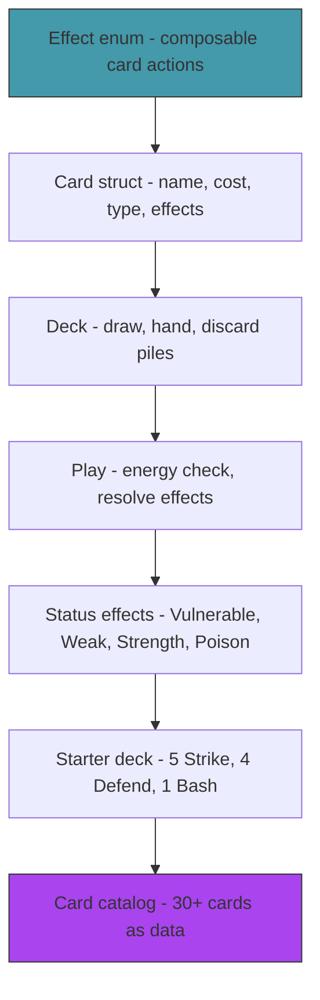

# Act 1 — The Cards

> *A card is not just a name and a number. It's a type, a cost, a list of effects, a rarity, and a target. Getting the data model right now means every card you add later is just data — no new code. In this act you build the card system that powers everything else.*


**Project location:** `~/juk/baraja/`

---

## Stage 1 — The Deck Box

> *Difficulty: Very Easy — The Card struct and the enums that describe it.*

*~35 min*

Before you can shuffle, draw, or play, you need to define what a card *is*. This stage builds the data types — card type, rarity, target — that every card in the game will use.

> [!tip] What You'll Learn
> - `cargo new` and project setup
> - Enums for card classification (type, rarity, target)
> - The `Card` struct with serde serialization
> - How Rust modules connect files to your project
> - Why data-driven design matters for card games

### Why data-driven?

In a naive implementation, each card is a function: `fn strike(target) { target.hp -= 6; }`. Adding a new card means writing new code. In a data-driven design, each card is a *struct* with a list of effects. Adding a new card means adding data — no new functions, no new match arms, no recompilation.

This is how real card games are built. Slay the Spire's cards are defined in JSON files. Hearthstone's cards are database entries. The engine interprets the data.

> [!note] Python comparison
> In Python you'd model a card as a dictionary or a dataclass: `@dataclass class Card: name: str; cost: int; ...`. Rust's `struct` is the same idea, but with compile-time type checking — you can't accidentally put a string where an integer belongs.

### 1.1 — Create the project

```bash
cd ~/juk
cargo new baraja --edition 2024
cd baraja
```

Open `Cargo.toml` and add dependencies:

```toml
[dependencies]
serde = { version = "1", features = ["derive"] }
serde_json = "1"
rand = "0.8"
```

Run `cargo build` to download and compile dependencies. This takes a minute the first time — Rust compiles everything from source.

### 1.2 — Card types

Create `src/card.rs`:

```rust
use serde::{Deserialize, Serialize};

/// What kind of card is this?
#[derive(Debug, Clone, Copy, PartialEq, Serialize, Deserialize)]
pub enum CardType {
    Attack,  // deals damage
    Skill,   // defensive or utility
    Power,   // permanent buff (played once, stays in effect)
}

/// How rare is this card?
#[derive(Debug, Clone, Copy, PartialEq, Serialize, Deserialize)]
pub enum Rarity {
    Starter,    // in your starting deck
    Common,     // appears frequently as rewards
    Uncommon,   // appears less often
    Rare,       // powerful, appears rarely
}

/// Who does this card target?
#[derive(Debug, Clone, Copy, PartialEq, Serialize, Deserialize)]
pub enum Target {
    SingleEnemy,  // pick one enemy
    AllEnemies,   // hits everything
    Player,       // affects yourself (block, draw, etc.)
    None,         // no target (powers, some skills)
}
```

Three enums, each with `Copy` (they're small, no heap data) and serde derives. These classify every card in the game.

### Concept: The Rust Module System

You just created `src/card.rs`, but Rust doesn't know about it yet. Unlike Python, where any `.py` file in a package is automatically importable, Rust requires you to **declare** modules explicitly.

Add this to the top of `src/main.rs`:

```rust
mod card;
```

This tells the compiler: "there's a module called `card`, and its code lives in `src/card.rs`." Without this line, your `card.rs` file is invisible — it won't be compiled at all.

To use types from `card.rs` in `main.rs`:

```rust
use card::{Card, CardType, Rarity, Target};
```

`mod` declares the module (connects the file). `use` imports specific items from it. You need both.

> [!warning] Common Mistake: Forgetting `mod`
> If you create `src/card.rs` but forget `mod card;` in `main.rs`, you'll get:
> ```
> error[E0432]: unresolved import `card`
>  --> src/main.rs:2:5
>   |
> 2 | use card::Card;
>   |     ^^^^ maybe a missing crate `card`?
> ```
> The fix: add `mod card;` before the `use` line. Every `.rs` file needs a corresponding `mod` declaration in its parent.

Also note: everything in `card.rs` that you want to use from other files must be marked `pub`. Without `pub`, items are private to their module.

### 1.3 — The Card struct

Still in `src/card.rs`, add the struct below the enums. We reference `Effect` from a module we'll create in Stage 2, so for now use a placeholder:

```rust
/// A card definition — immutable template.
#[derive(Debug, Clone, Serialize, Deserialize)]
pub struct Card {
    pub name: String,
    pub card_type: CardType,
    pub rarity: Rarity,
    pub cost: i32,        // energy cost to play
    pub target: Target,
    pub description: String,   // human-readable effect text
    pub upgraded: bool,
}
```

We'll add the `effects: Vec<Effect>` field in Stage 2 once the `Effect` enum exists. For now, the card holds its metadata.

> [!note] Python comparison — `String` vs `&str`
> In Python, strings are just `str` — one type, always. Rust has two:
> - `String` — owned, heap-allocated, can grow. Like Python's `str`.
> - `&str` — a borrowed reference to string data. Like a read-only view.
>
> The `Card` struct uses `String` because it *owns* its name and description. When you pass `"Strike"` (a `&str` literal) to a function that expects `String`, you call `.to_string()` to convert it.

Add a constructor:

```rust
impl Card {
    pub fn new(
        name: &str, card_type: CardType, rarity: Rarity,
        cost: i32, target: Target, description: &str,
    ) -> Self {
        Card {
            name: name.to_string(), card_type, rarity, cost, target,
            description: description.to_string(), upgraded: false,
        }
    }
}
```

The constructor takes `&str` parameters (convenient for callers passing string literals) and converts them to owned `String` values. This is a common Rust pattern — accept borrows, store owned data.

### Try it yourself

Create a `Card` in `main.rs`, serialize it to JSON with `serde_json::to_string_pretty`, and print the result. You'll need:
- `mod card;` and `use card::*;` at the top
- `serde_json::to_string_pretty(&my_card)` returns a `Result<String, _>` — use `.unwrap()` for now (we'll replace this with proper error handling in Stage 4)

When you're ready, compare with the solution below.

<details>
<summary>Solution</summary>

```rust
mod card;

use card::*;

fn main() {
    let strike = Card::new(
        "Strike", CardType::Attack, Rarity::Starter,
        1, Target::SingleEnemy, "Deal 6 damage.",
    );

    let json = serde_json::to_string_pretty(&strike).unwrap();
    println!("{}", json);
}
```

Output:
```json
{
  "name": "Strike",
  "card_type": "Attack",
  "rarity": "Starter",
  "cost": 1,
  "target": "SingleEnemy",
  "description": "Deal 6 damage.",
  "upgraded": false
}
```

</details>

> [!tip] Extend it
> Add a `Display` implementation for `Card` that prints a one-line summary like `Strike (Attack, Cost 1) — Deal 6 damage.` Use `impl std::fmt::Display for Card` with `fn fmt(&self, f: &mut std::fmt::Formatter) -> std::fmt::Result`. Then print your card with `println!("{}", strike);` instead of the JSON.

> [!check] Checkpoint
> Your project compiles. You can create a `Card`, serialize it to JSON, and see all fields. You understand `mod` vs `use` and `String` vs `&str`. Stage 1 complete.


---

## Stage 2 — The Effect System

> *Difficulty: Medium — Enums with data that describe what cards do.*

*~60 min*

This is the most important stage in the course. The `Effect` enum defines every possible thing a card can do — deal damage, gain block, draw cards, apply a status. Effects compose: a single card can have multiple effects. This is Rust enums at their most powerful.

> [!tip] What You'll Learn
> - Enums with data — `Damage(i32)`, `ApplyStatus(StatusType, i32)`
> - Composable effects — a card is a `Vec<Effect>`
> - Why this design scales (adding a new effect = adding one enum variant)
> - `#[test]` and `cargo test` — your first Rust tests

### Concept: Enums with Data

In Python, enums are just named constants: `class CardType(Enum): ATTACK = 1`. Rust enums can carry *data* — each variant can hold different types and amounts of data. This is closer to a Python tagged union or a TypeScript discriminated union.

```python
# Python — you'd use a dict or a class hierarchy:
{"type": "damage", "amount": 6}
{"type": "apply_status", "status": "vulnerable", "stacks": 2}

# Rust — the compiler enforces the shape:
Effect::Damage(6)
Effect::ApplyStatus(StatusType::Vulnerable, 2)
```

The Rust version is type-safe — you can't accidentally pass a string where an integer belongs, and `match` forces you to handle every variant.

### 2.1 — The Effect enum

Create `src/effect.rs` and add `mod effect;` to `main.rs`:

```rust
use serde::{Deserialize, Serialize};

/// A status effect type.
#[derive(Debug, Clone, Copy, PartialEq, Serialize, Deserialize)]
pub enum StatusType {
    Vulnerable,  // take 50% more damage (lasts N turns)
    Weak,        // deal 25% less damage (lasts N turns)
    Strength,    // deal +N more damage (permanent)
    Poison,      // take N damage at turn start, decreases by 1
    Block,       // absorb damage (resets each turn)
    Ritual,      // gain N strength at end of turn (permanent)
}

/// A single effect that a card (or enemy action) can produce.
#[derive(Debug, Clone, Serialize, Deserialize)]
pub enum Effect {
    /// Deal damage to the target.
    Damage(i32),
    /// Deal damage to ALL enemies.
    DamageAll(i32),
    /// Gain block (absorbs damage).
    Block(i32),
    /// Draw N cards from the draw pile.
    DrawCards(i32),
    /// Gain N energy this turn.
    GainEnergy(i32),
    /// Apply a status effect with N stacks/turns.
    ApplyStatus(StatusType, i32),
    /// Apply a status to yourself.
    ApplySelfStatus(StatusType, i32),
    /// Exhaust this card (remove from deck for the rest of combat).
    Exhaust,
    /// Deal damage N times.
    DamageMulti(i32, i32), // (damage_per_hit, times)
}
```

Each variant carries exactly the data it needs. `Damage(6)` means "deal 6 damage." `ApplyStatus(Vulnerable, 2)` means "apply 2 turns of Vulnerable." No stringly-typed nonsense, no dictionaries — the compiler enforces that every effect has the right data.

Notice `Effect` derives `Clone` but not `Copy`. Why? `Copy` requires all fields to be trivially copyable. Most variants are just integers (`Copy`-able), but the enum as a whole could grow to include heap data later. `Clone` is the safe choice — it works for everything and makes the intent explicit.

### 2.2 — Describing effects

Try implementing a `description` method on `Effect` yourself. It should return a `String` describing the effect in human-readable text. Use `match` on `self` — you'll need one arm per variant.

Here are the expected outputs:
- `Effect::Damage(6)` → `"Deal 6 damage"`
- `Effect::Block(5)` → `"Gain 5 block"`
- `Effect::ApplyStatus(StatusType::Vulnerable, 2)` → `"Apply 2 Vulnerable"`
- `Effect::DamageMulti(3, 4)` → `"Deal 3 damage 4 times"`

<details>
<summary>Solution</summary>

```rust
impl Effect {
    /// Describe this effect as human-readable text.
    pub fn description(&self) -> String {
        match self {
            Effect::Damage(n) => format!("Deal {} damage", n),
            Effect::DamageAll(n) => format!("Deal {} damage to ALL enemies", n),
            Effect::Block(n) => format!("Gain {} block", n),
            Effect::DrawCards(n) => format!("Draw {} card(s)", n),
            Effect::GainEnergy(n) => format!("Gain {} energy", n),
            Effect::ApplyStatus(status, n) => format!("Apply {} {:?}", n, status),
            Effect::ApplySelfStatus(status, n) => format!("Gain {} {:?}", n, status),
            Effect::Exhaust => "Exhaust".to_string(),
            Effect::DamageMulti(dmg, times) => format!("Deal {} damage {} times", dmg, times),
        }
    }
}
```

</details>

We'll implement the actual resolution (applying effects to game state) in Act 2 when we have enemies and combat. For now, effects are just data.

### 2.3 — Wire effects into Card

Now update `src/card.rs` to include effects. Add the import and the field:

```rust
use crate::effect::Effect;

#[derive(Debug, Clone, Serialize, Deserialize)]
pub struct Card {
    pub name: String,
    pub card_type: CardType,
    pub rarity: Rarity,
    pub cost: i32,
    pub target: Target,
    pub effects: Vec<Effect>,  // what happens when played
    pub description: String,
    pub upgraded: bool,
}

impl Card {
    pub fn new(
        name: &str, card_type: CardType, rarity: Rarity,
        cost: i32, target: Target, effects: Vec<Effect>, description: &str,
    ) -> Self {
        Card {
            name: name.to_string(), card_type, rarity, cost, target, effects,
            description: description.to_string(), upgraded: false,
        }
    }
}
```

Note `crate::effect::Effect` — `crate` means "the root of this project." It's how modules reference each other.

### 2.4 — Example cards

```rust
use crate::card::*;
use crate::effect::*;

// Strike: Deal 6 damage. Cost 1.
Card::new("Strike", CardType::Attack, Rarity::Starter, 1, Target::SingleEnemy,
    vec![Effect::Damage(6)], "Deal 6 damage.");

// Bash: Deal 8 damage. Apply 2 Vulnerable. Cost 2.
Card::new("Bash", CardType::Attack, Rarity::Starter, 2, Target::SingleEnemy,
    vec![Effect::Damage(8), Effect::ApplyStatus(StatusType::Vulnerable, 2)],
    "Deal 8 damage. Apply 2 Vulnerable.");

// Shrug It Off: Gain 8 block. Draw 1 card. Cost 1.
Card::new("Shrug It Off", CardType::Skill, Rarity::Common, 1, Target::Player,
    vec![Effect::Block(8), Effect::DrawCards(1)],
    "Gain 8 block. Draw 1 card.");
```

Each card is just a struct with a `Vec<Effect>`. Bash has two effects — damage AND apply vulnerable. Shrug It Off has two effects — block AND draw. The engine resolves them in order.

### Concept: Your First Rust Tests

Rust has a built-in test framework — no external library needed. Tests live in the same file as the code they test, inside a `#[cfg(test)]` block. This block is only compiled when you run `cargo test`, so it adds zero overhead to your release binary.

Add this to the bottom of `src/effect.rs`:

```rust
#[cfg(test)]
mod tests {
    use super::*;

    #[test]
    fn test_damage_description() {
        let effect = Effect::Damage(6);
        assert_eq!(effect.description(), "Deal 6 damage");
    }

    #[test]
    fn test_multi_effect_descriptions() {
        let effects = vec![
            Effect::Damage(8),
            Effect::ApplyStatus(StatusType::Vulnerable, 2),
        ];
        let descriptions: Vec<String> = effects.iter().map(|e| e.description()).collect();
        assert_eq!(descriptions[0], "Deal 8 damage");
        assert_eq!(descriptions[1], "Apply 2 Vulnerable");
    }
}
```

Run them:

```bash
cargo test
```

You should see:

```
running 2 tests
test effect::tests::test_damage_description ... ok
test effect::tests::test_multi_effect_descriptions ... ok
```

You can also run a specific test by name:

```bash
cargo test test_damage_description
```

> [!warning] Common Mistake: Hardcoding card behavior in functions
> If `strike()` is a function and `bash()` is a different function, adding 30 cards means 30 functions. With the `Effect` enum, adding a card is one `Card::new(...)` call. The engine handles all effects generically.
>
> The temptation is strong — "I'll just write a quick function for this card." Resist it. The data-driven approach pays off the moment you have more than 5 cards.

> [!tip] Extend it
> Add a `total_damage` method to `Effect` that returns the total damage an effect deals (0 for non-damage effects, `damage * times` for `DamageMulti`). Write a test for it. Then write a function `fn card_total_damage(card: &Card) -> i32` that sums the total damage across all of a card's effects.

> [!check] Checkpoint
> Define Strike, Defend, and Bash using the `Effect` enum. Your tests pass with `cargo test`. You understand enums with data and how `match` forces you to handle every variant. Stage 2 complete.


---

## Stage 3 — The Deck

> *Difficulty: Easy — Draw pile, hand, discard pile, and the shuffle cycle.*

*~50 min*

A deckbuilder has three piles: draw (face-down, you draw from here), hand (your current options), and discard (played cards go here). When the draw pile is empty, shuffle the discard pile into it. This cycle means you see every card in your deck roughly once per "shuffle cycle."

> [!tip] What You'll Learn
> - Three-pile deck structure
> - Shuffling with `rand`
> - Drawing cards (move from draw pile to hand)
> - The shuffle-on-empty mechanic
> - Ownership and `&mut self` — why Rust makes you think about who owns the cards

### Concept: Ownership and the Deck

Here's where Rust starts to feel different from Python. In Python, you can put the same card object in multiple lists — they're all references to the same thing. In Rust, a value has **one owner**. When a card moves from the draw pile to the hand, it literally *moves* — it's removed from one `Vec` and added to another. It can't be in both.

This is actually perfect for a card game. A physical card can only be in one pile at a time. Rust's ownership model enforces the same rule at compile time — you can't accidentally have a card in both the draw pile and the hand.

### 3.1 — The Deck struct

Create `src/deck.rs` and add `mod deck;` to `main.rs`:

```rust
use crate::card::Card;
use rand::seq::SliceRandom;
use rand::thread_rng;

pub struct Deck {
    pub draw_pile: Vec<Card>,
    pub hand: Vec<Card>,
    pub discard: Vec<Card>,
    pub exhaust: Vec<Card>, // permanently removed cards
}

impl Deck {
    /// Create a deck from a list of cards. All start in the draw pile, shuffled.
    pub fn new(cards: Vec<Card>) -> Self {
        let mut draw_pile = cards;
        draw_pile.shuffle(&mut thread_rng());
        Deck {
            draw_pile,
            hand: Vec::new(),
            discard: Vec::new(),
            exhaust: Vec::new(),
        }
    }

    /// Draw N cards from the draw pile into the hand.
    /// If the draw pile runs out, shuffle the discard pile into it.
    pub fn draw(&mut self, count: i32) {
        for _ in 0..count {
            if self.draw_pile.is_empty() {
                if self.discard.is_empty() {
                    return; // nothing left to draw
                }
                // Shuffle discard into draw pile
                self.draw_pile.append(&mut self.discard);
                self.draw_pile.shuffle(&mut thread_rng());
            }
            if let Some(card) = self.draw_pile.pop() {
                self.hand.push(card);
            }
        }
    }

    /// Discard a card from the hand by index.
    pub fn discard_from_hand(&mut self, index: usize) -> Option<Card> {
        if index < self.hand.len() {
            Some(self.hand.remove(index))
        } else {
            None
        }
    }

    /// Discard the entire hand (end of turn).
    pub fn discard_hand(&mut self) {
        self.discard.append(&mut self.hand);
    }

    /// Total cards in the deck (all piles).
    pub fn total_cards(&self) -> usize {
        self.draw_pile.len() + self.hand.len() + self.discard.len() + self.exhaust.len()
    }
}
```

Notice `&mut self` on methods that modify the deck. Rust distinguishes between:
- `&self` — read-only borrow (you can look at the deck)
- `&mut self` — mutable borrow (you can modify the deck)
- `self` — takes ownership (consumes the deck)

`draw()` needs `&mut self` because it moves cards between piles. `total_cards()` only reads, so it takes `&self`.

> [!note] Python comparison
> In Python, every method gets `self` and can modify anything. Rust makes you declare your intent: "this method reads" vs "this method writes." The compiler enforces it — if you try to call a `&mut self` method through a shared reference, you get an error.

The key mechanic: when the draw pile is empty, the discard pile gets shuffled and becomes the new draw pile. This means:
- You see every card roughly once per cycle
- Adding cards to your deck dilutes it (each card appears less often)
- Removing cards concentrates it (your best cards appear more often)

This is why "deck thinning" (removing weak cards) is a core strategy in deckbuilders.

### 3.2 — Test the deck

Write tests for the deck. The tricky part: shuffling is random, so you can't assert exact card order. Test *properties* instead — counts, totals, the shuffle-on-empty behavior.

Try writing these tests yourself in `src/deck.rs`:

1. Create a deck with 10 cards. Assert `total_cards() == 10` and `draw_pile.len() == 10`.
2. Draw 5. Assert `hand.len() == 5` and `draw_pile.len() == 5`.
3. Discard hand. Assert `discard.len() == 5` and `hand.len() == 0`.
4. Draw 7 (more than the 5 remaining in draw pile). Assert the discard shuffles back in and `hand.len() == 7`.

<details>
<summary>Solution</summary>

```rust
#[cfg(test)]
mod tests {
    use super::*;
    use crate::card::*;
    use crate::effect::*;

    fn make_test_card(name: &str) -> Card {
        Card::new(name, CardType::Attack, Rarity::Starter, 1,
            Target::SingleEnemy, vec![Effect::Damage(6)], "Test card.")
    }

    fn make_deck(n: usize) -> Deck {
        let cards: Vec<Card> = (0..n).map(|i| make_test_card(&format!("Card {}", i))).collect();
        Deck::new(cards)
    }

    #[test]
    fn test_new_deck_has_all_cards_in_draw_pile() {
        let deck = make_deck(10);
        assert_eq!(deck.total_cards(), 10);
        assert_eq!(deck.draw_pile.len(), 10);
        assert_eq!(deck.hand.len(), 0);
    }

    #[test]
    fn test_draw_moves_cards_to_hand() {
        let mut deck = make_deck(10);
        deck.draw(5);
        assert_eq!(deck.hand.len(), 5);
        assert_eq!(deck.draw_pile.len(), 5);
        assert_eq!(deck.total_cards(), 10);
    }

    #[test]
    fn test_discard_hand_moves_to_discard() {
        let mut deck = make_deck(10);
        deck.draw(5);
        deck.discard_hand();
        assert_eq!(deck.hand.len(), 0);
        assert_eq!(deck.discard.len(), 5);
    }

    #[test]
    fn test_draw_reshuffles_discard_when_draw_empty() {
        let mut deck = make_deck(10);
        deck.draw(5);
        deck.discard_hand(); // 5 in discard, 5 in draw
        deck.draw(7);        // draws 5 from draw, reshuffles 5 from discard, draws 2 more
        assert_eq!(deck.hand.len(), 7);
        assert_eq!(deck.total_cards(), 10); // no cards lost
    }
}
```

</details>

Run with `cargo test deck` to run only the deck tests.

> [!warning] Common Mistake: Using a value after moving it
> If you try to read `draw_pile` after calling `append(&mut self.discard)`, you might expect the discard pile to still have its old contents. It doesn't — `append` *moves* all elements out of `self.discard` into `self.draw_pile`, leaving `self.discard` empty. This is ownership in action.
>
> ```rust
> self.draw_pile.append(&mut self.discard);
> println!("{}", self.discard.len()); // prints 0, not the old length!
> ```
>
> In Python, `list.extend(other)` copies elements. In Rust, `Vec::append` moves them. The source vec is left empty.

> [!tip] Extend it
> Add a `peek_draw(&self, count: usize) -> Vec<&Card>` method that lets you look at the top N cards of the draw pile without removing them. This will be useful later for card-preview effects. Note the return type uses `&Card` (references) — you're borrowing, not moving.

> [!check] Checkpoint
> All deck tests pass. You understand ownership: cards move between piles, they can't be in two places at once. You understand `&mut self` vs `&self`. Stage 3 complete.


---

## Stage 4 — Playing a Card

> *Difficulty: Medium — Energy check, effect resolution, and the play cycle.*

*~55 min*

Drawing cards is passive. Playing them is where the game happens. This stage builds the play logic: check if you have enough energy, resolve each effect in order, move the card to the discard pile (or exhaust pile if it has `Exhaust`). This is also where we introduce proper error handling.

> [!tip] What You'll Learn
> - Energy as a resource (3 per turn, spent by playing cards)
> - Resolving a `Vec<Effect>` in sequence
> - `Result<T, E>` and the `?` operator — replacing `.unwrap()`
> - Why effect resolution order matters

### 4.1 — Player state

Create `src/player.rs` and add `mod player;` to `main.rs`:

```rust
pub struct Player {
    pub hp: i32,
    pub max_hp: i32,
    pub block: i32,
    pub energy: i32,
    pub max_energy: i32,
    pub strength: i32,
    pub vulnerable: i32,  // turns remaining
    pub weak: i32,        // turns remaining
}

impl Player {
    pub fn new(max_hp: i32) -> Self {
        Player {
            hp: max_hp, max_hp, block: 0,
            energy: 3, max_energy: 3,
            strength: 0, vulnerable: 0, weak: 0,
        }
    }

    /// Take damage (reduced by block first).
    pub fn take_damage(&mut self, mut amount: i32) {
        if self.vulnerable > 0 {
            amount = (amount as f32 * 1.5) as i32;
        }
        if self.block > 0 {
            if self.block >= amount {
                self.block -= amount;
                return;
            }
            amount -= self.block;
            self.block = 0;
        }
        self.hp = (self.hp - amount).max(0);
    }

    /// Calculate outgoing damage (modified by strength and weak).
    pub fn calc_damage(&self, base: i32) -> i32 {
        let mut dmg = base + self.strength;
        if self.weak > 0 {
            dmg = (dmg as f32 * 0.75) as i32;
        }
        dmg.max(0)
    }

    /// Start of turn: reset energy, reset block, tick statuses.
    pub fn start_turn(&mut self) {
        self.energy = self.max_energy;
        self.block = 0;
        if self.vulnerable > 0 { self.vulnerable -= 1; }
        if self.weak > 0 { self.weak -= 1; }
    }
}
```

Block resets every turn — this is a core StS mechanic. You can't stockpile block across turns (without specific relics). This forces you to make defensive decisions every turn.

### Concept: Error Handling with `Result`

Up to now we've used `.unwrap()` — which panics (crashes) if something goes wrong. That's fine for quick tests, but real code should handle errors gracefully.

Rust uses `Result<T, E>` instead of exceptions:

```rust
// Python: raise ValueError("not enough energy")
// Rust:   return Err(PlayError::NotEnoughEnergy)
```

```rust
enum Result<T, E> {
    Ok(T),    // success, carrying a value
    Err(E),   // failure, carrying an error
}
```

The `?` operator is the magic: it unwraps `Ok` values and returns `Err` values early. It replaces the `try/except` pattern:

```python
# Python
try:
    result = do_something()
except SomeError as e:
    return handle(e)
```

```rust
// Rust — the ? does the same thing in one character
let result = do_something()?;
```

### 4.2 — Play errors

Define what can go wrong when playing a card:

```rust
use std::fmt;

#[derive(Debug)]
pub enum PlayError {
    NotEnoughEnergy { cost: i32, available: i32 },
    InvalidTarget,
    CardNotInHand,
}

impl fmt::Display for PlayError {
    fn fmt(&self, f: &mut fmt::Formatter<'_>) -> fmt::Result {
        match self {
            PlayError::NotEnoughEnergy { cost, available } =>
                write!(f, "Not enough energy: card costs {} but you have {}", cost, available),
            PlayError::InvalidTarget => write!(f, "Invalid target for this card"),
            PlayError::CardNotInHand => write!(f, "Card not found in hand"),
        }
    }
}
```

### 4.3 — Play a card

Now implement the play function. It returns `Result<(), PlayError>` — success carries no data (`()`), failure carries a `PlayError`.

Try implementing this yourself. The function should:
1. Check if the player has enough energy. Return `Err(PlayError::NotEnoughEnergy { ... })` if not.
2. Subtract the energy cost.
3. Iterate through `card.effects` and apply each one (for now, just handle `Damage`, `Block`, `GainEnergy`, and `Exhaust` — we'll handle the rest in Act 2).
4. Return `Ok(())`.

<details>
<summary>Solution</summary>

```rust
/// Play a card, resolving its effects.
pub fn play_card(
    card: &Card,
    player: &mut Player,
    // We'll add enemy parameters in Act 2
) -> Result<(), PlayError> {
    if player.energy < card.cost {
        return Err(PlayError::NotEnoughEnergy {
            cost: card.cost,
            available: player.energy,
        });
    }

    player.energy -= card.cost;

    for effect in &card.effects {
        match effect {
            Effect::Block(amount) => {
                player.block += amount;
            }
            Effect::GainEnergy(n) => {
                player.energy += n;
            }
            // Damage effects need an enemy target — we'll wire this in Act 2
            Effect::Damage(_) | Effect::DamageAll(_) | Effect::DamageMulti(_, _) => {
                // TODO: resolve against enemy target in Act 2
            }
            Effect::ApplyStatus(_, _) | Effect::ApplySelfStatus(_, _) => {
                // TODO: resolve status effects in Act 2
            }
            Effect::DrawCards(_) => {
                // TODO: wire to deck.draw() in Act 2
            }
            Effect::Exhaust => {
                // Handled by caller — move to exhaust pile instead of discard
            }
        }
    }

    Ok(())
}
```

</details>

> [!warning] Common Mistake: Resolving effects in the wrong order
> "Deal 8 damage. Apply Vulnerable" is different from "Apply Vulnerable. Deal 8 damage" — the second version would deal 12 damage (50% bonus from Vulnerable). Effects resolve left to right, so the card definition order matters.
>
> This is a real bug in card game implementations. If you accidentally apply Vulnerable before dealing damage on Bash, the damage is wrong. The `Vec<Effect>` order is the source of truth.

### 4.4 — Test play logic

```rust
#[cfg(test)]
mod tests {
    use super::*;
    use crate::card::*;
    use crate::effect::*;

    #[test]
    fn test_play_card_spends_energy() {
        let mut player = Player::new(80);
        let defend = Card::new("Defend", CardType::Skill, Rarity::Starter, 1,
            Target::Player, vec![Effect::Block(5)], "Gain 5 block.");

        let result = play_card(&defend, &mut player);
        assert!(result.is_ok());
        assert_eq!(player.energy, 2); // 3 - 1
        assert_eq!(player.block, 5);
    }

    #[test]
    fn test_play_card_not_enough_energy() {
        let mut player = Player::new(80);
        player.energy = 0;
        let strike = Card::new("Strike", CardType::Attack, Rarity::Starter, 1,
            Target::SingleEnemy, vec![Effect::Damage(6)], "Deal 6 damage.");

        let result = play_card(&strike, &mut player);
        assert!(result.is_err());
    }
}
```

> [!note] From now on: use `Result` and `?`
> Every function that can fail should return `Result`. When you see `.unwrap()` in later stages, it should have a comment: `// TODO: replace with ? in Stage N`. We'll progressively eliminate unwraps as the codebase grows.

> [!tip] Extend it
> Add a `play_card_from_hand` function that takes a `&mut Deck`, a hand index, and a `&mut Player`. It should remove the card from the hand, call `play_card`, and move the card to either the discard pile or the exhaust pile (if the card has `Effect::Exhaust`). Return `Result<(), PlayError>` — return `Err(PlayError::CardNotInHand)` if the index is out of bounds.

> [!check] Checkpoint
> Playing a card spends energy and resolves effects. Insufficient energy returns an error instead of panicking. Tests pass. You understand `Result`, `Err`, and why `.unwrap()` is a development shortcut. Stage 4 complete.


---

## Stage 5 — Status Effects

> *Difficulty: Medium — Vulnerable, Weak, Strength, Poison — the modifiers that make combat deep.*

*~60 min*

Raw damage and block are boring. Status effects create strategy: Vulnerable makes the enemy take 50% more damage for 2 turns, so you play Bash *before* your big attacks. Weak reduces the enemy's damage by 25%, buying you time. Strength permanently increases your damage. These interactions are what make deckbuilders strategic.

> [!tip] What You'll Learn
> - Status effects as turn-based counters
> - Multiplicative vs additive modifiers
> - Ticking and expiring statuses at turn boundaries
> - Extracting shared behavior into a standalone struct

### 5.1 — Status tracking

Both players and enemies will track statuses. Rather than duplicating fields on both, extract a shared struct. Create this in `src/effect.rs` (it uses `StatusType` from the same file):

```rust
#[derive(Debug, Clone)]
pub struct StatusEffects {
    pub vulnerable: i32,  // turns remaining
    pub weak: i32,        // turns remaining
    pub strength: i32,    // permanent stacks
    pub poison: i32,      // damage per turn, decreases by 1
    pub ritual: i32,      // gain N strength per turn
}

impl StatusEffects {
    pub fn new() -> Self {
        StatusEffects { vulnerable: 0, weak: 0, strength: 0, poison: 0, ritual: 0 }
    }

    /// Apply a status effect.
    pub fn apply(&mut self, status: StatusType, stacks: i32) {
        match status {
            StatusType::Vulnerable => self.vulnerable += stacks,
            StatusType::Weak => self.weak += stacks,
            StatusType::Strength => self.strength += stacks,
            StatusType::Poison => self.poison += stacks,
            StatusType::Ritual => self.ritual += stacks,
            StatusType::Block => {} // handled separately
        }
    }

    /// Tick statuses at end of turn. Returns poison damage dealt.
    pub fn end_of_turn(&mut self) -> i32 {
        let poison_damage = self.poison;
        if self.poison > 0 { self.poison -= 1; }
        if self.vulnerable > 0 { self.vulnerable -= 1; }
        if self.weak > 0 { self.weak -= 1; }
        if self.ritual > 0 { self.strength += self.ritual; }
        poison_damage
    }
}
```

### 5.2 — Damage calculation with statuses

Now implement the standalone damage calculation function. This replaces the simpler `calc_damage` on `Player` — it takes attacker and defender statuses as parameters so it works for both player-attacks-enemy and enemy-attacks-player.

Try implementing this yourself. The formula is:
1. Start with `base + attacker.strength`
2. If attacker is Weak, multiply by 0.75
3. If defender is Vulnerable, multiply by 1.5
4. Floor at 0 (damage can't be negative)

<details>
<summary>Solution</summary>

```rust
/// Calculate outgoing damage with status modifiers.
pub fn calc_damage(base: i32, attacker: &StatusEffects, defender: &StatusEffects) -> i32 {
    let mut dmg = base + attacker.strength;

    // Weak: attacker deals 25% less
    if attacker.weak > 0 {
        dmg = (dmg as f32 * 0.75) as i32;
    }

    // Vulnerable: defender takes 50% more
    if defender.vulnerable > 0 {
        dmg = (dmg as f32 * 1.5) as i32;
    }

    dmg.max(0)
}
```

</details>

The damage formula: `(base + strength) × weak_modifier × vulnerable_modifier`. Strength is additive (applied first), Weak and Vulnerable are multiplicative (applied after). This ordering matters — it's how StS calculates damage.

> [!warning] Common Mistake: Integer truncation with `as`
> `(7.5 as f32) as i32` gives `7`, not `8`. Rust truncates toward zero when casting float to int. This matches StS behavior (damage rounds down), but if you expected rounding, you'd need `.round() as i32`.
>
> ```rust
> let dmg = 5; // base damage
> let weak_dmg = (dmg as f32 * 0.75) as i32; // 3.75 → 3, not 4
> ```
>
> This is a real source of off-by-one bugs in card game implementations. Know your rounding rules.

### 5.3 — Test interactions

```rust
#[cfg(test)]
mod status_tests {
    use super::*;

    #[test]
    fn test_vulnerable_increases_damage() {
        let attacker = StatusEffects::new();
        let mut defender = StatusEffects::new();
        defender.vulnerable = 2;

        assert_eq!(calc_damage(6, &attacker, &defender), 9); // 6 × 1.5 = 9
    }

    #[test]
    fn test_weak_reduces_damage() {
        let mut attacker = StatusEffects::new();
        attacker.weak = 2;
        let defender = StatusEffects::new();

        assert_eq!(calc_damage(8, &attacker, &defender), 6); // 8 × 0.75 = 6
    }

    #[test]
    fn test_strength_adds_to_base() {
        let mut attacker = StatusEffects::new();
        attacker.strength = 3;
        let defender = StatusEffects::new();

        assert_eq!(calc_damage(6, &attacker, &defender), 9); // 6 + 3 = 9
    }

    #[test]
    fn test_bash_then_strike_combo() {
        // Bash (8 damage + 2 Vulnerable) followed by Strike (6 damage)
        // Without Vulnerable: 8 + 6 = 14 total
        // With Vulnerable: 8 + 9 (6 × 1.5) = 17 total
        let attacker = StatusEffects::new();
        let mut defender = StatusEffects::new();

        let bash_dmg = calc_damage(8, &attacker, &defender);
        assert_eq!(bash_dmg, 8);

        defender.vulnerable = 2; // Bash applied Vulnerable

        let strike_dmg = calc_damage(6, &attacker, &defender);
        assert_eq!(strike_dmg, 9); // 6 × 1.5 = 9
    }

    #[test]
    fn test_poison_ticks_and_decreases() {
        let mut statuses = StatusEffects::new();
        statuses.poison = 3;

        let dmg1 = statuses.end_of_turn();
        assert_eq!(dmg1, 3);
        assert_eq!(statuses.poison, 2);

        let dmg2 = statuses.end_of_turn();
        assert_eq!(dmg2, 2);
        assert_eq!(statuses.poison, 1);
    }

    #[test]
    fn test_ritual_grants_strength() {
        let mut statuses = StatusEffects::new();
        statuses.ritual = 2;

        statuses.end_of_turn();
        assert_eq!(statuses.strength, 2);

        statuses.end_of_turn();
        assert_eq!(statuses.strength, 4); // cumulative
    }
}
```

> [!note] Why this creates strategy
> Without status effects, the optimal play is always "play your highest damage cards." With Vulnerable, the optimal play is "apply Vulnerable first, then play damage cards." With Weak, the optimal play changes based on whether you're attacking or defending this turn. Status effects create *sequencing decisions* — the order you play cards matters.

### 5.4 — Refactor Player to use StatusEffects

Now update `Player` in `src/player.rs` to use the shared `StatusEffects` struct instead of individual fields:

```rust
use crate::effect::StatusEffects;

pub struct Player {
    pub hp: i32,
    pub max_hp: i32,
    pub block: i32,
    pub energy: i32,
    pub max_energy: i32,
    pub statuses: StatusEffects,
}

impl Player {
    pub fn new(max_hp: i32) -> Self {
        Player {
            hp: max_hp, max_hp, block: 0,
            energy: 3, max_energy: 3,
            statuses: StatusEffects::new(),
        }
    }

    pub fn take_damage(&mut self, amount: i32) {
        let mut dmg = amount;
        if self.block > 0 {
            if self.block >= dmg { self.block -= dmg; return; }
            dmg -= self.block;
            self.block = 0;
        }
        self.hp = (self.hp - dmg).max(0);
    }

    pub fn start_turn(&mut self) {
        self.energy = self.max_energy;
        self.block = 0;
    }
}
```

The `take_damage` method no longer checks Vulnerable directly — that's handled by `calc_damage()` before calling this method. Separation of concerns: `calc_damage` computes the number, `take_damage` applies it.

> [!tip] Extend it
> Add a `has_debuffs(&self) -> bool` method to `StatusEffects` that returns `true` if the entity has any negative statuses (Vulnerable, Weak, or Poison > 0). Write a test for it. This will be useful later for conditional card effects like "deal extra damage if the enemy has a debuff."

> [!check] Checkpoint
> Vulnerable increases incoming damage by 50%. Weak reduces outgoing damage by 25%. Strength adds flat damage. Poison ticks and decreases. Ritual grants cumulative Strength. All tests pass. Stage 5 complete.


---

## Stage 6 — The Starter Deck

> *Difficulty: Easy — The 10 cards every run begins with.*

*~35 min*

Every Slay the Spire run starts with the same deck: 5 Strikes, 4 Defends, 1 Bash. It's deliberately mediocre — strong enough to beat early enemies, weak enough that you need to improve it. This stage defines the starter deck and tests a full draw-play-discard cycle.

> [!tip] What You'll Learn
> - Defining cards as data (not code)
> - The starter deck composition and why it's balanced
> - A full manual combat test: draw → play → discard → draw again

### 6.1 — Card definitions

Create `src/cards.rs` (plural — the catalog) and add `mod cards;` to `main.rs`:

```rust
use crate::card::*;
use crate::effect::*;

pub fn strike() -> Card {
    Card::new("Strike", CardType::Attack, Rarity::Starter, 1, Target::SingleEnemy,
        vec![Effect::Damage(6)], "Deal 6 damage.")
}

pub fn defend() -> Card {
    Card::new("Defend", CardType::Skill, Rarity::Starter, 1, Target::Player,
        vec![Effect::Block(5)], "Gain 5 block.")
}

pub fn bash() -> Card {
    Card::new("Bash", CardType::Attack, Rarity::Starter, 2, Target::SingleEnemy,
        vec![Effect::Damage(8), Effect::ApplyStatus(StatusType::Vulnerable, 2)],
        "Deal 8 damage. Apply 2 Vulnerable.")
}

pub fn starter_deck() -> Vec<Card> {
    let mut deck = Vec::new();
    for _ in 0..5 { deck.push(strike()); }
    for _ in 0..4 { deck.push(defend()); }
    deck.push(bash());
    deck
}
```

10 cards. 5 Strikes for damage, 4 Defends for survival, 1 Bash for the Vulnerable combo. With 3 energy per turn and 5 cards drawn, you can play 3 cards (all cost 1 except Bash which costs 2).

> [!warning] Common Mistake: `for item in vec` consumes the vec
> ```rust
> let cards = starter_deck();
> for card in cards {
>     println!("{}", card.name);
> }
> // ERROR: cards has been moved!
> println!("{}", cards.len()); // won't compile
> ```
> ```
> error[E0382]: borrow of moved value: `cards`
>   --> src/main.rs:6:20
>   |
> 3 | for card in cards {
>   |             ----- `cards` moved due to this implicit call to `.into_iter()`
> ...
> 6 | println!("{}", cards.len());
>   |                ^^^^^ value borrowed here after move
> ```
> `for card in cards` takes ownership of the vec and each card. After the loop, `cards` is gone. Use `for card in &cards` to borrow instead — each `card` will be a `&Card` reference, and `cards` survives the loop.

### 6.2 — Test the full cycle

Write a test that exercises the complete draw → play → discard → reshuffle cycle:

```rust
#[cfg(test)]
mod tests {
    use super::*;
    use crate::deck::Deck;

    #[test]
    fn test_starter_deck_has_10_cards() {
        let deck = starter_deck();
        assert_eq!(deck.len(), 10);
    }

    #[test]
    fn test_full_draw_play_discard_cycle() {
        let mut deck = Deck::new(starter_deck());

        // Turn 1: draw 5
        deck.draw(5);
        assert_eq!(deck.hand.len(), 5);
        assert_eq!(deck.draw_pile.len(), 5);

        // Play first card (move to discard)
        let card = deck.hand.remove(0);
        deck.discard.push(card);
        assert_eq!(deck.hand.len(), 4);

        // End turn: discard remaining hand
        deck.discard_hand();
        assert_eq!(deck.discard.len(), 5); // 1 played + 4 discarded
        assert_eq!(deck.hand.len(), 0);

        // Turn 2: draw 5 (uses remaining 5 in draw pile)
        deck.draw(5);
        assert_eq!(deck.hand.len(), 5);
        assert_eq!(deck.draw_pile.len(), 0);

        // Turn 3: draw 5 — triggers reshuffle from discard
        deck.discard_hand();
        deck.draw(5);
        assert_eq!(deck.hand.len(), 5);
        assert_eq!(deck.total_cards(), 10); // no cards lost
    }
}
```

> [!tip] Extend it
> Add a `deck_composition` function that takes a `&[Card]` and returns a summary string like `"5 Attack, 4 Skill, 1 Power"`. Use `.iter().filter()` to count each type. Write a test that verifies the starter deck is `"6 Attack, 4 Skill"` (5 Strikes + 1 Bash = 6 Attacks).

> [!check] Checkpoint
> The starter deck has 10 cards with the right composition. The full draw-play-discard-reshuffle cycle works. You understand `for item in vec` vs `for item in &vec`. Stage 6 complete.


---

## Stage 7 — Card Catalog

> *Difficulty: Medium — 30+ cards defined as data.*

*~55 min*

The starter deck is boring by design. The fun comes from card rewards — choosing new cards to add to your deck. This stage defines 30+ cards across all types and rarities, creating the pool that rewards draw from.

> [!tip] What You'll Learn
> - Designing cards with interesting effects and tradeoffs
> - Balancing cost vs power
> - Card synergies (cards that are better together)
> - Why variety matters for replayability

### 7.1 — Common cards

Add these to `src/cards.rs`. Try defining the first few yourself — pick a name, a cost, and a combination of effects. Then compare with the solutions.

For each card, think about: what's the tradeoff? A card that does two things (damage + block) does each one worse than a specialist card. A card that draws more cards costs energy now for options later.

<details>
<summary>Common card definitions</summary>

```rust
pub fn cleave() -> Card {
    Card::new("Cleave", CardType::Attack, Rarity::Common, 1, Target::AllEnemies,
        vec![Effect::DamageAll(8)], "Deal 8 damage to ALL enemies.")
}

pub fn iron_wave() -> Card {
    Card::new("Iron Wave", CardType::Attack, Rarity::Common, 1, Target::SingleEnemy,
        vec![Effect::Damage(5), Effect::Block(5)], "Deal 5 damage. Gain 5 block.")
}

pub fn pommel_strike() -> Card {
    Card::new("Pommel Strike", CardType::Attack, Rarity::Common, 1, Target::SingleEnemy,
        vec![Effect::Damage(9), Effect::DrawCards(1)], "Deal 9 damage. Draw 1 card.")
}

pub fn shrug_it_off() -> Card {
    Card::new("Shrug It Off", CardType::Skill, Rarity::Common, 1, Target::Player,
        vec![Effect::Block(8), Effect::DrawCards(1)], "Gain 8 block. Draw 1 card.")
}

pub fn anger() -> Card {
    Card::new("Anger", CardType::Attack, Rarity::Common, 0, Target::SingleEnemy,
        vec![Effect::Damage(6)], "Deal 6 damage. Add a copy to your discard pile.")
    // Note: the "add copy" effect would need a new Effect variant
}

pub fn armaments() -> Card {
    Card::new("Armaments", CardType::Skill, Rarity::Common, 1, Target::Player,
        vec![Effect::Block(5)], "Gain 5 block. Upgrade a card in your hand.")
}
```

</details>

### 7.2 — Uncommon cards

Uncommon cards are more powerful but have bigger tradeoffs:

```rust
pub fn inflame() -> Card {
    Card::new("Inflame", CardType::Power, Rarity::Uncommon, 1, Target::None,
        vec![Effect::ApplySelfStatus(StatusType::Strength, 2)], "Gain 2 Strength.")
}

pub fn battle_trance() -> Card {
    Card::new("Battle Trance", CardType::Skill, Rarity::Uncommon, 0, Target::Player,
        vec![Effect::DrawCards(3)], "Draw 3 cards. You can't draw additional cards this turn.")
}

pub fn carnage() -> Card {
    Card::new("Carnage", CardType::Attack, Rarity::Uncommon, 2, Target::SingleEnemy,
        vec![Effect::Damage(20)], "Deal 20 damage. Ethereal.")
}

pub fn disarm() -> Card {
    Card::new("Disarm", CardType::Skill, Rarity::Uncommon, 1, Target::SingleEnemy,
        vec![Effect::ApplyStatus(StatusType::Strength, -2), Effect::Exhaust],
        "Enemy loses 2 Strength. Exhaust.")
}

pub fn bloodletting() -> Card {
    Card::new("Bloodletting", CardType::Skill, Rarity::Uncommon, 0, Target::Player,
        vec![Effect::GainEnergy(2)], "Lose 3 HP. Gain 2 energy.")
}
```

### 7.3 — Rare cards

```rust
pub fn demon_form() -> Card {
    Card::new("Demon Form", CardType::Power, Rarity::Rare, 3, Target::None,
        vec![Effect::ApplySelfStatus(StatusType::Ritual, 2)],
        "At the end of each turn, gain 2 Strength.")
}

pub fn bludgeon() -> Card {
    Card::new("Bludgeon", CardType::Attack, Rarity::Rare, 3, Target::SingleEnemy,
        vec![Effect::Damage(32)], "Deal 32 damage.")
}

pub fn offering() -> Card {
    Card::new("Offering", CardType::Skill, Rarity::Rare, 0, Target::Player,
        vec![Effect::GainEnergy(2), Effect::DrawCards(3), Effect::Exhaust],
        "Lose 6 HP. Gain 2 energy. Draw 3 cards. Exhaust.")
}
```

### 7.4 — The card pool and rewards

```rust
pub fn all_cards() -> Vec<Card> {
    vec![
        // Common attacks
        cleave(), iron_wave(), pommel_strike(), anger(),
        // Common skills
        shrug_it_off(), armaments(),
        // Uncommon attacks
        carnage(),
        // Uncommon skills
        battle_trance(), disarm(), bloodletting(),
        // Uncommon powers
        inflame(),
        // Rare attacks
        bludgeon(),
        // Rare skills
        offering(),
        // Rare powers
        demon_form(),
    ]
}

/// Get N random card rewards, weighted by rarity.
pub fn random_rewards(count: usize) -> Vec<Card> {
    use rand::seq::SliceRandom;
    let pool = all_cards();
    let mut rng = rand::thread_rng();
    pool.choose_multiple(&mut rng, count.min(pool.len())).cloned().collect()
}
```

> [!note] Card design philosophy
> Good cards have tradeoffs. Offering is incredibly powerful (2 energy + 3 cards for free) but costs 6 HP and exhausts. Bloodletting gives energy but costs HP. Demon Form is game-winning but costs 3 energy (your entire turn). The best deckbuilders make every card choice a meaningful decision.

### 7.5 — Test the catalog

```rust
#[cfg(test)]
mod tests {
    use super::*;

    #[test]
    fn test_all_cards_nonempty() {
        let cards = all_cards();
        assert!(cards.len() >= 14, "Expected at least 14 cards, got {}", cards.len());
    }

    #[test]
    fn test_all_cards_have_effects() {
        for card in all_cards() {
            assert!(!card.effects.is_empty(),
                "Card '{}' has no effects", card.name);
        }
    }

    #[test]
    fn test_random_rewards_returns_requested_count() {
        let rewards = random_rewards(3);
        assert_eq!(rewards.len(), 3);
    }

    #[test]
    fn test_starter_cards_are_starter_rarity() {
        assert_eq!(strike().rarity, Rarity::Starter);
        assert_eq!(defend().rarity, Rarity::Starter);
        assert_eq!(bash().rarity, Rarity::Starter);
    }
}
```

> [!warning] Common Mistake: Numeric type mismatches
> If you write `count.min(pool.len())` and `count` is `usize` but you accidentally declared it as `u32` somewhere, you'll get:
> ```
> error[E0308]: mismatched types
>   --> src/cards.rs:80:26
>    |
> 80 |     pool.choose_multiple(&mut rng, count.min(pool.len()))
>    |                                    ^^^^^^^^^^^^^^^^^^^^^ expected `usize`, found `u32`
> ```
> Rust doesn't implicitly convert between numeric types. Use `count as usize` or better, declare `count: usize` from the start. Collection sizes in Rust are always `usize`.

> [!tip] Extend it
> Define 5 more cards of your own design. At least one should be a Power (permanent effect), and at least one should use `DamageMulti` (multi-hit). Add them to `all_cards()` and write a test that verifies the total count increased. Think about what makes each card interesting — what's the tradeoff?

> [!check] Checkpoint
> 14+ cards defined across Common, Uncommon, and Rare. `random_rewards(3)` returns 3 cards. All catalog tests pass. Stage 7 complete.

---

## Act 1 Complete — The Cards



| Component | What it does |
|-----------|-------------|
| `Effect` enum | 9 variants describing every possible card action |
| `Card` struct | Name, cost, type, rarity, target, effects list |
| `Deck` | Three-pile system with shuffle-on-empty |
| `play_card` | Energy check → resolve effects → `Result` error handling |
| `StatusEffects` | Turn-based counters with tick/expire logic |
| `calc_damage` | Full damage pipeline: base → strength → weak → vulnerable |
| Card catalog | 14+ cards defined as data, reward pool |

| Rust Concept | Where You Used It |
|-------------|-------------------|
| Enums with data | `Effect`, `CardType`, `Rarity`, `StatusType` |
| `Vec<Effect>` | Composable card effects |
| Pattern matching | Effect resolution, status application, damage calc |
| Structs | `Card`, `Deck`, `Player`, `StatusEffects` |
| Ownership | Cards move between deck piles, `for in` vs `for in &` |
| `String` vs `&str` | Owned data in structs, borrowed params in constructors |
| `&self` vs `&mut self` | Read-only vs mutable borrows on methods |
| `Result<T, E>` | Error handling for card play, replacing `.unwrap()` |
| `#[test]` | Unit tests for effects, deck, damage, statuses |
| Module system | `mod`, `use`, `pub`, `crate::` paths |
| `rand` | Shuffle, random rewards |

**Next up — Act 2: The Battle.** Enemies with intents, turn phases, damage calculation, and the full combat loop.
