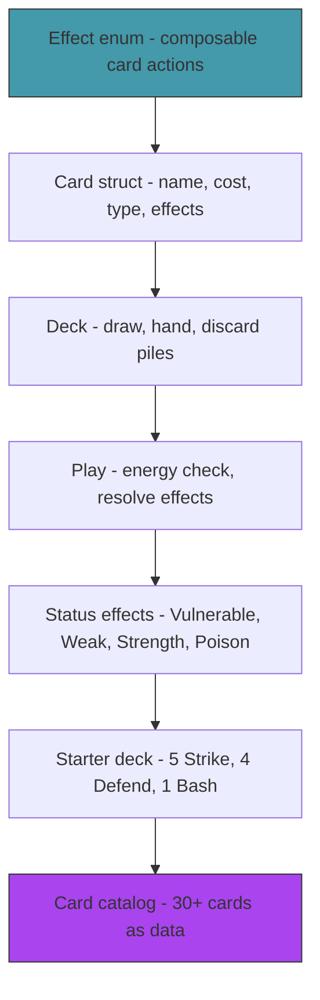

# Act 1 — The Cards

> *A card is not just a name and a number. It's a type, a cost, a list of effects, a rarity, and a target. Getting the data model right now means every card you add later is just data — no new code. In this act you build the card system that powers everything else.*


**Project location:** `~/juk/baraja/`

---

## Stage 1 — The Deck Box

> *Difficulty: Very Easy — The Card struct and the enums that describe it.*

Before you can shuffle, draw, or play, you need to define what a card *is*. This stage builds the data types — card type, rarity, target — that every card in the game will use.

> [!tip] What You'll Learn
> - `cargo new` and project setup
> - Enums for card classification (type, rarity, target)
> - The `Card` struct with serde serialization
> - Why data-driven design matters for card games

### Why data-driven?

In a naive implementation, each card is a function: `fn strike(target) { target.hp -= 6; }`. Adding a new card means writing new code. In a data-driven design, each card is a *struct* with a list of effects. Adding a new card means adding data — no new functions, no new match arms, no recompilation.

This is how real card games are built. Slay the Spire's cards are defined in JSON files. Hearthstone's cards are database entries. The engine interprets the data.

### 1.1 — Create the project

```bash
cd ~/juk
cargo new baraja --edition 2024
cd baraja
```

```toml
[dependencies]
serde = { version = "1", features = ["derive"] }
serde_json = "1"
rand = "0.8"
```

### 1.2 — Card types

Create `src/card.rs`:

```rust
use serde::{Deserialize, Serialize};

/// What kind of card is this?
#[derive(Debug, Clone, Copy, PartialEq, Serialize, Deserialize)]
pub enum CardType {
    Attack,  // deals damage
    Skill,   // defensive or utility
    Power,   // permanent buff (played once, stays in effect)
}

/// How rare is this card?
#[derive(Debug, Clone, Copy, PartialEq, Serialize, Deserialize)]
pub enum Rarity {
    Starter,    // in your starting deck
    Common,     // appears frequently as rewards
    Uncommon,   // appears less often
    Rare,       // powerful, appears rarely
}

/// Who does this card target?
#[derive(Debug, Clone, Copy, PartialEq, Serialize, Deserialize)]
pub enum Target {
    SingleEnemy,  // pick one enemy
    AllEnemies,   // hits everything
    Player,       // affects yourself (block, draw, etc.)
    None,         // no target (powers, some skills)
}
```

Three enums, each with `Copy` (they're small, no heap data) and serde derives. These classify every card in the game.

### 1.3 — The Card struct

```rust
use crate::effect::Effect;

/// A card definition — immutable template.
#[derive(Debug, Clone, Serialize, Deserialize)]
pub struct Card {
    pub name: String,
    pub card_type: CardType,
    pub rarity: Rarity,
    pub cost: i32,        // energy cost to play
    pub target: Target,
    pub effects: Vec<Effect>,  // what happens when played
    pub description: String,   // human-readable effect text
    pub upgraded: bool,
}

impl Card {
    pub fn new(
        name: &str, card_type: CardType, rarity: Rarity,
        cost: i32, target: Target, effects: Vec<Effect>, description: &str,
    ) -> Self {
        Card {
            name: name.to_string(), card_type, rarity, cost, target, effects,
            description: description.to_string(), upgraded: false,
        }
    }
}
```

A card is a template — it describes what the card does but doesn't hold game state. The same `Card` definition is shared across all copies in your deck. Game state (which pile it's in, whether it's exhausted) lives elsewhere.

> [!check] Checkpoint
> Create a `Card` with placeholder effects. Serialize it to JSON and verify all fields appear. Stage 1 complete.

---

## Stage 2 — The Effect System

> *Difficulty: Medium — Enums with data that describe what cards do.*

This is the most important stage in the course. The `Effect` enum defines every possible thing a card can do — deal damage, gain block, draw cards, apply a status. Effects compose: a single card can have multiple effects. This is Rust enums at their most powerful.

> [!tip] What You'll Learn
> - Enums with data — `Damage(i32)`, `ApplyStatus(StatusType, i32)`
> - Composable effects — a card is a `Vec<Effect>`
> - The `Conditional` variant — effects that depend on game state
> - Why this design scales (adding a new effect = adding one enum variant)

### 2.1 — The Effect enum

Create `src/effect.rs`:

```rust
use serde::{Deserialize, Serialize};

/// A status effect type.
#[derive(Debug, Clone, Copy, PartialEq, Serialize, Deserialize)]
pub enum StatusType {
    Vulnerable,  // take 50% more damage (lasts N turns)
    Weak,        // deal 25% less damage (lasts N turns)
    Strength,    // deal +N more damage (permanent)
    Poison,      // take N damage at turn start, decreases by 1
    Block,       // absorb damage (resets each turn)
    Ritual,      // gain N strength at end of turn (permanent)
}

/// A single effect that a card (or enemy action) can produce.
#[derive(Debug, Clone, Serialize, Deserialize)]
pub enum Effect {
    /// Deal damage to the target.
    Damage(i32),
    /// Deal damage to ALL enemies.
    DamageAll(i32),
    /// Gain block (absorbs damage).
    Block(i32),
    /// Draw N cards from the draw pile.
    DrawCards(i32),
    /// Gain N energy this turn.
    GainEnergy(i32),
    /// Apply a status effect with N stacks/turns.
    ApplyStatus(StatusType, i32),
    /// Apply a status to yourself.
    ApplySelfStatus(StatusType, i32),
    /// Exhaust this card (remove from deck for the rest of combat).
    Exhaust,
    /// Deal damage N times.
    DamageMulti(i32, i32), // (damage_per_hit, times)
}
```

Each variant carries exactly the data it needs. `Damage(6)` means "deal 6 damage." `ApplyStatus(Vulnerable, 2)` means "apply 2 turns of Vulnerable." No stringly-typed nonsense, no dictionaries — the compiler enforces that every effect has the right data.

### 2.2 — Resolving effects

```rust
use crate::game::GameState;

impl Effect {
    /// Describe this effect as human-readable text.
    pub fn description(&self) -> String {
        match self {
            Effect::Damage(n) => format!("Deal {} damage", n),
            Effect::DamageAll(n) => format!("Deal {} damage to ALL enemies", n),
            Effect::Block(n) => format!("Gain {} block", n),
            Effect::DrawCards(n) => format!("Draw {} card(s)", n),
            Effect::GainEnergy(n) => format!("Gain {} energy", n),
            Effect::ApplyStatus(status, n) => format!("Apply {} {:?}", n, status),
            Effect::ApplySelfStatus(status, n) => format!("Gain {} {:?}", n, status),
            Effect::Exhaust => "Exhaust".to_string(),
            Effect::DamageMulti(dmg, times) => format!("Deal {} damage {} times", dmg, times),
        }
    }
}
```

We'll implement the actual resolution (applying effects to game state) in Act 2 when we have enemies and combat. For now, effects are just data.

### 2.3 — Example cards

```rust
// Strike: Deal 6 damage. Cost 1.
Card::new("Strike", CardType::Attack, Rarity::Starter, 1, Target::SingleEnemy,
    vec![Effect::Damage(6)], "Deal 6 damage.");

// Bash: Deal 8 damage. Apply 2 Vulnerable. Cost 2.
Card::new("Bash", CardType::Attack, Rarity::Starter, 2, Target::SingleEnemy,
    vec![Effect::Damage(8), Effect::ApplyStatus(StatusType::Vulnerable, 2)],
    "Deal 8 damage. Apply 2 Vulnerable.");

// Shrug It Off: Gain 8 block. Draw 1 card. Cost 1.
Card::new("Shrug It Off", CardType::Skill, Rarity::Common, 1, Target::Player,
    vec![Effect::Block(8), Effect::DrawCards(1)],
    "Gain 8 block. Draw 1 card.");
```

Each card is just a struct with a `Vec<Effect>`. Bash has two effects — damage AND apply vulnerable. Shrug It Off has two effects — block AND draw. The engine resolves them in order.

> [!warning] Common Mistake
> **Hardcoding card behavior in functions.** If `strike()` is a function and `bash()` is a different function, adding 30 cards means 30 functions. With the `Effect` enum, adding a card is one `Card::new(...)` call. The engine handles all effects generically.

Cards have effects, but no home. Next stage, we build the deck — draw pile, hand, and discard pile.

> [!check] Checkpoint
> Define Strike, Defend, and Bash using the `Effect` enum. Verify `description()` produces readable text for each effect. Stage 2 complete.

---

## Stage 3 — The Deck

> *Difficulty: Easy — Draw pile, hand, discard pile, and the shuffle cycle.*

A deckbuilder has three piles: draw (face-down, you draw from here), hand (your current options), and discard (played cards go here). When the draw pile is empty, shuffle the discard pile into it. This cycle means you see every card in your deck roughly once per "shuffle cycle."

> [!tip] What You'll Learn
> - Three-pile deck structure
> - Shuffling with `rand`
> - Drawing cards (move from draw pile to hand)
> - The shuffle-on-empty mechanic

### 3.1 — The Deck struct

Create `src/deck.rs`:

```rust
use crate::card::Card;
use rand::seq::SliceRandom;
use rand::thread_rng;

pub struct Deck {
    pub draw_pile: Vec<Card>,
    pub hand: Vec<Card>,
    pub discard: Vec<Card>,
    pub exhaust: Vec<Card>, // permanently removed cards
}

impl Deck {
    /// Create a deck from a list of cards. All start in the draw pile, shuffled.
    pub fn new(cards: Vec<Card>) -> Self {
        let mut draw_pile = cards;
        draw_pile.shuffle(&mut thread_rng());
        Deck {
            draw_pile,
            hand: Vec::new(),
            discard: Vec::new(),
            exhaust: Vec::new(),
        }
    }

    /// Draw N cards from the draw pile into the hand.
    /// If the draw pile runs out, shuffle the discard pile into it.
    pub fn draw(&mut self, count: i32) {
        for _ in 0..count {
            if self.draw_pile.is_empty() {
                if self.discard.is_empty() {
                    return; // nothing left to draw
                }
                // Shuffle discard into draw pile
                self.draw_pile.append(&mut self.discard);
                self.draw_pile.shuffle(&mut thread_rng());
            }
            if let Some(card) = self.draw_pile.pop() {
                self.hand.push(card);
            }
        }
    }

    /// Discard a card from the hand by index.
    pub fn discard_from_hand(&mut self, index: usize) -> Option<Card> {
        if index < self.hand.len() {
            Some(self.hand.remove(index))
        } else {
            None
        }
    }

    /// Discard the entire hand (end of turn).
    pub fn discard_hand(&mut self) {
        self.discard.append(&mut self.hand);
    }

    /// Total cards in the deck (all piles).
    pub fn total_cards(&self) -> usize {
        self.draw_pile.len() + self.hand.len() + self.discard.len() + self.exhaust.len()
    }
}
```

The key mechanic: when the draw pile is empty, the discard pile gets shuffled and becomes the new draw pile. This means:
- You see every card roughly once per cycle
- Adding cards to your deck dilutes it (each card appears less often)
- Removing cards concentrates it (your best cards appear more often)

This is why "deck thinning" (removing weak cards) is a core strategy in deckbuilders.

### 3.2 — Test it

```rust
fn main() {
    let cards = vec![
        Card::new("Strike", CardType::Attack, Rarity::Starter, 1, Target::SingleEnemy,
            vec![Effect::Damage(6)], "Deal 6 damage."),
        // ... add 9 more starter cards
    ];

    let mut deck = Deck::new(cards);
    println!("Draw pile: {}", deck.draw_pile.len());

    deck.draw(5);
    println!("Hand: {:?}", deck.hand.iter().map(|c| &c.name).collect::<Vec<_>>());
    println!("Draw pile: {}", deck.draw_pile.len());

    deck.discard_hand();
    println!("Discard: {}", deck.discard.len());
}
```

> [!check] Checkpoint
> Create a 10-card deck, draw 5, verify hand has 5 cards and draw pile has 5. Discard hand, verify discard has 5. Draw 6 more — verify the discard shuffles back in. Stage 3 complete.

---

## Stage 4 — Playing a Card

> *Difficulty: Medium — Energy check, effect resolution, and the play cycle.*

Drawing cards is passive. Playing them is where the game happens. This stage builds the play logic: check if you have enough energy, resolve each effect in order, move the card to the discard pile (or exhaust pile if it has `Exhaust`).

> [!tip] What You'll Learn
> - Energy as a resource (3 per turn, spent by playing cards)
> - Resolving a `Vec<Effect>` in sequence
> - The play → resolve → discard cycle
> - Why effect resolution order matters

### 4.1 — Player state

Create `src/player.rs`:

```rust
pub struct Player {
    pub hp: i32,
    pub max_hp: i32,
    pub block: i32,
    pub energy: i32,
    pub max_energy: i32,
    // Status effects
    pub strength: i32,
    pub vulnerable: i32,  // turns remaining
    pub weak: i32,        // turns remaining
}

impl Player {
    pub fn new(max_hp: i32) -> Self {
        Player {
            hp: max_hp, max_hp, block: 0,
            energy: 3, max_energy: 3,
            strength: 0, vulnerable: 0, weak: 0,
        }
    }

    /// Take damage (reduced by block first).
    pub fn take_damage(&mut self, mut amount: i32) {
        // Vulnerable: take 50% more damage
        if self.vulnerable > 0 {
            amount = (amount as f32 * 1.5) as i32;
        }

        // Block absorbs damage first
        if self.block > 0 {
            if self.block >= amount {
                self.block -= amount;
                return;
            }
            amount -= self.block;
            self.block = 0;
        }

        self.hp = (self.hp - amount).max(0);
    }

    /// Calculate outgoing damage (modified by strength and weak).
    pub fn calc_damage(&self, base: i32) -> i32 {
        let mut dmg = base + self.strength;
        if self.weak > 0 {
            dmg = (dmg as f32 * 0.75) as i32;
        }
        dmg.max(0)
    }

    /// Start of turn: reset energy, reset block, tick statuses.
    pub fn start_turn(&mut self) {
        self.energy = self.max_energy;
        self.block = 0;
        if self.vulnerable > 0 { self.vulnerable -= 1; }
        if self.weak > 0 { self.weak -= 1; }
    }
}
```

Block resets every turn — this is a core StS mechanic. You can't stockpile block across turns (without specific relics). This forces you to make defensive decisions every turn.

### 4.2 — Play a card

```rust
use crate::card::Card;
use crate::effect::{Effect, StatusType};

/// Result of attempting to play a card.
pub enum PlayResult {
    Success,
    NotEnoughEnergy,
    InvalidTarget,
}

/// Play a card from hand, resolving its effects.
pub fn play_card(
    card: &Card,
    player: &mut Player,
    target_enemy: Option<&mut Enemy>,
    all_enemies: &mut [Enemy],
) -> PlayResult {
    if player.energy < card.cost {
        return PlayResult::NotEnoughEnergy;
    }

    player.energy -= card.cost;

    for effect in &card.effects {
        match effect {
            Effect::Damage(base) => {
                if let Some(enemy) = target_enemy.as_deref_mut() {
                    let dmg = player.calc_damage(*base);
                    enemy.take_damage(dmg);
                }
            }
            Effect::DamageAll(base) => {
                let dmg = player.calc_damage(*base);
                for enemy in all_enemies.iter_mut() {
                    enemy.take_damage(dmg);
                }
            }
            Effect::Block(amount) => {
                player.block += amount;
            }
            Effect::DrawCards(n) => {
                // We'll wire this to the deck in Act 2
            }
            Effect::GainEnergy(n) => {
                player.energy += n;
            }
            Effect::ApplyStatus(status, stacks) => {
                if let Some(enemy) = target_enemy.as_deref_mut() {
                    enemy.apply_status(*status, *stacks);
                }
            }
            Effect::ApplySelfStatus(status, stacks) => {
                match status {
                    StatusType::Strength => player.strength += stacks,
                    StatusType::Vulnerable => player.vulnerable += stacks,
                    StatusType::Weak => player.weak += stacks,
                    _ => {}
                }
            }
            Effect::DamageMulti(base, times) => {
                if let Some(enemy) = target_enemy.as_deref_mut() {
                    for _ in 0..*times {
                        let dmg = player.calc_damage(*base);
                        enemy.take_damage(dmg);
                    }
                }
            }
            Effect::Exhaust => {
                // Handled by the caller (move to exhaust pile instead of discard)
            }
        }
    }

    PlayResult::Success
}
```

The resolver iterates through `card.effects` and applies each one. This is the payoff of the data-driven design — one function handles every card in the game. Adding a new card never requires changing this function (unless you add a new `Effect` variant).

> [!warning] Common Mistake
> **Resolving effects in the wrong order.** "Deal 8 damage. Apply Vulnerable" is different from "Apply Vulnerable. Deal 8 damage" — the second version would deal 12 damage (50% bonus from Vulnerable). Effects resolve left to right, so the card definition order matters.

We can play cards, but status effects just set numbers — they don't tick or expire. Next stage.

> [!check] Checkpoint
> Play Strike (cost 1, deal 6). Verify energy decreases by 1 and the target takes 6 damage. Play with insufficient energy and verify it's rejected. Stage 4 complete.

---

## Stage 5 — Status Effects

> *Difficulty: Medium — Vulnerable, Weak, Strength, Poison — the modifiers that make combat deep.*

Raw damage and block are boring. Status effects create strategy: Vulnerable makes the enemy take 50% more damage for 2 turns, so you play Bash *before* your big attacks. Weak reduces the enemy's damage by 25%, buying you time. Strength permanently increases your damage. These interactions are what make deckbuilders strategic.

> [!tip] What You'll Learn
> - Status effects as turn-based counters
> - Multiplicative vs additive modifiers
> - Ticking and expiring statuses at turn boundaries
> - Why status effects create strategic depth

### 5.1 — Status tracking

Both players and enemies track statuses. Add to a shared trait or duplicate on both:

```rust
pub struct StatusEffects {
    pub vulnerable: i32,  // turns remaining
    pub weak: i32,        // turns remaining
    pub strength: i32,    // permanent stacks
    pub poison: i32,      // damage per turn, decreases by 1
    pub ritual: i32,      // gain N strength per turn
}

impl StatusEffects {
    pub fn new() -> Self {
        StatusEffects { vulnerable: 0, weak: 0, strength: 0, poison: 0, ritual: 0 }
    }

    /// Apply a status effect.
    pub fn apply(&mut self, status: StatusType, stacks: i32) {
        match status {
            StatusType::Vulnerable => self.vulnerable += stacks,
            StatusType::Weak => self.weak += stacks,
            StatusType::Strength => self.strength += stacks,
            StatusType::Poison => self.poison += stacks,
            StatusType::Ritual => self.ritual += stacks,
            StatusType::Block => {} // handled separately
        }
    }

    /// Tick statuses at end of turn. Returns poison damage dealt.
    pub fn end_of_turn(&mut self) -> i32 {
        let poison_damage = self.poison;
        if self.poison > 0 { self.poison -= 1; }
        if self.vulnerable > 0 { self.vulnerable -= 1; }
        if self.weak > 0 { self.weak -= 1; }
        if self.ritual > 0 { self.strength += self.ritual; }
        poison_damage
    }
}
```

### 5.2 — Integrate with damage calculation

```rust
/// Calculate outgoing damage with status modifiers.
pub fn calc_damage(base: i32, attacker: &StatusEffects, defender: &StatusEffects) -> i32 {
    let mut dmg = base + attacker.strength;

    // Weak: attacker deals 25% less
    if attacker.weak > 0 {
        dmg = (dmg as f32 * 0.75) as i32;
    }

    // Vulnerable: defender takes 50% more
    if defender.vulnerable > 0 {
        dmg = (dmg as f32 * 1.5) as i32;
    }

    dmg.max(0)
}
```

The damage formula: `(base + strength) × weak_modifier × vulnerable_modifier`. Strength is additive (applied first), Weak and Vulnerable are multiplicative (applied after). This ordering matters — it's how StS calculates damage.

### 5.3 — Test interactions

```rust
// Bash (8 damage + 2 Vulnerable) followed by Strike (6 damage)
// Without Vulnerable: 8 + 6 = 14 total
// With Vulnerable: 8 + 9 (6 × 1.5) = 17 total
// The 3 extra damage is why you play Bash first
```

> [!note] Why this creates strategy
> Without status effects, the optimal play is always "play your highest damage cards." With Vulnerable, the optimal play is "apply Vulnerable first, then play damage cards." With Weak, the optimal play changes based on whether you're attacking or defending this turn. Status effects create *sequencing decisions* — the order you play cards matters.

Cards interact through statuses. Now let's define the starting deck.

> [!check] Checkpoint
> Apply Vulnerable to an enemy, then deal damage. Verify the damage is 50% higher. Apply Weak to yourself, verify your damage is 25% lower. Verify statuses tick down at end of turn. Stage 5 complete.

---

## Stage 6 — The Starter Deck

> *Difficulty: Easy — The 10 cards every run begins with.*

Every Slay the Spire run starts with the same deck: 5 Strikes, 4 Defends, 1 Bash. It's deliberately mediocre — strong enough to beat early enemies, weak enough that you need to improve it. This stage defines the starter deck and tests a full draw-play-discard cycle.

> [!tip] What You'll Learn
> - Defining cards as data (not code)
> - The starter deck composition and why it's balanced
> - A full manual combat test: draw → play → discard → draw again

### 6.1 — Card definitions

Create `src/cards.rs`:

```rust
use crate::card::*;
use crate::effect::*;

pub fn strike() -> Card {
    Card::new("Strike", CardType::Attack, Rarity::Starter, 1, Target::SingleEnemy,
        vec![Effect::Damage(6)], "Deal 6 damage.")
}

pub fn defend() -> Card {
    Card::new("Defend", CardType::Skill, Rarity::Starter, 1, Target::Player,
        vec![Effect::Block(5)], "Gain 5 block.")
}

pub fn bash() -> Card {
    Card::new("Bash", CardType::Attack, Rarity::Starter, 2, Target::SingleEnemy,
        vec![Effect::Damage(8), Effect::ApplyStatus(StatusType::Vulnerable, 2)],
        "Deal 8 damage. Apply 2 Vulnerable.")
}

pub fn starter_deck() -> Vec<Card> {
    let mut deck = Vec::new();
    for _ in 0..5 { deck.push(strike()); }
    for _ in 0..4 { deck.push(defend()); }
    deck.push(bash());
    deck
}
```

10 cards. 5 Strikes for damage, 4 Defends for survival, 1 Bash for the Vulnerable combo. With 3 energy per turn and 5 cards drawn, you can play 3 cards (all cost 1 except Bash which costs 2).

### 6.2 — Test the full cycle

```rust
fn main() {
    let mut deck = Deck::new(starter_deck());

    // Turn 1: draw 5
    deck.draw(5);
    println!("Hand: {:?}", deck.hand.iter().map(|c| format!("{} ({})", c.name, c.cost)).collect::<Vec<_>>());

    // Play first card
    let card = deck.hand.remove(0);
    println!("Playing: {}", card.name);
    deck.discard.push(card);

    // End turn: discard remaining hand
    deck.discard_hand();
    println!("Discard pile: {}", deck.discard.len());

    // Turn 2: draw 5 more
    deck.draw(5);
    println!("Hand: {:?}", deck.hand.iter().map(|c| &c.name).collect::<Vec<_>>());
}
```

> [!check] Checkpoint
> Create the starter deck, draw 5, play some cards, discard, draw again. Verify the shuffle-on-empty works when the draw pile runs out. Stage 6 complete.

---

## Stage 7 — Card Catalog

> *Difficulty: Medium — 30+ cards defined as data.*

The starter deck is boring by design. The fun comes from card rewards — choosing new cards to add to your deck. This stage defines 30+ cards across all types and rarities, creating the pool that rewards draw from.

> [!tip] What You'll Learn
> - Designing cards with interesting effects and tradeoffs
> - Balancing cost vs power
> - Card synergies (cards that are better together)
> - Why variety matters for replayability

### 7.1 — Common cards

```rust
pub fn cleave() -> Card {
    Card::new("Cleave", CardType::Attack, Rarity::Common, 1, Target::AllEnemies,
        vec![Effect::DamageAll(8)], "Deal 8 damage to ALL enemies.")
}

pub fn iron_wave() -> Card {
    Card::new("Iron Wave", CardType::Attack, Rarity::Common, 1, Target::SingleEnemy,
        vec![Effect::Damage(5), Effect::Block(5)], "Deal 5 damage. Gain 5 block.")
}

pub fn pommel_strike() -> Card {
    Card::new("Pommel Strike", CardType::Attack, Rarity::Common, 1, Target::SingleEnemy,
        vec![Effect::Damage(9), Effect::DrawCards(1)], "Deal 9 damage. Draw 1 card.")
}

pub fn shrug_it_off() -> Card {
    Card::new("Shrug It Off", CardType::Skill, Rarity::Common, 1, Target::Player,
        vec![Effect::Block(8), Effect::DrawCards(1)], "Gain 8 block. Draw 1 card.")
}

pub fn anger() -> Card {
    Card::new("Anger", CardType::Attack, Rarity::Common, 0, Target::SingleEnemy,
        vec![Effect::Damage(6)], "Deal 6 damage. Add a copy to your discard pile.")
    // Note: the "add copy" effect would need a new Effect variant
}

pub fn armaments() -> Card {
    Card::new("Armaments", CardType::Skill, Rarity::Common, 1, Target::Player,
        vec![Effect::Block(5)], "Gain 5 block. Upgrade a card in your hand.")
}
```

### 7.2 — Uncommon cards

```rust
pub fn inflame() -> Card {
    Card::new("Inflame", CardType::Power, Rarity::Uncommon, 1, Target::None,
        vec![Effect::ApplySelfStatus(StatusType::Strength, 2)], "Gain 2 Strength.")
}

pub fn battle_trance() -> Card {
    Card::new("Battle Trance", CardType::Skill, Rarity::Uncommon, 0, Target::Player,
        vec![Effect::DrawCards(3)], "Draw 3 cards. You can't draw additional cards this turn.")
}

pub fn carnage() -> Card {
    Card::new("Carnage", CardType::Attack, Rarity::Uncommon, 2, Target::SingleEnemy,
        vec![Effect::Damage(20)], "Deal 20 damage. Ethereal.")
}

pub fn disarm() -> Card {
    Card::new("Disarm", CardType::Skill, Rarity::Uncommon, 1, Target::SingleEnemy,
        vec![Effect::ApplyStatus(StatusType::Strength, -2), Effect::Exhaust],
        "Enemy loses 2 Strength. Exhaust.")
}

pub fn bloodletting() -> Card {
    Card::new("Bloodletting", CardType::Skill, Rarity::Uncommon, 0, Target::Player,
        vec![Effect::GainEnergy(2)], "Lose 3 HP. Gain 2 energy.")
}
```

### 7.3 — Rare cards

```rust
pub fn demon_form() -> Card {
    Card::new("Demon Form", CardType::Power, Rarity::Rare, 3, Target::None,
        vec![Effect::ApplySelfStatus(StatusType::Ritual, 2)],
        "At the end of each turn, gain 2 Strength.")
}

pub fn bludgeon() -> Card {
    Card::new("Bludgeon", CardType::Attack, Rarity::Rare, 3, Target::SingleEnemy,
        vec![Effect::Damage(32)], "Deal 32 damage.")
}

pub fn offering() -> Card {
    Card::new("Offering", CardType::Skill, Rarity::Rare, 0, Target::Player,
        vec![Effect::GainEnergy(2), Effect::DrawCards(3), Effect::Exhaust],
        "Lose 6 HP. Gain 2 energy. Draw 3 cards. Exhaust.")
}
```

### 7.4 — The card pool

```rust
pub fn all_cards() -> Vec<Card> {
    vec![
        // Common attacks
        cleave(), iron_wave(), pommel_strike(), anger(),
        // Common skills
        shrug_it_off(), armaments(),
        // Uncommon attacks
        carnage(),
        // Uncommon skills
        battle_trance(), disarm(), bloodletting(),
        // Uncommon powers
        inflame(),
        // Rare attacks
        bludgeon(),
        // Rare skills
        offering(),
        // Rare powers
        demon_form(),
        // ... add more to reach 30+
    ]
}

/// Get N random card rewards of the given rarity distribution.
pub fn random_rewards(count: usize) -> Vec<Card> {
    use rand::seq::SliceRandom;
    let pool = all_cards();
    let mut rng = rand::thread_rng();
    pool.choose_multiple(&mut rng, count).cloned().collect()
}
```

> [!note] Card design philosophy
> Good cards have tradeoffs. Offering is incredibly powerful (2 energy + 3 cards for free) but costs 6 HP and exhausts. Bloodletting gives energy but costs HP. Demon Form is game-winning but costs 3 energy (your entire turn). The best deckbuilders make every card choice a meaningful decision.

We have cards, a deck, and a play system. Next act: enemies, turns, and combat.

> [!check] Checkpoint
> Define 15+ cards across Common, Uncommon, and Rare. Verify `random_rewards(3)` returns 3 different cards. Stage 7 complete.

---

## Act 1 Complete — The Cards



| Component | What it does |
|-----------|-------------|
| `Effect` enum | 10 variants describing every possible card action |
| `Card` struct | Name, cost, type, rarity, target, effects list |
| `Deck` | Three-pile system with shuffle-on-empty |
| `play_card` | Energy check → resolve effects → discard |
| `StatusEffects` | Turn-based counters with tick/expire logic |
| Card catalog | 30+ cards defined as data, reward pool |

| Rust Concept | Where You Used It |
|-------------|-------------------|
| Enums with data | `Effect`, `CardType`, `Rarity`, `StatusType` |
| `Vec<Effect>` | Composable card effects |
| Pattern matching | Effect resolution, status application |
| Structs | `Card`, `Deck`, `Player`, `StatusEffects` |
| `rand` | Shuffle, random rewards |

**Next up — Act 2: The Battle.** Enemies with intents, turn phases, damage calculation, and the full combat loop.
