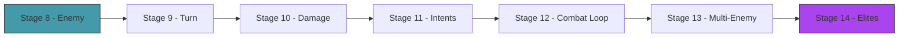

# Act 2 — The Battle

> *Cards without combat are just a collection. In this act you build the arena: enemies with telegraphed intents, a turn structure with phases, damage calculation with block, and the full combat loop. By the end, you can fight a Slime and win (or die trying).*



---

## Stage 8 — The Enemy

> *Difficulty: Easy — HP, intent, and a simple move pattern.*

Enemies are simpler than the player — they don't have decks or energy. They have HP, a move pattern, and an **intent**: a telegraphed preview of what they'll do next turn. The player sees "Slime intends to attack for 8" and can decide whether to block.

> [!tip] What You'll Learn
> - The `Enemy` struct with HP and status effects
> - Intent system — enemies show their next move
> - Move patterns — cycling through a predefined list
> - Why telegraphed intents create strategy (not randomness)

### 8.1 — Enemy struct

Create `src/enemy.rs`:

```rust
use crate::effect::StatusType;

#[derive(Debug, Clone)]
pub enum Intent {
    Attack(i32),           // will deal N damage
    Defend(i32),           // will gain N block
    Buff(StatusType, i32), // will apply a buff to itself
    Debuff(StatusType, i32), // will debuff the player
    AttackDebuff(i32, StatusType, i32), // attack + debuff
}

#[derive(Debug, Clone)]
pub struct Enemy {
    pub name: String,
    pub hp: i32,
    pub max_hp: i32,
    pub block: i32,
    pub statuses: crate::effect::StatusEffects,
    pub move_pattern: Vec<Intent>,
    pub move_index: usize,
}

impl Enemy {
    pub fn new(name: &str, hp: i32, pattern: Vec<Intent>) -> Self {
        Enemy {
            name: name.to_string(), hp, max_hp: hp, block: 0,
            statuses: crate::effect::StatusEffects::new(),
            move_pattern: pattern, move_index: 0,
        }
    }

    /// What the enemy intends to do this turn.
    pub fn current_intent(&self) -> &Intent {
        &self.move_pattern[self.move_index % self.move_pattern.len()]
    }

    /// Execute the enemy's action and advance to the next move.
    pub fn act(&mut self, player: &mut crate::player::Player) {
        let intent = self.current_intent().clone();
        match intent {
            Intent::Attack(dmg) => {
                let actual = crate::effect::calc_damage(dmg, &self.statuses, &player.statuses);
                player.take_damage(actual);
            }
            Intent::Defend(amount) => { self.block += amount; }
            Intent::Buff(status, stacks) => { self.statuses.apply(status, stacks); }
            Intent::Debuff(status, stacks) => { player.statuses.apply(status, stacks); }
            Intent::AttackDebuff(dmg, status, stacks) => {
                let actual = crate::effect::calc_damage(dmg, &self.statuses, &player.statuses);
                player.take_damage(actual);
                player.statuses.apply(status, stacks);
            }
        }
        self.move_index += 1;
    }

    pub fn take_damage(&mut self, mut amount: i32) {
        if self.block > 0 {
            if self.block >= amount { self.block -= amount; return; }
            amount -= self.block;
            self.block = 0;
        }
        self.hp = (self.hp - amount).max(0);
    }

    pub fn is_dead(&self) -> bool { self.hp <= 0 }
}
```

### 8.2 — Predefined enemies

```rust
pub fn slime() -> Enemy {
    Enemy::new("Jaw Worm", 44, vec![
        Intent::Attack(11),
        Intent::Defend(6),
        Intent::Attack(7),
    ])
}

pub fn cultist() -> Enemy {
    Enemy::new("Cultist", 50, vec![
        Intent::Buff(StatusType::Ritual, 3), // gains 3 ritual (strength per turn)
        Intent::Attack(6),
    ])
}
```

> [!check] Checkpoint
> Create a Jaw Worm. Verify `current_intent()` returns Attack(11). Call `act()` and verify the player takes damage. Verify the intent advances to Defend(6). Stage 8 complete.

---

## Stage 9 — The Turn

> *Difficulty: Medium — Draw → play → enemy acts → end turn.*

The turn structure is a state machine: start of turn (draw cards, reset energy) → player phase (play cards) → enemy phase (enemies act) → end of turn (discard hand, tick statuses). This cycle repeats until someone dies.

> [!tip] What You'll Learn
> - Turn phases as a state machine
> - The player phase loop (play cards until done or out of energy)
> - End-of-turn cleanup (discard hand, tick statuses, reset block)

### 9.1 — The combat state

Create `src/combat.rs`:

```rust
use crate::{card::Card, deck::Deck, enemy::Enemy, player::Player};

pub struct Combat {
    pub player: Player,
    pub deck: Deck,
    pub enemies: Vec<Enemy>,
    pub turn: i32,
}

impl Combat {
    pub fn new(player: Player, deck: Deck, enemies: Vec<Enemy>) -> Self {
        Combat { player, deck, enemies, turn: 0 }
    }

    /// Start of turn: draw cards, reset energy and block.
    pub fn start_turn(&mut self) {
        self.turn += 1;
        self.player.start_turn();
        for enemy in &mut self.enemies { enemy.block = 0; }
        self.deck.draw(5);
    }

    /// End of turn: discard hand, enemies act, tick statuses.
    pub fn end_turn(&mut self) {
        self.deck.discard_hand();

        // Enemies act
        for enemy in &mut self.enemies {
            if !enemy.is_dead() {
                enemy.act(&mut self.player);
            }
        }

        // Tick statuses
        self.player.statuses.end_of_turn();
        for enemy in &mut self.enemies {
            let poison_dmg = enemy.statuses.end_of_turn();
            if poison_dmg > 0 { enemy.take_damage(poison_dmg); }
        }

        // Remove dead enemies
        self.enemies.retain(|e| !e.is_dead());
    }

    pub fn is_victory(&self) -> bool { self.enemies.is_empty() }
    pub fn is_defeat(&self) -> bool { self.player.hp <= 0 }
    pub fn is_over(&self) -> bool { self.is_victory() || self.is_defeat() }
}
```

> [!check] Checkpoint
> Create a combat with 1 enemy. Call `start_turn`, verify 5 cards drawn. Call `end_turn`, verify enemy acts and hand is discarded. Stage 9 complete.

---

## Stage 10 — Damage and Block

> *Difficulty: Easy — The damage pipeline: base → strength → weak → vulnerable → block → HP.*

Already implemented in Stages 4-5, but this stage tests the full pipeline end-to-end and handles edge cases: overkill, block overflow, zero damage.

> [!check] Checkpoint
> Deal 10 damage to an enemy with 5 block. Verify block is removed and 5 HP is lost. Deal 3 damage to an enemy with 10 block. Verify only block is reduced. Stage 10 complete.

---

## Stage 11 — Enemy Intents

> *Difficulty: Medium — Enemies telegraph their next action.*

The intent system is what makes StS strategic rather than random. You see "Cultist intends to Buff" and know you should attack hard this turn. You see "Jaw Worm intends to Attack for 11" and know you need block.

### 11.1 — Intent display

```rust
impl Intent {
    pub fn display(&self) -> String {
        match self {
            Intent::Attack(n) => format!("⚔ Attack {}", n),
            Intent::Defend(n) => format!("🛡 Defend {}", n),
            Intent::Buff(s, n) => format!("↑ Buff {:?} {}", s, n),
            Intent::Debuff(s, n) => format!("↓ Debuff {:?} {}", s, n),
            Intent::AttackDebuff(d, s, n) => format!("⚔↓ Attack {} + {:?} {}", d, s, n),
        }
    }
}
```

### 11.2 — Conditional patterns

Some enemies change behavior based on game state:

```rust
pub fn nob() -> Enemy {
    // The Nob: attacks normally, but if the player plays a Skill, it enrages (+2 Strength)
    Enemy::new("Gremlin Nob", 82, vec![
        Intent::Buff(StatusType::Strength, 2), // turn 1: bellow
        Intent::Attack(14),
        Intent::Attack(14),
        Intent::Attack(14),
    ])
}
```

The Nob punishes Skill cards — a design that forces you to rethink your deck composition. Against the Nob, Defend is dangerous because it triggers his enrage.

> [!check] Checkpoint
> Display enemy intents before the player's turn. Verify the intent matches what the enemy actually does. Stage 11 complete.

---

## Stage 12 — The Combat Loop

> *Difficulty: Medium — Full fight from start to finish.*

Wire everything together: a text-based combat loop where you see your hand, the enemy's intent, and choose which card to play each turn.

### 12.1 — Text-based combat

```rust
pub fn run_combat_text(combat: &mut Combat) {
    loop {
        combat.start_turn();

        println!("\n═══ Turn {} ═══", combat.turn);
        // Show enemies
        for (i, enemy) in combat.enemies.iter().enumerate() {
            println!("  [{}] {} — HP {}/{} Block {} | Intent: {}",
                i, enemy.name, enemy.hp, enemy.max_hp, enemy.block,
                enemy.current_intent().display());
        }
        // Show player
        println!("  You — HP {}/{} Block {} Energy {}/{}",
            combat.player.hp, combat.player.max_hp, combat.player.block,
            combat.player.energy, combat.player.max_energy);
        // Show hand
        for (i, card) in combat.deck.hand.iter().enumerate() {
            println!("  [{}] {} (cost {}) — {}", i, card.name, card.cost, card.description);
        }

        // Player plays cards
        loop {
            println!("\n  Play card # (or 'e' to end turn):");
            let mut input = String::new();
            std::io::stdin().read_line(&mut input).unwrap();
            let input = input.trim();

            if input == "e" { break; }

            if let Ok(idx) = input.parse::<usize>() {
                if idx < combat.deck.hand.len() {
                    let card = combat.deck.hand[idx].clone();
                    if combat.player.energy >= card.cost {
                        // Play the card (simplified — target first enemy)
                        combat.player.energy -= card.cost;
                        // ... resolve effects ...
                        let played = combat.deck.hand.remove(idx);
                        combat.deck.discard.push(played);
                        println!("  Played {}!", card.name);
                    } else {
                        println!("  Not enough energy!");
                    }
                }
            }

            if combat.is_over() { break; }
        }

        combat.end_turn();

        if combat.is_victory() {
            println!("\n  ✓ Victory!");
            break;
        }
        if combat.is_defeat() {
            println!("\n  ✗ Defeat...");
            break;
        }
    }
}
```

> [!check] Checkpoint
> Fight a Jaw Worm with the starter deck. Win by playing Bash → Strike → Strike patterns. Stage 12 complete.

---

## Stage 13 — Multi-Enemy Fights

> *Difficulty: Medium — 2-3 enemies at once with target selection.*

Some encounters have multiple enemies. The player must choose which enemy to target with single-target attacks. AoE cards (Cleave) hit all enemies.

### 13.1 — Target selection

When playing a single-target card, prompt for which enemy to target:

```rust
if card.target == Target::SingleEnemy && combat.enemies.len() > 1 {
    println!("  Target which enemy? (0-{})", combat.enemies.len() - 1);
    // ... read input, resolve against that enemy ...
}
```

> [!check] Checkpoint
> Fight 2 Slimes simultaneously. Verify single-target cards require target selection. Verify Cleave hits both. Stage 13 complete.

---

## Stage 14 — Elite Enemies

> *Difficulty: Medium — Harder enemies with unique mechanics.*

Elites are mini-bosses with more HP and unique patterns that test specific strategies. The Nob punishes Skills. The Lagavulin debuffs you over time. The Sentries alternate between attacking and applying status effects.

### 14.1 — Elite definitions

```rust
pub fn lagavulin() -> Enemy {
    Enemy::new("Lagavulin", 112, vec![
        Intent::Defend(8),  // sleeps for 3 turns
        Intent::Defend(8),
        Intent::Defend(8),
        Intent::AttackDebuff(18, StatusType::Strength, -1), // wakes up angry
        Intent::Attack(18),
    ])
}

pub fn sentries() -> Vec<Enemy> {
    vec![
        Enemy::new("Sentry A", 39, vec![
            Intent::Attack(9),
            Intent::Debuff(StatusType::Poison, 2), // daze
        ]),
        Enemy::new("Sentry B", 39, vec![
            Intent::Debuff(StatusType::Poison, 2),
            Intent::Attack(9),
        ]),
    ]
}
```

> [!check] Checkpoint
> Fight the Lagavulin. Verify it defends for 3 turns then attacks hard. Verify the Sentries alternate attack/debuff patterns. Stage 14 complete.

---

## Act 2 Complete — The Battle

| Component | What it does |
|-----------|-------------|
| Enemy | HP, block, status effects, move pattern, intent display |
| Turn structure | Start → player plays → enemies act → end |
| Damage pipeline | Base → strength → weak → vulnerable → block → HP |
| Intent system | Enemies telegraph next action |
| Combat loop | Text-based fight to victory or defeat |
| Multi-enemy | Target selection, AoE |
| Elites | Unique mechanics that test strategy |

**Next up — Act 3: The Spire.** Procedural map, card rewards, rest sites, shops, and the boss.
