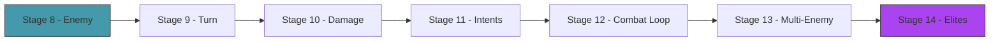

# Act 2 — The Battle

> *Cards without combat are just a collection. In this act you build the arena: enemies with telegraphed intents, a turn structure with phases, damage calculation with block, and the full combat loop. By the end, you can fight a Slime and win (or die trying).*



---

## Stage 8 — The Enemy

> *Difficulty: Easy — HP, intent, and a simple move pattern.*

*~45 min*

Enemies are simpler than the player — they don't have decks or energy. They have HP, a move pattern, and an **intent**: a telegraphed preview of what they'll do next turn. The player sees "Slime intends to attack for 8" and can decide whether to block.

> [!tip] What You'll Learn
> - The `Enemy` struct with HP and status effects
> - Intent system — enemies show their next move
> - Move patterns — cycling through a predefined list
> - Why telegraphed intents create strategy (not randomness)
> - The borrow checker in action — why `act()` needs careful design

### Concept: Why Telegraphed Intents?

Most card games hide the opponent's plan. StS does the opposite — enemies *show* you what they'll do next turn. This transforms combat from guessing into planning. You see "Jaw Worm intends to Attack for 11" and decide: do I block, or do I kill it before it attacks?

This is also why the AI (Act 4) works so well — with perfect information about enemy intents, the search space is manageable.

### 8.1 — Enemy struct

Create `src/enemy.rs` and add `mod enemy;` to `main.rs`:

```rust
use crate::effect::{calc_damage, StatusEffects, StatusType};

#[derive(Debug, Clone)]
pub enum Intent {
    Attack(i32),                       // will deal N damage
    Defend(i32),                       // will gain N block
    Buff(StatusType, i32),             // will buff itself
    Debuff(StatusType, i32),           // will debuff the player
    AttackDebuff(i32, StatusType, i32), // attack + debuff
}

#[derive(Debug, Clone)]
pub struct Enemy {
    pub name: String,
    pub hp: i32,
    pub max_hp: i32,
    pub block: i32,
    pub statuses: StatusEffects,
    pub move_pattern: Vec<Intent>,
    pub move_index: usize,
}
```

### 8.2 — Enemy implementation

Try implementing the `Enemy` methods yourself. You need:
- `new(name, hp, pattern)` — constructor
- `current_intent(&self) -> &Intent` — what the enemy will do this turn (cycle through the pattern using modulo)
- `take_damage(&mut self, amount: i32)` — block absorbs first, then HP
- `is_dead(&self) -> bool` — HP ≤ 0

<details>
<summary>Solution</summary>

```rust
impl Enemy {
    pub fn new(name: &str, hp: i32, pattern: Vec<Intent>) -> Self {
        Enemy {
            name: name.to_string(), hp, max_hp: hp, block: 0,
            statuses: StatusEffects::new(),
            move_pattern: pattern, move_index: 0,
        }
    }

    /// What the enemy intends to do this turn.
    pub fn current_intent(&self) -> &Intent {
        &self.move_pattern[self.move_index % self.move_pattern.len()]
    }

    /// Execute the enemy's action and advance to the next move.
    pub fn act(&mut self, player: &mut crate::player::Player) {
        let intent = self.current_intent().clone();
        match intent {
            Intent::Attack(dmg) => {
                let actual = calc_damage(dmg, &self.statuses, &player.statuses);
                player.take_damage(actual);
            }
            Intent::Defend(amount) => { self.block += amount; }
            Intent::Buff(status, stacks) => { self.statuses.apply(status, stacks); }
            Intent::Debuff(status, stacks) => { player.statuses.apply(status, stacks); }
            Intent::AttackDebuff(dmg, status, stacks) => {
                let actual = calc_damage(dmg, &self.statuses, &player.statuses);
                player.take_damage(actual);
                player.statuses.apply(status, stacks);
            }
        }
        self.move_index += 1;
    }

    pub fn take_damage(&mut self, mut amount: i32) {
        if self.block > 0 {
            if self.block >= amount { self.block -= amount; return; }
            amount -= self.block;
            self.block = 0;
        }
        self.hp = (self.hp - amount).max(0);
    }

    pub fn is_dead(&self) -> bool { self.hp <= 0 }
}
```

</details>

> [!warning] Common Mistake: Borrowing `self` while also borrowing a field
> Notice that `act()` clones the intent before matching on it:
> ```rust
> let intent = self.current_intent().clone();
> ```
> Why not match directly on `self.current_intent()`? Because `current_intent()` borrows `self` immutably, but the match arms need to mutate `self` (e.g., `self.block += amount`). You can't have an immutable borrow and a mutable borrow at the same time.
>
> If you tried:
> ```rust
> match self.current_intent() {
>     Intent::Defend(amount) => { self.block += amount; }
>     //                         ^^^^ mutable borrow while immutable borrow is active
> }
> ```
> ```
> error[E0502]: cannot borrow `*self` as mutable because it is also borrowed as immutable
> ```
> The fix: clone the intent first (it's cheap — just integers), then match on the owned copy. This frees the borrow on `self`.

### 8.3 — Predefined enemies

```rust
pub fn jaw_worm() -> Enemy {
    Enemy::new("Jaw Worm", 44, vec![
        Intent::Attack(11),
        Intent::Defend(6),
        Intent::Attack(7),
    ])
}

pub fn cultist() -> Enemy {
    Enemy::new("Cultist", 50, vec![
        Intent::Buff(StatusType::Ritual, 3),
        Intent::Attack(6),
    ])
}
```

### 8.4 — Test enemies

```rust
#[cfg(test)]
mod tests {
    use super::*;
    use crate::player::Player;

    #[test]
    fn test_enemy_cycles_intents() {
        let enemy = jaw_worm();
        assert!(matches!(enemy.current_intent(), Intent::Attack(11)));
    }

    #[test]
    fn test_enemy_act_deals_damage() {
        let mut enemy = jaw_worm();
        let mut player = Player::new(80);
        enemy.act(&mut player);
        assert_eq!(player.hp, 69); // 80 - 11
    }

    #[test]
    fn test_enemy_advances_after_act() {
        let mut enemy = jaw_worm();
        let mut player = Player::new(80);
        enemy.act(&mut player);
        assert!(matches!(enemy.current_intent(), Intent::Defend(6)));
    }

    #[test]
    fn test_enemy_take_damage_with_block() {
        let mut enemy = jaw_worm();
        enemy.block = 5;
        enemy.take_damage(8);
        assert_eq!(enemy.block, 0);
        assert_eq!(enemy.hp, 41); // 44 - (8 - 5)
    }
}
```

> [!tip] Extend it
> Add an `apply_status(&mut self, status: StatusType, stacks: i32)` method to `Enemy` that delegates to `self.statuses.apply()`. Then add a `status_summary(&self) -> String` method that returns a human-readable summary like `"Vulnerable(2), Strength(3)"` — only listing non-zero statuses. Write a test for it.

> [!check] Checkpoint
> Enemies have HP, intents, and move patterns. `act()` deals damage to the player and advances the pattern. Tests pass. You understand why cloning the intent avoids borrow conflicts. Stage 8 complete.

---

## Stage 9 — The Turn

> *Difficulty: Medium — Draw → play → enemy acts → end turn.*

*~60 min*

The turn structure is a state machine: start of turn (draw cards, reset energy) → player phase (play cards) → enemy phase (enemies act) → end of turn (discard hand, tick statuses). This cycle repeats until someone dies.

> [!tip] What You'll Learn
> - Turn phases as a state machine
> - The player phase loop (play cards until done or out of energy)
> - End-of-turn cleanup (discard hand, tick statuses, reset block)
> - Wiring multiple modules together

### 9.1 — The combat state

Create `src/combat.rs` and add `mod combat;` to `main.rs`:

```rust
use crate::{card::Card, deck::Deck, effect::Effect, enemy::Enemy, player::Player};

pub struct Combat {
    pub player: Player,
    pub deck: Deck,
    pub enemies: Vec<Enemy>,
    pub turn: i32,
}
```

Now implement the turn phases. Try writing `start_turn` and `end_turn` yourself:

- `start_turn`: increment turn counter, call `player.start_turn()`, reset enemy block to 0, draw 5 cards
- `end_turn`: discard hand, each living enemy acts, tick statuses (player and enemies), apply poison damage to enemies, remove dead enemies

<details>
<summary>Solution</summary>

```rust
impl Combat {
    pub fn new(player: Player, deck: Deck, enemies: Vec<Enemy>) -> Self {
        Combat { player, deck, enemies, turn: 0 }
    }

    /// Start of turn: draw cards, reset energy and block.
    pub fn start_turn(&mut self) {
        self.turn += 1;
        self.player.start_turn();
        for enemy in &mut self.enemies { enemy.block = 0; }
        self.deck.draw(5);
    }

    /// End of turn: discard hand, enemies act, tick statuses.
    pub fn end_turn(&mut self) {
        self.deck.discard_hand();

        // Enemies act
        for enemy in &mut self.enemies {
            if !enemy.is_dead() {
                enemy.act(&mut self.player);
            }
        }

        // Tick statuses
        self.player.statuses.end_of_turn();
        for enemy in &mut self.enemies {
            let poison_dmg = enemy.statuses.end_of_turn();
            if poison_dmg > 0 { enemy.take_damage(poison_dmg); }
        }

        // Remove dead enemies
        self.enemies.retain(|e| !e.is_dead());
    }

    pub fn is_victory(&self) -> bool { self.enemies.is_empty() }
    pub fn is_defeat(&self) -> bool { self.player.hp <= 0 }
    pub fn is_over(&self) -> bool { self.is_victory() || self.is_defeat() }
}
```

</details>

> [!warning] Common Mistake: Mutable borrow conflicts in the enemy loop
> You might try to write:
> ```rust
> for enemy in &mut self.enemies {
>     enemy.act(&mut self.player);
> }
> ```
> This works because `enemy` borrows one element of `self.enemies` mutably, and `self.player` is a separate field. Rust is smart enough to see that these don't overlap.
>
> But if you tried to pass `self` to `enemy.act()`:
> ```rust
> for enemy in &mut self.enemies {
>     enemy.act(self); // ERROR: can't borrow self while iterating over self.enemies
> }
> ```
> The compiler can't prove that `act(self)` won't modify `self.enemies` while you're iterating over it. The fix: pass only the specific fields needed (`&mut self.player`), not the whole struct.

### 9.2 — Test the turn structure

```rust
#[cfg(test)]
mod tests {
    use super::*;
    use crate::{cards, enemy};

    fn make_combat() -> Combat {
        let player = Player::new(80);
        let deck = Deck::new(cards::starter_deck());
        let enemies = vec![enemy::jaw_worm()];
        Combat::new(player, deck, enemies)
    }

    #[test]
    fn test_start_turn_draws_five() {
        let mut combat = make_combat();
        combat.start_turn();
        assert_eq!(combat.deck.hand.len(), 5);
        assert_eq!(combat.turn, 1);
    }

    #[test]
    fn test_end_turn_discards_and_enemy_acts() {
        let mut combat = make_combat();
        combat.start_turn();
        let hp_before = combat.player.hp;
        combat.end_turn();
        assert_eq!(combat.deck.hand.len(), 0);
        assert!(combat.player.hp < hp_before, "Enemy should have dealt damage");
    }

    #[test]
    fn test_dead_enemies_removed() {
        let mut combat = make_combat();
        combat.enemies[0].hp = 1;
        combat.enemies[0].take_damage(5);
        combat.end_turn();
        assert!(combat.is_victory());
    }
}
```

> [!tip] Extend it
> Add a `turn_summary(&self) -> String` method to `Combat` that returns a one-line summary like `"Turn 3 | Player: 65/80 HP, 5 Block | Enemies: Jaw Worm 30/44 HP"`. This will be useful for the text-based combat loop in Stage 12.

> [!check] Checkpoint
> `start_turn` draws 5 cards and resets energy. `end_turn` discards hand, enemies act, statuses tick, dead enemies are removed. Tests pass. Stage 9 complete.


---

## Stage 10 — Damage and Block

> *Difficulty: Easy — The damage pipeline: base → strength → weak → vulnerable → block → HP.*

*~35 min*

The damage formula was implemented in Act 1 (Stage 5), but this stage tests the full pipeline end-to-end through the combat system and handles edge cases: overkill, block overflow, zero damage.

> [!tip] What You'll Learn
> - End-to-end damage flow through the combat system
> - Edge cases: overkill, block absorbing all damage, zero damage
> - Why testing edge cases matters for game correctness

### 10.1 — Wire effect resolution into combat

Add a method to `Combat` that resolves a card's effects against the game state. This is the full version of the `play_card` function from Act 1, now with enemy targets:

```rust
use crate::effect::{calc_damage, Effect, StatusType};

impl Combat {
    /// Play a card from the player's hand by index.
    pub fn play_card_by_index(
        &mut self, hand_idx: usize, target_idx: Option<usize>,
    ) -> Result<(), String> {
        if hand_idx >= self.deck.hand.len() {
            return Err("Card not in hand".to_string());
        }

        let card = &self.deck.hand[hand_idx];
        if self.player.energy < card.cost {
            return Err(format!("Not enough energy: need {}, have {}",
                card.cost, self.player.energy));
        }

        // Clone card data before removing from hand (we need the effects)
        let cost = card.cost;
        let effects = card.effects.clone();
        let has_exhaust = effects.iter().any(|e| matches!(e, Effect::Exhaust));

        self.player.energy -= cost;

        for effect in &effects {
            match effect {
                Effect::Damage(base) => {
                    if let Some(idx) = target_idx {
                        if let Some(enemy) = self.enemies.get_mut(idx) {
                            let dmg = calc_damage(*base, &self.player.statuses, &enemy.statuses);
                            enemy.take_damage(dmg);
                        }
                    }
                }
                Effect::DamageAll(base) => {
                    for enemy in &mut self.enemies {
                        let dmg = calc_damage(*base, &self.player.statuses, &enemy.statuses);
                        enemy.take_damage(dmg);
                    }
                }
                Effect::Block(amount) => { self.player.block += amount; }
                Effect::DrawCards(n) => { self.deck.draw(*n); }
                Effect::GainEnergy(n) => { self.player.energy += n; }
                Effect::ApplyStatus(status, stacks) => {
                    if let Some(idx) = target_idx {
                        if let Some(enemy) = self.enemies.get_mut(idx) {
                            enemy.statuses.apply(*status, *stacks);
                        }
                    }
                }
                Effect::ApplySelfStatus(status, stacks) => {
                    self.player.statuses.apply(*status, *stacks);
                }
                Effect::DamageMulti(base, times) => {
                    if let Some(idx) = target_idx {
                        for _ in 0..*times {
                            if let Some(enemy) = self.enemies.get_mut(idx) {
                                let dmg = calc_damage(*base, &self.player.statuses, &enemy.statuses);
                                enemy.take_damage(dmg);
                            }
                        }
                    }
                }
                Effect::Exhaust => {} // handled below
            }
        }

        // Move card from hand to discard or exhaust
        let card = self.deck.hand.remove(hand_idx);
        if has_exhaust {
            self.deck.exhaust.push(card);
        } else {
            self.deck.discard.push(card);
        }

        // Clean up dead enemies
        self.enemies.retain(|e| !e.is_dead());

        Ok(())
    }
}
```

> [!warning] Common Mistake: Borrowing the card while modifying the hand
> You might try:
> ```rust
> let card = &self.deck.hand[hand_idx]; // immutable borrow
> self.player.energy -= card.cost;
> // ... resolve effects ...
> self.deck.hand.remove(hand_idx); // ERROR: mutable borrow while immutable borrow active
> ```
> The fix: extract the data you need (cost, effects) before removing the card from the hand. Clone the effects, read the cost, then you're free to modify the hand.

### 10.2 — Edge case tests

```rust
#[cfg(test)]
mod damage_tests {
    use super::*;
    use crate::{cards, enemy};

    #[test]
    fn test_block_absorbs_all_damage() {
        let mut combat = make_combat();
        combat.enemies[0].block = 20;
        combat.enemies[0].take_damage(10);
        assert_eq!(combat.enemies[0].block, 10);
        assert_eq!(combat.enemies[0].hp, 44); // no HP lost
    }

    #[test]
    fn test_block_partially_absorbs() {
        let mut combat = make_combat();
        combat.enemies[0].block = 3;
        combat.enemies[0].take_damage(10);
        assert_eq!(combat.enemies[0].block, 0);
        assert_eq!(combat.enemies[0].hp, 37); // 44 - 7
    }

    #[test]
    fn test_overkill_doesnt_go_negative() {
        let mut combat = make_combat();
        combat.enemies[0].hp = 5;
        combat.enemies[0].take_damage(100);
        assert_eq!(combat.enemies[0].hp, 0); // clamped at 0
    }
}
```

> [!check] Checkpoint
> Damage flows through the full pipeline: card effect → status modifiers → block → HP. Edge cases handled. Tests pass. Stage 10 complete.

---

## Stage 11 — Enemy Intents

> *Difficulty: Medium — Enemies telegraph their next action.*

*~50 min*

The intent system is what makes StS strategic rather than random. You see "Cultist intends to Buff" and know you should attack hard this turn. You see "Jaw Worm intends to Attack for 11" and know you need block.

> [!tip] What You'll Learn
> - Displaying intents as readable text
> - Conditional enemy patterns
> - How intent information drives player decisions

### 11.1 — Intent display

Implement a `display` method on `Intent`. Try it yourself — each variant should produce a short string with an icon prefix.

<details>
<summary>Solution</summary>

```rust
impl Intent {
    pub fn display(&self) -> String {
        match self {
            Intent::Attack(n) => format!("Atk {}", n),
            Intent::Defend(n) => format!("Def {}", n),
            Intent::Buff(s, n) => format!("Buff {:?} {}", s, n),
            Intent::Debuff(s, n) => format!("Debuff {:?} {}", s, n),
            Intent::AttackDebuff(d, s, n) => format!("Atk {} + {:?} {}", d, s, n),
        }
    }
}
```

</details>

### 11.2 — More enemy patterns

Some enemies have more interesting patterns:

```rust
pub fn nob() -> Enemy {
    // The Nob: attacks hard. Punishes Skill cards (in the full game, playing a Skill
    // triggers his enrage — we'll simplify to a fixed pattern here).
    Enemy::new("Gremlin Nob", 82, vec![
        Intent::Buff(StatusType::Strength, 2), // turn 1: bellow
        Intent::Attack(14),
        Intent::Attack(14),
        Intent::Attack(14),
    ])
}

pub fn louse() -> Enemy {
    Enemy::new("Red Louse", 15, vec![
        Intent::Attack(6),
        Intent::Buff(StatusType::Strength, 3),
    ])
}
```

The Nob punishes Skill cards — a design that forces you to rethink your deck composition. Against the Nob, Defend is dangerous because it triggers his enrage. The Louse is weak individually but gains Strength over time.

### 11.3 — Test intent display

```rust
#[cfg(test)]
mod intent_tests {
    use super::*;

    #[test]
    fn test_intent_display() {
        assert_eq!(Intent::Attack(11).display(), "Atk 11");
        assert_eq!(Intent::Defend(6).display(), "Def 6");
        assert_eq!(
            Intent::Buff(StatusType::Strength, 2).display(),
            "Buff Strength 2"
        );
    }

    #[test]
    fn test_nob_starts_with_buff() {
        let nob = nob();
        assert!(matches!(nob.current_intent(), Intent::Buff(StatusType::Strength, 2)));
    }
}
```

> [!tip] Extend it
> Add a `damage_preview(&self, attacker_statuses: &StatusEffects, defender_statuses: &StatusEffects) -> Option<i32>` method to `Intent` that returns the actual damage the enemy will deal (after status modifiers), or `None` for non-attack intents. This is what the UI will show: "Jaw Worm intends to attack for 16" (11 base + Strength modifiers).

> [!check] Checkpoint
> Intents display as readable text. Multiple enemy patterns defined. Tests pass. Stage 11 complete.

---

## Stage 12 — The Combat Loop

> *Difficulty: Medium — Full fight from start to finish.*

*~55 min*

Wire everything together: a text-based combat loop where you see your hand, the enemy's intent, and choose which card to play each turn.

> [!tip] What You'll Learn
> - Reading user input with `std::io::stdin`
> - The game loop pattern (loop until win/lose)
> - Connecting all the pieces: deck, player, enemies, effects

### 12.1 — Text-based combat

Try implementing the combat loop yourself. The structure:
1. Loop: `start_turn()` → display state → player plays cards → `end_turn()` → check win/lose
2. Display: show each enemy (name, HP, block, intent), show player (HP, block, energy), show hand (index, name, cost, description)
3. Player input: read a number to play that card, or `"e"` to end turn

<details>
<summary>Solution</summary>

```rust
use std::io::{self, Write};

pub fn run_combat_text(combat: &mut Combat) {
    loop {
        combat.start_turn();

        println!("\n{}", "=".repeat(50));
        println!("  TURN {}", combat.turn);
        println!("{}", "=".repeat(50));

        // Show enemies
        for (i, enemy) in combat.enemies.iter().enumerate() {
            println!("  [{}] {} — HP {}/{} Block {} | Intent: {}",
                i, enemy.name, enemy.hp, enemy.max_hp, enemy.block,
                enemy.current_intent().display());
        }

        // Show player
        println!("\n  You — HP {}/{} Block {} Energy {}/{}",
            combat.player.hp, combat.player.max_hp, combat.player.block,
            combat.player.energy, combat.player.max_energy);

        // Show hand
        println!();
        for (i, card) in combat.deck.hand.iter().enumerate() {
            println!("  [{}] {} (cost {}) — {}", i, card.name, card.cost, card.description);
        }

        // Player plays cards
        loop {
            print!("\n  Play card # (or 'e' to end turn): ");
            io::stdout().flush().unwrap(); // TODO: replace with ?
            let mut input = String::new();
            io::stdin().read_line(&mut input).unwrap(); // TODO: replace with ?
            let input = input.trim();

            if input == "e" { break; }

            if let Ok(idx) = input.parse::<usize>() {
                match combat.play_card_by_index(idx, Some(0)) {
                    Ok(()) => {
                        println!("  Played!");
                        // Re-display hand
                        for (i, card) in combat.deck.hand.iter().enumerate() {
                            println!("  [{}] {} (cost {}) — {}",
                                i, card.name, card.cost, card.description);
                        }
                    }
                    Err(e) => println!("  {}", e),
                }
            } else {
                println!("  Enter a card number or 'e'");
            }

            if combat.is_over() { break; }
        }

        combat.end_turn();

        if combat.is_victory() {
            println!("\n  Victory!");
            break;
        }
        if combat.is_defeat() {
            println!("\n  Defeat...");
            break;
        }
    }
}
```

</details>

> [!note] Python comparison — input handling
> In Python: `input("Play card: ")`. In Rust: `stdin().read_line(&mut input)`. The Rust version is more verbose because it handles the buffer explicitly and returns a `Result` (I/O can fail). The `.unwrap()` calls here are marked with TODO comments — we'll clean them up when we add proper error handling to the game loop.

> [!warning] Common Mistake: Forgetting `io::stdout().flush()`
> `print!` (without newline) doesn't flush the output buffer. Without `flush()`, the prompt won't appear until the next `println!`. This is a common surprise for Python developers — Python's `input()` flushes automatically.

### 12.2 — Wire it into main

```rust
// In main.rs:
fn main() {
    let player = player::Player::new(80);
    let deck = deck::Deck::new(cards::starter_deck());
    let enemies = vec![enemy::jaw_worm()];
    let mut combat = combat::Combat::new(player, deck, enemies);
    combat::run_combat_text(&mut combat);
}
```

Run it with `cargo run` and fight the Jaw Worm. The optimal strategy: play Bash first (applies Vulnerable), then Strikes (deal 50% more damage). Block when the Jaw Worm telegraphs a big attack.

> [!tip] Extend it
> Add target selection for multi-enemy fights. When the player plays a `SingleEnemy` card and there are multiple enemies, prompt "Target which enemy? (0-N):" before resolving. For `AllEnemies` and `Player` cards, skip the prompt.

> [!check] Checkpoint
> You can fight a Jaw Worm in the terminal. Cards play, damage resolves, enemies act, and the fight ends in victory or defeat. Stage 12 complete.


---

## Stage 13 — Multi-Enemy Fights

> *Difficulty: Medium — 2-3 enemies at once with target selection.*

*~55 min*

Some encounters have multiple enemies. The player must choose which enemy to target with single-target attacks. AoE cards (Cleave) hit all enemies. This changes strategy — do you focus fire on the most dangerous enemy, or spread damage?

> [!tip] What You'll Learn
> - Target selection in the combat loop
> - AoE vs single-target resolution
> - Strategic considerations with multiple enemies
> - Working with `Vec` indices safely

### 13.1 — Encounter definitions

```rust
// In enemy.rs:
pub fn two_louses() -> Vec<Enemy> {
    vec![
        Enemy::new("Red Louse", 15, vec![
            Intent::Attack(6),
            Intent::Buff(StatusType::Strength, 3),
        ]),
        Enemy::new("Green Louse", 17, vec![
            Intent::Debuff(StatusType::Weak, 2),
            Intent::Attack(7),
        ]),
    ]
}

pub fn slime_gang() -> Vec<Enemy> {
    vec![
        Enemy::new("Acid Slime", 28, vec![
            Intent::Attack(4),
            Intent::Debuff(StatusType::Weak, 1),
        ]),
        Enemy::new("Spike Slime", 32, vec![
            Intent::Attack(8),
            Intent::Defend(5),
        ]),
    ]
}
```

### 13.2 — Target selection

Update the combat loop to handle target selection. When playing a single-target card with multiple enemies alive, prompt for a target:

```rust
// Inside the play loop:
let card = &combat.deck.hand[idx];
let target = if card.target == Target::SingleEnemy && combat.enemies.len() > 1 {
    print!("  Target which enemy? (0-{}): ", combat.enemies.len() - 1);
    io::stdout().flush().unwrap();
    let mut target_input = String::new();
    io::stdin().read_line(&mut target_input).unwrap();
    match target_input.trim().parse::<usize>() {
        Ok(t) if t < combat.enemies.len() => Some(t),
        _ => { println!("  Invalid target."); continue; }
    }
} else if card.target == Target::SingleEnemy {
    Some(0) // only one enemy, auto-target
} else {
    None // AllEnemies or Player cards don't need a target
};
```

### 13.3 — Test multi-enemy combat

```rust
#[cfg(test)]
mod multi_enemy_tests {
    use super::*;
    use crate::{cards, enemy};

    #[test]
    fn test_damage_all_hits_every_enemy() {
        let player = Player::new(80);
        let deck = Deck::new(vec![cards::cleave()]);
        let enemies = enemy::two_louses();
        let mut combat = Combat::new(player, deck, enemies);
        combat.start_turn();

        // Play Cleave (DamageAll 8)
        combat.play_card_by_index(0, None).unwrap();

        assert_eq!(combat.enemies[0].hp, 7);  // 15 - 8
        assert_eq!(combat.enemies[1].hp, 9);  // 17 - 8
    }

    #[test]
    fn test_single_target_only_hits_one() {
        let player = Player::new(80);
        let deck = Deck::new(vec![cards::strike()]);
        let enemies = enemy::two_louses();
        let mut combat = Combat::new(player, deck, enemies);
        combat.start_turn();

        // Play Strike targeting enemy 0
        combat.play_card_by_index(0, Some(0)).unwrap();

        assert_eq!(combat.enemies[0].hp, 9);  // 15 - 6
        assert_eq!(combat.enemies[1].hp, 17); // untouched
    }
}
```

> [!warning] Common Mistake: Index invalidation after removing enemies
> When an enemy dies and is removed from the `Vec`, all indices after it shift down. If enemy 0 dies mid-turn, what was enemy 1 becomes enemy 0. If you cached the target index, it now points to the wrong enemy (or out of bounds).
>
> The safe approach: remove dead enemies only at well-defined points (end of `play_card_by_index`, end of turn), not mid-resolution. And always re-validate indices before using them.

> [!tip] Extend it
> Add a `strongest_enemy(&self) -> Option<usize>` method to `Combat` that returns the index of the enemy with the highest HP. The AI (Act 4) will use this as a heuristic for targeting. Write a test for it.

> [!check] Checkpoint
> Multi-enemy fights work. Single-target cards require target selection. AoE cards hit all enemies. Tests pass. Stage 13 complete.

---

## Stage 14 — Elite Enemies

> *Difficulty: Medium — Harder enemies with unique mechanics.*

*~50 min*

Elites are mini-bosses with more HP and unique patterns that test specific strategies. The Nob punishes Skills. The Lagavulin debuffs you over time. The Sentries alternate between attacking and applying status effects.

> [!tip] What You'll Learn
> - Designing enemies that test different strategies
> - Multi-phase enemy patterns
> - Why elites force deck-building decisions

### 14.1 — Elite definitions

```rust
pub fn lagavulin() -> Enemy {
    // Sleeps for 3 turns (defending), then wakes up and hits hard + debuffs
    Enemy::new("Lagavulin", 112, vec![
        Intent::Defend(8),
        Intent::Defend(8),
        Intent::Defend(8),
        Intent::AttackDebuff(18, StatusType::Strength, -1),
        Intent::Attack(18),
    ])
}

pub fn sentries() -> Vec<Enemy> {
    // Sentries alternate: one attacks while the other debuffs
    vec![
        Enemy::new("Sentry A", 39, vec![
            Intent::Attack(9),
            Intent::Debuff(StatusType::Poison, 2),
        ]),
        Enemy::new("Sentry B", 39, vec![
            Intent::Debuff(StatusType::Poison, 2),
            Intent::Attack(9),
        ]),
    ]
}
```

The Lagavulin is a timer — you have 3 turns to deal as much damage as possible before it wakes up and starts hitting for 18 per turn while reducing your Strength. The Sentries are a coordination puzzle — killing one doesn't stop the other from debuffing you.

### 14.2 — Test elite behavior

```rust
#[cfg(test)]
mod elite_tests {
    use super::*;
    use crate::player::Player;

    #[test]
    fn test_lagavulin_defends_then_attacks() {
        let mut lag = lagavulin();
        let mut player = Player::new(80);

        // First 3 turns: defend
        for _ in 0..3 {
            assert!(matches!(lag.current_intent(), Intent::Defend(_)));
            lag.act(&mut player);
        }
        assert_eq!(player.hp, 80); // no damage taken

        // Turn 4: attack + debuff
        assert!(matches!(lag.current_intent(), Intent::AttackDebuff(18, _, _)));
        lag.act(&mut player);
        assert!(player.hp < 80);
        assert_eq!(player.statuses.strength, -1);
    }

    #[test]
    fn test_sentries_alternate_patterns() {
        let sentries = sentries();
        // Sentry A starts with Attack, Sentry B starts with Debuff
        assert!(matches!(sentries[0].current_intent(), Intent::Attack(9)));
        assert!(matches!(sentries[1].current_intent(), Intent::Debuff(_, _)));
    }
}
```

> [!note] Design insight: elites shape your deck
> The Nob punishes Skills — if you picked up too many Defends and Skills, you'll struggle. The Lagavulin punishes slow decks — if you can't deal damage fast, it'll grind you down. The Sentries punish single-target decks — you need AoE or you'll be overwhelmed by debuffs.
>
> This is why deckbuilders are strategic at the *run* level, not just the *fight* level. You build your deck knowing you might face any of these elites.

> [!tip] Extend it
> Design your own elite enemy with a unique mechanic. Ideas: an enemy that heals each turn, an enemy that gets stronger every time you play a card, an enemy that copies your last played card's effect. Define it as a function returning `Enemy` and write a test verifying its pattern.

> [!check] Checkpoint
> Lagavulin defends then attacks hard. Sentries alternate patterns. Elite tests pass. You understand how enemy design creates strategic depth. Stage 14 complete.

---

## Act 2 Complete — The Battle

| Component | What it does |
|-----------|-------------|
| `Enemy` | HP, block, status effects, move pattern, intent display |
| `Intent` | Enum describing enemy actions with display text |
| Turn structure | Start → player plays → enemies act → end |
| `play_card_by_index` | Full effect resolution with target selection and `Result` errors |
| Damage pipeline | Base → strength → weak → vulnerable → block → HP |
| Combat loop | Text-based fight with input handling |
| Multi-enemy | Target selection, AoE, index management |
| Elites | Unique mechanics that test different strategies |

| Rust Concept | Where You Used It |
|-------------|-------------------|
| Clone to avoid borrow conflicts | `intent.clone()` before matching in `act()` |
| `&mut` field borrowing | Passing `&mut self.player` while iterating `self.enemies` |
| `Vec::retain` | Removing dead enemies |
| `Result` error propagation | `play_card_by_index` returns errors instead of panicking |
| `matches!` macro | Concise pattern matching in tests |
| `io::stdin` | User input for the combat loop |

**Next up — Act 3: The Spire.** Procedural map, card rewards, rest sites, shops, and the boss.
