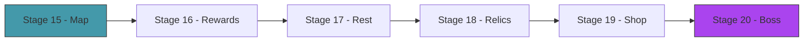

# Act 3 — The Spire

> *One fight is a puzzle. A run is a journey. In this act you build the roguelike layer: a branching map of encounters, card rewards that grow your deck, rest sites for healing, shops for buying and removing cards, and a boss that tests everything you've built.*



---

## Stage 15 — The Map

> *Difficulty: Medium — A procedural branching path from floor 1 to the boss.*

*~65 min*

The map is a directed graph: each floor has 2-3 nodes, and each node connects to 1-2 nodes on the next floor. The player chooses a path through the map, encountering different node types: combat, elite, rest site, shop, event.

> [!tip] What You'll Learn
> - Procedural map generation with seeded randomness
> - Node types and their distribution
> - Graph representation as `Vec<Vec<MapNode>>`
> - Why seeded randomness enables reproducible runs

### Concept: Seeded Randomness

In Python, `random.seed(42)` makes random output reproducible. Rust's `rand` crate works the same way with `StdRng::seed_from_u64(42)`. The key difference: Rust makes you pass the RNG explicitly instead of using a global one. This means you can have multiple independent RNG streams — one for the map, one for card rewards, one for shuffling.

### 15.1 — Map generation

Create `src/map.rs` and add `mod map;` to `main.rs`:

```rust
use rand::{Rng, SeedableRng};
use rand::rngs::StdRng;

#[derive(Debug, Clone, Copy, PartialEq)]
pub enum NodeType {
    Combat,
    Elite,
    RestSite,
    Shop,
    Event,
    Boss,
}

#[derive(Debug, Clone)]
pub struct MapNode {
    pub node_type: NodeType,
    pub connections: Vec<usize>, // indices into the next floor's nodes
}

pub struct GameMap {
    pub floors: Vec<Vec<MapNode>>,
    pub current_floor: usize,
    pub current_node: usize,
}
```

Now implement `GameMap::generate(seed: u64)`. The rules:
- 15 floors, 2-3 nodes per floor
- Floor 0 is always Combat, floor 14 is always Boss
- Other floors: 55% Combat, 15% Event, 12% Rest, 8% Elite, 10% Shop
- Each node connects to 1-2 random nodes on the next floor

Try it yourself, then compare:

<details>
<summary>Solution</summary>

```rust
impl GameMap {
    pub fn generate(seed: u64) -> Self {
        let mut rng = StdRng::seed_from_u64(seed);
        let num_floors = 15;
        let mut floors: Vec<Vec<MapNode>> = Vec::new();

        for floor in 0..num_floors {
            let num_nodes = rng.gen_range(2..=3);
            let mut nodes = Vec::new();

            for _ in 0..num_nodes {
                let node_type = match floor {
                    0 => NodeType::Combat,
                    f if f == num_floors - 1 => NodeType::Boss,
                    _ => {
                        let roll: f32 = rng.gen();
                        if roll < 0.55 { NodeType::Combat }
                        else if roll < 0.70 { NodeType::Event }
                        else if roll < 0.82 { NodeType::RestSite }
                        else if roll < 0.90 { NodeType::Elite }
                        else { NodeType::Shop }
                    }
                };

                let connections = if floor < num_floors - 1 {
                    let next_count = rng.gen_range(2..=3);
                    let mut conns: Vec<usize> = (0..next_count).collect();
                    conns.truncate(rng.gen_range(1..=2));
                    conns
                } else {
                    Vec::new()
                };

                nodes.push(MapNode { node_type, connections });
            }

            floors.push(nodes);
        }

        GameMap { floors, current_floor: 0, current_node: 0 }
    }
}
```

</details>

### 15.2 — Map display

```rust
impl GameMap {
    pub fn display(&self) {
        for (floor, nodes) in self.floors.iter().enumerate() {
            let marker = if floor == self.current_floor { ">>>" } else { "   " };
            let node_strs: Vec<String> = nodes.iter().enumerate().map(|(i, n)| {
                let icon = match n.node_type {
                    NodeType::Combat => "M",
                    NodeType::Elite => "E",
                    NodeType::RestSite => "R",
                    NodeType::Shop => "$",
                    NodeType::Event => "?",
                    NodeType::Boss => "B",
                };
                if floor == self.current_floor && i == self.current_node {
                    format!("[{}]", icon)
                } else {
                    format!(" {} ", icon)
                }
            }).collect();
            println!("{} Floor {:2}: {}", marker, floor + 1, node_strs.join("  "));
        }
    }
}
```

### 15.3 — Test map generation

```rust
#[cfg(test)]
mod tests {
    use super::*;

    #[test]
    fn test_map_has_15_floors() {
        let map = GameMap::generate(42);
        assert_eq!(map.floors.len(), 15);
    }

    #[test]
    fn test_first_floor_is_combat() {
        let map = GameMap::generate(42);
        for node in &map.floors[0] {
            assert_eq!(node.node_type, NodeType::Combat);
        }
    }

    #[test]
    fn test_last_floor_is_boss() {
        let map = GameMap::generate(42);
        for node in &map.floors[14] {
            assert_eq!(node.node_type, NodeType::Boss);
        }
    }

    #[test]
    fn test_same_seed_same_map() {
        let map1 = GameMap::generate(42);
        let map2 = GameMap::generate(42);
        assert_eq!(map1.floors.len(), map2.floors.len());
        for (f1, f2) in map1.floors.iter().zip(map2.floors.iter()) {
            assert_eq!(f1.len(), f2.len());
            for (n1, n2) in f1.iter().zip(f2.iter()) {
                assert_eq!(n1.node_type, n2.node_type);
            }
        }
    }
}
```

> [!tip] Extend it
> Add a `node_count_by_type(&self) -> HashMap<NodeType, usize>` method that counts how many nodes of each type exist in the map. You'll need `use std::collections::HashMap;` and `#[derive(Hash, Eq)]` on `NodeType`. Write a test that verifies a generated map has at least 1 Rest site and at least 1 Elite.

> [!check] Checkpoint
> Map generates with 15 floors, combat at the start, boss at the end. Same seed produces the same map. Tests pass. Stage 15 complete.

---

## Stage 16 — Card Rewards

> *Difficulty: Easy — Choose 1 of 3 cards after winning combat.*

*~35 min*

After each combat victory, the player chooses one of three random cards to add to their deck (or skips). This is the core progression mechanic — your deck evolves over the run.

> [!tip] What You'll Learn
> - Reward screen with user choice
> - Adding cards to the deck mid-run
> - Why "skip" is sometimes the best choice (deck dilution)

### 16.1 — Reward screen

Implement the reward function. It should display 3 random cards and let the player pick one (or skip):

```rust
use crate::{cards, deck::Deck};
use std::io::{self, Write};

pub fn offer_card_reward(deck: &mut Deck) {
    let rewards = cards::random_rewards(3);
    println!("\n  Card Reward — choose one (or 's' to skip):");
    for (i, card) in rewards.iter().enumerate() {
        println!("  [{}] {} ({:?}, cost {}) — {}",
            i, card.name, card.rarity, card.cost, card.description);
    }

    print!("  Choice: ");
    io::stdout().flush().unwrap();
    let mut input = String::new();
    io::stdin().read_line(&mut input).unwrap();
    let input = input.trim();

    if input == "s" {
        println!("  Skipped.");
        return;
    }

    if let Ok(idx) = input.parse::<usize>() {
        if idx < rewards.len() {
            let chosen = rewards[idx].clone();
            println!("  Added {} to your deck!", chosen.name);
            deck.discard.push(chosen); // goes to discard (available next shuffle)
        }
    }
}
```

> [!note] Why skip?
> Adding a card to your deck isn't always good. Every card you add dilutes your deck — your best cards appear less often. If the three options are mediocre, skipping keeps your deck lean. This is a core deckbuilder insight: a smaller, focused deck is often better than a large one.

### 16.2 — Test rewards

```rust
#[cfg(test)]
mod tests {
    use super::*;
    use crate::cards;

    #[test]
    fn test_adding_reward_increases_deck_size() {
        let mut deck = Deck::new(cards::starter_deck());
        let initial = deck.total_cards();
        let reward = cards::cleave();
        deck.discard.push(reward);
        assert_eq!(deck.total_cards(), initial + 1);
    }
}
```

> [!check] Checkpoint
> Card rewards display after combat. Picking a card adds it to the deck. Skipping leaves the deck unchanged. Stage 16 complete.

---

## Stage 17 — Rest Sites

> *Difficulty: Easy — Heal or upgrade a card.*

*~30 min*

Rest sites offer two choices: **Rest** (heal 30% of max HP) or **Smith** (upgrade one card in your deck, improving its numbers).

> [!tip] What You'll Learn
> - Card upgrading — mutating card data in place
> - Strategic choice: heal now vs invest in future power
> - Working with mutable references to items in a Vec

### 17.1 — Card upgrading

Add an `upgrade` method to `Card` in `src/card.rs`:

```rust
impl Card {
    pub fn upgrade(&mut self) {
        if self.upgraded { return; }
        self.upgraded = true;
        self.name = format!("{}+", self.name);

        for effect in &mut self.effects {
            match effect {
                Effect::Damage(n) => *n += 3,
                Effect::Block(n) => *n += 3,
                Effect::DrawCards(n) => *n += 1,
                Effect::DamageAll(n) => *n += 3,
                Effect::DamageMulti(d, _) => *d += 1,
                _ => {}
            }
        }
    }
}
```

Strike+ deals 9 instead of 6. Defend+ blocks 8 instead of 5. Simple but impactful.

> [!warning] Common Mistake: Dereferencing with `*n`
> In the match arms, `n` is a `&mut i32` — a mutable reference to the integer inside the enum variant. To modify the actual value, you dereference with `*n += 3`. Without the `*`, you'd be trying to add 3 to a reference, which doesn't compile:
> ```
> error[E0368]: binary assignment operation `+=` cannot be applied to type `&mut i32`
>   --> src/card.rs:45:17
>    |
> 45 |                 n += 3,
>    |                 ^ cannot use `+=` on type `&mut i32`
>    |
> help: `+=` can be used on `i32` if you dereference the left-hand side
>    |
> 45 |                 *n += 3,
>    |                 +
> ```

### 17.2 — Rest site logic

```rust
pub fn rest_site(player: &mut Player, deck: &mut Deck) {
    println!("\n  Rest Site — choose:");
    println!("  [r] Rest (heal {})", player.max_hp * 30 / 100);
    println!("  [s] Smith (upgrade a card)");

    let mut input = String::new();
    io::stdin().read_line(&mut input).unwrap();

    match input.trim() {
        "r" => {
            let heal = player.max_hp * 30 / 100;
            player.hp = (player.hp + heal).min(player.max_hp);
            println!("  Healed {} HP. Now at {}/{}.", heal, player.hp, player.max_hp);
        }
        "s" => {
            // Show all non-upgraded cards
            let all_cards: Vec<&Card> = deck.draw_pile.iter()
                .chain(deck.discard.iter())
                .chain(deck.hand.iter())
                .filter(|c| !c.upgraded)
                .collect();

            if all_cards.is_empty() {
                println!("  No cards to upgrade!");
                return;
            }

            for (i, card) in all_cards.iter().enumerate() {
                println!("  [{}] {} (cost {}) — {}", i, card.name, card.cost, card.description);
            }

            // Read choice and upgrade (simplified — in practice you'd need
            // to find the card in the correct pile and upgrade it there)
            println!("  Choose a card to upgrade:");
        }
        _ => println!("  Invalid choice."),
    }
}
```

### 17.3 — Test upgrading

```rust
#[cfg(test)]
mod tests {
    use super::*;
    use crate::cards;

    #[test]
    fn test_upgrade_increases_damage() {
        let mut strike = cards::strike();
        assert_eq!(strike.effects[0], Effect::Damage(6));
        strike.upgrade();
        assert_eq!(strike.effects[0], Effect::Damage(9));
        assert_eq!(strike.name, "Strike+");
        assert!(strike.upgraded);
    }

    #[test]
    fn test_upgrade_is_idempotent() {
        let mut strike = cards::strike();
        strike.upgrade();
        strike.upgrade(); // second upgrade does nothing
        assert_eq!(strike.effects[0], Effect::Damage(9)); // still 9, not 12
    }
}
```

> [!tip] Extend it
> Add an `upgrade_description(&self) -> String` method to `Card` that shows what the card would look like after upgrading, without actually upgrading it. Example: `"Strike → Strike+ (Deal 9 damage)"`. This is useful for the rest site UI so the player can see the improvement before choosing.

> [!check] Checkpoint
> Rest heals 30% HP. Smith upgrades a card (increased numbers, `+` suffix). Upgrading is idempotent. Tests pass. Stage 17 complete.


---

## Stage 18 — Relics

> *Difficulty: Medium — Passive bonuses that last the entire run.*

*~55 min*

Relics are permanent buffs you collect throughout the run. "Burning Blood: heal 6 HP after each combat." "Vajra: start each combat with +1 Strength." They don't take deck space — they're always active.

> [!tip] What You'll Learn
> - Modeling triggers with enums
> - Checking relic triggers at game events
> - Why relics add another layer of strategic depth

### 18.1 — Relic system

Create `src/relic.rs` and add `mod relic;` to `main.rs`:

```rust
use crate::effect::Effect;

#[derive(Debug, Clone)]
pub enum RelicTrigger {
    CombatStart(Effect),     // apply effect at start of each combat
    CombatEnd(Effect),       // apply effect after each combat
    TurnStart(Effect),       // apply effect at start of each turn
    Passive,                 // always active (handled by specific checks)
}

#[derive(Debug, Clone)]
pub struct Relic {
    pub name: String,
    pub description: String,
    pub trigger: RelicTrigger,
}

impl Relic {
    pub fn new(name: &str, description: &str, trigger: RelicTrigger) -> Self {
        Relic {
            name: name.to_string(),
            description: description.to_string(),
            trigger,
        }
    }
}
```

### 18.2 — Relic definitions

Try defining 3-4 relics yourself. Think about when each should trigger and what effect it applies. Then compare:

<details>
<summary>Solution</summary>

```rust
use crate::effect::{Effect, StatusType};

pub fn burning_blood() -> Relic {
    Relic::new("Burning Blood", "Heal 6 HP after each combat.",
        RelicTrigger::CombatEnd(Effect::Block(0))) // placeholder — heal handled specially
}

pub fn vajra() -> Relic {
    Relic::new("Vajra", "Start each combat with +1 Strength.",
        RelicTrigger::CombatStart(Effect::ApplySelfStatus(StatusType::Strength, 1)))
}

pub fn bag_of_preparation() -> Relic {
    Relic::new("Bag of Preparation", "Draw 2 additional cards at the start of each combat.",
        RelicTrigger::CombatStart(Effect::DrawCards(2)))
}

pub fn lantern() -> Relic {
    Relic::new("Lantern", "Gain 1 energy at the start of each combat.",
        RelicTrigger::CombatStart(Effect::GainEnergy(1)))
}

pub fn all_relics() -> Vec<Relic> {
    vec![burning_blood(), vajra(), bag_of_preparation(), lantern()]
}
```

</details>

### 18.3 — Applying relic triggers

Add a method to check and apply relics at the appropriate game moment:

```rust
pub fn apply_relics_for_event(
    relics: &[Relic],
    event: &RelicEvent,
    player: &mut crate::player::Player,
    deck: &mut crate::deck::Deck,
) {
    for relic in relics {
        let should_trigger = match (&relic.trigger, event) {
            (RelicTrigger::CombatStart(_), RelicEvent::CombatStart) => true,
            (RelicTrigger::CombatEnd(_), RelicEvent::CombatEnd) => true,
            (RelicTrigger::TurnStart(_), RelicEvent::TurnStart) => true,
            _ => false,
        };

        if should_trigger {
            if let Some(effect) = match &relic.trigger {
                RelicTrigger::CombatStart(e)
                | RelicTrigger::CombatEnd(e)
                | RelicTrigger::TurnStart(e) => Some(e),
                RelicTrigger::Passive => None,
            } {
                match effect {
                    Effect::GainEnergy(n) => player.energy += n,
                    Effect::DrawCards(n) => deck.draw(*n),
                    Effect::ApplySelfStatus(status, stacks) => {
                        player.statuses.apply(*status, *stacks);
                    }
                    _ => {}
                }
            }
        }
    }
}

#[derive(Debug)]
pub enum RelicEvent {
    CombatStart,
    CombatEnd,
    TurnStart,
}
```

### 18.4 — Test relics

```rust
#[cfg(test)]
mod tests {
    use super::*;
    use crate::{player::Player, deck::Deck, cards};

    #[test]
    fn test_vajra_grants_strength_at_combat_start() {
        let relics = vec![vajra()];
        let mut player = Player::new(80);
        let mut deck = Deck::new(cards::starter_deck());

        apply_relics_for_event(&relics, &RelicEvent::CombatStart, &mut player, &mut deck);
        assert_eq!(player.statuses.strength, 1);
    }

    #[test]
    fn test_lantern_grants_energy() {
        let relics = vec![lantern()];
        let mut player = Player::new(80);
        let mut deck = Deck::new(cards::starter_deck());

        apply_relics_for_event(&relics, &RelicEvent::CombatStart, &mut player, &mut deck);
        assert_eq!(player.energy, 4); // 3 base + 1 from lantern
    }
}
```

> [!tip] Extend it
> Add a `relic_summary(relics: &[Relic]) -> String` function that returns a comma-separated list of relic names. Add a `has_relic(relics: &[Relic], name: &str) -> bool` helper. These will be useful for the UI and for conditional game logic (some relics interact with each other).

> [!check] Checkpoint
> Relics trigger at the right game events. Vajra grants Strength, Lantern grants energy. Tests pass. Stage 18 complete.

---

## Stage 19 — The Shop

> *Difficulty: Medium — Spend gold to buy cards, remove cards, or buy relics.*

*~50 min*

Gold is earned from combat. The shop sells random cards (at a price), lets you remove a card from your deck (deck thinning!), and sells relics.

> [!tip] What You'll Learn
> - Resource management (gold)
> - Card removal as a strategic mechanic
> - Pricing by rarity

### 19.1 — Shop struct

Create `src/shop.rs` and add `mod shop;` to `main.rs`:

```rust
use crate::{card::Card, relic::Relic, cards};
use rand::seq::SliceRandom;

pub struct Shop {
    pub cards: Vec<(Card, i32)>,    // (card, price)
    pub relics: Vec<(Relic, i32)>,  // (relic, price)
    pub remove_cost: i32,           // cost to remove a card
}

impl Shop {
    pub fn generate() -> Self {
        let mut rng = rand::thread_rng();
        let all = cards::all_cards();
        let shop_cards: Vec<(Card, i32)> = all.choose_multiple(&mut rng, 5)
            .map(|c| {
                let price = match c.rarity {
                    crate::card::Rarity::Common => 50,
                    crate::card::Rarity::Uncommon => 100,
                    crate::card::Rarity::Rare => 200,
                    crate::card::Rarity::Starter => 25,
                };
                (c.clone(), price)
            })
            .collect();

        Shop {
            cards: shop_cards,
            relics: Vec::new(), // simplified — add relic shopping as an extension
            remove_cost: 75,
        }
    }

    /// Buy a card by index. Returns the card if successful.
    pub fn buy_card(&mut self, index: usize, gold: &mut i32) -> Result<Card, String> {
        if index >= self.cards.len() {
            return Err("Invalid card index".to_string());
        }
        let (_, price) = &self.cards[index];
        if *gold < *price {
            return Err(format!("Not enough gold: need {}, have {}", price, gold));
        }
        let (card, price) = self.cards.remove(index);
        *gold -= price;
        Ok(card)
    }

    /// Remove a card from the deck. Costs gold.
    pub fn remove_card(
        &self, deck: &mut crate::deck::Deck, card_idx: usize, gold: &mut i32,
    ) -> Result<String, String> {
        if *gold < self.remove_cost {
            return Err(format!("Not enough gold: need {}, have {}", self.remove_cost, gold));
        }

        // Collect all cards from all piles for selection
        let total = deck.draw_pile.len() + deck.discard.len();
        if card_idx >= total {
            return Err("Invalid card index".to_string());
        }

        let removed_name = if card_idx < deck.draw_pile.len() {
            let card = deck.draw_pile.remove(card_idx);
            card.name
        } else {
            let adj_idx = card_idx - deck.draw_pile.len();
            let card = deck.discard.remove(adj_idx);
            card.name
        };

        *gold -= self.remove_cost;
        Ok(removed_name)
    }
}
```

### 19.2 — Test the shop

```rust
#[cfg(test)]
mod tests {
    use super::*;
    use crate::{deck::Deck, cards};

    #[test]
    fn test_buy_card_reduces_gold() {
        let mut shop = Shop::generate();
        let mut gold = 200;
        let initial_count = shop.cards.len();

        let result = shop.buy_card(0, &mut gold);
        assert!(result.is_ok());
        assert!(gold < 200);
        assert_eq!(shop.cards.len(), initial_count - 1);
    }

    #[test]
    fn test_buy_card_insufficient_gold() {
        let mut shop = Shop::generate();
        let mut gold = 0;

        let result = shop.buy_card(0, &mut gold);
        assert!(result.is_err());
    }

    #[test]
    fn test_remove_card_shrinks_deck() {
        let shop = Shop { cards: vec![], relics: vec![], remove_cost: 75 };
        let mut deck = Deck::new(cards::starter_deck());
        let mut gold = 100;
        let initial = deck.total_cards();

        let result = shop.remove_card(&mut deck, 0, &mut gold);
        assert!(result.is_ok());
        assert_eq!(deck.total_cards(), initial - 1);
        assert_eq!(gold, 25);
    }
}
```

> [!tip] Extend it
> Add relic shopping: populate `shop.relics` with 2 random relics priced at 150-250 gold. Add a `buy_relic` method similar to `buy_card`. Write a test for it.

> [!check] Checkpoint
> Shop generates with priced cards. Buying reduces gold and removes from shop inventory. Card removal shrinks the deck. Insufficient gold returns errors. Tests pass. Stage 19 complete.

---

## Stage 20 — The Boss

> *Difficulty: Hard — A multi-phase boss fight and the full run loop.*

*~70 min*

The boss is the final test. Higher HP, unique mechanics, multiple phases. This stage also wires the entire run together: map → combat → rewards → rest → shop → boss.

> [!tip] What You'll Learn
> - Boss design with phases
> - The complete game loop from start to finish
> - Connecting all modules into a playable run
> - Why the run structure creates emergent strategy

### 20.1 — Boss definition

```rust
// In enemy.rs:
pub fn slime_boss() -> Enemy {
    Enemy::new("Slime Boss", 140, vec![
        Intent::Attack(35),
        Intent::Debuff(StatusType::Weak, 1),
        Intent::Attack(35),
    ])
}

pub fn hexaghost() -> Enemy {
    Enemy::new("Hexaghost", 250, vec![
        Intent::Buff(StatusType::Strength, 2),
        Intent::Attack(6),
        Intent::Attack(6),
        Intent::Attack(6),
        Intent::Attack(6),
        Intent::Attack(6),
        Intent::Attack(6),
        Intent::Buff(StatusType::Strength, 2), // cycle: buff then 6 attacks
    ])
}
```

The Slime Boss hits for 35 — nearly half your HP. You need strong block or you die in 2 hits. The Hexaghost buffs then attacks 6 times — Strength stacks make each hit progressively harder.

### 20.2 — The full run loop

Create `src/run.rs` and add `mod run;` to `main.rs`. This wires everything together:

```rust
use crate::*;

pub struct GameRun {
    pub player: player::Player,
    pub deck: deck::Deck,
    pub map: map::GameMap,
    pub relics: Vec<relic::Relic>,
    pub gold: i32,
}

impl GameRun {
    pub fn new(seed: u64) -> Self {
        GameRun {
            player: player::Player::new(80),
            deck: deck::Deck::new(cards::starter_deck()),
            map: map::GameMap::generate(seed),
            relics: Vec::new(),
            gold: 99,
        }
    }
}

pub fn run_game(seed: u64) {
    let mut run = GameRun::new(seed);

    for floor in 0..run.map.floors.len() {
        run.map.current_floor = floor;
        run.map.display();

        let node_type = run.map.floors[floor][run.map.current_node].node_type;

        match node_type {
            map::NodeType::Combat => {
                let enemies = vec![enemy::jaw_worm()]; // simplified — vary by floor
                let mut combat = combat::Combat::new(
                    run.player.clone(), run.deck.clone(), enemies,
                );
                relic::apply_relics_for_event(
                    &run.relics, &relic::RelicEvent::CombatStart,
                    &mut combat.player, &mut combat.deck,
                );
                combat::run_combat_text(&mut combat);

                if combat.is_defeat() {
                    println!("\n  Run over on floor {}!", floor + 1);
                    return;
                }

                // Sync state back
                run.player = combat.player;
                run.deck = combat.deck;
                run.gold += 25;

                // Card reward
                combat::offer_card_reward(&mut run.deck);
            }
            map::NodeType::Elite => {
                // Similar to combat but with elite enemies and better rewards
                println!("  Elite encounter!");
            }
            map::NodeType::RestSite => {
                combat::rest_site(&mut run.player, &mut run.deck);
            }
            map::NodeType::Shop => {
                let mut shop = shop::Shop::generate();
                println!("  Shop! Gold: {}", run.gold);
                // ... shop interaction loop ...
            }
            map::NodeType::Boss => {
                let boss = vec![enemy::slime_boss()];
                let mut combat = combat::Combat::new(
                    run.player.clone(), run.deck.clone(), boss,
                );
                combat::run_combat_text(&mut combat);

                if combat.is_victory() {
                    println!("\n  You conquered the Spire!");
                } else {
                    println!("\n  Defeated by the boss...");
                }
                return;
            }
            map::NodeType::Event => {
                println!("  A mysterious event... (nothing happens yet)");
            }
        }
    }
}
```

> [!warning] Common Mistake: Cloning game state for combat
> Notice `run.player.clone()` and `run.deck.clone()` when creating a `Combat`. Why clone? Because `Combat` takes ownership of the player and deck. After combat, we sync the modified state back: `run.player = combat.player`.
>
> An alternative design would have `Combat` borrow `&mut Player` and `&mut Deck`, but that creates complex lifetime issues when combat needs to store references alongside owned data. Cloning is simpler and the cost is negligible (a deck is ~20 small structs).

### 20.3 — Test the run structure

```rust
#[cfg(test)]
mod tests {
    use super::*;

    #[test]
    fn test_game_run_initializes() {
        let run = GameRun::new(42);
        assert_eq!(run.player.hp, 80);
        assert_eq!(run.deck.total_cards(), 10);
        assert_eq!(run.map.floors.len(), 15);
        assert_eq!(run.gold, 99);
        assert!(run.relics.is_empty());
    }
}
```

> [!tip] Extend it
> Add floor-appropriate enemy spawning: floors 0-4 spawn easy enemies (Jaw Worm, Louse), floors 5-9 spawn medium enemies (Cultist, Slime Gang), floors 10-13 spawn hard enemies. Write a `spawn_enemies(floor: usize) -> Vec<Enemy>` function with this logic.

> [!check] Checkpoint
> A complete run plays from floor 1 to the boss. Combat, rewards, rest sites, and shops all work. The run ends in victory or defeat. Stage 20 complete.

---

## Act 3 Complete — The Spire

| Component | What it does |
|-----------|-------------|
| `GameMap` | 15-floor branching path with seeded generation |
| Card rewards | Choose 1 of 3 after combat, or skip |
| Rest sites | Heal 30% or upgrade a card |
| `Relic` | Permanent passive bonuses with trigger events |
| `Shop` | Buy cards, remove cards, spend gold |
| Boss | High-HP enemy with unique patterns |
| `GameRun` | Full run loop: map → encounter → reward → repeat → boss |

| Rust Concept | Where You Used It |
|-------------|-------------------|
| Seeded RNG | `StdRng::seed_from_u64` for reproducible maps |
| `Vec<Vec<MapNode>>` | 2D graph representation |
| `Clone` for state isolation | Cloning player/deck into combat, syncing back |
| `Result` returns | Shop buy/remove operations |
| `&mut` references | Upgrading cards in place, modifying gold |
| Dereference `*n` | Mutating values inside enum variants during upgrade |

**Next up — Act 4: The Mind.** Monte Carlo Tree Search — the AI that plays your game better than you do.
