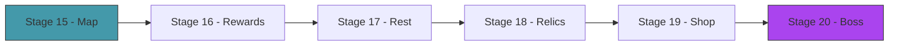

# Act 3 — The Spire

> *One fight is a puzzle. A run is a journey. In this act you build the roguelike layer: a branching map of encounters, card rewards that grow your deck, rest sites for healing, shops for buying and removing cards, and a boss that tests everything you've built.*



---

## Stage 15 — The Map

> *Difficulty: Medium — A procedural branching path from floor 1 to the boss.*

The map is a directed graph: each floor has 2-3 nodes, and each node connects to 1-2 nodes on the next floor. The player chooses a path through the map, encountering different node types: combat, elite, rest site, shop, event.

> [!tip] What You'll Learn
> - Procedural map generation with seeded randomness
> - Node types and their distribution
> - Graph representation as `Vec<Vec<MapNode>>`
> - Why branching paths create replayability

### 15.1 — Map generation

Create `src/map.rs`:

```rust
use rand::{Rng, SeedableRng};
use rand::rngs::StdRng;

#[derive(Debug, Clone, Copy, PartialEq)]
pub enum NodeType {
    Combat,
    Elite,
    RestSite,
    Shop,
    Event,
    Boss,
}

#[derive(Debug, Clone)]
pub struct MapNode {
    pub node_type: NodeType,
    pub connections: Vec<usize>, // indices into the next floor's nodes
}

pub struct GameMap {
    pub floors: Vec<Vec<MapNode>>,
    pub current_floor: usize,
    pub current_node: usize,
}

impl GameMap {
    pub fn generate(seed: u64) -> Self {
        let mut rng = StdRng::seed_from_u64(seed);
        let num_floors = 15;
        let mut floors: Vec<Vec<MapNode>> = Vec::new();

        for floor in 0..num_floors {
            let num_nodes = rng.gen_range(2..=3);
            let mut nodes = Vec::new();

            for _ in 0..num_nodes {
                let node_type = match floor {
                    0 => NodeType::Combat,                    // first floor always combat
                    f if f == num_floors - 1 => NodeType::Boss, // last floor always boss
                    _ => {
                        let roll: f32 = rng.gen();
                        if roll < 0.55 { NodeType::Combat }
                        else if roll < 0.70 { NodeType::Event }
                        else if roll < 0.82 { NodeType::RestSite }
                        else if roll < 0.90 { NodeType::Elite }
                        else { NodeType::Shop }
                    }
                };

                // Connections to next floor (1-2 random nodes)
                let connections = if floor < num_floors - 1 {
                    let next_count = rng.gen_range(2..=3);
                    let mut conns: Vec<usize> = (0..next_count).collect();
                    conns.truncate(rng.gen_range(1..=2));
                    conns
                } else {
                    Vec::new()
                };

                nodes.push(MapNode { node_type, connections });
            }

            floors.push(nodes);
        }

        GameMap { floors, current_floor: 0, current_node: 0 }
    }

    /// Display the map as ASCII.
    pub fn display(&self) {
        for (floor, nodes) in self.floors.iter().enumerate() {
            let marker = if floor == self.current_floor { ">>>" } else { "   " };
            let node_strs: Vec<String> = nodes.iter().enumerate().map(|(i, n)| {
                let icon = match n.node_type {
                    NodeType::Combat => "⚔",
                    NodeType::Elite => "☠",
                    NodeType::RestSite => "🔥",
                    NodeType::Shop => "$",
                    NodeType::Event => "?",
                    NodeType::Boss => "👑",
                };
                if floor == self.current_floor && i == self.current_node {
                    format!("[{}]", icon)
                } else {
                    format!(" {} ", icon)
                }
            }).collect();
            println!("{} Floor {:2}: {}", marker, floor + 1, node_strs.join("  "));
        }
    }
}
```

The map is seeded — the same seed produces the same map. This enables "daily challenge" runs where everyone plays the same map.

> [!check] Checkpoint
> Generate a map with seed 42. Display it. Verify floor 1 is combat and floor 15 is boss. Verify branching paths exist. Stage 15 complete.

---

## Stage 16 — Card Rewards

> *Difficulty: Easy — Choose 1 of 3 cards after winning combat.*

After each combat victory, the player chooses one of three random cards to add to their deck (or skips). This is the core progression mechanic — your deck evolves over the run.

### 16.1 — Reward screen

```rust
pub fn offer_card_reward(deck: &mut Deck) {
    let rewards = cards::random_rewards(3);
    println!("\n  Card Reward — choose one (or 's' to skip):");
    for (i, card) in rewards.iter().enumerate() {
        println!("  [{}] {} ({:?}, cost {}) — {}", i, card.name, card.rarity, card.cost, card.description);
    }

    let mut input = String::new();
    std::io::stdin().read_line(&mut input).unwrap();
    if let Ok(idx) = input.trim().parse::<usize>() {
        if idx < rewards.len() {
            let chosen = rewards[idx].clone();
            println!("  Added {} to your deck!", chosen.name);
            deck.discard.push(chosen); // goes to discard (available next shuffle)
        }
    }
}
```

> [!check] Checkpoint
> Win a fight, see 3 card options, pick one, verify it's in your deck. Stage 16 complete.

---

## Stage 17 — Rest Sites

> *Difficulty: Easy — Heal or upgrade a card.*

Rest sites offer two choices: **Rest** (heal 30% of max HP) or **Smith** (upgrade one card in your deck, improving its numbers).

### 17.1 — Card upgrading

```rust
impl Card {
    pub fn upgrade(&mut self) {
        if self.upgraded { return; }
        self.upgraded = true;
        self.name = format!("{}+", self.name);

        // Improve each effect
        for effect in &mut self.effects {
            match effect {
                Effect::Damage(n) => *n += 3,
                Effect::Block(n) => *n += 3,
                Effect::DrawCards(n) => *n += 1,
                Effect::DamageAll(n) => *n += 3,
                Effect::DamageMulti(d, _) => *d += 1,
                _ => {}
            }
        }
    }
}
```

Strike+ deals 9 instead of 6. Defend+ blocks 8 instead of 5. Simple but impactful.

> [!check] Checkpoint
> Rest at a rest site. Verify healing restores 30% HP. Upgrade Strike and verify it becomes Strike+ with increased damage. Stage 17 complete.

---

## Stage 18 — Relics

> *Difficulty: Medium — Passive bonuses that last the entire run.*

Relics are permanent buffs you collect throughout the run. "Burning Blood: heal 6 HP after each combat." "Vajra: start each combat with +1 Strength." They don't take deck space — they're always active.

### 18.1 — Relic system

```rust
#[derive(Debug, Clone)]
pub struct Relic {
    pub name: String,
    pub description: String,
    pub trigger: RelicTrigger,
}

#[derive(Debug, Clone)]
pub enum RelicTrigger {
    CombatStart(Effect),     // apply effect at start of each combat
    CombatEnd(Effect),       // apply effect after each combat
    TurnStart(Effect),       // apply effect at start of each turn
    Passive,                 // always active (handled by specific checks)
}
```

Define 10+ relics. Check triggers at the appropriate game moments.

> [!check] Checkpoint
> Collect a relic. Verify its effect triggers at the right time (combat start, turn start, etc.). Stage 18 complete.

---

## Stage 19 — The Shop

> *Difficulty: Medium — Spend gold to buy cards, remove cards, or buy relics.*

Gold is earned from combat. The shop sells random cards (at a price), lets you remove a card from your deck (deck thinning!), and sells relics.

### 19.1 — Shop screen

```rust
pub struct Shop {
    pub cards: Vec<(Card, i32)>,    // (card, price)
    pub relics: Vec<(Relic, i32)>,  // (relic, price)
    pub remove_cost: i32,           // cost to remove a card
}
```

Card prices: Common 50-75g, Uncommon 75-150g, Rare 150-300g. Card removal: 75g (increases each time). Relic prices: 150-300g.

> [!check] Checkpoint
> Enter a shop with gold. Buy a card, verify it's added to your deck and gold decreases. Remove a card, verify it's gone from your deck. Stage 19 complete.

---

## Stage 20 — The Boss

> *Difficulty: Hard — A multi-phase boss fight.*

The boss is the final test. Higher HP, unique mechanics, multiple phases. The Hexaghost: starts with 6 orbs that each fire once, then enters a damage phase. The Slime Boss: splits into two smaller slimes at half HP.

### 20.1 — Boss definition

```rust
pub fn slime_boss() -> Enemy {
    Enemy::new("Slime Boss", 140, vec![
        Intent::Attack(35),  // slam (huge damage)
        Intent::Debuff(StatusType::Weak, 1),
        Intent::Attack(35),
        // At 50% HP: splits into 2 smaller slimes (handled by combat logic)
    ])
}
```

### 20.2 — The full run

Wire map → combat → rewards → rest → shop → boss into a complete run loop:

```rust
pub fn run_game(seed: u64) {
    let map = GameMap::generate(seed);
    let mut player = Player::new(80);
    let mut deck = Deck::new(cards::starter_deck());
    let mut relics: Vec<Relic> = Vec::new();
    let mut gold = 99;

    for floor in 0..map.floors.len() {
        map.display();
        let node = &map.floors[floor][map.current_node];

        match node.node_type {
            NodeType::Combat | NodeType::Elite => {
                let enemies = spawn_enemies_for_floor(floor, node.node_type);
                let mut combat = Combat::new(player.clone(), deck.clone(), enemies);
                run_combat_text(&mut combat);
                if combat.is_defeat() { println!("Run over!"); return; }
                offer_card_reward(&mut deck);
                gold += 25;
            }
            NodeType::RestSite => { /* heal or smith */ }
            NodeType::Shop => { /* buy/remove/relic */ }
            NodeType::Boss => { /* boss fight */ }
            NodeType::Event => { /* random event */ }
        }
    }

    println!("You conquered the Spire!");
}
```

> [!check] Checkpoint
> Complete a full run: 15 floors, combat encounters, card rewards, rest sites, and a boss fight. Win or lose, the run plays from start to finish. Stage 20 complete.

---

## Act 3 Complete — The Spire

| Component | What it does |
|-----------|-------------|
| Procedural map | 15-floor branching path with seeded generation |
| Card rewards | Choose 1 of 3 after combat |
| Rest sites | Heal 30% or upgrade a card |
| Relics | Permanent passive bonuses |
| Shop | Buy cards, remove cards, buy relics |
| Boss | Multi-phase final encounter |
| Full run loop | Map → encounter → reward → repeat → boss |

**Next up — Act 4: The Mind.** Monte Carlo Tree Search — the AI that plays your game better than you do.
