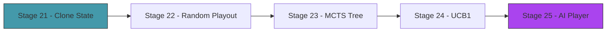

# Act 4 — The Mind

> *You've been playing the game. Now the game plays itself. Monte Carlo Tree Search doesn't know card strategy — it doesn't know that Bash before Strike is optimal, or that deck thinning matters. It discovers these things by simulating thousands of random games and picking the move that wins most often. The same algorithm powered AlphaGo. You're building it for cards.*



---

## Stage 21 — Cloneable Game State

> *Difficulty: Medium — Make the entire game state cheaply cloneable.*

MCTS works by simulating: "if I play this card, what happens?" To simulate without affecting the real game, we need to clone the entire game state — player, deck, enemies, statuses — and play out the clone. This stage adds `Clone` to everything and optimizes the clone cost.

> [!tip] What You'll Learn
> - `#[derive(Clone)]` on complex nested structs
> - Why cloneable state is essential for simulation-based AI
> - Measuring clone cost
> - The tradeoff: clone speed vs state complexity

### 21.1 — Add Clone everywhere

Every struct in the game needs `Clone`: `Player`, `Deck`, `Enemy`, `Combat`, `Card`, `StatusEffects`. Most already have it from serde derives. Verify:

```rust
let state = Combat::new(player, deck, enemies);
let clone = state.clone(); // must compile
```

The entire combat state (player + deck of 20 cards + 3 enemies) should clone in under 1 microsecond. MCTS will clone thousands of times per decision.

### 21.2 — Available actions

The AI needs to know what moves are legal:

```rust
impl Combat {
    /// List all legal actions the player can take right now.
    pub fn legal_actions(&self) -> Vec<Action> {
        let mut actions = Vec::new();

        // Play each affordable card in hand
        for (i, card) in self.deck.hand.iter().enumerate() {
            if self.player.energy >= card.cost {
                if card.target == Target::SingleEnemy {
                    for (e, enemy) in self.enemies.iter().enumerate() {
                        if !enemy.is_dead() {
                            actions.push(Action::PlayCard(i, Some(e)));
                        }
                    }
                } else {
                    actions.push(Action::PlayCard(i, None));
                }
            }
        }

        // End turn is always an option
        actions.push(Action::EndTurn);

        actions
    }
}

#[derive(Debug, Clone)]
pub enum Action {
    PlayCard(usize, Option<usize>), // (hand index, target enemy index)
    EndTurn,
}
```

> [!check] Checkpoint
> Clone a combat state. Verify the clone is independent (modifying one doesn't affect the other). List legal actions and verify they match the hand/energy state. Stage 21 complete.

---

## Stage 22 — Random Playout

> *Difficulty: Medium — Play randomly until combat ends, record the result.*

The simplest form of MCTS evaluation: from a given state, play random legal actions until someone wins or loses. Do this 100 times and count wins. The move that leads to the most wins is probably the best.

> [!tip] What You'll Learn
> - Random playout (rollout) — the evaluation function of MCTS
> - Why random play is a surprisingly good estimator
> - Playout speed — how many simulations per second?

### 22.1 — Random playout

Create `src/ai.rs`:

```rust
use crate::combat::{Combat, Action};
use rand::seq::SliceRandom;

/// Play randomly from the current state until combat ends.
/// Returns true if the player wins.
pub fn random_playout(state: &Combat) -> bool {
    let mut sim = state.clone();
    let mut turns = 0;
    const MAX_TURNS: i32 = 50;

    // If we're mid-turn, finish it
    while !sim.is_over() && turns < MAX_TURNS {
        let actions = sim.legal_actions();
        if actions.is_empty() { break; }

        let action = actions.choose(&mut rand::thread_rng()).unwrap().clone();

        match action {
            Action::PlayCard(hand_idx, target) => {
                sim.play_card_by_index(hand_idx, target);
            }
            Action::EndTurn => {
                sim.end_turn();
                if !sim.is_over() {
                    sim.start_turn();
                }
                turns += 1;
            }
        }
    }

    sim.is_victory()
}

/// Evaluate a state by running N random playouts.
/// Returns the win rate (0.0 to 1.0).
pub fn evaluate(state: &Combat, num_playouts: usize) -> f64 {
    let wins = (0..num_playouts).filter(|_| random_playout(state)).count();
    wins as f64 / num_playouts as f64
}
```

### 22.2 — Test it

```rust
let combat = Combat::new(player, deck, vec![slime()]);
combat.start_turn();

let win_rate = ai::evaluate(&combat, 1000);
println!("Win rate from this state: {:.1}%", win_rate * 100.0);
```

Against a Jaw Worm with the starter deck, the win rate should be 60-80% (it's a winnable fight). Against the boss, much lower.

> [!check] Checkpoint
> Run 1000 random playouts from a combat state. Verify the win rate is reasonable (not 0% or 100% for a balanced fight). Stage 22 complete.

---

## Stage 23 — The MCTS Tree

> *Difficulty: Hard — Selection, expansion, simulation, backpropagation.*

Pure random playout evaluates the *current* state. MCTS builds a *tree* of states, exploring promising branches more deeply. Each node tracks: how many times it was visited, how many simulations from it resulted in a win. The algorithm has four phases:

1. **Selection** — walk down the tree, choosing the most promising child at each level
2. **Expansion** — when you reach a leaf, add its children (one per legal action)
3. **Simulation** — from the new child, run a random playout
4. **Backpropagation** — walk back up, updating visit counts and win counts

> [!tip] What You'll Learn
> - The MCTS algorithm (4 phases)
> - Tree nodes with visit/win statistics
> - Why MCTS converges to optimal play given enough simulations
> - The exploration/exploitation tradeoff

### 23.1 — The tree node

```rust
pub struct MctsNode {
    pub state: Combat,
    pub action: Option<Action>,  // action that led to this state
    pub parent: Option<usize>,   // index of parent node
    pub children: Vec<usize>,    // indices of child nodes
    pub visits: u32,
    pub wins: f64,
    pub untried_actions: Vec<Action>,
}
```

### 23.2 — The MCTS loop

```rust
pub struct Mcts {
    pub nodes: Vec<MctsNode>,
}

impl Mcts {
    pub fn search(&mut self, iterations: usize) -> Action {
        for _ in 0..iterations {
            // 1. Selection: walk down tree using UCB1
            let leaf = self.select();

            // 2. Expansion: add a child for an untried action
            let child = self.expand(leaf);

            // 3. Simulation: random playout from the child
            let win = random_playout(&self.nodes[child].state);

            // 4. Backpropagation: update stats up the tree
            self.backpropagate(child, win);
        }

        // Return the action of the most-visited child of root
        let root_children = &self.nodes[0].children;
        let best = root_children.iter()
            .max_by_key(|&&c| self.nodes[c].visits)
            .unwrap();
        self.nodes[*best].action.clone().unwrap()
    }
}
```

> [!check] Checkpoint
> Run MCTS with 500 iterations. Verify it returns a legal action. Verify the most-visited child has the highest win rate. Stage 23 complete.

---

## Stage 24 — UCB1 Selection

> *Difficulty: Medium — Balancing exploration and exploitation.*

How does MCTS choose which child to explore? **UCB1** (Upper Confidence Bound): pick the child that maximizes `win_rate + C × sqrt(ln(parent_visits) / child_visits)`. The first term favors nodes that win often (exploitation). The second term favors nodes that haven't been visited much (exploration). `C` controls the balance (typically √2).

> [!tip] What You'll Learn
> - The UCB1 formula and why it works
> - Exploration vs exploitation — the fundamental tradeoff in search
> - Why MCTS doesn't need domain knowledge (UCB1 handles exploration automatically)

### 24.1 — UCB1

```rust
fn ucb1(node: &MctsNode, parent_visits: u32, c: f64) -> f64 {
    if node.visits == 0 {
        return f64::INFINITY; // always explore unvisited nodes
    }
    let exploitation = node.wins / node.visits as f64;
    let exploration = c * ((parent_visits as f64).ln() / node.visits as f64).sqrt();
    exploitation + exploration
}
```

The `f64::INFINITY` for unvisited nodes ensures every child is tried at least once before any is tried twice. After that, UCB1 naturally balances between "this looks good" and "I haven't checked this enough."

> [!check] Checkpoint
> Verify UCB1 returns infinity for unvisited nodes. Verify it favors high-win-rate nodes when visit counts are equal. Verify it favors low-visit nodes when win rates are equal. Stage 24 complete.

---

## Stage 25 — The AI Player

> *Difficulty: Medium — Wire MCTS into the game loop.*

Replace the human input with MCTS decisions. The AI "thinks" for a configurable number of iterations, then plays the best move. Watch it play — it discovers Bash-before-Strike, it blocks when the enemy telegraphs a big attack, it manages energy efficiently.

> [!tip] What You'll Learn
> - Integrating AI into the game loop
> - Configurable thinking time (more iterations = better play, slower)
> - Watching AI discover strategy
> - Comparing AI win rate vs random play

### 25.1 — AI combat loop

```rust
pub fn run_combat_ai(combat: &mut Combat, iterations: usize) {
    loop {
        combat.start_turn();

        // AI plays cards
        loop {
            let actions = combat.legal_actions();
            if actions.len() <= 1 { break; } // only EndTurn available

            let mut mcts = Mcts::new(combat.clone());
            let action = mcts.search(iterations);

            match action {
                Action::PlayCard(idx, target) => {
                    let card_name = combat.deck.hand[idx].name.clone();
                    println!("  AI plays: {}", card_name);
                    combat.play_card_by_index(idx, target);
                }
                Action::EndTurn => break,
            }

            if combat.is_over() { break; }
        }

        combat.end_turn();
        if combat.is_over() { break; }
    }
}
```

### 25.2 — Benchmark

```rust
// Compare AI vs random over 100 games
let ai_wins = (0..100).filter(|_| {
    let mut combat = new_combat();
    run_combat_ai(&mut combat, 500);
    combat.is_victory()
}).count();

let random_wins = (0..100).filter(|_| {
    let mut combat = new_combat();
    // ... run with random actions ...
    combat.is_victory()
}).count();

println!("AI win rate: {}%", ai_wins);
println!("Random win rate: {}%", random_wins);
```

The AI should win significantly more often than random play — typically 80-90% vs 40-60% against the starter enemies.

> [!note] What the AI discovers
> Without being told any strategy, MCTS discovers:
> - Play Bash before Strike (Vulnerable bonus)
> - Block when the enemy telegraphs a big attack
> - Don't waste energy on block when the enemy is defending
> - Play draw cards early in the turn (more options)
> - End turn early if remaining cards aren't worth the energy
>
> All from pure simulation. No rules, no heuristics — just "which move wins most often?"

> [!check] Checkpoint
> Watch the AI play a full combat. Verify it makes reasonable decisions. Benchmark AI vs random and verify AI wins significantly more. Stage 25 complete.

---

## Act 4 Complete — The Mind

| Component | What it does |
|-----------|-------------|
| Cloneable state | Entire combat cheaply cloneable for simulation |
| Random playout | Play randomly to evaluate a position |
| MCTS tree | Selection → expansion → simulation → backpropagation |
| UCB1 | Balance exploration and exploitation |
| AI player | MCTS-driven decision making, discovers strategy from simulation |

**Next up — Act 5: The Table.** ratatui TUI — cards as bordered widgets, the hand as a selectable row, the battle screen, and the map.
