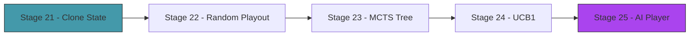

# Act 4 — The Mind

> *You've been playing the game. Now the game plays itself. Monte Carlo Tree Search doesn't know card strategy — it doesn't know that Bash before Strike is optimal, or that deck thinning matters. It discovers these things by simulating thousands of random games and picking the move that wins most often. The same algorithm powered AlphaGo. You're building it for cards.*



---

## Stage 21 — Cloneable Game State

> *Difficulty: Medium — Make the entire game state cheaply cloneable for simulation.*

*~50 min*

MCTS works by simulating: "if I play this card, what happens?" To simulate without affecting the real game, we need to clone the entire game state — player, deck, enemies, statuses — and play out the clone. This stage adds `Clone` to everything and builds the action system the AI will use.

> [!tip] What You'll Learn
> - `#[derive(Clone)]` on complex nested structs
> - Why cloneable state is essential for simulation-based AI
> - Enumerating legal actions from a game state
> - The tradeoff: clone speed vs state complexity

### Concept: Why Clone?

In Python, you'd use `copy.deepcopy(game_state)` to simulate without side effects. Rust's `Clone` trait is the equivalent — but it's explicit. Every struct that needs cloning must opt in with `#[derive(Clone)]`. This is a feature: the compiler tells you exactly which types are cloneable and which aren't (types holding file handles, network connections, etc. shouldn't be cloned).

For MCTS, we'll clone the combat state thousands of times per decision. The entire state (player + deck of 20 cards + 3 enemies) should clone in under 1 microsecond.

### 21.1 — Verify Clone on all types

Every struct in the game needs `Clone`: `Player`, `Deck`, `Enemy`, `Combat`, `Card`, `StatusEffects`. Most already have it from earlier stages. Add `#[derive(Clone)]` to any that are missing — particularly `Deck`, `Player`, and `Combat`:

```rust
// Verify this compiles:
let state = Combat::new(player, deck, enemies);
let clone = state.clone();
```

If any struct is missing `Clone`, the compiler will tell you exactly which one:

```
error[E0277]: the trait bound `Deck: Clone` is not satisfied
  --> src/combat.rs:5:17
   |
5  | #[derive(Clone)]
   |          ^^^^^ the trait `Clone` is not implemented for `Deck`
```

Add `#[derive(Clone)]` to `Deck` and any other struct the compiler flags.

### 21.2 — Available actions

The AI needs to know what moves are legal. Implement this yourself — enumerate every card the player can afford to play, with appropriate targets:

<details>
<summary>Solution</summary>

```rust
#[derive(Debug, Clone)]
pub enum Action {
    PlayCard(usize, Option<usize>), // (hand index, target enemy index)
    EndTurn,
}

impl Combat {
    /// List all legal actions the player can take right now.
    pub fn legal_actions(&self) -> Vec<Action> {
        let mut actions = Vec::new();

        for (i, card) in self.deck.hand.iter().enumerate() {
            if self.player.energy >= card.cost {
                if card.target == crate::card::Target::SingleEnemy {
                    for (e, enemy) in self.enemies.iter().enumerate() {
                        if !enemy.is_dead() {
                            actions.push(Action::PlayCard(i, Some(e)));
                        }
                    }
                } else {
                    actions.push(Action::PlayCard(i, None));
                }
            }
        }

        actions.push(Action::EndTurn);
        actions
    }
}
```

</details>

### 21.3 — Test cloning and actions

```rust
#[cfg(test)]
mod tests {
    use super::*;
    use crate::{cards, enemy, player::Player, deck::Deck};

    fn make_combat() -> Combat {
        let player = Player::new(80);
        let deck = Deck::new(cards::starter_deck());
        let enemies = vec![enemy::jaw_worm()];
        Combat::new(player, deck, enemies)
    }

    #[test]
    fn test_clone_is_independent() {
        let mut original = make_combat();
        original.start_turn();
        let mut clone = original.clone();

        // Modify clone
        clone.player.hp = 1;
        clone.enemies.clear();

        // Original unchanged
        assert_eq!(original.player.hp, 80);
        assert!(!original.enemies.is_empty());
    }

    #[test]
    fn test_legal_actions_include_end_turn() {
        let mut combat = make_combat();
        combat.start_turn();
        let actions = combat.legal_actions();
        assert!(actions.iter().any(|a| matches!(a, Action::EndTurn)));
    }

    #[test]
    fn test_legal_actions_exclude_unaffordable() {
        let mut combat = make_combat();
        combat.start_turn();
        combat.player.energy = 0;
        let actions = combat.legal_actions();
        // Only EndTurn should be available
        assert_eq!(actions.len(), 1);
        assert!(matches!(actions[0], Action::EndTurn));
    }
}
```

> [!tip] Extend it
> Add a `fn apply_action(&mut self, action: &Action)` method to `Combat` that executes an action (plays a card or ends the turn). This will be the core method the AI uses to advance simulated game states. Write a test that applies `PlayCard(0, Some(0))` and verifies the card was played.

> [!check] Checkpoint
> The entire combat state clones independently. Legal actions are correctly enumerated. Tests pass. Stage 21 complete.

---

## Stage 22 — Random Playout

> *Difficulty: Medium — Play randomly until combat ends, record the result.*

*~55 min*

The simplest form of MCTS evaluation: from a given state, play random legal actions until someone wins or loses. Do this 100 times and count wins. The move that leads to the most wins is probably the best.

> [!tip] What You'll Learn
> - Random playout (rollout) — the evaluation function of MCTS
> - Why random play is a surprisingly good estimator
> - Playout speed — how many simulations per second?
> - Termination conditions to prevent infinite loops

### 22.1 — Random playout

Create `src/ai.rs` and add `mod ai;` to `main.rs`:

```rust
use crate::combat::{Combat, Action};
use rand::seq::SliceRandom;

/// Play randomly from the current state until combat ends.
/// Returns true if the player wins.
pub fn random_playout(state: &Combat) -> bool {
    let mut sim = state.clone();
    let mut turns = 0;
    const MAX_TURNS: i32 = 50;

    while !sim.is_over() && turns < MAX_TURNS {
        let actions = sim.legal_actions();
        if actions.is_empty() { break; }

        let action = actions.choose(&mut rand::thread_rng()).unwrap().clone();

        match action {
            Action::PlayCard(hand_idx, target) => {
                // Ignore errors (e.g., index shifted due to previous plays)
                let _ = sim.play_card_by_index(hand_idx, target);
            }
            Action::EndTurn => {
                sim.end_turn();
                if !sim.is_over() {
                    sim.start_turn();
                }
                turns += 1;
            }
        }
    }

    sim.is_victory()
}
```

> [!note] Why random play works
> It seems absurd — how can random card play tell you anything? The key insight: if you play Bash first (applying Vulnerable), then *even random play* deals more damage in subsequent turns. The win rate from "Bash first" states is measurably higher than from "Strike first" states, even with random follow-up. MCTS doesn't need to understand *why* Bash first is good — it just needs to observe that it wins more often.

### 22.2 — Evaluate a position

```rust
/// Evaluate a state by running N random playouts.
/// Returns the win rate (0.0 to 1.0).
pub fn evaluate(state: &Combat, num_playouts: usize) -> f64 {
    let wins = (0..num_playouts).filter(|_| random_playout(state)).count();
    wins as f64 / num_playouts as f64
}
```

### 22.3 — Test playouts

```rust
#[cfg(test)]
mod tests {
    use super::*;
    use crate::{cards, enemy, player::Player, deck::Deck};

    fn make_combat() -> Combat {
        let player = Player::new(80);
        let deck = Deck::new(cards::starter_deck());
        let enemies = vec![enemy::jaw_worm()];
        let mut combat = Combat::new(player, deck, enemies);
        combat.start_turn();
        combat
    }

    #[test]
    fn test_random_playout_terminates() {
        let combat = make_combat();
        // Should not hang — MAX_TURNS prevents infinite loops
        let _result = random_playout(&combat);
    }

    #[test]
    fn test_evaluate_returns_reasonable_rate() {
        let combat = make_combat();
        let win_rate = evaluate(&combat, 200);
        // Against a Jaw Worm with starter deck, win rate should be 40-90%
        assert!(win_rate > 0.1, "Win rate suspiciously low: {}", win_rate);
        assert!(win_rate < 0.99, "Win rate suspiciously high: {}", win_rate);
    }

    #[test]
    fn test_winning_state_has_high_rate() {
        let mut combat = make_combat();
        // Give the enemy 1 HP — almost guaranteed win
        combat.enemies[0].hp = 1;
        let win_rate = evaluate(&combat, 100);
        assert!(win_rate > 0.8);
    }
}
```

> [!warning] Common Mistake: Forgetting the termination condition
> Without `MAX_TURNS`, a random playout can loop forever — the random player might keep ending turns without playing cards, and the enemy might keep defending. Always cap simulation length. 50 turns is generous; most StS combats end in 10-20 turns.

> [!tip] Extend it
> Measure playout speed: how many playouts per second can you run? Use `std::time::Instant::now()` and `elapsed()`. Run 1000 playouts and print the throughput. On a modern machine, you should get 10,000+ playouts/second. This determines how many MCTS iterations you can afford per decision.

> [!check] Checkpoint
> Random playouts terminate reliably. Win rates are reasonable for balanced fights. Tests pass. Stage 22 complete.

---

## Stage 23 — The MCTS Tree

> *Difficulty: Hard — Selection, expansion, simulation, backpropagation.*

*~75 min*

Pure random playout evaluates the *current* state. MCTS builds a *tree* of states, exploring promising branches more deeply. Each node tracks: how many times it was visited, how many simulations from it resulted in a win. The algorithm has four phases:

1. **Selection** — walk down the tree, choosing the most promising child at each level
2. **Expansion** — when you reach a leaf, add its children (one per legal action)
3. **Simulation** — from the new child, run a random playout
4. **Backpropagation** — walk back up, updating visit counts and win counts

> [!tip] What You'll Learn
> - The MCTS algorithm (4 phases)
> - Tree nodes with visit/win statistics
> - Arena allocation — storing tree nodes in a `Vec<MctsNode>` with index-based references
> - Why MCTS converges to optimal play given enough simulations

### Concept: Arena Allocation

In Python, you'd build a tree with object references: `node.children = [child1, child2]`. In Rust, tree structures with parent/child references are notoriously tricky because of ownership rules — a node can't own its children AND have children point back to their parent.

The solution: **arena allocation**. Store all nodes in a `Vec<MctsNode>`, and use indices (not references) to connect them. `parent: Option<usize>` and `children: Vec<usize>` are just numbers pointing into the vec. No lifetimes, no `Rc<RefCell<>>`, no complexity.

```python
# Python: object references
node.parent = parent_node
node.children.append(child_node)

# Rust: index-based arena
nodes[child_idx].parent = Some(parent_idx)
nodes[parent_idx].children.push(child_idx)
```

This is a common pattern in Rust game development and compilers.

### 23.1 — The tree node

```rust
pub struct MctsNode {
    pub state: Combat,
    pub action: Option<Action>,  // action that led to this state
    pub parent: Option<usize>,   // index of parent node
    pub children: Vec<usize>,    // indices of child nodes
    pub visits: u32,
    pub wins: f64,
    pub untried_actions: Vec<Action>,
}
```

### 23.2 — The MCTS engine

Implement the four phases. This is the most complex code in the course — take it one phase at a time.

```rust
pub struct Mcts {
    pub nodes: Vec<MctsNode>,
}

impl Mcts {
    pub fn new(root_state: Combat) -> Self {
        let actions = root_state.legal_actions();
        let root = MctsNode {
            state: root_state,
            action: None,
            parent: None,
            children: Vec::new(),
            visits: 0,
            wins: 0.0,
            untried_actions: actions,
        };
        Mcts { nodes: vec![root] }
    }

    /// Run MCTS for N iterations and return the best action.
    pub fn search(&mut self, iterations: usize) -> Action {
        for _ in 0..iterations {
            // 1. Selection: walk down tree using UCB1
            let leaf = self.select(0);

            // 2. Expansion: add a child for an untried action
            let node = self.expand(leaf);

            // 3. Simulation: random playout from the node
            let win = random_playout(&self.nodes[node].state);

            // 4. Backpropagation: update stats up the tree
            self.backpropagate(node, win);
        }

        // Return the action of the most-visited child of root
        let best = self.nodes[0].children.iter()
            .max_by_key(|&&c| self.nodes[c].visits)
            .copied()
            .expect("No children after search");
        self.nodes[best].action.clone().unwrap()
    }

    /// Selection: walk down the tree, picking the child with highest UCB1.
    fn select(&self, node_idx: usize) -> usize {
        let node = &self.nodes[node_idx];

        // If there are untried actions, this is the leaf to expand
        if !node.untried_actions.is_empty() || node.children.is_empty() {
            return node_idx;
        }

        // Pick child with highest UCB1
        let best_child = *node.children.iter()
            .max_by(|&&a, &&b| {
                let ucb_a = ucb1(&self.nodes[a], node.visits, std::f64::consts::SQRT_2);
                let ucb_b = ucb1(&self.nodes[b], node.visits, std::f64::consts::SQRT_2);
                ucb_a.partial_cmp(&ucb_b).unwrap()
            })
            .unwrap();

        self.select(best_child) // recurse down
    }

    /// Expansion: pick an untried action, create a child node.
    fn expand(&mut self, node_idx: usize) -> usize {
        if self.nodes[node_idx].untried_actions.is_empty() {
            return node_idx; // terminal node, nothing to expand
        }

        let action = self.nodes[node_idx].untried_actions.pop().unwrap();

        // Create child state by applying the action
        let mut child_state = self.nodes[node_idx].state.clone();
        match &action {
            Action::PlayCard(idx, target) => {
                let _ = child_state.play_card_by_index(*idx, *target);
            }
            Action::EndTurn => {
                child_state.end_turn();
                if !child_state.is_over() {
                    child_state.start_turn();
                }
            }
        }

        let child_actions = if child_state.is_over() {
            Vec::new()
        } else {
            child_state.legal_actions()
        };

        let child_idx = self.nodes.len();
        self.nodes.push(MctsNode {
            state: child_state,
            action: Some(action),
            parent: Some(node_idx),
            children: Vec::new(),
            visits: 0,
            wins: 0.0,
            untried_actions: child_actions,
        });

        self.nodes[node_idx].children.push(child_idx);
        child_idx
    }

    /// Backpropagation: walk up the tree, updating visit/win counts.
    fn backpropagate(&mut self, mut node_idx: usize, win: bool) {
        let reward = if win { 1.0 } else { 0.0 };
        loop {
            self.nodes[node_idx].visits += 1;
            self.nodes[node_idx].wins += reward;
            match self.nodes[node_idx].parent {
                Some(parent) => node_idx = parent,
                None => break,
            }
        }
    }
}
```

### 23.3 — Test MCTS

```rust
#[cfg(test)]
mod mcts_tests {
    use super::*;
    use crate::{cards, enemy, player::Player, deck::Deck};

    fn make_combat() -> Combat {
        let player = Player::new(80);
        let deck = Deck::new(cards::starter_deck());
        let enemies = vec![enemy::jaw_worm()];
        let mut combat = Combat::new(player, deck, enemies);
        combat.start_turn();
        combat
    }

    #[test]
    fn test_mcts_returns_legal_action() {
        let combat = make_combat();
        let mut mcts = Mcts::new(combat.clone());
        let action = mcts.search(100);

        let legal = combat.legal_actions();
        // Verify the returned action matches one of the legal actions
        match &action {
            Action::EndTurn => {} // always legal
            Action::PlayCard(idx, target) => {
                assert!(legal.iter().any(|a| matches!(a,
                    Action::PlayCard(i, t) if *i == *idx && *t == *target
                )));
            }
        }
    }

    #[test]
    fn test_mcts_tree_grows() {
        let combat = make_combat();
        let mut mcts = Mcts::new(combat);
        mcts.search(50);
        assert!(mcts.nodes.len() > 1, "Tree should have expanded");
        assert!(mcts.nodes[0].visits == 50, "Root should have 50 visits");
    }
}
```

> [!check] Checkpoint
> MCTS builds a tree, expands nodes, runs simulations, and backpropagates results. The search returns a legal action. Tests pass. Stage 23 complete.


---

## Stage 24 — UCB1 Selection

> *Difficulty: Medium — Balancing exploration and exploitation.*

*~50 min*

How does MCTS choose which child to explore? **UCB1** (Upper Confidence Bound): pick the child that maximizes `win_rate + C * sqrt(ln(parent_visits) / child_visits)`. The first term favors nodes that win often (exploitation). The second term favors nodes that haven't been visited much (exploration). `C` controls the balance (typically sqrt(2)).

> [!tip] What You'll Learn
> - The UCB1 formula and why it works
> - Exploration vs exploitation — the fundamental tradeoff in search
> - Why MCTS doesn't need domain knowledge (UCB1 handles exploration automatically)
> - `f64` math in Rust — `ln()`, `sqrt()`, `INFINITY`

### Concept: Exploration vs Exploitation

This is the core tradeoff in all search algorithms:
- **Exploitation**: keep doing what worked before (play the move with the highest win rate)
- **Exploration**: try things you haven't tested much (maybe an untested move is even better)

Pure exploitation gets stuck in local optima. Pure exploration wastes time on bad moves. UCB1 balances both mathematically — it's provably optimal in the limit.

> [!note] Python comparison
> In Python, you'd write `math.log(parent_visits)` and `math.sqrt(...)`. In Rust, these are methods on `f64`: `(parent_visits as f64).ln()` and `.sqrt()`. Rust doesn't have a global `math` module — math functions are methods on the numeric types themselves.

### 24.1 — UCB1 implementation

Implement the UCB1 function yourself. Remember: unvisited nodes should return infinity (always explore them first).

<details>
<summary>Solution</summary>

```rust
fn ucb1(node: &MctsNode, parent_visits: u32, c: f64) -> f64 {
    if node.visits == 0 {
        return f64::INFINITY; // always explore unvisited nodes
    }
    let exploitation = node.wins / node.visits as f64;
    let exploration = c * ((parent_visits as f64).ln() / node.visits as f64).sqrt();
    exploitation + exploration
}
```

</details>

The `f64::INFINITY` for unvisited nodes ensures every child is tried at least once before any is tried twice. After that, UCB1 naturally balances between "this looks good" and "I haven't checked this enough."

### 24.2 — Test UCB1

```rust
#[cfg(test)]
mod ucb1_tests {
    use super::*;

    fn make_node(visits: u32, wins: f64) -> MctsNode {
        MctsNode {
            state: todo!(), // not needed for UCB1 tests
            action: None, parent: None, children: Vec::new(),
            visits, wins, untried_actions: Vec::new(),
        }
    }

    #[test]
    fn test_unvisited_returns_infinity() {
        let node = MctsNode {
            visits: 0, wins: 0.0,
            // ... other fields
            state: todo!(), action: None, parent: None,
            children: Vec::new(), untried_actions: Vec::new(),
        };
        assert!(ucb1(&node, 100, std::f64::consts::SQRT_2).is_infinite());
    }

    #[test]
    fn test_higher_win_rate_scores_higher() {
        // Same visit count, different win rates
        let good = MctsNode { visits: 10, wins: 8.0, ..todo!() };
        let bad = MctsNode { visits: 10, wins: 2.0, ..todo!() };
        let c = std::f64::consts::SQRT_2;
        assert!(ucb1(&good, 100, c) > ucb1(&bad, 100, c));
    }

    #[test]
    fn test_less_visited_gets_exploration_bonus() {
        // Same win rate, different visit counts
        let visited = MctsNode { visits: 100, wins: 50.0, ..todo!() };
        let fresh = MctsNode { visits: 5, wins: 2.5, ..todo!() };
        let c = std::f64::consts::SQRT_2;
        // Fresh node should get a bigger exploration bonus
        assert!(ucb1(&fresh, 200, c) > ucb1(&visited, 200, c));
    }
}
```

> [!note] The `todo!()` macro
> `todo!()` compiles but panics at runtime. It's useful for filling in struct fields you don't need for a specific test. In production code, replace every `todo!()` with a real implementation — the compiler won't warn you about them, but they'll crash if reached.

> [!tip] Extend it
> Experiment with different values of `C`. Lower C (e.g., 0.5) makes the AI more exploitative — it sticks with what works. Higher C (e.g., 2.0) makes it more exploratory — it tries more options. Run 100 games with each and compare win rates. What value works best for this game?

> [!check] Checkpoint
> UCB1 returns infinity for unvisited nodes. It favors high-win-rate nodes and under-explored nodes. Tests pass. Stage 24 complete.

---

## Stage 25 — The AI Player

> *Difficulty: Medium — Wire MCTS into the game loop.*

*~55 min*

Replace the human input with MCTS decisions. The AI "thinks" for a configurable number of iterations, then plays the best move. Watch it play — it discovers Bash-before-Strike, it blocks when the enemy telegraphs a big attack, it manages energy efficiently.

> [!tip] What You'll Learn
> - Integrating AI into the game loop
> - Configurable thinking time (more iterations = better play, slower)
> - Watching AI discover strategy
> - Benchmarking AI vs random play

### 25.1 — AI combat loop

```rust
pub fn run_combat_ai(combat: &mut Combat, iterations: usize) {
    loop {
        combat.start_turn();

        println!("\n  Turn {} — AI thinking...", combat.turn);

        // AI plays cards until it decides to end turn
        loop {
            let actions = combat.legal_actions();
            if actions.len() <= 1 { break; } // only EndTurn available

            let mut mcts = Mcts::new(combat.clone());
            let action = mcts.search(iterations);

            match action {
                Action::PlayCard(idx, target) => {
                    if idx < combat.deck.hand.len() {
                        let card_name = combat.deck.hand[idx].name.clone();
                        println!("  AI plays: {}", card_name);
                        let _ = combat.play_card_by_index(idx, target);
                    } else {
                        break; // index mismatch, end turn
                    }
                }
                Action::EndTurn => break,
            }

            if combat.is_over() { break; }
        }

        if !combat.is_over() {
            // Show state before enemy acts
            for enemy in &combat.enemies {
                println!("  {} — HP {}/{} | Intent: {}",
                    enemy.name, enemy.hp, enemy.max_hp,
                    enemy.current_intent().display());
            }
            println!("  You — HP {}/{} Block {}",
                combat.player.hp, combat.player.max_hp, combat.player.block);
        }

        combat.end_turn();

        if combat.is_victory() {
            println!("\n  AI wins!");
            break;
        }
        if combat.is_defeat() {
            println!("\n  AI loses.");
            break;
        }
    }
}
```

### 25.2 — Benchmark AI vs random

Try writing the benchmark yourself. Run 100 games with the AI (500 iterations per decision) and 100 games with random play. Compare win rates.

<details>
<summary>Solution</summary>

```rust
pub fn benchmark(num_games: usize, mcts_iterations: usize) {
    let mut ai_wins = 0;
    let mut random_wins = 0;

    for _ in 0..num_games {
        // AI game
        let player = crate::player::Player::new(80);
        let deck = crate::deck::Deck::new(crate::cards::starter_deck());
        let enemies = vec![crate::enemy::jaw_worm()];
        let mut combat = Combat::new(player, deck, enemies);

        // Simplified AI loop (no printing)
        loop {
            combat.start_turn();
            loop {
                let actions = combat.legal_actions();
                if actions.len() <= 1 { break; }
                let mut mcts = Mcts::new(combat.clone());
                let action = mcts.search(mcts_iterations);
                match action {
                    Action::PlayCard(idx, target) => {
                        if idx < combat.deck.hand.len() {
                            let _ = combat.play_card_by_index(idx, target);
                        } else { break; }
                    }
                    Action::EndTurn => break,
                }
                if combat.is_over() { break; }
            }
            combat.end_turn();
            if combat.is_over() { break; }
        }
        if combat.is_victory() { ai_wins += 1; }
    }

    for _ in 0..num_games {
        // Random game
        let player = crate::player::Player::new(80);
        let deck = crate::deck::Deck::new(crate::cards::starter_deck());
        let enemies = vec![crate::enemy::jaw_worm()];
        let mut combat = Combat::new(player, deck, enemies);
        combat.start_turn();
        if random_playout(&combat) { random_wins += 1; }
    }

    println!("AI win rate: {}%", ai_wins * 100 / num_games);
    println!("Random win rate: {}%", random_wins * 100 / num_games);
}
```

</details>

The AI should win significantly more often than random play — typically 80-90% vs 40-60% against the Jaw Worm.

### 25.3 — Test the AI

```rust
#[cfg(test)]
mod ai_player_tests {
    use super::*;
    use crate::{cards, enemy, player::Player, deck::Deck};

    #[test]
    fn test_ai_completes_combat() {
        let player = Player::new(80);
        let deck = Deck::new(cards::starter_deck());
        let enemies = vec![enemy::jaw_worm()];
        let mut combat = Combat::new(player, deck, enemies);

        // Run AI with few iterations (fast test)
        loop {
            combat.start_turn();
            loop {
                let actions = combat.legal_actions();
                if actions.len() <= 1 { break; }
                let mut mcts = Mcts::new(combat.clone());
                let action = mcts.search(50); // low iterations for speed
                match action {
                    Action::PlayCard(idx, target) => {
                        if idx < combat.deck.hand.len() {
                            let _ = combat.play_card_by_index(idx, target);
                        } else { break; }
                    }
                    Action::EndTurn => break,
                }
                if combat.is_over() { break; }
            }
            combat.end_turn();
            if combat.is_over() { break; }
        }

        // Combat should have ended (not hung)
        assert!(combat.is_over());
    }
}
```

> [!note] What the AI discovers
> Without being told any strategy, MCTS discovers:
> - Play Bash before Strike (Vulnerable bonus)
> - Block when the enemy telegraphs a big attack
> - Don't waste energy on block when the enemy is defending
> - Play draw cards early in the turn (more options)
> - End turn early if remaining cards aren't worth the energy
>
> All from pure simulation. No rules, no heuristics — just "which move wins most often?"

> [!tip] Extend it
> Add a `--ai` flag to `main.rs` that runs the game with AI instead of human input. Use `std::env::args()` to check for the flag. This lets you watch the AI play a full run through the Spire.

> [!check] Checkpoint
> The AI plays complete combats. It makes reasonable decisions. It wins more often than random play. Tests pass. Stage 25 complete.

---

## Act 4 Complete — The Mind

| Component | What it does |
|-----------|-------------|
| Cloneable state | Entire combat cheaply cloneable for simulation |
| `legal_actions` | Enumerate all valid moves from a game state |
| Random playout | Play randomly to evaluate a position |
| MCTS tree | Arena-allocated nodes with selection → expansion → simulation → backpropagation |
| UCB1 | Balance exploration and exploitation with a mathematical formula |
| AI player | MCTS-driven decision making, discovers strategy from simulation |

| Rust Concept | Where You Used It |
|-------------|-------------------|
| `#[derive(Clone)]` | Entire game state cloneable for simulation |
| Arena allocation | `Vec<MctsNode>` with index-based parent/child references |
| `f64` math | UCB1 formula: `ln()`, `sqrt()`, `INFINITY` |
| Recursive functions | `select()` walks down the tree |
| `todo!()` macro | Placeholder in test structs |
| Closures with `filter` | Counting wins in benchmarks |

**Next up — Act 5: The Table.** ratatui TUI — cards as bordered widgets, the hand as a selectable row, the battle screen, and the map.
