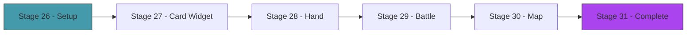

# Act 5 — The Table

> *The game works. The AI plays. Now make it beautiful. Cards rendered as bordered boxes in the terminal, enemies with HP bars and intent icons, a hand you navigate with arrow keys, and a map you can see at a glance. ratatui turns text into an interface.*



---

## Stage 26 — ratatui Setup

> *Difficulty: Easy — Terminal setup, TEA architecture, render loop.*

Same ratatui scaffolding as Runa (Act 3), but with a different application structure. We use TEA (The Elm Architecture): the game state is the Model, user input produces Messages, the Update function modifies state, and the View function renders it.

> [!tip] What You'll Learn
> - ratatui + crossterm setup
> - TEA: Model → Message → Update → View
> - Screen enum for navigation (Map, Combat, Reward, Rest, Shop)

### 26.1 — Dependencies

```toml
ratatui = "0.30"
crossterm = "0.28"
```

### 26.2 — App structure

```rust
enum Screen {
    Map,
    Combat,
    CardReward,
    RestSite,
    Shop,
    Victory,
    Defeat,
}

struct App {
    screen: Screen,
    game: GameRun,  // player, deck, map, relics, gold
    combat: Option<Combat>,
}

enum Message {
    SelectCard(usize),
    PlayCard,
    EndTurn,
    NavigateMap(usize),
    ChooseReward(usize),
    SkipReward,
    Rest,
    Smith(usize),
    Quit,
}
```

The `App` holds all state. `Message` enums represent every possible user action. The update function pattern-matches on messages and modifies state. The view function reads state and renders.

> [!check] Checkpoint
> ratatui launches, shows a placeholder screen, responds to 'q' to quit. Stage 26 complete.

---

## Stage 27 — The Card Widget

> *Difficulty: Medium — A custom Widget that renders a card as a bordered box.*

The card widget is the visual centerpiece. Each card renders as an 11-wide × 7-tall bordered box with the cost in the top-left, name centered, effect text below, and card type as a colored badge.

> [!tip] What You'll Learn
> - Implementing `Widget` for a custom struct
> - Drawing into a `Buffer` cell by cell
> - Colored borders based on card type
> - Text wrapping within a fixed-width box

### 27.1 — The CardWidget

```rust
use ratatui::prelude::*;
use ratatui::widgets::Widget;

pub struct CardWidget<'a> {
    pub card: &'a Card,
    pub selected: bool,
}

impl<'a> Widget for CardWidget<'a> {
    fn render(self, area: Rect, buf: &mut Buffer) {
        // Border color based on card type
        let border_color = match self.card.card_type {
            CardType::Attack => Color::Red,
            CardType::Skill => Color::Blue,
            CardType::Power => Color::Yellow,
        };

        let border_style = if self.selected {
            Style::default().fg(Color::White).bold()
        } else {
            Style::default().fg(border_color)
        };

        // Draw border
        let block = Block::default()
            .borders(Borders::ALL)
            .border_style(border_style);
        block.render(area, buf);

        let inner = area.inner(Margin::new(1, 1));

        // Cost in top-left
        let cost = format!("{}", self.card.cost);
        buf.set_string(inner.x, inner.y, &cost, Style::default().fg(Color::Cyan).bold());

        // Name centered
        let name = &self.card.name;
        let name_x = inner.x + (inner.width.saturating_sub(name.len() as u16)) / 2;
        buf.set_string(name_x, inner.y + 1, name, Style::default().fg(Color::White).bold());

        // Description (wrapped)
        let desc = &self.card.description;
        let max_width = inner.width as usize;
        for (i, chunk) in desc.as_bytes().chunks(max_width).enumerate() {
            if inner.y + 3 + i as u16 >= inner.y + inner.height { break; }
            let text = std::str::from_utf8(chunk).unwrap_or("");
            buf.set_string(inner.x, inner.y + 3 + i as u16, text,
                Style::default().fg(Color::Gray));
        }

        // Type badge at bottom
        let badge = match self.card.card_type {
            CardType::Attack => "ATK",
            CardType::Skill => "SKL",
            CardType::Power => "PWR",
        };
        let badge_x = inner.x + inner.width.saturating_sub(badge.len() as u16);
        let badge_y = inner.y + inner.height.saturating_sub(1);
        buf.set_string(badge_x, badge_y, badge, Style::default().fg(border_color));
    }
}
```

A card renders as:

```
┌─────────┐
│ 1       │
│  Strike │
│         │
│ Deal 6  │
│ damage  │
│     ATK │
└─────────┘
```

Attack cards have red borders, Skills blue, Powers yellow. The selected card has a white bold border.

> [!check] Checkpoint
> Render a Strike, Defend, and Bash card. Verify borders are colored by type. Verify the selected card is highlighted. Stage 27 complete.

---

## Stage 28 — The Hand

> *Difficulty: Medium — Horizontal row of cards with keyboard navigation.*

The hand is a row of CardWidgets at the bottom of the screen. Arrow keys move the selection. Enter plays the selected card. The hand shrinks as cards are played.

> [!tip] What You'll Learn
> - Horizontal layout with `Layout::horizontal`
> - `StatefulWidget` for tracking selected index
> - Keyboard navigation (left/right/enter)
> - Dynamic layout (hand size changes as cards are played)

### 28.1 — Hand rendering

```rust
fn render_hand(frame: &mut Frame, hand: &[Card], selected: usize, area: Rect) {
    let card_width = 13; // 11 + 2 padding
    let constraints: Vec<Constraint> = hand.iter()
        .map(|_| Constraint::Length(card_width))
        .collect();

    let chunks = Layout::horizontal(constraints).split(area);

    for (i, card) in hand.iter().enumerate() {
        let widget = CardWidget { card, selected: i == selected };
        frame.render_widget(widget, chunks[i]);
    }
}
```

### 28.2 — Input handling

```rust
match key.code {
    KeyCode::Left => {
        if selected > 0 { selected -= 1; }
    }
    KeyCode::Right => {
        if selected < hand.len() - 1 { selected += 1; }
    }
    KeyCode::Enter => {
        // Play the selected card
        messages.push(Message::PlayCard);
    }
    KeyCode::Char('e') => {
        messages.push(Message::EndTurn);
    }
    _ => {}
}
```

> [!check] Checkpoint
> Navigate the hand with arrow keys. Verify the selected card is highlighted. Play a card with Enter and verify it disappears from the hand. Stage 28 complete.

---

## Stage 29 — The Battle Screen

> *Difficulty: Medium — Enemies, player stats, and the hand together.*

The full combat screen: enemies at the top with HP bars and intent icons, player stats in the middle (HP, block, energy), hand at the bottom.

> [!tip] What You'll Learn
> - Multi-region layout (top/middle/bottom)
> - HP bars with `Gauge` widget
> - Intent icons (⚔ attack, 🛡 defend, ↑ buff)
> - Combining multiple custom widgets in one screen

### 29.1 — Battle layout

```rust
fn render_battle(frame: &mut Frame, combat: &Combat, selected_card: usize) {
    let chunks = Layout::vertical([
        Constraint::Length(8),   // enemies
        Constraint::Length(3),   // player stats
        Constraint::Min(9),     // hand
    ]).split(frame.area());

    // Enemies
    render_enemies(frame, &combat.enemies, chunks[0]);

    // Player stats bar
    let stats = format!(
        "HP {}/{}  Block {}  Energy {}/{}",
        combat.player.hp, combat.player.max_hp,
        combat.player.block,
        combat.player.energy, combat.player.max_energy,
    );
    let stats_widget = Paragraph::new(stats)
        .alignment(Alignment::Center)
        .block(Block::default().borders(Borders::TOP));
    frame.render_widget(stats_widget, chunks[1]);

    // Hand
    render_hand(frame, &combat.deck.hand, selected_card, chunks[2]);
}

fn render_enemies(frame: &mut Frame, enemies: &[Enemy], area: Rect) {
    let constraints: Vec<Constraint> = enemies.iter()
        .map(|_| Constraint::Ratio(1, enemies.len() as u32))
        .collect();
    let chunks = Layout::horizontal(constraints).split(area);

    for (i, enemy) in enemies.iter().enumerate() {
        let hp_ratio = enemy.hp as f64 / enemy.max_hp as f64;
        let intent_str = enemy.current_intent().display();

        let text = vec![
            Line::from(Span::styled(&enemy.name, Style::default().bold())),
            Line::from(format!("HP {}/{}", enemy.hp, enemy.max_hp)),
            Line::from(""),
            Line::from(Span::styled(intent_str, Style::default().fg(Color::Yellow))),
        ];

        let block = Block::default().borders(Borders::ALL)
            .border_style(Style::default().fg(Color::DarkGray));
        let paragraph = Paragraph::new(text).block(block).alignment(Alignment::Center);
        frame.render_widget(paragraph, chunks[i]);
    }
}
```

> [!check] Checkpoint
> The battle screen shows enemies with HP and intents at the top, player stats in the middle, and the hand at the bottom. Play a full combat in the TUI. Stage 29 complete.

---

## Stage 30 — The Map Screen

> *Difficulty: Medium — ASCII branching path with node type icons.*

The map screen shows the full 15-floor path with branching connections. The current position is highlighted. Node types are shown as icons: ⚔ combat, ☠ elite, 🔥 rest, $ shop, ? event, 👑 boss.

### 30.1 — Map rendering

```rust
fn render_map(frame: &mut Frame, map: &GameMap) {
    let mut lines: Vec<Line> = Vec::new();

    for (floor, nodes) in map.floors.iter().enumerate().rev() {
        let mut spans: Vec<Span> = Vec::new();
        spans.push(Span::styled(format!("F{:2} ", floor + 1), Style::default().fg(Color::DarkGray)));

        for (i, node) in nodes.iter().enumerate() {
            let icon = match node.node_type {
                NodeType::Combat => "⚔",
                NodeType::Elite => "☠",
                NodeType::RestSite => "R",
                NodeType::Shop => "$",
                NodeType::Event => "?",
                NodeType::Boss => "B",
            };

            let style = if floor == map.current_floor && i == map.current_node {
                Style::default().fg(Color::Yellow).bold()
            } else if floor < map.current_floor {
                Style::default().fg(Color::DarkGray)
            } else {
                Style::default().fg(Color::White)
            };

            spans.push(Span::styled(format!(" [{}] ", icon), style));
        }

        lines.push(Line::from(spans));
    }

    let paragraph = Paragraph::new(lines)
        .block(Block::default().borders(Borders::ALL).title(" The Spire "));
    frame.render_widget(paragraph, frame.area());
}
```

> [!check] Checkpoint
> View the map. Verify current position is highlighted. Navigate to a node and verify the screen transitions to the appropriate encounter. Stage 30 complete.

---

## Stage 31 — The Complete Baraja

> *Difficulty: Hard — All screens connected, full run playable in the TUI.*

Wire everything together: map → combat → reward → rest → shop → boss → victory/defeat. Every screen transitions smoothly. The AI can play in "auto" mode. The complete deckbuilding roguelike, in your terminal.

> [!tip] What You'll Learn
> - Screen transitions in a TUI app
> - Connecting game logic to the view layer
> - The complete game loop from start to finish
> - Polish: animations, sound cues (terminal bell), color themes

### 31.1 — Screen transitions

```rust
fn update(app: &mut App, msg: Message) {
    match msg {
        Message::NavigateMap(node_idx) => {
            app.game.map.current_node = node_idx;
            let node = &app.game.map.floors[app.game.map.current_floor][node_idx];
            match node.node_type {
                NodeType::Combat | NodeType::Elite => {
                    let enemies = spawn_enemies(app.game.map.current_floor, node.node_type);
                    app.combat = Some(Combat::new(
                        app.game.player.clone(),
                        app.game.deck.clone(),
                        enemies,
                    ));
                    app.screen = Screen::Combat;
                }
                NodeType::RestSite => app.screen = Screen::RestSite,
                NodeType::Shop => app.screen = Screen::Shop,
                NodeType::Boss => { /* spawn boss, enter combat */ }
                NodeType::Event => { /* random event */ }
            }
        }
        // ... handle combat messages, reward messages, etc.
    }
}
```

### 31.2 — Controls

| Screen | Keys |
|---|---|
| Map | ↑↓ select floor, ←→ select node, Enter to go |
| Combat | ←→ select card, Enter to play, E to end turn, A for AI auto-play |
| Reward | 1/2/3 to pick a card, S to skip |
| Rest | R to rest, S to smith |
| Shop | ↑↓ browse, Enter to buy, X to remove a card |

### 31.3 — AI auto-play

Press `A` during combat to let the MCTS AI take over. Watch it play — it thinks for a moment (configurable iterations), then plays each card with a brief delay so you can follow the action.

> [!check] Checkpoint
> Play a complete run in the TUI: map navigation, multiple combats, card rewards, rest sites, and the boss. Win or lose, the full experience works. Stage 31 complete.

---

## Act 5 Complete — The Table

| Component | What it does |
|-----------|-------------|
| CardWidget | Custom ratatui widget rendering cards as bordered boxes |
| Hand | Horizontal card row with keyboard navigation |
| Battle screen | Enemies + stats + hand in a three-region layout |
| Map screen | ASCII branching path with node icons |
| Screen transitions | Map → combat → reward → rest → shop → boss |
| AI auto-play | MCTS takes over combat on demand |

---

## Course Complete — Baraja

You built a deckbuilding roguelike with an AI opponent that discovers strategy through simulation. From the `Effect` enum to the MCTS tree, every piece was built from scratch.

| Component | What it does |
|-----------|-------------|
| Card system | Effect enum, composable card actions, 30+ cards as data |
| Combat engine | Turn phases, damage pipeline, status effects, multi-enemy |
| Roguelike layer | Procedural map, card rewards, rest sites, relics, shops, boss |
| MCTS AI | Random playout, tree search, UCB1 selection, discovers strategy |
| Terminal UI | Custom card widgets, hand navigation, battle/map screens |

| Rust Concept | Where You Used It |
|-------------|-------------------|
| Enums with data | `Effect`, `Intent`, `Action`, `Screen`, `Message` |
| `Clone` for simulation | Entire game state cloneable for MCTS |
| Pattern matching | Effect resolution, intent execution, screen transitions |
| Custom widgets | `CardWidget` implementing `Widget` trait |
| TEA architecture | Model → Message → Update → View |
| `Vec` manipulation | Deck piles, hand management, tree nodes |
| Trait objects | Relic triggers, enemy patterns |
| `rand` | Shuffle, map generation, random playout |

The AI doesn't know that Bash before Strike is optimal. It discovered it by playing a thousand random games and noticing that the ones where Bash came first won more often. That's Monte Carlo Tree Search — and now you know how it works, because you built it.
