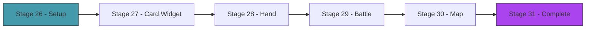

# Act 5 — The Table

> *The game works. The AI plays. Now make it beautiful. Cards rendered as bordered boxes in the terminal, enemies with HP bars and intent icons, a hand you navigate with arrow keys, and a map you can see at a glance. ratatui turns text into an interface.*



---

## Stage 26 — ratatui Setup

> *Difficulty: Easy — Terminal setup, TEA architecture, render loop.*

*~45 min*

ratatui is a Rust library for building terminal user interfaces. It gives you widgets (paragraphs, tables, gauges, borders) and a layout system, but you control the render loop. We use TEA (The Elm Architecture): the game state is the Model, user input produces Messages, the Update function modifies state, and the View function renders it.

> [!tip] What You'll Learn
> - ratatui + crossterm setup
> - TEA: Model → Message → Update → View
> - Screen enum for navigation (Map, Combat, Reward, Rest, Shop)
> - The terminal raw mode lifecycle

### Concept: TEA Architecture

TEA separates concerns cleanly:
- **Model** (`App` struct): all application state
- **Message** (`Message` enum): every possible user action
- **Update** (`fn update`): takes a message, modifies the model
- **View** (`fn view`): reads the model, renders widgets — never modifies state

> [!note] Python comparison
> TEA is like a React/Redux pattern. The Model is your Redux store. Messages are actions. Update is the reducer. View is the render function. If you've used any frontend framework, this will feel familiar.

### 26.1 — Dependencies

Add to `Cargo.toml`:

```toml
ratatui = "0.30"
crossterm = "0.28"
```

### 26.2 — App structure

Create `src/tui/mod.rs` and add `mod tui;` to `main.rs`. Then create `src/tui/app.rs`:

```rust
use crate::{combat::Combat, map::GameMap, run::GameRun};

pub enum Screen {
    Map,
    Combat,
    CardReward,
    RestSite,
    Shop,
    Victory,
    Defeat,
}

pub struct App {
    pub screen: Screen,
    pub game: GameRun,
    pub combat: Option<Combat>,
    pub selected_card: usize,
    pub should_quit: bool,
}

pub enum Message {
    SelectCard(usize),
    PlayCard,
    EndTurn,
    NavigateMap(usize),
    ChooseReward(usize),
    SkipReward,
    Rest,
    Smith(usize),
    AiPlay,
    Quit,
}
```

### 26.3 — Terminal setup

```rust
use crossterm::{
    event::{self, Event, KeyCode, KeyEventKind},
    terminal::{disable_raw_mode, enable_raw_mode, EnterAlternateScreen, LeaveAlternateScreen},
    ExecutableCommand,
};
use ratatui::prelude::*;
use std::io::{self, stdout};

pub fn run_tui(seed: u64) -> io::Result<()> {
    // Setup
    enable_raw_mode()?;
    stdout().execute(EnterAlternateScreen)?;
    let mut terminal = Terminal::new(CrosstermBackend::new(stdout()))?;

    let mut app = App {
        screen: Screen::Map,
        game: GameRun::new(seed),
        combat: None,
        selected_card: 0,
        should_quit: false,
    };

    // Main loop
    while !app.should_quit {
        terminal.draw(|frame| view(frame, &app))?;

        if let Event::Key(key) = event::read()? {
            if key.kind == KeyEventKind::Press {
                let msg = handle_input(&app, key.code);
                if let Some(msg) = msg {
                    update(&mut app, msg);
                }
            }
        }
    }

    // Cleanup
    disable_raw_mode()?;
    stdout().execute(LeaveAlternateScreen)?;
    Ok(())
}

fn view(frame: &mut Frame, app: &App) {
    match app.screen {
        Screen::Map => { /* render map — Stage 30 */ }
        Screen::Combat => { /* render battle — Stage 29 */ }
        _ => {
            let placeholder = ratatui::widgets::Paragraph::new("Screen not implemented yet")
                .alignment(Alignment::Center);
            frame.render_widget(placeholder, frame.area());
        }
    }
}

fn handle_input(app: &App, key: KeyCode) -> Option<Message> {
    match key {
        KeyCode::Char('q') => Some(Message::Quit),
        _ => None, // we'll add more in later stages
    }
}

fn update(app: &mut App, msg: Message) {
    match msg {
        Message::Quit => app.should_quit = true,
        _ => {} // we'll add more in later stages
    }
}
```

> [!warning] Common Mistake: Forgetting to restore the terminal
> If your program panics between `enable_raw_mode()` and `disable_raw_mode()`, your terminal will be stuck in raw mode (no echo, no line editing). The fix: use a panic hook or `Drop` guard to ensure cleanup:
> ```rust
> let original_hook = std::panic::take_hook();
> std::panic::set_hook(Box::new(move |panic_info| {
>     let _ = disable_raw_mode();
>     let _ = stdout().execute(LeaveAlternateScreen);
>     original_hook(panic_info);
> }));
> ```
> Add this before `enable_raw_mode()`. If anything panics, the terminal is restored first.

### 26.4 — Test the setup

ratatui apps are hard to unit test (they need a terminal), but you can test the state logic:

```rust
#[cfg(test)]
mod tests {
    use super::*;

    #[test]
    fn test_quit_message_sets_flag() {
        let mut app = App {
            screen: Screen::Map,
            game: GameRun::new(42),
            combat: None,
            selected_card: 0,
            should_quit: false,
        };
        update(&mut app, Message::Quit);
        assert!(app.should_quit);
    }
}
```

> [!tip] Extend it
> Add a `--tui` flag to `main.rs` that launches the TUI instead of the text-based game. Use `std::env::args()` to check for it. Default to text mode if no flag is given.

> [!check] Checkpoint
> ratatui launches, shows a placeholder screen, responds to 'q' to quit. Terminal is properly restored on exit. Stage 26 complete.

---

## Stage 27 — The Card Widget

> *Difficulty: Medium — A custom Widget that renders a card as a bordered box.*

*~60 min*

The card widget is the visual centerpiece. Each card renders as an 11-wide x 7-tall bordered box with the cost in the top-left, name centered, effect text below, and card type as a colored badge.

> [!tip] What You'll Learn
> - Implementing the `Widget` trait for a custom struct
> - Drawing into a `Buffer` cell by cell
> - Colored borders based on card type
> - Lifetime annotations on widget structs

### Concept: The Widget Trait

ratatui's `Widget` trait has one method: `fn render(self, area: Rect, buf: &mut Buffer)`. You get a rectangular area and a buffer to draw into. You write characters and styles into specific cells. It's like a 2D canvas made of text characters.

### 27.1 — The CardWidget

Create `src/tui/card_widget.rs`:

```rust
use crate::card::{Card, CardType};
use ratatui::prelude::*;
use ratatui::widgets::{Block, Borders, Widget};

pub struct CardWidget<'a> {
    pub card: &'a Card,
    pub selected: bool,
}
```

Now implement the `Widget` trait. The card should render as:

```
┌─────────┐
│ 1       │
│  Strike │
│         │
│ Deal 6  │
│ damage  │
│     ATK │
└─────────┘
```

Try implementing it yourself. You need:
- Border color: red for Attack, blue for Skill, yellow for Power
- White bold border if selected
- Cost in top-left of inner area
- Name centered on the second line
- Description wrapped to fit the width
- Type badge (ATK/SKL/PWR) in bottom-right

<details>
<summary>Solution</summary>

```rust
impl<'a> Widget for CardWidget<'a> {
    fn render(self, area: Rect, buf: &mut Buffer) {
        let border_color = match self.card.card_type {
            CardType::Attack => Color::Red,
            CardType::Skill => Color::Blue,
            CardType::Power => Color::Yellow,
        };

        let border_style = if self.selected {
            Style::default().fg(Color::White).bold()
        } else {
            Style::default().fg(border_color)
        };

        let block = Block::default()
            .borders(Borders::ALL)
            .border_style(border_style);
        let inner = block.inner(area);
        block.render(area, buf);

        if inner.width == 0 || inner.height == 0 { return; }

        // Cost in top-left
        let cost = format!("{}", self.card.cost);
        buf.set_string(inner.x, inner.y, &cost,
            Style::default().fg(Color::Cyan).bold());

        // Name centered
        let name = &self.card.name;
        let name_x = inner.x + (inner.width.saturating_sub(name.len() as u16)) / 2;
        if inner.height > 1 {
            buf.set_string(name_x, inner.y + 1, name,
                Style::default().fg(Color::White).bold());
        }

        // Description (wrapped)
        let desc = &self.card.description;
        let max_width = inner.width as usize;
        if max_width > 0 {
            for (i, chunk) in desc.as_bytes().chunks(max_width).enumerate() {
                let y = inner.y + 3 + i as u16;
                if y >= inner.y + inner.height { break; }
                let text = std::str::from_utf8(chunk).unwrap_or("");
                buf.set_string(inner.x, y, text, Style::default().fg(Color::Gray));
            }
        }

        // Type badge at bottom
        let badge = match self.card.card_type {
            CardType::Attack => "ATK",
            CardType::Skill => "SKL",
            CardType::Power => "PWR",
        };
        if inner.height > 0 {
            let badge_x = inner.x + inner.width.saturating_sub(badge.len() as u16);
            let badge_y = inner.y + inner.height.saturating_sub(1);
            buf.set_string(badge_x, badge_y, badge,
                Style::default().fg(border_color));
        }
    }
}
```

</details>

> [!warning] Common Mistake: Lifetime annotations on widget structs
> `CardWidget<'a>` has a lifetime parameter because it borrows a `&'a Card`. If you forget the lifetime:
> ```rust
> pub struct CardWidget {
>     pub card: &Card, // ERROR: missing lifetime specifier
> }
> ```
> ```
> error[E0106]: missing lifetime specifier
>  --> src/tui/card_widget.rs:5:16
>   |
> 5 |     pub card: &Card,
>   |               ^ expected named lifetime parameter
> ```
> The fix: add `<'a>` to the struct and `&'a Card` to the field. This tells Rust "the widget can't outlive the card it references."

> [!tip] Extend it
> Add an `upgraded` indicator: if `card.upgraded` is true, render a `+` after the name in green. Also add a highlight effect: when selected, fill the card background with a subtle color (e.g., `Color::DarkGray`).

> [!check] Checkpoint
> Cards render as bordered boxes with cost, name, description, and type badge. Colors match card type. Selected cards are highlighted. Stage 27 complete.

---

## Stage 28 — The Hand

> *Difficulty: Medium — Horizontal row of cards with keyboard navigation.*

*~55 min*

The hand is a row of CardWidgets at the bottom of the screen. Arrow keys move the selection. Enter plays the selected card. The hand shrinks as cards are played.

> [!tip] What You'll Learn
> - Horizontal layout with `Layout::horizontal`
> - Keyboard navigation (left/right/enter)
> - Dynamic layout (hand size changes as cards are played)
> - Connecting input to state changes

### 28.1 — Hand rendering

Create `src/tui/hand.rs`:

```rust
use crate::card::Card;
use crate::tui::card_widget::CardWidget;
use ratatui::prelude::*;

pub fn render_hand(frame: &mut Frame, hand: &[Card], selected: usize, area: Rect) {
    if hand.is_empty() { return; }

    let card_width = 13u16; // 11 + 2 padding
    let constraints: Vec<Constraint> = hand.iter()
        .map(|_| Constraint::Length(card_width))
        .collect();

    let chunks = Layout::horizontal(constraints).split(area);

    for (i, card) in hand.iter().enumerate() {
        let widget = CardWidget { card, selected: i == selected };
        frame.render_widget(widget, chunks[i]);
    }
}
```

### 28.2 — Input handling

Update `handle_input` in `app.rs` for the combat screen:

```rust
fn handle_input(app: &App, key: KeyCode) -> Option<Message> {
    match key {
        KeyCode::Char('q') => Some(Message::Quit),
        _ => match app.screen {
            Screen::Combat => match key {
                KeyCode::Left => {
                    if app.selected_card > 0 {
                        Some(Message::SelectCard(app.selected_card - 1))
                    } else {
                        None
                    }
                }
                KeyCode::Right => {
                    let hand_len = app.combat.as_ref()
                        .map(|c| c.deck.hand.len()).unwrap_or(0);
                    if app.selected_card < hand_len.saturating_sub(1) {
                        Some(Message::SelectCard(app.selected_card + 1))
                    } else {
                        None
                    }
                }
                KeyCode::Enter => Some(Message::PlayCard),
                KeyCode::Char('e') => Some(Message::EndTurn),
                KeyCode::Char('a') => Some(Message::AiPlay),
                _ => None,
            },
            _ => None,
        }
    }
}
```

### 28.3 — Update handler for card selection

```rust
fn update(app: &mut App, msg: Message) {
    match msg {
        Message::Quit => app.should_quit = true,
        Message::SelectCard(idx) => app.selected_card = idx,
        Message::PlayCard => {
            if let Some(combat) = &mut app.combat {
                let _ = combat.play_card_by_index(app.selected_card, Some(0));
                // Clamp selection to new hand size
                let hand_len = combat.deck.hand.len();
                if hand_len > 0 && app.selected_card >= hand_len {
                    app.selected_card = hand_len - 1;
                }
            }
        }
        Message::EndTurn => {
            if let Some(combat) = &mut app.combat {
                combat.end_turn();
                if combat.is_victory() {
                    app.screen = Screen::Victory;
                } else if combat.is_defeat() {
                    app.screen = Screen::Defeat;
                } else {
                    combat.start_turn();
                    app.selected_card = 0;
                }
            }
        }
        _ => {}
    }
}
```

### 28.4 — Test hand navigation

```rust
#[cfg(test)]
mod tests {
    use super::*;

    #[test]
    fn test_select_card_updates_index() {
        let mut app = make_test_app();
        app.screen = Screen::Combat;
        update(&mut app, Message::SelectCard(2));
        assert_eq!(app.selected_card, 2);
    }

    #[test]
    fn test_play_card_clamps_selection() {
        let mut app = make_test_app();
        app.screen = Screen::Combat;
        // Set up combat with cards
        // ... (setup code)
        // After playing the last card, selection should clamp
    }
}
```

> [!tip] Extend it
> Add a card preview: when a card is selected, show its full description and effect breakdown in a panel to the right of the hand. Use `Layout::horizontal` to split the bottom area into hand (70%) and preview (30%).

> [!check] Checkpoint
> Navigate the hand with arrow keys. Selected card is highlighted. Play a card with Enter and it disappears from the hand. Selection clamps when hand shrinks. Stage 28 complete.


---

## Stage 29 — The Battle Screen

> *Difficulty: Medium — Enemies, player stats, and the hand together.*

*~60 min*

The full combat screen: enemies at the top with HP bars and intent icons, player stats in the middle (HP, block, energy), hand at the bottom.

> [!tip] What You'll Learn
> - Multi-region layout (top/middle/bottom)
> - HP bars with `Gauge` widget
> - Combining multiple custom widgets in one screen
> - The `Layout` constraint system

### 29.1 — Battle layout

Create `src/tui/battle.rs`:

```rust
use crate::combat::Combat;
use crate::enemy::Enemy;
use crate::tui::hand::render_hand;
use ratatui::prelude::*;
use ratatui::widgets::{Block, Borders, Paragraph};

pub fn render_battle(frame: &mut Frame, combat: &Combat, selected_card: usize) {
    let chunks = Layout::vertical([
        Constraint::Length(8),   // enemies
        Constraint::Length(3),   // player stats
        Constraint::Min(9),     // hand
    ]).split(frame.area());

    render_enemies(frame, &combat.enemies, chunks[0]);
    render_player_stats(frame, combat, chunks[1]);
    render_hand(frame, &combat.deck.hand, selected_card, chunks[2]);
}
```

### 29.2 — Enemy rendering

Try implementing the enemy display yourself. Each enemy should show:
- Name (bold)
- HP as text: `"HP 30/44"`
- Current intent with color

<details>
<summary>Solution</summary>

```rust
fn render_enemies(frame: &mut Frame, enemies: &[Enemy], area: Rect) {
    if enemies.is_empty() { return; }

    let constraints: Vec<Constraint> = enemies.iter()
        .map(|_| Constraint::Ratio(1, enemies.len() as u32))
        .collect();
    let chunks = Layout::horizontal(constraints).split(area);

    for (i, enemy) in enemies.iter().enumerate() {
        let intent_str = enemy.current_intent().display();

        let text = vec![
            Line::from(Span::styled(&enemy.name, Style::default().bold())),
            Line::from(format!("HP {}/{}", enemy.hp, enemy.max_hp)),
            Line::from(format!("Block {}", enemy.block)),
            Line::from(""),
            Line::from(Span::styled(
                format!("Next: {}", intent_str),
                Style::default().fg(Color::Yellow),
            )),
        ];

        let block = Block::default().borders(Borders::ALL)
            .border_style(Style::default().fg(Color::DarkGray));
        let paragraph = Paragraph::new(text).block(block).alignment(Alignment::Center);
        frame.render_widget(paragraph, chunks[i]);
    }
}
```

</details>

### 29.3 — Player stats bar

```rust
fn render_player_stats(frame: &mut Frame, combat: &Combat, area: Rect) {
    let stats = format!(
        "HP {}/{}  |  Block {}  |  Energy {}/{}  |  Turn {}",
        combat.player.hp, combat.player.max_hp,
        combat.player.block,
        combat.player.energy, combat.player.max_energy,
        combat.turn,
    );

    let hp_color = if combat.player.hp < combat.player.max_hp / 4 {
        Color::Red
    } else if combat.player.hp < combat.player.max_hp / 2 {
        Color::Yellow
    } else {
        Color::Green
    };

    let stats_widget = Paragraph::new(Span::styled(stats, Style::default().fg(hp_color)))
        .alignment(Alignment::Center)
        .block(Block::default().borders(Borders::TOP));
    frame.render_widget(stats_widget, area);
}
```

### 29.4 — Wire into the view function

Update `view()` in `app.rs`:

```rust
fn view(frame: &mut Frame, app: &App) {
    match app.screen {
        Screen::Combat => {
            if let Some(combat) = &app.combat {
                crate::tui::battle::render_battle(frame, combat, app.selected_card);
            }
        }
        Screen::Victory => {
            let text = Paragraph::new("Victory! You conquered the Spire!")
                .alignment(Alignment::Center)
                .style(Style::default().fg(Color::Green).bold());
            frame.render_widget(text, frame.area());
        }
        Screen::Defeat => {
            let text = Paragraph::new("Defeat... The Spire claims another soul.")
                .alignment(Alignment::Center)
                .style(Style::default().fg(Color::Red));
            frame.render_widget(text, frame.area());
        }
        _ => { /* other screens */ }
    }
}
```

> [!warning] Common Mistake: Layout constraints that don't add up
> If your constraints request more space than available (e.g., `Length(8) + Length(3) + Length(9) = 20` but the terminal is only 15 rows), ratatui will truncate. The `Min(9)` constraint on the hand area is key — it takes whatever space is left, shrinking gracefully on small terminals.

> [!tip] Extend it
> Add an HP bar using ratatui's `Gauge` widget for each enemy. The gauge should fill proportionally to `hp / max_hp` and change color (green → yellow → red) as HP decreases.

> [!check] Checkpoint
> The battle screen shows enemies with HP and intents at the top, player stats in the middle, and the hand at the bottom. Play a full combat in the TUI. Stage 29 complete.

---

## Stage 30 — The Map Screen

> *Difficulty: Medium — ASCII branching path with node type icons.*

*~55 min*

The map screen shows the full 15-floor path with branching connections. The current position is highlighted. Node types are shown as icons.

> [!tip] What You'll Learn
> - Rendering a graph as text
> - Color-coding visited vs unvisited nodes
> - Scrolling for tall content
> - Connecting map navigation to screen transitions

### 30.1 — Map rendering

Create `src/tui/map_screen.rs`:

```rust
use crate::map::{GameMap, NodeType};
use ratatui::prelude::*;
use ratatui::widgets::{Block, Borders, Paragraph};

pub fn render_map(frame: &mut Frame, map: &GameMap, area: Rect) {
    let mut lines: Vec<Line> = Vec::new();

    // Render floors from top (boss) to bottom (start)
    for (floor, nodes) in map.floors.iter().enumerate().rev() {
        let mut spans: Vec<Span> = Vec::new();
        spans.push(Span::styled(
            format!("F{:2} ", floor + 1),
            Style::default().fg(Color::DarkGray),
        ));

        for (i, node) in nodes.iter().enumerate() {
            let icon = match node.node_type {
                NodeType::Combat => "M",
                NodeType::Elite => "E",
                NodeType::RestSite => "R",
                NodeType::Shop => "$",
                NodeType::Event => "?",
                NodeType::Boss => "B",
            };

            let style = if floor == map.current_floor && i == map.current_node {
                Style::default().fg(Color::Yellow).bold()
            } else if floor < map.current_floor {
                Style::default().fg(Color::DarkGray) // visited
            } else {
                Style::default().fg(Color::White)
            };

            spans.push(Span::styled(format!(" [{}] ", icon), style));
        }

        lines.push(Line::from(spans));
    }

    // Legend
    lines.push(Line::from(""));
    lines.push(Line::from(Span::styled(
        "  M=Monster  E=Elite  R=Rest  $=Shop  ?=Event  B=Boss",
        Style::default().fg(Color::DarkGray),
    )));

    let paragraph = Paragraph::new(lines)
        .block(Block::default().borders(Borders::ALL).title(" The Spire "));
    frame.render_widget(paragraph, area);
}
```

### 30.2 — Map navigation input

Add map navigation to `handle_input`:

```rust
Screen::Map => match key {
    KeyCode::Enter => {
        // Navigate to the current node
        Some(Message::NavigateMap(app.game.map.current_node))
    }
    KeyCode::Left => {
        if app.game.map.current_node > 0 {
            // Move selection left (we'll update current_node in update)
            Some(Message::SelectMapNode(app.game.map.current_node - 1))
        } else { None }
    }
    KeyCode::Right => {
        let floor = &app.game.map.floors[app.game.map.current_floor];
        if app.game.map.current_node < floor.len() - 1 {
            Some(Message::SelectMapNode(app.game.map.current_node + 1))
        } else { None }
    }
    _ => None,
},
```

### 30.3 — Test map rendering

```rust
#[cfg(test)]
mod tests {
    use super::*;
    use crate::map::GameMap;

    #[test]
    fn test_map_node_icons() {
        let map = GameMap::generate(42);
        // First floor should be combat
        assert_eq!(map.floors[0][0].node_type, NodeType::Combat);
        // Last floor should be boss
        assert_eq!(map.floors[14][0].node_type, NodeType::Boss);
    }
}
```

> [!tip] Extend it
> Draw connection lines between floors. For each node on floor N, draw a `|` or `\` or `/` character connecting it to its children on floor N+1. This makes the branching paths visible.

> [!check] Checkpoint
> The map displays all 15 floors with node type icons. Current position is highlighted. Visited floors are dimmed. Navigation works with arrow keys and Enter. Stage 30 complete.

---

## Stage 31 — The Complete Baraja

> *Difficulty: Hard — All screens connected, full run playable in the TUI.*

*~70 min*

Wire everything together: map → combat → reward → rest → shop → boss → victory/defeat. Every screen transitions smoothly. The AI can play in "auto" mode. The complete deckbuilding roguelike, in your terminal.

> [!tip] What You'll Learn
> - Screen transitions in a TUI app
> - Connecting game logic to the view layer
> - The complete game loop from start to finish

### 31.1 — Screen transitions

Implement the `NavigateMap` message handler. When the player selects a map node, transition to the appropriate screen:

```rust
Message::NavigateMap(node_idx) => {
    app.game.map.current_node = node_idx;
    let floor = app.game.map.current_floor;
    let node_type = app.game.map.floors[floor][node_idx].node_type;

    match node_type {
        NodeType::Combat | NodeType::Elite => {
            let enemies = crate::enemy::spawn_for_floor(floor, node_type);
            let combat = Combat::new(
                app.game.player.clone(),
                app.game.deck.clone(),
                enemies,
            );
            app.combat = Some(combat);
            if let Some(c) = &mut app.combat {
                c.start_turn();
            }
            app.selected_card = 0;
            app.screen = Screen::Combat;
        }
        NodeType::RestSite => app.screen = Screen::RestSite,
        NodeType::Shop => app.screen = Screen::Shop,
        NodeType::Boss => {
            let boss = vec![crate::enemy::slime_boss()];
            app.combat = Some(Combat::new(
                app.game.player.clone(),
                app.game.deck.clone(),
                boss,
            ));
            if let Some(c) = &mut app.combat {
                c.start_turn();
            }
            app.selected_card = 0;
            app.screen = Screen::Combat;
        }
        NodeType::Event => {
            // Skip events for now, advance to next floor
            app.game.map.current_floor += 1;
        }
    }
}
```

### 31.2 — Post-combat transitions

After combat ends (victory), transition to the reward screen, then advance the map:

```rust
// In the EndTurn handler, after checking victory:
if combat.is_victory() {
    // Sync state back to the run
    app.game.player = combat.player.clone();
    app.game.deck = combat.deck.clone();
    app.game.gold += 25;
    app.game.map.current_floor += 1;

    if app.game.map.current_floor >= app.game.map.floors.len() {
        app.screen = Screen::Victory;
    } else {
        app.screen = Screen::CardReward;
    }
}
```

### 31.3 — Controls summary

| Screen | Keys |
|---|---|
| Map | Left/Right select node, Enter to go, Q to quit |
| Combat | Left/Right select card, Enter to play, E to end turn, A for AI auto-play |
| Reward | 1/2/3 to pick a card, S to skip |
| Rest | R to rest, S to smith |
| Shop | Up/Down browse, Enter to buy, X to remove a card |

### 31.4 — AI auto-play

Handle the `AiPlay` message — let MCTS take over the current combat:

```rust
Message::AiPlay => {
    if let Some(combat) = &mut app.combat {
        // AI plays one move
        let actions = combat.legal_actions();
        if actions.len() > 1 {
            let mut mcts = crate::ai::Mcts::new(combat.clone());
            let action = mcts.search(300); // 300 iterations per move
            match action {
                crate::combat::Action::PlayCard(idx, target) => {
                    if idx < combat.deck.hand.len() {
                        let _ = combat.play_card_by_index(idx, target);
                        let hand_len = combat.deck.hand.len();
                        if hand_len > 0 && app.selected_card >= hand_len {
                            app.selected_card = hand_len - 1;
                        }
                    }
                }
                crate::combat::Action::EndTurn => {
                    update(app, Message::EndTurn);
                }
            }
        }
    }
}
```

Press `A` repeatedly to watch the AI play one move at a time, or hold it down for continuous play.

### 31.5 — Test the complete flow

```rust
#[cfg(test)]
mod tests {
    use super::*;

    #[test]
    fn test_navigate_to_combat_starts_fight() {
        let mut app = App {
            screen: Screen::Map,
            game: GameRun::new(42),
            combat: None,
            selected_card: 0,
            should_quit: false,
        };

        update(&mut app, Message::NavigateMap(0));
        assert!(matches!(app.screen, Screen::Combat));
        assert!(app.combat.is_some());
    }

    #[test]
    fn test_victory_advances_floor() {
        let mut app = make_test_app_in_combat();
        // Kill all enemies
        if let Some(combat) = &mut app.combat {
            combat.enemies.clear();
        }
        update(&mut app, Message::EndTurn);
        // Should transition to reward or victory
        assert!(!matches!(app.screen, Screen::Combat));
    }
}
```

> [!tip] Extend it
> Add a deck viewer screen: press `D` during any screen to see all cards in your deck (draw pile + discard + hand), sorted by type. Use a scrollable list widget. Press `D` again or `Esc` to return.

> [!check] Checkpoint
> Play a complete run in the TUI: map navigation, multiple combats, card rewards, rest sites, and the boss. Win or lose, the full experience works. The AI can take over combat on demand. Stage 31 complete.

---

## Act 5 Complete — The Table

| Component | What it does |
|-----------|-------------|
| TEA architecture | Model → Message → Update → View separation |
| `CardWidget` | Custom ratatui widget rendering cards as bordered boxes |
| Hand | Horizontal card row with keyboard navigation |
| Battle screen | Enemies + stats + hand in a three-region layout |
| Map screen | ASCII branching path with node icons and navigation |
| Screen transitions | Map → combat → reward → rest → shop → boss |
| AI auto-play | MCTS takes over combat on demand |

| Rust Concept | Where You Used It |
|-------------|-------------------|
| `Widget` trait | Custom `CardWidget` implementation |
| Lifetime `<'a>` | `CardWidget<'a>` borrows a `&'a Card` |
| `Layout` constraints | Vertical/horizontal splits for screen regions |
| `Buffer` cell drawing | Writing characters and styles into specific positions |
| Pattern matching | Screen-specific input handling and view rendering |
| `Option<Combat>` | Combat state exists only during fights |

---

## Course Complete — Baraja

You built a deckbuilding roguelike with an AI opponent that discovers strategy through simulation. From the `Effect` enum to the MCTS tree, every piece was built from scratch.

| Act | What You Built |
|-----|---------------|
| The Cards | Effect enum, composable card actions, 30+ cards as data, deck system |
| The Battle | Turn phases, damage pipeline, status effects, multi-enemy combat |
| The Spire | Procedural map, card rewards, rest sites, relics, shops, boss |
| The Mind | Random playout, MCTS tree search, UCB1 selection, AI player |
| The Table | Custom card widgets, hand navigation, battle/map screens, full TUI |

| Rust Concept | Where You Used It |
|-------------|-------------------|
| Enums with data | `Effect`, `Intent`, `Action`, `Screen`, `Message`, `NodeType` |
| Ownership | Cards move between deck piles, combat state cloned for AI |
| `&self` vs `&mut self` | Read-only vs mutable borrows throughout |
| `String` vs `&str` | Owned data in structs, borrowed params in constructors |
| `Result<T, E>` | Error handling for card play, shop purchases |
| `#[derive(Clone)]` | Entire game state cloneable for MCTS simulation |
| Arena allocation | MCTS tree nodes in a `Vec` with index-based references |
| `Widget` trait | Custom `CardWidget` for ratatui |
| Lifetimes `<'a>` | Widget structs borrowing card data |
| Module system | `mod`, `use`, `pub`, `crate::` paths across 15+ files |
| `#[test]` | Unit tests in every module from Act 1 onward |
| Pattern matching | Effect resolution, intent execution, screen transitions |
| `rand` | Shuffle, map generation, random playout |

The AI doesn't know that Bash before Strike is optimal. It discovered it by playing a thousand random games and noticing that the ones where Bash came first won more often. That's Monte Carlo Tree Search — and now you know how it works, because you built it.
