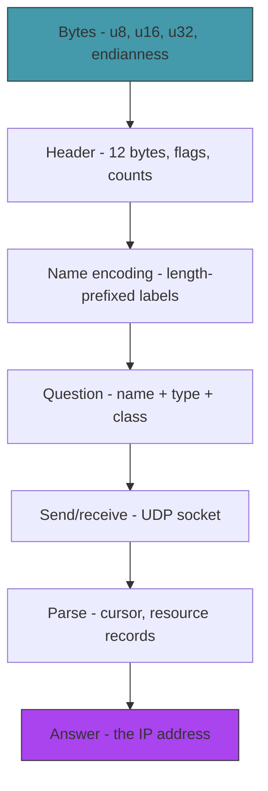

# Act 1 — The First Query

> *Before you can map the internet, you need to learn its language. DNS speaks in bytes — compact binary packets where every bit has meaning. In this act you'll build a DNS query by hand, send it to a real server, and parse the response byte by byte. By the end, binary protocols will feel as readable as JSON.*

This act is deliberately slow. We spend four stages just *building* a packet before we send it. That's intentional — if you understand every byte in a DNS message, the rest of the course is just applying that understanding in increasingly clever ways.

```mermaid
flowchart LR
    S1["Stage 1 - UDP"] --> S2["Stage 2 - Bytes"]
    S2 --> S3["Stage 3 - Header"]
    S3 --> S4["Stage 4 - Name Encoding"]
    S4 --> S5["Stage 5 - Question"]
    S5 --> S6["Stage 6 - Send"]
    S6 --> S7["Stage 7 - Parse Header"]
    S7 --> S8["Stage 8 - Parse Answer"]
    style S1 fill:#49a,stroke:#333
    style S8 fill:#a4e,stroke:#333
```



**Prerequisites:** Rust installed (`rustup`), a terminal, a text editor. Python experience is enough. You should know what an IP address is.

**Project location:** `~/juk/cartografo/`

---

## Stage 1 — The Cartographer's Desk

> *Difficulty: Very Easy — Your first Rust program and your first UDP packet.*

*~25 min*

Before we can explore DNS, we need a working project and proof that we can send data over the network. This stage gets you from zero to "I sent bytes to a server and got bytes back" — the simplest possible network interaction.

> [!tip] What You'll Learn
> - `cargo new` — creating a Rust project
> - `std::net::UdpSocket` — sending and receiving UDP packets
> - The difference between UDP and TCP (and why DNS uses UDP)
> - Your first taste of raw bytes

### Why UDP?

DNS uses UDP because it's fast. A DNS query is typically under 512 bytes — small enough to fit in a single packet. UDP sends that packet with no setup, no handshake, no connection state. TCP would require a three-way handshake (SYN, SYN-ACK, ACK) before sending a single byte of data — overkill for a quick question-and-answer.

**Python comparison:**
```python
# UDP in Python
import socket
sock = socket.socket(socket.AF_INET, socket.SOCK_DGRAM)
sock.sendto(b"hello", ("8.8.8.8", 53))
data, addr = sock.recvfrom(512)
```

Rust's version is almost identical — just with explicit error handling.

### 1.1 — Create the project

```bash
cd ~/juk
cargo new cartografo --edition 2024
cd cartografo
```

`cargo new` creates a directory with `src/main.rs` and `Cargo.toml`. The `--edition 2024` flag selects the latest Rust edition, which determines which language features are available.

**Python comparison:** This is like running `mkdir myproject && cd myproject && touch main.py` — except Cargo also sets up a build system, dependency manager, and test runner in one step.

### 1.2 — Send and receive UDP

Replace `src/main.rs`:

```rust
use std::net::UdpSocket;

fn main() {
    // Bind to any available port on localhost
    let socket = UdpSocket::bind("0.0.0.0:0").expect("Failed to bind socket");

    // Set a timeout so we don't hang forever
    socket.set_read_timeout(Some(std::time::Duration::from_secs(5)))
        .expect("Failed to set timeout");

    // A minimal (invalid) DNS query — just to prove we can send/receive
    // We'll build a real one in Stages 3-5
    let query = [0u8; 12]; // 12 zero bytes (a DNS header, all zeros)

    // Send to Google's public DNS server
    socket.send_to(&query, "8.8.8.8:53").expect("Failed to send");
    println!("Sent {} bytes to 8.8.8.8:53", query.len());

    // Receive the response
    let mut buf = [0u8; 512];
    match socket.recv_from(&mut buf) {
        Ok((size, addr)) => {
            println!("Received {} bytes from {}", size, addr);
            println!("First 12 bytes: {:02x?}", &buf[..12.min(size)]);
        }
        Err(e) => {
            println!("No response (expected — our query was invalid): {}", e);
        }
    }
}
```

Let's unpack what's new:

| Code | Explanation |
|------|-------------|
| `UdpSocket::bind("0.0.0.0:0")` | Create a UDP socket bound to any available port. `0.0.0.0` means "all interfaces", `:0` means "pick a port for me." |
| `.expect("Failed to bind socket")` | Crash with this message if binding fails. We'll replace this with proper error handling in Stage 3. |
| `[0u8; 12]` | An array of 12 zero bytes. `u8` is an unsigned 8-bit integer — one byte. This is how you create raw byte buffers in Rust. |
| `socket.send_to(&query, "8.8.8.8:53")` | Send the bytes to Google's DNS server on port 53 (the standard DNS port). The `&` means we're *borrowing* the data — the socket reads it but doesn't take ownership. |
| `let mut buf = [0u8; 512]` | A 512-byte receive buffer. `mut` because `recv_from` will write into it. DNS over UDP is limited to 512 bytes by default (we'll extend this later with EDNS). |
| `socket.recv_from(&mut buf)` | Wait for a response. Returns `Result<(bytes_read, sender_address)>`. The `&mut` means we're lending the buffer to the socket with permission to modify it. |
| `{:02x?}` | Format bytes as two-digit hexadecimal with debug formatting. `0x0a` instead of `10`. |

**Python comparison:** `.expect()` is like Python's assert — it crashes if the operation fails. In Python, socket operations raise exceptions. In Rust, they return `Result` types that you must handle. `.expect()` is the quick-and-dirty way; we'll learn the proper way (`?` operator) soon.

### 1.3 — Run it

```bash
cargo run
```

```
Sent 12 bytes to 8.8.8.8:53
Received 12 bytes from 8.8.8.8:53
First 12 bytes: [00, 00, 80, 01, 00, 00, 00, 00, 00, 00, 00, 00]
```

The server responded! It sent back an error (our query was all zeros, which is invalid), but the round trip worked. We sent bytes, they traveled across the internet to Google's server, and bytes came back. That's networking.

The `80, 01` in the response is the flags field — `0x8001` means "this is a response (`0x80`) with a format error (`0x01`)." We'll decode these flags properly in Stage 7.

> [!warning] Firewall blocking UDP port 53
> If you get no response, your network might block outbound DNS. Try a different network, or use `dig @8.8.8.8 google.com` to verify DNS works from your machine.

### Extend it

Change the query to send 28 zero bytes instead of 12. Run it again. Does the response change? (Hint: the server still sees an invalid query, but the extra bytes are interpreted as a malformed question section.) Try sending just 1 byte — what happens?

> [!check] Checkpoint
> Run `cargo run`. Verify you get a response from `8.8.8.8`. The response will be an error (that's fine — our query was invalid). Stage 1 complete.

---

## Stage 2 — Thinking in Bytes

> *Difficulty: Easy — Bits, bytes, endianness, and the foundation of all binary protocols.*

*~50 min*

This is the most important stage in the course. Not because of DNS — because of the mental model. Once you understand how numbers become bytes and bytes become numbers, every binary protocol (DNS, TCP, TLS, PNG, ZIP, protobuf) becomes readable. This stage has no networking — it's pure byte manipulation.

> [!tip] What You'll Learn
> - Bits and bytes — what they actually are
> - `u8`, `u16`, `u32` — fixed-size integers
> - Big-endian vs little-endian — why byte order matters
> - `to_be_bytes()` and `from_be_bytes()` — converting between numbers and bytes
> - Bitwise operations — extracting individual bits from a byte

### What is a byte?

A byte is 8 bits. Each bit is a 0 or 1. A byte can represent a number from 0 to 255:

```
Bit position:  7  6  5  4  3  2  1  0
Bit value:   128 64 32 16  8  4  2  1

Example: 0b10110011 = 128 + 32 + 16 + 2 + 1 = 179
```

In Rust, a byte is `u8` — an unsigned 8-bit integer. A `u16` is two bytes (0–65535). A `u32` is four bytes (0–4,294,967,295).

**Python comparison:** Python integers have no fixed size — `x = 99999999999999` just works. Rust integers have explicit sizes because when you're writing bytes to a network packet, you need to know *exactly* how many bytes each number occupies. If you write a `u16`, that's always 2 bytes. No ambiguity.

### Endianness: which byte comes first?

The number `0x0100` (256 in decimal) is two bytes: `0x01` and `0x00`. But which byte do you send first?

- **Big-endian (network byte order):** Most significant byte first → `[0x01, 0x00]`
- **Little-endian (x86 byte order):** Least significant byte first → `[0x00, 0x01]`

Network protocols (including DNS) use **big-endian**. Your CPU (if it's x86 or ARM) uses **little-endian** internally. This means you must convert when reading/writing network data.

Rust makes this explicit:

```rust
fn main() {
    let value: u16 = 256; // 0x0100

    // Big-endian (for network protocols)
    let be_bytes = value.to_be_bytes();
    println!("Big-endian:    {:02x?}", be_bytes);    // [01, 00]

    // Little-endian (native x86/ARM)
    let le_bytes = value.to_le_bytes();
    println!("Little-endian: {:02x?}", le_bytes);    // [00, 01]

    // Convert back
    let from_be = u16::from_be_bytes([0x01, 0x00]);
    let from_le = u16::from_le_bytes([0x00, 0x01]);
    println!("From BE: {} | From LE: {}", from_be, from_le); // both 256
}
```

**The rule:** When writing bytes to a network packet, always use `to_be_bytes()`. When reading bytes from a network packet, always use `from_be_bytes()`. This is so universal that "network byte order" is synonymous with "big-endian."

### Try it yourself — byte conversion

Before moving on, write a small program that:

1. Takes the number `0xABCD` (a `u16`)
2. Converts it to big-endian bytes
3. Prints the bytes in hex
4. Converts the bytes back to a `u16`
5. Asserts the round trip gives you the original value

<details>
<summary>Solution</summary>

```rust
fn main() {
    let original: u16 = 0xABCD;
    let bytes = original.to_be_bytes();
    println!("Bytes: {:02x?}", bytes); // [ab, cd]

    let restored = u16::from_be_bytes(bytes);
    println!("Restored: 0x{:04x}", restored); // 0xabcd
    assert_eq!(original, restored);
    println!("Round trip OK!");
}
```

</details>

### Bitwise operations: reading individual bits

DNS packs multiple flags into a single 16-bit field. To read individual bits, you use bitwise operations:

```rust
fn main() {
    let flags: u16 = 0x8180; // binary: 1000_0001_1000_0000

    // Extract bit 15 (the highest bit) — is this a response?
    let is_response = (flags >> 15) & 1;
    println!("Is response: {}", is_response); // 1 (yes)

    // Extract bits 11-14 (opcode, 4 bits)
    let opcode = (flags >> 11) & 0b1111;
    println!("Opcode: {}", opcode); // 0 (standard query)

    // Extract bit 8 (recursion desired)
    let rd = (flags >> 8) & 1;
    println!("Recursion desired: {}", rd); // 1 (yes)

    // Extract bits 0-3 (response code)
    let rcode = flags & 0b1111;
    println!("Response code: {}", rcode); // 0 (no error)
}
```

| Operator | What it does | Example |
|----------|-------------|---------|
| `>>` | Shift bits right | `0b1100 >> 2` = `0b0011` |
| `<<` | Shift bits left | `0b0011 << 2` = `0b1100` |
| `&` | Bitwise AND (mask) | `0b1100 & 0b1010` = `0b1000` |
| `\|` | Bitwise OR (combine) | `0b1100 \| 0b0010` = `0b1110` |

**The pattern:** To extract N bits starting at position P: `(value >> P) & ((1 << N) - 1)`. This shifts the bits you want to the bottom, then masks off everything above.

**Python comparison:** Python has the same bitwise operators (`>>`, `<<`, `&`, `|`). The difference is that Python integers are arbitrary-precision, so you never worry about overflow. In Rust, `u16` wraps at 65535 — shifting a `u16` right by 16 gives you 0, not the original value.

### Try it yourself — flag extraction

Given the flags value `0x8583` (binary: `1000_0101_1000_0011`), extract:

1. The QR bit (bit 15) — is this a query or response?
2. The opcode (bits 11-14)
3. The AA bit (bit 10) — is this authoritative?
4. The RD bit (bit 8) — recursion desired?
5. The RCODE (bits 0-3)

Write a program that prints each value. Check your answers before looking at the solution.

<details>
<summary>Solution</summary>

```rust
fn main() {
    let flags: u16 = 0x8583;

    let qr = (flags >> 15) & 1;         // 1 (response)
    let opcode = (flags >> 11) & 0b1111; // 0 (standard query)
    let aa = (flags >> 10) & 1;          // 1 (authoritative)
    let rd = (flags >> 8) & 1;           // 1 (recursion desired)
    let rcode = flags & 0b1111;          // 3 (NXDOMAIN)

    println!("QR: {} ({})", qr, if qr == 1 { "response" } else { "query" });
    println!("Opcode: {}", opcode);
    println!("AA: {} ({})", aa, if aa == 1 { "authoritative" } else { "not authoritative" });
    println!("RD: {}", rd);
    println!("RCODE: {} ({})", rcode, if rcode == 3 { "NXDOMAIN" } else { "other" });
}
```

`0x8583` = a response, standard query, authoritative, recursion desired, NXDOMAIN. This is what you'd see when querying for a domain that doesn't exist on an authoritative server.

</details>

### Building a byte buffer

DNS packets are built by appending bytes to a buffer:

```rust
fn main() {
    let mut buf: Vec<u8> = Vec::new();

    // Append a u16 in big-endian
    let id: u16 = 0x1234;
    buf.extend_from_slice(&id.to_be_bytes());

    // Append a single byte
    buf.push(0x01);

    // Append a slice of bytes
    buf.extend_from_slice(&[0x00, 0x01, 0x00, 0x01]);

    println!("Buffer: {:02x?}", buf);
    // [12, 34, 01, 00, 01, 00, 01]
    println!("Length: {} bytes", buf.len());
    // 7
}
```

This is how we'll build DNS packets — start with an empty `Vec<u8>`, append each field in order.

**Python comparison:** `Vec<u8>` is like `bytearray()`. `buf.extend_from_slice(&bytes)` is like `buf.extend(bytes)`. `buf.push(0x01)` is like `buf.append(0x01)`.

### Reading from a byte buffer

And parsing is the reverse — read bytes at specific offsets:

```rust
fn main() {
    let buf: &[u8] = &[0x12, 0x34, 0x81, 0x80, 0x00, 0x01];

    // Read a u16 at offset 0
    let id = u16::from_be_bytes([buf[0], buf[1]]);
    println!("ID: 0x{:04x} ({})", id, id); // 0x1234 (4660)

    // Read a u16 at offset 2
    let flags = u16::from_be_bytes([buf[2], buf[3]]);
    println!("Flags: 0x{:04x}", flags); // 0x8180

    // Read a u16 at offset 4
    let qdcount = u16::from_be_bytes([buf[4], buf[5]]);
    println!("Questions: {}", qdcount); // 1
}
```

`from_be_bytes` takes a fixed-size array — `[u8; 2]` for `u16`, `[u8; 4]` for `u32`. You slice the buffer at the right offset and convert.

> [!warning] Forgetting endianness
> If you use `from_le_bytes` instead of `from_be_bytes` on network data, your numbers will be wrong. `[0x01, 0x00]` is 256 in big-endian but 1 in little-endian. Always use `_be_` for network protocols.
>
> ```rust
> let bytes = [0x01, 0x00];
> let wrong = u16::from_le_bytes(bytes); // 1 — WRONG for network data
> let right = u16::from_be_bytes(bytes); // 256 — correct
> ```

> [!warning] Confusing hex and decimal
> `0x10` is 16, not 10. `0xFF` is 255, not "FF". When reading protocol specs, numbers are almost always in hex. Get comfortable with `{:02x}` formatting.

### Extend it

Write a function `fn pack_u16_pair(a: u16, b: u16) -> Vec<u8>` that packs two `u16` values into a 4-byte big-endian buffer, and a function `fn unpack_u16_pair(buf: &[u8]) -> (u16, u16)` that reads them back. Test with `(0xDEAD, 0xBEEF)` — the buffer should be `[de, ad, be, ef]`.

> [!check] Checkpoint
> Write a program that converts `0x8180` to bytes, then back to a `u16`, and extracts the response bit (bit 15). Verify it's `1`. Stage 2 complete.

---

## Stage 2 — Thinking in Bytes

> *Difficulty: Easy — Bits, bytes, endianness, and the foundation of all binary protocols.*

*~50 min*

This is the most important stage in the course. Not because of DNS — because of the mental model. Once you understand how numbers become bytes and bytes become numbers, every binary protocol (DNS, TCP, TLS, PNG, ZIP, protobuf) becomes readable. This stage has no networking — it's pure byte manipulation.

> [!tip] What You'll Learn
> - Bits and bytes — what they actually are
> - `u8`, `u16`, `u32` — fixed-size integers
> - Big-endian vs little-endian — why byte order matters
> - `to_be_bytes()` and `from_be_bytes()` — converting between numbers and bytes
> - Bitwise operations — extracting individual bits from a byte

### What is a byte?

A byte is 8 bits. Each bit is a 0 or 1. A byte can represent a number from 0 to 255:

```
Bit position:  7  6  5  4  3  2  1  0
Bit value:   128 64 32 16  8  4  2  1

Example: 0b10110011 = 128 + 32 + 16 + 2 + 1 = 179
```

In Rust, a byte is `u8` — an unsigned 8-bit integer. A `u16` is two bytes (0–65535). A `u32` is four bytes (0–4,294,967,295).

**Python comparison:** Python integers have no fixed size — `x = 99999999999999` just works. Rust integers have explicit sizes because when you're writing bytes to a network packet, you need to know *exactly* how many bytes each number occupies. If you write a `u16`, that's always 2 bytes. No ambiguity.

### Endianness: which byte comes first?

The number `0x0100` (256 in decimal) is two bytes: `0x01` and `0x00`. But which byte do you send first?

- **Big-endian (network byte order):** Most significant byte first → `[0x01, 0x00]`
- **Little-endian (x86 byte order):** Least significant byte first → `[0x00, 0x01]`

Network protocols (including DNS) use **big-endian**. Your CPU (if it's x86 or ARM) uses **little-endian** internally. This means you must convert when reading/writing network data.

Rust makes this explicit:

```rust
fn main() {
    let value: u16 = 256; // 0x0100

    // Big-endian (for network protocols)
    let be_bytes = value.to_be_bytes();
    println!("Big-endian:    {:02x?}", be_bytes);    // [01, 00]

    // Little-endian (native x86/ARM)
    let le_bytes = value.to_le_bytes();
    println!("Little-endian: {:02x?}", le_bytes);    // [00, 01]

    // Convert back
    let from_be = u16::from_be_bytes([0x01, 0x00]);
    let from_le = u16::from_le_bytes([0x00, 0x01]);
    println!("From BE: {} | From LE: {}", from_be, from_le); // both 256
}
```

**The rule:** When writing bytes to a network packet, always use `to_be_bytes()`. When reading bytes from a network packet, always use `from_be_bytes()`. This is so universal that "network byte order" is synonymous with "big-endian."

### Try it yourself — byte conversion

Before moving on, write a small program that:

1. Takes the number `0xABCD` (a `u16`)
2. Converts it to big-endian bytes
3. Prints the bytes in hex
4. Converts the bytes back to a `u16`
5. Asserts the round trip gives you the original value

<details>
<summary>Solution</summary>

```rust
fn main() {
    let original: u16 = 0xABCD;
    let bytes = original.to_be_bytes();
    println!("Bytes: {:02x?}", bytes); // [ab, cd]

    let restored = u16::from_be_bytes(bytes);
    println!("Restored: 0x{:04x}", restored); // 0xabcd
    assert_eq!(original, restored);
    println!("Round trip OK!");
}
```

</details>

### Bitwise operations: reading individual bits

DNS packs multiple flags into a single 16-bit field. To read individual bits, you use bitwise operations:

```rust
fn main() {
    let flags: u16 = 0x8180; // binary: 1000_0001_1000_0000

    // Extract bit 15 (the highest bit) — is this a response?
    let is_response = (flags >> 15) & 1;
    println!("Is response: {}", is_response); // 1 (yes)

    // Extract bits 11-14 (opcode, 4 bits)
    let opcode = (flags >> 11) & 0b1111;
    println!("Opcode: {}", opcode); // 0 (standard query)

    // Extract bit 8 (recursion desired)
    let rd = (flags >> 8) & 1;
    println!("Recursion desired: {}", rd); // 1 (yes)

    // Extract bits 0-3 (response code)
    let rcode = flags & 0b1111;
    println!("Response code: {}", rcode); // 0 (no error)
}
```

| Operator | What it does | Example |
|----------|-------------|---------|
| `>>` | Shift bits right | `0b1100 >> 2` = `0b0011` |
| `<<` | Shift bits left | `0b0011 << 2` = `0b1100` |
| `&` | Bitwise AND (mask) | `0b1100 & 0b1010` = `0b1000` |
| `\|` | Bitwise OR (combine) | `0b1100 \| 0b0010` = `0b1110` |

**The pattern:** To extract N bits starting at position P: `(value >> P) & ((1 << N) - 1)`. This shifts the bits you want to the bottom, then masks off everything above.

**Python comparison:** Python has the same bitwise operators (`>>`, `<<`, `&`, `|`). The difference is that Python integers are arbitrary-precision, so you never worry about overflow. In Rust, `u16` wraps at 65535 — shifting a `u16` right by 16 gives you 0, not the original value.

### Try it yourself — flag extraction

Given the flags value `0x8583` (binary: `1000_0101_1000_0011`), extract:

1. The QR bit (bit 15) — is this a query or response?
2. The opcode (bits 11-14)
3. The AA bit (bit 10) — is this authoritative?
4. The RD bit (bit 8) — recursion desired?
5. The RCODE (bits 0-3)

Write a program that prints each value. Check your answers before looking at the solution.

<details>
<summary>Solution</summary>

```rust
fn main() {
    let flags: u16 = 0x8583;

    let qr = (flags >> 15) & 1;         // 1 (response)
    let opcode = (flags >> 11) & 0b1111; // 0 (standard query)
    let aa = (flags >> 10) & 1;          // 1 (authoritative)
    let rd = (flags >> 8) & 1;           // 1 (recursion desired)
    let rcode = flags & 0b1111;          // 3 (NXDOMAIN)

    println!("QR: {} ({})", qr, if qr == 1 { "response" } else { "query" });
    println!("Opcode: {}", opcode);
    println!("AA: {} ({})", aa, if aa == 1 { "authoritative" } else { "not authoritative" });
    println!("RD: {}", rd);
    println!("RCODE: {} ({})", rcode, if rcode == 3 { "NXDOMAIN" } else { "other" });
}
```

`0x8583` = a response, standard query, authoritative, recursion desired, NXDOMAIN. This is what you'd see when querying for a domain that doesn't exist on an authoritative server.

</details>

### Building a byte buffer

DNS packets are built by appending bytes to a buffer:

```rust
fn main() {
    let mut buf: Vec<u8> = Vec::new();

    // Append a u16 in big-endian
    let id: u16 = 0x1234;
    buf.extend_from_slice(&id.to_be_bytes());

    // Append a single byte
    buf.push(0x01);

    // Append a slice of bytes
    buf.extend_from_slice(&[0x00, 0x01, 0x00, 0x01]);

    println!("Buffer: {:02x?}", buf);
    // [12, 34, 01, 00, 01, 00, 01]
    println!("Length: {} bytes", buf.len());
    // 7
}
```

This is how we'll build DNS packets — start with an empty `Vec<u8>`, append each field in order.

**Python comparison:** `Vec<u8>` is like `bytearray()`. `buf.extend_from_slice(&bytes)` is like `buf.extend(bytes)`. `buf.push(0x01)` is like `buf.append(0x01)`.

### Reading from a byte buffer

And parsing is the reverse — read bytes at specific offsets:

```rust
fn main() {
    let buf: &[u8] = &[0x12, 0x34, 0x81, 0x80, 0x00, 0x01];

    // Read a u16 at offset 0
    let id = u16::from_be_bytes([buf[0], buf[1]]);
    println!("ID: 0x{:04x} ({})", id, id); // 0x1234 (4660)

    // Read a u16 at offset 2
    let flags = u16::from_be_bytes([buf[2], buf[3]]);
    println!("Flags: 0x{:04x}", flags); // 0x8180

    // Read a u16 at offset 4
    let qdcount = u16::from_be_bytes([buf[4], buf[5]]);
    println!("Questions: {}", qdcount); // 1
}
```

`from_be_bytes` takes a fixed-size array — `[u8; 2]` for `u16`, `[u8; 4]` for `u32`. You slice the buffer at the right offset and convert.

> [!warning] Forgetting endianness
> If you use `from_le_bytes` instead of `from_be_bytes` on network data, your numbers will be wrong:
> ```rust
> let bytes = [0x01, 0x00];
> let wrong = u16::from_le_bytes(bytes); // 1 — WRONG for network data
> let right = u16::from_be_bytes(bytes); // 256 — correct
> ```
> Always use `_be_` for network protocols.

> [!warning] Confusing hex and decimal
> `0x10` is 16, not 10. `0xFF` is 255, not "FF". When reading protocol specs, numbers are almost always in hex. Get comfortable with `{:02x}` formatting.

### Extend it

Write a function `fn pack_u16_pair(a: u16, b: u16) -> Vec<u8>` that packs two `u16` values into a 4-byte big-endian buffer, and a function `fn unpack_u16_pair(buf: &[u8]) -> (u16, u16)` that reads them back. Test with `(0xDEAD, 0xBEEF)` — the buffer should be `[de, ad, be, ef]`.

> [!check] Checkpoint
> Write a program that converts `0x8180` to bytes, then back to a `u16`, and extracts the response bit (bit 15). Verify it's `1`. Stage 2 complete.

---

## Stage 3 — The DNS Header

> *Difficulty: Easy — 12 bytes that control everything.*

*~60 min*

Every DNS message — query or response — starts with a 12-byte header. These 12 bytes tell the server what you're asking, and tell you what the server answered. This stage builds a struct that represents the header and can serialize itself to bytes and parse itself from bytes.

This is also where we create our first separate module, write our first tests, and start thinking about error handling.

> [!tip] What You'll Learn
> - The DNS header format (RFC 1035, Section 4.1.1)
> - Packing multiple fields into a 16-bit flags word
> - Serializing a struct to bytes and deserializing bytes to a struct
> - The Rust module system — `mod`, `pub`, and file organization
> - Writing your first `#[test]` functions
> - Introduction to `Result<T, E>` and the `?` operator

### The header format

```
                                1  1  1  1  1  1
  0  1  2  3  4  5  6  7  8  9  0  1  2  3  4  5
+--+--+--+--+--+--+--+--+--+--+--+--+--+--+--+--+
|                      ID                         |   bytes 0-1
+--+--+--+--+--+--+--+--+--+--+--+--+--+--+--+--+
|QR|   Opcode  |AA|TC|RD|RA|   Z    |   RCODE    |   bytes 2-3
+--+--+--+--+--+--+--+--+--+--+--+--+--+--+--+--+
|                    QDCOUNT                      |   bytes 4-5
+--+--+--+--+--+--+--+--+--+--+--+--+--+--+--+--+
|                    ANCOUNT                      |   bytes 6-7
+--+--+--+--+--+--+--+--+--+--+--+--+--+--+--+--+
|                    NSCOUNT                      |   bytes 8-9
+--+--+--+--+--+--+--+--+--+--+--+--+--+--+--+--+
|                    ARCOUNT                      |   bytes 10-11
+--+--+--+--+--+--+--+--+--+--+--+--+--+--+--+--+
```

12 bytes. 6 fields (each 16 bits). Let's decode them:

| Field | Bytes | Bits | Meaning |
|-------|-------|------|---------|
| ID | 0-1 | 16 | Transaction ID — match responses to queries |
| QR | 2 | 1 | 0 = query, 1 = response |
| Opcode | 2 | 4 | 0 = standard query, 1 = inverse, 2 = status |
| AA | 2 | 1 | Authoritative answer (server owns this domain) |
| TC | 2 | 1 | Truncated (response too big for UDP) |
| RD | 2 | 1 | Recursion desired (please resolve this for me) |
| RA | 3 | 1 | Recursion available (server supports recursion) |
| Z | 3 | 3 | Reserved (must be zero) |
| RCODE | 3 | 4 | Response code: 0=OK, 1=format error, 2=server fail, 3=NXDOMAIN |
| QDCOUNT | 4-5 | 16 | Number of questions |
| ANCOUNT | 6-7 | 16 | Number of answer records |
| NSCOUNT | 8-9 | 16 | Number of authority records |
| ARCOUNT | 10-11 | 16 | Number of additional records |

The flags field (bytes 2-3) packs 8 sub-fields into 16 bits. This is why we learned bitwise operations in Stage 2.

### Concept: The Rust Module System

We're about to create a second file — `src/protocol.rs`. In Rust, each `.rs` file is a **module**, but files don't automatically become part of your program. You must explicitly declare them.

Here's how it works:

1. **Create the file:** `src/protocol.rs`
2. **Declare the module in `main.rs`:** add `mod protocol;` at the top
3. **Mark items as public:** anything you want to use from `main.rs` needs `pub`

```rust
// src/main.rs
mod protocol;  // ← tells Rust: "load src/protocol.rs as a module called protocol"

fn main() {
    let header = protocol::Header::new_query(0xABCD);
    //           ^^^^^^^^ module name, then :: to access its public items
}
```

```rust
// src/protocol.rs
pub struct Header { /* ... */ }  // ← pub makes it visible outside this module
//  ^^^

impl Header {
    pub fn new_query(id: u16) -> Self { /* ... */ }
    //  ^^^
}
```

If you forget `mod protocol;` in `main.rs`, you'll get this error:

```
error[E0433]: failed to resolve: use of undeclared crate or module `protocol`
 --> src/main.rs:4:18
  |
4 |     let header = protocol::Header::new_query(0xABCD);
  |                  ^^^^^^^^ use of undeclared crate or module `protocol`
```

If you forget `pub` on the struct:

```
error[E0603]: struct `Header` is private
 --> src/main.rs:4:29
  |
4 |     let header = protocol::Header::new_query(0xABCD);
  |                             ^^^^^^ private struct
```

**Python comparison:** In Python, any `.py` file is automatically importable with `import filename`. In Rust, you must declare the module with `mod`. Think of `mod protocol;` as a combination of Python's `import protocol` and "register this file as part of my crate." The `pub` keyword is like Python's convention of using `_` prefixes for private items — except Rust enforces it at compile time.

### 3.1 — The Header struct

Create `src/protocol.rs`:

```rust
/// A DNS message header (12 bytes).
#[derive(Debug, Clone)]
pub struct Header {
    pub id: u16,
    pub is_response: bool,
    pub opcode: u8,
    pub authoritative: bool,
    pub truncated: bool,
    pub recursion_desired: bool,
    pub recursion_available: bool,
    pub rcode: u8,
    pub question_count: u16,
    pub answer_count: u16,
    pub authority_count: u16,
    pub additional_count: u16,
}
```

We store the flags as individual booleans and small integers rather than a raw `u16`. This makes the struct easy to work with — you write `header.is_response` instead of `(header.flags >> 15) & 1 == 1`.

`#[derive(Debug, Clone)]` automatically generates two things:
- `Debug` — lets you print the struct with `{:?}` for debugging
- `Clone` — lets you make copies with `.clone()`

**Python comparison:** This is like a `@dataclass` with typed fields. `#[derive(Debug)]` is like `__repr__`, and `Clone` is like `copy.copy()`.

### 3.2 — Serialize to bytes

```rust
impl Header {
    /// Build a query header with sensible defaults.
    pub fn new_query(id: u16) -> Self {
        Header {
            id,
            is_response: false,
            opcode: 0,
            authoritative: false,
            truncated: false,
            recursion_desired: true, // we want the server to recurse for us
            recursion_available: false,
            rcode: 0,
            question_count: 1,
            answer_count: 0,
            authority_count: 0,
            additional_count: 0,
        }
    }

    /// Serialize the header to 12 bytes (big-endian).
    pub fn to_bytes(&self) -> Vec<u8> {
        let mut buf = Vec::with_capacity(12);

        // Bytes 0-1: ID
        buf.extend_from_slice(&self.id.to_be_bytes());

        // Bytes 2-3: Flags
        let mut flags: u16 = 0;
        if self.is_response    { flags |= 1 << 15; }
        flags |= (self.opcode as u16 & 0xF) << 11;
        if self.authoritative  { flags |= 1 << 10; }
        if self.truncated      { flags |= 1 << 9; }
        if self.recursion_desired { flags |= 1 << 8; }
        if self.recursion_available { flags |= 1 << 7; }
        flags |= self.rcode as u16 & 0xF;
        buf.extend_from_slice(&flags.to_be_bytes());

        // Bytes 4-11: Counts
        buf.extend_from_slice(&self.question_count.to_be_bytes());
        buf.extend_from_slice(&self.answer_count.to_be_bytes());
        buf.extend_from_slice(&self.authority_count.to_be_bytes());
        buf.extend_from_slice(&self.additional_count.to_be_bytes());

        buf
    }
}
```

The `to_bytes` method builds the flags word by setting individual bits with `|=` (OR) and `<<` (shift). This is the core pattern for all binary protocol work.

### 3.3 — Deserialize from bytes

Now the reverse — parsing a header from raw bytes. This is where we introduce **`Result`** for error handling.

### Concept: Result and the ? operator

So far we've used `.expect()` to handle errors — it crashes the program with a message. That's fine for quick experiments, but real code needs to *return* errors so the caller can decide what to do.

Rust uses `Result<T, E>` for this:

```rust
// .expect() — crashes on error (development shortcut)
let socket = UdpSocket::bind("0.0.0.0:0").expect("bind failed");

// Result — returns the error to the caller (production code)
fn do_something() -> Result<(), String> {
    let socket = UdpSocket::bind("0.0.0.0:0")
        .map_err(|e| format!("bind failed: {}", e))?;
    //                                             ^ the ? operator
    Ok(())
}
```

The `?` operator is the key: if the result is `Ok(value)`, it unwraps the value. If it's `Err(e)`, it *returns early* from the function with that error. It's like Python's exception propagation, but explicit.

**Python comparison:**
```python
# Python — exceptions propagate automatically
def do_something():
    sock = socket.socket(...)  # raises on failure, caller catches

# Rust — you choose to propagate with ?
fn do_something() -> Result<(), String> {
    let sock = UdpSocket::bind("0.0.0.0:0").map_err(|e| e.to_string())?;
    Ok(())
}
```

We'll start using `Result` for parsing, where invalid input is a real possibility (a truncated packet, a malformed header). We'll keep `.expect()` for things that should never fail (binding a socket on startup) and replace those later.

```rust
impl Header {
    /// Parse a header from the first 12 bytes of a buffer.
    /// Returns an error if the buffer is too short.
    pub fn from_bytes(buf: &[u8]) -> Result<Self, String> {
        if buf.len() < 12 {
            return Err(format!(
                "Buffer too short for DNS header: {} bytes (need 12)", buf.len()
            ));
        }

        let id = u16::from_be_bytes([buf[0], buf[1]]);
        let flags = u16::from_be_bytes([buf[2], buf[3]]);

        Ok(Header {
            id,
            is_response:         (flags >> 15) & 1 == 1,
            opcode:              ((flags >> 11) & 0xF) as u8,
            authoritative:       (flags >> 10) & 1 == 1,
            truncated:           (flags >> 9) & 1 == 1,
            recursion_desired:   (flags >> 8) & 1 == 1,
            recursion_available: (flags >> 7) & 1 == 1,
            rcode:               (flags & 0xF) as u8,
            question_count:  u16::from_be_bytes([buf[4], buf[5]]),
            answer_count:    u16::from_be_bytes([buf[6], buf[7]]),
            authority_count: u16::from_be_bytes([buf[8], buf[9]]),
            additional_count: u16::from_be_bytes([buf[10], buf[11]]),
        })
    }
}
```

Notice `from_bytes` returns `Result<Self, String>`. If the buffer is too short, it returns `Err(...)` instead of panicking. The caller uses `?` to propagate the error or `.expect()` if they're sure it won't fail.

### 3.4 — Your first tests

Rust has a built-in test framework. Tests live in the same file as the code they test, inside a `#[cfg(test)]` module:

```rust
// At the bottom of src/protocol.rs:

#[cfg(test)]
mod tests {
    use super::*;

    #[test]
    fn test_header_round_trip() {
        let header = Header::new_query(0xABCD);
        let bytes = header.to_bytes();

        assert_eq!(bytes.len(), 12);

        let parsed = Header::from_bytes(&bytes).unwrap();
        assert_eq!(parsed.id, 0xABCD);
        assert!(!parsed.is_response);
        assert!(parsed.recursion_desired);
        assert_eq!(parsed.question_count, 1);
        assert_eq!(parsed.answer_count, 0);
    }

    #[test]
    fn test_header_bytes_match_expected() {
        let header = Header::new_query(0xABCD);
        let bytes = header.to_bytes();

        // ID
        assert_eq!(&bytes[0..2], &[0xAB, 0xCD]);
        // Flags: only RD set (bit 8) → 0x0100
        assert_eq!(&bytes[2..4], &[0x01, 0x00]);
        // QDCOUNT = 1
        assert_eq!(&bytes[4..6], &[0x00, 0x01]);
        // All other counts = 0
        assert_eq!(&bytes[6..12], &[0x00, 0x00, 0x00, 0x00, 0x00, 0x00]);
    }

    #[test]
    fn test_header_from_bytes_too_short() {
        let result = Header::from_bytes(&[0x00; 5]);
        assert!(result.is_err());
    }
}
```

Run the tests:

```bash
cargo test
```

```
running 3 tests
test protocol::tests::test_header_round_trip ... ok
test protocol::tests::test_header_bytes_match_expected ... ok
test protocol::tests::test_header_from_bytes_too_short ... ok

test result: ok. 3 passed; 0 finished; 0 ignored
```

| Code | Explanation |
|------|-------------|
| `#[cfg(test)]` | This module is only compiled when running tests — it's stripped from release builds. |
| `mod tests` | A nested module for test functions. |
| `use super::*;` | Import everything from the parent module (so we can use `Header` without `protocol::Header`). |
| `#[test]` | Marks a function as a test case. `cargo test` finds and runs all `#[test]` functions. |
| `assert_eq!(a, b)` | Panics if `a != b`, printing both values. |
| `assert!(condition)` | Panics if the condition is false. |

From now on, every stage that builds a pure function should include at least one test. Tests are your safety net — if a test passes, your implementation is correct.

### 3.5 — Test the round trip in main

Update `src/main.rs`:

```rust
mod protocol;

fn main() {
    // Build a query header
    let header = protocol::Header::new_query(0xABCD);
    let bytes = header.to_bytes();

    println!("Header bytes: {:02x?}", bytes);
    println!("Length: {} bytes", bytes.len());

    // Parse it back — using .expect() here since we just built the bytes ourselves
    let parsed = protocol::Header::from_bytes(&bytes)
        .expect("Failed to parse header we just built");
    println!("\nParsed:");
    println!("  ID: 0x{:04x}", parsed.id);
    println!("  Is response: {}", parsed.is_response);
    println!("  Recursion desired: {}", parsed.recursion_desired);
    println!("  Questions: {}", parsed.question_count);
}
```

```bash
cargo run
```

```
Header bytes: [ab, cd, 01, 00, 00, 01, 00, 00, 00, 00, 00, 00]
Length: 12 bytes

Parsed:
  ID: 0xabcd
  Is response: false
  Recursion desired: true
  Questions: 1
```

Let's verify byte by byte:
- `[ab, cd]` — ID = 0xABCD ✓
- `[01, 00]` — flags = 0x0100 = only RD bit set (bit 8) ✓
- `[00, 01]` — QDCOUNT = 1 ✓
- `[00, 00, 00, 00, 00, 00]` — all other counts = 0 ✓

> [!warning] Getting the bit positions wrong in the flags field
> The QR bit is bit 15 (the *highest* bit of the 16-bit field), not bit 0. If your flags come out wrong, draw the bit layout on paper:
> ```
> Bit: 15 14 13 12 11 10  9  8  7  6  5  4  3  2  1  0
>       QR [  Opcode  ] AA TC RD RA [ Z  ] [  RCODE   ]
> ```
> A common mistake is setting `flags |= 1 << 7` for RD when it should be `flags |= 1 << 8`. The compiler won't catch this — your tests will.

### Try it yourself — response header

Build a *response* header (not a query) with these values:
- ID: `0x1234`
- Is response: `true`
- Authoritative: `true`
- Recursion desired: `true`
- Recursion available: `true`
- RCODE: 0 (no error)
- 1 question, 2 answers

Serialize it to bytes and verify the flags word is `0x8580` (binary: `1000_0101_1000_0000`). Write a test that checks this.

<details>
<summary>Solution</summary>

```rust
#[test]
fn test_response_header() {
    let header = Header {
        id: 0x1234,
        is_response: true,
        opcode: 0,
        authoritative: true,
        truncated: false,
        recursion_desired: true,
        recursion_available: true,
        rcode: 0,
        question_count: 1,
        answer_count: 2,
        authority_count: 0,
        additional_count: 0,
    };
    let bytes = header.to_bytes();

    assert_eq!(&bytes[0..2], &[0x12, 0x34]); // ID
    assert_eq!(&bytes[2..4], &[0x85, 0x80]); // Flags
    assert_eq!(&bytes[4..6], &[0x00, 0x01]); // QDCOUNT
    assert_eq!(&bytes[6..8], &[0x00, 0x02]); // ANCOUNT
}
```

</details>

### Extend it

Add an `rcode_name(&self) -> &str` method to `Header` that returns a human-readable name for the response code: `"NOERROR"` for 0, `"FORMERR"` for 1, `"SERVFAIL"` for 2, `"NXDOMAIN"` for 3, `"REFUSED"` for 5, and `"UNKNOWN"` for anything else. Write a test for it.

> [!check] Checkpoint
> Build a query header, serialize it to bytes, parse it back. Run `cargo test` and verify all tests pass. Stage 3 complete.

---

## Stage 4 — Encoding a Name

> *Difficulty: Easy — The DNS wire format for domain names.*

*~45 min*

DNS doesn't send domain names as plain text like `"google.com"`. It uses a special encoding: each label (the parts between dots) is prefixed with its length, and the whole name ends with a zero byte. `google.com` becomes `\x06google\x03com\x00`. This stage builds the encoder.

> [!tip] What You'll Learn
> - DNS name encoding — length-prefixed labels
> - Why DNS uses this format (no delimiter ambiguity, easy to parse)
> - Working with `String` → `Vec<u8>` conversion
> - The 63-byte label limit and 253-byte name limit
> - The difference between `&str` and `String`

### The wire format

```
google.com → [6] g o o g l e [3] c o m [0]
```

Each label is preceded by a byte containing its length. The name ends with a zero-length label (a single `0x00` byte). No dots in the wire format — the length bytes replace them.

Why not just send `"google.com\0"` as a null-terminated string? Because labels can contain any byte value (including dots), and length-prefixed encoding is unambiguous and fast to parse — you always know exactly how many bytes to read next.

### Concept: &str vs String

You'll see two string types in Rust:

- **`&str`** — a *borrowed* reference to string data. Like a read-only view. Function parameters usually take `&str`.
- **`String`** — an *owned* string that you can modify. Like Python's `str`. Created with `.to_string()` or `String::from()`.

```rust
fn greet(name: &str) {       // borrows — doesn't take ownership
    println!("Hello, {}", name);
}

fn main() {
    let owned = String::from("world");  // owned String
    greet(&owned);                       // borrow it with &
    greet("literal");                    // string literals are already &str
    println!("{}", owned);               // still valid — we only borrowed it
}
```

**Python comparison:** Python strings are always owned and reference-counted. Rust's `&str` is like getting a read-only view of someone else's string without copying it. This is more efficient but means you need to think about who owns the data.

For our encoder, the input is `&str` (we just read the name, we don't need to own it) and the output is `Vec<u8>` (we're creating new bytes).

### Try it yourself — the encoder

Before looking at the solution, try writing `encode_name` yourself. Here's the signature and the rules:

```rust
/// Encode a domain name into DNS wire format.
/// "google.com" → [6, 103, 111, 111, 103, 108, 101, 3, 99, 111, 109, 0]
pub fn encode_name(name: &str) -> Vec<u8> {
    todo!() // YOUR CODE HERE
}
```

Rules:
1. Remove any trailing dot (FQDN notation: `"google.com."` → `"google.com"`)
2. Split on `'.'`
3. For each label: push the length as a `u8`, then push the label bytes
4. Push a final `0x00` byte
5. Each label must be ≤ 63 bytes

Test case: `encode_name("google.com")` should return `[06, 67, 6f, 6f, 67, 6c, 65, 03, 63, 6f, 6d, 00]`.

Implement it, then compare with the solution below.

<details>
<summary>Solution</summary>

```rust
/// Encode a domain name into DNS wire format.
pub fn encode_name(name: &str) -> Vec<u8> {
    let mut buf = Vec::new();

    // Remove trailing dot if present (FQDN notation)
    let name = name.trim_end_matches('.');

    for label in name.split('.') {
        let len = label.len();
        assert!(len <= 63, "Label '{}' exceeds 63-byte limit", label);
        buf.push(len as u8);
        buf.extend_from_slice(label.as_bytes());
    }

    // Terminating zero-length label
    buf.push(0);

    buf
}
```

</details>

> [!warning] `&str` vs `String` confusion
> If you tried to write `for label in name.split('.')` and then `buf.push(label.len())`, you might get:
> ```
> error[E0308]: mismatched types
>   --> src/protocol.rs:42:18
>    |
> 42 |     buf.push(label.len());
>    |              ^^^^^^^^^^^ expected `u8`, found `usize`
> ```
> `label.len()` returns `usize` (a pointer-sized integer), but `buf.push()` expects `u8`. You need `label.len() as u8` to convert. This is safe here because we've already checked that the length is ≤ 63, which fits in a `u8`.

### 4.2 — The decoder (for parsing responses)

We'll need this in Stage 8. The decoder walks the buffer: read a length byte, read that many bytes as a label, repeat until length is zero. It returns both the decoded name and how many bytes were consumed (so the caller knows where the next field starts).

```rust
/// Decode a domain name from DNS wire format.
/// Returns the name and the number of bytes consumed.
pub fn decode_name(buf: &[u8], start: usize) -> Result<(String, usize), String> {
    let mut labels: Vec<String> = Vec::new();
    let mut pos = start;

    loop {
        if pos >= buf.len() {
            return Err(format!("Name extends past end of buffer at offset {}", pos));
        }

        let len = buf[pos] as usize;

        if len == 0 {
            // End of name
            pos += 1;
            break;
        }

        // We'll handle compression pointers (0xC0) in Act 2
        if len > 63 {
            return Err(format!("Invalid label length {} at offset {}", len, pos));
        }

        pos += 1;
        if pos + len > buf.len() {
            return Err(format!("Label extends past end of buffer at offset {}", pos));
        }
        let label = std::str::from_utf8(&buf[pos..pos + len])
            .map_err(|e| format!("Invalid UTF-8 in label at offset {}: {}", pos, e))?;
        labels.push(label.to_string());
        pos += len;
    }

    Ok((labels.join("."), pos - start))
}
```

Notice we return `Result` here too — a malformed packet could have a label that extends past the buffer, or contain invalid UTF-8. The `?` on `from_utf8` propagates that error automatically.

### 4.3 — Tests

```rust
// Add to the #[cfg(test)] mod tests block:

#[test]
fn test_encode_name_google() {
    let encoded = encode_name("google.com");
    assert_eq!(encoded, vec![
        6, b'g', b'o', b'o', b'g', b'l', b'e',
        3, b'c', b'o', b'm',
        0
    ]);
}

#[test]
fn test_encode_name_trailing_dot() {
    // FQDN notation — trailing dot should be stripped
    assert_eq!(encode_name("google.com."), encode_name("google.com"));
}

#[test]
fn test_decode_name_round_trip() {
    let encoded = encode_name("mail.google.com");
    let (decoded, consumed) = decode_name(&encoded, 0).unwrap();
    assert_eq!(decoded, "mail.google.com");
    assert_eq!(consumed, encoded.len());
}

#[test]
fn test_decode_name_empty_buffer() {
    let result = decode_name(&[], 0);
    assert!(result.is_err());
}
```

```bash
cargo test
```

> [!warning] Forgetting the terminating zero byte
> Without the `0x00` at the end, the parser doesn't know where the name ends. Every encoded name must end with a zero-length label. If your `encode_name` output doesn't end with `0`, the decoder will keep reading past the name into whatever bytes follow.

> [!warning] Including the dot in the label
> `"google.com".split('.')` gives `["google", "com"]` — no dots. The dots are implicit in the wire format (each label is a separate length-prefixed segment). If you accidentally include the dot, the label length will be wrong.

### Extend it

Write `encode_name("a]")` — a single-character label. Verify the output is `[1, 97, 0]` (length 1, ASCII 'a', terminator). Then try encoding a name with an empty label like `".com"` — what happens? Should your encoder reject it?

> [!check] Checkpoint
> Encode `"google.com"` and verify the output matches the expected bytes. Decode it back and verify you get `"google.com"`. Run `cargo test`. Stage 4 complete.

---

## Stage 5 — The Question Section

> *Difficulty: Medium — Assembling a complete DNS query packet.*

*~50 min*

We have a header (12 bytes) and a name encoder. The question section adds two more fields after the name: the query type (what kind of record?) and the query class (what network?). Together, header + question = a complete DNS query that a server can answer.

> [!tip] What You'll Learn
> - DNS record types (A, AAAA, CNAME, MX, NS, TXT)
> - The question section format: name + type + class
> - Assembling a complete query packet
> - Rust enums with numeric values
> - Why there's a "class" field (historical artifact from the 1980s)

### Record types

| Type | Value | Meaning |
|------|-------|---------|
| A | 1 | IPv4 address (4 bytes) |
| NS | 2 | Name server |
| CNAME | 5 | Canonical name (alias) |
| SOA | 6 | Start of authority |
| MX | 15 | Mail exchange |
| TXT | 16 | Text record |
| AAAA | 28 | IPv6 address (16 bytes) |

The query type tells the server what you're looking for. `A` is the most common — "give me the IPv4 address for this name."

### The class field

The class is almost always `1` (IN = Internet). In the 1980s, DNS was designed to support multiple network types (Chaosnet, Hesiod). Only the Internet survived. The class field is a historical artifact that every DNS implementation must include but nobody uses for anything else.

### 5.1 — Record type enum

Add to `src/protocol.rs`:

```rust
/// DNS record types.
#[derive(Debug, Clone, Copy, PartialEq)]
pub enum RecordType {
    A     = 1,
    NS    = 2,
    CNAME = 5,
    SOA   = 6,
    MX    = 15,
    TXT   = 16,
    AAAA  = 28,
}

impl RecordType {
    pub fn from_u16(value: u16) -> Option<RecordType> {
        match value {
            1  => Some(RecordType::A),
            2  => Some(RecordType::NS),
            5  => Some(RecordType::CNAME),
            6  => Some(RecordType::SOA),
            15 => Some(RecordType::MX),
            16 => Some(RecordType::TXT),
            28 => Some(RecordType::AAAA),
            _  => None,
        }
    }

    pub fn to_u16(self) -> u16 {
        self as u16
    }
}
```

**Python comparison:** This is like an `IntEnum`:
```python
class RecordType(IntEnum):
    A = 1
    NS = 2
    CNAME = 5
```
Rust enums are more powerful — they can hold data (we'll see this with error types later). Here we use them as simple numeric constants.

### Try it yourself — build_query

You have all the pieces. Write `build_query` yourself before looking at the solution:

```rust
/// Build a complete DNS query packet.
pub fn build_query(id: u16, name: &str, record_type: RecordType) -> Vec<u8> {
    todo!() // YOUR CODE HERE
}
```

The packet is: header bytes + encoded name + record type (2 bytes, big-endian) + class (2 bytes, big-endian, always 1).

Test case: `build_query(0xABCD, "google.com", RecordType::A)` should produce a 28-byte packet.

<details>
<summary>Solution</summary>

```rust
/// Build a complete DNS query packet.
pub fn build_query(id: u16, name: &str, record_type: RecordType) -> Vec<u8> {
    let header = Header::new_query(id);
    let mut packet = header.to_bytes();

    // Question section: name + type + class
    packet.extend_from_slice(&encode_name(name));
    packet.extend_from_slice(&record_type.to_u16().to_be_bytes()); // QTYPE
    packet.extend_from_slice(&1u16.to_be_bytes());                  // QCLASS = IN (1)

    packet
}
```

</details>

### 5.3 — Tests

```rust
#[test]
fn test_build_query_google_a() {
    let query = build_query(0xABCD, "google.com", RecordType::A);

    assert_eq!(query.len(), 28);

    // Header
    assert_eq!(&query[0..2], &[0xAB, 0xCD]);   // ID
    assert_eq!(&query[2..4], &[0x01, 0x00]);    // Flags (RD=1)
    assert_eq!(&query[4..6], &[0x00, 0x01]);    // QDCOUNT=1

    // Question: encoded name
    assert_eq!(query[12], 6); // "google" length
    assert_eq!(&query[13..19], b"google");
    assert_eq!(query[19], 3); // "com" length
    assert_eq!(&query[20..23], b"com");
    assert_eq!(query[23], 0); // terminator

    // Type A = 1, Class IN = 1
    assert_eq!(&query[24..26], &[0x00, 0x01]);
    assert_eq!(&query[26..28], &[0x00, 0x01]);
}

#[test]
fn test_build_query_aaaa() {
    let query = build_query(0x1234, "example.com", RecordType::AAAA);
    // Type AAAA = 28 = 0x001C
    let type_offset = query.len() - 4;
    assert_eq!(&query[type_offset..type_offset + 2], &[0x00, 0x1C]);
}
```

### 5.4 — Verify in main

```rust
fn main() {
    let query = protocol::build_query(0xABCD, "google.com", protocol::RecordType::A);

    println!("Query packet ({} bytes):", query.len());
    println!("  Header:   {:02x?}", &query[..12]);
    println!("  Name:     {:02x?}", &query[12..24]);
    println!("  Type:     {:02x?}", &query[24..26]);
    println!("  Class:    {:02x?}", &query[26..28]);
}
```

```
Query packet (28 bytes):
  Header:   [ab, cd, 01, 00, 00, 01, 00, 00, 00, 00, 00, 00]
  Name:     [06, 67, 6f, 6f, 67, 6c, 65, 03, 63, 6f, 6d, 00]
  Type:     [00, 01]
  Class:    [00, 01]
```

28 bytes. That's a complete, valid DNS query for the A record of `google.com`. Every byte accounted for, every field in the right place.

> [!note] Verify with Wireshark
> If you have Wireshark installed, capture on the loopback interface while sending this query. You'll see Wireshark decode it identically — same ID, same flags, same name, same type. Your hand-built packet is indistinguishable from one built by any DNS library.

### Extend it

Add a `RecordType::name(&self) -> &str` method that returns `"A"`, `"AAAA"`, `"CNAME"`, etc. Then add a `RecordType::from_str(s: &str) -> Option<RecordType>` that parses the string back. Write tests for both. We'll use `from_str` later when adding CLI argument parsing.

> [!check] Checkpoint
> Build a query for `google.com` type A. Verify the packet is 28 bytes. Run `cargo test`. Stage 5 complete.

---

## Stage 6 — Sending the Query

> *Difficulty: Medium — Sending a real query and getting a real answer.*

*~45 min*

This is the payoff. We've spent four stages building a packet by hand. Now we send it to Google's DNS server and get back a real answer — the IP address of `google.com`. The response is raw bytes that we'll parse in the next two stages, but even seeing the raw hex is satisfying.

> [!tip] What You'll Learn
> - Sending a crafted packet over UDP
> - Receiving and inspecting the raw response
> - Matching response ID to query ID
> - The structure of a DNS response (same format as a query, with answers added)

### 6.1 — Send and receive

Update `src/main.rs`:

```rust
mod protocol;

use std::net::UdpSocket;

fn main() {
    let name = "google.com";
    let id: u16 = rand_id();

    // Build the query
    let query = protocol::build_query(id, name, protocol::RecordType::A);
    println!("Querying {} (type A), ID: 0x{:04x}", name, id);
    println!("Query: {} bytes", query.len());

    // Send it
    let socket = UdpSocket::bind("0.0.0.0:0").expect("Failed to bind");
    socket.set_read_timeout(Some(std::time::Duration::from_secs(5)))
        .expect("Failed to set timeout");
    socket.send_to(&query, "8.8.8.8:53").expect("Failed to send");

    // Receive the response
    let mut buf = [0u8; 512];
    let (size, _addr) = socket.recv_from(&mut buf).expect("No response");
    println!("Response: {} bytes\n", size);

    // Parse just the header for now
    let header = protocol::Header::from_bytes(&buf)
        .expect("Failed to parse response header");
    println!("Response header:");
    println!("  ID:        0x{:04x} {}", header.id,
        if header.id == id { "(matches)" } else { "(MISMATCH!)" });
    println!("  Response:  {}", header.is_response);
    println!("  Rcode:     {} {}", header.rcode,
        match header.rcode {
            0 => "(no error)",
            1 => "(format error)",
            2 => "(server failure)",
            3 => "(name not found)",
            _ => "(other)",
        });
    println!("  Questions: {}", header.question_count);
    println!("  Answers:   {}", header.answer_count);
    println!("  Authority: {}", header.authority_count);
    println!("  Additional:{}", header.additional_count);

    // Show the raw answer section bytes (we'll parse these properly next stage)
    let answer_start = 12 + query.len() - 12; // skip header + question
    println!("\nRaw answer bytes: {:02x?}", &buf[answer_start..size]);
}

/// Generate a random-ish query ID.
fn rand_id() -> u16 {
    let t = std::time::SystemTime::now()
        .duration_since(std::time::UNIX_EPOCH)
        .unwrap()
        .subsec_nanos();
    (t & 0xFFFF) as u16
}
```

We use a simple timestamp-based ID instead of adding the `rand` crate — it's good enough for learning. (Production DNS resolvers use cryptographically random IDs to prevent cache poisoning, which we'll discuss in Act 3.)

> [!note] Why .expect() is still OK here
> We're using `.expect()` for socket operations in `main()`. This is acceptable for now — if the socket can't bind or the network is down, crashing with a clear message is reasonable. We'll move to proper `Result` propagation when we build the resolver module in Act 2.
>
> The rule of thumb: `.expect()` is fine in `main()` and in tests. In library code (functions other code calls), return `Result` so the caller can decide what to do.

### 6.2 — Run it

```bash
cargo run
```

```
Querying google.com (type A), ID: 0x3a7f
Query: 28 bytes
Response: 44 bytes

Response header:
  ID:        0x3a7f (matches)
  Response:  true
  Rcode:     0 (no error)
  Questions: 1
  Answers:   1
  Authority: 0
  Additional:0

Raw answer bytes: [c0, 0c, 00, 01, 00, 01, 00, 00, 00, 89, 00, 04, 8e, fa, 50, 2e]
```

We got an answer. Let's decode those raw bytes by eye:

- `c0, 0c` — this is a **compressed name pointer** (we'll learn about compression in Act 2). It means "the name at offset 12" which is `google.com` from our question.
- `00, 01` — type A (IPv4 address)
- `00, 01` — class IN (Internet)
- `00, 00, 00, 89` — TTL = 137 seconds (how long to cache this answer)
- `00, 04` — RDLENGTH = 4 bytes (an IPv4 address is 4 bytes)
- `8e, fa, 50, 2e` — the IP address: `142.250.80.46`

You just resolved `google.com` by hand. Every byte in that response was placed there by Google's DNS server, and you can read it.

### Try it yourself — decode the IP

Write a small snippet that takes the last 4 bytes of the answer (`[0x8e, 0xfa, 0x50, 0x2e]`) and formats them as a dotted IPv4 address. Don't overthink it — an IPv4 address is just 4 bytes printed with dots between them.

<details>
<summary>Solution</summary>

```rust
let ip_bytes = [0x8e, 0xfa, 0x50, 0x2e];
let ip = format!("{}.{}.{}.{}", ip_bytes[0], ip_bytes[1], ip_bytes[2], ip_bytes[3]);
println!("{}", ip); // 142.250.80.46
```

</details>

> [!warning] Not checking the response ID
> A DNS response must have the same ID as the query. If they don't match, the response is for a different query (or is spoofed). Always verify. Our code prints a warning but doesn't reject mismatches yet — we'll enforce this in Act 2.

### Extend it

Try querying for `AAAA` records (IPv6) by changing `RecordType::A` to `RecordType::AAAA` in the `build_query` call. The answer bytes will be 16 bytes instead of 4. Can you decode the IPv6 address from the raw bytes? (Hint: it's eight groups of 2 bytes each, printed in hex with colons.)

> [!check] Checkpoint
> Send a query for `google.com` type A to `8.8.8.8`. Verify you get a response with `rcode: 0`, `answers: 1`, and the ID matches. Manually decode the IP address from the last 4 bytes of the answer. Stage 6 complete.

---

## Stage 7 — Parsing the Response Header

> *Difficulty: Medium — Reading the response and extracting the question section.*

*~60 min*

We already have `Header::from_bytes` from Stage 3. But a response contains more than just a header — it echoes back the question section, followed by answer records. This stage parses the full response structure up to the answer section, so we know exactly where the answers start.

This is also where you'll encounter your first Rust **lifetime** — a concept that doesn't exist in Python.

> [!tip] What You'll Learn
> - Response structure: header → question → answer → authority → additional
> - Skipping the question section (it's echoed back from our query)
> - Tracking byte offsets as you parse through a packet
> - The `Cursor` pattern — a position tracker for sequential parsing
> - Rust lifetimes — why `PacketParser<'a>` has that `'a`

### Response structure

A DNS response has the same format as a query, with additional sections:

```
+--+--+--+--+--+--+--+--+
|         Header         |  12 bytes (same format as query)
+--+--+--+--+--+--+--+--+
|        Question        |  echoed from query (name + type + class)
+--+--+--+--+--+--+--+--+
|         Answer         |  0 or more resource records
+--+--+--+--+--+--+--+--+
|       Authority        |  0 or more NS records
+--+--+--+--+--+--+--+--+
|       Additional       |  0 or more extra records (glue)
+--+--+--+--+--+--+--+--+
```

### 7.1 — A packet parser with position tracking

Parsing a DNS packet means reading fields sequentially — each field's position depends on the length of the previous field. A cursor tracks where we are.

Add to `src/protocol.rs`:

```rust
/// A cursor for parsing a DNS packet sequentially.
pub struct PacketParser<'a> {
    pub buf: &'a [u8],
    pub pos: usize,
}
```

### Concept: Lifetimes — why the `'a`?

`PacketParser` doesn't *own* the packet data — it *borrows* it. The `'a` (pronounced "lifetime a") tells the Rust compiler: "this parser can't outlive the buffer it references."

Why does this matter? Imagine this bug:

```rust
fn make_parser() -> PacketParser {
    let buf = [0u8; 512];           // buf lives on the stack
    PacketParser { buf: &buf, pos: 0 }  // return a reference to buf
}   // buf is dropped here — the reference would be dangling!
```

The compiler catches this:

```
error[E0515]: cannot return value referencing local variable `buf`
 --> src/protocol.rs:50:5
  |
49|     PacketParser { buf: &buf, pos: 0 }
  |                         ---- `buf` is borrowed here
50| }
  | ^ returns a value referencing data owned by the current function
```

**The mental model:** Think of a lifetime as a "valid until" date. `PacketParser<'a>` says "I'm valid as long as the buffer I'm pointing to is valid." The compiler checks this at compile time — no dangling pointers, no use-after-free, no runtime cost.

**Python comparison:** Python uses reference counting and garbage collection — objects stay alive as long as something references them. Rust uses lifetimes instead — the compiler proves at compile time that references are always valid. No garbage collector needed, no runtime overhead.

You don't need to fully understand lifetimes yet. The practical rule: when a struct holds a reference (`&`), it needs a lifetime parameter (`'a`). The compiler will tell you if you get it wrong.

```rust
impl<'a> PacketParser<'a> {
    pub fn new(buf: &'a [u8]) -> Self {
        PacketParser { buf, pos: 0 }
    }

    /// Read a u16 in big-endian and advance the cursor.
    pub fn read_u16(&mut self) -> Result<u16, String> {
        if self.pos + 2 > self.buf.len() {
            return Err(format!("Buffer underflow at offset {} (need 2 bytes)", self.pos));
        }
        let value = u16::from_be_bytes([self.buf[self.pos], self.buf[self.pos + 1]]);
        self.pos += 2;
        Ok(value)
    }

    /// Read a u32 in big-endian and advance the cursor.
    pub fn read_u32(&mut self) -> Result<u32, String> {
        if self.pos + 4 > self.buf.len() {
            return Err(format!("Buffer underflow at offset {} (need 4 bytes)", self.pos));
        }
        let value = u32::from_be_bytes([
            self.buf[self.pos], self.buf[self.pos + 1],
            self.buf[self.pos + 2], self.buf[self.pos + 3],
        ]);
        self.pos += 4;
        Ok(value)
    }

    /// Read N bytes and advance the cursor.
    pub fn read_bytes(&mut self, n: usize) -> Result<&'a [u8], String> {
        if self.pos + n > self.buf.len() {
            return Err(format!("Buffer underflow at offset {} (need {} bytes)", self.pos, n));
        }
        let slice = &self.buf[self.pos..self.pos + n];
        self.pos += n;
        Ok(slice)
    }

    /// Read a DNS name (handling compression pointers).
    /// For now, only handles uncompressed names.
    /// We'll add compression in Act 2.
    pub fn read_name(&mut self) -> Result<String, String> {
        let (name, consumed) = decode_name(self.buf, self.pos)?;
        self.pos += consumed;
        Ok(name)
    }
}
```

Notice every method returns `Result` now. A truncated or malformed packet won't crash the program — it'll return an error that the caller can handle with `?`.

> [!warning] Forgetting `&mut self`
> If you write `fn read_u16(&self)` instead of `fn read_u16(&mut self)`, you'll get:
> ```
> error[E0594]: cannot assign to `self.pos`, as it is not declared as mutable
>   --> src/protocol.rs:65:9
>    |
> 65 |         self.pos += 2;
>    |         ^^^^^^^^^^^^^^ cannot assign
> ```
> The parser needs to modify its position, so methods that advance the cursor need `&mut self` (mutable borrow). Methods that only read without advancing could use `&self`.

### 7.2 — Parse the question section

```rust
/// A parsed DNS question.
#[derive(Debug)]
pub struct Question {
    pub name: String,
    pub record_type: u16,
    pub class: u16,
}

impl<'a> PacketParser<'a> {
    /// Parse the question section (after the header).
    pub fn read_question(&mut self) -> Result<Question, String> {
        let name = self.read_name()?;
        let record_type = self.read_u16()?;
        let class = self.read_u16()?;
        Ok(Question { name, record_type, class })
    }
}
```

See how `?` chains naturally — each call either succeeds and gives us the value, or returns the error immediately. No nested `if` statements, no try/catch blocks.

### 7.3 — Parse header + question

Update `main.rs` to use the parser:

```rust
fn main() {
    let name = "google.com";
    let id = rand_id();
    let query = protocol::build_query(id, name, protocol::RecordType::A);

    let socket = UdpSocket::bind("0.0.0.0:0").expect("Failed to bind");
    socket.set_read_timeout(Some(std::time::Duration::from_secs(5))).unwrap();
    socket.send_to(&query, "8.8.8.8:53").expect("Failed to send");

    let mut buf = [0u8; 512];
    let (size, _) = socket.recv_from(&mut buf).expect("No response");

    // Parse with the cursor
    let header = protocol::Header::from_bytes(&buf).expect("Bad header");
    let mut parser = protocol::PacketParser::new(&buf[..size]);
    parser.pos = 12; // advance past header

    println!("Response from 8.8.8.8 for '{}':", name);
    println!("  Status: {}", match header.rcode {
        0 => "NOERROR",
        3 => "NXDOMAIN",
        _ => "ERROR",
    });

    // Parse the question section (echoed back)
    for _ in 0..header.question_count {
        let q = parser.read_question().expect("Failed to parse question");
        println!("  Question: {} type {} class {}", q.name, q.record_type, q.class);
    }

    println!("  Answer section starts at byte {}", parser.pos);
    println!("  {} answer record(s) to parse", header.answer_count);
}
```

```
Response from 8.8.8.8 for 'google.com':
  Status: NOERROR
  Question: google.com type 1 class 1
  Answer section starts at byte 28
  1 answer record(s) to parse
```

The question section is 16 bytes (12 for the encoded name + 2 for type + 2 for class), so the answer starts at byte 28 (12 header + 16 question). The parser tracked this automatically.

### Tests

```rust
#[test]
fn test_packet_parser_read_u16() {
    let buf = [0x00, 0x01, 0x00, 0x1C];
    let mut parser = PacketParser::new(&buf);

    assert_eq!(parser.read_u16().unwrap(), 1);    // A record
    assert_eq!(parser.read_u16().unwrap(), 28);   // AAAA record
    assert_eq!(parser.pos, 4);
}

#[test]
fn test_packet_parser_underflow() {
    let buf = [0x00];
    let mut parser = PacketParser::new(&buf);

    assert!(parser.read_u16().is_err()); // only 1 byte, need 2
}
```

> [!warning] Hardcoding offsets instead of using a cursor
> DNS names have variable length, so the answer section doesn't start at a fixed offset. Always use a cursor that advances as you parse — never assume byte positions. `"google.com"` is 12 bytes encoded, but `"a.co"` is only 6 bytes. The answer section starts at a different offset for each.

### Extend it

Add a `read_u8(&mut self) -> Result<u8, String>` method to `PacketParser`. We'll need it later for reading single bytes (like label lengths). Write a test for it.

> [!check] Checkpoint
> Parse a response header and question section using `PacketParser`. Verify the question echoes back the name and type from your query. Run `cargo test`. Stage 7 complete.

---

## Stage 8 — Reading the Answer

> *Difficulty: Medium — Parsing resource records and extracting IP addresses.*

*~60 min*

The answer section contains **resource records** — the actual data we asked for. Each record has a name, type, class, TTL, and data. For an A record, the data is a 4-byte IPv4 address. This stage parses resource records and prints the final answer: the IP address of `google.com`.

> [!tip] What You'll Learn
> - Resource record format: name, type, class, TTL, rdlength, rdata
> - Parsing IPv4 addresses from 4 raw bytes
> - Handling multiple answer records
> - The TTL field — how long to cache this answer

### Resource record format

```
+--+--+--+--+--+--+--+--+
|          NAME          |  variable length (or compression pointer)
+--+--+--+--+--+--+--+--+
|          TYPE          |  2 bytes
+--+--+--+--+--+--+--+--+
|         CLASS          |  2 bytes
+--+--+--+--+--+--+--+--+
|          TTL           |  4 bytes (seconds to cache)
+--+--+--+--+--+--+--+--+
|        RDLENGTH        |  2 bytes (length of RDATA)
+--+--+--+--+--+--+--+--+
|         RDATA          |  variable length (depends on TYPE)
+--+--+--+--+--+--+--+--+
```

For type A records, RDATA is exactly 4 bytes — an IPv4 address.

### 8.1 — The ResourceRecord struct

Add to `src/protocol.rs`:

```rust
/// A parsed DNS resource record.
#[derive(Debug, Clone)]
pub struct ResourceRecord {
    pub name: String,
    pub record_type: u16,
    pub class: u16,
    pub ttl: u32,
    pub data: Vec<u8>,
}

impl ResourceRecord {
    /// Format the RDATA based on record type.
    pub fn data_string(&self) -> String {
        match self.record_type {
            1 => {
                // A record — 4 bytes → IPv4 address
                if self.data.len() == 4 {
                    format!("{}.{}.{}.{}",
                        self.data[0], self.data[1], self.data[2], self.data[3])
                } else {
                    format!("(invalid A record: {} bytes)", self.data.len())
                }
            }
            28 => {
                // AAAA record — 16 bytes → IPv6 address
                if self.data.len() == 16 {
                    let segments: Vec<String> = (0..8)
                        .map(|i| {
                            let val = u16::from_be_bytes([
                                self.data[i * 2], self.data[i * 2 + 1]
                            ]);
                            format!("{:x}", val)
                        })
                        .collect();
                    segments.join(":")
                } else {
                    format!("(invalid AAAA record: {} bytes)", self.data.len())
                }
            }
            _ => {
                format!("({} bytes of data)", self.data.len())
            }
        }
    }
}
```

An IPv4 address is just 4 bytes: `[142, 250, 80, 46]` → `"142.250.80.46"`. No parsing library needed — just read the bytes and format them with dots.

### Try it yourself — read_record

Implement `read_record` on `PacketParser`. The fields are read in order: name, type (u16), class (u16), TTL (u32), rdlength (u16), then rdlength bytes of data.

```rust
impl<'a> PacketParser<'a> {
    /// Parse a single resource record.
    pub fn read_record(&mut self) -> Result<ResourceRecord, String> {
        todo!() // YOUR CODE HERE
    }
}
```

Hint: use `self.read_name()?`, `self.read_u16()?`, `self.read_u32()?`, and `self.read_bytes(rdlength)?`.

<details>
<summary>Solution</summary>

```rust
impl<'a> PacketParser<'a> {
    /// Parse a single resource record.
    pub fn read_record(&mut self) -> Result<ResourceRecord, String> {
        let name = self.read_name()?;
        let record_type = self.read_u16()?;
        let class = self.read_u16()?;
        let ttl = self.read_u32()?;
        let rdlength = self.read_u16()? as usize;
        let data = self.read_bytes(rdlength)?.to_vec();

        Ok(ResourceRecord { name, record_type, class, ttl, data })
    }
}
```

Seven lines. Read each field in order, advance the cursor. The `rdlength` field tells us exactly how many bytes of data to read — no guessing. The `.to_vec()` copies the bytes out of the borrowed buffer into an owned `Vec<u8>` so the `ResourceRecord` can outlive the parser.

</details>

### Concept: Ownership — why `.to_vec()`?

`self.read_bytes(rdlength)?` returns `&'a [u8]` — a *borrowed* slice of the original packet buffer. But `ResourceRecord` needs to *own* its data (it has `data: Vec<u8>`, not `data: &[u8]`). Why?

Because we want to store records in a cache, pass them between functions, and keep them alive after the packet buffer is gone. If `data` were a reference, the record couldn't outlive the buffer — and the buffer is a temporary stack variable in our receive loop.

`.to_vec()` copies the bytes from the borrowed slice into a new `Vec<u8>` that the record owns. This is a small cost (DNS RDATA is typically 4-16 bytes) for the freedom of ownership.

**The mental model:** Think of borrowing (`&`) as looking at someone's book. You can read it, but you can't take it home. `.to_vec()` is like photocopying the pages you need — now you have your own copy that you can keep forever.

### 8.3 — The complete resolver

Update `main.rs`:

```rust
fn main() {
    let name = std::env::args().nth(1).unwrap_or_else(|| "google.com".to_string());
    let id = rand_id();
    let query = protocol::build_query(id, &name, protocol::RecordType::A);

    let socket = UdpSocket::bind("0.0.0.0:0").expect("Failed to bind");
    socket.set_read_timeout(Some(std::time::Duration::from_secs(5))).unwrap();
    socket.send_to(&query, "8.8.8.8:53").expect("Failed to send");

    let mut buf = [0u8; 512];
    let (size, _) = socket.recv_from(&mut buf).expect("No response");

    let header = protocol::Header::from_bytes(&buf).expect("Bad header");
    let mut parser = protocol::PacketParser::new(&buf[..size]);
    parser.pos = 12;

    // Skip questions
    for _ in 0..header.question_count {
        parser.read_question().expect("Bad question");
    }

    // Parse answers
    println!(";; {} -> 8.8.8.8", name);
    println!(";; Status: {}, Answers: {}\n",
        match header.rcode { 0 => "NOERROR", 3 => "NXDOMAIN", _ => "ERROR" },
        header.answer_count);

    for _ in 0..header.answer_count {
        let record = parser.read_record().expect("Bad record");
        let type_name = match record.record_type {
            1 => "A", 2 => "NS", 5 => "CNAME", 28 => "AAAA", _ => "?",
        };
        println!("{}\t{}\tIN\t{}\t{}",
            record.name, record.ttl, type_name, record.data_string());
    }
}
```

### 8.4 — Run it

```bash
cargo run -- google.com
```

```
;; google.com -> 8.8.8.8
;; Status: NOERROR, Answers: 1

google.com	137	IN	A	142.250.80.46
```

You just built a DNS resolver. From scratch. Every byte in the query was placed by your code. Every byte in the response was parsed by your code. The IP address `142.250.80.46` was extracted from 4 raw bytes at the end of a UDP packet.

Try other domains:

```bash
cargo run -- github.com
cargo run -- amazon.com
cargo run -- rust-lang.org
```

### Tests

```rust
#[test]
fn test_resource_record_a_data_string() {
    let record = ResourceRecord {
        name: "example.com".to_string(),
        record_type: 1, // A
        class: 1,
        ttl: 300,
        data: vec![93, 184, 216, 34],
    };
    assert_eq!(record.data_string(), "93.184.216.34");
}

#[test]
fn test_resource_record_aaaa_data_string() {
    let record = ResourceRecord {
        name: "example.com".to_string(),
        record_type: 28, // AAAA
        class: 1,
        ttl: 300,
        data: vec![
            0x20, 0x01, 0x0d, 0xb8, 0x00, 0x00, 0x00, 0x00,
            0x00, 0x00, 0x00, 0x00, 0x00, 0x00, 0x00, 0x01,
        ],
    };
    assert_eq!(record.data_string(), "2001:db8:0:0:0:0:0:1");
}
```

> [!warning] Not handling compressed names in responses
> The response may use compression pointers (`0xC0` prefix) for names. Our `decode_name` doesn't handle these yet — some responses will fail with an "Invalid label length" error. We'll fix this in Act 2, Stage 12. For now, most simple queries to `8.8.8.8` work because the server's compression is predictable.
>
> If you see this error:
> ```
> thread 'main' panicked at 'Bad record: "Invalid label length 192 at offset 28"'
> ```
> That `192` is `0xC0` — a compression pointer. Act 2 will fix it.

> [!note] What we're not doing yet
> We're asking Google (`8.8.8.8`) to resolve for us — that's a **stub resolver**. A real recursive resolver starts from the root servers and walks the hierarchy itself. That's Act 2.

### Extend it

Add support for displaying CNAME records (type 5) in `data_string`. A CNAME's RDATA is an encoded domain name. For now, since the RDATA is copied out of the packet (we used `.to_vec()`), you can call `decode_name(&self.data, 0)` — but be aware this won't handle compression pointers that reference the original packet. We'll fix this properly in Act 2.

> [!check] Checkpoint
> Run `cargo run -- google.com` and verify you get an IP address. Try 3-4 different domains. Run `cargo test` and verify all tests pass. Stage 8 complete.

---

## Act 1 Complete — The First Query



You built a DNS stub resolver from raw bytes. No libraries, no magic — just `UdpSocket`, byte arrays, and your understanding of the protocol.

| Concept | Where You Used It |
|---------|-------------------|
| Byte manipulation | Every stage — `to_be_bytes`, `from_be_bytes`, bit shifting |
| Bitwise operations | Header flags — extracting QR, opcode, rcode from a u16 |
| Binary encoding | Name wire format — length-prefixed labels |
| UDP networking | `UdpSocket::bind`, `send_to`, `recv_from` |
| Sequential parsing | `PacketParser` cursor pattern |
| Enums | `RecordType` with numeric values |
| Structs | `Header`, `Question`, `ResourceRecord`, `PacketParser` |
| Lifetimes | `PacketParser<'a>` borrowing the response buffer |
| Result / ? | Error handling in `from_bytes`, `decode_name`, parser methods |
| Module system | `mod protocol;`, `pub` visibility |
| Testing | `#[cfg(test)]`, `#[test]`, `assert_eq!`, `cargo test` |

**What you can do now:** Resolve any domain name by asking Google's DNS server. The query and response are built and parsed entirely by your code.

**What's missing:** We're relying on Google to do the hard work. In Act 2, you'll cut out the middleman — starting from the 13 root servers and walking the DNS hierarchy yourself, following referrals from root → TLD → authoritative → answer. That's how DNS *actually* works.
