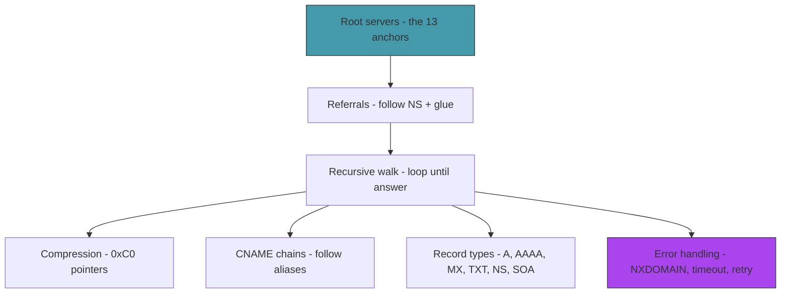

# Act 2 — The Hierarchy

> *You've been asking Google for directions. Now you'll navigate yourself. DNS is a hierarchy — 13 root servers at the top, then TLD servers (.com, .org, .uk), then authoritative servers that own the final answer. In this act you walk the hierarchy from root to answer, following referrals at each level.*

Act 1 built a stub resolver — it asks a recursive server (Google) to do the work. Act 2 builds a **recursive resolver** — it starts from the root and follows the chain itself. This is how DNS actually works, and understanding it changes how you think about the internet.


---

## Stage 9 — The Root of Everything

> *Difficulty: Easy — The 13 root servers that anchor the entire internet.*

*~45 min*

Right now we send every query to `8.8.8.8`. But where does Google get its answers? From the DNS hierarchy — and the hierarchy starts at the **root servers**. There are exactly 13 root server addresses, hardcoded into every recursive resolver on earth. They're the starting point for resolving any domain name.

> [!tip] What You'll Learn
> - The 13 root servers and why there are exactly 13
> - Root hints — the hardcoded bootstrap list
> - Querying a root server directly
> - What a root server actually returns (not the answer — a referral)

### Why 13?

A DNS response over UDP must fit in 512 bytes. The root server list (13 name/address pairs) is the largest set that fits in a single UDP response. This limit was set in 1983 and the number stuck. Each "root server" is actually a cluster of hundreds of machines distributed globally via anycast — `a.root-servers.net` alone has instances in over 100 locations.

### 9.1 — Root hints

Create `src/roots.rs`:

```rust
/// The 13 root server IPv4 addresses.
/// These are hardcoded into every recursive resolver.
/// Source: https://www.iana.org/domains/root/servers
pub const ROOT_SERVERS: [&str; 13] = [
    "198.41.0.4",      // a.root-servers.net (Verisign)
    "170.247.170.2",   // b.root-servers.net (USC-ISI)
    "192.33.4.12",     // c.root-servers.net (Cogent)
    "199.7.91.13",     // d.root-servers.net (University of Maryland)
    "192.203.230.10",  // e.root-servers.net (NASA)
    "192.5.5.241",     // f.root-servers.net (ISC)
    "192.112.36.4",    // g.root-servers.net (US DoD)
    "198.97.190.53",   // h.root-servers.net (US Army)
    "192.36.148.17",   // i.root-servers.net (Netnod, Sweden)
    "192.58.128.30",   // j.root-servers.net (Verisign)
    "193.0.14.129",    // k.root-servers.net (RIPE NCC)
    "199.7.83.42",     // l.root-servers.net (ICANN)
    "202.12.27.33",    // m.root-servers.net (WIDE, Japan)
];
```

These 13 addresses are the bootstrap. Every recursive resolver on earth has them hardcoded. They never change (or change extremely rarely — the last change was `b.root-servers.net` in 2023).

Remember to declare this module in `main.rs`:

```rust
mod protocol;
mod roots;  // ← add this
```

### 9.2 — Query a root server

Let's ask a root server about `google.com` and see what it says:

```rust
fn main() {
    let name = "google.com";
    let id = rand_id();
    let query = protocol::build_query(id, name, protocol::RecordType::A);

    // Ask a root server instead of Google
    let root = roots::ROOT_SERVERS[0]; // a.root-servers.net
    println!("Asking root server {} about '{}'...\n", root, name);

    let socket = UdpSocket::bind("0.0.0.0:0").expect("Failed to bind");
    socket.set_read_timeout(Some(std::time::Duration::from_secs(5))).unwrap();
    socket.send_to(&query, format!("{}:53", root)).expect("Failed to send");

    let mut buf = [0u8; 512];
    let (size, _) = socket.recv_from(&mut buf).expect("No response");

    let header = protocol::Header::from_bytes(&buf).expect("Bad header");
    let mut parser = protocol::PacketParser::new(&buf[..size]);
    parser.pos = 12;

    // Skip questions
    for _ in 0..header.question_count {
        parser.read_question().expect("Bad question");
    }

    println!("Answers: {}", header.answer_count);
    println!("Authority: {}", header.authority_count);
    println!("Additional: {}", header.additional_count);

    // Parse answer records (probably 0)
    for _ in 0..header.answer_count {
        let r = parser.read_record().expect("Bad record");
        println!("  ANSWER: {} -> {}", r.name, r.data_string());
    }

    // Parse authority records (the referral)
    println!("\nAuthority section (referrals):");
    for _ in 0..header.authority_count {
        let r = parser.read_record().expect("Bad record");
        println!("  {} IN NS (type {})", r.name, r.record_type);
    }

    // Parse additional records (glue — IP addresses of the NS servers)
    println!("\nAdditional section (glue records):");
    for _ in 0..header.additional_count {
        let r = parser.read_record().expect("Bad record");
        let type_name = match r.record_type { 1 => "A", 28 => "AAAA", _ => "?" };
        println!("  {} IN {} {}", r.name, type_name, r.data_string());
    }
}
```

### 9.3 — Run it

```bash
cargo run
```

```
Asking root server 198.41.0.4 about 'google.com'...

Answers: 0
Authority: 13
Additional: 14

Authority section (referrals):
  com IN NS (type 2)
  com IN NS (type 2)
  ...

Additional section (glue records):
  a.gtld-servers.net IN A 192.5.6.30
  b.gtld-servers.net IN A 192.33.14.30
  ...
```

The root server doesn't know `google.com`'s IP address. But it knows who *does* — the `.com` TLD servers. It returns:

1. **Authority section:** "Ask the `.com` servers" (NS records)
2. **Additional section:** "Here are their IP addresses" (glue A records)

This is a **referral** — "I don't have the answer, but try these servers." The additional records are called **glue** because they glue the NS names to IP addresses, avoiding a chicken-and-egg problem (you'd need DNS to resolve the NS server's name, but you're trying to do DNS).

> [!note] The hierarchy in action
> `google.com` requires three levels:
> 1. Root server → "ask the .com servers"
> 2. .com TLD server → "ask Google's name servers"
> 3. Google's name server → "here's the IP: 142.250.80.46"

### Extend it

Try querying a root server for `en.wikipedia.org`. How many referral hops would you expect? (Hint: root → `.org` TLD → Wikipedia's nameserver.) What about `docs.aws.amazon.com`?

> [!check] Checkpoint
> Query a root server for `google.com`. Verify you get 0 answers, authority NS records for `.com`, and glue A records in the additional section. Stage 9 complete.

---

## Stage 10 — Following Referrals

> *Difficulty: Medium — Extracting NS records and glue, then querying the next server.*

*~60 min*

The root server told us to ask the `.com` TLD servers. The `.com` server will tell us to ask Google's authoritative servers. Google's server will give us the final answer. This stage builds the logic to extract a referral (NS + glue records) and query the next server in the chain.

> [!tip] What You'll Learn
> - Extracting NS records from the authority section
> - Matching NS names to glue A records in the additional section
> - Sending a follow-up query to the referred server
> - Creating a new module with `mod` and structuring multi-file projects
> - The two-hop resolution: root → TLD → authoritative

### 10.1 — Extract referral info

We need a helper to parse a full response into structured sections. Create `src/resolver.rs`:

```rust
use crate::protocol::{self, Header, PacketParser, ResourceRecord, RecordType};
use crate::roots;
use std::net::UdpSocket;
```

> [!note] `crate::` vs `super::`
> `crate::protocol` means "the `protocol` module at the root of this crate." You could also write `super::protocol` (parent module's `protocol`), but `crate::` is clearer when you have multiple levels of nesting. Both work the same here.

```rust
/// A parsed DNS response with all sections.
pub struct DnsResponse {
    pub header: Header,
    pub answers: Vec<ResourceRecord>,
    pub authorities: Vec<ResourceRecord>,
    pub additionals: Vec<ResourceRecord>,
}

/// Send a query and parse the full response.
pub fn query_server(
    server: &str, name: &str, record_type: RecordType,
) -> Result<DnsResponse, String> {
    let id = rand_id();
    let query = protocol::build_query(id, name, record_type);

    let socket = UdpSocket::bind("0.0.0.0:0").map_err(|e| e.to_string())?;
    socket.set_read_timeout(Some(std::time::Duration::from_secs(5)))
        .map_err(|e| e.to_string())?;
    socket.send_to(&query, format!("{}:53", server)).map_err(|e| e.to_string())?;

    let mut buf = [0u8; 512];
    let (size, _) = socket.recv_from(&mut buf).map_err(|e| e.to_string())?;

    let header = Header::from_bytes(&buf)?;
    let mut parser = PacketParser::new(&buf[..size]);
    parser.pos = 12;

    for _ in 0..header.question_count {
        parser.read_question()?;
    }

    let mut answers = Vec::new();
    for _ in 0..header.answer_count {
        answers.push(parser.read_record()?);
    }

    let mut authorities = Vec::new();
    for _ in 0..header.authority_count {
        authorities.push(parser.read_record()?);
    }

    let mut additionals = Vec::new();
    for _ in 0..header.additional_count {
        additionals.push(parser.read_record()?);
    }

    Ok(DnsResponse { header, answers, authorities, additionals })
}
```

Notice how `?` propagates errors from every operation — socket binding, sending, receiving, parsing. If anything fails, the function returns early with the error. No nested error handling, no try/catch.

```rust
/// Extract the IP address of a referred nameserver from the additional section.
fn get_referral_ip(response: &DnsResponse) -> Option<String> {
    // Get NS names from authority section
    let ns_names: Vec<String> = response.authorities.iter()
        .filter(|r| r.record_type == RecordType::NS.to_u16())
        .map(|r| r.data_string())
        .collect();

    // Find a matching A record in the additional section
    for additional in &response.additionals {
        if additional.record_type == RecordType::A.to_u16() {
            if ns_names.iter().any(|ns| ns == &additional.name) {
                return Some(additional.data_string());
            }
        }
    }

    None
}

fn rand_id() -> u16 {
    let t = std::time::SystemTime::now()
        .duration_since(std::time::UNIX_EPOCH)
        .unwrap()
        .subsec_nanos();
    (t & 0xFFFF) as u16
}
```

Don't forget to declare the module in `main.rs`:

```rust
mod protocol;
mod roots;
mod resolver;  // ← add this
```

### 10.2 — Two-hop resolution

Let's manually follow the chain: root → TLD → authoritative.

```rust
/// Resolve a name by manually following two referrals.
pub fn resolve_manual(name: &str) -> Result<(), String> {
    // Step 1: Ask a root server
    let root = roots::ROOT_SERVERS[0];
    println!("1. Asking root server {}...", root);
    let resp1 = query_server(root, name, RecordType::A)?;

    if !resp1.answers.is_empty() {
        println!("   Root had the answer (unexpected!)");
        for a in &resp1.answers {
            println!("   {} -> {}", a.name, a.data_string());
        }
        return Ok(());
    }

    let tld_server = get_referral_ip(&resp1)
        .ok_or_else(|| "No referral from root".to_string())?;
    println!("   Referred to TLD server: {}", tld_server);

    // Step 2: Ask the TLD server
    println!("2. Asking TLD server {}...", tld_server);
    let resp2 = query_server(&tld_server, name, RecordType::A)?;

    if !resp2.answers.is_empty() {
        println!("   TLD had the answer:");
        for a in &resp2.answers {
            println!("   {} -> {}", a.name, a.data_string());
        }
        return Ok(());
    }

    let auth_server = get_referral_ip(&resp2)
        .ok_or_else(|| "No referral from TLD".to_string())?;
    println!("   Referred to authoritative server: {}", auth_server);

    // Step 3: Ask the authoritative server
    println!("3. Asking authoritative server {}...", auth_server);
    let resp3 = query_server(&auth_server, name, RecordType::A)?;

    println!("   Answer:");
    for a in &resp3.answers {
        let type_name = match a.record_type { 1 => "A", 28 => "AAAA", 5 => "CNAME", _ => "?" };
        println!("   {} {} IN {} (TTL {})", a.name, type_name, a.data_string(), a.ttl);
    }

    Ok(())
}
```

> [!note] `.ok_or_else()` — converting Option to Result
> `get_referral_ip` returns `Option<String>`. We need a `Result` so we can use `?`. `.ok_or_else(|| "error message".to_string())` converts `None` into `Err("error message")` and `Some(value)` into `Ok(value)`.

### 10.3 — Test it

```bash
cargo run -- google.com
```

```
1. Asking root server 198.41.0.4...
   Referred to TLD server: 192.5.6.30
2. Asking TLD server 192.5.6.30...
   Referred to authoritative server: 216.239.34.10
3. Asking authoritative server 216.239.34.10...
   Answer:
   google.com A IN 142.250.80.46 (TTL 300)
```

Three hops. Root → `.com` TLD → Google's nameserver → answer. You just traced the exact path that every DNS query takes, manually following each referral.

> [!warning] Assuming the referral always has glue records
> Sometimes the additional section is empty — the TLD server gives you NS names but no IP addresses. In that case, you'd need to resolve the NS name itself (a separate DNS query). We'll handle this in the recursive walker next stage.

### Extend it

Try resolving `rust-lang.org` manually. Does it follow the same root → TLD → authoritative pattern? How about `bbc.co.uk` — how many hops does it need? (Hint: `.co.uk` is a two-level TLD.)

> [!check] Checkpoint
> Resolve `google.com` by manually following referrals: root → TLD → authoritative. Verify you get the IP address after exactly 3 queries. Stage 10 complete.

---

## Stage 11 — The Recursive Walk

> *Difficulty: Hard — A general recursive resolver that handles any domain.*

*~75 min*

The manual two-hop approach assumes exactly two referrals. But some domains have deeper hierarchies (subdomains, delegations), and some referrals don't include glue records. This stage builds a general recursive resolver that loops until it gets an answer, following as many referrals as needed.

> [!tip] What You'll Learn
> - The recursive resolution algorithm
> - Handling referrals without glue (resolving NS names)
> - Loop detection (preventing infinite referral chains)
> - The difference between authoritative and non-authoritative answers

### The algorithm

```
resolve(name, type):
    server = pick a root server
    loop:
        response = query(server, name, type)
        if response has answers:
            return answers
        if response has authority NS records:
            server = get IP from glue, or resolve the NS name
            continue
        else:
            return error (no answer, no referral)
```

### Try it yourself — the recursive resolver

This is the core of the entire project. Before looking at the solution, try implementing it yourself. Here's the skeleton:

```rust
const MAX_REFERRALS: usize = 20;

/// Recursively resolve a domain name starting from the root servers.
pub fn resolve(
    name: &str, record_type: RecordType,
) -> Result<Vec<ResourceRecord>, String> {
    let mut server = roots::ROOT_SERVERS[0].to_string();

    for _depth in 0..MAX_REFERRALS {
        let response = query_server(&server, name, record_type)?;

        // TODO: if response has answers, return them
        // TODO: if response has a referral, follow it
        // TODO: if referral has no glue, resolve the NS name recursively
        // TODO: if none of the above, return an error

        todo!()
    }

    Err(format!("Too many referrals (>{}) for '{}'", MAX_REFERRALS, name))
}
```

Key decisions:
- What counts as "has answers"? Check `response.answers.is_empty()`.
- How do you get the next server? Use `get_referral_ip(&response)`.
- What if there's no glue? Extract the NS name and call `resolve()` recursively for its A record.

<details>
<summary>Solution</summary>

```rust
const MAX_REFERRALS: usize = 20;

/// Recursively resolve a domain name starting from the root servers.
pub fn resolve(
    name: &str, record_type: RecordType,
) -> Result<Vec<ResourceRecord>, String> {
    let mut server = roots::ROOT_SERVERS[0].to_string();
    let mut trace: Vec<String> = Vec::new();

    for depth in 0..MAX_REFERRALS {
        trace.push(format!("  [{}] Asking {} about '{}'", depth, server, name));

        let response = query_server(&server, name, record_type)?;

        // Got answers — we're done
        if !response.answers.is_empty() {
            for line in &trace {
                eprintln!("{}", line);
            }
            return Ok(response.answers);
        }

        // Got a referral with glue — follow it
        if let Some(next_server) = get_referral_ip(&response) {
            trace.push(format!("      → referred to {}", next_server));
            server = next_server;
            continue;
        }

        // Referral without glue — need to resolve the NS name
        let ns_names: Vec<String> = response.authorities.iter()
            .filter(|r| r.record_type == RecordType::NS.to_u16())
            .map(|r| r.data_string())
            .collect();

        if let Some(ns_name) = ns_names.first() {
            trace.push(format!("      → referred to {} (no glue, resolving...)", ns_name));
            let ns_records = resolve(ns_name, RecordType::A)?;
            if let Some(ns_a) = ns_records.first() {
                server = ns_a.data_string();
                continue;
            }
        }

        // No answers, no referrals — give up
        for line in &trace {
            eprintln!("{}", line);
        }
        return Err(format!("Resolution failed for '{}': no answer and no referral", name));
    }

    Err(format!("Too many referrals (>{}) for '{}'", MAX_REFERRALS, name))
}
```

</details>

The resolver is a loop, not recursion (despite the name "recursive resolver"). It queries a server, checks for answers, follows referrals, and repeats. The only actual recursion is when resolving NS names that lack glue records — a relatively rare case.

`MAX_REFERRALS` prevents infinite loops. In practice, most domains resolve in 2-4 hops.

### 11.2 — Update main

```rust
fn main() {
    let name = std::env::args().nth(1).unwrap_or_else(|| "google.com".to_string());

    println!(";; Resolving {} (type A) from root...\n", name);

    match resolver::resolve(&name, protocol::RecordType::A) {
        Ok(answers) => {
            println!();
            for record in &answers {
                let type_name = match record.record_type {
                    1 => "A", 28 => "AAAA", 5 => "CNAME", _ => "?",
                };
                println!("{}\t{}\tIN\t{}\t{}",
                    record.name, record.ttl, type_name, record.data_string());
            }
        }
        Err(e) => eprintln!("Resolution failed: {}", e),
    }
}
```

### 11.3 — Test it

```bash
cargo run -- google.com
```

```
;; Resolving google.com (type A) from root...

  [0] Asking 198.41.0.4 about 'google.com'
      → referred to 192.5.6.30
  [1] Asking 192.5.6.30 about 'google.com'
      → referred to 216.239.34.10
  [2] Asking 216.239.34.10 about 'google.com'

google.com	300	IN	A	142.250.80.46
```

Try deeper domains:

```bash
cargo run -- docs.github.com
cargo run -- en.wikipedia.org
cargo run -- mail.google.com
```

Some of these will return CNAME records (aliases) that need further resolution — we'll handle that in Stage 13.

> [!warning] Infinite recursion when resolving NS names
> If resolving `ns1.example.com` requires asking `example.com`'s nameserver, which is `ns1.example.com`... that's a loop. The `MAX_REFERRALS` limit catches this, but production resolvers have more sophisticated loop detection. If you see "Too many referrals," this is likely the cause.

### Extend it

Add a `--verbose` flag (check `std::env::args()` for `"--verbose"`) that prints the trace even on success. Without it, only print the final answer. This makes the output cleaner for normal use while keeping the trace available for debugging.

> [!check] Checkpoint
> Resolve `google.com` from root. Verify the trace shows 3 hops (root → TLD → authoritative). Try 3-4 different domains. Stage 11 complete.

---

## Stage 12 — Name Compression

> *Difficulty: Medium — The 0xC0 trick that saves bandwidth.*

*~55 min*

DNS packets repeat domain names constantly — the question, answer, authority, and additional sections often reference the same names. Sending `google.com` four times wastes bytes. DNS compression solves this: instead of repeating a name, a **pointer** says "the name at byte offset X." This stage updates our parser to handle compression pointers.

> [!tip] What You'll Learn
> - DNS name compression (RFC 1035, Section 4.1.4)
> - The `0xC0` prefix that signals a pointer
> - Pointer format: 2 bytes, top 2 bits = `11`, bottom 14 bits = offset
> - Updating `decode_name` to follow pointers

### How compression works

A normal label starts with a length byte (0-63). A compression pointer starts with the bits `11` in the top two positions — which means the first byte is `0xC0` or higher (192+). The remaining 14 bits are the byte offset into the packet where the name (or name suffix) can be found.

```
Normal label:  0x06 g o o g l e  (length 6, then 6 bytes)
Pointer:       0xC0 0x0C         (pointer to offset 12)
```

`0xC00C` = `1100_0000_0000_1100` → top 2 bits are `11` (pointer), offset = `0x000C` = 12. This means "read the name starting at byte 12 of the packet."

### Try it yourself — update decode_name

The current `decode_name` rejects any length byte > 63. You need to add compression pointer handling. Here's the logic:

1. Read the length byte
2. If `len & 0xC0 == 0xC0` → it's a pointer. Extract the 14-bit offset, jump to that position, continue reading labels
3. If `len == 0` → end of name
4. Otherwise → normal label (read `len` bytes)

The tricky part: when you follow a pointer, the *caller's cursor* should advance by exactly 2 bytes (the pointer itself), not by the length of the name at the target. Use a `jumped` flag to track this.

Try implementing it, then compare:

<details>
<summary>Solution</summary>

```rust
/// Decode a domain name from DNS wire format, handling compression pointers.
/// Returns the name and the number of bytes consumed from the current position.
pub fn decode_name(buf: &[u8], start: usize) -> Result<(String, usize), String> {
    let mut labels: Vec<String> = Vec::new();
    let mut pos = start;
    let mut jumped = false;
    let mut bytes_consumed = 0;

    loop {
        if pos >= buf.len() {
            return Err(format!("Name extends past end of buffer at offset {}", pos));
        }

        let len = buf[pos] as usize;

        // Check for compression pointer (top 2 bits set)
        if len & 0xC0 == 0xC0 {
            if pos + 1 >= buf.len() {
                return Err(format!("Compression pointer truncated at offset {}", pos));
            }
            if !jumped {
                bytes_consumed = pos - start + 2;
            }
            let offset = ((len & 0x3F) << 8) | buf[pos + 1] as usize;
            pos = offset;
            jumped = true;
            continue;
        }

        if len == 0 {
            if !jumped {
                bytes_consumed = pos - start + 1;
            }
            break;
        }

        if len > 63 {
            return Err(format!("Invalid label length {} at offset {}", len, pos));
        }

        pos += 1;
        if pos + len > buf.len() {
            return Err(format!("Label extends past buffer at offset {}", pos));
        }
        let label = std::str::from_utf8(&buf[pos..pos + len])
            .map_err(|e| format!("Invalid UTF-8 at offset {}: {}", pos, e))?;
        labels.push(label.to_string());
        pos += len;
    }

    if bytes_consumed == 0 {
        bytes_consumed = pos - start + 1;
    }

    Ok((labels.join("."), bytes_consumed))
}
```

</details>

| Code | Explanation |
|------|-------------|
| `len & 0xC0 == 0xC0` | Check if the top 2 bits are both set. `0xC0` = `1100_0000`. |
| `(len & 0x3F) << 8 \| buf[pos + 1]` | Extract the 14-bit offset. Mask off the top 2 bits, shift left 8, OR with the next byte. |
| `jumped` flag | Track whether we've followed a pointer. After a jump, the "bytes consumed" is fixed. |

### Tests

```rust
#[test]
fn test_decode_compressed_name() {
    // Simulate a packet where offset 0 has "google.com" uncompressed,
    // and offset 12 has a pointer back to offset 0
    let mut buf = encode_name("google.com"); // [6,g,o,o,g,l,e,3,c,o,m,0] = 12 bytes
    buf.push(0xC0); // pointer marker
    buf.push(0x00); // offset 0

    let (name, consumed) = decode_name(&buf, 12).unwrap();
    assert_eq!(name, "google.com");
    assert_eq!(consumed, 2); // pointer is 2 bytes
}

#[test]
fn test_decode_partial_compression() {
    // "mail" label followed by a pointer to "google.com" at offset 0
    let mut buf = encode_name("google.com"); // 12 bytes at offset 0
    let ptr_start = buf.len();
    buf.push(4); // "mail" length
    buf.extend_from_slice(b"mail");
    buf.push(0xC0); // pointer
    buf.push(0x00); // to offset 0

    let (name, _) = decode_name(&buf, ptr_start).unwrap();
    assert_eq!(name, "mail.google.com");
}
```

### 12.2 — Test it

Compression is used in almost every DNS response. After this fix, domains that previously failed should now work:

```bash
cargo run -- amazon.com
cargo run -- docs.github.com
cargo run -- www.rust-lang.org
```

> [!warning] Advancing the cursor past the pointer target
> When you follow a pointer, you jump to a different position in the buffer. But the *caller's* cursor should advance by exactly 2 bytes (the pointer itself), not by the length of the name at the target. If you get this wrong, the parser will be at the wrong position for the next field, and everything after will be garbage.

> [!warning] Infinite pointer loops
> A malicious packet could contain a pointer that points to itself. Our implementation doesn't check this — a malicious packet could cause an infinite loop. Production resolvers limit the number of pointer follows (typically 128). For learning purposes this is fine, but keep it in mind.

### Extend it

Add a pointer-follow counter to `decode_name` that returns an error after 128 jumps. This prevents infinite loops from malicious packets.

> [!check] Checkpoint
> Resolve domains that use compression (most do). Verify `amazon.com`, `docs.github.com`, and `www.rust-lang.org` resolve correctly. Run `cargo test`. Stage 12 complete.

---

## Stage 13 — CNAME Chains

> *Difficulty: Medium — Following aliases to the final answer.*

*~50 min*

When you query `www.github.com`, you might not get an A record directly. Instead, you get a CNAME record: `www.github.com` is an alias for `github.github.io`, which is an alias for something else, which eventually resolves to an IP address. This stage teaches the resolver to follow CNAME chains.

> [!tip] What You'll Learn
> - CNAME records — canonical name aliases
> - Why CNAMEs exist (load balancing, CDNs, service migration)
> - Following a chain of aliases to the final A record
> - The CNAME loop problem

### Why CNAMEs?

A CNAME says "this name is actually an alias for that name." It's used for:

- **CDNs:** `static.example.com` → `d1234.cloudfront.net` (point to a CDN without changing your DNS)
- **Load balancing:** `api.example.com` → `api.us-east-1.elb.amazonaws.com`
- **Service migration:** Change where a name points without updating every client

**Python comparison:** Think of a CNAME like a Python import alias: `import numpy as np`. The name `np` is an alias for `numpy`. Similarly, `www.github.com` is an alias for `github.github.io`.

### 13.1 — Update the resolver

The strategy: split resolution into two layers. The outer function follows CNAME chains. The inner function does the recursive walk for a single name.

```rust
pub fn resolve(
    name: &str, record_type: RecordType,
) -> Result<Vec<ResourceRecord>, String> {
    let mut current_name = name.to_string();
    let mut cname_depth = 0;
    const MAX_CNAMES: usize = 10;

    loop {
        if cname_depth >= MAX_CNAMES {
            return Err(format!("Too many CNAME redirects for '{}'", name));
        }

        let answers = resolve_name(&current_name, record_type)?;

        // Check if we got the record type we wanted
        let has_direct = answers.iter()
            .any(|r| r.record_type == record_type.to_u16());

        if has_direct {
            return Ok(answers);
        }

        // Check for CNAME
        let cname = answers.iter()
            .find(|r| r.record_type == RecordType::CNAME.to_u16());

        if let Some(cname_record) = cname {
            let target = cname_record.data_string();
            eprintln!("  CNAME: {} → {}", current_name, target);
            current_name = target;
            cname_depth += 1;
            continue;
        }

        // No answer and no CNAME — return what we have
        return Ok(answers);
    }
}

/// Inner resolver — resolves a single name without CNAME following.
fn resolve_name(
    name: &str, record_type: RecordType,
) -> Result<Vec<ResourceRecord>, String> {
    let mut server = roots::ROOT_SERVERS[0].to_string();

    for _depth in 0..MAX_REFERRALS {
        let response = query_server(&server, name, record_type)?;

        if !response.answers.is_empty() {
            return Ok(response.answers);
        }

        if let Some(next_server) = get_referral_ip(&response) {
            server = next_server;
            continue;
        }

        // Try resolving NS without glue
        let ns_names: Vec<String> = response.authorities.iter()
            .filter(|r| r.record_type == RecordType::NS.to_u16())
            .map(|r| r.data_string())
            .collect();

        if let Some(ns_name) = ns_names.first() {
            let ns_records = resolve_name(ns_name, RecordType::A)?;
            if let Some(ns_a) = ns_records.first() {
                server = ns_a.data_string();
                continue;
            }
        }

        return Ok(Vec::new());
    }

    Ok(Vec::new())
}
```

### Concept: Ownership and String — why `.to_string()`?

Notice `let mut current_name = name.to_string();`. The parameter `name` is `&str` (borrowed), but we need to reassign `current_name` in the loop when following CNAMEs. You can't reassign a borrowed reference to point to new data that's created inside the loop — the new data would be dropped at the end of the iteration.

If you tried `let mut current_name: &str = name;` and then `current_name = &cname_record.data_string();`, you'd get:

```
error[E0716]: temporary value dropped while borrowed
  --> src/resolver.rs:25:30
   |
25 |         current_name = &cname_record.data_string();
   |                         ^^^^^^^^^^^^^^^^^^^^^^^^^^^ - temporary value is freed at the end of this statement
   |                         |
   |                         creates a temporary which is freed while still in use
```

The fix: own the string with `.to_string()`. Now `current_name` is a `String` that we can freely reassign. The old value is dropped automatically when we assign a new one.

**The mental model:** Borrowing (`&str`) is like reading a book at the library — you can't take it home, and the library might close. Owning (`String`) is like buying your own copy — you can keep it as long as you want.

### 13.2 — Test it

```bash
cargo run -- www.github.com
```

```
  CNAME: www.github.com → github.github.io
  CNAME: github.github.io → github.map.fastly.net

github.map.fastly.net	30	IN	A	185.199.108.153
```

Three names, two CNAME hops, one final A record.

### Extend it

Try resolving `www.amazon.com`. How many CNAME hops does it take? Amazon uses extensive CDN aliasing. Also try `www.bbc.co.uk` — does it use CNAMEs?

> [!check] Checkpoint
> Resolve `www.github.com` and verify it follows CNAME chains to a final A record. Run `cargo test`. Stage 13 complete.

---

## Stage 14 — Record Types

> *Difficulty: Medium — Parsing AAAA, MX, TXT, SOA, and NS record data.*

*~60 min*

So far we've focused on A records (IPv4 addresses). But DNS serves many types of data. This stage extends the parser to handle the most common record types, each with its own RDATA format.

> [!tip] What You'll Learn
> - AAAA records — 16-byte IPv6 addresses
> - MX records — mail exchange with priority
> - TXT records — arbitrary text data
> - SOA records — zone authority information
> - How each record type encodes its data differently

### The challenge: RDATA contains compressed names

CNAME, NS, MX, and SOA records contain domain names in their RDATA — and those names can use compression pointers that reference the *original packet buffer*, not just the RDATA bytes. This means `data_string()` needs access to the full packet.

We need to track where in the packet the RDATA starts. Add a `data_offset` field to `ResourceRecord`:

```rust
#[derive(Debug, Clone)]
pub struct ResourceRecord {
    pub name: String,
    pub record_type: u16,
    pub class: u16,
    pub ttl: u32,
    pub data: Vec<u8>,
    pub data_offset: usize, // offset of RDATA in the original packet
}
```

Update `read_record` to capture the offset:

```rust
pub fn read_record(&mut self) -> Result<ResourceRecord, String> {
    let name = self.read_name()?;
    let record_type = self.read_u16()?;
    let class = self.read_u16()?;
    let ttl = self.read_u32()?;
    let rdlength = self.read_u16()? as usize;
    let data_offset = self.pos; // capture before reading
    let data = self.read_bytes(rdlength)?.to_vec();

    Ok(ResourceRecord { name, record_type, class, ttl, data, data_offset })
}
```

### Try it yourself — extend data_string

Update `data_string` to accept the packet buffer and handle NS, CNAME, MX, TXT, and SOA records. Here are the formats:

| Type | RDATA format |
|------|-------------|
| NS (2) | Compressed domain name |
| CNAME (5) | Compressed domain name |
| MX (15) | 2-byte priority + compressed domain name |
| TXT (16) | One or more length-prefixed strings |
| SOA (6) | Primary NS name + admin email + 5 × u32 |

The key insight: for compressed names, call `decode_name(packet, self.data_offset)` — not `decode_name(&self.data, 0)` — because compression pointers reference the full packet.

<details>
<summary>Solution</summary>

```rust
impl ResourceRecord {
    /// Format the RDATA based on record type.
    /// `packet` is the full DNS response buffer (needed for compression pointers).
    pub fn data_string(&self, packet: &[u8]) -> String {
        match self.record_type {
            1 if self.data.len() == 4 => {
                format!("{}.{}.{}.{}",
                    self.data[0], self.data[1], self.data[2], self.data[3])
            }
            28 if self.data.len() == 16 => {
                let segments: Vec<String> = (0..8)
                    .map(|i| {
                        let val = u16::from_be_bytes([
                            self.data[i * 2], self.data[i * 2 + 1]
                        ]);
                        format!("{:x}", val)
                    })
                    .collect();
                segments.join(":")
            }
            2 | 5 => {
                // NS or CNAME — compressed domain name
                decode_name(packet, self.data_offset)
                    .map(|(name, _)| name)
                    .unwrap_or_else(|e| format!("(decode error: {})", e))
            }
            15 if self.data.len() >= 2 => {
                // MX — 2-byte priority + compressed domain name
                let priority = u16::from_be_bytes([self.data[0], self.data[1]]);
                let name = decode_name(packet, self.data_offset + 2)
                    .map(|(n, _)| n)
                    .unwrap_or_else(|e| format!("(decode error: {})", e));
                format!("{} {}", priority, name)
            }
            16 => {
                // TXT — one or more length-prefixed strings
                let mut texts = Vec::new();
                let mut pos = 0;
                while pos < self.data.len() {
                    let len = self.data[pos] as usize;
                    pos += 1;
                    if pos + len <= self.data.len() {
                        texts.push(
                            String::from_utf8_lossy(&self.data[pos..pos + len]).to_string()
                        );
                    }
                    pos += len;
                }
                format!("\"{}\"", texts.join(""))
            }
            6 => {
                // SOA — primary NS + admin email + serial + ...
                let (primary, consumed) = decode_name(packet, self.data_offset)
                    .unwrap_or(("?".to_string(), 0));
                let (admin, _) = decode_name(packet, self.data_offset + consumed)
                    .unwrap_or(("?".to_string(), 0));
                format!("{} {}", primary, admin)
            }
            _ => format!("({} bytes)", self.data.len()),
        }
    }
}
```

</details>

### 14.2 — Add a --type flag

Update `main.rs` to accept a record type argument:

```rust
fn main() {
    let args: Vec<String> = std::env::args().collect();
    let name = args.get(1).map(|s| s.as_str()).unwrap_or("google.com");
    let type_str = args.get(2).map(|s| s.as_str()).unwrap_or("A");

    let record_type = match type_str.to_uppercase().as_str() {
        "A" => protocol::RecordType::A,
        "AAAA" => protocol::RecordType::AAAA,
        "MX" => protocol::RecordType::MX,
        "TXT" => protocol::RecordType::TXT,
        "NS" => protocol::RecordType::NS,
        "CNAME" => protocol::RecordType::CNAME,
        _ => {
            eprintln!("Unknown record type: {}", type_str);
            return;
        }
    };

    // ... resolve and print
}
```

### 14.3 — Test different record types

```bash
cargo run -- google.com AAAA    # IPv6 address
cargo run -- google.com MX      # Mail servers
cargo run -- google.com TXT     # SPF, DKIM, etc.
cargo run -- google.com NS      # Name servers
```

### Tests

```rust
#[test]
fn test_record_type_round_trip() {
    for rt in [RecordType::A, RecordType::AAAA, RecordType::MX, RecordType::NS] {
        let value = rt.to_u16();
        assert_eq!(RecordType::from_u16(value), Some(rt));
    }
}
```

### Extend it

Query `google.com` for SOA records. The SOA record contains the primary nameserver, the admin email (encoded as a domain name — `admin.google.com` means `admin@google.com`), and a serial number. Can you extract and display all three?

> [!check] Checkpoint
> Query for MX, TXT, and AAAA records. Verify each type's data is parsed and displayed correctly. Run `cargo test`. Stage 14 complete.

---

## Stage 15 — Error Handling

> *Difficulty: Medium — NXDOMAIN, SERVFAIL, timeouts, and retries.*

*~50 min*

Not every query succeeds. Domains don't exist (NXDOMAIN), servers fail (SERVFAIL), packets get lost (timeout), and responses get truncated (TC flag). This stage makes the resolver robust by handling every common failure mode.

> [!tip] What You'll Learn
> - DNS response codes (RCODE) and what they mean
> - Timeout and retry logic
> - The TC (truncated) flag — when UDP isn't enough
> - Custom error types with Rust enums
> - Implementing `Display` for error types

### 15.1 — A proper error type

Up to now we've used `String` for errors. That works but it's imprecise — you can't match on "was this NXDOMAIN or a timeout?" without parsing the string. Rust enums are perfect for this:

```rust
/// DNS resolution error.
#[derive(Debug)]
pub enum ResolveError {
    NxDomain(String),
    ServerFail(String),
    Timeout(String),
    Truncated,
    Network(std::io::Error),
    TooManyReferrals,
    TooManyCnames,
}

impl std::fmt::Display for ResolveError {
    fn fmt(&self, f: &mut std::fmt::Formatter) -> std::fmt::Result {
        match self {
            ResolveError::NxDomain(name) => write!(f, "NXDOMAIN: '{}' does not exist", name),
            ResolveError::ServerFail(name) => write!(f, "SERVFAIL: server error for '{}'", name),
            ResolveError::Timeout(server) => write!(f, "Timeout: no response from {}", server),
            ResolveError::Truncated => write!(f, "Response truncated (need TCP)"),
            ResolveError::Network(e) => write!(f, "Network error: {}", e),
            ResolveError::TooManyReferrals => write!(f, "Too many referrals"),
            ResolveError::TooManyCnames => write!(f, "Too many CNAME redirects"),
        }
    }
}
```

**Python comparison:** This is like defining exception subclasses:
```python
class NxDomain(DnsError): ...
class ServerFail(DnsError): ...
class Timeout(DnsError): ...
```
But Rust enums are a single type with variants — you match on them with `match`, and the compiler ensures you handle every variant.

### 15.2 — Response codes

| RCODE | Name | Meaning |
|-------|------|---------|
| 0 | NOERROR | Success (even if 0 answers — e.g., referral) |
| 1 | FORMERR | Query was malformed |
| 2 | SERVFAIL | Server failed to process |
| 3 | NXDOMAIN | Domain does not exist |
| 4 | NOTIMP | Query type not supported |
| 5 | REFUSED | Server refuses to answer (policy) |

### Try it yourself — add error handling to query_server

Update `query_server` to:
1. Return `Result<DnsResponse, ResolveError>` instead of `Result<DnsResponse, String>`
2. Check the response code and return the appropriate error variant
3. Retry up to 2 times on timeout
4. Check for the TC (truncated) flag

<details>
<summary>Solution</summary>

```rust
pub fn query_server(
    server: &str, name: &str, record_type: RecordType,
) -> Result<DnsResponse, ResolveError> {
    let id = rand_id();
    let query = protocol::build_query(id, name, record_type);

    let socket = UdpSocket::bind("0.0.0.0:0").map_err(ResolveError::Network)?;
    socket.set_read_timeout(Some(std::time::Duration::from_secs(3)))
        .map_err(ResolveError::Network)?;

    for attempt in 0..3 {
        socket.send_to(&query, format!("{}:53", server))
            .map_err(ResolveError::Network)?;

        let mut buf = [0u8; 512];
        match socket.recv_from(&mut buf) {
            Ok((size, _)) => {
                let header = Header::from_bytes(&buf)
                    .map_err(|e| ResolveError::ServerFail(e))?;

                if header.truncated {
                    return Err(ResolveError::Truncated);
                }

                match header.rcode {
                    0 => {} // NOERROR
                    3 => return Err(ResolveError::NxDomain(name.to_string())),
                    2 => return Err(ResolveError::ServerFail(name.to_string())),
                    _ => return Err(ResolveError::ServerFail(
                        format!("{} (rcode {})", name, header.rcode)
                    )),
                }

                let mut parser = PacketParser::new(&buf[..size]);
                parser.pos = 12;

                for _ in 0..header.question_count {
                    parser.read_question()
                        .map_err(|e| ResolveError::ServerFail(e))?;
                }

                let mut answers = Vec::new();
                for _ in 0..header.answer_count {
                    answers.push(parser.read_record()
                        .map_err(|e| ResolveError::ServerFail(e))?);
                }
                let mut authorities = Vec::new();
                for _ in 0..header.authority_count {
                    authorities.push(parser.read_record()
                        .map_err(|e| ResolveError::ServerFail(e))?);
                }
                let mut additionals = Vec::new();
                for _ in 0..header.additional_count {
                    additionals.push(parser.read_record()
                        .map_err(|e| ResolveError::ServerFail(e))?);
                }

                return Ok(DnsResponse { header, answers, authorities, additionals });
            }
            Err(e) if e.kind() == std::io::ErrorKind::WouldBlock
                   || e.kind() == std::io::ErrorKind::TimedOut => {
                if attempt < 2 {
                    eprintln!("  Timeout from {}, retrying ({}/3)...", server, attempt + 2);
                    continue;
                }
                return Err(ResolveError::Timeout(server.to_string()));
            }
            Err(e) => return Err(ResolveError::Network(e)),
        }
    }

    Err(ResolveError::Timeout(server.to_string()))
}
```

</details>

Update `resolve` and `resolve_name` to return `Result<Vec<ResourceRecord>, ResolveError>` as well. The `?` operator will propagate `ResolveError` automatically.

### 15.3 — Test error cases

```bash
cargo run -- thisdoesnotexist12345.com
# NXDOMAIN: 'thisdoesnotexist12345.com' does not exist
```

### Tests

```rust
#[test]
fn test_resolve_error_display() {
    let err = ResolveError::NxDomain("example.invalid".to_string());
    assert_eq!(format!("{}", err), "NXDOMAIN: 'example.invalid' does not exist");

    let err = ResolveError::Timeout("192.0.2.1".to_string());
    assert_eq!(format!("{}", err), "Timeout: no response from 192.0.2.1");
}
```

> [!warning] Matching on `io::ErrorKind` for timeouts
> Different platforms report timeouts differently. Linux uses `WouldBlock`, macOS sometimes uses `TimedOut`. Check both:
> ```rust
> Err(e) if e.kind() == ErrorKind::WouldBlock
>        || e.kind() == ErrorKind::TimedOut => { ... }
> ```
> If you only check one, timeouts will be reported as network errors on some platforms.

### Extend it

Add a `--server` flag that lets the user specify a custom DNS server instead of starting from root. For example, `cargo run -- google.com A --server 1.1.1.1` should query Cloudflare's DNS directly (like our Act 1 stub resolver). This is useful for comparing your recursive resolution against a known-good server.

> [!check] Checkpoint
> Query a non-existent domain and verify you get NXDOMAIN. Verify timeouts are retried and reported gracefully. Run `cargo test`. Stage 15 complete.

---

## Act 2 Complete — The Hierarchy



You built a recursive DNS resolver that starts from the root servers and walks the hierarchy to find any domain's IP address. No middleman, no Google — just your code talking directly to the internet's naming infrastructure.

| Concept | Where You Used It |
|---------|-------------------|
| Root hints | Hardcoded bootstrap addresses |
| Referral following | NS + glue record extraction |
| Name compression | `0xC0` pointer decoding |
| CNAME resolution | Alias chain following |
| Binary parsing | Every record type's RDATA format |
| Custom error types | `ResolveError` enum with `Display` |
| Result propagation | `?` operator throughout resolver |
| Ownership vs borrowing | `String` vs `&str` in CNAME following |
| Module organization | `protocol`, `roots`, `resolver` modules |

**Next up — Act 3: The Cache.** Every query currently starts from the root. That's slow and wasteful. Caching stores answers so repeated lookups are instant — but introduces TTLs, negative caching, and the security concern of cache poisoning.
