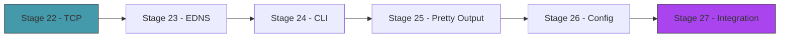

# Act 4 — The Complete Map

> *The Cartógrafo resolves, caches, and serves. This final act adds the finishing touches: TCP for large responses, EDNS for modern DNS features, a polished CLI, and the satisfaction of seeing your resolver handle anything the internet throws at it.*



---

## Stage 22 — TCP Fallback

> *Difficulty: Medium — When UDP isn't enough.*

DNS over UDP is limited to 512 bytes (without EDNS). Some responses — especially TXT records with SPF policies or DNSSEC signatures — exceed this limit. When a response is truncated (the TC flag is set), the resolver must retry over TCP. TCP DNS uses a simple framing: a 2-byte length prefix before each message.

> [!tip] What You'll Learn
> - The TC (truncated) flag and when it's set
> - TCP DNS framing — 2-byte length prefix
> - `TcpStream` for connection-oriented queries
> - Why DNS uses UDP by default and TCP as fallback

### 22.1 — TCP query function

Add to `src/resolver.rs`:

```rust
use std::io::{Read, Write};
use std::net::TcpStream;

/// Send a DNS query over TCP and return the response.
/// TCP DNS prepends a 2-byte big-endian length before each message.
fn query_tcp(server: &str, query: &[u8]) -> std::io::Result<Vec<u8>> {
    let mut stream = TcpStream::connect(format!("{}:53", server))?;
    stream.set_read_timeout(Some(std::time::Duration::from_secs(5)))?;

    // Send: 2-byte length + query
    let len = (query.len() as u16).to_be_bytes();
    stream.write_all(&len)?;
    stream.write_all(query)?;

    // Receive: 2-byte length + response
    let mut len_buf = [0u8; 2];
    stream.read_exact(&mut len_buf)?;
    let response_len = u16::from_be_bytes(len_buf) as usize;

    let mut response = vec![0u8; response_len];
    stream.read_exact(&mut response)?;

    Ok(response)
}
```

The framing is simple: every TCP DNS message is preceded by a 2-byte big-endian integer indicating the message length. This is necessary because TCP is a stream protocol — unlike UDP, there are no packet boundaries, so the receiver needs to know how many bytes to read.

### 22.2 — Retry on truncation

Update `query_server` to fall back to TCP when the response is truncated:

```rust
// After receiving a UDP response:
if header.truncated {
    eprintln!("  Response truncated, retrying over TCP...");
    let tcp_response = query_tcp(server, &query)?;
    // Parse tcp_response instead
    // ...
}
```

### 22.3 — Test it

```bash
# TXT records are often large enough to trigger truncation
cargo run -- google.com --type TXT
```

If the response is truncated over UDP, you'll see the TCP fallback message and the full response.

> [!check] Checkpoint
> Query a domain with large TXT records. If truncated, verify TCP fallback retrieves the full response. Stage 22 complete.

---

## Stage 23 — EDNS(0)

> *Difficulty: Medium — Extended DNS for larger packets and modern features.*

EDNS (Extension Mechanisms for DNS) lifts the 512-byte UDP limit. By adding an OPT pseudo-record to the additional section, the client tells the server "I can handle responses up to 4096 bytes over UDP." This reduces TCP fallbacks dramatically.

> [!tip] What You'll Learn
> - The OPT pseudo-record format
> - Advertising a larger UDP buffer size
> - The DO (DNSSEC OK) flag
> - Why EDNS is essential for modern DNS

### 23.1 — Add an OPT record to queries

```rust
/// Append an EDNS(0) OPT record to a query packet.
/// Advertises a 4096-byte UDP buffer size.
pub fn append_edns(packet: &mut Vec<u8>) {
    // OPT record:
    // NAME: 0x00 (root, empty name)
    // TYPE: 41 (OPT)
    // CLASS: 4096 (UDP payload size we can handle)
    // TTL: 0 (extended RCODE + flags, we set all to 0)
    // RDLENGTH: 0 (no options)
    packet.push(0x00);                                    // name (root)
    packet.extend_from_slice(&41u16.to_be_bytes());       // type OPT
    packet.extend_from_slice(&4096u16.to_be_bytes());     // UDP payload size
    packet.extend_from_slice(&0u32.to_be_bytes());        // extended RCODE + flags
    packet.extend_from_slice(&0u16.to_be_bytes());        // RDLENGTH
}
```

Update `build_query` to include EDNS and increment the additional count:

```rust
pub fn build_query(id: u16, name: &str, record_type: RecordType) -> Vec<u8> {
    let mut header = Header::new_query(id);
    header.additional_count = 1; // EDNS OPT record
    let mut packet = header.to_bytes();

    packet.extend_from_slice(&encode_name(name));
    packet.extend_from_slice(&record_type.to_u16().to_be_bytes());
    packet.extend_from_slice(&1u16.to_be_bytes());

    append_edns(&mut packet);
    packet
}
```

### 23.2 — Increase the receive buffer

```rust
// Change from 512 to 4096
let mut buf = [0u8; 4096];
```

With EDNS, servers can send responses up to 4096 bytes over UDP, dramatically reducing the need for TCP fallback.

> [!check] Checkpoint
> Add EDNS to queries. Verify the query packet includes an OPT record. Verify large responses no longer trigger TCP fallback. Stage 23 complete.

---

## Stage 24 — The CLI

> *Difficulty: Easy — A polished command-line interface with clap.*

Time to replace our ad-hoc argument parsing with a proper CLI. The Cartógrafo should have two modes: `resolve` (one-shot query) and `server` (run as a local DNS server).

> [!tip] What You'll Learn
> - `clap` subcommands and arguments
> - Structuring a multi-mode CLI
> - Default values and optional flags

### 24.1 — The CLI struct

```rust
use clap::{Parser, Subcommand};

#[derive(Parser)]
#[command(name = "cartografo", about = "A cartographer's DNS resolver")]
struct Cli {
    #[command(subcommand)]
    command: Commands,
}

#[derive(Subcommand)]
enum Commands {
    /// Resolve a domain name
    Resolve {
        /// Domain name to resolve
        name: String,
        /// Record type (A, AAAA, MX, TXT, NS, CNAME)
        #[arg(short = 't', long = "type", default_value = "A")]
        record_type: String,
        /// Show the resolution trace
        #[arg(long)]
        trace: bool,
    },
    /// Run as a local DNS server
    Server {
        /// Address to bind to
        #[arg(short, long, default_value = "127.0.0.1:5353")]
        bind: String,
    },
    /// Show cache statistics
    Cache,
}
```

> [!check] Checkpoint
> Implement the CLI with `clap`. Verify `cartografo resolve google.com`, `cartografo resolve google.com -t MX`, and `cartografo server` all work. Stage 24 complete.

---

## Stage 25 — Pretty Output

> *Difficulty: Easy — Colored output and query tracing.*

Raw output is functional but hard to scan. This stage adds color, formatting, and an optional `--trace` flag that shows every step of the recursive walk — like `dig +trace` but from your own resolver.

> [!tip] What You'll Learn
> - The `colored` crate for terminal colors
> - Formatting DNS output in the standard `dig`-like format
> - Trace mode — showing every hop in the resolution

### 25.1 — Colored output

```rust
use colored::Colorize;

// Answer section
for record in &answers {
    let type_str = match record.record_type {
        1 => "A".green(),
        28 => "AAAA".cyan(),
        5 => "CNAME".yellow(),
        15 => "MX".magenta(),
        16 => "TXT".blue(),
        2 => "NS".white(),
        _ => "?".dimmed(),
    };
    println!("{}\t{}\tIN\t{}\t{}", record.name, record.ttl, type_str, record.data_string());
}

// Timing
println!("\n;; Query time: {}", format!("{:.1}ms", elapsed.as_secs_f64() * 1000.0).dimmed());
println!(";; Server: {}", "from root".dimmed());
```

### 25.2 — Trace mode

When `--trace` is passed, print each step of the recursive walk:

```
;; Resolving google.com (A) from root...

→ 198.41.0.4 (a.root-servers.net)
  ← REFERRAL: com. → 192.5.6.30 (a.gtld-servers.net)
→ 192.5.6.30 (a.gtld-servers.net)
  ← REFERRAL: google.com. → 216.239.34.10 (ns2.google.com)
→ 216.239.34.10 (ns2.google.com)
  ← ANSWER: google.com. A 142.250.80.46

google.com	300	IN	A	142.250.80.46

;; Query time: 47.3ms
;; Hops: 3
```

> [!check] Checkpoint
> Run with `--trace` and verify each hop is displayed. Verify colors work in the terminal. Stage 25 complete.

---

## Stage 26 — Configuration

> *Difficulty: Medium — Config file for customizing resolver behavior.*

A config file lets users customize the bind address, cache size, upstream fallback servers, and logging level without recompiling.

> [!tip] What You'll Learn
> - Reading a TOML config file
> - Default values with `serde`
> - Separating configuration from code

### 26.1 — Config file

`cartografo.toml`:

```toml
[server]
bind = "127.0.0.1:5353"

[cache]
max_entries = 10000
negative_ttl = 300

[resolver]
# Fallback upstream (used if root resolution fails)
upstream = "8.8.8.8"
timeout_ms = 3000
max_retries = 2

[logging]
trace = false
```

Parse with `serde` and `toml` (add `toml = "0.8"` to dependencies).

> [!check] Checkpoint
> Create a config file. Verify the server reads it and applies the settings. Stage 26 complete.

---

## Stage 27 — The Complete Cartógrafo

> *Difficulty: Medium — Integration testing and the full workflow.*

The final stage. Run the Cartógrafo through a comprehensive test: resolve 20+ domains of varying complexity, verify against `dig`, measure performance, and confirm everything works together.

> [!tip] What You'll Learn
> - End-to-end integration testing
> - Comparing your resolver against `dig`
> - Performance benchmarking
> - What you've actually built

### 27.1 — The test suite

```bash
#!/bin/bash
# test_resolver.sh — compare cartografo against dig

DOMAINS=(
    "google.com"
    "amazon.com"
    "github.com"
    "rust-lang.org"
    "en.wikipedia.org"
    "www.github.com"          # CNAME chain
    "mail.google.com"         # CNAME
    "docs.aws.amazon.com"     # deep CNAME
    "thisdoesnotexist12345.com"  # NXDOMAIN
)

echo "=== Cartógrafo vs dig ==="
for domain in "${DOMAINS[@]}"; do
    our_result=$(cargo run -q -- resolve "$domain" 2>/dev/null | head -1)
    dig_result=$(dig +short "$domain" | head -1)
    match="✓"
    if [ "$our_result" != "$dig_result" ]; then match="✗"; fi
    printf "%-30s %s  (ours: %s | dig: %s)\n" "$domain" "$match" "$our_result" "$dig_result"
done
```

### 27.2 — What you built

| Component | What it does |
|-----------|-------------|
| Packet builder | Constructs DNS queries byte by byte |
| Packet parser | Reads DNS responses with compression support |
| Recursive resolver | Walks from root servers to authoritative answer |
| CNAME follower | Resolves alias chains |
| Cache | TTL-based with negative caching |
| Security | Random IDs, bailiwick checking |
| TCP fallback | Handles truncated responses |
| EDNS | 4096-byte UDP support |
| Server mode | Accepts queries from `dig` and other programs |
| CLI | Polished interface with trace mode |

### 27.3 — What you understand now

- **Bytes are just numbers.** `u16::from_be_bytes([0x01, 0x00])` is 256. That's all endianness is.
- **Binary protocols are structured data.** A DNS packet is a struct serialized to bytes with known offsets. No different from JSON — just more compact.
- **The internet has a hierarchy.** 13 root servers → TLD servers → authoritative servers. Every domain name resolution follows this path.
- **Caching is essential.** Without it, every query would start from the root. With it, most queries are instant.
- **Security is an afterthought bolted on.** DNS was designed in 1983 with no security. Transaction ID randomization and bailiwick checking are patches. DNSSEC is the real fix.

The map is complete. You are the cartographer now.

> [!check] Checkpoint
> Run the test suite. Verify your resolver matches `dig` for all test domains. Stage 27 complete.

---

## Course Complete — The Cartógrafo

You built a recursive DNS resolver from scratch. You placed every byte in every query. You parsed every byte in every response. You walked the DNS hierarchy from root to answer. You cached results, handled errors, defended against poisoning, and served queries to other programs.

Binary protocols are no longer mysterious. Bytes are no longer scary. The next time someone says "it's a 32-bit big-endian unsigned integer at offset 6," you'll know exactly what to do.

| Rust Concept | Where You Used It |
|-------------|-------------------|
| Byte manipulation | Every stage — `to_be_bytes`, `from_be_bytes`, bitwise ops |
| Structs with methods | `Header`, `ResourceRecord`, `PacketParser`, `DnsCache` |
| Enums | `RecordType`, `ResolveError`, `CacheValue` |
| Lifetimes | `PacketParser<'a>` borrowing the packet buffer |
| `HashMap` | DNS cache with TTL expiry |
| `Arc<Mutex<>>` | Shared cache in async server |
| `tokio` async | Concurrent query handling, async UDP/TCP |
| Error handling | Custom error types, retries, timeouts |
| Binary parsing | DNS wire format, name compression, record types |
| Network programming | UDP sockets, TCP streams, server loops |
