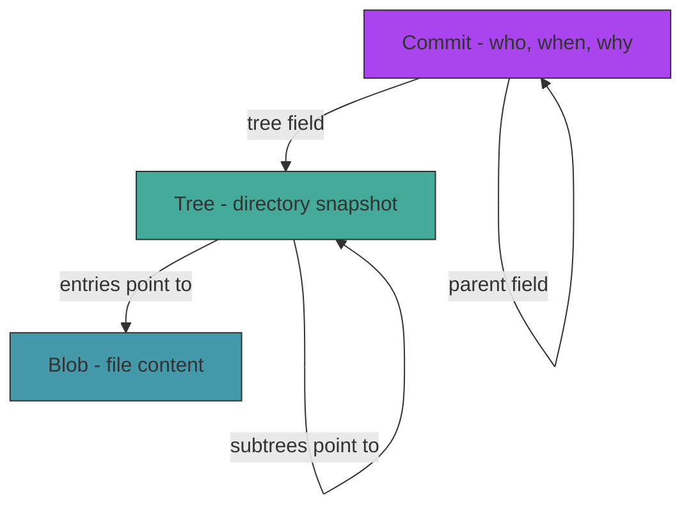

# Act 1 — The Crystals

> *Before a chronomancer can manipulate time, they must learn to capture it. A moment is nothing if it can't be stored, retrieved, and compared. In this act you build the foundation of the Chronolock — the object store that holds every version of every file as a content-addressed crystal.*

By the end of Act 1, you'll have a working object database that can store files (blobs), directory snapshots (trees), and commits — the three primitives that make git work. Everything in Acts 2–5 builds on this foundation.


**Prerequisites:** Rust installed (`rustup`), a terminal, a text editor. No Rust experience needed — Python or TypeScript experience is enough.

**Project location:** `~/juk/chronolock/`

---

## Stage 1 — Forging the Chronolock

> *Difficulty: Very Easy — Your first Rust program and the directory that holds time.*

Every tool must be forged before it can be used. Before we can store a single byte of history, we need a project that compiles and a directory structure to hold the Chronolock's data. This stage solves the bootstrapping problem — getting from nothing to a working anvil.

> [!tip] What You'll Learn
> - `cargo new` — creating a Rust project
> - The anatomy of `Cargo.toml` and `src/main.rs`
> - `std::fs` — creating directories from Rust
> - The `.chronolock/` directory layout (mirrors `.git/`)

### 1.1 — Create the project

```bash
cd ~/juk
cargo new chronolock --edition 2024
cd chronolock
```

Cargo creates this:

```
chronolock/
├── Cargo.toml    ← project metadata + dependencies (like package.json)
└── src/
    └── main.rs   ← entry point
```

**Python comparison:** `Cargo.toml` is `pyproject.toml`. `cargo run` is `python main.py` except it compiles first — typos are caught before the program runs.

**TypeScript comparison:** `Cargo.toml` ≈ `package.json`. `cargo run` ≈ `npx ts-node main.ts`, but stricter.

### 1.2 — The Chronolock directory structure

Real git stores everything in `.git/`. We'll use `.chronolock/` with the same internal layout — this means real git commands can read our data later.

The structure we need:

```
.chronolock/
├── objects/       ← every blob, tree, and commit lives here
├── refs/
│   └── heads/     ← branch pointers (one file per branch)
└── HEAD           ← points to the current branch or commit
```

That's it. The entire version control system lives in this directory. No database, no server — just files and folders.

### 1.3 — The init command

Replace `src/main.rs`:

```rust
use std::fs;
use std::path::Path;

fn main() {
    let args: Vec<String> = std::env::args().collect();

    if args.len() < 2 {
        eprintln!("Usage: chronolock <command>");
        std::process::exit(1);
    }

    match args[1].as_str() {
        "init" => init(),
        _ => {
            eprintln!("Unknown command: {}", args[1]);
            std::process::exit(1);
        }
    }
}

fn init() {
    let root = Path::new(".chronolock");

    if root.exists() {
        println!("Chronolock already forged in this directory.");
        return;
    }

    fs::create_dir_all(root.join("objects")).expect("Failed to create objects/");
    fs::create_dir_all(root.join("refs/heads")).expect("Failed to create refs/heads/");
    fs::write(root.join("HEAD"), "ref: refs/heads/main\n").expect("Failed to write HEAD");

    println!("Chronolock forged. The timeline begins.");
}
```

Let's unpack what's new:

| Code | What it does |
|------|-------------|
| `std::env::args().collect()` | Reads command-line arguments into a `Vec<String>`. Like `sys.argv` in Python. |
| `Vec<String>` | A growable list of strings. `args[0]` is the program name, `args[1]` is the command. |
| `match args[1].as_str()` | Pattern match on the command string. Like `switch` in JS but exhaustive — the `_` arm catches everything else. |
| `Path::new(".chronolock")` | Creates a path object. Like `pathlib.Path` in Python. |
| `fs::create_dir_all(...)` | Creates a directory and all parent directories. Like `mkdir -p` or `os.makedirs()`. |
| `.expect("msg")` | Unwrap a `Result` or crash with a message. We'll replace this with proper error handling later. |
| `eprintln!` | Print to stderr, not stdout. For error messages. |

The `HEAD` file contains `ref: refs/heads/main\n` — a symbolic reference pointing to the `main` branch. This is exactly what `git init` writes. We'll understand why HEAD works this way in Act 2.

### 1.4 — Test it

```bash
cargo run -- init
```

The `--` separates cargo's arguments from your program's arguments. You should see:

```
Chronolock forged. The timeline begins.
```

Verify the structure:

```bash
find .chronolock -type f
```

```
.chronolock/HEAD
```

```bash
find .chronolock -type d
```

```
.chronolock
.chronolock/objects
.chronolock/refs
.chronolock/refs/heads
```

And check that git can see it too:

```bash
GIT_DIR=.chronolock git status
```

Git should recognize it as a valid repository (though with no commits yet).

> [!warning] Common Mistake
> **Forgetting `--` when passing arguments.** `cargo run init` tries to pass `init` to cargo itself. `cargo run -- init` passes it to your program. This trips up everyone the first time.

The Chronolock exists, but it's empty — a forge with no metal. Next stage, we'll learn the fundamental operation that makes everything else possible: turning content into a unique, reproducible hash.

> [!check] Checkpoint
> Run `cargo run -- init`. Verify `.chronolock/HEAD` exists and contains `ref: refs/heads/main`. Stage 1 complete.

---

## Stage 2 — The First Crystal

> *Difficulty: Easy — SHA-1 hashing and the idea that changed everything.*

Right now we have an empty directory structure but no way to store anything in it. Before we can save files, we need to solve a deeper problem: how do you *name* a piece of data so that the name is unique, permanent, and derived from the data itself? This is the core insight of git — content addressing — and it's what makes everything else possible.

> [!tip] What You'll Learn
> - SHA-1 hashing — turning any data into a 40-character hex string
> - Content addressing — the same content always produces the same hash
> - Adding an external crate (`sha1`)
> - Working with bytes vs strings in Rust

### Why content addressing?

Imagine you're storing files in a folder. You could name them `file1`, `file2`, `file3` — but then renaming a file changes its identity, and two identical files get different names. You'd need a separate index to track what's what.

Git's insight: **name every piece of data by its SHA-1 hash.** The hash is computed from the content itself, so:

- The same content always gets the same name (deterministic)
- Different content always gets a different name (collision-resistant)
- You never need to choose a name — the content *is* the name
- Two people on different continents storing the same file get the same hash

This is called **content-addressable storage**. It's the single idea that makes git's entire data model work — branching, merging, deduplication, integrity checking — all of it flows from this.

### 2.1 — Add the sha1 crate

Open `Cargo.toml` and add:

```toml
[dependencies]
sha1 = "0.10"
```

Next `cargo run` will download and compile `sha1` automatically.

### 2.2 — The hash function

Create a new file `src/object.rs`:

```rust
use sha1::{Sha1, Digest};

/// Compute the SHA-1 hash of arbitrary bytes.
/// Returns the hash as a 40-character lowercase hex string.
pub fn hash_bytes(data: &[u8]) -> String {
    let mut hasher = Sha1::new();
    hasher.update(data);
    let result = hasher.finalize();
    format!("{:x}", result)
}
```

Line by line:

| Code | Explanation |
|------|-------------|
| `use sha1::{Sha1, Digest}` | Import the hasher and the `Digest` trait that provides `.update()` and `.finalize()`. |
| `pub fn` | `pub` makes this function visible to other files. Without it, only `object.rs` can call it. |
| `data: &[u8]` | A **byte slice** — a borrowed reference to a sequence of bytes. This is how Rust handles raw binary data. `&[u8]` is to bytes what `&str` is to text. |
| `Sha1::new()` | Create a new hasher instance. |
| `hasher.update(data)` | Feed bytes into the hasher. You can call this multiple times to hash data incrementally. |
| `hasher.finalize()` | Compute the final hash. After this, the hasher is consumed — you can't add more data. |
| `format!("{:x}", result)` | Format the hash bytes as lowercase hexadecimal. Produces a 40-character string like `a1b2c3d4...`. |

**Python comparison:**
```python
import hashlib
def hash_bytes(data: bytes) -> str:
    return hashlib.sha1(data).hexdigest()
```

Same thing, but Rust's version is explicit about ownership — the hasher is created, used, and consumed. No hidden state.

### 2.3 — Wire it into main

First, declare the module. Add this line at the top of `src/main.rs`:

```rust
mod object;
```

This tells Rust that `src/object.rs` exists and is part of the project. Like `import object` in Python, but declared at the module level.

Now add a `hash` subcommand to test it. Update the `match` in `main()`:

```rust
match args[1].as_str() {
    "init" => init(),
    "hash" => {
        if args.len() < 3 {
            eprintln!("Usage: chronolock hash <text>");
            std::process::exit(1);
        }
        let hash = object::hash_bytes(args[2].as_bytes());
        println!("{}", hash);
    }
    _ => {
        eprintln!("Unknown command: {}", args[1]);
        std::process::exit(1);
    }
}
```

`args[2].as_bytes()` converts the string to a byte slice — SHA-1 operates on bytes, not characters.

### 2.4 — Test it

```bash
cargo run -- hash "hello"
```

```
aaf4c61ddcc5e8a2dabede0f3b482cd9aea9434d
```

Verify with a known tool:

```bash
echo -n "hello" | shasum
```

```
aaf4c61ddcc5e8a2dabede0f3b482cd9aea9434d  -
```

Identical. The same input always produces the same hash, regardless of who computes it or when.

Try a few more:

```bash
cargo run -- hash "hello"    # same hash every time
cargo run -- hash "Hello"    # completely different — case matters
cargo run -- hash "hello "   # different — trailing space matters
```

This is the property that makes content addressing work: **any change, no matter how small, produces a completely different hash.** A single flipped bit cascades through the entire output.

> [!warning] Common Mistake
> **Hashing strings vs bytes.** `"hello".as_bytes()` gives you the UTF-8 bytes of the string. If you accidentally hash the Rust `String` struct itself (which includes length and capacity metadata), you'll get a different hash than every other tool. Always hash the raw bytes.

> [!note] Why SHA-1?
> Git chose SHA-1 in 2005 when it was the standard. SHA-1 is now considered cryptographically broken (you can craft collisions), but git doesn't use it for security — it uses it for content addressing. The probability of an accidental collision is astronomically low. Git is slowly migrating to SHA-256, but the SHA-1 format is what we'll implement since it's what existing git repos use.

But a hash alone is just a number — we can't reconstruct the original data from it. Next stage, we'll learn to store the actual content alongside its hash, compressed and organized in the object store.

> [!check] Checkpoint
> Run `cargo run -- hash "hello"` and verify you get `aaf4c61ddcc5e8a2dabede0f3b482cd9aea9434d`. Stage 2 complete.

---

## Stage 3 — Storing Memories

> *Difficulty: Easy — Blob objects, zlib compression, and the object store.*

We can hash content, but the hash is just a fingerprint — it doesn't preserve the original data. Right now if someone gives us a hash, we can't give them back the file. We need to *store* the content in a way that's retrievable by its hash. This is the blob object — git's simplest storage unit.

> [!tip] What You'll Learn
> - Git's blob object format: `blob <size>\0<content>`
> - Zlib compression with the `flate2` crate
> - Writing to the object store with the 2-character prefix scheme
> - Why git compresses objects (and why the header matters)

### Why the header?

Git doesn't just hash the raw file content. It prepends a header: `blob <size>\0`. This serves two purposes:

1. **Type safety** — when you read an object back, you know it's a blob (not a tree or commit). Without the header, a file containing tree-formatted text would be indistinguishable from an actual tree object.
2. **Size verification** — the declared size lets you detect corruption. If the decompressed data is shorter or longer than the header claims, something went wrong.

The `\0` is a null byte — it separates the header from the content. This is a binary format, not text.

### 3.1 — Add flate2

Update `Cargo.toml`:

```toml
[dependencies]
sha1 = "0.10"
flate2 = "1"
```

`flate2` provides zlib compression — the same algorithm git uses. Compressing objects saves disk space and makes the object store more efficient, especially for text files where compression ratios of 3:1 or better are common.

### 3.2 — The store function

Add to `src/object.rs`:

```rust
use flate2::write::ZlibEncoder;
use flate2::Compression;
use std::fs;
use std::io::Write;
use std::path::Path;

/// Store a blob object in the Chronolock object store.
/// Returns the SHA-1 hash of the stored object.
pub fn store_blob(content: &[u8]) -> std::io::Result<String> {
    // Step 1: Build the header — "blob <size>\0"
    let header = format!("blob {}\0", content.len());

    // Step 2: Concatenate header + content into the full object
    let mut full_object = header.into_bytes();
    full_object.extend_from_slice(content);

    // Step 3: Hash the full object (header + content)
    let hash = hash_bytes(&full_object);

    // Step 4: Compress with zlib
    let mut encoder = ZlibEncoder::new(Vec::new(), Compression::default());
    encoder.write_all(&full_object)?;
    let compressed = encoder.finish()?;

    // Step 5: Write to .chronolock/objects/<first 2 chars>/<remaining 38 chars>
    let dir = Path::new(".chronolock/objects").join(&hash[..2]);
    fs::create_dir_all(&dir)?;
    let file_path = dir.join(&hash[2..]);

    // Only write if the object doesn't already exist (content-addressable = idempotent)
    if !file_path.exists() {
        fs::write(&file_path, &compressed)?;
    }

    Ok(hash)
}
```

Let's trace through what happens when you store the text `"hello"`:

1. **Header:** `"blob 5\0"` — it's a blob, 5 bytes long
2. **Full object:** `"blob 5\0hello"` — header + content concatenated
3. **Hash:** SHA-1 of the full object → `"ce013625030ba8dba906f756967f9e9ca394464a"` (note: different from hashing just `"hello"` because the header is included)
4. **Compress:** zlib-compress the full object
5. **Write:** save to `.chronolock/objects/ce/013625030ba8dba906f756967f9e9ca394464a`

**The 2-character prefix scheme:** Git splits the hash into a 2-char directory name and a 38-char filename. Why? Filesystems slow down when a single directory contains thousands of files. Splitting by the first two hex characters creates up to 256 subdirectories, keeping each one small. This is a performance optimization, not a logical requirement.

**Idempotency:** If the object already exists, we skip the write. Since the hash is derived from the content, an existing file with the same hash *must* contain the same data. This is why git never duplicates content — store the same file twice and it occupies disk space only once.

| Code | Explanation |
|------|-------------|
| `format!("blob {}\0", content.len())` | Build the header string. `\0` is a null byte. |
| `header.into_bytes()` | Convert the header `String` into a `Vec<u8>` (owned byte vector). |
| `.extend_from_slice(content)` | Append the file content bytes to the header bytes. |
| `ZlibEncoder::new(Vec::new(), ...)` | Create a compressor that writes into a new `Vec<u8>`. |
| `encoder.write_all(&full_object)?` | Feed all bytes into the compressor. The `?` propagates errors. |
| `encoder.finish()?` | Flush and finalize compression, returning the compressed bytes. |
| `&hash[..2]` | Slice the first 2 characters of the hash string. Rust string slicing. |
| `&hash[2..]` | Slice from character 2 to the end. |

### 3.3 — The store command

Add a `store` subcommand in `src/main.rs`:

```rust
use std::fs;

// In the match block:
"store" => {
    if args.len() < 3 {
        eprintln!("Usage: chronolock store <file>");
        std::process::exit(1);
    }
    let content = fs::read(&args[2]).unwrap_or_else(|e| {
        eprintln!("Cannot read {}: {}", args[2], e);
        std::process::exit(1);
    });
    match object::store_blob(&content) {
        Ok(hash) => println!("{}", hash),
        Err(e) => {
            eprintln!("Failed to store: {}", e);
            std::process::exit(1);
        }
    }
}
```

`fs::read()` reads a file into a `Vec<u8>` — the raw bytes, not a string. This is important because git stores binary files too, not just text.

### 3.4 — Test it

Create a test file and store it:

```bash
echo -n "hello" > test.txt
cargo run -- store test.txt
```

```
ce013625030ba8dba906f756967f9e9ca394464a
```

Verify the object exists:

```bash
ls .chronolock/objects/ce/
```

```
013625030ba8dba906f756967f9e9ca394464a
```

Now verify git can read it:

```bash
GIT_DIR=.chronolock git cat-file -t ce013625030ba8dba906f756967f9e9ca394464a
```

```
blob
```

```bash
GIT_DIR=.chronolock git cat-file -p ce013625030ba8dba906f756967f9e9ca394464a
```

```
hello
```

Git recognizes our object as a valid blob and can read its content. The Chronolock and git speak the same language.

> [!warning] Common Mistake
> **Hashing the content without the header.** If you hash just `"hello"` instead of `"blob 5\0hello"`, you'll get a different hash than git expects. The header is part of the hashed data — always include it.

> [!warning] Common Mistake
> **Using `fs::read_to_string` instead of `fs::read`.** `read_to_string` fails on binary files. Always use `fs::read` (which returns `Vec<u8>`) for git objects — you need to handle any file type.

We can store objects, but we can't read them back yet. A memory you can't retrieve is no memory at all. Next stage, we'll build the `reveal` command to decompress and display stored objects.

> [!check] Checkpoint
> Store `test.txt` and verify the hash is `ce013625030ba8dba906f756967f9e9ca394464a`. Confirm `GIT_DIR=.chronolock git cat-file -p <hash>` shows `hello`. Stage 3 complete.

---

## Stage 4 — Reading Crystals

> *Difficulty: Easy — Decompression, object parsing, and your first real CLI.*

We can write objects into the store, but we can't read them back. That's like a library where you can shelve books but never check them out. This stage completes the round trip: store → retrieve → display. It also introduces `clap` for proper CLI argument parsing, replacing our manual `args` handling.

> [!tip] What You'll Learn
> - Zlib decompression with `flate2`
> - Parsing the object header to extract type and size
> - The `clap` crate for CLI argument parsing
> - Splitting bytes on a null byte delimiter

### 4.1 — The read function

Add to `src/object.rs`:

```rust
use flate2::read::ZlibDecoder;
use std::io::Read;

/// The type of a git object.
#[derive(Debug, PartialEq)]
pub enum ObjectType {
    Blob,
    Tree,
    Commit,
}

/// A parsed git object — header + content separated.
pub struct Object {
    pub obj_type: ObjectType,
    pub size: usize,
    pub content: Vec<u8>,
}

/// Read and decompress an object from the store by its hash.
pub fn read_object(hash: &str) -> std::io::Result<Object> {
    let path = Path::new(".chronolock/objects")
        .join(&hash[..2])
        .join(&hash[2..]);

    let compressed = fs::read(&path)?;

    // Decompress
    let mut decoder = ZlibDecoder::new(&compressed[..]);
    let mut raw = Vec::new();
    decoder.read_to_end(&mut raw)?;

    // Find the null byte that separates header from content
    let null_pos = raw.iter().position(|&b| b == 0)
        .ok_or_else(|| std::io::Error::new(
            std::io::ErrorKind::InvalidData,
            "No null byte in object header",
        ))?;

    // Parse the header: "blob 5" or "tree 120" or "commit 250"
    let header = std::str::from_utf8(&raw[..null_pos])
        .map_err(|e| std::io::Error::new(std::io::ErrorKind::InvalidData, e))?;

    let (type_str, size_str) = header.split_once(' ')
        .ok_or_else(|| std::io::Error::new(
            std::io::ErrorKind::InvalidData,
            "Invalid object header format",
        ))?;

    let obj_type = match type_str {
        "blob" => ObjectType::Blob,
        "tree" => ObjectType::Tree,
        "commit" => ObjectType::Commit,
        _ => return Err(std::io::Error::new(
            std::io::ErrorKind::InvalidData,
            format!("Unknown object type: {}", type_str),
        )),
    };

    let size: usize = size_str.parse()
        .map_err(|e| std::io::Error::new(std::io::ErrorKind::InvalidData, e))?;

    let content = raw[null_pos + 1..].to_vec();

    if content.len() != size {
        return Err(std::io::Error::new(
            std::io::ErrorKind::InvalidData,
            format!("Size mismatch: header says {} but content is {} bytes", size, content.len()),
        ));
    }

    Ok(Object { obj_type, size, content })
}
```

This is the inverse of `store_blob`. Let's trace through reading our `"hello"` blob:

1. **Read** the compressed file from `.chronolock/objects/ce/0136...`
2. **Decompress** → `"blob 5\0hello"` (raw bytes)
3. **Find null byte** at position 6
4. **Parse header** → type = `"blob"`, size = `"5"`
5. **Extract content** → everything after the null byte = `"hello"`
6. **Verify size** → content is 5 bytes, header says 5 ✓

New concepts:

| Code | Explanation |
|------|-------------|
| `#[derive(Debug, PartialEq)]` | Auto-generate debug printing and equality comparison for the enum. |
| `pub enum ObjectType` | The three types of git objects. We'll use `Tree` and `Commit` in later stages. |
| `pub struct Object` | A parsed object with its type, declared size, and raw content bytes. |
| `raw.iter().position(\|&b\| b == 0)` | Find the index of the first null byte. `.position()` returns `Option<usize>`. |
| `.ok_or_else(\|\| ...)` | Convert `None` into an `Err`. This is how you turn "not found" into a proper error. |
| `std::str::from_utf8(...)` | Try to interpret bytes as a UTF-8 string. The header is always ASCII, but the content might be binary. |
| `.split_once(' ')` | Split a string on the first space, returning `Option<(&str, &str)>`. |
| `size_str.parse()` | Parse a string into a number. Rust infers the target type (`usize`) from the annotation. |

### 4.2 — Switch to clap

Our manual argument parsing is getting unwieldy. Let's use `clap` — the standard Rust CLI framework.

Add to `Cargo.toml`:

```toml
[dependencies]
sha1 = "0.10"
flate2 = "1"
clap = { version = "4", features = ["derive"] }
```

Replace `src/main.rs` entirely:

```rust
mod object;

use clap::{Parser, Subcommand};
use std::fs;

#[derive(Parser)]
#[command(name = "chronolock", about = "A chronomancer's version control tool")]
struct Cli {
    #[command(subcommand)]
    command: Commands,
}

#[derive(Subcommand)]
enum Commands {
    /// Forge a new Chronolock in the current directory
    Init,
    /// Crystallize a file into the object store
    Store {
        /// Path to the file to store
        file: String,
    },
    /// Reveal the contents of a stored object
    Reveal {
        /// The SHA-1 hash of the object
        hash: String,
        /// Show only the object type
        #[arg(short = 't', long = "type")]
        show_type: bool,
        /// Show only the object size
        #[arg(short = 's', long = "size")]
        show_size: bool,
    },
    /// Compute the SHA-1 hash of a string (for testing)
    Hash {
        /// The text to hash
        text: String,
    },
}

fn main() {
    let cli = Cli::parse();

    match cli.command {
        Commands::Init => init(),
        Commands::Store { file } => store(&file),
        Commands::Reveal { hash, show_type, show_size } => reveal(&hash, show_type, show_size),
        Commands::Hash { text } => {
            println!("{}", object::hash_bytes(text.as_bytes()));
        }
    }
}

fn init() {
    let root = std::path::Path::new(".chronolock");
    if root.exists() {
        println!("Chronolock already forged in this directory.");
        return;
    }
    fs::create_dir_all(root.join("objects")).expect("Failed to create objects/");
    fs::create_dir_all(root.join("refs/heads")).expect("Failed to create refs/heads/");
    fs::write(root.join("HEAD"), "ref: refs/heads/main\n").expect("Failed to write HEAD");
    println!("Chronolock forged. The timeline begins.");
}

fn store(file: &str) {
    let content = fs::read(file).unwrap_or_else(|e| {
        eprintln!("Cannot read {}: {}", file, e);
        std::process::exit(1);
    });
    match object::store_blob(&content) {
        Ok(hash) => println!("{}", hash),
        Err(e) => {
            eprintln!("Failed to store: {}", e);
            std::process::exit(1);
        }
    }
}

fn reveal(hash: &str, show_type: bool, show_size: bool) {
    let obj = object::read_object(hash).unwrap_or_else(|e| {
        eprintln!("Cannot read object {}: {}", hash, e);
        std::process::exit(1);
    });

    if show_type {
        println!("{:?}", obj.obj_type);
        return;
    }
    if show_size {
        println!("{}", obj.size);
        return;
    }

    // For blobs, print the content as text (or note it's binary)
    match obj.obj_type {
        object::ObjectType::Blob => {
            match std::str::from_utf8(&obj.content) {
                Ok(text) => print!("{}", text),
                Err(_) => println!("(binary blob, {} bytes)", obj.size),
            }
        }
        _ => {
            println!("({:?} object, {} bytes)", obj.obj_type, obj.size);
        }
    }
}
```

**Why clap?** Manual `args[1]`, `args[2]` parsing doesn't scale — it's error-prone, has no help text, and can't handle flags like `-t`. Clap generates a full CLI with `--help`, error messages, and type-safe argument parsing from a struct definition. It's the standard choice in the Rust ecosystem.

**Python comparison:** `clap` is like `argparse` but the arguments are defined as struct fields with attributes, not method calls. The compiler ensures you handle every argument.

### 4.3 — Test the round trip

```bash
cargo run -- reveal ce013625030ba8dba906f756967f9e9ca394464a
```

```
hello
```

```bash
cargo run -- reveal -t ce013625030ba8dba906f756967f9e9ca394464a
```

```
Blob
```

```bash
cargo run -- reveal -s ce013625030ba8dba906f756967f9e9ca394464a
```

```
5
```

And check the auto-generated help:

```bash
cargo run -- --help
cargo run -- reveal --help
```

> [!warning] Common Mistake
> **Forgetting `features = ["derive"]` for clap.** Without the `derive` feature, the `#[derive(Parser)]` and `#[derive(Subcommand)]` macros won't work. You'll get a confusing "cannot find derive macro" error.

We can store and retrieve individual files. But a version control system doesn't track files in isolation — it tracks *directories*. A snapshot of your project is a tree of files, not a single blob. Next stage, we'll build tree objects that represent an entire directory structure.

> [!check] Checkpoint
> Run `cargo run -- reveal <hash>` with the hash from Stage 3. Verify it prints `hello`. Run `cargo run -- reveal -t <hash>` and verify it prints `Blob`. Stage 4 complete.

---

## Stage 5 — The Moment

> *Difficulty: Medium — Tree objects and representing directories.*

We can store individual files as blobs, but a project isn't a pile of loose files — it's a directory tree. If you want to capture the state of your project at a point in time, you need to record *which files exist, what they're named, and what their contents are*. That's what a tree object does — it's a snapshot of a directory.

> [!tip] What You'll Learn
> - Git's tree object format — a sorted list of entries
> - File modes (regular file, executable, directory)
> - Binary format: mode, name, null byte, raw hash bytes
> - Why trees reference blobs by hash (not by filename)

### The tree format

A tree object is a sorted list of entries. Each entry describes one item in a directory:

```
<mode> <name>\0<20-byte SHA-1 hash>
<mode> <name>\0<20-byte SHA-1 hash>
...
```

For example, a directory containing `hello.txt` and `README.md`:

```
100644 README.md\0<20 bytes: hash of README's blob>
100644 hello.txt\0<20 bytes: hash of hello.txt's blob>
```

Key details:
- **Sorted by name** — entries are always in byte-sorted order. This ensures the same directory contents always produce the same tree hash, regardless of what order you added the files.
- **Mode** — `100644` for regular files, `100755` for executables, `40000` for subdirectories (which point to other tree objects).
- **Raw hash bytes** — unlike the rest of git's format, the hash in a tree entry is stored as 20 raw bytes, not 40 hex characters. This is a space optimization.
- **No path separators** — a tree only knows about its *immediate* children. Subdirectories are represented as entries pointing to other tree objects. This recursive structure is how git handles nested directories.

### 5.1 — Tree entry struct

Add to `src/object.rs`:

```rust
/// A single entry in a tree object.
pub struct TreeEntry {
    pub mode: String,    // "100644", "100755", or "40000"
    pub name: String,    // filename (no path separators)
    pub hash: String,    // 40-char hex SHA-1
}
```

Why separate `mode`, `name`, and `hash` into a struct? Because we'll need to sort entries by name, build them incrementally, and serialize them into the binary format. A struct gives us a handle on each piece.

### 5.2 — Storing a tree

```rust
/// Store a tree object from a list of entries.
/// Entries are sorted by name before hashing (git requirement).
pub fn store_tree(entries: &mut Vec<TreeEntry>) -> std::io::Result<String> {
    // Git requires tree entries sorted by name
    entries.sort_by(|a, b| {
        // Directories sort as if they have a trailing '/'
        let a_name = if a.mode == "40000" { format!("{}/", a.name) } else { a.name.clone() };
        let b_name = if b.mode == "40000" { format!("{}/", b.name) } else { b.name.clone() };
        a_name.cmp(&b_name)
    });

    // Build the tree content in binary format
    let mut content: Vec<u8> = Vec::new();
    for entry in entries.iter() {
        // "<mode> <name>\0<20 raw hash bytes>"
        content.extend_from_slice(entry.mode.as_bytes());
        content.push(b' ');
        content.extend_from_slice(entry.name.as_bytes());
        content.push(0); // null byte

        // Convert 40-char hex hash to 20 raw bytes
        let hash_bytes = hex_to_bytes(&entry.hash)?;
        content.extend_from_slice(&hash_bytes);
    }

    // Wrap in a tree header and store like any other object
    let header = format!("tree {}\0", content.len());
    let mut full_object = header.into_bytes();
    full_object.extend_from_slice(&content);

    let hash = hash_bytes(&full_object);

    let mut encoder = ZlibEncoder::new(Vec::new(), Compression::default());
    encoder.write_all(&full_object)?;
    let compressed = encoder.finish()?;

    let dir = Path::new(".chronolock/objects").join(&hash[..2]);
    fs::create_dir_all(&dir)?;
    let file_path = dir.join(&hash[2..]);
    if !file_path.exists() {
        fs::write(&file_path, &compressed)?;
    }

    Ok(hash)
}

/// Convert a 40-character hex string to 20 raw bytes.
fn hex_to_bytes(hex: &str) -> std::io::Result<Vec<u8>> {
    (0..hex.len())
        .step_by(2)
        .map(|i| {
            u8::from_str_radix(&hex[i..i + 2], 16)
                .map_err(|e| std::io::Error::new(std::io::ErrorKind::InvalidData, e))
        })
        .collect()
}
```

The pattern is the same as `store_blob` — build the content, prepend a header, hash the whole thing, compress, write. The difference is the content format: binary entries instead of raw file data.

| Code | Explanation |
|------|-------------|
| `entries.sort_by(...)` | Sort entries by name. The closure compares two entries. Directories get a trailing `/` for sort purposes (git convention). |
| `content.push(0)` | Append a null byte. `b' '` is a space byte, `0` is null. |
| `hex_to_bytes(...)` | Convert `"ce0136..."` (40 hex chars) to 20 raw bytes. Tree entries store hashes in binary, not hex. |
| `(0..hex.len()).step_by(2)` | Iterate in steps of 2 — each pair of hex characters becomes one byte. |
| `u8::from_str_radix(&hex[i..i+2], 16)` | Parse two hex characters as a base-16 number → one byte. |

### 5.3 — Reading a tree

Add the tree parsing to `read_object`'s display logic. Update the `reveal` function in `main.rs`:

```rust
object::ObjectType::Tree => {
    let entries = object::parse_tree(&obj.content);
    for entry in &entries {
        println!("{} {} {}\t{}", entry.mode,
            if entry.mode == "40000" { "tree" } else { "blob" },
            entry.hash, entry.name);
    }
}
```

And add the parser in `src/object.rs`:

```rust
/// Parse tree content bytes into a list of entries.
pub fn parse_tree(content: &[u8]) -> Vec<TreeEntry> {
    let mut entries = Vec::new();
    let mut pos = 0;

    while pos < content.len() {
        // Find the space separating mode from name
        let space_pos = content[pos..].iter().position(|&b| b == b' ')
            .expect("Invalid tree entry: no space") + pos;
        let mode = std::str::from_utf8(&content[pos..space_pos])
            .expect("Invalid mode").to_string();

        // Find the null byte separating name from hash
        let null_pos = content[space_pos + 1..].iter().position(|&b| b == 0)
            .expect("Invalid tree entry: no null byte") + space_pos + 1;
        let name = std::str::from_utf8(&content[space_pos + 1..null_pos])
            .expect("Invalid name").to_string();

        // Next 20 bytes are the raw SHA-1 hash
        let hash_bytes = &content[null_pos + 1..null_pos + 21];
        let hash = hash_bytes.iter().map(|b| format!("{:02x}", b)).collect::<String>();

        entries.push(TreeEntry { mode, name, hash });
        pos = null_pos + 21;
    }

    entries
}
```

This is a manual binary parser — we walk through the bytes, finding delimiters (space, null byte) and extracting fields. There's no JSON, no newlines — just raw bytes with known structure.

### 5.4 — Test it

Let's manually create a tree with two files:

```bash
echo -n "hello" > hello.txt
echo -n "# Chronolock" > README.md
cargo run -- store hello.txt
cargo run -- store README.md
```

Note both hashes. We'll use them to build a tree in Stage 6. For now, verify that `reveal` works on the blobs:

```bash
cargo run -- reveal <hello-hash>
cargo run -- reveal <readme-hash>
```

> [!warning] Common Mistake
> **Storing the hash as hex text in tree entries instead of raw bytes.** Tree entries use 20 raw bytes for the hash, not 40 hex characters. If you write hex, git won't be able to parse your trees and `git cat-file -p <tree-hash>` will show garbage.

We can represent a flat directory as a tree object. But we have no way to *build* a tree from the actual files on disk — we'd have to manually list every file and its hash. Next stage, we'll build the staging area that scans the working directory and assembles a tree automatically.

> [!check] Checkpoint
> You have `store_tree`, `parse_tree`, and `hex_to_bytes` functions. The tree format uses binary hashes (20 bytes, not 40 hex chars). Stage 5 complete.

---

## Stage 6 — Capturing a Moment

> *Difficulty: Medium — The staging area and building trees from the working directory.*

Right now, creating a tree requires manually constructing `TreeEntry` structs with pre-computed hashes. That's like writing a book's table of contents by hand after memorizing every page number. We need a command that scans the working directory, stores every file as a blob, and assembles the tree automatically. This is what `git add` does — and it's more subtle than it looks.

> [!tip] What You'll Learn
> - The **index** (staging area) — why `add` and `commit` are separate
> - Walking a directory with `std::fs::read_dir`
> - Building a tree from the filesystem
> - Why the staging area exists (it's not just a formality)

### Why a staging area?

In most version control systems, "commit" means "save everything that changed." Git is different — it has an intermediate step:

1. **Working directory** — your actual files on disk
2. **Staging area (index)** — what you've *chosen* to include in the next commit
3. **Repository** — the committed history

This three-step design lets you commit *part* of your changes. You edited five files but only two are ready? Stage those two, commit, keep working on the rest. The staging area is the chronomancer's workbench — you arrange the moment before you crystallize it.

For now, we'll implement a simplified version: `chronolock stage .` stages everything (like `git add .`). We'll add selective staging later.

### 6.1 — The stage command

Add a new file `src/staging.rs`:

```rust
use crate::object;
use std::fs;
use std::path::Path;

/// Scan a directory and build a tree object from its contents.
/// Stores all blobs and returns the tree hash.
pub fn stage_directory(dir: &Path) -> std::io::Result<String> {
    let mut entries: Vec<object::TreeEntry> = Vec::new();

    let mut dir_entries: Vec<_> = fs::read_dir(dir)?
        .filter_map(|e| e.ok())
        .collect();
    dir_entries.sort_by_key(|e| e.file_name());

    for entry in dir_entries {
        let name = entry.file_name().to_string_lossy().to_string();
        let path = entry.path();

        // Skip the .chronolock directory and common ignores
        if name == ".chronolock" || name == ".git" || name == "target" {
            continue;
        }

        let metadata = entry.metadata()?;

        if metadata.is_file() {
            // Store the file as a blob
            let content = fs::read(&path)?;
            let hash = object::store_blob(&content)?;

            // Determine mode — executable or regular
            #[cfg(unix)]
            let mode = {
                use std::os::unix::fs::PermissionsExt;
                if metadata.permissions().mode() & 0o111 != 0 {
                    "100755".to_string()
                } else {
                    "100644".to_string()
                }
            };
            #[cfg(not(unix))]
            let mode = "100644".to_string();

            entries.push(object::TreeEntry { mode, name, hash });
        }
        // We'll handle directories (recursive trees) in Stage 7
    }

    object::store_tree(&mut entries)
}
```

New concepts:

| Code | Explanation |
|------|-------------|
| `fs::read_dir(dir)?` | Returns an iterator over directory entries. Like `os.listdir()` in Python. |
| `.filter_map(\|e\| e.ok())` | Skip entries that fail to read (permission errors, etc.). `.ok()` converts `Result` to `Option`. |
| `.to_string_lossy()` | Convert an OS filename to a Rust `String`, replacing invalid Unicode with `�`. Filenames aren't always valid UTF-8. |
| `#[cfg(unix)]` | Conditional compilation — this block only compiles on Unix systems. The `#[cfg(not(unix))]` block compiles everywhere else. |
| `metadata.permissions().mode()` | Get the Unix file permission bits. `& 0o111` checks if any execute bit is set. |

### 6.2 — Wire it up

Add `mod staging;` to the top of `main.rs`, and add the subcommand:

```rust
/// Stage files for the next anchor (commit)
Stage {
    /// Path to stage (default: current directory)
    #[arg(default_value = ".")]
    path: String,
},
```

And in the match:

```rust
Commands::Stage { path } => {
    let tree_hash = staging::stage_directory(std::path::Path::new(&path))
        .unwrap_or_else(|e| {
            eprintln!("Failed to stage: {}", e);
            std::process::exit(1);
        });
    println!("Tree: {}", tree_hash);
}
```

### 6.3 — Test it

Create a small project to stage:

```bash
mkdir -p test_project
echo -n "fn main() {}" > test_project/main.rs
echo -n "# My Project" > test_project/README.md
cargo run -- init
cargo run -- stage test_project
```

```
Tree: <some hash>
```

Verify with git:

```bash
GIT_DIR=.chronolock git cat-file -p <tree-hash>
```

```
100644 blob <hash>    README.md
100644 blob <hash>    main.rs
```

Git sees a valid tree with two blob entries, sorted alphabetically.

> [!warning] Common Mistake
> **Not sorting directory entries.** If entries aren't sorted, the same directory contents will produce different tree hashes depending on filesystem ordering. Git requires sorted entries — always sort before hashing.

> [!warning] Common Mistake
> **Including `.chronolock/` in the tree.** The object store should never be tracked by itself. Always skip `.chronolock`, `.git`, and build directories like `target/`.

We can stage a flat directory, but real projects have subdirectories — `src/`, `tests/`, nested folders. Right now those are silently skipped. Next stage, we'll make tree building recursive so nested directories become nested tree objects.

> [!check] Checkpoint
> Run `chronolock stage test_project`. Verify `git cat-file -p <tree-hash>` shows sorted blob entries. Stage 6 complete.

---

## Stage 7 — Nested Realities

> *Difficulty: Medium — Recursive tree building for subdirectories.*

Real projects aren't flat. They have `src/`, `tests/`, `docs/`, and deeper nesting. Right now our staging function silently skips directories — a project with subdirectories would lose most of its files. We need to make tree building recursive: when we encounter a subdirectory, stage *it* as a tree object, then include that tree's hash in the parent tree.

> [!tip] What You'll Learn
> - Recursive functions in Rust
> - Trees pointing to other trees (the `40000` mode)
> - How git represents nested directories as a DAG of tree objects
> - Why this design makes deduplication automatic

### Why recursive trees?

Git doesn't store file paths like `src/main.rs`. Instead, it stores a tree for the root directory that contains an entry pointing to a `src` tree, which contains an entry for `main.rs`. Each tree only knows about its immediate children:

```
root tree
├── 100644 blob <hash>    Cargo.toml
├── 100644 blob <hash>    README.md
└── 40000  tree <hash>    src
                           └── 100644 blob <hash>    main.rs
```

This design has a powerful consequence: **if two commits share the same `src/` directory, they share the same tree object.** Git doesn't duplicate the subtree — it just points to the same hash. Deduplication happens automatically because identical content produces identical hashes.

### 7.1 — Make staging recursive

Update `stage_directory` in `src/staging.rs`:

```rust
pub fn stage_directory(dir: &Path) -> std::io::Result<String> {
    let mut entries: Vec<object::TreeEntry> = Vec::new();

    let mut dir_entries: Vec<_> = fs::read_dir(dir)?
        .filter_map(|e| e.ok())
        .collect();
    dir_entries.sort_by_key(|e| e.file_name());

    for entry in dir_entries {
        let name = entry.file_name().to_string_lossy().to_string();
        let path = entry.path();

        // Skip internal and build directories
        if name == ".chronolock" || name == ".git" || name == "target" || name.starts_with('.') {
            continue;
        }

        let metadata = entry.metadata()?;

        if metadata.is_file() {
            let content = fs::read(&path)?;
            let hash = object::store_blob(&content)?;

            #[cfg(unix)]
            let mode = {
                use std::os::unix::fs::PermissionsExt;
                if metadata.permissions().mode() & 0o111 != 0 {
                    "100755".to_string()
                } else {
                    "100644".to_string()
                }
            };
            #[cfg(not(unix))]
            let mode = "100644".to_string();

            entries.push(object::TreeEntry { mode, name, hash });
        } else if metadata.is_dir() {
            // Recurse into subdirectory — stage it as its own tree
            let subtree_hash = stage_directory(&path)?;
            entries.push(object::TreeEntry {
                mode: "40000".to_string(),
                name,
                hash: subtree_hash,
            });
        }
    }

    object::store_tree(&mut entries)
}
```

The only change: the `else if metadata.is_dir()` branch. When we encounter a directory, we call `stage_directory` recursively. The subdirectory becomes a tree object, and its hash becomes an entry in the parent tree with mode `40000`.

This is the same recursive pattern you'd use to walk a filesystem in any language — but in Rust, the ownership system guarantees we're not accidentally sharing mutable state between recursive calls. Each call owns its own `entries` vector.

### 7.2 — Test with nested directories

```bash
rm -rf test_project
mkdir -p test_project/src
echo -n "fn main() { println!(\"hello\"); }" > test_project/src/main.rs
echo -n "[package]\nname = \"test\"" > test_project/Cargo.toml
echo -n "# Test Project" > test_project/README.md

cargo run -- stage test_project
```

```
Tree: <root-tree-hash>
```

Verify the structure:

```bash
GIT_DIR=.chronolock git cat-file -p <root-tree-hash>
```

```
100644 blob <hash>    Cargo.toml
100644 blob <hash>    README.md
040000 tree <hash>    src
```

Now look inside the `src` tree:

```bash
GIT_DIR=.chronolock git cat-file -p <src-tree-hash>
```

```
100644 blob <hash>    main.rs
```

Two tree objects — one for the root, one for `src/`. The root tree points to the `src` tree by hash. This is the recursive structure that lets git represent any directory hierarchy.

> [!note] Deduplication in action
> Stage the same directory twice. The second time, `store_blob` and `store_tree` skip writing because the objects already exist (same content → same hash → file already present). Git never stores duplicate content, and neither does the Chronolock.

> [!warning] Common Mistake
> **Using mode `040000` instead of `40000`.** Git's tree format omits the leading zero — it's `40000`, not `040000`. However, `git cat-file -p` *displays* it as `040000`. When writing tree entries, use `40000`. This inconsistency trips up everyone.

We can capture a full directory snapshot as a tree of trees. But a snapshot without context is just data — who took it? When? Why? Next stage, we'll wrap a tree in a commit object that records the author, timestamp, and message — anchoring the moment in the timeline.

> [!check] Checkpoint
> Stage a directory with subdirectories. Verify `git cat-file -p` shows tree entries pointing to subtrees. Stage 7 complete.

---

## Stage 8 — The Object Trinity

> *Difficulty: Medium — Commit objects and your first anchor in time.*

We have blobs (file content) and trees (directory snapshots). These capture *what* exists at a point in time, but not *who* captured it, *when*, or *why*. A tree is a photograph — a commit is a photograph with a date stamp, a caption, and a link to the previous photograph. This stage completes the three-object model that is the entire foundation of git.

> [!tip] What You'll Learn
> - Commit object format — tree hash, parent hash, author, committer, message
> - Timestamps in git's format (Unix epoch + timezone)
> - The `chrono` crate for time handling
> - How commits form a chain (each points to its parent)

### The commit format

A commit object is plain text (unlike trees, which are binary):

```
tree <tree-hash>
parent <parent-commit-hash>
author <name> <<email>> <timestamp> <timezone>
committer <name> <<email>> <timestamp> <timezone>

<commit message>
```

Example:

```
tree 4b825dc642cb6eb9a060e54bf899d69f7e6053b6
parent a1b2c3d4e5f6a1b2c3d4e5f6a1b2c3d4e5f6a1b2
author JD van Staden <jd@example.com> 1713500000 +0200
committer JD van Staden <jd@example.com> 1713500000 +0200

Initial commit
```

Key details:
- **`tree`** — the hash of the root tree object. This is the snapshot this commit represents.
- **`parent`** — the hash of the previous commit. The first commit has no parent line. Merge commits have two parent lines.
- **`author`** vs **`committer`** — usually the same person. They differ when someone applies a patch authored by someone else (e.g., `git am`).
- **Timestamp format** — Unix epoch seconds, followed by a timezone offset like `+0200` or `-0500`.
- **Blank line** — separates the headers from the commit message. The message can be multiple lines.

### 8.1 — Add chrono

Update `Cargo.toml`:

```toml
[dependencies]
sha1 = "0.10"
flate2 = "1"
clap = { version = "4", features = ["derive"] }
chrono = "0.4"
```

### 8.2 — The commit function

Add to `src/object.rs`:

```rust
use chrono::Local;

/// Create and store a commit object.
/// Returns the commit hash.
pub fn store_commit(
    tree_hash: &str,
    parent_hash: Option<&str>,
    author_name: &str,
    author_email: &str,
    message: &str,
) -> std::io::Result<String> {
    let now = Local::now();
    let timestamp = now.timestamp();
    let tz_offset = now.format("%z").to_string(); // e.g., "+0200"

    let author_line = format!("{} <{}> {} {}",
        author_name, author_email, timestamp, tz_offset);

    let mut content = String::new();
    content.push_str(&format!("tree {}\n", tree_hash));

    if let Some(parent) = parent_hash {
        content.push_str(&format!("parent {}\n", parent));
    }

    content.push_str(&format!("author {}\n", author_line));
    content.push_str(&format!("committer {}\n", author_line));
    content.push_str("\n"); // blank line before message
    content.push_str(message);
    content.push('\n');

    // Store as a commit object (same pattern as blob/tree)
    let content_bytes = content.as_bytes();
    let header = format!("commit {}\0", content_bytes.len());
    let mut full_object = header.into_bytes();
    full_object.extend_from_slice(content_bytes);

    let hash = hash_bytes(&full_object);

    let mut encoder = ZlibEncoder::new(Vec::new(), Compression::default());
    encoder.write_all(&full_object)?;
    let compressed = encoder.finish()?;

    let dir = Path::new(".chronolock/objects").join(&hash[..2]);
    fs::create_dir_all(&dir)?;
    let file_path = dir.join(&hash[2..]);
    if !file_path.exists() {
        fs::write(&file_path, &compressed)?;
    }

    Ok(hash)
}
```

The pattern is now familiar — build content, prepend header, hash, compress, write. The only new element is `Option<&str>` for the parent hash:

| Code | Explanation |
|------|-------------|
| `Option<&str>` | Either `Some("abc123...")` or `None`. The first commit has no parent, so this is optional. |
| `if let Some(parent) = parent_hash` | Pattern match on the Option — only add the parent line if there is one. |
| `Local::now()` | Get the current local time. `chrono` handles timezone detection. |
| `.timestamp()` | Unix epoch seconds — the number of seconds since January 1, 1970. |
| `.format("%z")` | Format the timezone offset as `+0200` or `-0500`. |

### 8.3 — Reading commits

Update the `reveal` function in `main.rs` to handle commits:

```rust
object::ObjectType::Commit => {
    match std::str::from_utf8(&obj.content) {
        Ok(text) => print!("{}", text),
        Err(_) => println!("(invalid commit data)"),
    }
}
```

Commits are plain text, so we just print them directly.

### 8.4 — A manual test commit

We're not building the full `anchor` command yet (that's Stage 9 in Act 2 — it needs to update HEAD and refs). But we can test the commit object format:

Add a temporary test subcommand:

```rust
/// Create a test commit (temporary — will be replaced by 'anchor' in Act 2)
TestCommit {
    /// Tree hash to commit
    tree: String,
    /// Commit message
    #[arg(short, long)]
    message: String,
},
```

```rust
Commands::TestCommit { tree, message } => {
    let hash = object::store_commit(
        &tree,
        None, // no parent for first commit
        "JD van Staden",
        "jd@example.com",
        &message,
    ).unwrap_or_else(|e| {
        eprintln!("Failed to create commit: {}", e);
        std::process::exit(1);
    });
    println!("Commit: {}", hash);
}
```

### 8.5 — Test it

```bash
# Stage a directory to get a tree hash
cargo run -- stage test_project
# Tree: <tree-hash>

# Create a commit pointing to that tree
cargo run -- test-commit <tree-hash> -m "The first anchor"
# Commit: <commit-hash>

# Read it back
cargo run -- reveal <commit-hash>
```

```
tree <tree-hash>
author JD van Staden <jd@example.com> 1713500000 +0200
committer JD van Staden <jd@example.com> 1713500000 +0200

The first anchor
```

Verify with git:

```bash
GIT_DIR=.chronolock git cat-file -p <commit-hash>
```

Git should show the same commit data. The Chronolock has created its first anchor in time.

> [!warning] Common Mistake
> **Forgetting the blank line before the commit message.** The blank line between the headers and the message is required. Without it, git will treat the first line of your message as another header and fail to parse the commit.

> [!warning] Common Mistake
> **Trailing newline on the message.** Git expects the commit message to end with a newline. If you omit it, `git log` will display the message without a trailing newline, which looks broken in the terminal.

> [!check] Checkpoint
> Create a commit with `test-commit`. Verify `git cat-file -p <hash>` shows the tree hash, author, and message. Stage 8 complete.

---

## Act 1 Complete — The Object Trinity



You've built the three object types that make up git's entire data model:

| Object | What it stores | Format |
|--------|---------------|--------|
| **Blob** | Raw file content | `blob <size>\0<bytes>` |
| **Tree** | Directory listing | `tree <size>\0<binary entries>` |
| **Commit** | Snapshot metadata | `commit <size>\0<text headers + message>` |

Every object is:
- **Content-addressed** — named by its SHA-1 hash
- **Immutable** — once written, never modified
- **Compressed** — zlib-compressed on disk
- **Compatible** — readable by real git

Here's what you've learned:

| Rust Concept | Where You Used It |
|-------------|-------------------|
| Modules | `object.rs`, `staging.rs` |
| Structs | `Object`, `TreeEntry`, `Cli` |
| Enums | `ObjectType`, `Commands` |
| `Option` | Parent hash in commits |
| `Result` and `?` | Every I/O operation |
| Byte manipulation | Tree binary format, hex conversion |
| Recursive functions | Nested directory staging |
| External crates | `sha1`, `flate2`, `clap`, `chrono` |
| Conditional compilation | `#[cfg(unix)]` for file modes |

**What's missing:** We can create commits, but they float in space — nothing points to them. HEAD still says `ref: refs/heads/main`, but `refs/heads/main` doesn't exist. In Act 2, we'll build the timeline: the `anchor` command that updates HEAD, the `log` command that walks the commit chain, and the `drift` command that shows what changed between any two points in time.
