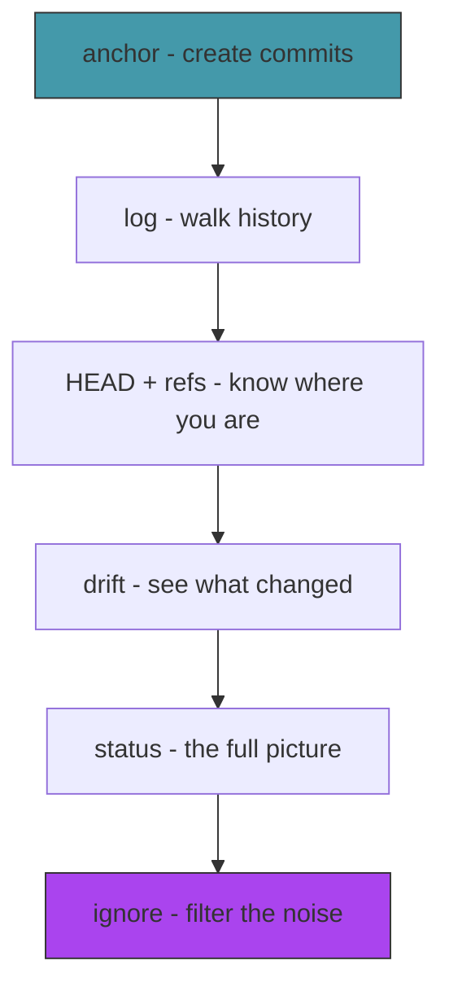

# Act 2 — The Timeline

> *Crystals hold memories. But memories without order are just noise — a drawer of unsorted photographs. In this act you string the crystals together into a timeline: a chain of commits stretching back to the very first anchor. You'll learn to walk it, display it, and see what changed between any two moments.*

Act 1 gave you the three object types — blobs, trees, commits. But commits floated in space, disconnected from each other and from HEAD. Act 2 connects everything: the `anchor` command creates commits that chain together, `log` walks the chain, `drift` shows what changed, and `status` tells you where you are right now.


---

## Stage 9 — Anchoring Time

> *We can create commit objects, but the process is manual — we call `test-commit` with a tree hash we computed separately, and nothing records that the commit happened. The `anchor` command ties everything together in one shot.*

*Difficulty: Medium* | *~75 min*

> [!tip] What You'll Learn
> - Reading and updating HEAD
> - Resolving a symbolic ref (`ref: refs/heads/main` → the actual commit hash)
> - The full commit workflow: stage → tree → commit → update ref
> - Why HEAD is a level of indirection (and why that matters for branching)

### Why HEAD is indirect

HEAD could just contain a commit hash directly. But instead it usually contains `ref: refs/heads/main` — a pointer to a pointer. Why the indirection?

Because when you commit, you need to update the *current branch*. If HEAD said `ref: refs/heads/main`, you know to update `refs/heads/main`. If HEAD said `ref: refs/heads/feature`, you'd update `refs/heads/feature` instead. The indirection is what makes branching work — HEAD tells you which branch you're on, and committing advances that branch.

When HEAD contains a raw commit hash instead of a `ref:` line, you're in **detached HEAD** state — not on any branch. We'll handle that in Act 3.

### 9.1 — Try it yourself: HEAD helpers

Create a new file `src/refs.rs` (and add `mod refs;` to `main.rs`). Implement three functions:

1. `read_head()` — read `.chronolock/HEAD` and return its trimmed content
2. `resolve_head()` — if HEAD starts with `ref: `, read the ref file to get the commit hash. If the ref file doesn't exist (no commits yet), return `Ok(None)`. If HEAD is a raw hash, return it directly.
3. `update_head(commit_hash)` — if HEAD is symbolic, update the branch file. If detached, update HEAD directly.

```rust
use std::fs;
use std::path::Path;

pub fn read_head() -> std::io::Result<String> {
    todo!()
}

pub fn resolve_head() -> std::io::Result<Option<String>> {
    todo!()
}

pub fn update_head(commit_hash: &str) -> std::io::Result<()> {
    todo!()
}
```

Hints:
- `head.strip_prefix("ref: ")` returns `Some("refs/heads/main")` if HEAD is symbolic, `None` otherwise
- `Path::new(".chronolock").join(ref_path)` builds the full path to the ref file
- Use `?` for all I/O operations

<details>
<summary>Solution — click to reveal</summary>

```rust
use std::fs;
use std::path::Path;

pub fn read_head() -> std::io::Result<String> {
    let content = fs::read_to_string(".chronolock/HEAD")?;
    Ok(content.trim().to_string())
}

pub fn resolve_head() -> std::io::Result<Option<String>> {
    let head = read_head()?;

    if let Some(ref_path) = head.strip_prefix("ref: ") {
        let full_path = Path::new(".chronolock").join(ref_path);
        if full_path.exists() {
            let hash = fs::read_to_string(&full_path)?;
            Ok(Some(hash.trim().to_string()))
        } else {
            Ok(None)
        }
    } else {
        Ok(Some(head))
    }
}

pub fn update_head(commit_hash: &str) -> std::io::Result<()> {
    let head = read_head()?;

    if let Some(ref_path) = head.strip_prefix("ref: ") {
        let full_path = Path::new(".chronolock").join(ref_path);
        if let Some(parent) = full_path.parent() {
            fs::create_dir_all(parent)?;
        }
        fs::write(full_path, format!("{}\n", commit_hash))?;
    } else {
        fs::write(".chronolock/HEAD", format!("{}\n", commit_hash))?;
    }

    Ok(())
}
```

</details>

| Code | Explanation |
|------|-------------|
| `head.strip_prefix("ref: ")` | If the string starts with `"ref: "`, return the rest. Returns `Option<&str>`. |
| `if let Some(ref_path) = ...` | Pattern match on the Option. If it's `Some`, bind the inner value to `ref_path`. |
| `full_path.parent()` | Get the parent directory of a path. We need to create `refs/heads/` if it doesn't exist. |

### 9.2 — The anchor command

Add the subcommand to `main.rs`:

```rust
/// Anchor the current state as a commit
Anchor {
    /// Commit message
    #[arg(short, long)]
    message: String,
},
```

And the handler:

```rust
Commands::Anchor { message } => anchor(&message),
```

```rust
fn anchor(message: &str) {
    let tree_hash = staging::stage_directory(std::path::Path::new("."))
        .unwrap_or_else(|e| {
            eprintln!("Failed to stage: {}", e);
            std::process::exit(1);
        });

    let parent = refs::resolve_head().unwrap_or_else(|e| {
        eprintln!("Failed to read HEAD: {}", e);
        std::process::exit(1);
    });

    let commit_hash = object::store_commit(
        &tree_hash,
        parent.as_deref(),
        "Chronomancer",
        "chrono@chronolock",
        message,
    ).unwrap_or_else(|e| {
        eprintln!("Failed to create commit: {}", e);
        std::process::exit(1);
    });

    refs::update_head(&commit_hash).unwrap_or_else(|e| {
        eprintln!("Failed to update HEAD: {}", e);
        std::process::exit(1);
    });

    let is_first = parent.is_none();
    println!("[{}{}] {}",
        if is_first { "(root) " } else { "" },
        &commit_hash[..8],
        message,
    );
}
```

### Concept: as_deref() — converting Option<String> to Option<&str>

`parent.as_deref()` converts `Option<String>` to `Option<&str>`. Why is this needed?

`store_commit` takes `Option<&str>` — a borrowed string slice. But `resolve_head()` returns `Option<String>` — an owned string. You can't pass `Option<String>` where `Option<&str>` is expected because the types don't match.

`.as_deref()` borrows the inner `String` as a `&str` without consuming the `Option`. It's equivalent to:

```rust
// Manual version:
let parent_ref: Option<&str> = match &parent {
    Some(s) => Some(s.as_str()),
    None => None,
};

// Shorthand:
let parent_ref = parent.as_deref();
```

**Python comparison:** In Python, `str` is always a reference-counted object — you never think about owned vs borrowed. In Rust, `String` (owned, heap-allocated) and `&str` (borrowed slice) are different types. `.as_deref()` bridges them.

### 9.3 — Test it

```bash
rm -rf .chronolock
mkdir -p src
echo 'fn main() { println!("hello"); }' > src/main.rs
echo "# Chronolock" > README.md

cargo run -- init
cargo run -- anchor -m "The first anchor"
```

```
[(root) a3b7c9d1] The first anchor
```

```bash
echo "A chronomancer's tool." >> README.md
cargo run -- anchor -m "Update README"
```

```
[e5f8a2b4] Update README
```

Verify with git:

```bash
GIT_DIR=.chronolock git log --oneline
```

```
e5f8a2b4 Update README
a3b7c9d1 The first anchor
```

> [!warning] Common Mistake: Forgetting to handle the first commit
> The first commit has no parent. If you always try to read a parent from HEAD, you'll fail on the first commit. `resolve_head()` returns `None` for this case — pass it through to `store_commit` via `parent.as_deref()`, which becomes `None`.

### Extend it

Add a `--author` flag to the `anchor` command that lets the user specify their name and email (default to "Chronomancer"). Parse the format `"Name <email>"` and pass it to `store_commit`.

> [!check] Checkpoint
> Create two commits with `anchor`. Verify `GIT_DIR=.chronolock git log --oneline` shows both. Stage 9 complete.

---

## Stage 10 — Walking Backwards

> *We can create commits, but we can't see our own history — we have to ask git. The `log` command walks backwards from HEAD, following parent pointers, printing each commit along the way.*

*Difficulty: Easy* | *~50 min*

> [!tip] What You'll Learn
> - Walking a linked list of commits (each points to its parent)
> - Parsing commit objects to extract fields
> - The `colored` crate for terminal colors
> - `while let` loops for Option iteration

### Why walking backwards?

Commits point to their *parent*, not their child. The most recent commit knows where it came from, but the first commit doesn't know what came after it. This is a singly-linked list — you can only traverse it in one direction, from newest to oldest.

This design is intentional. Adding a new commit only requires writing one new object and updating one ref. If commits pointed forward, every new commit would require *modifying* the previous commit to add a "next" pointer — violating immutability.

### 10.1 — Add colored

Update `Cargo.toml`:

```toml
colored = "2"
```

### 10.2 — Try it yourself: parse commit fields

Add a `parse_commit` function to `src/object.rs`. It takes the raw content bytes of a commit object and returns a struct with the parsed fields.

```rust
pub struct CommitInfo {
    pub tree: String,
    pub parent: Option<String>,
    pub author: String,
    pub message: String,
}

pub fn parse_commit(content: &[u8]) -> CommitInfo {
    // 1. Convert bytes to UTF-8 string
    // 2. Walk line by line:
    //    - "tree <hash>" → tree field
    //    - "parent <hash>" → parent field
    //    - "author <value>" → author field
    //    - Empty line → everything after is the message
    // 3. Return CommitInfo
    todo!()
}
```

Hints:
- `std::str::from_utf8(content)` converts bytes to a string
- `line.strip_prefix("tree ")` returns `Some("hash...")` if the line starts with `"tree "`
- Use a `bool` flag `in_message` to track when you've passed the blank line

<details>
<summary>Solution — click to reveal</summary>

```rust
pub fn parse_commit(content: &[u8]) -> CommitInfo {
    let text = std::str::from_utf8(content).expect("Invalid commit encoding");
    let mut tree = String::new();
    let mut parent = None;
    let mut author = String::new();
    let mut in_message = false;
    let mut message_lines: Vec<&str> = Vec::new();

    for line in text.lines() {
        if in_message {
            message_lines.push(line);
            continue;
        }

        if line.is_empty() {
            in_message = true;
            continue;
        }

        if let Some(value) = line.strip_prefix("tree ") {
            tree = value.to_string();
        } else if let Some(value) = line.strip_prefix("parent ") {
            parent = Some(value.to_string());
        } else if let Some(value) = line.strip_prefix("author ") {
            author = value.to_string();
        }
    }

    CommitInfo {
        tree,
        parent,
        author,
        message: message_lines.join("\n").trim().to_string(),
    }
}
```

</details>

### 10.3 — Add tests for parse_commit

```rust
#[cfg(test)]
mod tests {
    // ... existing tests ...

    #[test]
    fn test_parse_commit_basic() {
        let content = b"tree abc123\nauthor Test <test@test> 1000 +0000\ncommitter Test <test@test> 1000 +0000\n\nMy message\n";
        let info = parse_commit(content);
        assert_eq!(info.tree, "abc123");
        assert!(info.parent.is_none());
        assert_eq!(info.message, "My message");
    }

    #[test]
    fn test_parse_commit_with_parent() {
        let content = b"tree abc123\nparent def456\nauthor Test <t@t> 1000 +0000\ncommitter Test <t@t> 1000 +0000\n\nSecond commit\n";
        let info = parse_commit(content);
        assert_eq!(info.parent, Some("def456".to_string()));
        assert_eq!(info.message, "Second commit");
    }
}
```

```bash
cargo test
```

### 10.4 — The log command

```rust
/// Walk the timeline from HEAD
Log,
```

```rust
use colored::Colorize;

fn log_commits() {
    let mut current = refs::resolve_head().unwrap_or_else(|e| {
        eprintln!("Failed to read HEAD: {}", e);
        std::process::exit(1);
    });

    if current.is_none() {
        println!("No anchors yet. The timeline is empty.");
        return;
    }

    while let Some(hash) = current {
        let obj = object::read_object(&hash).unwrap_or_else(|e| {
            eprintln!("Cannot read commit {}: {}", hash, e);
            std::process::exit(1);
        });

        let info = object::parse_commit(&obj.content);

        println!("{} {}", "anchor".yellow(), hash.yellow());
        println!("Author: {}", info.author);
        println!();
        println!("    {}", info.message);
        println!();

        current = info.parent;
    }
}
```

### Concept: while let — looping over Options

`while let Some(hash) = current` is Rust's way of saying "keep looping as long as `current` is `Some`, and bind the inner value to `hash`." When `current` becomes `None`, the loop exits.

**Python comparison:**
```python
# Python: explicit None check
while current is not None:
    hash = current
    # ... process ...
    current = info.parent

# Rust: while let destructures and checks in one step
while let Some(hash) = current {
    // ... process ...
    current = info.parent;
}
```

The Rust version is more concise and can't accidentally use `current` when it's `None` — the `hash` binding only exists inside the loop body.

### 10.5 — Test it

```bash
cargo run -- log
```

```
anchor e5f8a2b4...
Author: Chronomancer <chrono@chronolock> 1713500100 +0200

    Update README

anchor a3b7c9d1...
Author: Chronomancer <chrono@chronolock> 1713500000 +0200

    The first anchor
```

> [!warning] Common Mistake: Infinite loop on malformed commits
> If a commit's parent hash points to a non-existent object, `read_object` will fail. Always handle the error — don't unwrap blindly in a loop. Our `unwrap_or_else` with `process::exit` prevents infinite loops.

### Extend it

Add a `--oneline` flag to `log` that prints each commit on a single line: `<short-hash> <message>`. Use `&hash[..8]` for the short hash. Compare the output with `GIT_DIR=.chronolock git log --oneline`.

> [!check] Checkpoint
> Run `chronolock log` after creating 2-3 commits. Verify commits appear newest-first. `cargo test` passes. Stage 10 complete.

---

## Stage 11 — The Present

> *We've been using HEAD without fully understanding it. This stage makes the concept concrete: HEAD is a file that tells you where you are in the timeline, and branches are files that tell you where a timeline ends.*

*Difficulty: Medium* | *~60 min*

> [!tip] What You'll Learn
> - HEAD as a file with two possible formats (symbolic ref vs detached)
> - Branch refs as simple files containing commit hashes
> - Listing branches
> - Why branches are "cheap" in git (they're 41-byte files)

### The ref model

The entire branching system is just files:

```
.chronolock/
├── HEAD                    ← "ref: refs/heads/main" (which branch am I on?)
└── refs/
    └── heads/
        ├── main            ← "a3b7c9d1..." (where does main point?)
        └── feature         ← "e5f8a2b4..." (where does feature point?)
```

A branch is a file containing a 40-character commit hash. Creating a branch means writing a 41-byte file (hash + newline). Deleting a branch means deleting a file. This is why git branches are "cheap" — there's no copying, no forking, no duplication. Just a pointer.

### 11.1 — Try it yourself: branch helpers

Add these functions to `src/refs.rs`:

```rust
/// Get the name of the current branch, or None if HEAD is detached.
pub fn current_branch() -> std::io::Result<Option<String>> {
    todo!()
}

/// List all branches (files in refs/heads/).
pub fn list_branches() -> std::io::Result<Vec<String>> {
    todo!()
}

/// Read the commit hash that a branch points to.
pub fn read_branch(name: &str) -> std::io::Result<Option<String>> {
    todo!()
}
```

Hints:
- `current_branch`: strip `"ref: refs/heads/"` from HEAD to get the branch name
- `list_branches`: read all files in `.chronolock/refs/heads/`, sort by name
- `read_branch`: read `.chronolock/refs/heads/<name>`, return `None` if it doesn't exist

<details>
<summary>Solution — click to reveal</summary>

```rust
pub fn current_branch() -> std::io::Result<Option<String>> {
    let head = read_head()?;
    if let Some(ref_path) = head.strip_prefix("ref: refs/heads/") {
        Ok(Some(ref_path.to_string()))
    } else {
        Ok(None)
    }
}

pub fn list_branches() -> std::io::Result<Vec<String>> {
    let heads_dir = Path::new(".chronolock/refs/heads");
    if !heads_dir.exists() {
        return Ok(Vec::new());
    }

    let mut branches: Vec<String> = Vec::new();
    for entry in fs::read_dir(heads_dir)? {
        let entry = entry?;
        if entry.metadata()?.is_file() {
            branches.push(entry.file_name().to_string_lossy().to_string());
        }
    }
    branches.sort();
    Ok(branches)
}

pub fn read_branch(name: &str) -> std::io::Result<Option<String>> {
    let path = Path::new(".chronolock/refs/heads").join(name);
    if path.exists() {
        let hash = fs::read_to_string(&path)?;
        Ok(Some(hash.trim().to_string()))
    } else {
        Ok(None)
    }
}
```

</details>

### 11.2 — The branch list command

```rust
/// List or create branches
Branch {
    /// Branch name to create (omit to list branches)
    name: Option<String>,
},
```

```rust
fn list_branches() {
    let current = refs::current_branch().unwrap_or_else(|e| {
        eprintln!("Failed to read HEAD: {}", e);
        std::process::exit(1);
    });

    let branches = refs::list_branches().unwrap_or_else(|e| {
        eprintln!("Failed to list branches: {}", e);
        std::process::exit(1);
    });

    if branches.is_empty() {
        println!("No branches yet.");
        return;
    }

    for branch in &branches {
        if current.as_deref() == Some(branch.as_str()) {
            println!("* {}", branch.green());
        } else {
            println!("  {}", branch);
        }
    }
}
```

### 11.3 — Improve log to show HEAD

Update `log_commits` to show which branch HEAD points to on the first commit:

```rust
fn log_commits() {
    let head_display = match refs::current_branch() {
        Ok(Some(branch)) => format!("HEAD -> {}", branch),
        Ok(None) => "HEAD (detached)".to_string(),
        Err(_) => "HEAD".to_string(),
    };

    let mut current = refs::resolve_head().unwrap_or_else(|e| {
        eprintln!("Failed to read HEAD: {}", e);
        std::process::exit(1);
    });

    if current.is_none() {
        println!("No anchors yet. The timeline is empty.");
        return;
    }

    let mut is_first = true;
    while let Some(hash) = current {
        let obj = object::read_object(&hash).unwrap_or_else(|e| {
            eprintln!("Cannot read commit {}: {}", hash, e);
            std::process::exit(1);
        });

        let info = object::parse_commit(&obj.content);

        if is_first {
            println!("{} {} ({})", "anchor".yellow(), hash.yellow(), head_display.cyan());
            is_first = false;
        } else {
            println!("{} {}", "anchor".yellow(), hash.yellow());
        }
        println!("Author: {}", info.author);
        println!();
        println!("    {}", info.message);
        println!();

        current = info.parent;
    }
}
```

### 11.4 — Test it

```bash
cargo run -- branch
```

```
* main
```

```bash
cargo run -- log
```

```
anchor e5f8a2b4... (HEAD -> main)
...
```

> [!note] Why this matters
> Right now we only have one branch, so this seems trivial. But in Act 3, when you have multiple branches, `HEAD -> feature` vs `HEAD -> main` tells you which timeline you're advancing. The entire branching model rests on this one file.

### Extend it

Add a `-v` (verbose) flag to `chronolock branch` that shows the commit hash and first line of the commit message next to each branch name, like `git branch -v`.

> [!check] Checkpoint
> Run `chronolock branch` and verify it shows `* main`. Run `chronolock log` and verify the latest commit shows `(HEAD -> main)`. Stage 11 complete.

---

## Stage 12 — Temporal Drift

> *We can see the list of commits, but not what actually changed in each one. The `drift` command compares two tree objects and reports which files were added, modified, or deleted.*

*Difficulty: Medium* | *~90 min*

> [!tip] What You'll Learn
> - Comparing two trees by walking their entries
> - Detecting additions, deletions, and modifications by hash comparison
> - `HashMap` for efficient lookups
> - Why comparing hashes is enough (no need to diff file contents yet)

### Why hash comparison works

Two blobs with the same hash have the same content — that's the content-addressing guarantee from Stage 2. So comparing two trees is simple: walk both trees, match entries by name, compare hashes. If the hashes differ, the file changed. If an entry exists in one tree but not the other, it was added or deleted.

This is remarkably efficient. We don't need to read or decompress any blob content — just compare 40-character strings.

### 12.1 — Try it yourself: the diff function

Create `src/diff.rs` (add `mod diff;` to `main.rs`). Implement `diff_trees`:

```rust
use crate::object;
use std::collections::HashMap;

#[derive(Debug)]
pub enum DiffEntry {
    Added { name: String, hash: String },
    Deleted { name: String, hash: String },
    Modified { name: String, old_hash: String, new_hash: String },
}

/// Compare two trees and return the differences.
pub fn diff_trees(old_hash: &str, new_hash: &str) -> std::io::Result<Vec<DiffEntry>> {
    // 1. Read both trees into Vec<TreeEntry>
    // 2. Build HashMap<name, hash> for each
    // 3. Walk old entries: if missing in new → Deleted, if hash differs → Modified
    // 4. Walk new entries: if missing in old → Added
    // 5. Sort results by name
    todo!()
}
```

Hints:
- Use a helper `read_tree_entries(hash)` that calls `object::read_object` and `object::parse_tree`
- `HashMap<&str, &str>` borrows from the `TreeEntry` vectors — they must live long enough
- `DiffEntry::Added { name, .. }` destructures an enum variant, ignoring fields with `..`

<details>
<summary>Solution — click to reveal</summary>

```rust
pub fn diff_trees(old_hash: &str, new_hash: &str) -> std::io::Result<Vec<DiffEntry>> {
    let old_entries = read_tree_entries(old_hash)?;
    let new_entries = read_tree_entries(new_hash)?;

    let old_map: HashMap<&str, &str> = old_entries.iter()
        .map(|e| (e.name.as_str(), e.hash.as_str()))
        .collect();
    let new_map: HashMap<&str, &str> = new_entries.iter()
        .map(|e| (e.name.as_str(), e.hash.as_str()))
        .collect();

    let mut diffs = Vec::new();

    for entry in &old_entries {
        match new_map.get(entry.name.as_str()) {
            Some(&new_hash) if new_hash != entry.hash => {
                diffs.push(DiffEntry::Modified {
                    name: entry.name.clone(),
                    old_hash: entry.hash.clone(),
                    new_hash: new_hash.to_string(),
                });
            }
            None => {
                diffs.push(DiffEntry::Deleted {
                    name: entry.name.clone(),
                    hash: entry.hash.clone(),
                });
            }
            _ => {} // unchanged
        }
    }

    for entry in &new_entries {
        if !old_map.contains_key(entry.name.as_str()) {
            diffs.push(DiffEntry::Added {
                name: entry.name.clone(),
                hash: entry.hash.clone(),
            });
        }
    }

    diffs.sort_by(|a, b| diff_name(a).cmp(diff_name(b)));
    Ok(diffs)
}

fn diff_name(d: &DiffEntry) -> &str {
    match d {
        DiffEntry::Added { name, .. }
        | DiffEntry::Deleted { name, .. }
        | DiffEntry::Modified { name, .. } => name,
    }
}

fn read_tree_entries(hash: &str) -> std::io::Result<Vec<object::TreeEntry>> {
    let obj = object::read_object(hash)?;
    if obj.obj_type != object::ObjectType::Tree {
        return Err(std::io::Error::new(
            std::io::ErrorKind::InvalidData,
            format!("Expected tree, got {:?}", obj.obj_type),
        ));
    }
    Ok(object::parse_tree(&obj.content))
}
```

</details>

### Concept: Borrowing from local variables — why HashMap<&str, &str> works

Notice the HashMap borrows from `old_entries` and `new_entries`:

```rust
let old_entries = read_tree_entries(old_hash)?;
let old_map: HashMap<&str, &str> = old_entries.iter()
    .map(|e| (e.name.as_str(), e.hash.as_str()))
    .collect();
```

The `&str` references point into the `String` fields of `old_entries`. This is safe because `old_entries` lives for the entire function — the references can't outlive the data.

If you tried to return the HashMap from a function while dropping `old_entries`, the compiler would stop you:

```
error[E0515]: cannot return value referencing local variable `old_entries`
```

This is Rust's lifetime system protecting you from dangling references. The fix would be to use `HashMap<String, String>` (owned copies) if you needed to return it. Inside a single function, borrowing is more efficient.

### 12.2 — Add tests for diff_trees

Since `diff_trees` requires objects in the store, we test the classification logic with a unit test on the helper:

```rust
// In diff.rs
#[cfg(test)]
mod tests {
    use super::*;

    #[test]
    fn test_diff_name_extraction() {
        let added = DiffEntry::Added { name: "a.txt".into(), hash: "abc".into() };
        let deleted = DiffEntry::Deleted { name: "b.txt".into(), hash: "def".into() };
        let modified = DiffEntry::Modified {
            name: "c.txt".into(), old_hash: "old".into(), new_hash: "new".into(),
        };
        assert_eq!(diff_name(&added), "a.txt");
        assert_eq!(diff_name(&deleted), "b.txt");
        assert_eq!(diff_name(&modified), "c.txt");
    }
}
```

### 12.3 — The drift command

Add the subcommand and handler:

```rust
/// Show what changed between two commits
Drift {
    old: String,
    new: String,
},
```

```rust
fn drift(old_hash: &str, new_hash: &str) {
    let old_obj = object::read_object(old_hash).unwrap_or_else(|e| {
        eprintln!("Cannot read {}: {}", old_hash, e);
        std::process::exit(1);
    });
    let new_obj = object::read_object(new_hash).unwrap_or_else(|e| {
        eprintln!("Cannot read {}: {}", new_hash, e);
        std::process::exit(1);
    });

    let old_commit = object::parse_commit(&old_obj.content);
    let new_commit = object::parse_commit(&new_obj.content);

    let diffs = diff::diff_trees(&old_commit.tree, &new_commit.tree).unwrap_or_else(|e| {
        eprintln!("Diff failed: {}", e);
        std::process::exit(1);
    });

    if diffs.is_empty() {
        println!("No changes.");
        return;
    }

    for entry in &diffs {
        match entry {
            diff::DiffEntry::Added { name, .. } => println!("{} {}", "A".green(), name),
            diff::DiffEntry::Deleted { name, .. } => println!("{} {}", "D".red(), name),
            diff::DiffEntry::Modified { name, .. } => println!("{} {}", "M".yellow(), name),
        }
    }
}
```

### 12.4 — Test it

```bash
cargo run -- log
# Note the two commit hashes

cargo run -- drift <first-commit-hash> <second-commit-hash>
```

```
M README.md
```

> [!warning] Common Mistake: Comparing blob hashes directly instead of tree entries
> Trees can contain subtrees (directories). A full diff implementation would need to recursively compare subtrees. Our current version only compares the top-level entries — we'll extend it to handle nested directories in Stage 13.

### Extend it

Add a `--stat` flag that also shows the size difference for modified files. Read both blobs and print `M README.md (+15 bytes)` or `M README.md (-3 bytes)`.

> [!check] Checkpoint
> Run `chronolock drift <old> <new>` between two commits. Verify it shows `M`, `A`, `D` correctly. `cargo test` passes. Stage 12 complete.

---

## Stage 13 — The Working Drift

> *The most useful diff is between your current files and the last anchor. "What have I changed since I last committed?" This stage builds that comparison.*

*Difficulty: Medium* | *~75 min*

> [!tip] What You'll Learn
> - Hashing files without storing them (dry-run hashing)
> - Comparing working directory state against a committed tree
> - Recursive tree flattening
> - `walkdir`-style recursive directory scanning

### 13.1 — Hash without storing

Add to `src/object.rs`:

```rust
/// Compute the blob hash of content without storing it.
pub fn hash_blob(content: &[u8]) -> String {
    let header = format!("blob {}\0", content.len());
    let mut full_object = header.into_bytes();
    full_object.extend_from_slice(content);
    hash_bytes(&full_object)
}
```

Add a test:

```rust
#[test]
fn test_hash_blob_matches_store() {
    // hash_blob should produce the same hash as store_blob
    // (without actually writing to disk)
    let content = b"test content for hashing";
    let hash = hash_blob(content);
    assert_eq!(hash.len(), 40);
    // Verify it includes the header (different from raw hash)
    assert_ne!(hash, hash_bytes(content));
}
```

### 13.2 — Try it yourself: flatten a tree recursively

Add to `src/diff.rs`. This function takes a tree hash and returns all files as `(relative_path, blob_hash)` pairs, recursing into subtrees:

```rust
/// Flatten a tree (and its subtrees) into (relative path, blob hash) pairs.
pub fn flatten_tree(tree_hash: &str, prefix: &str) -> std::io::Result<Vec<(String, String)>> {
    // 1. Read the tree object and parse its entries
    // 2. For each entry:
    //    - If mode is "40000" (directory): recurse with updated prefix
    //    - Otherwise: add (prefix/name, hash) to the result
    // 3. Return all files
    todo!()
}
```

<details>
<summary>Solution — click to reveal</summary>

```rust
pub fn flatten_tree(tree_hash: &str, prefix: &str) -> std::io::Result<Vec<(String, String)>> {
    let obj = object::read_object(tree_hash)?;
    let entries = object::parse_tree(&obj.content);
    let mut files = Vec::new();

    for entry in entries {
        let path = if prefix.is_empty() {
            entry.name.clone()
        } else {
            format!("{}/{}", prefix, entry.name)
        };

        if entry.mode == "40000" {
            let mut sub_files = flatten_tree(&entry.hash, &path)?;
            files.append(&mut sub_files);
        } else {
            files.push((path, entry.hash));
        }
    }

    Ok(files)
}
```

</details>

### 13.3 — Scan the working directory

Add to `src/diff.rs`:

```rust
/// Scan the working directory and compute blob hashes for all files.
pub fn scan_working_dir(root: &std::path::Path) -> std::io::Result<Vec<(String, String)>> {
    let mut files = Vec::new();
    scan_dir_recursive(root, root, &mut files)?;
    files.sort_by(|a, b| a.0.cmp(&b.0));
    Ok(files)
}

fn scan_dir_recursive(
    base: &std::path::Path,
    dir: &std::path::Path,
    files: &mut Vec<(String, String)>,
) -> std::io::Result<()> {
    let mut entries: Vec<_> = std::fs::read_dir(dir)?
        .filter_map(|e| e.ok())
        .collect();
    entries.sort_by_key(|e| e.file_name());

    for entry in entries {
        let name = entry.file_name().to_string_lossy().to_string();
        if name == ".chronolock" || name == ".git" || name == "target" || name.starts_with('.') {
            continue;
        }

        let path = entry.path();
        let metadata = entry.metadata()?;

        if metadata.is_file() {
            let relative = path.strip_prefix(base).unwrap().to_string_lossy().to_string();
            let content = std::fs::read(&path)?;
            let hash = object::hash_blob(&content);
            files.push((relative, hash));
        } else if metadata.is_dir() {
            scan_dir_recursive(base, &path, files)?;
        }
    }

    Ok(())
}
```

### Concept: &mut Vec as an accumulator in recursion

`scan_dir_recursive` takes `files: &mut Vec<(String, String)>` — a mutable reference to the accumulator. Every recursive call adds to the *same* vector. This is more efficient than creating a new vector per call and merging them.

The alternative — returning a `Vec` from each call — would work but requires allocating and copying:

```rust
// Less efficient: allocate + merge at each level
fn scan(dir: &Path) -> Vec<(String, String)> {
    let mut files = Vec::new();
    for entry in subdirs {
        let mut sub = scan(&entry.path()); // new Vec each time
        files.append(&mut sub);            // copy into parent
    }
    files
}
```

The `&mut Vec` pattern avoids this overhead. It's a common Rust idiom for recursive accumulation.

### 13.4 — Try it yourself: compare working directory against HEAD

Implement `diff_working` in `src/diff.rs`:

```rust
/// Compare the working directory against the tree in the latest commit.
pub fn diff_working(root: &std::path::Path) -> std::io::Result<Vec<DiffEntry>> {
    // 1. Scan working directory → HashMap<path, hash>
    // 2. Resolve HEAD → commit → tree → flatten → HashMap<path, hash>
    //    (if no commits yet, use empty HashMap)
    // 3. Compare: modified, deleted, added (same logic as diff_trees)
    todo!()
}
```

<details>
<summary>Solution — click to reveal</summary>

```rust
pub fn diff_working(root: &std::path::Path) -> std::io::Result<Vec<DiffEntry>> {
    let working = scan_working_dir(root)?;
    let working_map: HashMap<String, String> = working.into_iter().collect();

    let head_commit = crate::refs::resolve_head()?;
    let committed_map: HashMap<String, String> = match head_commit {
        Some(hash) => {
            let obj = object::read_object(&hash)?;
            let info = object::parse_commit(&obj.content);
            flatten_tree(&info.tree, "")?.into_iter().collect()
        }
        None => HashMap::new(),
    };

    let mut diffs = Vec::new();

    for (path, old_hash) in &committed_map {
        match working_map.get(path) {
            Some(new_hash) if new_hash != old_hash => {
                diffs.push(DiffEntry::Modified {
                    name: path.clone(),
                    old_hash: old_hash.clone(),
                    new_hash: new_hash.clone(),
                });
            }
            None => {
                diffs.push(DiffEntry::Deleted {
                    name: path.clone(),
                    hash: old_hash.clone(),
                });
            }
            _ => {}
        }
    }

    for (path, hash) in &working_map {
        if !committed_map.contains_key(path) {
            diffs.push(DiffEntry::Added {
                name: path.clone(),
                hash: hash.clone(),
            });
        }
    }

    diffs.sort_by(|a, b| diff_name(a).cmp(diff_name(b)));
    Ok(diffs)
}
```

</details>

### 13.5 — Wire it up

Update `Drift` to support no-argument mode:

```rust
Drift {
    old: Option<String>,
    new: Option<String>,
},
```

```rust
Commands::Drift { old, new } => {
    match (old, new) {
        (Some(old_hash), Some(new_hash)) => drift(&old_hash, &new_hash),
        _ => drift_working(),
    }
}
```

```rust
fn drift_working() {
    let diffs = diff::diff_working(std::path::Path::new(".")).unwrap_or_else(|e| {
        eprintln!("Diff failed: {}", e);
        std::process::exit(1);
    });

    if diffs.is_empty() {
        println!("No changes since last anchor.");
        return;
    }

    for entry in &diffs {
        match entry {
            diff::DiffEntry::Added { name, .. } => println!("{} {}", "A".green(), name),
            diff::DiffEntry::Deleted { name, .. } => println!("{} {}", "D".red(), name),
            diff::DiffEntry::Modified { name, .. } => println!("{} {}", "M".yellow(), name),
        }
    }
}
```

### 13.6 — Test it

```bash
echo "new line" >> README.md
cargo run -- drift
```

```
M README.md
```

```bash
echo "test" > notes.txt
cargo run -- drift
```

```
M README.md
A notes.txt
```

> [!warning] Common Mistake: Forgetting the "no commits yet" case
> Before the first commit, there's no tree to compare against. Every file in the working directory should show as `Added`. The `HashMap::new()` fallback handles this — if the committed map is empty, everything in the working map is an addition.

### Extend it

Add a `--name-only` flag that suppresses the `A`/`M`/`D` prefix and just prints filenames, one per line. Useful for piping to other commands.

> [!check] Checkpoint
> Modify a file and run `chronolock drift` with no arguments. Verify it shows `M`. Add a new file and verify `A`. `cargo test` passes. Stage 13 complete.

---

## Stage 14 — Surveying the Present

> *`drift` shows raw diffs, but it doesn't tell the full story. The `status` command combines everything — HEAD, branch, and working directory diff — into a single overview.*

*Difficulty: Medium* | *~60 min*

> [!tip] What You'll Learn
> - Combining multiple data sources into a single display
> - Categorizing changes: staged vs unstaged vs untracked
> - Building a user-friendly CLI output
> - Why `git status` is the command you run most often

### 14.1 — Try it yourself: the status command

Implement the `status` function. It should:

1. Print the current branch name (or "HEAD detached at ...")
2. If no commits yet, print a hint to use `anchor`
3. Call `diff::diff_working` to get changes
4. If no changes, print "Nothing to anchor"
5. Otherwise, list each change with a descriptive label

```rust
fn status() {
    // 1. Show current branch (refs::current_branch)
    // 2. Check if HEAD resolves (refs::resolve_head)
    // 3. Get diffs (diff::diff_working)
    // 4. Display results
    todo!()
}
```

<details>
<summary>Solution — click to reveal</summary>

```rust
fn status() {
    match refs::current_branch() {
        Ok(Some(branch)) => println!("On branch {}", branch.green()),
        Ok(None) => {
            let hash = refs::resolve_head().ok().flatten().unwrap_or_default();
            println!("HEAD detached at {}", &hash[..8.min(hash.len())]);
        }
        Err(e) => eprintln!("Cannot read HEAD: {}", e),
    }

    let head = refs::resolve_head().unwrap_or_else(|e| {
        eprintln!("Failed to read HEAD: {}", e);
        std::process::exit(1);
    });

    if head.is_none() {
        println!("\nNo anchors yet.\n");
        println!("  (use \"chronolock anchor -m <message>\" to create the first anchor)");
        return;
    }

    let diffs = diff::diff_working(std::path::Path::new(".")).unwrap_or_else(|e| {
        eprintln!("Diff failed: {}", e);
        std::process::exit(1);
    });

    if diffs.is_empty() {
        println!("\nNothing to anchor. The timeline is clean.");
        return;
    }

    println!();
    println!("Changes not yet anchored:");
    println!("  (use \"chronolock anchor -m <message>\" to anchor these changes)");
    println!();

    for entry in &diffs {
        match entry {
            diff::DiffEntry::Added { name, .. } => {
                println!("        {} {}", "new file:".green(), name);
            }
            diff::DiffEntry::Deleted { name, .. } => {
                println!("        {} {}", "deleted:".red(), name);
            }
            diff::DiffEntry::Modified { name, .. } => {
                println!("        {} {}", "modified:".yellow(), name);
            }
        }
    }
    println!();
}
```

</details>

### 14.2 — Test it

```bash
cargo run -- status
```

```
On branch main

Changes not yet anchored:
  (use "chronolock anchor -m <message>" to anchor these changes)

        modified: README.md
        new file: notes.txt
```

After committing:

```bash
cargo run -- anchor -m "Add notes"
cargo run -- status
```

```
On branch main

Nothing to anchor. The timeline is clean.
```

> [!note] Simplified staging model
> Real git has a three-way distinction: committed, staged, and working directory. Our Chronolock currently stages everything on commit (like `git add . && git commit`). This is simpler to understand and covers the common case. Selective staging could be added later by implementing a proper index file.

### Extend it

Add a `--short` flag that prints a compact one-line-per-file format like `git status -s`: `M README.md`, `A notes.txt`, `D old.txt`. No headers, no hints — just the changes.

> [!check] Checkpoint
> Run `chronolock status` with uncommitted changes. Verify it shows the branch name and lists changes. Commit and verify "Nothing to anchor." Stage 14 complete.

---

## Stage 15 — Ignoring the Noise

> *Every project has files that shouldn't be tracked — build artifacts, editor configs, OS metadata. The `.chronolockignore` file tells the Chronolock which files to pretend don't exist.*

*Difficulty: Easy* | *~45 min*

> [!tip] What You'll Learn
> - Glob pattern matching with the `glob` crate
> - Reading and parsing an ignore file
> - Filtering file lists against patterns
> - Why `.gitignore` uses glob syntax

### 15.1 — Add the glob crate

```toml
glob = "0.3"
```

### 15.2 — Try it yourself: the ignore module

Create `src/ignore.rs` (add `mod ignore;` to `main.rs`). Implement two functions:

```rust
use glob::Pattern;

/// Load ignore patterns from .chronolockignore (and built-in defaults).
pub fn load_patterns() -> Vec<Pattern> {
    // 1. Start with built-in ignores: .chronolock, .git, target
    // 2. Read .chronolockignore if it exists
    // 3. Skip empty lines and lines starting with '#'
    // 4. Parse each line as a glob Pattern
    todo!()
}

/// Check if a filename should be ignored.
pub fn is_ignored(name: &str, patterns: &[Pattern]) -> bool {
    todo!()
}
```

<details>
<summary>Solution — click to reveal</summary>

```rust
use glob::Pattern;
use std::fs;
use std::path::Path;

pub fn load_patterns() -> Vec<Pattern> {
    let mut patterns = Vec::new();

    let defaults = [".chronolock", ".git", "target"];
    for d in &defaults {
        if let Ok(p) = Pattern::new(d) {
            patterns.push(p);
        }
    }

    let ignore_path = Path::new(".chronolockignore");
    if ignore_path.exists() {
        if let Ok(content) = fs::read_to_string(ignore_path) {
            for line in content.lines() {
                let line = line.trim();
                if line.is_empty() || line.starts_with('#') {
                    continue;
                }
                if let Ok(p) = Pattern::new(line) {
                    patterns.push(p);
                }
            }
        }
    }

    patterns
}

pub fn is_ignored(name: &str, patterns: &[Pattern]) -> bool {
    patterns.iter().any(|p| p.matches(name))
}
```

</details>

### 15.3 — Add tests

```rust
// In ignore.rs
#[cfg(test)]
mod tests {
    use super::*;

    #[test]
    fn test_is_ignored_exact_match() {
        let patterns = vec![Pattern::new("target").unwrap()];
        assert!(is_ignored("target", &patterns));
        assert!(!is_ignored("src", &patterns));
    }

    #[test]
    fn test_is_ignored_glob() {
        let patterns = vec![Pattern::new("*.swp").unwrap()];
        assert!(is_ignored("file.swp", &patterns));
        assert!(!is_ignored("file.rs", &patterns));
    }

    #[test]
    fn test_builtin_defaults() {
        let patterns = load_patterns();
        assert!(is_ignored(".chronolock", &patterns));
        assert!(is_ignored(".git", &patterns));
        assert!(is_ignored("target", &patterns));
    }
}
```

### 15.4 — Integrate into staging and diff

Update `src/staging.rs` to use ignore patterns:

```rust
use crate::ignore;

pub fn stage_directory(dir: &Path) -> std::io::Result<String> {
    let patterns = ignore::load_patterns();
    stage_directory_inner(dir, &patterns)
}

fn stage_directory_inner(dir: &Path, patterns: &[glob::Pattern]) -> std::io::Result<String> {
    let mut entries: Vec<object::TreeEntry> = Vec::new();

    let mut dir_entries: Vec<_> = fs::read_dir(dir)?
        .filter_map(|e| e.ok())
        .collect();
    dir_entries.sort_by_key(|e| e.file_name());

    for entry in dir_entries {
        let name = entry.file_name().to_string_lossy().to_string();

        if ignore::is_ignored(&name, patterns) || name.starts_with('.') {
            continue;
        }

        let path = entry.path();
        let metadata = entry.metadata()?;

        if metadata.is_file() {
            let content = fs::read(&path)?;
            let hash = object::store_blob(&content)?;

            #[cfg(unix)]
            let mode = {
                use std::os::unix::fs::PermissionsExt;
                if metadata.permissions().mode() & 0o111 != 0 { "100755".to_string() }
                else { "100644".to_string() }
            };
            #[cfg(not(unix))]
            let mode = "100644".to_string();

            entries.push(object::TreeEntry { mode, name, hash });
        } else if metadata.is_dir() {
            let subtree_hash = stage_directory_inner(&path, patterns)?;
            entries.push(object::TreeEntry {
                mode: "40000".to_string(), name, hash: subtree_hash,
            });
        }
    }

    object::store_tree(&mut entries)
}
```

### Concept: &[Pattern] — passing slices through recursion

Notice `stage_directory_inner` takes `patterns: &[glob::Pattern]` — a borrowed slice. The patterns are loaded once in `stage_directory` and passed by reference through every recursive call. No copying, no allocation — every level of recursion shares the same pattern list.

This is the same `&mut Vec` accumulator pattern from Stage 13, but read-only. The patterns don't change during staging, so `&[Pattern]` (immutable slice) is sufficient.

### 15.5 — Test it

```bash
cat > .chronolockignore << 'EOF'
# Build artifacts
target
*.o
*.so

# Editor files
*.swp
*~

# OS metadata
.DS_Store
Thumbs.db
EOF

touch test.swp
mkdir -p target
echo "build output" > target/debug.txt

cargo run -- status
```

The status should not show `test.swp` or anything in `target/`.

> [!warning] Common Mistake: Ignoring `.chronolockignore` itself
> The ignore file should be tracked — it's part of the project configuration. Don't add it to its own ignore list. Our `starts_with('.')` filter would catch it, so make sure `.chronolockignore` is explicitly allowed or doesn't start with a dot in your pattern logic.

### Extend it

Add support for negation patterns: lines starting with `!` un-ignore a previously ignored pattern. For example, `*.log` ignores all log files, but `!important.log` keeps that one. You'll need to check patterns in order, with later patterns overriding earlier ones.

> [!check] Checkpoint
> Create a `.chronolockignore`, add some patterns, and verify `status` filters out matching files. `cargo test` passes. Stage 15 complete.

---

## Act 2 Complete — The Timeline



The Chronolock now has a working timeline. You can:

- **Anchor** moments in time (commits that chain together)
- **Walk** the timeline backwards (log)
- **See** what changed between any two points (drift)
- **Survey** the current state (status)
- **Filter** noise from the working directory (ignore)

| Rust Concept | Where You Used It |
|-------------|-------------------|
| `HashMap` | Tree diff lookups |
| `Option` chaining (`as_deref`, `while let`) | `resolve_head()`, parent traversal |
| Recursive functions | Flattening nested trees, scanning directories |
| `&mut Vec` accumulator | Recursive directory scanning |
| `&[T]` slices through recursion | Passing ignore patterns |
| Pattern matching | Diff entry classification, HEAD format detection |
| External crates | `colored`, `glob` |

**What's missing:** We have one timeline — `main`. But the real power of version control is branching: forking a timeline, working on something experimental, then merging it back. In Act 3, we'll build branching and checkout — and discover that branches are shockingly simple.
