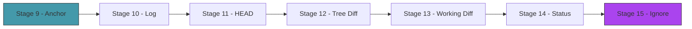
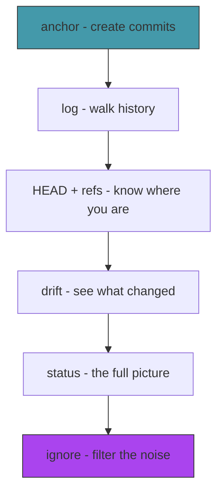

# Act 2 — The Timeline

> *Crystals hold memories. But memories without order are just noise — a drawer of unsorted photographs. In this act you string the crystals together into a timeline: a chain of commits stretching back to the very first anchor. You'll learn to walk it, display it, and see what changed between any two moments.*

Act 1 gave you the three object types — blobs, trees, commits. But commits floated in space, disconnected from each other and from HEAD. Act 2 connects everything: the `anchor` command creates commits that chain together, `log` walks the chain, `drift` shows what changed, and `status` tells you where you are right now.



---

## Stage 9 — Anchoring Time

> *Difficulty: Medium — The commit command that ties everything together.*

We can create commit objects, but the process is manual — we call `test-commit` with a tree hash we computed separately, and nothing records that the commit happened. HEAD still points to `refs/heads/main`, which doesn't exist. The `anchor` command needs to do three things in one shot: stage the working directory into a tree, create a commit pointing to that tree, and update the current branch to point to the new commit.

> [!tip] What You'll Learn
> - Reading and updating HEAD
> - Resolving a symbolic ref (`ref: refs/heads/main` → the actual commit hash)
> - The full commit workflow: stage → tree → commit → update ref
> - Why HEAD is a level of indirection (and why that matters for branching)

### Why HEAD is indirect

HEAD could just contain a commit hash directly. But instead it usually contains `ref: refs/heads/main` — a pointer to a pointer. Why the indirection?

Because when you commit, you need to update the *current branch*. If HEAD said `ref: refs/heads/main`, you know to update `refs/heads/main`. If HEAD said `ref: refs/heads/feature`, you'd update `refs/heads/feature` instead. The indirection is what makes branching work — HEAD tells you which branch you're on, and committing advances that branch.

When HEAD contains a raw commit hash instead of a `ref:` line, you're in **detached HEAD** state — not on any branch. We'll handle that in Act 3.

### 9.1 — HEAD helpers

Add a new file `src/refs.rs`:

```rust
use std::fs;
use std::path::Path;

/// Read the current HEAD value.
/// Returns either "ref: refs/heads/main" (symbolic) or a raw commit hash.
pub fn read_head() -> std::io::Result<String> {
    let content = fs::read_to_string(".chronolock/HEAD")?;
    Ok(content.trim().to_string())
}

/// Resolve HEAD to a commit hash.
/// If HEAD is symbolic (ref: refs/heads/main), read the ref file.
/// If HEAD is a raw hash, return it directly.
/// Returns None if the ref doesn't exist yet (no commits).
pub fn resolve_head() -> std::io::Result<Option<String>> {
    let head = read_head()?;

    if let Some(ref_path) = head.strip_prefix("ref: ") {
        // Symbolic ref — read the branch file
        let full_path = Path::new(".chronolock").join(ref_path);
        if full_path.exists() {
            let hash = fs::read_to_string(&full_path)?;
            Ok(Some(hash.trim().to_string()))
        } else {
            // Branch doesn't exist yet (no commits on this branch)
            Ok(None)
        }
    } else {
        // Detached HEAD — raw commit hash
        Ok(Some(head))
    }
}

/// Update the ref that HEAD points to (or HEAD itself if detached).
pub fn update_head(commit_hash: &str) -> std::io::Result<()> {
    let head = read_head()?;

    if let Some(ref_path) = head.strip_prefix("ref: ") {
        // Update the branch file
        let full_path = Path::new(".chronolock").join(ref_path);
        if let Some(parent) = full_path.parent() {
            fs::create_dir_all(parent)?;
        }
        fs::write(full_path, format!("{}\n", commit_hash))?;
    } else {
        // Detached HEAD — update HEAD directly
        fs::write(".chronolock/HEAD", format!("{}\n", commit_hash))?;
    }

    Ok(())
}
```

| Code | Explanation |
|------|-------------|
| `head.strip_prefix("ref: ")` | If the string starts with `"ref: "`, return the rest. Returns `Option<&str>` — `Some("refs/heads/main")` or `None`. |
| `if let Some(ref_path) = ...` | Pattern match on the Option. If it's `Some`, bind the inner value to `ref_path`. |
| `full_path.parent()` | Get the parent directory of a path. We need to create `refs/heads/` if it doesn't exist. |

### 9.2 — The anchor command

Add `mod refs;` to `main.rs`. Add the subcommand:

```rust
/// Anchor the current state as a commit
Anchor {
    /// Commit message
    #[arg(short, long)]
    message: String,
},
```

And the handler:

```rust
Commands::Anchor { message } => anchor(&message),
```

```rust
fn anchor(message: &str) {
    // Step 1: Stage the working directory into a tree
    let tree_hash = staging::stage_directory(std::path::Path::new("."))
        .unwrap_or_else(|e| {
            eprintln!("Failed to stage: {}", e);
            std::process::exit(1);
        });

    // Step 2: Find the current commit (if any) to use as parent
    let parent = refs::resolve_head().unwrap_or_else(|e| {
        eprintln!("Failed to read HEAD: {}", e);
        std::process::exit(1);
    });

    // Step 3: Create the commit object
    let commit_hash = object::store_commit(
        &tree_hash,
        parent.as_deref(),
        "Chronomancer",
        "chrono@chronolock",
        message,
    ).unwrap_or_else(|e| {
        eprintln!("Failed to create commit: {}", e);
        std::process::exit(1);
    });

    // Step 4: Update HEAD (or the branch it points to)
    refs::update_head(&commit_hash).unwrap_or_else(|e| {
        eprintln!("Failed to update HEAD: {}", e);
        std::process::exit(1);
    });

    let is_first = parent.is_none();
    println!("[{}{}] {}",
        if is_first { "(root) " } else { "" },
        &commit_hash[..8],
        message,
    );
}
```

`parent.as_deref()` converts `Option<String>` to `Option<&str>` — it borrows the inner string without consuming the `Option`. This is a common Rust pattern when you have an owned `Option` but need a borrowed one.

### 9.3 — Test it

```bash
# Start fresh
rm -rf .chronolock test_project
mkdir -p src
echo 'fn main() { println!("hello"); }' > src/main.rs
echo "# Chronolock" > README.md

cargo run -- init
cargo run -- anchor -m "The first anchor"
```

```
[(root) a3b7c9d1] The first anchor
```

Make a change and commit again:

```bash
echo "A chronomancer's tool." >> README.md
cargo run -- anchor -m "Update README"
```

```
[e5f8a2b4] Update README
```

Verify with git:

```bash
GIT_DIR=.chronolock git log --oneline
```

```
e5f8a2b4 Update README
a3b7c9d1 The first anchor
```

Git sees two commits, chained together. The second commit's parent is the first. The timeline exists.

> [!warning] Common Mistake
> **Forgetting to handle the first commit (no parent).** The first commit has no parent line in its object. If you always try to read a parent from HEAD, you'll fail on the first commit. `resolve_head()` returns `None` for this case — pass it through to `store_commit`.

We have commits chaining together, but we can only see them through git. Next stage, we'll build our own `log` command to walk the timeline backwards from HEAD.

> [!check] Checkpoint
> Create two commits with `anchor`. Verify `GIT_DIR=.chronolock git log --oneline` shows both, with the second pointing to the first as its parent. Stage 9 complete.

---

## Stage 10 — Walking Backwards

> *Difficulty: Easy — Traversing the commit chain.*

We can create commits, but we can't see our own history — we have to ask git. A chronomancer who can't review their own timeline is working blind. The `log` command walks backwards from HEAD, following parent pointers, printing each commit along the way.

> [!tip] What You'll Learn
> - Walking a linked list of commits (each points to its parent)
> - Parsing commit objects to extract fields
> - The `colored` crate for terminal colors
> - Why git log is O(n) in the number of commits

### Why walking backwards?

Commits point to their *parent*, not their child. The most recent commit knows where it came from, but the first commit doesn't know what came after it. This is a singly-linked list — you can only traverse it in one direction, from newest to oldest.

This design is intentional. Adding a new commit only requires writing one new object and updating one ref. If commits pointed forward, every new commit would require *modifying* the previous commit to add a "next" pointer — violating immutability.

### 10.1 — Add colored

Update `Cargo.toml`:

```toml
colored = "2"
```

### 10.2 — Parse commit fields

Add to `src/object.rs`:

```rust
/// Parsed fields from a commit object.
pub struct CommitInfo {
    pub tree: String,
    pub parent: Option<String>,
    pub author: String,
    pub message: String,
}

/// Parse a commit object's content into structured fields.
pub fn parse_commit(content: &[u8]) -> CommitInfo {
    let text = std::str::from_utf8(content).expect("Invalid commit encoding");
    let mut tree = String::new();
    let mut parent = None;
    let mut author = String::new();
    let mut in_message = false;
    let mut message_lines: Vec<&str> = Vec::new();

    for line in text.lines() {
        if in_message {
            message_lines.push(line);
            continue;
        }

        if line.is_empty() {
            // Blank line = start of message
            in_message = true;
            continue;
        }

        if let Some(value) = line.strip_prefix("tree ") {
            tree = value.to_string();
        } else if let Some(value) = line.strip_prefix("parent ") {
            parent = Some(value.to_string());
        } else if let Some(value) = line.strip_prefix("author ") {
            author = value.to_string();
        }
        // We skip "committer" — it's usually identical to author
    }

    CommitInfo {
        tree,
        parent,
        author,
        message: message_lines.join("\n").trim().to_string(),
    }
}
```

The parser walks line by line. Everything before the blank line is a header; everything after is the message. This is the same format email uses (RFC 822) — git borrowed the convention.

### 10.3 — The log command

Add the subcommand:

```rust
/// Walk the timeline from HEAD
Log,
```

```rust
Commands::Log => log_commits(),
```

```rust
use colored::Colorize;

fn log_commits() {
    let mut current = refs::resolve_head().unwrap_or_else(|e| {
        eprintln!("Failed to read HEAD: {}", e);
        std::process::exit(1);
    });

    if current.is_none() {
        println!("No anchors yet. The timeline is empty.");
        return;
    }

    while let Some(hash) = current {
        let obj = object::read_object(&hash).unwrap_or_else(|e| {
            eprintln!("Cannot read commit {}: {}", hash, e);
            std::process::exit(1);
        });

        let info = object::parse_commit(&obj.content);

        println!("{} {}", "anchor".yellow(), hash.yellow());
        println!("Author: {}", info.author);
        println!();
        println!("    {}", info.message);
        println!();

        current = info.parent;
    }
}
```

The loop is simple: start at HEAD, read the commit, print it, follow the parent pointer. When `parent` is `None`, we've reached the first commit and the loop ends.

`while let Some(hash) = current` is Rust's way of saying "keep looping as long as `current` is `Some`, and bind the inner value to `hash`." When `current` becomes `None`, the loop exits.

### 10.4 — Test it

```bash
cargo run -- log
```

```
anchor e5f8a2b4...
Author: Chronomancer <chrono@chronolock> 1713500100 +0200

    Update README

anchor a3b7c9d1...
Author: Chronomancer <chrono@chronolock> 1713500000 +0200

    The first anchor
```

The timeline, walked from present to past. Each commit shows its full hash, author, and message.

> [!warning] Common Mistake
> **Infinite loop on malformed commits.** If a commit's parent hash points to a non-existent object, `read_object` will fail. Always handle the error — don't unwrap blindly in a loop.

We can see our history, but HEAD is still a mystery — we know it points to "the current branch," but we haven't really explored what that means. Next stage, we'll dig into HEAD, symbolic refs, and the relationship between HEAD and branches.

> [!check] Checkpoint
> Run `chronolock log` after creating 2-3 commits. Verify commits appear newest-first, each showing its hash, author, and message. Stage 10 complete.

---

## Stage 11 — The Present

> *Difficulty: Medium — Understanding HEAD, refs, and what "current branch" means.*

We've been using HEAD without fully understanding it. `init` writes `ref: refs/heads/main` into HEAD, and `anchor` updates whatever HEAD points to. But what *is* HEAD, really? This stage makes the concept concrete: HEAD is a file that tells you where you are in the timeline, and branches are files that tell you where a timeline ends.

> [!tip] What You'll Learn
> - HEAD as a file with two possible formats (symbolic ref vs detached)
> - Branch refs as simple files containing commit hashes
> - Listing branches
> - Why branches are "cheap" in git (they're 41-byte files)

### The ref model

The entire branching system is just files:

```
.chronolock/
├── HEAD                    ← "ref: refs/heads/main" (which branch am I on?)
└── refs/
    └── heads/
        ├── main            ← "a3b7c9d1..." (where does main point?)
        └── feature         ← "e5f8a2b4..." (where does feature point?)
```

That's it. A branch is a file containing a 40-character commit hash. Creating a branch means writing a 41-byte file (hash + newline). Deleting a branch means deleting a file. This is why git branches are "cheap" — there's no copying, no forking, no duplication. Just a pointer.

HEAD tells you which branch you're "on." When you commit, the Chronolock reads HEAD to find the branch, then updates that branch's file with the new commit hash. If HEAD says `ref: refs/heads/main`, committing advances `main`. If HEAD says `ref: refs/heads/feature`, committing advances `feature`.

### 11.1 — Show current branch

Add a helper to `src/refs.rs`:

```rust
/// Get the name of the current branch, or None if HEAD is detached.
pub fn current_branch() -> std::io::Result<Option<String>> {
    let head = read_head()?;
    if let Some(ref_path) = head.strip_prefix("ref: refs/heads/") {
        Ok(Some(ref_path.to_string()))
    } else {
        Ok(None) // detached HEAD
    }
}

/// List all branches (files in refs/heads/).
pub fn list_branches() -> std::io::Result<Vec<String>> {
    let heads_dir = Path::new(".chronolock/refs/heads");
    if !heads_dir.exists() {
        return Ok(Vec::new());
    }

    let mut branches: Vec<String> = Vec::new();
    for entry in fs::read_dir(heads_dir)? {
        let entry = entry?;
        if entry.metadata()?.is_file() {
            branches.push(entry.file_name().to_string_lossy().to_string());
        }
    }
    branches.sort();
    Ok(branches)
}

/// Read the commit hash that a branch points to.
pub fn read_branch(name: &str) -> std::io::Result<Option<String>> {
    let path = Path::new(".chronolock/refs/heads").join(name);
    if path.exists() {
        let hash = fs::read_to_string(&path)?;
        Ok(Some(hash.trim().to_string()))
    } else {
        Ok(None)
    }
}
```

### 11.2 — The branch list command

Add to the `Commands` enum:

```rust
/// List or create branches
Branch {
    /// Branch name to create (omit to list branches)
    name: Option<String>,
},
```

```rust
Commands::Branch { name } => {
    match name {
        Some(branch_name) => {
            // We'll implement branch creation in Act 3
            println!("Branch creation comes in Act 3. For now, listing branches.");
            list_branches();
        }
        None => list_branches(),
    }
}
```

```rust
fn list_branches() {
    let current = refs::current_branch().unwrap_or_else(|e| {
        eprintln!("Failed to read HEAD: {}", e);
        std::process::exit(1);
    });

    let branches = refs::list_branches().unwrap_or_else(|e| {
        eprintln!("Failed to list branches: {}", e);
        std::process::exit(1);
    });

    if branches.is_empty() {
        println!("No branches yet.");
        return;
    }

    for branch in &branches {
        if current.as_deref() == Some(branch.as_str()) {
            println!("* {}", branch.green());
        } else {
            println!("  {}", branch);
        }
    }
}
```

### 11.3 — Improve log to show HEAD

Update the `log_commits` function to show which branch HEAD points to:

```rust
fn log_commits() {
    let head_display = match refs::current_branch() {
        Ok(Some(branch)) => format!("HEAD -> {}", branch),
        Ok(None) => "HEAD (detached)".to_string(),
        Err(_) => "HEAD".to_string(),
    };

    let mut current = refs::resolve_head().unwrap_or_else(|e| {
        eprintln!("Failed to read HEAD: {}", e);
        std::process::exit(1);
    });

    if current.is_none() {
        println!("No anchors yet. The timeline is empty.");
        return;
    }

    let mut is_first = true;
    while let Some(hash) = current {
        let obj = object::read_object(&hash).unwrap_or_else(|e| {
            eprintln!("Cannot read commit {}: {}", hash, e);
            std::process::exit(1);
        });

        let info = object::parse_commit(&obj.content);

        if is_first {
            println!("{} {} ({})", "anchor".yellow(), hash.yellow(), head_display.cyan());
            is_first = false;
        } else {
            println!("{} {}", "anchor".yellow(), hash.yellow());
        }
        println!("Author: {}", info.author);
        println!();
        println!("    {}", info.message);
        println!();

        current = info.parent;
    }
}
```

### 11.4 — Test it

```bash
cargo run -- branch
```

```
* main
```

```bash
cargo run -- log
```

```
anchor e5f8a2b4... (HEAD -> main)
Author: Chronomancer <chrono@chronolock> 1713500100 +0200

    Update README

anchor a3b7c9d1...
Author: Chronomancer <chrono@chronolock> 1713500000 +0200

    The first anchor
```

The first commit now shows `(HEAD -> main)` — you can see exactly where you are in the timeline.

> [!note] Why this matters
> Right now we only have one branch, so this seems trivial. But in Act 3, when you have multiple branches, `HEAD -> feature` vs `HEAD -> main` tells you which timeline you're advancing. The entire branching model rests on this one file.

We can see our history and know which branch we're on. But we can't see *what changed* between commits — just that they exist. Next stage, we'll build the `drift` command that compares two trees and shows exactly which files were added, modified, or deleted.

> [!check] Checkpoint
> Run `chronolock branch` and verify it shows `* main`. Run `chronolock log` and verify the latest commit shows `(HEAD -> main)`. Stage 11 complete.

---

## Stage 12 — Temporal Drift

> *Difficulty: Medium — Diffing two trees to see what changed.*

We can see the list of commits, but not what actually changed in each one. "Update README" tells us the intent, but not the substance. Did we add a line? Delete a paragraph? Rewrite the whole file? The `drift` command compares two tree objects and reports which files were added, modified, or deleted — the temporal drift between two moments.

> [!tip] What You'll Learn
> - Comparing two trees by walking their entries
> - Detecting additions, deletions, and modifications by hash comparison
> - `HashMap` for efficient lookups
> - Why comparing hashes is enough (no need to diff file contents yet)

### Why hash comparison works

Two blobs with the same hash have the same content — that's the content-addressing guarantee from Stage 2. So comparing two trees is simple: walk both trees, match entries by name, compare hashes. If the hashes differ, the file changed. If an entry exists in one tree but not the other, it was added or deleted.

This is remarkably efficient. We don't need to read or decompress any blob content — just compare 40-character strings. A tree with 10,000 files can be diffed by comparing 10,000 hash pairs.

### 12.1 — The diff function

Add a new file `src/diff.rs`:

```rust
use crate::object;
use std::collections::HashMap;

#[derive(Debug)]
pub enum DiffEntry {
    Added { name: String, hash: String },
    Deleted { name: String, hash: String },
    Modified { name: String, old_hash: String, new_hash: String },
}

/// Compare two trees and return the differences.
/// `old` and `new` are tree object hashes.
pub fn diff_trees(old_hash: &str, new_hash: &str) -> std::io::Result<Vec<DiffEntry>> {
    let old_entries = read_tree_entries(old_hash)?;
    let new_entries = read_tree_entries(new_hash)?;

    // Build lookup maps: name → (hash, mode)
    let old_map: HashMap<&str, &str> = old_entries.iter()
        .map(|e| (e.name.as_str(), e.hash.as_str()))
        .collect();
    let new_map: HashMap<&str, &str> = new_entries.iter()
        .map(|e| (e.name.as_str(), e.hash.as_str()))
        .collect();

    let mut diffs = Vec::new();

    // Check for modifications and deletions
    for entry in &old_entries {
        match new_map.get(entry.name.as_str()) {
            Some(&new_hash) if new_hash != entry.hash => {
                diffs.push(DiffEntry::Modified {
                    name: entry.name.clone(),
                    old_hash: entry.hash.clone(),
                    new_hash: new_hash.to_string(),
                });
            }
            None => {
                diffs.push(DiffEntry::Deleted {
                    name: entry.name.clone(),
                    hash: entry.hash.clone(),
                });
            }
            _ => {} // unchanged
        }
    }

    // Check for additions
    for entry in &new_entries {
        if !old_map.contains_key(entry.name.as_str()) {
            diffs.push(DiffEntry::Added {
                name: entry.name.clone(),
                hash: entry.hash.clone(),
            });
        }
    }

    diffs.sort_by(|a, b| {
        let name_a = match a {
            DiffEntry::Added { name, .. } | DiffEntry::Deleted { name, .. } | DiffEntry::Modified { name, .. } => name,
        };
        let name_b = match b {
            DiffEntry::Added { name, .. } | DiffEntry::Deleted { name, .. } | DiffEntry::Modified { name, .. } => name,
        };
        name_a.cmp(name_b)
    });

    Ok(diffs)
}

fn read_tree_entries(hash: &str) -> std::io::Result<Vec<object::TreeEntry>> {
    let obj = object::read_object(hash)?;
    if obj.obj_type != object::ObjectType::Tree {
        return Err(std::io::Error::new(
            std::io::ErrorKind::InvalidData,
            format!("Expected tree, got {:?}", obj.obj_type),
        ));
    }
    Ok(object::parse_tree(&obj.content))
}
```

New concepts:

| Code | Explanation |
|------|-------------|
| `HashMap<&str, &str>` | A hash map (dictionary) with borrowed string keys and values. Like Python's `dict`. |
| `.collect()` | Transform an iterator into a collection. Rust infers the target type from the annotation. |
| `Some(&new_hash) if new_hash != entry.hash` | A match guard — match `Some`, bind the inner value, then check an extra condition. |
| `DiffEntry::Added { name, .. }` | Destructure an enum variant, extracting `name` and ignoring the rest (`..`). |

### 12.2 — The drift command

Add `mod diff;` to `main.rs`. Add the subcommand:

```rust
/// Show what changed between two commits
Drift {
    /// First commit hash (older)
    old: String,
    /// Second commit hash (newer)
    new: String,
},
```

```rust
Commands::Drift { old, new } => drift(&old, &new),
```

```rust
fn drift(old_hash: &str, new_hash: &str) {
    // Read both commits to get their tree hashes
    let old_obj = object::read_object(old_hash).unwrap_or_else(|e| {
        eprintln!("Cannot read {}: {}", old_hash, e);
        std::process::exit(1);
    });
    let new_obj = object::read_object(new_hash).unwrap_or_else(|e| {
        eprintln!("Cannot read {}: {}", new_hash, e);
        std::process::exit(1);
    });

    let old_commit = object::parse_commit(&old_obj.content);
    let new_commit = object::parse_commit(&new_obj.content);

    let diffs = diff::diff_trees(&old_commit.tree, &new_commit.tree).unwrap_or_else(|e| {
        eprintln!("Diff failed: {}", e);
        std::process::exit(1);
    });

    if diffs.is_empty() {
        println!("No changes.");
        return;
    }

    for entry in &diffs {
        match entry {
            diff::DiffEntry::Added { name, .. } => {
                println!("{} {}", "A".green(), name);
            }
            diff::DiffEntry::Deleted { name, .. } => {
                println!("{} {}", "D".red(), name);
            }
            diff::DiffEntry::Modified { name, .. } => {
                println!("{} {}", "M".yellow(), name);
            }
        }
    }
}
```

### 12.3 — Test it

```bash
# Get the two commit hashes from log
cargo run -- log
# Note the two hashes

cargo run -- drift <first-commit-hash> <second-commit-hash>
```

```
M README.md
```

The drift shows that README.md was modified between the two commits. Files that didn't change aren't listed — their hashes matched, so there's nothing to report.

> [!warning] Common Mistake
> **Comparing blob hashes directly instead of tree entries.** Trees can contain subtrees (directories). A full diff implementation would need to recursively compare subtrees. Our current version only compares the top-level entries — we'll extend it to handle nested directories when we need it.

We can see which files changed between two specific commits. But the most common question isn't "what changed between commit A and commit B" — it's "what have I changed since my last commit?" Next stage, we'll compare the working directory against the last commit.

> [!check] Checkpoint
> Run `chronolock drift <old> <new>` between two commits. Verify it shows `M` for modified files, `A` for added, `D` for deleted. Stage 12 complete.

---

## Stage 13 — The Working Drift

> *Difficulty: Medium — Comparing the working directory against the last commit.*

`drift` compares two commits, but the most useful diff is between your current files and the last anchor. "What have I changed since I last committed?" is the question you ask a hundred times a day. This stage builds that comparison by scanning the working directory and comparing it against the tree stored in the latest commit.

> [!tip] What You'll Learn
> - Hashing files without storing them (dry-run hashing)
> - Comparing working directory state against a committed tree
> - The three-way comparison: committed ↔ staged ↔ working
> - `walkdir`-style recursive directory scanning

### 13.1 — Hash without storing

We need to compute what a file's blob hash *would be* without actually writing it to the object store. Add to `src/object.rs`:

```rust
/// Compute the blob hash of content without storing it.
/// Used for comparing working directory files against stored objects.
pub fn hash_blob(content: &[u8]) -> String {
    let header = format!("blob {}\0", content.len());
    let mut full_object = header.into_bytes();
    full_object.extend_from_slice(content);
    hash_bytes(&full_object)
}
```

This is the same logic as `store_blob` but without the compress-and-write step. We just need the hash for comparison.

### 13.2 — Flatten a tree recursively

Our diff currently only handles flat trees. To compare against the working directory, we need to flatten a nested tree into a list of `(path, hash)` pairs. Add to `src/diff.rs`:

```rust
use std::path::PathBuf;

/// Flatten a tree (and its subtrees) into a list of (relative path, blob hash) pairs.
pub fn flatten_tree(tree_hash: &str, prefix: &str) -> std::io::Result<Vec<(String, String)>> {
    let obj = object::read_object(tree_hash)?;
    let entries = object::parse_tree(&obj.content);
    let mut files = Vec::new();

    for entry in entries {
        let path = if prefix.is_empty() {
            entry.name.clone()
        } else {
            format!("{}/{}", prefix, entry.name)
        };

        if entry.mode == "40000" {
            // Recurse into subtree
            let mut sub_files = flatten_tree(&entry.hash, &path)?;
            files.append(&mut sub_files);
        } else {
            files.push((path, entry.hash));
        }
    }

    Ok(files)
}
```

### 13.3 — Scan the working directory

Add to `src/diff.rs`:

```rust
use std::fs;

/// Scan the working directory and compute blob hashes for all files.
/// Returns a list of (relative path, blob hash) pairs.
pub fn scan_working_dir(root: &std::path::Path) -> std::io::Result<Vec<(String, String)>> {
    let mut files = Vec::new();
    scan_dir_recursive(root, root, &mut files)?;
    files.sort_by(|a, b| a.0.cmp(&b.0));
    Ok(files)
}

fn scan_dir_recursive(
    base: &std::path::Path,
    dir: &std::path::Path,
    files: &mut Vec<(String, String)>,
) -> std::io::Result<()> {
    let mut entries: Vec<_> = fs::read_dir(dir)?
        .filter_map(|e| e.ok())
        .collect();
    entries.sort_by_key(|e| e.file_name());

    for entry in entries {
        let name = entry.file_name().to_string_lossy().to_string();
        if name == ".chronolock" || name == ".git" || name == "target" || name.starts_with('.') {
            continue;
        }

        let path = entry.path();
        let metadata = entry.metadata()?;

        if metadata.is_file() {
            let relative = path.strip_prefix(base)
                .unwrap()
                .to_string_lossy()
                .to_string();
            let content = fs::read(&path)?;
            let hash = object::hash_blob(&content);
            files.push((relative, hash));
        } else if metadata.is_dir() {
            scan_dir_recursive(base, &path, files)?;
        }
    }

    Ok(())
}
```

### 13.4 — Compare working directory against HEAD

```rust
/// Compare the working directory against the tree in the latest commit.
pub fn diff_working(root: &std::path::Path) -> std::io::Result<Vec<DiffEntry>> {
    let working = scan_working_dir(root)?;
    let working_map: HashMap<String, String> = working.into_iter().collect();

    // Get the committed tree
    let head_commit = crate::refs::resolve_head()?;
    let committed_map: HashMap<String, String> = match head_commit {
        Some(hash) => {
            let obj = object::read_object(&hash)?;
            let info = object::parse_commit(&obj.content);
            let files = flatten_tree(&info.tree, "")?;
            files.into_iter().collect()
        }
        None => HashMap::new(), // no commits yet — everything is new
    };

    let mut diffs = Vec::new();

    // Modified or deleted
    for (path, old_hash) in &committed_map {
        match working_map.get(path) {
            Some(new_hash) if new_hash != old_hash => {
                diffs.push(DiffEntry::Modified {
                    name: path.clone(),
                    old_hash: old_hash.clone(),
                    new_hash: new_hash.clone(),
                });
            }
            None => {
                diffs.push(DiffEntry::Deleted {
                    name: path.clone(),
                    hash: old_hash.clone(),
                });
            }
            _ => {}
        }
    }

    // Added
    for (path, hash) in &working_map {
        if !committed_map.contains_key(path) {
            diffs.push(DiffEntry::Added {
                name: path.clone(),
                hash: hash.clone(),
            });
        }
    }

    diffs.sort_by(|a, b| {
        let name_a = match a {
            DiffEntry::Added { name, .. } | DiffEntry::Deleted { name, .. } | DiffEntry::Modified { name, .. } => name,
        };
        let name_b = match b {
            DiffEntry::Added { name, .. } | DiffEntry::Deleted { name, .. } | DiffEntry::Modified { name, .. } => name,
        };
        name_a.cmp(name_b)
    });

    Ok(diffs)
}
```

### 13.5 — Wire it up

Add a no-argument version of `drift`:

```rust
/// Show what changed since the last anchor
Drift {
    /// First commit hash (omit for working directory diff)
    old: Option<String>,
    /// Second commit hash
    new: Option<String>,
},
```

Update the handler:

```rust
Commands::Drift { old, new } => {
    match (old, new) {
        (Some(old_hash), Some(new_hash)) => drift(&old_hash, &new_hash),
        _ => drift_working(),
    }
}
```

```rust
fn drift_working() {
    let diffs = diff::diff_working(std::path::Path::new(".")).unwrap_or_else(|e| {
        eprintln!("Diff failed: {}", e);
        std::process::exit(1);
    });

    if diffs.is_empty() {
        println!("No changes since last anchor.");
        return;
    }

    for entry in &diffs {
        match entry {
            diff::DiffEntry::Added { name, .. } => println!("{} {}", "A".green(), name),
            diff::DiffEntry::Deleted { name, .. } => println!("{} {}", "D".red(), name),
            diff::DiffEntry::Modified { name, .. } => println!("{} {}", "M".yellow(), name),
        }
    }
}
```

### 13.6 — Test it

```bash
# After a commit, modify a file
echo "new line" >> README.md

cargo run -- drift
```

```
M README.md
```

```bash
# Add a new file
echo "test" > notes.txt

cargo run -- drift
```

```
M README.md
A notes.txt
```

> [!warning] Common Mistake
> **Forgetting to handle the "no commits yet" case.** Before the first commit, there's no tree to compare against. Every file in the working directory should show as `Added`. The `HashMap::new()` fallback handles this.

We can see what changed, but the output is terse — just filenames and status letters. Next stage, we'll build the `status` command that combines all this information into a clear overview of the current state.

> [!check] Checkpoint
> Modify a file and run `chronolock drift` with no arguments. Verify it shows `M` for the modified file. Add a new file and verify it shows `A`. Stage 13 complete.

---

## Stage 14 — Surveying the Present

> *Difficulty: Medium — The status command that tells you where you are.*

`drift` shows raw diffs, but it doesn't tell the full story. A chronomancer needs to know: which branch am I on? Are there uncommitted changes? Are there new files I haven't staged? The `status` command combines everything — HEAD, branch, and working directory diff — into a single overview.

> [!tip] What You'll Learn
> - Combining multiple data sources into a single display
> - Categorizing changes: staged vs unstaged vs untracked
> - Building a user-friendly CLI output
> - Why `git status` is the command you run most often

### 14.1 — The status command

Add the subcommand:

```rust
/// Survey the current state of the timeline
Status,
```

```rust
Commands::Status => status(),
```

```rust
fn status() {
    // Show current branch
    match refs::current_branch() {
        Ok(Some(branch)) => println!("On branch {}", branch.green()),
        Ok(None) => {
            let hash = refs::resolve_head().ok().flatten().unwrap_or_default();
            println!("HEAD detached at {}", &hash[..8.min(hash.len())]);
        }
        Err(e) => eprintln!("Cannot read HEAD: {}", e),
    }

    let head = refs::resolve_head().unwrap_or_else(|e| {
        eprintln!("Failed to read HEAD: {}", e);
        std::process::exit(1);
    });

    if head.is_none() {
        println!("\nNo anchors yet.\n");
        println!("  (use \"chronolock anchor -m <message>\" to create the first anchor)");
        return;
    }

    // Get working directory changes
    let diffs = diff::diff_working(std::path::Path::new(".")).unwrap_or_else(|e| {
        eprintln!("Diff failed: {}", e);
        std::process::exit(1);
    });

    if diffs.is_empty() {
        println!("\nNothing to anchor. The timeline is clean.");
        return;
    }

    println!();
    println!("Changes not yet anchored:");
    println!("  (use \"chronolock anchor -m <message>\" to anchor these changes)");
    println!();

    for entry in &diffs {
        match entry {
            diff::DiffEntry::Added { name, .. } => {
                println!("        {} {}", "new file:".green(), name);
            }
            diff::DiffEntry::Deleted { name, .. } => {
                println!("        {} {}", "deleted:".red(), name);
            }
            diff::DiffEntry::Modified { name, .. } => {
                println!("        {} {}", "modified:".yellow(), name);
            }
        }
    }
    println!();
}
```

### 14.2 — Test it

```bash
cargo run -- status
```

```
On branch main

Changes not yet anchored:
  (use "chronolock anchor -m <message>" to anchor these changes)

        modified: README.md
        new file: notes.txt
```

After committing:

```bash
cargo run -- anchor -m "Add notes"
cargo run -- status
```

```
On branch main

Nothing to anchor. The timeline is clean.
```

The status command is the dashboard — one glance tells you everything about the current state.

> [!note] Simplified staging model
> Real git has a three-way distinction: committed, staged, and working directory. Our Chronolock currently stages everything on commit (like `git add . && git commit`). This is simpler to understand and covers the common case. Selective staging (`chronolock stage file.rs`) could be added later by implementing a proper index file.

We can see our status, but there's a problem — `status` and `drift` show changes to files we don't care about. Build artifacts in `target/`, editor swap files, OS metadata. Next stage, we'll add `.chronolockignore` to filter out the noise.

> [!check] Checkpoint
> Run `chronolock status` with uncommitted changes. Verify it shows the branch name and lists changes. Commit and verify it shows "Nothing to anchor." Stage 14 complete.

---

## Stage 15 — Ignoring the Noise

> *Difficulty: Easy — Pattern matching to filter unwanted files.*

Every project has files that shouldn't be tracked — build artifacts, editor configs, OS metadata. Without an ignore system, `status` and `drift` would be cluttered with noise, and `anchor` would store junk in every commit. The `.chronolockignore` file tells the Chronolock which files to pretend don't exist.

> [!tip] What You'll Learn
> - Glob pattern matching with the `glob` crate
> - Reading and parsing an ignore file
> - Filtering file lists against patterns
> - Why `.gitignore` uses glob syntax (and what the patterns mean)

### 15.1 — Add the glob crate

Update `Cargo.toml`:

```toml
glob = "0.3"
```

### 15.2 — The ignore module

Create `src/ignore.rs`:

```rust
use glob::Pattern;
use std::fs;
use std::path::Path;

/// Load ignore patterns from .chronolockignore (and built-in defaults).
pub fn load_patterns() -> Vec<Pattern> {
    let mut patterns = Vec::new();

    // Built-in ignores — always skip these
    let defaults = [".chronolock", ".git", "target"];
    for d in &defaults {
        if let Ok(p) = Pattern::new(d) {
            patterns.push(p);
        }
    }

    // Read .chronolockignore if it exists
    let ignore_path = Path::new(".chronolockignore");
    if ignore_path.exists() {
        if let Ok(content) = fs::read_to_string(ignore_path) {
            for line in content.lines() {
                let line = line.trim();
                // Skip empty lines and comments
                if line.is_empty() || line.starts_with('#') {
                    continue;
                }
                if let Ok(p) = Pattern::new(line) {
                    patterns.push(p);
                }
            }
        }
    }

    patterns
}

/// Check if a filename should be ignored.
pub fn is_ignored(name: &str, patterns: &[Pattern]) -> bool {
    patterns.iter().any(|p| p.matches(name))
}
```

The format mirrors `.gitignore` basics:
- One pattern per line
- `#` for comments
- `*` matches anything within a filename
- Empty lines are skipped

### 15.3 — Integrate into staging and diff

Update `src/staging.rs` to use the ignore patterns. Add the import and modify `stage_directory`:

```rust
use crate::ignore;

pub fn stage_directory(dir: &Path) -> std::io::Result<String> {
    let patterns = ignore::load_patterns();
    stage_directory_inner(dir, &patterns)
}

fn stage_directory_inner(dir: &Path, patterns: &[glob::Pattern]) -> std::io::Result<String> {
    let mut entries: Vec<object::TreeEntry> = Vec::new();

    let mut dir_entries: Vec<_> = fs::read_dir(dir)?
        .filter_map(|e| e.ok())
        .collect();
    dir_entries.sort_by_key(|e| e.file_name());

    for entry in dir_entries {
        let name = entry.file_name().to_string_lossy().to_string();

        // Check against ignore patterns
        if ignore::is_ignored(&name, patterns) || name.starts_with('.') {
            continue;
        }

        let path = entry.path();
        let metadata = entry.metadata()?;

        if metadata.is_file() {
            let content = fs::read(&path)?;
            let hash = object::store_blob(&content)?;

            #[cfg(unix)]
            let mode = {
                use std::os::unix::fs::PermissionsExt;
                if metadata.permissions().mode() & 0o111 != 0 {
                    "100755".to_string()
                } else {
                    "100644".to_string()
                }
            };
            #[cfg(not(unix))]
            let mode = "100644".to_string();

            entries.push(object::TreeEntry { mode, name, hash });
        } else if metadata.is_dir() {
            let subtree_hash = stage_directory_inner(&path, patterns)?;
            entries.push(object::TreeEntry {
                mode: "40000".to_string(),
                name,
                hash: subtree_hash,
            });
        }
    }

    object::store_tree(&mut entries)
}
```

Apply the same pattern to `scan_dir_recursive` in `src/diff.rs` — pass `patterns` through and check `is_ignored` before processing each entry.

### 15.4 — Create a .chronolockignore

```bash
cat > .chronolockignore << 'EOF'
# Build artifacts
target
*.o
*.so

# Editor files
*.swp
*~

# OS metadata
.DS_Store
Thumbs.db
EOF
```

### 15.5 — Test it

```bash
# Create some files that should be ignored
touch test.swp
mkdir -p target
echo "build output" > target/debug.txt

cargo run -- status
```

The status should not show `test.swp` or anything in `target/`. Only real project files appear.

```bash
cargo run -- anchor -m "Add ignore patterns"
GIT_DIR=.chronolock git cat-file -p HEAD^{tree}
```

Verify that `.chronolockignore` is tracked but `target/` and `*.swp` files are not in the tree.

> [!warning] Common Mistake
> **Ignoring `.chronolockignore` itself.** The ignore file should be tracked — it's part of the project configuration. Don't add it to its own ignore list. Our `starts_with('.')` filter would catch it, so make sure `.chronolockignore` is explicitly allowed or doesn't start with a dot in your pattern logic.

> [!check] Checkpoint
> Create a `.chronolockignore`, add some patterns, and verify `status` filters out matching files. Stage 15 complete.

---

## Act 2 Complete — The Timeline



The Chronolock now has a working timeline. You can:

- **Anchor** moments in time (commits that chain together)
- **Walk** the timeline backwards (log)
- **See** what changed between any two points (drift)
- **Survey** the current state (status)
- **Filter** noise from the working directory (ignore)

| Rust Concept | Where You Used It |
|-------------|-------------------|
| `HashMap` | Tree diff lookups |
| `Option` chaining | `resolve_head()`, parent traversal |
| `while let` | Walking the commit chain |
| Recursive functions | Flattening nested trees, scanning directories |
| Pattern matching | Diff entry classification, HEAD format detection |
| External crates | `colored`, `glob` |
| Closures | Sort comparators, filter predicates |

**What's missing:** We have one timeline — `main`. But the real power of version control is branching: forking a timeline, working on something experimental, then merging it back. In Act 3, we'll build branching and checkout — and discover that branches are shockingly simple.
