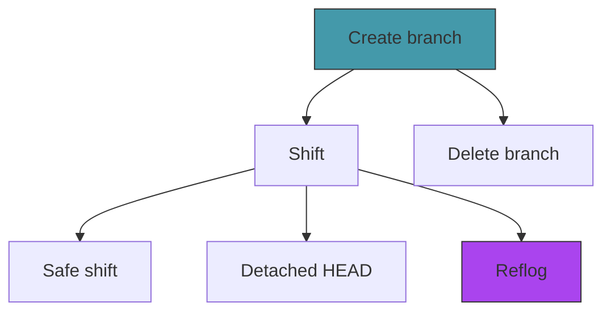

# Act 3 — The Branches

> *A single timeline is a diary. Multiple timelines are power. In this act you learn to fork reality — creating parallel timelines that diverge from a shared past, shifting between them at will, and recovering timelines you thought were lost.*

Branching is where version control becomes genuinely magical. And the secret is almost anticlimactic: a branch is a 41-byte file. Creating one is instant. Switching between them is the hard part — reconstructing the working directory from a different commit's tree. That's what this act is really about.


---

## Stage 16 — Forking a Timeline

> *Creating branches is embarrassingly simple. A branch is a file containing a commit hash. Creating a branch means writing 41 bytes to disk.*

*Difficulty: Easy* | *~40 min*

> [!tip] What You'll Learn
> - Creating a branch (writing a ref file)
> - Listing branches with the current branch highlighted
> - Why branches are "cheap" — no data is copied
> - The difference between creating a branch and switching to it

### 16.1 — Try it yourself: create branch

Add to `src/refs.rs`:

```rust
/// Create a new branch pointing to the given commit.
pub fn create_branch(name: &str, commit_hash: &str) -> std::io::Result<()> {
    // 1. Build path: .chronolock/refs/heads/<name>
    // 2. Check if it already exists → return error
    // 3. Write the commit hash + newline
    todo!()
}
```

<details>
<summary>Solution — click to reveal</summary>

```rust
pub fn create_branch(name: &str, commit_hash: &str) -> std::io::Result<()> {
    let path = Path::new(".chronolock/refs/heads").join(name);
    if path.exists() {
        return Err(std::io::Error::new(
            std::io::ErrorKind::AlreadyExists,
            format!("Branch '{}' already exists", name),
        ));
    }
    fs::write(&path, format!("{}\n", commit_hash))?;
    Ok(())
}
```

</details>

That's the entire implementation. One `fs::write`. A branch is born.

### 16.2 — Wire it up

Update the `Branch` command handler in `main.rs`:

```rust
fn create_branch(name: &str) {
    let head = refs::resolve_head().unwrap_or_else(|e| {
        eprintln!("Failed to read HEAD: {}", e);
        std::process::exit(1);
    });

    let commit = head.unwrap_or_else(|| {
        eprintln!("Cannot create branch: no commits yet.");
        std::process::exit(1);
    });

    refs::create_branch(name, &commit).unwrap_or_else(|e| {
        eprintln!("Failed to create branch: {}", e);
        std::process::exit(1);
    });

    println!("Created branch '{}' at {}", name, &commit[..8]);
}
```

### 16.3 — Test it

```bash
cargo run -- branch feature
```

```
Created branch 'feature' at e5f8a2b4
```

```bash
cargo run -- branch
```

```
  feature
* main
```

```bash
cat .chronolock/refs/heads/feature
```

```
e5f8a2b4...
```

The branch exists, but we're still on `main` — creating a branch doesn't switch to it.

> [!warning] Common Mistake: Assuming branch creation switches to the new branch
> `git branch feature` creates the branch but stays on the current one. `git checkout -b feature` creates *and* switches. We'll build switching next.

### Extend it

Add a `chronolock branch <name> <commit-hash>` variant that creates a branch pointing to a specific commit instead of HEAD. This is useful for creating a branch at an older point in history.

> [!check] Checkpoint
> Create a branch. Verify `chronolock branch` shows both `main` and the new branch, with `*` next to `main`. Stage 16 complete.

---

## Stage 17 — Shifting Realities

> *Switching branches means: read the target commit's tree, compare it against the current working directory, and update files to match. This is the most complex stage in Act 3.*

*Difficulty: Hard* | *~100 min*

> [!tip] What You'll Learn
> - Reconstructing a working directory from a tree object
> - Comparing two trees to determine which files to add, remove, or update
> - Updating HEAD to point to a different branch
> - Why checkout is the most dangerous git command (it overwrites files)

### Why checkout is hard

Creating a branch is one line of code. Checking out a branch requires:

1. Resolve the target branch to a commit hash
2. Read the commit's tree
3. Read the current commit's tree
4. Diff the two trees
5. For each difference: create, delete, or overwrite the file on disk
6. Update HEAD to point to the new branch

Steps 1-4 we've already built. Step 5 is new — we need to *write* to the working directory. Step 6 must happen last (if file operations fail, HEAD should stay unchanged).

### 17.1 — Read a blob's content

Add to `src/object.rs`:

```rust
/// Read a blob object and return its content bytes.
pub fn read_blob_content(hash: &str) -> std::io::Result<Vec<u8>> {
    let obj = read_object(hash)?;
    if obj.obj_type != ObjectType::Blob {
        return Err(std::io::Error::new(
            std::io::ErrorKind::InvalidData,
            format!("Expected blob, got {:?}", obj.obj_type),
        ));
    }
    Ok(obj.content)
}
```

### 17.2 — Try it yourself: the checkout function

Create `src/checkout.rs` (add `mod checkout;` to `main.rs`). Implement `checkout_branch`:

```rust
use crate::{diff, object, refs};
use std::collections::HashMap;
use std::fs;
use std::path::Path;

pub fn checkout_branch(name: &str) -> std::io::Result<()> {
    // 1. Resolve target: branch name → commit hash (or treat as raw hash)
    // 2. Read target commit's tree → flatten → HashMap<path, hash>
    // 3. Read current commit's tree → flatten → HashMap<path, hash>
    // 4. Delete files in current but not in target
    // 5. Create/update files that differ between current and target
    // 6. Update HEAD (symbolic ref for branch, raw hash for detached)
    todo!()
}
```

Hints:
- `refs::read_branch(name)?` returns `Some(hash)` if it's a branch, `None` if not
- `diff::flatten_tree(tree_hash, "")` gives you `Vec<(path, hash)>`
- `object::read_blob_content(hash)?` gets the file content to write
- Delete empty parent directories after removing files
- Update HEAD *last* — if file operations fail, HEAD should stay unchanged

<details>
<summary>Solution — click to reveal</summary>

```rust
pub fn checkout_branch(name: &str) -> std::io::Result<()> {
    let (target_hash, is_branch) = if let Some(hash) = refs::read_branch(name)? {
        (hash, true)
    } else {
        (name.to_string(), false)
    };

    let target_obj = object::read_object(&target_hash)?;
    let target_commit = object::parse_commit(&target_obj.content);
    let target_files = diff::flatten_tree(&target_commit.tree, "")?;
    let target_map: HashMap<String, String> = target_files.into_iter().collect();

    let current_map: HashMap<String, String> = match refs::resolve_head()? {
        Some(hash) => {
            let obj = object::read_object(&hash)?;
            let info = object::parse_commit(&obj.content);
            diff::flatten_tree(&info.tree, "")?.into_iter().collect()
        }
        None => HashMap::new(),
    };

    // Delete files in current but not in target
    for (path, _) in &current_map {
        if !target_map.contains_key(path) {
            let file_path = Path::new(path);
            if file_path.exists() {
                fs::remove_file(file_path)?;
                if let Some(parent) = file_path.parent() {
                    let _ = remove_empty_dirs(parent);
                }
            }
        }
    }

    // Create or update files that differ
    for (path, hash) in &target_map {
        let needs_write = match current_map.get(path) {
            Some(current_hash) => current_hash != hash,
            None => true,
        };
        if needs_write {
            let content = object::read_blob_content(hash)?;
            let file_path = Path::new(path);
            if let Some(parent) = file_path.parent() {
                fs::create_dir_all(parent)?;
            }
            fs::write(file_path, &content)?;
        }
    }

    // Update HEAD last
    if is_branch {
        fs::write(".chronolock/HEAD", format!("ref: refs/heads/{}\n", name))?;
    } else {
        fs::write(".chronolock/HEAD", format!("{}\n", target_hash))?;
    }

    Ok(())
}

fn remove_empty_dirs(dir: &Path) -> std::io::Result<()> {
    if dir == Path::new("") || dir == Path::new(".") {
        return Ok(());
    }
    if dir.is_dir() && dir.read_dir()?.next().is_none() {
        fs::remove_dir(dir)?;
        if let Some(parent) = dir.parent() {
            remove_empty_dirs(parent)?;
        }
    }
    Ok(())
}
```

</details>

### Concept: Ownership and HashMap — into_iter() vs iter()

Notice this line:

```rust
let target_map: HashMap<String, String> = target_files.into_iter().collect();
```

`.into_iter()` *consumes* `target_files` — it takes ownership of each `(String, String)` tuple and moves them into the HashMap. After this line, `target_files` no longer exists.

If you tried to use `target_files` after this, the compiler would stop you:

```
error[E0382]: borrow of moved value: `target_files`
  --> src/checkout.rs:20:20
   |
15 |     let target_map: HashMap<String, String> = target_files.into_iter().collect();
   |                                               ------------ value moved here
...
20 |     println!("{}", target_files.len());
   |                    ^^^^^^^^^^^^ value borrowed here after move
```

This is Rust's ownership system: `into_iter()` moves the data, `iter()` borrows it. We use `into_iter()` here because we don't need `target_files` anymore — the HashMap is a more efficient lookup structure.

**Python comparison:** In Python, `dict(pairs)` copies the data. In Rust, `into_iter().collect()` *moves* it — zero copies, zero allocations beyond the HashMap itself.

### 17.3 — The shift command

```rust
/// Shift to a different branch or commit
Shift {
    target: String,
},
```

```rust
fn shift(target: &str) {
    checkout::checkout_branch(target).unwrap_or_else(|e| {
        eprintln!("Failed to shift: {}", e);
        std::process::exit(1);
    });
    println!("Shifted to '{}'", target);
}
```

### 17.4 — Test it

```bash
cargo run -- branch experiment
cargo run -- shift experiment

cargo run -- branch
# * experiment
#   main

echo "experiment content" > experiment.txt
cargo run -- anchor -m "Add experiment file"

cargo run -- shift main
ls experiment.txt 2>/dev/null || echo "File gone — correct!"

cargo run -- shift experiment
ls experiment.txt
# experiment.txt is back
```

> [!warning] Common Mistake: Updating HEAD before updating files
> If file operations fail halfway through, HEAD would point to the new branch but the working directory would be a mix of old and new files. Always update HEAD last.

> [!warning] Common Mistake: Not cleaning up empty directories
> When you delete the last file in a subdirectory, the empty directory lingers. The `remove_empty_dirs` helper walks up the tree removing empty directories.

### Extend it

Add a `-b` flag to `shift` that creates a new branch *and* switches to it in one step (like `git checkout -b`). It should call `refs::create_branch` then `checkout_branch`.

> [!check] Checkpoint
> Create a branch, switch to it, make a commit, switch back. Verify files from the branch disappear. Switch back and verify they reappear. Stage 17 complete.

---

## Stage 18 — The Safe Shift

> *Right now, `shift` will happily overwrite your uncommitted changes. That's data loss — the one thing a version control system must never cause.*

*Difficulty: Medium* | *~60 min*

> [!tip] What You'll Learn
> - Detecting uncommitted changes before a destructive operation
> - The difference between "safe" and "forced" operations
> - Error handling as user protection
> - Why git sometimes refuses to checkout

### 18.1 — Try it yourself: dirty working directory check

Add to `src/checkout.rs`:

```rust
/// Check if the working directory has uncommitted changes.
pub fn has_uncommitted_changes() -> std::io::Result<bool> {
    todo!()
}
```

Hint: call `diff::diff_working` and check if the result is empty.

<details>
<summary>Solution — click to reveal</summary>

```rust
pub fn has_uncommitted_changes() -> std::io::Result<bool> {
    let diffs = diff::diff_working(std::path::Path::new("."))?;
    Ok(!diffs.is_empty())
}
```

</details>

### 18.2 — Guard the shift command

Update `checkout_branch` to accept a `force` flag:

```rust
pub fn checkout_branch(name: &str, force: bool) -> std::io::Result<()> {
    if !force && has_uncommitted_changes()? {
        return Err(std::io::Error::new(
            std::io::ErrorKind::Other,
            "Uncommitted changes would be overwritten. Anchor your changes first, or use --force.",
        ));
    }

    // ... rest unchanged
}
```

Update the `Shift` subcommand:

```rust
Shift {
    target: String,
    #[arg(short, long)]
    force: bool,
},
```

### 18.3 — Test it

```bash
echo "unsaved work" >> README.md

cargo run -- shift experiment
```

```
Cannot shift: Uncommitted changes would be overwritten. Anchor your changes first, or use --force.
```

```bash
cargo run -- shift experiment --force
```

```
Shifted to 'experiment'
```

> [!note] The philosophy of safety
> Git's approach is conservative: refuse the operation and explain why. The user can always override with `--force`, but they have to be explicit about accepting the risk. This is better than silently losing data.

### Extend it

Instead of a blanket refusal, check whether the uncommitted changes *conflict* with the checkout. If the changed files aren't affected by the branch switch, allow it (this is what real git does). You'll need to intersect the set of changed files with the set of files that differ between the two trees.

> [!check] Checkpoint
> Make an uncommitted change, try to shift, verify it's refused. Use `--force` to override. Stage 18 complete.

---

## Stage 19 — Detached Time

> *Sometimes you want to look at a specific moment in history without being on any branch. Checking out a commit hash directly puts you in detached HEAD state.*

*Difficulty: Medium* | *~50 min*

> [!tip] What You'll Learn
> - Detached HEAD — what it means and when it's useful
> - Writing a raw hash to HEAD instead of a symbolic ref
> - Warning the user about the implications

### 19.1 — Detect and handle detached HEAD

Our `checkout_branch` already handles this — if the target isn't a branch name, it writes the hash directly to HEAD. But we should warn the user.

Try it yourself: update the `shift` handler to detect detached HEAD after checkout and print a warning.

```rust
fn shift(target: &str, force: bool) {
    checkout::checkout_branch(target, force).unwrap_or_else(|e| {
        eprintln!("Cannot shift: {}", e);
        std::process::exit(1);
    });

    // Check if we ended up detached — print appropriate message
    // Hint: refs::current_branch() returns None when detached
    todo!()
}
```

<details>
<summary>Solution — click to reveal</summary>

```rust
fn shift(target: &str, force: bool) {
    checkout::checkout_branch(target, force).unwrap_or_else(|e| {
        eprintln!("Cannot shift: {}", e);
        std::process::exit(1);
    });

    match refs::current_branch() {
        Ok(Some(branch)) => println!("Shifted to branch '{}'", branch),
        Ok(None) => {
            println!("Note: you are in 'detached HEAD' state.");
            println!("You are not on any branch. Commits made here will be lost");
            println!("unless you create a branch to save them:");
            println!();
            println!("  chronolock branch <new-branch-name>");
            println!();
            println!("HEAD is now at {}", target);
        }
        Err(_) => println!("Shifted to '{}'", target),
    }
}
```

</details>

### 19.2 — Test it

```bash
cargo run -- log
# Note a commit hash

cargo run -- shift <commit-hash> --force
```

```
Note: you are in 'detached HEAD' state.
...
```

```bash
cargo run -- status
# HEAD detached at a3b7c9d

cargo run -- branch
# No * next to any branch
```

> [!warning] Common Mistake: Panicking about detached HEAD
> It's not an error — it's a feature. Detached HEAD is useful for inspecting old commits or experimenting. Just remember to create a branch if you want to keep your work.

### Extend it

Make a commit in detached state, then shift back to `main`. The detached commit is now a ghost — nothing points to it. Verify you can still access it with `chronolock reveal <hash>` if you remember the hash.

> [!check] Checkpoint
> Check out a commit hash directly. Verify `status` shows "HEAD detached." Shift back to a branch and verify normal state is restored. Stage 19 complete.

---

## Stage 20 — Deleting Timelines

> *Branches accumulate. After a feature is merged or an experiment is abandoned, the branch pointer is just clutter.*

*Difficulty: Easy* | *~40 min*

> [!tip] What You'll Learn
> - Safe vs force deletion
> - Checking if a commit is reachable from another branch
> - Preventing deletion of the current branch

### 20.1 — Try it yourself: branch deletion

Add to `src/refs.rs`:

```rust
pub fn delete_branch(name: &str, force: bool) -> std::io::Result<()> {
    // 1. Refuse if it's the current branch
    // 2. Check the branch file exists
    // 3. If not force: check if the branch tip is reachable from HEAD (is_ancestor)
    // 4. Delete the file
    todo!()
}
```

You'll also need a helper to walk the commit chain checking ancestry:

```rust
fn is_ancestor(ancestor: &str, descendant: &str) -> std::io::Result<bool> {
    // Walk from descendant back through parents. If we hit ancestor, return true.
    todo!()
}
```

<details>
<summary>Solution — click to reveal</summary>

```rust
pub fn delete_branch(name: &str, force: bool) -> std::io::Result<()> {
    if let Some(current) = current_branch()? {
        if current == name {
            return Err(std::io::Error::new(
                std::io::ErrorKind::Other,
                format!("Cannot delete branch '{}': it is the current branch", name),
            ));
        }
    }

    let path = Path::new(".chronolock/refs/heads").join(name);
    if !path.exists() {
        return Err(std::io::Error::new(
            std::io::ErrorKind::NotFound,
            format!("Branch '{}' not found", name),
        ));
    }

    if !force {
        let branch_hash = fs::read_to_string(&path)?.trim().to_string();
        if !is_ancestor(&branch_hash, &resolve_head()?.unwrap_or_default())? {
            return Err(std::io::Error::new(
                std::io::ErrorKind::Other,
                format!("Branch '{}' is not fully merged. Use --force to delete anyway.", name),
            ));
        }
    }

    fs::remove_file(&path)?;
    Ok(())
}

fn is_ancestor(ancestor: &str, descendant: &str) -> std::io::Result<bool> {
    let mut current = Some(descendant.to_string());
    while let Some(hash) = current {
        if hash == ancestor {
            return Ok(true);
        }
        let obj = crate::object::read_object(&hash)?;
        let info = crate::object::parse_commit(&obj.content);
        current = info.parent;
    }
    Ok(false)
}
```

</details>

### 20.2 — Wire it up

Add delete/force flags to the `Branch` command:

```rust
Branch {
    name: Option<String>,
    #[arg(short, long)]
    delete: bool,
    #[arg(long)]
    force: bool,
},
```

### 20.3 — Test it

```bash
cargo run -- branch -d experiment   # delete merged branch
cargo run -- branch -d main         # refused: current branch
cargo run -- branch -d unmerged     # refused: not merged
cargo run -- branch -d --force unmerged  # forced delete
```

> [!note] Commits survive branch deletion
> Deleting a branch removes the pointer, not the commits. If you know the commit hash, you can still access it. The reflog (next stage) records these hashes for recovery.

### Extend it

Add a `--all` flag that lists branches with their merge status: `merged` or `not merged` relative to HEAD. Like `git branch --merged` / `--no-merged`.

> [!check] Checkpoint
> Delete a merged branch. Verify deletion of the current branch is refused. Verify unmerged deletion requires `--force`. Stage 20 complete.

---

## Stage 21 — The Echo Memory

> *Every time HEAD moves, the old position is lost. The reflog records every HEAD movement so you can always find your way back.*

*Difficulty: Medium* | *~60 min*

> [!tip] What You'll Learn
> - Append-only log files
> - Recording HEAD movements with timestamps
> - Recovering "lost" commits

### 21.1 — Try it yourself: the reflog module

Create `src/reflog.rs` (add `mod reflog;` to `main.rs`). Implement:

```rust
/// Append an entry to the reflog.
pub fn record(old_hash: &str, new_hash: &str, action: &str) -> std::io::Result<()> {
    // Append a line to .chronolock/logs/HEAD:
    // "<old> <new> Chronomancer <email> <timestamp> <tz> <action>\n"
    todo!()
}

pub struct ReflogEntry {
    pub old_hash: String,
    pub new_hash: String,
    pub action: String,
}

/// Read all reflog entries, newest first.
pub fn read_reflog() -> std::io::Result<Vec<ReflogEntry>> {
    todo!()
}
```

Hints:
- Use `OpenOptions::new().create(true).append(true).open(path)?` for append-only writing
- `chrono::Local::now()` for timestamps
- Parse by splitting each line with `splitn(5, ' ')`

<details>
<summary>Solution — click to reveal</summary>

```rust
use chrono::Local;
use std::fs::{self, OpenOptions};
use std::io::Write;

pub fn record(old_hash: &str, new_hash: &str, action: &str) -> std::io::Result<()> {
    let log_dir = std::path::Path::new(".chronolock/logs");
    fs::create_dir_all(log_dir)?;

    let now = Local::now();
    let entry = format!(
        "{} {} Chronomancer <chrono@chronolock> {} {} {}\n",
        old_hash, new_hash, now.timestamp(), now.format("%z"), action
    );

    let mut file = OpenOptions::new()
        .create(true)
        .append(true)
        .open(log_dir.join("HEAD"))?;
    file.write_all(entry.as_bytes())
}

pub struct ReflogEntry {
    pub old_hash: String,
    pub new_hash: String,
    pub action: String,
}

pub fn read_reflog() -> std::io::Result<Vec<ReflogEntry>> {
    let path = std::path::Path::new(".chronolock/logs/HEAD");
    if !path.exists() {
        return Ok(Vec::new());
    }

    let content = fs::read_to_string(path)?;
    let mut entries: Vec<ReflogEntry> = content
        .lines()
        .filter(|l| !l.is_empty())
        .filter_map(|line| {
            let parts: Vec<&str> = line.splitn(5, ' ').collect();
            if parts.len() >= 5 {
                Some(ReflogEntry {
                    old_hash: parts[0].to_string(),
                    new_hash: parts[1].to_string(),
                    action: parts[4..].join(" "),
                })
            } else {
                None
            }
        })
        .collect();

    entries.reverse();
    Ok(entries)
}
```

</details>

### 21.2 — Add tests

```rust
#[cfg(test)]
mod tests {
    use super::*;

    #[test]
    fn test_reflog_entry_parsing() {
        // Simulate a reflog line
        let line = "aaa bbb Chronomancer <c@c> 1000 +0000 anchor: test";
        let parts: Vec<&str> = line.splitn(5, ' ').collect();
        assert_eq!(parts[0], "aaa");
        assert_eq!(parts[1], "bbb");
        assert!(parts[4].contains("anchor: test"));
    }
}
```

### 21.3 — Record events in anchor and shift

In `anchor`, after `update_head`:

```rust
let old = parent.as_deref().unwrap_or("0000000000000000000000000000000000000000");
reflog::record(old, &commit_hash, &format!("anchor: {}", message))
    .unwrap_or_else(|e| eprintln!("Warning: reflog: {}", e));
```

In `checkout_branch`, before the final `Ok(())`:

```rust
let old = refs::resolve_head()?.unwrap_or_else(|| "0".repeat(40));
reflog::record(&old, &target_hash, &format!("shift: moving to {}", name))?;
```

### 21.4 — The echo command

```rust
/// Show the reflog — every HEAD movement
Echo,
```

```rust
fn echo_reflog() {
    let entries = reflog::read_reflog().unwrap_or_else(|e| {
        eprintln!("Failed to read reflog: {}", e);
        std::process::exit(1);
    });

    if entries.is_empty() {
        println!("No echoes yet.");
        return;
    }

    for (i, entry) in entries.iter().enumerate() {
        println!("{} {} {}",
            format!("HEAD@{{{}}}", i).yellow(),
            &entry.new_hash[..8.min(entry.new_hash.len())],
            entry.action,
        );
    }
}
```

### 21.5 — Test it

```bash
cargo run -- anchor -m "Test"
cargo run -- shift main
cargo run -- echo
```

```
HEAD@{0} e5f8a2b4 shift: moving to main
HEAD@{1} a1b2c3d4 anchor: Test
```

### Extend it

Add a `chronolock echo <n>` variant that shows only the last `n` entries. Default to showing all.

> [!check] Checkpoint
> Make several commits and branch switches. Run `chronolock echo` and verify every HEAD movement is recorded. Stage 21 complete.

---

## Act 3 Complete — The Branches



The Chronolock now supports parallel timelines:

- **Create** branches instantly (41-byte files)
- **Shift** between branches (reconstruct working directory)
- **Protect** uncommitted work (refuse unsafe shifts)
- **Visit** any moment in history (detached HEAD)
- **Delete** branches safely (with merge checks)
- **Recover** from mistakes (reflog)

| Rust Concept | Where You Used It |
|-------------|-------------------|
| `into_iter()` vs `iter()` | Consuming vs borrowing collections in checkout |
| `HashMap` ownership | Moving data into lookup maps |
| Error as user protection | Force flags, safety checks |
| `OpenOptions` append mode | Reflog file |
| `splitn` | Parsing reflog entries |

**Next up — Act 4: The Convergence.** Two timelines become one. Three-way merge, conflict detection, and conflict resolution.
