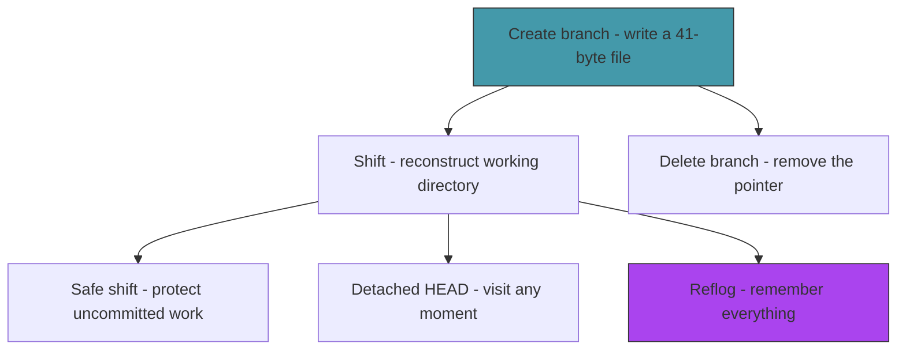

# Act 3 — The Branches

> *A single timeline is a diary. Multiple timelines are power. In this act you learn to fork reality — creating parallel timelines that diverge from a shared past, shifting between them at will, and recovering timelines you thought were lost.*

Branching is where version control becomes genuinely magical. And the secret is almost anticlimactic: a branch is a 41-byte file. Creating one is instant. Switching between them is the hard part — reconstructing the working directory from a different commit's tree. That's what this act is really about.


---

## Stage 16 — Forking a Timeline

> *Difficulty: Easy — Creating branches is embarrassingly simple.*

Right now we have one branch — `main`. If we want to experiment without risking our stable timeline, we need a way to fork. You might expect branching to involve copying commits or duplicating data. It doesn't. A branch is a file containing a commit hash. Creating a branch means writing 41 bytes to disk. That's it.

> [!tip] What You'll Learn
> - Creating a branch (writing a ref file)
> - Listing branches with the current branch highlighted
> - Why branches are "cheap" — no data is copied
> - The difference between creating a branch and switching to it

### 16.1 — Create branch

Add to `src/refs.rs`:

```rust
/// Create a new branch pointing to the given commit.
pub fn create_branch(name: &str, commit_hash: &str) -> std::io::Result<()> {
    let path = Path::new(".chronolock/refs/heads").join(name);
    if path.exists() {
        return Err(std::io::Error::new(
            std::io::ErrorKind::AlreadyExists,
            format!("Branch '{}' already exists", name),
        ));
    }
    fs::write(&path, format!("{}\n", commit_hash))?;
    Ok(())
}
```

That's the entire implementation. One `fs::write`. A branch is born.

### 16.2 — Update the branch command

Replace the placeholder in `main.rs`:

```rust
Commands::Branch { name } => {
    match name {
        Some(branch_name) => create_branch(&branch_name),
        None => list_branches(),
    }
}
```

```rust
fn create_branch(name: &str) {
    let head = refs::resolve_head().unwrap_or_else(|e| {
        eprintln!("Failed to read HEAD: {}", e);
        std::process::exit(1);
    });

    let commit = head.unwrap_or_else(|| {
        eprintln!("Cannot create branch: no commits yet.");
        std::process::exit(1);
    });

    refs::create_branch(name, &commit).unwrap_or_else(|e| {
        eprintln!("Failed to create branch: {}", e);
        std::process::exit(1);
    });

    println!("Created branch '{}' at {}", name, &commit[..8]);
}
```

### 16.3 — Test it

```bash
cargo run -- branch feature
```

```
Created branch 'feature' at e5f8a2b4
```

```bash
cargo run -- branch
```

```
  feature
* main
```

```bash
# Verify it's just a file
cat .chronolock/refs/heads/feature
```

```
e5f8a2b4...
```

The branch exists, but we're still on `main` — creating a branch doesn't switch to it. HEAD still says `ref: refs/heads/main`. The branch is a bookmark pointing to the same commit as `main`.

> [!warning] Common Mistake
> **Assuming branch creation switches to the new branch.** `git branch feature` creates the branch but stays on the current one. `git checkout -b feature` creates *and* switches. We'll build switching next.

We can create branches, but we can't switch to them. A branch you can't visit is just a label. Next stage, we'll build the `shift` command — the hardest stage in this act — which reconstructs the working directory from a different commit's tree.

> [!check] Checkpoint
> Create a branch with `chronolock branch feature`. Verify `chronolock branch` shows both `main` and `feature`, with `*` next to `main`. Verify `.chronolock/refs/heads/feature` contains a commit hash. Stage 16 complete.

---

## Stage 17 — Shifting Realities

> *Difficulty: Hard — Reconstructing the working directory from a commit.*

This is the most complex stage in Act 3. Switching branches means: read the target commit's tree, compare it against the current working directory, and update files to match. Files that exist in the target but not the current tree need to be created. Files that exist in the current tree but not the target need to be deleted. Files that differ need to be overwritten. And HEAD needs to be updated to point to the new branch.

> [!tip] What You'll Learn
> - Reconstructing a working directory from a tree object
> - Comparing two trees to determine which files to add, remove, or update
> - Updating HEAD to point to a different branch
> - Why checkout is the most dangerous git command (it overwrites files)

### Why checkout is hard

Creating a branch is one line of code. Checking out a branch requires:

1. Resolve the target branch to a commit hash
2. Read the commit's tree
3. Read the current commit's tree
4. Diff the two trees
5. For each difference: create, delete, or overwrite the file on disk
6. Update HEAD to point to the new branch

Steps 1-4 we've already built. Step 5 is new — we need to *write* to the working directory, not just read from it. Step 6 is a one-liner, but it must happen last (if file operations fail, HEAD should stay unchanged).

### 17.1 — Read a blob's content

We need a helper that reads a blob and returns its raw content. Add to `src/object.rs`:

```rust
/// Read a blob object and return its content bytes.
pub fn read_blob_content(hash: &str) -> std::io::Result<Vec<u8>> {
    let obj = read_object(hash)?;
    if obj.obj_type != ObjectType::Blob {
        return Err(std::io::Error::new(
            std::io::ErrorKind::InvalidData,
            format!("Expected blob, got {:?}", obj.obj_type),
        ));
    }
    Ok(obj.content)
}
```

### 17.2 — The checkout function

Create `src/checkout.rs`:

```rust
use crate::{diff, object, refs};
use std::collections::HashMap;
use std::fs;
use std::path::Path;

/// Switch to a branch or commit.
/// Updates the working directory to match the target tree.
pub fn checkout_branch(name: &str) -> std::io::Result<()> {
    // Resolve the target: is it a branch name or a commit hash?
    let (target_hash, is_branch) = if let Some(hash) = refs::read_branch(name)? {
        (hash, true)
    } else {
        // Might be a raw commit hash
        (name.to_string(), false)
    };

    // Read the target commit's tree
    let target_obj = object::read_object(&target_hash)?;
    let target_commit = object::parse_commit(&target_obj.content);
    let target_files = diff::flatten_tree(&target_commit.tree, "")?;
    let target_map: HashMap<String, String> = target_files.into_iter().collect();

    // Read the current commit's tree (if any)
    let current_map: HashMap<String, String> = match refs::resolve_head()? {
        Some(hash) => {
            let obj = object::read_object(&hash)?;
            let info = object::parse_commit(&obj.content);
            diff::flatten_tree(&info.tree, "")?.into_iter().collect()
        }
        None => HashMap::new(),
    };

    // Apply changes to the working directory
    // 1. Delete files that exist in current but not in target
    for (path, _) in &current_map {
        if !target_map.contains_key(path) {
            let file_path = Path::new(path);
            if file_path.exists() {
                fs::remove_file(file_path)?;
                // Clean up empty parent directories
                if let Some(parent) = file_path.parent() {
                    let _ = remove_empty_dirs(parent);
                }
            }
        }
    }

    // 2. Create or update files that differ
    for (path, hash) in &target_map {
        let needs_write = match current_map.get(path) {
            Some(current_hash) => current_hash != hash, // modified
            None => true, // new file
        };

        if needs_write {
            let content = object::read_blob_content(hash)?;
            let file_path = Path::new(path);
            if let Some(parent) = file_path.parent() {
                fs::create_dir_all(parent)?;
            }
            fs::write(file_path, &content)?;
        }
    }

    // 3. Update HEAD
    if is_branch {
        fs::write(".chronolock/HEAD", format!("ref: refs/heads/{}\n", name))?;
    } else {
        fs::write(".chronolock/HEAD", format!("{}\n", target_hash))?;
    }

    Ok(())
}

/// Remove empty directories up the tree.
fn remove_empty_dirs(dir: &Path) -> std::io::Result<()> {
    if dir == Path::new("") || dir == Path::new(".") {
        return Ok(());
    }
    if dir.is_dir() && dir.read_dir()?.next().is_none() {
        fs::remove_dir(dir)?;
        if let Some(parent) = dir.parent() {
            remove_empty_dirs(parent)?;
        }
    }
    Ok(())
}
```

This is the most code-heavy stage so far. Let's trace through what happens when you switch from `main` to `feature`:

1. Resolve `feature` → commit hash `abc123`
2. Read commit `abc123` → tree hash `def456`
3. Flatten tree `def456` → `[("README.md", "aaa"), ("src/main.rs", "bbb")]`
4. Flatten current tree → `[("README.md", "aaa"), ("src/main.rs", "ccc"), ("old.txt", "ddd")]`
5. Delete `old.txt` (in current but not in target)
6. Update `src/main.rs` (hash differs)
7. Skip `README.md` (hash matches)
8. Write `ref: refs/heads/feature\n` to HEAD

### 17.3 — The shift command

Add `mod checkout;` to `main.rs`. Add the subcommand:

```rust
/// Shift to a different branch or commit
Shift {
    /// Branch name or commit hash
    target: String,
},
```

```rust
Commands::Shift { target } => shift(&target),
```

```rust
fn shift(target: &str) {
    checkout::checkout_branch(target).unwrap_or_else(|e| {
        eprintln!("Failed to shift: {}", e);
        std::process::exit(1);
    });
    println!("Shifted to '{}'", target);
}
```

### 17.4 — Test it

```bash
# Make sure we have divergent branches
cargo run -- branch
# * main

# Create a branch and switch to it
cargo run -- branch experiment
cargo run -- shift experiment

cargo run -- branch
# * experiment
#   main

# Make a change on experiment
echo "experiment content" > experiment.txt
cargo run -- anchor -m "Add experiment file"

# Switch back to main
cargo run -- shift main

# experiment.txt should be gone
ls experiment.txt 2>/dev/null || echo "File gone — correct!"

# Switch back to experiment
cargo run -- shift experiment
ls experiment.txt
# experiment.txt is back
```

The working directory transforms to match whichever branch you're on. Files appear and disappear as you shift between timelines.

> [!warning] Common Mistake
> **Updating HEAD before updating files.** If file operations fail halfway through, HEAD would point to the new branch but the working directory would be a mix of old and new files. Always update HEAD last.

> [!warning] Common Mistake
> **Not cleaning up empty directories.** When you delete the last file in a subdirectory, the empty directory lingers. The `remove_empty_dirs` helper walks up the tree removing empty directories.

We can switch branches, but there's a dangerous edge case — what if you have uncommitted changes? Checkout would silently overwrite them. Next stage, we'll add safety checks.

> [!check] Checkpoint
> Create a branch, switch to it, make a commit, switch back. Verify files from the branch disappear. Switch back to the branch and verify they reappear. Stage 17 complete.

---

## Stage 18 — The Safe Shift

> *Difficulty: Medium — Protecting uncommitted work from checkout.*

Right now, `shift` will happily overwrite your uncommitted changes. Edit a file, switch branches, and your edits vanish without warning. That's data loss — the one thing a version control system must never cause. This stage adds a safety check: refuse to shift if the working directory has uncommitted changes that would be overwritten.

> [!tip] What You'll Learn
> - Detecting uncommitted changes before a destructive operation
> - The difference between "safe" and "forced" operations
> - Error handling as user protection
> - Why git sometimes refuses to checkout (and when `--force` is appropriate)

### 18.1 — Check for dirty working directory

Add to `src/checkout.rs`:

```rust
/// Check if the working directory has uncommitted changes.
pub fn has_uncommitted_changes() -> std::io::Result<bool> {
    let diffs = diff::diff_working(std::path::Path::new("."))?;
    Ok(!diffs.is_empty())
}
```

### 18.2 — Guard the shift command

Update `checkout_branch` to check before proceeding:

```rust
pub fn checkout_branch(name: &str, force: bool) -> std::io::Result<()> {
    // Safety check: refuse if there are uncommitted changes
    if !force && has_uncommitted_changes()? {
        return Err(std::io::Error::new(
            std::io::ErrorKind::Other,
            "Uncommitted changes would be overwritten. Anchor your changes first, or use --force.",
        ));
    }

    // ... rest of the function unchanged
```

Update the `Shift` subcommand:

```rust
Shift {
    target: String,
    /// Force shift even with uncommitted changes
    #[arg(short, long)]
    force: bool,
},
```

```rust
Commands::Shift { target, force } => {
    checkout::checkout_branch(&target, force).unwrap_or_else(|e| {
        eprintln!("Cannot shift: {}", e);
        std::process::exit(1);
    });
    println!("Shifted to '{}'", target);
}
```

### 18.3 — Test it

```bash
# Make an uncommitted change
echo "unsaved work" >> README.md

# Try to shift
cargo run -- shift experiment
```

```
Cannot shift: Uncommitted changes would be overwritten. Anchor your changes first, or use --force.
```

```bash
# Force it (accepting the loss)
cargo run -- shift experiment --force
```

```
Shifted to 'experiment'
```

```bash
# Or commit first, then shift safely
cargo run -- shift main --force
echo "saved work" >> README.md
cargo run -- anchor -m "Save work"
cargo run -- shift experiment  # works without --force
```

> [!note] The philosophy of safety
> Git's approach is conservative: refuse the operation and explain why. The user can always override with `--force`, but they have to be explicit about accepting the risk. This is better than silently losing data and better than asking "are you sure?" (which everyone clicks through without reading).

We can shift safely between branches. But what happens when you check out a specific commit instead of a branch name? Next stage, we'll handle detached HEAD — the state where you're not on any branch.

> [!check] Checkpoint
> Make an uncommitted change, try to shift, and verify it's refused. Use `--force` to override. Commit first and verify shift works without `--force`. Stage 18 complete.

---

## Stage 19 — Detached Time

> *Difficulty: Medium — Checking out a commit directly, without a branch.*

Sometimes you want to look at a specific moment in history without being on any branch. Maybe you're investigating a bug introduced three commits ago, or you want to see what the project looked like last week. Checking out a commit hash directly puts you in **detached HEAD** state — HEAD points to a commit, not a branch. Commits you make here aren't on any timeline and will be lost unless you create a branch to save them.

> [!tip] What You'll Learn
> - Detached HEAD — what it means and when it's useful
> - Writing a raw hash to HEAD instead of a symbolic ref
> - Warning the user about the implications
> - Why detached commits become "dangling" (and how the reflog saves them)

### 19.1 — Detect and handle detached HEAD

Our `checkout_branch` function already handles this — if the target isn't a branch name, it writes the hash directly to HEAD. But we should warn the user:

Update the `shift` handler in `main.rs`:

```rust
fn shift(target: &str, force: bool) {
    checkout::checkout_branch(target, force).unwrap_or_else(|e| {
        eprintln!("Cannot shift: {}", e);
        std::process::exit(1);
    });

    // Check if we ended up in detached HEAD
    match refs::current_branch() {
        Ok(Some(branch)) => println!("Shifted to branch '{}'", branch),
        Ok(None) => {
            println!("Note: you are in 'detached HEAD' state.");
            println!("You are not on any branch. Commits made here will be lost");
            println!("unless you create a branch to save them:");
            println!();
            println!("  chronolock branch <new-branch-name>");
            println!();
            println!("HEAD is now at {}", target);
        }
        Err(_) => println!("Shifted to '{}'", target),
    }
}
```

### 19.2 — Update status for detached HEAD

The `status` function already handles this — it shows "HEAD detached at" when `current_branch()` returns `None`. Verify it works:

```bash
# Get a commit hash from log
cargo run -- log
# Note a commit hash

# Check out the commit directly
cargo run -- shift <commit-hash> --force
```

```
Note: you are in 'detached HEAD' state.
You are not on any branch. Commits made here will be lost
unless you create a branch to save them:

  chronolock branch <new-branch-name>

HEAD is now at a3b7c9d1
```

```bash
cargo run -- status
```

```
HEAD detached at a3b7c9d
...
```

```bash
cargo run -- branch
```

```
  experiment
  main
```

No `*` next to any branch — you're not on one.

### 19.3 — Making commits in detached state

Commits in detached HEAD state work normally — `anchor` creates a commit and updates HEAD to point to it. But since HEAD isn't pointing to a branch, no branch advances. The commit exists in the object store but nothing references it except HEAD. If you shift to a branch, HEAD moves and the commit becomes **dangling** — it exists but nothing points to it.

```bash
# In detached state, make a commit
echo "detached work" > detached.txt
cargo run -- anchor -m "Detached experiment"

# Now shift back to main
cargo run -- shift main --force

# The detached commit still exists in the object store,
# but nothing points to it. It's a ghost in the timeline.
```

We'll build the reflog in Stage 21 to recover these ghosts.

> [!warning] Common Mistake
> **Panicking about detached HEAD.** It's not an error — it's a feature. Detached HEAD is useful for inspecting old commits, running tests against a specific version, or experimenting without affecting any branch. Just remember to create a branch if you want to keep your work.

We can visit any point in history. But branches accumulate — experiments that went nowhere, features that got merged. Next stage, we'll add branch deletion with safety checks.

> [!check] Checkpoint
> Check out a commit hash directly. Verify `status` shows "HEAD detached." Verify `branch` shows no `*`. Shift back to a branch and verify normal state is restored. Stage 19 complete.

---

## Stage 20 — Deleting Timelines

> *Difficulty: Easy — Removing branches with safety checks.*

Branches accumulate. After a feature is merged or an experiment is abandoned, the branch pointer is just clutter. Deleting it is simple — remove the file from `refs/heads/`. But we need a safety check: don't delete a branch whose commits aren't reachable from another branch, or the user will lose work.

> [!tip] What You'll Learn
> - Safe vs force deletion
> - Checking if a commit is reachable from another branch
> - Preventing deletion of the current branch
> - Why "deleting a branch" doesn't delete any commits

### 20.1 — Branch deletion

Add to `src/refs.rs`:

```rust
/// Delete a branch. Returns an error if it's the current branch.
pub fn delete_branch(name: &str, force: bool) -> std::io::Result<()> {
    // Can't delete the current branch
    if let Some(current) = current_branch()? {
        if current == name {
            return Err(std::io::Error::new(
                std::io::ErrorKind::Other,
                format!("Cannot delete branch '{}': it is the current branch", name),
            ));
        }
    }

    let path = Path::new(".chronolock/refs/heads").join(name);
    if !path.exists() {
        return Err(std::io::Error::new(
            std::io::ErrorKind::NotFound,
            format!("Branch '{}' not found", name),
        ));
    }

    if !force {
        // Safety check: is the branch's tip reachable from HEAD?
        let branch_hash = fs::read_to_string(&path)?.trim().to_string();
        if !is_ancestor(&branch_hash, &resolve_head()?.unwrap_or_default())? {
            return Err(std::io::Error::new(
                std::io::ErrorKind::Other,
                format!(
                    "Branch '{}' is not fully merged. Use --force to delete anyway.",
                    name
                ),
            ));
        }
    }

    fs::remove_file(&path)?;
    Ok(())
}

/// Check if `ancestor` is reachable by walking back from `descendant`.
fn is_ancestor(ancestor: &str, descendant: &str) -> std::io::Result<bool> {
    let mut current = Some(descendant.to_string());
    while let Some(hash) = current {
        if hash == ancestor {
            return Ok(true);
        }
        let obj = crate::object::read_object(&hash)?;
        let info = crate::object::parse_commit(&obj.content);
        current = info.parent;
    }
    Ok(false)
}
```

**Why the safety check?** Deleting a branch only removes the pointer — the commits still exist in the object store. But without a branch pointing to them, they become unreachable. `git gc` (or our future `chronolock pack`) would eventually clean them up. The safety check ensures you don't accidentally lose a line of work.

### 20.2 — Wire it up

Add a delete flag to the `Branch` command:

```rust
Branch {
    name: Option<String>,
    /// Delete the branch
    #[arg(short, long)]
    delete: bool,
    /// Force delete even if not merged
    #[arg(long)]
    force: bool,
},
```

```rust
Commands::Branch { name, delete, force } => {
    match (name, delete) {
        (Some(branch_name), true) => {
            refs::delete_branch(&branch_name, force).unwrap_or_else(|e| {
                eprintln!("{}", e);
                std::process::exit(1);
            });
            println!("Deleted branch '{}'", branch_name);
        }
        (Some(branch_name), false) => create_branch(&branch_name),
        (None, _) => list_branches(),
    }
}
```

### 20.3 — Test it

```bash
# Delete a merged branch
cargo run -- branch -d experiment
```

```
Deleted branch 'experiment'
```

```bash
# Try to delete current branch
cargo run -- branch -d main
```

```
Cannot delete branch 'main': it is the current branch
```

```bash
# Try to delete unmerged branch
cargo run -- branch unmerged
cargo run -- shift unmerged
echo "unmerged work" > unmerged.txt
cargo run -- anchor -m "Unmerged work"
cargo run -- shift main
cargo run -- branch -d unmerged
```

```
Branch 'unmerged' is not fully merged. Use --force to delete anyway.
```

> [!note] Commits survive branch deletion
> Deleting a branch removes the pointer, not the commits. If you know the commit hash, you can still access it with `chronolock reveal <hash>`. The reflog (next stage) records these hashes so you can recover.

We can create, switch, and delete branches. But what about mistakes? What if you delete a branch and realize you needed it? What if you shift away from a detached commit? Next stage, we'll build the reflog — a safety net that remembers every HEAD movement.

> [!check] Checkpoint
> Delete a merged branch. Verify deletion of the current branch is refused. Verify deletion of an unmerged branch requires `--force`. Stage 20 complete.

---

## Stage 21 — The Echo Memory

> *Difficulty: Medium — The reflog that remembers everything.*

Every time HEAD moves — a commit, a branch switch, a checkout — the old position is lost. If you accidentally delete a branch or shift away from a detached commit, the work seems gone. But the commits still exist in the object store. The problem is finding them. The reflog solves this: it records every HEAD movement with a timestamp, so you can always find your way back.

> [!tip] What You'll Learn
> - Append-only log files
> - Recording HEAD movements with timestamps
> - Recovering "lost" commits
> - Why `git reflog` is the ultimate safety net

### Why the reflog matters

The reflog is git's undo history. Every time HEAD changes, a line is appended:

```
<old-hash> <new-hash> <author> <timestamp> <action>: <description>
```

Even if no branch points to a commit, the reflog remembers it was once HEAD. You can recover any commit that was HEAD within the reflog's retention period (default: 90 days in git).

### 21.1 — Recording HEAD movements

Create `src/reflog.rs`:

```rust
use chrono::Local;
use std::fs::{self, OpenOptions};
use std::io::Write;

/// Append an entry to the reflog.
pub fn record(old_hash: &str, new_hash: &str, action: &str) -> std::io::Result<()> {
    let log_dir = std::path::Path::new(".chronolock/logs");
    fs::create_dir_all(log_dir)?;

    let now = Local::now();
    let timestamp = now.timestamp();
    let tz = now.format("%z");

    let entry = format!(
        "{} {} Chronomancer <chrono@chronolock> {} {} {}\n",
        old_hash, new_hash, timestamp, tz, action
    );

    let mut file = OpenOptions::new()
        .create(true)
        .append(true)
        .open(log_dir.join("HEAD"))?;

    file.write_all(entry.as_bytes())?;
    Ok(())
}

/// A parsed reflog entry.
pub struct ReflogEntry {
    pub old_hash: String,
    pub new_hash: String,
    pub action: String,
    pub timestamp: String,
}

/// Read all reflog entries, newest first.
pub fn read_reflog() -> std::io::Result<Vec<ReflogEntry>> {
    let path = std::path::Path::new(".chronolock/logs/HEAD");
    if !path.exists() {
        return Ok(Vec::new());
    }

    let content = fs::read_to_string(path)?;
    let mut entries: Vec<ReflogEntry> = content
        .lines()
        .filter(|l| !l.is_empty())
        .filter_map(|line| {
            let parts: Vec<&str> = line.splitn(5, ' ').collect();
            if parts.len() >= 5 {
                Some(ReflogEntry {
                    old_hash: parts[0].to_string(),
                    new_hash: parts[1].to_string(),
                    timestamp: format!("{} {}", parts[2], parts[3]),
                    action: parts[4..].join(" "),
                })
            } else {
                None
            }
        })
        .collect();

    entries.reverse(); // newest first
    Ok(entries)
}
```

### 21.2 — Record events in anchor and shift

Add `mod reflog;` to `main.rs`. Then add recording calls:

In the `anchor` function, after `update_head`:

```rust
let old_hash = parent.as_deref().unwrap_or("0000000000000000000000000000000000000000");
reflog::record(old_hash, &commit_hash, &format!("anchor: {}", message))
    .unwrap_or_else(|e| eprintln!("Warning: failed to update reflog: {}", e));
```

In `checkout_branch`, before the `Ok(())` at the end:

```rust
let old_hash = refs::resolve_head()?.unwrap_or_else(|| "0".repeat(40));
reflog::record(&old_hash, &target_hash, &format!("shift: moving to {}", name))?;
```

### 21.3 — The echo command

Add the subcommand:

```rust
/// Show the reflog — every HEAD movement
Echo,
```

```rust
Commands::Echo => echo_reflog(),
```

```rust
fn echo_reflog() {
    let entries = reflog::read_reflog().unwrap_or_else(|e| {
        eprintln!("Failed to read reflog: {}", e);
        std::process::exit(1);
    });

    if entries.is_empty() {
        println!("No echoes yet. The reflog is empty.");
        return;
    }

    for (i, entry) in entries.iter().enumerate() {
        println!("{} {} {}",
            format!("HEAD@{{{}}}", i).yellow(),
            &entry.new_hash[..8],
            entry.action,
        );
    }
}
```

### 21.4 — Test it

```bash
# Make some commits and branch switches
cargo run -- anchor -m "First"
cargo run -- branch test-branch
cargo run -- shift test-branch
cargo run -- anchor -m "On test branch"
cargo run -- shift main

# View the reflog
cargo run -- echo
```

```
HEAD@{0} e5f8a2b4 shift: moving to main
HEAD@{1} c7d9e1f3 anchor: On test branch
HEAD@{2} a1b2c3d4 shift: moving to test-branch
HEAD@{3} a1b2c3d4 anchor: First
```

Every HEAD movement is recorded. Even if you delete `test-branch`, the reflog still has the commit hash `c7d9e1f3` — you can recover it with `chronolock shift c7d9e1f3` or `chronolock branch recovered c7d9e1f3`.

> [!note] The reflog as a safety net
> In real git, `git reflog` has saved countless developers from disaster. Accidentally reset to the wrong commit? Reflog has the old one. Deleted a branch? Reflog has the tip. Force-pushed and lost commits? Reflog has them locally. It's the last line of defense against data loss.

> [!check] Checkpoint
> Make several commits and branch switches. Run `chronolock echo` and verify every HEAD movement is recorded with timestamps. Stage 21 complete.

---

## Act 3 Complete — The Branches



The Chronolock now supports parallel timelines:

- **Create** branches instantly (41-byte files)
- **Shift** between branches (reconstruct working directory from trees)
- **Protect** uncommitted work (refuse unsafe shifts)
- **Visit** any moment in history (detached HEAD)
- **Delete** branches safely (with merge checks)
- **Recover** from mistakes (reflog records every HEAD movement)

| Rust Concept | Where You Used It |
|-------------|-------------------|
| `HashMap` | File comparison during checkout |
| Error handling patterns | Safety checks, force flags |
| `OpenOptions` | Append-only reflog file |
| `splitn` | Parsing reflog entries |
| Recursive directory cleanup | `remove_empty_dirs` |
| `#[arg]` attributes | CLI flags (`--force`, `--delete`) |

**The big reveal:** Branches are just files. The entire branching model — create, switch, delete, recover — is built on reading and writing small text files in `refs/heads/`. The complexity isn't in the data model; it's in the operations (especially checkout).

**Next up — Act 4: The Convergence.** Two timelines become one. You'll build three-way merge, conflict detection, and conflict resolution — the hardest and most rewarding part of the entire course.
