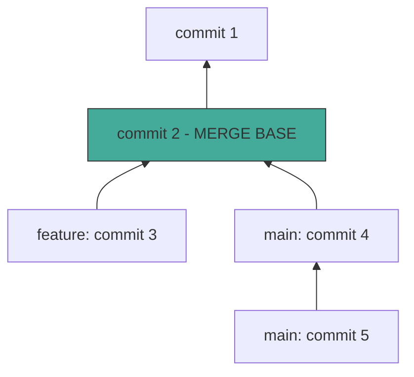
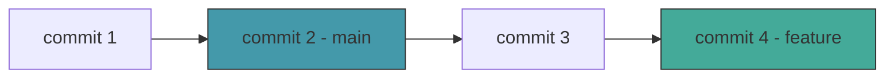
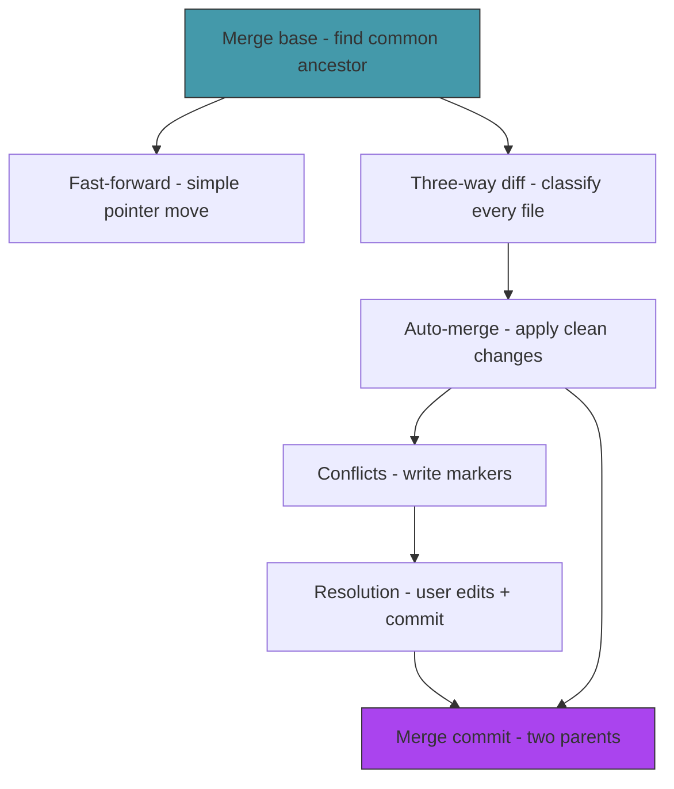

```mermaid
flowchart LR
    S22["Stage 22 - Merge Base"] --> S23["Stage 23 - Fast-Forward"]
    S23 --> S24["Stage 24 - Three-Way Diff"]
    S24 --> S25["Stage 25 - Auto-Merge"]
    S25 --> S26["Stage 26 - Conflicts"]
    S26 --> S27["Stage 27 - Resolution"]
    S27 --> S28["Stage 28 - Merge Commit"]
    style S22 fill:#49a,stroke:#333
    style S28 fill:#a4e,stroke:#333
```

# Act 4 — The Convergence

> *Two timelines have diverged. Each carries changes the other doesn't know about. Now they must become one. This is the hardest act — and the most rewarding. By the end, you'll understand why merge conflicts happen, what git actually does to resolve them, and how to build a three-way merge from scratch.*

Merging is where most developers' understanding of git breaks down. "I got a conflict" is followed by panic, random button-pressing, and sometimes `git reset --hard`. This act demystifies the entire process. You'll build it yourself — from finding the common ancestor, through three-way diff, to conflict markers and resolution.



---

## Stage 22 — Finding Common Ground

> *Difficulty: Hard — Walking two commit chains to find the merge base.*

Before you can merge two branches, you need to answer a fundamental question: where did they diverge? The **merge base** is the most recent commit that both branches share — the last moment before their timelines split. Without it, you can't tell what each branch *changed*, only what they *contain*.

> [!tip] What You'll Learn
> - The merge base (lowest common ancestor) algorithm
> - Walking two commit chains simultaneously
> - `HashSet` for tracking visited commits
> - Why the merge base is essential for correct merging

### Why the merge base matters

Imagine two branches both contain a file `config.txt`. Branch A has `port = 8080` and branch B has `port = 9090`. Which one is "right"?

You can't answer that without knowing what the file looked like *before* the branches diverged. If the original was `port = 3000`, then both branches changed it — that's a conflict. If the original was `port = 8080`, then only branch B changed it — take B's version. If the original was `port = 9090`, then only branch A changed it — take A's version.

The merge base gives you that "original" — the common ancestor that both branches started from.

### The algorithm



To find the merge base, walk backwards from both branch tips simultaneously, collecting visited commits. The first commit that appears in both walks is the merge base.

### 22.1 — The merge base function

Create `src/merge.rs`:

```rust
use crate::{object, refs};
use std::collections::HashSet;

/// Find the merge base (lowest common ancestor) of two commits.
/// Returns None if the commits share no common history.
pub fn find_merge_base(hash_a: &str, hash_b: &str) -> std::io::Result<Option<String>> {
    // Collect all ancestors of A
    let ancestors_a = collect_ancestors(hash_a)?;

    // Walk backwards from B until we find a commit in A's ancestors
    let mut current = Some(hash_b.to_string());
    while let Some(hash) = current {
        if ancestors_a.contains(&hash) {
            return Ok(Some(hash));
        }
        let obj = object::read_object(&hash)?;
        let info = object::parse_commit(&obj.content);
        current = info.parent;
    }

    Ok(None)
}

/// Collect all ancestor commit hashes by walking the parent chain.
fn collect_ancestors(start: &str) -> std::io::Result<HashSet<String>> {
    let mut ancestors = HashSet::new();
    let mut current = Some(start.to_string());

    while let Some(hash) = current {
        ancestors.insert(hash.clone());
        let obj = object::read_object(&hash)?;
        let info = object::parse_commit(&obj.content);
        current = info.parent;
    }

    Ok(ancestors)
}
```

| Code | Explanation |
|------|-------------|
| `HashSet<String>` | An unordered set of unique strings. Lookup is O(1). Like Python's `set()`. |
| `ancestors_a.contains(&hash)` | Check if the hash is in the set — constant time. |

The algorithm is simple: collect all of A's ancestors into a set, then walk B's chain until you hit one. The first match is the merge base. This is O(n + m) where n and m are the chain lengths — efficient enough for any realistic history.

### 22.2 — Test it

Add a temporary test command or test it through the merge flow we'll build next. For now, let's verify the concept:

```bash
# Create a divergent history
cargo run -- anchor -m "Base commit"

cargo run -- branch feature
cargo run -- shift feature
echo "feature work" > feature.txt
cargo run -- anchor -m "Feature commit"

cargo run -- shift main
echo "main work" > main.txt
cargo run -- anchor -m "Main commit"

# Now main and feature have diverged from "Base commit"
cargo run -- log
```

The merge base of `main` and `feature` should be the "Base commit" — the last commit before they diverged.

> [!note] Simplification
> Our algorithm handles linear history (single parent per commit). Real git supports merge commits with multiple parents, which requires a more complex algorithm (recursive merge base). For this course, single-parent history covers the common case.

We know where the branches diverged. The simplest merge case is when one branch has no new commits — it's just behind. Next stage, we'll handle that with a fast-forward merge.

> [!check] Checkpoint
> Create a divergent history (two branches with different commits after a shared base). Understand that the merge base is the last shared commit. Stage 22 complete.

---

## Stage 23 — The Fast Path

> *Difficulty: Easy — Fast-forward merge when one branch is strictly ahead.*

The simplest merge is no merge at all. If the current branch hasn't moved since the other branch forked, there's nothing to reconcile — just move the current branch pointer forward to match the other branch. This is a **fast-forward merge**, and it's what git does when you merge a feature branch that's strictly ahead of main.

> [!tip] What You'll Learn
> - Fast-forward detection (is one branch an ancestor of the other?)
> - Moving a branch pointer without creating a merge commit
> - Why fast-forward is the default and when it's not possible

### When fast-forward works



Main is at commit 2, feature is at commit 4. Main hasn't moved since feature branched off. The merge base *is* main's tip. So merging feature into main just means moving main's pointer from commit 2 to commit 4. No new commit needed.

### 23.1 — The converge command

Add `mod merge;` to `main.rs`. Add the subcommand:

```rust
/// Converge (merge) another branch into the current one
Converge {
    /// Branch to merge into the current branch
    branch: String,
},
```

```rust
Commands::Converge { branch } => converge(&branch),
```

```rust
fn converge(branch_name: &str) {
    // Get current branch
    let current_branch = refs::current_branch().unwrap_or_else(|e| {
        eprintln!("Failed to read HEAD: {}", e);
        std::process::exit(1);
    }).unwrap_or_else(|| {
        eprintln!("Cannot merge in detached HEAD state. Switch to a branch first.");
        std::process::exit(1);
    });

    // Resolve both branches to commit hashes
    let our_hash = refs::resolve_head().unwrap_or_else(|e| {
        eprintln!("Failed to resolve HEAD: {}", e);
        std::process::exit(1);
    }).unwrap_or_else(|| {
        eprintln!("No commits on current branch.");
        std::process::exit(1);
    });

    let their_hash = refs::read_branch(branch_name).unwrap_or_else(|e| {
        eprintln!("Failed to read branch '{}': {}", branch_name, e);
        std::process::exit(1);
    }).unwrap_or_else(|| {
        eprintln!("Branch '{}' not found.", branch_name);
        std::process::exit(1);
    });

    // Find the merge base
    let base = merge::find_merge_base(&our_hash, &their_hash).unwrap_or_else(|e| {
        eprintln!("Failed to find merge base: {}", e);
        std::process::exit(1);
    });

    let base_hash = base.unwrap_or_else(|| {
        eprintln!("No common ancestor found. Cannot merge unrelated histories.");
        std::process::exit(1);
    });

    // Case 1: Already up to date
    if our_hash == their_hash {
        println!("Already up to date.");
        return;
    }

    // Case 2: Fast-forward (merge base is our tip)
    if base_hash == our_hash {
        // Our branch hasn't moved — just advance the pointer
        refs::update_head(&their_hash).unwrap_or_else(|e| {
            eprintln!("Failed to update HEAD: {}", e);
            std::process::exit(1);
        });

        // Update working directory to match
        checkout::checkout_branch(branch_name, true).unwrap_or_else(|e| {
            eprintln!("Failed to update working directory: {}", e);
            std::process::exit(1);
        });
        // Restore HEAD to point to our branch (checkout changed it)
        std::fs::write(".chronolock/HEAD", format!("ref: refs/heads/{}\n", current_branch))
            .expect("Failed to restore HEAD");
        refs::update_head(&their_hash).expect("Failed to update branch");

        println!("Fast-forward: {} -> {}", &our_hash[..8], &their_hash[..8]);
        return;
    }

    // Case 3: Fast-forward the other way (merge base is their tip)
    if base_hash == their_hash {
        println!("Already up to date (their branch is behind ours).");
        return;
    }

    // Case 4: True merge — both branches have diverged
    // We'll implement this in Stages 24-28
    println!("True merge required (base: {}). Coming in the next stages.", &base_hash[..8]);
}
```

### 23.2 — Test fast-forward

```bash
# Set up: main has commits, feature branches from main, adds more commits
cargo run -- shift main
cargo run -- branch ff-test
cargo run -- shift ff-test
echo "new feature" > ff.txt
cargo run -- anchor -m "Feature work"

# Switch back to main (which hasn't moved)
cargo run -- shift main

# Merge — should fast-forward
cargo run -- converge ff-test
```

```
Fast-forward: a1b2c3d4 -> e5f6a7b8
```

```bash
# Verify main now points to the same commit as ff-test
cargo run -- log
```

Main's history now includes the feature commit, and `ff.txt` exists in the working directory.

> [!note] Why fast-forward is preferred
> Fast-forward merges keep the history linear — no merge commits, no branching in the log. Many teams enforce fast-forward-only merges (git's `--ff-only` flag) to keep history clean. The tradeoff: you lose the visual record that a branch existed.

Fast-forward only works when one branch hasn't moved. When both branches have new commits, we need a true merge. Next stage, we'll build the three-way diff that makes it possible.

> [!check] Checkpoint
> Create a branch, add commits to it, switch back to main (which hasn't moved), and merge. Verify it fast-forwards without creating a merge commit. Stage 23 complete.

---

## Stage 24 — The Three-Way Mirror

> *Difficulty: Hard — Comparing base, ours, and theirs to classify every file.*

When both branches have diverged from the merge base, we need to figure out what each branch changed. A two-way diff (ours vs theirs) can't tell you *who* made a change — it just shows differences. A three-way diff compares both branches against the merge base, which tells you exactly what happened:

- File changed only in ours → take ours
- File changed only in theirs → take theirs
- File changed in both → potential conflict
- File unchanged in both → keep as-is

> [!tip] What You'll Learn
> - Three-way diff classification
> - Flattening trees for comparison
> - The `MergeAction` enum — modeling every possible merge outcome
> - Why two-way diff is insufficient for merging

### The classification table

| Base | Ours | Theirs | Action |
|------|------|--------|--------|
| A | A | A | Unchanged — keep |
| A | A | B | Only theirs changed — take theirs |
| A | B | A | Only ours changed — take ours |
| A | B | B | Both changed identically — take either |
| A | B | C | Both changed differently — **conflict** |
| — | — | B | Added only by theirs — add |
| — | B | — | Added only by ours — keep |
| — | B | C | Both added differently — **conflict** |
| A | — | A | We deleted, they didn't change — delete |
| A | A | — | They deleted, we didn't change — delete |
| A | B | — | We changed, they deleted — **conflict** |
| A | — | B | They changed, we deleted — **conflict** |

### 24.1 — The MergeAction enum

Add to `src/merge.rs`:

```rust
use crate::diff;
use std::collections::HashMap;

#[derive(Debug)]
pub enum MergeAction {
    /// Keep the file as-is (unchanged or both changed identically)
    Keep { path: String, hash: String },
    /// Take the version from "theirs"
    TakeTheirs { path: String, hash: String },
    /// Take the version from "ours"
    TakeOurs { path: String, hash: String },
    /// Add a new file
    Add { path: String, hash: String },
    /// Delete a file
    Delete { path: String },
    /// Conflict — both sides changed the file differently
    Conflict { path: String, base_hash: Option<String>, our_hash: Option<String>, their_hash: Option<String> },
}
```

### 24.2 — The three-way diff

```rust
/// Perform a three-way diff and classify every file.
pub fn three_way_diff(
    base_tree: &str,
    our_tree: &str,
    their_tree: &str,
) -> std::io::Result<Vec<MergeAction>> {
    let base_files: HashMap<String, String> = diff::flatten_tree(base_tree, "")?.into_iter().collect();
    let our_files: HashMap<String, String> = diff::flatten_tree(our_tree, "")?.into_iter().collect();
    let their_files: HashMap<String, String> = diff::flatten_tree(their_tree, "")?.into_iter().collect();

    // Collect all unique paths
    let mut all_paths: Vec<String> = HashSet::<String>::new()
        .into_iter()
        .collect();
    // Actually collect from all three maps
    let mut path_set = HashSet::new();
    for key in base_files.keys().chain(our_files.keys()).chain(their_files.keys()) {
        path_set.insert(key.clone());
    }
    all_paths = path_set.into_iter().collect();
    all_paths.sort();

    let mut actions = Vec::new();

    for path in &all_paths {
        let base = base_files.get(path);
        let ours = our_files.get(path);
        let theirs = their_files.get(path);

        let action = match (base, ours, theirs) {
            // All three are the same — unchanged
            (Some(b), Some(o), Some(t)) if b == o && o == t => {
                MergeAction::Keep { path: path.clone(), hash: o.clone() }
            }
            // Only theirs changed
            (Some(b), Some(o), Some(t)) if b == o && o != t => {
                MergeAction::TakeTheirs { path: path.clone(), hash: t.clone() }
            }
            // Only ours changed
            (Some(b), Some(o), Some(t)) if b != o && b == t => {
                MergeAction::TakeOurs { path: path.clone(), hash: o.clone() }
            }
            // Both changed identically
            (Some(_b), Some(o), Some(t)) if o == t => {
                MergeAction::Keep { path: path.clone(), hash: o.clone() }
            }
            // Both changed differently — conflict
            (Some(_b), Some(o), Some(t)) => {
                MergeAction::Conflict {
                    path: path.clone(),
                    base_hash: base.cloned(),
                    our_hash: Some(o.clone()),
                    their_hash: Some(t.clone()),
                }
            }
            // Added only by theirs
            (None, None, Some(t)) => {
                MergeAction::Add { path: path.clone(), hash: t.clone() }
            }
            // Added only by ours
            (None, Some(o), None) => {
                MergeAction::TakeOurs { path: path.clone(), hash: o.clone() }
            }
            // Both added — same content
            (None, Some(o), Some(t)) if o == t => {
                MergeAction::Keep { path: path.clone(), hash: o.clone() }
            }
            // Both added — different content (conflict)
            (None, Some(o), Some(t)) => {
                MergeAction::Conflict {
                    path: path.clone(),
                    base_hash: None,
                    our_hash: Some(o.clone()),
                    their_hash: Some(t.clone()),
                }
            }
            // We deleted, they didn't change — delete
            (Some(b), None, Some(t)) if b == t => {
                MergeAction::Delete { path: path.clone() }
            }
            // They deleted, we didn't change — delete
            (Some(b), Some(o), None) if b == o => {
                MergeAction::Delete { path: path.clone() }
            }
            // Delete/modify conflict
            (Some(_), None, Some(t)) => {
                MergeAction::Conflict {
                    path: path.clone(),
                    base_hash: base.cloned(),
                    our_hash: None,
                    their_hash: Some(t.clone()),
                }
            }
            (Some(_), Some(o), None) => {
                MergeAction::Conflict {
                    path: path.clone(),
                    base_hash: base.cloned(),
                    our_hash: Some(o.clone()),
                    their_hash: None,
                }
            }
            // Both deleted
            (Some(_), None, None) => {
                MergeAction::Delete { path: path.clone() }
            }
            // File only in base (both deleted) — already handled above
            // Shouldn't happen but handle gracefully
            (None, None, None) => continue,
        };

        actions.push(action);
    }

    Ok(actions)
}
```

This is the heart of the merge engine. Every file in the combined set of all three trees is classified into exactly one action. The match expression directly implements the classification table from above.

> [!warning] Common Mistake
> **Using a two-way diff instead of three-way.** If you compare ours vs theirs directly, you can't tell who made a change. A file that differs between the two branches might have been changed by only one side — the three-way diff against the base reveals which.

We can classify every file. Next stage, we'll apply the non-conflicting changes automatically.

> [!check] Checkpoint
> Understand the three-way classification table. The `three_way_diff` function takes three tree hashes and returns a `Vec<MergeAction>`. Stage 24 complete.

---

## Stage 25 — Clean Convergence

> *Difficulty: Hard — Applying non-conflicting changes automatically.*

The three-way diff tells us what to do with each file. For files where only one side changed, the answer is clear — take that side's version. This stage applies all the non-conflicting merge actions to the working directory, leaving only true conflicts for the user to resolve.

> [!tip] What You'll Learn
> - Applying merge actions to the filesystem
> - Separating clean merges from conflicts
> - Building a merge result that tracks what was auto-merged
> - Why most merges complete without any conflicts

### 25.1 — Apply merge actions

Add to `src/merge.rs`:

```rust
use std::fs;
use std::path::Path;

/// Result of applying merge actions.
pub struct MergeResult {
    pub merged_files: Vec<String>,
    pub conflicts: Vec<MergeAction>,
}

/// Apply non-conflicting merge actions to the working directory.
/// Returns the list of conflicts that need manual resolution.
pub fn apply_merge(actions: Vec<MergeAction>) -> std::io::Result<MergeResult> {
    let mut merged = Vec::new();
    let mut conflicts = Vec::new();

    for action in actions {
        match action {
            MergeAction::Keep { path, .. } => {
                // Nothing to do — file is already correct
                merged.push(path);
            }
            MergeAction::TakeTheirs { path, hash } => {
                let content = object::read_blob_content(&hash)?;
                write_file(&path, &content)?;
                merged.push(path);
            }
            MergeAction::TakeOurs { path, .. } => {
                // Nothing to do — our version is already in the working directory
                merged.push(path);
            }
            MergeAction::Add { path, hash } => {
                let content = object::read_blob_content(&hash)?;
                write_file(&path, &content)?;
                merged.push(path);
            }
            MergeAction::Delete { path } => {
                let file_path = Path::new(&path);
                if file_path.exists() {
                    fs::remove_file(file_path)?;
                }
                merged.push(format!("{} (deleted)", path));
            }
            MergeAction::Conflict { .. } => {
                conflicts.push(action);
            }
        }
    }

    Ok(MergeResult { merged_files: merged, conflicts })
}

fn write_file(path: &str, content: &[u8]) -> std::io::Result<()> {
    let file_path = Path::new(path);
    if let Some(parent) = file_path.parent() {
        fs::create_dir_all(parent)?;
    }
    fs::write(file_path, content)
}
```

### 25.2 — Wire into converge

Update the "Case 4: True merge" section in the `converge` function:

```rust
// Case 4: True merge — both branches have diverged
println!("Merging {} into {}...", branch_name, current_branch);

// Get the three trees
let base_obj = object::read_object(&base_hash).expect("Cannot read base commit");
let our_obj = object::read_object(&our_hash).expect("Cannot read our commit");
let their_obj = object::read_object(&their_hash).expect("Cannot read their commit");

let base_tree = object::parse_commit(&base_obj.content).tree;
let our_tree = object::parse_commit(&our_obj.content).tree;
let their_tree = object::parse_commit(&their_obj.content).tree;

// Three-way diff
let actions = merge::three_way_diff(&base_tree, &our_tree, &their_tree)
    .unwrap_or_else(|e| {
        eprintln!("Three-way diff failed: {}", e);
        std::process::exit(1);
    });

// Apply non-conflicting changes
let result = merge::apply_merge(actions).unwrap_or_else(|e| {
    eprintln!("Merge failed: {}", e);
    std::process::exit(1);
});

if result.conflicts.is_empty() {
    // Clean merge — auto-commit
    println!("Auto-merging {} files.", result.merged_files.len());

    let tree_hash = staging::stage_directory(std::path::Path::new("."))
        .expect("Failed to stage merged result");

    let message = format!("Converge branch '{}'", branch_name);
    let commit_hash = object::store_merge_commit(
        &tree_hash, &our_hash, &their_hash,
        "Chronomancer", "chrono@chronolock", &message,
    ).expect("Failed to create merge commit");

    refs::update_head(&commit_hash).expect("Failed to update HEAD");

    let old_hash = &our_hash;
    reflog::record(old_hash, &commit_hash, &format!("converge: {}", message))
        .unwrap_or_else(|e| eprintln!("Warning: reflog: {}", e));

    println!("Merge complete: {}", &commit_hash[..8]);
} else {
    // Conflicts — user must resolve
    println!("\nConflicts detected in {} file(s):", result.conflicts.len());
    for conflict in &result.conflicts {
        if let merge::MergeAction::Conflict { path, .. } = conflict {
            println!("  {} {}", "CONFLICT:".red(), path);
        }
    }
    println!("\nResolve the conflicts, then run:");
    println!("  chronolock anchor -m \"Resolve merge conflicts\"");
}
```

### 25.3 — The merge commit function

A merge commit has *two* parents. Add to `src/object.rs`:

```rust
/// Create a merge commit with two parents.
pub fn store_merge_commit(
    tree_hash: &str,
    parent1: &str,
    parent2: &str,
    author_name: &str,
    author_email: &str,
    message: &str,
) -> std::io::Result<String> {
    let now = Local::now();
    let timestamp = now.timestamp();
    let tz_offset = now.format("%z").to_string();
    let author_line = format!("{} <{}> {} {}", author_name, author_email, timestamp, tz_offset);

    let mut content = String::new();
    content.push_str(&format!("tree {}\n", tree_hash));
    content.push_str(&format!("parent {}\n", parent1));
    content.push_str(&format!("parent {}\n", parent2));
    content.push_str(&format!("author {}\n", author_line));
    content.push_str(&format!("committer {}\n", author_line));
    content.push_str("\n");
    content.push_str(message);
    content.push('\n');

    let content_bytes = content.as_bytes();
    let header = format!("commit {}\0", content_bytes.len());
    let mut full_object = header.into_bytes();
    full_object.extend_from_slice(content_bytes);

    let hash = hash_bytes(&full_object);

    let mut encoder = ZlibEncoder::new(Vec::new(), Compression::default());
    encoder.write_all(&full_object)?;
    let compressed = encoder.finish()?;

    let dir = Path::new(".chronolock/objects").join(&hash[..2]);
    fs::create_dir_all(&dir)?;
    let file_path = dir.join(&hash[2..]);
    if !file_path.exists() {
        fs::write(&file_path, &compressed)?;
    }

    Ok(hash)
}
```

The only difference from `store_commit`: two `parent` lines instead of one.

### 25.4 — Test a clean merge

```bash
# Create divergent branches with non-overlapping changes
cargo run -- shift main
echo "main addition" > main-only.txt
cargo run -- anchor -m "Add main-only file"

cargo run -- branch clean-merge
cargo run -- shift clean-merge
echo "feature addition" > feature-only.txt
cargo run -- anchor -m "Add feature-only file"

cargo run -- shift main
cargo run -- converge clean-merge
```

```
Merging clean-merge into main...
Auto-merging 2 files.
Merge complete: f1a2b3c4
```

Both `main-only.txt` and `feature-only.txt` should exist in the working directory. The merge was clean — no conflicts.

> [!warning] Common Mistake
> **Forgetting the second parent in the merge commit.** A merge commit must have two parent lines. If you only write one, `git log --graph` won't show the merge correctly, and future merge-base calculations will be wrong.

Most merges are clean — the branches changed different files. But when both branches change the same file, we need conflict markers. Next stage.

> [!check] Checkpoint
> Create two branches with non-overlapping changes. Merge one into the other. Verify both sets of changes exist in the working directory and a merge commit was created with two parents. Stage 25 complete.

---

## Stage 26 — The Paradox

> *Difficulty: Hard — Detecting and marking conflicts.*

When both branches change the same file in different ways, the Chronolock can't decide which version is correct. This is a **conflict** — a paradox in the timeline that only the chronomancer can resolve. This stage writes conflict markers into the file so the user can see both versions and choose.

> [!tip] What You'll Learn
> - Conflict markers (`<<<<<<<`, `=======`, `>>>>>>>`)
> - Line-level diff for conflict display
> - Writing conflicted files to the working directory
> - Why conflicts are a feature, not a bug

### The conflict marker format

Git's conflict markers are simple and universal:

```
<<<<<<< ours
our version of the conflicting lines
=======
their version of the conflicting lines
>>>>>>> theirs
```

Everything between `<<<<<<<` and `=======` is our version. Everything between `=======` and `>>>>>>>` is their version. The user edits the file to keep what they want, removes the markers, and commits.

### 26.1 — Write conflict markers

Add to `src/merge.rs`:

```rust
/// Write a conflicted file with conflict markers.
pub fn write_conflict_file(
    path: &str,
    our_hash: Option<&str>,
    their_hash: Option<&str>,
    our_label: &str,
    their_label: &str,
) -> std::io::Result<()> {
    let our_content = match our_hash {
        Some(hash) => {
            let bytes = object::read_blob_content(hash)?;
            String::from_utf8_lossy(&bytes).to_string()
        }
        None => String::new(),
    };

    let their_content = match their_hash {
        Some(hash) => {
            let bytes = object::read_blob_content(hash)?;
            String::from_utf8_lossy(&bytes).to_string()
        }
        None => String::new(),
    };

    let conflicted = format!(
        "<<<<<<< {}\n{}\n=======\n{}\n>>>>>>> {}\n",
        our_label,
        our_content.trim_end(),
        their_content.trim_end(),
        their_label,
    );

    write_file(path, conflicted.as_bytes())
}
```

### 26.2 — Apply conflicts in the merge flow

Update the conflict handling in `converge` to write conflict markers:

```rust
if !result.conflicts.is_empty() {
    // Write conflict markers for each conflicted file
    for conflict in &result.conflicts {
        if let merge::MergeAction::Conflict { path, our_hash, their_hash, .. } = conflict {
            merge::write_conflict_file(
                path,
                our_hash.as_deref(),
                their_hash.as_deref(),
                &current_branch,
                branch_name,
            ).unwrap_or_else(|e| {
                eprintln!("Failed to write conflict for {}: {}", path, e);
            });
        }
    }

    println!("\nConflicts detected in {} file(s):", result.conflicts.len());
    for conflict in &result.conflicts {
        if let merge::MergeAction::Conflict { path, .. } = conflict {
            println!("  {} {}", "CONFLICT:".red(), path);
        }
    }
    println!("\nResolve the conflicts in the marked files, then run:");
    println!("  chronolock anchor -m \"Resolve merge conflicts\"");
}
```

### 26.3 — Test a conflict

```bash
# Create a conflict: both branches modify the same file
cargo run -- shift main
echo "main's version of the config" > config.txt
cargo run -- anchor -m "Main config"

cargo run -- branch conflict-test
cargo run -- shift conflict-test
echo "feature's version of the config" > config.txt
cargo run -- anchor -m "Feature config"

cargo run -- shift main
cargo run -- converge conflict-test
```

```
Merging conflict-test into main...
Auto-merging 1 files.

Conflicts detected in 1 file(s):
  CONFLICT: config.txt

Resolve the conflicts in the marked files, then run:
  chronolock anchor -m "Resolve merge conflicts"
```

Check the conflicted file:

```bash
cat config.txt
```

```
<<<<<<< main
main's version of the config
=======
feature's version of the config
>>>>>>> conflict-test
```

Both versions are visible. The chronomancer must choose.

> [!note] Why conflicts are a feature
> Conflicts mean the tool is being honest. It could silently pick one version, but that would hide a real decision that a human needs to make. The conflict markers make the decision explicit and visible.

The conflict is marked. Next stage, we'll handle the resolution — the user edits the file and completes the merge.

> [!check] Checkpoint
> Create a conflict by modifying the same file on two branches. Merge and verify conflict markers appear in the file. Stage 26 complete.

---

## Stage 27 — Resolving the Paradox

> *Difficulty: Medium — Completing a merge after resolving conflicts.*

The user has edited the conflicted files, removed the markers, and chosen the correct content. Now they need to finalize the merge. This is conceptually simple — stage everything and create a merge commit — but we need to track that we're *in the middle of a merge* so the commit gets two parents.

> [!tip] What You'll Learn
> - Merge state files (tracking an in-progress merge)
> - Reading merge state to create the correct commit
> - Cleaning up merge state after completion
> - The `MERGE_HEAD` file convention

### 27.1 — Track merge state

When a merge has conflicts, we need to remember the other branch's commit hash so the eventual commit has two parents. Git uses a `MERGE_HEAD` file for this.

Add to `src/merge.rs`:

```rust
/// Save merge state (the other branch's commit hash).
pub fn save_merge_state(their_hash: &str) -> std::io::Result<()> {
    fs::write(".chronolock/MERGE_HEAD", format!("{}\n", their_hash))
}

/// Read merge state. Returns None if no merge is in progress.
pub fn read_merge_state() -> std::io::Result<Option<String>> {
    let path = Path::new(".chronolock/MERGE_HEAD");
    if path.exists() {
        let hash = fs::read_to_string(path)?;
        Ok(Some(hash.trim().to_string()))
    } else {
        Ok(None)
    }
}

/// Clear merge state after a successful merge commit.
pub fn clear_merge_state() -> std::io::Result<()> {
    let path = Path::new(".chronolock/MERGE_HEAD");
    if path.exists() {
        fs::remove_file(path)?;
    }
    Ok(())
}
```

### 27.2 — Save state on conflict

In the conflict branch of `converge`, add before the conflict output:

```rust
// Save merge state so the next anchor creates a merge commit
merge::save_merge_state(&their_hash).unwrap_or_else(|e| {
    eprintln!("Warning: failed to save merge state: {}", e);
});
```

### 27.3 — Update anchor to handle merge state

Update the `anchor` function to check for an in-progress merge:

```rust
fn anchor(message: &str) {
    let tree_hash = staging::stage_directory(std::path::Path::new("."))
        .unwrap_or_else(|e| {
            eprintln!("Failed to stage: {}", e);
            std::process::exit(1);
        });

    let parent = refs::resolve_head().unwrap_or_else(|e| {
        eprintln!("Failed to read HEAD: {}", e);
        std::process::exit(1);
    });

    // Check if we're completing a merge
    let merge_head = merge::read_merge_state().unwrap_or(None);

    let commit_hash = if let Some(their_hash) = &merge_head {
        // Merge commit — two parents
        object::store_merge_commit(
            &tree_hash,
            parent.as_deref().unwrap_or(""),
            their_hash,
            "Chronomancer",
            "chrono@chronolock",
            message,
        )
    } else {
        // Normal commit — one parent
        object::store_commit(
            &tree_hash,
            parent.as_deref(),
            "Chronomancer",
            "chrono@chronolock",
            message,
        )
    }.unwrap_or_else(|e| {
        eprintln!("Failed to create commit: {}", e);
        std::process::exit(1);
    });

    refs::update_head(&commit_hash).unwrap_or_else(|e| {
        eprintln!("Failed to update HEAD: {}", e);
        std::process::exit(1);
    });

    // Clean up merge state
    if merge_head.is_some() {
        merge::clear_merge_state().unwrap_or_else(|e| {
            eprintln!("Warning: failed to clear merge state: {}", e);
        });
    }

    let old_hash = parent.as_deref().unwrap_or("0000000000000000000000000000000000000000");
    reflog::record(old_hash, &commit_hash, &format!("anchor: {}", message))
        .unwrap_or_else(|e| eprintln!("Warning: reflog: {}", e));

    let prefix = if merge_head.is_some() { "(merge) " } else if parent.is_none() { "(root) " } else { "" };
    println!("[{}{}] {}", prefix, &commit_hash[..8], message);
}
```

### 27.4 — Test the full conflict resolution flow

```bash
# After the conflict from Stage 26, edit the file
echo "resolved: combined config" > config.txt

# Complete the merge
cargo run -- anchor -m "Resolve config conflict"
```

```
[(merge) a1b2c3d4] Resolve config conflict
```

```bash
# Verify the merge commit has two parents
cargo run -- reveal <merge-commit-hash>
```

The commit should show two `parent` lines.

> [!check] Checkpoint
> After a conflicted merge, edit the conflicted file, remove markers, and run `anchor`. Verify the commit has two parents and `MERGE_HEAD` is cleaned up. Stage 27 complete.

---

## Stage 28 — The Merge Commit

> *Difficulty: Medium — Understanding what a merge commit represents.*

This stage is less about code and more about understanding. A merge commit is special — it has two parents, which means the commit graph is no longer a simple chain. It's a **directed acyclic graph** (DAG). This changes how `log` works, how merge-base is calculated, and how the history looks.

> [!tip] What You'll Learn
> - The commit DAG vs a linear chain
> - How merge commits affect `log` traversal
> - Verifying merge commits with git
> - The complete merge workflow from start to finish

### The DAG

Before merging, history is a chain:

```
A → B → C (main)
         \
          D → E (feature)
```

After merging feature into main:

```
A → B → C → F (main, merge commit)
         \  ↗
          D → E (feature)
```

Commit F has two parents: C (from main) and E (from feature). Walking backwards from F, you can reach both C and E. This is why `git log` sometimes shows commits in a non-obvious order — it's traversing a graph, not a list.

### 28.1 — Update log for merge commits

Our `parse_commit` currently only captures one parent. Update it to handle multiple parents:

Update `CommitInfo` in `src/object.rs`:

```rust
pub struct CommitInfo {
    pub tree: String,
    pub parents: Vec<String>,  // changed from Option<String>
    pub author: String,
    pub message: String,
}
```

Update `parse_commit`:

```rust
pub fn parse_commit(content: &[u8]) -> CommitInfo {
    let text = std::str::from_utf8(content).expect("Invalid commit encoding");
    let mut tree = String::new();
    let mut parents = Vec::new();
    let mut author = String::new();
    let mut in_message = false;
    let mut message_lines: Vec<&str> = Vec::new();

    for line in text.lines() {
        if in_message {
            message_lines.push(line);
            continue;
        }
        if line.is_empty() {
            in_message = true;
            continue;
        }
        if let Some(value) = line.strip_prefix("tree ") {
            tree = value.to_string();
        } else if let Some(value) = line.strip_prefix("parent ") {
            parents.push(value.to_string());
        } else if let Some(value) = line.strip_prefix("author ") {
            author = value.to_string();
        }
    }

    CommitInfo {
        tree,
        parents,
        author,
        message: message_lines.join("\n").trim().to_string(),
    }
}
```

Then update all code that used `info.parent` to use `info.parents.first().cloned()` for the primary parent, and `info.parents` for the full list.

### 28.2 — Show merge info in log

Update `log_commits` to indicate merge commits:

```rust
if info.parents.len() > 1 {
    let parent_shorts: Vec<String> = info.parents.iter()
        .map(|p| p[..8].to_string())
        .collect();
    println!("Merge: {}", parent_shorts.join(" "));
}
```

### 28.3 — Verify with git

```bash
GIT_DIR=.chronolock git log --oneline --graph
```

You should see the merge visualized as a graph with the two parent lines converging.

> [!note] The complete merge workflow
> 1. `chronolock converge feature` — find merge base, three-way diff, apply clean changes
> 2. If conflicts: edit files, remove markers
> 3. `chronolock anchor -m "message"` — creates merge commit with two parents
> 4. Done — both branches' changes are now in the current branch

> [!check] Checkpoint
> Verify merge commits show two parents in `log` and `reveal`. Verify `GIT_DIR=.chronolock git log --graph` shows the merge correctly. Stage 28 complete.

---

## Act 4 Complete — The Convergence



You've built a complete merge engine:

- **Merge base** — find where two branches diverged
- **Fast-forward** — advance a pointer when no real merge is needed
- **Three-way diff** — classify every file as keep/take-ours/take-theirs/conflict
- **Auto-merge** — apply non-conflicting changes automatically
- **Conflict markers** — show both versions for manual resolution
- **Merge commits** — commits with two parents that record the convergence

| Rust Concept | Where You Used It |
|-------------|-------------------|
| `HashSet` | Ancestor collection for merge base |
| Complex `match` | Three-way diff classification (12+ arms) |
| `enum` with data | `MergeAction` variants carrying different payloads |
| File I/O patterns | Writing conflict markers, merge state files |
| `Option` chaining | Handling missing hashes in conflicts |

**Next up — Act 5: The Archive.** The Chronolock works, but it's wasteful — every version of every file is stored as a separate compressed blob. Act 5 makes it efficient with delta compression and pack files, then adds remote communication so two Chronolocks can share history.
