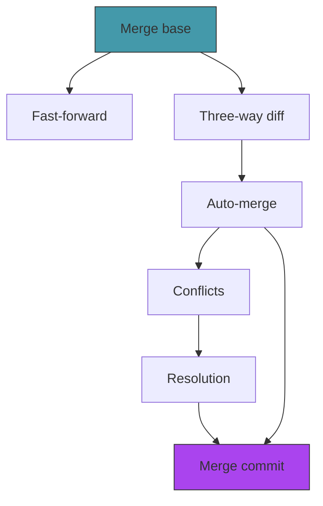

# Act 4 — The Convergence

> *Two timelines have diverged. Each carries changes the other doesn't know about. Now they must become one. This is the hardest act — and the most rewarding. By the end, you'll understand why merge conflicts happen, what git actually does to resolve them, and how to build a three-way merge from scratch.*

Merging is where most developers' understanding of git breaks down. "I got a conflict" is followed by panic, random button-pressing, and sometimes `git reset --hard`. This act demystifies the entire process.


---

## Stage 22 — Finding Common Ground

> *Before you can merge two branches, you need to answer: where did they diverge? The merge base is the most recent commit that both branches share.*

*Difficulty: Hard* | *~90 min*

> [!tip] What You'll Learn
> - The merge base (lowest common ancestor) algorithm
> - Walking two commit chains simultaneously
> - `HashSet` for tracking visited commits
> - Why the merge base is essential for correct merging

### Why the merge base matters

Imagine two branches both contain `config.txt`. Branch A has `port = 8080`, branch B has `port = 9090`. Which is "right"?

You can't answer without knowing the *original*. If the original was `port = 3000`, both changed it — conflict. If the original was `port = 8080`, only B changed it — take B's version. The merge base gives you that original.

### 22.1 — Try it yourself: find the merge base

Create `src/merge.rs` (add `mod merge;` to `main.rs`):

```rust
use crate::object;
use std::collections::HashSet;

/// Find the merge base (lowest common ancestor) of two commits.
pub fn find_merge_base(hash_a: &str, hash_b: &str) -> std::io::Result<Option<String>> {
    // 1. Collect ALL ancestors of A into a HashSet
    // 2. Walk backwards from B — first commit found in A's set is the merge base
    todo!()
}
```

You'll need a helper:

```rust
fn collect_ancestors(start: &str) -> std::io::Result<HashSet<String>> {
    // Walk the parent chain, inserting each hash into the set
    todo!()
}
```

<details>
<summary>Solution — click to reveal</summary>

```rust
pub fn find_merge_base(hash_a: &str, hash_b: &str) -> std::io::Result<Option<String>> {
    let ancestors_a = collect_ancestors(hash_a)?;

    let mut current = Some(hash_b.to_string());
    while let Some(hash) = current {
        if ancestors_a.contains(&hash) {
            return Ok(Some(hash));
        }
        let obj = object::read_object(&hash)?;
        let info = object::parse_commit(&obj.content);
        current = info.parent;
    }

    Ok(None)
}

fn collect_ancestors(start: &str) -> std::io::Result<HashSet<String>> {
    let mut ancestors = HashSet::new();
    let mut current = Some(start.to_string());

    while let Some(hash) = current {
        ancestors.insert(hash.clone());
        let obj = object::read_object(&hash)?;
        let info = object::parse_commit(&obj.content);
        current = info.parent;
    }

    Ok(ancestors)
}
```

</details>

### 22.2 — Add tests

```rust
#[cfg(test)]
mod tests {
    use super::*;

    #[test]
    fn test_collect_ancestors_includes_start() {
        // If we could construct a mock, the start hash should be in the set.
        // For now, test the HashSet logic directly:
        let mut set = HashSet::new();
        set.insert("abc".to_string());
        set.insert("def".to_string());
        assert!(set.contains("abc"));
        assert!(!set.contains("xyz"));
    }
}
```

### 22.3 — Test with a divergent history

```bash
cargo run -- anchor -m "Base commit"

cargo run -- branch feature
cargo run -- shift feature
echo "feature work" > feature.txt
cargo run -- anchor -m "Feature commit"

cargo run -- shift main
echo "main work" > main.txt
cargo run -- anchor -m "Main commit"
```

The merge base of `main` and `feature` is "Base commit."

> [!note] Simplification
> Our algorithm handles linear history (single parent per commit). Real git supports merge commits with multiple parents, requiring a more complex recursive algorithm.

### Extend it

Add a `chronolock merge-base <branch1> <branch2>` command that prints the merge base hash. Useful for debugging merge issues.

> [!check] Checkpoint
> Create a divergent history. Understand that the merge base is the last shared commit. Stage 22 complete.

---

## Stage 23 — The Fast Path

> *The simplest merge is no merge at all. If the current branch hasn't moved since the other branch forked, just move the pointer forward.*

*Difficulty: Easy* | *~40 min*

> [!tip] What You'll Learn
> - Fast-forward detection (is one branch an ancestor of the other?)
> - Moving a branch pointer without creating a merge commit
> - Why fast-forward is the default

### When fast-forward works

```
A → B (main) → C → D (feature)
```

Main is at B, feature is at D. The merge base *is* main's tip. Just move main to D.

### 23.1 — Try it yourself: the converge command

Add the subcommand and implement the fast-forward case:

```rust
/// Converge (merge) another branch into the current one
Converge { branch: String },
```

The handler needs to:
1. Get current branch name and both commit hashes
2. Find the merge base
3. If base == our tip → fast-forward (update ref + working directory)
4. If base == their tip → already up to date
5. Otherwise → true merge (placeholder for now)

<details>
<summary>Solution — click to reveal</summary>

```rust
fn converge(branch_name: &str) {
    let current_branch = refs::current_branch().unwrap_or_else(|e| {
        eprintln!("Failed to read HEAD: {}", e);
        std::process::exit(1);
    }).unwrap_or_else(|| {
        eprintln!("Cannot merge in detached HEAD state.");
        std::process::exit(1);
    });

    let our_hash = refs::resolve_head().unwrap_or_else(|e| {
        eprintln!("{}", e); std::process::exit(1);
    }).unwrap_or_else(|| {
        eprintln!("No commits on current branch."); std::process::exit(1);
    });

    let their_hash = refs::read_branch(branch_name).unwrap_or_else(|e| {
        eprintln!("{}", e); std::process::exit(1);
    }).unwrap_or_else(|| {
        eprintln!("Branch '{}' not found.", branch_name); std::process::exit(1);
    });

    if our_hash == their_hash {
        println!("Already up to date.");
        return;
    }

    let base_hash = merge::find_merge_base(&our_hash, &their_hash)
        .unwrap_or_else(|e| { eprintln!("{}", e); std::process::exit(1); })
        .unwrap_or_else(|| { eprintln!("No common ancestor."); std::process::exit(1); });

    if base_hash == our_hash {
        // Fast-forward
        refs::update_head(&their_hash).expect("Failed to update HEAD");
        checkout::checkout_branch(&current_branch, true).expect("Failed to update files");
        println!("Fast-forward: {} -> {}", &our_hash[..8], &their_hash[..8]);
        return;
    }

    if base_hash == their_hash {
        println!("Already up to date.");
        return;
    }

    // True merge — implemented in Stages 24-28
    println!("True merge required (base: {}). Coming next.", &base_hash[..8]);
}
```

</details>

### 23.2 — Test fast-forward

```bash
cargo run -- shift main
cargo run -- branch ff-test
cargo run -- shift ff-test
echo "new feature" > ff.txt
cargo run -- anchor -m "Feature work"

cargo run -- shift main
cargo run -- converge ff-test
```

```
Fast-forward: a1b2c3d4 -> e5f6a7b8
```

> [!note] Why fast-forward is preferred
> Fast-forward keeps history linear — no merge commits. Many teams enforce `--ff-only` to keep history clean.

### Extend it

Add a `--no-ff` flag that forces a merge commit even when fast-forward is possible. This preserves the visual record that a branch existed.

> [!check] Checkpoint
> Create a branch ahead of main, merge it. Verify fast-forward with no merge commit. Stage 23 complete.

---

## Stage 24 — The Three-Way Mirror

> *When both branches have diverged, we need to figure out what each branch changed. A three-way diff compares both branches against the merge base.*

*Difficulty: Hard* | *~100 min*

> [!tip] What You'll Learn
> - Three-way diff classification
> - The `MergeAction` enum — modeling every possible merge outcome
> - Why two-way diff is insufficient for merging

### The classification table

| Base | Ours | Theirs | Action |
|------|------|--------|--------|
| A | A | A | Unchanged — keep |
| A | A | B | Only theirs changed — take theirs |
| A | B | A | Only ours changed — take ours |
| A | B | B | Both changed identically — keep |
| A | B | C | Both changed differently — **conflict** |
| — | — | B | Added only by theirs — add |
| — | B | — | Added only by ours — keep |
| — | B | C | Both added differently — **conflict** |
| A | — | A | We deleted, they didn't change — delete |
| A | A | — | They deleted, we didn't change — delete |
| A | B | — | We changed, they deleted — **conflict** |
| A | — | B | They changed, we deleted — **conflict** |

### 24.1 — The MergeAction enum

Add to `src/merge.rs`:

```rust
use crate::diff;
use std::collections::HashMap;

#[derive(Debug)]
pub enum MergeAction {
    Keep { path: String, hash: String },
    TakeTheirs { path: String, hash: String },
    TakeOurs { path: String, hash: String },
    Add { path: String, hash: String },
    Delete { path: String },
    Conflict { path: String, base_hash: Option<String>, our_hash: Option<String>, their_hash: Option<String> },
}
```

### 24.2 — Try it yourself: three-way diff

```rust
pub fn three_way_diff(
    base_tree: &str, our_tree: &str, their_tree: &str,
) -> std::io::Result<Vec<MergeAction>> {
    // 1. Flatten all three trees into HashMap<path, hash>
    // 2. Collect all unique paths
    // 3. For each path, look up (base, ours, theirs) and classify per the table
    todo!()
}
```

<details>
<summary>Solution — click to reveal</summary>

```rust
pub fn three_way_diff(
    base_tree: &str, our_tree: &str, their_tree: &str,
) -> std::io::Result<Vec<MergeAction>> {
    let base: HashMap<String, String> = diff::flatten_tree(base_tree, "")?.into_iter().collect();
    let ours: HashMap<String, String> = diff::flatten_tree(our_tree, "")?.into_iter().collect();
    let theirs: HashMap<String, String> = diff::flatten_tree(their_tree, "")?.into_iter().collect();

    let mut all_paths = HashSet::new();
    for k in base.keys().chain(ours.keys()).chain(theirs.keys()) {
        all_paths.insert(k.clone());
    }
    let mut paths: Vec<String> = all_paths.into_iter().collect();
    paths.sort();

    let mut actions = Vec::new();
    for path in &paths {
        let b = base.get(path);
        let o = ours.get(path);
        let t = theirs.get(path);

        let action = match (b, o, t) {
            (Some(bh), Some(oh), Some(th)) if bh == oh && oh == th => MergeAction::Keep { path: path.clone(), hash: oh.clone() },
            (Some(bh), Some(oh), Some(th)) if bh == oh && oh != th => MergeAction::TakeTheirs { path: path.clone(), hash: th.clone() },
            (Some(bh), Some(oh), Some(th)) if bh != oh && bh == th => MergeAction::TakeOurs { path: path.clone(), hash: oh.clone() },
            (Some(_), Some(oh), Some(th)) if oh == th => MergeAction::Keep { path: path.clone(), hash: oh.clone() },
            (Some(_), Some(oh), Some(th)) => MergeAction::Conflict { path: path.clone(), base_hash: b.cloned(), our_hash: Some(oh.clone()), their_hash: Some(th.clone()) },
            (None, None, Some(th)) => MergeAction::Add { path: path.clone(), hash: th.clone() },
            (None, Some(oh), None) => MergeAction::TakeOurs { path: path.clone(), hash: oh.clone() },
            (None, Some(oh), Some(th)) if oh == th => MergeAction::Keep { path: path.clone(), hash: oh.clone() },
            (None, Some(oh), Some(th)) => MergeAction::Conflict { path: path.clone(), base_hash: None, our_hash: Some(oh.clone()), their_hash: Some(th.clone()) },
            (Some(bh), None, Some(th)) if bh == th => MergeAction::Delete { path: path.clone() },
            (Some(bh), Some(oh), None) if bh == oh => MergeAction::Delete { path: path.clone() },
            (Some(_), None, Some(th)) => MergeAction::Conflict { path: path.clone(), base_hash: b.cloned(), our_hash: None, their_hash: Some(th.clone()) },
            (Some(_), Some(oh), None) => MergeAction::Conflict { path: path.clone(), base_hash: b.cloned(), our_hash: Some(oh.clone()), their_hash: None },
            (Some(_), None, None) => MergeAction::Delete { path: path.clone() },
            (None, None, None) => continue,
        };
        actions.push(action);
    }

    Ok(actions)
}
```

</details>

### 24.3 — Add tests

```rust
#[test]
fn test_three_way_classification_logic() {
    // Test the classification without needing real objects
    // Same hash = unchanged
    let b = Some(&"aaa".to_string());
    let o = Some(&"aaa".to_string());
    let t = Some(&"bbb".to_string());
    // b == o, o != t → take theirs
    assert!(b.unwrap() == o.unwrap());
    assert!(o.unwrap() != t.unwrap());
}
```

> [!warning] Common Mistake: Using two-way diff instead of three-way
> If you compare ours vs theirs directly, you can't tell who made a change. The three-way diff against the base reveals which side changed what.

### Extend it

Add a `--dry-run` flag to `converge` that runs the three-way diff and prints the classification for each file without actually applying changes.

> [!check] Checkpoint
> The `three_way_diff` function classifies every file. `cargo test` passes. Stage 24 complete.

---

## Stage 25 — Clean Convergence

> *For files where only one side changed, the answer is clear — take that side's version. This stage applies all non-conflicting merge actions.*

*Difficulty: Hard* | *~90 min*

> [!tip] What You'll Learn
> - Applying merge actions to the filesystem
> - Separating clean merges from conflicts
> - Creating merge commits with two parents

### 25.1 — Try it yourself: apply merge actions

Add to `src/merge.rs`:

```rust
pub struct MergeResult {
    pub merged_files: Vec<String>,
    pub conflicts: Vec<MergeAction>,
}

pub fn apply_merge(actions: Vec<MergeAction>) -> std::io::Result<MergeResult> {
    // Walk actions. For Keep/TakeOurs: nothing to write.
    // For TakeTheirs/Add: read blob, write file.
    // For Delete: remove file.
    // For Conflict: collect into conflicts list.
    todo!()
}
```

<details>
<summary>Solution — click to reveal</summary>

```rust
pub fn apply_merge(actions: Vec<MergeAction>) -> std::io::Result<MergeResult> {
    let mut merged = Vec::new();
    let mut conflicts = Vec::new();

    for action in actions {
        match action {
            MergeAction::Keep { path, .. } | MergeAction::TakeOurs { path, .. } => {
                merged.push(path);
            }
            MergeAction::TakeTheirs { path, hash } | MergeAction::Add { path, hash } => {
                let content = object::read_blob_content(&hash)?;
                let file_path = std::path::Path::new(&path);
                if let Some(parent) = file_path.parent() {
                    std::fs::create_dir_all(parent)?;
                }
                std::fs::write(file_path, &content)?;
                merged.push(path);
            }
            MergeAction::Delete { path } => {
                let p = std::path::Path::new(&path);
                if p.exists() { std::fs::remove_file(p)?; }
                merged.push(format!("{} (deleted)", path));
            }
            MergeAction::Conflict { .. } => {
                conflicts.push(action);
            }
        }
    }

    Ok(MergeResult { merged_files: merged, conflicts })
}
```

</details>

### 25.2 — The merge commit function

A merge commit has *two* parents. Add to `src/object.rs`:

```rust
pub fn store_merge_commit(
    tree_hash: &str, parent1: &str, parent2: &str,
    author_name: &str, author_email: &str, message: &str,
) -> std::io::Result<String> {
    let now = Local::now();
    let author_line = format!("{} <{}> {} {}",
        author_name, author_email, now.timestamp(), now.format("%z"));

    let mut content = String::new();
    content.push_str(&format!("tree {}\n", tree_hash));
    content.push_str(&format!("parent {}\n", parent1));
    content.push_str(&format!("parent {}\n", parent2));
    content.push_str(&format!("author {}\n", author_line));
    content.push_str(&format!("committer {}\n", author_line));
    content.push_str("\n");
    content.push_str(message);
    content.push('\n');

    let content_bytes = content.as_bytes();
    let header = format!("commit {}\0", content_bytes.len());
    let mut full_object = header.into_bytes();
    full_object.extend_from_slice(content_bytes);

    let hash = hash_bytes(&full_object);

    let mut encoder = ZlibEncoder::new(Vec::new(), Compression::default());
    encoder.write_all(&full_object)?;
    let compressed = encoder.finish()?;

    let dir = Path::new(".chronolock/objects").join(&hash[..2]);
    fs::create_dir_all(&dir)?;
    let file_path = dir.join(&hash[2..]);
    if !file_path.exists() { fs::write(&file_path, &compressed)?; }

    Ok(hash)
}
```

### 25.3 — Wire true merge into converge

Replace the "True merge required" placeholder with the actual merge logic:

```rust
// True merge — both branches diverged
println!("Merging {} into {}...", branch_name, current_branch);

let base_obj = object::read_object(&base_hash).expect("read base");
let our_obj = object::read_object(&our_hash).expect("read ours");
let their_obj = object::read_object(&their_hash).expect("read theirs");

let base_tree = object::parse_commit(&base_obj.content).tree;
let our_tree = object::parse_commit(&our_obj.content).tree;
let their_tree = object::parse_commit(&their_obj.content).tree;

let actions = merge::three_way_diff(&base_tree, &our_tree, &their_tree)
    .expect("three-way diff failed");
let result = merge::apply_merge(actions).expect("apply merge failed");

if result.conflicts.is_empty() {
    // Clean merge — auto-commit
    let tree_hash = staging::stage_directory(std::path::Path::new(".")).expect("stage");
    let msg = format!("Converge branch '{}'", branch_name);
    let commit_hash = object::store_merge_commit(
        &tree_hash, &our_hash, &their_hash,
        "Chronomancer", "chrono@chronolock", &msg,
    ).expect("merge commit");
    refs::update_head(&commit_hash).expect("update HEAD");
    println!("Merge complete: {}", &commit_hash[..8]);
} else {
    // Conflicts — handled in Stage 26
    println!("Conflicts in {} file(s):", result.conflicts.len());
    for c in &result.conflicts {
        if let merge::MergeAction::Conflict { path, .. } = c {
            println!("  CONFLICT: {}", path);
        }
    }
}
```

### 25.4 — Test a clean merge

```bash
cargo run -- shift main
echo "main addition" > main-only.txt
cargo run -- anchor -m "Add main-only"

cargo run -- branch clean-merge
cargo run -- shift clean-merge
echo "feature addition" > feature-only.txt
cargo run -- anchor -m "Add feature-only"

cargo run -- shift main
cargo run -- converge clean-merge
```

```
Merge complete: f1a2b3c4
```

Both files should exist. Verify with `GIT_DIR=.chronolock git log --oneline --graph`.

> [!warning] Common Mistake: Forgetting the second parent in merge commits
> A merge commit must have two `parent` lines. Without the second, `git log --graph` won't show the merge correctly.

### Extend it

Print a summary after a clean merge showing how many files were added, modified, deleted, and kept unchanged.

> [!check] Checkpoint
> Merge two branches with non-overlapping changes. Verify both sets of changes exist and a merge commit was created. Stage 25 complete.

---

## Stage 26 — The Paradox

> *When both branches change the same file differently, the Chronolock can't decide which version is correct. This is a conflict — a paradox that only the chronomancer can resolve.*

*Difficulty: Hard* | *~75 min*

> [!tip] What You'll Learn
> - Conflict markers (`<<<<<<<`, `=======`, `>>>>>>>`)
> - Writing conflicted files to the working directory
> - Why conflicts are a feature, not a bug

### The conflict marker format

```
<<<<<<< ours
our version of the conflicting lines
=======
their version of the conflicting lines
>>>>>>> theirs
```

### 26.1 — Try it yourself: write conflict markers

Add to `src/merge.rs`:

```rust
pub fn write_conflict_file(
    path: &str,
    our_hash: Option<&str>,
    their_hash: Option<&str>,
    our_label: &str,
    their_label: &str,
) -> std::io::Result<()> {
    // 1. Read our blob content (or empty if None)
    // 2. Read their blob content (or empty if None)
    // 3. Write: <<<<<<< our_label\nour_content\n=======\ntheir_content\n>>>>>>> their_label\n
    todo!()
}
```

<details>
<summary>Solution — click to reveal</summary>

```rust
pub fn write_conflict_file(
    path: &str,
    our_hash: Option<&str>,
    their_hash: Option<&str>,
    our_label: &str,
    their_label: &str,
) -> std::io::Result<()> {
    let our_content = match our_hash {
        Some(h) => String::from_utf8_lossy(&object::read_blob_content(h)?).to_string(),
        None => String::new(),
    };
    let their_content = match their_hash {
        Some(h) => String::from_utf8_lossy(&object::read_blob_content(h)?).to_string(),
        None => String::new(),
    };

    let conflicted = format!(
        "<<<<<<< {}\n{}\n=======\n{}\n>>>>>>> {}\n",
        our_label, our_content.trim_end(), their_content.trim_end(), their_label,
    );

    let file_path = std::path::Path::new(path);
    if let Some(parent) = file_path.parent() {
        std::fs::create_dir_all(parent)?;
    }
    std::fs::write(file_path, conflicted.as_bytes())
}
```

</details>

### 26.2 — Add a test

```rust
#[test]
fn test_conflict_marker_format() {
    let marker = format!(
        "<<<<<<< {}\n{}\n=======\n{}\n>>>>>>> {}\n",
        "main", "our version", "their version", "feature"
    );
    assert!(marker.contains("<<<<<<< main"));
    assert!(marker.contains("======="));
    assert!(marker.contains(">>>>>>> feature"));
}
```

### 26.3 — Wire conflicts into converge

In the conflict branch of `converge`, write markers before printing:

```rust
// Save merge state for Stage 27
merge::save_merge_state(&their_hash).ok();

for c in &result.conflicts {
    if let merge::MergeAction::Conflict { path, our_hash, their_hash, .. } = c {
        merge::write_conflict_file(
            path, our_hash.as_deref(), their_hash.as_deref(),
            &current_branch, branch_name,
        ).unwrap_or_else(|e| eprintln!("Failed to write conflict for {}: {}", path, e));
    }
}

println!("\nConflicts in {} file(s):", result.conflicts.len());
for c in &result.conflicts {
    if let merge::MergeAction::Conflict { path, .. } = c {
        println!("  CONFLICT: {}", path);
    }
}
println!("\nResolve conflicts, then: chronolock anchor -m \"Resolve merge\"");
```

### 26.4 — Test a conflict

```bash
cargo run -- shift main
echo "main's config" > config.txt
cargo run -- anchor -m "Main config"

cargo run -- branch conflict-test
cargo run -- shift conflict-test
echo "feature's config" > config.txt
cargo run -- anchor -m "Feature config"

cargo run -- shift main
cargo run -- converge conflict-test
```

```
Conflicts in 1 file(s):
  CONFLICT: config.txt
```

```bash
cat config.txt
```

```
<<<<<<< main
main's config
=======
feature's config
>>>>>>> conflict-test
```

> [!note] Why conflicts are a feature
> Conflicts mean the tool is being honest. It could silently pick one version, but that would hide a real decision that a human needs to make.

### Extend it

For text files, implement a smarter conflict display that shows only the differing lines rather than the entire file contents on each side.

> [!check] Checkpoint
> Create a conflict by modifying the same file on two branches. Merge and verify conflict markers appear. Stage 26 complete.

---

## Stage 27 — Resolving the Paradox

> *The user has edited the conflicted files and removed the markers. Now they need to finalize the merge with a two-parent commit.*

*Difficulty: Medium* | *~60 min*

> [!tip] What You'll Learn
> - Merge state files (tracking an in-progress merge)
> - The `MERGE_HEAD` file convention
> - Cleaning up merge state after completion

### 27.1 — Try it yourself: merge state tracking

Add to `src/merge.rs`:

```rust
pub fn save_merge_state(their_hash: &str) -> std::io::Result<()> {
    todo!() // Write their_hash to .chronolock/MERGE_HEAD
}

pub fn read_merge_state() -> std::io::Result<Option<String>> {
    todo!() // Read .chronolock/MERGE_HEAD, None if absent
}

pub fn clear_merge_state() -> std::io::Result<()> {
    todo!() // Delete .chronolock/MERGE_HEAD
}
```

<details>
<summary>Solution — click to reveal</summary>

```rust
pub fn save_merge_state(their_hash: &str) -> std::io::Result<()> {
    std::fs::write(".chronolock/MERGE_HEAD", format!("{}\n", their_hash))
}

pub fn read_merge_state() -> std::io::Result<Option<String>> {
    let path = std::path::Path::new(".chronolock/MERGE_HEAD");
    if path.exists() {
        let hash = std::fs::read_to_string(path)?;
        Ok(Some(hash.trim().to_string()))
    } else {
        Ok(None)
    }
}

pub fn clear_merge_state() -> std::io::Result<()> {
    let path = std::path::Path::new(".chronolock/MERGE_HEAD");
    if path.exists() { std::fs::remove_file(path)?; }
    Ok(())
}
```

</details>

### 27.2 — Update anchor to handle merge state

The `anchor` function needs to check for `MERGE_HEAD`. If present, create a merge commit with two parents instead of a normal commit:

```rust
fn anchor(message: &str) {
    let tree_hash = staging::stage_directory(std::path::Path::new("."))
        .unwrap_or_else(|e| { eprintln!("Failed to stage: {}", e); std::process::exit(1); });

    let parent = refs::resolve_head()
        .unwrap_or_else(|e| { eprintln!("{}", e); std::process::exit(1); });

    let merge_head = merge::read_merge_state().unwrap_or(None);

    let commit_hash = if let Some(their_hash) = &merge_head {
        object::store_merge_commit(
            &tree_hash, parent.as_deref().unwrap_or(""), their_hash,
            "Chronomancer", "chrono@chronolock", message,
        )
    } else {
        object::store_commit(
            &tree_hash, parent.as_deref(),
            "Chronomancer", "chrono@chronolock", message,
        )
    }.unwrap_or_else(|e| { eprintln!("{}", e); std::process::exit(1); });

    refs::update_head(&commit_hash)
        .unwrap_or_else(|e| { eprintln!("{}", e); std::process::exit(1); });

    if merge_head.is_some() {
        merge::clear_merge_state().ok();
    }

    let old = parent.as_deref().unwrap_or("0000000000000000000000000000000000000000");
    reflog::record(old, &commit_hash, &format!("anchor: {}", message)).ok();

    let prefix = if merge_head.is_some() { "(merge) " } else if parent.is_none() { "(root) " } else { "" };
    println!("[{}{}] {}", prefix, &commit_hash[..8], message);
}
```

### 27.3 — Test the full conflict resolution flow

```bash
# After the conflict from Stage 26:
echo "resolved config" > config.txt
cargo run -- anchor -m "Resolve config conflict"
```

```
[(merge) a1b2c3d4] Resolve config conflict
```

```bash
cargo run -- reveal <merge-commit-hash>
# Should show two "parent" lines
```

### Extend it

Add a `chronolock converge --abort` command that cancels an in-progress merge: delete `MERGE_HEAD` and restore the working directory to the pre-merge state.

> [!check] Checkpoint
> After a conflicted merge, edit the file, run `anchor`. Verify the commit has two parents and `MERGE_HEAD` is cleaned up. Stage 27 complete.

---

## Stage 28 — The Merge Commit

> *A merge commit has two parents, which means the commit graph is no longer a simple chain — it's a DAG. This changes how `log` works.*

*Difficulty: Medium* | *~50 min*

> [!tip] What You'll Learn
> - The commit DAG vs a linear chain
> - How merge commits affect `log` traversal
> - Updating `CommitInfo` to support multiple parents

### 28.1 — Try it yourself: update CommitInfo for multiple parents

`CommitInfo` currently has `parent: Option<String>`. Merge commits have *two* parents. Update it:

```rust
pub struct CommitInfo {
    pub tree: String,
    pub parents: Vec<String>,  // was Option<String>
    pub author: String,
    pub message: String,
}
```

Update `parse_commit` to push each `parent` line into the `Vec`.

<details>
<summary>Solution — click to reveal</summary>

```rust
pub fn parse_commit(content: &[u8]) -> CommitInfo {
    let text = std::str::from_utf8(content).expect("Invalid commit encoding");
    let mut tree = String::new();
    let mut parents = Vec::new();
    let mut author = String::new();
    let mut in_message = false;
    let mut message_lines: Vec<&str> = Vec::new();

    for line in text.lines() {
        if in_message {
            message_lines.push(line);
            continue;
        }
        if line.is_empty() {
            in_message = true;
            continue;
        }
        if let Some(v) = line.strip_prefix("tree ") { tree = v.to_string(); }
        else if let Some(v) = line.strip_prefix("parent ") { parents.push(v.to_string()); }
        else if let Some(v) = line.strip_prefix("author ") { author = v.to_string(); }
    }

    CommitInfo { tree, parents, author, message: message_lines.join("\n").trim().to_string() }
}
```

</details>

Then update all code that used `info.parent` to use `info.parents.first().cloned()` for the primary parent.

### 28.2 — Add a test

```rust
#[test]
fn test_parse_commit_merge() {
    let content = b"tree abc\nparent def\nparent ghi\nauthor T <t> 1 +0\ncommitter T <t> 1 +0\n\nMerge\n";
    let info = parse_commit(content);
    assert_eq!(info.parents.len(), 2);
    assert_eq!(info.parents[0], "def");
    assert_eq!(info.parents[1], "ghi");
}
```

### 28.3 — Show merge info in log

Update `log_commits` to indicate merge commits:

```rust
if info.parents.len() > 1 {
    let shorts: Vec<String> = info.parents.iter().map(|p| p[..8].to_string()).collect();
    println!("Merge: {}", shorts.join(" "));
}
```

### 28.4 — Verify with git

```bash
GIT_DIR=.chronolock git log --oneline --graph
```

You should see the merge visualized with two parent lines converging.

### Extend it

Update `log` to follow *both* parents of merge commits (breadth-first), showing the full DAG history instead of only following the first parent.

> [!check] Checkpoint
> Verify merge commits show two parents in `log` and `reveal`. `cargo test` passes. Stage 28 complete.

---

## Act 4 Complete — The Convergence



You've built a complete merge engine:

- **Merge base** — find where two branches diverged
- **Fast-forward** — advance a pointer when no real merge is needed
- **Three-way diff** — classify every file as keep/take-ours/take-theirs/conflict
- **Auto-merge** — apply non-conflicting changes automatically
- **Conflict markers** — show both versions for manual resolution
- **Merge commits** — commits with two parents that record the convergence

| Rust Concept | Where You Used It |
|-------------|-------------------|
| `HashSet` | Ancestor collection for merge base |
| Complex `match` (12+ arms) | Three-way diff classification |
| `enum` with data | `MergeAction` variants carrying different payloads |
| `Option` chaining | Handling missing hashes in conflicts |
| File I/O patterns | Conflict markers, merge state files |

**Next up — Act 5: The Archive.** The Chronolock works, but it's wasteful. Act 5 makes it efficient with delta compression and pack files, then adds remote communication.
