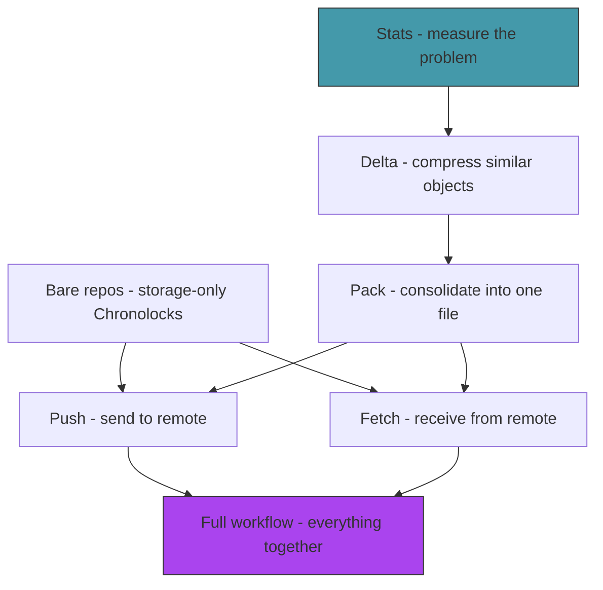

# Act 5 — The Archive

> *The Chronolock works. You can store, branch, merge, and recover. But every version of every file sits in its own compressed blob — a library where every edition of every book occupies its own shelf. In this final act, you make the archive efficient and connected: delta compression shrinks storage, pack files consolidate objects, and remote communication lets two Chronolocks share history.*

This act is about engineering — taking a correct system and making it practical. The concepts here (delta compression, pack files, remote protocols) are what separate a toy from a tool.


---

## Stage 29 — Counting the Cost

> *Before optimizing, measure. How much space does the Chronolock actually waste? If you have a 10KB file and make 50 commits that each change one line, the naive approach stores 50 × 10KB = 500KB of nearly identical blobs.*

*Difficulty: Easy* | *~40 min*

> [!tip] What You'll Learn
> - Walking the object store to count objects and measure size
> - Comparing compressed vs uncompressed sizes
> - Understanding the duplication problem
> - Why optimization matters for real repositories

### 29.1 — Try it yourself: the stats command

Create `src/stats.rs` (remember to add `mod stats;` to `main.rs`). Write a function that:

1. Walks `.chronolock/objects/` — each 2-char subdirectory, each file within
2. Skips the `pack/` subdirectory
3. For each object: reads the compressed size from filesystem metadata, decompresses to get the type and uncompressed size
4. Returns totals: object count, blob/tree/commit counts, compressed bytes, uncompressed bytes

The function signature:

```rust
pub struct StoreStats {
    pub object_count: usize,
    pub total_compressed: u64,
    pub total_uncompressed: u64,
    pub blobs: usize,
    pub trees: usize,
    pub commits: usize,
}

pub fn collect_stats() -> std::io::Result<StoreStats> {
    todo!()
}
```

Hints:
- `fs::read_dir(objects_dir)?` to iterate prefix directories
- `entry.metadata()?.len()` for compressed file size
- Reconstruct the hash from `prefix + suffix` to call `object::read_object`

<details>
<summary>Solution — click to reveal</summary>

```rust
use std::fs;
use std::path::Path;

pub struct StoreStats {
    pub object_count: usize,
    pub total_compressed: u64,
    pub total_uncompressed: u64,
    pub blobs: usize,
    pub trees: usize,
    pub commits: usize,
}

pub fn collect_stats() -> std::io::Result<StoreStats> {
    let objects_dir = Path::new(".chronolock/objects");
    let mut stats = StoreStats {
        object_count: 0, total_compressed: 0, total_uncompressed: 0,
        blobs: 0, trees: 0, commits: 0,
    };

    if !objects_dir.exists() {
        return Ok(stats);
    }

    for prefix_entry in fs::read_dir(objects_dir)? {
        let prefix_entry = prefix_entry?;
        let prefix_path = prefix_entry.path();
        if !prefix_path.is_dir() || prefix_entry.file_name() == "pack" {
            continue;
        }

        let prefix = prefix_entry.file_name().to_string_lossy().to_string();
        for obj_entry in fs::read_dir(&prefix_path)? {
            let obj_entry = obj_entry?;
            if !obj_entry.path().is_file() { continue; }

            stats.total_compressed += obj_entry.metadata()?.len();
            stats.object_count += 1;

            let suffix = obj_entry.file_name().to_string_lossy().to_string();
            let hash = format!("{}{}", prefix, suffix);
            if let Ok(obj) = crate::object::read_object(&hash) {
                stats.total_uncompressed += obj.size as u64;
                match obj.obj_type {
                    crate::object::ObjectType::Blob => stats.blobs += 1,
                    crate::object::ObjectType::Tree => stats.trees += 1,
                    crate::object::ObjectType::Commit => stats.commits += 1,
                }
            }
        }
    }

    Ok(stats)
}
```

</details>

Wire it up:

```rust
/// Show object store statistics
Stats,
```

```rust
Commands::Stats => {
    let s = stats::collect_stats().unwrap_or_else(|e| {
        eprintln!("Failed to collect stats: {}", e);
        std::process::exit(1);
    });
    println!("Object store statistics:");
    println!("  Objects:      {} ({} blobs, {} trees, {} commits)",
        s.object_count, s.blobs, s.trees, s.commits);
    println!("  Compressed:   {} bytes", s.total_compressed);
    println!("  Uncompressed: {} bytes", s.total_uncompressed);
    if s.total_uncompressed > 0 {
        let ratio = s.total_compressed as f64 / s.total_uncompressed as f64;
        println!("  Ratio:        {:.1}%", ratio * 100.0);
    }
}
```

### 29.2 — Test it

```bash
# Make several commits with small changes to see duplication
for i in $(seq 1 10); do
    echo "Line $i" >> growing.txt
    cargo run -- anchor -m "Add line $i"
done

cargo run -- stats
```

```
Object store statistics:
  Objects:      31 (11 blobs, 10 trees, 10 commits)
  Compressed:   2847 bytes
  Uncompressed: 4523 bytes
  Ratio:        63.0%
```

Zlib compression helps, but we're still storing 11 nearly-identical versions of `growing.txt`. Each blob differs by one line, yet each is stored independently. Delta compression would store the first version in full and each subsequent version as "the previous version plus one line."

### Extend it

Add a `--verbose` flag that lists each object with its type, compressed size, and uncompressed size. Sort by uncompressed size descending to find the biggest objects.

> [!check] Checkpoint
> Run `chronolock stats` and observe the object count growing with each commit. Understand that similar blobs are stored independently. Stage 29 complete.

---

## Stage 30 — The Delta

> *Instead of storing every version of a file in full, we can store the difference between two similar versions. The first version (the "base") is stored in full. Subsequent versions are stored as a delta: "take the base, apply these insertions and deletions."*

*Difficulty: Hard* | *~90 min*

> [!tip] What You'll Learn
> - Delta encoding — representing changes as instructions
> - A simple delta format: copy and insert operations
> - Applying a delta to reconstruct the original
> - Why finding good delta bases matters

### The delta format

Our delta format uses two operations:

- **Copy(offset, length)** — copy `length` bytes starting at `offset` from the base object
- **Insert(data)** — insert literal bytes

A delta is a sequence of these operations. Applying them in order against the base reconstructs the target.

**Python comparison:** Think of `diff` and `patch`. A delta is like a patch file — instructions for transforming one version into another. But instead of line-based diffs, we work at the byte level for efficiency.

### 30.1 — Try it yourself: delta computation

Create `src/delta.rs`. Implement these three functions:

```rust
#[derive(Debug)]
pub enum DeltaOp {
    Copy(usize, usize),   // (offset in base, length)
    Insert(Vec<u8>),       // literal bytes to insert
}

/// Compute a delta from `base` to `target`.
pub fn compute_delta(base: &[u8], target: &[u8]) -> Vec<DeltaOp> {
    // Walk through target bytes. At each position:
    // - Try to find the longest match in base (at least 8 bytes)
    // - If found: emit Copy(offset, length)
    // - If not: collect bytes into an Insert until a match is found
    todo!()
}

/// Apply a delta to a base to reconstruct the target.
pub fn apply_delta(base: &[u8], ops: &[DeltaOp]) -> Vec<u8> {
    // Walk through ops, building the result:
    // - Copy: append base[offset..offset+length]
    // - Insert: append the literal bytes
    todo!()
}
```

The matching function (helper for `compute_delta`):

```rust
/// Find the longest match of the start of `needle` in `haystack`.
fn find_longest_match(haystack: &[u8], needle: &[u8]) -> (usize, usize) {
    // Simple O(n*m) search — try every offset in haystack,
    // count how many bytes match from the start of needle
    todo!()
}
```

<details>
<summary>Solution — click to reveal</summary>

```rust
pub fn compute_delta(base: &[u8], target: &[u8]) -> Vec<DeltaOp> {
    let mut ops = Vec::new();
    let mut target_pos = 0;

    while target_pos < target.len() {
        let (best_offset, best_length) = find_longest_match(base, &target[target_pos..]);

        if best_length >= 8 {
            ops.push(DeltaOp::Copy(best_offset, best_length));
            target_pos += best_length;
        } else {
            let insert_start = target_pos;
            target_pos += 1;
            while target_pos < target.len() {
                let (_, len) = find_longest_match(base, &target[target_pos..]);
                if len >= 8 { break; }
                target_pos += 1;
            }
            ops.push(DeltaOp::Insert(target[insert_start..target_pos].to_vec()));
        }
    }

    ops
}

fn find_longest_match(haystack: &[u8], needle: &[u8]) -> (usize, usize) {
    let mut best_offset = 0;
    let mut best_length = 0;

    for offset in 0..haystack.len() {
        let mut length = 0;
        while offset + length < haystack.len()
            && length < needle.len()
            && haystack[offset + length] == needle[length]
        {
            length += 1;
        }
        if length > best_length {
            best_offset = offset;
            best_length = length;
        }
    }

    (best_offset, best_length)
}

pub fn apply_delta(base: &[u8], ops: &[DeltaOp]) -> Vec<u8> {
    let mut result = Vec::new();
    for op in ops {
        match op {
            DeltaOp::Copy(offset, length) => {
                result.extend_from_slice(&base[*offset..*offset + *length]);
            }
            DeltaOp::Insert(data) => {
                result.extend_from_slice(data);
            }
        }
    }
    result
}
```

</details>

### 30.2 — Serialization

We also need to serialize deltas to bytes for storage. Add:

```rust
/// Serialize delta operations to bytes.
pub fn serialize_delta(base_size: usize, target_size: usize, ops: &[DeltaOp]) -> Vec<u8> {
    let mut bytes = Vec::new();
    encode_varint(base_size, &mut bytes);
    encode_varint(target_size, &mut bytes);

    for op in ops {
        match op {
            DeltaOp::Copy(offset, length) => {
                bytes.push(0x80); // high bit set = copy
                encode_varint(*offset, &mut bytes);
                encode_varint(*length, &mut bytes);
            }
            DeltaOp::Insert(data) => {
                assert!(data.len() <= 127, "Insert too large");
                bytes.push(data.len() as u8); // high bit clear = insert
                bytes.extend_from_slice(data);
            }
        }
    }

    bytes
}

fn encode_varint(mut value: usize, buf: &mut Vec<u8>) {
    loop {
        let mut byte = (value & 0x7F) as u8;
        value >>= 7;
        if value > 0 { byte |= 0x80; }
        buf.push(byte);
        if value == 0 { break; }
    }
}
```

### Concept: Variable-length integers (varints)

The `encode_varint` function encodes a number using as few bytes as possible. Small numbers (< 128) use 1 byte. Larger numbers use more. The high bit of each byte signals "more bytes follow."

This is a common pattern in binary formats — it saves space when most values are small (like offsets and lengths in a delta).

> [!note] Simplification
> Real git uses a more sophisticated delta algorithm with hash-based matching (similar to rsync). Our O(n*m) approach works for learning but would be too slow for large files. The concept is identical — only the matching speed differs.

### 30.3 — Test delta compression

Add tests to `delta.rs`:

```rust
#[cfg(test)]
mod tests {
    use super::*;

    #[test]
    fn test_delta_round_trip() {
        let base = b"Hello, world! This is a test file with some content.";
        let target = b"Hello, world! This is a modified file with some content.";

        let ops = compute_delta(base, target);
        let reconstructed = apply_delta(base, &ops);
        assert_eq!(reconstructed, target);
    }

    #[test]
    fn test_delta_identical() {
        let data = b"identical content";
        let ops = compute_delta(data, data);
        let reconstructed = apply_delta(data, &ops);
        assert_eq!(reconstructed, data);
    }

    #[test]
    fn test_delta_completely_different() {
        let base = b"aaaaaaaaaa";
        let target = b"bbbbbbbbbb";
        let ops = compute_delta(base, target);
        let reconstructed = apply_delta(base, &ops);
        assert_eq!(reconstructed, target);
    }
}
```

```bash
cargo test
```

### Extend it

Compute the delta between two versions of `growing.txt` (from Stage 29) and compare the delta size to the full blob size. How much space does delta compression save for a file where only one line was added?

> [!check] Checkpoint
> The delta module can compute a delta between two byte sequences and apply it to reconstruct the target. All round-trip tests pass. Stage 30 complete.

---

## Stage 31 — The Pack File

> *Every object is a separate file in `objects/`. A repository with 10,000 objects has 10,000 files spread across 256 directories. Pack files solve this by concatenating all objects into a single `.pack` file with an `.idx` index for O(1) lookup.*

*Difficulty: Hard* | *~90 min*

> [!tip] What You'll Learn
> - The pack file format — a sequence of compressed objects
> - The index file — mapping hashes to offsets
> - Packing loose objects into a single file
> - Reading objects from pack files transparently

### The pack format (simplified)

```
PACK                    ← 4-byte magic
<version: u32>          ← version number (1)
<count: u32>            ← number of objects
<entry>...              ← one per object
```

Each entry:

```
<hash: 20 bytes>        ← SHA-1 hash
<type: u8>              ← 1=blob, 2=tree, 3=commit
<size: u32>             ← uncompressed size
<compressed_size: u32>  ← compressed data length
<compressed data>       ← zlib-compressed object content
```

### 31.1 — Try it yourself: the pack function

Create `src/pack.rs`. The `pack_objects` function should:

1. Walk all loose objects (same as `collect_stats`)
2. Read each object's type and content
3. Write them sequentially into a single `.pack` file with the format above
4. Write a JSON index mapping hash → byte offset
5. Delete the loose object files

```rust
use crate::object::{self, ObjectType};
use flate2::write::ZlibEncoder;
use flate2::Compression;
use std::collections::HashMap;
use std::fs;
use std::io::Write;
use std::path::Path;

const PACK_MAGIC: &[u8] = b"PACK";
const PACK_VERSION: u32 = 1;

pub fn pack_objects() -> std::io::Result<usize> {
    // 1. Collect all loose objects: (hash, type, content)
    // 2. Write pack file header (magic + version + count)
    // 3. For each object: write hash + type byte + sizes + compressed content
    // 4. Build index: hash → offset
    // 5. Write index as JSON
    // 6. Delete loose objects
    todo!()
}
```

You'll need `serde` and `serde_json` for the index. Add to `Cargo.toml`:

```toml
serde = { version = "1", features = ["derive"] }
serde_json = "1"
```

Also make `hex_to_bytes` public in `object.rs`:

```rust
pub fn hex_to_bytes_pub(hex: &str) -> std::io::Result<Vec<u8>> {
    hex_to_bytes(hex)
}
```

<details>
<summary>Solution — click to reveal</summary>

```rust
pub fn pack_objects() -> std::io::Result<usize> {
    let objects_dir = Path::new(".chronolock/objects");
    let pack_dir = objects_dir.join("pack");
    fs::create_dir_all(&pack_dir)?;

    // Collect all loose objects
    let mut entries: Vec<(String, ObjectType, Vec<u8>)> = Vec::new();

    for prefix_entry in fs::read_dir(objects_dir)? {
        let prefix_entry = prefix_entry?;
        let prefix_path = prefix_entry.path();
        if !prefix_path.is_dir() || prefix_entry.file_name() == "pack" {
            continue;
        }

        let prefix = prefix_entry.file_name().to_string_lossy().to_string();
        for obj_entry in fs::read_dir(&prefix_path)? {
            let obj_entry = obj_entry?;
            let suffix = obj_entry.file_name().to_string_lossy().to_string();
            let hash = format!("{}{}", prefix, suffix);
            let obj = object::read_object(&hash)?;
            entries.push((hash, obj.obj_type, obj.content));
        }
    }

    if entries.is_empty() {
        println!("No loose objects to pack.");
        return Ok(0);
    }

    let count = entries.len();
    let mut pack_data: Vec<u8> = Vec::new();

    // Header
    pack_data.extend_from_slice(PACK_MAGIC);
    pack_data.extend_from_slice(&PACK_VERSION.to_be_bytes());
    pack_data.extend_from_slice(&(count as u32).to_be_bytes());

    let mut index: HashMap<String, u64> = HashMap::new();

    for (hash, obj_type, content) in &entries {
        let offset = pack_data.len() as u64;
        index.insert(hash.clone(), offset);

        // Hash (20 bytes)
        let hash_bytes = object::hex_to_bytes_pub(hash)?;
        pack_data.extend_from_slice(&hash_bytes);

        // Type (1 byte)
        let type_byte: u8 = match obj_type {
            ObjectType::Blob => 1,
            ObjectType::Tree => 2,
            ObjectType::Commit => 3,
        };
        pack_data.push(type_byte);

        // Uncompressed size (4 bytes)
        pack_data.extend_from_slice(&(content.len() as u32).to_be_bytes());

        // Compressed content
        let mut encoder = ZlibEncoder::new(Vec::new(), Compression::default());
        encoder.write_all(content)?;
        let compressed = encoder.finish()?;

        pack_data.extend_from_slice(&(compressed.len() as u32).to_be_bytes());
        pack_data.extend_from_slice(&compressed);
    }

    fs::write(pack_dir.join("main.pack"), &pack_data)?;

    let idx_json = serde_json::to_string(&index)
        .map_err(|e| std::io::Error::new(std::io::ErrorKind::Other, e))?;
    fs::write(pack_dir.join("main.idx"), idx_json)?;

    // Remove loose objects
    for (hash, _, _) in &entries {
        let loose = objects_dir.join(&hash[..2]).join(&hash[2..]);
        let _ = fs::remove_file(&loose);
        let prefix_dir = objects_dir.join(&hash[..2]);
        if prefix_dir.read_dir()?.next().is_none() {
            let _ = fs::remove_dir(&prefix_dir);
        }
    }

    Ok(count)
}
```

</details>

### 31.2 — Reading from pack files

The key integration: update `read_object` in `object.rs` to fall back to pack files when a loose object isn't found. The rest of the codebase doesn't need to know whether an object is loose or packed.

```rust
pub fn read_object(hash: &str) -> std::io::Result<Object> {
    // Try loose object first
    let loose_path = Path::new(".chronolock/objects")
        .join(&hash[..2])
        .join(&hash[2..]);

    if loose_path.exists() {
        return read_loose_object(&loose_path);
    }

    // Try pack file
    read_from_pack(hash)
}
```

Implement `read_from_pack`: load the JSON index, find the offset, seek to it in the pack file, read the entry.

### 31.3 — Wire it up

```rust
/// Pack loose objects into a pack file
Pack,
```

```rust
Commands::Pack => {
    let count = pack::pack_objects().unwrap_or_else(|e| {
        eprintln!("Pack failed: {}", e);
        std::process::exit(1);
    });
    println!("Packed {} objects.", count);
}
```

### 31.4 — Test it

```bash
cargo run -- stats
# Note the object count

cargo run -- pack
# Packed N objects.

cargo run -- stats
# Objects should now be 0 loose (all packed)

# Verify everything still works transparently
cargo run -- log
cargo run -- status
cargo run -- reveal <some-hash>
```

All commands should work identically — the pack file is transparent to the rest of the system.

> [!warning] Common Mistake: Forgetting to update `read_object`
> If you pack objects but don't add the pack-file fallback to `read_object`, every command that reads objects will break with "object not found." The pack integration must be in `read_object` so it's automatic.

### Extend it

Run `chronolock stats` before and after packing. Compare the total disk usage (compressed bytes) of loose objects vs the pack file size. The pack file should be slightly smaller due to reduced filesystem overhead (one file vs hundreds).

> [!check] Checkpoint
> Pack all loose objects. Verify `stats` shows 0 loose objects. Verify `log`, `status`, and `reveal` still work. Stage 31 complete.

---

## Stage 32 — The Other Chronolock

> *Before we can push and pull, we need bare repositories: Chronolocks that store objects and refs but have no working directory. They exist solely to receive and serve history.*

*Difficulty: Medium* | *~50 min*

> [!tip] What You'll Learn
> - Bare repositories — what they are and why they exist
> - `chronolock init --bare` — creating a bare repo
> - The concept of a "remote" — a reference to another repository
> - Why servers use bare repos (no working directory to conflict with)

### Why bare?

A normal repository has a working directory — the actual files you edit. A bare repository has only the `.chronolock/` internals (objects, refs, HEAD) without a working directory. Why?

When you push to a remote, you're updating its refs and adding objects. If the remote had a working directory, pushing would make the working directory out of sync with HEAD — confusing and dangerous. Bare repos avoid this by having no working directory to desync.

### 32.1 — Init bare

Update the `Init` command to support `--bare`:

```rust
Init {
    /// Create a bare repository (no working directory)
    #[arg(long)]
    bare: bool,
},
```

```rust
fn init_bare() {
    // Bare repos store objects and refs directly in the current directory
    fs::create_dir_all("objects").expect("Failed to create objects/");
    fs::create_dir_all("refs/heads").expect("Failed to create refs/heads/");
    fs::write("HEAD", "ref: refs/heads/main\n").expect("Failed to write HEAD");
    println!("Bare Chronolock forged.");
}
```

### 32.2 — Remote configuration

Create `src/remote.rs`:

```rust
use std::fs;
use std::path::Path;

/// Add a remote (just a path to another repository for now).
pub fn add_remote(name: &str, path: &str) -> std::io::Result<()> {
    let remotes_dir = Path::new(".chronolock/remotes");
    fs::create_dir_all(remotes_dir)?;
    fs::write(remotes_dir.join(name), format!("{}\n", path))
}

/// Read a remote's path.
pub fn get_remote(name: &str) -> std::io::Result<Option<String>> {
    let path = Path::new(".chronolock/remotes").join(name);
    if path.exists() {
        let content = fs::read_to_string(&path)?;
        Ok(Some(content.trim().to_string()))
    } else {
        Ok(None)
    }
}
```

For this course, remotes are local filesystem paths (not network URLs). This keeps the focus on the data transfer protocol rather than networking.

### 32.3 — Wire it up

Add `mod remote;` to `main.rs`. Add the subcommand:

```rust
/// Manage remote Chronolocks
Remote {
    /// Action: "add"
    action: String,
    /// Remote name
    name: String,
    /// Remote path
    path: Option<String>,
},
```

```rust
Commands::Remote { action, name, path } => {
    match action.as_str() {
        "add" => {
            let p = path.unwrap_or_else(|| {
                eprintln!("Usage: chronolock remote add <name> <path>");
                std::process::exit(1);
            });
            remote::add_remote(&name, &p).unwrap_or_else(|e| {
                eprintln!("Failed to add remote: {}", e);
                std::process::exit(1);
            });
            println!("Remote '{}' added: {}", name, p);
        }
        _ => eprintln!("Unknown remote action: {}", action),
    }
}
```

### 32.4 — Test it

```bash
# Create a bare remote
mkdir -p /tmp/chronolock-remote
cd /tmp/chronolock-remote
chronolock init --bare

# Back in your project, add the remote
cd ~/juk/chronolock
cargo run -- remote add origin /tmp/chronolock-remote

# Verify
cat .chronolock/remotes/origin
```

> [!note] Local remotes
> Real git supports `file://`, `ssh://`, `https://` remotes. We use filesystem paths because the interesting part isn't the transport — it's the object negotiation (what does the remote need that I have?). The protocol is the same regardless of transport.

### Extend it

Add a `chronolock remote list` action that reads all files in `.chronolock/remotes/` and prints each remote name and path.

> [!check] Checkpoint
> Create a bare repository. Add it as a remote. Verify the remote path is stored in `.chronolock/remotes/origin`. Stage 32 complete.

---

## Stage 33 — Sending Memories

> *Pushing isn't "copy everything." It's "figure out what the remote is missing, then send only that." This is object negotiation — the Chronolock compares its refs with the remote's, walks the commit graph to find missing objects, and transfers them.*

*Difficulty: Hard* | *~75 min*

> [!tip] What You'll Learn
> - Object negotiation — finding what the remote needs
> - Walking the commit graph to collect reachable objects
> - Copying objects between repositories
> - Updating remote refs after a successful push

### 33.1 — Collect reachable objects

Add to `src/remote.rs`:

```rust
use crate::object;
use std::collections::HashSet;

/// Collect all object hashes reachable from a commit.
/// Walks commits, trees, and blobs recursively.
pub fn collect_reachable(commit_hash: &str) -> std::io::Result<HashSet<String>> {
    let mut visited = HashSet::new();
    collect_reachable_inner(commit_hash, &mut visited)?;
    Ok(visited)
}

fn collect_reachable_inner(hash: &str, visited: &mut HashSet<String>) -> std::io::Result<()> {
    if visited.contains(hash) {
        return Ok(());
    }
    visited.insert(hash.to_string());

    let obj = object::read_object(hash)?;
    match obj.obj_type {
        object::ObjectType::Commit => {
            let info = object::parse_commit(&obj.content);
            collect_reachable_inner(&info.tree, visited)?;
            for parent in &info.parents {
                collect_reachable_inner(parent, visited)?;
            }
        }
        object::ObjectType::Tree => {
            let entries = object::parse_tree(&obj.content);
            for entry in entries {
                collect_reachable_inner(&entry.hash, visited)?;
            }
        }
        object::ObjectType::Blob => {} // leaf node
    }
    Ok(())
}
```

### Concept: Graph traversal and ownership

`collect_reachable_inner` takes `&mut HashSet<String>` — a mutable reference to the visited set. Every recursive call shares the same set. This is safe because:

1. Only one mutable reference exists at a time (Rust enforces this)
2. The recursive calls are sequential, not parallel
3. The set grows monotonically — we only insert, never remove

If you tried to pass the set by value, each recursive call would own its own copy and the visited tracking wouldn't work. If you tried `&HashSet` (immutable), you couldn't insert. The `&mut` is exactly right.

### 33.2 — Try it yourself: the push function

Implement `push` in `remote.rs`:

```rust
/// Push a branch to a remote repository.
pub fn push(remote_path: &str, branch: &str) -> std::io::Result<()> {
    // 1. Read local branch hash
    // 2. Read remote branch hash (if it exists)
    // 3. Collect reachable objects from local
    // 4. Collect reachable objects from remote (if any)
    // 5. Compute the difference (local - remote = objects to send)
    // 6. Copy each missing object file to the remote's objects/ dir
    // 7. Update the remote's refs/heads/<branch> file
    todo!()
}
```

<details>
<summary>Solution — click to reveal</summary>

```rust
pub fn push(remote_path: &str, branch: &str) -> std::io::Result<()> {
    let local_ref = crate::refs::read_branch(branch)?
        .ok_or_else(|| std::io::Error::new(
            std::io::ErrorKind::NotFound,
            format!("Local branch '{}' not found", branch),
        ))?;

    // Check what the remote already has
    let remote_ref_path = Path::new(remote_path).join("refs/heads").join(branch);
    let remote_has: HashSet<String> = if remote_ref_path.exists() {
        let remote_hash = fs::read_to_string(&remote_ref_path)?.trim().to_string();
        collect_reachable(&remote_hash).unwrap_or_default()
    } else {
        HashSet::new()
    };

    // Collect what we need to send
    let local_objects = collect_reachable(&local_ref)?;
    let to_send: Vec<&String> = local_objects.difference(&remote_has).collect();

    if to_send.is_empty() {
        println!("Everything up to date.");
        return Ok(());
    }

    println!("Sending {} objects...", to_send.len());

    let remote_objects = Path::new(remote_path).join("objects");
    for hash in &to_send {
        let src = Path::new(".chronolock/objects")
            .join(&hash[..2]).join(&hash[2..]);
        if src.exists() {
            let dst_dir = remote_objects.join(&hash[..2]);
            fs::create_dir_all(&dst_dir)?;
            let dst = dst_dir.join(&hash[2..]);
            if !dst.exists() {
                fs::copy(&src, &dst)?;
            }
        }
    }

    // Update the remote's branch ref
    let remote_refs = Path::new(remote_path).join("refs/heads");
    fs::create_dir_all(&remote_refs)?;
    fs::write(remote_refs.join(branch), format!("{}\n", local_ref))?;

    println!("Pushed {} to {}/{}", &local_ref[..8], remote_path, branch);
    Ok(())
}
```

</details>

### 33.3 — Wire it up

```rust
/// Send history to a remote Chronolock
Send {
    /// Remote name
    remote: String,
    /// Branch to push
    branch: String,
},
```

```rust
Commands::Send { remote: remote_name, branch } => {
    let remote_path = remote::get_remote(&remote_name).unwrap_or_else(|e| {
        eprintln!("Failed to read remote: {}", e);
        std::process::exit(1);
    }).unwrap_or_else(|| {
        eprintln!("Remote '{}' not found.", remote_name);
        std::process::exit(1);
    });
    remote::push(&remote_path, &branch).unwrap_or_else(|e| {
        eprintln!("Push failed: {}", e);
        std::process::exit(1);
    });
}
```

### 33.4 — Test it

```bash
cargo run -- send origin main
```

```
Sending 31 objects...
Pushed e5f8a2b4 to /tmp/chronolock-remote/main
```

Verify the remote has the objects:

```bash
GIT_DIR=/tmp/chronolock-remote git log --oneline
```

Git should show the same history as your local repository.

> [!warning] Common Mistake: Pushing packed objects
> If you packed objects before pushing, the loose files won't exist to copy. A production implementation would need to read from pack files during push. For now, push before packing (or unpack first).

### Extend it

Push a second time without making changes. Verify it prints "Everything up to date" — the set difference is empty because the remote already has everything.

> [!check] Checkpoint
> Push to the bare remote. Verify the remote contains all objects and the branch ref is updated. Verify `git log` works on the remote. Stage 33 complete.

---

## Stage 34 — Receiving Memories

> *The inverse of push: read the remote's refs, find objects we don't have, copy them locally, and update our tracking refs.*

*Difficulty: Hard* | *~75 min*

> [!tip] What You'll Learn
> - Fetching remote refs
> - Downloading missing objects
> - Remote-tracking branches (`refs/remotes/origin/main`)
> - The fetch-then-merge workflow

### 34.1 — The fetch function

The challenge: we need to walk the remote's commit graph to find reachable objects, but the objects are in the *remote's* object store, not ours. We need to read objects from the remote path.

Add to `src/remote.rs`:

```rust
/// Fetch objects and refs from a remote.
pub fn fetch(remote_path: &str, remote_name: &str) -> std::io::Result<()> {
    let remote_refs_dir = Path::new(remote_path).join("refs/heads");
    if !remote_refs_dir.exists() {
        println!("Remote has no branches.");
        return Ok(());
    }

    for entry in fs::read_dir(&remote_refs_dir)? {
        let entry = entry?;
        let branch = entry.file_name().to_string_lossy().to_string();
        let remote_hash = fs::read_to_string(entry.path())?.trim().to_string();

        // Collect all objects reachable from the remote's branch tip
        let remote_objects = collect_reachable_from_remote(&remote_hash, remote_path)?;

        // Figure out which ones we're missing locally
        let to_fetch: Vec<&String> = remote_objects.iter()
            .filter(|h| !object_exists_locally(h))
            .collect();

        if !to_fetch.is_empty() {
            println!("Fetching {} objects for {}...", to_fetch.len(), branch);

            let remote_obj_dir = Path::new(remote_path).join("objects");
            let local_obj_dir = Path::new(".chronolock/objects");

            for hash in &to_fetch {
                let src = remote_obj_dir.join(&hash[..2]).join(&hash[2..]);
                if src.exists() {
                    let dst_dir = local_obj_dir.join(&hash[..2]);
                    fs::create_dir_all(&dst_dir)?;
                    let dst = dst_dir.join(&hash[2..]);
                    if !dst.exists() {
                        fs::copy(&src, &dst)?;
                    }
                }
            }
        }

        // Update remote-tracking ref
        let tracking_dir = Path::new(".chronolock/refs/remotes").join(remote_name);
        fs::create_dir_all(&tracking_dir)?;
        fs::write(tracking_dir.join(&branch), format!("{}\n", remote_hash))?;

        println!("Updated {}/{} -> {}", remote_name, branch, &remote_hash[..8]);
    }

    Ok(())
}

fn collect_reachable_from_remote(
    hash: &str,
    remote_path: &str,
) -> std::io::Result<HashSet<String>> {
    let mut visited = HashSet::new();
    collect_from_remote_inner(hash, remote_path, &mut visited)?;
    Ok(visited)
}

fn collect_from_remote_inner(
    hash: &str,
    remote_path: &str,
    visited: &mut HashSet<String>,
) -> std::io::Result<()> {
    if visited.contains(hash) {
        return Ok(());
    }
    visited.insert(hash.to_string());

    let obj_path = Path::new(remote_path)
        .join("objects").join(&hash[..2]).join(&hash[2..]);
    if !obj_path.exists() {
        return Ok(());
    }

    // Read and parse the object directly from the remote's store
    use flate2::read::ZlibDecoder;
    use std::io::Read;

    let compressed = fs::read(&obj_path)?;
    let mut decoder = ZlibDecoder::new(&compressed[..]);
    let mut raw = Vec::new();
    decoder.read_to_end(&mut raw)?;

    let null_pos = raw.iter().position(|&b| b == 0).unwrap_or(0);
    let header = std::str::from_utf8(&raw[..null_pos]).unwrap_or("");
    let content = &raw[null_pos + 1..];

    if header.starts_with("commit") {
        let info = object::parse_commit(content);
        collect_from_remote_inner(&info.tree, remote_path, visited)?;
        for parent in &info.parents {
            collect_from_remote_inner(parent, remote_path, visited)?;
        }
    } else if header.starts_with("tree") {
        let entries = object::parse_tree(content);
        for entry in entries {
            collect_from_remote_inner(&entry.hash, remote_path, visited)?;
        }
    }

    Ok(())
}

fn object_exists_locally(hash: &str) -> bool {
    Path::new(".chronolock/objects")
        .join(&hash[..2]).join(&hash[2..])
        .exists()
}
```

### 34.2 — Wire it up

```rust
/// Receive history from a remote Chronolock
Receive {
    /// Remote name
    remote: String,
},
```

```rust
Commands::Receive { remote: remote_name } => {
    let remote_path = remote::get_remote(&remote_name).unwrap_or_else(|e| {
        eprintln!("Failed to read remote: {}", e);
        std::process::exit(1);
    }).unwrap_or_else(|| {
        eprintln!("Remote '{}' not found.", remote_name);
        std::process::exit(1);
    });
    remote::fetch(&remote_path, &remote_name).unwrap_or_else(|e| {
        eprintln!("Fetch failed: {}", e);
        std::process::exit(1);
    });
}
```

### 34.3 — Test the round trip

```bash
# Clone scenario: create a new repo and fetch from the remote
mkdir -p /tmp/chronolock-clone
cd /tmp/chronolock-clone
chronolock init
cargo run -- remote add origin /tmp/chronolock-remote
cargo run -- receive origin
```

```
Fetching 31 objects for main...
Updated origin/main -> e5f8a2b4
```

The clone now has all the objects and a remote-tracking ref at `refs/remotes/origin/main`.

> [!note] Fetch vs pull
> `receive` (fetch) downloads objects and updates tracking refs, but doesn't change your working directory or local branches. To actually use the fetched data, you'd merge the tracking ref into your local branch. Real git's `pull` is just `fetch` + `merge` combined.

### Extend it

After fetching, manually set your local `main` to match the remote: copy the hash from `refs/remotes/origin/main` to `refs/heads/main`, then run `chronolock shift main` to update the working directory. This is what `git pull` does under the hood.

> [!check] Checkpoint
> Fetch from a remote into a new repository. Verify all objects are transferred and remote-tracking refs are created. Stage 34 complete.

---

## Stage 35 — The Complete Chronolock

> *The Chronolock is complete. This final stage is about verification — running through the entire workflow end-to-end, confirming git compatibility at every step, and reflecting on what you've built.*

*Difficulty: Medium* | *~60 min*

> [!tip] What You'll Learn
> - End-to-end integration testing
> - Git compatibility verification
> - The complete command set working together
> - What you've actually built (and what real git does differently)

### 35.1 — The full workflow test

Run through every command in sequence:

```bash
# Start fresh
rm -rf /tmp/chronolock-test
mkdir /tmp/chronolock-test
cd /tmp/chronolock-test

# Initialize
chronolock init

# Create some files
echo 'fn main() { println!("Chronolock"); }' > main.rs
echo "# The Chronolock" > README.md

# First commit
chronolock anchor -m "Initial commit"

# Create a feature branch
chronolock branch feature
chronolock shift feature

# Work on the feature
echo "fn helper() {}" > helper.rs
chronolock anchor -m "Add helper"

# Switch back to main
chronolock shift main

# Work on main
echo "## Usage" >> README.md
chronolock anchor -m "Update README"

# Merge feature into main
chronolock converge feature

# View the history
chronolock log

# Check status
chronolock status

# View stats
chronolock stats

# Pack objects
chronolock pack

# Push to a remote
mkdir -p /tmp/chronolock-remote-test
cd /tmp/chronolock-remote-test
chronolock init --bare
cd /tmp/chronolock-test
chronolock remote add origin /tmp/chronolock-remote-test
chronolock send origin main

# Verify with git at every step
GIT_DIR=.chronolock git log --oneline --graph
GIT_DIR=.chronolock git cat-file -p HEAD
```

### 35.2 — Git compatibility checklist

Verify each command produces git-compatible output:

| Command | Git equivalent | How to verify |
|---------|---------------|---------------|
| `chronolock init` | `git init` | `GIT_DIR=.chronolock git status` |
| `chronolock store` | `git hash-object -w` | `GIT_DIR=.chronolock git cat-file -p <hash>` |
| `chronolock reveal` | `git cat-file -p` | Compare output with git's |
| `chronolock anchor` | `git add . && git commit` | `GIT_DIR=.chronolock git log` |
| `chronolock log` | `git log` | Compare commit hashes |
| `chronolock branch` | `git branch` | `GIT_DIR=.chronolock git branch` |
| `chronolock shift` | `git checkout` | Verify HEAD file content |
| `chronolock converge` | `git merge` | `GIT_DIR=.chronolock git log --graph` |
| `chronolock send` | `git push` | `GIT_DIR=<remote> git log` |

### 35.3 — What real git does differently

| Feature | Chronolock | Real git |
|---------|-----------|----------|
| Index format | Stage-on-commit | Binary index file with stat cache |
| Delta compression | Simple longest-match | Window-based with hash chains |
| Pack index | JSON | Binary fan-out table |
| Network protocol | Filesystem copy | Smart HTTP / SSH / git:// |
| Merge algorithm | Simple three-way | Recursive (handles criss-cross merges) |
| Reflog retention | Forever | 90 days (configurable) |
| Garbage collection | Manual pack | Auto-gc with reachability analysis |

These differences are engineering optimizations, not conceptual ones. The data model — content-addressed objects, trees, commits, refs — is identical.

### 35.4 — Write a final test suite

Add integration tests that exercise the full workflow programmatically:

```rust
#[cfg(test)]
mod integration_tests {
    use std::process::Command;

    #[test]
    fn test_init_creates_structure() {
        let dir = std::env::temp_dir().join("chronolock-test-init");
        let _ = std::fs::remove_dir_all(&dir);
        std::fs::create_dir_all(&dir).unwrap();

        // Run chronolock init in the temp directory
        // Verify .chronolock/HEAD, objects/, refs/heads/ exist
        // Clean up
        let _ = std::fs::remove_dir_all(&dir);
    }

    #[test]
    fn test_store_and_reveal_roundtrip() {
        // Store a file, reveal it, verify content matches
    }

    #[test]
    fn test_anchor_creates_commit_chain() {
        // Create two commits, verify parent chain
    }
}
```

Fill in these tests as a final exercise — they verify that your entire system works end-to-end.

> [!check] Checkpoint
> Run the full workflow. Verify git can read every object the Chronolock creates. Stage 35 complete.

---

## Act 5 Complete — The Archive



| Rust Concept | Where You Used It |
|-------------|-------------------|
| `HashSet` operations | Set difference for object negotiation |
| Recursive graph traversal | Collecting reachable objects |
| Binary serialization | Pack file format, varint encoding |
| `serde` + JSON | Pack index file |
| File copying | Object transfer between repos |
| Byte-level algorithms | Delta computation and application |

---

## Course Complete — The Chronolock

You built a version control system from scratch. Not a toy — a working tool with git-compatible objects, branching, merging, and remote communication.

### What you built

| Component | What it does |
|-----------|-------------|
| Object store | Content-addressed blobs, trees, commits with SHA-1 hashing and zlib compression |
| Staging | Recursive directory scanning, tree building from the filesystem |
| Commit chain | Linked list of commits with parent pointers, HEAD tracking |
| Diff engine | Tree comparison, working directory diff, three-way merge diff |
| Branch system | Ref files, checkout with working directory reconstruction, safety checks |
| Merge engine | Merge base, fast-forward, three-way merge, conflict detection and resolution |
| Pack files | Object consolidation, delta compression, indexed lookup |
| Remote communication | Push/fetch with object negotiation, bare repositories |
| Safety systems | Dirty-checkout protection, reflog, merge state tracking |

### Rust concepts learned

| Concept | Where |
|---------|-------|
| Structs and enums | Object types, merge actions, diff entries, CLI commands |
| Ownership and borrowing (`&`, `&mut`, `&[u8]`) | Object store, tree building, function parameters |
| `Option` and `Result` | Every I/O operation, parent chains, merge state |
| The `?` operator | Error propagation from Stage 3 onward |
| Pattern matching | Three-way diff (12+ arms), command dispatch, object types |
| `HashMap` and `HashSet` | Tree diffing, ancestor collection, object negotiation |
| Recursive functions | Tree flattening, directory scanning, reachable objects |
| Byte manipulation | Tree binary format, pack files, SHA-1 hashing, varints |
| Closures | `sort_by`, `filter_map`, `map`, `filter` |
| External crates | sha1, flate2, clap, chrono, glob, colored, serde |
| Modules (`mod`, `pub`, `use`) | 10+ modules with clear boundaries |
| Testing (`#[test]`, `cargo test`) | Unit tests throughout, integration tests |
| Conditional compilation | `#[cfg(unix)]` for file modes, `#[cfg(test)]` for tests |

### The deeper lesson

Git's genius isn't in any single algorithm. It's in the data model: **three object types, content-addressed by SHA-1, immutable once written.** From those constraints, everything else follows naturally — deduplication, integrity checking, branching, merging, distribution. The Chronolock taught you this by making you build each piece yourself, seeing how each decision enables the next.

The timeline is yours now. Use it well.
