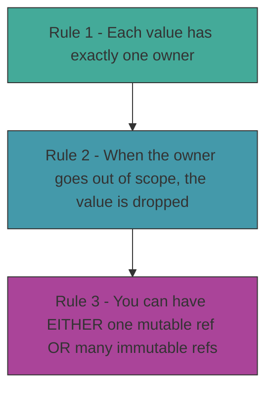
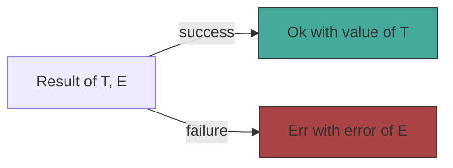
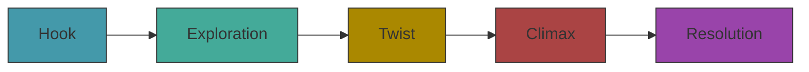
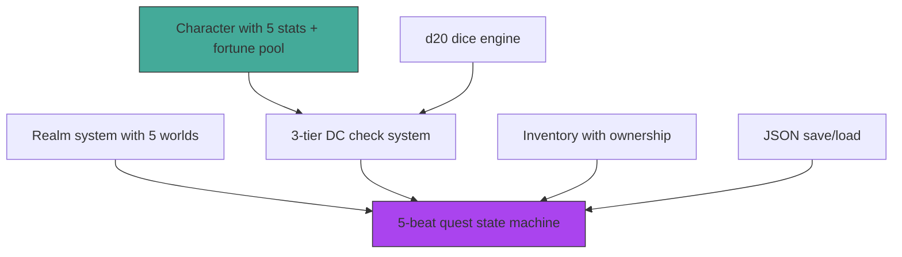

# Act 1 — The Forge

> *Every legend begins at the anvil. In these eight stages you will forge the core engine of Crónica — a tabletop RPG bot that will eventually live inside Discord and talk to an AI. But first, we learn Rust.*

```mermaid
flowchart LR
    S1["Stage 1 - Hello Crónica"] --> S2["Stage 2 - The Character"]
    S2 --> S3["Stage 3 - The Realms"]
    S3 --> S4["Stage 4 - Rolling the Dice"]
    S4 --> S5["Stage 5 - The Stat Check"]
    S5 --> S6["Stage 6 - The Inventory"]
    S6 --> S7["Stage 7 - Saving the World"]
    S7 --> S8["Stage 8 - The Quest Engine"]
    style S1 fill:#4a9,stroke:#333
    style S8 fill:#a4e,stroke:#333
```



**Prerequisites:** Rust installed (`rustup`), a terminal, a text editor. No Rust experience needed — Python experience is enough.

**Project location:** `~/juk/cronica/` — already initialised with `cargo new`.

---

## Stage 1 — Hello Crónica

> *Difficulty: Very Easy — Your first Rust program.*

Every legend begins with a single spark in the dark. Before we can build characters, roll dice, or summon AI narrators, we need a project that compiles and runs. This stage gets Rust's toolchain under your fingers and proves the forge is lit — everything that follows depends on this foundation.

> [!tip] What You'll Learn
> - The anatomy of a Rust project (`Cargo.toml`, `src/main.rs`)
> - `fn main()` — the entry point
> - `println!` — printing to the terminal
> - `cargo run` — compile + execute in one step

### The project skeleton

When you run `cargo new cronica`, Cargo creates this:

```
cronica/
├── Cargo.toml    ← project metadata + dependencies (like pyproject.toml)
└── src/
    └── main.rs   ← your code starts here
```

**Python comparison:** `Cargo.toml` is like `pyproject.toml`. `cargo run` is like `python main.py` except it *compiles* first — if there's a typo, you'll know before the program runs.

### Your first code

Open `src/main.rs` and replace its contents:

```rust
fn main() {
    println!("⚔️  Crónica — The Chronicle Begins");
}
```

Line by line:

| Code | What it does |
|------|-------------|
| `fn main()` | Declares the main function — every Rust program starts here. `fn` = "function". |
| `{` ... `}` | Curly braces wrap the function body — unlike Python's indentation, Rust uses explicit braces. |
| `println!("...")` | Prints text + a newline. The `!` means it's a **macro**, not a regular function. For now, just think of it as "print with superpowers". |
| `;` | Statements end with semicolons. Forget one and the compiler will tell you. |

### Run it

```bash
cd ~/juk/cronica
cargo run
```

You should see:

```
   Compiling cronica v0.1.0
    Finished `dev` profile [unoptimized + debuginfo] target(s)
     Running `target/debug/cronica`
⚔️  Crónica — The Chronicle Begins
```

> [!warning] Common Mistake
> **Forgetting the semicolon.** Rust won't guess where your statement ends. If you see `expected ;`, add one. In Python you never need them; in Rust you almost always do.

The forge is lit and the anvil rings — but a single print statement won't slay any dragons. Next stage, we'll give Crónica its first real creation: a character with stats, HP, and a name worth remembering.

> [!check] Checkpoint
> Run `cargo run`. If you see the ⚔️ line printed, Stage 1 is complete.

---

## Stage 2 — The Character

> *Difficulty: Easy — Structs, fields, methods, and derived stats.*

A world without heroes is just empty terrain. Right now our project can print text, but it has no concept of *who* inhabits the story. We need a way to represent a character — their strengths, their vitality, their potential — in a form the compiler can reason about. This stage introduces Rust's most fundamental building block for modeling data.

> [!tip] What You'll Learn
> - **Structs** — Rust's version of classes / dataclasses
> - Field types: `String` vs `&str`, integers
> - `impl` blocks — adding methods to a struct
> - Derived stats from the game spec (HP, initiative, carry capacity, fortune pool)

### Defining the Character struct

Right now we have a project that compiles, but no way to represent a hero. We need a data structure that bundles a character's identity, stats, and vitals into a single type the compiler can check.

Per the game spec, a character has five stats (Might, Finesse, Wit, Charm, Grit), a fortune pool, HP, level, and XP. These five stats were chosen because each maps to a distinct pillar of gameplay — physical power, agility, intellect, social influence, and endurance — ensuring every challenge has multiple viable approaches. No "Luck" stat — fortune tokens replace it, giving players agency over their luck rather than leaving it to passive rolls.

```rust
struct Character {
    name: String,
    // --- The five stats (spec v0.3) ---
    might: i32,
    finesse: i32,
    wit: i32,
    charm: i32,
    grit: i32,
    // --- Fortune pool (replaces Luck) ---
    fortune: i32,
    fortune_max: i32,
    // --- Vitals ---
    hp: i32,
    max_hp: i32,
    level: i32,
    xp: i32,
}
```

**What's new here:**

| Rust | Python equivalent |
|------|-------------------|
| `struct Character { ... }` | `@dataclass class Character:` |
| `name: String` | `name: str` |
| `might: i32` | `might: int` |

`String` is an *owned* string — the struct owns that piece of text. `i32` is a 32-bit signed integer (plenty for RPG stats). We'll explain ownership more in Stage 6.

### Adding methods with `impl`

In Python you'd put methods inside the class. In Rust, methods live in a separate `impl` block:

```rust
impl Character {
    /// Create a new character with derived stats calculated automatically.
    fn new(name: String, might: i32, finesse: i32, wit: i32, charm: i32, grit: i32, level: i32) -> Character {
        let max_hp = 10 + (might * 2) + grit;          // spec: HP = 10 + (Might×2) + (Grit×1)
        let fortune_max = 2 + (level / 3);              // spec: Fortune pool = 2 + (level/3)
        Character {
            name,
            might, finesse, wit, charm, grit,
            fortune: fortune_max,                        // start full
            fortune_max,
            hp: max_hp,
            max_hp,
            level,
            xp: 0,
        }
    }

    /// Initiative = Finesse + Wit (spec v0.3)
    fn initiative(&self) -> i32 {
        self.finesse + self.wit
    }

    /// Carry capacity = 5 + Might (spec v0.3)
    fn carry_capacity(&self) -> i32 {
        5 + self.might
    }

    /// Pretty-print the character sheet.
    fn sheet(&self) {
        println!("═══ {} ═══", self.name);
        println!("  Might {} | Finesse {} | Wit {} | Charm {} | Grit {}",
            self.might, self.finesse, self.wit, self.charm, self.grit);
        println!("  HP {}/{} | Fortune {}/{} | Level {} | XP {}",
            self.hp, self.max_hp, self.fortune, self.fortune_max, self.level, self.xp);
        println!("  Initiative {} | Carry {}", self.initiative(), self.carry_capacity());
    }
}
```

Key concepts:

- `fn new(...) -> Character` — an *associated function* (like `__init__` in Python or a constructor in TS). It returns a `Character`. Rust has no `new` keyword — `new` is just a convention.
- `&self` — a *reference* to the struct. Methods that read but don't modify take `&self`. Think of it as `self` in Python, but the `&` means "I'm borrowing, not consuming."
- `let` — declares a variable. Variables are **immutable by default** (unlike Python where everything is mutable).
- `///` — a doc comment. Regular comments use `//`.

### Putting it together

Replace `src/main.rs` entirely:

```rust
struct Character {
    name: String,
    might: i32,
    finesse: i32,
    wit: i32,
    charm: i32,
    grit: i32,
    fortune: i32,
    fortune_max: i32,
    hp: i32,
    max_hp: i32,
    level: i32,
    xp: i32,
}

impl Character {
    fn new(name: String, might: i32, finesse: i32, wit: i32, charm: i32, grit: i32, level: i32) -> Character {
        let max_hp = 10 + (might * 2) + grit;
        let fortune_max = 2 + (level / 3);
        Character {
            name,
            might, finesse, wit, charm, grit,
            fortune: fortune_max,
            fortune_max,
            hp: max_hp,
            max_hp,
            level,
            xp: 0,
        }
    }

    fn initiative(&self) -> i32 {
        self.finesse + self.wit
    }

    fn carry_capacity(&self) -> i32 {
        5 + self.might
    }

    fn sheet(&self) {
        println!("═══ {} ═══", self.name);
        println!("  Might {} | Finesse {} | Wit {} | Charm {} | Grit {}",
            self.might, self.finesse, self.wit, self.charm, self.grit);
        println!("  HP {}/{} | Fortune {}/{} | Level {} | XP {}",
            self.hp, self.max_hp, self.fortune, self.fortune_max, self.level, self.xp);
        println!("  Initiative {} | Carry {}", self.initiative(), self.carry_capacity());
    }
}

fn main() {
    let hero = Character::new("Kael".to_string(), 3, 2, 1, 2, 2, 1);
    hero.sheet();
}
```

> [!warning] Common Mistake
> **`"Kael"` vs `"Kael".to_string()`** — String literals in Rust are `&str` (a borrowed slice), but our struct wants an owned `String`. You must convert with `.to_string()` or `String::from("Kael")`. In Python, strings are just strings — Rust distinguishes between borrowed and owned data.

### Run it

```bash
cargo run
```

Expected output:

```
═══ Kael ═══
  Might 3 | Finesse 2 | Wit 1 | Charm 2 | Grit 2
  HP 18/18 | Fortune 2/2 | Level 1 | XP 0
  Initiative 3 | Carry 8
```

Verify the math: HP = 10 + (3×2) + 2 = 18 ✓ | Fortune = 2 + (1/3) = 2 ✓ | Initiative = 2+1 = 3 ✓ | Carry = 5+3 = 8 ✓

Our hero has a name and stats etched in code, but they exist in a void — no world to inhabit, no realm to shape their story. Next stage, we'll forge the realms themselves and learn Rust's most powerful feature: enums.

> [!check] Checkpoint
> Run `cargo run`. Verify HP is 18, Fortune is 2, Initiative is 3, Carry is 8. Stage 2 complete.

---

## Stage 3 — The Realms

> *Difficulty: Easy — Enums, pattern matching, and Display.*

A hero without a homeland is a wanderer without purpose. Right now our character has stats but no world — no tone, no atmosphere, no narrative anchor. We need a way to represent the distinct realms of Crónica so the AI narrator (in Act 2) knows whether to whisper gothic horror or shout cyberpunk chaos. This stage introduces enums — Rust's way of saying "exactly one of these options, and the compiler will hold you to it."

> [!tip] What You'll Learn
> - **Enums** — a type that can be one of several variants
> - `match` — Rust's powerful pattern matching (like switch on steroids)
> - Implementing `Display` so enums print nicely
> - How enums differ from Python string unions

### The Realm enum

Right now we have a character with stats, but no world for them to inhabit. We need a type that represents the distinct realms — and guarantees at compile time that no one can accidentally create a quest in "Sombrahiem" (note the typo). We need an enum.

Crónica's world has five realms, each with a distinct tone. In Python you might use string literals (`"Sombraheim"`). Rust uses enums — and the compiler guarantees you handle every variant.

Add this **above** the `Character` struct in `src/main.rs`:

```rust
use std::fmt;

enum Realm {
    Sombraheim,
    Aethervoid,
    Mythos,
    Ironlands,
    Neonrift,
}

impl fmt::Display for Realm {
    fn fmt(&self, f: &mut fmt::Formatter) -> fmt::Result {
        match self {
            Realm::Sombraheim => write!(f, "Sombraheim"),
            Realm::Aethervoid => write!(f, "Aethervoid"),
            Realm::Mythos     => write!(f, "Mythos"),
            Realm::Ironlands  => write!(f, "Ironlands"),
            Realm::Neonrift   => write!(f, "Neonrift"),
        }
    }
}

impl Realm {
    fn description(&self) -> &str {
        match self {
            Realm::Sombraheim => "A land of eternal dusk, where shadows whisper secrets",
            Realm::Aethervoid => "The shimmering plane between worlds, raw with arcane energy",
            Realm::Mythos     => "Ancient forests where gods once walked and legends still breathe",
            Realm::Ironlands  => "Smoke-choked cities of industry, gears, and gunpowder",
            Realm::Neonrift   => "A fractured reality bleeding neon light and digital ghosts",
        }
    }

    fn tone(&self) -> &str {
        match self {
            Realm::Sombraheim => "gothic horror",
            Realm::Aethervoid => "cosmic mystery",
            Realm::Mythos     => "high fantasy",
            Realm::Ironlands  => "steampunk grit",
            Realm::Neonrift   => "cyberpunk noir",
        }
    }
}
```

**Key concepts:**

- `enum Realm { ... }` — defines a type with exactly five possible values. Unlike Python strings, you can't accidentally type `"Sombrahiem"` — the compiler catches it.
- `match self { ... }` — like `match` in Python 3.10+, but Rust's `match` is **exhaustive**: if you forget a variant, the code won't compile.
- `impl fmt::Display` — tells Rust how to convert `Realm` to a string when you use `{}` in `println!`. Python's equivalent is `__str__`.
- `&str` — a borrowed string slice. Since these descriptions are hardcoded, we return references to string literals (which live forever).

### Using it in main

Update `main()`:

```rust
fn main() {
    let hero = Character::new("Kael".to_string(), 3, 2, 1, 2, 2, 1);
    hero.sheet();

    let realm = Realm::Ironlands;
    println!("\nRealm: {}", realm);
    println!("  {}", realm.description());
    println!("  Tone: {}", realm.tone());
}
```

```
═══ Kael ═══
  Might 3 | Finesse 2 | Wit 1 | Charm 2 | Grit 2
  HP 18/18 | Fortune 2/2 | Level 1 | XP 0
  Initiative 3 | Carry 8

Realm: Ironlands
  Smoke-choked cities of industry, gears, and gunpowder
  Tone: steampunk grit
```

> [!warning] Common Mistake
> **Non-exhaustive match.** If you add a sixth realm variant later but forget to update a `match`, the compiler will refuse to build. This is a *feature* — it prevents bugs that Python would only catch at runtime.

We have heroes and realms now, but no way to test their mettle — no randomness, no uncertainty, no risk. Next stage, we'll add the dice that decide fate.

> [!check] Checkpoint
> Run `cargo run`. You should see the character sheet followed by the Ironlands description. Stage 3 complete.

---

## Stage 4 — Rolling the Dice

> *Difficulty: Easy — Functions, external crates, and randomness.*

No RPG lives without the roll of dice — that moment of held breath between action and consequence. Right now our characters have stats but no way to test them against the world. We need randomness, and Rust's standard library doesn't include a random number generator. This stage teaches you how to pull in external crates and write your first standalone functions.

> [!tip] What You'll Learn
> - Adding an external dependency (`rand` crate)
> - Writing standalone functions
> - Return values (implicit returns)
> - Generating random numbers

### Uncomment the rand dependency

Open `~/juk/cronica/Cargo.toml` and uncomment the rand line:

```toml
[dependencies]
# Stage 4: Rolling the Dice
rand = "0.9"
```

Next `cargo run` will download and compile `rand` automatically — like `pip install` but triggered by the build.

### The dice functions

Add these functions below your `Realm` impl block, above `main()`:

```rust
use rand::Rng;

fn roll_d20() -> i32 {
    let mut rng = rand::rng();
    rng.gen_range(1..=20)
}

fn roll_check(stat: i32, dc: i32) -> (i32, bool) {
    let roll = roll_d20();
    let total = roll + stat;
    let success = total >= dc;
    println!("  🎲 Rolled {} + {} (stat) = {} vs DC {} → {}",
        roll, stat, total, dc, if success { "SUCCESS" } else { "FAIL" });
    (total, success)
}
```

Line by line:

| Code | Explanation |
|------|-------------|
| `use rand::Rng;` | Import the `Rng` trait so we can call `.gen_range()`. Like `from rand import Rng` in Python. |
| `fn roll_d20() -> i32` | A function that takes no arguments and returns an `i32`. The `->` is the return type (Python uses `-> int`). |
| `let mut rng` | `mut` makes the variable **mutable**. The RNG needs to update its internal state, so it must be mutable. Without `mut`, Rust won't let you modify it. |
| `rng.gen_range(1..=20)` | Generate a number from 1 to 20 inclusive. `1..=20` is a range — `..=` means "including the end". No semicolon = this is the **return value** (implicit return). |
| `(i32, bool)` | A **tuple** return type — we return both the total and whether it succeeded. Python equivalent: `-> tuple[int, bool]`. |
| `if success { "SUCCESS" } else { "FAIL" }` | Inline if-expression (like Python's ternary `"SUCCESS" if success else "FAIL"`). |

**Implicit returns:** In Rust, the last expression in a function (without a semicolon) is the return value. Adding a semicolon would make it a statement that returns nothing. This trips up every beginner.

### Test it in main

```rust
fn main() {
    let hero = Character::new("Kael".to_string(), 3, 2, 1, 2, 2, 1);
    hero.sheet();

    let realm = Realm::Ironlands;
    println!("\nRealm: {}", realm);
    println!("  {}", realm.description());

    println!("\n--- Dice Test ---");
    let _result = roll_check(hero.might, 12);  // Might check vs DC 12
    let _result = roll_check(hero.wit, 15);     // Wit check vs DC 15
}
```

The `_result` prefix tells Rust "I know I'm not using this value" — without the underscore, you'd get a warning.

```
--- Dice Test ---
  🎲 Rolled 14 + 3 (stat) = 17 vs DC 12 → SUCCESS
  🎲 Rolled 8 + 1 (stat) = 9 vs DC 15 → FAIL
```

(Your numbers will differ — they're random!)

> [!warning] Common Mistake
> **Forgetting `mut` on the RNG.** You'll see: `cannot borrow as mutable`. The fix is always `let mut rng`. In Python, you never think about mutability — in Rust, it's explicit.

> [!warning] Common Mistake
> **Semicolon on the return line.** If `roll_d20()` ends with `rng.gen_range(1..=20);` (note the semicolon), the function returns `()` (nothing) instead of `i32`, and the compiler will complain about mismatched types.

We can roll dice now, but a raw d20 is just a number — it doesn't know whether Might or Wit is the right stat for kicking down a door. Next stage, we'll build the DC system that gives those rolls meaning.

> [!check] Checkpoint
> Run `cargo run`. You should see two dice rolls with random results. Stage 4 complete.

---

## Stage 5 — The Stat Check

> *Difficulty: Medium — Enums with data, the DC system, and Result types.*

Rolling a d20 is meaningless without context — is this a Might check or a Charm check? Is the door reinforced or rotting? Right now we have dice and stats but no system connecting them. We need a challenge framework that classifies which stats apply, adjusts difficulty accordingly, and returns structured results. This stage also reveals Rust's killer feature: enums that carry data.

> [!tip] What You'll Learn
> - Enums that **carry data** (Rust's killer feature)
> - The three-tier DC system from the game spec
> - Returning structured results from functions
> - How Rust enums compare to Python's `Enum` type

### The DC system (spec v0.3)

The game spec defines three tiers for stat checks. The three-tier system exists because a flat pass/fail check makes every stat equally useful for every challenge — which is boring. By classifying stats as primary, secondary, or off-stat, the system rewards players who lean into their character's strengths while still allowing creative approaches at a higher cost:

| Tier | Rule | DC |
|------|------|----|
| **Primary** | 1-2 natural-fit stats | Base DC |
| **Secondary** | Unusual but plausible | Base DC + 3 |
| **Off-stat** | Narrated as flavor | No roll — auto-narrate |

There is no "wrong fit" tier. If a stat doesn't fit at all, the engine narrates it as color and moves on.

### Modeling it in Rust

Right now we have dice rolls and character stats, but no way to classify *which* stat applies to a given challenge. We need types that represent stats, match tiers, and structured check results.

```rust
#[derive(Debug)]
enum Stat {
    Might,
    Finesse,
    Wit,
    Charm,
    Grit,
}

#[derive(Debug)]
enum StatMatch {
    Primary,    // natural fit — roll at base DC
    Secondary,  // unusual but plausible — DC + 3
    OffStat,    // narrated as flavor — no roll
}

#[derive(Debug)]
struct CheckResult {
    total: i32,
    dc: i32,
    success: bool,
    margin: i32,  // positive = over DC, negative = under
}

struct Challenge {
    name: String,
    base_dc: i32,
    primary_stats: Vec<Stat>,
    secondary_stats: Vec<Stat>,
    // any stat not listed is off-stat
}
```

**New concepts:**

- `#[derive(Debug)]` — auto-generates a debug printer so you can use `{:?}` in `println!`. Like Python's `__repr__`.
- `Vec<Stat>` — a growable list of `Stat` values. `Vec` is Rust's `list` (Python) or `Array` (TS).
- Enums with no data (`Stat`, `StatMatch`) work like simple labels — but Rust enums *can* carry data (we'll see this in Stage 8).

### The check logic

```rust
impl Challenge {
    fn classify(&self, stat: &Stat) -> StatMatch {
        let stat_name = format!("{:?}", stat);
        for s in &self.primary_stats {
            if format!("{:?}", s) == stat_name {
                return StatMatch::Primary;
            }
        }
        for s in &self.secondary_stats {
            if format!("{:?}", s) == stat_name {
                return StatMatch::Secondary;
            }
        }
        StatMatch::OffStat
    }

    fn attempt(&self, stat: &Stat, stat_value: i32) -> Option<CheckResult> {
        match self.classify(stat) {
            StatMatch::Primary => {
                let dc = self.base_dc;
                let roll = roll_d20();
                let total = roll + stat_value;
                let margin = total - dc;
                println!("  🎯 Primary check: rolled {} + {} = {} vs DC {} (margin {:+})",
                    roll, stat_value, total, dc, margin);
                Some(CheckResult { total, dc, success: margin >= 0, margin })
            }
            StatMatch::Secondary => {
                let dc = self.base_dc + 3;  // spec: secondary = DC + 3
                let roll = roll_d20();
                let total = roll + stat_value;
                let margin = total - dc;
                println!("  🔀 Secondary check: rolled {} + {} = {} vs DC {} (margin {:+})",
                    roll, stat_value, total, dc, margin);
                Some(CheckResult { total, dc, success: margin >= 0, margin })
            }
            StatMatch::OffStat => {
                println!("  💬 Off-stat: narrated as flavor — no roll needed");
                None  // no mechanical result
            }
        }
    }
}
```

**New concepts:**

- `Option<CheckResult>` — Rust's way of saying "maybe a result, maybe nothing." `Some(value)` = got a result, `None` = nothing. This replaces `None` in Python but is **type-safe** — you can't accidentally use a `None` as if it were a `CheckResult`.
- `&self` and `&Stat` — we're borrowing, not consuming. The challenge and stat still exist after the function call.
- `{:+}` in the format string — prints the sign (`+3` or `-2`).

### Test it

Update `main()`:

```rust
fn main() {
    let hero = Character::new("Kael".to_string(), 3, 2, 1, 2, 2, 1);
    hero.sheet();

    println!("\n--- Challenge: Kick Down the Door ---");
    let challenge = Challenge {
        name: "Kick Down the Door".to_string(),
        base_dc: 12,
        primary_stats: vec![Stat::Might],
        secondary_stats: vec![Stat::Finesse],
    };

    challenge.attempt(&Stat::Might, hero.might);     // primary — DC 12
    challenge.attempt(&Stat::Finesse, hero.finesse);  // secondary — DC 15
    challenge.attempt(&Stat::Charm, hero.charm);       // off-stat — no roll
}
```

`vec![...]` is a macro that creates a `Vec` with initial values — like `[Stat.Might]` in Python.

```
--- Challenge: Kick Down the Door ---
  🎯 Primary check: rolled 11 + 3 = 14 vs DC 12 (margin +2)
  🔀 Secondary check: rolled 9 + 2 = 11 vs DC 15 (margin -4)
  💬 Off-stat: narrated as flavor — no roll needed
```

> [!warning] Common Mistake
> **Using `==` on enums without `PartialEq`.** We used a `Debug` format string comparison as a shortcut. The proper way is `#[derive(Debug, PartialEq)]` on `Stat`, then you can write `stat == &Stat::Might`. We'll clean this up later — for now, it works.

We can challenge our heroes now, but they carry nothing — no sword, no potion, no map. Next stage, we'll build an inventory system and confront Rust's most infamous guardian: the borrow checker.

> [!check] Checkpoint
> Run `cargo run`. You should see a primary roll at DC 12, a secondary roll at DC 15, and an off-stat narration. Stage 5 complete.

---

## Stage 6 — The Inventory

> *Difficulty: Medium — Ownership, borrowing, and the borrow checker.*

What good is a hero who can't carry a sword? Right now our characters have stats and can face challenges, but they own nothing — no weapons, no potions, no loot. More importantly, we haven't yet confronted Rust's central concept: ownership. This stage forces you to move items between collections, and in doing so, teaches you the rules that make Rust memory-safe without a garbage collector.

> [!tip] What You'll Learn
> - `Vec<Item>` — dynamic lists
> - **Ownership** — Rust's central concept
> - **Borrowing** with `&` and `&mut`
> - Moving values between collections
> - Why the borrow checker exists (and how to stop fighting it)

### Why ownership matters

In Python, you can do this:

```python
room_items = [sword]
player_items = room_items  # both point to the same list!
room_items.append(shield)  # player_items also sees the shield — surprise!
```

Rust prevents this entire class of bugs. When you move a value, the original variable is **gone**. No shared mutable state, no surprises.

### The Item types

Right now we have characters and challenges, but no concept of equipment or loot. We need item types that can be created, moved between locations, and inspected — and Rust's ownership system will ensure no item can exist in two places at once.

```rust
#[derive(Debug)]
enum ItemType {
    Weapon,
    Armor,
    Consumable,
    KeyItem,
    Trinket,
}

#[derive(Debug)]
struct Item {
    name: String,
    item_type: ItemType,
    weight: i32,
}
```

### Ownership in action

```rust
fn main() {
    // Create items — main() OWNS them
    let sword = Item { name: "Iron Sword".to_string(), item_type: ItemType::Weapon, weight: 3 };
    let potion = Item { name: "Health Potion".to_string(), item_type: ItemType::Consumable, weight: 1 };

    // Move items into the player's inventory — ownership TRANSFERS
    let mut inventory: Vec<Item> = Vec::new();
    inventory.push(sword);   // sword is MOVED into inventory
    // println!("{}", sword.name);  // ← COMPILE ERROR: sword was moved!

    inventory.push(potion);

    // Borrowing: look at items without taking them
    for item in &inventory {  // & = borrow, don't consume
        println!("  Carrying: {:?} — {} (weight {})", item.item_type, item.name, item.weight);
    }

    // inventory still exists and owns everything
    println!("  Total items: {}", inventory.len());
}
```

**The ownership rules (memorize these):**



### Moving items between collections

Let's simulate picking up an item from a room:

```rust
fn pick_up(room: &mut Vec<Item>, inventory: &mut Vec<Item>, index: usize) {
    if index < room.len() {
        let item = room.remove(index);  // remove from room (ownership transfers to `item`)
        println!("  Picked up: {}", item.name);
        inventory.push(item);            // move into inventory
    }
}

fn drop_item(inventory: &mut Vec<Item>, room: &mut Vec<Item>, index: usize) {
    if index < inventory.len() {
        let item = inventory.remove(index);
        println!("  Dropped: {}", item.name);
        room.push(item);
    }
}
```

- `&mut Vec<Item>` — a **mutable borrow**. We need `&mut` because we're modifying the vector (adding/removing items).
- `usize` — an unsigned integer sized for indexing. Vec indices are always `usize`.
- `room.remove(index)` — removes the item and returns it. Ownership flows: room → local variable → inventory.

### Full working code for Stage 6

Update `main()` to test the inventory system:

```rust
fn main() {
    let hero = Character::new("Kael".to_string(), 3, 2, 1, 2, 2, 1);
    hero.sheet();

    // Room has some loot
    let mut room: Vec<Item> = vec![
        Item { name: "Iron Sword".to_string(), item_type: ItemType::Weapon, weight: 3 },
        Item { name: "Health Potion".to_string(), item_type: ItemType::Consumable, weight: 1 },
        Item { name: "Old Map".to_string(), item_type: ItemType::KeyItem, weight: 0 },
    ];

    let mut inventory: Vec<Item> = Vec::new();

    println!("\n--- Inventory Test ---");
    println!("Room has {} items", room.len());

    pick_up(&mut room, &mut inventory, 0);  // pick up Iron Sword
    pick_up(&mut room, &mut inventory, 0);  // pick up Health Potion (now index 0)

    println!("\nInventory:");
    for item in &inventory {
        println!("  [{:?}] {} (weight {})", item.item_type, item.name, item.weight);
    }
    println!("Room has {} items remaining", room.len());
}
```

```
--- Inventory Test ---
Room has 3 items
  Picked up: Iron Sword
  Picked up: Health Potion

Inventory:
  [Weapon] Iron Sword (weight 3)
  [Consumable] Health Potion (weight 1)
Room has 1 items remaining
```

> [!warning] Common Mistake
> **Using a value after it's been moved.** If you try `println!("{}", sword.name)` after `inventory.push(sword)`, you'll get: `error: borrow of moved value: sword`. The fix: access it through the collection (`&inventory[0].name`) or clone it.

> [!warning] Common Mistake
> **Borrowing as both `&` and `&mut` at the same time.** You can't read from a `Vec` while also modifying it. If you need to iterate and remove, collect indices first, then remove in reverse order.

Our heroes carry swords and potions now, but when the program ends, everything vanishes — characters, items, progress, all gone. Next stage, we'll learn to save the world to disk with serialization.

> [!check] Checkpoint
> Run `cargo run`. Verify items move from room to inventory and the room count decreases. Stage 6 complete.

---

## Stage 7 — Saving the World

> *Difficulty: Medium — Serialization with serde, file I/O, and error handling.*

A chronicle that vanishes when the candle goes out is no chronicle at all. Right now, every character we create dies when the program exits — no persistence, no memory, no continuity between sessions. We need to write game state to disk and read it back, which means converting Rust structs to JSON and handling the inevitable "file not found" errors gracefully.

> [!tip] What You'll Learn
> - Adding `serde` and `serde_json` dependencies
> - `#[derive(Serialize, Deserialize)]` — auto-generated JSON conversion
> - Reading and writing files with `std::fs`
> - `Result` type — Rust's error handling

### Uncomment the serde dependencies

In `Cargo.toml`, uncomment:

```toml
serde = { version = "1", features = ["derive"] }
serde_json = "1"
```

### Making Character serializable

Add the derive macros to your `Character` struct:

```rust
use serde::{Serialize, Deserialize};

#[derive(Debug, Serialize, Deserialize)]
struct Character {
    name: String,
    might: i32,
    finesse: i32,
    wit: i32,
    charm: i32,
    grit: i32,
    fortune: i32,
    fortune_max: i32,
    hp: i32,
    max_hp: i32,
    level: i32,
    xp: i32,
}
```

That's it. Two words — `Serialize, Deserialize` — and Rust generates all the JSON conversion code at compile time. In Python you'd write a `to_dict()` method or use `dataclasses.asdict()`.

### Save and load functions

```rust
use std::fs;
use std::io;

fn save_character(character: &Character, path: &str) -> io::Result<()> {
    let json = serde_json::to_string_pretty(character)
        .expect("Failed to serialize character");
    fs::write(path, json)?;
    println!("  💾 Saved to {}", path);
    Ok(())
}

fn load_character(path: &str) -> io::Result<Character> {
    let json = fs::read_to_string(path)?;
    let character: Character = serde_json::from_str(&json)
        .expect("Failed to deserialize character");
    println!("  📂 Loaded from {}", path);
    Ok(character)
}
```

**New concepts:**

| Code | Explanation |
|------|-------------|
| `io::Result<()>` | A `Result` that either succeeds with `()` (nothing) or fails with an `io::Error`. Like Python's try/except but enforced by the type system. |
| `?` | The **question mark operator** — if the operation fails, return the error immediately. It's shorthand for a match on `Ok`/`Err`. Python equivalent: letting an exception propagate. |
| `.expect("msg")` | Unwrap a `Result` or panic with a message. Use this for errors that "should never happen." |
| `Ok(())` | Return success with no value. |
| `&str` | We take a borrowed string for the path — no need to own it. |

**The `Result` type visualized:**



In Python, errors are exceptions that fly up the call stack invisibly. In Rust, errors are **values** — you must handle them explicitly. The `?` operator makes this ergonomic.

### Test save/load

```rust
fn main() {
    let hero = Character::new("Kael".to_string(), 3, 2, 1, 2, 2, 1);
    hero.sheet();

    println!("\n--- Save/Load Test ---");
    save_character(&hero, "kael.json").expect("save failed");

    let loaded = load_character("kael.json").expect("load failed");
    loaded.sheet();
}
```

```
--- Save/Load Test ---
  💾 Saved to kael.json
  📂 Loaded from kael.json
═══ Kael ═══
  Might 3 | Finesse 2 | Wit 1 | Charm 2 | Grit 2
  HP 18/18 | Fortune 2/2 | Level 1 | XP 0
  Initiative 3 | Carry 8
```

Check the generated `kael.json`:

```json
{
  "name": "Kael",
  "might": 3,
  "finesse": 2,
  "wit": 1,
  "charm": 2,
  "grit": 2,
  "fortune": 2,
  "fortune_max": 2,
  "hp": 18,
  "max_hp": 18,
  "level": 1,
  "xp": 0
}
```

> [!warning] Common Mistake
> **Forgetting `features = ["derive"]` in Cargo.toml.** Without it, `#[derive(Serialize)]` won't work and you'll get a confusing "cannot find derive macro" error. Always include the `derive` feature for serde.

> [!warning] Common Mistake
> **Using `.unwrap()` everywhere.** It works but panics on errors with no useful message. Prefer `.expect("description")` during development and proper `?` propagation in production code.

Our heroes persist beyond death now — saved to disk, resurrected from JSON. But a character without a quest is just a stat block gathering dust. Next stage, we'll build the quest engine that drives the entire narrative arc.

> [!check] Checkpoint
> Run `cargo run`. Check that `kael.json` appears in your project directory with valid JSON. Load it back and verify the stats match. Stage 7 complete.

---

## Stage 8 — The Quest Engine

> *Difficulty: Medium — State machines, the 5-beat arc, and tension tracking.*

Characters, realms, dice, items, persistence — we have all the pieces, but no engine to drive them. Right now there's nothing connecting a hero's first step to their final confrontation. We need a quest system that tracks narrative momentum, transitions between dramatic beats, and knows when the story has reached its climax. This stage turns scattered game mechanics into a living narrative machine.

> [!tip] What You'll Learn
> - Enums as **state machines** — the quest beat arc
> - Structs containing enums — composing complex types
> - The 5-beat narrative arc from the game spec
> - Tension-driven state transitions

### The 5-beat arc (spec v0.3)

Every quest in Crónica follows a five-beat dramatic arc, driven by a tension level (0–10). The five-beat structure exists because unstructured AI narration tends to meander — without guardrails, quests either fizzle out or escalate too fast. By tying narrative beats to a tension number, we give the AI a pacing framework while keeping the story feeling organic:



| Beat | Tension | Purpose |
|------|---------|---------|
| **Hook** | 0–2 | Introduce the quest, set the scene |
| **Exploration** | 2–5 | Investigate, gather clues, meet NPCs |
| **Twist** | 5–7 | Complication — plans go sideways |
| **Climax** | 7–10 | The big confrontation or challenge |
| **Resolution** | Falling | Wrap up, rewards, consequences |

### Quest types and beats

Right now we have characters, dice, and items — but no concept of a quest's narrative shape. We need enums to represent where we are in the story arc and what kind of quest we're running.

```rust
#[derive(Debug, Clone)]
enum QuestBeat {
    Hook,
    Exploration,
    Twist,
    Climax,
    Resolution,
}

#[derive(Debug, Clone)]
enum QuestArchetype {
    Heist,
    Mystery,
    Survival,
    Rescue,
    Pilgrimage,
}

#[derive(Debug)]
struct Quest {
    name: String,
    archetype: QuestArchetype,
    beat: QuestBeat,
    tension: i32,  // 0-10
    turn: i32,
}
```

`#[derive(Clone)]` lets us copy enum values. Without it, moving a `QuestBeat` out of the struct would consume it.

### The state machine

```rust
impl Quest {
    fn new(name: String, archetype: QuestArchetype) -> Quest {
        Quest {
            name,
            archetype,
            beat: QuestBeat::Hook,
            tension: 0,
            turn: 0,
        }
    }

    fn advance_tension(&mut self, delta: i32) {
        self.tension = (self.tension + delta).clamp(0, 10);
        self.turn += 1;
        self.maybe_transition();
    }

    fn maybe_transition(&mut self) {
        let new_beat = match (&self.beat, self.tension) {
            (QuestBeat::Hook, 2..) => QuestBeat::Exploration,
            (QuestBeat::Exploration, 5..) => QuestBeat::Twist,
            (QuestBeat::Twist, 7..) => QuestBeat::Climax,
            (QuestBeat::Climax, _) if self.tension <= 3 => QuestBeat::Resolution,
            _ => return,  // no transition
        };
        println!("  ⚡ Beat transition: {:?} → {:?} (tension {})",
            self.beat, new_beat, self.tension);
        self.beat = new_beat;
    }

    fn status(&self) {
        println!("  Quest: {} [{:?}]", self.name, self.archetype);
        println!("  Beat: {:?} | Tension: {}/10 | Turn: {}", self.beat, self.tension, self.turn);
    }
}
```

**New concepts:**

| Code | Explanation |
|------|-------------|
| `&mut self` | A **mutable borrow** of the struct — we need to modify `tension` and `beat`. Compare with `&self` (read-only) from earlier stages. |
| `.clamp(0, 10)` | Keeps the value within bounds. Like `max(0, min(10, x))` in Python. |
| `2..` | A range pattern meaning "2 or higher". `5..` means "5 or higher". |
| `_ if self.tension <= 3` | A **match guard** — extra condition on a pattern. The `_` matches anything, then the `if` filters. |
| `return` | Early return from the function — no transition happens. |
| `(&self.beat, self.tension)` | We match on a **tuple** of the current beat (borrowed) and tension (copied, since `i32` is `Copy`). |

### Simulating a quest

```rust
fn main() {
    let hero = Character::new("Kael".to_string(), 3, 2, 1, 2, 2, 1);
    hero.sheet();

    println!("\n--- Quest: The Iron Vault Heist ---");
    let mut quest = Quest::new(
        "The Iron Vault".to_string(),
        QuestArchetype::Heist,
    );
    quest.status();

    // Simulate tension rising through the arc
    println!("\n[Turn 1] The contact whispers about the vault...");
    quest.advance_tension(2);
    quest.status();

    println!("\n[Turn 2] Scouting the perimeter, finding guard patterns...");
    quest.advance_tension(3);
    quest.status();

    println!("\n[Turn 3] The alarm triggers — it's a trap!");
    quest.advance_tension(3);
    quest.status();

    println!("\n[Turn 4] Face the vault guardian...");
    quest.advance_tension(1);
    quest.status();

    println!("\n[Turn 5] Guardian defeated, tension drops...");
    quest.advance_tension(-8);
    quest.status();
}
```

```
--- Quest: The Iron Vault Heist ---
  Quest: The Iron Vault [Heist]
  Beat: Hook | Tension: 0/10 | Turn: 0

[Turn 1] The contact whispers about the vault...
  ⚡ Beat transition: Hook → Exploration (tension 2)
  Quest: The Iron Vault [Heist]
  Beat: Exploration | Tension: 2/10 | Turn: 1

[Turn 2] Scouting the perimeter, finding guard patterns...
  ⚡ Beat transition: Exploration → Twist (tension 5)
  Quest: The Iron Vault [Heist]
  Beat: Twist | Tension: 5/10 | Turn: 2

[Turn 3] The alarm triggers — it's a trap!
  ⚡ Beat transition: Twist → Climax (tension 8)
  Quest: The Iron Vault [Heist]
  Beat: Climax | Tension: 8/10 | Turn: 3

[Turn 4] Face the vault guardian...
  Quest: The Iron Vault [Heist]
  Beat: Climax | Tension: 9/10 | Turn: 4

[Turn 5] Guardian defeated, tension drops...
  ⚡ Beat transition: Climax → Resolution (tension 1)
  Quest: The Iron Vault [Heist]
  Beat: Resolution | Tension: 1/10 | Turn: 5
```

The quest flows naturally through all five beats, driven entirely by tension changes. The AI (in Act 2) will decide *how much* tension to add based on player actions — but the state machine enforces the dramatic structure.

> [!warning] Common Mistake
> **Forgetting `&mut self` when modifying fields.** If you write `fn advance_tension(&self, ...)` and try to modify `self.tension`, you'll get: `cannot assign to field of immutable reference`. The fix: change `&self` to `&mut self`.

> [!warning] Common Mistake
> **Match arm order matters.** Rust evaluates match arms top to bottom. If you put a catch-all `_` before specific patterns, those patterns will never match. Always put specific patterns first.

The engine hums, the quest arc bends from hook to resolution — but the narrator's chair sits empty. In Act 2, we'll give Crónica its voice by connecting to AWS Bedrock and letting an AI breathe life into every scene.

> [!check] Checkpoint
> Run `cargo run`. Verify the quest transitions through all five beats: Hook → Exploration → Twist → Climax → Resolution. Stage 8 complete.

---

## Act 1 Complete — What You've Built



You now have a working RPG engine in Rust. No Discord, no AI — just pure game logic. Here's what you've learned:

| Rust Concept | Where You Used It |
|-------------|-------------------|
| Structs | `Character`, `Item`, `Challenge`, `Quest` |
| Enums | `Realm`, `Stat`, `StatMatch`, `ItemType`, `QuestBeat`, `QuestArchetype` |
| `impl` blocks | Methods on every struct |
| Ownership & borrowing | Moving items between room and inventory |
| `Option` and `Result` | Stat checks, file I/O |
| Pattern matching | DC system, quest transitions |
| External crates | `rand`, `serde`, `serde_json` |
| Serialization | Save/load character to JSON |

**Next up — Act 2: The Voice.** You'll connect to Amazon Bedrock, send your character sheet to an LLM, and get the AI to narrate quest beats. The engine you built here becomes the game state that the AI reads and writes.
