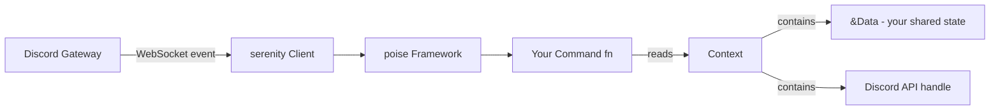
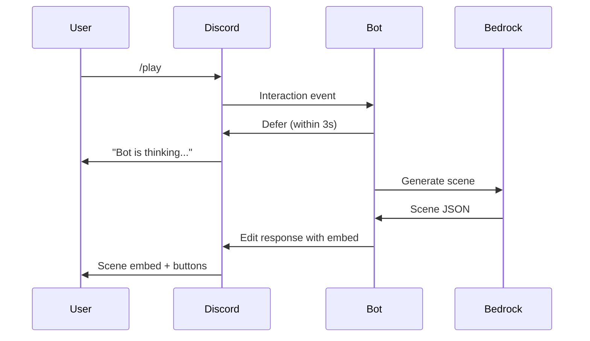
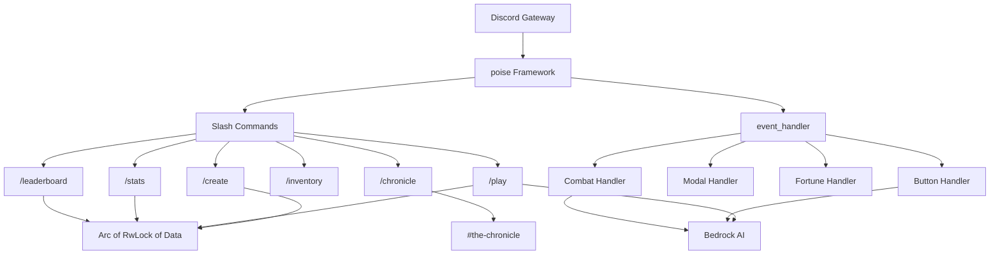

# Act 3 — The Gateway

> *Your quest engine hums. Your AI narrator speaks. Now Crónica steps through the gateway into Discord — where players summon heroes with slash commands, choose their fate with buttons, and write legends that echo across channels.*

Act 1 forged your data structures. Act 2 gave them a voice through Bedrock. Act 3 connects everything to Discord, turning a CLI prototype into a multiplayer bot. You'll learn a new framework (poise), a new interaction model (buttons and modals), and how to orchestrate async state across many simultaneous players.

> [!info] Character Struct Evolution: CLI → Discord
> In Acts 1-2, our `Character` struct was designed for a single-player CLI — it carried individual named fields (`might: i32`, `finesse: i32`, `wit: i32`, `charm: i32`, `grit: i32`) plus derived stats like `fortune`, `max_hp`, `level`, and `xp`. That worked well for local game logic and JSON serialization.
>
> In Act 3, we simplify the struct for Discord's multiplayer context:
>
> **Before (Acts 1-2 CLI):**
> ```rust
> struct Character {
>     name: String,
>     might: i32, finesse: i32, wit: i32, charm: i32, grit: i32,
>     fortune: i32, fortune_max: i32,
>     hp: i32, max_hp: i32, level: i32, xp: i32,
> }
> ```
>
> **After (Act 3 Discord):**
> ```rust
> struct Character {
>     name: String,
>     realm: String,
>     language: String,
>     stats: [u8; 5],  // [Might, Finesse, Wit, Charm, Grit] — same 5 stats, compact array
>     hp: i32, max_hp: i32,
>     fortune: u8, max_fortune: u8,
> }
> ```
>
> **What changed and why:**
> - **Stats become `[u8; 5]`** — Discord's button UI allocates points one at a time (0-4 range), so `u8` is plenty. An array is easier to index by button ID than five named fields.
> - **`realm` and `language` added** — the CLI hardcoded these in the `PromptBuilder`; Discord lets each player choose during `/create`.
> - **`level` and `xp` dropped** — Act 3 focuses on single-quest sessions, not long-term progression. We'll add them back in Act 4 with persistence.
> - **The five stats are the same:** index 0 = Might, 1 = Finesse, 2 = Wit, 3 = Charm, 4 = Grit.

---

## Stage 15 — The Bot Awakens

*Difficulty: Medium*

Our CLI adventure works, but it's trapped in a terminal — one player, one session, no way to share the experience. Discord is where the players are, and a bot is how we reach them. This stage connects Crónica to Discord's gateway, teaches you the poise framework, and gets your first slash command responding. Everything in Acts 3-5 builds on this foundation.

> [!info] What You'll Learn
> - How Discord bots connect via a WebSocket "gateway"
> - The poise framework and how it wraps serenity
> - `GatewayIntents` — telling Discord what events you care about
> - The `Framework` builder pattern: setup, options, commands
> - Your first slash command: `/ping`
> - How `Data` flows through every command invocation

### Discord Bots: The Mental Model

A Discord bot is a program that holds a persistent WebSocket connection to Discord's servers. Discord pushes **events** down this connection — messages, button clicks, slash commands — and your bot responds via HTTP calls back to Discord's REST API.

**Python comparison (discord.py):**
```python
import discord
bot = discord.Bot()

@bot.slash_command()
async def ping(ctx):
    await ctx.respond("Pong!")

bot.run("TOKEN")
```

In Rust, **serenity** is the low-level Discord library (like discord.py's internals). **poise** sits on top, adding slash command macros, argument parsing, and framework wiring — similar to what `discord.ext.commands` does for discord.py.

### The Data Flow

Every poise command receives a `Context` that carries two things: a handle to Discord's API, and your custom `Data` struct. This is how state flows through your bot without globals.



- **Data** is created once in `setup()` and shared immutably across all commands
- For mutable state (like storing characters), you wrap fields in `Arc<RwLock<...>>`
- Every command gets `ctx: Context<'_>` which provides both `ctx.data()` and Discord API methods

### Update Cargo.toml

Uncomment the Act 3 dependencies:

```toml
[dependencies]
# --- Act 1 & 2 (already uncommented) ---
rand = "0.9"
serde = { version = "1", features = ["derive"] }
serde_json = "1"
tokio = { version = "1", features = ["full"] }
aws-config = { version = "1", features = ["behavior-version-latest"] }
aws-sdk-bedrockruntime = "1"

# --- Act 3: The Gateway (Stages 15-22) ---
poise = "0.6.2"
```

poise pulls in serenity 0.12 automatically — you don't need to add serenity separately.

### Create a Discord Bot Token

Before writing code, you need a bot token:

1. Go to [discord.com/developers/applications](https://discord.com/developers/applications)
2. Click **New Application** → name it "Crónica"
3. Go to **Bot** tab → click **Reset Token** → copy the token
4. Go to **OAuth2** → **URL Generator** → tick `bot` and `applications.commands` → copy the invite URL
5. Open that URL in your browser to invite the bot to your test server

Store the token in your environment:
```bash
export DISCORD_TOKEN="your-token-here"
```

### The Skeleton: main.rs

```rust
// We re-export serenity types through poise so we only need one import.
// This is idiomatic poise — avoids long serenity::model::... paths.
use poise::serenity_prelude as serenity;

// --- Shared state available in every command ---
// This struct is created once when the bot starts, then passed
// to every command via ctx.data(). Think of it like Flask's app.config.
struct Data {}

// Type aliases save us from writing these generics on every command.
// This is the standard poise pattern — you'll see it in every poise bot.
type Error = Box<dyn std::error::Error + Send + Sync>;
type Context<'a> = poise::Context<'a, Data, Error>;

// --- Our first slash command ---
// The #[poise::command] macro transforms this function into a Command struct
// that poise can register with Discord. `slash_command` means it appears
// in Discord's / menu.
/// Responds with Pong! — use this to check the bot is alive.
#[poise::command(slash_command)]
async fn ping(ctx: Context<'_>) -> Result<(), Error> {
    // ctx.say() sends a message in the channel where the command was used.
    // It returns a Result, so we use ? to propagate errors.
    ctx.say("Pong! 🏓").await?;
    Ok(())
}

#[tokio::main]
async fn main() {
    // Read the bot token from the environment.
    // .expect() panics with this message if the var is missing —
    // that's fine here because we can't run without a token.
    let token = std::env::var("DISCORD_TOKEN")
        .expect("Missing DISCORD_TOKEN environment variable");

    // GatewayIntents tell Discord which events to send us.
    // non_privileged() includes everything except MESSAGE_CONTENT
    // and GUILD_MEMBERS (which require manual approval in the dashboard).
    let intents = serenity::GatewayIntents::non_privileged();

    // --- Build the framework ---
    // poise::Framework::builder() returns a FrameworkBuilder.
    // We configure it with .options() and .setup(), then .build().
    let framework = poise::Framework::builder()
        // .options() configures commands, error handling, prefix settings, etc.
        .options(poise::FrameworkOptions {
            // Register our commands. Each function annotated with
            // #[poise::command] generates a function that returns a Command struct.
            // We call it (ping()) to get that struct.
            commands: vec![ping()],
            // ..Default::default() fills every other field with its default.
            // This is Rust's struct update syntax — very common with builders.
            ..Default::default()
        })
        // .setup() runs once when the bot connects to Discord.
        // It receives the serenity Context, the Ready event, and the framework.
        // We use it to register slash commands globally and return our Data.
        .setup(|ctx, _ready, framework| {
            // Box::pin wraps our async block into a pinned future.
            // This is required by poise's setup signature.
            Box::pin(async move {
                // Register all commands with Discord's API.
                // Global registration makes commands available on every server
                // the bot is in, but takes up to an hour to propagate.
                // For development, you can use register_in_guild() instead.
                poise::builtins::register_globally(
                    ctx,
                    &framework.options().commands,
                ).await?;
                // Return our Data struct. This is what ctx.data() returns
                // in every command from now on.
                Ok(Data {})
            })
        })
        .build();

    // --- Build and start the serenity Client ---
    // ClientBuilder::new takes the token and intents.
    // .framework() attaches our poise framework.
    let client = serenity::ClientBuilder::new(token, intents)
        .framework(framework)
        .await;

    // .start() opens the WebSocket connection and blocks forever,
    // processing events. If it returns, something went wrong.
    client.unwrap().start().await.unwrap();
}
```

### Line-by-Line Breakdown

| Line | What it does |
|------|-------------|
| `use poise::serenity_prelude as serenity` | Re-exports all serenity types under a short `serenity::` prefix |
| `struct Data {}` | Your shared state — empty for now, will hold character storage later |
| `type Error = Box<dyn ...>` | A trait object that can hold any error type — the standard poise pattern |
| `type Context<'a> = poise::Context<'a, Data, Error>` | Locks in your Data and Error types so commands don't need generics |
| `#[poise::command(slash_command)]` | Macro that generates a `Command` struct from your function |
| `/// Responds with Pong!` | The doc comment becomes the command's description in Discord's UI |
| `ctx.say("Pong!")` | Sends a message reply — equivalent to `ctx.respond()` in discord.py |
| `Framework::builder()` | Starts the builder chain — configure, then `.build()` |
| `register_globally()` | Tells Discord about your slash commands so they appear in the `/` menu |
| `ClientBuilder::new(token, intents)` | Creates the serenity client that manages the WebSocket connection |

### Run It

```bash
cargo run
```

You should see the bot come online in your Discord server. Type `/ping` and it should respond with "Pong! 🏓".

> [!warning] Common Mistakes
> 
> | Mistake | Fix |
> |---------|-----|
> | "Missing DISCORD_TOKEN" panic | Set the env var: `export DISCORD_TOKEN="..."` |
> | `/ping` doesn't appear in Discord | Global registration takes up to an hour. Use guild-specific registration for dev |
> | "Privileged intent" error | You used `GatewayIntents::all()` — switch to `non_privileged()` or enable intents in the dashboard |
> | Bot is online but commands fail silently | Check that you ticked `applications.commands` in the OAuth2 URL generator |

> [!tip] Dev Tip: Guild Registration
> For instant command updates during development, replace `register_globally` with guild-specific registration:
> ```rust
> let guild_id = serenity::GuildId::new(YOUR_SERVER_ID);
> poise::builtins::register_in_guild(ctx, &framework.options().commands, guild_id).await?;
> ```
> Guild registration is instant. Switch back to global before deploying.

The bot awakens and responds to `/ping`, but it has no memory — no characters, no quests, no identity. Next stage, we'll build the character creation wizard with Discord buttons and shared state.

> [!check] Checkpoint
> - [ ] Bot connects and shows as online in Discord
> - [ ] `/ping` appears in the slash command menu
> - [ ] Bot responds with "Pong! 🏓"
> - [ ] You understand the flow: token → intents → framework → client → gateway

---

## Stage 16 — Character Creation

*Difficulty: Hard*

A bot that pongs is a parlor trick. Players need to create characters — pick a realm, choose a language, allocate stats — all through Discord's visual interface. This is the hardest stage in Act 3 because it introduces multi-step interactive flows: buttons, collectors, shared mutable state, and Discord's unforgiving 3-second interaction deadline. Master this pattern and every future command becomes a variation on the same theme.

> [!info] What You'll Learn
> - Multi-step interactive flows with Discord buttons
> - `CreateEmbed`, `CreateButton`, `CreateActionRow` builders
> - `ComponentInteraction` — responding to button clicks
> - `serenity::collector::ComponentInteractionCollector` for waiting on user input
> - Shared mutable state with `Arc<RwLock<HashMap<...>>>`
> - The 3-second interaction response deadline and how to work within it

### The Challenge

Character creation is a multi-step wizard: pick a realm, pick a language, allocate 10 stat points across 5 stats (Might / Finesse / Wit / Charm / Grit, max 4 each). In a CLI you'd loop with `println!` and `stdin`. In Discord, each step is an **embed** with **buttons**, and you wait for the user to click.

**Python comparison:**
```python
# discord.py uses Views with Button callbacks
class RealmView(discord.ui.View):
    @discord.ui.button(label="Verdania", style=discord.ButtonStyle.primary)
    async def verdania(self, interaction, button):
        self.realm = "Verdania"
        await interaction.response.edit_message(view=LanguageView())
```

In Rust/poise, we don't have a `View` class. Instead we:
1. Send a message with button components
2. Use a **collector** to wait for the user's button click
3. Respond to that click with the next step

### Shared State: Storing Characters

Right now our `Data` struct is empty — the bot has no memory of any player or character. We need a thread-safe map that multiple concurrent commands can read and write without data races. We need `Arc<RwLock<...>>`.

First, update `Data` to hold characters in memory. We need `Arc<RwLock<...>>` because multiple commands might access the map concurrently:

```rust
use std::collections::HashMap;
use std::sync::Arc;
use tokio::sync::RwLock;

// Your character struct from Act 1 — simplified for Discord storage.
#[derive(Clone, Debug)]
struct Character {
    name: String,
    realm: String,
    language: String,
    // 5 stats: Might, Finesse, Wit, Charm, Grit
    stats: [u8; 5],
    hp: i32,
    max_hp: i32,
    fortune: u8,
    max_fortune: u8,
}

// Shared state — created once, cloned into every command via ctx.data().
// Arc = shared ownership across async tasks.
// RwLock = multiple readers OR one writer at a time (async-friendly).
struct Data {
    characters: Arc<RwLock<HashMap<serenity::UserId, Character>>>,
}
```

That triple-nested type — `Arc<RwLock<HashMap<...>>>` — looks intimidating, but each layer solves a specific problem. `HashMap` stores the data. `RwLock` lets multiple commands read simultaneously while ensuring only one can write at a time (Python's `asyncio.Lock` is the closest equivalent, but `RwLock` is smarter — it doesn't block readers). `Arc` (atomic reference counting) lets us share the same lock across all async tasks without a single owner. In Python, you'd just use a global dict and hope for the best — Rust makes you prove at compile time that concurrent access is safe.

Update the `setup` closure to initialize it:
```rust
.setup(|ctx, _ready, framework| {
    Box::pin(async move {
        poise::builtins::register_globally(ctx, &framework.options().commands).await?;
        Ok(Data {
            characters: Arc::new(RwLock::new(HashMap::new())),
        })
    })
})
```

### The /create Command

The command sends the first step (realm selection), then chains through each step using a collector loop:

```rust
const STAT_NAMES: [&str; 5] = ["Might", "Finesse", "Wit", "Charm", "Grit"];
const REALMS: [&str; 4] = ["Verdania", "Ashenmoor", "Crystaldeep", "Skyreach"];

/// Create a new character for your adventure.
#[poise::command(slash_command)]
async fn create(ctx: Context<'_>) -> Result<(), Error> {
    // --- Step 1: Realm Selection ---
    // Build an embed (the rich card) and buttons for each realm.
    let embed = serenity::CreateEmbed::new()
        .title("Choose Your Realm")
        .description("Where does your story begin?")
        .color(0x9B59B6);

    // Each button needs a unique custom_id — Discord uses this to tell us
    // which button was clicked. We prefix with "realm_" for routing.
    let buttons: Vec<serenity::CreateButton> = REALMS.iter().map(|r| {
        serenity::CreateButton::new(format!("realm_{r}"))
            .label(*r)
            .style(serenity::ButtonStyle::Primary)
    }).collect();

    // CreateActionRow::Buttons wraps a Vec<CreateButton> into a row.
    // Discord allows up to 5 buttons per row, up to 5 rows per message.
    let row = serenity::CreateActionRow::Buttons(buttons);

    // ctx.send() gives us more control than ctx.say() — we can attach
    // embeds and components. .reply() is a poise helper.
    let reply = poise::CreateReply::default()
        .embed(embed)
        .components(vec![row]);
    let msg = ctx.send(reply).await?;
```

This is the Discord interaction model in action: we've sent a message containing an embed (the rich card) and a row of buttons (the components). The message is now sitting in the channel, waiting for the player to click. Discord doesn't push button clicks to us automatically — we need to actively listen for them using a **collector**. Think of it like `input()` in Python, except instead of blocking on stdin, we're awaiting a future that resolves when a specific button is clicked.

```rust
    // --- Collector: wait for the user's button click ---
    // We need the message ID to filter interactions to THIS message only.
    let msg_id = msg.message().await?.id;

    // ComponentInteractionCollector listens for button/select interactions.
    // .filter() ensures we only catch clicks from the user who ran /create,
    // on this specific message.
    let author_id = ctx.author().id;
    let realm_interaction = serenity::ComponentInteractionCollector::new(ctx.serenity_context())
        .message_id(msg_id)
        .author_id(author_id)
        .timeout(std::time::Duration::from_secs(60))
        .await;

    // If the user didn't click within 60 seconds, bail out.
    let mci = match realm_interaction {
        Some(mci) => mci,
        None => {
            ctx.say("Character creation timed out.").await?;
            return Ok(());
        }
    };
```

The `ComponentInteractionCollector` is serenity's way of waiting for a specific user interaction. It's an async future that resolves when someone clicks a button matching your filters — or when the timeout expires. We filter by `message_id` (so we only catch clicks on *this* message) and `author_id` (so other users' clicks don't interfere). The 60-second timeout prevents the command from hanging forever if the player walks away. In Python, discord.py's `View.wait()` does something similar, but Rust's collector gives you explicit control over which interactions you're listening for.

```rust
    // Extract the realm from the custom_id: "realm_Verdania" → "Verdania"
    let realm = mci.data.custom_id.strip_prefix("realm_")
        .unwrap_or("Unknown")
        .to_string();

    // --- Step 2: Language Selection ---
    // Respond to the button click by updating the message with new content.
    // UpdateMessage replaces the embed and buttons in-place.
    let lang_embed = serenity::CreateEmbed::new()
        .title(format!("Realm: {realm}"))
        .description("What language does your character speak?")
        .color(0x3498DB);

    let lang_buttons = vec![
        serenity::CreateButton::new("lang_Common").label("Common"),
        serenity::CreateButton::new("lang_Elvish").label("Elvish"),
        serenity::CreateButton::new("lang_Dwarvish").label("Dwarvish"),
        serenity::CreateButton::new("lang_Draconic").label("Draconic"),
    ];
    let lang_row = serenity::CreateActionRow::Buttons(lang_buttons);

    // Respond to the interaction by updating the original message.
    // This is the key pattern: mci.create_response() with UpdateMessage.
    mci.create_response(
        ctx.http(),
        serenity::CreateInteractionResponse::UpdateMessage(
            serenity::CreateInteractionResponseMessage::new()
                .embed(lang_embed)
                .components(vec![lang_row])
        ),
    ).await?;
```

This is the key insight of Discord's interaction model: when a user clicks a button, you don't send a *new* message — you respond to the click by *updating the original message*. `CreateInteractionResponse::UpdateMessage` replaces the embed and buttons in-place, so the wizard feels like a single evolving card rather than a stream of separate messages. In Python's discord.py, this is `interaction.response.edit_message()`. In serenity, it's `mci.create_response()` with the `UpdateMessage` variant.

```rust
    // Wait for language selection
    let lang_interaction = serenity::ComponentInteractionCollector::new(ctx.serenity_context())
        .message_id(msg_id)
        .author_id(author_id)
        .timeout(std::time::Duration::from_secs(60))
        .await;

    let mci = match lang_interaction {
        Some(mci) => mci,
        None => {
            ctx.say("Character creation timed out.").await?;
            return Ok(());
        }
    };

    let language = mci.data.custom_id.strip_prefix("lang_")
        .unwrap_or("Common")
        .to_string();

    // --- Step 3: Stat Allocation ---
    // 10 points across 5 stats, max 4 each, min 0.
    // We show current allocation and +/- buttons for each stat.
    let mut stats = [0u8; 5];
    let mut remaining = 10u8;

    // Build and show the stat allocation embed
    let (stat_embed, stat_rows) = build_stat_embed(&stats, remaining);
    mci.create_response(
        ctx.http(),
        serenity::CreateInteractionResponse::UpdateMessage(
            serenity::CreateInteractionResponseMessage::new()
                .embed(stat_embed)
                .components(stat_rows)
        ),
    ).await?;
```

Now we enter the core of stat allocation: a `loop` that waits for button clicks, updates the stats array, and re-renders the embed after each click. This is fundamentally different from Python, where you'd register button callbacks and let the event loop handle it. In Rust, we own the control flow explicitly — the loop runs inside our async function, and each iteration awaits a single button click via the collector. The loop exits only when the player clicks "Confirm" with zero points remaining.

```rust
    // Loop: wait for +/- clicks until the user clicks "Confirm"
    loop {
        let stat_interaction = serenity::ComponentInteractionCollector::new(
            ctx.serenity_context(),
        )
            .message_id(msg_id)
            .author_id(author_id)
            .timeout(std::time::Duration::from_secs(120))
            .await;

        let mci = match stat_interaction {
            Some(mci) => mci,
            None => {
                ctx.say("Character creation timed out.").await?;
                return Ok(());
            }
        };

        let cid = &mci.data.custom_id;

        if cid == "confirm_stats" {
            if remaining > 0 {
                // Can't confirm with unspent points — acknowledge and continue
                mci.create_response(
                    ctx.http(),
                    serenity::CreateInteractionResponse::Acknowledge,
                ).await?;
                continue;
            }
            // Done! Save the character.
            let character = Character {
                name: ctx.author().name.clone(),
                realm,
                language,
                stats,
                hp: 20 + (stats[0] as i32 * 3), // Might boosts HP
                max_hp: 20 + (stats[0] as i32 * 3),
                fortune: 3,
                max_fortune: 3,
            };

            // Write to shared state
            let mut chars = ctx.data().characters.write().await;
            chars.insert(ctx.author().id, character.clone());
```

Here we finally acquire a **write lock** on the shared character map. `.write().await` blocks until all readers finish, then gives us exclusive access. In Python you'd just do `characters[user_id] = character` — but with multiple async tasks, Rust's `RwLock` guarantees no two commands can write simultaneously. The lock is automatically released when `chars` goes out of scope at the end of this block.

```rust
            // Final confirmation embed
            let done_embed = serenity::CreateEmbed::new()
                .title(format!("Welcome, {}!", character.name))
                .description(format!(
                    "**Realm:** {}\n**Language:** {}\n\n\
                     **Might:** {} | **Finesse:** {} | **Wit:** {} | **Charm:** {} | **Grit:** {}\n\n\
                     **HP:** {}/{} | **Fortune:** {}/{}",
                    character.realm, character.language,
                    stats[0], stats[1], stats[2], stats[3], stats[4],
                    character.hp, character.max_hp,
                    character.fortune, character.max_fortune,
                ))
                .color(0x2ECC71);

            mci.create_response(
                ctx.http(),
                serenity::CreateInteractionResponse::UpdateMessage(
                    serenity::CreateInteractionResponseMessage::new()
                        .embed(done_embed)
                        .components(vec![]) // Remove all buttons
                ),
            ).await?;
            return Ok(());
        }

        // Handle +/- buttons: "stat_plus_0", "stat_minus_2", etc.
        if let Some(idx_str) = cid.strip_prefix("stat_plus_") {
            let idx: usize = idx_str.parse().unwrap_or(0);
            if idx < 5 && stats[idx] < 4 && remaining > 0 {
                stats[idx] += 1;
                remaining -= 1;
            }
        } else if let Some(idx_str) = cid.strip_prefix("stat_minus_") {
            let idx: usize = idx_str.parse().unwrap_or(0);
            if idx < 5 && stats[idx] > 0 {
                stats[idx] -= 1;
                remaining += 1;
            }
        }

        // Update the embed with new stat values
        let (stat_embed, stat_rows) = build_stat_embed(&stats, remaining);
        mci.create_response(
            ctx.http(),
            serenity::CreateInteractionResponse::UpdateMessage(
                serenity::CreateInteractionResponseMessage::new()
                    .embed(stat_embed)
                    .components(stat_rows)
            ),
        ).await?;
    }
}

/// Builds the stat allocation embed and button rows.
fn build_stat_embed(
    stats: &[u8; 5],
    remaining: u8,
) -> (serenity::CreateEmbed, Vec<serenity::CreateActionRow>) {
    let desc = STAT_NAMES.iter().enumerate().map(|(i, name)| {
        let bar = "█".repeat(stats[i] as usize);
        let empty = "░".repeat(4 - stats[i] as usize);
        format!("**{name}:** {bar}{empty} {}", stats[i])
    }).collect::<Vec<_>>().join("\n");

    let embed = serenity::CreateEmbed::new()
        .title("Allocate Your Stats")
        .description(format!("{desc}\n\n**Points remaining:** {remaining}"))
        .footer(serenity::CreateEmbedFooter::new(
            "Max 4 per stat. Spend all 10 points to confirm.",
        ))
        .color(0xE67E22);

    // One row of + buttons, one row of - buttons, one row with Confirm.
    // Discord allows max 5 buttons per row — perfect for 5 stats.
    let plus_buttons: Vec<serenity::CreateButton> = (0..5).map(|i| {
        serenity::CreateButton::new(format!("stat_plus_{i}"))
            .label(format!("{}+", STAT_NAMES[i]))
            .style(serenity::ButtonStyle::Success)
            .disabled(stats[i] >= 4 || remaining == 0)
    }).collect();

    let minus_buttons: Vec<serenity::CreateButton> = (0..5).map(|i| {
        serenity::CreateButton::new(format!("stat_minus_{i}"))
            .label(format!("{}-", STAT_NAMES[i]))
            .style(serenity::ButtonStyle::Danger)
            .disabled(stats[i] == 0)
    }).collect();

    let confirm = serenity::CreateButton::new("confirm_stats")
        .label(if remaining == 0 { "Confirm" } else { "Spend all points first" })
        .style(serenity::ButtonStyle::Primary)
        .disabled(remaining > 0);

    let rows = vec![
        serenity::CreateActionRow::Buttons(plus_buttons),
        serenity::CreateActionRow::Buttons(minus_buttons),
        serenity::CreateActionRow::Buttons(vec![confirm]),
    ];

    (embed, rows)
}
```

Don't forget to register the new command:
```rust
commands: vec![ping(), create()],
```

### The 3-Second Rule

Discord requires you to respond to an interaction within **3 seconds**. If your code takes longer (e.g., an AI call), you must first **acknowledge** or **defer** the interaction, then edit the response later. For character creation, each step is fast (no AI calls), so direct responses work fine. We'll handle deferral in Stage 17.

> [!warning] Common Mistakes
> 
> | Mistake | Fix |
> |---------|-----|
> | "This interaction failed" | You didn't respond to the `ComponentInteraction` within 3 seconds |
> | Buttons stop working after one click | You need a collector loop — each click is a new interaction that needs a response |
> | "Unknown interaction" error | The interaction token expired (15 min). Start a new `/create` |
> | Two users' buttons interfere | Always filter the collector by `author_id` |
> | Stats go above 4 or below 0 | Check bounds before incrementing/decrementing |

Characters can be forged through Discord's interface now, but they have nowhere to go — no quest, no AI narrator, no adventure. Next stage, we'll wire the AI from Act 2 into Discord and build the `/play` command.

> [!check] Checkpoint
> - [ ] `/create` shows a realm selection embed with 4 buttons
> - [ ] Clicking a realm advances to language selection
> - [ ] Stat allocation shows +/- buttons with a visual bar
> - [ ] Buttons disable correctly at min/max values
> - [ ] Confirming saves the character and shows a summary
> - [ ] Two users can create characters simultaneously without interference

---

## Stage 17 — The Play Command

*Difficulty: Hard*

Characters exist in Discord, but they're static — portraits hanging on a wall with no story to tell. We need the `/play` command that sends character context to the AI, waits for a narrated scene, and presents it as a rich embed with choice buttons. The catch: AI calls take seconds, and Discord demands a response in three. This stage teaches the defer-then-edit pattern that every bot with external API calls must master.

> [!info] What You'll Learn
> - Deferring interactions for slow operations (AI calls)
> - Building scene embeds with choice buttons and a Fortune indicator
> - Wiring the AI narrator from Act 2 into Discord
> - Managing game session state per-user
> - The `edit_response` pattern for updating deferred messages

### The Problem: AI Calls Are Slow

When a player types `/play`, we need to:
1. Load their character
2. Send the character context to Bedrock
3. Wait for the AI to generate a scene (1-3 seconds)
4. Display the scene as an embed with choice buttons

Step 3 blows past the 3-second deadline. The solution: **defer** the interaction immediately (shows "Bot is thinking..."), then **edit** the response once the AI replies.

**Python comparison:**
```python
@bot.slash_command()
async def play(ctx):
    await ctx.defer()  # Shows "thinking..."
    scene = await call_bedrock(...)  # Takes 2 seconds
    await ctx.followup.send(embed=scene_embed)  # Edit the deferred response
```

### Session State

Add a session map to `Data` to track active play sessions:

```rust
#[derive(Clone, Debug)]
struct GameSession {
    character: Character,
    scene_history: Vec<String>,
    in_combat: bool,
}

struct Data {
    characters: Arc<RwLock<HashMap<serenity::UserId, Character>>>,
    sessions: Arc<RwLock<HashMap<serenity::UserId, GameSession>>>,
}
```

### The /play Command

```rust
/// Begin or resume your adventure.
#[poise::command(slash_command)]
async fn play(ctx: Context<'_>) -> Result<(), Error> {
    // Look up the player's character
    let chars = ctx.data().characters.read().await;
    let character = match chars.get(&ctx.author().id) {
        Some(c) => c.clone(),
        None => {
            ctx.say("You don't have a character yet! Use `/create` first.").await?;
            return Ok(());
        }
    };
    drop(chars); // Release the read lock before the slow AI call

    // Defer the response — shows "Bot is thinking..." to the user.
    // This buys us up to 15 minutes to edit the response.
    ctx.defer().await?;

    // --- Call the AI narrator (from Act 2) ---
    // Build the prompt with character context
    let prompt = format!(
        "You are the narrator of a fantasy RPG. The player's character:\n\
         Name: {}, Realm: {}, Language: {}\n\
         Stats — Might: {}, Finesse: {}, Wit: {}, Charm: {}, Grit: {}\n\
         HP: {}/{}\n\n\
         Generate an opening scene. Respond with JSON:\n\
         {{\"narration\": \"...\", \"choices\": [\"choice1\", \"choice2\", \"choice3\"]}}",
        character.name, character.realm, character.language,
        character.stats[0], character.stats[1], character.stats[2],
        character.stats[3], character.stats[4],
        character.hp, character.max_hp,
    );

    // call_bedrock() is your function from Act 2.
    // In a real bot, you'd store the Bedrock client in Data.
    let ai_response = call_bedrock(&prompt).await?;

    // Parse the AI response (your serde structs from Act 2)
    let scene: SceneResponse = serde_json::from_str(&ai_response)?;

    // --- Create a session ---
    let session = GameSession {
        character: character.clone(),
        scene_history: vec![scene.narration.clone()],
        in_combat: false,
    };
    ctx.data().sessions.write().await.insert(ctx.author().id, session);

    // --- Build the scene embed ---
    let embed = build_scene_embed(&scene, &character);

    // Build choice buttons (up to 4 choices from AI + custom action button)
    let mut buttons: Vec<serenity::CreateButton> = scene.choices.iter()
        .enumerate()
        .take(4) // Discord max 5 per row, we reserve 1 for custom action
        .map(|(i, choice)| {
            serenity::CreateButton::new(format!("choice_{i}"))
                .label(truncate(choice, 80)) // Button labels max 80 chars
                .style(serenity::ButtonStyle::Primary)
        })
        .collect();

    // "Custom Action" button opens a modal for free-text input
    buttons.push(
        serenity::CreateButton::new("custom_action")
            .label("Custom Action...")
            .style(serenity::ButtonStyle::Secondary)
    );

    let choice_row = serenity::CreateActionRow::Buttons(buttons);

    // Fortune indicator + Spend Fortune button
    let fortune_row = serenity::CreateActionRow::Buttons(vec![
        serenity::CreateButton::new("fortune_display")
            .label(format!("Fortune: {}/{}", character.fortune, character.max_fortune))
            .style(serenity::ButtonStyle::Secondary)
            .disabled(true), // Display only — not clickable
        serenity::CreateButton::new("spend_fortune")
            .label("Spend Fortune")
            .style(serenity::ButtonStyle::Success)
            .disabled(character.fortune == 0),
    ]);

    // Edit the deferred response with our embed and buttons.
    // poise's ctx.send() works after defer — it edits the "thinking" message.
    let reply = poise::CreateReply::default()
        .embed(embed)
        .components(vec![choice_row, fortune_row]);
    ctx.send(reply).await?;

    Ok(())
}

/// Build a scene embed with narration and character status.
fn build_scene_embed(
    scene: &SceneResponse,
    character: &Character,
) -> serenity::CreateEmbed {
    serenity::CreateEmbed::new()
        .title(format!("{}'s Adventure", character.name))
        .description(&scene.narration)
        .field("HP", format!("{}/{}", character.hp, character.max_hp), true)
        .field(
            "Fortune",
            format!("{}/{}", character.fortune, character.max_fortune),
            true,
        )
        .color(0x9B59B6)
        .footer(serenity::CreateEmbedFooter::new(
            "Choose an action below, or write your own.",
        ))
}

/// Truncate a string to max_len, adding "..." if truncated.
fn truncate(s: &str, max_len: usize) -> String {
    if s.len() <= max_len {
        s.to_string()
    } else {
        format!("{}...", &s[..max_len - 3])
    }
}
```

Register it:
```rust
commands: vec![ping(), create(), play()],
```

### The Defer → Edit Pattern

This is the most important pattern for any bot that calls external APIs:



Key points:
- `ctx.defer().await?` must happen within 3 seconds of receiving the interaction
- After deferring, you have up to 15 minutes to edit the response
- `ctx.send()` after a defer automatically edits the deferred message (poise handles this)

> [!warning] Common Mistakes
> 
> | Mistake | Fix |
> |---------|-----|
> | "Interaction has already been acknowledged" | You called both `ctx.defer()` and `ctx.say()` — pick one |
> | Buttons appear but nothing happens when clicked | Button handling is in Stage 18 — we're just displaying them here |
> | AI response isn't valid JSON | Add error handling: try parsing, fall back to a default scene |
> | `drop(chars)` — why? | Holding a `RwLock` read guard across an `.await` blocks all writers. Drop it before the AI call |

Scenes appear and choices beckon, but the buttons are decorative — clicking them does nothing yet. Next stage, we'll wire up button interactions, modals for custom actions, and the Fortune spend menu.

> [!check] Checkpoint
> - [ ] `/play` shows "Bot is thinking..." then displays a scene embed
> - [ ] Scene has narration text, HP, and Fortune fields
> - [ ] Choice buttons appear below the embed (up to 4 + Custom Action)
> - [ ] Fortune indicator shows current/max tokens
> - [ ] Players without a character get a helpful error message

---

## Stage 18 — Button Interactions

*Difficulty: Medium*

The scene is set and the buttons glow, but clicking them yields silence — the bot doesn't know how to handle interactions that arrive minutes after the command returned. We need a persistent event handler that catches every button click and modal submission across the entire bot's lifetime, routing them by ID to the right logic. This is the nervous system that makes the bot feel alive.

> [!info] What You'll Learn
> - The `event_handler` field on `FrameworkOptions` for catching all Discord events
> - Routing `ComponentInteraction` by `custom_id` prefix
> - `poise::Modal` derive macro for free-text input modals
> - `execute_modal_on_component_interaction()` for showing modals from button clicks
> - The Fortune spend menu as a select-style button group

### Why event_handler?

In Stage 16, we used `ComponentInteractionCollector` inside the `/create` command — the command itself waited for clicks. That works for self-contained flows, but `/play` buttons can be clicked minutes later, long after the command function returned.

The solution: `FrameworkOptions::event_handler` — a function that receives **every** Discord event. We filter for component interactions and route them by `custom_id`.

**Python comparison:**
```python
# discord.py persistent views
@bot.event
async def on_interaction(interaction):
    if interaction.custom_id.startswith("choice_"):
        await handle_choice(interaction)
```

### The Event Handler

```rust
// Add this to your FrameworkOptions:
.options(poise::FrameworkOptions {
    commands: vec![ping(), create(), play()],
    event_handler: |ctx, event, _framework, data| {
        Box::pin(handle_event(ctx, event, data))
    },
    ..Default::default()
})
```

The closure receives four arguments: the serenity context (for API calls), the event itself (a big enum covering every possible Discord event), the framework reference, and your shared `Data`. The `Box::pin(...)` wrapper is the same pattern you saw in `setup()` — it converts the async block into a pinned future that poise can store. In Python, you'd just slap `async def` on the function and be done; in Rust, the framework needs to know the future's exact memory layout, hence the pin.

The handler function routes events:

```rust
async fn handle_event(
    ctx: &serenity::Context,
    event: &serenity::FullEvent,
    data: &Data,
) -> Result<(), Error> {
    // We only care about component interactions (button clicks, select menus).
    // FullEvent is a big enum — pattern match on the variant we want.
    let serenity::FullEvent::InteractionCreate {
        interaction: serenity::Interaction::Component(mci),
    } = event else {
        // Not a component interaction — ignore it.
        return Ok(());
    };
```

This function fires on *every* Discord event — messages, reactions, voice state changes, everything. The `let ... else` pattern at the top is a guard: it destructures the event into a `ComponentInteraction` or bails immediately. This is Rust's version of Python's `if not isinstance(event, ComponentInteraction): return`. The `mci` variable (short for "message component interaction") gives us the `custom_id`, the user who clicked, and the message the button belongs to.

```rust
    let custom_id = &mci.data.custom_id;

    // Route by prefix. This is the Discord equivalent of URL routing.
    if custom_id.starts_with("choice_") {
        handle_choice(ctx, mci, data).await?;
    } else if custom_id == "custom_action" {
        handle_custom_action(ctx, mci, data).await?;
    } else if custom_id == "spend_fortune" {
        handle_fortune_menu(ctx, mci, data).await?;
    } else if custom_id.starts_with("fortune_") {
        handle_fortune_spend(ctx, mci, data).await?;
    }
    // Stat/realm/lang buttons are handled by collectors in /create,
    // so they don't reach here.

    Ok(())
}
```

This prefix-based routing is the Discord equivalent of URL routing in a web framework. Every button you create gets a `custom_id` string, and this `if/else` chain dispatches to the right handler based on that prefix. In Python's discord.py, you'd use `@bot.event` with `on_interaction` and do the same `startswith` checks. The key insight: buttons from `/create` (like `realm_` and `stat_plus_`) never reach this handler because their collectors in Stage 16 consume them first.

### Handling Choice Buttons

When a player clicks a choice button, we send their choice to the AI and display the next scene:

```rust
async fn handle_choice(
    ctx: &serenity::Context,
    mci: &serenity::ComponentInteraction,
    data: &Data,
) -> Result<(), Error> {
    let user_id = mci.user.id;

    // Read the session to get context for the AI
    let sessions = data.sessions.read().await;
    let session = match sessions.get(&user_id) {
        Some(s) => s.clone(),
        None => {
            mci.create_response(
                ctx,
                serenity::CreateInteractionResponse::Message(
                    serenity::CreateInteractionResponseMessage::new()
                        .content("No active session. Use `/play` to start.")
                        .ephemeral(true)
                ),
            ).await?;
            return Ok(());
        }
    };
    drop(sessions);

    // Defer — AI call will take a few seconds.
    // Acknowledge keeps the buttons visible (no "thinking" indicator).
    // We'll edit the message after the AI responds.
    mci.create_response(ctx, serenity::CreateInteractionResponse::Acknowledge).await?;

    // Extract which choice was picked from the custom_id
    let choice_idx: usize = mci.data.custom_id
        .strip_prefix("choice_")
        .and_then(|s| s.parse().ok())
        .unwrap_or(0);

    // Build prompt with history + chosen action
    let prompt = format!(
        "Continue the story. The player chose action #{choice_idx}.\n\
         Previous narration: {}\n\
         Respond with JSON: {{\"narration\": \"...\", \"choices\": [...]}}",
        session.scene_history.last().unwrap_or(&String::new()),
    );

    let ai_response = call_bedrock(&prompt).await?;
    let scene: SceneResponse = serde_json::from_str(&ai_response)?;

    // Update session history
    {
        let mut sessions = data.sessions.write().await;
        if let Some(s) = sessions.get_mut(&user_id) {
            s.scene_history.push(scene.narration.clone());
        }
    }

    // Build new embed + buttons (same pattern as /play)
    let embed = build_scene_embed(&scene, &session.character);
    let buttons = build_choice_buttons(&scene, &session.character);

    // Edit the original message with the new scene.
    // We use edit_response on the interaction to update in-place.
    mci.edit_response(
        ctx,
        serenity::EditInteractionResponse::new()
            .embed(embed)
            .components(buttons)
    ).await?;

    Ok(())
}
```

Notice the three different response types at play here. `CreateInteractionResponse::Message` sends a brand-new message (used for the "no session" error). `CreateInteractionResponse::Acknowledge` silently acknowledges the click without changing anything visible — it buys us time for the AI call. And `edit_response` updates the original message in-place with the new scene. In Python, these map roughly to `interaction.response.send_message()`, `interaction.response.defer()`, and `interaction.edit_original_response()`. Getting the right response type wrong is the #1 source of "interaction failed" errors.

### The Custom Action Modal

When the player clicks "Custom Action...", we show a **modal** — Discord's popup form. poise provides a `Modal` derive macro that makes this easy:

```rust
// The Modal derive macro generates the create/parse methods automatically.
// Each field becomes a text input in the popup.
#[derive(Debug, poise::Modal)]
#[name = "Custom Action"]  // Title of the popup
struct CustomActionModal {
    // short_input = single line, paragraph = multi-line
    #[name = "What do you want to do?"]
    #[placeholder = "I search the room for hidden passages..."]
    #[paragraph]
    action: String,
}
```

A modal is Discord's popup form — a small dialog box that appears over the user's screen with text input fields. They're the only way to collect free-text input from a button interaction (buttons themselves can only carry a fixed `custom_id`). The `#[derive(poise::Modal)]` macro generates all the serialization and deserialization code automatically, turning your struct fields into form inputs. In Python, you'd subclass `discord.ui.Modal` and define `TextInput` fields manually; Rust's derive macro does the same work at compile time.

```rust
async fn handle_custom_action(
    ctx: &serenity::Context,
    mci: &serenity::ComponentInteraction,
    data: &Data,
) -> Result<(), Error> {
    // execute_modal_on_component_interaction shows the modal and waits
    // for the user to submit. It handles the interaction response internally.
    // The first argument needs impl AsRef<serenity::Context>.
    let result = poise::execute_modal_on_component_interaction::<CustomActionModal>(
        ctx,                                        // serenity context
        mci.clone(),                                // the button interaction
        None,                                       // no default values
        Some(std::time::Duration::from_secs(300)),  // 5 min timeout
    ).await?;

    let action_text = match result {
        Some(modal) => modal.action,
        None => return Ok(()), // User dismissed the modal
    };

    // Now use action_text as the player's choice, same as handle_choice
    // but with free-text instead of a numbered option.
    let sessions = data.sessions.read().await;
    let session = match sessions.get(&mci.user.id) {
        Some(s) => s.clone(),
        None => return Ok(()),
    };
    drop(sessions);

    let prompt = format!(
        "Continue the story. The player's custom action: \"{action_text}\"\n\
         Previous narration: {}\n\
         Respond with JSON: {{\"narration\": \"...\", \"choices\": [...]}}",
        session.scene_history.last().unwrap_or(&String::new()),
    );

    let ai_response = call_bedrock(&prompt).await?;
    let scene: SceneResponse = serde_json::from_str(&ai_response)?;

    // The modal submission created a new interaction — we can respond to it.
    // Since execute_modal_on_component_interaction already acknowledged it,
    // we need to use a followup message or edit the original.
    mci.edit_response(
        ctx,
        serenity::EditInteractionResponse::new()
            .embed(build_scene_embed(&scene, &session.character))
            .components(build_choice_buttons(&scene, &session.character))
    ).await?;

    Ok(())
}
```

The critical detail here is that `execute_modal_on_component_interaction` must be the *first* response to the button click — you cannot acknowledge or defer before showing a modal. This is a Discord API constraint, not a Rust one. The function handles the entire lifecycle: it sends the modal as the interaction response, waits for the user to submit (or time out), and returns the parsed struct. After submission, the original button interaction is consumed, so we use `mci.edit_response` to update the scene message rather than sending a new reply.

### The Fortune Spend Menu

Fortune is Crónica's meta-currency — a small pool of tokens that let players bend the narrative in their favor. Rerolling a bad check, nudging the story toward a specific outcome, or finding a rare item all cost Fortune. The spend menu appears as an ephemeral message (only the clicking player sees it) so it doesn't clutter the channel for other players watching the adventure unfold.

When the player clicks "Spend Fortune", we show fortune options as buttons:

```rust
async fn handle_fortune_menu(
    ctx: &serenity::Context,
    mci: &serenity::ComponentInteraction,
    _data: &Data,
) -> Result<(), Error> {
    // Show fortune options as an ephemeral message (only the user sees it).
    let buttons = vec![
        serenity::CreateButton::new("fortune_reroll")
            .label("Reroll (1)")
            .style(serenity::ButtonStyle::Primary),
        serenity::CreateButton::new("fortune_tide")
            .label("Turn the Tide (1)")
            .style(serenity::ButtonStyle::Primary),
        serenity::CreateButton::new("fortune_nudge")
            .label("Narrative Nudge (1)")
            .style(serenity::ButtonStyle::Primary),
        serenity::CreateButton::new("fortune_rare")
            .label("Rare Find (2)")
            .style(serenity::ButtonStyle::Danger),
    ];

    mci.create_response(
        ctx,
        serenity::CreateInteractionResponse::Message(
            serenity::CreateInteractionResponseMessage::new()
                .content("**Spend Fortune** — choose wisely:")
                .components(vec![serenity::CreateActionRow::Buttons(buttons)])
                .ephemeral(true)
        ),
    ).await?;

    Ok(())
}
```

The menu response uses `CreateInteractionResponse::Message` rather than `UpdateMessage` — it creates a *new* ephemeral message instead of replacing the scene embed. This is intentional: the player needs to see both the current scene and the fortune options simultaneously. The `.ephemeral(true)` flag ensures only the clicking player sees the menu, keeping the shared channel clean.

When the player picks a fortune option, `handle_fortune_spend` deducts the cost and confirms:

```rust
async fn handle_fortune_spend(
    ctx: &serenity::Context,
    mci: &serenity::ComponentInteraction,
    data: &Data,
) -> Result<(), Error> {
    let user_id = mci.user.id;
    let cost: u8 = if mci.data.custom_id == "fortune_rare" { 2 } else { 1 };

    // Deduct fortune tokens
    let mut sessions = data.sessions.write().await;
    let session = match sessions.get_mut(&user_id) {
        Some(s) => s,
        None => {
            mci.create_response(
                ctx,
                serenity::CreateInteractionResponse::Message(
                    serenity::CreateInteractionResponseMessage::new()
                        .content("No active session.")
                        .ephemeral(true)
                ),
            ).await?;
            return Ok(());
        }
    };

    if session.character.fortune < cost {
        mci.create_response(
            ctx,
            serenity::CreateInteractionResponse::Message(
                serenity::CreateInteractionResponseMessage::new()
                    .content("Not enough Fortune tokens!")
                    .ephemeral(true)
            ),
        ).await?;
        return Ok(());
    }

    session.character.fortune -= cost;
    let fortune_type = mci.data.custom_id.strip_prefix("fortune_").unwrap_or("unknown");

    mci.create_response(
        ctx,
        serenity::CreateInteractionResponse::Message(
            serenity::CreateInteractionResponseMessage::new()
                .content(format!(
                    "Spent {cost} Fortune on **{fortune_type}**. Remaining: {}/{}",
                    session.character.fortune, session.character.max_fortune,
                ))
                .ephemeral(true)
        ),
    ).await?;

    Ok(())
}
```

Notice how `handle_fortune_spend` holds the write lock across the entire function — it reads the session, checks the balance, and deducts in one critical section. This is safe because there are no `.await` calls between acquiring the lock and releasing it (the early-return `create_response` calls happen only when we're about to exit). In Python, you wouldn't worry about this because the GIL serializes access; in async Rust, holding a lock across an `.await` can deadlock your bot.

> [!warning] Common Mistakes
> 
> | Mistake | Fix |
> |---------|-----|
> | "Unknown interaction" on button click | The `event_handler` isn't wired up, or you forgot to match the `custom_id` prefix |
> | Modal doesn't appear | `execute_modal_on_component_interaction` must be the **first** response to the interaction — don't acknowledge first |
> | "Interaction already acknowledged" | You responded twice to the same interaction. Each `ComponentInteraction` gets exactly one response |
> | Fortune buttons affect wrong user | Always key session lookups by `mci.user.id`, not a global variable |

Choices flow, modals open, and Fortune tokens spend — but combat is still missing from Discord. The CLI combat engine from Act 2 needs a visual face: HP bars, stat-based action buttons, and exchange-by-exchange updates. Next stage, we'll build the combat UI.

> [!check] Checkpoint
> - [ ] Clicking a choice button triggers the AI and updates the scene
> - [ ] "Custom Action..." opens a text input modal
> - [ ] Submitting the modal sends the free-text action to the AI
> - [ ] "Spend Fortune" shows an ephemeral menu with 4 options
> - [ ] Fortune tokens deduct correctly and show remaining count
> - [ ] All interactions respond within 3 seconds (defer if needed)

---

## Stage 19 — Combat UI

*Difficulty: Hard*

Exploration works in Discord, but when combat erupts, there's no visual representation — no HP bars, no tactical choices, no sense of danger. The CLI combat engine from Act 2 needs a Discord face: embeds that show both combatants' health at a glance, stat-based action buttons that make the player *think* about their approach, and exchange-by-exchange updates that build tension with every click.

> [!info] What You'll Learn
> - Building HP bar visualizations in embed fields
> - Stat-based action buttons (Might / Finesse / Wit / Charm / Grit)
> - Utility action buttons (Defend / Item / Flee / Special)
> - Exchange-by-exchange combat display with margin band results
> - Updating embeds in-place for each combat exchange

### Combat in Discord

Combat in Crónica is **exchange-based**, not turn-based. Each exchange, the player picks an approach (which stat to use) or a utility action. The AI narrates the result using the margin band system from Act 2. There is no "Attack" button — the stat you choose *is* your attack approach.

The combat embed shows:
- Enemy description and HP bar
- Player HP bar
- The last exchange result with margin band narrative
- Two rows of action buttons

### The Combat Embed Builder

```rust
/// Build a combat embed showing both combatants and the last exchange.
fn build_combat_embed(
    character: &Character,
    enemy_name: &str,
    enemy_hp: i32,
    enemy_max_hp: i32,
    last_exchange: &str,
) -> serenity::CreateEmbed {
    // HP bars: filled blocks proportional to remaining HP
    let player_bar = hp_bar(character.hp, character.max_hp);
    let enemy_bar = hp_bar(enemy_hp, enemy_max_hp);

    serenity::CreateEmbed::new()
        .title(format!("Combat: {} vs {}", character.name, enemy_name))
        .description(last_exchange)
        .field(
            format!("{} (You)", character.name),
            format!("{player_bar} {}/{}", character.hp, character.max_hp),
            false,
        )
        .field(
            enemy_name,
            format!("{enemy_bar} {enemy_hp}/{enemy_max_hp}"),
            false,
        )
        .field(
            "Fortune",
            format!("{}/{}", character.fortune, character.max_fortune),
            true,
        )
        .color(0xE74C3C) // Red for combat
        .footer(serenity::CreateEmbedFooter::new(
            "Choose your approach — your stat determines your attack style.",
        ))
}

/// Render an HP bar: ██████░░░░ style
fn hp_bar(current: i32, max: i32) -> String {
    let max = max.max(1); // avoid division by zero
    let filled = ((current.max(0) as f32 / max as f32) * 10.0) as usize;
    let empty = 10 - filled;
    format!("{}{}", "█".repeat(filled), "░".repeat(empty))
}
```

### Combat Action Buttons

Two rows: stat approaches and utility actions. No Attack button, no Luck button.

```rust
/// Build the combat action button rows.
fn build_combat_buttons(character: &Character) -> Vec<serenity::CreateActionRow> {
    // Row 1: Stat-based approaches — each uses a different stat for the roll.
    // The label shows the stat name and current value so the player
    // can make informed decisions.
    let stat_buttons: Vec<serenity::CreateButton> = STAT_NAMES.iter()
        .enumerate()
        .map(|(i, name)| {
            serenity::CreateButton::new(format!("combat_stat_{i}"))
                .label(format!("{name} ({})", character.stats[i]))
                .style(serenity::ButtonStyle::Primary)
        })
        .collect();

    // Row 2: Utility actions
    let utility_buttons = vec![
        serenity::CreateButton::new("combat_defend")
            .label("Defend")
            .style(serenity::ButtonStyle::Secondary),
        serenity::CreateButton::new("combat_item")
            .label("Item")
            .style(serenity::ButtonStyle::Secondary),
        serenity::CreateButton::new("combat_flee")
            .label("Flee")
            .style(serenity::ButtonStyle::Danger),
        serenity::CreateButton::new("combat_special")
            .label("Special")
            .style(serenity::ButtonStyle::Success),
    ];

    // Row 3: Fortune (same as exploration scenes)
    let fortune_buttons = vec![
        serenity::CreateButton::new("fortune_display")
            .label(format!("Fortune: {}/{}", character.fortune, character.max_fortune))
            .style(serenity::ButtonStyle::Secondary)
            .disabled(true),
        serenity::CreateButton::new("spend_fortune")
            .label("Spend Fortune")
            .style(serenity::ButtonStyle::Success)
            .disabled(character.fortune == 0),
    ];

    vec![
        serenity::CreateActionRow::Buttons(stat_buttons),
        serenity::CreateActionRow::Buttons(utility_buttons),
        serenity::CreateActionRow::Buttons(fortune_buttons),
    ]
}
```

### Handling Combat Actions in the Event Handler

Add combat routing to `handle_event`:

```rust
// Inside handle_event, add these routes:
if custom_id.starts_with("combat_stat_") {
    handle_combat_stat(ctx, mci, data).await?;
} else if custom_id.starts_with("combat_") {
    handle_combat_utility(ctx, mci, data).await?;
}
```

The stat-based combat handler:

```rust
async fn handle_combat_stat(
    ctx: &serenity::Context,
    mci: &serenity::ComponentInteraction,
    data: &Data,
) -> Result<(), Error> {
    let user_id = mci.user.id;

    let sessions = data.sessions.read().await;
    let session = match sessions.get(&user_id) {
        Some(s) => s.clone(),
        None => return Ok(()),
    };
    drop(sessions);

    // Parse which stat was chosen: "combat_stat_2" → index 2 → "Wit"
    let stat_idx: usize = mci.data.custom_id
        .strip_prefix("combat_stat_")
        .and_then(|s| s.parse().ok())
        .unwrap_or(0);
    let stat_name = STAT_NAMES.get(stat_idx).unwrap_or(&"Might");
    let stat_value = session.character.stats.get(stat_idx).copied().unwrap_or(0);

    // Acknowledge immediately — AI call coming
    mci.create_response(ctx, serenity::CreateInteractionResponse::Acknowledge).await?;

    // Ask the AI to resolve this combat exchange
    let prompt = format!(
        "Combat exchange. The player attacks using {stat_name} (value: {stat_value}).\n\
         Resolve this exchange using the margin band system:\n\
         - Triumph (margin 6+): devastating success\n\
         - Strong hit (4-5): clear success with advantage\n\
         - Weak hit (1-3): success but at a cost\n\
         - Miss (0): failure\n\
         - Fumble (-3 or worse): catastrophic failure\n\n\
         Roll: d20 + {stat_value} vs difficulty.\n\
         Respond with JSON: {{\"narration\": \"...\", \"player_damage\": N, \
         \"enemy_damage\": N, \"combat_over\": bool}}",
    );

    let ai_response = call_bedrock(&prompt).await?;
    let result: CombatResult = serde_json::from_str(&ai_response)?;

    // Update session with damage
    {
        let mut sessions = data.sessions.write().await;
        if let Some(s) = sessions.get_mut(&user_id) {
            s.character.hp -= result.player_damage;
            // enemy HP would be tracked in session too
        }
    }

    // Rebuild the combat embed with the exchange result
    let sessions = data.sessions.read().await;
    let session = sessions.get(&user_id).cloned().unwrap();
    drop(sessions);

    let embed = build_combat_embed(
        &session.character,
        "Enemy", // In a real bot, track enemy name in session
        20 - result.enemy_damage, // Simplified — track cumulative in session
        20,
        &result.narration,
    );
    let buttons = build_combat_buttons(&session.character);

    mci.edit_response(
        ctx,
        serenity::EditInteractionResponse::new()
            .embed(embed)
            .components(buttons),
    ).await?;

    Ok(())
}
```

### Utility Actions

```rust
async fn handle_combat_utility(
    ctx: &serenity::Context,
    mci: &serenity::ComponentInteraction,
    data: &Data,
) -> Result<(), Error> {
    let action = mci.data.custom_id.strip_prefix("combat_").unwrap_or("defend");

    mci.create_response(ctx, serenity::CreateInteractionResponse::Acknowledge).await?;

    // Each utility action has different AI instructions:
    let instruction = match action {
        "defend" => "The player defends, reducing incoming damage this exchange.",
        "item" => "The player uses an item from their inventory.",
        "flee" => "The player attempts to flee combat. Difficulty based on enemy speed.",
        "special" => "The player uses a special ability based on their highest stat.",
        _ => "The player takes a defensive stance.",
    };

    let prompt = format!(
        "Combat utility action: {action}. {instruction}\n\
         Respond with JSON: {{\"narration\": \"...\", \"player_damage\": N, \
         \"enemy_damage\": N, \"combat_over\": bool}}",
    );

    let ai_response = call_bedrock(&prompt).await?;
    let result: CombatResult = serde_json::from_str(&ai_response)?;

    // Update and redisplay (same pattern as handle_combat_stat)
    let sessions = data.sessions.read().await;
    let session = sessions.get(&mci.user.id).cloned().unwrap();
    drop(sessions);

    let embed = build_combat_embed(
        &session.character, "Enemy",
        20 - result.enemy_damage, 20,
        &result.narration,
    );

    mci.edit_response(
        ctx,
        serenity::EditInteractionResponse::new()
            .embed(embed)
            .components(if result.combat_over {
                vec![] // Remove buttons when combat ends
            } else {
                build_combat_buttons(&session.character)
            }),
    ).await?;

    Ok(())
}
```

> [!warning] Common Mistakes
> 
> | Mistake | Fix |
> |---------|-----|
> | HP bar shows negative blocks | Clamp with `.max(0)` before calculating filled blocks |
> | "Attack" button in the UI | There is no Attack button — the 5 stat buttons ARE the attack approaches |
> | "Luck" stat appears | Only 5 stats: Might / Finesse / Wit / Charm / Grit. No Luck |
> | Buttons overflow (more than 5 per row) | Split into multiple `CreateActionRow`s — max 5 buttons each |
> | Combat state lost between exchanges | Store enemy HP and combat state in `GameSession`, not local variables |

Combat blazes through Discord with HP bars and margin bands, but players can't inspect their character or manage their gear between fights. Next stage, we'll build the `/stats` and `/inventory` commands.

> [!check] Checkpoint
> - [ ] Combat embed shows both HP bars with block visualization
> - [ ] 5 stat buttons show stat name and current value
> - [ ] 4 utility buttons: Defend / Item / Flee / Special
> - [ ] Fortune indicator and Spend Fortune button present
> - [ ] Each exchange updates the embed in-place with AI narration
> - [ ] Combat ends when `combat_over` is true (buttons removed)
> - [ ] No Attack button, no Luck button anywhere in the UI

---

## Stage 20 — Stats and Inventory

*Difficulty: Medium*

Players can fight and explore, but they're flying blind — no way to check their character sheet between encounters, no way to see what they're carrying or use an item outside of combat. We need read-only commands that display character state as rich embeds and an inventory system with select menus for item management. These utility commands round out the player experience.

> [!info] What You'll Learn
> - Rich embeds with multiple fields for character sheets
> - Select menus (`CreateSelectMenu`) for item management
> - Ephemeral responses for private character info
> - Reading shared state without holding locks across awaits

### The /stats Command

A simple read-only command that displays the player's character sheet:

```rust
/// View your character's stats and status.
#[poise::command(slash_command)]
async fn stats(ctx: Context<'_>) -> Result<(), Error> {
    let chars = ctx.data().characters.read().await;
    let character = match chars.get(&ctx.author().id) {
        Some(c) => c.clone(),
        None => {
            ctx.say("No character found. Use `/create` first.").await?;
            return Ok(());
        }
    };
    drop(chars); // Release lock before awaiting

    let embed = serenity::CreateEmbed::new()
        .title(format!("{}'s Character Sheet", character.name))
        .field("Realm", &character.realm, true)
        .field("Language", &character.language, true)
        .field("\u{200b}", "\u{200b}", true) // Invisible spacer for grid alignment
        .field("Might", format!("{}", character.stats[0]), true)
        .field("Finesse", format!("{}", character.stats[1]), true)
        .field("Wit", format!("{}", character.stats[2]), true)
        .field("Charm", format!("{}", character.stats[3]), true)
        .field("Grit", format!("{}", character.stats[4]), true)
        .field("\u{200b}", "\u{200b}", true)
        .field("HP", format!("{}/{}", character.hp, character.max_hp), true)
        .field(
            "Fortune",
            format!("{}/{}", character.fortune, character.max_fortune),
            true,
        )
        .color(0x3498DB)
        .footer(serenity::CreateEmbedFooter::new(
            "Use /play to begin your adventure.",
        ));

    // Ephemeral = only the command user sees it. Good for personal info
    // that shouldn't clutter the channel.
    let reply = poise::CreateReply::default()
        .embed(embed)
        .ephemeral(true);
    ctx.send(reply).await?;

    Ok(())
}
```

### The /inventory Command

Inventory uses a select menu to let players choose items to inspect or use:

```rust
/// View and manage your inventory.
#[poise::command(slash_command)]
async fn inventory(ctx: Context<'_>) -> Result<(), Error> {
    let chars = ctx.data().characters.read().await;
    let character = match chars.get(&ctx.author().id) {
        Some(c) => c.clone(),
        None => {
            ctx.say("No character found. Use `/create` first.").await?;
            return Ok(());
        }
    };
    drop(chars);

    // For now, items are hardcoded. In a full implementation,
    // you'd store Vec<Item> on the Character struct.
    let items = vec![
        ("Health Potion", "Restores 10 HP", 2),
        ("Smoke Bomb", "Grants advantage on Flee attempts", 1),
        ("Lucky Coin", "Restores 1 Fortune token", 1),
    ];

    let embed = serenity::CreateEmbed::new()
        .title(format!("{}'s Inventory", character.name))
        .description(
            items.iter()
                .map(|(name, desc, qty)| format!("**{name}** x{qty} — {desc}"))
                .collect::<Vec<_>>()
                .join("\n")
        )
        .color(0xE67E22)
        .footer(serenity::CreateEmbedFooter::new(
            "Select an item below to use it.",
        ));

    // Build a select menu with one option per item.
    // CreateSelectMenu takes a custom_id and a kind.
    // CreateSelectMenuKind::String holds the options.
    let options: Vec<serenity::CreateSelectMenuOption> = items.iter()
        .enumerate()
        .map(|(i, (name, desc, _))| {
            serenity::CreateSelectMenuOption::new(*name, format!("item_{i}"))
                .description(*desc)
        })
        .collect();

    let select = serenity::CreateSelectMenu::new(
        "inventory_select",
        serenity::CreateSelectMenuKind::String { options },
    )
    .placeholder("Choose an item to use...");

    let row = serenity::CreateActionRow::SelectMenu(select);

    let reply = poise::CreateReply::default()
        .embed(embed)
        .components(vec![row])
        .ephemeral(true);
    ctx.send(reply).await?;

    Ok(())
}
```

Handle the select menu interaction in `handle_event`:

```rust
// Add to handle_event routing:
if custom_id == "inventory_select" {
    // mci.data.values contains the selected option values
    let selected = mci.data.values.first().cloned().unwrap_or_default();
    mci.create_response(
        ctx,
        serenity::CreateInteractionResponse::Message(
            serenity::CreateInteractionResponseMessage::new()
                .content(format!("You used: {selected}"))
                .ephemeral(true)
        ),
    ).await?;
}
```

Register both commands:
```rust
commands: vec![ping(), create(), play(), stats(), inventory()],
```

> [!warning] Common Mistakes
> 
> | Mistake | Fix |
> |---------|-----|
> | Embed fields misaligned | Use `inline: true` for grid layout, `\u{200b}` spacers for alignment |
> | Select menu shows "Nothing selected" forever | You must respond to the select interaction — even just an Acknowledge |
> | Lock held across await | Clone the data you need, then `drop(lock)` before any `.await` |
> | Ephemeral message visible to others | Double-check `.ephemeral(true)` is set on the reply |

Players can inspect their heroes and manage their gear now, but completed quests vanish into the void — no permanent record, no shared legend. Next stage, we'll build the chronicle channel where finished adventures are published for all to read.

> [!check] Checkpoint
> - [ ] `/stats` shows a formatted character sheet (ephemeral)
> - [ ] Stats display in a grid layout with all 5 stats
> - [ ] `/inventory` shows items with a select menu
> - [ ] Selecting an item triggers a response
> - [ ] Both commands handle missing characters gracefully

---

## Stage 21 — The Chronicle Channel

*Difficulty: Medium*

Quests end, but their stories die with the session — no permanent record, no shared legend, no way for other players to read about your triumphs. We need a chronicle system that publishes completed adventures to a dedicated Discord channel, transforming ephemeral gameplay into a permanent, shared narrative. This stage teaches cross-channel posting and multi-embed messages.

> [!info] What You'll Learn
> - Posting messages to a specific channel by ID (`ChannelId::send_message`)
> - Building multi-embed chronicle entries per spec §9.2
> - Finding channels by name with `GuildId::channels()`
> - The `/chronicle` command to publish a completed quest

### The Chronicle Concept

When a player completes a quest, their story gets published to `#the-chronicle` — a read-only channel where everyone can see completed adventures. This exists because shared stories create community: players read each other's chronicles, recognize rival characters, and feel part of a living world. Each chronicle entry is a formatted embed with the quest narrative, character stats at completion, and key moments.

**Python comparison:**
```python
chronicle_channel = bot.get_channel(CHRONICLE_CHANNEL_ID)
await chronicle_channel.send(embed=quest_embed)
```

### Finding the Chronicle Channel

You could hardcode a channel ID, but it's better to find `#the-chronicle` by name so the bot works on any server:

```rust
/// Find a channel named "the-chronicle" in the current guild.
async fn find_chronicle_channel(
    ctx: &serenity::Context,
    guild_id: serenity::GuildId,
) -> Option<serenity::ChannelId> {
    // guild_id.channels() fetches all channels in the guild via the API.
    // It returns a HashMap<ChannelId, GuildChannel>.
    let channels = guild_id.channels(ctx).await.ok()?;
    channels.values()
        .find(|c| c.name == "the-chronicle")
        .map(|c| c.id)
}
```

### The /chronicle Command

```rust
/// Publish your completed quest to #the-chronicle.
#[poise::command(slash_command, guild_only)]
async fn chronicle(ctx: Context<'_>) -> Result<(), Error> {
    // guild_only ensures this command only works in servers, not DMs.
    // ctx.guild_id() is guaranteed to be Some because of guild_only.
    let guild_id = ctx.guild_id().unwrap();

    let sessions = ctx.data().sessions.read().await;
    let session = match sessions.get(&ctx.author().id) {
        Some(s) => s.clone(),
        None => {
            ctx.say("No active session to chronicle. Play first!").await?;
            return Ok(());
        }
    };
    drop(sessions);

    if session.scene_history.len() < 2 {
        ctx.say("Your adventure is too short to chronicle. Keep playing!").await?;
        return Ok(());
    }

    // Find the chronicle channel
    let channel_id = match find_chronicle_channel(ctx.serenity_context(), guild_id).await {
        Some(id) => id,
        None => {
            ctx.say(
                "No `#the-chronicle` channel found. \
                 Ask a server admin to create one.",
            ).await?;
            return Ok(());
        }
    };

    ctx.defer().await?;

    // --- Build the chronicle embeds (spec §9.2) ---

    // Embed 1: Title card with character summary
    let title_embed = serenity::CreateEmbed::new()
        .title(format!("The Tale of {}", session.character.name))
        .description(format!(
            "**Realm:** {} | **Language:** {}\n\
             **Might:** {} | **Finesse:** {} | **Wit:** {} | **Charm:** {} | **Grit:** {}",
            session.character.realm, session.character.language,
            session.character.stats[0], session.character.stats[1],
            session.character.stats[2], session.character.stats[3],
            session.character.stats[4],
        ))
        .color(0xF1C40F) // Gold for chronicles
        .footer(serenity::CreateEmbedFooter::new(
            format!("Chronicled by {}", ctx.author().name),
        ));

    // Embed 2+: Story chapters — one embed per scene, max 10 embeds per message.
    // Discord allows up to 10 embeds in a single message.
    let story_embeds: Vec<serenity::CreateEmbed> = session.scene_history.iter()
        .enumerate()
        .take(9) // Reserve 1 for the title embed (10 max total)
        .map(|(i, narration)| {
            serenity::CreateEmbed::new()
                .title(format!("Chapter {}", i + 1))
                .description(narration)
                .color(0x9B59B6)
        })
        .collect();

    // Send to #the-chronicle.
    // ChannelId::send_message() sends a message to any channel the bot can see.
    // We use CreateMessage (not CreateInteractionResponse) because we're
    // posting to a different channel than where the command was used.
    let mut all_embeds = vec![title_embed];
    all_embeds.extend(story_embeds);

    let message = serenity::CreateMessage::new()
        .embeds(all_embeds);

    channel_id.send_message(ctx.http(), message).await?;

    // Confirm to the player
    let reply = poise::CreateReply::default()
        .content(format!(
            "Your tale has been published to <#{channel_id}>!"
        ))
        .ephemeral(true);
    ctx.send(reply).await?;

    Ok(())
}
```

Register it:
```rust
commands: vec![ping(), create(), play(), stats(), inventory(), chronicle()],
```

### Key API Patterns

| Pattern | When to use |
|---------|-------------|
| `ctx.say()` / `ctx.send()` | Reply in the same channel as the command |
| `channel_id.send_message()` | Post to a *different* channel |
| `CreateInteractionResponse` | Respond to a button/select interaction |
| `mci.edit_response()` | Update an existing interaction response |

> [!warning] Common Mistakes
> 
> | Mistake | Fix |
> |---------|-----|
> | "Missing Permissions" error | Bot needs Send Messages permission in `#the-chronicle` |
> | Channel not found | Name must be exactly `the-chronicle` (no `#` prefix in the comparison) |
> | Too many embeds | Discord allows max 10 embeds per message — truncate long stories |
> | `guild_only` not set | Without it, `ctx.guild_id()` returns `None` in DMs and the command panics |

Chronicles are published and legends are shared, but there's no competition — no way to see who the mightiest adventurer is. Next stage, we'll build the leaderboard and complete Act 3's command roster.

> [!check] Checkpoint
> - [ ] `/chronicle` publishes the quest story to `#the-chronicle`
> - [ ] Title embed shows character name, realm, and stats
> - [ ] Story chapters appear as separate embeds
> - [ ] Player gets an ephemeral confirmation with a channel link
> - [ ] Command fails gracefully if no chronicle channel exists
> - [ ] Command requires a minimum story length

---

## Stage 22 — Leaderboard

*Difficulty: Easy*

Players create characters, fight monsters, and publish chronicles — but there's no sense of competition or community ranking. Who's the mightiest hero? Who's explored the most? We need a leaderboard that reads from shared state, sorts characters by power, and displays the results in a clean table-style embed. This is also the final command in Act 3, completing the bot's feature set before we add persistence.

> [!info] What You'll Learn
> - Sorting and ranking data from shared state
> - Building table-style embeds with aligned fields
> - The complete command registration pattern

### The /leaderboard Command

The leaderboard ranks all characters by total stat points (a simple proxy for "power level"). In a full game you'd track XP, quests completed, or combat victories.

```rust
/// View the top adventurers on this server.
#[poise::command(slash_command)]
async fn leaderboard(ctx: Context<'_>) -> Result<(), Error> {
    let chars = ctx.data().characters.read().await;

    if chars.is_empty() {
        ctx.say("No adventurers yet. Be the first — use `/create`!").await?;
        return Ok(());
    }

    // Collect characters and sort by total stat points (descending).
    // We clone into a Vec so we can sort without holding the lock.
    let mut rankings: Vec<(serenity::UserId, Character)> = chars
        .iter()
        .map(|(id, c)| (*id, c.clone()))
        .collect();
    drop(chars); // Release lock before any awaits

    rankings.sort_by(|a, b| {
        let total_a: u8 = a.1.stats.iter().sum();
        let total_b: u8 = b.1.stats.iter().sum();
        total_b.cmp(&total_a) // Descending
    });

    // Build the leaderboard display.
    // Discord embeds don't support real tables, so we use monospace
    // formatting with padded columns.
    let mut description = String::from("```\n");
    description.push_str(&format!(
        "{:<4} {:<15} {:<10} {:<6}\n",
        "Rank", "Name", "Realm", "Power"
    ));
    description.push_str(&"-".repeat(37));
    description.push('\n');

    // Medal emojis for top 3 — these render in the monospace block
    // as text, but that's fine for a simple leaderboard.
    for (i, (_user_id, character)) in rankings.iter().take(10).enumerate() {
        let medal = match i {
            0 => "G",  // Gold
            1 => "S",  // Silver
            2 => "B",  // Bronze
            _ => " ",
        };
        let total: u8 = character.stats.iter().sum();
        description.push_str(&format!(
            " {medal}{:<3} {:<15} {:<10} {:<6}\n",
            i + 1,
            truncate(&character.name, 14),
            truncate(&character.realm, 9),
            total,
        ));
    }
    description.push_str("```");

    let embed = serenity::CreateEmbed::new()
        .title("Leaderboard — Top Adventurers")
        .description(description)
        .color(0xF1C40F) // Gold
        .footer(serenity::CreateEmbedFooter::new(
            format!("{} adventurers total", rankings.len()),
        ));

    let reply = poise::CreateReply::default().embed(embed);
    ctx.send(reply).await?;

    Ok(())
}
```

### Final Command Registration

With all commands complete, your `FrameworkOptions` should look like this:

```rust
.options(poise::FrameworkOptions {
    commands: vec![
        ping(),
        create(),
        play(),
        stats(),
        inventory(),
        chronicle(),
        leaderboard(),
    ],
    event_handler: |ctx, event, _framework, data| {
        Box::pin(handle_event(ctx, event, data))
    },
    ..Default::default()
})
```

> [!warning] Common Mistakes
> 
> | Mistake | Fix |
> |---------|-----|
> | Leaderboard shows stale data | We read from the `RwLock` each time — data is always current |
> | Monospace formatting breaks | Use backtick code blocks (` ``` `) and fixed-width padding |
> | Names overflow columns | Use the `truncate()` helper from Stage 17 |
> | Lock held across await | Clone into a Vec and `drop(chars)` before any `.await` calls |

The leaderboard crowns champions and the command roster is complete — but restart the bot and every hero vanishes, every chronicle forgotten. In Act 4, we'll give Crónica a memory with SQLite persistence, proper error handling, and a full progression system.

> [!check] Checkpoint
> - [ ] `/leaderboard` shows a ranked table of all characters
> - [ ] Rankings sorted by total stat points (descending)
> - [ ] Top 3 get medal indicators
> - [ ] Empty state handled gracefully
> - [ ] All 7 slash commands registered and working

---

## Act 3 Summary

You've taken Crónica from a CLI prototype to a live Discord bot. Here's what you built:

| Stage | What you built | Key Rust concept |
|-------|---------------|-----------------|
| 15 | Bot skeleton with `/ping` | poise Framework, GatewayIntents, slash commands |
| 16 | Character creation wizard | ComponentInteractionCollector, buttons, shared state |
| 17 | `/play` with AI scenes | Defer pattern, embeds with buttons, Fortune indicator |
| 18 | Button + modal interactions | event_handler, Modal derive, Fortune spend menu |
| 19 | Combat UI | HP bars, stat-based actions, exchange-by-exchange updates |
| 20 | `/stats` and `/inventory` | Rich embeds, select menus, ephemeral responses |
| 21 | Chronicle publishing | Cross-channel posting, multi-embed messages |
| 22 | Leaderboard | Sorting shared state, table-style embeds |

### Architecture Overview



### What's Next

Act 3 stores everything in memory — restart the bot and all characters vanish. Act 4 will add **persistence** with SQLite, **error recovery**, and **deployment** to a cloud server. Your quest engine will survive restarts, handle hundreds of players, and run 24/7.

But for now — your bot is alive. Players can create characters, explore AI-generated worlds, fight monsters, and write their legends into the chronicle. That's a real game.

*The gateway is open. The chronicle awaits.*
