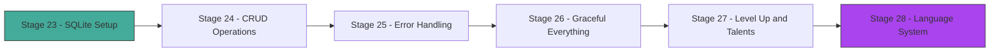

# Act 4 — The Archive

> *Your bot speaks, fights, and narrates. But when the server restarts, every hero vanishes. In this act you give Crónica a memory — a SQLite archive that persists characters, quests, and sessions across restarts. You'll also build a proper error system and implement the full progression mechanics from the game spec.*



**What changes in this act:** Until now, characters lived in JSON files or in-memory structs. By Stage 24, everything persists in SQLite. By Stage 28, your bot has a full progression system with talents and a language-learning layer.

---

## Stage 23 — SQLite Setup

> **Difficulty: Medium**

Every hero created in Act 3 lives only in memory — restart the bot and they're gone, as if they never existed. Two players acting simultaneously could corrupt a JSON file. We need a real database: atomic writes, indexed queries, and transactions, all without the overhead of running a separate server. This stage introduces SQLite through `rusqlite` and confronts the `Send`/`Sync` puzzle that every async Rust database integration must solve.

> [!tip] What You'll Learn
> - Adding `rusqlite` with the `bundled` feature
> - Creating tables that match the spec §13 data model
> - The difference between `Connection::open` and `Connection::open_in_memory`
> - `execute_batch` for multi-statement DDL
> - Why `Connection` is `Send` but not `Sync` — and what that means for tokio

### Why SQLite?

Your bot currently saves characters to JSON files. That works for one player, but it breaks the moment two players act simultaneously — two async tasks writing the same file will corrupt it. SQLite gives you atomic writes, indexed queries, and transactions, all in a single file with zero server setup.

**Python comparison:**
```python
# Python — sqlite3 is in the stdlib
import sqlite3
conn = sqlite3.connect("cronica.db")
conn.execute("CREATE TABLE IF NOT EXISTS characters (id INTEGER PRIMARY KEY, name TEXT)")
```

**Rust — rusqlite 0.31:**
```rust
use rusqlite::{Connection, Result};

fn main() -> Result<()> {
    let conn = Connection::open("cronica.db")?;
    conn.execute_batch(
        "CREATE TABLE IF NOT EXISTS characters (id INTEGER PRIMARY KEY, name TEXT)"
    )?;
    Ok(())
}
```

Almost identical — but Rust's version is checked at compile time. If you forget the `?`, the compiler tells you that you're ignoring a `Result`.

### Update Cargo.toml

Uncomment the Act 4 dependencies:

```toml
[dependencies]
# --- Act 4: The Archive (Stages 23-28) ---
rusqlite = { version = "0.31", features = ["bundled"] }
```

The `bundled` feature compiles SQLite from source into your binary — no system SQLite needed. This is the right choice for an application that controls its own database. First build after adding this will take ~30 seconds as it compiles the C source.

### The Data Model (Spec §13)

The spec defines four core tables. The four-table design separates concerns cleanly: characters persist across quests, quests track narrative arcs, sessions link characters to quests (enabling party play later), and turns record the full conversation history for chronicle compilation. Here's the schema:

```rust
use rusqlite::{Connection, Result};

const SCHEMA: &str = "
    CREATE TABLE IF NOT EXISTS characters (
        id            INTEGER PRIMARY KEY AUTOINCREMENT,
        discord_id    TEXT NOT NULL,
        name          TEXT NOT NULL,
        realm         TEXT NOT NULL DEFAULT 'Valdris',
        level         INTEGER NOT NULL DEFAULT 1,
        xp            INTEGER NOT NULL DEFAULT 0,
        might         INTEGER NOT NULL DEFAULT 2,
        finesse       INTEGER NOT NULL DEFAULT 2,
        wit           INTEGER NOT NULL DEFAULT 2,
        charm         INTEGER NOT NULL DEFAULT 2,
        grit          INTEGER NOT NULL DEFAULT 2,
        hp            INTEGER NOT NULL DEFAULT 10,
        max_hp        INTEGER NOT NULL DEFAULT 10,
        fortune       INTEGER NOT NULL DEFAULT 2,
        fortune_max   INTEGER NOT NULL DEFAULT 2,
        alive         INTEGER NOT NULL DEFAULT 1,
        talents       TEXT NOT NULL DEFAULT '[]',
        inventory     TEXT NOT NULL DEFAULT '[]',
        created_at    TEXT NOT NULL DEFAULT (datetime('now')),
        updated_at    TEXT NOT NULL DEFAULT (datetime('now'))
    );

    CREATE TABLE IF NOT EXISTS quests (
        id            INTEGER PRIMARY KEY AUTOINCREMENT,
        title         TEXT NOT NULL,
        realm         TEXT NOT NULL,
        status        TEXT NOT NULL DEFAULT 'active',
        party_ids     TEXT NOT NULL DEFAULT '[]',
        scene_number  INTEGER NOT NULL DEFAULT 1,
        created_at    TEXT NOT NULL DEFAULT (datetime('now')),
        updated_at    TEXT NOT NULL DEFAULT (datetime('now'))
    );

    CREATE TABLE IF NOT EXISTS sessions (
        id            INTEGER PRIMARY KEY AUTOINCREMENT,
        quest_id      INTEGER NOT NULL REFERENCES quests(id),
        character_id  INTEGER NOT NULL REFERENCES characters(id),
        started_at    TEXT NOT NULL DEFAULT (datetime('now')),
        ended_at      TEXT,
        turns_taken   INTEGER NOT NULL DEFAULT 0
    );

    CREATE TABLE IF NOT EXISTS turns (
        id            INTEGER PRIMARY KEY AUTOINCREMENT,
        session_id    INTEGER NOT NULL REFERENCES sessions(id),
        turn_number   INTEGER NOT NULL,
        player_input  TEXT NOT NULL,
        ai_response   TEXT NOT NULL,
        dice_rolls    TEXT NOT NULL DEFAULT '[]',
        created_at    TEXT NOT NULL DEFAULT (datetime('now'))
    );

    CREATE INDEX IF NOT EXISTS idx_characters_discord ON characters(discord_id);
    CREATE INDEX IF NOT EXISTS idx_sessions_quest ON sessions(quest_id);
    CREATE INDEX IF NOT EXISTS idx_turns_session ON turns(session_id);
";

pub fn init_db(path: &str) -> Result<Connection> {
    let conn = Connection::open(path)?;
    // WAL mode: allows concurrent reads while writing
    conn.execute_batch("PRAGMA journal_mode=WAL; PRAGMA foreign_keys=ON;")?;
    conn.execute_batch(SCHEMA)?;
    Ok(conn)
}
```

### Key Design Decisions

| Decision | Why |
|----------|-----|
| `talents` as JSON TEXT | Flexible — talent list changes as the game evolves. SQLite has `json_extract()` if you need to query inside it. |
| `discord_id` as TEXT | Discord IDs are u64 but SQLite's INTEGER is i64. Storing as TEXT avoids overflow edge cases. |
| WAL mode | Write-Ahead Logging lets readers not block writers — critical when multiple Discord commands hit the DB simultaneously. |
| `datetime('now')` defaults | SQLite stores dates as TEXT in ISO-8601 format. |

### Connection and Tokio: The Send Problem

Here's the critical insight: `rusqlite::Connection` is `Send` but **not** `Sync`. That means you can move it between threads, but you can't share a reference across threads.

```rust
// This works — moving the connection into a tokio::task::spawn_blocking closure
let conn = Connection::open("cronica.db")?;
tokio::task::spawn_blocking(move || {
    conn.execute("INSERT INTO characters (name) VALUES (?1)", ["Kael"])?;
    Ok::<_, rusqlite::Error>(())
}).await??;
```

```rust
// This does NOT compile — Connection is not Sync
let conn = Arc::new(Connection::open("cronica.db")?);
// ERROR: `Connection` cannot be shared between threads safely
```

The pattern we'll use: wrap the `Connection` in a `Mutex` so only one task accesses it at a time, and run database operations inside `spawn_blocking` to avoid blocking the tokio runtime.

```rust
use std::sync::Mutex;
use std::sync::Arc;

// Our database handle — safe to share across async tasks
type Db = Arc<Mutex<Connection>>;

pub fn open_db(path: &str) -> Result<Db> {
    let conn = init_db(path)?;
    Ok(Arc::new(Mutex::new(conn)))
}
```

> [!warning] Common Mistakes
> - **Forgetting `features = ["bundled"]`** — without it, rusqlite tries to link against a system SQLite that may not exist. The build error is cryptic (`ld: library not found`).
> - **Calling rusqlite from async context without `spawn_blocking`** — SQLite operations block the thread. In tokio, blocking the runtime thread starves other tasks. Always use `spawn_blocking` for DB calls.
> - **Using `Arc<Connection>` without `Mutex`** — `Connection` is not `Sync`, so `Arc` alone won't compile. You need `Arc<Mutex<Connection>>`.

The database schema is forged and the tables stand ready, but they're empty — we have no way to create, read, update, or delete records from Rust code. Next stage, we'll build the `Repo` layer with typed CRUD operations.

> [!check] Checkpoint
> Write a small `main()` that calls `init_db("test.db")`, then open the file with `sqlite3 test.db` and run `.tables`. You should see `characters`, `quests`, `sessions`, `turns`.

---

## Stage 24 — CRUD Operations

> **Difficulty: Medium**

Tables exist but they're empty vaults — we have no way to save a character, load one back, or record a quest turn from Rust code. We need a typed database layer that encapsulates every SQL operation behind safe Rust methods, replacing the fragile JSON file persistence from Act 1. This stage builds the `Repo` struct that becomes the backbone of every command in the bot.

> [!tip] What You'll Learn
> - Parameterized queries with `?1` placeholders and the `params!` macro
> - `conn.execute()` for INSERT/UPDATE/DELETE (returns row count)
> - `conn.query_row()` for single-row SELECT
> - `stmt.query_map()` for multi-row SELECT with iterator mapping
> - Replacing your JSON file persistence with database calls
> - The `last_insert_rowid()` method

### The Database Layer

Right now we have tables in SQLite but no Rust code to interact with them. We need a `Repo` struct that wraps the database connection and exposes typed methods for every operation — creating characters, loading them, recording turns, completing quests.

Create a new file `src/db.rs` that encapsulates all database operations. We'll build a `Repo` struct that holds the connection and exposes typed methods.

```rust
use rusqlite::{params, Connection, Result};
use std::sync::{Arc, Mutex};

pub type Db = Arc<Mutex<Connection>>;

pub struct Repo {
    db: Db,
}

impl Repo {
    pub fn new(db: Db) -> Self {
        Self { db }
    }

    /// Save a new character, returning the auto-generated ID.
    pub fn create_character(&self, discord_id: &str, name: &str, realm: &str) -> Result<i64> {
        let conn = self.db.lock().unwrap();
        conn.execute(
            "INSERT INTO characters (discord_id, name, realm) VALUES (?1, ?2, ?3)",
            params![discord_id, name, realm],
        )?;
        Ok(conn.last_insert_rowid())
    }

    /// Load a character by discord_id. Returns None if not found.
    pub fn get_character(&self, discord_id: &str) -> Result<Option<Character>> {
        let conn = self.db.lock().unwrap();
        conn.query_row(
            "SELECT id, discord_id, name, realm, level, xp, might, finesse, wit, charm, grit,
                    hp, max_hp, fortune, fortune_max, alive
             FROM characters WHERE discord_id = ?1 AND alive = 1",
            params![discord_id],
            |row| {
                Ok(Character {
                    id: row.get(0)?,
                    discord_id: row.get(1)?,
                    name: row.get(2)?,
                    realm: row.get(3)?,
                    level: row.get(4)?,
                    xp: row.get(5)?,
                    might: row.get(6)?,
                    finesse: row.get(7)?,
                    wit: row.get(8)?,
                    charm: row.get(9)?,
                    grit: row.get(10)?,
                    hp: row.get(11)?,
                    max_hp: row.get(12)?,
                    fortune: row.get(13)?,
                    fortune_max: row.get(14)?,
                    alive: row.get::<_, i32>(15)? == 1,
                })
            },
        )
        .optional()
    }
}
```

Notice `row.get(0)?` — the `get` method on `Row` takes a column index (or name) and a type parameter that's usually inferred. When it can't be inferred (like the `alive` bool-from-integer case), you specify it explicitly: `row.get::<_, i32>(15)?`.

The `.optional()` at the end converts `Err(QueryReturnedNoRows)` into `Ok(None)`. You'll need to import the trait:

```rust
use rusqlite::OptionalExtension;
```

### Multi-Row Queries with query_map

For listing all characters in a realm, use `prepare` + `query_map`:

```rust
impl Repo {
    pub fn list_characters_in_realm(&self, realm: &str) -> Result<Vec<Character>> {
        let conn = self.db.lock().unwrap();
        let mut stmt = conn.prepare(
            "SELECT id, discord_id, name, realm, level, xp, might, finesse, wit, charm, grit,
                    hp, max_hp, fortune, fortune_max, alive
             FROM characters WHERE realm = ?1 AND alive = 1
             ORDER BY level DESC"
        )?;
        let rows = stmt.query_map(params![realm], |row| {
            Ok(Character {
                id: row.get(0)?,
                // ... same mapping as above
                alive: row.get::<_, i32>(15)? == 1,
            })
        })?;
        rows.collect()
    }
}
```

**Python comparison — the iteration pattern:**
```python
# Python: cursor returns an iterator directly
cursor.execute("SELECT * FROM characters WHERE realm = ?", (realm,))
characters = [Character(*row) for row in cursor.fetchall()]

# Rust: query_map returns an iterator of Result<T>
# You must handle each row's potential error, hence .collect::<Result<Vec<_>>>()
```

The key difference: in Python, if row 5 of 10 has a type error, you get a runtime exception. In Rust, each row is wrapped in `Result`, and `.collect()` short-circuits on the first error — you never get a half-built list.

### Saving Quest State with Transactions

When a quest ends, you need to update multiple tables atomically — the quest status, the session end time, and the character's XP. Use a transaction:

```rust
impl Repo {
    pub fn complete_quest(
        &self,
        quest_id: i64,
        session_id: i64,
        character_id: i64,
        xp_earned: i32,
    ) -> Result<()> {
        let mut conn = self.db.lock().unwrap();
        let tx = conn.transaction()?;

        tx.execute(
            "UPDATE quests SET status = 'completed', updated_at = datetime('now') WHERE id = ?1",
            params![quest_id],
        )?;
        tx.execute(
            "UPDATE sessions SET ended_at = datetime('now') WHERE id = ?1",
            params![session_id],
        )?;
        tx.execute(
            "UPDATE characters SET xp = xp + ?1, updated_at = datetime('now') WHERE id = ?2",
            params![xp_earned, character_id],
        )?;

        tx.commit()
    }
}
```

Note that `conn.transaction()` takes `&mut self` — this is Rust's borrow checker ensuring no other code can use the connection while a transaction is active. The `Mutex` lock already gives us `&mut` access.

### Wiring Into Poise

Replace your old JSON-based `Data` struct with the database:

```rust
// In your bot setup (main.rs or wherever you build the Framework)
struct Data {
    repo: Repo,
}
type Error = Box<dyn std::error::Error + Send + Sync>;
type Context<'a> = poise::Context<'a, Data, Error>;

// In a command:
#[poise::command(slash_command)]
async fn create_character(
    ctx: Context<'_>,
    #[description = "Character name"] name: String,
) -> Result<(), Error> {
    let discord_id = ctx.author().id.to_string();
    let repo = &ctx.data().repo;

    // Run DB operation off the async runtime
    let repo_clone = repo.clone(); // Repo is cheap to clone (Arc inside)
    let id = tokio::task::spawn_blocking(move || {
        repo_clone.create_character(&discord_id, &name, "Valdris")
    }).await??;

    ctx.say(format!("Character created with ID {}!", id)).await?;
    Ok(())
}
```

### Saving Turns

Each turn in a quest gets recorded for the chronicle:

```rust
impl Repo {
    pub fn record_turn(
        &self,
        session_id: i64,
        turn_number: i32,
        player_input: &str,
        ai_response: &str,
        dice_rolls: &str, // JSON string like "[{\"stat\":\"might\",\"roll\":14}]"
    ) -> Result<i64> {
        let conn = self.db.lock().unwrap();
        conn.execute(
            "INSERT INTO turns (session_id, turn_number, player_input, ai_response, dice_rolls)
             VALUES (?1, ?2, ?3, ?4, ?5)",
            params![session_id, turn_number, player_input, ai_response, dice_rolls],
        )?;
        Ok(conn.last_insert_rowid())
    }
}
```

> [!warning] Common Mistakes
> - **Forgetting `.optional()`** on `query_row` — without it, "no rows found" is an error, not `None`. Import `rusqlite::OptionalExtension`.
> - **Holding the Mutex lock across `.await`** — this deadlocks. Always drop the lock before any `.await` point, or use `spawn_blocking`.
> - **Using string formatting instead of `params!`** — `format!("... WHERE id = {id}")` is a SQL injection vulnerability. Always use `?1` placeholders.

Characters persist, quests record, and turns are logged — but errors are still a mess of `unwrap()` calls and cryptic panics. Next stage, we'll build a proper error system that separates internal diagnostics from user-friendly Discord messages.

> [!check] Checkpoint
> Write a test that creates a character, loads it back, and asserts the fields match. Use `Connection::open_in_memory()` for tests so they don't touch disk.


---

## Stage 25 — Error Handling

> **Difficulty: Medium**

Right now, errors are a minefield of `.unwrap()` calls and raw `Box<dyn Error>` types — a database timeout dumps a stack trace into Discord, and a missing character panics the bot. We need a unified error system that knows the difference between "show the player a helpful message" and "log the technical details for debugging." This stage introduces the `thiserror`/`anyhow` pattern that production Rust applications rely on.

> [!tip] What You'll Learn
> - The `thiserror` crate for defining custom error enums with `#[derive(Error)]`
> - The `anyhow` crate for ergonomic error propagation in application code
> - When to use `thiserror` vs `anyhow` (library vs application boundary)
> - Building a `CronicaError` enum that unifies database, AI, and Discord errors
> - Turning internal errors into user-friendly Discord messages

### Update Cargo.toml

```toml
# --- Act 4 continued ---
thiserror = "1"
anyhow = "1"
```

### The Two-Crate Pattern

Rust's error handling ecosystem has a clean split:

| Crate | Purpose | Use when... |
|-------|---------|-------------|
| `thiserror` | Define error types with nice `Display` impls | You're writing a library or defining error variants |
| `anyhow` | Propagate any error with `?` and add context | You're writing application code that calls many libraries |

**Python comparison:**
```python
# Python — you define exception classes
class CharacterNotFound(Exception):
    pass

# And catch broadly in application code
try:
    char = load_character(user_id)
except CharacterNotFound:
    await ctx.send("You don't have a character yet!")
except Exception as e:
    await ctx.send(f"Something went wrong: {e}")
```

**TypeScript comparison:**
```typescript
// TS — custom error classes
class CharacterNotFound extends Error {
  constructor(id: string) { super(`Character not found: ${id}`); }
}

// Caught in try/catch
try {
  const char = await loadCharacter(userId);
} catch (e) {
  if (e instanceof CharacterNotFound) { ... }
}
```

Rust doesn't have exceptions — errors are values returned via `Result<T, E>`. The `?` operator propagates them up the call stack, and `thiserror` makes defining the error types painless.

### Defining CronicaError

Right now we have errors scattered across multiple types — `rusqlite::Error`, `String`, `Box<dyn Error>` — with no unified way to handle them or present them to users. We need a single error enum that captures every failure mode in the bot.

```rust
use thiserror::Error;

#[derive(Debug, Error)]
pub enum CronicaError {
    #[error("Character not found for user {discord_id}")]
    CharacterNotFound { discord_id: String },

    #[error("Character '{name}' is dead — create a new one with /create")]
    CharacterDead { name: String },

    #[error("No active quest — start one with /quest")]
    NoActiveQuest,

    #[error("Quest is full ({current}/{max} players)")]
    QuestFull { current: usize, max: usize },

    #[error("Database error: {0}")]
    Database(#[from] rusqlite::Error),

    #[error("AI service error: {0}")]
    Ai(String),

    #[error("Invalid talent choice: {0}")]
    InvalidTalent(String),

    #[error(transparent)]
    Other(#[from] anyhow::Error),
}
```

The `#[from]` attribute auto-generates `From<rusqlite::Error> for CronicaError`, so any `rusqlite::Error` can be converted with `?`. The `#[error("...")]` attribute generates the `Display` impl — what the user sees.

### Using anyhow for Context

In your application code (commands, handlers), use `anyhow::Context` to add human-readable context to errors:

```rust
use anyhow::Context;

pub fn load_character(repo: &Repo, discord_id: &str) -> anyhow::Result<Character> {
    repo.get_character(discord_id)
        .context("database query failed")?
        .ok_or_else(|| CronicaError::CharacterNotFound {
            discord_id: discord_id.to_string(),
        }.into())
}
```

### User-Friendly Discord Errors

The key insight: internal errors and user-facing messages are different things. A database timeout should say "Something went wrong, try again" — not dump a stack trace into Discord.

```rust
impl CronicaError {
    /// Message safe to show to Discord users.
    pub fn user_message(&self) -> String {
        match self {
            Self::CharacterNotFound { .. } => {
                "You don't have a character yet! Use `/create` to make one.".into()
            }
            Self::CharacterDead { name } => {
                format!("{name} has fallen. Use `/create` to begin a new story.")
            }
            Self::NoActiveQuest => "No active quest. Use `/quest` to start one.".into(),
            Self::QuestFull { max, .. } => {
                format!("This quest already has {max} adventurers — try another!")
            }
            Self::InvalidTalent(t) => format!("'{t}' is not a valid talent choice."),
            // Internal errors — don't leak details
            Self::Database(_) | Self::Ai(_) | Self::Other(_) => {
                "Something went wrong. Please try again.".into()
            }
        }
    }
}
```

### Wiring Into Poise's Error Handler

Poise lets you define a global error handler. This is where `CronicaError` shines:

```rust
async fn on_error(error: poise::FrameworkError<'_, Data, CronicaError>) {
    match error {
        poise::FrameworkError::Command { error, ctx, .. } => {
            let msg = error.user_message();
            let _ = ctx.say(msg).await;
            // Log the full error internally
            eprintln!("Command error: {error:?}");
        }
        other => {
            eprintln!("Framework error: {other:?}");
        }
    }
}
```

> [!warning] Common Mistakes
> - **Using `anyhow` in library code** — `anyhow::Error` erases the error type. If other code needs to match on specific variants, use `thiserror` to define a proper enum.
> - **Forgetting `#[from]` and writing manual `From` impls** — `thiserror` generates these for you. If you have `#[from] rusqlite::Error`, you don't need `impl From<rusqlite::Error>`.
> - **Leaking internal errors to users** — never send `{error:?}` to Discord. Use the `user_message()` pattern to separate internal diagnostics from user-facing text.

Errors are tamed — players see friendly messages while we see full diagnostics. But the bot still crashes ungracefully on Ctrl+C, losing in-flight sessions, and idle quests hang forever. Next stage, we'll add graceful shutdown, session timeouts, and disconnect recovery.

> [!check] Checkpoint
> Trigger each error variant from a test command. Verify that `user_message()` returns something friendly and that the `Debug` output contains the technical details.

---

## Stage 26 — Graceful Everything

> **Difficulty: Medium**

Ctrl+C kills the bot and the current turn is lost. A player who walks away leaves their session "active" forever. A Discord gateway hiccup panics the process. We need the bot to handle interruptions like a seasoned adventurer handles ambushes — save what matters, clean up, and live to fight another day. This stage teaches signal handling, timeouts, and the limits of Rust's `Drop` trait in async code.

> [!tip] What You'll Learn
> - Tokio signal handlers (`tokio::signal::ctrl_c`)
> - Saving in-flight state on shutdown
> - Session timeouts with `tokio::time::timeout`
> - Handling Discord disconnects without losing data
> - The `Drop` trait for cleanup (and why it's not async)

### The Problem

Right now, if you Ctrl+C the bot mid-quest, the current turn is lost. If a player walks away for an hour, their quest session stays "active" forever. We need:

1. **Ctrl+C handler** — save all in-flight sessions before exiting
2. **Session timeout** — auto-end sessions after inactivity
3. **Disconnect recovery** — don't panic if Discord's gateway drops

### Signal Handling with Tokio

```rust
use tokio::signal;
use std::sync::Arc;

pub async fn run_bot(repo: Arc<Repo>) -> anyhow::Result<()> {
    let framework = build_framework(repo.clone());

    tokio::select! {
        result = framework.start() => {
            if let Err(e) = result {
                eprintln!("Bot error: {e:?}");
            }
        }
        _ = signal::ctrl_c() => {
            eprintln!("Shutdown signal received, saving state...");
        }
    }

    // Graceful cleanup — runs on Ctrl+C OR bot error
    shutdown(repo).await;
    Ok(())
}

async fn shutdown(repo: Arc<Repo>) {
    // End all active sessions
    let result = tokio::task::spawn_blocking(move || {
        repo.end_all_active_sessions()
    }).await;

    match result {
        Ok(Ok(count)) => eprintln!("Saved {count} active sessions."),
        Ok(Err(e)) => eprintln!("Error saving sessions: {e}"),
        Err(e) => eprintln!("Task panicked during shutdown: {e}"),
    }
}
```

**Python comparison:**
```python
# Python — signal handlers are synchronous
import signal, sys

def handle_shutdown(sig, frame):
    print("Saving state...")
    save_all_sessions()
    sys.exit(0)

signal.signal(signal.SIGINT, handle_shutdown)
```

Rust's `tokio::select!` is more powerful — it races multiple futures and cancels the losers. When `ctrl_c()` completes, the framework future is dropped (which triggers its own cleanup), and then our `shutdown()` runs.

### Session Timeouts

Add a timeout wrapper around quest interactions:

```rust
use tokio::time::{timeout, Duration};

const SESSION_TIMEOUT: Duration = Duration::from_secs(30 * 60); // 30 minutes

pub async fn quest_turn_with_timeout(
    ctx: Context<'_>,
    session_id: i64,
) -> Result<(), CronicaError> {
    match timeout(SESSION_TIMEOUT, wait_for_player_input(ctx)).await {
        Ok(result) => result,
        Err(_elapsed) => {
            // Timeout — save and end the session
            let repo = ctx.data().repo.clone();
            tokio::task::spawn_blocking(move || {
                repo.end_session(session_id, "timeout")
            }).await??;

            ctx.say("Your quest has been paused due to inactivity. Use `/resume` to continue.")
                .await?;
            Ok(())
        }
    }
}
```

### The Repo Cleanup Method

```rust
impl Repo {
    pub fn end_all_active_sessions(&self) -> Result<usize> {
        let conn = self.db.lock().unwrap();
        let count = conn.execute(
            "UPDATE sessions SET ended_at = datetime('now')
             WHERE ended_at IS NULL",
            [],
        )?;
        Ok(count)
    }

    pub fn end_session(&self, session_id: i64, reason: &str) -> Result<()> {
        let conn = self.db.lock().unwrap();
        conn.execute(
            "UPDATE sessions SET ended_at = datetime('now') WHERE id = ?1",
            params![session_id],
        )?;
        // Optionally log the reason
        conn.execute(
            "INSERT INTO turns (session_id, turn_number, player_input, ai_response)
             VALUES (?1, -1, ?2, 'Session ended')",
            params![session_id, format!("[system: {reason}]")],
        )?;
        Ok(())
    }
}
```

### Why Drop Isn't Enough

You might think: "I'll implement `Drop` on my session struct to auto-save." The problem: `Drop` is synchronous. You can't `.await` inside it, and you can't call `spawn_blocking` without a runtime handle.

```rust
// This does NOT work
impl Drop for QuestSession {
    fn drop(&mut self) {
        // ERROR: cannot use `.await` in a non-async function
        // self.repo.end_session(self.id).await;
    }
}
```

The solution is explicit cleanup via the signal handler and timeout patterns shown above. Rust's ownership system ensures the cleanup code *runs* — the signal handler is the right place for it.

> [!warning] Common Mistakes
> - **Trying to `.await` in `Drop`** — `Drop` is sync-only. Use explicit shutdown functions instead.
> - **Forgetting `tokio::select!` cancellation** — when one branch completes, the other is dropped. Make sure your framework handles being dropped gracefully (poise does).
> - **Not handling the `JoinError` from `spawn_blocking`** — the double `?` in `spawn_blocking(...).await??` handles both the join error and the inner `Result`.

The bot survives shutdowns, timeouts, and disconnects with grace. But characters still don't grow — no leveling, no talents, no sense of progression. Next stage, we'll build the full level-up and talent system that makes every quest feel earned.

> [!check] Checkpoint
> Start the bot, begin a quest, then Ctrl+C. Check the database — the session should have an `ended_at` timestamp. Restart the bot and verify `/resume` can pick up where you left off.


---

## Stage 27 — Level Up & Talents

> **Difficulty: Medium**

Characters persist and survive restarts, but they never grow — a level 1 hero after 20 quests feels the same as a fresh recruit. Without progression, there's no reason to keep playing. We need an XP table, a level-up flow, and a talent system that gives players meaningful choices about how their character evolves. This stage implements the full progression mechanics that transform Crónica from a one-shot adventure into a campaign.

> [!tip] What You'll Learn
> - Implementing the XP table from spec §4.3 (levels 1–10)
> - The talent system: 4 shapes (passive, reaction, synergy, archetype)
> - All 10 talents from the spec with their mechanical effects
> - `TalentState` tracking with per-quest and per-scene reset flags
> - Fortune token pool: `2 + level / 3`, regen `+1/session`
> - Building a talent selection UI in Discord with poise

### The XP Table (Spec §4.3)

Progression is deliberately slow — each level should feel earned across multiple quests. The exponential curve exists because early levels should come quickly (rewarding new players) while later levels require sustained commitment (giving veterans long-term goals).

```rust
/// XP required to reach each level. Index 0 = level 1 (always 0).
const XP_TABLE: [i32; 10] = [
    0,     // Level 1 — starting
    100,   // Level 2
    300,   // Level 3
    600,   // Level 4
    1000,  // Level 5
    1500,  // Level 6
    2100,  // Level 7
    2800,  // Level 8
    3600,  // Level 9
    4500,  // Level 10 — cap
];

pub fn level_for_xp(xp: i32) -> i32 {
    XP_TABLE
        .iter()
        .rposition(|&threshold| xp >= threshold)
        .map(|i| i as i32 + 1)
        .unwrap_or(1)
}

pub fn xp_to_next_level(level: i32, xp: i32) -> Option<i32> {
    if level >= 10 { return None; } // Already at cap
    Some(XP_TABLE[level as usize] - xp)
}
```

### Fortune Token Pool (Spec §4.5)

Fortune tokens are the "luck" resource — but unlike a passive Luck stat, they give players *agency* over when to be lucky. The pool grows with level so higher-level characters can take more risks, and the per-session regen of 1 token prevents hoarding while ensuring every session starts with at least some fortune to spend:

```rust
pub fn fortune_pool_max(level: i32) -> i32 {
    2 + level / 3
}

pub fn fortune_regen_per_session() -> i32 {
    1
}
```

At level 1: pool = 2. At level 3: pool = 3. At level 9: pool = 5. Players regenerate 1 token per session start.

### The Talent System (Spec §4.4)

Each talent has one of four **shapes** that determines when and how it activates. The four shapes exist to create different gameplay rhythms: passives reward consistent playstyle, reactions create exciting "gotcha" moments, synergies encourage party play, and archetypes define long-term character identity:

| Shape | Trigger | Example |
|-------|---------|---------|
| **Passive** | Always active, no action needed | Deadened Nerve: +1 to Grit checks when below half HP |
| **Reaction** | Triggers in response to an event | Counterstrike: riposte after a missed enemy attack |
| **Synergy** | Activates when two conditions align | Flanker's Eye: bonus when ally is also in combat |
| **Archetype** | Defines a playstyle, once per quest | Warden's Vow: protect an ally for the entire quest |

```rust
use serde::{Deserialize, Serialize};

#[derive(Debug, Clone, Serialize, Deserialize, PartialEq)]
pub enum TalentShape {
    Passive,
    Reaction,
    Synergy,
    Archetype,
}

#[derive(Debug, Clone, Serialize, Deserialize, PartialEq)]
pub enum TalentId {
    DeadenedNerve,
    ReadTheRoom,
    TravelersStride,
    Counterstrike,
    SecondWind,
    SilverPivot,
    FlankersEye,
    WardensVow,
    ScholarOfTheRoad,
    Heartwood,
}

#[derive(Debug, Clone, Serialize, Deserialize)]
pub struct Talent {
    pub id: TalentId,
    pub name: String,
    pub shape: TalentShape,
    pub description: String,
}

/// Tracks usage state for a single talent during play.
#[derive(Debug, Clone, Serialize, Deserialize)]
pub struct TalentState {
    pub talent_id: TalentId,
    pub used_this_quest: bool,
    pub used_this_scene: bool,
}

impl TalentState {
    pub fn new(talent_id: TalentId) -> Self {
        Self {
            talent_id,
            used_this_quest: false,
            used_this_scene: false,
        }
    }

    pub fn reset_for_scene(&mut self) {
        self.used_this_scene = false;
    }

    pub fn reset_for_quest(&mut self) {
        self.used_this_quest = false;
        self.used_this_scene = false;
    }
}
```

### The Full Talent Registry

Build a function that returns all 10 talents. Here are the first few — implement the rest as an exercise:

```rust
pub fn all_talents() -> Vec<Talent> {
    vec![
        Talent {
            id: TalentId::DeadenedNerve,
            name: "Deadened Nerve".into(),
            shape: TalentShape::Passive,
            description: "+1 to Grit checks when below half HP. Pain is an old friend.".into(),
        },
        Talent {
            id: TalentId::ReadTheRoom,
            name: "Read the Room".into(),
            shape: TalentShape::Passive,
            description: "+1 to Charm checks in social encounters. You always know the mood.".into(),
        },
        Talent {
            id: TalentId::TravelersStride,
            name: "Traveler's Stride".into(),
            shape: TalentShape::Passive,
            description: "No penalties for difficult terrain. The road bends for you.".into(),
        },
        Talent {
            id: TalentId::Counterstrike,
            name: "Counterstrike".into(),
            shape: TalentShape::Reaction,
            description: "When an enemy misses you in melee, riposte for half damage.".into(),
        },
        Talent {
            id: TalentId::SecondWind,
            name: "Second Wind".into(),
            shape: TalentShape::Reaction,
            description: "Once per scene, when you drop below 25% HP, recover Grit * 2 HP.".into(),
        },
        // --- Exercise: add the remaining 5 talents ---
        // SilverPivot (Reaction): redirect a failed Charm check into a Wit check
        // FlankersEye (Synergy): +2 to attack when an ally is engaged with the same enemy
        // WardensVow (Archetype): choose an ally at quest start — take half their damage
        // ScholarOfTheRoad (Synergy): +1 to Wit checks for each unique realm you've visited
        // Heartwood (Archetype): once per quest, fully heal in a natural setting
    ]
}
```

### Level Up Flow

When a character gains enough XP, trigger the level-up sequence:

```rust
pub struct LevelUpResult {
    pub new_level: i32,
    pub new_fortune_max: i32,
    pub stat_points: i32,       // 1 point per level to distribute
    pub talent_unlock: bool,    // New talent slot at levels 3, 5, 7, 10
}

pub fn check_level_up(character: &Character) -> Option<LevelUpResult> {
    let new_level = level_for_xp(character.xp);
    if new_level <= character.level {
        return None;
    }

    let talent_levels = [3, 5, 7, 10];
    Some(LevelUpResult {
        new_level,
        new_fortune_max: fortune_pool_max(new_level),
        stat_points: 1,
        talent_unlock: talent_levels.contains(&new_level),
    })
}
```

### Talent Selection UI in Discord

When a player unlocks a talent slot, present the choices as a select menu. This is a hint — you'll need to use poise's `CreateReply` with Discord components:

```rust
// Hint: build a select menu with available talents
// The player picks one, you deserialize the choice, add it to their talent list,
// and save to the database.
//
// Key poise types you'll need:
//   serenity::CreateSelectMenu
//   serenity::CreateSelectMenuOption
//   serenity::CreateActionRow
//
// The interaction flow:
// 1. Send a message with the select menu component
// 2. Wait for the interaction with ComponentInteractionCollector
// 3. Parse the selected talent ID
// 4. Add to character's talent list and save
```

### Applying Talents During Play

Talents modify the AI prompt and dice mechanics. Here's how passive talents integrate:

```rust
pub fn apply_passive_talents(character: &Character, context: &mut QuestContext) {
    for state in &character.talent_states {
        if state.used_this_scene { continue; }

        match &state.talent_id {
            TalentId::DeadenedNerve if character.hp < character.max_hp / 2 => {
                context.stat_modifiers.grit += 1;
                context.ai_hints.push(
                    format!("{} grits through the pain (Deadened Nerve: +1 Grit)", character.name)
                );
            }
            TalentId::ReadTheRoom if context.is_social_encounter => {
                context.stat_modifiers.charm += 1;
                context.ai_hints.push(
                    format!("{} reads the room effortlessly (+1 Charm)", character.name)
                );
            }
            TalentId::TravelersStride if context.has_difficult_terrain => {
                context.terrain_penalty = 0;
                context.ai_hints.push(
                    format!("{} moves through the terrain as if it were a paved road", character.name)
                );
            }
            _ => {}
        }
    }
}
```

The `ai_hints` are injected into the AI prompt so the narrator can weave talent effects into the story naturally.

> [!warning] Common Mistakes
> - **Forgetting to reset `TalentState` flags** — `used_this_scene` resets every scene transition, `used_this_quest` resets at quest start. Miss this and talents become one-time-use forever.
> - **Not updating `fortune_max` on level up** — the pool formula changes with level. Recalculate on every level-up.
> - **Hardcoding talent effects in the dice roller** — keep talent logic separate from core dice mechanics. Use the modifier pattern shown above.

Heroes level up, choose talents, and grow stronger with every quest. But Crónica has one more trick up its sleeve — a language-learning system that weaves real-world vocabulary into the fantasy narrative. Next stage, we'll build it.

> [!check] Checkpoint
> Create a character, give them 300 XP (enough for level 3), and verify: level updates to 3, fortune pool becomes 3, and a talent selection prompt appears.

---

## Stage 28 — Language System

> **Difficulty: Medium**

Crónica is a game, but it can also be a teacher. Right now the AI narrates entirely in English — a missed opportunity when the narrator could weave Spanish, Japanese, or any target language into the story naturally. We need a language system with difficulty tiers that controls how much foreign vocabulary the AI introduces, tracks what the player has learned, and adjusts over time. This transforms Crónica from pure entertainment into an immersive learning tool.

> [!tip] What You'll Learn
> - Implementing the language system from spec §10
> - Three difficulty levels: Beginner, Intermediate, Advanced
> - Vocab highlighting in AI responses
> - Adjusting AI prompts per difficulty level
> - Storing language preferences per character

### The Language System (Spec §10)

Crónica doubles as a language-learning tool. The AI narrator can weave vocabulary from a target language into the story, with difficulty controlling how much. The three-tier system mirrors proven language acquisition theory: beginners need explicit translations (comprehensible input), intermediate learners benefit from context clues with occasional scaffolding, and advanced learners acquire best through full immersion:

| Level | Behavior |
|-------|----------|
| **Beginner** | 1–2 words per response, always with inline translation. "The merchant greets you: *'Hola'* (hello)." |
| **Intermediate** | 3–5 words per response, translations in parentheses only for new words. Context clues for repeated vocab. |
| **Advanced** | Full sentences in target language with no translation. The story itself teaches through immersion. |

### Data Model

Right now we have no way to store a player's language preference or track which words they've encountered. We need structs for the language configuration and vocabulary tracking.

```rust
#[derive(Debug, Clone, Serialize, Deserialize)]
pub enum LanguageDifficulty {
    Beginner,
    Intermediate,
    Advanced,
}

#[derive(Debug, Clone, Serialize, Deserialize)]
pub struct LanguageConfig {
    pub target_language: String,       // e.g. "Spanish", "Japanese"
    pub difficulty: LanguageDifficulty,
    pub vocab_seen: Vec<VocabEntry>,   // Words the player has encountered
}

#[derive(Debug, Clone, Serialize, Deserialize)]
pub struct VocabEntry {
    pub word: String,
    pub translation: String,
    pub times_seen: u32,
    pub first_seen_turn: i64,
}
```

### AI Prompt Adjustments

The key is modifying the system prompt sent to Bedrock based on the difficulty level. Here's the prompt fragment builder:

```rust
impl LanguageConfig {
    pub fn prompt_instructions(&self) -> String {
        let lang = &self.target_language;
        match self.difficulty {
            LanguageDifficulty::Beginner => format!(
                "Weave 1-2 {lang} words into your narration. \
                 Always provide the English translation in parentheses immediately after. \
                 Example: The merchant says '*Bienvenido*' (welcome). \
                 Choose common, everyday words. Bold the {lang} words with *asterisks*."
            ),
            LanguageDifficulty::Intermediate => {
                let known: Vec<&str> = self.vocab_seen.iter()
                    .filter(|v| v.times_seen >= 3)
                    .map(|v| v.word.as_str())
                    .collect();
                let known_list = if known.is_empty() {
                    "none yet".to_string()
                } else {
                    known.join(", ")
                };
                format!(
                    "Weave 3-5 {lang} words/phrases into your narration. \
                     For NEW words, provide translation in parentheses. \
                     For KNOWN words ({known_list}), use them without translation — \
                     the player should recognize them from context. \
                     Bold all {lang} text with *asterisks*."
                )
            }
            LanguageDifficulty::Advanced => format!(
                "Write dialogue and descriptions with full {lang} sentences where natural. \
                 Do NOT provide translations. The player learns through immersion and context. \
                 Narration framing can remain in English, but character speech, signs, \
                 and cultural elements should be in {lang}. Bold {lang} text with *asterisks*."
            ),
        }
    }
}
```

### Tracking Vocabulary

After each AI response, extract the highlighted vocab and update the tracker:

```rust
impl LanguageConfig {
    /// Extract *highlighted* words from AI response and update vocab tracker.
    pub fn track_vocab_from_response(&mut self, response: &str, turn_id: i64) {
        // Find all *word* patterns (the AI was instructed to bold target-language words)
        let re = regex::Regex::new(r"\*([^*]+)\*").unwrap();
        for cap in re.captures_iter(response) {
            let word = cap[1].to_lowercase();
            if let Some(entry) = self.vocab_seen.iter_mut().find(|v| v.word == word) {
                entry.times_seen += 1;
            } else {
                self.vocab_seen.push(VocabEntry {
                    word,
                    translation: String::new(), // Filled from parenthetical if present
                    times_seen: 1,
                    first_seen_turn: turn_id,
                });
            }
        }
    }
}
```

> [!note] Regex dependency
> You'll need `regex = "1"` in Cargo.toml. If you already have it from earlier stages, you're set. The regex is compiled every call here — in production, use `lazy_static!` or `std::sync::OnceLock` to compile it once.

### The /language Command

```rust
#[poise::command(slash_command)]
async fn language(
    ctx: Context<'_>,
    #[description = "Target language"] language: String,
    #[description = "Difficulty"]
    #[choices("Beginner", "Intermediate", "Advanced")]
    difficulty: String,
) -> Result<(), CronicaError> {
    let diff = match difficulty.as_str() {
        "Beginner" => LanguageDifficulty::Beginner,
        "Intermediate" => LanguageDifficulty::Intermediate,
        "Advanced" => LanguageDifficulty::Advanced,
        _ => return Err(CronicaError::InvalidTalent("Invalid difficulty".into())),
    };

    // Save to character's language config in the database
    // (Exercise: add a language_config TEXT column to characters table,
    //  store as JSON, load/save alongside character data)

    ctx.say(format!(
        "Language set to **{language}** at **{difficulty}** level. \
         Your narrator will weave {language} into the story!"
    )).await?;
    Ok(())
}
```

### The /vocab Command — Review What You've Learned

```rust
// Hint: query the character's vocab_seen list, format as a Discord embed
// with columns: Word | Translation | Times Seen
// Sort by times_seen descending so the most-practiced words are on top.
// Use poise's CreateReply with CreateEmbed for nice formatting.
```

> [!warning] Common Mistakes
> - **Not passing vocab history to the AI** — without the "known words" list, the AI can't distinguish new vs. familiar vocabulary. Always include it in the prompt for Intermediate difficulty.
> - **Regex matching too greedily** — `*bold*` in markdown uses single asterisks. If the AI uses `**double**` for bold, your regex won't match. Handle both patterns.
> - **Storing language config separately from character** — keep it in the same `characters` table as a JSON TEXT column. One source of truth.

The language system breathes a second life into every quest — learning while adventuring. Act 4 is complete: persistence, errors, graceful shutdown, progression, and language learning. In Act 5, we'll take Crónica multiplayer and deploy it to the cloud.

> [!check] Checkpoint
> Set language to Spanish/Beginner. Start a quest and verify the AI response contains 1–2 Spanish words with translations in parentheses. Run `/vocab` and confirm the words were tracked.

---

> **End of Act 4.** Your bot now has persistent storage, proper error handling, graceful shutdown, a full progression system with 10 talents, and a language-learning layer. In Act 5, we go multiplayer.
