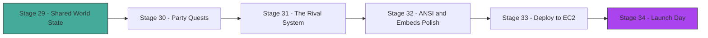

# Act 5 — The Chronicle

> *Your archive remembers. Your heroes level up, learn languages, and survive crashes. Now Crónica becomes a living world — multiple players sharing the same realm, forming parties, and leaving ghosts behind when they fall. In this final act you build multiplayer, polish the experience, and deploy to the cloud.*



**What changes in this act:** The bot goes from single-player to multiplayer. Players share a world, form parties, and encounter each other's fallen characters. Then we polish the visual experience and ship it to production.

---

## Stage 29 — Shared World State

> **Difficulty: Medium**

Every player's quest runs in isolation — Player A slays a dragon and Player B never hears about it. The world has no memory beyond individual sessions. We need shared mutable state that multiple async tasks can read and write safely across threads. This stage confronts Rust's concurrency model head-on: `Arc<RwLock<T>>`, the `Send` and `Sync` traits, and the design patterns that make multiplayer possible without data races.

> [!tip] What You'll Learn
> - `Arc<RwLock<T>>` for shared mutable state across async tasks
> - The `Send` and `Sync` traits — what they mean and why the compiler checks them
> - Interior mutability: `RwLock` vs `Mutex` vs `RefCell`
> - Building a world event log that all players can see
> - Why `Connection` is `Send` but not `Sync` (revisited with deeper understanding)

### The Concurrency Problem

Until now, each player's quest runs in isolation. But a living world needs shared state: if Player A slays a dragon in the Ashlands, Player B should hear about it. If a merchant is robbed in one quest, prices should rise in another.

**Python comparison — shared state with asyncio:**
```python
# Python — asyncio is single-threaded, so a plain dict works
world_events = []

async def add_event(event: str):
    world_events.append(event)  # Safe — only one thread

async def get_events():
    return list(world_events)  # Safe — only one thread
```

**TypeScript comparison — Node.js is also single-threaded:**
```typescript
// TS/Node — same story, single event loop
const worldEvents: string[] = [];
function addEvent(event: string) { worldEvents.push(event); }
```

Rust is different. Tokio runs tasks across **multiple OS threads**. Two tasks might try to read and write the world state simultaneously. The compiler won't let you share a `Vec` across threads without synchronization.

### Send and Sync — The Compiler's Safety Net

Two marker traits control what can cross thread boundaries:

| Trait | Meaning | Example |
|-------|---------|---------|
| `Send` | Can be **moved** to another thread | `String`, `Vec<T>`, `Connection` |
| `Sync` | Can be **referenced** from another thread | `i32`, `Arc<Mutex<T>>`, `&str` |
| Neither | Thread-local only | `Rc<T>`, `RefCell<T>` |

A type is `Sync` if `&T` is `Send`. In plain English: if it's safe to hand a reference to another thread, the type is `Sync`.

`rusqlite::Connection` is `Send` (you can move it to a thread) but **not** `Sync` (you can't share `&Connection` across threads). That's why we wrapped it in `Mutex` in Stage 23 — `Mutex<Connection>` is `Sync` because the lock ensures only one thread accesses it at a time.

### Arc<RwLock<T>> — The Multiplayer Pattern

Right now we understand the concurrency problem and the `Send`/`Sync` traits, but we don't have a data structure for the shared world. We need a world state type wrapped in `Arc<RwLock<T>>` that any task can clone a handle to and read or write safely.

For world state, we want many readers and occasional writers. `RwLock` is perfect:

```rust
use std::sync::Arc;
use tokio::sync::RwLock;

#[derive(Debug, Clone)]
pub struct WorldEvent {
    pub realm: String,
    pub description: String,
    pub caused_by: String,     // Character name
    pub turn_id: i64,
    pub timestamp: String,
}

#[derive(Debug)]
pub struct WorldState {
    pub events: Vec<WorldEvent>,
    pub realm_modifiers: HashMap<String, RealmModifier>,
}

#[derive(Debug, Clone)]
pub struct RealmModifier {
    pub danger_level: i32,     // -2 to +2, affects encounter difficulty
    pub merchant_prices: f32,  // Multiplier: 1.0 = normal, 1.5 = expensive
    pub description: String,   // "The Ashlands smolder after the dragon's fall"
}

// The shared handle — clone this into every task that needs world access
pub type SharedWorld = Arc<RwLock<WorldState>>;
```

> [!note] `tokio::sync::RwLock` vs `std::sync::RwLock`
> Use **tokio's** `RwLock` when you hold the lock across `.await` points. Use **std's** `RwLock` when the critical section is synchronous and short. Since our world state reads happen inside async command handlers, we use tokio's version.

### Reading and Writing World State

```rust
// Reading — many tasks can read simultaneously
pub async fn get_realm_events(world: &SharedWorld, realm: &str) -> Vec<WorldEvent> {
    let state = world.read().await;
    state.events
        .iter()
        .filter(|e| e.realm == realm)
        .cloned()
        .collect()
}

// Writing — exclusive access, blocks other readers and writers
pub async fn add_world_event(world: &SharedWorld, event: WorldEvent) {
    let mut state = world.write().await;
    let realm = event.realm.clone();

    // Update realm danger based on event type
    let modifier = state.realm_modifiers
        .entry(realm)
        .or_insert(RealmModifier {
            danger_level: 0,
            merchant_prices: 1.0,
            description: String::new(),
        });

    if event.description.contains("slain") || event.description.contains("defeated") {
        modifier.danger_level = (modifier.danger_level - 1).max(-2);
        modifier.description = format!("Peace returns after {}'s victory", event.caused_by);
    }

    state.events.push(event);

    // Keep only the last 100 events to bound memory
    if state.events.len() > 100 {
        state.events.drain(..state.events.len() - 100);
    }
}
```

### Injecting World State Into AI Prompts

When a player starts a turn, include recent world events in the AI context:

```rust
pub async fn build_world_context(world: &SharedWorld, realm: &str) -> String {
    let events = get_realm_events(world, realm).await;
    if events.is_empty() {
        return String::new();
    }

    let recent: Vec<String> = events.iter().rev().take(5)
        .map(|e| format!("- {} (by {})", e.description, e.caused_by))
        .collect();

    format!(
        "\n[WORLD STATE — Recent events in {realm}]\n{}\n\
         Weave these events naturally into the narration as rumors, \
         visible aftermath, or NPC dialogue.\n",
        recent.join("\n")
    )
}
```

### Wiring Into the Bot Data

```rust
struct Data {
    repo: Repo,
    world: SharedWorld,
}

// In bot setup:
let world = Arc::new(RwLock::new(WorldState {
    events: Vec::new(),
    realm_modifiers: HashMap::new(),
}));
```

> [!warning] Common Mistakes
> - **Using `std::sync::RwLock` with `.await` inside the lock** — this can deadlock because std's RwLock is not async-aware. Use `tokio::sync::RwLock` when the critical section contains `.await`.
> - **Holding the write lock too long** — every reader blocks while you hold a write lock. Keep writes short: clone data out, drop the lock, then process.
> - **Forgetting `Clone` on `WorldEvent`** — you need to clone events out of the `RwLock` before the lock is released. Derive `Clone` on all shared data types.

The world remembers now — events ripple across quests and realms shift in response to player actions. But shared state is just the foundation. Next stage, we'll build party quests where multiple players share a single narrative in real time.

> [!check] Checkpoint
> Start two quests in the same realm. Complete a combat encounter in Quest A. Verify that Quest B's next AI response references the aftermath as a rumor or visible change.

---

## Stage 30 — Party Quests

> **Difficulty: Hard**

World events propagate between quests, but every adventure is still a solo affair — one player, one character, one narrative thread. The most memorable RPG moments happen when friends play together: coordinating tactics, roleplaying off each other, sharing the triumph of a hard-won battle. We need a party system that manages turn order, handles player disconnects, and teaches the AI to narrate for multiple characters simultaneously. This is the most complex flow in the entire bot.

> [!tip] What You'll Learn
> - Managing 2–4 players in a single quest
> - Turn order and initiative in multiplayer
> - AI prompt engineering for multi-character narration
> - Handling player disconnects mid-party-quest
> - Concurrent message collection from multiple Discord users

### The Party Model

Right now we have single-player quests and shared world state, but no way to put multiple characters into the same narrative. We need a `Party` struct that tracks members, manages turn order, and handles the messy reality of players going silent mid-quest.

A party quest has 2–4 characters sharing one narrative. The AI manages all of them, but each player controls only their own character's actions.

```rust
#[derive(Debug, Clone)]
pub struct Party {
    pub quest_id: i64,
    pub members: Vec<PartyMember>,
    pub turn_order: Vec<usize>,  // Indices into members, sorted by initiative
    pub current_turn: usize,     // Index into turn_order
}

#[derive(Debug, Clone)]
pub struct PartyMember {
    pub character: Character,
    pub discord_id: String,
    pub channel_id: u64,
    pub connected: bool,
}

impl Party {
    pub fn new(quest_id: i64) -> Self {
        Self {
            quest_id,
            members: Vec::new(),
            turn_order: Vec::new(),
            current_turn: 0,
        }
    }

    pub fn add_member(&mut self, character: Character, discord_id: String, channel_id: u64) -> Result<(), CronicaError> {
        if self.members.len() >= 4 {
            return Err(CronicaError::QuestFull {
                current: self.members.len(),
                max: 4,
            });
        }
        self.members.push(PartyMember {
            character,
            discord_id,
            channel_id,
            connected: true,
        });
        Ok(())
    }

    /// Roll initiative for all members and set turn order.
    pub fn roll_initiative(&mut self) {
        let mut rolls: Vec<(usize, i32)> = self.members.iter().enumerate()
            .map(|(i, m)| {
                let roll = roll_d20() + m.character.finesse; // Finesse determines initiative
                (i, roll)
            })
            .collect();
        rolls.sort_by(|a, b| b.1.cmp(&a.1)); // Highest first
        self.turn_order = rolls.into_iter().map(|(i, _)| i).collect();
        self.current_turn = 0;
    }

    pub fn current_player(&self) -> &PartyMember {
        let idx = self.turn_order[self.current_turn];
        &self.members[idx]
    }

    pub fn advance_turn(&mut self) {
        self.current_turn = (self.current_turn + 1) % self.turn_order.len();
        // Skip disconnected players
        let start = self.current_turn;
        loop {
            let idx = self.turn_order[self.current_turn];
            if self.members[idx].connected { break; }
            self.current_turn = (self.current_turn + 1) % self.turn_order.len();
            if self.current_turn == start { break; } // All disconnected
        }
    }
}
```

### Multi-Character AI Prompts

The AI needs to know about all party members and whose turn it is:

```rust
pub fn build_party_prompt(party: &Party, current_action: &str) -> String {
    let members_desc: Vec<String> = party.members.iter().map(|m| {
        format!(
            "- {name} (Level {level} {realm}): HP {hp}/{max_hp}, Might {might}, Finesse {fin}",
            name = m.character.name,
            level = m.character.level,
            realm = m.character.realm,
            hp = m.character.hp,
            max_hp = m.character.max_hp,
            might = m.character.might,
            fin = m.character.finesse,
        )
    }).collect();

    let current = party.current_player();
    format!(
        "[PARTY QUEST — {count} adventurers]\n\
         {members}\n\n\
         It is {name}'s turn. They say: \"{action}\"\n\n\
         Narrate the result of {name}'s action, then describe what the party sees next. \
         Address {name} directly for their action's outcome, \
         but include the other party members' reactions and positions.",
        count = party.members.len(),
        members = members_desc.join("\n"),
        name = current.character.name,
        action = current_action,
    )
}
```

### The Party Quest Loop

This is the most complex flow in the bot. Here's the skeleton — you'll fill in the details:

```rust
pub async fn run_party_quest(
    ctx: Context<'_>,
    party: Arc<RwLock<Party>>,
    repo: Repo,
    world: SharedWorld,
) -> Result<(), CronicaError> {
    // Roll initiative
    {
        let mut p = party.write().await;
        p.roll_initiative();
    }

    loop {
        let current_discord_id;
        let current_name;
        {
            let p = party.read().await;
            let member = p.current_player();
            current_discord_id = member.discord_id.clone();
            current_name = member.character.name.clone();
        }

        // Notify the current player it's their turn
        ctx.say(format!("**{current_name}**, it's your turn! What do you do?")).await?;

        // Wait for input from the specific player (with timeout)
        // Hint: use serenity's MessageCollector filtered by author ID
        // let input = collect_message_from_user(ctx, &current_discord_id).await?;

        // Build the AI prompt with party context
        // let prompt = build_party_prompt(&party.read().await, &input);

        // Get AI response and broadcast to all party members
        // let response = call_bedrock(prompt).await?;
        // broadcast_to_party(ctx, &party.read().await, &response).await?;

        // Process combat results, XP, etc.
        // ...

        // Advance to next player's turn
        {
            let mut p = party.write().await;
            p.advance_turn();
        }

        // Check quest completion conditions
        // ...
    }
}
```

### Handling Disconnects

When a player stops responding, mark them as disconnected rather than crashing the quest:

```rust
// In the message collection timeout handler:
async fn handle_player_timeout(
    party: &Arc<RwLock<Party>>,
    discord_id: &str,
    ctx: Context<'_>,
) -> Result<(), CronicaError> {
    let mut p = party.write().await;
    if let Some(member) = p.members.iter_mut().find(|m| m.discord_id == discord_id) {
        member.connected = false;
        let name = member.character.name.clone();
        drop(p); // Release lock before await

        ctx.say(format!(
            "**{name}** has gone silent... The party continues without them. \
             They can rejoin with `/rejoin`."
        )).await?;
    }
    Ok(())
}
```

### Database: Party Quest Records

```rust
impl Repo {
    pub fn create_party_quest(&self, title: &str, realm: &str, character_ids: &[i64]) -> Result<i64> {
        let conn = self.db.lock().unwrap();
        let ids_json = serde_json::to_string(character_ids).unwrap_or_default();
        conn.execute(
            "INSERT INTO quests (title, realm, party_ids) VALUES (?1, ?2, ?3)",
            params![title, realm, ids_json],
        )?;
        let quest_id = conn.last_insert_rowid();

        // Create a session for each party member
        for &char_id in character_ids {
            conn.execute(
                "INSERT INTO sessions (quest_id, character_id) VALUES (?1, ?2)",
                params![quest_id, char_id],
            )?;
        }
        Ok(quest_id)
    }
}
```

> [!warning] Common Mistakes
> - **Holding the `RwLock` across `.await`** — this is technically allowed with tokio's `RwLock`, but holding a write lock across an AI call (which takes seconds) blocks all readers. Clone data out, drop the lock, then await.
> - **Not handling the "all players disconnected" case** — if everyone times out, the quest should auto-pause, not spin forever.
> - **Sending party messages to the wrong channel** — each player might be in a different Discord channel. Track `channel_id` per member and send targeted messages.

Parties quest together, take turns, and survive disconnects. But the world still feels empty — no echoes of fallen heroes, no legendary figures from other players' stories. Next stage, we'll build the rival system that turns dead characters into living legends.

> [!check] Checkpoint
> Start a party quest with 2 characters. Verify turn order follows initiative rolls. Have one player time out and confirm the other can continue. Check that both sessions are recorded in the database.


---

## Stage 31 — The Rival System

> **Difficulty: Medium**

Players share a world and quest in parties, but fallen heroes simply vanish — no ghost haunting the Ashlands, no statue in the town square, no whispered legend. The world has no memory of its dead. We need a system that queries the database for notable characters and injects them into other players' quests as AI-controlled NPCs. This creates the emergent shared narrative that makes Crónica feel like a living world: "I met the ghost of your old character in the Ashlands."

> [!tip] What You'll Learn
> - Querying the database for dead/notable characters
> - Turning player characters into AI-controlled NPCs
> - Building a "rival" encounter system
> - Cross-player narrative connections
> - SQL queries with JOINs for character history

### The Concept

When a character dies (or achieves something notable), they don't vanish — they become part of the world. Dead characters appear as ghosts, undead rivals, or legendary figures in other players' quests. Active high-level characters might appear as rival adventurers or allies.

This creates an emergent shared narrative: "I met the ghost of Kael the Fallen in the Ashlands — wasn't that your old character?"

### Querying for Rival Candidates

Right now we have a database full of characters — some alive, some dead — but no way to surface them as NPCs in other players' quests. We need a query that finds suitable rival candidates and a struct to represent them.

```rust
#[derive(Debug, Clone)]
pub struct RivalCandidate {
    pub name: String,
    pub realm: String,
    pub level: i32,
    pub alive: bool,
    pub cause_of_death: Option<String>,  // From their last quest's AI response
    pub notable_deeds: Vec<String>,
    pub owner_discord_id: String,
}

impl Repo {
    /// Find characters that could appear as NPCs in a quest.
    /// Excludes characters owned by players in the current party.
    pub fn find_rival_candidates(
        &self,
        realm: &str,
        exclude_discord_ids: &[String],
    ) -> Result<Vec<RivalCandidate>> {
        let conn = self.db.lock().unwrap();

        // Dead characters from this realm — prime ghost/rival material
        let mut stmt = conn.prepare(
            "SELECT c.name, c.realm, c.level, c.alive, c.discord_id,
                    t.ai_response
             FROM characters c
             LEFT JOIN sessions s ON s.character_id = c.id
             LEFT JOIN turns t ON t.session_id = s.id
                AND t.turn_number = (
                    SELECT MAX(t2.turn_number) FROM turns t2 WHERE t2.session_id = s.id
                )
             WHERE c.realm = ?1
               AND (c.alive = 0 OR c.level >= 5)
             ORDER BY c.level DESC
             LIMIT 10"
        )?;

        let candidates = stmt.query_map(params![realm], |row| {
            Ok(RivalCandidate {
                name: row.get(0)?,
                realm: row.get(1)?,
                level: row.get(2)?,
                alive: row.get::<_, i32>(3)? == 1,
                owner_discord_id: row.get(4)?,
                cause_of_death: row.get::<_, Option<String>>(5)?,
                notable_deeds: Vec::new(), // Populated separately
            })
        })?;

        let results: Vec<RivalCandidate> = candidates
            .filter_map(|r| r.ok())
            .filter(|c| !exclude_discord_ids.contains(&c.owner_discord_id))
            .collect();

        Ok(results)
    }
}
```

### Building the Rival Prompt

When the AI generates a quest scene, inject rival information:

```rust
pub fn build_rival_context(candidates: &[RivalCandidate]) -> String {
    if candidates.is_empty() {
        return String::new();
    }

    let mut context = String::from(
        "\n[RIVAL CHARACTERS — These are real characters from other players. \
         You may include ONE as an NPC encounter if it fits the scene naturally.]\n"
    );

    for rival in candidates.iter().take(3) {
        if rival.alive {
            context.push_str(&format!(
                "- {name} (Level {level}, alive): A rival adventurer. \
                 Could appear as a competing treasure hunter, a mysterious ally, \
                 or a tavern patron with useful information.\n",
                name = rival.name, level = rival.level,
            ));
        } else {
            context.push_str(&format!(
                "- {name} (Level {level}, fallen): A ghost or undead echo. \
                 Could appear as a warning spirit, a vengeful revenant, \
                 or a statue/memorial in a town square.\n",
                name = rival.name, level = rival.level,
            ));
        }
    }

    context.push_str(
        "Use rivals sparingly — at most one per quest. \
         Make the encounter memorable and reference their history.\n"
    );
    context
}
```

### Detecting Rival Appearances in AI Output

After the AI responds, check if it mentioned a rival and record the encounter:

```rust
impl Repo {
    pub fn record_rival_encounter(
        &self,
        quest_id: i64,
        rival_name: &str,
        encounter_type: &str, // "ghost", "rival", "legend"
    ) -> Result<()> {
        let conn = self.db.lock().unwrap();
        // Store in a simple encounters log (add this table to your schema)
        conn.execute(
            "INSERT INTO rival_encounters (quest_id, rival_name, encounter_type, created_at)
             VALUES (?1, ?2, ?3, datetime('now'))",
            params![quest_id, rival_name, encounter_type],
        )?;
        Ok(())
    }
}
```

> [!warning] Common Mistakes
> - **Including the current player's own dead characters as rivals** — filter by `discord_id` to exclude the active party's characters.
> - **Overloading the AI with too many rival candidates** — limit to 3 candidates and instruct the AI to use at most one per quest.
> - **Not handling the LEFT JOIN returning NULL** — when a character has no sessions/turns, the joined columns are NULL. Use `Option<String>` in the row mapping.

The dead walk again and legends echo across quests. The game mechanics are complete — but the visual experience is still plain text and default embeds. Next stage, we'll polish the presentation with ANSI colors and realm-themed embeds.

> [!check] Checkpoint
> Create a character, kill them (set `alive = 0` in the DB), then start a new quest in the same realm with a different character. Verify the dead character appears as a rival candidate and the AI can reference them.

---

## Stage 32 — ANSI & Embeds Polish

> **Difficulty: Easy**

The game works — multiplayer, rivals, progression, the full package. But it *looks* like a prototype: plain text, default embed colors, no visual distinction between combat narration and tavern dialogue. Presentation matters. A well-formatted combat exchange with red ANSI text *feels* more dangerous than the same words in gray. This stage builds the visual language that makes Crónica atmospheric before we ship it.

> [!tip] What You'll Learn
> - ANSI color codes in Discord code blocks
> - Rich embeds with realm-specific colors
> - Atmospheric formatting for different scene types
> - Building a consistent visual language for your bot

### ANSI Colors in Discord

Discord supports ANSI escape codes inside code blocks with the `ansi` language tag. This lets you add color to narrative text:

```rust
pub struct AnsiFormatter;

impl AnsiFormatter {
    const RESET: &'static str = "\x1b[0m";
    const BOLD: &'static str = "\x1b[1m";
    const RED: &'static str = "\x1b[31m";
    const GREEN: &'static str = "\x1b[32m";
    const YELLOW: &'static str = "\x1b[33m";
    const BLUE: &'static str = "\x1b[34m";
    const MAGENTA: &'static str = "\x1b[35m";
    const CYAN: &'static str = "\x1b[36m";
    const GRAY: &'static str = "\x1b[90m";

    pub fn combat(text: &str) -> String {
        format!("```ansi\n{}{}{}{}\n```",
            Self::RED, Self::BOLD, text, Self::RESET)
    }

    pub fn narration(text: &str) -> String {
        format!("```ansi\n{}{}{}\n```",
            Self::CYAN, text, Self::RESET)
    }

    pub fn dialogue(speaker: &str, text: &str) -> String {
        format!("```ansi\n{}{}{}: {}{}{}\n```",
            Self::YELLOW, Self::BOLD, speaker, Self::RESET,
            Self::GREEN, text)
    }

    pub fn system(text: &str) -> String {
        format!("```ansi\n{}{}{}\n```",
            Self::GRAY, text, Self::RESET)
    }
}
```

### Realm-Colored Embeds

Each realm gets a signature color for its embeds:

```rust
use serenity::all::Colour;

pub fn realm_color(realm: &str) -> Colour {
    match realm {
        "Valdris" => Colour::from_rgb(70, 130, 180),   // Steel blue — civilized heartland
        "Ashlands" => Colour::from_rgb(178, 34, 34),    // Firebrick — volcanic wasteland
        "Thornveil" => Colour::from_rgb(34, 139, 34),   // Forest green — enchanted woods
        "Duskhollow" => Colour::from_rgb(72, 61, 139),  // Dark slate blue — underground
        "Frostmere" => Colour::from_rgb(176, 224, 230), // Powder blue — frozen north
        _ => Colour::from_rgb(128, 128, 128),           // Gray — unknown realm
    }
}
```

### Building Rich Quest Embeds

```rust
use serenity::builder::CreateEmbed;

pub fn quest_embed(
    character: &Character,
    scene_text: &str,
    realm: &str,
    scene_number: i32,
) -> CreateEmbed {
    CreateEmbed::new()
        .title(format!("Scene {} — {}", scene_number, realm))
        .description(scene_text)
        .color(realm_color(realm))
        .field("HP", format!("{}/{}", character.hp, character.max_hp), true)
        .field("Level", format!("{}", character.level), true)
        .field("Fortune", format!("{}/{}", character.fortune, character.fortune_max), true)
        .footer(serenity::builder::CreateEmbedFooter::new(
            format!("{} — {} of {}", character.name, character.realm, "Crónica")
        ))
}
```

### Formatting the AI Response

Split the AI's response into sections and format each appropriately:

```rust
pub fn format_ai_response(raw: &str, realm: &str) -> Vec<String> {
    let mut messages: Vec<String> = Vec::new();

    // Simple heuristic: lines starting with * are narration,
    // lines with ":" are dialogue, lines with combat keywords are combat
    for paragraph in raw.split("\n\n") {
        let trimmed = paragraph.trim();
        if trimmed.is_empty() { continue; }

        if trimmed.contains("attacks") || trimmed.contains("damage")
            || trimmed.contains("strikes") || trimmed.contains("HP")
        {
            messages.push(AnsiFormatter::combat(trimmed));
        } else if trimmed.contains(':') && trimmed.len() < 200 {
            // Likely dialogue — split on first colon
            if let Some((speaker, text)) = trimmed.split_once(':') {
                messages.push(AnsiFormatter::dialogue(speaker.trim(), text.trim()));
            } else {
                messages.push(AnsiFormatter::narration(trimmed));
            }
        } else {
            messages.push(AnsiFormatter::narration(trimmed));
        }
    }

    messages
}
```

> [!warning] Common Mistakes
> - **ANSI codes outside code blocks** — Discord only renders ANSI inside ` ```ansi ` blocks. Bare escape codes show as garbage text.
> - **Exceeding Discord's 2000-character message limit** — split long responses into multiple messages. Each `ansi` code block adds overhead.
> - **Using colors that are invisible in light mode** — test your color choices in both Discord light and dark themes. Yellow on white is unreadable.

Crónica looks the part now — combat bleeds red, narration glows cyan, and each realm has its own visual identity. But it's still running on your laptop. Next stage, we'll cross-compile for Linux and deploy to EC2.

> [!check] Checkpoint
> Send a test message with each formatter (combat, narration, dialogue, system). Verify colors render correctly in Discord. Check both light and dark themes.


---

## Stage 33 — Deploy to EC2

> **Difficulty: Hard**

Crónica runs beautifully — on your laptop. Close the lid and the bot goes dark. We need it running 24/7 on a server, surviving reboots, logging structured data, and loading secrets from the environment instead of hardcoded strings. This stage covers the full deployment pipeline: cross-compilation from macOS to Linux, replacing `println!` with production-grade `tracing`, writing a systemd service file, and shipping the binary to EC2.

> [!tip] What You'll Learn
> - Cross-compiling Rust for Linux x86_64 (from macOS or other hosts)
> - Using `cross` or `cargo-zigbuild` for painless cross-compilation
> - Setting up `tracing` for structured logging (replacing `println!`/`eprintln!`)
> - Writing a systemd service file
> - Environment-based configuration for production

### Update Cargo.toml

```toml
# --- Act 5: The Chronicle (Stages 29-34) ---
tracing = "0.1"
tracing-subscriber = { version = "0.3", features = ["env-filter", "json"] }
```

### Replacing println with tracing

Until now we've used `eprintln!` for logging. In production, you need structured, leveled logs. `tracing` is the Rust ecosystem standard:

```rust
use tracing::{info, warn, error, debug, instrument};

// Before (Act 1-4 style):
eprintln!("Character created: {}", name);
eprintln!("Database error: {:?}", err);

// After (production style):
info!(name = %name, realm = %realm, "character created");
error!(error = ?err, "database query failed");
warn!(session_id = session_id, "session timed out");
debug!(quest_id = quest_id, turn = turn_number, "processing turn");
```

### Initializing the Subscriber

Set up tracing at the start of `main()`:

```rust
use tracing_subscriber::{fmt, EnvFilter};

fn init_tracing() {
    let filter = EnvFilter::try_from_default_env()
        .unwrap_or_else(|_| EnvFilter::new("cronica=info,warn"));

    fmt()
        .with_env_filter(filter)
        .with_target(true)
        .with_thread_ids(true)
        .json()  // Structured JSON logs for production
        .init();
}
```

In development, set `RUST_LOG=cronica=debug` for verbose output. In production, `cronica=info` keeps logs manageable.

### Instrumenting Functions

The `#[instrument]` attribute automatically logs function entry/exit with arguments:

```rust
#[instrument(skip(repo), fields(discord_id = %discord_id))]
pub fn load_character(repo: &Repo, discord_id: &str) -> anyhow::Result<Character> {
    // tracing automatically logs: cronica::load_character{discord_id="12345"}: enter
    let char = repo.get_character(discord_id)?
        .ok_or_else(|| CronicaError::CharacterNotFound {
            discord_id: discord_id.to_string(),
        })?;
    info!(level = char.level, name = %char.name, "character loaded");
    Ok(char)
}
```

### Cross-Compilation

Your development machine is likely macOS (ARM or x86). EC2 runs Linux x86_64. You need to cross-compile.

**Option A: `cross` (Docker-based, easiest)**

```bash
# Install cross
cargo install cross

# Build for Linux x86_64 — cross handles the toolchain automatically
cross build --release --target x86_64-unknown-linux-gnu
```

`cross` uses Docker containers with the correct toolchains pre-installed. It "just works" but requires Docker running.

**Option B: `cargo-zigbuild` (no Docker needed)**

```bash
# Install zig and cargo-zigbuild
brew install zig
cargo install cargo-zigbuild

# Build for Linux x86_64
cargo zigbuild --release --target x86_64-unknown-linux-gnu
```

`cargo-zigbuild` uses Zig's C cross-compiler as a linker. It's faster than Docker and works well with `rusqlite`'s bundled SQLite (which is C code that needs cross-compilation).

Either way, your binary lands in `target/x86_64-unknown-linux-gnu/release/cronica`.

### Environment Configuration

Don't hardcode secrets. Use environment variables:

```rust
use std::env;

pub struct Config {
    pub discord_token: String,
    pub database_path: String,
    pub aws_region: String,
    pub bedrock_model_id: String,
    pub log_level: String,
}

impl Config {
    pub fn from_env() -> anyhow::Result<Self> {
        Ok(Self {
            discord_token: env::var("DISCORD_TOKEN")
                .context("DISCORD_TOKEN must be set")?,
            database_path: env::var("DATABASE_PATH")
                .unwrap_or_else(|_| "/var/lib/cronica/cronica.db".into()),
            aws_region: env::var("AWS_REGION")
                .unwrap_or_else(|_| "us-east-1".into()),
            bedrock_model_id: env::var("BEDROCK_MODEL_ID")
                .unwrap_or_else(|_| "anthropic.claude-3-haiku-20240307-v1:0".into()),
            log_level: env::var("RUST_LOG")
                .unwrap_or_else(|_| "cronica=info,warn".into()),
        })
    }
}
```

### The systemd Service File

Create `cronica.service`:

```ini
[Unit]
Description=Crónica Discord RPG Bot
After=network.target

[Service]
Type=simple
User=cronica
Group=cronica
WorkingDirectory=/opt/cronica
ExecStart=/opt/cronica/cronica
Restart=on-failure
RestartSec=5

# Environment
EnvironmentFile=/opt/cronica/.env

# Security hardening
NoNewPrivileges=true
ProtectSystem=strict
ProtectHome=true
ReadWritePaths=/var/lib/cronica
PrivateTmp=true

# Logging
StandardOutput=journal
StandardError=journal
SyslogIdentifier=cronica

[Install]
WantedBy=multi-user.target
```

### Deployment Script

```bash
#!/bin/bash
set -euo pipefail

HOST="ec2-user@your-instance.amazonaws.com"
BINARY="target/x86_64-unknown-linux-gnu/release/cronica"

echo "Building for Linux..."
cross build --release --target x86_64-unknown-linux-gnu

echo "Uploading binary..."
scp "$BINARY" "$HOST:/tmp/cronica"

echo "Deploying..."
ssh "$HOST" << 'EOF'
    sudo systemctl stop cronica || true
    sudo mv /tmp/cronica /opt/cronica/cronica
    sudo chmod +x /opt/cronica/cronica
    sudo systemctl start cronica
    sudo systemctl status cronica
EOF

echo "Deployed successfully!"
```

### The .env File

On the EC2 instance at `/opt/cronica/.env`:

```bash
DISCORD_TOKEN=your-bot-token-here
DATABASE_PATH=/var/lib/cronica/cronica.db
AWS_REGION=us-east-1
BEDROCK_MODEL_ID=anthropic.claude-3-haiku-20240307-v1:0
RUST_LOG=cronica=info
```

> [!warning] Common Mistakes
> - **Forgetting `--target` during cross-compilation** — without it, you build for your host architecture. The binary won't run on EC2.
> - **SQLite bundled compilation failing during cross-compile** — `rusqlite`'s `bundled` feature compiles C code. `cross` handles this automatically; with `cargo-zigbuild`, ensure Zig is installed.
> - **Not setting `ReadWritePaths` in systemd** — with `ProtectSystem=strict`, the filesystem is read-only by default. The bot needs write access to the database directory.
> - **Hardcoding the Discord token in source** — never commit secrets. Use environment variables or a secrets manager.

The bot runs on a server now, surviving reboots and logging structured data. But a deployed binary isn't a launched game — we still need to invite real players, verify every feature end-to-end, and monitor the first session. Next stage: launch day.

> [!check] Checkpoint
> Cross-compile the binary, `scp` it to an EC2 instance, start the systemd service, and verify the bot comes online in Discord. Check `journalctl -u cronica -f` for structured JSON logs.

---

## Stage 34 — Launch Day

> **Difficulty: Medium**

The binary runs on EC2, the systemd service restarts on failure, and structured logs flow to journald. But a deployed bot isn't a launched game. We need to verify every feature end-to-end with real players, set up monitoring for the critical paths, and know what to watch for in the first hour of production. This final stage is the difference between "it works on my machine" and "it works in the world."

> [!tip] What You'll Learn
> - Discord bot invite flow and permissions
> - Monitoring with tracing spans and journalctl
> - A pre-launch checklist for your first real play session
> - What to watch for in the first hour of production

### The Invite URL

Discord bots need an OAuth2 invite URL with the right permissions. Generate one from the Discord Developer Portal:

**Required permissions:**
- Send Messages
- Send Messages in Threads
- Embed Links
- Attach Files (for future chronicle exports)
- Use Slash Commands
- Read Message History

**Required scopes:**
- `bot`
- `applications.commands`

The URL format:

```
https://discord.com/api/oauth2/authorize?client_id=YOUR_APP_ID&permissions=277025770560&scope=bot%20applications.commands
```

### Pre-Launch Checklist

Before inviting real players, verify everything works end-to-end:

```markdown
## Crónica Launch Checklist

### Infrastructure
- [ ] EC2 instance running, systemd service active
- [ ] Database file exists at configured path with correct permissions
- [ ] .env file has valid DISCORD_TOKEN and AWS credentials
- [ ] Bot appears "Online" in Discord
- [ ] `journalctl -u cronica -f` shows clean startup logs

### Core Features
- [ ] `/create` — creates a character, saved to DB
- [ ] `/quest` — starts a quest, AI responds with narration
- [ ] `/action` — processes a turn, dice rolls work, AI narrates result
- [ ] `/status` — shows character stats from DB
- [ ] `/resume` — resumes a paused quest

### Progression
- [ ] XP awards after quest completion
- [ ] Level up triggers at correct XP thresholds
- [ ] Talent selection UI appears at levels 3, 5, 7, 10
- [ ] Fortune tokens regenerate at session start

### Multiplayer
- [ ] Party quest with 2 players — turn order works
- [ ] World events propagate between quests
- [ ] Rival system finds dead characters from other players

### Resilience
- [ ] Ctrl+C saves active sessions (test locally)
- [ ] Session timeout after 30 minutes of inactivity
- [ ] Bot reconnects after Discord gateway disconnect
- [ ] Error messages are user-friendly (no stack traces in Discord)

### Language System
- [ ] `/language Spanish Beginner` — AI includes 1-2 Spanish words
- [ ] `/vocab` — shows tracked vocabulary
```

### Monitoring in Production

With `tracing` set up, you can monitor the bot via journalctl:

```bash
# Follow logs in real time
journalctl -u cronica -f

# Filter for errors only
journalctl -u cronica -p err

# Show logs from the last hour
journalctl -u cronica --since "1 hour ago"

# Search for a specific player's activity
journalctl -u cronica | grep "discord_id.*123456789"
```

### Key Metrics to Watch

In the first hour of production, watch for:

| Signal | What it means | Action |
|--------|--------------|--------|
| `error` logs with `database` | SQLite contention or corruption | Check WAL mode is enabled, verify file permissions |
| `warn` logs with `timeout` | AI calls taking too long | Check Bedrock quotas, consider retry logic |
| High memory usage | World state growing unbounded | Verify the 100-event cap in `WorldState` |
| Bot going offline | Discord gateway disconnect | systemd should auto-restart; check `RestartSec` |
| Slow responses | Bedrock latency or DB lock contention | Profile with `tracing` spans, consider connection pooling |

### Adding Health Check Spans

Instrument your critical paths so you can measure latency:

```rust
#[instrument(skip_all, fields(quest_id = %quest_id))]
pub async fn process_turn(
    quest_id: i64,
    input: &str,
    repo: &Repo,
    world: &SharedWorld,
) -> Result<String, CronicaError> {
    let _db_span = tracing::info_span!("db_load").entered();
    let character = load_character(repo, "...")?;
    drop(_db_span);

    let _ai_span = tracing::info_span!("ai_call").entered();
    let response = call_bedrock("...").await?;
    drop(_ai_span);

    let _save_span = tracing::info_span!("db_save").entered();
    save_turn(repo, quest_id, input, &response)?;
    drop(_save_span);

    Ok(response)
}
```

This produces structured log entries with timing for each phase — invaluable for debugging slow turns.

### Your First Real Play Session

Invite 2–3 friends. Here's a suggested first-session flow:

1. Everyone creates a character with `/create`
2. One player starts a solo quest to test the basics
3. Two players form a party quest
4. Play through 5–10 turns, testing combat, dialogue, and exploration
5. One character should die (intentionally) to test the rival system
6. Start a new quest and look for the fallen character as an NPC
7. Test the language system with `/language Spanish Beginner`

Watch the logs during play. Note any errors, slow responses, or unexpected behavior. This is your first real-world stress test.

> [!warning] Common Mistakes
> - **Not registering slash commands** — poise registers commands on startup, but it can take up to an hour for Discord to propagate globally. Use guild-specific registration for instant testing.
> - **Forgetting AWS credentials on EC2** — use an IAM instance profile (role attached to the EC2 instance) instead of hardcoded credentials. The AWS SDK auto-discovers instance profile credentials.
> - **Not setting up log rotation** — journald handles this by default, but if you're also writing to files, use `logrotate` or tracing's rolling file appender.

The chronicle is complete. Every system has been tested, every feature verified, every log monitored. What began as `println!("Hello, Crónica")` is now a deployed multiplayer AI RPG with persistent storage, structured errors, a talent system, language learning, shared world state, and production monitoring.

> [!check] Checkpoint
> Complete the full launch checklist. Run a real play session with at least one other person. If everything works — congratulations, Crónica is live.

---

> **End of Act 5 — and the course.**
>
> You've built a complete AI-powered Discord RPG bot in Rust, from `Hello, world!` to a deployed multiplayer game with persistent storage, structured error handling, a talent system, language learning, shared world state, and production monitoring.
>
> **What you've learned across all 5 acts:**
> - Rust fundamentals: ownership, borrowing, lifetimes, enums, pattern matching, traits
> - Async programming with tokio
> - AI integration with AWS Bedrock
> - Discord bot development with poise/serenity
> - Database persistence with rusqlite
> - Error handling with thiserror + anyhow
> - Concurrency with Arc, Mutex, RwLock
> - Cross-compilation and deployment
> - Structured logging with tracing
>
> The chronicle is written. Now go play.
