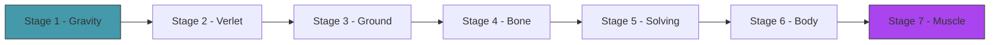
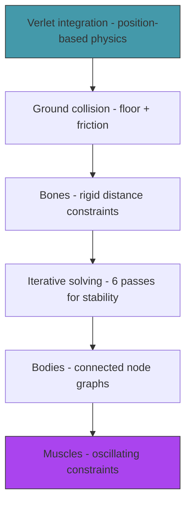

# Act 1 — The Primordial Soup

> *Before life can evolve, there must be a world with rules. Gravity pulls things down. The ground stops them. Bones hold shapes together. Muscles push and pull. In this act you build the physics that creatures will inhabit — simple, stable, and beautiful.*

By the end of Act 1, you can create a connected structure of nodes and bones, drop it, and watch it settle on the ground. Add a muscle and it twitches. This is the primordial soup — the environment where evolution will happen.



**Prerequisites:** Rust installed, a terminal, a text editor. Python experience is enough.

**Project location:** `~/juk/genesis/`

---

## Stage 1 — The Void

> *Difficulty: Very Easy — A point falling under gravity.*

*~25 min*

The simplest possible physics: a dot that falls. No collision, no constraints — just gravity pulling a point downward, frame by frame. This establishes the macroquad game loop and the basic physics update.

> [!tip] What You'll Learn
> - macroquad setup (same pattern as Piloto)
> - Representing a point with position and velocity
> - Gravity as constant downward acceleration
> - The game loop: update physics → draw → next frame

### 1.1 — Create the project

```bash
cd ~/juk
cargo new genesis --edition 2024
cd genesis
```

> [!warning] If you get `error: unknown edition '2024'`, your Rust toolchain is too old. Run `rustup update` to get Rust 1.85+ which supports the 2024 edition.

Add macroquad to `Cargo.toml`:

```toml
[dependencies]
macroquad = "0.4"
```

Run `cargo build` to download the dependency. This takes a minute the first time — macroquad compiles a lot of platform-specific code.

**Python comparison:** `cargo new` is like `mkdir myproject && cd myproject && python -m venv .venv`. `Cargo.toml` is like `requirements.txt`, but it also defines your project metadata.

### 1.2 — A falling point

```rust
use macroquad::prelude::*;

#[macroquad::main("Génesis")]
async fn main() {
    let mut pos = vec2(400.0, 100.0);
    let mut vel = vec2(0.0, 0.0);
    let gravity = vec2(0.0, 980.0); // pixels/s², downward

    loop {
        let dt = get_frame_time().min(0.02);

        // Physics: velocity += gravity * dt, position += velocity * dt
        vel += gravity * dt;
        pos += vel * dt;

        // Draw
        clear_background(Color::from_rgba(15, 15, 25, 255));
        draw_circle(pos.x, pos.y, 8.0, WHITE);
        draw_text("Génesis", 10.0, 30.0, 24.0, WHITE);

        next_frame().await;
    }
}
```

The point accelerates downward and falls off the screen. No floor yet — it just keeps going. This is Euler integration: `vel += accel * dt`, `pos += vel * dt`. Simple, but we'll replace it with something better next stage.

**Python comparison:** The `loop { ... next_frame().await }` pattern is like pygame's `while running: ... pygame.display.flip()`. The `async fn main` and `.await` are macroquad's way of yielding control to the renderer each frame — think of it as `await asyncio.sleep(0)` in Python.

> [!warning] Common Mistake — Gravity direction
> In macroquad, Y increases **downward** (0 is the top of the screen). Gravity should be positive Y (pushing down), not negative. If your point flies upward, you wrote `vec2(0.0, -980.0)` — flip the sign.

### 1.3 — Try it: change the starting conditions

Before moving on, experiment:

- Change the starting position to `vec2(200.0, 50.0)` — does it still fall the same way?
- Give the point an initial horizontal velocity: `let mut vel = vec2(100.0, 0.0);` — what trajectory do you see?
- Change gravity to `vec2(0.0, 200.0)` — how does the fall speed change?

These are the same equations from high school physics: `s = s₀ + v₀t + ½at²`. The code is just the discrete version.

> [!check] Checkpoint
> A white dot falls from the top of the screen and accelerates downward. You've experimented with different starting conditions. Stage 1 complete.

---

## Stage 2 — Verlet Integration

> *Difficulty: Easy — The one-line physics engine that makes everything else possible.*

*~50 min*

Euler integration tracks position and velocity separately. Verlet integration tracks position and *previous position* — velocity is implicit. This sounds like a minor difference, but it makes constraint solving (rigid bones, joints) dramatically easier and more stable.

> [!tip] What You'll Learn
> - Verlet integration: `new_pos = pos + (pos - old_pos) + accel * dt²`
> - Why no explicit velocity variable (it's encoded in the position difference)
> - Why Verlet is better than Euler for constrained systems
> - The `Point` struct
> - Creating a Rust module and connecting it with `mod`

### Why Verlet?

With Euler, if you want two points to stay exactly 50 pixels apart (a rigid bone), you need to adjust both positions *and* velocities when the constraint is violated. With Verlet, you only adjust positions — the velocity adjusts automatically on the next frame because it's derived from position history.

This is the key insight: **moving a point automatically changes its velocity.** No separate velocity correction needed.

**Python comparison:**

| Euler (what we had) | Verlet (what we're building) |
|---|---|
| `vel += accel * dt` | No velocity variable |
| `pos += vel * dt` | `new = pos + (pos - old) + accel * dt²` |
| Must fix velocity after constraints | Constraints just move points |
| Unstable with stiff constraints | Stable by design |

### Concept: The Rust Module System

This is the first time we're creating a separate file. Rust doesn't automatically find files in your `src/` directory — you have to explicitly declare them.

Create `src/physics.rs` — this is where all physics code will live. Then tell Rust about it by adding `mod physics;` to `main.rs`.

**How it works:**
- `mod physics;` in `main.rs` says "look for `src/physics.rs` and include it as a module"
- Items in `physics.rs` are private by default — add `pub` to anything `main.rs` needs to use
- `use crate::physics::Point;` imports `Point` from the module into `main.rs`

If you forget `mod physics;`, you'll get this error:

```
error[E0432]: unresolved import `crate::physics`
 --> src/main.rs:2:12
  |
2 | use crate::physics::Point;
  |            ^^^^^^^ could not find `physics` in the crate root
```

The fix: add `mod physics;` at the top of `main.rs`, *before* the `use` statement.

**Python comparison:** `mod physics;` is like having `physics.py` in the same directory — Python finds it automatically, but Rust requires the explicit declaration. `pub` is like Python's convention of using `_` prefix for private names, except Rust actually enforces it at compile time.

### 2.1 — The Point struct

Create `src/physics.rs`:

```rust
use macroquad::prelude::*;

pub struct Point {
    pub pos: Vec2,
    pub old_pos: Vec2,
    pub accel: Vec2,
    pub mass: f32,
    pub pinned: bool, // pinned points don't move (useful for anchors)
}

impl Point {
    pub fn new(x: f32, y: f32) -> Self {
        let pos = vec2(x, y);
        Point {
            pos,
            old_pos: pos, // no initial velocity (old_pos == pos)
            accel: vec2(0.0, 0.0),
            mass: 1.0,
            pinned: false,
        }
    }

    /// Verlet integration step.
    pub fn update(&mut self, dt: f32) {
        if self.pinned {
            return;
        }

        let velocity = self.pos - self.old_pos; // implicit velocity
        self.old_pos = self.pos;
        self.pos += velocity + self.accel * dt * dt;
        self.accel = vec2(0.0, 0.0); // reset acceleration (reapplied each frame)
    }

    /// Apply a force (like gravity).
    pub fn apply_force(&mut self, force: Vec2) {
        self.accel += force / self.mass;
    }
}
```

The entire physics update is one line: `self.pos += velocity + self.accel * dt * dt`. That's Verlet integration. The velocity is `self.pos - self.old_pos` — the difference between where the point is now and where it was last frame.

> [!note] `&mut self` — your first encounter with Rust borrowing
> `pub fn update(&mut self, dt: f32)` — the `&mut self` means "this method borrows the Point mutably." It can read *and* modify the Point's fields. If it were `&self`, the method could only read.
>
> Think of it like this: `&self` is "let me look at your notebook." `&mut self` is "let me write in your notebook." Rust enforces that only one person can write at a time — this prevents data races.
>
> **Python comparison:** In Python, every method gets `self` and can modify anything. Rust makes you declare your intent: read-only (`&self`) or read-write (`&mut self`).

### 2.2 — Try it yourself: implement `set_velocity`

The Point has no velocity field, but sometimes you need to give a point an initial push. Implement a method that sets the implicit velocity by adjusting `old_pos`:

```rust
/// Set the point's velocity by adjusting old_pos.
/// Hint: if velocity = pos - old_pos, then old_pos = pos - velocity.
pub fn set_velocity(&mut self, vel: Vec2) {
    // YOUR CODE HERE
}
```

Think about it: if `velocity = pos - old_pos`, how do you set `old_pos` so that the velocity equals `vel`?

<details>
<summary>Solution</summary>

```rust
pub fn set_velocity(&mut self, vel: Vec2) {
    self.old_pos = self.pos - vel;
}
```

One line. Since velocity is `pos - old_pos`, setting `old_pos = pos - vel` makes the velocity equal to `vel` on the next frame.

</details>

### 2.3 — Wire it up in main.rs

```rust
mod physics;
use physics::Point;

#[macroquad::main("Génesis")]
async fn main() {
    let gravity = vec2(0.0, 980.0);
    let mut point = Point::new(400.0, 100.0);

    loop {
        let dt = get_frame_time().min(0.02);

        point.apply_force(gravity);
        point.update(dt);

        clear_background(Color::from_rgba(15, 15, 25, 255));
        draw_circle(point.pos.x, point.pos.y, 8.0, WHITE);

        next_frame().await;
    }
}
```

Same result as Stage 1 — a falling point. But now the physics are Verlet-based, ready for constraints.

> [!warning] Common Mistake — Forgetting `mut`
> If you write `let point = Point::new(400.0, 100.0);` without `mut`, then call `point.apply_force(gravity)`, you'll get:
>
> ```
> error[E0596]: cannot borrow `point` as mutable, as it is not declared as mutable
>  --> src/main.rs:8:9
>   |
> 8 |         point.apply_force(gravity);
>   |         ^^^^^ cannot borrow as mutable
>   |
> help: consider changing this to be mutable
>   |
> 5 |     let mut point = Point::new(400.0, 100.0);
>   |         +++
> ```
>
> `apply_force` takes `&mut self`, so the variable holding the Point must be declared `mut`. The compiler even tells you the fix.

### 2.4 — Extend it

Give the point an initial rightward velocity using your `set_velocity` method. It should arc like a thrown ball — moving right while falling. Verify the trajectory looks parabolic.

> [!check] Checkpoint
> Replace Euler with Verlet. Verify the point still falls identically. Verify there's no velocity field — only `pos` and `old_pos`. You've implemented `set_velocity` and tested it. Stage 2 complete.

---

## Stage 3 — The Ground

> *Difficulty: Easy — Floor collision so creatures have something to push against.*

*~40 min*

Without a floor, everything falls into the void. Creatures need ground to push against — that's how locomotion works. This stage adds a simple floor: if a point goes below the ground line, push it back up and apply friction.

> [!tip] What You'll Learn
> - Collision response in Verlet physics (just move the point)
> - Friction as damping of horizontal velocity
> - Why Verlet makes collision trivial (no velocity to correct)
> - Constants in Rust (`const`)

### Why Verlet makes collision easy

In Euler physics, collision response is messy: you have to fix the position *and* the velocity, and they can get out of sync. In Verlet, collision response is just **moving the point**. Because velocity is derived from position, moving the point automatically changes its velocity. One thing to fix instead of two.

**Python comparison:** In Python you'd write `pos.y = ground_y; vel.y *= -bounce`. In Verlet, there's no `vel` to fix — you adjust `old_pos` to encode the new velocity implicitly.

### 3.1 — Ground collision

Add to `physics.rs`:

```rust
pub const GROUND_Y: f32 = 500.0;
const FRICTION: f32 = 0.95;
const BOUNCE: f32 = 0.3;

impl Point {
    /// Constrain the point to stay above the ground.
    pub fn apply_ground(&mut self) {
        if self.pos.y > GROUND_Y {
            // Push back above ground
            self.pos.y = GROUND_Y;

            // Dampen vertical velocity (bounce)
            let vel_y = self.pos.y - self.old_pos.y;
            self.old_pos.y = self.pos.y + vel_y * BOUNCE;

            // Apply friction to horizontal movement
            let vel_x = self.pos.x - self.old_pos.x;
            self.old_pos.x = self.pos.x - vel_x * FRICTION;
        }
    }
}
```

In Verlet, collision response is just moving the point. Because velocity is derived from position, moving the point *automatically* changes its velocity. No separate velocity correction. This is why Verlet is elegant.

Friction works the same way: reduce the horizontal position difference (which *is* the horizontal velocity).

> [!note] `const` vs `let`
> `const GROUND_Y: f32 = 500.0;` defines a compile-time constant. Unlike `let`, constants must have a type annotation and can be defined outside functions. They're inlined everywhere they're used — no runtime cost.
>
> **Python comparison:** `GROUND_Y = 500.0` at module level. Python doesn't enforce immutability — it's just a naming convention. Rust's `const` is truly immutable and evaluated at compile time.

### 3.2 — Try it yourself: draw the ground and test

You know how to draw a line (from Stage 1's `draw_circle` pattern). Add these to your game loop:

1. Call `point.apply_ground()` after `point.update(dt)`
2. Draw a horizontal line at `GROUND_Y` across the screen width

Hint: `draw_line(x1, y1, x2, y2, thickness, color)`.

<details>
<summary>Solution</summary>

```rust
// In the game loop, after update:
point.apply_ground();

// Draw ground
draw_line(0.0, GROUND_Y, screen_width(), GROUND_Y, 2.0,
    Color::from_rgba(60, 60, 80, 255));
```

You need to import `GROUND_Y` in `main.rs`: `use physics::{Point, GROUND_Y};`

</details>

```bash
cargo run
```

The point falls, hits the ground, bounces a little, and settles. Drop it from different heights — higher drops bounce more. The physics feel right with zero tuning.

> [!warning] Common Mistake — Constraint order
> **Applying ground constraint before the Verlet update.** The order matters: update positions first, *then* apply constraints. If you constrain before updating, the point can jitter because the update immediately pushes it back through the ground.
>
> Correct order: `apply_force` → `update` → `apply_ground`

### 3.3 — Extend it

Change `BOUNCE` to `0.9` and watch the point bounce like a rubber ball. Change it to `0.0` and watch it stick to the ground like mud. Change `FRICTION` to `0.5` and give the point a horizontal velocity — it should stop almost immediately on contact.

> [!check] Checkpoint
> Drop a point. Verify it bounces on the ground and settles. Verify friction slows horizontal sliding. You've experimented with bounce and friction values. Stage 3 complete.

---

## Stage 4 — The Bone

> *Difficulty: Medium — Distance constraints between two points.*

*~60 min*

A bone is a rigid connection between two points — it keeps them at a fixed distance. If the points drift apart (gravity pulls one down), the constraint pulls them back together. If they get too close (collision pushes one), the constraint pushes them apart. This is the building block of all creature bodies.

> [!tip] What You'll Learn
> - Distance constraints — the core of Verlet physics
> - The constraint solving formula
> - Why constraints are "soft" (they approximate, not enforce exactly)
> - Why bones use index-based references (the borrow checker)
> - Drawing bones as lines

### The constraint formula

Two points should be distance `d` apart. They're currently distance `current_d` apart. The correction:

```
delta = (current_d - d) / current_d * 0.5
point_a.pos += direction * delta
point_b.pos -= direction * delta
```

Each point moves halfway toward the correct distance. The `0.5` splits the correction equally. If one point is pinned, the other moves the full amount.

### Concept: Why Indices Instead of References

You might expect `Bone` to hold references to two `Point`s — like Python where you'd just store `self.point_a = point_a`. In Rust, this doesn't work because of the **borrow checker**.

The problem: if `Bone` holds `&mut Point` references into a `Vec<Point>`, you can't have two bones that share a point — that would be two mutable references to the same data, which Rust forbids (it prevents data races and use-after-free bugs).

The solution: bones store **indices** (`usize`) into the points array. When solving, the bone borrows the whole array temporarily. This is a common Rust pattern for graph-like structures.

```rust
// What you'd write in Python:
class Bone:
    def __init__(self, point_a, point_b):  # stores references
        self.a = point_a
        self.b = point_b

// What Rust requires:
struct Bone {
    a: usize,  // index into points array
    b: usize,
}
```

If you tried to store references, you'd get:

```
error[E0499]: cannot borrow `points` as mutable more than once at a time
```

This is the borrow checker protecting you from a real bug: if two bones could mutably reference the same point simultaneously, their corrections could conflict and corrupt the physics state. Indices make the borrowing explicit and safe.

### 4.1 — The Bone struct

Add to `physics.rs`:

```rust
pub struct Bone {
    pub a: usize, // index into points array
    pub b: usize,
    pub length: f32, // rest length
}

impl Bone {
    pub fn new(a: usize, b: usize, length: f32) -> Self {
        Bone { a, b, length }
    }

    /// Solve the distance constraint between two points.
    pub fn solve(&self, points: &mut [Point]) {
        let diff = points[self.b].pos - points[self.a].pos;
        let current_length = diff.length();

        if current_length < 0.001 {
            return; // avoid division by zero
        }

        let correction = (current_length - self.length) / current_length;
        let offset = diff * correction * 0.5;

        if !points[self.a].pinned {
            points[self.a].pos += offset;
        }
        if !points[self.b].pinned {
            points[self.b].pos -= offset;
        }
    }

    /// Draw the bone.
    pub fn draw(&self, points: &[Point], color: Color) {
        draw_line(
            points[self.a].pos.x, points[self.a].pos.y,
            points[self.b].pos.x, points[self.b].pos.y,
            3.0, color,
        );
    }
}
```

> [!note] `&mut [Point]` vs `&mut Vec<Point>`
> `solve` takes `&mut [Point]` (a mutable slice) rather than `&mut Vec<Point>`. A slice is a view into contiguous memory — it works with `Vec`, arrays, or any contiguous collection. Prefer slices in function signatures; they're more flexible.
>
> **Python comparison:** This is like accepting any sequence (`Sequence[Point]`) instead of specifically `list[Point]`.

### 4.2 — Try it yourself: wire up two connected points

Create two points and a bone connecting them. Set up the game loop to:

1. Apply gravity to both points
2. Update both points
3. Solve the bone constraint
4. Apply ground to both points
5. Draw the bone and both points

The bone length should be 80 pixels. Place the first point at (400, 200) and the second at (400, 280).

<details>
<summary>Solution</summary>

```rust
mod physics;
use physics::{Point, Bone, GROUND_Y};

#[macroquad::main("Génesis")]
async fn main() {
    let gravity = vec2(0.0, 980.0);
    let mut points = vec![
        Point::new(400.0, 200.0),
        Point::new(400.0, 280.0),
    ];
    let bones = vec![Bone::new(0, 1, 80.0)];

    loop {
        let dt = get_frame_time().min(0.02);

        for p in &mut points { p.apply_force(gravity); p.update(dt); }
        for b in &bones { b.solve(&mut points); }
        for p in &mut points { p.apply_ground(); }

        clear_background(Color::from_rgba(15, 15, 25, 255));
        draw_line(0.0, GROUND_Y, screen_width(), GROUND_Y, 2.0,
            Color::from_rgba(60, 60, 80, 255));
        for b in &bones { b.draw(&points, WHITE); }
        for p in &points { draw_circle(p.pos.x, p.pos.y, 6.0, YELLOW); }

        next_frame().await;
    }
}
```

</details>

Two connected points fall together, maintaining their distance. They hit the ground and the bone keeps them 80 pixels apart — one rests on the ground, the other hangs above (or they settle side by side).

> [!warning] Common Mistake — `for p in points` consumes the Vec
> If you write `for p in points { ... }` instead of `for p in &mut points { ... }`, Rust **moves** each point out of the Vec, consuming it. You can't use `points` afterward:
>
> ```
> error[E0382]: borrow of moved value: `points`
>  --> src/main.rs:15:18
>   |
> 12|         for p in points {
>   |                  ------ `points` moved due to this implicit call to `.into_iter()`
> ...
> 15|         for b in &bones { b.solve(&mut points); }
>   |                                        ^^^^^^ value borrowed here after move
> ```
>
> The fix: `for p in &mut points` borrows each element mutably without consuming the Vec. `for p in &points` borrows immutably (read-only).

### 4.3 — Extend it

Pin the first point (`points[0].pinned = true;`) and watch the second point swing like a pendulum. The bone keeps them connected while gravity pulls the free point down.

> [!check] Checkpoint
> Two points connected by a bone fall and maintain their distance. The bone is visible as a line. You've tested pinning. Stage 4 complete.

---

## Stage 5 — Constraint Solving

> *Difficulty: Medium — Iterative relaxation for stable physics.*

*~50 min*

One pass of constraint solving is approximate — each bone's correction can violate other bones' constraints. The fix: solve all constraints multiple times per frame. Each pass gets closer to the correct solution. 4-8 iterations is usually enough for stable, realistic behavior.

> [!tip] What You'll Learn
> - Why one pass isn't enough (constraints interfere with each other)
> - Iterative relaxation — solve repeatedly until stable
> - How iteration count affects stiffness (more iterations = stiffer bones)
> - The physics step: update → solve × N → ground
> - Extracting a `Simulation` struct

### Why iterate?

Imagine three points in a line: A—B—C. Bone AB pulls B left. Then bone BC pulls B right. After one pass, B is in a compromise position that satisfies neither constraint perfectly. A second pass improves it. A third pass gets closer. After 6 passes, both constraints are nearly satisfied.

This is called **relaxation** — the same technique used in cloth simulation, bridge engineering software, and finite element analysis. More iterations = more accurate = stiffer.

### 5.1 — The Simulation struct

Create `src/simulation.rs`:

```rust
use crate::physics::{Point, Bone, GROUND_Y};
use macroquad::prelude::*;

const CONSTRAINT_ITERATIONS: usize = 6;

pub struct Simulation {
    pub points: Vec<Point>,
    pub bones: Vec<Bone>,
}

impl Simulation {
    pub fn new() -> Self {
        Simulation { points: Vec::new(), bones: Vec::new() }
    }

    /// Run one physics step.
    pub fn step(&mut self, dt: f32, gravity: Vec2) {
        // 1. Apply forces
        for point in &mut self.points {
            point.apply_force(gravity);
        }

        // 2. Verlet update
        for point in &mut self.points {
            point.update(dt);
        }

        // 3. Solve constraints iteratively
        for _ in 0..CONSTRAINT_ITERATIONS {
            for bone in &self.bones {
                bone.solve(&mut self.points);
            }
        }

        // 4. Ground collision (after constraints, so ground wins)
        for point in &mut self.points {
            point.apply_ground();
        }
    }

    /// Draw everything.
    pub fn draw(&self) {
        // Ground
        draw_line(0.0, GROUND_Y, screen_width(), GROUND_Y, 2.0,
            Color::from_rgba(60, 60, 80, 255));

        // Bones
        for bone in &self.bones {
            bone.draw(&self.points, Color::from_rgba(180, 180, 200, 255));
        }

        // Points
        for point in &self.points {
            draw_circle(point.pos.x, point.pos.y, 5.0, YELLOW);
        }
    }
}
```

Don't forget to add `mod simulation;` to `main.rs` (alongside `mod physics;`).

The order matters: forces → update → constraints → ground. Constraints are solved 6 times per frame. More iterations = stiffer bones. Fewer = rubbery.

### 5.2 — Try it yourself: build a chain

Create a chain of 5 points, each 30 pixels apart vertically. Pin the first point (it's the anchor). Connect them with 4 bones.

Hint: use a loop to create points at `(400, 200 + i * 30)` and bones connecting `(i, i+1)`.

<details>
<summary>Solution</summary>

```rust
mod physics;
mod simulation;
use simulation::Simulation;
use physics::Point;

#[macroquad::main("Génesis")]
async fn main() {
    let gravity = vec2(0.0, 980.0);
    let mut sim = Simulation::new();

    // Create a chain of 5 points
    for i in 0..5 {
        sim.points.push(Point::new(400.0 + i as f32 * 30.0, 200.0));
    }
    // Pin the first point (anchor)
    sim.points[0].pinned = true;

    // Connect them with bones
    for i in 0..4 {
        sim.bones.push(Bone::new(i, i + 1, 30.0));
    }

    loop {
        let dt = get_frame_time().min(0.02);
        sim.step(dt, gravity);

        clear_background(Color::from_rgba(15, 15, 25, 255));
        sim.draw();

        next_frame().await;
    }
}
```

</details>

A chain hangs from a pinned point, swinging like a pendulum. The bones maintain their length even as gravity pulls the chain into an arc.

### 5.3 — Experiment: iteration count

Try changing `CONSTRAINT_ITERATIONS`:

- **1 iteration:** the chain is rubbery — bones stretch visibly
- **6 iterations:** stiff and stable (our default)
- **20 iterations:** rigid — bones barely flex at all
- **0 iterations:** no constraints — points fall independently, ignoring bones entirely

This is the core tradeoff: more iterations = more accurate physics, but more CPU time per frame. 6 is the sweet spot for real-time creature simulation.

> [!check] Checkpoint
> Create a 5-point chain pinned at one end. Verify it swings like a pendulum. Adjust `CONSTRAINT_ITERATIONS` and observe the stiffness change. Stage 5 complete.

---

## Stage 6 — The Body

> *Difficulty: Medium — Multiple nodes and bones forming a connected structure.*

*~60 min*

A creature isn't a chain — it's a more complex graph of connected segments. This stage builds a simple body: a central node connected to limb-like extensions. Drop it and watch it settle into a stable shape on the ground.

> [!tip] What You'll Learn
> - Building complex structures from points and bones
> - Why triangulation adds rigidity (triangles can't deform, rectangles can)
> - Designing body shapes that are physically stable
> - The difference between a chain (floppy) and a truss (rigid)

### Why triangles?

A rectangle made of 4 points and 4 bones can collapse into a parallelogram — the angles change even though the bone lengths don't. A triangle made of 3 points and 3 bones **cannot deform** without changing a bone length. This is why bridges, cranes, and creature skeletons use triangular structures.

### 6.1 — Try it yourself: build a creature body

Create a function `create_test_body` that builds a 5-node body. Add it to `simulation.rs` — it uses `Simulation`, `Point`, and `Bone`, which are all accessible there.

- **Nodes 0, 1, 2:** a core triangle (center, left, right)
- **Nodes 3, 4:** legs hanging below the left and right core nodes
- **Bones:** 3 for the core triangle + 2 for the legs + 2 cross-braces from center to each leg

The function should take `sim: &mut Simulation` and a spawn position `(x, y)`.

Think about what makes the structure rigid: the core triangle can't deform, and the cross-braces prevent the legs from folding inward.

<details>
<summary>Solution</summary>

```rust
/// Create a simple quadruped-like body.
pub fn create_test_body(sim: &mut Simulation, x: f32, y: f32) {
    let base = sim.points.len();

    // Core: a triangle (rigid)
    sim.points.push(Point::new(x, y));           // 0: center
    sim.points.push(Point::new(x - 30.0, y));    // 1: left
    sim.points.push(Point::new(x + 30.0, y));    // 2: right

    // Legs
    sim.points.push(Point::new(x - 40.0, y + 40.0)); // 3: left leg
    sim.points.push(Point::new(x + 40.0, y + 40.0)); // 4: right leg

    // Core bones (triangle = rigid)
    sim.bones.push(Bone::new(base, base + 1, 30.0));
    sim.bones.push(Bone::new(base, base + 2, 30.0));
    sim.bones.push(Bone::new(base + 1, base + 2, 60.0));

    // Leg bones
    sim.bones.push(Bone::new(base + 1, base + 3, 40.0));
    sim.bones.push(Bone::new(base + 2, base + 4, 40.0));

    // Cross braces (prevent legs from folding inward)
    sim.bones.push(Bone::new(base, base + 3, 50.0));
    sim.bones.push(Bone::new(base, base + 4, 50.0));
}
```

</details>

> [!note] `let base = sim.points.len();`
> This captures the current number of points before we add new ones. All bone indices are relative to `base`, so `create_test_body` works even if the simulation already has other points. This pattern is essential when we spawn multiple creatures later.

### 6.2 — Test it

```rust
let mut sim = Simulation::new();
create_test_body(&mut sim, 400.0, 200.0);

// Game loop: sim.step(dt, gravity); sim.draw();
```

The body falls, hits the ground, and settles. The triangle core stays rigid. The legs splay out. It looks like a dead spider — which is exactly right. It has no muscles yet.

### 6.3 — Extend it

Try removing the cross-brace bones (the last two `sim.bones.push` calls). Drop the body again. Without cross-braces, the legs fold inward and the body collapses. Add them back and verify the structure is stable again.

Then try building a different body shape: a hexagon, or a body with 3 legs instead of 2. What shapes are stable? What shapes collapse?

> [!check] Checkpoint
> Drop a multi-node body. Verify the triangle core stays rigid. Verify legs settle on the ground. You've experimented with removing cross-braces. Stage 6 complete.

---

## Stage 7 — The Muscle

> *Difficulty: Medium — A bone that breathes.*

*~60 min*

A muscle is a bone whose rest length oscillates over time: it expands and contracts on a sine wave. This is the simplest possible actuator — no neural network, no control logic, just rhythmic contraction. When a creature has multiple muscles with different frequencies and phases, complex movement patterns emerge from the interaction.

> [!tip] What You'll Learn
> - Muscles as oscillating distance constraints
> - Sine waves for rhythmic motion: `length = rest + amplitude * sin(frequency * time + phase)`
> - How frequency, amplitude, and phase create different gaits
> - Why this is enough for locomotion (no brain needed)
> - Adding `#[test]` to verify physics math

### Why sine waves?

Real muscles are controlled by neural signals. But the simplest organisms (worms, jellyfish) use **central pattern generators** — neural circuits that produce rhythmic output without sensory input. A sine wave is the mathematical equivalent: a repeating pattern that drives motion.

The magic happens when multiple muscles oscillate at different rates. Two legs with the same frequency but opposite phase (one extends while the other contracts) produce a walking gait. Change the phase relationship and you get hopping, crawling, or galloping.

**Python comparison:** `math.sin(freq * time * 2 * math.pi + phase)` — identical math, just different syntax. Rust uses `f32::sin()` as a method and `std::f32::consts::TAU` for 2π.

### 7.1 — The Muscle struct

Add to `physics.rs`:

```rust
pub struct Muscle {
    pub a: usize,
    pub b: usize,
    pub rest_length: f32,
    pub amplitude: f32,   // how much it expands/contracts (pixels)
    pub frequency: f32,   // oscillations per second
    pub phase: f32,       // offset in radians (0 to 2π)
}

impl Muscle {
    pub fn new(
        a: usize, b: usize, rest_length: f32,
        amplitude: f32, frequency: f32, phase: f32,
    ) -> Self {
        Muscle { a, b, rest_length, amplitude, frequency, phase }
    }

    /// Current target length based on time.
    pub fn current_length(&self, time: f32) -> f32 {
        self.rest_length
            + self.amplitude
                * (self.frequency * time * std::f32::consts::TAU + self.phase).sin()
    }

    /// Solve the muscle constraint (same as bone, but with oscillating length).
    pub fn solve(&self, points: &mut [Point], time: f32) {
        let target = self.current_length(time);
        let diff = points[self.b].pos - points[self.a].pos;
        let current = diff.length();

        if current < 0.001 {
            return;
        }

        let correction = (current - target) / current;
        let offset = diff * correction * 0.5;

        if !points[self.a].pinned {
            points[self.a].pos += offset;
        }
        if !points[self.b].pinned {
            points[self.b].pos -= offset;
        }
    }

    /// Draw the muscle, colored by contraction state.
    pub fn draw(&self, points: &[Point], time: f32) {
        let target = self.current_length(time);
        let contraction = (target - self.rest_length) / self.amplitude.max(0.01);

        // Red when contracted, blue when extended
        let r = ((1.0 - contraction) * 0.5 * 255.0).clamp(0.0, 255.0) as u8;
        let b = ((1.0 + contraction) * 0.5 * 255.0).clamp(0.0, 255.0) as u8;
        let color = Color::from_rgba(r + 80, 60, b + 80, 255);

        draw_line(
            points[self.a].pos.x, points[self.a].pos.y,
            points[self.b].pos.x, points[self.b].pos.y,
            4.0, color,
        );
    }
}
```

The muscle is identical to a bone except its target length changes over time. The `solve` method is the same constraint solver — just with a moving target.

The color visualization is key: red = contracted (short), blue = extended (long). You can see the muscle "breathing."

### Concept: Your First Rust Test

Before wiring the muscle into the simulation, let's verify the math works. Rust has built-in testing — no external framework needed.

Add this to the bottom of `physics.rs`:

```rust
#[cfg(test)]
mod tests {
    use super::*;

    #[test]
    fn muscle_oscillates_around_rest_length() {
        let muscle = Muscle::new(0, 1, 50.0, 10.0, 1.0, 0.0);

        // At time 0, sin(0) = 0 → target = rest_length
        let len_at_0 = muscle.current_length(0.0);
        assert!((len_at_0 - 50.0).abs() < 0.01, "at t=0, length should be rest_length");

        // At time 0.25 (quarter period), sin(π/2) = 1 → target = rest + amplitude
        let len_at_quarter = muscle.current_length(0.25);
        assert!((len_at_quarter - 60.0).abs() < 0.01, "at t=0.25, length should be rest + amp");

        // At time 0.75, sin(3π/2) = -1 → target = rest - amplitude
        let len_at_three_quarter = muscle.current_length(0.75);
        assert!((len_at_three_quarter - 40.0).abs() < 0.01, "at t=0.75, length should be rest - amp");
    }
}
```

Run it:

```bash
cargo test
```

```
running 1 test
test physics::tests::muscle_oscillates_around_rest_length ... ok
```

`#[cfg(test)]` means this module only compiles during testing — it's stripped from release builds. `#[test]` marks a function as a test case. `assert!` panics (fails the test) if the condition is false.

**Python comparison:** `#[test]` is like `def test_something(self):` in `unittest`. `cargo test` is like `pytest`. The `#[cfg(test)]` wrapper is like putting tests in a `tests/` directory — they don't ship with your library.

From this point forward, we'll add tests for any pure function we write. Tests are checkpoints: if they pass, your implementation is correct.

### 7.2 — Try it yourself: write a test for phase offset

Write a test that verifies a muscle with `phase = PI` (π radians) is exactly opposite to one with `phase = 0`. At time 0, the phase-0 muscle should be at rest length, and the phase-π muscle should also be at rest length (sin(π) = 0). But at time 0.25, they should be at opposite extremes.

<details>
<summary>Solution</summary>

```rust
#[test]
fn opposite_phase_muscles_are_mirrored() {
    let m0 = Muscle::new(0, 1, 50.0, 10.0, 1.0, 0.0);
    let m_pi = Muscle::new(0, 1, 50.0, 10.0, 1.0, std::f32::consts::PI);

    // At t=0.25: m0 is at max (60), m_pi should be at min (40)
    let len_0 = m0.current_length(0.25);
    let len_pi = m_pi.current_length(0.25);

    assert!((len_0 - 60.0).abs() < 0.5, "phase-0 should be extended");
    assert!((len_pi - 40.0).abs() < 0.5, "phase-pi should be contracted");
}
```

</details>

### 7.3 — Add muscles to the simulation

Update `Simulation` in `simulation.rs`:

```rust
use crate::physics::{Point, Bone, Muscle, GROUND_Y};

pub struct Simulation {
    pub points: Vec<Point>,
    pub bones: Vec<Bone>,
    pub muscles: Vec<Muscle>,
    pub time: f32,
}

impl Simulation {
    pub fn new() -> Self {
        Simulation {
            points: Vec::new(),
            bones: Vec::new(),
            muscles: Vec::new(),
            time: 0.0,
        }
    }

    pub fn step(&mut self, dt: f32, gravity: Vec2) {
        self.time += dt;

        for point in &mut self.points { point.apply_force(gravity); }
        for point in &mut self.points { point.update(dt); }

        for _ in 0..CONSTRAINT_ITERATIONS {
            for bone in &self.bones { bone.solve(&mut self.points); }
            for muscle in &self.muscles { muscle.solve(&mut self.points, self.time); }
        }

        for point in &mut self.points { point.apply_ground(); }
    }

    pub fn draw(&self) {
        draw_line(0.0, GROUND_Y, screen_width(), GROUND_Y, 2.0,
            Color::from_rgba(60, 60, 80, 255));

        for bone in &self.bones {
            bone.draw(&self.points, Color::from_rgba(120, 120, 140, 255));
        }
        for muscle in &self.muscles {
            muscle.draw(&self.points, self.time);
        }
        for point in &self.points {
            draw_circle(point.pos.x, point.pos.y, 5.0, YELLOW);
        }
    }
}
```

### 7.4 — Test with a muscled body

Replace the leg bones from Stage 6 with muscles:

```rust
// Instead of leg bones, use muscles with opposite phase:
// Left leg extends while right contracts, and vice versa
sim.muscles.push(Muscle::new(base + 1, base + 3, 40.0, 15.0, 2.0, 0.0));
sim.muscles.push(Muscle::new(base + 2, base + 4, 40.0, 15.0, 2.0, std::f32::consts::PI));
```

The two leg muscles have the same frequency (2 Hz) but opposite phase (0 vs π). When the left leg extends, the right contracts, and vice versa.

```bash
cargo run
```

The body falls to the ground and starts twitching. The legs alternate — one pushes while the other pulls. Depending on the body shape and muscle parameters, it might:
- Scoot sideways
- Rock back and forth without moving
- Flip over and flail
- Actually crawl a little

Most random configurations produce useless motion. That's the point — evolution will find the configurations that produce useful motion.

> [!note] This is the primordial soup
> Random bodies with random muscles producing random motion. Most of it is useless. But somewhere in the space of all possible body shapes and muscle parameters, there are configurations that walk, crawl, and hop. The genetic algorithm's job is to find them.

### 7.5 — Extend it

Change the muscle parameters and observe the effect:
- Set both muscles to the **same phase** (both 0.0) — the creature should bounce up and down instead of walking
- Double the **frequency** to 4.0 — faster twitching
- Halve the **amplitude** to 7.0 — subtler movement
- Set one muscle's frequency to 2.0 and the other to 3.0 — an asymmetric gait

> [!check] Checkpoint
> A body with two muscles twitches on the ground. Muscles change color as they contract and extend. The body moves (even if poorly). Tests pass with `cargo test`. Stage 7 complete.

---

## Act 1 Complete — The Primordial Soup



You built a physics engine from scratch:

| Component | Lines | What it does |
|-----------|-------|-------------|
| `Point` | ~35 | Verlet integration, gravity, ground collision |
| `Bone` | ~25 | Rigid distance constraint |
| `Muscle` | ~40 | Oscillating distance constraint with visualization |
| `Simulation` | ~45 | Physics step: update → solve × 6 → ground |

| Rust Concept | Where You Used It |
|-------------|-------------------|
| Structs | `Point`, `Bone`, `Muscle`, `Simulation` |
| `pub` and modules | `mod physics;`, `pub struct`, `pub fn` |
| `&mut self` | Methods that modify struct fields |
| `&mut [Point]` | Bone/muscle constraint solving |
| Index-based references | Bones/muscles reference points by `usize` index |
| `Vec2` math | Position, direction, constraint solving |
| `const` | `GROUND_Y`, `FRICTION`, `BOUNCE`, `CONSTRAINT_ITERATIONS` |
| `#[test]` | Verifying muscle oscillation math |
| Trigonometry | `sin` for muscle oscillation |
| Iterative algorithms | Constraint solving loop |

**The physics are done.** Points fall, bones hold shapes, muscles twitch. In Act 2, you'll define what a creature *is* — a genome that encodes body shape and muscle parameters — and spawn a population of random creatures to see what shapes emerge.
