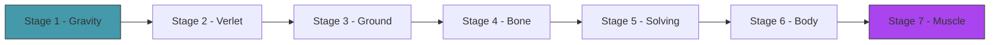
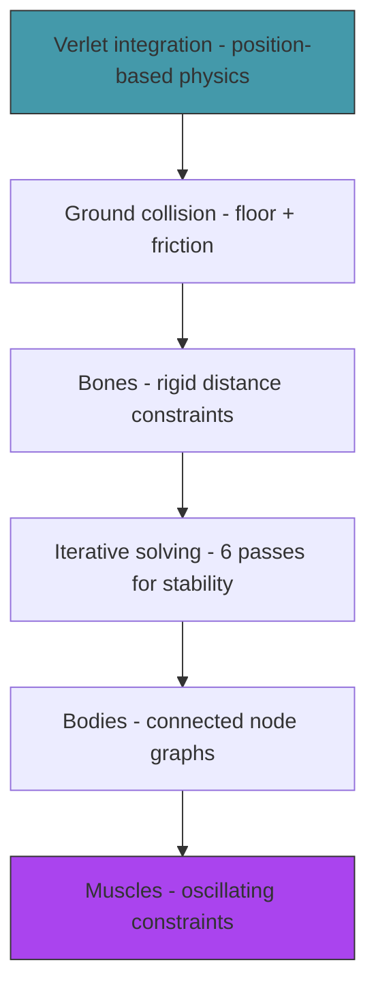

# Act 1 — The Primordial Soup

> *Before life can evolve, there must be a world with rules. Gravity pulls things down. The ground stops them. Bones hold shapes together. Muscles push and pull. In this act you build the physics that creatures will inhabit — simple, stable, and beautiful.*

By the end of Act 1, you can create a connected structure of nodes and bones, drop it, and watch it settle on the ground. Add a muscle and it twitches. This is the primordial soup — the environment where evolution will happen.



**Prerequisites:** Rust installed, a terminal, a text editor. Python experience is enough.

**Project location:** `~/juk/genesis/`

---

## Stage 1 — The Void

> *Difficulty: Very Easy — A point falling under gravity.*

The simplest possible physics: a dot that falls. No collision, no constraints — just gravity pulling a point downward, frame by frame. This establishes the macroquad game loop and the basic physics update.

> [!tip] What You'll Learn
> - macroquad setup (same pattern as Piloto)
> - Representing a point with position and velocity
> - Gravity as constant downward acceleration
> - The game loop: update physics → draw → next frame

### 1.1 — Create the project

```bash
cd ~/juk
cargo new genesis --edition 2024
cd genesis
```

```toml
[dependencies]
macroquad = "0.4"
```

### 1.2 — A falling point

```rust
use macroquad::prelude::*;

#[macroquad::main("Génesis")]
async fn main() {
    let mut pos = vec2(400.0, 100.0);
    let mut vel = vec2(0.0, 0.0);
    let gravity = vec2(0.0, 980.0); // pixels/s², downward

    loop {
        let dt = get_frame_time().min(0.02);

        // Physics: velocity += gravity * dt, position += velocity * dt
        vel += gravity * dt;
        pos += vel * dt;

        // Draw
        clear_background(Color::from_rgba(15, 15, 25, 255));
        draw_circle(pos.x, pos.y, 8.0, WHITE);
        draw_text("Génesis", 10.0, 30.0, 24.0, WHITE);

        next_frame().await;
    }
}
```

The point accelerates downward and falls off the screen. No floor yet — it just keeps going. This is Euler integration: `vel += accel * dt`, `pos += vel * dt`. Simple, but we'll replace it with something better next stage.

> [!warning] Common Mistake
> **Gravity direction.** In macroquad, Y increases downward. Gravity should be positive Y (pushing down), not negative. If your point flies upward, flip the sign.

A point falls. But it falls forever — there's no ground. And Euler integration will cause problems with constraints later. Next stage, we switch to Verlet integration.

> [!check] Checkpoint
> A white dot falls from the top of the screen and accelerates downward. Stage 1 complete.

---

## Stage 2 — Verlet Integration

> *Difficulty: Easy — The one-line physics engine that makes everything else possible.*

Euler integration tracks position and velocity separately. Verlet integration tracks position and *previous position* — velocity is implicit. This sounds like a minor difference, but it makes constraint solving (rigid bones, joints) dramatically easier and more stable.

> [!tip] What You'll Learn
> - Verlet integration: `new_pos = pos + (pos - old_pos) + accel * dt²`
> - Why no explicit velocity variable (it's encoded in the position difference)
> - Why Verlet is better than Euler for constrained systems
> - The `Point` struct

### Why Verlet?

With Euler, if you want two points to stay exactly 50 pixels apart (a rigid bone), you need to adjust both positions *and* velocities when the constraint is violated. With Verlet, you only adjust positions — the velocity adjusts automatically on the next frame because it's derived from position history.

This is the key insight: **moving a point automatically changes its velocity.** No separate velocity correction needed.

### 2.1 — The Point struct

Create `src/physics.rs`:

```rust
use macroquad::prelude::*;

pub struct Point {
    pub pos: Vec2,
    pub old_pos: Vec2,
    pub accel: Vec2,
    pub mass: f32,
    pub pinned: bool, // pinned points don't move (useful for anchors)
}

impl Point {
    pub fn new(x: f32, y: f32) -> Self {
        let pos = vec2(x, y);
        Point {
            pos,
            old_pos: pos, // no initial velocity (old_pos == pos)
            accel: vec2(0.0, 0.0),
            mass: 1.0,
            pinned: false,
        }
    }

    /// Verlet integration step.
    pub fn update(&mut self, dt: f32) {
        if self.pinned {
            return;
        }

        let velocity = self.pos - self.old_pos; // implicit velocity
        self.old_pos = self.pos;
        self.pos += velocity + self.accel * dt * dt;
        self.accel = vec2(0.0, 0.0); // reset acceleration (reapplied each frame)
    }

    /// Apply a force (like gravity).
    pub fn apply_force(&mut self, force: Vec2) {
        self.accel += force / self.mass;
    }
}
```

The entire physics update is one line: `self.pos += velocity + self.accel * dt * dt`. That's Verlet integration. The velocity is `self.pos - self.old_pos` — the difference between where the point is now and where it was last frame.

**Python comparison:**
```python
velocity = pos - old_pos
old_pos = pos
pos = pos + velocity + accel * dt * dt
```

Three lines. That's the whole physics engine.

### 2.2 — Test it

```rust
mod physics;
use physics::Point;

#[macroquad::main("Génesis")]
async fn main() {
    let gravity = vec2(0.0, 980.0);
    let mut point = Point::new(400.0, 100.0);

    loop {
        let dt = get_frame_time().min(0.02);

        point.apply_force(gravity);
        point.update(dt);

        clear_background(Color::from_rgba(15, 15, 25, 255));
        draw_circle(point.pos.x, point.pos.y, 8.0, WHITE);

        next_frame().await;
    }
}
```

Same result as Stage 1 — a falling point. But now the physics are Verlet-based, ready for constraints.

> [!note] No velocity variable
> Notice there's no `vel` field on `Point`. Velocity is implicit: `pos - old_pos`. If you want to give a point an initial velocity, set `old_pos` to `pos - initial_velocity * dt`. To stop a point, set `old_pos = pos`.

The point still falls forever. Next stage, we add the ground.

> [!check] Checkpoint
> Replace Euler with Verlet. Verify the point still falls identically. Verify there's no velocity field — only `pos` and `old_pos`. Stage 2 complete.

---

## Stage 3 — The Ground

> *Difficulty: Easy — Floor collision so creatures have something to push against.*

Without a floor, everything falls into the void. Creatures need ground to push against — that's how locomotion works. This stage adds a simple floor: if a point goes below the ground line, push it back up and apply friction.

> [!tip] What You'll Learn
> - Collision response in Verlet physics (just move the point)
> - Friction as damping of horizontal velocity
> - Why Verlet makes collision trivial (no velocity to correct)

### 3.1 — Ground collision

Add to `physics.rs`:

```rust
const GROUND_Y: f32 = 500.0;
const FRICTION: f32 = 0.95;
const BOUNCE: f32 = 0.3;

impl Point {
    /// Constrain the point to stay above the ground.
    pub fn apply_ground(&mut self) {
        if self.pos.y > GROUND_Y {
            // Push back above ground
            self.pos.y = GROUND_Y;

            // Dampen vertical velocity (bounce)
            let vel_y = self.pos.y - self.old_pos.y;
            self.old_pos.y = self.pos.y + vel_y * BOUNCE;

            // Apply friction to horizontal movement
            let vel_x = self.pos.x - self.old_pos.x;
            self.old_pos.x = self.pos.x - vel_x * FRICTION;
        }
    }
}
```

In Verlet, collision response is just moving the point. Because velocity is derived from position, moving the point *automatically* changes its velocity. No separate velocity correction. This is why Verlet is elegant.

Friction works the same way: reduce the horizontal position difference (which is the horizontal velocity).

### 3.2 — Draw the ground and test

```rust
// In the game loop, after update:
point.apply_ground();

// Draw ground
draw_line(0.0, GROUND_Y, screen_width(), GROUND_Y, 2.0, Color::from_rgba(60, 60, 80, 255));
```

```bash
cargo run
```

The point falls, hits the ground, bounces a little, and settles. Drop it from different heights — higher drops bounce more. The physics feel right with zero tuning.

> [!warning] Common Mistake
> **Applying ground constraint before the Verlet update.** The order matters: update positions first, then apply constraints. If you constrain before updating, the point can jitter.

The point can land. Now we need to connect points together — rigid bones that hold a shape.

> [!check] Checkpoint
> Drop a point. Verify it bounces on the ground and settles. Verify friction slows horizontal sliding. Stage 3 complete.

---

## Stage 4 — The Bone

> *Difficulty: Medium — Distance constraints between two points.*

A bone is a rigid connection between two points — it keeps them at a fixed distance. If the points drift apart (gravity pulls one down), the constraint pulls them back together. If they get too close (collision pushes one), the constraint pushes them apart. This is the building block of all creature bodies.

> [!tip] What You'll Learn
> - Distance constraints — the core of Verlet physics
> - The constraint solving formula
> - Why constraints are "soft" (they approximate, not enforce exactly)
> - Drawing bones as lines

### The constraint formula

Two points should be distance `d` apart. They're currently distance `current_d` apart. The correction:

```
delta = (current_d - d) / current_d * 0.5
point_a.pos += direction * delta
point_b.pos -= direction * delta
```

Each point moves halfway toward the correct distance. The `0.5` splits the correction equally. If one point is pinned, the other moves the full amount.

### 4.1 — The Bone struct

```rust
pub struct Bone {
    pub a: usize, // index into points array
    pub b: usize,
    pub length: f32, // rest length
}

impl Bone {
    pub fn new(a: usize, b: usize, length: f32) -> Self {
        Bone { a, b, length }
    }

    /// Solve the distance constraint between two points.
    pub fn solve(&self, points: &mut [Point]) {
        let diff = points[self.b].pos - points[self.a].pos;
        let current_length = diff.length();

        if current_length < 0.001 {
            return; // avoid division by zero
        }

        let correction = (current_length - self.length) / current_length;
        let offset = diff * correction * 0.5;

        if !points[self.a].pinned {
            points[self.a].pos += offset;
        }
        if !points[self.b].pinned {
            points[self.b].pos -= offset;
        }
    }

    /// Draw the bone.
    pub fn draw(&self, points: &[Point], color: Color) {
        draw_line(
            points[self.a].pos.x, points[self.a].pos.y,
            points[self.b].pos.x, points[self.b].pos.y,
            3.0, color,
        );
    }
}
```

Bones reference points by index (not by reference) because Rust's borrow checker won't let you mutably borrow two elements of the same array simultaneously. Indices sidestep this — `solve` takes `&mut [Point]` and accesses two elements by index.

### 4.2 — Test it

```rust
let mut points = vec![
    Point::new(400.0, 200.0),
    Point::new(400.0, 280.0),
];
let bones = vec![Bone::new(0, 1, 80.0)]; // 80px apart

// In the loop:
for p in &mut points { p.apply_force(gravity); p.update(dt); }
for b in &bones { b.solve(&mut points); }
for p in &mut points { p.apply_ground(); }

// Draw
for b in &bones { b.draw(&points, WHITE); }
for p in &points { draw_circle(p.pos.x, p.pos.y, 6.0, YELLOW); }
```

Two connected points fall together, maintaining their distance. They hit the ground and the bone keeps them 80 pixels apart — one rests on the ground, the other hangs above (or they settle side by side).

> [!warning] Common Mistake
> **Solving constraints only once.** A single pass doesn't fully satisfy all constraints — especially when multiple bones share a point. We fix this in the next stage with iterative solving.

One bone works. But a creature has many bones sharing points, and one pass of constraint solving isn't enough. Next stage, we iterate.

> [!check] Checkpoint
> Two points connected by a bone fall and maintain their distance. The bone is visible as a line. Stage 4 complete.

---

## Stage 5 — Constraint Solving

> *Difficulty: Medium — Iterative relaxation for stable physics.*

One pass of constraint solving is approximate — each bone's correction can violate other bones' constraints. The fix: solve all constraints multiple times per frame. Each pass gets closer to the correct solution. 4-8 iterations is usually enough for stable, realistic behavior.

> [!tip] What You'll Learn
> - Why one pass isn't enough (constraints interfere with each other)
> - Iterative relaxation — solve repeatedly until stable
> - How iteration count affects stiffness (more iterations = stiffer bones)
> - The physics step: update → solve × N → ground

### 5.1 — The simulation step

Create `src/simulation.rs`:

```rust
use crate::physics::{Point, Bone, GROUND_Y};
use macroquad::prelude::*;

const CONSTRAINT_ITERATIONS: usize = 6;

pub struct Simulation {
    pub points: Vec<Point>,
    pub bones: Vec<Bone>,
}

impl Simulation {
    pub fn new() -> Self {
        Simulation { points: Vec::new(), bones: Vec::new() }
    }

    /// Run one physics step.
    pub fn step(&mut self, dt: f32, gravity: Vec2) {
        // 1. Apply forces
        for point in &mut self.points {
            point.apply_force(gravity);
        }

        // 2. Verlet update
        for point in &mut self.points {
            point.update(dt);
        }

        // 3. Solve constraints iteratively
        for _ in 0..CONSTRAINT_ITERATIONS {
            for bone in &self.bones {
                bone.solve(&mut self.points);
            }
        }

        // 4. Ground collision (after constraints, so ground wins)
        for point in &mut self.points {
            point.apply_ground();
        }
    }

    /// Draw everything.
    pub fn draw(&self) {
        // Ground
        draw_line(0.0, GROUND_Y, screen_width(), GROUND_Y, 2.0,
            Color::from_rgba(60, 60, 80, 255));

        // Bones
        for bone in &self.bones {
            bone.draw(&self.points, Color::from_rgba(180, 180, 200, 255));
        }

        // Points
        for point in &self.points {
            draw_circle(point.pos.x, point.pos.y, 5.0, YELLOW);
        }
    }
}
```

The order matters: forces → update → constraints → ground. Constraints are solved 6 times per frame. More iterations = stiffer bones. Fewer = rubbery.

### 5.2 — Test with a chain

```rust
let mut sim = Simulation::new();

// Create a chain of 5 points
for i in 0..5 {
    sim.points.push(Point::new(400.0 + i as f32 * 30.0, 200.0));
}
// Pin the first point (anchor)
sim.points[0].pinned = true;

// Connect them with bones
for i in 0..4 {
    sim.bones.push(Bone::new(i, i + 1, 30.0));
}
```

A chain hangs from a pinned point, swinging like a pendulum. The bones maintain their length even as gravity pulls the chain into an arc. With 1 iteration, the chain is rubbery. With 6, it's stiff. With 20, it's rigid.

> [!check] Checkpoint
> Create a 5-point chain pinned at one end. Verify it swings like a pendulum. Adjust `CONSTRAINT_ITERATIONS` and observe the stiffness change. Stage 5 complete.

---

## Stage 6 — The Body

> *Difficulty: Medium — Multiple nodes and bones forming a connected structure.*

A creature isn't a chain — it's a more complex graph of connected segments. This stage builds a simple body: a central node connected to limb-like extensions. Drop it and watch it settle into a stable shape on the ground.

> [!tip] What You'll Learn
> - Building complex structures from points and bones
> - Why triangulation adds rigidity (triangles can't deform, rectangles can)
> - Designing body shapes that are physically stable
> - The difference between a chain (floppy) and a truss (rigid)

### 6.1 — A simple creature body

```rust
/// Create a simple quadruped-like body.
pub fn create_test_body(sim: &mut Simulation, x: f32, y: f32) {
    let base = sim.points.len();

    // Core: a triangle (rigid)
    sim.points.push(Point::new(x, y));           // 0: center
    sim.points.push(Point::new(x - 30.0, y));    // 1: left
    sim.points.push(Point::new(x + 30.0, y));    // 2: right

    // Legs
    sim.points.push(Point::new(x - 40.0, y + 40.0)); // 3: left leg
    sim.points.push(Point::new(x + 40.0, y + 40.0)); // 4: right leg

    // Core bones (triangle = rigid)
    sim.bones.push(Bone::new(base, base + 1, 30.0));
    sim.bones.push(Bone::new(base, base + 2, 30.0));
    sim.bones.push(Bone::new(base + 1, base + 2, 60.0));

    // Leg bones
    sim.bones.push(Bone::new(base + 1, base + 3, 40.0));
    sim.bones.push(Bone::new(base + 2, base + 4, 40.0));

    // Cross braces (prevent legs from folding inward)
    sim.bones.push(Bone::new(base, base + 3, 50.0));
    sim.bones.push(Bone::new(base, base + 4, 50.0));
}
```

The core is a triangle — three points connected by three bones. Triangles are inherently rigid (they can't deform without changing a bone length). Rectangles can collapse into parallelograms. This is why bridges use triangular trusses.

### 6.2 — Test it

```rust
let mut sim = Simulation::new();
create_test_body(&mut sim, 400.0, 200.0);

// Game loop: sim.step(dt, gravity); sim.draw();
```

The body falls, hits the ground, and settles. The triangle core stays rigid. The legs splay out. It looks like a dead spider — which is exactly right. It has no muscles yet.

> [!check] Checkpoint
> Drop a multi-node body. Verify the triangle core stays rigid. Verify legs settle on the ground. Stage 6 complete.

---

## Stage 7 — The Muscle

> *Difficulty: Medium — A bone that breathes.*

A muscle is a bone whose rest length oscillates over time: it expands and contracts on a sine wave. This is the simplest possible actuator — no neural network, no control logic, just rhythmic contraction. When a creature has multiple muscles with different frequencies and phases, complex movement patterns emerge from the interaction.

> [!tip] What You'll Learn
> - Muscles as oscillating distance constraints
> - Sine waves for rhythmic motion: `length = rest + amplitude * sin(frequency * time + phase)`
> - How frequency, amplitude, and phase create different gaits
> - Why this is enough for locomotion (no brain needed)

### Why sine waves?

Real muscles are controlled by neural signals. But the simplest organisms (worms, jellyfish) use **central pattern generators** — neural circuits that produce rhythmic output without sensory input. A sine wave is the mathematical equivalent: a repeating pattern that drives motion.

The magic happens when multiple muscles oscillate at different rates. Two legs with the same frequency but opposite phase (one extends while the other contracts) produce a walking gait. Change the phase relationship and you get hopping, crawling, or galloping.

### 7.1 — The Muscle struct

Add to `physics.rs`:

```rust
pub struct Muscle {
    pub a: usize,
    pub b: usize,
    pub rest_length: f32,
    pub amplitude: f32,   // how much it expands/contracts (pixels)
    pub frequency: f32,   // oscillations per second
    pub phase: f32,       // offset in radians (0 to 2π)
}

impl Muscle {
    pub fn new(a: usize, b: usize, rest_length: f32, amplitude: f32, frequency: f32, phase: f32) -> Self {
        Muscle { a, b, rest_length, amplitude, frequency, phase }
    }

    /// Current target length based on time.
    pub fn current_length(&self, time: f32) -> f32 {
        self.rest_length + self.amplitude * (self.frequency * time * std::f32::consts::TAU + self.phase).sin()
    }

    /// Solve the muscle constraint (same as bone, but with oscillating length).
    pub fn solve(&self, points: &mut [Point], time: f32) {
        let target = self.current_length(time);
        let diff = points[self.b].pos - points[self.a].pos;
        let current = diff.length();

        if current < 0.001 {
            return;
        }

        let correction = (current - target) / current;
        let offset = diff * correction * 0.5;

        if !points[self.a].pinned {
            points[self.a].pos += offset;
        }
        if !points[self.b].pinned {
            points[self.b].pos -= offset;
        }
    }

    /// Draw the muscle, colored by contraction state.
    pub fn draw(&self, points: &[Point], time: f32) {
        let target = self.current_length(time);
        let contraction = (target - self.rest_length) / self.amplitude.max(0.01);

        // Red when contracted, blue when extended
        let r = ((1.0 - contraction) * 0.5 * 255.0).clamp(0.0, 255.0) as u8;
        let b = ((1.0 + contraction) * 0.5 * 255.0).clamp(0.0, 255.0) as u8;
        let color = Color::from_rgba(r + 80, 60, b + 80, 255);

        draw_line(
            points[self.a].pos.x, points[self.a].pos.y,
            points[self.b].pos.x, points[self.b].pos.y,
            4.0, color,
        );
    }
}
```

The muscle is identical to a bone except its target length changes over time. The `solve` method is the same constraint solver — just with a moving target.

The color visualization is key: red = contracted (short), blue = extended (long). You can see the muscle "breathing."

### 7.2 — Add muscles to the simulation

Update `Simulation`:

```rust
pub struct Simulation {
    pub points: Vec<Point>,
    pub bones: Vec<Bone>,
    pub muscles: Vec<Muscle>,
    pub time: f32,
}

impl Simulation {
    pub fn step(&mut self, dt: f32, gravity: Vec2) {
        self.time += dt;

        for point in &mut self.points { point.apply_force(gravity); }
        for point in &mut self.points { point.update(dt); }

        for _ in 0..CONSTRAINT_ITERATIONS {
            for bone in &self.bones { bone.solve(&mut self.points); }
            for muscle in &self.muscles { muscle.solve(&mut self.points, self.time); }
        }

        for point in &mut self.points { point.apply_ground(); }
    }

    pub fn draw(&self) {
        draw_line(0.0, GROUND_Y, screen_width(), GROUND_Y, 2.0,
            Color::from_rgba(60, 60, 80, 255));

        for bone in &self.bones { bone.draw(&self.points, Color::from_rgba(120, 120, 140, 255)); }
        for muscle in &self.muscles { muscle.draw(&self.points, self.time); }
        for point in &self.points { draw_circle(point.pos.x, point.pos.y, 5.0, YELLOW); }
    }
}
```

### 7.3 — Test with a muscled body

Replace the leg bones with muscles:

```rust
// Instead of:
// sim.bones.push(Bone::new(base + 1, base + 3, 40.0));
// sim.bones.push(Bone::new(base + 2, base + 4, 40.0));

// Use muscles with opposite phase (left leg extends while right contracts):
sim.muscles.push(Muscle::new(base + 1, base + 3, 40.0, 15.0, 2.0, 0.0));
sim.muscles.push(Muscle::new(base + 2, base + 4, 40.0, 15.0, 2.0, std::f32::consts::PI));
```

The two leg muscles have the same frequency (2 Hz) but opposite phase (0 vs π). When the left leg extends, the right contracts, and vice versa.

### 7.4 — Run it

```bash
cargo run
```

The body falls to the ground and starts twitching. The legs alternate — one pushes while the other pulls. Depending on the body shape and muscle parameters, it might:
- Scoot sideways
- Rock back and forth without moving
- Flip over and flail
- Actually crawl a little

Most random configurations produce useless motion. That's the point — evolution will find the configurations that produce useful motion.

> [!note] This is the primordial soup
> Random bodies with random muscles producing random motion. Most of it is useless. But somewhere in the space of all possible body shapes and muscle parameters, there are configurations that walk, crawl, and hop. The genetic algorithm's job is to find them.

> [!check] Checkpoint
> A body with two muscles twitches on the ground. Muscles change color as they contract and extend. The body moves (even if poorly). Stage 7 complete.

---

## Act 1 Complete — The Primordial Soup



You built a physics engine from scratch:

| Component | Lines | What it does |
|-----------|-------|-------------|
| `Point` | ~30 | Verlet integration, gravity, ground collision |
| `Bone` | ~25 | Rigid distance constraint |
| `Muscle` | ~35 | Oscillating distance constraint with visualization |
| `Simulation` | ~40 | Physics step: update → solve × 6 → ground |

| Rust Concept | Where You Used It |
|-------------|-------------------|
| Structs | `Point`, `Bone`, `Muscle`, `Simulation` |
| Index-based references | Bones/muscles reference points by `usize` index |
| `Vec2` math | Position, direction, constraint solving |
| Trigonometry | `sin` for muscle oscillation |
| Iterative algorithms | Constraint solving loop |

**The physics are done.** Points fall, bones hold shapes, muscles twitch. In Act 2, you'll define what a creature *is* — a genome that encodes body shape and muscle parameters — and spawn a population of random creatures to see what shapes emerge.
