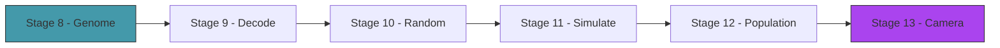

# Act 2 — The Creature

> *What is a creature? A list of numbers. Node positions, bone connections, muscle parameters — all encoded as a flat vector of floats. This act defines the genome, builds the decoder that turns numbers into bodies, and spawns a population of random creatures to see what shapes emerge from noise.*



---

## Stage 8 — The Genome

> *Difficulty: Medium — A flat vector of floats that encodes an entire creature.*

*~60 min*

The genetic algorithm operates on flat vectors — it doesn't know about nodes, bones, or muscles. It just crosses over and mutates numbers. The genome is the bridge: a `Vec<f32>` with a defined layout that maps regions of the vector to creature properties.

> [!tip] What You'll Learn
> - Genome layout — which floats encode what
> - Fixed-topology vs variable-topology genomes
> - Why flat vectors are ideal for genetic algorithms
> - `#[derive]` for automatic trait implementations
> - Returning `Result` from functions that can fail

### Genome layout

We start with a fixed topology: every creature has the same number of nodes and connections. Only the positions and muscle parameters vary. Variable topology (adding/removing nodes) comes in Act 3.

```
Genome layout (fixed 5-node creature):
[0..10]   Node positions: 5 nodes × 2 (x, y) relative offsets
[10..14]  Muscle params: 2 muscles × 2 (frequency, phase)
Total: 14 floats
```

**Python comparison:** This is like a flat NumPy array `np.random.uniform(-50, 50, size=14)` where you know that indices 0-9 are positions and 10-13 are muscle parameters. The genetic algorithm doesn't care about the meaning — it just operates on floats.

### 8.1 — The Genome struct

Create `src/genome.rs` and add `mod genome;` to `main.rs`:

```rust
pub const NUM_NODES: usize = 5;
pub const NUM_MUSCLES: usize = 2;
pub const GENOME_SIZE: usize = NUM_NODES * 2 + NUM_MUSCLES * 2;

#[derive(Debug, Clone)]
pub struct Genome {
    pub genes: Vec<f32>,
}
```

> [!note] `#[derive(Debug, Clone)]` — free implementations
> `Debug` lets you print the genome with `println!("{:?}", genome)` — useful for debugging. `Clone` lets you duplicate a genome with `genome.clone()` — essential for the genetic algorithm (parents survive while children are copies).
>
> **Python comparison:** `Debug` is like `__repr__`. `Clone` is like `copy.deepcopy()`. In Python these exist by default; in Rust you opt in with `#[derive]`.
>
> A common beginner mistake: using `{:?}` (Debug format) vs `{}` (Display format). `Debug` is for developers — it shows the raw structure. `Display` is for users — it shows a pretty version. `#[derive(Debug)]` gives you `{:?}` for free. `Display` must be implemented manually.

### Concept: Error Handling with `Result`

The `random()` function below can't fail, but soon we'll write functions that can — decoding a genome with too few genes, loading a file that doesn't exist. Let's establish the pattern now.

Rust uses `Result<T, E>` instead of exceptions:

```rust
// Python: raise ValueError("genome too short")
// Rust:   return Err(String::from("genome too short"))

// Python: try: ... except ValueError as e: ...
// Rust:   match result { Ok(val) => ..., Err(e) => ... }
```

The `?` operator is the shortcut: `let val = might_fail()?;` returns the error early if the function fails, or unwraps the success value if it succeeds. It's like Python's `val = might_fail()` but the error propagation is explicit.

`.unwrap()` is the "I'm sure this won't fail" escape hatch — it panics (crashes) if the Result is an Err. We'll use it sparingly during development and replace it with `?` as we go.

### 8.2 — Random genome generation

```rust
impl Genome {
    /// Create a genome with random values.
    pub fn random() -> Self {
        use macroquad::rand::gen_range;
        let genes: Vec<f32> = (0..GENOME_SIZE).map(|i| {
            if i < NUM_NODES * 2 {
                // Node positions: relative offsets from center
                gen_range(-50.0, 50.0)
            } else if i % 2 == 0 {
                // Muscle frequency: 0.5 to 4.0 Hz
                gen_range(0.5, 4.0)
            } else {
                // Muscle phase: 0 to 2π
                gen_range(0.0, std::f32::consts::TAU)
            }
        }).collect();

        Genome { genes }
    }

    /// Validate that the genome has the expected size.
    /// Returns an error string if invalid.
    pub fn validate(&self) -> Result<(), String> {
        if self.genes.len() < NUM_NODES * 2 {
            return Err(format!(
                "genome too short: {} genes, need at least {}",
                self.genes.len(), NUM_NODES * 2
            ));
        }
        Ok(())
    }
}
```

14 floats. That's the entire creature. The genetic algorithm will tune these 14 numbers until something walks.

### 8.3 — Test the genome

Add tests to `genome.rs`:

```rust
#[cfg(test)]
mod tests {
    use super::*;

    #[test]
    fn random_genome_has_correct_size() {
        let genome = Genome::random();
        assert_eq!(genome.genes.len(), GENOME_SIZE);
    }

    #[test]
    fn validate_catches_short_genome() {
        let genome = Genome { genes: vec![1.0, 2.0] };
        assert!(genome.validate().is_err());
    }

    #[test]
    fn validate_accepts_valid_genome() {
        let genome = Genome::random();
        assert!(genome.validate().is_ok());
    }
}
```

```bash
cargo test
```

All tests should pass — the physics tests from Act 1 plus these new genome tests.

### 8.4 — Extend it

Add a method `pub fn gene_ranges(&self) -> Vec<(f32, f32)>` that returns the expected min/max range for each gene index (positions: [-50, 50], frequencies: [0.5, 4.0], phases: [0, TAU]). Write a test that verifies a random genome's values fall within these ranges.

> [!check] Checkpoint
> Create a random genome. Verify it has `GENOME_SIZE` floats. Tests pass. Validation catches invalid genomes. Stage 8 complete.

---

## Stage 9 — Decoding a Creature

> *Difficulty: Medium — Genome → nodes + bones + muscles.*

*~70 min*

The decoder reads the genome and builds a `Simulation` — placing nodes, connecting them with bones, and assigning muscles. The body plan is hardcoded (5 nodes in a specific topology), but the positions and muscle parameters come from the genome.

> [!tip] What You'll Learn
> - Mapping genome regions to creature properties
> - Building a simulation from a genome
> - The fixed body plan: core triangle + two legs
> - Why decoding is separate from the genome (same genome, different decoders)
> - Returning `Result` from the decoder

### 9.1 — The Creature struct

Create `src/creature.rs` and add `mod creature;` to `main.rs`:

```rust
use crate::genome::{Genome, NUM_NODES, NUM_MUSCLES};
use crate::physics::{Point, Bone, Muscle};
use crate::simulation::Simulation;
use macroquad::prelude::*;

const MUSCLE_AMPLITUDE: f32 = 15.0;

pub struct Creature {
    pub genome: Genome,
    pub sim: Simulation,
    pub start_x: f32,
    pub fitness: f32,
}
```

### 9.2 — Try it yourself: implement the decoder

The decoder should:
1. Validate the genome (return an error if invalid)
2. Read node positions from genes `[0..NUM_NODES*2]` as offsets from the spawn point
3. Build the fixed bone topology: core triangle (nodes 0-1-2) + leg bones + cross-braces
4. Read muscle parameters from genes `[NUM_NODES*2..]` and create muscles for the legs

The function signature:

```rust
impl Creature {
    /// Decode a genome into a creature at the given position.
    pub fn from_genome(genome: Genome, spawn_x: f32, spawn_y: f32) -> Result<Self, String> {
        genome.validate()?; // ← the ? operator propagates the error if validation fails

        let mut sim = Simulation::new();
        let genes = &genome.genes;

        // 1. Decode node positions (relative to spawn point)
        // YOUR CODE: loop over NUM_NODES, read x from genes[i*2], y from genes[i*2+1]
        // Make y negative (above ground): spawn_y + genes[i*2+1].abs() * -1.0

        // 2. Build bones: core triangle (0-1-2), legs (1-3, 2-4), cross-braces (0-3, 0-4)
        // YOUR CODE: compute rest lengths from actual point distances, use .max(10.0)

        // 3. Decode muscles for legs
        // YOUR CODE: read frequency and phase from genes[muscle_offset..]

        Ok(Creature { genome, sim, start_x: spawn_x, fitness: 0.0 })
    }
}
```

Hints:
- Distance between two points: `(sim.points[a].pos - sim.points[b].pos).length()`
- Use `.max(10.0)` on bone lengths to prevent zero-length bones
- Muscle offset in the genome: `NUM_NODES * 2`

<details>
<summary>Solution</summary>

```rust
impl Creature {
    pub fn from_genome(genome: Genome, spawn_x: f32, spawn_y: f32) -> Result<Self, String> {
        genome.validate()?;

        let mut sim = Simulation::new();
        let genes = &genome.genes;

        // Decode node positions (relative to spawn point)
        for i in 0..NUM_NODES {
            let x = spawn_x + genes[i * 2];
            let y = spawn_y + genes[i * 2 + 1].abs() * -1.0; // above ground
            sim.points.push(Point::new(x, y));
        }

        // Fixed bone topology: triangle core (0-1-2) + two legs (1-3, 2-4)
        let pairs: &[(usize, usize)] = &[
            (0, 1), (0, 2), (1, 2),  // core triangle
            (1, 3), (2, 4),          // legs
            (0, 3), (0, 4),          // cross braces
        ];
        for &(a, b) in pairs {
            let d = (sim.points[a].pos - sim.points[b].pos).length().max(10.0);
            sim.bones.push(Bone::new(a, b, d));
        }

        // Legs as muscles
        let muscle_offset = NUM_NODES * 2;
        for m in 0..NUM_MUSCLES {
            let node_a = 1 + m; // left or right core node
            let node_b = 3 + m; // left or right leg node
            let rest = (sim.points[node_a].pos - sim.points[node_b].pos).length().max(10.0);
            let freq = genes[muscle_offset + m * 2];
            let phase = genes[muscle_offset + m * 2 + 1];
            sim.muscles.push(Muscle::new(node_a, node_b, rest, MUSCLE_AMPLITUDE, freq, phase));
        }

        Ok(Creature { genome, sim, start_x: spawn_x, fitness: 0.0 })
    }
}
```

</details>

The decoder reads node positions from genes [0..10], computes bone lengths from the actual distances between nodes (so the rest length matches the initial shape), and reads muscle frequency/phase from genes [10..14].

> [!note] The `?` operator in action
> `genome.validate()?;` — if `validate()` returns `Err(msg)`, the `?` immediately returns that error from `from_genome`. If it returns `Ok(())`, execution continues. This replaces Python's `try/except` with a single character.
>
> The function returns `Result<Self, String>` — either a valid `Creature` or an error message. Callers must handle both cases.

### 9.3 — Fitness computation

```rust
impl Creature {
    /// Compute fitness = horizontal distance traveled (rightward).
    pub fn compute_fitness(&mut self) {
        let avg_x: f32 = self.sim.points.iter().map(|p| p.pos.x).sum::<f32>()
            / self.sim.points.len() as f32;
        self.fitness = (avg_x - self.start_x).max(0.0);
    }
}
```

> [!warning] Common Mistake — Integer vs float division
> `self.sim.points.len()` returns `usize` (an unsigned integer). You can't divide an `f32` by a `usize` directly:
>
> ```
> error[E0277]: cannot divide `f32` by `usize`
> ```
>
> The fix: `as f32` converts the integer to a float. Rust never does implicit numeric conversions — you must be explicit. This prevents subtle bugs where integer division silently truncates (a common Python 2 gotcha).

### 9.4 — Test the decoder

```rust
#[cfg(test)]
mod tests {
    use super::*;
    use crate::genome::Genome;

    #[test]
    fn decode_random_genome_produces_valid_creature() {
        let genome = Genome::random();
        let creature = Creature::from_genome(genome, 200.0, 400.0);
        assert!(creature.is_ok());

        let creature = creature.unwrap();
        assert_eq!(creature.sim.points.len(), 5);
        assert_eq!(creature.sim.bones.len(), 7);  // 3 core + 2 legs + 2 braces
        assert_eq!(creature.sim.muscles.len(), 2);
    }

    #[test]
    fn decode_invalid_genome_returns_error() {
        let genome = Genome { genes: vec![1.0] };
        let result = Creature::from_genome(genome, 200.0, 400.0);
        assert!(result.is_err());
    }
}
```

```bash
cargo test
```

> [!check] Checkpoint
> Decode a random genome into a creature. Verify it has 5 nodes, 7 bones, and 2 muscles. Invalid genomes return errors. Stage 9 complete.

---

## Stage 10 — Random Creatures

> *Difficulty: Easy — Generate random genomes and see what shapes emerge.*

*~40 min*

Before evolution, let's see what randomness produces. Spawn 10 random creatures and watch them. Most will be bizarre — nodes clumped together, legs pointing the wrong way, muscles fighting each other. That's the starting point.

> [!tip] What You'll Learn
> - Spawning multiple creatures
> - Why random genomes produce mostly useless bodies
> - Handling `Result` in loops
> - Visual debugging — seeing what the genome produces

### 10.1 — Spawn random creatures

```rust
fn spawn_random_creatures(count: usize, spawn_x: f32, spawn_y: f32) -> Vec<Creature> {
    (0..count)
        .filter_map(|_| {
            let genome = Genome::random();
            Creature::from_genome(genome, spawn_x, spawn_y).ok()
        })
        .collect()
}
```

> [!note] `filter_map` and `.ok()`
> `from_genome` returns `Result<Creature, String>`. `.ok()` converts it to `Option<Creature>` — `Some(creature)` on success, `None` on error. `filter_map` keeps only the `Some` values and unwraps them.
>
> **Python comparison:** This is like `[c for g in genomes if (c := decode(g)) is not None]` — a list comprehension that filters out failures.

### 10.2 — Try it yourself: draw them all with different colors

Write the game loop that:
1. Steps all creatures' simulations each frame
2. Draws each creature with a unique color based on its index

Hint: vary the hue by dividing the index by the total count. Use `Color::from_rgba` with the hue mapped to red/green channels.

<details>
<summary>Solution</summary>

```rust
let mut creatures = spawn_random_creatures(10, 200.0, 400.0);

loop {
    let dt = get_frame_time().min(0.02);
    clear_background(Color::from_rgba(15, 15, 25, 255));

    for creature in &mut creatures {
        creature.sim.step(dt, gravity);
    }

    for (i, creature) in creatures.iter().enumerate() {
        let hue = i as f32 / creatures.len() as f32;
        let color = Color::from_rgba(
            (hue * 255.0) as u8,
            ((1.0 - hue) * 200.0) as u8,
            150, 200,
        );
        creature.sim.draw();
    }

    next_frame().await;
}
```

</details>

10 colorful blobs twitching on the ground. Some are compact triangles. Some have legs splayed wide. Some are nearly flat. All are terrible at moving.

> [!check] Checkpoint
> Spawn 10 random creatures. Verify they have different shapes and all twitch differently. Stage 10 complete.

---

## Stage 11 — The Simulation

> *Difficulty: Medium — Run a creature for 10 seconds and measure fitness.*

*~60 min*

Evolution needs a fitness score. This stage runs each creature for a fixed duration, then measures how far it traveled. The simulation is deterministic — same genome, same starting position, same result every time.

> [!tip] What You'll Learn
> - Fixed-duration simulation for fitness evaluation
> - Measuring horizontal displacement
> - Why determinism matters (same genome = same fitness)
> - Headless evaluation (physics without rendering)

### 11.1 — Try it yourself: implement `evaluate`

The evaluate method should run the creature's physics for `SIM_DURATION` seconds using a fixed timestep, then compute fitness. No rendering — just physics.

```rust
const SIM_DURATION: f32 = 10.0; // seconds per evaluation
const PHYSICS_DT: f32 = 0.016;  // fixed timestep (~60 FPS physics)

impl Creature {
    /// Run the simulation for SIM_DURATION and compute fitness.
    /// This runs the physics without rendering (fast evaluation).
    pub fn evaluate(&mut self, gravity: Vec2) {
        // YOUR CODE:
        // 1. Calculate the number of steps: (SIM_DURATION / PHYSICS_DT) as usize
        // 2. Loop that many times, calling self.sim.step(PHYSICS_DT, gravity)
        // 3. Call self.compute_fitness()
    }
}
```

<details>
<summary>Solution</summary>

```rust
pub fn evaluate(&mut self, gravity: Vec2) {
    let steps = (SIM_DURATION / PHYSICS_DT) as usize;
    for _ in 0..steps {
        self.sim.step(PHYSICS_DT, gravity);
    }
    self.compute_fitness();
}
```

</details>

For visual mode, we run physics in real-time. For evolution (where we need to evaluate 50 creatures per generation), we run physics without rendering — much faster.

### 11.2 — Test it

```rust
#[test]
fn evaluate_produces_nonnegative_fitness() {
    let genome = Genome::random();
    let mut creature = Creature::from_genome(genome, 200.0, 400.0).unwrap();
    creature.evaluate(vec2(0.0, 980.0));
    assert!(creature.fitness >= 0.0);
}
```

Most random creatures score 0-20 pixels. A few lucky ones might score 50-100. The genetic algorithm will push this number up.

> [!warning] Common Mistake — Using `.unwrap()` in production code
> In the test above, `.unwrap()` is fine — if the genome is invalid, we *want* the test to panic and tell us. But in production code, `.unwrap()` crashes the whole program:
>
> ```
> thread 'main' panicked at 'called `Result::unwrap()` on an `Err` value: "genome too short: 1 genes, need at least 10"'
> ```
>
> Use `?` to propagate errors, or `match` to handle them explicitly. We'll keep `.unwrap()` in tests and replace it with `?` in application code.

### 11.3 — Extend it

Run `evaluate` on 20 random creatures and print their fitness scores sorted from best to worst. What's the typical range? What's the best score you see from pure randomness?

> [!check] Checkpoint
> Evaluate a random creature. Verify fitness is a non-negative number representing horizontal distance. Tests pass. Stage 11 complete.

---

## Stage 12 — 20 Creatures at Once

> *Difficulty: Medium — Spawn a population, run them side by side, color by fitness.*

*~50 min*

The visual payoff: 20 creatures on screen simultaneously, each with a different random body, all twitching and flopping. Color them by fitness — green for the best, red for the worst.

> [!tip] What You'll Learn
> - Population management
> - Color mapping by fitness rank
> - Sorting with `partial_cmp` (why floats are tricky to sort)
> - Running multiple simulations in the same frame

### 12.1 — Try it yourself: population with fitness coloring

Build the main loop that:
1. Spawns 20 random creatures
2. Each frame: steps all simulations, computes fitness, sorts by fitness
3. Draws creatures colored green (best) to red (worst)
4. Shows a HUD with best fitness, generation number, and time

Hint for sorting: `f32` doesn't implement `Ord` (because `NaN != NaN`), so you need `partial_cmp`:

```rust
ranked.sort_by(|a, b| b.1.partial_cmp(&a.1).unwrap());
```

<details>
<summary>Solution</summary>

```rust
const POPULATION_SIZE: usize = 20;

#[macroquad::main("Génesis")]
async fn main() {
    let gravity = vec2(0.0, 980.0);
    let mut creatures = spawn_random_creatures(POPULATION_SIZE, 200.0, 400.0);
    let mut sim_time = 0.0;

    loop {
        let dt = get_frame_time().min(0.02);
        sim_time += dt;

        clear_background(Color::from_rgba(15, 15, 25, 255));

        // Update all creatures
        for creature in &mut creatures {
            creature.sim.step(dt, gravity);
            creature.compute_fitness();
        }

        // Sort by fitness for coloring
        let mut ranked: Vec<(usize, f32)> = creatures.iter()
            .enumerate()
            .map(|(i, c)| (i, c.fitness))
            .collect();
        ranked.sort_by(|a, b| b.1.partial_cmp(&a.1).unwrap());

        // Draw ground
        draw_line(0.0, 500.0, screen_width() * 3.0, 500.0, 2.0,
            Color::from_rgba(60, 60, 80, 255));

        // Draw creatures colored by rank
        for (rank, &(idx, _)) in ranked.iter().enumerate() {
            let t = rank as f32 / POPULATION_SIZE as f32;
            let color = Color::from_rgba(
                (t * 255.0) as u8,           // red for worst
                ((1.0 - t) * 255.0) as u8,  // green for best
                50, 180,
            );
            creatures[idx].sim.draw();
        }

        // HUD
        let best_fitness = ranked.first().map(|&(_, f)| f).unwrap_or(0.0);
        draw_text("Génesis — Generation 0", 10.0, 30.0, 24.0, WHITE);
        draw_text(&format!("Best: {:.0}px", best_fitness), 10.0, 55.0, 20.0, GREEN);
        draw_text(&format!("Time: {:.1}s", sim_time), 10.0, 80.0, 20.0, GRAY);

        next_frame().await;
    }
}
```

</details>

20 creatures, green (best) to red (worst), all moving simultaneously. The best one is usually the one that happened to flop rightward.

> [!warning] Common Mistake — `partial_cmp` vs `cmp`
> Integers implement `Ord`, so you can sort them with `.sort()`. Floats only implement `PartialOrd` because `NaN` breaks total ordering (`NaN != NaN`). If you try `.sort()` on floats:
>
> ```
> error[E0277]: the trait bound `f32: Ord` is not satisfied
> ```
>
> The fix: use `.sort_by(|a, b| a.partial_cmp(b).unwrap())`. The `.unwrap()` is safe here because our fitness values are never `NaN`.

> [!check] Checkpoint
> 20 creatures on screen, colored green (best) to red (worst). Verify the green one has moved the furthest right. Stage 12 complete.

---

## Stage 13 — The Camera

> *Difficulty: Easy — Follow the best creature with a scrolling camera.*

*~35 min*

As creatures move rightward, they leave the screen. A camera that follows the best performer keeps the action visible and gives a sense of distance traveled.

> [!tip] What You'll Learn
> - Camera offset for 2D scrolling
> - Smooth camera following (lerp toward target)
> - Drawing with camera offset
> - Zoom controls

### 13.1 — Try it yourself: implement the Camera struct

Build a `Camera` with:
- `offset: Vec2` — current camera position
- `target: Vec2` — where the camera wants to be
- `zoom: f32` — zoom level (1.0 = normal)
- `follow(pos, dt)` — smoothly move toward a target (the best creature's position, offset so it's 30% from the left edge)
- `world_to_screen(pos)` — convert a world position to screen coordinates

Smooth following uses linear interpolation: `offset += (target - offset) * speed * dt`

<details>
<summary>Solution</summary>

```rust
struct Camera {
    offset: Vec2,
    target: Vec2,
    zoom: f32,
}

impl Camera {
    fn new() -> Self {
        Camera { offset: vec2(0.0, 0.0), target: vec2(0.0, 0.0), zoom: 1.0 }
    }

    fn follow(&mut self, pos: Vec2, dt: f32) {
        self.target = vec2(pos.x - screen_width() * 0.3, 0.0);
        self.offset += (self.target - self.offset) * 3.0 * dt; // smooth follow
    }

    fn world_to_screen(&self, pos: Vec2) -> Vec2 {
        (pos - self.offset) * self.zoom
    }
}
```

</details>

Apply the camera offset to all drawing calls. The best creature stays roughly 30% from the left edge, with the track scrolling behind it.

### 13.2 — Zoom controls

```rust
if is_key_pressed(KeyCode::Equal) { camera.zoom *= 1.2; }
if is_key_pressed(KeyCode::Minus) { camera.zoom /= 1.2; }
```

### 13.3 — Extend it

Add a key (e.g., `Tab`) that cycles which creature the camera follows — best, second best, worst. This is useful for watching different strategies.

> [!check] Checkpoint
> The camera follows the best creature. Zoom in/out with +/-. Stage 13 complete.

---

## Act 2 Complete — The Creature

| Component | What it does |
|-----------|-------------|
| `Genome` | 14 floats encoding node positions + muscle parameters |
| `Creature::from_genome` | Genome → nodes + bones + muscles → Simulation (returns `Result`) |
| `Genome::validate` | Catches invalid genomes before decoding |
| Random generation | Spawn diverse starting populations |
| Fitness evaluation | Run 10 seconds headless, measure horizontal distance |
| Population rendering | 20 creatures colored by fitness rank |
| Camera | Smooth follow on the best creature |

| Rust Concept | Where You Used It |
|-------------|-------------------|
| `#[derive(Debug, Clone)]` | Genome — automatic trait implementations |
| `Result<T, E>` and `?` | Genome validation, creature decoding |
| `.unwrap()` | Tests only — panics on error |
| `filter_map` | Spawning creatures, skipping decode failures |
| `partial_cmp` | Sorting floats (no `Ord` for `f32`) |
| `as f32` | Explicit numeric conversion (no implicit casts) |
| `#[cfg(test)]` | Test modules in genome.rs and creature.rs |

**Error handling so far:** `Genome::validate` returns `Result`. `Creature::from_genome` propagates with `?`. Tests use `.unwrap()`. Application code uses `.ok()` with `filter_map`. No panics in production paths.

**Next up — Act 3: The Evolution.** Selection, crossover, mutation — and the breakthrough moment when a creature learns to walk.
