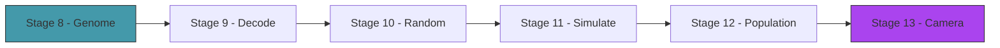

# Act 2 — The Creature

> *What is a creature? A list of numbers. Node positions, bone connections, muscle parameters — all encoded as a flat vector of floats. This act defines the genome, builds the decoder that turns numbers into bodies, and spawns a population of random creatures to see what shapes emerge from noise.*



---

## Stage 8 — The Genome

> *Difficulty: Medium — A flat vector of floats that encodes an entire creature.*

The genetic algorithm operates on flat vectors — it doesn't know about nodes, bones, or muscles. It just crosses over and mutates numbers. The genome is the bridge: a `Vec<f32>` with a defined layout that maps regions of the vector to creature properties.

> [!tip] What You'll Learn
> - Genome layout — which floats encode what
> - Fixed-topology vs variable-topology genomes
> - Why flat vectors are ideal for genetic algorithms
> - The encoding/decoding pattern

### Genome layout

We start with a fixed topology: every creature has the same number of nodes and connections. Only the positions and muscle parameters vary. Variable topology (adding/removing nodes) comes in Act 3.

```
Genome layout (fixed 5-node creature):
[0..10]   Node positions: 5 nodes × 2 (x, y) relative offsets
[10..14]  Muscle params: 2 muscles × 2 (frequency, phase)
Total: 14 floats
```

### 8.1 — The Genome struct

Create `src/genome.rs`:

```rust
use serde::{Serialize, Deserialize};

pub const NUM_NODES: usize = 5;
pub const NUM_MUSCLES: usize = 2;
pub const GENOME_SIZE: usize = NUM_NODES * 2 + NUM_MUSCLES * 2;

#[derive(Debug, Clone, Serialize, Deserialize)]
pub struct Genome {
    pub genes: Vec<f32>,
}

impl Genome {
    /// Create a genome with random values.
    pub fn random() -> Self {
        use macroquad::rand::gen_range;
        let genes: Vec<f32> = (0..GENOME_SIZE).map(|i| {
            if i < NUM_NODES * 2 {
                // Node positions: relative offsets from center
                gen_range(-50.0, 50.0)
            } else if i % 2 == 0 {
                // Muscle frequency: 0.5 to 4.0 Hz
                gen_range(0.5, 4.0)
            } else {
                // Muscle phase: 0 to 2π
                gen_range(0.0, std::f32::consts::TAU)
            }
        }).collect();

        Genome { genes }
    }
}
```

14 floats. That's the entire creature. The genetic algorithm will tune these 14 numbers until something walks.

> [!check] Checkpoint
> Create a random genome. Verify it has `GENOME_SIZE` floats. Verify node offsets are in [-50, 50] and frequencies are in [0.5, 4.0]. Stage 8 complete.

---

## Stage 9 — Decoding a Creature

> *Difficulty: Medium — Genome → nodes + bones + muscles.*

The decoder reads the genome and builds a `Simulation` — placing nodes, connecting them with bones, and assigning muscles. The body plan is hardcoded (5 nodes in a specific topology), but the positions and muscle parameters come from the genome.

> [!tip] What You'll Learn
> - Mapping genome regions to creature properties
> - Building a simulation from a genome
> - The fixed body plan: core triangle + two legs
> - Why decoding is separate from the genome (same genome, different decoders)

### 9.1 — The decoder

Create `src/creature.rs`:

```rust
use crate::genome::{Genome, NUM_NODES, NUM_MUSCLES};
use crate::physics::{Point, Bone, Muscle};
use crate::simulation::Simulation;
use macroquad::prelude::*;

const MUSCLE_AMPLITUDE: f32 = 15.0;
const BONE_STIFFNESS: f32 = 1.0;

pub struct Creature {
    pub genome: Genome,
    pub sim: Simulation,
    pub start_x: f32,
    pub fitness: f32,
    pub alive: bool,
}

impl Creature {
    /// Decode a genome into a creature at the given position.
    pub fn from_genome(genome: Genome, spawn_x: f32, spawn_y: f32) -> Self {
        let mut sim = Simulation::new();
        let genes = &genome.genes;

        // Decode node positions (relative to spawn point)
        for i in 0..NUM_NODES {
            let x = spawn_x + genes[i * 2];
            let y = spawn_y + genes[i * 2 + 1].abs() * -1.0; // above ground
            sim.points.push(Point::new(x, y));
        }

        // Fixed bone topology: triangle core (0-1-2) + two legs (1-3, 2-4)
        let base = 0;
        // Core triangle
        let d01 = (sim.points[base].pos - sim.points[base + 1].pos).length();
        let d02 = (sim.points[base].pos - sim.points[base + 2].pos).length();
        let d12 = (sim.points[base + 1].pos - sim.points[base + 2].pos).length();
        sim.bones.push(Bone::new(base, base + 1, d01.max(10.0)));
        sim.bones.push(Bone::new(base, base + 2, d02.max(10.0)));
        sim.bones.push(Bone::new(base + 1, base + 2, d12.max(10.0)));

        // Cross braces for stability
        let d03 = (sim.points[base].pos - sim.points[base + 3].pos).length();
        let d04 = (sim.points[base].pos - sim.points[base + 4].pos).length();
        sim.bones.push(Bone::new(base, base + 3, d03.max(10.0)));
        sim.bones.push(Bone::new(base, base + 4, d04.max(10.0)));

        // Legs as muscles
        let muscle_offset = NUM_NODES * 2;
        for m in 0..NUM_MUSCLES {
            let node_a = base + 1 + m; // left or right core node
            let node_b = base + 3 + m; // left or right leg node
            let rest = (sim.points[node_a].pos - sim.points[node_b].pos).length().max(10.0);
            let freq = genes[muscle_offset + m * 2];
            let phase = genes[muscle_offset + m * 2 + 1];

            sim.muscles.push(Muscle::new(node_a, node_b, rest, MUSCLE_AMPLITUDE, freq, phase));
        }

        Creature {
            genome,
            sim,
            start_x: spawn_x,
            fitness: 0.0,
            alive: true,
        }
    }

    /// Compute fitness = horizontal distance traveled (rightward).
    pub fn compute_fitness(&mut self) {
        let avg_x: f32 = self.sim.points.iter().map(|p| p.pos.x).sum::<f32>()
            / self.sim.points.len() as f32;
        self.fitness = (avg_x - self.start_x).max(0.0);
    }

    /// Draw the creature.
    pub fn draw(&self, color: Color) {
        self.sim.draw_with_color(color);
    }
}
```

The decoder reads node positions from genes [0..10], computes bone lengths from the actual distances between nodes (so the rest length matches the initial shape), and reads muscle frequency/phase from genes [10..14].

> [!check] Checkpoint
> Decode a random genome into a creature. Verify it has 5 nodes, 5 bones, and 2 muscles. Drop it and verify it twitches. Stage 9 complete.

---

## Stage 10 — Random Creatures

> *Difficulty: Easy — Generate random genomes and see what shapes emerge.*

Before evolution, let's see what randomness produces. Spawn 10 random creatures and watch them. Most will be bizarre — nodes clumped together, legs pointing the wrong way, muscles fighting each other. That's the starting point.

> [!tip] What You'll Learn
> - Spawning multiple creatures
> - Why random genomes produce mostly useless bodies
> - The diversity of random shapes
> - Visual debugging — seeing what the genome produces

### 10.1 — Spawn random creatures

```rust
fn spawn_random_creatures(count: usize, spawn_x: f32, spawn_y: f32) -> Vec<Creature> {
    (0..count).map(|_| {
        let genome = Genome::random();
        Creature::from_genome(genome, spawn_x, spawn_y)
    }).collect()
}
```

### 10.2 — Draw them all

```rust
let mut creatures = spawn_random_creatures(10, 200.0, 400.0);

// In the loop:
for creature in &mut creatures {
    creature.sim.step(dt, gravity);
}

for (i, creature) in creatures.iter().enumerate() {
    let hue = i as f32 / creatures.len() as f32;
    let color = Color::from_rgba(
        (hue * 255.0) as u8, ((1.0 - hue) * 200.0) as u8, 150, 200,
    );
    creature.draw(color);
}
```

10 colorful blobs twitching on the ground. Some are compact triangles. Some have legs splayed wide. Some are nearly flat. All are terrible at moving.

> [!check] Checkpoint
> Spawn 10 random creatures. Verify they have different shapes and all twitch differently. Stage 10 complete.

---

## Stage 11 — The Simulation

> *Difficulty: Medium — Run a creature for 10 seconds and measure fitness.*

Evolution needs a fitness score. This stage runs each creature for a fixed duration, then measures how far it traveled. The simulation is deterministic — same genome, same starting position, same result every time.

> [!tip] What You'll Learn
> - Fixed-duration simulation for fitness evaluation
> - Measuring horizontal displacement
> - Why determinism matters (same genome = same fitness)
> - Timeout as a fairness mechanism

### 11.1 — Evaluate fitness

```rust
const SIM_DURATION: f32 = 10.0; // seconds per evaluation
const PHYSICS_DT: f32 = 0.016;  // fixed timestep (~60 FPS physics)

impl Creature {
    /// Run the simulation for SIM_DURATION and compute fitness.
    /// This runs the physics without rendering (fast evaluation).
    pub fn evaluate(&mut self, gravity: macroquad::prelude::Vec2) {
        let steps = (SIM_DURATION / PHYSICS_DT) as usize;
        for _ in 0..steps {
            self.sim.step(PHYSICS_DT, gravity);
        }
        self.compute_fitness();
    }
}
```

For visual mode, we run physics in real-time. For evolution (where we need to evaluate 50 creatures per generation), we run physics without rendering — much faster.

### 11.2 — Test it

```rust
let mut creature = Creature::from_genome(Genome::random(), 200.0, 400.0);
creature.evaluate(vec2(0.0, 980.0));
println!("Fitness: {:.1} pixels", creature.fitness);
```

Most random creatures score 0-20 pixels. A few lucky ones might score 50-100. The genetic algorithm will push this number up.

> [!check] Checkpoint
> Evaluate a random creature. Verify fitness is a non-negative number representing horizontal distance. Stage 11 complete.

---

## Stage 12 — 20 Creatures at Once

> *Difficulty: Medium — Spawn a population, run them side by side, color by fitness.*

The visual payoff: 20 creatures on screen simultaneously, each with a different random body, all twitching and flopping. Color them by fitness — green for the best, red for the worst.

> [!tip] What You'll Learn
> - Population management
> - Color mapping by fitness rank
> - Running multiple simulations in the same frame
> - The visual chaos of random evolution

### 12.1 — Population with fitness coloring

```rust
const POPULATION_SIZE: usize = 20;

#[macroquad::main("Génesis")]
async fn main() {
    let gravity = vec2(0.0, 980.0);
    let mut creatures = spawn_random_creatures(POPULATION_SIZE, 200.0, 400.0);
    let mut sim_time = 0.0;

    loop {
        let dt = get_frame_time().min(0.02);
        sim_time += dt;

        clear_background(Color::from_rgba(15, 15, 25, 255));

        // Update all creatures
        for creature in &mut creatures {
            creature.sim.step(dt, gravity);
            creature.compute_fitness();
        }

        // Sort by fitness for coloring
        let mut ranked: Vec<(usize, f32)> = creatures.iter()
            .enumerate()
            .map(|(i, c)| (i, c.fitness))
            .collect();
        ranked.sort_by(|a, b| b.1.partial_cmp(&a.1).unwrap());

        // Draw ground
        draw_line(0.0, 500.0, screen_width() * 3.0, 500.0, 2.0,
            Color::from_rgba(60, 60, 80, 255));

        // Draw creatures colored by rank
        for (rank, &(idx, _)) in ranked.iter().enumerate() {
            let t = rank as f32 / POPULATION_SIZE as f32;
            let color = Color::from_rgba(
                (t * 255.0) as u8,           // red for worst
                ((1.0 - t) * 255.0) as u8,  // green for best
                50, 180,
            );
            creatures[idx].draw(color);
        }

        // HUD
        let best_fitness = ranked.first().map(|&(_, f)| f).unwrap_or(0.0);
        draw_text("Génesis — Generation 0", 10.0, 30.0, 24.0, WHITE);
        draw_text(&format!("Best: {:.0}px", best_fitness), 10.0, 55.0, 20.0, GREEN);
        draw_text(&format!("Time: {:.1}s", sim_time), 10.0, 80.0, 20.0, GRAY);

        next_frame().await;
    }
}
```

20 creatures, green (best) to red (worst), all moving simultaneously. The best one is usually the one that happened to flop rightward.

> [!check] Checkpoint
> 20 creatures on screen, colored green (best) to red (worst). Verify the green one has moved the furthest right. Stage 12 complete.

---

## Stage 13 — The Camera

> *Difficulty: Easy — Follow the best creature with a scrolling camera.*

As creatures move rightward, they leave the screen. A camera that follows the best performer keeps the action visible and gives a sense of distance traveled.

> [!tip] What You'll Learn
> - Camera offset for 2D scrolling
> - Smooth camera following (lerp toward target)
> - Drawing with camera offset
> - Zoom controls

### 13.1 — Camera

```rust
struct Camera {
    offset: Vec2,
    target: Vec2,
    zoom: f32,
}

impl Camera {
    fn new() -> Self {
        Camera { offset: vec2(0.0, 0.0), target: vec2(0.0, 0.0), zoom: 1.0 }
    }

    fn follow(&mut self, pos: Vec2, dt: f32) {
        self.target = vec2(pos.x - screen_width() * 0.3, 0.0);
        self.offset += (self.target - self.offset) * 3.0 * dt; // smooth follow
    }

    fn world_to_screen(&self, pos: Vec2) -> Vec2 {
        (pos - self.offset) * self.zoom
    }
}
```

Apply the camera offset to all drawing calls. The best creature stays roughly 30% from the left edge, with the track scrolling behind it.

### 13.2 — Zoom controls

```rust
if is_key_pressed(KeyCode::Equal) { camera.zoom *= 1.2; }
if is_key_pressed(KeyCode::Minus) { camera.zoom /= 1.2; }
```

> [!check] Checkpoint
> The camera follows the best creature. Zoom in/out with +/-. Stage 13 complete.

---

## Act 2 Complete — The Creature

| Component | What it does |
|-----------|-------------|
| Genome | 14 floats encoding node positions + muscle parameters |
| Decoder | Genome → nodes + bones + muscles → Simulation |
| Random generation | Spawn diverse starting populations |
| Fitness evaluation | Run 10 seconds, measure horizontal distance |
| Population rendering | 20 creatures colored by fitness rank |
| Camera | Smooth follow on the best creature |

**Next up — Act 3: The Evolution.** Selection, crossover, mutation — and the breakthrough moment when a creature learns to walk.
