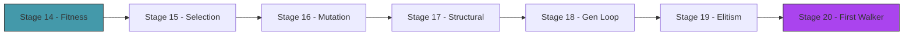

# Act 3 — The Evolution

> *Twenty random blobs. Most flop uselessly. But one — by pure luck — twitches rightward a few pixels more than the rest. That one becomes a parent. Its children inherit its shape and muscle timing, with small random changes. Some children are worse. A few are better. The better ones become parents. Repeat. Repeat. Repeat. Something starts to crawl.*



---

## Stage 14 — Fitness Evaluation

> *Difficulty: Easy — Run all creatures, rank them, visualize the distribution.*

*~40 min*

Before breeding, we need to know who's best. This stage runs the full population through the simulation and ranks them by distance traveled.

> [!tip] What You'll Learn
> - Batch evaluation (run all creatures, collect fitness)
> - Fitness distribution — most score low, a few score high
> - Why the fitness landscape matters for evolution
> - Displaying statistics (best, average, worst)

### 14.1 — Evaluate the population

```rust
fn evaluate_population(creatures: &mut [Creature], gravity: Vec2) {
    for creature in creatures.iter_mut() {
        creature.evaluate(gravity);
    }
}
```

For visual mode, we run physics in real-time and evaluate continuously. For fast evolution (headless mode), we evaluate without rendering — 20 creatures × 10 seconds of physics takes under a second of real time.

### 14.2 — Try it yourself: display fitness distribution

After evaluation, compute and display:
- **Best** fitness (green)
- **Average** fitness (yellow)
- **Worst** fitness (red)

Hint: collect fitnesses into a `Vec<f32>`, sort descending, then index.

<details>
<summary>Solution</summary>

```rust
let mut fitnesses: Vec<f32> = creatures.iter().map(|c| c.fitness).collect();
fitnesses.sort_by(|a, b| b.partial_cmp(a).unwrap());

draw_text(&format!("Best:  {:.0}", fitnesses[0]), 10.0, 55.0, 20.0, GREEN);
draw_text(
    &format!("Avg:   {:.0}", fitnesses.iter().sum::<f32>() / fitnesses.len() as f32),
    10.0, 80.0, 20.0, YELLOW,
);
draw_text(
    &format!("Worst: {:.0}", fitnesses.last().unwrap_or(&0.0)),
    10.0, 105.0, 20.0, RED,
);
```

</details>

> [!note] `.iter().sum::<f32>()`
> The `::<f32>` is a **turbofish** — it tells Rust what type `sum()` should produce. Without it, Rust can't infer the type because `sum()` works on many numeric types.
>
> **Python comparison:** `sum(fitnesses)` just works because Python figures out the type at runtime. Rust needs to know at compile time.

### 14.3 — Extend it

Add a simple bar chart: for each creature (sorted by fitness), draw a horizontal bar whose width is proportional to its fitness. Green for the best, red for the worst. This gives a visual sense of the fitness distribution.

> [!check] Checkpoint
> Evaluate 20 creatures. Display best, average, and worst fitness. Verify best > average > worst. Stage 14 complete.

---

## Stage 15 — Selection and Crossover

> *Difficulty: Medium — Breed the best, combine their genes.*

*~50 min*

Same pattern as Piloto: fitness-proportional selection picks parents, uniform crossover combines their genomes. The difference: we're crossing over body shapes, not neural network weights.

> [!tip] What You'll Learn
> - Fitness-proportional selection (roulette wheel)
> - Uniform crossover on genome vectors
> - Why crossover works (combine good traits from different parents)
> - Creating the `evolution` module

### 15.1 — Try it yourself: implement selection

Create `src/evolution.rs` (and add `mod evolution;` to `main.rs`).

Fitness-proportional selection (roulette wheel): imagine a wheel where each creature gets a slice proportional to its fitness. Spin the wheel — creatures with higher fitness are more likely to be selected.

Algorithm:
1. Sum all fitnesses
2. Pick a random threshold between 0 and the total
3. Walk through the fitnesses, subtracting each from the threshold
4. When the threshold drops to 0 or below, that's your selected index

```rust
use crate::genome::Genome;
use macroquad::rand::gen_range;

/// Select a parent index using fitness-proportional selection.
pub fn select(fitnesses: &[f32]) -> usize {
    // YOUR CODE HERE
    // Handle the edge case where total fitness is 0 (return a random index)
}
```

<details>
<summary>Solution</summary>

```rust
pub fn select(fitnesses: &[f32]) -> usize {
    let total: f32 = fitnesses.iter().sum();
    if total <= 0.0 {
        return gen_range(0, fitnesses.len());
    }
    let mut threshold = gen_range(0.0, total);
    for (i, &f) in fitnesses.iter().enumerate() {
        threshold -= f;
        if threshold <= 0.0 { return i; }
    }
    fitnesses.len() - 1
}
```

</details>

### 15.2 — Uniform crossover

```rust
/// Uniform crossover: randomly pick each gene from parent A or B.
pub fn crossover(a: &Genome, b: &Genome) -> Genome {
    let genes = a.genes.iter().zip(b.genes.iter())
        .map(|(&ga, &gb)| if gen_range(0.0, 1.0) < 0.5 { ga } else { gb })
        .collect();
    Genome { genes }
}
```

Identical to Piloto's evolution module. The genetic algorithm doesn't care what the genes *mean* — it just operates on floats.

### 15.3 — Test selection and crossover

```rust
#[cfg(test)]
mod tests {
    use super::*;

    #[test]
    fn select_returns_valid_index() {
        let fitnesses = vec![10.0, 20.0, 30.0, 40.0];
        for _ in 0..100 {
            let idx = select(&fitnesses);
            assert!(idx < fitnesses.len());
        }
    }

    #[test]
    fn select_handles_zero_fitness() {
        let fitnesses = vec![0.0, 0.0, 0.0];
        let idx = select(&fitnesses);
        assert!(idx < fitnesses.len());
    }

    #[test]
    fn crossover_produces_correct_length() {
        let a = Genome { genes: vec![1.0; 14] };
        let b = Genome { genes: vec![2.0; 14] };
        let child = crossover(&a, &b);
        assert_eq!(child.genes.len(), 14);
    }

    #[test]
    fn crossover_mixes_parent_genes() {
        let a = Genome { genes: vec![0.0; 14] };
        let b = Genome { genes: vec![1.0; 14] };
        // Run many times — child should have genes from both parents
        let mut has_a = false;
        let mut has_b = false;
        for _ in 0..100 {
            let child = crossover(&a, &b);
            if child.genes.contains(&0.0) { has_a = true; }
            if child.genes.contains(&1.0) { has_b = true; }
        }
        assert!(has_a && has_b, "crossover should mix genes from both parents");
    }
}
```

> [!check] Checkpoint
> Select parents from a fitness array. Cross two genomes. Verify the child has genes from both parents. Tests pass. Stage 15 complete.

---

## Stage 16 — Mutation

> *Difficulty: Medium — Small perturbations that create novelty.*

*~50 min*

Mutation adds random noise to the child's genes. Node positions shift slightly, muscle frequencies drift, phases rotate. Small changes refine; large changes explore.

> [!tip] What You'll Learn
> - Parameter-specific mutation ranges
> - Mutation rate and magnitude
> - Why different gene types need different mutation scales
> - Clamping values to valid ranges

### 16.1 — Try it yourself: implement mutation

Each gene has a 15% chance of being mutated. The mutation magnitude depends on what the gene encodes:

| Gene type | Mutation range | Valid range |
|-----------|---------------|-------------|
| Node position | ±10 pixels | unbounded |
| Muscle frequency | ±0.5 Hz | [0.2, 6.0] |
| Muscle phase | ±0.5 radians | unbounded (wraps) |

```rust
const MUTATION_RATE: f32 = 0.15;

/// Mutate a genome in place.
pub fn mutate(genome: &mut Genome) {
    // YOUR CODE:
    // For each gene, roll a random number. If < MUTATION_RATE, mutate it.
    // Use the gene index to determine the type and mutation range.
    // Clamp frequencies to [0.2, 6.0].
}
```

<details>
<summary>Solution</summary>

```rust
use crate::genome::NUM_NODES;

const MUTATION_RATE: f32 = 0.15;

pub fn mutate(genome: &mut Genome) {
    for (i, gene) in genome.genes.iter_mut().enumerate() {
        if gen_range(0.0, 1.0) < MUTATION_RATE {
            if i < NUM_NODES * 2 {
                *gene += gen_range(-10.0, 10.0);
            } else if i % 2 == 0 {
                *gene += gen_range(-0.5, 0.5);
                *gene = gene.clamp(0.2, 6.0);
            } else {
                *gene += gen_range(-0.5, 0.5);
            }
        }
    }
}
```

</details>

Different gene types get different mutation scales. Moving a node 10 pixels is a small change. Shifting a frequency by 0.5 Hz is a small change. But shifting a node by 0.5 Hz would be meaningless. Context-aware mutation.

> [!note] `*gene += ...` — dereferencing a mutable reference
> `iter_mut()` yields `&mut f32` references. To modify the value, you dereference with `*`: `*gene += 10.0`. This is like modifying through a pointer.
>
> **Python comparison:** In Python, `for gene in genes: gene += 10` doesn't modify the list (it rebinds the local variable). You'd need `genes[i] += 10`. Rust's `*gene += 10` actually modifies the value in the Vec because `gene` is a mutable reference to the element.

### 16.2 — Test mutation

```rust
#[test]
fn mutate_changes_some_genes() {
    let original = Genome { genes: vec![1.0; 14] };
    let mut mutated = original.clone();
    // Run mutation many times to ensure at least one gene changes
    for _ in 0..20 {
        mutate(&mut mutated);
    }
    assert_ne!(original.genes, mutated.genes, "mutation should change at least one gene");
}

#[test]
fn mutate_clamps_frequency() {
    let mut genome = Genome { genes: vec![0.0; 14] };
    // Set a frequency gene to the edge
    genome.genes[10] = 0.1; // below minimum
    for _ in 0..50 {
        mutate(&mut genome);
    }
    // Frequency genes are at even indices >= NUM_NODES*2
    assert!(genome.genes[10] >= 0.2, "frequency should be clamped to >= 0.2");
}
```

> [!check] Checkpoint
> Mutate a genome. Verify ~15% of genes changed. Verify frequencies stay in [0.2, 6.0]. Tests pass. Stage 16 complete.

---

## Stage 17 — Structural Mutation

> *Difficulty: Hard — Add or remove body segments. The body itself evolves.*

*~75 min*

This is what makes Génesis different from Piloto. In Piloto, every car had the same body — only the brain changed. Here, the body *shape* can change: a mutation might add a new node and connect it with a muscle, or remove a node and its connections. The creature's morphology co-evolves with its behavior.

> [!tip] What You'll Learn
> - Variable-length genomes
> - Adding nodes: extend the genome, add connection genes
> - Removing nodes: shrink the genome, remove orphaned connections
> - Why structural mutation is rare but powerful
> - Updating the decoder for variable-length genomes

### Why structural mutation?

Parameter mutation tunes what exists — it can make a leg longer or a muscle faster, but it can't add a third leg. Structural mutation changes the body plan itself. It's rare (5% per generation) because it's disruptive — adding a node changes the entire body. But occasionally, a structural mutation produces a body plan that parameter mutation alone could never find.

**Python comparison:** Imagine a list that can grow and shrink. In Python, `genes.insert(idx, val)` and `genes.pop(idx)` are trivial. In Rust, `Vec::insert` and `Vec::remove` work the same way — but you need to be careful about invalidating indices.

### 17.1 — Add a helper to count nodes and muscles

The genome layout is: `[node positions...][muscle params...]`. With variable length, we need to know how many of each:

```rust
impl Genome {
    /// Number of nodes encoded in this genome.
    pub fn num_nodes(&self) -> usize {
        // Each node = 2 floats, each muscle = 2 floats
        // We store nodes first, then muscles
        // num_nodes * 2 + num_muscles * 2 = genes.len()
        // For now, muscles = nodes - 3 (one muscle per limb node)
        // So: num_nodes * 2 + (num_nodes - 3) * 2 = genes.len()
        // num_nodes = (genes.len() + 6) / 4
        ((self.genes.len() + 6) / 4).max(3)
    }

    /// Number of muscles encoded in this genome.
    pub fn num_muscles(&self) -> usize {
        self.num_nodes().saturating_sub(3)
    }
}
```

### 17.2 — Try it yourself: implement structural mutation

Write `structural_mutate` that has a 5% chance of adding a node and a 5% chance of removing one:

**Adding a node:**
1. Check we have fewer than 8 nodes
2. Pick a random existing node as reference
3. Insert new x, y position genes near the reference node's position
4. Append frequency and phase genes for the new muscle

**Removing a node:**
1. Check we have more than 3 nodes (core triangle is sacred)
2. Remove a non-core node's position genes (index 3+)
3. Remove the corresponding muscle genes

```rust
const STRUCTURAL_MUTATION_RATE: f32 = 0.05;

pub fn structural_mutate(genome: &mut Genome) {
    let roll = gen_range(0.0, 1.0);
    // YOUR CODE
}
```

<details>
<summary>Solution</summary>

```rust
const STRUCTURAL_MUTATION_RATE: f32 = 0.05;

pub fn structural_mutate(genome: &mut Genome) {
    let roll = gen_range(0.0, 1.0);
    let num_nodes = genome.num_nodes();

    if roll < STRUCTURAL_MUTATION_RATE && num_nodes < 8 {
        // Add a node near an existing one
        let ref_node = gen_range(0, num_nodes);
        let ref_x = genome.genes[ref_node * 2];
        let ref_y = genome.genes[ref_node * 2 + 1];
        let insert_pos = num_nodes * 2;
        genome.genes.insert(insert_pos, ref_x + gen_range(-30.0, 30.0));
        genome.genes.insert(insert_pos + 1, ref_y + gen_range(-30.0, 30.0));
        // New muscle for this node
        genome.genes.push(gen_range(0.5, 4.0));
        genome.genes.push(gen_range(0.0, std::f32::consts::TAU));
    } else if roll < STRUCTURAL_MUTATION_RATE * 2.0 && num_nodes > 3 {
        // Remove a non-core node
        let remove_idx = gen_range(3, num_nodes);
        genome.genes.remove(remove_idx * 2 + 1);
        genome.genes.remove(remove_idx * 2);
        // Remove last muscle
        if genome.genes.len() >= 2 {
            genome.genes.pop();
            genome.genes.pop();
        }
    }
}
```

</details>

> [!warning] Common Mistake — Removing elements by index in the wrong order
> When removing two elements by index (the x and y of a node), remove the **higher index first**:
>
> ```rust
> // WRONG: removing index 6 shifts everything, so index 7 is now wrong
> genome.genes.remove(remove_idx * 2);     // removes x
> genome.genes.remove(remove_idx * 2 + 1); // removes WRONG element!
>
> // RIGHT: remove higher index first
> genome.genes.remove(remove_idx * 2 + 1); // removes y
> genome.genes.remove(remove_idx * 2);     // removes x (still correct)
> ```
>
> This is a classic off-by-one bug that exists in every language, but Rust won't catch it for you — the indices are valid, just pointing at the wrong elements.

### 17.3 — Update the decoder for variable-length genomes

The decoder from Stage 9 assumed exactly 5 nodes and 2 muscles. Update `Creature::from_genome` to handle variable-length genomes:

```rust
pub fn from_genome(genome: Genome, spawn_x: f32, spawn_y: f32) -> Result<Self, String> {
    if genome.genes.len() < 6 {
        return Err(format!("genome too short: {} genes", genome.genes.len()));
    }

    let mut sim = Simulation::new();
    let genes = &genome.genes;
    let num_nodes = genome.num_nodes();
    let num_muscles = genome.num_muscles();

    // Decode nodes
    for i in 0..num_nodes {
        let x = spawn_x + genes[i * 2];
        let y = (spawn_y + genes[i * 2 + 1].abs() * -1.0).min(spawn_y);
        sim.points.push(Point::new(x, y));
    }

    let n = sim.points.len();
    if n < 3 {
        return Err(format!("need at least 3 nodes, got {}", n));
    }

    // Core triangle
    for i in 0..3 {
        for j in (i + 1)..3 {
            let d = (sim.points[i].pos - sim.points[j].pos).length().max(10.0);
            sim.bones.push(Bone::new(i, j, d));
        }
    }

    // Connect extra nodes to nearest core node + cross-brace to center
    for i in 3..n {
        let nearest = (0..3)
            .min_by(|&a, &b| {
                let da = (sim.points[a].pos - sim.points[i].pos).length();
                let db = (sim.points[b].pos - sim.points[i].pos).length();
                da.partial_cmp(&db).unwrap()
            })
            .unwrap_or(0);
        let d = (sim.points[nearest].pos - sim.points[i].pos).length().max(10.0);
        sim.bones.push(Bone::new(nearest, i, d));
        let d0 = (sim.points[0].pos - sim.points[i].pos).length().max(10.0);
        sim.bones.push(Bone::new(0, i, d0));
    }

    // Decode muscles
    let muscle_start = num_nodes * 2;
    for m in 0..num_muscles {
        let gene_idx = muscle_start + m * 2;
        if gene_idx + 1 >= genes.len() { break; }
        let node_a = m % 3;
        let node_b = 3 + m;
        if node_b >= n { break; }
        let rest = (sim.points[node_a].pos - sim.points[node_b].pos).length().max(10.0);
        sim.muscles.push(Muscle::new(
            node_a, node_b, rest, MUSCLE_AMPLITUDE,
            genes[gene_idx], genes[gene_idx + 1],
        ));
    }

    Ok(Creature { genome, sim, start_x: spawn_x, fitness: 0.0 })
}
```

### 17.4 — Test structural mutation

```rust
#[test]
fn structural_mutate_can_add_node() {
    let mut genome = Genome::random(); // 5 nodes, 14 genes
    let original_len = genome.genes.len();
    // Force an add by running many times
    for _ in 0..200 {
        let mut g = genome.clone();
        structural_mutate(&mut g);
        if g.genes.len() > original_len {
            // Verify it decodes
            assert!(Creature::from_genome(g, 0.0, 400.0).is_ok());
            return;
        }
    }
    panic!("structural mutation never added a node in 200 attempts");
}
```

> [!check] Checkpoint
> Apply structural mutation to a genome. Verify the creature decodes correctly with more or fewer nodes. Tests pass. Stage 17 complete.

---

## Stage 18 — The Generation Loop

> *Difficulty: Medium — The evolutionary cycle: evaluate → select → breed → repeat.*

*~50 min*

All the pieces are in place. This stage connects them into the generation loop: run all creatures, evaluate fitness, breed the next generation, reset, repeat.

> [!tip] What You'll Learn
> - The complete evolutionary loop
> - Generation timing and reset
> - Watching fitness climb over generations
> - Tracking fitness history for graphing

### 18.1 — Try it yourself: implement the generation loop

After `SIM_DURATION` seconds, breed the next generation:

1. Collect fitnesses and genomes from the current population
2. For each child in the new population: select two parents, crossover, mutate, structural mutate
3. Replace the population with the new genomes (decode each into a fresh Creature)
4. Increment the generation counter
5. Track the best fitness per generation in a `Vec<f32>`

```rust
let mut generation = 0;
let mut best_ever = 0.0f32;
let mut fitness_history: Vec<f32> = Vec::new();

// When sim_time >= SIM_DURATION:
// YOUR CODE — breed next generation, reset creatures, increment generation
```

<details>
<summary>Solution</summary>

```rust
if sim_time >= SIM_DURATION {
    let fitnesses: Vec<f32> = creatures.iter().map(|c| c.fitness).collect();
    let best = fitnesses.iter().cloned().fold(0.0f32, f32::max);
    best_ever = best_ever.max(best);
    fitness_history.push(best);

    let genomes: Vec<Genome> = creatures.iter().map(|c| c.genome.clone()).collect();
    let mut new_genomes = Vec::new();

    for _ in 0..POPULATION_SIZE {
        let a = evolution::select(&fitnesses);
        let b = evolution::select(&fitnesses);
        let mut child = evolution::crossover(&genomes[a], &genomes[b]);
        evolution::mutate(&mut child);
        evolution::structural_mutate(&mut child);
        new_genomes.push(child);
    }

    creatures = new_genomes.into_iter()
        .filter_map(|g| Creature::from_genome(g, 200.0, 400.0).ok())
        .collect();
    generation += 1;
    sim_time = 0.0;
}
```

</details>

### 18.2 — Fitness graph

Draw a line graph of best fitness per generation in the corner of the screen — same pattern as Piloto:

```rust
// Draw fitness history as a line graph
if fitness_history.len() > 1 {
    let max_f = fitness_history.iter().cloned().fold(1.0f32, f32::max);
    let graph_x = screen_width() - 220.0;
    let graph_y = 20.0;
    let graph_w = 200.0;
    let graph_h = 80.0;

    for i in 1..fitness_history.len() {
        let x1 = graph_x + (i - 1) as f32 / fitness_history.len() as f32 * graph_w;
        let x2 = graph_x + i as f32 / fitness_history.len() as f32 * graph_w;
        let y1 = graph_y + graph_h - (fitness_history[i - 1] / max_f * graph_h);
        let y2 = graph_y + graph_h - (fitness_history[i] / max_f * graph_h);
        draw_line(x1, y1, x2, y2, 2.0, GREEN);
    }
}
```

> [!check] Checkpoint
> Run for 20+ generations. Verify the fitness graph trends upward. Verify creatures visibly improve. Stage 18 complete.

---

## Stage 19 — Elitism and Diversity

> *Difficulty: Medium — Keep the best, protect the weird.*

*~50 min*

Without elitism, the best creature can be lost to crossover and mutation. Without diversity protection, the population converges to one body plan and stops improving.

> [!tip] What You'll Learn
> - Elitism — copy the best genome unchanged
> - Diversity via genome distance
> - Why both are needed for sustained evolution
> - `Iterator` methods for finding the best

### 19.1 — Try it yourself: implement elitism

Modify the generation loop so the first child is always an exact copy of the best parent — no crossover, no mutation. The rest are bred normally.

Hint: find the best index with `enumerate().max_by()`.

<details>
<summary>Solution</summary>

```rust
// First child = best parent, unchanged
let best_idx = fitnesses.iter()
    .enumerate()
    .max_by(|(_, a), (_, b)| a.partial_cmp(b).unwrap())
    .map(|(i, _)| i)
    .unwrap_or(0);
new_genomes.push(genomes[best_idx].clone()); // elite — no mutation

// Breed the rest
for _ in 1..POPULATION_SIZE {
    let a = evolution::select(&fitnesses);
    let b = evolution::select(&fitnesses);
    let mut child = evolution::crossover(&genomes[a], &genomes[b]);
    evolution::mutate(&mut child);
    evolution::structural_mutate(&mut child);
    new_genomes.push(child);
}
```

</details>

> [!note] Chaining iterators
> `.iter().enumerate().max_by(...).map(...).unwrap_or(0)` — this chain:
> 1. `.iter()` — iterate over fitnesses
> 2. `.enumerate()` — pair each value with its index
> 3. `.max_by(...)` — find the pair with the highest fitness
> 4. `.map(|(i, _)| i)` — extract just the index
> 5. `.unwrap_or(0)` — default to 0 if the list is empty
>
> **Python comparison:** `max(range(len(fitnesses)), key=lambda i: fitnesses[i])`. Rust's version is more verbose but each step is explicit and type-checked.

### 19.2 — Diversity bonus

Add a small fitness bonus for creatures with unusual body shapes (different number of nodes than the population average). This prevents the population from converging to a single body plan:

```rust
fn apply_diversity_bonus(creatures: &mut [Creature]) {
    let avg_nodes: f32 = creatures.iter()
        .map(|c| c.genome.num_nodes() as f32)
        .sum::<f32>() / creatures.len() as f32;

    for creature in creatures.iter_mut() {
        let diff = (creature.genome.num_nodes() as f32 - avg_nodes).abs();
        creature.fitness += diff * 5.0; // small bonus for being different
    }
}
```

### 19.3 — Test elitism

```rust
#[test]
fn elitism_preserves_best() {
    // Create a population where one genome is clearly best
    let mut genomes: Vec<Genome> = (0..10).map(|_| Genome::random()).collect();
    let fitnesses = vec![1.0, 2.0, 3.0, 100.0, 5.0, 6.0, 7.0, 8.0, 9.0, 10.0];

    // The elite (index 3, fitness 100) should be in the next generation unchanged
    let best_idx = 3;
    let elite_genome = genomes[best_idx].clone();

    let mut new_genomes = vec![genomes[best_idx].clone()]; // elite
    // ... breed the rest ...

    assert_eq!(new_genomes[0].genes, elite_genome.genes);
}
```

### 19.4 — Extend it

Run evolution for 50 generations with and without elitism. Without elitism, the best fitness can *decrease* between generations (the best genome gets corrupted by crossover/mutation). With elitism, best fitness is monotonically non-decreasing. Verify this.

> [!check] Checkpoint
> Verify best fitness never decreases between generations (elitism working). Verify the population maintains diverse body shapes. Stage 19 complete.

---

## Stage 20 — The First Walker

> *Difficulty: Hard — Tune until a creature reliably moves across the screen.*

*~75 min*

This is the breakthrough stage. You have all the pieces — now tune until something walks. Adjust mutation rates, population size, simulation duration, and body constraints until a creature discovers locomotion.

> [!tip] What You'll Learn
> - Hyperparameter tuning for evolutionary AI
> - Diagnosing stagnation
> - The moment of emergence — when random twitching becomes purposeful movement
> - Why this is genuinely exciting every time

### Tuning guide

| Symptom | Fix |
|---------|-----|
| All creatures score 0 | Increase simulation time, reduce gravity, widen ground friction |
| Fitness plateaus early | Increase mutation rate or structural mutation rate |
| Creatures flip and flail | Add a penalty for being upside down (center of mass below ground contact) |
| One body plan dominates | Increase diversity bonus or structural mutation rate |
| Creatures vibrate in place | Muscle amplitude too high — reduce it |
| Evolution is too slow | Increase population size (more diversity per generation) |

### 20.1 — Try it yourself: add an anti-flip penalty

Creatures that flip upside down are wasting energy. Add a fitness penalty when the creature's center of mass is below its lowest ground contact point. This encourages stable, upright locomotion.

Hint: compare the average Y position of all nodes to the Y position of the lowest node touching the ground.

<details>
<summary>Solution</summary>

```rust
impl Creature {
    pub fn compute_fitness(&mut self) {
        let n = self.sim.points.len() as f32;
        let avg_x: f32 = self.sim.points.iter().map(|p| p.pos.x).sum::<f32>() / n;
        let avg_y: f32 = self.sim.points.iter().map(|p| p.pos.y).sum::<f32>() / n;
        let min_y = self.sim.points.iter().map(|p| p.pos.y).fold(f32::MAX, f32::min);

        let distance = (avg_x - self.start_x).max(0.0);

        // Penalty if center of mass is below the lowest point (flipped)
        let flip_penalty = if avg_y > min_y + 10.0 { 0.0 } else { distance * 0.1 };

        self.fitness = (distance - flip_penalty).max(0.0);
    }
}
```

</details>

### 20.2 — Run it and tune

```bash
cargo run
```

Watch the generations tick by. Tune the parameters:

- Start with `POPULATION_SIZE = 30`, `MUTATION_RATE = 0.15`, `STRUCTURAL_MUTATION_RATE = 0.05`
- If nothing moves after 30 generations, increase `MUSCLE_AMPLITUDE` to 20.0
- If creatures are too chaotic, decrease `MUSCLE_AMPLITUDE` to 10.0
- If the population converges too fast, increase `STRUCTURAL_MUTATION_RATE` to 0.1

### The moment

At some point — maybe generation 30, maybe generation 100 — a creature will move purposefully across the screen. Not flopping, not vibrating — *moving*. Its muscles will fire in a coordinated pattern that pushes it forward.

That pattern wasn't programmed. It was discovered by evolution from random noise. Take a screenshot.

### 20.3 — Extend it

Once you have a walker, try these experiments:
- **Double gravity** — does the creature adapt, or does it need to re-evolve?
- **Halve muscle amplitude** — can evolution find a subtler gait?
- **Start from the walker's genome** — seed the population with copies of the best genome and see if evolution refines it further

> [!check] Checkpoint
> A creature moves reliably across the screen. The fitness graph shows clear improvement. You've tuned at least two hyperparameters. Stage 20 complete.

---

## Act 3 Complete — The Evolution

You built a genetic algorithm that evolves both body shape and muscle timing:

| Component | What it does |
|-----------|-------------|
| Fitness evaluation | Run 10 seconds, measure horizontal distance |
| Selection | Fitness-proportional (roulette wheel) |
| Crossover | Uniform on genome vectors |
| Parameter mutation | Perturb positions, frequencies, phases |
| Structural mutation | Add/remove body segments |
| Elitism | Best genome preserved unchanged |
| Diversity | Bonus for unusual body plans |
| Anti-flip penalty | Discourages upside-down creatures |

| Rust Concept | Where You Used It |
|-------------|-------------------|
| `Vec::insert` / `Vec::remove` | Structural mutation (variable-length genomes) |
| `iter_mut()` and `*gene` | Mutating values through mutable references |
| Iterator chains | `enumerate().max_by().map().unwrap_or()` for finding best |
| `partial_cmp` | Comparing floats (no `Ord` for `f32`) |
| `.clamp()` | Keeping mutation values in valid ranges |
| `#[cfg(test)]` | Tests for selection, crossover, mutation, structural mutation |

**Next up — Act 4: The Ecosystem.** Beautiful rendering, replay mode, different terrains, and the hall of fame.
