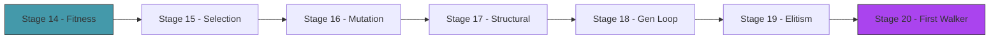

# Act 3 — The Evolution

> *Twenty random blobs. Most flop uselessly. But one — by pure luck — twitches rightward a few pixels more than the rest. That one becomes a parent. Its children inherit its shape and muscle timing, with small random changes. Some children are worse. A few are better. The better ones become parents. Repeat. Repeat. Repeat. Something starts to crawl.*



---

## Stage 14 — Fitness Evaluation

> *Difficulty: Easy — Run all creatures, rank them, visualize the distribution.*

Before breeding, we need to know who's best. This stage runs the full population through the simulation and ranks them by distance traveled.

> [!tip] What You'll Learn
> - Batch evaluation (run all creatures, collect fitness)
> - Fitness distribution — most score low, a few score high
> - Why the fitness landscape matters for evolution

### 14.1 — Evaluate the population

```rust
fn evaluate_population(creatures: &mut [Creature], gravity: Vec2) {
    for creature in creatures.iter_mut() {
        creature.evaluate(gravity);
    }
}
```

For visual mode, we run physics in real-time and evaluate continuously. For fast evolution (headless mode), we evaluate without rendering — 20 creatures × 10 seconds of physics takes under a second of real time.

### 14.2 — Display fitness distribution

```rust
// After evaluation:
let mut fitnesses: Vec<f32> = creatures.iter().map(|c| c.fitness).collect();
fitnesses.sort_by(|a, b| b.partial_cmp(a).unwrap());

draw_text(&format!("Best:  {:.0}", fitnesses[0]), 10.0, 55.0, 20.0, GREEN);
draw_text(&format!("Avg:   {:.0}", fitnesses.iter().sum::<f32>() / fitnesses.len() as f32), 10.0, 80.0, 20.0, YELLOW);
draw_text(&format!("Worst: {:.0}", fitnesses.last().unwrap_or(&0.0)), 10.0, 105.0, 20.0, RED);
```

> [!check] Checkpoint
> Evaluate 20 creatures. Display best, average, and worst fitness. Verify best > average > worst. Stage 14 complete.

---

## Stage 15 — Selection and Crossover

> *Difficulty: Medium — Breed the best, combine their genes.*

Same pattern as Piloto: fitness-proportional selection picks parents, uniform crossover combines their genomes. The difference: we're crossing over body shapes, not neural network weights.

> [!tip] What You'll Learn
> - Fitness-proportional selection (roulette wheel)
> - Uniform crossover on genome vectors
> - Why crossover works (combine good traits from different parents)

### 15.1 — Selection and crossover

Create `src/evolution.rs`:

```rust
use crate::genome::Genome;
use macroquad::rand::gen_range;

/// Select a parent index using fitness-proportional selection.
pub fn select(fitnesses: &[f32]) -> usize {
    let total: f32 = fitnesses.iter().sum();
    if total <= 0.0 {
        return gen_range(0, fitnesses.len());
    }
    let mut threshold = gen_range(0.0, total);
    for (i, &f) in fitnesses.iter().enumerate() {
        threshold -= f;
        if threshold <= 0.0 { return i; }
    }
    fitnesses.len() - 1
}

/// Uniform crossover: randomly pick each gene from parent A or B.
pub fn crossover(a: &Genome, b: &Genome) -> Genome {
    let genes = a.genes.iter().zip(b.genes.iter())
        .map(|(&ga, &gb)| if gen_range(0.0, 1.0) < 0.5 { ga } else { gb })
        .collect();
    Genome { genes }
}
```

Identical to Piloto's evolution module. The genetic algorithm doesn't care what the genes *mean* — it just operates on floats.

> [!check] Checkpoint
> Select parents from a fitness array. Cross two genomes. Verify the child has genes from both parents. Stage 15 complete.

---

## Stage 16 — Mutation

> *Difficulty: Medium — Small perturbations that create novelty.*

Mutation adds random noise to the child's genes. Node positions shift slightly, muscle frequencies drift, phases rotate. Small changes refine; large changes explore.

> [!tip] What You'll Learn
> - Parameter-specific mutation ranges
> - Mutation rate and magnitude
> - Why different gene types need different mutation scales

### 16.1 — Mutation

```rust
use crate::genome::{NUM_NODES, GENOME_SIZE};

const MUTATION_RATE: f32 = 0.15;

/// Mutate a genome in place.
pub fn mutate(genome: &mut Genome) {
    for (i, gene) in genome.genes.iter_mut().enumerate() {
        if gen_range(0.0, 1.0) < MUTATION_RATE {
            if i < NUM_NODES * 2 {
                // Node position: shift by up to ±10 pixels
                *gene += gen_range(-10.0, 10.0);
            } else if i % 2 == 0 {
                // Muscle frequency: shift by up to ±0.5 Hz
                *gene += gen_range(-0.5, 0.5);
                *gene = gene.clamp(0.2, 6.0);
            } else {
                // Muscle phase: shift by up to ±0.5 radians
                *gene += gen_range(-0.5, 0.5);
            }
        }
    }
}
```

Different gene types get different mutation scales. Moving a node 10 pixels is a small change. Shifting a frequency by 0.5 Hz is a small change. But shifting a node by 0.5 Hz would be meaningless. Context-aware mutation.

> [!check] Checkpoint
> Mutate a genome. Verify ~15% of genes changed. Verify frequencies stay in [0.2, 6.0]. Stage 16 complete.

---

## Stage 17 — Structural Mutation

> *Difficulty: Hard — Add or remove body segments. The body itself evolves.*

This is what makes Génesis different from Piloto. In Piloto, every car had the same body — only the brain changed. Here, the body *shape* can change: a mutation might add a new node and connect it with a muscle, or remove a node and its connections. The creature's morphology co-evolves with its behavior.

> [!tip] What You'll Learn
> - Variable-length genomes
> - Adding nodes: extend the genome, add connection genes
> - Removing nodes: shrink the genome, remove orphaned connections
> - Why structural mutation is rare but powerful

### 17.1 — Structural mutation

```rust
const STRUCTURAL_MUTATION_RATE: f32 = 0.05; // 5% chance per generation

/// Possibly add or remove a node from the genome.
pub fn structural_mutate(genome: &mut Genome) {
    let roll = gen_range(0.0, 1.0);

    if roll < STRUCTURAL_MUTATION_RATE {
        // Add a node
        let num_nodes = genome.genes.len() / 2 - genome.num_muscles();
        if num_nodes < 8 { // max 8 nodes
            // New node position: near an existing node
            let ref_node = gen_range(0, num_nodes);
            let ref_x = genome.genes[ref_node * 2];
            let ref_y = genome.genes[ref_node * 2 + 1];
            let new_x = ref_x + gen_range(-30.0, 30.0);
            let new_y = ref_y + gen_range(-30.0, 30.0);

            // Insert node position genes
            let insert_pos = num_nodes * 2;
            genome.genes.insert(insert_pos, new_x);
            genome.genes.insert(insert_pos + 1, new_y);

            // Add a muscle connecting the new node to the reference node
            genome.genes.push(gen_range(0.5, 4.0)); // frequency
            genome.genes.push(gen_range(0.0, std::f32::consts::TAU)); // phase
        }
    } else if roll < STRUCTURAL_MUTATION_RATE * 2.0 {
        // Remove a node (if we have more than 3)
        let num_nodes = genome.genes.len() / 2 - genome.num_muscles();
        if num_nodes > 3 {
            let remove_idx = gen_range(3, num_nodes); // never remove core triangle
            genome.genes.remove(remove_idx * 2 + 1);
            genome.genes.remove(remove_idx * 2);

            // Remove the last muscle (simplification)
            if genome.genes.len() > 6 {
                genome.genes.pop(); // phase
                genome.genes.pop(); // frequency
            }
        }
    }
}
```

Structural mutation is rare (5%) because it's disruptive — adding a node changes the entire body. Most evolution happens through parameter mutation (Stage 16). But occasionally, a structural mutation produces a body plan that parameter mutation alone could never find.

### 17.2 — Update the decoder

The decoder needs to handle variable-length genomes. Update `Creature::from_genome` to read the genome dynamically instead of assuming fixed sizes:

```rust
impl Creature {
    pub fn from_genome(genome: Genome, spawn_x: f32, spawn_y: f32) -> Self {
        let mut sim = Simulation::new();
        let genes = &genome.genes;

        // Count nodes and muscles from genome length
        // Layout: [node_positions...] [muscle_params...]
        // Each node = 2 floats, each muscle = 2 floats
        // We need at least 3 nodes (6 floats) for the core triangle
        let total_floats = genes.len();
        // Heuristic: muscles are the last pairs after node positions
        let num_muscles = ((total_floats - 6) / 4).max(0); // rough estimate
        let num_nodes = (total_floats - num_muscles * 2) / 2;

        // Decode nodes
        for i in 0..num_nodes.min(genes.len() / 2) {
            let x = spawn_x + genes[i * 2];
            let y = (spawn_y + genes[i * 2 + 1].abs() * -1.0).min(spawn_y);
            sim.points.push(Point::new(x, y));
        }

        // Build bones: connect each node to the core triangle
        let n = sim.points.len();
        if n >= 3 {
            // Core triangle
            for i in 0..3 {
                for j in (i+1)..3 {
                    let d = (sim.points[i].pos - sim.points[j].pos).length().max(10.0);
                    sim.bones.push(Bone::new(i, j, d));
                }
            }
            // Connect extra nodes to nearest core node
            for i in 3..n {
                let nearest = (0..3).min_by(|&a, &b| {
                    let da = (sim.points[a].pos - sim.points[i].pos).length();
                    let db = (sim.points[b].pos - sim.points[i].pos).length();
                    da.partial_cmp(&db).unwrap()
                }).unwrap_or(0);
                let d = (sim.points[nearest].pos - sim.points[i].pos).length().max(10.0);
                sim.bones.push(Bone::new(nearest, i, d));
                // Cross brace to center
                let d0 = (sim.points[0].pos - sim.points[i].pos).length().max(10.0);
                sim.bones.push(Bone::new(0, i, d0));
            }
        }

        // Decode muscles
        let muscle_start = num_nodes * 2;
        let mut m = 0;
        let mut gene_idx = muscle_start;
        while gene_idx + 1 < genes.len() && m < n.saturating_sub(3) {
            let node_a = (m % 3) + 0; // core node
            let node_b = 3 + m;       // limb node
            if node_b < n {
                let rest = (sim.points[node_a].pos - sim.points[node_b].pos).length().max(10.0);
                let freq = genes[gene_idx];
                let phase = genes[gene_idx + 1];
                sim.muscles.push(Muscle::new(node_a, node_b, rest, MUSCLE_AMPLITUDE, freq, phase));
            }
            gene_idx += 2;
            m += 1;
        }

        Creature { genome, sim, start_x: spawn_x, fitness: 0.0, alive: true }
    }
}
```

> [!warning] Common Mistake
> **Structural mutation breaking the genome layout.** When you add/remove genes, the decoder must handle variable lengths gracefully. Always validate: at least 3 nodes (6 floats), and muscle genes come in pairs.

> [!check] Checkpoint
> Apply structural mutation to a genome. Verify the creature decodes correctly with more or fewer nodes. Stage 17 complete.

---

## Stage 18 — The Generation Loop

> *Difficulty: Medium — The evolutionary cycle: evaluate → select → breed → repeat.*

All the pieces are in place. This stage connects them into the generation loop: run all creatures, evaluate fitness, breed the next generation, reset, repeat.

> [!tip] What You'll Learn
> - The complete evolutionary loop
> - Generation timing and reset
> - Watching fitness climb over generations
> - Fast mode (headless) vs visual mode

### 18.1 — The generation loop

```rust
let mut generation = 0;
let mut best_ever = 0.0f32;
let mut fitness_history: Vec<f32> = Vec::new();

// After SIM_DURATION seconds or all creatures stop moving:
let fitnesses: Vec<f32> = creatures.iter().map(|c| c.fitness).collect();
let best = fitnesses.iter().cloned().fold(0.0f32, f32::max);
best_ever = best_ever.max(best);
fitness_history.push(best);

// Breed next generation
let genomes: Vec<Genome> = creatures.iter().map(|c| c.genome.clone()).collect();
let mut new_genomes = Vec::new();

for _ in 0..POPULATION_SIZE {
    let a = evolution::select(&fitnesses);
    let b = evolution::select(&fitnesses);
    let mut child = evolution::crossover(&genomes[a], &genomes[b]);
    evolution::mutate(&mut child);
    evolution::structural_mutate(&mut child);
    new_genomes.push(child);
}

// Reset
creatures = new_genomes.into_iter()
    .map(|g| Creature::from_genome(g, 200.0, 400.0))
    .collect();
generation += 1;
```

### 18.2 — Fitness graph

Same pattern as Piloto — draw a line graph of best fitness per generation in the corner of the screen.

> [!check] Checkpoint
> Run for 20+ generations. Verify the fitness graph trends upward. Verify creatures visibly improve. Stage 18 complete.

---

## Stage 19 — Elitism and Diversity

> *Difficulty: Medium — Keep the best, protect the weird.*

Without elitism, the best creature can be lost to crossover and mutation. Without diversity protection, the population converges to one body plan and stops improving.

> [!tip] What You'll Learn
> - Elitism — copy the best genome unchanged
> - Diversity via genome distance (same as Piloto's speciation-lite)
> - Why both are needed

### 19.1 — Elitism

```rust
// First child = best parent, unchanged
let best_idx = fitnesses.iter()
    .enumerate()
    .max_by(|(_, a), (_, b)| a.partial_cmp(b).unwrap())
    .map(|(i, _)| i)
    .unwrap_or(0);
new_genomes.push(genomes[best_idx].clone()); // elite — no mutation

// Breed the rest
for _ in 1..POPULATION_SIZE {
    // ... select, crossover, mutate ...
}
```

### 19.2 — Diversity bonus

Add a small fitness bonus for creatures with unusual body shapes (different number of nodes than the population average). This prevents the population from converging to a single body plan.

> [!check] Checkpoint
> Verify best fitness never decreases between generations (elitism working). Verify the population maintains diverse body shapes. Stage 19 complete.

---

## Stage 20 — The First Walker

> *Difficulty: Hard — Tune until a creature reliably moves across the screen.*

This is the breakthrough stage. You have all the pieces — now tune until something walks. Adjust mutation rates, population size, simulation duration, and body constraints until a creature discovers locomotion.

> [!tip] What You'll Learn
> - Hyperparameter tuning for evolutionary AI
> - Diagnosing stagnation
> - The moment of emergence — when random twitching becomes purposeful movement
> - Why this is genuinely exciting every time

### Tuning guide

| Symptom | Fix |
|---------|-----|
| All creatures score 0 | Increase simulation time, reduce gravity, widen ground friction |
| Fitness plateaus early | Increase mutation rate or structural mutation rate |
| Creatures flip and flail | Add a penalty for being upside down (center of mass below ground contact) |
| One body plan dominates | Increase diversity bonus or structural mutation rate |
| Creatures vibrate in place | Muscle amplitude too high — reduce it |

### The moment

Run it. Watch the generations tick by. At some point — maybe generation 30, maybe generation 100 — a creature will move purposefully across the screen. Not flopping, not vibrating — *moving*. Its muscles will fire in a coordinated pattern that pushes it forward.

That pattern wasn't programmed. It was discovered by evolution from random noise. Take a screenshot.

> [!check] Checkpoint
> A creature moves reliably across the screen. The fitness graph shows clear improvement. Stage 20 complete.

---

## Act 3 Complete — The Evolution

You built a genetic algorithm that evolves both body shape and muscle timing:

| Component | What it does |
|-----------|-------------|
| Fitness evaluation | Run 10 seconds, measure horizontal distance |
| Selection | Fitness-proportional (roulette wheel) |
| Crossover | Uniform on genome vectors |
| Parameter mutation | Perturb positions, frequencies, phases |
| Structural mutation | Add/remove body segments |
| Elitism | Best genome preserved unchanged |
| Diversity | Bonus for unusual body plans |

**Next up — Act 4: The Ecosystem.** Beautiful rendering, replay mode, different terrains, and the hall of fame.
