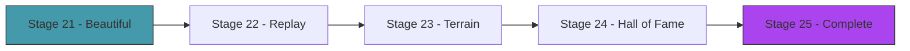

# Act 4 — The Ecosystem

> *The creatures can walk. Now make the world worth walking through. Hills to climb, obstacles to navigate, and a hall of fame that preserves the best creatures from every generation. This act turns a simulation into an experience.*



---

## Stage 21 — Beautiful Creatures

> *Difficulty: Medium — Colored segments, contraction glow, motion trails.*

The default rendering (circles and lines) is functional but ugly. This stage makes creatures beautiful: body segments are colored by mass, muscles glow when contracting, and a faint motion trail shows the path traveled.

> [!tip] What You'll Learn
> - Color mapping based on data (mass, contraction, fitness)
> - Motion trails with fading alpha
> - Drawing filled polygons between nodes for a "body" look
> - Why visual polish makes evolution more engaging to watch

### 21.1 — Enhanced creature rendering

```rust
impl Creature {
    pub fn draw_pretty(&self, base_color: Color, time: f32) {
        let points = &self.sim.points;

        // Motion trail: draw previous positions with fading alpha
        // (store last N center positions in a ring buffer)

        // Muscles: glow based on contraction
        for muscle in &self.sim.muscles {
            let contraction = muscle.current_length(time) - muscle.rest_length;
            let intensity = (contraction / muscle.amplitude).abs();
            let glow = (intensity * 100.0) as u8;

            let color = Color::from_rgba(
                base_color.r as u8 + glow.min(50),
                base_color.g as u8,
                base_color.b as u8 + (50 - glow.min(50)),
                220,
            );

            draw_line(
                points[muscle.a].pos.x, points[muscle.a].pos.y,
                points[muscle.b].pos.x, points[muscle.b].pos.y,
                5.0, color,
            );
        }

        // Bones: subtle
        for bone in &self.sim.bones {
            draw_line(
                points[bone.a].pos.x, points[bone.a].pos.y,
                points[bone.b].pos.x, points[bone.b].pos.y,
                2.0, Color::from_rgba(base_color.r as u8, base_color.g as u8, base_color.b as u8, 100),
            );
        }

        // Nodes: sized by mass
        for point in points {
            let radius = 4.0 + point.mass * 2.0;
            draw_circle(point.pos.x, point.pos.y, radius, base_color);
        }
    }
}
```

> [!check] Checkpoint
> Creatures render with colored muscles that glow during contraction. Nodes are sized by mass. Stage 21 complete.

---

## Stage 22 — Replay Mode

> *Difficulty: Easy — Save and replay the best creature's simulation.*

Evolution runs fast. You might miss the best creature's performance. Replay mode saves the physics state every frame and lets you replay it in slow motion, paused, or frame-by-frame.

> [!tip] What You'll Learn
> - Recording simulation state (position snapshots)
> - Playback with variable speed
> - Saving replays to JSON with serde
> - Why replay is essential for understanding evolved behavior

### 22.1 — Record and replay

```rust
#[derive(Clone, Serialize, Deserialize)]
pub struct Frame {
    pub positions: Vec<[f32; 2]>,
}

pub struct Replay {
    pub frames: Vec<Frame>,
    pub genome: Genome,
}

impl Replay {
    pub fn record_frame(&mut self, points: &[Point]) {
        self.frames.push(Frame {
            positions: points.iter().map(|p| [p.pos.x, p.pos.y]).collect(),
        });
    }

    pub fn save(&self, path: &str) {
        let json = serde_json::to_string(self).unwrap();
        std::fs::write(path, json).unwrap();
    }

    pub fn load(path: &str) -> Option<Self> {
        let json = std::fs::read_to_string(path).ok()?;
        serde_json::from_str(&json).ok()
    }
}
```

Record every frame of the best creature during evaluation. Save to `best_creature.json`. Load and replay with speed controls (Space = pause, Left/Right = step, +/- = speed).

> [!check] Checkpoint
> Record the best creature's run. Replay it in slow motion. Save and reload the replay. Stage 22 complete.

---

## Stage 23 — Different Terrains

> *Difficulty: Medium — Hills, slopes, and obstacles.*

Flat ground is easy. Hills test whether the creature can climb. Slopes test balance. Obstacles test adaptability. This stage adds terrain variety to see how evolved creatures generalize.

> [!tip] What You'll Learn
> - Terrain as a height function
> - Ground collision against non-flat surfaces
> - How terrain affects evolved strategies
> - Whether flat-ground creatures can handle hills (spoiler: usually not)

### 23.1 — Terrain types

```rust
pub enum Terrain {
    Flat,
    Hills { amplitude: f32, frequency: f32 },
    Slope { angle: f32 },
    Steps { height: f32, width: f32 },
}

impl Terrain {
    /// Ground height at a given x position.
    pub fn height_at(&self, x: f32) -> f32 {
        match self {
            Terrain::Flat => 500.0,
            Terrain::Hills { amplitude, frequency } => {
                500.0 - amplitude * (x * frequency * 0.01).sin()
            }
            Terrain::Slope { angle } => {
                500.0 - x * angle.tan() * 0.1
            }
            Terrain::Steps { height, width } => {
                let step = (x / width).floor();
                500.0 - step * height
            }
        }
    }
}
```

Update `apply_ground` to use `terrain.height_at(point.pos.x)` instead of a constant `GROUND_Y`.

### 23.2 — Test generalization

Train on flat ground, then switch to hills. The creature will likely fail — it learned flat-ground locomotion. Retrain on hills and watch a different strategy emerge (lower center of gravity, wider stance).

> [!note] Train on variety for generalization
> To evolve creatures that handle any terrain, evaluate each creature on multiple terrains and average the fitness. This is harder but produces more robust locomotion.

> [!check] Checkpoint
> Switch between flat, hills, and steps. Verify creatures trained on flat ground struggle on hills. Retrain on hills and verify a different body plan emerges. Stage 23 complete.

---

## Stage 24 — Hall of Fame

> *Difficulty: Medium — Preserve the best creature from every generation.*

The hall of fame saves the best genome from each generation. You can browse them, replay any, and see how body plans evolved over time — from random blobs to coordinated walkers.

> [!tip] What You'll Learn
> - Persisting evolutionary history
> - Browsing saved creatures
> - Visualizing the evolution of body plans over time

### 24.1 — Save best per generation

```rust
struct HallOfFame {
    entries: Vec<(usize, Genome, f32)>, // (generation, genome, fitness)
}

impl HallOfFame {
    fn add(&mut self, generation: usize, genome: Genome, fitness: f32) {
        self.entries.push((generation, genome, fitness));
    }

    fn save(&self, path: &str) {
        let json = serde_json::to_string_pretty(&self.entries).unwrap();
        std::fs::write(path, json).unwrap();
    }
}
```

### 24.2 — Browse mode

Press `H` to enter the hall of fame. Arrow keys browse generations. Enter replays the selected creature. You can watch the entire evolutionary history — generation 1's random blob, generation 20's first twitcher, generation 50's first walker, generation 100's optimized runner.

> [!check] Checkpoint
> Run 50+ generations. Browse the hall of fame. Verify you can see the progression from random to coordinated. Stage 24 complete.

---

## Stage 25 — The Complete Génesis

> *Difficulty: Medium — Everything together.*

The final stage: fitness graph, generation counter, terrain selector, speed controls, hall of fame, replay mode, beautiful rendering. The complete Génesis.

> [!tip] What You'll Learn
> - Mode switching (evolution / replay / hall of fame)
> - The complete evolutionary simulation pipeline
> - What you've built and what it means

### 25.1 — Controls

| Key | Action |
|---|---|
| Space | Pause/resume evolution |
| F | Fast mode (headless, 10x speed) |
| V | Visual mode (watch creatures) |
| T | Cycle terrain (flat → hills → steps) |
| H | Hall of fame browser |
| R | Replay best creature |
| +/- | Zoom |
| Q | Quit |

### 25.2 — The HUD

```
Génesis — Generation 47
Alive: 15/20  Best: 342px  Best Ever: 512px
Terrain: Hills  Speed: 1x

[Space] Pause  [F] Fast  [T] Terrain  [H] Hall of Fame
```

> [!check] Checkpoint
> All modes work. Evolution runs, replay plays, hall of fame browses, terrain switches. Stage 25 complete.

---

## Act 4 Complete — The Ecosystem

| Feature | What it does |
|---------|-------------|
| Beautiful rendering | Colored muscles, mass-sized nodes, contraction glow |
| Replay mode | Record, save, load, playback with speed controls |
| Terrain variety | Flat, hills, slopes, steps |
| Hall of fame | Best creature per generation, browsable |
| Complete app | Mode switching, HUD, keyboard controls |

---

## Course Complete — Génesis

You evolved virtual creatures from random noise. Blobs became walkers. Twitches became gaits. Body shapes and muscle timing co-evolved until something emerged that looks — unmistakably — like it's *trying* to move.

| Component | What it does |
|-----------|-------------|
| Verlet physics | Position-based integration, constraint solving |
| Bones | Rigid distance constraints |
| Muscles | Oscillating constraints (sine wave) |
| Genome | Flat float vector encoding body + muscles |
| Decoder | Genome → nodes + bones + muscles |
| Genetic algorithm | Selection, crossover, mutation, structural mutation |
| Fitness | Horizontal distance in 10 seconds |
| Terrain | Flat, hills, slopes, steps |
| Visualization | Colored creatures, fitness graph, replay, hall of fame |

| Rust Concept | Where You Used It |
|-------------|-------------------|
| Structs | `Point`, `Bone`, `Muscle`, `Simulation`, `Creature`, `Genome` |
| `Vec<f32>` | Genome representation, physics state |
| Index-based references | Bones/muscles reference points by index |
| Iterative algorithms | Constraint solving (6 passes per frame) |
| Closures | Fitness ranking, selection, color mapping |
| Serde | Genome, replay, hall of fame serialization |
| macroquad | Rendering, input, game loop |

The creatures you evolved don't know they're in a simulation. They don't know they're being judged. They just move — because the ones that didn't move didn't survive. That's evolution. And you built it from nothing.
