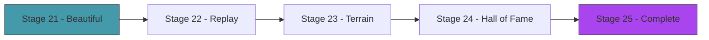

# Act 4 — The Ecosystem

> *The creatures can walk. Now make the world worth walking through. Hills to climb, obstacles to navigate, and a hall of fame that preserves the best creatures from every generation. This act turns a simulation into an experience.*



---

## Stage 21 — Beautiful Creatures

> *Difficulty: Medium — Colored segments, contraction glow, motion trails.*

*~50 min*

The default rendering (circles and lines) is functional but ugly. This stage makes creatures beautiful: body segments are colored by mass, muscles glow when contracting, and a faint motion trail shows the path traveled.

> [!tip] What You'll Learn
> - Color mapping based on data (mass, contraction, fitness)
> - Motion trails with fading alpha
> - Drawing filled polygons between nodes for a "body" look
> - Why visual polish makes evolution more engaging to watch

### 21.1 — Try it yourself: enhanced creature rendering

Implement `draw_pretty` on `Creature` that:
1. Draws muscles with color intensity based on contraction (brighter = more contracted)
2. Draws bones as subtle semi-transparent lines
3. Draws nodes sized by mass

The contraction ratio is: `(muscle.current_length(time) - muscle.rest_length) / muscle.amplitude`

<details>
<summary>Solution</summary>

```rust
impl Creature {
    pub fn draw_pretty(&self, base_color: Color, time: f32) {
        let points = &self.sim.points;

        // Muscles: glow based on contraction
        for muscle in &self.sim.muscles {
            let contraction = muscle.current_length(time) - muscle.rest_length;
            let intensity = (contraction / muscle.amplitude.max(0.01)).abs();
            let glow = (intensity * 100.0).min(50.0) as u8;

            let color = Color::from_rgba(
                (base_color.r * 255.0) as u8 + glow,
                (base_color.g * 255.0) as u8,
                (base_color.b * 255.0) as u8 + (50 - glow),
                220,
            );

            draw_line(
                points[muscle.a].pos.x, points[muscle.a].pos.y,
                points[muscle.b].pos.x, points[muscle.b].pos.y,
                5.0, color,
            );
        }

        // Bones: subtle
        for bone in &self.sim.bones {
            draw_line(
                points[bone.a].pos.x, points[bone.a].pos.y,
                points[bone.b].pos.x, points[bone.b].pos.y,
                2.0, Color::new(base_color.r, base_color.g, base_color.b, 0.4),
            );
        }

        // Nodes: sized by mass
        for point in points {
            let radius = 4.0 + point.mass * 2.0;
            draw_circle(point.pos.x, point.pos.y, radius, base_color);
        }
    }
}
```

</details>

### 21.2 — Extend it

Add a motion trail: store the last 30 center-of-mass positions in a `VecDeque<Vec2>` and draw them as fading dots (decreasing alpha). This shows the creature's path and makes movement patterns visible.

> [!check] Checkpoint
> Creatures render with colored muscles that glow during contraction. Nodes are sized by mass. Stage 21 complete.

---

## Stage 22 — Replay Mode

> *Difficulty: Easy — Save and replay the best creature's simulation.*

*~45 min*

Evolution runs fast. You might miss the best creature's performance. Replay mode saves the physics state every frame and lets you replay it in slow motion, paused, or frame-by-frame.

> [!tip] What You'll Learn
> - Recording simulation state (position snapshots)
> - Playback with variable speed
> - Saving replays to JSON with serde
> - Error handling for file I/O with `Result`

### Concept: Serde — Serialization in Rust

To save replays to disk, we need to convert Rust structs to JSON and back. `serde` is Rust's serialization framework — add `#[derive(Serialize, Deserialize)]` to a struct and it can be converted to/from JSON, TOML, YAML, or any other format.

Add to `Cargo.toml`:

```toml
serde = { version = "1", features = ["derive"] }
serde_json = "1"
```

**Python comparison:** `serde` is like `json.dumps()`/`json.loads()`, but it works with typed structs instead of dictionaries. The `#[derive]` macro generates the serialization code at compile time — no runtime reflection.

### 22.1 — Record and replay structs

```rust
use serde::{Serialize, Deserialize};
use crate::genome::Genome;
use crate::physics::Point;

#[derive(Clone, Serialize, Deserialize)]
pub struct Frame {
    pub positions: Vec<[f32; 2]>,
}

#[derive(Serialize, Deserialize)]
pub struct Replay {
    pub frames: Vec<Frame>,
    pub genome: Genome,
}
```

You'll also need to add `#[derive(Serialize, Deserialize)]` to the `Genome` struct in `genome.rs` (alongside the existing `Debug, Clone`).

### 22.2 — Try it yourself: implement record, save, and load

```rust
impl Replay {
    pub fn new(genome: Genome) -> Self {
        Replay { frames: Vec::new(), genome }
    }

    /// Record the current positions of all points.
    pub fn record_frame(&mut self, points: &[Point]) {
        // YOUR CODE: push a Frame with each point's [x, y]
    }

    /// Save to a JSON file. Returns an error if writing fails.
    pub fn save(&self, path: &str) -> Result<(), String> {
        // YOUR CODE: serialize to JSON, write to file
        // Use map_err to convert io::Error to String
    }

    /// Load from a JSON file.
    pub fn load(path: &str) -> Result<Self, String> {
        // YOUR CODE: read file, deserialize from JSON
    }
}
```

<details>
<summary>Solution</summary>

```rust
impl Replay {
    pub fn new(genome: Genome) -> Self {
        Replay { frames: Vec::new(), genome }
    }

    pub fn record_frame(&mut self, points: &[Point]) {
        self.frames.push(Frame {
            positions: points.iter().map(|p| [p.pos.x, p.pos.y]).collect(),
        });
    }

    pub fn save(&self, path: &str) -> Result<(), String> {
        let json = serde_json::to_string(self)
            .map_err(|e| format!("serialize error: {e}"))?;
        std::fs::write(path, json)
            .map_err(|e| format!("write error: {e}"))?;
        Ok(())
    }

    pub fn load(path: &str) -> Result<Self, String> {
        let json = std::fs::read_to_string(path)
            .map_err(|e| format!("read error: {e}"))?;
        serde_json::from_str(&json)
            .map_err(|e| format!("parse error: {e}"))
    }
}
```

</details>

> [!note] `.map_err(|e| format!(...))` — converting error types
> `std::fs::write` returns `Result<(), io::Error>`, but our function returns `Result<(), String>`. The `?` operator can't convert between them automatically. `.map_err()` transforms the error type — here, converting `io::Error` to a human-readable `String`.
>
> **Python comparison:** In Python, you'd catch `IOError` and re-raise as `ValueError`. Rust's `.map_err()` does the same thing inline.

### 22.3 — Test save and load

```rust
#[cfg(test)]
mod tests {
    use super::*;
    use crate::genome::Genome;

    #[test]
    fn save_and_load_roundtrip(tmp_path: std::path::PathBuf) {
        // Note: in practice, use the tmp_path fixture or a temp directory
        let genome = Genome::random();
        let mut replay = Replay::new(genome.clone());
        replay.frames.push(Frame { positions: vec![[1.0, 2.0], [3.0, 4.0]] });

        let path = "/tmp/test_replay.json";
        replay.save(path).unwrap();
        let loaded = Replay::load(path).unwrap();

        assert_eq!(loaded.frames.len(), 1);
        assert_eq!(loaded.frames[0].positions.len(), 2);
        std::fs::remove_file(path).ok(); // cleanup
    }
}
```

### 22.4 — Playback controls

Record every frame of the best creature during evaluation. Save to `best_creature.json`. Load and replay with speed controls:

| Key | Action |
|---|---|
| Space | Pause/resume |
| Left/Right | Step frame by frame |
| +/- | Speed up/slow down |

> [!check] Checkpoint
> Record the best creature's run. Replay it in slow motion. Save and reload the replay. Stage 22 complete.

---

## Stage 23 — Different Terrains

> *Difficulty: Medium — Hills, slopes, and obstacles.*

*~60 min*

Flat ground is easy. Hills test whether the creature can climb. Slopes test balance. Obstacles test adaptability. This stage adds terrain variety to see how evolved creatures generalize.

> [!tip] What You'll Learn
> - Terrain as a height function
> - Ground collision against non-flat surfaces
> - How terrain affects evolved strategies
> - Rust enums with data (algebraic data types)

### Concept: Rust Enums — More Than Just Constants

In Python, you'd represent terrain types as strings or an IntEnum. Rust enums can carry data:

```python
# Python
terrain = "hills"
amplitude = 30.0
frequency = 0.5

# Rust — the data lives inside the variant
terrain = Terrain::Hills { amplitude: 30.0, frequency: 0.5 }
```

Each variant can have different fields. `match` ensures you handle every variant — the compiler won't let you forget one.

### 23.1 — Try it yourself: implement terrain types

Create a `Terrain` enum with four variants: `Flat`, `Hills { amplitude, frequency }`, `Slope { angle }`, and `Steps { height, width }`. Implement `height_at(x)` that returns the ground height at any x position.

```rust
pub enum Terrain {
    // YOUR CODE: define the four variants
}

impl Terrain {
    pub fn height_at(&self, x: f32) -> f32 {
        // YOUR CODE: match on self, compute height for each variant
        // Flat: always 500.0
        // Hills: 500.0 - amplitude * sin(x * frequency * 0.01)
        // Slope: 500.0 - x * tan(angle) * 0.1
        // Steps: 500.0 - floor(x / width) * height
    }
}
```

<details>
<summary>Solution</summary>

```rust
pub enum Terrain {
    Flat,
    Hills { amplitude: f32, frequency: f32 },
    Slope { angle: f32 },
    Steps { height: f32, width: f32 },
}

impl Terrain {
    pub fn height_at(&self, x: f32) -> f32 {
        match self {
            Terrain::Flat => 500.0,
            Terrain::Hills { amplitude, frequency } => {
                500.0 - amplitude * (x * frequency * 0.01).sin()
            }
            Terrain::Slope { angle } => {
                500.0 - x * angle.tan() * 0.1
            }
            Terrain::Steps { height, width } => {
                let step = (x / width).floor();
                500.0 - step * height
            }
        }
    }
}
```

</details>

> [!warning] Common Mistake — Non-exhaustive `match`
> If you add a new terrain variant later and forget to handle it in `match`:
>
> ```
> error[E0004]: non-exhaustive patterns: `Terrain::Steps { .. }` not covered
>  --> src/terrain.rs:15:15
>   |
> 15|         match self {
>   |               ^^^^ pattern `Terrain::Steps { .. }` not covered
> ```
>
> The compiler forces you to handle every variant. This is one of Rust's strongest safety features — you can't forget a case.

### 23.2 — Update ground collision

Update `Point::apply_ground` to accept a terrain reference instead of using the constant `GROUND_Y`:

```rust
pub fn apply_ground_terrain(&mut self, terrain: &Terrain) {
    let ground = terrain.height_at(self.pos.x);
    if self.pos.y > ground {
        self.pos.y = ground;
        let vel_y = self.pos.y - self.old_pos.y;
        self.old_pos.y = self.pos.y + vel_y * BOUNCE;
        let vel_x = self.pos.x - self.old_pos.x;
        self.old_pos.x = self.pos.x - vel_x * FRICTION;
    }
}
```

### 23.3 — Test generalization

Train on flat ground, then switch to hills. The creature will likely fail — it learned flat-ground locomotion. Retrain on hills and watch a different strategy emerge (lower center of gravity, wider stance).

> [!note] Train on variety for generalization
> To evolve creatures that handle any terrain, evaluate each creature on multiple terrains and average the fitness. This is harder but produces more robust locomotion.

### 23.4 — Test terrain math

```rust
#[cfg(test)]
mod tests {
    use super::*;

    #[test]
    fn flat_terrain_is_constant() {
        let t = Terrain::Flat;
        assert_eq!(t.height_at(0.0), 500.0);
        assert_eq!(t.height_at(1000.0), 500.0);
    }

    #[test]
    fn hills_oscillate() {
        let t = Terrain::Hills { amplitude: 50.0, frequency: 1.0 };
        let h1 = t.height_at(0.0);
        let h2 = t.height_at(157.0); // roughly π * 100 / 2
        assert!((h1 - h2).abs() > 10.0, "hills should vary in height");
    }

    #[test]
    fn steps_increase() {
        let t = Terrain::Steps { height: 20.0, width: 100.0 };
        let h0 = t.height_at(50.0);   // step 0
        let h1 = t.height_at(150.0);  // step 1
        assert!(h1 < h0, "steps should go up (lower y = higher ground)");
    }
}
```

### 23.5 — Extend it

Add a key (`T`) that cycles through terrains during evolution. Watch how the best creature from flat ground performs on hills — and vice versa.

> [!check] Checkpoint
> Switch between flat, hills, and steps. Verify creatures trained on flat ground struggle on hills. Terrain tests pass. Stage 23 complete.

---

## Stage 24 — Hall of Fame

> *Difficulty: Medium — Preserve the best creature from every generation.*

*~50 min*

The hall of fame saves the best genome from each generation. You can browse them, replay any, and see how body plans evolved over time — from random blobs to coordinated walkers.

> [!tip] What You'll Learn
> - Persisting evolutionary history
> - Browsing saved creatures
> - Visualizing the evolution of body plans over time
> - Serde for structured data persistence

### 24.1 — Try it yourself: implement the Hall of Fame

Build a `HallOfFame` struct that:
1. Stores entries as `(generation, Genome, fitness)` tuples
2. Has an `add` method to record the best of each generation
3. Can save to and load from a JSON file (reuse the pattern from Stage 22)

```rust
#[derive(Serialize, Deserialize)]
pub struct HallOfFame {
    entries: Vec<(usize, Genome, f32)>,
}

impl HallOfFame {
    pub fn new() -> Self { /* YOUR CODE */ }
    pub fn add(&mut self, generation: usize, genome: Genome, fitness: f32) { /* YOUR CODE */ }
    pub fn save(&self, path: &str) -> Result<(), String> { /* YOUR CODE */ }
    pub fn load(path: &str) -> Result<Self, String> { /* YOUR CODE */ }
    pub fn len(&self) -> usize { self.entries.len() }
}
```

<details>
<summary>Solution</summary>

```rust
#[derive(Serialize, Deserialize)]
pub struct HallOfFame {
    entries: Vec<(usize, Genome, f32)>,
}

impl HallOfFame {
    pub fn new() -> Self {
        HallOfFame { entries: Vec::new() }
    }

    pub fn add(&mut self, generation: usize, genome: Genome, fitness: f32) {
        self.entries.push((generation, genome, fitness));
    }

    pub fn save(&self, path: &str) -> Result<(), String> {
        let json = serde_json::to_string_pretty(self)
            .map_err(|e| format!("serialize error: {e}"))?;
        std::fs::write(path, json)
            .map_err(|e| format!("write error: {e}"))?;
        Ok(())
    }

    pub fn load(path: &str) -> Result<Self, String> {
        let json = std::fs::read_to_string(path)
            .map_err(|e| format!("read error: {e}"))?;
        serde_json::from_str(&json)
            .map_err(|e| format!("parse error: {e}"))
    }

    pub fn len(&self) -> usize { self.entries.len() }
}
```

</details>

### 24.2 — Browse mode

Press `H` to enter the hall of fame. Arrow keys browse generations. Enter replays the selected creature. You can watch the entire evolutionary history — generation 1's random blob, generation 20's first twitcher, generation 50's first walker, generation 100's optimized runner.

```rust
// In the hall of fame view:
let (gen, genome, fitness) = &hall.entries[selected_index];
draw_text(&format!("Gen {} — Fitness: {:.0}", gen, fitness), 10.0, 30.0, 24.0, WHITE);

// Decode and display the creature
if let Ok(creature) = Creature::from_genome(genome.clone(), 400.0, 400.0) {
    creature.draw_pretty(GREEN, 0.0);
}
```

> [!note] `if let Ok(creature) = ...` — pattern matching on Result
> `if let` is a concise way to handle only the success case. If decoding fails (corrupted genome from an old save), we just skip it instead of crashing.
>
> **Python comparison:** `if (creature := decode(genome)) is not None:` — the walrus operator pattern.

### 24.3 — Extend it

Add a "compare" mode: show two creatures side by side — the current generation's best and the hall of fame entry from 20 generations ago. This makes the improvement visible.

> [!check] Checkpoint
> Run 50+ generations. Browse the hall of fame. Verify you can see the progression from random to coordinated. Stage 24 complete.

---

## Stage 25 — The Complete Génesis

> *Difficulty: Medium — Everything together.*

*~50 min*

The final stage: fitness graph, generation counter, terrain selector, speed controls, hall of fame, replay mode, beautiful rendering. The complete Génesis.

> [!tip] What You'll Learn
> - Mode switching (evolution / replay / hall of fame)
> - The complete evolutionary simulation pipeline
> - What you've built and what it means

### 25.1 — Try it yourself: implement mode switching

Create an enum for the application mode and a main loop that dispatches to the right update/draw logic:

```rust
enum Mode {
    Evolving,
    Replay { frame: usize, speed: f32, paused: bool },
    HallOfFame { selected: usize },
}
```

Handle keyboard input to switch between modes:

| Key | Action |
|---|---|
| Space | Pause/resume evolution |
| F | Fast mode (headless, 10x speed) |
| V | Visual mode (watch creatures) |
| T | Cycle terrain (flat → hills → steps) |
| H | Hall of fame browser |
| R | Replay best creature |
| +/- | Zoom |
| Q | Quit |

<details>
<summary>Solution sketch</summary>

```rust
let mut mode = Mode::Evolving;

loop {
    match &mut mode {
        Mode::Evolving => {
            // ... existing evolution loop ...
            if is_key_pressed(KeyCode::H) { mode = Mode::HallOfFame { selected: 0 }; }
            if is_key_pressed(KeyCode::R) {
                mode = Mode::Replay { frame: 0, speed: 1.0, paused: false };
            }
        }
        Mode::Replay { frame, speed, paused } => {
            if !*paused { *frame += (*speed as usize).max(1); }
            if is_key_pressed(KeyCode::Space) { *paused = !*paused; }
            if is_key_pressed(KeyCode::Escape) { mode = Mode::Evolving; }
            // ... draw replay frame ...
        }
        Mode::HallOfFame { selected } => {
            if is_key_pressed(KeyCode::Right) { *selected += 1; }
            if is_key_pressed(KeyCode::Left) && *selected > 0 { *selected -= 1; }
            if is_key_pressed(KeyCode::Escape) { mode = Mode::Evolving; }
            // ... draw selected creature ...
        }
    }
    next_frame().await;
}
```

</details>

### 25.2 — The HUD

```
Génesis — Generation 47
Alive: 15/20  Best: 342px  Best Ever: 512px
Terrain: Hills  Speed: 1x

[Space] Pause  [F] Fast  [T] Terrain  [H] Hall of Fame
```

### 25.3 — Extend it

Add one feature of your own choosing:
- **Creature naming** — auto-generate names for hall of fame entries (e.g., "Crawler-47", "Hopper-103")
- **Export to GIF** — save a replay as a sequence of frames (use macroquad's screenshot feature)
- **Fitness breakdown** — show distance, speed, and stability as separate metrics
- **Sound** — play a tone when a new best fitness is achieved

> [!check] Checkpoint
> All modes work. Evolution runs, replay plays, hall of fame browses, terrain switches. Stage 25 complete.

---

## Act 4 Complete — The Ecosystem

| Feature | What it does |
|---------|-------------|
| Beautiful rendering | Colored muscles, mass-sized nodes, contraction glow |
| Replay mode | Record, save, load, playback with speed controls |
| Terrain variety | Flat, hills, slopes, steps |
| Hall of fame | Best creature per generation, browsable |
| Complete app | Mode switching, HUD, keyboard controls |

| Rust Concept | Where You Used It |
|-------------|-------------------|
| `#[derive(Serialize, Deserialize)]` | Genome, Replay, HallOfFame — JSON persistence |
| `serde_json` | Save/load replays and hall of fame |
| `.map_err()` | Converting `io::Error` to `String` for `Result` |
| `if let Ok(x) = ...` | Graceful handling of decode failures |
| Enums with data | `Terrain`, `Mode` — variants carry different fields |
| `match` exhaustiveness | Compiler ensures all terrain/mode variants are handled |
| `Result<(), String>` | File I/O error handling throughout |

---

## Course Complete — Génesis

You evolved virtual creatures from random noise. Blobs became walkers. Twitches became gaits. Body shapes and muscle timing co-evolved until something emerged that looks — unmistakably — like it's *trying* to move.

| Component | What it does |
|-----------|-------------|
| Verlet physics | Position-based integration, constraint solving |
| Bones | Rigid distance constraints |
| Muscles | Oscillating constraints (sine wave) |
| Genome | Flat float vector encoding body + muscles |
| Decoder | Genome → nodes + bones + muscles (with `Result` error handling) |
| Genetic algorithm | Selection, crossover, mutation, structural mutation |
| Fitness | Horizontal distance in 10 seconds |
| Terrain | Flat, hills, slopes, steps |
| Visualization | Colored creatures, fitness graph, replay, hall of fame |

| Rust Concept | Where You First Used It |
|-------------|------------------------|
| Structs and `impl` | Act 1 — `Point`, `Bone`, `Muscle` |
| `pub` and `mod` | Act 1 — module system for `physics.rs` |
| `&mut self` / `&self` | Act 1 — mutable vs immutable borrowing |
| Index-based references | Act 1 — borrow checker workaround for graphs |
| `for x in &vec` vs `for x in vec` | Act 1 — borrowing vs consuming |
| `const` | Act 1 — compile-time constants |
| `#[test]` and `cargo test` | Act 1 — muscle oscillation tests |
| `#[derive(Debug, Clone)]` | Act 2 — automatic trait implementations |
| `Result<T, E>` and `?` | Act 2 — error handling for genome validation |
| `filter_map` | Act 2 — spawning creatures, skipping failures |
| `partial_cmp` | Act 2 — sorting floats |
| `as f32` | Act 2 — explicit numeric conversion |
| `Vec::insert` / `Vec::remove` | Act 3 — structural mutation |
| `iter_mut()` and `*gene` | Act 3 — mutating through references |
| Iterator chains | Act 3 — `enumerate().max_by().map()` |
| `.clamp()` | Act 3 — keeping values in valid ranges |
| `#[derive(Serialize, Deserialize)]` | Act 4 — JSON persistence |
| `.map_err()` | Act 4 — error type conversion |
| Enums with data | Act 4 — `Terrain`, `Mode` |
| `match` exhaustiveness | Act 4 — compiler-enforced variant handling |
| `if let` | Act 4 — concise pattern matching |

**Error handling progression:**
- Act 1: no error handling needed (physics can't fail)
- Act 2: `Result` for genome validation, `?` for propagation, `.unwrap()` in tests only
- Act 3: error handling in structural mutation (bounds checking)
- Act 4: `Result` for all file I/O, `.map_err()` for error conversion, `if let` for graceful degradation

The creatures you evolved don't know they're in a simulation. They don't know they're being judged. They just move — because the ones that didn't move didn't survive. That's evolution. And you built it from nothing.
