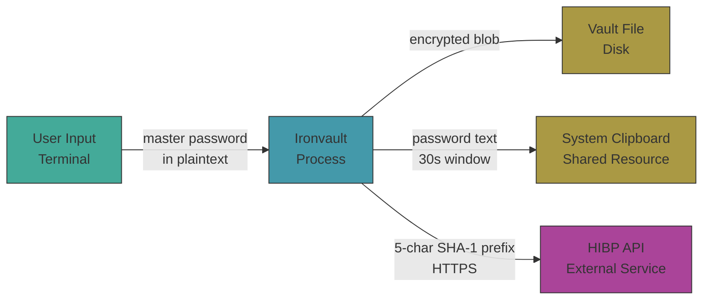

# Ironvault Reference Guide

> Desk reference for the Ironvault course. Covers cryptographic primitives, protocol internals, threat modeling, and AWS security parallels. Not a tutorial — use alongside the course modules.

---

## 1. Cryptography Glossary

### Symmetric vs Asymmetric Encryption

| Property | Symmetric | Asymmetric |
|---|---|---|
| Keys | One shared secret key | Public/private key pair |
| Speed | Fast (hardware-accelerated) | 100–1000× slower |
| Use case | Bulk data encryption | Key exchange, signatures |
| Examples | AES-256-GCM, ChaCha20 | RSA, Ed25519, X25519 |
| Ironvault uses | ✅ AES-256-GCM for vault encryption | ❌ Not needed (no key exchange) |

**Ironvault is symmetric-only.** There's no second party to exchange keys with — the user's password derives the single encryption key.

### Block Ciphers vs Stream Ciphers

- **Block cipher**: encrypts fixed-size blocks (AES = 128-bit blocks). Needs a *mode of operation* to handle arbitrary-length data.
- **Stream cipher**: generates a pseudorandom *keystream* and XORs it with plaintext byte-by-byte. Naturally handles any length.
- **AES-GCM is both**: AES (block cipher) in CTR mode generates a keystream, effectively becoming a stream cipher. No padding needed.

```
Block cipher alone:  plaintext ──[AES]──▶ ciphertext  (exactly 128 bits)
AES-CTR (stream):    counter ──[AES]──▶ keystream ──⊕ plaintext──▶ ciphertext
```

### AEAD (Authenticated Encryption with Associated Data)

AEAD combines encryption (confidentiality) and authentication (integrity + authenticity) in a single operation. It also authenticates unencrypted *associated data* (e.g., a file header).

- **Without AEAD** (e.g., AES-CBC): an attacker can flip ciphertext bits and produce valid-looking but corrupted plaintext. You'd need a separate MAC.
- **With AEAD** (e.g., AES-GCM): any tampering causes decryption to fail. One API call, one key, no composition mistakes.

```rust
// Ironvault: aes-gcm crate
let cipher = Aes256Gcm::new(&key);
let ciphertext = cipher.encrypt(&nonce, payload)?;  // encrypts + authenticates
let plaintext = cipher.decrypt(&nonce, ciphertext)?; // decrypts + verifies tag
```

**Ironvault's vault file uses AES-256-GCM.** The plaintext header (magic bytes, version, Argon2 params, salt, nonce) could be bound as associated data for additional tamper detection.

### MAC (Message Authentication Code)

A MAC is a short tag computed from a message + secret key. Anyone with the key can verify the tag; anyone without it cannot forge one.

- **HMAC**: MAC built from a hash function (e.g., HMAC-SHA256). Widely used, well-understood.
- **GMAC**: MAC built from Galois field multiplication (used inside GCM). Faster but requires unique nonces.
- **Poly1305**: One-time MAC used with ChaCha20.

In AES-GCM, the 128-bit authentication tag *is* the MAC — computed via GHASH (polynomial evaluation over GF(2¹²⁸)).

### Nonce, Salt, IV — Differences

| Term | Purpose | Must be unique? | Must be secret? | Typical size |
|---|---|---|---|---|
| **Nonce** | Prevent keystream reuse in encryption | Yes, per key | No | 12 bytes (96 bits) |
| **Salt** | Prevent rainbow tables in hashing/KDF | Yes, per password | No | 16 bytes (128 bits) |
| **IV** | Generic term for initialization vector | Depends on mode | Usually no | Varies |

- **Nonce** = "number used once." In AES-GCM, reusing a nonce with the same key is catastrophic (see §2).
- **Salt** = random value mixed into a KDF. Ironvault stores a 16-byte salt in the vault header.
- **IV** = older/generic term. In AES-CBC, the IV must be unpredictable. In AES-GCM, "nonce" is preferred.

**Ironvault uses both:** a 16-byte salt for Argon2id and a 12-byte nonce for AES-GCM, both from `OsRng`.

### Key Derivation Function (KDF)

A KDF transforms a password (low entropy, variable length) into a cryptographic key (high entropy, fixed length).

```
password ("correct horse battery staple")
    │
    ▼
┌──────────┐
│ Argon2id │ ← salt (16 bytes from OsRng)
│ m=64MiB  │ ← time cost = 3 iterations
│ t=3, p=4 │ ← parallelism = 4 lanes
└──────────┘
    │
    ▼
256-bit key (32 bytes) → used as AES-256-GCM key
```

Why not just `SHA-256(password)`? SHA-256 is *fast* — an attacker with a GPU can try ~180 billion hashes/second. Argon2id is deliberately slow and memory-hard: ~1,000 hashes/second on the same GPU.

### Entropy — Bits of Entropy

Entropy measures the unpredictability of a value. `n` bits of entropy = `2ⁿ` equally likely possibilities.

| Source | Entropy |
|---|---|
| Random 128-bit value | 128 bits |
| Random 8-char alphanumeric password (62 chars) | `8 × log₂(62)` ≈ 47.6 bits |
| 4-word Diceware passphrase (7776 words) | `4 × log₂(7776)` ≈ 51.7 bits |
| 6-word Diceware passphrase | `6 × log₂(7776)` ≈ 77.5 bits |
| User-chosen password "password123" | ~0 (in every dictionary) |

**Formula:** `entropy = log₂(pool_size ^ length)` = `length × log₂(pool_size)`

Ironvault's `iv generate` with default settings (20 chars, upper+lower+digits+symbols ≈ 90 chars): `20 × log₂(90)` ≈ **130 bits** — well beyond brute-force range.

### CSPRNG vs PRNG

| | PRNG | CSPRNG |
|---|---|---|
| Full name | Pseudorandom Number Generator | Cryptographically Secure PRNG |
| Predictable? | Yes, if seed is known | No, even with partial output |
| Example | `rand::rngs::StdRng` | `rand::rngs::OsRng` |
| Use for crypto? | ❌ Never | ✅ Always |

Ironvault uses `OsRng` (backed by the OS: `/dev/urandom` on Linux, `SecRandomCopyBytes` on macOS) for all random values: salts, nonces, password generation.

For password generation, Ironvault uses `rand_chacha::ChaCha20Rng` seeded from `OsRng` — a CSPRNG that's deterministic from its seed but cryptographically secure when seeded properly.

### Hash Function Properties

A cryptographic hash function `H` must satisfy:

| Property | Definition | Broken example |
|---|---|---|
| **Preimage resistance** | Given `h`, hard to find any `m` where `H(m) = h` | MD5 (weakened) |
| **Second preimage resistance** | Given `m₁`, hard to find `m₂ ≠ m₁` where `H(m₁) = H(m₂)` | — |
| **Collision resistance** | Hard to find *any* `m₁ ≠ m₂` where `H(m₁) = H(m₂)` | SHA-1 (SHAttered, 2017) |

**Ironvault uses SHA-1 only for HIBP lookups** (querying their existing database index). The password's actual security comes from Argon2id + AES-256-GCM, not SHA-1.

### Key Stretching

Key stretching = making a KDF deliberately slow to resist brute-force. The "stretch" is the computational work required per guess.

- **Argon2id**: stretches via memory allocation + multiple passes
- **PBKDF2**: stretches via iteration count (but not memory-hard — GPUs can parallelize)
- **bcrypt**: stretches via Blowfish key schedule iterations

Ironvault's Argon2id with `m=64MiB, t=3` takes ~200ms per derivation on modern hardware. An attacker trying 10⁶ passwords needs ~200,000 seconds (~2.3 days) on a single core.

### Perfect Forward Secrecy (PFS)

PFS ensures that compromising a long-term key doesn't compromise past session keys. Achieved via ephemeral key exchange (e.g., ephemeral Diffie-Hellman in TLS).

**Not applicable to Ironvault.** PFS requires asymmetric key exchange between two parties. Ironvault is a single-user symmetric system — there's one key derived from one password. If the password is compromised, all data encrypted with it is compromised. This is inherent to any password-based encryption system.

---

## 2. AES-GCM Deep Explainer

### AES Block Cipher Basics

AES (Advanced Encryption Standard, FIPS 197) is a symmetric block cipher that operates on **128-bit (16-byte) blocks**.

| Key size | Rounds | Ironvault |
|---|---|---|
| 128 bits | 10 | — |
| 192 bits | 12 | — |
| 256 bits | 14 | ✅ |

Each round applies four transformations:
1. **SubBytes** — non-linear byte substitution via S-box (provides confusion)
2. **ShiftRows** — cyclic row shifts (provides diffusion)
3. **MixColumns** — column-wise matrix multiplication in GF(2⁸) (more diffusion)
4. **AddRoundKey** — XOR with round key derived from key schedule

The **key schedule** expands the 256-bit key into 15 round keys (one initial + 14 rounds). Each round key is 128 bits.

AES alone is a **permutation**: one 128-bit block in, one 128-bit block out. It says nothing about how to encrypt more than 16 bytes. That's what modes of operation are for.

### Counter Mode (CTR) — Block Cipher → Stream Cipher

CTR mode turns AES into a stream cipher by encrypting sequential counter values:

```
                    ┌─────────┐
 Nonce ∥ Counter=1 ─┤  AES-256 ├─▶ Keystream Block 1 ─⊕─ Plaintext Block 1 ─▶ Ciphertext Block 1
                    └─────────┘
                    ┌─────────┐
 Nonce ∥ Counter=2 ─┤  AES-256 ├─▶ Keystream Block 2 ─⊕─ Plaintext Block 2 ─▶ Ciphertext Block 2
                    └─────────┘
                         ⋮
```

**Key properties:**
- The plaintext is never input to AES — only counter values are encrypted
- Encryption and decryption are identical (both XOR with keystream)
- Blocks can be encrypted in parallel (each counter is independent)
- No padding needed — if the last block is short, use only the needed keystream bytes
- **Same nonce + same key = same keystream** — this is why nonce reuse is fatal

In GCM, the initial counter `Y₀` is formed as: `Y₀ = Nonce (12 bytes) ∥ 0x00000001 (4 bytes)`. Encryption starts at `Y₁ = Y₀ + 1`. `Y₀` itself is reserved for computing the final auth tag.

### Galois Field Multiplication — GF(2¹²⁸)

GCM's authentication is built on polynomial arithmetic in the finite field GF(2¹²⁸).

**Elements:** Each 128-bit block is interpreted as a polynomial of degree ≤ 127 with coefficients in GF(2) (i.e., each coefficient is 0 or 1).

**Addition (⊕):** XOR of the two 128-bit values. Same as polynomial addition with GF(2) coefficients.

**Multiplication (⊗):** Polynomial multiplication followed by reduction modulo the irreducible polynomial:

```
p(x) = x¹²⁸ + x⁷ + x² + x + 1
```

This ensures the result stays within 128 bits. The reduction polynomial is defined by the GCM specification (NIST SP 800-38D).

**GHASH** computes the authentication tag as a polynomial evaluated at a secret point `H`:

```
H = AES_K(0¹²⁸)                          // Hash key: encrypt 128 zero bits

GHASH(H, X₁..Xₙ) = (X₁ ⊗ Hⁿ) ⊕ (X₂ ⊗ Hⁿ⁻¹) ⊕ ... ⊕ (Xₙ ⊗ H)

Auth Tag T = GHASH(H, A ∥ C ∥ len(A)∥len(C)) ⊕ AES_K(Y₀)
```

Where `A` = associated data blocks, `C` = ciphertext blocks, padded to 128-bit boundaries.

### Why Nonce Reuse Is Catastrophic

If two messages `M₁` and `M₂` are encrypted with the same key and nonce:

**1. Confidentiality breaks — keystream recovery:**

```
C₁ = M₁ ⊕ Keystream
C₂ = M₂ ⊕ Keystream

C₁ ⊕ C₂ = M₁ ⊕ M₂     // Keystream cancels out!
```

An attacker who knows (or can guess) `M₁` recovers `M₂ = C₂ ⊕ C₁ ⊕ M₁`. Even without knowing either plaintext, the XOR of two plaintexts leaks significant information (language statistics, known headers, etc.).

**2. Authentication breaks — GHASH key recovery:**

Both tags share the same `AES_K(Y₀)` value (since `Y₀` depends only on the nonce):

```
T₁ = GHASH₁ ⊕ AES_K(Y₀)
T₂ = GHASH₂ ⊕ AES_K(Y₀)

T₁ ⊕ T₂ = GHASH₁ ⊕ GHASH₂     // AES_K(Y₀) cancels out!
```

Expanding GHASH and rearranging:

```
0 = (U₁₀ ⊕ U₂₀) ⊗ H³ ⊕ (U₁₁ ⊕ U₂₁) ⊗ H² ⊕ (U₁₂ ⊕ U₂₂) ⊗ H ⊕ T₁ ⊕ T₂
```

This is a **polynomial equation in H** over GF(2¹²⁸). All coefficients `(U₁ᵢ ⊕ U₂ᵢ)` and `T₁ ⊕ T₂` are known to the attacker. The roots can be found via the **Cantor–Zassenhaus algorithm** (polynomial factorization over finite fields).

Once `H` is recovered, the attacker can:
- Compute `AES_K(Y₀) = T₁ ⊕ GHASH₁` (now known)
- Forge valid authentication tags for **any message** under that nonce
- Combined with keystream recovery: **full break** of both confidentiality and authenticity

**This is not theoretical.** The [Nonce-Disrespecting Adversaries](https://github.com/nonce-disrespect/nonce-disrespect) paper found real TLS servers reusing nonces, enabling practical forgery attacks.

### Nonce Size Tradeoffs

| Nonce size | How Y₀ is computed | Birthday bound | Max encryptions before collision risk |
|---|---|---|---|
| **96 bits (12 bytes)** | `Y₀ = Nonce ∥ 0x00000001` | 2⁴⁸ | ~2³² encryptions for P(collision) ≈ 2⁻³² |
| **Other sizes** | `Y₀ = GHASH(H, Nonce)` | Lower (GHASH reduces entropy) | Not recommended |

**Birthday bound calculation for 96-bit random nonces:**

```
P(collision) ≈ n² / (2 × 2⁹⁶)

For n = 2³² encryptions:  P ≈ 2⁶⁴ / 2⁹⁷ = 2⁻³² ≈ 1 in 4 billion
```

**Ironvault uses 96-bit random nonces.** The vault is re-encrypted on every save. Even saving 1000 times/day for 100 years = ~36 million encryptions — far below the 2³² threshold.

NIST SP 800-38D recommends 96-bit nonces and limits GCM to 2³² invocations per key. For higher volumes, rotate the key.

### Performance: AES-NI Hardware Acceleration

Modern CPUs (Intel since Westmere 2010, AMD since Bulldozer 2011, ARM since ARMv8) include dedicated AES instructions:

| Instruction | Purpose |
|---|---|
| `AESENC` / `AESDEC` | Single AES round |
| `AESKEYGENASSIST` | Key schedule |
| `PCLMULQDQ` | Carry-less multiplication (for GHASH) |

**Typical throughput with AES-NI:**

| Operation | Throughput |
|---|---|
| AES-256-GCM (hardware) | **3–5 GB/s** per core |
| AES-256-GCM (software) | ~200–500 MB/s |
| ChaCha20-Poly1305 (software) | ~1–2 GB/s |

The `aes-gcm` crate from RustCrypto automatically uses AES-NI when available (via the `aes` crate's `aesni` feature, enabled by default on x86/x86_64).

```bash
# Check AES-NI support
grep -m1 aes /proc/cpuinfo        # Linux
sysctl -a | grep machdep.cpu.feat  # macOS — look for AES
```

### Comparison Table: AEAD Algorithms

| Property | AES-256-GCM | AES-256-CBC + HMAC-SHA256 | ChaCha20-Poly1305 |
|---|---|---|---|
| Type | AEAD (single pass) | Encrypt-then-MAC (two passes) | AEAD (single pass) |
| Auth tag | 128-bit (GHASH) | 256-bit (HMAC) | 128-bit (Poly1305) |
| Nonce size | 96 bits | 128-bit IV | 96 bits |
| Padding | None (CTR mode) | PKCS#7 required | None (stream) |
| Nonce reuse | **Catastrophic** (key + auth break) | IV reuse leaks patterns | Leaks XOR of plaintexts (no auth break) |
| HW acceleration | AES-NI (very fast) | AES-NI (fast) | None needed (fast in software) |
| Misuse resistance | Low | Medium (no auth tag forgery on IV reuse) | Low |
| Best for | Hardware with AES-NI | Legacy systems | Mobile/embedded without AES-NI |
| Ironvault | ✅ Used | ❌ | ❌ (good alternative) |

**Why Ironvault chose AES-256-GCM:** Desktop/laptop CPUs universally have AES-NI. The single-pass AEAD API prevents encrypt-without-authenticate mistakes. The `aes-gcm` crate maps directly to the concepts taught in the course.

**Sources:**
- [NIST SP 800-38D: Recommendation for GCM](https://csrc.nist.gov/pubs/sp/800/38/d/final)
- [RustCrypto aes-gcm crate](https://docs.rs/aes-gcm)
- [AES-GCM nonce reuse attack walkthrough](https://frereit.de/aes_gcm/)
- [Nonce-Disrespecting Adversaries (practical GCM forgery)](https://github.com/nonce-disrespect/nonce-disrespect)

---

## 3. Argon2 Parameter Tuning Guide

### How Argon2 Works Internally

Argon2 fills a large memory array with pseudorandom data, then makes multiple passes over it, mixing blocks together. This forces attackers to either allocate the full memory (expensive on GPUs/ASICs) or recompute blocks (expensive in time).

```
┌─────────────────────────────────────────────────────────┐
│                    Memory Matrix                         │
│                                                          │
│  Lane 0: [B₀₀] [B₀₁] [B₀₂] ... [B₀ₙ]                │
│  Lane 1: [B₁₀] [B₁₁] [B₁₂] ... [B₁ₙ]   ← p lanes    │
│  Lane 2: [B₂₀] [B₂₁] [B₂₂] ... [B₂ₙ]     (parallel)  │
│  Lane 3: [B₃₀] [B₃₁] [B₃₂] ... [B₃ₙ]                │
│                                                          │
│  Each block = 1 KiB (1024 bytes)                        │
│  Total memory = m KiB (divided across p lanes)           │
└─────────────────────────────────────────────────────────┘
```

**Steps:**
1. **Initialize** — Hash password + salt + params into initial blocks (two per lane)
2. **Fill** — For each pass (t iterations), fill all blocks using a compression function (based on Blake2b). Each new block depends on the previous block in its lane + a reference block (possibly from another lane)
3. **Finalize** — XOR the last block of each lane together, then hash to produce the output key

The compression function processes two 1 KiB blocks through 8 rounds of Blake2b-like mixing, producing a new 1 KiB block. This is what makes Argon2 memory-hard — you can't compute block `Bᵢ` without having blocks it references in memory.

### Argon2d vs Argon2i vs Argon2id

| Variant | Memory access pattern | Side-channel safe? | GPU resistance | Use case |
|---|---|---|---|---|
| **Argon2d** | Data-dependent (references depend on previous block content) | ❌ Vulnerable to cache-timing | ✅ Strong | Backend servers (no shared hardware) |
| **Argon2i** | Data-independent (references follow a predictable pattern) | ✅ Safe | ⚠️ Weaker (predictable access enables tradeoff attacks) | Environments with side-channel risk |
| **Argon2id** | Hybrid: pass 1 = Argon2i, passes 2+ = Argon2d | ✅ First pass safe | ✅ Strong after pass 1 | **Recommended for all new applications** |

**Ironvault uses Argon2id** — the hybrid variant recommended by RFC 9106 and OWASP.

### OWASP Recommended Parameters

From the [OWASP Password Storage Cheat Sheet](https://cheatsheetseries.owasp.org/cheatsheets/Password_Storage_Cheat_Sheet) (current as of 2024):

> Use Argon2id with a minimum configuration of 19 MiB of memory, an iteration count of 2, and 1 degree of parallelism.

OWASP provides equivalent configurations trading memory for CPU time:

| Memory (m) | Iterations (t) | Parallelism (p) | Notes |
|---|---|---|---|
| 47 MiB | 1 | 1 | Maximum memory, minimum CPU. Do NOT use with Argon2i |
| 19 MiB | 2 | 1 | **OWASP minimum baseline** |
| 12 MiB | 3 | 1 | Balanced |
| 9 MiB | 4 | 1 | Lower memory |
| 7 MiB | 5 | 1 | Minimum memory, maximum CPU |

**Ironvault defaults exceed OWASP minimums:**

| Parameter | OWASP minimum | Ironvault default |
|---|---|---|
| Memory | 19 MiB | **64 MiB** |
| Iterations | 2 | **3** |
| Parallelism | 1 | **4** |

### Benchmarking on Your Machine

Use this snippet to find the right parameters for your hardware. Target: **200ms–1000ms** per derivation.

```rust
use argon2::{Argon2, Algorithm, Version, Params};
use std::time::Instant;

fn bench_argon2(m_kib: u32, t: u32, p: u32) {
    let params = Params::new(m_kib, t, p, Some(32)).unwrap();
    let argon2 = Argon2::new(Algorithm::Argon2id, Version::V0x13, params);

    let password = b"correct horse battery staple";
    let salt = b"0123456789abcdef"; // 16 bytes
    let mut key = [0u8; 32];

    let start = Instant::now();
    argon2.hash_password_into(password, salt, &mut key).unwrap();
    let elapsed = start.elapsed();

    println!(
        "m={:>6} KiB  t={}  p={}  → {:>6.1}ms",
        m_kib, t, p, elapsed.as_secs_f64() * 1000.0
    );
}

fn main() {
    println!("Argon2id benchmark:");
    bench_argon2(19_456, 2, 1);  // OWASP minimum
    bench_argon2(65_536, 3, 1);  // Ironvault default (single-threaded)
    bench_argon2(65_536, 3, 4);  // Ironvault default (4 lanes)
    bench_argon2(131_072, 3, 4); // High security
    bench_argon2(262_144, 4, 4); // Maximum security
}
```

### Memory/Time Tradeoffs

| Change | Effect on defender | Effect on attacker |
|---|---|---|
| **Increase m (memory)** | More RAM per hash, slightly slower | GPU/ASIC attack cost scales linearly — GPUs have limited memory per core |
| **Increase t (iterations)** | Linearly slower | Linearly slower, but GPUs can still parallelize across guesses |
| **Increase p (parallelism)** | Uses more CPU cores (faster wall-clock if cores available) | Attacker must match parallelism per guess or accept slowdown |

**Memory is the most important parameter.** GPUs have thousands of cores but limited memory per core (typically 32–64 KiB of fast local memory). Requiring 64 MiB per hash means each GPU core must use slow global memory, reducing the GPU advantage from ~1000× to ~5×.

### Recommended Parameters by Threat Model

| Threat model | Memory | Iterations | Parallelism | Approx. time | Notes |
|---|---|---|---|---|---|
| **Personal vault** (Ironvault default) | 64 MiB | 3 | 4 | ~200ms | Good balance for desktop/laptop |
| **Web application** (OWASP minimum) | 19 MiB | 2 | 1 | ~100ms | Must handle many concurrent logins |
| **Enterprise vault** | 128 MiB | 4 | 4 | ~500ms | Higher security, dedicated hardware |
| **High-security** (air-gapped) | 256 MiB | 6 | 4 | ~2s | Maximum resistance, infrequent unlocks |

### Cost of Attack Calculation

Given Argon2id parameters, estimate brute-force cost:

```
Variables:
  m = memory per hash (bytes)
  t_hash = time per hash on defender hardware
  entropy = bits of entropy in password
  attacker_speedup = GPU advantage factor (typically 5× for memory-hard)

Guesses needed:     2^entropy (expected: 2^(entropy-1) on average)
Time per guess:     t_hash / attacker_speedup
Total time:         2^(entropy-1) × (t_hash / attacker_speedup)
```

**Example with Ironvault defaults** (m=64MiB, t=3, p=4):

| Password type | Entropy | Guesses (avg) | Time at 1000 guesses/s | Time at 5 guesses/s (single GPU) |
|---|---|---|---|---|
| 4-word Diceware | ~52 bits | 2⁵¹ ≈ 2.25 × 10¹⁵ | ~71,000 years | ~14 million years |
| 6-word Diceware | ~78 bits | 2⁷⁷ ≈ 1.5 × 10²³ | ~4.8 × 10¹² years | ~9.5 × 10¹⁴ years |
| Random 20-char (Ironvault gen) | ~130 bits | 2¹²⁹ | Heat death of universe | Heat death of universe |
| "password123" | ~0 | 1 | Instant | Instant |

**The password is the weakest link.** No amount of Argon2 tuning saves a dictionary password. Ironvault's `iv audit` warns about weak passwords for this reason.

**Sources:**
- [RFC 9106: Argon2 Memory-Hard Function](https://www.rfc-editor.org/rfc/rfc9106)
- [OWASP Password Storage Cheat Sheet](https://cheatsheetseries.owasp.org/cheatsheets/Password_Storage_Cheat_Sheet)
- [RustCrypto argon2 crate](https://docs.rs/argon2)
- [Password Hashing Competition](https://www.password-hashing.net/)

---

## 4. Threat Modeling Template

A reusable framework for any project. Based on STRIDE and OWASP Threat Modeling.

### The Six Questions

| # | Question | What to document |
|---|---|---|
| 1 | **Assets** — What are you protecting? | Data, keys, credentials, availability |
| 2 | **Threat actors** — Who might attack? | Skill level, motivation, resources |
| 3 | **Attack vectors** — How might they attack? | Entry points, techniques, tools |
| 4 | **Trust boundaries** — Where does trust change? | Network edges, process boundaries, user input |
| 5 | **Mitigations** — What defenses exist? | Controls, encryption, validation, monitoring |
| 6 | **Residual risks** — What's left unmitigated? | Accepted risks, out-of-scope threats |

### Worked Example: Ironvault

#### 1. Assets

| Asset | Sensitivity | Location |
|---|---|---|
| Stored credentials (passwords, TOTP secrets) | **Critical** — full account compromise if leaked | Encrypted in `vault.iron` |
| Master password | **Critical** — decrypts everything | User's memory → process memory (briefly) |
| Derived encryption key | **Critical** — equivalent to master password | tmpfs key cache (session only) |
| Vault file integrity | **High** — corruption = data loss | Disk (`~/.ironvault/vault.iron`) |
| Clipboard contents | **Medium** — transient exposure | OS clipboard (30s window) |

#### 2. Threat Actors

| Actor | Skill | Motivation | Resources | Example |
|---|---|---|---|---|
| **Opportunistic** | Low | Financial gain | Commodity tools, leaked databases | Script kiddie with stolen laptop backup |
| **Targeted** | Medium | Specific account access | Custom tools, social engineering | Disgruntled coworker, stalker |
| **Organized crime** | High | Financial gain at scale | GPU farms, zero-days | Ransomware group |
| **Nation-state** | Very high | Espionage, surveillance | Unlimited compute, supply chain attacks | Intelligence agency |

#### 3. Attack Vectors

| Vector | Target asset | Technique | Likelihood |
|---|---|---|---|
| Stolen vault file | Credentials | Brute-force master password via Argon2 | Medium (depends on password strength) |
| Vault file tampering | Integrity | Modify ciphertext to corrupt data | Low (GCM detects tampering) |
| Memory dump / core dump | Key, credentials | `ptrace`, `/proc/pid/mem`, crash dump | Low (requires local root) |
| Clipboard snooping | Single password | Clipboard manager, malware | Medium (30s exposure window) |
| Shoulder surfing | Master password | Visual observation | Low (rpassword hides input) |
| Keylogger | Master password | Malware capturing keystrokes | High impact, but out of scope |
| Swap/hibernation leak | Key, credentials | Read swap partition or hibernation file | Low (tmpfs avoids persistent disk) |
| HIBP API interception | Password hash prefix | MITM on HTTPS connection | Very low (TLS + only 5-char prefix) |

#### 4. Trust Boundaries



| Boundary | What crosses it | Risk |
|---|---|---|
| Terminal → Process | Master password (plaintext) | Keylogger, shoulder surfing |
| Process → Disk | Encrypted vault blob | File theft (mitigated by encryption) |
| Process → Clipboard | Single password (plaintext) | Clipboard snooping (mitigated by auto-clear) |
| Process → Network | 5-char SHA-1 prefix | k-anonymity protects full hash |

#### 5. Mitigations

| Threat | Mitigation | Implementation |
|---|---|---|
| Brute-force master password | Argon2id (64 MiB, t=3, p=4) | `crypto.rs` |
| Vault tampering | AES-256-GCM auth tag | `crypto.rs` |
| Memory exposure | `zeroize` + `secrecy` crates, tmpfs key cache | `model.rs`, `session.rs` |
| Clipboard snooping | 30s auto-clear | `clipboard.rs` |
| Credential reuse | `iv audit` detects reused passwords | `audit.rs` |
| Breach exposure | HIBP k-anonymity check | `breach.rs` |
| File corruption on crash | Atomic write (tmp + rename) | `vault.rs` |
| Weak passwords | `iv audit` warns, `iv generate` creates strong ones | `audit.rs`, `generator.rs` |

#### 6. Residual Risks

| Risk | Why it's accepted |
|---|---|
| Keylogger captures master password | Out of scope — requires compromised OS. No password manager can defend against this |
| `mlock()` not used — pages may swap | Platform-specific complexity. Documented as known limitation. tmpfs key cache mitigates for the derived key |
| Allocator may copy secret bytes during reallocation | Inherent to Rust's allocator. `secrecy` crate minimizes but can't eliminate. Production vaults use custom allocators |
| Single point of failure (master password) | Inherent to password-based encryption. Mitigated by strong password guidance |
| No audit log of vault access | Single-user local tool — audit logging adds complexity without clear benefit |

---

### Blank Template (Copy and Fill)

```markdown
# Threat Model: [Project Name]

**Date:** YYYY-MM-DD | **Author:** [Name] | **Version:** 1.0

## 1. Assets

| Asset | Sensitivity | Location |
|---|---|---|
| | | |

## 2. Threat Actors

| Actor | Skill | Motivation | Resources |
|---|---|---|---|
| Opportunistic | Low | | |
| Targeted | Medium | | |
| Organized | High | | |
| Nation-state | Very high | | |

## 3. Attack Vectors

| Vector | Target Asset | Technique | Likelihood | Impact |
|---|---|---|---|---|
| | | | | |

## 4. Trust Boundaries

<!-- Describe or diagram where trust changes -->

| Boundary | What Crosses It | Risk |
|---|---|---|
| | | |

## 5. Mitigations

| Threat | Mitigation | Status |
|---|---|---|
| | | ☐ Planned / ✅ Implemented |

## 6. Residual Risks

| Risk | Why Accepted | Review Date |
|---|---|---|
| | | |
```

---

## 5. AWS Security Parallels Reference Table

Every Ironvault concept has an AWS counterpart. This table maps what you build locally to how AWS solves the same problem at cloud scale.

| Ironvault Concept | AWS Equivalent | How They're Similar | Key Difference | AWS Docs |
|---|---|---|---|---|
| **AES-256-GCM encryption** | KMS Encrypt/Decrypt | Both use AES-256-GCM for authenticated encryption of data at rest | KMS manages keys in FIPS 140-3 HSMs; Ironvault derives the key from a password on the user's machine | [KMS Cryptographic Details](https://docs.aws.amazon.com/kms/latest/cryptographic-details/crypto-primitives.html) |
| **Argon2id key derivation** | KMS key hierarchy (domain keys → HBK → DEK) | Both derive working encryption keys from higher-level key material through a chain of transformations | KMS uses a hardware key hierarchy (domain keys wrap HSM backing keys wrap data encryption keys); Argon2 uses computational hardness to derive a key from a password | [KMS Key Hierarchy](https://docs.aws.amazon.com/kms/latest/cryptographic-details/key-hierarchy.html) |
| **Secure memory (`zeroize`, `secrecy`)** | AWS Nitro Enclaves / KMS HSM memory isolation | Both protect cryptographic secrets in memory from unauthorized access | Nitro Enclaves provide hardware-enforced isolation (no persistent storage, no admin access, no networking); `zeroize` is a software best-effort using `write_volatile` | [Nitro Enclaves](https://docs.aws.amazon.com/enclaves/latest/user/nitro-enclave.html) |
| **Clipboard auto-clear (30s)** | Secrets Manager automatic rotation | Both limit the exposure window of sensitive values by automatically expiring them | Secrets Manager rotates credentials on a schedule (days/hours) and integrates with RDS/Redshift; clipboard clear is a local 30-second timer | [Secrets Manager Rotation](https://docs.aws.amazon.com/secretsmanager/latest/userguide/rotating-secrets.html) |
| **k-anonymity breach check (HIBP)** | GuardDuty credential compromise detection | Both detect compromised credentials without exposing the credentials themselves | GuardDuty monitors AWS API calls and network traffic for signs of compromised keys; HIBP uses k-anonymity hash prefix queries against a breach database | [GuardDuty Findings](https://docs.aws.amazon.com/guardduty/latest/ug/guardduty_finding-types-iam.html) |
| **Session management (lock file + tmpfs key cache)** | STS temporary credentials / IAM session tokens | Both provide time-limited access that expires automatically | STS issues tokens with configurable TTL (15min–36hr) via `AssumeRole`; Ironvault caches the derived key in tmpfs with a configurable timeout | [STS AssumeRole](https://docs.aws.amazon.com/STS/latest/APIReference/API_AssumeRole.html) |
| **Atomic file writes (tmp + rename)** | S3 strong consistency / DynamoDB transactions | Both ensure data integrity — a write either fully succeeds or has no effect | S3 provides read-after-write consistency for PUTs; DynamoDB transactions are ACID. Ironvault uses POSIX atomic rename to prevent corruption on crash | [S3 Consistency](https://docs.aws.amazon.com/AmazonS3/latest/userguide/Welcome.html#ConsistencyModel) |
| **`iv audit` (weak/reused password detection)** | IAM Access Analyzer / AWS Config rules | Both scan for security misconfigurations and policy violations | Access Analyzer checks IAM policies for overly permissive access; `iv audit` checks passwords for weakness, reuse, and age | [IAM Access Analyzer](https://docs.aws.amazon.com/IAM/latest/UserGuide/what-is-access-analyzer.html) |
| **`iv change-password` (key rotation)** | KMS automatic key rotation | Both replace the active encryption key while maintaining access to data encrypted with previous keys | KMS rotates the HSM backing key annually (configurable) and keeps old versions for decryption; Ironvault re-derives a new key and re-encrypts the entire vault | [KMS Key Rotation](https://docs.aws.amazon.com/kms/latest/developerguide/rotate-keys.html) |
| **Threat model (§8 of design spec)** | AWS Well-Architected Security Pillar | Both systematically identify assets, threats, and mitigations | Well-Architected provides a framework for cloud workloads across 6 pillars; Ironvault's threat model is scoped to a single local application | [Security Pillar](https://docs.aws.amazon.com/wellarchitected/latest/security-pillar/welcome.html) |
| **TOTP generation (`totp-rs`)** | IAM MFA (virtual MFA device) | Both implement RFC 6238 TOTP — same algorithm, same 30-second time step, same SHA-1 HMAC | IAM MFA is used as a second factor for AWS Console/API access; Ironvault stores and generates TOTP codes for third-party services | [IAM MFA](https://docs.aws.amazon.com/IAM/latest/UserGuide/id_credentials_mfa.html) |
| **Password generation (`rand_chacha`)** | Secrets Manager `GetRandomPassword` | Both generate cryptographically random strings with configurable character sets and length | Secrets Manager generates passwords server-side and can store/rotate them automatically; Ironvault generates locally using `ChaCha20Rng` seeded from `OsRng` | [GetRandomPassword](https://docs.aws.amazon.com/secretsmanager/latest/apireference/API_GetRandomPassword.html) |
| **Secure deletion (zeroize on drop)** | S3 Object Lock / KMS key deletion (7–30 day wait) | Both address the problem of ensuring deleted data can't be recovered | KMS enforces a waiting period before key deletion (making ciphertext permanently unrecoverable); `zeroize` overwrites memory immediately on drop | [KMS Key Deletion](https://docs.aws.amazon.com/kms/latest/developerguide/deleting-keys.html) |
| **Error handling (auth tag failure → "wrong password")** | KMS `InvalidCiphertextException` | Both return opaque errors that don't leak information about why decryption failed | KMS returns a generic exception for any decryption failure (wrong key, tampered ciphertext, wrong context); Ironvault maps GCM auth tag failure to a user-friendly message | [KMS Errors](https://docs.aws.amazon.com/kms/latest/APIReference/CommonErrors.html) |
| **Vault file format versioning** | S3 object versioning / DynamoDB item versioning | Both maintain version metadata to enable format migration and backward compatibility | S3 keeps every version of an object; Ironvault's version byte in the header enables future format migrations | [S3 Versioning](https://docs.aws.amazon.com/AmazonS3/latest/userguide/Versioning.html) |

### Conceptual Architecture Comparison

```
Ironvault (local)                          AWS (cloud)
─────────────────                          ──────────────────
User password                              IAM principal (user/role)
    │                                          │
    ▼                                          ▼
Argon2id(password, salt)                   STS AssumeRole / GetSessionToken
    │                                          │
    ▼                                          ▼
256-bit AES key                            Temporary credentials (access key + secret + token)
    │                                          │
    ▼                                          ▼
AES-256-GCM encrypt/decrypt                KMS Encrypt/Decrypt (HSM-backed)
    │                                          │
    ▼                                          ▼
vault.iron (encrypted file)                S3 object (SSE-KMS encrypted)
    │                                          │
    ▼                                          ▼
iv audit (local analysis)                  Access Analyzer + GuardDuty + Config
```

**The fundamental difference:** Ironvault's security rests on a single password and local computation. AWS distributes trust across hardware (HSMs), identity (IAM), network (VPC), and operational controls (CloudTrail). Both are valid models for their contexts — Ironvault teaches the primitives that AWS builds upon.

---

## Sources

- [NIST SP 800-38D: GCM Specification](https://csrc.nist.gov/pubs/sp/800/38/d/final)
- [NIST FIPS 197: AES](https://csrc.nist.gov/pubs/fips/197/final)
- [RFC 9106: Argon2 Memory-Hard Function](https://www.rfc-editor.org/rfc/rfc9106)
- [OWASP Password Storage Cheat Sheet](https://cheatsheetseries.owasp.org/cheatsheets/Password_Storage_Cheat_Sheet)
- [RustCrypto aes-gcm crate](https://docs.rs/aes-gcm)
- [RustCrypto argon2 crate](https://docs.rs/argon2)
- [RustCrypto zeroize crate](https://docs.rs/zeroize)
- [iqlusioninc secrecy crate](https://docs.rs/secrecy)
- [Have I Been Pwned API v3](https://haveibeenpwned.com/API/v3)
- [AES-GCM nonce reuse attack (frereit.de)](https://frereit.de/aes_gcm/)
- [Nonce-Disrespecting Adversaries](https://github.com/nonce-disrespect/nonce-disrespect)
- [AWS KMS Cryptographic Details](https://docs.aws.amazon.com/kms/latest/cryptographic-details/)
- [AWS Well-Architected Security Pillar](https://docs.aws.amazon.com/wellarchitected/latest/security-pillar/welcome.html)
