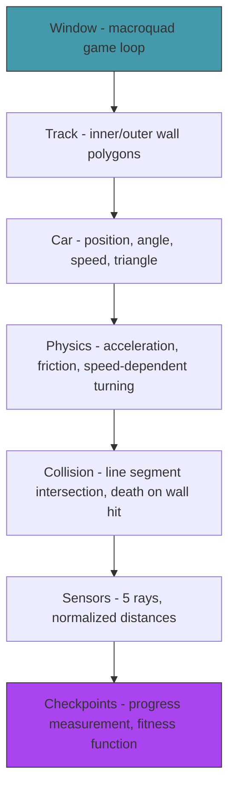

# Act 1 — The Track

> *Before anything can learn to drive, there must be a road. In this act you build the simulation world: a track with walls, a car with physics, sensors that see the road ahead, and checkpoints that measure progress. No AI yet — just the arena where evolution will happen.*

By the end of Act 1, you can drive a car around a track with your keyboard. The car has sensors (rays that detect walls) and a checkpoint system that measures how far you've gotten. This is the fitness function that the genetic algorithm will optimize in Act 3.


**Prerequisites:** Rust installed (`rustup`), a terminal, a text editor. Python experience is enough.

**Project location:** `~/juk/piloto/`

---

## Stage 1 — The Window

> *Difficulty: Very Easy — macroquad setup and your first frame.*

*~30 min*

Every visual project starts the same way: get a window on screen and draw something. macroquad makes this absurdly simple — the entire setup is 5 lines. This stage gets you from nothing to a colored window with a shape in it.

> [!tip] What You'll Learn
> - macroquad's async game loop
> - `clear_background`, `draw_circle`, `draw_line`
> - The coordinate system (origin at top-left, y increases downward)
> - `next_frame().await` — the heartbeat of the simulation

### 1.1 — Create the project

```bash
cd ~/juk
cargo new piloto --edition 2024
cd piloto
```

### 1.2 — Add macroquad

```toml
[dependencies]
macroquad = "0.4"
```

### 1.3 — Hello macroquad

Replace `src/main.rs`:

```rust
use macroquad::prelude::*;

#[macroquad::main("Piloto")]
async fn main() {
    loop {
        clear_background(Color::from_rgba(20, 20, 30, 255));

        // Draw a circle in the center
        let cx = screen_width() / 2.0;
        let cy = screen_height() / 2.0;
        draw_circle(cx, cy, 20.0, YELLOW);

        // Draw some text
        draw_text("Piloto", 10.0, 30.0, 30.0, WHITE);
        draw_text(&format!("FPS: {}", get_fps()), 10.0, 60.0, 20.0, GRAY);

        next_frame().await;
    }
}
```

That's the entire program. Let's unpack it:

| Code | Explanation |
|------|-------------|
| `#[macroquad::main("Piloto")]` | Macro that creates a window titled "Piloto" and runs the async main function inside macroquad's event loop. |
| `async fn main()` | macroquad uses async for its game loop. `next_frame().await` yields control back to the framework, which handles window events and swaps the frame buffer. |
| `clear_background(...)` | Fill the entire window with a color. Called at the start of every frame. |
| `draw_circle(x, y, radius, color)` | Draw a filled circle. Coordinates are in pixels, origin at top-left. |
| `next_frame().await` | Wait for the next frame. This is the "tick" of the game loop — everything between two `next_frame()` calls is one frame. |

**Python comparison (pygame):**
```python
while running:
    screen.fill((20, 20, 30))
    pygame.draw.circle(screen, YELLOW, (cx, cy), 20)
    pygame.display.flip()
```

Same pattern — clear, draw, flip. macroquad just uses `await` instead of `flip()`.

### 1.4 — Try it yourself

Before running, predict: what happens if you change `YELLOW` to `RED`? What if you add a second `draw_circle` call with different coordinates? Try both, then run:

```bash
cargo run
```

A window appears with a dark background, a yellow circle, and an FPS counter. The circle sits in the center. The window is resizable.

> [!warning] Common Mistake: Forgetting `next_frame().await`
> Without it, the loop runs as fast as possible without ever displaying a frame. Your program will appear to hang — it's drawing but never showing. You'll see this error pattern: the window opens but stays blank or frozen. Always end the loop body with `next_frame().await`.

> [!warning] Common Mistake: Coordinate confusion
> macroquad's origin is top-left. Y increases *downward*. If you draw at `(0, 0)`, it appears in the top-left corner, not the bottom-left like in math class. If your car appears upside down later, you've probably flipped a Y axis somewhere.

### Extend it

Add a `draw_line` call that draws a horizontal line across the middle of the screen. You'll need `screen_width()` and `screen_height()`. The signature is `draw_line(x1, y1, x2, y2, thickness, color)`.

We have a window. Next stage, we'll draw the track — the walls that the cars will learn to navigate.

> [!check] Checkpoint
> Run `cargo run`. Verify a window appears with a yellow circle and FPS counter. Stage 1 complete.

---

## Stage 2 — The Track

> *Difficulty: Easy — Define a circuit as wall segments and draw it.*

*~60 min*

The track is the environment the AI will learn to navigate. It's defined as two polygons — an inner wall and an outer wall — forming a circuit. The space between them is the road. This stage defines the track data, draws it, and sets up the collision geometry.

> [!tip] What You'll Learn
> - Representing a track as two polygons (inner and outer walls)
> - Drawing lines between points
> - `Vec<Vec2>` for point lists
> - Rust's module system: `mod`, `pub`, and file organization
> - Why the track is data, not code (we'll add a track editor in Act 4)

### Why two polygons?

A racing track is a loop with width. The simplest representation: an outer boundary and an inner boundary. The drivable area is between them. Each boundary is a closed polygon — a list of points connected by line segments.

### Concept: Rust's Module System

This is the first time we create a second file. In Python, you'd just create `track.py` and `import track`. Rust requires an extra step: you must *declare* the module in your parent file.

Here's how it works:

1. Create the file `src/track.rs`
2. In `src/main.rs`, add `mod track;` — this tells Rust "there's a module called `track`, find it in `src/track.rs`"
3. Use `pub` on anything in `track.rs` that `main.rs` needs to access

**What happens if you forget `mod track;`?** You get this compiler error:

```
error[E0432]: unresolved import `track`
 --> src/main.rs:4:5
  |
4 | use track::Track;
  |     ^^^^^ use of undeclared crate or module `track`
```

Rust doesn't auto-discover files. Every module must be explicitly declared. This is different from Python where any `.py` file in the directory is importable.

| Python | Rust | Notes |
|--------|------|-------|
| `import track` | `mod track;` in `main.rs` | Rust requires explicit declaration |
| Everything is public by default | Everything is private by default | Add `pub` to expose items |
| `from track import Track` | `use track::Track;` | Same idea, different syntax |

**What happens if you forget `pub`?** You get:

```
error[E0603]: struct `Track` is private
 --> src/main.rs:4:13
  |
4 | use track::Track;
  |             ^^^^^ private struct
```

In Rust, everything is private by default. You must explicitly mark structs, functions, and fields as `pub` if other modules need them.

### 2.1 — Track data

Create `src/track.rs`:

```rust
use macroquad::prelude::*;

pub struct Track {
    pub outer: Vec<Vec2>,
    pub inner: Vec<Vec2>,
}

impl Track {
    /// A simple oval track for testing.
    pub fn oval() -> Self {
        let cx = 400.0;
        let cy = 300.0;
        let segments = 32;

        let outer: Vec<Vec2> = (0..segments).map(|i| {
            let angle = (i as f32 / segments as f32) * std::f32::consts::TAU;
            vec2(cx + angle.cos() * 300.0, cy + angle.sin() * 200.0)
        }).collect();

        let inner: Vec<Vec2> = (0..segments).map(|i| {
            let angle = (i as f32 / segments as f32) * std::f32::consts::TAU;
            vec2(cx + angle.cos() * 180.0, cy + angle.sin() * 100.0)
        }).collect();

        Track { outer, inner }
    }

    /// Get all wall segments as (start, end) pairs.
    pub fn wall_segments(&self) -> Vec<(Vec2, Vec2)> {
        let mut segments = Vec::new();

        // Outer wall
        for i in 0..self.outer.len() {
            let next = (i + 1) % self.outer.len();
            segments.push((self.outer[i], self.outer[next]));
        }

        // Inner wall
        for i in 0..self.inner.len() {
            let next = (i + 1) % self.inner.len();
            segments.push((self.inner[i], self.inner[next]));
        }

        segments
    }

    /// Draw the track.
    pub fn draw(&self) {
        let wall_color = Color::from_rgba(100, 100, 120, 255);

        // Draw outer wall
        for i in 0..self.outer.len() {
            let next = (i + 1) % self.outer.len();
            draw_line(
                self.outer[i].x, self.outer[i].y,
                self.outer[next].x, self.outer[next].y,
                2.0, wall_color,
            );
        }

        // Draw inner wall
        for i in 0..self.inner.len() {
            let next = (i + 1) % self.inner.len();
            draw_line(
                self.inner[i].x, self.inner[i].y,
                self.inner[next].x, self.inner[next].y,
                2.0, wall_color,
            );
        }
    }
}
```

| Code | Explanation |
|------|-------------|
| `Vec2` | macroquad's 2D vector type — `vec2(x, y)`. Has `.x`, `.y` fields and math operations. In Python, you'd use a tuple `(x, y)` or a numpy array. |
| `std::f32::consts::TAU` | 2π — a full circle in radians. `TAU / segments` gives the angle between each point. |
| `angle.cos()`, `angle.sin()` | Trigonometry — convert an angle to x/y coordinates on a circle. `cos` = horizontal, `sin` = vertical. |
| `% self.outer.len()` | Wrap around to connect the last point back to the first (closed polygon). |
| `pub` on struct and fields | Without `pub`, `main.rs` can't access `Track` or its fields. |

### 2.2 — Draw it

Update `src/main.rs`:

```rust
mod track;

use macroquad::prelude::*;
use track::Track;

#[macroquad::main("Piloto")]
async fn main() {
    let track = Track::oval();

    loop {
        clear_background(Color::from_rgba(20, 20, 30, 255));

        track.draw();

        draw_text("Piloto", 10.0, 30.0, 30.0, WHITE);
        draw_text(&format!("FPS: {}", get_fps()), 10.0, 60.0, 20.0, GRAY);

        next_frame().await;
    }
}
```

Note the two lines at the top: `mod track;` declares the module, `use track::Track;` imports the struct. Both are required.

```bash
cargo run
```

An oval track appears — two concentric ellipses forming a circuit. The road is the space between them.

> [!note] Why an oval?
> The oval is the simplest closed track. It has no sharp corners, so even random drivers might survive a few frames. We'll add more complex tracks in Act 4. For now, the oval is enough to develop and test the AI.

### Extend it

The `wall_segments` method returns `Vec<(Vec2, Vec2)>` — a new `Vec` allocated every time it's called. For now this is fine (we call it once at startup). But think about this: if we called it every frame for 50 cars, that's 50 allocations per frame. How might you avoid that? (Hint: compute it once and pass a reference. We'll do exactly this in Stage 5.)

> [!check] Checkpoint
> Run the program. Verify you see an oval track with inner and outer walls. Stage 2 complete.

---

## Stage 3 — The Car

> *Difficulty: Easy — A triangle that moves with keyboard input.*

*~50 min*

The car is a triangle (pointing in its direction of travel) with position, angle, and velocity. This stage adds keyboard controls so you can drive it manually. The manual controls won't be used by the AI — they're for testing and for the race mode in Act 4.

> [!tip] What You'll Learn
> - Representing a car as position + angle + speed
> - Drawing a rotated triangle
> - Reading keyboard input with `is_key_down`
> - Basic trigonometry: angle → direction vector
> - `&self` vs `&mut self` — your first encounter with Rust's borrowing rules

### Concept: `&self` vs `&mut self`

Every method in Rust takes `self` in one of three ways:

| Signature | Meaning | Python equivalent |
|-----------|---------|-------------------|
| `&self` | Read-only borrow — can look but not modify | `def method(self):` (by convention, doesn't modify) |
| `&mut self` | Mutable borrow — can read and modify | `def method(self):` (modifies `self.x`) |
| `self` | Takes ownership — consumes the value | No direct equivalent — the object is gone after the call |

In Python, every method can modify `self` freely. Rust forces you to declare your intent. If a method only reads data (like `draw` or `direction`), use `&self`. If it changes the car's position or speed, use `&mut self`.

**Why does Rust care?** Because it prevents data races at compile time. If two parts of your code hold `&self` references simultaneously, that's fine — they're both just reading. But Rust won't let you hold `&self` and `&mut self` at the same time, because the mutable reference might change data while the other is reading it. This matters when we have 50 cars in Act 2.

### 3.1 — The Car struct

Create `src/car.rs`:

```rust
use macroquad::prelude::*;

pub struct Car {
    pub pos: Vec2,
    pub angle: f32,     // radians, 0 = pointing right
    pub speed: f32,
    pub alive: bool,
    pub color: Color,
}

impl Car {
    pub fn new(pos: Vec2, angle: f32, color: Color) -> Self {
        Car { pos, angle, speed: 0.0, alive: true, color }
    }

    /// Direction the car is facing as a unit vector.
    pub fn direction(&self) -> Vec2 {
        vec2(self.angle.cos(), self.angle.sin())
    }

    /// Draw the car as a triangle pointing in its direction.
    pub fn draw(&self) {
        if !self.alive {
            return;
        }

        let dir = self.direction();
        let perp = vec2(-dir.y, dir.x); // perpendicular to direction

        let size = 12.0;
        let width = 6.0;

        // Triangle: tip at front, two points at back
        let tip = self.pos + dir * size;
        let left = self.pos - dir * size * 0.3 + perp * width;
        let right = self.pos - dir * size * 0.3 - perp * width;

        draw_triangle(tip, left, right, self.color);
    }
}
```

Notice: `direction()` and `draw()` use `&self` — they only read the car's state. The update method below uses `&mut self` because it changes position and speed.

The `direction()` method converts the angle to a unit vector using `cos` and `sin` — this is the fundamental trig operation you'll use throughout the course:

```
angle = 0     → direction = (1, 0)   → pointing right
angle = π/2   → direction = (0, 1)   → pointing down
angle = π     → direction = (-1, 0)  → pointing left
```

The perpendicular vector `(-dir.y, dir.x)` is rotated 90° — it gives the car's "sideways" direction, used to draw the triangle's width.

### 3.2 — Keyboard controls

**Try it yourself.** Before looking at the solution, write an `update_manual` method that:
- Takes `&mut self` and `dt: f32` (delta time in seconds)
- Checks `is_key_down(KeyCode::W)` for forward, `S` for backward, `A` for left, `D` for right
- Adjusts `self.angle` for steering and `self.speed` for throttle
- Applies friction: `self.speed *= 0.98`
- Moves the car: `self.pos += self.direction() * self.speed * dt`

Give it a try. The key insight: multiply all changes by `dt` so movement is frame-rate independent.

<details>
<summary>Solution</summary>

```rust
impl Car {
    /// Update the car based on keyboard input (for manual driving).
    pub fn update_manual(&mut self, dt: f32) {
        if !self.alive {
            return;
        }

        // Steering
        if is_key_down(KeyCode::A) || is_key_down(KeyCode::Left) {
            self.angle -= 3.0 * dt;
        }
        if is_key_down(KeyCode::D) || is_key_down(KeyCode::Right) {
            self.angle += 3.0 * dt;
        }

        // Throttle / brake
        if is_key_down(KeyCode::W) || is_key_down(KeyCode::Up) {
            self.speed += 200.0 * dt;
        }
        if is_key_down(KeyCode::S) || is_key_down(KeyCode::Down) {
            self.speed -= 200.0 * dt;
        }

        // Friction
        self.speed *= 0.98;

        // Speed cap
        self.speed = self.speed.clamp(-100.0, 300.0);

        // Move
        self.pos += self.direction() * self.speed * dt;
    }
}
```

</details>

| Code | Explanation |
|------|-------------|
| `&mut self` | This method modifies the car's position, angle, and speed — it needs mutable access. |
| `dt: f32` | Delta time — seconds since last frame. Multiplying by `dt` makes movement frame-rate independent. |
| `is_key_down(KeyCode::W)` | Returns `true` if the key is currently held. macroquad handles the input polling. |
| `self.speed *= 0.98` | Friction — speed decays by 2% per frame. Without this, the car would accelerate forever. |
| `.clamp(-100.0, 300.0)` | Limit speed to a range. Negative = reversing. In Python: `max(-100, min(300, speed))`. |

### 3.3 — Wire it up

Update `main.rs`:

```rust
mod car;
mod track;

use macroquad::prelude::*;
use car::Car;
use track::Track;

#[macroquad::main("Piloto")]
async fn main() {
    let track = Track::oval();

    // Start position: top of the oval, pointing right
    let start_pos = vec2(400.0, 100.0);
    let start_angle = 0.0;
    let mut player = Car::new(start_pos, start_angle, YELLOW);

    loop {
        let dt = get_frame_time();

        clear_background(Color::from_rgba(20, 20, 30, 255));

        player.update_manual(dt);

        track.draw();
        player.draw();

        draw_text("WASD to drive", 10.0, 30.0, 20.0, GRAY);
        draw_text(&format!("Speed: {:.0}", player.speed), 10.0, 55.0, 20.0, WHITE);

        next_frame().await;
    }
}
```

Note `let mut player` — because we call `update_manual(&mut self)`, the variable itself must be declared `mut`. If you forget:

```
error[E0596]: cannot borrow `player` as mutable, as it is not declared as mutable
  --> src/main.rs:16:9
   |
16 |         player.update_manual(dt);
   |         ^^^^^^ cannot borrow as mutable
   |
help: consider changing this to be mutable
   |
13 |     let mut player = Car::new(start_pos, start_angle, YELLOW);
   |         +++
```

The compiler even tells you the fix. Get used to reading these — they're your best teacher.

### 3.4 — Test it

```bash
cargo run
```

A yellow triangle appears on the track. WASD to drive. The car accelerates, steers, and slows down with friction. It can drive right through the walls — we'll fix that in Stage 5.

> [!warning] Common Mistake: Not multiplying by `dt`
> Without delta time, movement speed depends on frame rate. At 60 FPS the car moves normally; at 120 FPS it moves twice as fast. If your car seems to teleport or crawl, check that every velocity and rotation change is multiplied by `dt`. The compiler won't catch this — it's a logic bug, not a type error.

We can drive, but the car ignores walls. Next stage, we'll add proper physics — acceleration curves, turning radius, and speed-dependent handling.

> [!check] Checkpoint
> Drive the car with WASD. Verify it accelerates, steers, and decelerates with friction. Stage 3 complete.

---

## Stage 4 — Car Physics

> *Difficulty: Medium — Acceleration curves, turning radius, and speed-dependent handling.*

*~60 min*

The current physics are too simple — the car turns at the same rate regardless of speed, and acceleration is linear. Real cars (and good simulations) have speed-dependent turning: you can't turn sharply at high speed. This stage makes the physics feel right, which matters because the AI will exploit any unrealistic behavior.

> [!tip] What You'll Learn
> - Speed-dependent turn rate (faster = wider turns)
> - Non-linear acceleration (diminishing returns at high speed)
> - Separating control inputs from physics (key design for AI)
> - Why physics matter for AI training (unrealistic physics → unrealistic driving)
> - Tuning constants by feel

### Why physics matter for AI

If the car can turn 180° instantly at full speed, the AI will learn to do exactly that — and the resulting "driving" will look nothing like real driving. Realistic-ish physics constrain the AI to learn realistic-ish behavior. The constraints are the teacher.

### 4.1 — Separating input from physics

This is a key design decision. We split the car's update into two parts:
1. **Input** — where the control values come from (keyboard now, neural network later)
2. **Physics** — how those control values affect the car

This means the AI can use the exact same physics code — it just provides different inputs.

**Try it yourself.** Define a `CarInput` struct with two fields: `throttle: f32` (-1.0 to 1.0) and `steering: f32` (-1.0 to 1.0). Then write a `keyboard_input()` function that reads WASD and returns a `CarInput`. This is a pure data struct — no methods needed.

<details>
<summary>Solution</summary>

```rust
/// Control inputs — either from keyboard or neural network.
pub struct CarInput {
    pub throttle: f32,  // -1.0 (brake) to 1.0 (full throttle)
    pub steering: f32,  // -1.0 (left) to 1.0 (right)
}

impl Car {
    /// Read keyboard input and return control values.
    pub fn keyboard_input() -> CarInput {
        let mut throttle = 0.0;
        let mut steering = 0.0;

        if is_key_down(KeyCode::W) || is_key_down(KeyCode::Up) { throttle += 1.0; }
        if is_key_down(KeyCode::S) || is_key_down(KeyCode::Down) { throttle -= 1.0; }
        if is_key_down(KeyCode::A) || is_key_down(KeyCode::Left) { steering -= 1.0; }
        if is_key_down(KeyCode::D) || is_key_down(KeyCode::Right) { steering += 1.0; }

        CarInput { throttle, steering }
    }
}
```

</details>

### 4.2 — Improved physics

Now write the `update` method that takes a `&CarInput` instead of reading the keyboard directly. The key improvements over `update_manual`:

- **Diminishing acceleration:** The closer to max speed, the less acceleration you get. `factor = 1.0 - (speed / max_speed)`.
- **Speed-dependent turning:** At high speed, turning is reduced. `speed_factor = 1.0 - (speed / max_speed * 0.6)`.
- **Stronger braking than acceleration:** Braking at 400 units vs acceleration at 250 — stopping is easier than going.

```rust
impl Car {
    /// Apply physics given control inputs.
    pub fn update(&mut self, input: &CarInput, dt: f32) {
        if !self.alive {
            return;
        }

        // Acceleration — diminishing returns at high speed
        let max_speed = 300.0;
        let accel = 250.0;
        let brake = 400.0;

        if input.throttle > 0.0 {
            let factor = 1.0 - (self.speed / max_speed).clamp(0.0, 1.0);
            self.speed += accel * input.throttle * factor * dt;
        } else if input.throttle < 0.0 {
            self.speed += brake * input.throttle * dt; // input.throttle is negative
        }

        // Friction
        self.speed *= 1.0 - 1.5 * dt;

        // Speed-dependent turning — can't turn sharply at high speed
        let turn_rate = 3.5;
        let speed_factor = 1.0 - (self.speed.abs() / max_speed * 0.6).clamp(0.0, 0.8);
        self.angle += input.steering * turn_rate * speed_factor * dt;

        // Minimum speed to turn (no spinning in place)
        if self.speed.abs() < 5.0 {
            self.speed *= 0.9;
        }

        // Clamp
        self.speed = self.speed.clamp(-80.0, max_speed);

        // Move
        self.pos += self.direction() * self.speed * dt;
    }
}
```

Notice `input: &CarInput` — a shared reference. The `update` method reads the input but doesn't modify it. This is Rust's borrowing in action: the caller keeps ownership of the `CarInput`, and `update` just borrows it for the duration of the call.

### 4.3 — Update main loop

```rust
// In the game loop:
let input = Car::keyboard_input();
player.update(&input, dt);
```

### 4.4 — Test it

```bash
cargo run
```

The car now feels different: it accelerates quickly at low speed but struggles to gain speed near the cap. Turning at high speed produces wide arcs. Braking is stronger than acceleration. It feels more like driving and less like sliding a triangle around.

> [!note] Tuning by feel
> The constants (250.0 accel, 3.5 turn rate, 0.6 speed factor) were chosen by feel, not physics simulation. Adjust them until driving feels satisfying. The AI will adapt to whatever physics you set — the constants define the "rules of the world" that evolution operates within.

### Extend it

Try changing `max_speed` to 500.0 and see how the car handles. Then try `turn_rate = 1.0`. Notice how the physics constants completely change the "personality" of the car. The AI will evolve a different driving style for each set of constants.

The car handles well but still phases through walls. Next stage, we fix that.

> [!check] Checkpoint
> Drive at high speed and verify turning is restricted. Verify acceleration has diminishing returns. The car should feel like it has weight. Stage 4 complete.

---

## Stage 5 — Wall Collision

> *Difficulty: Medium — Detecting when the car hits a wall.*

*~50 min*

The car drives through walls like a ghost. We need collision detection: check if the car's body intersects any wall segment, and if so, mark it as crashed. This is the "death" condition that the genetic algorithm will select against — cars that crash get low fitness.

> [!tip] What You'll Learn
> - Line segment intersection (the math behind all 2D collision)
> - Slice references: `&[(Vec2, Vec2)]` — borrowing data without copying
> - Marking a car as "dead" on collision
> - Why collision detection is the foundation of the fitness function

### Concept: Slice References — `&[(Vec2, Vec2)]`

The `wall_segments()` method returns `Vec<(Vec2, Vec2)>`. We could pass the whole `Vec` to the collision function, but that would either copy it (expensive) or move it (we'd lose it). Instead, we pass a **slice reference**: `&[(Vec2, Vec2)]`.

A slice is a view into a contiguous sequence — it borrows the data without copying or taking ownership. Think of it like a Python list slice, except it's zero-cost (no new allocation).

```rust
// This borrows the Vec's data — no copy, no move
fn check_collision(&mut self, walls: &[(Vec2, Vec2)]) { ... }

// Called like:
let walls = track.wall_segments();  // Vec<(Vec2, Vec2)>
player.check_collision(&walls);     // borrows as &[(Vec2, Vec2)]
```

In Python, you'd just pass the list. In Rust, the `&` makes the borrowing explicit — the compiler guarantees `walls` isn't modified or freed while `check_collision` is using it.

### The math: line-segment intersection

Two line segments intersect if and only if the endpoints of each segment are on opposite sides of the other segment's line. The standard algorithm uses cross products.

Create `src/geometry.rs`:

```rust
use macroquad::prelude::*;

/// 2D cross product: (b-a) × (c-a). Positive = c is left of a→b.
fn cross_2d(a: Vec2, b: Vec2, c: Vec2) -> f32 {
    (b.x - a.x) * (c.y - a.y) - (b.y - a.y) * (c.x - a.x)
}

/// Check if two line segments (p1→p2) and (p3→p4) intersect.
pub fn segments_intersect(p1: Vec2, p2: Vec2, p3: Vec2, p4: Vec2) -> bool {
    let d1 = cross_2d(p3, p4, p1);
    let d2 = cross_2d(p3, p4, p2);
    let d3 = cross_2d(p1, p2, p3);
    let d4 = cross_2d(p1, p2, p4);

    if ((d1 > 0.0 && d2 < 0.0) || (d1 < 0.0 && d2 > 0.0))
        && ((d3 > 0.0 && d4 < 0.0) || (d3 < 0.0 && d4 > 0.0))
    {
        return true;
    }

    false
}
```

Don't forget to add `mod geometry;` to `main.rs` — same pattern as `mod track;` and `mod car;`.

**Python comparison:**
```python
def cross_2d(a, b, c):
    return (b[0]-a[0]) * (c[1]-a[1]) - (b[1]-a[1]) * (c[0]-a[0])
```

Same math, just with tuples instead of `Vec2`.

### 5.1 — Check car against walls

**Try it yourself.** Write a `check_collision` method on `Car` that:
- Takes `&mut self` and `walls: &[(Vec2, Vec2)]`
- Computes the car's front edge (a line segment from front-left to front-right, using `direction()` and the perpendicular)
- Checks if the front edge intersects any wall segment using `geometry::segments_intersect`
- Sets `self.alive = false` if any intersection is found
- Also checks the left and right side edges

Hint: the car's tip is at `self.pos + dir * size`, and the perpendicular is `vec2(-dir.y, dir.x)`.

<details>
<summary>Solution</summary>

Add to `src/car.rs`:

```rust
use crate::geometry;

impl Car {
    /// Check if the car collides with any wall segment.
    /// Uses the car's front and side edges as line segments.
    pub fn check_collision(&mut self, walls: &[(Vec2, Vec2)]) {
        if !self.alive {
            return;
        }

        let dir = self.direction();
        let perp = vec2(-dir.y, dir.x);
        let size = 10.0;
        let width = 5.0;

        // Car's front edge (left to right)
        let front_left = self.pos + dir * size + perp * width;
        let front_right = self.pos + dir * size - perp * width;

        // Check front edge against all walls
        for &(w1, w2) in walls {
            if geometry::segments_intersect(front_left, front_right, w1, w2) {
                self.alive = false;
                return;
            }
        }

        // Also check side edges
        let back_left = self.pos - dir * size * 0.3 + perp * width;
        let back_right = self.pos - dir * size * 0.3 - perp * width;

        for &(w1, w2) in walls {
            if geometry::segments_intersect(front_left, back_left, w1, w2)
                || geometry::segments_intersect(front_right, back_right, w1, w2)
            {
                self.alive = false;
                return;
            }
        }
    }
}
```

</details>

Notice `for &(w1, w2) in walls` — the `&` destructures each borrowed tuple. Without it, `w1` and `w2` would be references to `Vec2` instead of `Vec2` values. Since `Vec2` implements `Copy` (it's just two floats), destructuring with `&` gives us copies, which is what we want for the math.

### 5.2 — Draw dead cars differently

Update `draw` to show crashed cars as dim:

```rust
pub fn draw(&self) {
    let color = if self.alive {
        self.color
    } else {
        Color::from_rgba(80, 80, 80, 100) // dim gray ghost
    };

    let dir = self.direction();
    let perp = vec2(-dir.y, dir.x);
    let size = 12.0;
    let width = 6.0;

    let tip = self.pos + dir * size;
    let left = self.pos - dir * size * 0.3 + perp * width;
    let right = self.pos - dir * size * 0.3 - perp * width;

    draw_triangle(tip, left, right, color);
}
```

### 5.3 — Wire into main loop

```rust
let walls = track.wall_segments();

// In the loop, after update:
player.check_collision(&walls);
```

### 5.4 — Test it

```bash
cargo run
```

Drive into a wall. The car stops and turns gray. It's dead. Restart the program to try again (we'll add a reset key later).

> [!warning] Common Mistake: Checking only the center point
> If you only check whether the car's center is past a wall, the car can clip through walls at an angle — the center might never cross the wall line even though the corners do. Checking the car's edges (front, left, right) catches collisions properly. This is a common game dev bug.

Cars can crash. Now they need eyes — sensors that detect how far away the walls are. That's what the neural network will use as input.

> [!check] Checkpoint
> Drive into a wall. Verify the car stops and turns gray. Verify it can't drive through walls. Stage 5 complete.

---

## Stage 6 — The Sensors

> *Difficulty: Medium — Ray casting to detect wall distances.*

*~60 min*

The AI can't see the track — it needs sensors. Each sensor is a ray cast from the car in a specific direction. The ray detects the distance to the nearest wall. Five sensors (front, front-left, front-right, left, right) give the neural network enough information to steer.

> [!tip] What You'll Learn
> - Ray casting — finding where a ray hits a line segment
> - The ray-segment intersection formula
> - `Option<f32>` — Rust's way of saying "maybe there's a value, maybe not"
> - Normalizing sensor values to 0..1 range
> - Constants with `const` — compile-time values
> - Why 5 sensors is enough (and what happens with more or fewer)

### Why 5 sensors?

```
        2   1   0
         \  |  /
          \ | /
    3 ---- CAR ---- 4
```

- Sensor 0: front-right (45°)
- Sensor 1: front (0°)
- Sensor 2: front-left (-45°)
- Sensor 3: left (-90°)
- Sensor 4: right (90°)

Five sensors give the AI a 180° field of view. It can detect walls ahead and to the sides. No rear sensor — the AI should be driving forward, not looking back.

### Concept: `Option<f32>` — Rust's Null Safety

The ray might not hit any wall segment (it misses, or the wall is behind the ray). In Python, you'd return `None`. In Rust, you return `Option<f32>`:

```rust
fn ray_segment_intersection(...) -> Option<f32> {
    if hit {
        Some(distance)  // found a hit
    } else {
        None            // no hit
    }
}
```

`Option` forces you to handle both cases. You can't accidentally use a `None` as a number — the compiler won't let you. This is Rust's answer to Python's `NoneType has no attribute` errors.

```rust
// Handle it with `if let`:
if let Some(dist) = ray_segment_intersection(...) {
    // dist is a real f32 here
    if dist < closest {
        closest = dist;
    }
}
// If it was None, this block is skipped — no crash, no error
```

**Python comparison:**
```python
result = ray_segment_intersection(...)
if result is not None:
    if result < closest:
        closest = result
```

Same logic, but Rust enforces it at compile time. You literally cannot forget the `None` check.

### 6.1 — Ray-segment intersection

Add to `src/geometry.rs`:

```rust
/// Cast a ray from `origin` in `direction` and find the distance to the
/// nearest intersection with a line segment (p1→p2).
/// Returns None if the ray doesn't hit the segment.
pub fn ray_segment_intersection(
    origin: Vec2,
    direction: Vec2,
    p1: Vec2,
    p2: Vec2,
) -> Option<f32> {
    let v1 = origin - p1;
    let v2 = p2 - p1;
    let v3 = vec2(-direction.y, direction.x);

    let dot = v2.dot(v3);
    if dot.abs() < 0.0001 {
        return None; // parallel — ray and segment point the same way
    }

    let t1 = (v2.x * v1.y - v2.y * v1.x) / dot;
    let t2 = v1.dot(v3) / dot;

    if t1 >= 0.0 && t2 >= 0.0 && t2 <= 1.0 {
        Some(t1) // distance along the ray
    } else {
        None
    }
}
```

This is the standard ray-line intersection formula. `t1` is the distance along the ray, `t2` is the position along the segment (0 = at p1, 1 = at p2). We need `t1 >= 0` (ray goes forward, not backward) and `0 <= t2 <= 1` (hit is within the segment, not on its extension).

### 6.2 — Sensor system

**Try it yourself.** Write a `read_sensors` method on `Car` that:
- Returns `[f32; NUM_SENSORS]` — a fixed-size array of 5 floats
- For each sensor angle, casts a ray from `self.pos` in the direction `self.angle + sensor_angle`
- Finds the closest wall hit within `SENSOR_RANGE` (200.0)
- Returns the distance normalized to 0..1 (0 = touching wall, 1 = max range)

Constants you'll need:
```rust
pub const NUM_SENSORS: usize = 5;
const SENSOR_RANGE: f32 = 200.0;
const SENSOR_ANGLES: [f32; NUM_SENSORS] = [
    0.7854,   // 45° right
    0.0,      // straight ahead
    -0.7854,  // 45° left
    -1.5708,  // 90° left
    1.5708,   // 90° right
];
```

<details>
<summary>Solution</summary>

```rust
impl Car {
    /// Cast sensor rays and return normalized distances (0 = wall touching, 1 = max range).
    pub fn read_sensors(&self, walls: &[(Vec2, Vec2)]) -> [f32; NUM_SENSORS] {
        let mut readings = [1.0; NUM_SENSORS]; // default: max range (no wall detected)

        for (i, &sensor_angle) in SENSOR_ANGLES.iter().enumerate() {
            let ray_angle = self.angle + sensor_angle;
            let ray_dir = vec2(ray_angle.cos(), ray_angle.sin());

            let mut closest = SENSOR_RANGE;

            for &(w1, w2) in walls {
                if let Some(dist) = geometry::ray_segment_intersection(self.pos, ray_dir, w1, w2) {
                    if dist < closest {
                        closest = dist;
                    }
                }
            }

            readings[i] = closest / SENSOR_RANGE; // normalize to 0..1
        }

        readings
    }
}
```

</details>

Sensors return normalized values: 0.0 = wall is touching the car, 1.0 = no wall within range. This normalization is important for the neural network — inputs should be in a consistent range. Without it, the network would need to learn the scale of raw pixel distances.

### 6.3 — Visualize the sensors

Add a `draw_sensors` method that draws each ray as a colored line — green when far from a wall, red when close:

```rust
impl Car {
    /// Draw sensor rays (for debugging / visualization).
    pub fn draw_sensors(&self, walls: &[(Vec2, Vec2)]) {
        if !self.alive {
            return;
        }

        let readings = self.read_sensors(walls);

        for (i, &sensor_angle) in SENSOR_ANGLES.iter().enumerate() {
            let ray_angle = self.angle + sensor_angle;
            let ray_dir = vec2(ray_angle.cos(), ray_angle.sin());
            let dist = readings[i] * SENSOR_RANGE;
            let end = self.pos + ray_dir * dist;

            // Color: green (far) → red (close)
            let r = (1.0 - readings[i]) * 255.0;
            let g = readings[i] * 255.0;
            let color = Color::from_rgba(r as u8, g as u8, 0, 150);

            draw_line(self.pos.x, self.pos.y, end.x, end.y, 1.0, color);
            draw_circle(end.x, end.y, 3.0, color);
        }
    }
}
```

### 6.4 — Test it

```rust
// In the main loop, after drawing the car:
player.draw_sensors(&walls);
```

```bash
cargo run
```

Five colored rays extend from the car. As you drive toward a wall, the rays shorten and turn red. Drive parallel to a wall and the side sensors light up. The sensors are the car's eyes.

> [!warning] Common Mistake: Not normalizing sensor values
> Raw distances (0 to 200 pixels) would make the neural network's job harder — it would need to learn the scale. Normalizing to 0..1 means the network always works with the same range regardless of `SENSOR_RANGE`. If you later change the range to 300, the network still gets 0..1 inputs. Always normalize inputs to neural networks.

### Extend it

Try changing `NUM_SENSORS` to 7 and adding two more angles (e.g., ±135° for rear-diagonal). How does the visualization change? More sensors give the AI more information but also increase the neural network size (more weights to evolve). There's a tradeoff between perception and learning speed.

The car can see. Now it needs a way to measure progress — how far around the track has it gotten? That's the fitness function.

> [!check] Checkpoint
> Drive around and verify 5 sensor rays are visible. Verify they shorten and turn red near walls. Stage 6 complete.

---

## Stage 7 — The Checkpoint System

> *Difficulty: Medium — Gates that measure progress around the track.*

*~50 min*

The genetic algorithm needs a fitness function: how good is this car? "Time alive" is a bad metric — a car that drives in circles lives forever but makes no progress. "Distance from start" doesn't work for a circuit. The solution: invisible checkpoint gates placed around the track. Fitness = number of checkpoints passed.

> [!tip] What You'll Learn
> - Placing checkpoints as line segments across the track
> - Detecting when a car crosses a checkpoint
> - Fitness as checkpoint count (not time or distance)
> - Linear interpolation with `.lerp()`
> - Adding fields to an existing struct
> - Why the fitness function is the most important design decision in evolutionary AI

### Why checkpoints?

The fitness function defines what "good" means. If fitness = time alive, the AI learns to drive slowly and avoid risks. If fitness = top speed, the AI learns to accelerate into walls. Checkpoints reward *progress around the track* — the only thing we actually care about.

### 7.1 — Generate checkpoints

Add to `src/track.rs`:

**Try it yourself.** Write a `generate_checkpoints` method that creates `count` line segments crossing the track at regular intervals. Each checkpoint connects a point on the outer wall to the corresponding point on the inner wall. You'll need `.lerp()` — linear interpolation between two `Vec2` values:

```rust
// lerp blends between two points: t=0 gives a, t=1 gives b, t=0.5 gives midpoint
let point = a.lerp(b, 0.5); // halfway between a and b
```

The method signature: `pub fn generate_checkpoints(&self, count: usize) -> Vec<(Vec2, Vec2)>`

<details>
<summary>Solution</summary>

```rust
impl Track {
    /// Generate checkpoint gates between the inner and outer walls.
    /// Returns line segments that cross the track at regular intervals.
    pub fn generate_checkpoints(&self, count: usize) -> Vec<(Vec2, Vec2)> {
        let mut checkpoints = Vec::new();

        for i in 0..count {
            let t = i as f32 / count as f32;
            let idx = (t * self.outer.len() as f32) as usize;
            let next = (idx + 1) % self.outer.len();

            // Interpolate between consecutive points
            let frac = (t * self.outer.len() as f32) - idx as f32;
            let outer_point = self.outer[idx].lerp(self.outer[next], frac);

            let inner_idx = (t * self.inner.len() as f32) as usize;
            let inner_next = (inner_idx + 1) % self.inner.len();
            let inner_frac = (t * self.inner.len() as f32) - inner_idx as f32;
            let inner_point = self.inner[inner_idx].lerp(self.inner[inner_next], inner_frac);

            checkpoints.push((outer_point, inner_point));
        }

        checkpoints
    }

    /// Draw checkpoints as faint lines.
    pub fn draw_checkpoints(&self, checkpoints: &[(Vec2, Vec2)], next_checkpoint: usize) {
        for (i, &(a, b)) in checkpoints.iter().enumerate() {
            let color = if i == next_checkpoint {
                Color::from_rgba(0, 255, 100, 80) // next checkpoint: green
            } else {
                Color::from_rgba(50, 50, 70, 40) // others: very faint
            };
            draw_line(a.x, a.y, b.x, b.y, 1.0, color);
        }
    }
}
```

</details>

### 7.2 — Checkpoint tracking per car

The `Car` struct needs new fields to track checkpoint progress. This means updating the struct definition and the `new()` constructor:

```rust
pub struct Car {
    pub pos: Vec2,
    pub angle: f32,
    pub speed: f32,
    pub alive: bool,
    pub color: Color,
    pub next_checkpoint: usize,
    pub checkpoints_passed: usize,
    pub time_alive: f32,
}

impl Car {
    pub fn new(pos: Vec2, angle: f32, color: Color) -> Self {
        Car {
            pos, angle, speed: 0.0, alive: true, color,
            next_checkpoint: 0, checkpoints_passed: 0, time_alive: 0.0,
        }
    }
}
```

> [!warning] Common Mistake: Forgetting to update the constructor
> When you add fields to a Rust struct, every place that creates that struct must include the new fields. Unlike Python's `__init__` where you can add `self.x = 0` anywhere, Rust requires all fields at construction time. If you forget, you'll see:
> ```
> error[E0063]: missing fields `next_checkpoint`, `checkpoints_passed`, `time_alive`
>              in initializer of `Car`
>   --> src/car.rs:15:9
> ```
> The compiler lists exactly which fields are missing — add them with default values.

Now add the checkpoint crossing detection:

```rust
impl Car {
    /// Check if the car crossed the next checkpoint.
    pub fn check_checkpoints(&mut self, checkpoints: &[(Vec2, Vec2)]) {
        if !self.alive || checkpoints.is_empty() {
            return;
        }

        let (cp_a, cp_b) = checkpoints[self.next_checkpoint];

        // Check if the car's movement line crosses the checkpoint
        let prev_pos = self.pos - self.direction() * self.speed.abs() * 0.016;
        if geometry::segments_intersect(prev_pos, self.pos, cp_a, cp_b) {
            self.checkpoints_passed += 1;
            self.next_checkpoint = (self.next_checkpoint + 1) % checkpoints.len();
        }
    }

    /// Fitness score for the genetic algorithm.
    pub fn fitness(&self) -> f32 {
        self.checkpoints_passed as f32
    }
}
```

### 7.3 — Wire it all together

```rust
#[macroquad::main("Piloto")]
async fn main() {
    let track = Track::oval();
    let walls = track.wall_segments();
    let checkpoints = track.generate_checkpoints(20);

    let start_pos = vec2(400.0, 100.0);
    let mut player = Car::new(start_pos, 0.0, YELLOW);

    loop {
        let dt = get_frame_time();

        clear_background(Color::from_rgba(20, 20, 30, 255));

        let input = Car::keyboard_input();
        player.update(&input, dt);
        player.time_alive += dt;
        player.check_collision(&walls);
        player.check_checkpoints(&checkpoints);

        track.draw();
        track.draw_checkpoints(&checkpoints, player.next_checkpoint);
        player.draw();
        player.draw_sensors(&walls);

        draw_text("WASD to drive", 10.0, 30.0, 20.0, GRAY);
        draw_text(&format!("Checkpoints: {}", player.checkpoints_passed), 10.0, 55.0, 20.0, WHITE);
        draw_text(&format!("Speed: {:.0}", player.speed), 10.0, 80.0, 20.0, WHITE);

        next_frame().await;
    }
}
```

### 7.4 — Test it

```bash
cargo run
```

Faint lines cross the track at regular intervals. The next checkpoint glows green. Drive through it and the counter increments. Drive around the full track and watch the checkpoint count climb.

> [!note] Why fitness = checkpoints, not distance
> Distance from start doesn't work for a loop — after one lap, you're back at the start with distance = 0. Checkpoints count monotonically: 1 lap = 20 checkpoints, 2 laps = 40, etc. The AI is rewarded for making progress, not for surviving.

### Extend it

Change the checkpoint count from 20 to 5. Drive around and notice how coarse the fitness becomes — many cars will tie at 0 or 1 checkpoint. Now try 50 checkpoints. More checkpoints = finer-grained fitness = smoother evolution. But too many checkpoints placed close together can cause detection issues. 20 is a good balance for the oval.

> [!check] Checkpoint
> Drive around the track. Verify the checkpoint counter increments as you cross each gate. Verify the next checkpoint glows green. Stage 7 complete.

---

## Act 1 Complete — The Track



You built a complete driving simulation:

| Component | What it does |
|-----------|-------------|
| Track | Oval circuit with inner/outer walls |
| Car | Triangle with position, angle, speed, keyboard controls |
| Physics | Speed-dependent turning, friction, acceleration curves |
| Collision | Line-segment intersection, death on wall contact |
| Sensors | 5 rays returning normalized wall distances (0..1) |
| Checkpoints | 20 gates measuring progress around the track |

| Rust Concept | Where You Used It |
|-------------|-------------------|
| Module system | `mod track;`, `mod car;`, `mod geometry;`, `pub` visibility |
| `&self` vs `&mut self` | Read-only methods (`draw`, `direction`) vs mutating methods (`update`, `check_collision`) |
| Slice references `&[T]` | Passing wall segments and checkpoints without copying |
| `Option<T>` | Ray-segment intersection returns `Some(distance)` or `None` |
| `Vec<T>` and `[T; N]` | Dynamic lists (walls, checkpoints) and fixed arrays (sensor readings) |
| `const` | Sensor count, range, angles — compile-time constants |
| Structs with methods | `Car`, `Track`, `CarInput` |
| macroquad | Window, drawing, input, game loop |
| Trigonometry | `cos`/`sin` for direction, sensor angles |
| Line intersection | Cross products for collision and ray casting |

**What's missing:** The car is controlled by your keyboard. In Act 2, you'll replace the keyboard with a neural network — 5 sensor inputs go in, steering and throttle come out. The network starts with random weights (the car drives randomly), and in Act 3, the genetic algorithm evolves better weights across generations.
