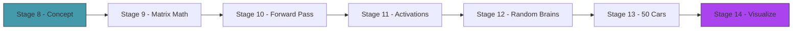

# Act 2 — The Brain

> *The car has eyes (sensors) and a body (physics). Now it needs a brain. A neural network takes 5 sensor readings and outputs 2 control values: steering and throttle. The network starts with random weights — the car drives like a drunk. But the structure is there, waiting for evolution to tune it.*

No ML libraries. The neural network is matrix multiplication + activation functions. You'll understand every weight, every bias, every multiplication — because you wrote them all.



---

## Stage 8 — What Is a Neural Network?

> *Difficulty: Easy — The conceptual model, no code yet.*

*~35 min*

Before writing any code, you need the mental model. A neural network is simpler than it sounds: it's a function that takes numbers in and produces numbers out, with tunable parameters (weights) that control the mapping. That's it.

> [!tip] What You'll Learn
> - Neurons, layers, weights, and biases
> - Why it's called a "network" (connected nodes)
> - The architecture for our car: 5 → 6 → 2
> - Why this is just fancy multiplication

### The architecture

```
INPUTS (5 sensors)          HIDDEN (6 neurons)         OUTPUTS (2 controls)
┌─────────────┐            ┌──────────────┐           ┌──────────────┐
│ sensor 0    │──┐    ┌───→│ hidden 0     │──┐   ┌──→│ steering     │
│ sensor 1    │──┼────┤    │ hidden 1     │──┼───┤   │ throttle     │
│ sensor 2    │──┼────┤    │ hidden 2     │──┼───┤   └──────────────┘
│ sensor 3    │──┼────┤    │ hidden 3     │──┘   │
│ sensor 4    │──┘    └───→│ hidden 4     │──────┘
│             │            │ hidden 5     │
└─────────────┘            └──────────────┘
```

- **5 inputs:** One per sensor (normalized wall distance, 0..1)
- **6 hidden neurons:** An intermediate layer that learns patterns. Why 6? It's enough to learn "turn left when left wall is close" without being so large that evolution takes forever.
- **2 outputs:** Steering (-1 to 1) and throttle (0 to 1)

Every arrow is a **weight** — a number that scales the signal. Every neuron sums its weighted inputs, adds a **bias**, and applies an **activation function** (a squish that keeps values in range).

### What a single neuron computes

```
output = activation(w₁×input₁ + w₂×input₂ + ... + wₙ×inputₙ + bias)
```

That's it. Multiply each input by its weight, sum them, add a bias, squish. A neural network is just many of these in sequence.

**Python comparison:**
```python
# A single neuron in Python
output = activation(sum(w * x for w, x in zip(weights, inputs)) + bias)
```

### How many parameters?

- Input → Hidden: 5 inputs × 6 neurons = 30 weights + 6 biases = **36**
- Hidden → Output: 6 neurons × 2 outputs = 12 weights + 2 biases = **14**
- **Total: 50 parameters**

The genetic algorithm will tune these 50 numbers. That's the entire "learning" — finding the right 50 values that make the car drive well.

> [!check] Checkpoint
> Understand the 5 → 6 → 2 architecture. Know that the network has 50 tunable parameters. No code yet — just the mental model. Stage 8 complete.

---

## Stage 9 — Matrix Math

> *Difficulty: Medium — Vectors and matrices in Rust.*

*~60 min*

A neural network layer is a matrix multiplication: inputs × weights + biases = outputs. This stage builds the matrix math we need — not a full linear algebra library, just enough for forward passes. We'll also introduce Rust's built-in testing framework.

> [!tip] What You'll Learn
> - Representing matrices as flat `Vec<f32>` with row-major indexing
> - Matrix-vector multiplication
> - `#[test]` and `cargo test` — Rust's built-in testing
> - `assert_eq!` for verifying correctness
> - Why neural networks are "just" matrix math

### 9.1 — The Matrix type

Create `src/nn.rs` (and add `mod nn;` to `main.rs`):

```rust
/// A simple matrix for neural network operations.
#[derive(Debug, Clone)]
pub struct Matrix {
    pub rows: usize,
    pub cols: usize,
    pub data: Vec<f32>,
}

impl Matrix {
    /// Create a matrix filled with zeros.
    pub fn zeros(rows: usize, cols: usize) -> Self {
        Matrix { rows, cols, data: vec![0.0; rows * cols] }
    }

    /// Access element at (row, col).
    pub fn get(&self, row: usize, col: usize) -> f32 {
        self.data[row * self.cols + col]
    }

    /// Set element at (row, col).
    pub fn set(&mut self, row: usize, col: usize, val: f32) {
        self.data[row * self.cols + col] = val;
    }

    /// Multiply this matrix by a vector. Returns a new vector.
    /// Matrix is (rows × cols), vector is (cols), result is (rows).
    pub fn mul_vec(&self, vec: &[f32]) -> Vec<f32> {
        assert_eq!(vec.len(), self.cols, "Vector length must match matrix columns");
        let mut result = vec![0.0; self.rows];
        for r in 0..self.rows {
            let mut sum = 0.0;
            for c in 0..self.cols {
                sum += self.get(r, c) * vec[c];
            }
            result[r] = sum;
        }
        result
    }

    /// Total number of elements.
    pub fn len(&self) -> usize {
        self.data.len()
    }
}
```

We store the matrix as a flat `Vec<f32>` with row-major indexing: element (r, c) is at index `r * cols + c`. This is more cache-friendly than `Vec<Vec<f32>>` and simpler to serialize later.

**Python comparison:**
```python
import numpy as np
result = weights @ inputs  # matrix-vector multiply
```

NumPy does this in one line. We're doing it manually to understand what `@` actually computes: nested loops of multiply-and-sum.

### Concept: Testing with `#[test]` and `cargo test`

Rust has a built-in test framework — no external library needed. Tests live in the same file as the code they test, inside a `#[cfg(test)]` module:

```rust
#[cfg(test)]
mod tests {
    use super::*;

    #[test]
    fn test_something() {
        assert_eq!(2 + 2, 4);
    }
}
```

| Rust | Python (pytest) | Notes |
|------|-----------------|-------|
| `#[test]` | `def test_something():` | Marks a function as a test |
| `assert_eq!(a, b)` | `assert a == b` | Panics with a diff if not equal |
| `assert!(condition)` | `assert condition` | Panics if false |
| `cargo test` | `pytest` | Runs all tests |
| `cargo test test_name` | `pytest -k test_name` | Runs matching tests |
| `#[cfg(test)]` | (no equivalent) | Only compiled during testing — not in release builds |

`#[cfg(test)]` means the test module is only compiled when you run `cargo test`. It doesn't exist in your release binary. This is why you can put tests right next to the code — zero overhead in production.

### 9.2 — Test the matrix

**Try it yourself.** Write a test that creates a 2×3 matrix, fills it with known values, multiplies it by a 3-element vector, and checks the result. A 2×3 matrix times a 3-vector gives a 2-vector:

```
[1 2 3]   [1]   [1×1 + 2×1 + 3×1]   [ 6]
[4 5 6] × [1] = [4×1 + 5×1 + 6×1] = [15]
```

<details>
<summary>Solution</summary>

Add to the bottom of `src/nn.rs`:

```rust
#[cfg(test)]
mod tests {
    use super::*;

    #[test]
    fn test_matrix_mul_vec() {
        let mut m = Matrix::zeros(2, 3);
        m.set(0, 0, 1.0); m.set(0, 1, 2.0); m.set(0, 2, 3.0);
        m.set(1, 0, 4.0); m.set(1, 1, 5.0); m.set(1, 2, 6.0);

        let v = vec![1.0, 1.0, 1.0];
        let result = m.mul_vec(&v);

        assert_eq!(result, vec![6.0, 15.0]);
    }

    #[test]
    fn test_matrix_mul_vec_identity() {
        // Identity-like: diagonal 1s, off-diagonal 0s
        let mut m = Matrix::zeros(2, 2);
        m.set(0, 0, 1.0);
        m.set(1, 1, 1.0);

        let v = vec![3.0, 7.0];
        let result = m.mul_vec(&v);

        assert_eq!(result, vec![3.0, 7.0]); // unchanged
    }
}
```

</details>

Run the tests:

```bash
cargo test
```

```
running 2 tests
test nn::tests::test_matrix_mul_vec ... ok
test nn::tests::test_matrix_mul_vec_identity ... ok

test result: ok. 2 passed; 0 failed; 0 ignored
```

From now on, every stage that builds a pure function should include at least one test. Tests are your safety net — if a test passes, your implementation is correct. Run `cargo test` after every change.

> [!warning] Common Mistake: `assert_eq!` with floats
> Floating-point math isn't exact. `0.1 + 0.2 != 0.3` in any language. For our integer-like test values (1.0, 2.0, etc.) `assert_eq!` works fine. But if you're comparing computed floats, use an epsilon:
> ```rust
> assert!((result - expected).abs() < 0.0001, "got {result}, expected {expected}");
> ```

> [!check] Checkpoint
> Implement `Matrix` with `mul_vec`. Run `cargo test` and verify both tests pass. Stage 9 complete.

---

## Stage 10 — The Forward Pass

> *Difficulty: Medium — Input → hidden → output through the network.*

*~60 min*

The forward pass pushes data through the network: multiply inputs by the first weight matrix, add biases, apply activation, then repeat for the next layer. This stage builds the `NeuralNetwork` struct and its `forward` method.

> [!tip] What You'll Learn
> - The `NeuralNetwork` struct — layers of weights and biases
> - The forward pass algorithm
> - Why it's called "feedforward" (data flows one direction)
> - Testing neural network output dimensions

### 10.1 — The NeuralNetwork struct

**Try it yourself.** Define a `NeuralNetwork` struct with four fields:
- `weights_ih: Matrix` — input-to-hidden weights (hidden_size × input_size)
- `biases_h: Vec<f32>` — hidden biases (hidden_size)
- `weights_ho: Matrix` — hidden-to-output weights (output_size × hidden_size)
- `biases_o: Vec<f32>` — output biases (output_size)

Write a `new()` constructor that creates zero-initialized matrices and a `param_count()` method that returns the total number of tunable parameters.

<details>
<summary>Solution</summary>

```rust
/// A feedforward neural network with one hidden layer.
#[derive(Debug, Clone)]
pub struct NeuralNetwork {
    pub weights_ih: Matrix,  // input → hidden
    pub biases_h: Vec<f32>,  // hidden biases
    pub weights_ho: Matrix,  // hidden → output
    pub biases_o: Vec<f32>,  // output biases
}

impl NeuralNetwork {
    /// Create a network with zero weights.
    pub fn new(input_size: usize, hidden_size: usize, output_size: usize) -> Self {
        NeuralNetwork {
            weights_ih: Matrix::zeros(hidden_size, input_size),
            biases_h: vec![0.0; hidden_size],
            weights_ho: Matrix::zeros(output_size, hidden_size),
            biases_o: vec![0.0; output_size],
        }
    }

    /// Total number of tunable parameters.
    pub fn param_count(&self) -> usize {
        self.weights_ih.len() + self.biases_h.len()
            + self.weights_ho.len() + self.biases_o.len()
    }
}
```

</details>

### 10.2 — The forward pass

Now write the `forward` method. The algorithm:

1. Multiply inputs by `weights_ih` → get hidden values
2. Add `biases_h` to each hidden value
3. Apply `tanh` activation to each hidden value (squash to -1..1)
4. Multiply hidden values by `weights_ho` → get output values
5. Add `biases_o` to each output value

For now, skip output activations — we'll add those in Stage 11.

```rust
impl NeuralNetwork {
    /// Forward pass: inputs → hidden → outputs.
    pub fn forward(&self, inputs: &[f32]) -> Vec<f32> {
        // Input → Hidden
        let mut hidden = self.weights_ih.mul_vec(inputs);
        for i in 0..hidden.len() {
            hidden[i] += self.biases_h[i];
            hidden[i] = hidden[i].tanh(); // activation
        }

        // Hidden → Output
        let mut output = self.weights_ho.mul_vec(&hidden);
        for i in 0..output.len() {
            output[i] += self.biases_o[i];
        }

        // Output activations added in Stage 11
        output
    }
}
```

The forward pass is two matrix multiplications with activations in between. That's the entire neural network. No backpropagation, no gradients, no loss functions — the genetic algorithm handles training.

### 10.3 — Test it

Add to the test module:

```rust
#[test]
fn test_neural_network_param_count() {
    let nn = NeuralNetwork::new(5, 6, 2);
    assert_eq!(nn.param_count(), 50); // 30 + 6 + 12 + 2
}

#[test]
fn test_forward_output_size() {
    let nn = NeuralNetwork::new(5, 6, 2);
    let inputs = vec![0.5; 5];
    let output = nn.forward(&inputs);
    assert_eq!(output.len(), 2); // steering + throttle
}

#[test]
fn test_forward_zero_weights_zero_output() {
    // Zero weights + zero biases → all outputs should be zero
    // (tanh(0) = 0, and 0 × anything = 0)
    let nn = NeuralNetwork::new(5, 6, 2);
    let inputs = vec![1.0, 0.5, 0.3, 0.8, 0.2];
    let output = nn.forward(&inputs);
    assert_eq!(output, vec![0.0, 0.0]);
}
```

```bash
cargo test
```

All tests should pass. The zero-weights test confirms that a fresh network produces zero output — the car won't move. Random weights (Stage 12) will fix that.

> [!check] Checkpoint
> Create a `NeuralNetwork` with `new(5, 6, 2)`. Verify `param_count()` returns 50. Run `forward` with dummy inputs and verify it returns 2 outputs. All tests pass. Stage 10 complete.

---

## Stage 11 — Activation Functions

> *Difficulty: Easy — tanh and sigmoid — the squish that makes networks work.*

*~35 min*

Without activation functions, a neural network is just a linear transformation — stacking layers would be pointless (two linear transforms = one linear transform). Activations add non-linearity, letting the network learn curves and boundaries, not just straight lines.

> [!tip] What You'll Learn
> - `tanh` — squashes to (-1, 1), good for hidden layers and steering
> - `sigmoid` — squashes to (0, 1), good for throttle
> - Why non-linearity matters
> - Choosing activations for steering vs throttle

### Why different activations for each output?

- **Steering** needs to go left (-1) or right (+1) or straight (0). `tanh` maps any number to (-1, 1). Perfect.
- **Throttle** should be 0 (coast) to 1 (full gas). Negative throttle (braking) isn't useful for AI that's trying to go fast. `sigmoid` maps any number to (0, 1). Perfect.

**Python comparison:**
```python
import math
def sigmoid(x): return 1 / (1 + math.exp(-x))
def tanh(x): return math.tanh(x)
```

### 11.1 — Output activations

Update the `forward` method to apply the right activation to each output:

```rust
fn sigmoid(x: f32) -> f32 {
    1.0 / (1.0 + (-x).exp())
}

impl NeuralNetwork {
    pub fn forward(&self, inputs: &[f32]) -> Vec<f32> {
        // Input → Hidden (tanh activation)
        let mut hidden = self.weights_ih.mul_vec(inputs);
        for i in 0..hidden.len() {
            hidden[i] = (hidden[i] + self.biases_h[i]).tanh();
        }

        // Hidden → Output
        let mut output = self.weights_ho.mul_vec(&hidden);
        for i in 0..output.len() {
            output[i] += self.biases_o[i];
        }

        // Steering: tanh → (-1, 1)
        output[0] = output[0].tanh();
        // Throttle: sigmoid → (0, 1)
        output[1] = sigmoid(output[1]);

        output
    }
}
```

Now the network's outputs are always in the right range for `CarInput` — no clamping needed.

### 11.2 — Test the activations

```rust
#[test]
fn test_sigmoid_bounds() {
    // sigmoid should always be between 0 and 1
    assert!(sigmoid(0.0) > 0.49 && sigmoid(0.0) < 0.51); // sigmoid(0) ≈ 0.5
    assert!(sigmoid(100.0) > 0.99);  // large positive → near 1
    assert!(sigmoid(-100.0) < 0.01); // large negative → near 0
}

#[test]
fn test_forward_output_ranges() {
    // With non-zero weights, outputs should be in valid ranges
    let mut nn = NeuralNetwork::new(5, 6, 2);
    // Set some weights so the output isn't zero
    for val in nn.weights_ih.data.iter_mut() { *val = 0.5; }
    for val in nn.weights_ho.data.iter_mut() { *val = 0.5; }

    let inputs = vec![1.0, 0.0, 0.5, 0.8, 0.2];
    let output = nn.forward(&inputs);

    // Steering: tanh → (-1, 1)
    assert!(output[0] > -1.0 && output[0] < 1.0, "steering out of range: {}", output[0]);
    // Throttle: sigmoid → (0, 1)
    assert!(output[1] > 0.0 && output[1] < 1.0, "throttle out of range: {}", output[1]);
}
```

```bash
cargo test
```

> [!check] Checkpoint
> Verify `forward` returns steering in (-1, 1) and throttle in (0, 1) for any input. All tests pass. Stage 11 complete.

---

## Stage 12 — Random Brains

> *Difficulty: Medium — Initialize networks with random weights and connect to the car.*

*~50 min*

A network with zero weights outputs zero for everything — the car doesn't move. We need random initial weights so each car behaves differently. This is the starting population for evolution: 50 random brains, each producing different (terrible) driving behavior.

> [!tip] What You'll Learn
> - Random weight initialization
> - Connecting the neural network to `CarInput`
> - `Option<NeuralNetwork>` — a car might or might not have a brain
> - Why random initialization matters (diversity for evolution)
> - macroquad's built-in random functions

### 12.1 — Random initialization

**Try it yourself.** Write a `NeuralNetwork::random(input_size, hidden_size, output_size)` method that creates a network with weights randomly sampled from [-1, 1] and biases from [-0.5, 0.5]. Use `macroquad::rand::gen_range`.

<details>
<summary>Solution</summary>

```rust
use macroquad::rand::gen_range;

impl NeuralNetwork {
    /// Create a network with random weights in [-1, 1].
    pub fn random(input_size: usize, hidden_size: usize, output_size: usize) -> Self {
        let mut nn = Self::new(input_size, hidden_size, output_size);

        for val in nn.weights_ih.data.iter_mut() {
            *val = gen_range(-1.0, 1.0);
        }
        for val in nn.biases_h.iter_mut() {
            *val = gen_range(-0.5, 0.5);
        }
        for val in nn.weights_ho.data.iter_mut() {
            *val = gen_range(-1.0, 1.0);
        }
        for val in nn.biases_o.iter_mut() {
            *val = gen_range(-0.5, 0.5);
        }

        nn
    }
}
```

</details>

### Concept: `Option<T>` — The Car's Brain

Not every car has a brain. The player's car uses keyboard input. AI cars use neural networks. We model this with `Option<NeuralNetwork>`:

```rust
pub struct Car {
    // ... existing fields ...
    pub brain: Option<NeuralNetwork>,
}
```

`Option<T>` is Rust's way of saying "this value might exist or might not." It's like Python's `Optional[NeuralNetwork]`, but enforced at compile time — you *must* handle the `None` case.

```rust
// In Python, you'd check: if self.brain is not None
// In Rust, you use `match` or `if let`:
match &self.brain {
    Some(nn) => { /* use nn */ }
    None => { /* no brain — return default */ }
}
```

### 12.2 — Connect brain to car

Update `Car` to include the brain field (add `brain: None` to the constructor), then add:

```rust
impl Car {
    /// Get control input from the neural network based on sensor readings.
    pub fn brain_input(&self, walls: &[(Vec2, Vec2)]) -> CarInput {
        match &self.brain {
            Some(nn) => {
                let sensors = self.read_sensors(walls);
                let output = nn.forward(&sensors);
                CarInput {
                    steering: output[0],
                    throttle: output[1],
                }
            }
            None => CarInput { steering: 0.0, throttle: 0.0 },
        }
    }
}
```

Notice `match &self.brain` — we borrow the brain with `&` because `forward` only needs `&self` (read-only). If we wrote `match self.brain` without the `&`, Rust would try to *move* the brain out of the car, which would leave the car without a brain permanently. The `&` says "I just want to look at it."

> [!warning] Common Mistake: Moving out of a struct field
> If you write `match self.brain` instead of `match &self.brain`, you'll see:
> ```
> error[E0507]: cannot move out of `self.brain` which is behind a shared reference
>   --> src/car.rs:45:15
>    |
> 45 |         match self.brain {
>    |               ^^^^^^^^^^ move occurs because `self.brain` has type
>    |               `Option<NeuralNetwork>`, which does not implement the `Copy` trait
> ```
> The fix: add `&` to borrow instead of move. `NeuralNetwork` contains `Vec`s, which can't be copied — they must be explicitly cloned or borrowed.

Five sensor values go in, two control values come out. The neural network is the bridge between perception and action.

> [!check] Checkpoint
> Create a car with a random brain. Verify `brain_input` returns different steering/throttle values for different sensor readings. Stage 12 complete.

---

## Stage 13 — 50 Cars at Once

> *Difficulty: Medium — Spawn a population and watch the chaos.*

*~50 min*

This is the payoff of Act 2. Spawn 50 cars, each with a random neural network brain, and run them simultaneously. Most will crash immediately. A few might survive a few seconds by luck. The chaos is the starting point for evolution.

> [!tip] What You'll Learn
> - Managing a population of cars with `Vec<Car>`
> - Iterating with `&mut` — updating many cars in a loop
> - Running multiple simulations in parallel (same frame)
> - Why most random networks produce terrible behavior
> - The visual spectacle of 50 cars crashing simultaneously

### Concept: Iterating with `&mut`

When you loop over a `Vec<Car>` to update each car, you need mutable access:

```rust
// This borrows each car mutably, one at a time:
for car in &mut cars {
    car.update(&input, dt);  // needs &mut self
}

// This borrows each car immutably (read-only):
for car in &cars {
    car.draw();  // only needs &self
}
```

**What you can't do:** borrow the whole `Vec` mutably *and* read from it at the same time. This matters when you want to find the best car while also updating them. The solution: do the update loop first, then the read loop. Rust's borrow checker enforces this separation.

### 13.1 — The population

**Try it yourself.** Write a `spawn_population` function that creates `POPULATION_SIZE` (50) cars, each with a unique color and a random brain. All cars start at the same position and angle. Use a rainbow gradient for colors so you can track individuals.

<details>
<summary>Solution</summary>

```rust
const POPULATION_SIZE: usize = 50;

fn spawn_population(start_pos: Vec2, start_angle: f32) -> Vec<Car> {
    (0..POPULATION_SIZE).map(|i| {
        let hue = i as f32 / POPULATION_SIZE as f32;
        let color = Color::from_rgba(
            (hue * 255.0) as u8,
            ((1.0 - hue) * 200.0) as u8,
            150,
            200,
        );
        let mut car = Car::new(start_pos, start_angle, color);
        car.brain = Some(NeuralNetwork::random(5, 6, 2));
        car
    }).collect()
}
```

</details>

### 13.2 — Update the main loop

```rust
#[macroquad::main("Piloto")]
async fn main() {
    let track = Track::oval();
    let walls = track.wall_segments();
    let checkpoints = track.generate_checkpoints(20);

    let start_pos = vec2(400.0, 100.0);
    let start_angle = 0.0;
    let mut cars = spawn_population(start_pos, start_angle);

    loop {
        let dt = get_frame_time().min(0.05); // cap dt to prevent physics explosions

        clear_background(Color::from_rgba(20, 20, 30, 255));

        // Update all cars (mutable borrow)
        let alive_count = cars.iter().filter(|c| c.alive).count();
        for car in &mut cars {
            if car.alive {
                let input = car.brain_input(&walls);
                car.update(&input, dt);
                car.time_alive += dt;
                car.check_collision(&walls);
                car.check_checkpoints(&checkpoints);
            }
        }

        // Draw all cars (immutable borrow — separate loop)
        track.draw();
        track.draw_checkpoints(&checkpoints, 0);
        for car in &cars {
            car.draw();
        }

        // Show sensors for the best car
        let best = cars.iter().max_by(|a, b|
            a.fitness().partial_cmp(&b.fitness()).unwrap()
        );
        if let Some(best) = best {
            best.draw_sensors(&walls);
        }

        // HUD
        draw_text("Piloto — Generation 0", 10.0, 30.0, 24.0, WHITE);
        draw_text(&format!("Alive: {}/{}", alive_count, POPULATION_SIZE), 10.0, 55.0, 20.0, GRAY);
        if let Some(best) = cars.iter().max_by(|a, b| a.fitness().partial_cmp(&b.fitness()).unwrap()) {
            draw_text(&format!("Best fitness: {}", best.checkpoints_passed), 10.0, 80.0, 20.0, GREEN);
        }

        next_frame().await;
    }
}
```

Notice the two separate loops: `for car in &mut cars` (update) and `for car in &cars` (draw). You can't combine them because `draw_sensors` borrows `walls` while the update loop also borrows `walls`. Rust's borrow checker keeps these clean.

### 13.3 — Run it

```bash
cargo run
```

50 colored triangles explode from the start position. Most slam into the first wall within a second. A few might drift sideways for a moment. One or two might accidentally make it past the first corner. It's beautiful chaos.

The "Best fitness" counter shows the highest checkpoint count. In generation 0 (random brains), it's usually 0-2. Evolution will fix that.

> [!warning] Common Mistake: Not capping `dt`
> If the frame takes too long (e.g., during compilation in the background), `dt` can be huge, causing cars to teleport through walls. `.min(0.05)` caps it at 50ms (20 FPS minimum physics rate). Without this cap, you'll see cars randomly teleporting through walls on slow frames — a maddening bug to track down.

50 random brains, 50 terrible drivers. Next stage, we'll visualize what the best brain is "thinking."

> [!check] Checkpoint
> Run with 50 cars. Verify they all start at the same position and drive in different (mostly terrible) directions. Verify the alive counter decreases as cars crash. Stage 13 complete.

---

## Stage 14 — Visualizing the Brain

> *Difficulty: Medium — Draw the neural network with activations lighting up.*

*~50 min*

Watching cars drive is fun. Watching the neural network *think* is fascinating. This stage draws the network diagram alongside the best car, with neurons colored by their activation value. You can see which sensors trigger which hidden neurons, and how that maps to steering and throttle.

> [!tip] What You'll Learn
> - Drawing a network diagram with macroquad
> - Mapping activation values to colors
> - Real-time visualization of neural network inference
> - Why visualization helps debug AI behavior

### 14.1 — Draw the network

**Try it yourself.** Write a `draw` method on `NeuralNetwork` that:
- Takes `x, y` (top-left position) and `inputs: &[f32]` (current sensor values)
- Computes the hidden activations (reuse the forward pass logic)
- Draws three columns of circles: inputs, hidden, outputs
- Colors each circle by its activation: yellow for positive, blue for negative, dim for near-zero
- Draws lines between neurons, colored by weight: green for positive, red for negative

This is a visualization exercise — there's no single "right" answer. The key is mapping numbers to colors.

<details>
<summary>Solution</summary>

```rust
impl NeuralNetwork {
    /// Draw the network with current activations.
    pub fn draw(&self, x: f32, y: f32, inputs: &[f32]) {
        let hidden = {
            let mut h = self.weights_ih.mul_vec(inputs);
            for i in 0..h.len() {
                h[i] = (h[i] + self.biases_h[i]).tanh();
            }
            h
        };
        let output = self.forward(inputs);

        let layer_x = [x, x + 80.0, x + 160.0];
        let layers: Vec<&[f32]> = vec![inputs, &hidden, &output];
        let labels = [
            vec!["FR", "F", "FL", "L", "R"],
            vec!["h0", "h1", "h2", "h3", "h4", "h5"],
            vec!["Steer", "Throt"],
        ];

        // Draw connections (weights)
        for layer in 0..2 {
            let weights = if layer == 0 { &self.weights_ih } else { &self.weights_ho };
            let from_count = layers[layer].len();
            let to_count = layers[layer + 1].len();

            for from in 0..from_count {
                for to in 0..to_count {
                    let w = weights.get(to, from);
                    let alpha = (w.abs() * 200.0).min(255.0) as u8;
                    let color = if w > 0.0 {
                        Color::from_rgba(100, 200, 100, alpha)
                    } else {
                        Color::from_rgba(200, 100, 100, alpha)
                    };

                    let from_y = y + from as f32 * 25.0;
                    let to_y = y + to as f32 * 25.0;
                    draw_line(
                        layer_x[layer] + 10.0, from_y,
                        layer_x[layer + 1] - 10.0, to_y,
                        1.0, color,
                    );
                }
            }
        }

        // Draw neurons
        for (layer, values) in layers.iter().enumerate() {
            for (i, &val) in values.iter().enumerate() {
                let nx = layer_x[layer];
                let ny = y + i as f32 * 25.0;

                // Color by activation: blue (negative) → white (zero) → yellow (positive)
                let intensity = val.abs().min(1.0);
                let color = if val > 0.0 {
                    Color::from_rgba(255, (255.0 * (1.0 - intensity * 0.5)) as u8, 0, 255)
                } else {
                    Color::from_rgba(0, (255.0 * (1.0 - intensity * 0.5)) as u8, 255, 255)
                };

                draw_circle(nx, ny, 8.0, color);
                if layer < labels.len() && i < labels[layer].len() {
                    draw_text(labels[layer][i], nx - 15.0, ny - 12.0, 14.0, GRAY);
                }
            }
        }
    }
}
```

</details>

### 14.2 — Draw for the best car

In the main loop, after drawing all cars:

```rust
if let Some(best) = cars.iter()
    .filter(|c| c.alive)
    .max_by(|a, b| a.fitness().partial_cmp(&b.fitness()).unwrap())
{
    let sensors = best.read_sensors(&walls);
    if let Some(brain) = &best.brain {
        brain.draw(screen_width() - 200.0, 30.0, &sensors);
    }
}
```

### 14.3 — Test it

```bash
cargo run
```

In the top-right corner, the neural network diagram appears. Neurons light up yellow (positive) or blue (negative) as the best car's sensors change. Connections glow green (positive weight) or red (negative weight). You can see the network "thinking" in real-time.

Right now the thinking is random and terrible. In Act 3, evolution will shape these weights into a driving strategy, and you'll be able to watch the network develop meaningful patterns — like "when the front sensor is low (wall ahead), steer away."

### Extend it

Try adding a text readout below the network that shows the raw output values: `Steer: 0.34  Throttle: 0.78`. This helps you understand what the network is "deciding" at each moment. Later, when the AI is trained, you'll see the steering value swing left and right as the car navigates corners.

> [!check] Checkpoint
> Verify the network diagram appears with colored neurons and connections. Verify activations change as the car moves. Stage 14 complete.

---

## Act 2 Complete — The Brain

You built a neural network from scratch — 50 parameters, two matrix multiplications, two activation functions. Each car has a brain that maps sensor readings to driving controls. The brains are random and terrible. Act 3 fixes that with evolution.

| Component | What it does |
|-----------|-------------|
| `Matrix` | Row-major matrix with `mul_vec` |
| `NeuralNetwork` | 5→6→2 feedforward network with `forward` |
| Activations | `tanh` for hidden + steering, `sigmoid` for throttle |
| Random init | Weights in [-1, 1], biases in [-0.5, 0.5] |
| Visualization | Real-time neuron activation colors and weight connections |

| Rust Concept | Where You Used It |
|-------------|-------------------|
| `#[test]` and `cargo test` | Matrix multiplication, param count, output ranges |
| `#[cfg(test)] mod tests` | Test module compiled only during testing |
| `Option<T>` | `Car.brain: Option<NeuralNetwork>` — brain might not exist |
| `match &self.field` | Borrowing an Option field without moving it |
| `&mut` iteration | `for car in &mut cars` to update, `for car in &cars` to draw |
| `Clone` derive | `NeuralNetwork` needs `Clone` for the genetic algorithm in Act 3 |
| Closures | `.map(|i| ...)`, `.filter(|c| ...)`, `.max_by(|a, b| ...)` |

**Next up — Act 3: The Evolution.** Selection, crossover, mutation. Watch fitness climb from 0 to "completes the track."
