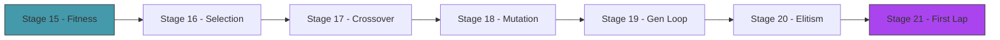
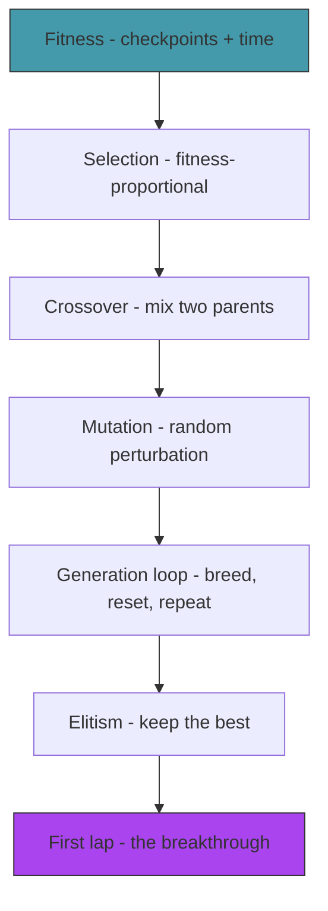

# Act 3 — The Evolution

> *50 random brains. Most crash instantly. But a few — by pure luck — survive a little longer, pass a checkpoint or two. Those lucky few become parents. Their children inherit their weights, with small random mutations. Generation after generation, the population improves. This is evolution, and you're about to watch it happen.*



---

## Stage 15 — Fitness

> *Difficulty: Easy — Defining what "good" means.*

The genetic algorithm needs a number that says how good each car is. We already have checkpoints — but raw checkpoint count is coarse (many cars tie at 0). A better fitness function adds partial credit: checkpoints passed + fraction of distance to the next checkpoint.

> [!tip] What You'll Learn
> - Fitness function design — the most important decision in evolutionary AI
> - Partial credit for progress between checkpoints
> - Why fitness function bugs cause bizarre evolved behavior

### 15.1 — Improved fitness

```rust
impl Car {
    pub fn fitness(&self) -> f32 {
        let base = self.checkpoints_passed as f32 * 100.0;

        // Partial credit: distance toward next checkpoint
        // (we'd need to compute this from position — simplified here)
        let time_bonus = self.time_alive * 0.1; // small bonus for surviving

        base + time_bonus
    }
}
```

The `* 100.0` on checkpoints ensures that passing a checkpoint is always worth more than surviving longer. A car that passes 1 checkpoint in 2 seconds beats a car that survives 10 seconds without passing any.

> [!note] Fitness function bugs
> If you accidentally reward time alive too much, the AI learns to drive in circles (infinite survival, zero progress). If you reward speed, it learns to accelerate into walls. The fitness function is the teacher — get it wrong and the AI learns the wrong lesson.

> [!check] Checkpoint
> Verify fitness increases with checkpoints passed. Verify a car with 1 checkpoint always beats a car with 0 checkpoints regardless of time alive. Stage 15 complete.

---

## Stage 16 — Selection

> *Difficulty: Medium — Choosing parents based on fitness.*

Not all cars are equal. The ones that drove furthest should have more children. **Fitness-proportional selection** gives each car a probability of being chosen as a parent proportional to its fitness. The best car might be chosen 10 times. The worst might never be chosen.

> [!tip] What You'll Learn
> - Fitness-proportional (roulette wheel) selection
> - Why randomness in selection matters (prevents premature convergence)
> - Tournament selection as an alternative

### 16.1 — Selection function

Create `src/evolution.rs`:

```rust
use crate::nn::NeuralNetwork;
use macroquad::rand::gen_range;

/// Select a parent index using fitness-proportional selection.
/// Higher fitness = higher probability of being selected.
pub fn select_parent(fitnesses: &[f32]) -> usize {
    let total: f32 = fitnesses.iter().sum();
    if total <= 0.0 {
        return gen_range(0, fitnesses.len()); // all zero — pick randomly
    }

    let mut threshold = gen_range(0.0, total);
    for (i, &f) in fitnesses.iter().enumerate() {
        threshold -= f;
        if threshold <= 0.0 {
            return i;
        }
    }

    fitnesses.len() - 1 // fallback
}
```

This is "roulette wheel" selection: imagine a wheel where each car's slice is proportional to its fitness. Spin the wheel — the bigger your slice, the more likely you're picked.

> [!check] Checkpoint
> Verify that a car with fitness 100 is selected much more often than a car with fitness 1. Stage 16 complete.

---

## Stage 17 — Crossover

> *Difficulty: Medium — Combining two parent networks into a child.*

Sexual reproduction in neural networks: take two parent networks and combine their weights. The simplest approach: for each weight, randomly pick from parent A or parent B. The child inherits traits from both parents.

> [!tip] What You'll Learn
> - Uniform crossover — randomly pick each weight from either parent
> - Why crossover helps (combines good traits from different parents)
> - The `get_params` / `from_params` pattern for treating networks as flat vectors

### 17.1 — Flatten and unflatten

Add to `NeuralNetwork`:

```rust
impl NeuralNetwork {
    /// Extract all parameters as a flat vector.
    pub fn get_params(&self) -> Vec<f32> {
        let mut params = Vec::with_capacity(self.param_count());
        params.extend_from_slice(&self.weights_ih.data);
        params.extend_from_slice(&self.biases_h);
        params.extend_from_slice(&self.weights_ho.data);
        params.extend_from_slice(&self.biases_o);
        params
    }

    /// Create a network from a flat parameter vector.
    pub fn from_params(input_size: usize, hidden_size: usize, output_size: usize, params: &[f32]) -> Self {
        let mut nn = Self::new(input_size, hidden_size, output_size);
        let mut i = 0;

        for val in nn.weights_ih.data.iter_mut() { *val = params[i]; i += 1; }
        for val in nn.biases_h.iter_mut() { *val = params[i]; i += 1; }
        for val in nn.weights_ho.data.iter_mut() { *val = params[i]; i += 1; }
        for val in nn.biases_o.iter_mut() { *val = params[i]; i += 1; }

        nn
    }
}
```

Flattening the network to a `Vec<f32>` makes crossover and mutation trivial — they operate on a flat list of numbers.

### 17.2 — Crossover function

```rust
/// Uniform crossover: for each parameter, randomly pick from parent A or B.
pub fn crossover(parent_a: &NeuralNetwork, parent_b: &NeuralNetwork) -> NeuralNetwork {
    let params_a = parent_a.get_params();
    let params_b = parent_b.get_params();

    let child_params: Vec<f32> = params_a.iter().zip(params_b.iter())
        .map(|(&a, &b)| if gen_range(0.0, 1.0) < 0.5 { a } else { b })
        .collect();

    NeuralNetwork::from_params(5, 6, 2, &child_params)
}
```

> [!check] Checkpoint
> Cross two networks. Verify the child's parameters are a mix of both parents. Stage 17 complete.

---

## Stage 18 — Mutation

> *Difficulty: Medium — Random perturbations that create novelty.*

Crossover combines existing traits. Mutation creates new ones. For each weight in the child network, there's a small chance (mutation rate) of adding random noise. This prevents the population from converging to a single solution and allows exploration of new strategies.

> [!tip] What You'll Learn
> - Mutation rate and magnitude
> - Gaussian-ish noise with uniform random
> - Why mutation is essential (without it, evolution stagnates)
> - Tuning mutation parameters

### 18.1 — Mutation function

```rust
const MUTATION_RATE: f32 = 0.1;     // 10% of weights mutated
const MUTATION_MAGNITUDE: f32 = 0.3; // max change per mutation

/// Mutate a network's parameters in place.
pub fn mutate(nn: &mut NeuralNetwork) {
    let mut params = nn.get_params();

    for val in params.iter_mut() {
        if gen_range(0.0, 1.0) < MUTATION_RATE {
            *val += gen_range(-MUTATION_MAGNITUDE, MUTATION_MAGNITUDE);
        }
    }

    *nn = NeuralNetwork::from_params(5, 6, 2, &params);
}
```

10% mutation rate means ~5 of the 50 parameters change each generation. 0.3 magnitude means each change is small — a weight of 0.5 might become 0.2 or 0.8, but not -5.0. Small mutations refine; large mutations explore.

> [!check] Checkpoint
> Mutate a network. Verify ~10% of parameters changed by small amounts. Stage 18 complete.

---

## Stage 19 — The Generation Loop

> *Difficulty: Medium — Select → crossover → mutate → run → repeat.*

This is where it all comes together. After all cars crash (or a time limit expires), evaluate fitness, breed the next generation, and reset. The generation counter ticks up. Fitness climbs. Cars get better.

> [!tip] What You'll Learn
> - The evolutionary loop
> - Generation timeout (don't wait forever for slow cars)
> - Resetting the simulation between generations
> - Watching fitness improve over time

### 19.1 — The generation loop

```rust
const GEN_TIME_LIMIT: f32 = 15.0; // seconds per generation

#[macroquad::main("Piloto")]
async fn main() {
    let track = Track::oval();
    let walls = track.wall_segments();
    let checkpoints = track.generate_checkpoints(20);

    let start_pos = vec2(400.0, 100.0);
    let start_angle = 0.0;

    let mut cars = spawn_population(start_pos, start_angle);
    let mut generation = 0;
    let mut gen_timer = 0.0;
    let mut best_ever_fitness = 0.0;

    loop {
        let dt = get_frame_time().min(0.05);
        gen_timer += dt;

        clear_background(Color::from_rgba(20, 20, 30, 255));

        // Update alive cars
        let alive_count = cars.iter().filter(|c| c.alive).count();
        for car in &mut cars {
            if car.alive {
                let input = car.brain_input(&walls);
                car.update(&input, dt);
                car.time_alive += dt;
                car.check_collision(&walls);
                car.check_checkpoints(&checkpoints);
            }
        }

        // Check if generation is over
        let gen_over = alive_count == 0 || gen_timer > GEN_TIME_LIMIT;

        if gen_over {
            // Evaluate fitness
            let fitnesses: Vec<f32> = cars.iter().map(|c| c.fitness()).collect();
            let best_fitness = fitnesses.iter().cloned().fold(0.0f32, f32::max);
            if best_fitness > best_ever_fitness {
                best_ever_fitness = best_fitness;
            }

            // Breed next generation
            let brains: Vec<NeuralNetwork> = cars.iter()
                .map(|c| c.brain.clone().unwrap())
                .collect();

            let mut new_brains = Vec::new();
            for _ in 0..POPULATION_SIZE {
                let parent_a = evolution::select_parent(&fitnesses);
                let parent_b = evolution::select_parent(&fitnesses);
                let mut child = evolution::crossover(&brains[parent_a], &brains[parent_b]);
                evolution::mutate(&mut child);
                new_brains.push(child);
            }

            // Reset cars with new brains
            cars = spawn_population(start_pos, start_angle);
            for (car, brain) in cars.iter_mut().zip(new_brains) {
                car.brain = Some(brain);
            }

            generation += 1;
            gen_timer = 0.0;
        }

        // Draw
        track.draw();
        for car in &cars { car.draw(); }

        // HUD
        draw_text(&format!("Generation {}", generation), 10.0, 30.0, 24.0, WHITE);
        draw_text(&format!("Alive: {}/{}", alive_count, POPULATION_SIZE), 10.0, 55.0, 20.0, GRAY);
        draw_text(&format!("Best ever: {:.0}", best_ever_fitness), 10.0, 80.0, 20.0, GREEN);
        draw_text(&format!("Time: {:.1}s / {:.0}s", gen_timer, GEN_TIME_LIMIT), 10.0, 105.0, 20.0, GRAY);

        next_frame().await;
    }
}
```

### 19.2 — Run it

```bash
cargo run
```

Watch the generations tick by. Generation 0: chaos. Generation 5: a few cars make it past the first corner. Generation 15: several cars navigate half the track. Generation 30+: the best car might complete the full oval.

The fitness counter climbs. Each generation is slightly better than the last. Evolution is working.

> [!check] Checkpoint
> Run for 20+ generations. Verify fitness increases over time. Verify cars visibly improve their driving. Stage 19 complete.

---

## Stage 20 — Elitism

> *Difficulty: Easy — Always keep the best.*

There's a problem: the best car from generation N might not survive into generation N+1. Crossover and mutation can destroy a good solution. **Elitism** fixes this: always copy the best car unchanged into the next generation. This guarantees fitness never decreases.

> [!tip] What You'll Learn
> - Elitism — preserving the best solution
> - Why fitness can decrease without elitism
> - The exploration/exploitation tradeoff

### 20.1 — Add elitism

In the breeding loop, replace the first child with the best parent:

```rust
// Find the best car's brain
let best_idx = fitnesses.iter()
    .enumerate()
    .max_by(|(_, a), (_, b)| a.partial_cmp(b).unwrap())
    .map(|(i, _)| i)
    .unwrap_or(0);

let mut new_brains = Vec::new();

// Elite: copy the best brain unchanged
new_brains.push(brains[best_idx].clone());

// Breed the rest
for _ in 1..POPULATION_SIZE {
    let parent_a = evolution::select_parent(&fitnesses);
    let parent_b = evolution::select_parent(&fitnesses);
    let mut child = evolution::crossover(&brains[parent_a], &brains[parent_b]);
    evolution::mutate(&mut child);
    new_brains.push(child);
}
```

One line change: the first car in each generation is the previous generation's champion, unmodified. The other 49 are bred normally.

> [!check] Checkpoint
> Verify that best fitness never decreases between generations. Stage 20 complete.

---

## Stage 21 — The First Lap

> *Difficulty: Hard — Tuning until a car completes the full track.*

This is the breakthrough stage. You have all the pieces — now tune the parameters until a car completes the full oval. This might require adjusting mutation rate, population size, generation time limit, fitness function, or even the track shape.

> [!tip] What You'll Learn
> - Hyperparameter tuning — the art of evolutionary AI
> - Diagnosing stagnation (fitness plateaus)
> - When to increase mutation (stuck) vs decrease it (oscillating)
> - The satisfaction of watching your AI complete a lap

### Tuning guide

| Symptom | Likely cause | Fix |
|---------|-------------|-----|
| Fitness stuck at 0 | Cars crash before any checkpoint | Widen the track or reduce speed |
| Fitness plateaus early | Population converged too fast | Increase mutation rate or magnitude |
| Fitness oscillates | Mutation too aggressive | Decrease mutation magnitude |
| Cars drive in circles | Fitness rewards time alive too much | Increase checkpoint weight |
| Cars hug one wall | Sensors don't cover enough angles | Add more sensors or widen angles |

### 21.1 — Add a fitness graph

Track best fitness per generation and draw a simple line graph:

```rust
let mut fitness_history: Vec<f32> = Vec::new();

// After each generation:
fitness_history.push(best_fitness);

// Draw the graph
let graph_x = 10.0;
let graph_y = screen_height() - 100.0;
let graph_w = 300.0;
let graph_h = 80.0;

if fitness_history.len() > 1 {
    let max_f = fitness_history.iter().cloned().fold(1.0f32, f32::max);
    for i in 1..fitness_history.len() {
        let x1 = graph_x + (i - 1) as f32 / fitness_history.len() as f32 * graph_w;
        let x2 = graph_x + i as f32 / fitness_history.len() as f32 * graph_w;
        let y1 = graph_y + graph_h - (fitness_history[i - 1] / max_f * graph_h);
        let y2 = graph_y + graph_h - (fitness_history[i] / max_f * graph_h);
        draw_line(x1, y1, x2, y2, 2.0, GREEN);
    }
}
```

### 21.2 — The moment

Run it. Watch the fitness graph climb. At some point — maybe generation 30, maybe generation 80 — a car will complete the full oval. The fitness graph will spike. You'll see a single car smoothly navigating every corner while the others crash around it.

That car's brain — 50 numbers — encodes a driving strategy that emerged from random noise through selection pressure. You didn't program "turn left when the left wall is close." Evolution discovered it.

> [!check] Checkpoint
> A car completes the full oval track. The fitness graph shows clear improvement over generations. Stage 21 complete. Take a screenshot.

---

## Act 3 Complete — The Evolution



You built a genetic algorithm that evolves neural network drivers:

| Component | What it does |
|-----------|-------------|
| Fitness | Checkpoints passed + time bonus |
| Selection | Roulette wheel — better cars breed more |
| Crossover | Uniform — randomly pick each weight from either parent |
| Mutation | 10% of weights perturbed by ±0.3 |
| Elitism | Best car copied unchanged to next generation |
| Generation loop | 15-second rounds, breed after all crash or timeout |

**Next up — Act 4: The Circuit.** Harder tracks, a track editor, save/load brains, and racing against your own AI.
