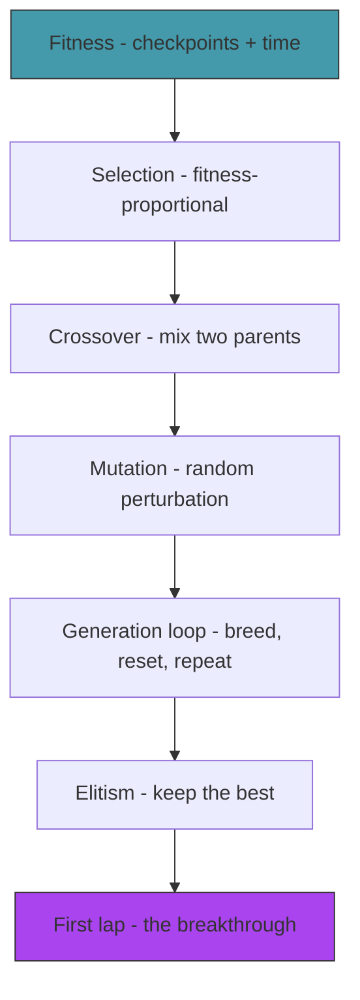

# Act 3 — The Evolution

> *50 random brains. Most crash instantly. But a few — by pure luck — survive a little longer, pass a checkpoint or two. Those lucky few become parents. Their children inherit their weights, with small random mutations. Generation after generation, the population improves. This is evolution, and you're about to watch it happen.*


---

## Stage 15 — Fitness

> *Difficulty: Easy — Defining what "good" means.*

*~40 min*

The genetic algorithm needs a number that says how good each car is. We already have checkpoints — but raw checkpoint count is coarse (many cars tie at 0). A better fitness function adds partial credit: checkpoints passed + fraction of distance to the next checkpoint.

> [!tip] What You'll Learn
> - Fitness function design — the most important decision in evolutionary AI
> - Partial credit for progress between checkpoints
> - Why fitness function bugs cause bizarre evolved behavior
> - Testing fitness ordering

### 15.1 — Improved fitness

**Try it yourself.** Improve the `fitness()` method so that:
1. Each checkpoint passed is worth 100 points (so checkpoint count dominates)
2. A small time-alive bonus (0.1 per second) breaks ties between cars with the same checkpoint count
3. A car with 1 checkpoint always beats a car with 0 checkpoints, regardless of time alive

Think about why the 100× multiplier matters. What would happen if checkpoints were worth 1 point and time alive was worth 1 point per second?

<details>
<summary>Solution</summary>

```rust
impl Car {
    pub fn fitness(&self) -> f32 {
        let base = self.checkpoints_passed as f32 * 100.0;
        let time_bonus = self.time_alive * 0.1;
        base + time_bonus
    }
}
```

</details>

The `* 100.0` on checkpoints ensures that passing a checkpoint is always worth more than surviving longer. A car that passes 1 checkpoint in 2 seconds (fitness: 100.2) beats a car that survives 10 seconds without passing any (fitness: 1.0).

> [!note] Fitness function bugs
> If you accidentally reward time alive too much, the AI learns to drive in circles (infinite survival, zero progress). If you reward speed, it learns to accelerate into walls. The fitness function is the teacher — get it wrong and the AI learns the wrong lesson. This is the single most common source of "my AI does something weird" bugs.

### 15.2 — Test fitness ordering

```rust
#[cfg(test)]
mod tests {
    use super::*;

    #[test]
    fn test_checkpoint_beats_time() {
        let mut car_a = Car::new(vec2(0.0, 0.0), 0.0, WHITE);
        car_a.checkpoints_passed = 1;
        car_a.time_alive = 2.0;

        let mut car_b = Car::new(vec2(0.0, 0.0), 0.0, WHITE);
        car_b.checkpoints_passed = 0;
        car_b.time_alive = 100.0; // survived much longer

        assert!(car_a.fitness() > car_b.fitness(),
            "1 checkpoint ({}) should beat 0 checkpoints ({})",
            car_a.fitness(), car_b.fitness());
    }
}
```

```bash
cargo test
```

> [!check] Checkpoint
> Verify fitness increases with checkpoints passed. Verify a car with 1 checkpoint always beats a car with 0 checkpoints regardless of time alive. Stage 15 complete.

---

## Stage 16 — Selection

> *Difficulty: Medium — Choosing parents based on fitness.*

*~45 min*

Not all cars are equal. The ones that drove furthest should have more children. **Fitness-proportional selection** gives each car a probability of being chosen as a parent proportional to its fitness. The best car might be chosen 10 times. The worst might never be chosen.

> [!tip] What You'll Learn
> - Fitness-proportional (roulette wheel) selection
> - Why randomness in selection matters (prevents premature convergence)
> - Creating a new module: `evolution.rs`
> - Testing probabilistic functions

### 16.1 — Selection function

Create `src/evolution.rs` (and add `mod evolution;` to `main.rs`):

**Try it yourself.** Write a `select_parent` function that:
- Takes `fitnesses: &[f32]` — fitness values for all cars
- Returns `usize` — the index of the selected parent
- Uses fitness-proportional selection: sum all fitnesses, pick a random threshold, walk through the list subtracting each fitness until the threshold goes below zero
- Handles the edge case where all fitnesses are zero (pick randomly)

This is "roulette wheel" selection: imagine a wheel where each car's slice is proportional to its fitness. Spin the wheel — the bigger your slice, the more likely you're picked.

<details>
<summary>Solution</summary>

```rust
use macroquad::rand::gen_range;

/// Select a parent index using fitness-proportional selection.
/// Higher fitness = higher probability of being selected.
pub fn select_parent(fitnesses: &[f32]) -> usize {
    let total: f32 = fitnesses.iter().sum();
    if total <= 0.0 {
        return gen_range(0, fitnesses.len()); // all zero — pick randomly
    }

    let mut threshold = gen_range(0.0, total);
    for (i, &f) in fitnesses.iter().enumerate() {
        threshold -= f;
        if threshold <= 0.0 {
            return i;
        }
    }

    fitnesses.len() - 1 // fallback
}
```

</details>

### 16.2 — Test selection bias

Testing randomness is tricky — you can't assert exact results. But you can run many trials and check the distribution:

```rust
#[cfg(test)]
mod tests {
    use super::*;

    #[test]
    fn test_selection_favors_high_fitness() {
        let fitnesses = vec![1.0, 1.0, 1.0, 100.0]; // index 3 is dominant

        let mut counts = [0u32; 4];
        for _ in 0..1000 {
            let idx = select_parent(&fitnesses);
            counts[idx] += 1;
        }

        // Index 3 has ~97% of total fitness — it should be selected most often
        assert!(counts[3] > 800,
            "Expected index 3 to be selected >800/1000 times, got {}", counts[3]);
    }

    #[test]
    fn test_selection_handles_all_zero() {
        let fitnesses = vec![0.0, 0.0, 0.0];
        // Should not panic — returns a random index
        let idx = select_parent(&fitnesses);
        assert!(idx < 3);
    }
}
```

```bash
cargo test
```

> [!check] Checkpoint
> Verify that a car with fitness 100 is selected much more often than a car with fitness 1. All tests pass. Stage 16 complete.

---

## Stage 17 — Crossover

> *Difficulty: Medium — Combining two parent networks into a child.*

*~45 min*

Sexual reproduction in neural networks: take two parent networks and combine their weights. The simplest approach: for each weight, randomly pick from parent A or parent B. The child inherits traits from both parents.

> [!tip] What You'll Learn
> - Uniform crossover — randomly pick each weight from either parent
> - The `get_params` / `from_params` pattern for treating networks as flat vectors
> - Why crossover helps (combines good traits from different parents)
> - Ownership and `.clone()` — when you need a copy

### 17.1 — Flatten and unflatten

To do crossover, we need to treat the network as a flat list of numbers. Add to `NeuralNetwork`:

**Try it yourself.** Write two methods:
- `get_params(&self) -> Vec<f32>` — extract all weights and biases into a single vector
- `from_params(input_size, hidden_size, output_size, params: &[f32]) -> Self` — reconstruct a network from a flat vector

The order must be consistent: weights_ih, biases_h, weights_ho, biases_o.

<details>
<summary>Solution</summary>

```rust
impl NeuralNetwork {
    /// Extract all parameters as a flat vector.
    pub fn get_params(&self) -> Vec<f32> {
        let mut params = Vec::with_capacity(self.param_count());
        params.extend_from_slice(&self.weights_ih.data);
        params.extend_from_slice(&self.biases_h);
        params.extend_from_slice(&self.weights_ho.data);
        params.extend_from_slice(&self.biases_o);
        params
    }

    /// Create a network from a flat parameter vector.
    pub fn from_params(input_size: usize, hidden_size: usize, output_size: usize, params: &[f32]) -> Self {
        let mut nn = Self::new(input_size, hidden_size, output_size);
        let mut i = 0;

        for val in nn.weights_ih.data.iter_mut() { *val = params[i]; i += 1; }
        for val in nn.biases_h.iter_mut() { *val = params[i]; i += 1; }
        for val in nn.weights_ho.data.iter_mut() { *val = params[i]; i += 1; }
        for val in nn.biases_o.iter_mut() { *val = params[i]; i += 1; }

        nn
    }
}
```

</details>

Flattening the network to a `Vec<f32>` makes crossover and mutation trivial — they operate on a flat list of numbers.

### 17.2 — Crossover function

Add to `src/evolution.rs`:

```rust
use crate::nn::NeuralNetwork;

/// Uniform crossover: for each parameter, randomly pick from parent A or B.
pub fn crossover(parent_a: &NeuralNetwork, parent_b: &NeuralNetwork) -> NeuralNetwork {
    let params_a = parent_a.get_params();
    let params_b = parent_b.get_params();

    let child_params: Vec<f32> = params_a.iter().zip(params_b.iter())
        .map(|(&a, &b)| if gen_range(0.0, 1.0) < 0.5 { a } else { b })
        .collect();

    NeuralNetwork::from_params(5, 6, 2, &child_params)
}
```

### 17.3 — Test roundtrip

```rust
#[test]
fn test_params_roundtrip() {
    let nn = NeuralNetwork::random(5, 6, 2);
    let params = nn.get_params();
    let nn2 = NeuralNetwork::from_params(5, 6, 2, &params);
    assert_eq!(nn.get_params(), nn2.get_params());
}

#[test]
fn test_crossover_mixes_parents() {
    let parent_a = NeuralNetwork::random(5, 6, 2);
    let parent_b = NeuralNetwork::random(5, 6, 2);
    let child = crossover(&parent_a, &parent_b);

    let pa = parent_a.get_params();
    let pb = parent_b.get_params();
    let pc = child.get_params();

    // Every child param should come from one parent or the other
    for i in 0..pc.len() {
        assert!(pc[i] == pa[i] || pc[i] == pb[i],
            "Child param {} ({}) doesn't match either parent ({} or {})",
            i, pc[i], pa[i], pb[i]);
    }
}
```

> [!check] Checkpoint
> Cross two networks. Verify the child's parameters are a mix of both parents. All tests pass. Stage 17 complete.

---

## Stage 18 — Mutation

> *Difficulty: Medium — Random perturbations that create novelty.*

*~40 min*

Crossover combines existing traits. Mutation creates new ones. For each weight in the child network, there's a small chance (mutation rate) of adding random noise. This prevents the population from converging to a single solution and allows exploration of new strategies.

> [!tip] What You'll Learn
> - Mutation rate and magnitude
> - Why mutation is essential (without it, evolution stagnates)
> - Tuning mutation parameters
> - The exploration/exploitation tradeoff

### 18.1 — Mutation function

**Try it yourself.** Write a `mutate` function that:
- Takes `nn: &mut NeuralNetwork`
- For each parameter, with probability `MUTATION_RATE` (0.1 = 10%), adds a random value in `[-MUTATION_MAGNITUDE, +MUTATION_MAGNITUDE]` (0.3)
- Modifies the network in place

Think about what 10% mutation rate means for 50 parameters: ~5 weights change each generation.

<details>
<summary>Solution</summary>

```rust
const MUTATION_RATE: f32 = 0.1;      // 10% of weights mutated
const MUTATION_MAGNITUDE: f32 = 0.3;  // max change per mutation

/// Mutate a network's parameters in place.
pub fn mutate(nn: &mut NeuralNetwork) {
    let mut params = nn.get_params();

    for val in params.iter_mut() {
        if gen_range(0.0, 1.0) < MUTATION_RATE {
            *val += gen_range(-MUTATION_MAGNITUDE, MUTATION_MAGNITUDE);
        }
    }

    *nn = NeuralNetwork::from_params(5, 6, 2, &params);
}
```

</details>

10% mutation rate means ~5 of the 50 parameters change each generation. 0.3 magnitude means each change is small — a weight of 0.5 might become 0.2 or 0.8, but not -5.0. Small mutations refine; large mutations explore.

### Concept: `&mut NeuralNetwork` — Mutating in Place

Notice `mutate` takes `&mut NeuralNetwork`, not `NeuralNetwork`. This means it modifies the network you pass in — it doesn't create a new one. The caller keeps ownership:

```rust
let mut child = crossover(&parent_a, &parent_b);
mutate(&mut child);  // modifies child in place
// child is still valid here, now with mutated weights
```

If `mutate` took `NeuralNetwork` (by value), it would *consume* the network — you couldn't use `child` afterward without getting it back as a return value. `&mut` is the Rust way of saying "I'll modify this and give it back."

### 18.2 — Test mutation

```rust
#[test]
fn test_mutation_changes_some_params() {
    let original = NeuralNetwork::random(5, 6, 2);
    let original_params = original.get_params();

    let mut mutated = original.clone();
    mutate(&mut mutated);
    let mutated_params = mutated.get_params();

    let changed = original_params.iter().zip(mutated_params.iter())
        .filter(|(a, b)| a != b)
        .count();

    // With 10% rate and 50 params, expect ~5 changes (but randomness varies)
    assert!(changed > 0, "Mutation should change at least some parameters");
    assert!(changed < 50, "Mutation shouldn't change all parameters");
}
```

> [!check] Checkpoint
> Mutate a network. Verify ~10% of parameters changed by small amounts. All tests pass. Stage 18 complete.

---

## Stage 19 — The Generation Loop

> *Difficulty: Medium — Select → crossover → mutate → run → repeat.*

*~60 min*

This is where it all comes together. After all cars crash (or a time limit expires), evaluate fitness, breed the next generation, and reset. The generation counter ticks up. Fitness climbs. Cars get better.

> [!tip] What You'll Learn
> - The evolutionary loop
> - Generation timeout (don't wait forever for slow cars)
> - Resetting the simulation between generations
> - Watching fitness improve over time
> - `.clone()` — when you need to copy data the borrow checker won't let you share

### Concept: Why `.clone()` Is Needed Here

When breeding the next generation, we need to:
1. Read each car's fitness (borrows `cars`)
2. Read each car's brain (borrows `cars`)
3. Create new brains from parents (needs the old brains)
4. Replace all cars with new ones (needs `&mut cars`)

Steps 1-3 need to read from `cars`, but step 4 needs to write to it. Rust won't let you do both at once. The solution: extract the data you need (fitnesses and brains) into separate `Vec`s *before* replacing the cars. The brains need `.clone()` because we're copying them out of the cars.

```rust
// Extract data before modifying cars
let fitnesses: Vec<f32> = cars.iter().map(|c| c.fitness()).collect();
let brains: Vec<NeuralNetwork> = cars.iter()
    .map(|c| c.brain.clone().unwrap())  // clone each brain out
    .collect();

// Now we can breed and replace
cars = spawn_population(start_pos, start_angle);
```

### 19.1 — The generation loop

```rust
const GEN_TIME_LIMIT: f32 = 15.0; // seconds per generation

#[macroquad::main("Piloto")]
async fn main() {
    let track = Track::oval();
    let walls = track.wall_segments();
    let checkpoints = track.generate_checkpoints(20);

    let start_pos = vec2(400.0, 100.0);
    let start_angle = 0.0;

    let mut cars = spawn_population(start_pos, start_angle);
    let mut generation = 0;
    let mut gen_timer = 0.0;
    let mut best_ever_fitness = 0.0;

    loop {
        let dt = get_frame_time().min(0.05);
        gen_timer += dt;

        clear_background(Color::from_rgba(20, 20, 30, 255));

        // Update alive cars
        let alive_count = cars.iter().filter(|c| c.alive).count();
        for car in &mut cars {
            if car.alive {
                let input = car.brain_input(&walls);
                car.update(&input, dt);
                car.time_alive += dt;
                car.check_collision(&walls);
                car.check_checkpoints(&checkpoints);
            }
        }

        // Check if generation is over
        let gen_over = alive_count == 0 || gen_timer > GEN_TIME_LIMIT;

        if gen_over {
            // Evaluate fitness
            let fitnesses: Vec<f32> = cars.iter().map(|c| c.fitness()).collect();
            let best_fitness = fitnesses.iter().cloned().fold(0.0f32, f32::max);
            if best_fitness > best_ever_fitness {
                best_ever_fitness = best_fitness;
            }

            // Extract brains (clone out of cars before replacing them)
            let brains: Vec<NeuralNetwork> = cars.iter()
                .map(|c| c.brain.clone().unwrap())
                .collect();

            // Breed next generation
            let mut new_brains = Vec::new();
            for _ in 0..POPULATION_SIZE {
                let parent_a = evolution::select_parent(&fitnesses);
                let parent_b = evolution::select_parent(&fitnesses);
                let mut child = evolution::crossover(&brains[parent_a], &brains[parent_b]);
                evolution::mutate(&mut child);
                new_brains.push(child);
            }

            // Reset cars with new brains
            cars = spawn_population(start_pos, start_angle);
            for (car, brain) in cars.iter_mut().zip(new_brains) {
                car.brain = Some(brain);
            }

            generation += 1;
            gen_timer = 0.0;
        }

        // Draw
        track.draw();
        for car in &cars { car.draw(); }

        // HUD
        draw_text(&format!("Generation {}", generation), 10.0, 30.0, 24.0, WHITE);
        draw_text(&format!("Alive: {}/{}", alive_count, POPULATION_SIZE), 10.0, 55.0, 20.0, GRAY);
        draw_text(&format!("Best ever: {:.0}", best_ever_fitness), 10.0, 80.0, 20.0, GREEN);
        draw_text(&format!("Time: {:.1}s / {:.0}s", gen_timer, GEN_TIME_LIMIT), 10.0, 105.0, 20.0, GRAY);

        next_frame().await;
    }
}
```

### 19.2 — Run it

```bash
cargo run
```

Watch the generations tick by. Generation 0: chaos. Generation 5: a few cars make it past the first corner. Generation 15: several cars navigate half the track. Generation 30+: the best car might complete the full oval.

The fitness counter climbs. Each generation is slightly better than the last. Evolution is working.

> [!warning] Common Mistake: `.unwrap()` on `Option`
> The line `c.brain.clone().unwrap()` will panic if any car has `brain: None`. Right now all cars have brains, so this is safe. But it's a ticking time bomb — if you later add a keyboard-controlled car to the population, it will crash here.
>
> A safer approach:
> ```rust
> let brains: Vec<NeuralNetwork> = cars.iter()
>     .filter_map(|c| c.brain.clone())  // skip cars without brains
>     .collect();
> ```
> We'll keep `.unwrap()` for now since we control the population, but in a real application you'd use `filter_map` or return a `Result`. We'll address error handling more in Act 4.

### Extend it

Try changing `POPULATION_SIZE` to 100 and see if evolution is faster (more diversity) or slower (more computation per generation). Try `GEN_TIME_LIMIT = 30.0` — does giving cars more time help?

> [!check] Checkpoint
> Run for 20+ generations. Verify fitness increases over time. Verify cars visibly improve their driving. Stage 19 complete.

---

## Stage 20 — Elitism

> *Difficulty: Easy — Always keep the best.*

*~30 min*

There's a problem: the best car from generation N might not survive into generation N+1. Crossover and mutation can destroy a good solution. **Elitism** fixes this: always copy the best car unchanged into the next generation. This guarantees fitness never decreases.

> [!tip] What You'll Learn
> - Elitism — preserving the best solution
> - Why fitness can decrease without elitism
> - `max_by` with `partial_cmp` — finding the best in a collection
> - The exploration/exploitation tradeoff

### 20.1 — Add elitism

In the breeding loop, replace the first child with the best parent:

```rust
// Find the best car's brain
let best_idx = fitnesses.iter()
    .enumerate()
    .max_by(|(_, a), (_, b)| a.partial_cmp(b).unwrap())
    .map(|(i, _)| i)
    .unwrap_or(0);

let mut new_brains = Vec::new();

// Elite: copy the best brain unchanged
new_brains.push(brains[best_idx].clone());

// Breed the rest
for _ in 1..POPULATION_SIZE {
    let parent_a = evolution::select_parent(&fitnesses);
    let parent_b = evolution::select_parent(&fitnesses);
    let mut child = evolution::crossover(&brains[parent_a], &brains[parent_b]);
    evolution::mutate(&mut child);
    new_brains.push(child);
}
```

One change: the first car in each generation is the previous generation's champion, unmodified. The other 49 are bred normally.

> [!note] Why `partial_cmp` instead of `cmp`?
> `f32` doesn't implement `Ord` (total ordering) because `NaN != NaN`. It only implements `PartialOrd`. So you must use `partial_cmp` and handle the `None` case (which only happens with NaN). `.unwrap()` is safe here because our fitness function never produces NaN. In Python, `float('nan')` causes similar comparison issues — `max([1.0, float('nan')])` returns `nan`, which is probably not what you want.

### Extend it

Comment out the elitism line (make all 50 children bred normally) and run for 50 generations. Watch the "Best ever" counter — without elitism, the best fitness sometimes *decreases* between generations. A lucky mutation gets lost. With elitism, best fitness is monotonically non-decreasing.

> [!check] Checkpoint
> Verify that best fitness never decreases between generations. Stage 20 complete.

---

## Stage 21 — The First Lap

> *Difficulty: Hard — Tuning until a car completes the full track.*

*~75 min*

This is the breakthrough stage. You have all the pieces — now tune the parameters until a car completes the full oval. This might require adjusting mutation rate, population size, generation time limit, fitness function, or even the track shape.

> [!tip] What You'll Learn
> - Hyperparameter tuning — the art of evolutionary AI
> - Diagnosing stagnation (fitness plateaus)
> - When to increase mutation (stuck) vs decrease it (oscillating)
> - Drawing a fitness graph
> - The satisfaction of watching your AI complete a lap

### Tuning guide

| Symptom | Likely cause | Fix |
|---------|-------------|-----|
| Fitness stuck at 0 | Cars crash before any checkpoint | Widen the track or reduce speed |
| Fitness plateaus early | Population converged too fast | Increase mutation rate or magnitude |
| Fitness oscillates | Mutation too aggressive | Decrease mutation magnitude |
| Cars drive in circles | Fitness rewards time alive too much | Increase checkpoint weight in `fitness()` |
| Cars hug one wall | Sensors don't cover enough angles | Add more sensors or widen angles |

### 21.1 — Add a fitness graph

**Try it yourself.** Track `best_fitness` per generation in a `Vec<f32>`. After each generation, push the best fitness. Then draw a simple line graph in the bottom-left corner: x-axis = generation, y-axis = fitness, scaled to fit a 300×80 pixel box.

Hint: for each pair of consecutive points, draw a line from `(gen_i / total * width, max_fitness - fitness_i / max * height)` to the next point.

<details>
<summary>Solution</summary>

```rust
let mut fitness_history: Vec<f32> = Vec::new();

// After each generation:
fitness_history.push(best_fitness);

// Draw the graph
let graph_x = 10.0;
let graph_y = screen_height() - 100.0;
let graph_w = 300.0;
let graph_h = 80.0;

if fitness_history.len() > 1 {
    let max_f = fitness_history.iter().cloned().fold(1.0f32, f32::max);
    for i in 1..fitness_history.len() {
        let x1 = graph_x + (i - 1) as f32 / fitness_history.len() as f32 * graph_w;
        let x2 = graph_x + i as f32 / fitness_history.len() as f32 * graph_w;
        let y1 = graph_y + graph_h - (fitness_history[i - 1] / max_f * graph_h);
        let y2 = graph_y + graph_h - (fitness_history[i] / max_f * graph_h);
        draw_line(x1, y1, x2, y2, 2.0, GREEN);
    }
}
```

</details>

### 21.2 — The moment

Run it. Watch the fitness graph climb. At some point — maybe generation 30, maybe generation 80 — a car will complete the full oval. The fitness graph will spike. You'll see a single car smoothly navigating every corner while the others crash around it.

That car's brain — 50 numbers — encodes a driving strategy that emerged from random noise through selection pressure. You didn't program "turn left when the left wall is close." Evolution discovered it.

> [!check] Checkpoint
> A car completes the full oval track. The fitness graph shows clear improvement over generations. Stage 21 complete. Take a screenshot — you earned it.

---

## Act 3 Complete — The Evolution



You built a genetic algorithm that evolves neural network drivers:

| Component | What it does |
|-----------|-------------|
| Fitness | Checkpoints passed × 100 + time bonus |
| Selection | Roulette wheel — better cars breed more |
| Crossover | Uniform — randomly pick each weight from either parent |
| Mutation | 10% of weights perturbed by ±0.3 |
| Elitism | Best car copied unchanged to next generation |
| Generation loop | 15-second rounds, breed after all crash or timeout |

| Rust Concept | Where You Used It |
|-------------|-------------------|
| `.clone()` | Copying brains out of cars before replacing the population |
| `&mut` parameter | `mutate(&mut nn)` — modify in place without taking ownership |
| `Vec` as flat parameter storage | `get_params` / `from_params` for crossover and mutation |
| `partial_cmp` | Comparing `f32` values (no total ordering due to NaN) |
| Closures with iterators | `.map`, `.filter`, `.fold`, `.max_by`, `.enumerate` |
| Testing randomness | Statistical assertions (selection bias, mutation count) |

**Next up — Act 4: The Circuit.** Harder tracks, a track editor, save/load brains, and racing against your own AI.
