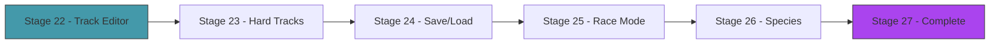

# Act 4 — The Circuit

> *The AI can drive an oval. But can it handle a hairpin? A chicane? A track it's never seen? This act pushes the AI further: harder tracks, a track editor, saving and loading trained brains, and the ultimate test — racing against your own creation.*



---

## Stage 22 — Track Editor

> *Difficulty: Medium — Click to place walls, save/load tracks as JSON.*

*~60 min*

The oval is a good starting track, but evolution needs variety. This stage builds a simple track editor: click to place outer wall points, then inner wall points, save to JSON, load at startup.

> [!tip] What You'll Learn
> - Mouse input with macroquad (`mouse_position`, `is_mouse_button_pressed`)
> - Serializing geometry to JSON with serde
> - `Result<T, E>` and the `?` operator — proper error handling
> - Editor mode vs simulation mode (state machine with enums)
> - Building tools for your own workflow

### Concept: Error Handling with `Result<T, E>`

Until now, we've used `.unwrap()` everywhere — "give me the value or crash." That's fine for prototyping, but saving/loading files can fail: the file might not exist, the JSON might be malformed, the disk might be full. Time to handle errors properly.

Rust uses `Result<T, E>` instead of exceptions:

```rust
// Python: try/except
try:
    data = json.loads(text)
except json.JSONDecodeError as e:
    print(f"Bad JSON: {e}")

// Rust: Result + ?
fn load_track(path: &str) -> Result<Track, String> {
    let json = std::fs::read_to_string(path)
        .map_err(|e| format!("Can't read {path}: {e}"))?;  // ? returns early on error
    let data: TrackData = serde_json::from_str(&json)
        .map_err(|e| format!("Bad JSON in {path}: {e}"))?;
    Ok(Track { /* ... */ })
}
```

The `?` operator is the key: if the expression before it is `Err`, the function returns that error immediately. If it's `Ok`, it unwraps the value and continues. It's like a `try` that auto-returns on failure.

| Python | Rust | Notes |
|--------|------|-------|
| `try: ... except:` | `match result { Ok(v) => ..., Err(e) => ... }` | Explicit handling |
| Exceptions propagate automatically | `?` propagates errors | Must opt in with `?` |
| `raise ValueError("msg")` | `Err("msg".to_string())` | Return an error |
| No compile-time check | Function signature shows `Result` | Caller knows it can fail |

### 22.1 — Add serde

Update `Cargo.toml`:

```toml
[dependencies]
macroquad = "0.4"
serde = { version = "1", features = ["derive"] }
serde_json = "1"
```

### 22.2 — Track data format

```rust
use serde::{Serialize, Deserialize};

#[derive(Serialize, Deserialize)]
pub struct TrackData {
    pub outer: Vec<[f32; 2]>,
    pub inner: Vec<[f32; 2]>,
}
```

We serialize `Vec2` as `[f32; 2]` arrays because `Vec2` doesn't implement `Serialize` by default. The conversion is simple: `[v.x, v.y]` and `vec2(p[0], p[1])`.

### 22.3 — Save and load with proper error handling

**Try it yourself.** Write `save_track` and `load_track` functions that return `Result<(), String>` and `Result<Track, String>` respectively. Use `?` with `.map_err(|e| format!("...{e}"))` to convert IO and JSON errors into readable strings.

<details>
<summary>Solution</summary>

```rust
pub fn save_track(outer: &[Vec2], inner: &[Vec2], path: &str) -> Result<(), String> {
    let data = TrackData {
        outer: outer.iter().map(|v| [v.x, v.y]).collect(),
        inner: inner.iter().map(|v| [v.x, v.y]).collect(),
    };
    let json = serde_json::to_string_pretty(&data)
        .map_err(|e| format!("Failed to serialize track: {e}"))?;
    std::fs::write(path, json)
        .map_err(|e| format!("Failed to write {path}: {e}"))?;
    Ok(())
}

pub fn load_track(path: &str) -> Result<Track, String> {
    let json = std::fs::read_to_string(path)
        .map_err(|e| format!("Failed to read {path}: {e}"))?;
    let data: TrackData = serde_json::from_str(&json)
        .map_err(|e| format!("Bad JSON in {path}: {e}"))?;
    Ok(Track {
        outer: data.outer.iter().map(|p| vec2(p[0], p[1])).collect(),
        inner: data.inner.iter().map(|p| vec2(p[0], p[1])).collect(),
    })
}
```

</details>

### 22.4 — Editor mode

Add an editor state that captures mouse clicks as wall points:

```rust
enum EditorPhase {
    PlacingOuter,
    PlacingInner,
    Done,
}
```

In the editor loop:
- Left-click adds a point to the current wall
- Right-click finishes the current wall and moves to the next phase
- `S` key saves to `track.json`
- Draw placed points as circles and connect them with lines so you can see the shape

```rust
// Editor input handling
if is_mouse_button_pressed(MouseButton::Left) {
    let (mx, my) = mouse_position();
    match phase {
        EditorPhase::PlacingOuter => outer_points.push(vec2(mx, my)),
        EditorPhase::PlacingInner => inner_points.push(vec2(mx, my)),
        EditorPhase::Done => {}
    }
}

if is_mouse_button_pressed(MouseButton::Right) {
    match phase {
        EditorPhase::PlacingOuter => phase = EditorPhase::PlacingInner,
        EditorPhase::PlacingInner => phase = EditorPhase::Done,
        _ => {}
    }
}

if is_key_pressed(KeyCode::S) && matches!(phase, EditorPhase::Done) {
    match save_track(&outer_points, &inner_points, "track.json") {
        Ok(()) => println!("Track saved!"),
        Err(e) => eprintln!("Save failed: {e}"),
    }
}
```

### 22.5 — Load on startup

At the start of `main`, try to load a custom track. Fall back to the oval if no file exists:

```rust
let track = match load_track("track.json") {
    Ok(t) => {
        println!("Loaded custom track from track.json");
        t
    }
    Err(_) => {
        println!("No custom track found, using oval");
        Track::oval()
    }
};
```

This is idiomatic Rust error handling: try the operation, handle both outcomes explicitly. No hidden exceptions, no silent failures.

### Extend it

Add an "undo" feature: press `Z` to remove the last placed point. This is just `outer_points.pop()` or `inner_points.pop()` depending on the current phase. Small quality-of-life features make tools usable.

> [!check] Checkpoint
> Open the editor, click to place a track, save it, reload and verify it appears. Stage 22 complete.

---

## Stage 23 — Harder Tracks

> *Difficulty: Medium — Tight corners, chicanes, and varying width.*

*~45 min*

The oval has gentle curves. Real tracks have hairpins, chicanes, and narrow sections. This stage creates 2-3 preset tracks of increasing difficulty and tests whether the AI can handle them.

> [!tip] What You'll Learn
> - How track geometry affects AI difficulty
> - Why sharp corners require different strategies than gentle curves
> - Generalization — can an AI trained on one track drive another?
> - Switching between tracks at runtime

### 23.1 — Preset tracks

Add harder tracks to `Track`:

```rust
impl Track {
    pub fn figure_eight() -> Self {
        // A figure-8 with a crossing point
        let cx = 400.0;
        let cy = 300.0;
        let segments = 32;
        let r_outer = 200.0;
        let r_inner = 120.0;
        let offset = 180.0;

        let mut outer = Vec::new();
        let mut inner = Vec::new();

        // Left loop
        for i in 0..segments {
            let angle = (i as f32 / segments as f32) * std::f32::consts::TAU;
            outer.push(vec2(cx - offset + angle.cos() * r_outer, cy + angle.sin() * r_outer));
            inner.push(vec2(cx - offset + angle.cos() * r_inner, cy + angle.sin() * r_inner));
        }

        // Right loop (reversed winding for figure-8 shape)
        for i in 0..segments {
            let angle = (i as f32 / segments as f32) * std::f32::consts::TAU;
            outer.push(vec2(cx + offset + angle.cos() * r_outer, cy - angle.sin() * r_outer));
            inner.push(vec2(cx + offset + angle.cos() * r_inner, cy - angle.sin() * r_inner));
        }

        Track { outer, inner }
    }

    pub fn hairpin() -> Self {
        // A track with two tight 180° hairpin turns connected by straights
        let w = 40.0; // road width
        let outer = vec![
            vec2(100.0, 200.0), vec2(600.0, 200.0),  // top straight
            vec2(650.0, 250.0), vec2(650.0, 350.0),   // right hairpin outer
            vec2(600.0, 400.0), vec2(100.0, 400.0),   // bottom straight
            vec2(50.0, 350.0), vec2(50.0, 250.0),     // left hairpin outer
        ];
        let inner = vec![
            vec2(100.0, 200.0 + w), vec2(600.0, 200.0 + w),
            vec2(650.0 - w, 250.0), vec2(650.0 - w, 350.0),
            vec2(600.0, 400.0 - w), vec2(100.0, 400.0 - w),
            vec2(50.0 + w, 350.0), vec2(50.0 + w, 250.0),
        ];
        Track { outer, inner }
    }
}
```

### 23.2 — Track switching

Add keyboard shortcuts to switch tracks:

```rust
if is_key_pressed(KeyCode::F1) { /* reload with Track::oval() */ }
if is_key_pressed(KeyCode::F2) { /* reload with Track::figure_eight() */ }
if is_key_pressed(KeyCode::F3) { /* reload with Track::hairpin() */ }
if is_key_pressed(KeyCode::F4) { /* reload from track.json */ }
```

When switching tracks, reset the population and generation counter — the AI needs to relearn for each track.

### 23.3 — Test generalization

Train on the oval for 50+ generations until a car completes the track. Then press F3 to switch to the hairpin track *without retraining*. The AI will likely fail — it learned oval-specific behavior (gentle curves, consistent speed). Retrain on the hairpin and watch it develop a different strategy (slower approach to corners, sharper turns).

> [!note] Generalization is hard
> An AI trained on one track memorizes that track's geometry through its sensor patterns. It doesn't learn "driving" in general — it learns "this specific sequence of sensor readings." True generalization would require training on many tracks simultaneously (randomize the track each generation), which is possible but slower. This is a fundamental challenge in all of machine learning, not just genetic algorithms.

### Extend it

Try training on the oval for 30 generations, then switching to the hairpin and continuing evolution (don't reset the brains). Does the oval-trained population adapt faster than a random population? This is **transfer learning** — using knowledge from one task to bootstrap another.

> [!check] Checkpoint
> Create a harder track. Verify the oval-trained AI fails on it. Retrain on the new track and verify it adapts. Stage 23 complete.

---

## Stage 24 — Save and Load Brains

> *Difficulty: Easy — Serialize the best neural network to JSON.*

*~35 min*

Training takes time. You don't want to retrain every time you run the program. This stage saves the best brain to a JSON file and loads it at startup, so you can resume evolution or deploy a trained driver.

> [!tip] What You'll Learn
> - Serializing neural network weights with serde
> - Adding `Serialize, Deserialize` derives
> - Saving/loading trained models — the concept of a "checkpoint" in ML training
> - Using `Result` consistently (no more `.unwrap()` on file operations)

### 24.1 — Serialize the network

Add `Serialize, Deserialize` derives to `Matrix` and `NeuralNetwork`:

```rust
use serde::{Serialize, Deserialize};

#[derive(Debug, Clone, Serialize, Deserialize)]
pub struct Matrix {
    pub rows: usize,
    pub cols: usize,
    pub data: Vec<f32>,
}

#[derive(Debug, Clone, Serialize, Deserialize)]
pub struct NeuralNetwork {
    pub weights_ih: Matrix,
    pub biases_h: Vec<f32>,
    pub weights_ho: Matrix,
    pub biases_o: Vec<f32>,
}
```

That's it — serde's `derive` macros generate all the serialization code. Every field that implements `Serialize` gets serialized automatically. `Vec<f32>`, `usize`, and our `Matrix` (which contains those types) all work out of the box.

### 24.2 — Save and load functions

**Try it yourself.** Write `save_brain` and `load_brain` using the same `Result` + `?` pattern from Stage 22. Auto-save the best brain every 10 generations. Load on startup if the file exists.

<details>
<summary>Solution</summary>

```rust
fn save_brain(nn: &NeuralNetwork, path: &str) -> Result<(), String> {
    let json = serde_json::to_string_pretty(nn)
        .map_err(|e| format!("Failed to serialize brain: {e}"))?;
    std::fs::write(path, json)
        .map_err(|e| format!("Failed to write {path}: {e}"))?;
    Ok(())
}

fn load_brain(path: &str) -> Result<NeuralNetwork, String> {
    let json = std::fs::read_to_string(path)
        .map_err(|e| format!("Failed to read {path}: {e}"))?;
    let nn: NeuralNetwork = serde_json::from_str(&json)
        .map_err(|e| format!("Bad JSON in {path}: {e}"))?;
    Ok(nn)
}
```

</details>

### 24.3 — Auto-save in the generation loop

```rust
if gen_over {
    // ... existing breeding code ...

    // Auto-save every 10 generations
    if generation % 10 == 0 {
        if let Err(e) = save_brain(&brains[best_idx], "best_brain.json") {
            eprintln!("Auto-save failed: {e}");
        }
    }
}
```

### 24.4 — Load on startup

```rust
// At startup, try to load a pre-trained brain for the elite slot
let loaded_brain = match load_brain("best_brain.json") {
    Ok(brain) => {
        println!("Loaded pre-trained brain from best_brain.json");
        Some(brain)
    }
    Err(_) => None,
};

// When spawning the first generation, use the loaded brain for car 0
if let Some(brain) = loaded_brain {
    cars[0].brain = Some(brain);
}
```

### 24.5 — Test it

```bash
cargo run
```

Train for 50 generations. Quit. Restart. The best brain loads immediately and drives from generation 0. Evolution continues from where it left off (the elite car has the saved brain, the rest are random — but selection will quickly spread the good genes).

### Extend it

Add a key (`B`) that saves the current best brain on demand, with a filename that includes the generation number: `brain_gen_47.json`. This lets you keep snapshots and compare brains from different points in training.

> [!check] Checkpoint
> Train for 50 generations, quit, restart. Verify the best brain is loaded and drives immediately without retraining. Stage 24 complete.

---

## Stage 25 — Race Mode

> *Difficulty: Medium — You vs your AI, head to head.*

*~50 min*

The ultimate test: you drive with WASD, the AI drives with its neural network, same track, same start. Who's faster? This stage adds a race mode where human and AI compete side by side.

> [!tip] What You'll Learn
> - Running two cars with different control sources simultaneously
> - Enum-based state machines for game modes
> - Comparing human vs AI performance
> - The humbling moment when your AI beats you

### 25.1 — Game mode enum

```rust
#[derive(PartialEq)]
enum GameMode {
    Evolution,
    Race,
    Editor,
}
```

### 25.2 — Race mode implementation

In race mode, spawn two cars: one keyboard-controlled (yellow), one brain-controlled (cyan). Both start at the same position. Track checkpoints for both. Display who's ahead.

```rust
// Race mode setup
let mut human_car = Car::new(start_pos, start_angle, YELLOW);
let mut ai_car = Car::new(start_pos, start_angle, Color::from_rgba(0, 200, 255, 255));
ai_car.brain = match load_brain("best_brain.json") {
    Ok(brain) => Some(brain),
    Err(e) => {
        eprintln!("No trained brain found: {e}");
        eprintln!("Train in evolution mode first, then switch to race mode.");
        Some(NeuralNetwork::random(5, 6, 2)) // fallback to random
    }
};

// Race loop
let human_input = Car::keyboard_input();
human_car.update(&human_input, dt);
human_car.check_collision(&walls);
human_car.check_checkpoints(&checkpoints);

let ai_input = ai_car.brain_input(&walls);
ai_car.update(&ai_input, dt);
ai_car.check_collision(&walls);
ai_car.check_checkpoints(&checkpoints);

// HUD
draw_text(&format!("You: {} checkpoints", human_car.checkpoints_passed), 10.0, 30.0, 20.0, YELLOW);
draw_text(&format!("AI:  {} checkpoints", ai_car.checkpoints_passed), 10.0, 55.0, 20.0, Color::from_rgba(0, 200, 255, 255));
```

### 25.3 — Mode switching

```rust
if is_key_pressed(KeyCode::Key1) { mode = GameMode::Evolution; }
if is_key_pressed(KeyCode::Key2) { mode = GameMode::Race; }
if is_key_pressed(KeyCode::Key3) { mode = GameMode::Editor; }
```

Display the current mode and available keys in the HUD so the user always knows how to switch.

### 25.4 — Test it

Train in evolution mode until a car completes the track. Save the brain. Press `2` to switch to race mode. You and the AI start side by side. The AI takes the racing line perfectly (it evolved for this). You try to keep up.

### Extend it

Add a lap timer that shows elapsed time for each car. After one full lap (20 checkpoints), display the winner and the time difference. Can you beat a well-trained AI? (Spoiler: probably not on the oval, but you might on a track with features the AI hasn't seen.)

> [!check] Checkpoint
> Race against your trained AI. Note who completes the track first. Stage 25 complete.

---

## Stage 26 — Species and Niches

> *Difficulty: Hard — Protecting innovation with speciation.*

*~75 min*

Sometimes evolution gets stuck: the entire population converges to one mediocre strategy, and mutations can't escape the local optimum. **Speciation** groups similar networks into species and ensures each species gets a fair share of offspring. This protects innovative (but currently weak) strategies from being outcompeted before they mature.

> [!tip] What You'll Learn
> - Network distance metric (how different are two networks?)
> - Speciation — grouping similar networks
> - Adjusted fitness — fitness divided by species size
> - Why diversity preservation prevents premature convergence
> - `HashMap` for counting species sizes

### 26.1 — Network distance

**Try it yourself.** Write a function that computes the "distance" between two neural networks as the mean absolute difference of their parameters. Two identical networks have distance 0. Two very different networks have a large distance.

<details>
<summary>Solution</summary>

```rust
/// Compute the distance between two networks (mean absolute weight difference).
pub fn network_distance(a: &NeuralNetwork, b: &NeuralNetwork) -> f32 {
    let pa = a.get_params();
    let pb = b.get_params();
    pa.iter().zip(pb.iter())
        .map(|(a, b)| (a - b).abs())
        .sum::<f32>() / pa.len() as f32
}
```

</details>

### 26.2 — Species assignment

Networks within a threshold distance of each other belong to the same species. The first member of each species is the "representative" — new networks are compared against representatives.

```rust
use std::collections::HashMap;

const SPECIES_THRESHOLD: f32 = 0.5;

pub fn assign_species(population: &[NeuralNetwork]) -> Vec<usize> {
    let mut species: Vec<Vec<usize>> = Vec::new();
    let mut assignments = vec![0usize; population.len()];

    for (i, nn) in population.iter().enumerate() {
        let mut found = false;
        for (s, members) in species.iter().enumerate() {
            let representative = &population[members[0]];
            if network_distance(nn, representative) < SPECIES_THRESHOLD {
                species[s].push(i);
                assignments[i] = s;
                found = true;
                break;
            }
        }
        if !found {
            assignments[i] = species.len();
            species.push(vec![i]);
        }
    }

    assignments
}
```

### 26.3 — Adjusted fitness

Divide each car's fitness by the size of its species. This prevents a large species from dominating — small species with novel strategies get proportionally more offspring.

```rust
pub fn adjusted_fitnesses(fitnesses: &[f32], species: &[usize]) -> Vec<f32> {
    let mut species_sizes: HashMap<usize, usize> = HashMap::new();
    for &s in species {
        *species_sizes.entry(s).or_insert(0) += 1;
    }

    fitnesses.iter().enumerate()
        .map(|(i, &f)| f / species_sizes[&species[i]] as f32)
        .collect()
}
```

### 26.4 — Integrate into the generation loop

After computing fitnesses, assign species and adjust:

```rust
let species = evolution::assign_species(&brains);
let adj_fitnesses = evolution::adjusted_fitnesses(&fitnesses, &species);
let num_species = species.iter().collect::<std::collections::HashSet<_>>().len();

// Use adj_fitnesses for selection instead of raw fitnesses
```

### 26.5 — Test speciation

```rust
#[test]
fn test_identical_networks_same_species() {
    let nn = NeuralNetwork::random(5, 6, 2);
    let population = vec![nn.clone(), nn.clone(), nn.clone()];
    let species = assign_species(&population);
    // All identical → all same species
    assert!(species.iter().all(|&s| s == species[0]));
}

#[test]
fn test_adjusted_fitness_divides_by_species_size() {
    let fitnesses = vec![100.0, 100.0, 50.0];
    let species = vec![0, 0, 1]; // two in species 0, one in species 1
    let adjusted = adjusted_fitnesses(&fitnesses, &species);
    assert!((adjusted[0] - 50.0).abs() < 0.01); // 100 / 2
    assert!((adjusted[2] - 50.0).abs() < 0.01); // 50 / 1
}
```

### Extend it

Add a species counter to the HUD: `Species: 4`. Watch how the number of species changes over generations. Early on there are many species (random networks are diverse). As evolution progresses, species consolidate. If it drops to 1, the population has converged — increase mutation or lower the species threshold.

> [!check] Checkpoint
> Enable speciation. Verify multiple species coexist. Verify fitness continues to improve (possibly faster than without speciation). Stage 26 complete.

---

## Stage 27 — The Complete Piloto

> *Difficulty: Medium — Everything together.*

*~60 min*

The final stage: multiple tracks, generation counter, fitness graph, best-of-all-time replay, mode switching (evolution / race / editor). The complete Piloto.

> [!tip] What You'll Learn
> - Mode switching in a game loop
> - Persisting state across modes
> - The complete evolutionary AI pipeline
> - Polishing a project into a finished application

### 27.1 — Mode switching

Wire up the three modes with shared state:

```rust
match mode {
    GameMode::Evolution => {
        // The full generation loop from Stage 19
        // Update cars, check generation end, breed, draw
    }
    GameMode::Race => {
        // Human vs AI from Stage 25
        // Two cars, keyboard + brain, checkpoint comparison
    }
    GameMode::Editor => {
        // Track editor from Stage 22
        // Mouse clicks, save/load, phase state machine
    }
}

// Mode switching (always active)
if is_key_pressed(KeyCode::Key1) { mode = GameMode::Evolution; }
if is_key_pressed(KeyCode::Key2) { mode = GameMode::Race; }
if is_key_pressed(KeyCode::Key3) { mode = GameMode::Editor; }

// Always draw mode indicator
draw_text("[1] Evolution  [2] Race  [3] Editor", 10.0, screen_height() - 15.0, 16.0, GRAY);
```

### 27.2 — The complete HUD

**Try it yourself.** Build a HUD that shows all relevant information for the current mode:

- **Evolution mode:** Generation number, alive count, best fitness, best-ever fitness, species count, time remaining, fitness graph, neural network visualization
- **Race mode:** Human checkpoints, AI checkpoints, lap timer, who's ahead
- **Editor mode:** Current phase (outer/inner/done), point count, instructions

The HUD should be informative but not cluttered. Use the top-left for text, bottom-left for the fitness graph, and top-right for the neural network visualization.

### 27.3 — Neural network visualization in evolution mode

Show the best alive car's brain in the top-right corner (from Stage 14). Add the sensor visualization for the best car too — this lets you watch the AI "see" and "think" simultaneously.

```rust
// In evolution mode, after drawing all cars:
if let Some(best) = cars.iter()
    .filter(|c| c.alive)
    .max_by(|a, b| a.fitness().partial_cmp(&b.fitness()).unwrap())
{
    best.draw_sensors(&walls);
    let sensors = best.read_sensors(&walls);
    if let Some(brain) = &best.brain {
        brain.draw(screen_width() - 200.0, 30.0, &sensors);
    }
}
```

### 27.4 — Test the complete application

```bash
cargo run
```

1. Start in evolution mode. Watch cars evolve for 50+ generations.
2. Press `2` for race mode. Race against the AI.
3. Press `3` for editor mode. Design a new track. Save it.
4. Press `1` to return to evolution. The new track loads. Watch the AI learn it from scratch.

### Extend it

Ideas for further exploration (no solutions provided — you have all the tools):

- **Speed control:** Press `+`/`-` to speed up or slow down the simulation (skip rendering every N frames)
- **Best-of-all-time replay:** Save the best brain ever seen. Press `R` to watch it drive the current track.
- **Multi-track training:** Each generation, randomly pick a track. The AI must generalize across all tracks.
- **Larger networks:** Try 5→12→2 or 5→8→4→2 (two hidden layers). Does a bigger brain learn faster or slower?
- **WebAssembly:** macroquad compiles to WASM. Run `cargo build --target wasm32-unknown-unknown` and share your simulation as a browser demo.

> [!check] Checkpoint
> Switch between all three modes. Verify evolution runs, race mode works, and the editor saves/loads tracks. Stage 27 complete.

---

## Act 4 Complete — The Circuit

| Feature | What it does |
|---------|-------------|
| Track editor | Click to design custom tracks, save/load as JSON |
| Hard tracks | Hairpins, figure-8 — test AI generalization |
| Save/load brains | Persist trained networks, resume training |
| Race mode | Human vs AI head-to-head |
| Speciation | Protect innovation, prevent premature convergence |
| Complete app | Mode switching, fitness graph, neural network visualization |

| Rust Concept | Where You Used It |
|-------------|-------------------|
| `Result<T, E>` and `?` | File I/O for tracks and brains — no more `.unwrap()` |
| `Serialize, Deserialize` | serde derives for `Matrix`, `NeuralNetwork`, `TrackData` |
| `HashMap` | Counting species sizes for adjusted fitness |
| Enum state machines | `GameMode`, `EditorPhase` — type-safe mode switching |
| `match` expressions | Mode dispatch, error handling, Option unwrapping |
| Pattern matching | `if let Some(brain) = ...`, `if let Err(e) = ...` |

---

## Course Complete — Piloto

You taught cars to drive. Not by programming rules — by evolving neural networks through thousands of generations of simulated natural selection. The 50 numbers in the best network encode a driving strategy that emerged from random noise.

| Component | What it does |
|-----------|-------------|
| Track | 2D circuit with inner/outer walls, checkpoints |
| Car | Position, angle, speed, 5 ray-cast sensors |
| Physics | Speed-dependent turning, friction, collision |
| Neural network | 5→6→2 feedforward, tanh/sigmoid activations |
| Genetic algorithm | Selection, crossover, mutation, elitism, speciation |
| Visualization | Cars, sensors, neural network activations, fitness graph |
| Tools | Track editor, brain save/load, race mode |

| Rust Concept | Where You Learned It |
|-------------|---------------------|
| Module system (`mod`, `pub`, `use`) | Act 1, Stage 2 |
| `&self` vs `&mut self` | Act 1, Stage 3 |
| Slice references `&[T]` | Act 1, Stage 5 |
| `Option<T>` | Act 1, Stage 6 (ray intersection), Act 2, Stage 12 (brain) |
| `#[test]` and `cargo test` | Act 2, Stage 9 |
| `.clone()` and ownership | Act 2, Stage 12; Act 3, Stage 19 |
| Iterators and closures | Throughout — `.map`, `.filter`, `.collect`, `.max_by` |
| `Result<T, E>` and `?` | Act 4, Stage 22 |
| Serde serialization | Act 4, Stages 22-24 |
| Enum state machines | Act 4, Stages 22, 25 |
| `HashMap` | Act 4, Stage 26 |

The next time someone says "AI" or "neural network," you'll know exactly what's inside: matrix multiplication, activation functions, and — in this case — evolution. No magic. Just math and selection pressure.
