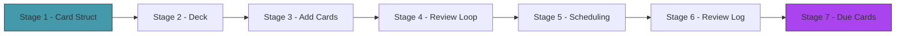
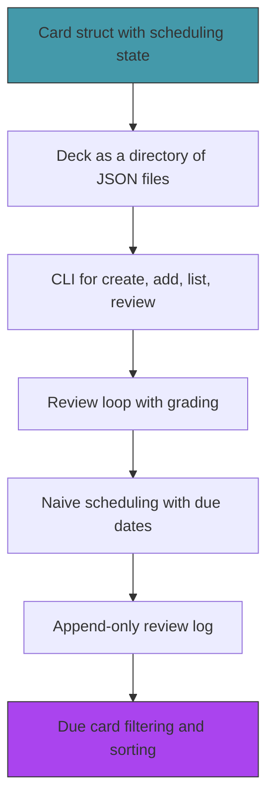

# Act 1 — The First Card

> *Every journey into memory begins with a single card. In this act you build the foundation — how cards are represented, stored, reviewed, and scheduled. The scheduling is naive at first (fixed intervals), but the structure you build here is what FSRS will plug into in Act 2.*

By the end of Act 1, you'll have a working flashcard app: create decks, add cards, review them, grade your recall, and see what's due tomorrow. It's simple, but it works — and every piece is designed to be replaced with something smarter.



**Prerequisites:** Rust installed (`rustup`), a terminal, a text editor. Python experience is enough.

**Project location:** `~/juk/runa/`

---

## Stage 1 — The Blank Card

> *Difficulty: Very Easy — Your first Rust program and the Card struct.*

Before you can study anything, you need a way to represent a card. A flashcard is deceptively simple — a front and a back. But a *schedulable* flashcard needs more: an ID, creation date, scheduling state, and tags. This stage defines the data model that everything else builds on.

> [!tip] What You'll Learn
> - `cargo new` — creating a Rust project
> - Structs and `#[derive]` macros
> - `serde` for JSON serialization
> - `Uuid` for unique card IDs
> - `chrono` for timestamps

### Why think about the data model first?

In Python you might start coding and figure out the data shape as you go. In Rust, the struct definition *is* the design — the compiler enforces it everywhere. Getting the `Card` struct right now saves refactoring later. Every function in the project will take or return `Card`s.

### 1.1 — Create the project

```bash
cd ~/juk
cargo new runa --edition 2024
cd runa
```

### 1.2 — Dependencies

Open `Cargo.toml`:

```toml
[dependencies]
serde = { version = "1", features = ["derive"] }
serde_json = "1"
chrono = { version = "0.4", features = ["serde"] }
uuid = { version = "1", features = ["v4", "serde"] }
```

Four crates, each with a clear purpose:
- `serde` + `serde_json` — serialize structs to/from JSON
- `chrono` — dates and times (with serde support for serializing dates)
- `uuid` — generate unique card IDs

### 1.3 — The Card struct

Create `src/card.rs`:

```rust
use chrono::{DateTime, Utc};
use serde::{Deserialize, Serialize};
use uuid::Uuid;

/// A single flashcard.
#[derive(Debug, Clone, Serialize, Deserialize)]
pub struct Card {
    /// Unique identifier — never changes, even across syncs.
    pub id: Uuid,

    /// The question / prompt shown during review.
    pub front: String,

    /// The answer revealed after the user attempts recall.
    pub back: String,

    /// Optional tags for filtering (e.g., "spanish", "verbs", "chapter-3").
    #[serde(default)]
    pub tags: Vec<String>,

    /// When this card was created.
    pub created_at: DateTime<Utc>,

    /// Scheduling state — starts as New, updated after each review.
    #[serde(default)]
    pub schedule: ScheduleState,
}

/// The scheduling state of a card.
/// New cards have never been reviewed. Learning cards are in the initial
/// acquisition phase. Review cards have graduated to long-term scheduling.
#[derive(Debug, Clone, Serialize, Deserialize, Default)]
pub enum ScheduleState {
    #[default]
    New,
    Learning {
        /// Number of times reviewed in this learning session.
        step: u32,
    },
    Review {
        /// FSRS stability — days until recall drops to 90%.
        stability: f64,
        /// FSRS difficulty — 0.0 to 10.0.
        difficulty: f64,
        /// When this card is next due.
        due: DateTime<Utc>,
        /// How many times this card has been reviewed.
        review_count: u32,
    },
}

impl Card {
    /// Create a new card with the given front and back.
    pub fn new(front: String, back: String, tags: Vec<String>) -> Self {
        Card {
            id: Uuid::new_v4(),
            front,
            back,
            tags,
            created_at: Utc::now(),
            schedule: ScheduleState::New,
        }
    }
}
```

Let's unpack the design:

| Field | Why it exists |
|-------|-------------|
| `id: Uuid` | Cards need a stable identity that survives edits, reordering, and sync. UUIDs are globally unique without coordination. |
| `front` / `back` | The core flashcard data. We'll add markdown support in Act 4. |
| `tags` | Filtering — "show me only Spanish verbs" or "skip chapter 1 cards." |
| `created_at` | Useful for statistics ("when did I add this?") and sync conflict resolution. |
| `schedule` | The scheduling state. `New` → `Learning` → `Review` is the lifecycle. FSRS lives in the `Review` variant. |

**Python comparison:**
```python
@dataclass
class Card:
    id: UUID
    front: str
    back: str
    tags: list[str]
    created_at: datetime
    schedule: ScheduleState  # would be a union type or tagged dict
```

The Rust version is more explicit — `ScheduleState` is an enum where each variant carries different data. A `New` card has no scheduling fields. A `Review` card has stability, difficulty, and a due date. The compiler ensures you handle each case.

### 1.4 — Test serialization

Update `src/main.rs`:

```rust
mod card;

use card::Card;

fn main() {
    let card = Card::new(
        "casa".to_string(),
        "house".to_string(),
        vec!["spanish".to_string(), "nouns".to_string()],
    );

    // Serialize to JSON
    let json = serde_json::to_string_pretty(&card).unwrap();
    println!("{}", json);

    // Deserialize back
    let parsed: Card = serde_json::from_str(&json).unwrap();
    println!("\nParsed: {} → {}", parsed.front, parsed.back);
    println!("ID: {}", parsed.id);
    println!("Tags: {:?}", parsed.tags);
    println!("Schedule: {:?}", parsed.schedule);
}
```

```bash
cargo run
```

```json
{
  "id": "a1b2c3d4-e5f6-4a7b-8c9d-0e1f2a3b4c5d",
  "front": "casa",
  "back": "house",
  "tags": ["spanish", "nouns"],
  "created_at": "2026-04-19T02:40:00Z",
  "schedule": "New"
}
```

The card round-trips through JSON perfectly. `serde` handles the enum serialization automatically — `New` becomes the string `"New"`, and `Review { stability: 5.0, ... }` becomes a tagged object.

> [!warning] Common Mistake
> **Forgetting `features = ["serde"]` on chrono.** Without it, `DateTime<Utc>` can't be serialized. You'll get a confusing "the trait `Serialize` is not implemented" error. Always check that date/time crates have their serde feature enabled.

We have a card. But one card floating in memory isn't useful — we need a place to store a collection of cards. Next stage, we'll build the deck.

> [!check] Checkpoint
> Create a card, serialize it to JSON, parse it back. Verify all fields survive the round trip. Stage 1 complete.

---

## Stage 2 — The Deck

> *Difficulty: Easy — A deck is a directory, not a database.*

A deck is a named collection of cards. Anki stores everything in a SQLite database — which makes it fast but opaque. Runa stores decks as directories with JSON files — which makes them inspectable, editable, and version-controllable. This stage builds the deck structure and the load/save logic.

> [!tip] What You'll Learn
> - TOML for configuration (`deck.toml`)
> - Reading and writing JSON files
> - The `dirs` crate for finding the home directory
> - Designing a file-based data store

### The deck directory

```
~/.runa/decks/spanish/
├── deck.toml       ← name, description, created date
├── cards.json      ← array of Card structs
└── reviews.jsonl   ← append-only review log (Stage 6)
```

Why this layout?
- `deck.toml` is human-readable metadata — you can edit it in any text editor
- `cards.json` is the card database — one file, easy to back up or share
- `reviews.jsonl` is append-only — each line is one review event, never modified, only appended

### 2.1 — Add toml and dirs

```toml
[dependencies]
# ... existing deps ...
toml = "0.8"
dirs = "5"
```

### 2.2 — The Deck struct

Create `src/deck.rs`:

```rust
use crate::card::Card;
use chrono::{DateTime, Utc};
use serde::{Deserialize, Serialize};
use std::fs;
use std::path::{Path, PathBuf};

/// Deck metadata stored in deck.toml.
#[derive(Debug, Serialize, Deserialize)]
pub struct DeckMeta {
    pub name: String,
    #[serde(default)]
    pub description: String,
    pub created_at: DateTime<Utc>,
}

/// A loaded deck — metadata + cards + path on disk.
pub struct Deck {
    pub meta: DeckMeta,
    pub cards: Vec<Card>,
    pub path: PathBuf,
}

impl Deck {
    /// Create a new empty deck.
    pub fn create(name: &str, base_dir: &Path) -> std::io::Result<Self> {
        let slug = name.to_lowercase().replace(' ', "-");
        let deck_dir = base_dir.join(&slug);
        fs::create_dir_all(&deck_dir)?;

        let meta = DeckMeta {
            name: name.to_string(),
            description: String::new(),
            created_at: Utc::now(),
        };

        let toml_str = toml::to_string_pretty(&meta)
            .map_err(|e| std::io::Error::new(std::io::ErrorKind::Other, e))?;
        fs::write(deck_dir.join("deck.toml"), toml_str)?;
        fs::write(deck_dir.join("cards.json"), "[]")?;

        Ok(Deck { meta, cards: Vec::new(), path: deck_dir })
    }

    /// Load a deck from a directory.
    pub fn load(deck_dir: &Path) -> std::io::Result<Self> {
        let toml_str = fs::read_to_string(deck_dir.join("deck.toml"))?;
        let meta: DeckMeta = toml::from_str(&toml_str)
            .map_err(|e| std::io::Error::new(std::io::ErrorKind::InvalidData, e))?;

        let json_str = fs::read_to_string(deck_dir.join("cards.json"))?;
        let cards: Vec<Card> = serde_json::from_str(&json_str)?;

        Ok(Deck { meta, cards, path: deck_dir.to_path_buf() })
    }

    /// Save cards to disk.
    pub fn save(&self) -> std::io::Result<()> {
        let json = serde_json::to_string_pretty(&self.cards)?;
        fs::write(self.path.join("cards.json"), json)?;
        Ok(())
    }

    /// Add a card to the deck and save.
    pub fn add_card(&mut self, card: Card) -> std::io::Result<()> {
        self.cards.push(card);
        self.save()
    }

    /// List all deck directories in the base directory.
    pub fn list_decks(base_dir: &Path) -> std::io::Result<Vec<String>> {
        let mut decks = Vec::new();
        if !base_dir.exists() {
            return Ok(decks);
        }
        for entry in fs::read_dir(base_dir)? {
            let entry = entry?;
            if entry.path().join("deck.toml").exists() {
                decks.push(entry.file_name().to_string_lossy().to_string());
            }
        }
        decks.sort();
        Ok(decks)
    }
}

/// Get the default Runa data directory.
pub fn runa_dir() -> PathBuf {
    dirs::home_dir()
        .expect("Cannot find home directory")
        .join(".runa")
        .join("decks")
}
```

| Code | Explanation |
|------|-------------|
| `toml::to_string_pretty` | Serialize a struct to TOML format. Like `json.dumps` but for TOML. |
| `toml::from_str` | Parse TOML into a struct. Serde does the field mapping. |
| `dirs::home_dir()` | Returns the user's home directory (`/Users/jdvans` on macOS). Cross-platform. |
| `PathBuf` vs `&Path` | `PathBuf` owns the path (like `String`). `&Path` borrows it (like `&str`). |

### 2.3 — Test it

```rust
use deck::{Deck, runa_dir};

fn main() {
    let base = runa_dir();
    let deck = Deck::create("Spanish", &base).unwrap();
    println!("Created deck: {}", deck.meta.name);
    println!("Path: {}", deck.path.display());

    // List decks
    let decks = Deck::list_decks(&base).unwrap();
    println!("Decks: {:?}", decks);
}
```

```bash
cargo run
```

```
Created deck: Spanish
Path: /Users/jdvans/.runa/decks/spanish
Decks: ["spanish"]
```

Check the files:

```bash
cat ~/.runa/decks/spanish/deck.toml
cat ~/.runa/decks/spanish/cards.json
```

> [!warning] Common Mistake
> **Serializing with `serde_json` into a `.toml` file (or vice versa).** TOML and JSON are different formats. Use `toml::to_string` for `.toml` files and `serde_json::to_string` for `.json` files. The struct is the same — only the serializer changes.

We have a deck on disk. But adding cards requires editing JSON by hand. Next stage, we'll build a CLI for creating cards.

> [!check] Checkpoint
> Create a deck. Verify `~/.runa/decks/spanish/deck.toml` and `cards.json` exist. Load the deck back and verify the metadata matches. Stage 2 complete.

---

## Stage 3 — Adding Cards

> *Difficulty: Easy — A CLI for creating and listing cards.*

Editing JSON by hand is tedious and error-prone. This stage adds a proper CLI with `clap` — create decks, add cards, and list what's in a deck. The CLI is the user-facing interface until we build the TUI in Act 3.

> [!tip] What You'll Learn
> - `clap` subcommands and nested arguments
> - Interactive input with `std::io::stdin`
> - Formatting output as a table
> - The command pattern: parse args → load data → do work → save

### 3.1 — Add clap

```toml
clap = { version = "4", features = ["derive"] }
```

### 3.2 — The CLI

Replace `src/main.rs`:

```rust
mod card;
mod deck;

use card::Card;
use clap::{Parser, Subcommand};
use deck::{Deck, runa_dir};

#[derive(Parser)]
#[command(name = "runa", about = "A spaced repetition engine")]
struct Cli {
    #[command(subcommand)]
    command: Commands,
}

#[derive(Subcommand)]
enum Commands {
    /// Create a new deck
    New {
        /// Deck name
        name: String,
    },
    /// Add a card to a deck
    Add {
        /// Deck name
        deck: String,
        /// Card front (question)
        #[arg(short, long)]
        front: String,
        /// Card back (answer)
        #[arg(short, long)]
        back: String,
        /// Tags (comma-separated)
        #[arg(short, long, default_value = "")]
        tags: String,
    },
    /// List cards in a deck
    Cards {
        /// Deck name
        deck: String,
    },
    /// List all decks
    Decks,
}

fn main() {
    let cli = Cli::parse();
    let base = runa_dir();

    match cli.command {
        Commands::New { name } => {
            Deck::create(&name, &base).unwrap_or_else(|e| {
                eprintln!("Failed to create deck: {}", e);
                std::process::exit(1);
            });
            println!("Created deck '{}'", name);
        }
        Commands::Add { deck, front, back, tags } => {
            let deck_dir = base.join(deck.to_lowercase().replace(' ', "-"));
            let mut d = Deck::load(&deck_dir).unwrap_or_else(|e| {
                eprintln!("Failed to load deck '{}': {}", deck, e);
                std::process::exit(1);
            });

            let tag_list: Vec<String> = tags.split(',')
                .map(|t| t.trim().to_string())
                .filter(|t| !t.is_empty())
                .collect();

            let card = Card::new(front.clone(), back.clone(), tag_list);
            d.add_card(card).unwrap_or_else(|e| {
                eprintln!("Failed to add card: {}", e);
                std::process::exit(1);
            });

            println!("Added: {} → {}", front, back);
            println!("Deck now has {} card(s)", d.cards.len());
        }
        Commands::Cards { deck } => {
            let deck_dir = base.join(deck.to_lowercase().replace(' ', "-"));
            let d = Deck::load(&deck_dir).unwrap_or_else(|e| {
                eprintln!("Failed to load deck '{}': {}", deck, e);
                std::process::exit(1);
            });

            if d.cards.is_empty() {
                println!("No cards in '{}'.", d.meta.name);
                return;
            }

            println!("{} — {} card(s)\n", d.meta.name, d.cards.len());
            for (i, card) in d.cards.iter().enumerate() {
                let tags = if card.tags.is_empty() {
                    String::new()
                } else {
                    format!(" [{}]", card.tags.join(", "))
                };
                println!("  {}. {} → {}{}", i + 1, card.front, card.back, tags);
            }
        }
        Commands::Decks => {
            let decks = Deck::list_decks(&base).unwrap_or_else(|e| {
                eprintln!("Failed to list decks: {}", e);
                std::process::exit(1);
            });

            if decks.is_empty() {
                println!("No decks yet. Create one with: runa new <name>");
                return;
            }

            for name in &decks {
                let deck_dir = base.join(name);
                if let Ok(d) = Deck::load(&deck_dir) {
                    println!("  {} — {} card(s)", d.meta.name, d.cards.len());
                }
            }
        }
    }
}
```

### 3.3 — Test it

```bash
cargo run -- new Spanish
cargo run -- add spanish -f "casa" -b "house" -t "nouns"
cargo run -- add spanish -f "hablar" -b "to speak" -t "verbs"
cargo run -- add spanish -f "rojo" -b "red" -t "adjectives"
cargo run -- cards spanish
```

```
Spanish — 3 card(s)

  1. casa → house [nouns]
  2. hablar → to speak [verbs]
  3. rojo → red [adjectives]
```

```bash
cargo run -- decks
```

```
  Spanish — 3 card(s)
```

> [!check] Checkpoint
> Create a deck, add 3+ cards with tags, list them. Verify `cards.json` contains the cards. Stage 3 complete.

---

## Stage 4 — The First Review

> *Difficulty: Easy — A simple review loop in the terminal.*

Time to actually study. The review loop shows the front of a card, waits for the user to think, reveals the back, and asks for a grade. No scheduling yet — we just cycle through all cards. The point is to get the interaction pattern right before adding intelligence.

> [!tip] What You'll Learn
> - Reading user input with `std::io::stdin`
> - The review interaction: show → think → reveal → grade
> - Clearing the terminal for a clean display
> - The four-grade scale: Again, Hard, Good, Easy

### 4.1 — The review command

Add to the `Commands` enum:

```rust
/// Review due cards in a deck
Review {
    /// Deck name
    deck: String,
},
```

### 4.2 — The review loop

```rust
use std::io::{self, Write};

fn review(deck_name: &str) {
    let base = runa_dir();
    let deck_dir = base.join(deck_name.to_lowercase().replace(' ', "-"));
    let mut deck = Deck::load(&deck_dir).unwrap_or_else(|e| {
        eprintln!("Failed to load deck: {}", e);
        std::process::exit(1);
    });

    if deck.cards.is_empty() {
        println!("No cards to review.");
        return;
    }

    let total = deck.cards.len();
    let mut reviewed = 0;

    for i in 0..total {
        // Clear screen
        print!("\x1B[2J\x1B[H");

        // Show progress
        println!("── Runa ── {}/{} ──\n", reviewed + 1, total);

        // Show front
        println!("  {}\n", deck.cards[i].front);
        println!("  [Press Enter to reveal]");

        // Wait for Enter
        let mut input = String::new();
        io::stdin().read_line(&mut input).unwrap();

        // Show back
        print!("\x1B[2J\x1B[H");
        println!("── Runa ── {}/{} ──\n", reviewed + 1, total);
        println!("  {} → {}\n", deck.cards[i].front, deck.cards[i].back);

        // Ask for grade
        println!("  Grade:");
        println!("  1 = Again (forgot)");
        println!("  2 = Hard (struggled)");
        println!("  3 = Good (recalled)");
        println!("  4 = Easy (instant)\n");
        print!("  > ");
        io::stdout().flush().unwrap();

        let mut grade_input = String::new();
        io::stdin().read_line(&mut grade_input).unwrap();
        let grade: u8 = grade_input.trim().parse().unwrap_or(3);

        println!("\n  Graded: {}", match grade {
            1 => "Again",
            2 => "Hard",
            4 => "Easy",
            _ => "Good",
        });

        reviewed += 1;
    }

    print!("\x1B[2J\x1B[H");
    println!("── Session Complete ──\n");
    println!("  Reviewed {} card(s)", reviewed);
}
```

| Code | Explanation |
|------|-------------|
| `\x1B[2J\x1B[H` | ANSI escape codes — clear the screen and move cursor to top-left. Works on all modern terminals. |
| `io::stdout().flush()` | Force the `> ` prompt to display before waiting for input. Without flush, it might buffer. |
| `.parse().unwrap_or(3)` | Parse the input as a number, default to 3 (Good) if invalid. Forgiving input handling. |

### 4.3 — Test it

```bash
cargo run -- review spanish
```

The terminal clears, shows "casa", waits for Enter, reveals "house", asks for a grade. After grading all cards, shows the session summary.

Right now the grades don't *do* anything — we just collect them and move on. Next stage, we'll use the grades to schedule when each card should appear again.

> [!warning] Common Mistake
> **Not flushing stdout before reading stdin.** If you print a prompt without a newline and don't flush, the prompt might not appear until after the user types. Always `flush()` after `print!` (without newline).

We can review cards, but every session shows every card regardless of when you last saw it. A card you got right yesterday shouldn't appear today. Next stage, we'll add naive scheduling — fixed intervals based on the grade.

> [!check] Checkpoint
> Review a deck. Verify the front is shown first, Enter reveals the back, and you can grade 1-4. Stage 4 complete.

---

## Stage 5 — Naive Scheduling

> *Difficulty: Medium — Fixed intervals that we'll replace with FSRS in Act 2.*

Right now every review session shows every card. That defeats the purpose — spaced repetition means showing cards at increasing intervals. This stage adds a simple scheduler: Again = see it again in 1 minute, Hard = 1 day, Good = 3 days, Easy = 7 days. It's crude, but it makes the app usable and gives us a baseline to compare against FSRS.

> [!tip] What You'll Learn
> - Updating card state after a review
> - `chrono::Duration` for date arithmetic
> - The `due` field — when a card should next appear
> - Why fixed intervals are suboptimal (motivation for FSRS)

### 5.1 — Update schedule after grading

Add to `src/card.rs`:

```rust
use chrono::{Duration, Utc};

impl Card {
    /// Update the card's schedule based on the grade.
    /// This is the naive scheduler — FSRS replaces it in Act 2.
    pub fn apply_grade_naive(&mut self, grade: u8) {
        let now = Utc::now();

        let interval = match grade {
            1 => Duration::minutes(1),   // Again — see it very soon
            2 => Duration::days(1),      // Hard — tomorrow
            3 => Duration::days(3),      // Good — in 3 days
            4 => Duration::days(7),      // Easy — in a week
            _ => Duration::days(3),      // Default to Good
        };

        let due = now + interval;

        self.schedule = match &self.schedule {
            ScheduleState::New => {
                if grade == 1 {
                    ScheduleState::Learning { step: 1 }
                } else {
                    ScheduleState::Review {
                        stability: interval.num_days() as f64,
                        difficulty: 5.0, // default mid-range
                        due,
                        review_count: 1,
                    }
                }
            }
            ScheduleState::Learning { step } => {
                if grade >= 3 {
                    // Graduate to Review
                    ScheduleState::Review {
                        stability: interval.num_days() as f64,
                        difficulty: 5.0,
                        due,
                        review_count: step + 1,
                    }
                } else {
                    ScheduleState::Learning { step: step + 1 }
                }
            }
            ScheduleState::Review { review_count, difficulty, .. } => {
                ScheduleState::Review {
                    stability: interval.num_days() as f64,
                    difficulty: *difficulty,
                    due,
                    review_count: review_count + 1,
                }
            }
        };
    }
}
```

The `match` on `ScheduleState` handles the card lifecycle:
- **New → Learning** (if Again) or **New → Review** (if Hard/Good/Easy)
- **Learning → Review** (if Good/Easy) or stays Learning (if Again/Hard)
- **Review → Review** (always, with updated due date)

### 5.2 — Wire into the review loop

After grading, update the card and save:

```rust
// After getting the grade:
deck.cards[i].apply_grade_naive(grade);

// After the loop:
deck.save().unwrap_or_else(|e| {
    eprintln!("Failed to save: {}", e);
});
```

### 5.3 — Test it

```bash
cargo run -- review spanish
# Grade all cards

# Check the schedule
cargo run -- cards spanish
# Cards now show due dates in their JSON
```

Look at `~/.runa/decks/spanish/cards.json` — each card now has a `schedule` field with a `due` date.

> [!warning] Common Mistake
> **Forgetting to save after updating schedules.** The cards are modified in memory, but if you don't call `deck.save()`, the changes are lost when the program exits. Always save after a review session.

Cards have due dates now, but the review loop still shows all cards. Next stage, we'll add a review log for history, then filter to only show due cards.

> [!check] Checkpoint
> Review cards and grade them. Verify `cards.json` shows updated `schedule` fields with `due` dates. Stage 5 complete.

---

## Stage 6 — The Review Log

> *Difficulty: Easy — An append-only log of every review event.*

The review log records every grade you give, with timestamps. It's append-only — we never modify or delete entries. This gives us a complete history for statistics (Act 3), FSRS parameter tuning (Act 2), and sync conflict resolution (Act 5).

> [!tip] What You'll Learn
> - JSONL format — one JSON object per line
> - Append-only file writing with `OpenOptions`
> - Why append-only logs are better than mutable state for history
> - Separating "what happened" (log) from "what to do next" (schedule)

### Why separate the log from the schedule?

The card's `schedule` field tells you *what to do next*. The review log tells you *what happened in the past*. Keeping them separate means:
- You can rebuild the schedule from the log (if the schedule gets corrupted)
- Statistics come from the log, not the current state
- Sync can merge logs from two devices without conflicts (append-only = no conflicts)

### 6.1 — The ReviewEvent struct

Create `src/review_log.rs`:

```rust
use chrono::{DateTime, Utc};
use serde::{Deserialize, Serialize};
use std::fs::OpenOptions;
use std::io::{BufRead, BufReader, Write};
use std::path::Path;
use uuid::Uuid;

/// A single review event — immutable once written.
#[derive(Debug, Serialize, Deserialize)]
pub struct ReviewEvent {
    pub card_id: Uuid,
    pub timestamp: DateTime<Utc>,
    pub grade: u8,           // 1=Again, 2=Hard, 3=Good, 4=Easy
    pub interval_days: f64,  // scheduled interval after this review
}

/// Append a review event to the log file.
pub fn log_review(log_path: &Path, event: &ReviewEvent) -> std::io::Result<()> {
    let mut file = OpenOptions::new()
        .create(true)
        .append(true)
        .open(log_path)?;

    let json = serde_json::to_string(event)?;
    writeln!(file, "{}", json)?;
    Ok(())
}

/// Read all review events from the log.
pub fn read_log(log_path: &Path) -> std::io::Result<Vec<ReviewEvent>> {
    if !log_path.exists() {
        return Ok(Vec::new());
    }

    let file = std::fs::File::open(log_path)?;
    let reader = BufReader::new(file);
    let mut events = Vec::new();

    for line in reader.lines() {
        let line = line?;
        if line.trim().is_empty() {
            continue;
        }
        if let Ok(event) = serde_json::from_str::<ReviewEvent>(&line) {
            events.push(event);
        }
    }

    Ok(events)
}
```

JSONL (JSON Lines) is one JSON object per line. It's perfect for append-only logs because:
- Appending a new entry never modifies existing data
- Each line is independently parseable (a corrupted line doesn't break the whole file)
- It's human-readable with `cat` or `tail -f`

### 6.2 — Log reviews in the review loop

After grading a card:

```rust
use review_log::{ReviewEvent, log_review};

let event = ReviewEvent {
    card_id: deck.cards[i].id,
    timestamp: Utc::now(),
    grade,
    interval_days: match grade {
        1 => 0.001, 2 => 1.0, 3 => 3.0, 4 => 7.0, _ => 3.0,
    },
};

let log_path = deck.path.join("reviews.jsonl");
log_review(&log_path, &event).unwrap_or_else(|e| {
    eprintln!("Warning: failed to log review: {}", e);
});
```

### 6.3 — Test it

```bash
cargo run -- review spanish
# Grade some cards

cat ~/.runa/decks/spanish/reviews.jsonl
```

```json
{"card_id":"a1b2c3d4-...","timestamp":"2026-04-19T02:45:00Z","grade":3,"interval_days":3.0}
{"card_id":"e5f6a7b8-...","timestamp":"2026-04-19T02:45:05Z","grade":4,"interval_days":7.0}
{"card_id":"c9d0e1f2-...","timestamp":"2026-04-19T02:45:10Z","grade":1,"interval_days":0.001}
```

Every review is recorded. This log will power statistics in Act 3 and FSRS calibration in Act 2.

> [!check] Checkpoint
> Review cards and verify `reviews.jsonl` contains one line per review with timestamp, card ID, and grade. Stage 6 complete.

---

## Stage 7 — Due Cards

> *Difficulty: Medium — Only show cards that are due for review.*

The final piece of Act 1: filter the review queue to only include cards that are due. New cards (never reviewed) are always due. Cards with a `due` date in the past are due. Cards with a `due` date in the future are skipped. This transforms Runa from "show everything every time" to "show what you need, when you need it."

> [!tip] What You'll Learn
> - Filtering collections with closures
> - Comparing `DateTime` values
> - Sorting by urgency (most overdue first)
> - The daily review workflow

### 7.1 — Filter due cards

Add to `src/card.rs`:

```rust
impl Card {
    /// Is this card due for review right now?
    pub fn is_due(&self) -> bool {
        match &self.schedule {
            ScheduleState::New => true, // new cards are always due
            ScheduleState::Learning { .. } => true, // learning cards are always due
            ScheduleState::Review { due, .. } => Utc::now() >= *due,
        }
    }

    /// How overdue is this card? (negative = not yet due)
    pub fn overdue_days(&self) -> f64 {
        match &self.schedule {
            ScheduleState::New => f64::MAX, // new cards are maximally "due"
            ScheduleState::Learning { .. } => f64::MAX,
            ScheduleState::Review { due, .. } => {
                let diff = Utc::now() - *due;
                diff.num_seconds() as f64 / 86400.0
            }
        }
    }
}
```

### 7.2 — Update the review loop

```rust
fn review(deck_name: &str) {
    let base = runa_dir();
    let deck_dir = base.join(deck_name.to_lowercase().replace(' ', "-"));
    let mut deck = Deck::load(&deck_dir).unwrap_or_else(|e| {
        eprintln!("Failed to load deck: {}", e);
        std::process::exit(1);
    });

    // Filter and sort: most overdue first, then new cards
    let mut due_indices: Vec<usize> = deck.cards.iter()
        .enumerate()
        .filter(|(_, c)| c.is_due())
        .map(|(i, _)| i)
        .collect();

    due_indices.sort_by(|&a, &b| {
        deck.cards[b].overdue_days()
            .partial_cmp(&deck.cards[a].overdue_days())
            .unwrap_or(std::cmp::Ordering::Equal)
    });

    if due_indices.is_empty() {
        println!("No cards due. Come back later!");
        return;
    }

    let total = due_indices.len();
    println!("{} card(s) due for review.\n", total);

    // ... review loop using due_indices instead of 0..total ...
}
```

### 7.3 — Show due count in deck list

Update the `Decks` command to show how many cards are due:

```rust
let due = d.cards.iter().filter(|c| c.is_due()).count();
println!("  {} — {} card(s), {} due", d.meta.name, d.cards.len(), due);
```

### 7.4 — Test it

```bash
# Add some cards and review them
cargo run -- review spanish
# Grade everything as Good (3-day interval)

# Immediately try again
cargo run -- review spanish
# "No cards due. Come back later!"

# Check deck list
cargo run -- decks
# Spanish — 3 card(s), 0 due
```

The cards won't appear again until their due date. Spaced repetition is working — even with naive fixed intervals.

> [!note] The naive scheduler's problem
> Fixed intervals don't adapt. A card you've gotten right 10 times in a row still gets the same 7-day interval as a card you've gotten right once. FSRS fixes this — stability grows with each successful review, so well-known cards appear less and less frequently. That's Act 2.

> [!check] Checkpoint
> Review all due cards. Verify "No cards due" appears when you try again immediately. Verify `decks` shows the correct due count. Stage 7 complete.

---

## Act 1 Complete — The First Card



You have a working flashcard app:

| Feature | Status |
|---------|--------|
| Create decks | ✓ |
| Add cards with tags | ✓ |
| Review with grade input | ✓ |
| Schedule based on grade | ✓ (naive — fixed intervals) |
| Review history log | ✓ (append-only JSONL) |
| Due card filtering | ✓ |
| File-based storage | ✓ (JSON + TOML, no database) |

| Rust Concept | Where You Used It |
|-------------|-------------------|
| Structs with enums | `Card`, `ScheduleState`, `ReviewEvent` |
| Serde (JSON + TOML) | Card storage, deck metadata, review log |
| `chrono` dates | Due dates, timestamps, duration arithmetic |
| `uuid` | Unique card IDs |
| `clap` CLI | Subcommands with typed arguments |
| File I/O | `OpenOptions` append, `read_to_string`, `write` |
| Closures | `filter`, `sort_by`, `map` on iterators |

**What's missing:** The scheduling is dumb — fixed intervals regardless of history. A card you've nailed 20 times still gets the same interval as one you've seen twice. In Act 2, we replace the naive scheduler with FSRS — an algorithm that models your actual memory and computes mathematically optimal intervals.
