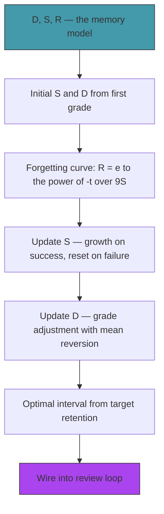

# Act 2 — The Algorithm

> *The naive scheduler treats every card the same — fixed intervals regardless of history. Your brain doesn't work that way. FSRS models how memory actually decays: each card has a stability (how long until you forget), a difficulty (how hard it is for you), and a retrievability (your current recall probability). From these three numbers, the algorithm computes the mathematically optimal moment to review.*

This is the intellectual core of the course. The math isn't hard — it's exponential decay and a few multiplications — but understanding *why* each formula works is what separates Runa from a toy.

```mermaid
flowchart LR
    S8["Stage 8 - Memory Model"] --> S9["Stage 9 - Initial Stability"]
    S9 --> S10["Stage 10 - Forgetting Curve"]
    S10 --> S11["Stage 11 - Update Stability"]
    S11 --> S12["Stage 12 - Update Difficulty"]
    S12 --> S13["Stage 13 - Optimal Interval"]
    S13 --> S14["Stage 14 - Wire It In"]
    style S8 fill:#49a,stroke:#333
    style S14 fill:#a4e,stroke:#333
```



---

## Stage 8 — The Memory Model

> *Difficulty: Medium — The three numbers that describe your memory of a card.*

Before writing any code, you need to understand the model. FSRS is built on the DSR framework — three variables that together predict whether you'll remember a card at any future point in time.

> [!tip] What You'll Learn
> - Stability (S) — the half-life of your memory
> - Difficulty (D) — how inherently hard this card is for you
> - Retrievability (R) — your current probability of recall
> - How these three relate to each other

### The three variables

**Stability (S)** — measured in days. It's the time interval at which your probability of recalling the card drops to exactly 90%. If S = 10, then 10 days after your last review, you have a 90% chance of remembering. After 20 days, much less. After 1 day, nearly certain.

Stability *grows* with each successful review. The first time you see a card, S might be 1 day. After reviewing it successfully a few times, S might be 30 days, then 180 days. Well-known cards eventually have stability measured in years.

**Difficulty (D)** — a number from 0 to 10. It represents how hard this specific card is *for you*. "casa → house" might be D = 2 (easy). "subjuntivo imperfecto conjugation" might be D = 8 (hard). Difficulty affects how much stability grows after a successful review — easy cards gain stability faster.

Difficulty is updated after each review based on your grade. Grade it Easy repeatedly → difficulty decreases. Grade it Again → difficulty increases. It also mean-reverts toward a default (5.0), preventing extreme values.

**Retrievability (R)** — a number from 0 to 1. It's your *current* probability of recalling the card right now, based on how long ago you last reviewed it and the card's stability. It decays exponentially over time:

```
R = e^(-t / (9 × S))
```

Where `t` is days since last review and `S` is stability. The `9` is a scaling factor that makes R = 0.9 when t = S (by definition of stability).

### 8.1 — The FSRS module

Create `src/fsrs.rs`:

```rust
/// FSRS default parameters (from the paper).
/// These can be tuned per-user, but the defaults work well.
pub const DEFAULT_PARAMS: FsrsParams = FsrsParams {
    w: [
        0.4072, 1.1829, 3.1262, 15.4722,  // w0-w3: initial stability per grade
        7.2102,                              // w4: difficulty default
        0.5316,                              // w5: difficulty grade multiplier
        1.0651,                              // w6: difficulty mean reversion
        0.0046,                              // w7: stability after forgetting (factor)
        1.5071,                              // w8: stability growth base
        0.1367,                              // w9: stability growth difficulty factor
        1.0139,                              // w10: stability growth retrievability factor
        1.9803,                              // w11: stability after forgetting (exponent)
        0.0834,                              // w12: stability after forgetting (difficulty)
        0.3126,                              // w13: stability after forgetting (stability)
        1.3980,                              // w14: stability growth exponent
        0.2553,                              // w15: stability growth exponent 2
        2.8898,                              // w16: stability after forgetting (retrievability)
    ],
    target_retention: 0.9, // desired probability of recall at review time
};

/// FSRS parameter set.
#[derive(Debug, Clone)]
pub struct FsrsParams {
    pub w: [f64; 17],
    pub target_retention: f64,
}

/// The scheduling state computed by FSRS.
#[derive(Debug, Clone)]
pub struct FsrsState {
    pub stability: f64,    // days
    pub difficulty: f64,   // 0-10
}
```

These 17 parameters were fitted to millions of Anki review logs. They encode how human memory works on average. The paper is [open-source](https://github.com/open-spaced-repetition/fsrs4anki) — every number has a derivation.

> [!note] Why 17 parameters?
> Each parameter controls a specific aspect of the model: w0-w3 set initial stability for each grade, w4-w6 control difficulty updates, w7-w16 control how stability changes after successful and failed reviews. It sounds like a lot, but each one has a clear, interpretable meaning.

We have the model and the parameters. Next stage, we'll compute the first number: initial stability after the very first review.

> [!check] Checkpoint
> Create `src/fsrs.rs` with the parameter struct and default values. Understand what S, D, and R represent. Stage 8 complete.

---

## Stage 9 — Initial Stability

> *Difficulty: Medium — Computing S₀ from the first review grade.*

When you see a card for the first time and grade it, FSRS needs to assign an initial stability. This depends on the grade: if you graded it Easy, you probably already knew it and the initial stability should be high. If you graded it Again, you didn't know it at all and stability should be very low.

> [!tip] What You'll Learn
> - The initial stability formula: S₀ = w[grade - 1]
> - Why each grade gets a different starting stability
> - The initial difficulty formula
> - Writing your first FSRS function

### 9.1 — Initial stability and difficulty

Add to `src/fsrs.rs`:

```rust
impl FsrsParams {
    /// Compute initial stability after the first review.
    /// grade: 1=Again, 2=Hard, 3=Good, 4=Easy
    pub fn initial_stability(&self, grade: u8) -> f64 {
        let idx = (grade.clamp(1, 4) - 1) as usize;
        self.w[idx].max(0.1) // minimum 0.1 days (~2.4 hours)
    }

    /// Compute initial difficulty after the first review.
    /// grade: 1=Again, 2=Hard, 3=Good, 4=Easy
    pub fn initial_difficulty(&self, grade: u8) -> f64 {
        let d = self.w[4] - (grade as f64 - 3.0) * self.w[5];
        d.clamp(1.0, 10.0)
    }
}
```

With the default parameters:

| First grade | Initial S (days) | Initial D | Meaning |
|---|---|---|---|
| Again (1) | 0.41 | 8.3 | Didn't know it — review in ~10 hours, marked as hard |
| Hard (2) | 1.18 | 7.8 | Barely recalled — review tomorrow |
| Good (3) | 3.13 | 7.2 | Normal recall — review in 3 days |
| Easy (4) | 15.47 | 6.7 | Already knew it — review in 2 weeks |

These numbers feel right intuitively. A card you already knew shouldn't appear for two weeks. A card you completely blanked on should appear within hours.

### 9.2 — Test it

```rust
#[cfg(test)]
mod tests {
    use super::*;

    #[test]
    fn test_initial_stability() {
        let p = DEFAULT_PARAMS;
        let s1 = p.initial_stability(1); // Again
        let s4 = p.initial_stability(4); // Easy
        assert!(s1 < 1.0, "Again should have sub-day stability");
        assert!(s4 > 10.0, "Easy should have multi-week stability");
        assert!(s1 < p.initial_stability(2));
        assert!(p.initial_stability(2) < p.initial_stability(3));
        assert!(p.initial_stability(3) < s4);
    }

    #[test]
    fn test_initial_difficulty() {
        let p = DEFAULT_PARAMS;
        let d1 = p.initial_difficulty(1); // Again — hardest
        let d4 = p.initial_difficulty(4); // Easy — easiest
        assert!(d1 > d4, "Again should be harder than Easy");
        assert!(d1 <= 10.0);
        assert!(d4 >= 1.0);
    }
}
```

```bash
cargo test
```

Both tests should pass. The stability increases monotonically with grade, and difficulty decreases.

> [!check] Checkpoint
> Implement `initial_stability` and `initial_difficulty`. Verify with tests that stability increases and difficulty decreases with better grades. Stage 9 complete.

---

## Stage 10 — The Forgetting Curve

> *Difficulty: Medium — R = e^(-t/9S) and what it means.*

The forgetting curve is the central equation of spaced repetition. It tells you the probability that you'll remember a card at any point in the future. It's an exponential decay — recall drops quickly at first, then levels off. The stability parameter controls how fast it decays.

> [!tip] What You'll Learn
> - The forgetting curve formula
> - Exponential decay — what it looks like and why memory follows it
> - Computing retrievability at any point in time
> - Visualizing the curve in the terminal

### The formula

```
R(t) = e^(-t / (9 × S))
```

- `R` = retrievability (0 to 1, probability of recall)
- `t` = days since last review
- `S` = stability (days)
- `9` = scaling factor (ensures R = 0.9 when t = S)

Let's verify: when t = S, R = e^(-S / (9S)) = e^(-1/9) ≈ 0.895 ≈ 0.9. That's the definition of stability — the time at which recall drops to 90%.

### 10.1 — Retrievability function

Add to `src/fsrs.rs`:

```rust
impl FsrsParams {
    /// Compute retrievability — the probability of recalling a card
    /// `elapsed_days` days after the last review, given stability `s`.
    pub fn retrievability(&self, elapsed_days: f64, stability: f64) -> f64 {
        if stability <= 0.0 {
            return 0.0;
        }
        let factor = 9.0 * stability;
        (-elapsed_days / factor).exp()  // e^(-t / 9S)
    }
}
```

`.exp()` is Rust's `e^x` function on `f64`. That's the entire forgetting curve in one line.

### 10.2 — Visualize it

Let's print the forgetting curve for a card with stability = 10 days:

```rust
fn print_forgetting_curve(stability: f64) {
    let params = fsrs::DEFAULT_PARAMS;
    println!("Forgetting curve (S = {:.1} days):\n", stability);

    let days = [0.0, 1.0, 2.0, 3.0, 5.0, 7.0, 10.0, 14.0, 21.0, 30.0, 60.0, 90.0];
    for &t in &days {
        let r = params.retrievability(t, stability);
        let bar_len = (r * 40.0) as usize;
        let bar: String = "█".repeat(bar_len);
        println!("  Day {:3.0}: {:5.1}% {}", t, r * 100.0, bar);
    }
}
```

```
Forgetting curve (S = 10.0 days):

  Day   0: 100.0% ████████████████████████████████████████
  Day   1:  98.9% ███████████████████████████████████████
  Day   3:  96.7% ██████████████████████████████████████
  Day   5:  94.6% █████████████████████████████████████
  Day   7:  92.5% █████████████████████████████████████
  Day  10:  89.5% ███████████████████████████████████
  Day  14:  85.6% ██████████████████████████████████
  Day  21:  79.2% ███████████████████████████████
  Day  30:  71.7% ████████████████████████████
  Day  60:  51.4% ████████████████████
  Day  90:  36.8% ██████████████
```

At day 10 (= stability), recall is ~90%. By day 30, it's dropped to 72%. By day 90, you've probably forgotten it (37%). This is why spaced repetition works — review at day 10 (when R ≈ 0.9) and stability *increases*, pushing the next review further out.

> [!check] Checkpoint
> Implement `retrievability`. Verify R ≈ 0.9 when t = S. Print the forgetting curve for S = 10. Stage 10 complete.

---

## Stage 11 — Updating Stability

> *Difficulty: Hard — The core FSRS formula for stability growth.*

This is the most important stage in the course. After a successful review, stability grows — but by how much? FSRS computes the new stability based on the current stability, difficulty, retrievability at review time, and the grade. The formula is elegant: harder cards grow stability slower, and reviewing just before you forget (low R) grows stability more than reviewing when you still remember perfectly (high R).

> [!tip] What You'll Learn
> - The stability update formula (successful review)
> - The stability reset formula (failed review — Again)
> - Why reviewing at R ≈ 0.9 is optimal
> - The "desirable difficulty" principle

### Successful review (grade ≥ 2)

```
S' = S × (1 + e^(w8) × (11 - D) × S^(-w9) × (e^(w10 × (1-R)) - 1))
```

Breaking it down:
- `e^(w8)` — base growth rate (~2.9x with defaults)
- `(11 - D)` — easier cards grow faster (D=1 → factor 10, D=10 → factor 1)
- `S^(-w9)` — diminishing returns — high stability grows slower
- `e^(w10 × (1-R)) - 1` — the "desirable difficulty" term. Low R (you almost forgot) → bigger growth. High R (you still remember perfectly) → smaller growth. This is why reviewing too early is wasteful.

### Failed review (grade = 1, Again)

When you forget, stability doesn't just decrease — it resets to a low value:

```
S' = w7 × D^(-w12) × ((S+1)^w13 - 1) × e^(w16 × (1-R))
```

The new stability is low but not zero — it accounts for the fact that relearning is faster than learning from scratch.

### 11.1 — Implementation

```rust
impl FsrsParams {
    /// Update stability after a successful review (grade >= 2).
    pub fn next_stability_success(&self, s: f64, d: f64, r: f64, grade: u8) -> f64 {
        let hard_penalty = if grade == 2 { self.w[15] } else { 1.0 };
        let easy_bonus = if grade == 4 { self.w[16] } else { 1.0 };

        let growth = self.w[8].exp()
            * (11.0 - d)
            * s.powf(-self.w[9])
            * ((self.w[10] * (1.0 - r)).exp() - 1.0)
            * hard_penalty
            * easy_bonus;

        let new_s = s * (1.0 + growth);
        new_s.max(0.1) // minimum stability
    }

    /// Update stability after a failed review (grade = 1, Again).
    pub fn next_stability_fail(&self, s: f64, d: f64, r: f64) -> f64 {
        let new_s = self.w[11]
            * d.powf(-self.w[12])
            * ((s + 1.0).powf(self.w[13]) - 1.0)
            * (self.w[14] * (1.0 - r)).exp();

        new_s.clamp(0.1, s) // never higher than current stability
    }

    /// Compute new stability based on grade.
    pub fn next_stability(&self, s: f64, d: f64, r: f64, grade: u8) -> f64 {
        if grade == 1 {
            self.next_stability_fail(s, d, r)
        } else {
            self.next_stability_success(s, d, r, grade)
        }
    }
}
```

### 11.2 — Test it

```rust
#[test]
fn test_stability_growth() {
    let p = DEFAULT_PARAMS;
    let s = 10.0;  // current stability: 10 days
    let d = 5.0;   // medium difficulty
    let r = 0.9;   // reviewed right on time

    let s_good = p.next_stability(s, d, r, 3);
    let s_easy = p.next_stability(s, d, r, 4);
    let s_hard = p.next_stability(s, d, r, 2);
    let s_again = p.next_stability(s, d, r, 1);

    assert!(s_again < s, "Again should decrease stability");
    assert!(s_hard > s, "Hard should increase stability");
    assert!(s_good > s_hard, "Good should grow more than Hard");
    assert!(s_easy > s_good, "Easy should grow most");

    println!("S=10, D=5, R=0.9:");
    println!("  Again: {:.1} days", s_again);
    println!("  Hard:  {:.1} days", s_hard);
    println!("  Good:  {:.1} days", s_good);
    println!("  Easy:  {:.1} days", s_easy);
}
```

> [!check] Checkpoint
> Implement `next_stability`. Verify Again decreases stability, and Good/Easy increase it. Verify Easy grows more than Good. Stage 11 complete.

---

## Stage 12 — Updating Difficulty

> *Difficulty: Medium — D' adjusts based on grade with mean reversion.*

Difficulty tracks how hard a card is *for you*. It updates after each review: grade Easy → difficulty decreases, grade Again → difficulty increases. But it also mean-reverts toward the default (w4 ≈ 7.2), preventing extreme values from a few lucky or unlucky reviews.

> [!tip] What You'll Learn
> - The difficulty update formula
> - Mean reversion — why it prevents extreme values
> - Clamping to valid ranges

### The formula

```
D' = w6 × D₀ + (1 - w6) × (D + w5 × (grade - 3))
```

- `w5 × (grade - 3)` — the grade adjustment. Again (1) → -2 × w5 (harder). Easy (4) → +1 × w5 (easier). Good (3) → 0 (no change).
- `w6 × D₀` — mean reversion toward the initial difficulty. Prevents D from drifting to extremes.
- `(1 - w6)` — weight on the current difficulty. Balances history vs default.

### 12.1 — Implementation

```rust
impl FsrsParams {
    /// Update difficulty after a review.
    pub fn next_difficulty(&self, d: f64, grade: u8) -> f64 {
        let d0 = self.w[4]; // default difficulty
        let delta = self.w[5] * (grade as f64 - 3.0);
        let new_d = self.w[6] * d0 + (1.0 - self.w[6]) * (d - delta);
        new_d.clamp(1.0, 10.0)
    }
}
```

### 12.2 — Test it

```rust
#[test]
fn test_difficulty_update() {
    let p = DEFAULT_PARAMS;
    let d = 5.0;

    let d_again = p.next_difficulty(d, 1);
    let d_good = p.next_difficulty(d, 3);
    let d_easy = p.next_difficulty(d, 4);

    assert!(d_again > d, "Again should increase difficulty");
    assert!((d_good - d).abs() < 0.5, "Good should barely change difficulty");
    assert!(d_easy < d, "Easy should decrease difficulty");
}
```

> [!check] Checkpoint
> Implement `next_difficulty`. Verify Again increases D, Good barely changes it, Easy decreases it. Stage 12 complete.

---

## Stage 13 — Optimal Intervals

> *Difficulty: Medium — Computing the next review date from target retrievability.*

We have S (stability) and D (difficulty). The final piece: when should the next review be? FSRS inverts the forgetting curve — given a target retrievability (default 0.9), compute the number of days until R drops to that target.

> [!tip] What You'll Learn
> - Inverting the forgetting curve
> - Target retention — the tradeoff between review frequency and recall rate
> - Computing concrete dates from abstract math

### The formula

From R = e^(-t / 9S), solve for t:

```
t = -9S × ln(target_R)
```

With target_R = 0.9: t = -9S × ln(0.9) = -9S × (-0.1054) = 0.9486 × S ≈ S.

So the optimal interval is approximately equal to the stability. If S = 10 days, review in ~10 days. If S = 100 days, review in ~100 days. Elegant.

### 13.1 — Implementation

```rust
impl FsrsParams {
    /// Compute the optimal interval in days for the next review.
    pub fn next_interval(&self, stability: f64) -> f64 {
        let interval = -9.0 * stability * self.target_retention.ln();
        interval.max(1.0) // minimum 1 day
    }
}
```

Three lines. The entire scheduling decision.

### 13.2 — Test it

```rust
#[test]
fn test_interval() {
    let p = DEFAULT_PARAMS;

    let i10 = p.next_interval(10.0);
    let i100 = p.next_interval(100.0);

    // Interval should be approximately equal to stability
    assert!((i10 - 10.0).abs() < 2.0, "S=10 should give ~10 day interval");
    assert!((i100 - 100.0).abs() < 15.0, "S=100 should give ~100 day interval");
    assert!(i100 > i10, "Higher stability = longer interval");
}
```

> [!check] Checkpoint
> Implement `next_interval`. Verify the interval is approximately equal to stability. Stage 13 complete.

---

## Stage 14 — Replacing the Naive Scheduler

> *Difficulty: Medium — Wiring FSRS into the review loop.*

The math is done. This stage replaces `apply_grade_naive` with a proper FSRS-based scheduler. After this, every review updates stability and difficulty using the real algorithm, and the next review date is computed from the forgetting curve.

> [!tip] What You'll Learn
> - Integrating a mathematical model into application code
> - Computing elapsed time since last review
> - The full review cycle: grade → update S and D → compute interval → set due date

### 14.1 — The FSRS scheduler

Add to `src/card.rs`:

```rust
use crate::fsrs::{self, FsrsParams, DEFAULT_PARAMS};

impl Card {
    /// Update the card's schedule using FSRS.
    pub fn apply_grade_fsrs(&mut self, grade: u8) {
        let params = &DEFAULT_PARAMS;
        let now = Utc::now();

        match &self.schedule {
            ScheduleState::New | ScheduleState::Learning { .. } => {
                // First real review — compute initial S and D
                let s = params.initial_stability(grade);
                let d = params.initial_difficulty(grade);
                let interval = params.next_interval(s);
                let due = now + Duration::days(interval.ceil() as i64);

                self.schedule = ScheduleState::Review {
                    stability: s,
                    difficulty: d,
                    due,
                    review_count: 1,
                };
            }
            ScheduleState::Review { stability, difficulty, due, review_count } => {
                // Compute elapsed time and current retrievability
                let elapsed = (now - *due).num_seconds().max(0) as f64 / 86400.0
                    + params.next_interval(*stability); // total days since last optimal review
                let elapsed_since_last = elapsed.max(0.01);
                let r = params.retrievability(elapsed_since_last, *stability);

                // Update S and D
                let new_s = params.next_stability(*stability, *difficulty, r, grade);
                let new_d = params.next_difficulty(*difficulty, grade);
                let interval = params.next_interval(new_s);
                let due = now + Duration::days(interval.ceil() as i64);

                self.schedule = ScheduleState::Review {
                    stability: new_s,
                    difficulty: new_d,
                    due,
                    review_count: review_count + 1,
                };
            }
        }
    }
}
```

### 14.2 — Replace in the review loop

In the review function, change:

```rust
// Old:
deck.cards[idx].apply_grade_naive(grade);

// New:
deck.cards[idx].apply_grade_fsrs(grade);
```

One line change. The entire naive scheduler is replaced.

### 14.3 — Test the difference

```bash
# Add a fresh deck to compare
cargo run -- new fsrs-test
cargo run -- add fsrs-test -f "test" -b "test"
cargo run -- review fsrs-test
# Grade as Good (3)

# Check the scheduled interval
cat ~/.runa/decks/fsrs-test/cards.json | grep stability
```

With FSRS, the first Good review gives stability ≈ 3.1 days (from w2). After a second Good review, stability grows to ~10-15 days. After a third, ~30-50 days. The intervals grow exponentially — exactly how spaced repetition should work.

Compare to the naive scheduler: Good was always 3 days, forever. FSRS adapts.

> [!note] The power of the model
> After 10 successful reviews of the same card, FSRS might schedule it 6 months out. The naive scheduler would still say 7 days. That's the difference between a toy and a tool — FSRS respects the fact that you've proven you know this card.

> [!check] Checkpoint
> Replace the naive scheduler with FSRS. Review a card multiple times and verify stability grows with each successful review. Verify the interval increases each time. Stage 14 complete.

---

## Act 2 Complete — The Algorithm



You implemented FSRS from the research paper. The entire scheduling engine is ~80 lines of math:

| Function | Lines | What it computes |
|----------|-------|-----------------|
| `initial_stability` | 3 | S₀ from first grade |
| `initial_difficulty` | 3 | D₀ from first grade |
| `retrievability` | 4 | Current recall probability |
| `next_stability` | 15 | S' after a review |
| `next_difficulty` | 4 | D' after a review |
| `next_interval` | 3 | Days until next review |

| Rust Concept | Where You Used It |
|-------------|-------------------|
| `f64` math | Every formula — `exp()`, `powf()`, `ln()`, `clamp()` |
| Constants | `DEFAULT_PARAMS` with 17 fitted parameters |
| Unit tests | Verifying monotonicity, bounds, round-trip properties |
| Pattern matching | `ScheduleState` variants in `apply_grade_fsrs` |

**The naive scheduler is gone.** Runa now uses a mathematically optimal algorithm that adapts to each card's difficulty and your personal memory patterns. Cards you know well appear less often. Cards you struggle with appear more often. That's the promise of spaced repetition, delivered by 80 lines of Rust.

**Next up — Act 3: The Interface.** The CLI works but it's ugly. ratatui will give Runa a polished terminal UI with a review screen, dashboard, heatmap, and card browser.
