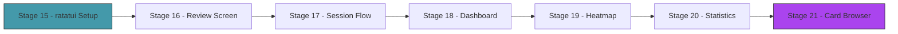

# Act 3 — The Interface

> *A flashcard engine that lives in a raw terminal prompt is functional but joyless. This act wraps Runa in a polished terminal UI — a review screen that feels focused, a dashboard that shows your progress, and a heatmap that makes consistency visible.*

ratatui is Rust's standard TUI framework. It uses an immediate-mode rendering model: every frame, you describe the entire screen, and ratatui diffs it against the previous frame. No retained widgets, no state management framework — just functions that return layouts.



---

## Stage 15 — Hello ratatui

> *Difficulty: Easy — Setting up the TUI framework and drawing your first frame.*

Before building the review screen, we need the scaffolding: enter raw mode, set up the terminal backend, run a render loop, and handle keyboard input. This stage builds the skeleton that every subsequent stage fills in.

> [!tip] What You'll Learn
> - `ratatui` and `crossterm` setup
> - Raw mode vs cooked mode
> - The render loop pattern: handle input → update state → draw
> - `Block`, `Paragraph`, and basic layout

### 15.1 — Dependencies

```toml
ratatui = "0.28"
crossterm = "0.28"
```

### 15.2 — The TUI skeleton

Create `src/tui.rs`:

```rust
use crossterm::{
    event::{self, Event, KeyCode, KeyEventKind},
    terminal::{disable_raw_mode, enable_raw_mode, EnterAlternateScreen, LeaveAlternateScreen},
    ExecutableCommand,
};
use ratatui::{prelude::*, widgets::*};
use std::io::{self, stdout};

/// Run the TUI application.
pub fn run() -> io::Result<()> {
    // Enter raw mode and alternate screen
    enable_raw_mode()?;
    stdout().execute(EnterAlternateScreen)?;
    let mut terminal = Terminal::new(CrosstermBackend::new(stdout()))?;

    // Main loop
    loop {
        terminal.draw(|frame| {
            let area = frame.area();
            let block = Block::default()
                .title(" Runa ")
                .borders(Borders::ALL)
                .border_style(Style::default().fg(Color::DarkGray));

            let text = Paragraph::new("Press 'q' to quit, 'r' to review, 'd' for dashboard")
                .block(block)
                .alignment(Alignment::Center);

            frame.render_widget(text, area);
        })?;

        // Handle input
        if event::poll(std::time::Duration::from_millis(100))? {
            if let Event::Key(key) = event::read()? {
                if key.kind == KeyEventKind::Press {
                    match key.code {
                        KeyCode::Char('q') => break,
                        _ => {}
                    }
                }
            }
        }
    }

    // Restore terminal
    disable_raw_mode()?;
    stdout().execute(LeaveAlternateScreen)?;
    Ok(())
}
```

**Python comparison:** There's no direct equivalent — Python's `curses` is lower-level and uglier. ratatui is closer to React for the terminal: describe what you want, the framework handles the rendering.

The key pattern: `terminal.draw(|frame| { ... })` takes a closure that receives a `Frame`. You render widgets into the frame. ratatui handles the diffing and only redraws what changed.

### 15.3 — Wire into main

Add a `tui` subcommand or make it the default when no subcommand is given:

```rust
Commands::Tui => {
    tui::run().unwrap_or_else(|e| {
        eprintln!("TUI error: {}", e);
        std::process::exit(1);
    });
}
```

### 15.4 — Test it

```bash
cargo run -- tui
```

A bordered box appears with the title "Runa". Press `q` to quit. The terminal is restored cleanly.

> [!warning] Common Mistake
> **Not restoring the terminal on panic.** If your program panics inside raw mode, the terminal stays in raw mode and becomes unusable. Add a panic hook that restores the terminal:
> ```rust
> let original_hook = std::panic::take_hook();
> std::panic::set_hook(Box::new(move |panic| {
>     disable_raw_mode().ok();
>     stdout().execute(LeaveAlternateScreen).ok();
>     original_hook(panic);
> }));
> ```

We have a TUI skeleton. Next stage, we'll build the review screen — the core interaction.

> [!check] Checkpoint
> Run the TUI. Verify a bordered box appears. Press `q` to quit cleanly. Stage 15 complete.

---

## Stage 16 — The Review Screen

> *Difficulty: Medium — Full-screen card display with flip and grading.*

The review screen is the heart of the app. It shows the card front, waits for a keypress to flip, shows the back, and presents grade buttons. The layout needs to feel focused — no distractions, just the card and the grade options.

> [!tip] What You'll Learn
> - Multi-area layouts with `Layout::vertical`
> - Conditional rendering (front vs back)
> - Styled text with `Span` and `Line`
> - Keyboard shortcuts for grading

### 16.1 — Review screen state

```rust
enum ReviewPhase {
    ShowFront,
    ShowBack,
}

struct ReviewState {
    phase: ReviewPhase,
    current_card: usize,
    due_indices: Vec<usize>,
    session_grades: Vec<(usize, u8)>, // (card index, grade)
}
```

### 16.2 — Render the review screen

```rust
fn render_review(frame: &mut Frame, state: &ReviewState, deck: &Deck) {
    let card = &deck.cards[state.due_indices[state.current_card]];
    let progress = format!(" {}/{} ", state.current_card + 1, state.due_indices.len());

    let chunks = Layout::vertical([
        Constraint::Length(3),  // header
        Constraint::Min(5),    // card content
        Constraint::Length(3), // grade bar or "press space"
    ]).split(frame.area());

    // Header
    let header = Paragraph::new(progress)
        .alignment(Alignment::Center)
        .block(Block::default().borders(Borders::BOTTOM).border_style(Style::default().fg(Color::DarkGray)));
    frame.render_widget(header, chunks[0]);

    // Card content
    match state.phase {
        ReviewPhase::ShowFront => {
            let front = Paragraph::new(card.front.as_str())
                .alignment(Alignment::Center)
                .style(Style::default().fg(Color::White))
                .block(Block::default().padding(Padding::vertical(2)));
            frame.render_widget(front, chunks[1]);

            let hint = Paragraph::new("[Space] to reveal")
                .alignment(Alignment::Center)
                .style(Style::default().fg(Color::DarkGray));
            frame.render_widget(hint, chunks[2]);
        }
        ReviewPhase::ShowBack => {
            let content = vec![
                Line::from(Span::styled(&card.front, Style::default().fg(Color::DarkGray))),
                Line::from(""),
                Line::from(Span::styled(&card.back, Style::default().fg(Color::White).bold())),
            ];
            let back = Paragraph::new(content)
                .alignment(Alignment::Center)
                .block(Block::default().padding(Padding::vertical(1)));
            frame.render_widget(back, chunks[1]);

            let grades = Paragraph::new("[1] Again  [2] Hard  [3] Good  [4] Easy")
                .alignment(Alignment::Center)
                .style(Style::default().fg(Color::Cyan));
            frame.render_widget(grades, chunks[2]);
        }
    }
}
```

### 16.3 — Handle input

```rust
// In the event loop:
match (key.code, &state.phase) {
    (KeyCode::Char(' '), ReviewPhase::ShowFront) => {
        state.phase = ReviewPhase::ShowBack;
    }
    (KeyCode::Char(c @ '1'..='4'), ReviewPhase::ShowBack) => {
        let grade = c.to_digit(10).unwrap() as u8;
        let idx = state.due_indices[state.current_card];
        deck.cards[idx].apply_grade_fsrs(grade);
        state.session_grades.push((idx, grade));

        if state.current_card + 1 < state.due_indices.len() {
            state.current_card += 1;
            state.phase = ReviewPhase::ShowFront;
        } else {
            // Session complete — show summary
            break;
        }
    }
    (KeyCode::Char('q'), _) => break,
    _ => {}
}
```

> [!check] Checkpoint
> Review cards in the TUI. Verify front → space → back → grade flow works. Stage 16 complete.

---

## Stage 17 — Session Flow

> *Difficulty: Medium — Progress bar, session timer, and completion summary.*

A review session needs momentum — you should see progress and feel the session moving forward. This stage adds a progress bar, a timer, and a summary screen at the end.

> [!tip] What You'll Learn
> - `Gauge` widget for progress bars
> - Tracking time with `Instant`
> - Session summary statistics
> - Multi-screen navigation in a TUI

### 17.1 — Progress bar

Replace the header with a gauge:

```rust
let progress = state.current_card as f64 / state.due_indices.len() as f64;
let gauge = Gauge::default()
    .ratio(progress)
    .gauge_style(Style::default().fg(Color::Green))
    .label(format!("{}/{}", state.current_card + 1, state.due_indices.len()));
frame.render_widget(gauge, chunks[0]);
```

### 17.2 — Session summary

After all cards are reviewed, show a summary:

```rust
fn render_summary(frame: &mut Frame, grades: &[(usize, u8)], elapsed: Duration) {
    let again = grades.iter().filter(|(_, g)| *g == 1).count();
    let hard = grades.iter().filter(|(_, g)| *g == 2).count();
    let good = grades.iter().filter(|(_, g)| *g == 3).count();
    let easy = grades.iter().filter(|(_, g)| *g == 4).count();

    let text = vec![
        Line::from(Span::styled("Session Complete", Style::default().bold())),
        Line::from(""),
        Line::from(format!("  Cards reviewed: {}", grades.len())),
        Line::from(format!("  Time: {}:{:02}", elapsed.as_secs() / 60, elapsed.as_secs() % 60)),
        Line::from(""),
        Line::from(format!("  Again: {}  Hard: {}  Good: {}  Easy: {}", again, hard, good, easy)),
        Line::from(""),
        Line::from(Span::styled("[q] to quit", Style::default().fg(Color::DarkGray))),
    ];

    let paragraph = Paragraph::new(text)
        .alignment(Alignment::Center)
        .block(Block::default().borders(Borders::ALL).title(" Summary "));
    frame.render_widget(paragraph, frame.area());
}
```

> [!check] Checkpoint
> Complete a review session. Verify the progress bar advances, and the summary shows grade counts and elapsed time. Stage 17 complete.

---

## Stage 18 — The Dashboard

> *Difficulty: Medium — Deck list, due counts, and today's stats.*

The dashboard is the home screen — what you see when you launch Runa. It shows all your decks, how many cards are due in each, your current streak, and today's review count.

> [!tip] What You'll Learn
> - `Table` widget for structured data
> - Loading data from multiple decks
> - Computing daily statistics from the review log
> - Navigation between screens

### 18.1 — Dashboard layout

```rust
fn render_dashboard(frame: &mut Frame, decks: &[DeckSummary]) {
    let chunks = Layout::vertical([
        Constraint::Length(3),  // header
        Constraint::Length(5),  // stats row
        Constraint::Min(5),    // deck table
        Constraint::Length(1), // footer
    ]).split(frame.area());

    // Header
    let header = Paragraph::new(" Runa — Spaced Repetition ")
        .alignment(Alignment::Center)
        .style(Style::default().bold());
    frame.render_widget(header, chunks[0]);

    // Deck table
    let rows: Vec<Row> = decks.iter().map(|d| {
        Row::new(vec![
            Cell::from(d.name.as_str()),
            Cell::from(format!("{}", d.total_cards)),
            Cell::from(format!("{}", d.due_count))
                .style(if d.due_count > 0 {
                    Style::default().fg(Color::Yellow)
                } else {
                    Style::default().fg(Color::DarkGray)
                }),
        ])
    }).collect();

    let table = Table::new(rows, [
        Constraint::Percentage(50),
        Constraint::Percentage(25),
        Constraint::Percentage(25),
    ])
    .header(Row::new(["Deck", "Cards", "Due"]).style(Style::default().bold()))
    .block(Block::default().borders(Borders::ALL).title(" Decks "));

    frame.render_widget(table, chunks[2]);

    // Footer
    let footer = Paragraph::new("[r] Review  [h] Heatmap  [q] Quit")
        .style(Style::default().fg(Color::DarkGray));
    frame.render_widget(footer, chunks[3]);
}
```

> [!check] Checkpoint
> Launch the TUI and see the dashboard with deck names, card counts, and due counts. Navigate to review with `r`. Stage 18 complete.

---

## Stage 19 — The Heatmap

> *Difficulty: Medium — GitHub-style contribution heatmap for review activity.*

The heatmap shows your review activity over the past year — one cell per day, colored by intensity. It makes consistency visible and streaks satisfying. This is the most visually rewarding widget in the app.

> [!tip] What You'll Learn
> - Date iteration with `chrono`
> - Color gradients based on data intensity
> - Custom widget rendering with `Buffer`
> - Aggregating review log data by date

### 19.1 — Aggregate reviews by date

```rust
use std::collections::HashMap;
use chrono::NaiveDate;

fn reviews_by_date(events: &[ReviewEvent]) -> HashMap<NaiveDate, usize> {
    let mut counts: HashMap<NaiveDate, usize> = HashMap::new();
    for event in events {
        let date = event.timestamp.date_naive();
        *counts.entry(date).or_insert(0) += 1;
    }
    counts
}
```

### 19.2 — Render the heatmap

```rust
fn render_heatmap(frame: &mut Frame, counts: &HashMap<NaiveDate, usize>) {
    let today = Utc::now().date_naive();
    let start = today - chrono::Duration::days(364); // ~1 year

    // Build 53 columns × 7 rows (weeks × days)
    let mut cells: Vec<Vec<(NaiveDate, usize)>> = Vec::new();
    let mut date = start;

    // Align to start of week (Monday)
    while date.weekday() != chrono::Weekday::Mon {
        date += chrono::Duration::days(1);
    }

    while date <= today {
        let mut week = Vec::new();
        for _ in 0..7 {
            let count = counts.get(&date).copied().unwrap_or(0);
            week.push((date, count));
            date += chrono::Duration::days(1);
        }
        cells.push(week);
    }

    let max_count = counts.values().max().copied().unwrap_or(1).max(1);

    // Render using block characters
    let mut lines: Vec<Line> = Vec::new();
    for row in 0..7 {
        let spans: Vec<Span> = cells.iter().map(|week| {
            if row < week.len() {
                let (_, count) = week[row];
                let intensity = count as f64 / max_count as f64;
                let color = if count == 0 {
                    Color::DarkGray
                } else if intensity < 0.25 {
                    Color::Green
                } else if intensity < 0.5 {
                    Color::LightGreen
                } else if intensity < 0.75 {
                    Color::Yellow
                } else {
                    Color::LightYellow
                };
                Span::styled("█ ", Style::default().fg(color))
            } else {
                Span::raw("  ")
            }
        }).collect();
        lines.push(Line::from(spans));
    }

    let heatmap = Paragraph::new(lines)
        .block(Block::default().borders(Borders::ALL).title(" Review Activity "));
    frame.render_widget(heatmap, frame.area());
}
```

> [!check] Checkpoint
> View the heatmap after several days of reviews. Verify days with reviews are colored and empty days are gray. Stage 19 complete.

---

## Stage 20 — Deck Statistics

> *Difficulty: Medium — Retention rate, maturity distribution, and forecast.*

Numbers that tell you how well you're learning: what percentage of reviews you get right, how many cards are "mature" (stability > 21 days), and how many cards will be due in the next 30 days.

> [!tip] What You'll Learn
> - Computing retention rate from the review log
> - Categorizing cards by maturity
> - Forecasting future due cards
> - `BarChart` widget in ratatui

### 20.1 — Statistics struct

```rust
pub struct DeckStats {
    pub total_cards: usize,
    pub new_cards: usize,
    pub learning_cards: usize,
    pub mature_cards: usize,     // stability > 21 days
    pub young_cards: usize,      // stability <= 21 days
    pub retention_rate: f64,     // % of reviews graded >= 2
    pub total_reviews: usize,
    pub avg_interval_days: f64,
    pub forecast: Vec<usize>,   // due cards per day for next 30 days
}
```

Compute from the deck's cards and review log. Retention rate = reviews where grade >= 2 / total reviews. Forecast = for each of the next 30 days, count cards whose `due` date falls on that day.

> [!check] Checkpoint
> View deck statistics. Verify retention rate, maturity counts, and 30-day forecast are displayed. Stage 20 complete.

---

## Stage 21 — Card Browser

> *Difficulty: Hard — Searchable, sortable card list with inline editing.*

The card browser lets you see all cards in a deck, search by content, sort by due date or difficulty, and edit cards without leaving the TUI. It's the most complex widget — a scrollable table with keyboard navigation.

> [!tip] What You'll Learn
> - `StatefulWidget` and `TableState` for scrollable tables
> - Text input in a TUI (search box)
> - Inline editing with a modal
> - Combining multiple interaction modes

### 21.1 — Scrollable table

```rust
struct BrowserState {
    table_state: TableState,
    search_query: String,
    filtered_indices: Vec<usize>,
    editing: Option<usize>, // card index being edited
}
```

Use `TableState` for scroll position and selection. Filter cards by matching the search query against front and back text. Arrow keys navigate, Enter opens the editor, `/` focuses the search box.

### 21.2 — Key bindings

| Key | Action |
|---|---|
| `↑` / `↓` | Navigate cards |
| `Enter` | Edit selected card |
| `/` | Focus search box |
| `Esc` | Clear search / exit browser |
| `d` | Sort by due date |
| `s` | Sort by stability |
| `n` | Sort by difficulty |

> [!check] Checkpoint
> Browse cards in a deck. Search by text. Sort by different fields. Edit a card's front/back. Stage 21 complete.

---

## Act 3 Complete — The Interface

You built a polished terminal UI with ratatui:

| Screen | What it shows |
|--------|-------------|
| Dashboard | Deck list, due counts, streak, today's reviews |
| Review | Card front → flip → back → grade, with progress bar |
| Summary | Session stats after completing reviews |
| Heatmap | Year-long review activity visualization |
| Statistics | Retention rate, maturity, forecast |
| Browser | Searchable, sortable card list with editing |

| Rust Concept | Where You Used It |
|-------------|-------------------|
| ratatui widgets | `Paragraph`, `Table`, `Gauge`, `Block`, `BarChart` |
| `Layout` | Vertical/horizontal splits for screen regions |
| `Style` and `Color` | Themed text, conditional coloring |
| `crossterm` events | Keyboard input handling |
| State machines | `ReviewPhase`, screen navigation |
| Closures | `terminal.draw(\|frame\| { ... })` |

**Next up — Act 4: The Collection.** CSV import, cloze deletion cards, tags, and markdown rendering.
