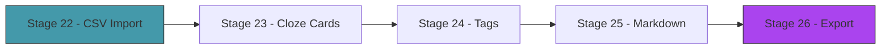

# Act 4 — The Collection

> *A flashcard engine is only as good as its cards. This act makes Runa practical: import hundreds of cards from CSV, create cloze deletion cards with blanks, filter by tags, and render markdown formatting in the terminal.*



---

## Stage 22 — CSV Import

> *Difficulty: Medium — Bulk-importing cards from spreadsheets.*

Adding cards one at a time is tedious. Most flashcard collections start as spreadsheets — a column for the front, a column for the back, maybe a column for tags. This stage parses CSV files into cards with configurable column mapping.

> [!tip] What You'll Learn
> - The `csv` crate for parsing CSV files
> - Configurable column mapping (which column is front? back? tags?)
> - Duplicate detection by content hash
> - Bulk insert with progress reporting

### 22.1 — Add the csv crate

```toml
csv = "1"
```

### 22.2 — The import function

Create `src/import.rs`:

```rust
use crate::card::Card;
use std::path::Path;

pub struct ImportConfig {
    pub front_col: usize,  // 0-indexed column for front
    pub back_col: usize,   // 0-indexed column for back
    pub tags_col: Option<usize>, // optional column for tags
    pub skip_header: bool,
}

impl Default for ImportConfig {
    fn default() -> Self {
        ImportConfig {
            front_col: 0,
            back_col: 1,
            tags_col: None,
            skip_header: true,
        }
    }
}

/// Import cards from a CSV file.
pub fn import_csv(path: &Path, config: &ImportConfig) -> std::io::Result<Vec<Card>> {
    let mut reader = csv::ReaderBuilder::new()
        .has_headers(config.skip_header)
        .from_path(path)
        .map_err(|e| std::io::Error::new(std::io::ErrorKind::InvalidData, e))?;

    let mut cards = Vec::new();

    for result in reader.records() {
        let record = result.map_err(|e| std::io::Error::new(std::io::ErrorKind::InvalidData, e))?;

        let front = record.get(config.front_col).unwrap_or("").trim().to_string();
        let back = record.get(config.back_col).unwrap_or("").trim().to_string();

        if front.is_empty() || back.is_empty() {
            continue; // skip incomplete rows
        }

        let tags = match config.tags_col {
            Some(col) => {
                record.get(col).unwrap_or("").split(',')
                    .map(|t| t.trim().to_string())
                    .filter(|t| !t.is_empty())
                    .collect()
            }
            None => Vec::new(),
        };

        cards.push(Card::new(front, back, tags));
    }

    Ok(cards)
}
```

### 22.3 — Wire into CLI

```rust
/// Import cards from a CSV file
Import {
    /// Deck to import into
    deck: String,
    /// Path to CSV file
    file: String,
    /// Front column (0-indexed, default 0)
    #[arg(long, default_value = "0")]
    front_col: usize,
    /// Back column (0-indexed, default 1)
    #[arg(long, default_value = "1")]
    back_col: usize,
    /// Tags column (0-indexed, optional)
    #[arg(long)]
    tags_col: Option<usize>,
},
```

### 22.4 — Test it

Create a test CSV:

```csv
front,back,tags
casa,house,nouns
hablar,to speak,verbs
rojo,red,adjectives
grande,big,adjectives
comer,to eat,verbs
```

```bash
cargo run -- import spanish vocab.csv
```

```
Imported 5 cards into Spanish (8 total).
```

> [!check] Checkpoint
> Import a CSV file with 5+ rows. Verify all cards appear in the deck. Stage 22 complete.

---

## Stage 23 — Cloze Deletion

> *Difficulty: Medium — Cards with blanks for active recall.*

A cloze deletion card has a blank where the answer should be: "The capital of France is ___." The user must actively recall the missing word rather than passively recognizing it. Cloze cards are more effective for learning facts, definitions, and vocabulary in context.

> [!tip] What You'll Learn
> - Cloze syntax: `{{answer}}` marks the blank
> - Generating front (with blank) and back (with answer highlighted) from a single template
> - Multiple clozes in one card
> - A new `CardType` enum

### 23.1 — Cloze parsing

Add to `src/card.rs`:

```rust
/// Card content type.
#[derive(Debug, Clone, Serialize, Deserialize, Default)]
pub enum CardType {
    #[default]
    Basic,
    Cloze {
        template: String, // "The capital of France is {{Paris}}"
    },
}

impl Card {
    /// Create a cloze card from a template.
    /// "The capital of France is {{Paris}}" →
    ///   front: "The capital of France is ___"
    ///   back: "The capital of France is **Paris**"
    pub fn new_cloze(template: String, tags: Vec<String>) -> Self {
        let front = template.replace(|c: char| false, "") // we'll use regex-free approach
            .split("{{")
            .enumerate()
            .map(|(i, part)| {
                if i == 0 {
                    part.to_string()
                } else if let Some(end) = part.find("}}") {
                    format!("____{}", &part[end + 2..])
                } else {
                    part.to_string()
                }
            })
            .collect::<String>();

        let back = template.replace("{{", "**").replace("}}", "**");

        let mut card = Card::new(front, back, tags);
        card.card_type = CardType::Cloze { template };
        card
    }
}
```

### 23.2 — CLI support

```bash
cargo run -- add spanish --cloze "La capital de Francia es {{París}}" -t "geography"
```

The card appears in review as:
- Front: "La capital de Francia es ____"
- Back: "La capital de Francia es **París**"

> [!check] Checkpoint
> Create a cloze card. Verify the front shows blanks and the back shows the answer highlighted. Stage 23 complete.

---

## Stage 24 — Tags and Filters

> *Difficulty: Medium — Tag-based filtering for focused study sessions.*

Tags let you study subsets of a deck: "only verbs today" or "skip chapter 1." This stage adds tag filtering to the review session and tag-based statistics.

> [!tip] What You'll Learn
> - Filtering iterators with closures
> - CLI flag for tag selection
> - Tag-based statistics
> - Set operations (intersection, union) on tag lists

### 24.1 — Filter due cards by tag

Update the review function to accept an optional tag filter:

```rust
let due_indices: Vec<usize> = deck.cards.iter()
    .enumerate()
    .filter(|(_, c)| c.is_due())
    .filter(|(_, c)| {
        match &tag_filter {
            Some(tag) => c.tags.iter().any(|t| t == tag),
            None => true,
        }
    })
    .map(|(i, _)| i)
    .collect();
```

### 24.2 — Tag listing

```bash
cargo run -- tags spanish
```

```
Tags in Spanish:
  nouns       — 12 cards (3 due)
  verbs       — 8 cards (5 due)
  adjectives  — 6 cards (1 due)
  geography   — 4 cards (0 due)
```

### 24.3 — Filtered review

```bash
cargo run -- review spanish --tag verbs
```

Only verb cards appear in the session.

> [!check] Checkpoint
> Filter reviews by tag. Verify only matching cards appear. List tags with card counts. Stage 24 complete.

---

## Stage 25 — Markdown Cards

> *Difficulty: Medium — Rendering formatted text in the TUI.*

Plain text cards work, but some content benefits from formatting — code blocks for programming cards, bold for emphasis, lists for multi-part answers. This stage renders basic markdown in the ratatui review screen using styled `Span`s.

> [!tip] What You'll Learn
> - Parsing markdown inline formatting (bold, code, italic)
> - Converting markdown to ratatui `Span`s with styles
> - Code block rendering with a different background color

### 25.1 — Simple markdown to spans

```rust
/// Convert a markdown string to styled ratatui Spans.
/// Supports: **bold**, `code`, *italic*, and ```code blocks```.
pub fn md_to_spans(text: &str) -> Vec<Line<'_>> {
    text.lines().map(|line| {
        let mut spans = Vec::new();
        let mut remaining = line;

        while !remaining.is_empty() {
            if let Some(pos) = remaining.find("**") {
                // Text before bold
                if pos > 0 {
                    spans.push(Span::raw(&remaining[..pos]));
                }
                remaining = &remaining[pos + 2..];
                if let Some(end) = remaining.find("**") {
                    spans.push(Span::styled(&remaining[..end], Style::default().bold()));
                    remaining = &remaining[end + 2..];
                }
            } else if let Some(pos) = remaining.find('`') {
                if pos > 0 {
                    spans.push(Span::raw(&remaining[..pos]));
                }
                remaining = &remaining[pos + 1..];
                if let Some(end) = remaining.find('`') {
                    spans.push(Span::styled(
                        &remaining[..end],
                        Style::default().fg(Color::Cyan).bg(Color::DarkGray),
                    ));
                    remaining = &remaining[end + 1..];
                }
            } else {
                spans.push(Span::raw(remaining));
                break;
            }
        }

        Line::from(spans)
    }).collect()
}
```

Use `md_to_spans` in the review screen instead of plain `Paragraph::new(card.front.as_str())`.

> [!check] Checkpoint
> Create a card with `**bold**` and `` `code` `` in the front/back. Verify they render with styling in the TUI. Stage 25 complete.

---

## Stage 26 — Export

> *Difficulty: Easy — Exporting decks to CSV, JSON, or a portable archive.*

Import without export is a trap. This stage lets you export decks in multiple formats: CSV (for spreadsheets), JSON (for other tools), or a `.runa` archive (ZIP of the deck directory) for sharing.

> [!tip] What You'll Learn
> - The `zip` crate for creating ZIP archives
> - Writing CSV with the `csv` crate
> - Multiple output formats from the same data

### 26.1 — Add zip

```toml
zip = "2"
```

### 26.2 — Export functions

```rust
/// Export a deck to CSV.
pub fn export_csv(deck: &Deck, output: &Path) -> std::io::Result<()> {
    let mut writer = csv::Writer::from_path(output)?;
    writer.write_record(["front", "back", "tags"])?;
    for card in &deck.cards {
        writer.write_record([
            &card.front,
            &card.back,
            &card.tags.join(","),
        ])?;
    }
    writer.flush()?;
    Ok(())
}

/// Export a deck as a .runa archive (ZIP of the deck directory).
pub fn export_archive(deck: &Deck, output: &Path) -> std::io::Result<()> {
    let file = std::fs::File::create(output)?;
    let mut zip = zip::ZipWriter::new(file);
    let options = zip::write::SimpleFileOptions::default();

    // Add deck.toml
    let toml_str = std::fs::read_to_string(deck.path.join("deck.toml"))?;
    zip.start_file("deck.toml", options)?;
    std::io::Write::write_all(&mut zip, toml_str.as_bytes())?;

    // Add cards.json
    let json_str = serde_json::to_string_pretty(&deck.cards)?;
    zip.start_file("cards.json", options)?;
    std::io::Write::write_all(&mut zip, json_str.as_bytes())?;

    // Add reviews.jsonl if it exists
    let reviews_path = deck.path.join("reviews.jsonl");
    if reviews_path.exists() {
        let reviews = std::fs::read_to_string(&reviews_path)?;
        zip.start_file("reviews.jsonl", options)?;
        std::io::Write::write_all(&mut zip, reviews.as_bytes())?;
    }

    zip.finish()?;
    Ok(())
}
```

### 26.3 — CLI

```bash
cargo run -- export spanish --format csv --output spanish.csv
cargo run -- export spanish --format archive --output spanish.runa
```

> [!check] Checkpoint
> Export a deck to CSV and verify it opens in a spreadsheet. Export as `.runa` and verify it's a valid ZIP. Stage 26 complete.

---

## Act 4 Complete — The Collection

| Feature | What it does |
|---------|-------------|
| CSV import | Bulk-add cards from spreadsheets |
| Cloze deletion | Cards with blanks for active recall |
| Tag filtering | Study subsets of a deck |
| Markdown rendering | Bold, code, italic in the TUI |
| Export | CSV, JSON, and .runa archive formats |

**Next up — Act 5: The Sync.** Study on your laptop, continue on your work machine.
