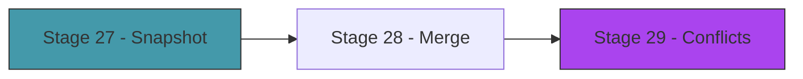

# Act 5 — The Sync

> *You study on your laptop at home. You want to continue on your work machine. The cards are the same, but the review history has diverged — you reviewed different cards on each device. Runa's sync merges both histories into one, without a server, without an account, without losing data.*

This is the smidge of complexity. Three stages, one clear goal: merge two copies of a deck that have diverged.



---

## Stage 27 — The Snapshot

> *Difficulty: Medium — Content-hashing cards and detecting changes.*

Before you can merge, you need to know what changed. This stage computes a content hash for each card (based on front + back + tags) and compares two copies of a deck to find: cards added on each side, cards deleted on each side, cards edited on each side, and review events unique to each side.

> [!tip] What You'll Learn
> - Content hashing for change detection
> - Computing a deck "fingerprint"
> - Diffing two card sets by UUID
> - Diffing two review logs by timestamp

### 27.1 — Card content hash

Add to `src/card.rs`:

```rust
use sha1::{Sha1, Digest};

impl Card {
    /// Content hash — changes when front, back, or tags change.
    /// Does NOT include schedule state (that's derived from reviews).
    pub fn content_hash(&self) -> String {
        let mut hasher = Sha1::new();
        hasher.update(self.front.as_bytes());
        hasher.update(b"\0");
        hasher.update(self.back.as_bytes());
        hasher.update(b"\0");
        for tag in &self.tags {
            hasher.update(tag.as_bytes());
            hasher.update(b",");
        }
        format!("{:x}", hasher.finalize())
    }
}
```

Add `sha1 = "0.10"` to dependencies.

### 27.2 — Deck diff

Create `src/sync.rs`:

```rust
use crate::card::Card;
use crate::review_log::ReviewEvent;
use std::collections::{HashMap, HashSet};
use uuid::Uuid;

pub struct DeckDiff {
    pub added_local: Vec<Card>,      // cards in local but not remote
    pub added_remote: Vec<Card>,     // cards in remote but not local
    pub edited_local: Vec<(Card, Card)>,  // (local version, remote version) — local is newer
    pub edited_remote: Vec<(Card, Card)>, // remote is newer
    pub conflicts: Vec<(Card, Card)>,     // both sides edited differently
    pub new_reviews_local: Vec<ReviewEvent>,
    pub new_reviews_remote: Vec<ReviewEvent>,
}

/// Compare two copies of a deck.
pub fn diff_decks(
    local_cards: &[Card],
    remote_cards: &[Card],
    local_reviews: &[ReviewEvent],
    remote_reviews: &[ReviewEvent],
) -> DeckDiff {
    let local_map: HashMap<Uuid, &Card> = local_cards.iter().map(|c| (c.id, c)).collect();
    let remote_map: HashMap<Uuid, &Card> = remote_cards.iter().map(|c| (c.id, c)).collect();

    let local_ids: HashSet<Uuid> = local_map.keys().copied().collect();
    let remote_ids: HashSet<Uuid> = remote_map.keys().copied().collect();

    let mut diff = DeckDiff {
        added_local: Vec::new(),
        added_remote: Vec::new(),
        edited_local: Vec::new(),
        edited_remote: Vec::new(),
        conflicts: Vec::new(),
        new_reviews_local: Vec::new(),
        new_reviews_remote: Vec::new(),
    };

    // Cards only in local
    for id in local_ids.difference(&remote_ids) {
        diff.added_local.push(local_map[id].clone());
    }

    // Cards only in remote
    for id in remote_ids.difference(&local_ids) {
        diff.added_remote.push(remote_map[id].clone());
    }

    // Cards in both — check for edits
    for id in local_ids.intersection(&remote_ids) {
        let local = local_map[id];
        let remote = remote_map[id];

        if local.content_hash() != remote.content_hash() {
            // Both exist but differ — who edited more recently?
            if local.created_at > remote.created_at {
                // Using created_at as a proxy for last-edit time
                // A real implementation would track an `updated_at` field
                diff.edited_local.push((local.clone(), remote.clone()));
            } else if remote.created_at > local.created_at {
                diff.edited_remote.push((local.clone(), remote.clone()));
            } else {
                diff.conflicts.push((local.clone(), remote.clone()));
            }
        }
    }

    // Review log diff — find events unique to each side
    let local_review_set: HashSet<String> = local_reviews.iter()
        .map(|r| format!("{}-{}", r.card_id, r.timestamp))
        .collect();
    let remote_review_set: HashSet<String> = remote_reviews.iter()
        .map(|r| format!("{}-{}", r.card_id, r.timestamp))
        .collect();

    for review in local_reviews {
        let key = format!("{}-{}", review.card_id, review.timestamp);
        if !remote_review_set.contains(&key) {
            diff.new_reviews_local.push(review.clone());
        }
    }
    for review in remote_reviews {
        let key = format!("{}-{}", review.card_id, review.timestamp);
        if !local_review_set.contains(&key) {
            diff.new_reviews_remote.push(review.clone());
        }
    }

    diff
}
```

> [!check] Checkpoint
> Diff two copies of a deck with different cards and reviews. Verify additions, edits, and unique reviews are detected. Stage 27 complete.

---

## Stage 28 — The Merge

> *Difficulty: Hard — Combining two diverged copies into one.*

The diff tells us what changed. The merge applies those changes: add cards from both sides, take the newer version of edited cards, union the review logs, and recompute schedules from the merged history.

> [!tip] What You'll Learn
> - Applying a diff to produce a merged result
> - Review log union (append-only logs merge trivially)
> - Recomputing FSRS state from merged review history
> - The "last write wins" strategy for non-conflicting edits

### 28.1 — The merge function

```rust
/// Merge a remote deck into the local deck.
/// Returns the number of changes applied.
pub fn merge_into_local(
    local_cards: &mut Vec<Card>,
    diff: &DeckDiff,
) -> usize {
    let mut changes = 0;

    // Add cards from remote that we don't have
    for card in &diff.added_remote {
        local_cards.push(card.clone());
        changes += 1;
    }

    // Apply remote edits (last-write-wins for non-conflicts)
    let local_map: HashMap<Uuid, usize> = local_cards.iter()
        .enumerate()
        .map(|(i, c)| (c.id, i))
        .collect();

    for (_, remote_version) in &diff.edited_remote {
        if let Some(&idx) = local_map.get(&remote_version.id) {
            local_cards[idx] = remote_version.clone();
            changes += 1;
        }
    }

    changes
}

/// Merge review logs — simple union, sorted by timestamp.
pub fn merge_review_logs(
    local: &[ReviewEvent],
    new_remote: &[ReviewEvent],
) -> Vec<ReviewEvent> {
    let mut merged: Vec<ReviewEvent> = local.to_vec();
    merged.extend(new_remote.iter().cloned());
    merged.sort_by_key(|r| r.timestamp);
    merged
}
```

Review logs merge trivially because they're append-only. Each event has a unique (card_id, timestamp) pair, so the union is just concatenation + dedup + sort.

### 28.2 — The sync command

```rust
/// Sync with another copy of a deck
Sync {
    /// Local deck name
    deck: String,
    /// Path to the remote deck directory
    remote: String,
},
```

```rust
Commands::Sync { deck, remote } => {
    // Load both copies
    // Diff them
    // Merge cards and reviews
    // Save local
    // Report changes
}
```

### 28.3 — Test it

```bash
# Copy a deck to simulate a second device
cp -r ~/.runa/decks/spanish /tmp/spanish-remote

# Add a card on "remote"
# (edit /tmp/spanish-remote/cards.json manually or use runa with a different base dir)

# Add a different card locally
cargo run -- add spanish -f "perro" -b "dog" -t "nouns"

# Sync
cargo run -- sync spanish /tmp/spanish-remote
```

```
Sync complete:
  Added from remote: 1 card
  Review events merged: 3
  Conflicts: 0
```

Both sides' cards are now in the local deck.

> [!check] Checkpoint
> Create two diverged copies of a deck. Sync them. Verify cards from both sides are present in the merged result. Stage 28 complete.

---

## Stage 29 — Conflict Resolution

> *Difficulty: Medium — When both sides edited the same card differently.*

Most syncs are clean — different cards were added or reviewed on each side. But sometimes both sides edit the same card's front or back text. This is a conflict that Runa can't resolve automatically. This stage presents both versions and lets the user choose.

> [!tip] What You'll Learn
> - Detecting content conflicts (same card, different content hashes)
> - Presenting both versions for user choice
> - The "ours vs theirs" pattern
> - Why automatic resolution is dangerous for user data

### 29.1 — Conflict UI

When conflicts are detected during sync, present them in the TUI:

```rust
fn render_conflict(frame: &mut Frame, local: &Card, remote: &Card, index: usize, total: usize) {
    let chunks = Layout::vertical([
        Constraint::Length(3),
        Constraint::Percentage(45),
        Constraint::Percentage(45),
        Constraint::Length(2),
    ]).split(frame.area());

    let header = Paragraph::new(format!(" Conflict {}/{} — {} ", index + 1, total, local.id))
        .alignment(Alignment::Center)
        .style(Style::default().fg(Color::Yellow).bold());
    frame.render_widget(header, chunks[0]);

    // Local version
    let local_text = vec![
        Line::from(Span::styled("LOCAL (yours)", Style::default().fg(Color::Green).bold())),
        Line::from(format!("Front: {}", local.front)),
        Line::from(format!("Back: {}", local.back)),
    ];
    let local_block = Paragraph::new(local_text)
        .block(Block::default().borders(Borders::ALL).title(" [1] Keep Local "));
    frame.render_widget(local_block, chunks[1]);

    // Remote version
    let remote_text = vec![
        Line::from(Span::styled("REMOTE (theirs)", Style::default().fg(Color::Cyan).bold())),
        Line::from(format!("Front: {}", remote.front)),
        Line::from(format!("Back: {}", remote.back)),
    ];
    let remote_block = Paragraph::new(remote_text)
        .block(Block::default().borders(Borders::ALL).title(" [2] Keep Remote "));
    frame.render_widget(remote_block, chunks[2]);

    let footer = Paragraph::new("[1] Keep local  [2] Keep remote")
        .alignment(Alignment::Center)
        .style(Style::default().fg(Color::DarkGray));
    frame.render_widget(footer, chunks[3]);
}
```

The user presses `1` to keep their version or `2` to take the remote version. No automatic resolution — this is user data, and the user should decide.

> [!note] Why not auto-merge?
> For code (like in Chronolock), three-way merge can often resolve conflicts automatically. For flashcard content, there's no "base version" to compare against, and the "correct" answer depends on the user's intent. Showing both versions and letting the user choose is the safest approach.

> [!check] Checkpoint
> Create a conflict by editing the same card on both sides. Sync and verify the conflict UI appears. Choose a version and verify the merge completes. Stage 29 complete.

---

## Act 5 Complete — The Sync

| Feature | What it does |
|---------|-------------|
| Content hashing | Detect which cards changed |
| Deck diff | Find additions, edits, and conflicts between two copies |
| Card merge | Add remote cards, apply last-write-wins edits |
| Review log merge | Union of append-only logs (trivial) |
| Conflict resolution | Present both versions, user chooses |

---

## Course Complete — Runa

You built a spaced repetition engine from scratch. Not a wrapper around someone else's algorithm — you implemented FSRS from the research paper, built a terminal UI, and added sync between devices.

### What you built

| Component | What it does |
|-----------|-------------|
| Card data model | UUID-identified cards with front/back/tags and FSRS scheduling state |
| Deck storage | File-based (JSON + TOML + JSONL), no database |
| FSRS scheduler | Stability, difficulty, retrievability — 80 lines of math |
| Review loop | Grade → update S and D → compute interval → set due date |
| Terminal UI | ratatui dashboard, review screen, heatmap, statistics, card browser |
| CSV import/export | Bulk card management |
| Cloze deletion | Cards with blanks for active recall |
| Tag filtering | Focused study sessions |
| Markdown rendering | Styled text in the TUI |
| Sync | Merge diverged copies without a server |

### What you understand now

- How spaced repetition actually works — not "show cards at intervals" but "model memory decay and schedule optimally"
- Why FSRS is better than SM-2 — stability vs ease factor, retrievability modeling, desirable difficulty
- How to build a polished TUI — layouts, widgets, keyboard navigation, multiple screens
- How to model real-world data — cards, reviews, schedules, statistics, sync state
- How to merge data without a central server — content hashing, diff, conflict resolution
- How to work with dates, durations, and time zones in Rust

### The numbers

| Metric | Value |
|--------|-------|
| FSRS core | ~80 lines |
| Total codebase | ~2000 lines |
| External crates | 9 |
| Stages | 29 |
| Estimated time | ~18.5 hours |

Every card you study with Runa is scheduled by math you wrote yourself. That's the difference between using a tool and understanding it.
