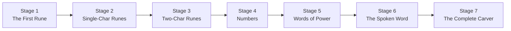

# Act 1 — Carving the Runes

> *Before a spell can be cast, its runes must be carved. Before code can run, its tokens must be read.*

In this act you build the **rune carver** — the lexer that transforms raw source text into a stream of tokens. By the end, you'll feed a string like `let hp = 100` into your carver and get back a neat sequence of `Let`, `Ident("hp")`, `Eq`, `IntLit(100)`.

This is the first stage of the interpreter pipeline defined in the design spec (§1):

```
Source text (.rune file)
  → Lexer (chars → tokens)        ← you are here
    → Parser (tokens → AST)
      → Evaluator (AST → side effects + return values)
```

**Prerequisites:** Rust installed (`rustup`), a terminal, a text editor. No prior Rust experience needed — every concept is introduced when you first need it. You should be comfortable with Python.

> [!tip] What You'll Learn
> - Rust enums, structs, pattern matching, `impl` blocks, `Vec`, `String` vs `&str`
> - Ownership and borrowing (introduced gently, when the compiler first complains)
> - Character-by-character scanning — why hand-written lexers beat regex
> - The two fundamental lexer operations: **peek** (look at the current character without consuming it) and **advance** (consume it and move forward)



**Estimated time:** 6–10 hours across all 7 stages.

**Project setup:** Everything lives in `~/juk/runescript/`, a standard Cargo project.

---

## Stage 1: The First Rune — Very Easy

*Difficulty: Very Easy*

**Goal:** Create the project, define the `Token` and `Span` types, and print a hardcoded token to prove everything compiles.

**Spec reference:** §3 (Token Types), §9.3 (Project Structure)

**New Rust concept(s):** `cargo new`, project layout, `enum`, `struct`, `#[derive(...)]`, `println!`, `fn main()`

### Why this stage

Every journey starts with a single step — or in our case, a single rune. Before we can scan anything, we need types to represent what we'll produce. This stage gets the project compiling and introduces Rust's most important feature for interpreter work: **enums with data**.

In Python you'd probably use a string tag or a dataclass. Rust's enums are the same idea but enforced by the compiler — you literally cannot forget to handle a case.

### Python equivalent

Python:
```python
from dataclasses import dataclass
from enum import Enum, auto

class TokenKind(Enum):
    PLUS = auto()
    INT_LIT = auto()  # but how do you attach the value 42?

@dataclass
class Token:
    kind: TokenKind
    line: int
    col: int
```

The problem: Python enums can't carry data per-variant. You'd need a separate `value` field and cast it.

Rust enums carry data *inside* each variant — `IntLit(i64)` means "this variant always has an `i64` inside it." The compiler enforces you extract it correctly.

### The Code

First, create the project:

```bash
cd ~/juk
cargo new runescript
cd runescript
```

`cargo new` creates this structure:

```
runescript/
├── Cargo.toml      # project metadata and dependencies
└── src/
    └── main.rs     # entry point
```

Open `Cargo.toml` and make sure the edition is `2024`:

```toml
[package]
name = "runescript"
version = "0.1.0"
edition = "2024"
```

Now create `src/token.rs` — this file defines the types that the lexer produces (§3):

```rust
// src/token.rs
// Defines the rune types that our carver produces.
// Every token in Runescript has a kind (what it is) and a span (where it is).

/// A position in source code. Every token carries one of these
/// so error messages can say "line 3, column 12".
#[derive(Debug, Clone, PartialEq)]
pub struct Span {
    pub line: usize,   // 1-based line number
    pub col: usize,    // 1-based column number
}
```

Let's unpack what's new here:

- `///` is a **doc comment** — it attaches documentation to the item below it.
- `#[derive(Debug, Clone, PartialEq)]` is an **attribute** that auto-generates trait implementations:
  - `Debug` — lets you print the struct with `{:?}` in format strings
  - `Clone` — lets you copy the struct with `.clone()`
  - `PartialEq` — lets you compare two `Span`s with `==`
- `pub` means "public" — other files can use this type. Without `pub`, it's private to this file.
- `struct Span { ... }` defines a named struct with named fields. Like a Python `@dataclass`.
- `usize` is Rust's unsigned pointer-sized integer — think of it as a non-negative `int`. It's the standard type for indices and counts.

Now the token kind enum — the heart of the lexer's output (§3):

```rust
/// Every possible token type in Runescript.
/// Variants that carry data (like IntLit) hold it directly inside the enum.
#[derive(Debug, Clone, PartialEq)]
pub enum TokenKind {
    // --- Literals ---
    IntLit(i64),          // 42, -7 — the i64 IS the value
    StringLit(String),    // "hello" — the String IS the content
    True,                 // true
    False,                // false

    // --- Identifiers & keywords ---
    Ident(String),        // hp, trap_armed, hunter
    Let,                  // let
    Fn,                   // fn
    If,                   // if
    Else,                 // else
    While,                // while
    For,                  // for
    In,                   // in
    Return,               // return
    Nil,                  // nil

    // --- Operators ---
    Plus,                 // +
    Minus,                // -
    Star,                 // *
    Slash,                // /
    Percent,              // %
    Eq,                   // =
    EqEq,                // ==
    BangEq,              // !=
    Lt,                   // <
    LtEq,                // <=
    Gt,                   // >
    GtEq,                // >=
    And,                  // &&
    Or,                   // ||
    Bang,                 // !
    Dot,                  // .

    // --- Delimiters ---
    LParen,              // (
    RParen,              // )
    LBrace,              // {
    RBrace,              // }
    LBracket,            // [
    RBracket,            // ]
    Comma,               // ,
    Semicolon,           // ;

    // --- Special ---
    Eof,                 // end of input
}
```

Key Rust concepts here:

- `enum` in Rust is a **sum type** — a `TokenKind` is *exactly one* of these variants at any time. Unlike Python's `Enum`, each variant can hold different data. `IntLit(i64)` holds a 64-bit integer. `Ident(String)` holds a heap-allocated string. `Plus` holds nothing.
- `i64` is a signed 64-bit integer — like Python's `int` but fixed-size.
- `String` is a heap-allocated, growable, owned string. We'll meet `&str` (a borrowed string slice) later.

Now the `Token` struct that bundles a kind with its location:

```rust
/// A single token: what it is + where it appeared in the source.
#[derive(Debug, Clone, PartialEq)]
pub struct Token {
    pub kind: TokenKind,
    pub span: Span,
}
```

That's it for `token.rs`. Now wire it into the project. Rust's module system requires you to declare files explicitly. Edit `src/main.rs`:

```rust
// src/main.rs
// Entry point for the Runescript interpreter.
// For now, we just prove our token types work.

mod token;  // tells Rust "there's a file called token.rs, load it as a module"

use token::{Token, TokenKind, Span};  // bring specific types into scope

fn main() {
    // Create a hardcoded token — as if the lexer had scanned "42"
    let tok = Token {
        kind: TokenKind::IntLit(42),
        span: Span { line: 1, col: 1 },
    };

    // {:?} uses the Debug trait we derived — prints the struct's contents
    println!("Our first rune: {:?}", tok);
}
```

New concepts:

- `mod token;` — declares a module. Rust looks for `src/token.rs` (or `src/token/mod.rs`). This is how Rust's module system works — you must explicitly declare every module.
- `use token::{Token, TokenKind, Span};` — imports specific items from the module. Like Python's `from token import Token, TokenKind, Span`.
- `let tok = ...` — variable binding. In Rust, variables are **immutable by default**. You'd need `let mut tok` to make it mutable. We don't need mutability here.
- `Token { kind: ..., span: ... }` — struct literal syntax. You fill in every field by name.
- `TokenKind::IntLit(42)` — creates the `IntLit` variant of the enum, carrying the value `42` inside it.
- `println!("...", tok)` — the `!` means it's a **macro**, not a function. `println!` is special because it parses the format string at compile time. `{:?}` is the Debug format specifier.

> [!warning] Common Mistakes
> **Forgetting `mod token;` in `main.rs`** — Rust won't find your file. Every `.rs` file must be declared as a module somewhere. You'll see:
> ```
> error[E0432]: unresolved import `token`
>  --> src/main.rs:3:5
>   |
> 3 | use token::{Token, TokenKind, Span};
>   |     ^^^^^ use of undeclared crate or module `token`
> ```
>
> **Forgetting `pub` on struct fields** — without `pub`, fields are private and `main.rs` can't access them:
> ```
> error[E0616]: field `kind` of struct `Token` is private
>  --> src/main.rs:8:9
>   |
> 8 |         kind: TokenKind::IntLit(42),
>   |         ^^^^ private field
> ```
>
> **Using `{}` instead of `{:?}` in println** — `{}` requires the `Display` trait (human-readable output). `{:?}` uses `Debug` (programmer-readable). We derived `Debug` but not `Display`:
> ```
> error[E0277]: `Token` doesn't implement `std::fmt::Display`
> ```

### Verify it works

```bash
cd ~/juk/runescript
cargo run
```

Expected output:

```
Our first rune: Token { kind: IntLit(42), span: Span { line: 1, col: 1 } }
```

If you see that, your types are defined correctly and the module system is wired up. The rune has been carved.

### Extend it

Create two more tokens by hand in `main.rs` — a `Plus` token at line 1, col 4, and a `StringLit("hello")` token at line 2, col 1. Print all three. This gets you comfortable with struct literal syntax and enum variant construction before we automate it.

> [!check] Checkpoint
> Your project should have these files:
>
> **`Cargo.toml`**
> ```toml
> [package]
> name = "runescript"
> version = "0.1.0"
> edition = "2024"
> ```
>
> **`src/token.rs`**
> ```rust
> #[derive(Debug, Clone, PartialEq)]
> pub struct Span {
>     pub line: usize,
>     pub col: usize,
> }
>
> #[derive(Debug, Clone, PartialEq)]
> pub enum TokenKind {
>     IntLit(i64),
>     StringLit(String),
>     True,
>     False,
>     Ident(String),
>     Let,
>     Fn,
>     If,
>     Else,
>     While,
>     For,
>     In,
>     Return,
>     Nil,
>     Plus,
>     Minus,
>     Star,
>     Slash,
>     Percent,
>     Eq,
>     EqEq,
>     BangEq,
>     Lt,
>     LtEq,
>     Gt,
>     GtEq,
>     And,
>     Or,
>     Bang,
>     Dot,
>     LParen,
>     RParen,
>     LBrace,
>     RBrace,
>     LBracket,
>     RBracket,
>     Comma,
>     Semicolon,
>     Eof,
> }
>
> #[derive(Debug, Clone, PartialEq)]
> pub struct Token {
>     pub kind: TokenKind,
>     pub span: Span,
> }
> ```
>
> **`src/main.rs`**
> ```rust
> mod token;
>
> use token::{Token, TokenKind, Span};
>
> fn main() {
>     let tok = Token {
>         kind: TokenKind::IntLit(42),
>         span: Span { line: 1, col: 1 },
>     };
>     println!("Our first rune: {:?}", tok);
> }
> ```


---

## Stage 2: Single-Character Runes — Easy

*Difficulty: Easy*

**Goal:** Build a `Lexer` struct that scans source text character-by-character and produces a `Vec<Token>` for single-character operators and delimiters.

**Spec reference:** §3 (Token Types — operators and delimiters), §2 (hand-written, character-by-character scanner)

**New Rust concept(s):** `struct` with methods (`impl`), `Vec<T>`, `char`, `match`, iterators via `.chars()`, `mut`, ownership vs borrowing (`&str` vs `String`)

### Why this stage

A lexer's job is simple: walk through the source text one character at a time and group characters into tokens. This stage handles the easiest case — tokens that are exactly one character long. `+` is always `Plus`. `(` is always `LParen`. No ambiguity, no lookahead.

We also introduce the lexer's core architecture: a struct that holds the source text and a cursor position, with `peek()` and `advance()` methods. Every future stage builds on this skeleton.

### Python equivalent

In Python you might write:

```python
def lex(source: str) -> list[Token]:
    tokens = []
    i = 0
    while i < len(source):
        ch = source[i]
        if ch == '+':
            tokens.append(Token(PLUS, line, col))
        elif ch == ' ':
            pass  # skip whitespace
        # ...
        i += 1
    return tokens
```

The Rust version is structurally identical — but the `Lexer` is a struct with methods instead of a standalone function, and the compiler enforces that you handle every possible character (or have a catch-all).

### The Code

Create `src/lexer.rs`:

```rust
// src/lexer.rs
// The rune carver — transforms source text into a stream of tokens.

use crate::token::{Token, TokenKind, Span};
```

- `use crate::token::...` — `crate` means "the root of this project." Since `token` is declared as a module in `main.rs`, we access it from the crate root. This is like Python's `from runescript.token import ...`.

Right now we have token *types* but no way to *produce* them from source text. We need a struct that holds the source, tracks where we are in it, and walks through it character by character.

Now the `Lexer` struct:

```rust
/// The rune carver. Holds the source text and a cursor position.
pub struct Lexer {
    /// Source text as a vector of characters.
    /// We convert from &str up front so we can index by position.
    chars: Vec<char>,
    /// Current position in the chars vector (0-based).
    pos: usize,
    /// Current line in the source (1-based, for error messages).
    line: usize,
    /// Current column in the source (1-based, for error messages).
    col: usize,
}
```

Why `Vec<char>` instead of just `&str`? Rust strings are UTF-8 encoded, which means you can't index them by byte position and get a character — a character might be 1–4 bytes. Converting to `Vec<char>` up front lets us index freely with `self.chars[self.pos]`. It costs a bit of memory but makes the lexer much simpler.

In Python, `source[i]` just works because Python strings are sequences of characters. In Rust, you have to be explicit about the encoding.

Now the implementation block — this is where methods live:

```rust
impl Lexer {
    /// Create a new lexer from source text.
    pub fn new(source: &str) -> Self {
        Lexer {
            chars: source.chars().collect(),
            pos: 0,
            line: 1,
            col: 1,
        }
    }
```

- `impl Lexer { ... }` — an **implementation block**. All methods for `Lexer` go here. Like a class body in Python, but separated from the struct definition.
- `pub fn new(source: &str) -> Self` — a constructor by convention. Rust doesn't have a `__init__` — `new` is just a regular function that returns `Self` (an alias for `Lexer`).
- `source: &str` — a **borrowed string slice**. The `&` means "I'm borrowing this data, not taking ownership." The caller keeps their string; we just read it. `.chars().collect()` iterates over the characters and collects them into a `Vec<char>`, which the lexer *owns*.
- `source.chars()` — returns an iterator over the Unicode characters. `.collect()` consumes the iterator and builds a `Vec<char>`.

### Concept: Ownership and Borrowing — Your First Encounter

This is the moment Rust stops feeling like Python. Let's talk about what `&str` actually means.

In Python, when you pass a string to a function, both the caller and the function can use it freely. Python's garbage collector figures out when to free the memory.

Rust has no garbage collector. Instead, every value has exactly one **owner**. When the owner goes out of scope, the value is dropped (freed). This prevents memory leaks and use-after-free bugs at compile time.

`&str` is a **reference** — it lets you *look at* data without owning it. Think of it like borrowing a book from a library:

- The library (caller) still owns the book (the string)
- You (the function) can read it, but you can't destroy it or keep it forever
- When you're done (function returns), the borrow ends

Our `Lexer::new` borrows the source string (`&str`), reads its characters, and copies them into a `Vec<char>` that the lexer owns. After `new` returns, the borrow is over — the caller's string is untouched, and the lexer has its own copy of the characters.

Why not just store `&str` in the lexer? We could, but it would require **lifetime annotations** — telling the compiler "this lexer can't outlive the string it borrows." That's a topic for Act 3. For now, copying into `Vec<char>` is simpler and avoids lifetimes entirely.

The two fundamental operations — **peek** and **advance**:

```rust
    /// Look at the current character without consuming it.
    /// Returns None if we've reached the end of input.
    fn peek(&self) -> Option<char> {
        self.chars.get(self.pos).copied()
    }

    /// Consume the current character and advance the cursor.
    /// Returns None if we've reached the end of input.
    fn advance(&mut self) -> Option<char> {
        let ch = self.chars.get(self.pos).copied();
        if let Some(c) = ch {
            self.pos += 1;
            if c == '\n' {
                self.line += 1;
                self.col = 1;
            } else {
                self.col += 1;
            }
        }
        ch
    }
```

- `&self` vs `&mut self` — this is Rust's borrowing system in action. `peek` only *reads* the lexer state, so it takes `&self` (shared/immutable reference). `advance` *modifies* `pos`, `line`, and `col`, so it takes `&mut self` (exclusive/mutable reference). The compiler enforces this — you can't call `advance` through a shared reference.

  **Mental model:** `&self` is like looking through a window — you can see but not touch. `&mut self` is like having the key — you can go in and rearrange things. Rust guarantees that only one person has the key at a time (no data races).

- `Option<char>` — Rust's version of nullable. `Some('x')` means "there's a character here." `None` means "end of input." There's no `null` in Rust — you must use `Option` and handle both cases. In Python, this is like returning `None` from a function, but Rust forces you to check for it.
- `.get(self.pos)` — safe indexing that returns `Option<&char>` instead of panicking on out-of-bounds. `.copied()` converts `Option<&char>` to `Option<char>` (copies the char out of the reference — chars are tiny, this is cheap).
- `if let Some(c) = ch` — **pattern matching** in an `if`. This destructures the `Option`: if it's `Some`, bind the inner value to `c` and run the block. If it's `None`, skip it. This is like Python's `if ch is not None: c = ch` but more elegant.

A helper to make a `Span` at the current position:

```rust
    /// Create a Span at the current cursor position.
    fn span(&self) -> Span {
        Span { line: self.line, col: self.col }
    }
```

Skip whitespace — spaces, tabs, and newlines are not tokens:

```rust
    /// Skip whitespace characters (spaces, tabs, newlines).
    fn skip_whitespace(&mut self) {
        while let Some(c) = self.peek() {
            if c.is_ascii_whitespace() {
                self.advance();
            } else {
                break;
            }
        }
    }
```

- `while let Some(c) = self.peek()` — loop as long as `peek()` returns `Some`. When it returns `None` (end of input), the loop exits. This is idiomatic Rust for "keep going until there's nothing left."
- `c.is_ascii_whitespace()` — a method on `char`. Returns `true` for space, tab, newline, carriage return, etc.

Now the main scanning method. **Try implementing this yourself first.** You have `peek()`, `advance()`, `skip_whitespace()`, and `span()`. The method should:

1. Loop until end of input
2. Skip whitespace at the start of each iteration
3. Record the span before consuming a character
4. Advance to get the next character
5. Match the character to a `TokenKind`
6. Push the token onto a `Vec<Token>`

Give it a shot — handle at least `+`, `-`, `*`, `(`, `)`. Skip unknown characters with `continue`.

<details>
<summary>Solution: scan_tokens</summary>

```rust
    /// Scan all tokens from the source text.
    pub fn scan_tokens(&mut self) -> Vec<Token> {
        let mut tokens = Vec::new();

        loop {
            self.skip_whitespace();

            // Record position BEFORE consuming the character
            let sp = self.span();

            let ch = match self.advance() {
                Some(c) => c,
                None => break,  // end of input
            };

            let kind = match ch {
                '+' => TokenKind::Plus,
                '-' => TokenKind::Minus,
                '*' => TokenKind::Star,
                '/' => TokenKind::Slash,
                '%' => TokenKind::Percent,
                '=' => TokenKind::Eq,
                '<' => TokenKind::Lt,
                '>' => TokenKind::Gt,
                '!' => TokenKind::Bang,
                '.' => TokenKind::Dot,
                '(' => TokenKind::LParen,
                ')' => TokenKind::RParen,
                '{' => TokenKind::LBrace,
                '}' => TokenKind::RBrace,
                '[' => TokenKind::LBracket,
                ']' => TokenKind::RBracket,
                ',' => TokenKind::Comma,
                ';' => TokenKind::Semicolon,
                _ => continue,  // skip unknown characters for now
            };

            tokens.push(Token { kind, span: sp });
        }

        tokens
    }
}
```

</details>

Key concepts in the solution:

- `let mut tokens = Vec::new();` — creates an empty, growable vector. `mut` because we'll `.push()` into it. `Vec` is Rust's `list` / `Array` — a heap-allocated, resizable array.
- `loop { ... }` — infinite loop. We `break` when we hit end of input.
- `match ch { ... }` — **pattern matching** on the character. This is Rust's `switch` statement, but exhaustive — the compiler warns if you don't cover all cases. The `_` arm is the catch-all (like `default` in a switch).
- `'+'` — character literals use single quotes. String literals use double quotes. This is different from Python (which uses either) and important in Rust.
- `tokens.push(Token { kind, span: sp })` — push a new token onto the vector. `kind` is shorthand for `kind: kind` when the variable name matches the field name.
- `_ => continue` — for now, we skip any character we don't recognize. We'll handle errors properly in Stage 7.

Now update `main.rs` to use the lexer:

```rust
// src/main.rs
mod token;
mod lexer;

use lexer::Lexer;

fn main() {
    let source = "( + - ) * { }";
    let mut lex = Lexer::new(source);
    let tokens = lex.scan_tokens();

    for tok in &tokens {
        println!("{:?}", tok);
    }
}
```

- `mod lexer;` — declare the new module.
- `let mut lex = Lexer::new(source);` — `mut` because `scan_tokens` takes `&mut self`.
- `for tok in &tokens` — iterate over *references* to the tokens. The `&` means "borrow each token, don't move it out of the vector." Without `&`, the loop would *consume* the vector and you couldn't use `tokens` afterward.

> [!warning] The Ownership Wall: `for tok in tokens` vs `for tok in &tokens`
> Try removing the `&` and adding a `println!("{}", tokens.len());` after the loop:
> ```rust
> for tok in tokens {       // moves each token OUT of the vector
>     println!("{:?}", tok);
> }
> println!("{}", tokens.len());  // ERROR!
> ```
> The compiler says:
> ```
> error[E0382]: borrow of moved value: `tokens`
>  --> src/main.rs:12:20
>   |
> 9 |     for tok in tokens {
>   |                ------ `tokens` moved due to this implicit call to `.into_iter()`
> ...
> 12|     println!("{}", tokens.len());
>   |                    ^^^^^^ value borrowed here after move
> ```
> **What happened:** `for tok in tokens` calls `.into_iter()`, which *consumes* the vector. Each token is moved out, and after the loop, `tokens` is empty and invalid. The compiler prevents you from using it.
>
> **The fix:** `for tok in &tokens` calls `.iter()`, which borrows each element. The vector stays intact. This is Rust's ownership system protecting you from use-after-free — at compile time, not runtime.

Let's also add our first tests. In Rust, tests live in the same file as the code they test, inside a `#[cfg(test)]` module. Add this at the bottom of `src/lexer.rs`:

```rust
#[cfg(test)]
mod tests {
    use super::*;

    #[test]
    fn scan_single_char_tokens() {
        let mut lexer = Lexer::new("+ - * ( )");
        let tokens = lexer.scan_tokens();
        let kinds: Vec<_> = tokens.iter().map(|t| &t.kind).collect();
        assert_eq!(
            kinds,
            vec![
                &TokenKind::Plus,
                &TokenKind::Minus,
                &TokenKind::Star,
                &TokenKind::LParen,
                &TokenKind::RParen,
            ]
        );
    }

    #[test]
    fn skips_whitespace() {
        let mut lexer = Lexer::new("  +   -  ");
        let tokens = lexer.scan_tokens();
        assert_eq!(tokens.len(), 2);
        assert_eq!(tokens[0].kind, TokenKind::Plus);
        assert_eq!(tokens[1].kind, TokenKind::Minus);
    }

    #[test]
    fn tracks_line_and_col() {
        let mut lexer = Lexer::new("+\n  -");
        let tokens = lexer.scan_tokens();
        assert_eq!(tokens[0].span.line, 1);
        assert_eq!(tokens[0].span.col, 1);
        assert_eq!(tokens[1].span.line, 2);
        assert_eq!(tokens[1].span.col, 3);
    }
}
```

- `#[cfg(test)]` — this module only compiles when running tests. It's stripped from release builds.
- `use super::*;` — import everything from the parent module (the lexer itself).
- `#[test]` — marks a function as a test case. `cargo test` finds and runs all of these.
- `assert_eq!(a, b)` — panics (fails the test) if `a != b`. This is why we derived `PartialEq` on our types.
- `tokens.iter().map(|t| &t.kind).collect()` — iterator chain. `.iter()` borrows each element, `.map(|t| &t.kind)` transforms each token into a reference to its kind, `.collect()` gathers results into a `Vec`. The `|t|` is a **closure** (anonymous function) — like Python's `lambda t: t.kind`.

> [!warning] Common Mistakes
> **Forgetting `mut` on the lexer** — `scan_tokens` takes `&mut self`, so the variable must be `let mut lex`:
> ```
> error[E0596]: cannot borrow `lex` as mutable, as it is not declared as mutable
>  --> src/main.rs:8:18
>   |
> 8 |     let tokens = lex.scan_tokens();
>   |                  ^^^ cannot borrow as mutable
>   |
> help: consider changing this to be mutable
>   |
> 7 |     let mut lex = Lexer::new(source);
>   |         +++
> ```
>
> **Using `source[i]` on a `&str`** — Rust strings aren't indexable by position. That's why we convert to `Vec<char>`:
> ```
> error[E0277]: the type `str` cannot be indexed by `{integer}`
> ```
>
> **Missing `mod lexer;` in `main.rs`** — the file exists but Rust doesn't know about it:
> ```
> error[E0432]: unresolved import `lexer`
> ```

### Verify it works

```bash
cd ~/juk/runescript
cargo run
```

Expected output:

```
Token { kind: Plus, span: Span { line: 1, col: 3 } }
Token { kind: Minus, span: Span { line: 1, col: 5 } }
...
```

Run the tests:

```bash
cargo test
```

Expected: all 3 tests pass.

### Extend it

Write a test called `scan_all_delimiters` that lexes `"( ) { } [ ] , ;"` and verifies all 8 delimiter tokens are produced in the correct order. This reinforces the test-writing pattern and the match-arm-to-token mapping.

> [!check] Checkpoint
> **`src/lexer.rs`** (complete):
>
> ```rust
> use crate::token::{Token, TokenKind, Span};
>
> pub struct Lexer {
>     chars: Vec<char>,
>     pos: usize,
>     line: usize,
>     col: usize,
> }
>
> impl Lexer {
>     pub fn new(source: &str) -> Self {
>         Lexer {
>             chars: source.chars().collect(),
>             pos: 0,
>             line: 1,
>             col: 1,
>         }
>     }
>
>     fn peek(&self) -> Option<char> {
>         self.chars.get(self.pos).copied()
>     }
>
>     fn advance(&mut self) -> Option<char> {
>         let ch = self.chars.get(self.pos).copied();
>         if let Some(c) = ch {
>             self.pos += 1;
>             if c == '\n' {
>                 self.line += 1;
>                 self.col = 1;
>             } else {
>                 self.col += 1;
>             }
>         }
>         ch
>     }
>
>     fn span(&self) -> Span {
>         Span { line: self.line, col: self.col }
>     }
>
>     fn skip_whitespace(&mut self) {
>         while let Some(c) = self.peek() {
>             if c.is_ascii_whitespace() {
>                 self.advance();
>             } else {
>                 break;
>             }
>         }
>     }
>
>     pub fn scan_tokens(&mut self) -> Vec<Token> {
>         let mut tokens = Vec::new();
>
>         loop {
>             self.skip_whitespace();
>             let sp = self.span();
>
>             let ch = match self.advance() {
>                 Some(c) => c,
>                 None => break,
>             };
>
>             let kind = match ch {
>                 '+' => TokenKind::Plus,
>                 '-' => TokenKind::Minus,
>                 '*' => TokenKind::Star,
>                 '/' => TokenKind::Slash,
>                 '%' => TokenKind::Percent,
>                 '=' => TokenKind::Eq,
>                 '<' => TokenKind::Lt,
>                 '>' => TokenKind::Gt,
>                 '!' => TokenKind::Bang,
>                 '.' => TokenKind::Dot,
>                 '(' => TokenKind::LParen,
>                 ')' => TokenKind::RParen,
>                 '{' => TokenKind::LBrace,
>                 '}' => TokenKind::RBrace,
>                 '[' => TokenKind::LBracket,
>                 ']' => TokenKind::RBracket,
>                 ',' => TokenKind::Comma,
>                 ';' => TokenKind::Semicolon,
>                 _ => continue,
>             };
>
>             tokens.push(Token { kind, span: sp });
>         }
>
>         tokens
>     }
> }
>
> #[cfg(test)]
> mod tests {
>     use super::*;
>
>     #[test]
>     fn scan_single_char_tokens() {
>         let mut lexer = Lexer::new("+ - * ( )");
>         let tokens = lexer.scan_tokens();
>         let kinds: Vec<_> = tokens.iter().map(|t| &t.kind).collect();
>         assert_eq!(
>             kinds,
>             vec![
>                 &TokenKind::Plus,
>                 &TokenKind::Minus,
>                 &TokenKind::Star,
>                 &TokenKind::LParen,
>                 &TokenKind::RParen,
>             ]
>         );
>     }
>
>     #[test]
>     fn skips_whitespace() {
>         let mut lexer = Lexer::new("  +   -  ");
>         let tokens = lexer.scan_tokens();
>         assert_eq!(tokens.len(), 2);
>         assert_eq!(tokens[0].kind, TokenKind::Plus);
>         assert_eq!(tokens[1].kind, TokenKind::Minus);
>     }
>
>     #[test]
>     fn tracks_line_and_col() {
>         let mut lexer = Lexer::new("+\n  -");
>         let tokens = lexer.scan_tokens();
>         assert_eq!(tokens[0].span.line, 1);
>         assert_eq!(tokens[0].span.col, 1);
>         assert_eq!(tokens[1].span.line, 2);
>         assert_eq!(tokens[1].span.col, 3);
>     }
> }
> ```
>
> **`src/main.rs`** (updated):
>
> ```rust
> mod token;
> mod lexer;
>
> use lexer::Lexer;
>
> fn main() {
>     let source = "( + - ) * { }";
>     let mut lex = Lexer::new(source);
>     let tokens = lex.scan_tokens();
>
>     for tok in &tokens {
>         println!("{:?}", tok);
>     }
> }
> ```


---

## Stage 3: Two-Character Runes — Easy

*Difficulty: Easy*

**Goal:** Handle two-character operators (`==`, `!=`, `<=`, `>=`, `&&`, `||`) using peek-ahead logic, while still falling back to single-character versions (`=`, `!`, `<`, `>`) when the second character doesn't match.

**Spec reference:** §3 (Token Types — `EqEq`, `BangEq`, `LtEq`, `GtEq`, `And`, `Or`)

**New Rust concept(s):** `if let` with method calls, the peek-then-conditionally-advance pattern, `bool` expressions in match arms

### Why this stage

This is where lexing gets interesting. When you see `=`, you can't immediately emit `Eq` — you have to check if the *next* character is also `=`, making it `EqEq`. This is the **lookahead** problem, and it's the reason we have separate `peek()` and `advance()` methods.

The pattern is always the same: consume the first character, peek at the next, and decide. This two-step dance is the core of every hand-written lexer.

### Python equivalent

```python
if ch == '=':
    if i + 1 < len(source) and source[i + 1] == '=':
        tokens.append(Token(EQ_EQ, ...))
        i += 1  # consume the second '='
    else:
        tokens.append(Token(EQ, ...))
```

Same logic in Rust, but we use `peek()` instead of manual index arithmetic, and `advance()` instead of `i += 1`.

### The Code

We need a helper method that peeks at the next character and advances only if it matches. Add this to the `impl Lexer` block in `src/lexer.rs`, right after `skip_whitespace`:

```rust
    /// If the next character matches `expected`, consume it and return true.
    /// Otherwise, leave the cursor where it is and return false.
    fn match_char(&mut self, expected: char) -> bool {
        if self.peek() == Some(expected) {
            self.advance();
            true
        } else {
            false
        }
    }
```

This is the peek-then-conditionally-advance pattern. It's used everywhere in lexers and parsers. The key insight: `peek()` doesn't move the cursor, so if the character doesn't match, we haven't consumed anything.

Now update the `match ch` block in `scan_tokens`. **Try it yourself first:** replace the `'='` arm so it checks for `==` vs `=`. The pattern is: call `self.match_char('=')` — if true, return `EqEq`; if false, return `Eq`. Then do the same for `!`, `<`, `>`.

<details>
<summary>Solution: updated match block</summary>

```rust
            let kind = match ch {
                '+' => TokenKind::Plus,
                '-' => TokenKind::Minus,
                '*' => TokenKind::Star,
                '/' => TokenKind::Slash,
                '%' => TokenKind::Percent,

                // Two-character operators with single-character fallback
                '=' => {
                    if self.match_char('=') {
                        TokenKind::EqEq    // ==
                    } else {
                        TokenKind::Eq      // =
                    }
                }
                '!' => {
                    if self.match_char('=') {
                        TokenKind::BangEq  // !=
                    } else {
                        TokenKind::Bang    // !
                    }
                }
                '<' => {
                    if self.match_char('=') {
                        TokenKind::LtEq    // <=
                    } else {
                        TokenKind::Lt      // <
                    }
                }
                '>' => {
                    if self.match_char('=') {
                        TokenKind::GtEq    // >=
                    } else {
                        TokenKind::Gt      // >
                    }
                }
                '&' => {
                    if self.match_char('&') {
                        TokenKind::And     // &&
                    } else {
                        continue;          // lone '&' is not a valid token
                    }
                }
                '|' => {
                    if self.match_char('|') {
                        TokenKind::Or      // ||
                    } else {
                        continue;          // lone '|' is not a valid token
                    }
                }

                '.' => TokenKind::Dot,
                '(' => TokenKind::LParen,
                ')' => TokenKind::RParen,
                '{' => TokenKind::LBrace,
                '}' => TokenKind::RBrace,
                '[' => TokenKind::LBracket,
                ']' => TokenKind::RBracket,
                ',' => TokenKind::Comma,
                ';' => TokenKind::Semicolon,
                _ => continue,
            };
```

</details>

Notice the pattern: each arm is a block `{ ... }` that returns a `TokenKind`. In Rust, `if/else` is an **expression** — it returns a value. So `if self.match_char('=') { TokenKind::EqEq } else { TokenKind::Eq }` evaluates to one of those two variants. No `return` needed — the last expression in a block is its value (no semicolon!).

For `&` and `|`, a lone character isn't valid in Runescript (there's no bitwise AND/OR), so we `continue` to skip it. We'll turn this into a proper error in Stage 7.

Add tests at the bottom of the `mod tests` block:

```rust
    #[test]
    fn scan_two_char_operators() {
        let mut lexer = Lexer::new("== != <= >= && ||");
        let tokens = lexer.scan_tokens();
        let kinds: Vec<_> = tokens.iter().map(|t| &t.kind).collect();
        assert_eq!(
            kinds,
            vec![
                &TokenKind::EqEq,
                &TokenKind::BangEq,
                &TokenKind::LtEq,
                &TokenKind::GtEq,
                &TokenKind::And,
                &TokenKind::Or,
            ]
        );
    }

    #[test]
    fn single_char_fallback() {
        // '=' alone should be Eq, not EqEq
        let mut lexer = Lexer::new("= ! < >");
        let tokens = lexer.scan_tokens();
        let kinds: Vec<_> = tokens.iter().map(|t| &t.kind).collect();
        assert_eq!(
            kinds,
            vec![
                &TokenKind::Eq,
                &TokenKind::Bang,
                &TokenKind::Lt,
                &TokenKind::Gt,
            ]
        );
    }

    #[test]
    fn mixed_operators() {
        let mut lexer = Lexer::new("= == !=");
        let tokens = lexer.scan_tokens();
        let kinds: Vec<_> = tokens.iter().map(|t| &t.kind).collect();
        assert_eq!(
            kinds,
            vec![&TokenKind::Eq, &TokenKind::EqEq, &TokenKind::BangEq]
        );
    }
```

> [!warning] Common Mistakes
> **Missing the `else` branch** — in Rust, `if` used as an expression *must* have an `else` branch (unless the `if` arm diverges with `return`/`break`/`continue`):
> ```
> error[E0317]: `if` may be missing an `else` clause
>  --> src/lexer.rs:52:17
>   |
> 52|                 if self.match_char('=') {
>   |                 ^ expected `TokenKind`, found `()`
> ```
>
> **Adding a semicolon after the `if/else` expression** — `if x { A } else { B };` with a trailing semicolon turns the expression into a statement that returns `()` (unit/void). The match arm then has the wrong type.
>
> **Confusing `&` (reference) with `&&` (logical AND token)** — in Rust code, `&` creates a reference and `&&` is a double-reference or logical AND. In Runescript source, `&&` is the logical AND operator. Don't mix up the language you're *writing* with the language you're *lexing*.

### Verify it works

```bash
cargo test
```

Expected: all 6 tests pass (3 from Stage 2 + 3 new).

Update `main.rs` to test with two-character operators:

```rust
fn main() {
    let source = "( == != ) <= >=";
    let mut lex = Lexer::new(source);
    let tokens = lex.scan_tokens();

    for tok in &tokens {
        println!("{:?}", tok);
    }
}
```

```bash
cargo run
```

You should see `EqEq`, `BangEq`, `LtEq`, `GtEq` in the output.

### Extend it

Write a test called `adjacent_two_char_ops` that lexes `"===!=="` (no spaces) and verifies the lexer produces `EqEq`, `Eq`, `BangEq`, `Eq`. This tests that the lookahead correctly handles operators jammed together without whitespace.

> [!check] Checkpoint
> **`src/lexer.rs`** — only the changed/added parts are shown. The full file is the Stage 2 checkpoint with these modifications:
>
> 1. Add `match_char` method after `skip_whitespace`.
> 2. Replace the `match ch` block in `scan_tokens` with the expanded version above.
> 3. Add the three new tests.
>
> The full `scan_tokens` match block is shown in the solution above. The rest of the file (struct, `new`, `peek`, `advance`, `span`, `skip_whitespace`) is unchanged from Stage 2.


---

## Stage 4: Numbers and the Void — Easy

*Difficulty: Easy*

**Goal:** Scan integer literals (`42`, `0`, `1000`) into `IntLit(i64)` tokens. Understand that negative numbers like `-7` are handled by the parser (unary minus on `7`), not the lexer.

**Spec reference:** §3 (`IntLit(i64)` — "42, -7"), §4.1 (`IntLit` expression node)

**New Rust concept(s):** `String::new()`, `push()` on strings, `.parse::<i64>()`, `Result` and `.unwrap()`, `while let` with conditions, `is_ascii_digit()`

### Why this stage

Tokens aren't always single characters. A number like `42` is *two* characters that form *one* token. This is our first multi-character token, and it introduces the pattern: "consume characters while a condition holds, then build the token from what you collected."

A design note from the spec (§3): `IntLit(i64)` stores the parsed integer value directly in the token. The lexer does the string-to-number conversion so the parser and evaluator don't have to.

### Python equivalent

```python
if ch.isdigit():
    num_str = ch
    while i + 1 < len(source) and source[i + 1].isdigit():
        i += 1
        num_str += source[i]
    tokens.append(Token(INT_LIT, int(num_str), ...))
```

Same idea in Rust — accumulate digit characters into a string, then parse it.

### The Code

This is your first multi-character scanning method. **Implement `scan_number` yourself.** Here's the signature and what it should do:

```rust
fn scan_number(&mut self, first_char: char) -> TokenKind
```

1. Create a `String`, push `first_char` into it
2. Loop: peek at the next character — if it's a digit, advance and push it
3. Parse the accumulated string into an `i64`
4. Return `TokenKind::IntLit(value)`

Hints:
- `String::new()` creates an empty string
- `num_str.push(c)` appends a char
- `num_str.parse::<i64>().unwrap()` converts string to integer
- `c.is_ascii_digit()` checks if a char is `0`–`9`

<details>
<summary>Solution: scan_number</summary>

```rust
    /// Scan an integer literal. The first digit has already been consumed
    /// by the caller, so we receive it as `first_char`.
    fn scan_number(&mut self, first_char: char) -> TokenKind {
        let mut num_str = String::new();
        num_str.push(first_char);

        // Keep consuming digits
        while let Some(c) = self.peek() {
            if c.is_ascii_digit() {
                self.advance();
                num_str.push(c);
            } else {
                break;
            }
        }

        // Parse the accumulated string into an i64.
        // .unwrap() panics if parsing fails — safe here because we only
        // collected digit characters.
        let value: i64 = num_str.parse().unwrap();
        TokenKind::IntLit(value)
    }
```

</details>

Let's break down the new concepts:

- `String::new()` — creates an empty, heap-allocated string. Like `""` in Python but explicitly allocated.
- `num_str.push(first_char)` — appends a single `char` to the string. Like Python's `+=` for strings, but mutates in place (more efficient).
- `num_str.parse().unwrap()` — `.parse()` is a generic method that converts a string to any type that implements `FromStr`. The compiler infers we want `i64` from the type annotation `let value: i64`. It returns a `Result<i64, ParseIntError>` — either `Ok(42)` or `Err(...)`. `.unwrap()` extracts the `Ok` value or panics on `Err`. Since we only collected digits, parsing can't fail (unless the number overflows `i64`, which we'll ignore for now).

### Concept: Result and .unwrap() — A Preview of Error Handling

`Result` is Rust's error handling type — like `Option` but the error case carries information about *what* went wrong. `Ok(value)` is success, `Err(error)` is failure.

| Python | Rust |
|--------|------|
| `try: int(s)` / `except ValueError` | `s.parse::<i64>()` returns `Result<i64, ParseIntError>` |
| Success: returns the int | `Ok(42)` |
| Failure: raises exception | `Err(ParseIntError { ... })` |

`.unwrap()` is a shortcut that says "I'm sure this will succeed — panic if it doesn't." It's fine for prototyping but dangerous in production code. **What happens when `.unwrap()` panics?**

```
thread 'main' panicked at 'called `Result::unwrap()` on an `Err` value:
ParseIntError { kind: InvalidDigit }', src/lexer.rs:42:47
```

The program crashes with a stack trace. No graceful error message, no recovery. In Stage 6, we'll replace `.unwrap()` with the `?` operator for proper error propagation. For now, `.unwrap()` is safe because we only feed digit characters to `.parse()`.

Now hook it into `scan_tokens`. Add this arm to the `match ch` block, *before* the `_ => continue` catch-all:

```rust
                // Number literals
                c if c.is_ascii_digit() => self.scan_number(c),
```

This is a **match guard** — `c if c.is_ascii_digit()` matches any character and binds it to `c`, but only if the guard condition is true. It's like a pattern with an extra `if` clause.

**Why doesn't the lexer handle negative numbers?** The spec says `IntLit(i64)` can represent `-7`, but the *lexer* only produces positive integers. `-7` is parsed as the unary minus operator applied to `7` — that's the parser's job (§4, `Unary(Neg, Box<Expr>)`). This is standard practice: it avoids ambiguity between `a - 7` (subtraction) and `a -7` (subtraction of... negative 7? or two tokens?).

Add tests:

```rust
    #[test]
    fn scan_integers() {
        let mut lexer = Lexer::new("42 0 1000");
        let tokens = lexer.scan_tokens();
        assert_eq!(tokens[0].kind, TokenKind::IntLit(42));
        assert_eq!(tokens[1].kind, TokenKind::IntLit(0));
        assert_eq!(tokens[2].kind, TokenKind::IntLit(1000));
    }

    #[test]
    fn number_followed_by_operator() {
        let mut lexer = Lexer::new("42+7");
        let tokens = lexer.scan_tokens();
        assert_eq!(tokens.len(), 3);
        assert_eq!(tokens[0].kind, TokenKind::IntLit(42));
        assert_eq!(tokens[1].kind, TokenKind::Plus);
        assert_eq!(tokens[2].kind, TokenKind::IntLit(7));
    }
```

> [!warning] Common Mistakes
> **Trying to handle `-7` in the lexer** — don't. `-` is always `Minus`. The parser combines `Minus` + `IntLit(7)` into a negation expression. If you try to handle it in the lexer, you'll break subtraction: `10 - 7` would lex as `IntLit(10)`, `IntLit(-7)` instead of `IntLit(10)`, `Minus`, `IntLit(7)`.
>
> **Forgetting `mut` on `num_str`** — `push` mutates the string, so it must be `let mut num_str`:
> ```
> error[E0596]: cannot borrow `num_str` as mutable, as it is not declared as mutable
> ```
>
> **Putting the digit arm after `_ => continue`** — match arms are checked top to bottom. The `_` catch-all matches everything, so nothing below it runs. Always put `_` last.
>
> **Using `num_str.parse::<i64>()` without the type annotation** — either annotate the variable (`let value: i64 = ...`) or use the turbofish syntax (`.parse::<i64>()`). Without either, Rust can't infer what type to parse into:
> ```
> error[E0284]: type annotations needed
>   --> src/lexer.rs:45:30
>    |
> 45 |         let value = num_str.parse().unwrap();
>    |                             ^^^^^ cannot infer type of the type parameter `F`
> ```

### Verify it works

```bash
cargo test
```

Expected: all 8 tests pass.

Update `main.rs`:

```rust
fn main() {
    let source = "42 + 7 == 49";
    let mut lex = Lexer::new(source);
    let tokens = lex.scan_tokens();

    for tok in &tokens {
        println!("{:?}", tok);
    }
}
```

```bash
cargo run
```

Expected output includes `IntLit(42)`, `Plus`, `IntLit(7)`, `EqEq`, `IntLit(49)`.

### Extend it

Write a test called `negative_is_two_tokens` that lexes `"-42"` and verifies it produces `Minus`, `IntLit(42)` — NOT `IntLit(-42)`. This reinforces the design decision that the lexer doesn't handle negative numbers.

> [!check] Checkpoint
> Add to `src/lexer.rs`:
>
> 1. The `scan_number` method in the `impl Lexer` block.
> 2. The `c if c.is_ascii_digit() => self.scan_number(c)` arm in the match block (before `_ => continue`).
> 3. The two new tests.
>
> Everything else is unchanged from Stage 3.


---

## Stage 5: Words of Power — Medium

*Difficulty: Medium*

**Goal:** Scan identifiers (`hp`, `trap_armed`, `hunter`) and keywords (`let`, `fn`, `if`, `else`, `while`, `for`, `in`, `return`, `true`, `false`, `nil`). Build the keyword lookup table from the spec.

**Spec reference:** §3.1 (Keywords Table — all 11 keywords), §3 (`Ident(String)`, `True`, `False`, `Nil`, and all keyword tokens)

**New Rust concept(s):** `HashMap`, closures in `.is_ascii_alphanumeric()`, `String` ownership in enum variants, the `_` character in identifiers

### Why this stage

Identifiers and keywords look the same to the lexer at first — they're both sequences of letters. `let` starts with `l` just like `level` does. The lexer scans the full word, then checks: is this a keyword? If yes, emit the keyword token. If no, emit `Ident(word)`.

This is the **keyword lookup** pattern, and it's how virtually every hand-written lexer works. We'll use a `HashMap` for O(1) lookups, though for only 11 keywords a simple `match` would also work.

### Python equivalent

```python
KEYWORDS = {
    "let": TokenKind.LET,
    "fn": TokenKind.FN,
    "if": TokenKind.IF,
    # ...
}

if ch.isalpha() or ch == '_':
    word = ch
    while i + 1 < len(source) and (source[i+1].isalnum() or source[i+1] == '_'):
        i += 1
        word += source[i]
    kind = KEYWORDS.get(word, TokenKind.IDENT)
    tokens.append(Token(kind, word, ...))
```

Rust is the same pattern — accumulate characters, look up in a map.

### The Code

First, we need `HashMap`. Add this import at the top of `src/lexer.rs`:

```rust
use std::collections::HashMap;
```

`std::collections::HashMap` is Rust's built-in hash map — like Python's `dict`. It's in the standard library but not in the prelude (the set of things automatically imported), so you must import it explicitly.

Add a method that builds the keyword table:

```rust
    /// Build the keyword lookup table (§3.1).
    /// Returns a HashMap mapping keyword strings to their TokenKind.
    fn keywords() -> HashMap<&'static str, TokenKind> {
        let mut map = HashMap::new();
        map.insert("let", TokenKind::Let);
        map.insert("fn", TokenKind::Fn);
        map.insert("if", TokenKind::If);
        map.insert("else", TokenKind::Else);
        map.insert("while", TokenKind::While);
        map.insert("for", TokenKind::For);
        map.insert("in", TokenKind::In);
        map.insert("return", TokenKind::Return);
        map.insert("true", TokenKind::True);
        map.insert("false", TokenKind::False);
        map.insert("nil", TokenKind::Nil);
        map
    }
```

- `fn keywords()` — no `&self` parameter, so this is an **associated function** (like a static method in Python). You call it as `Lexer::keywords()`, not `self.keywords()`.
- `HashMap<&'static str, TokenKind>` — the keys are string slices with a `'static` lifetime, meaning they live for the entire program. String literals like `"let"` are baked into the binary and are always `'static`. The values are `TokenKind` variants.

### Concept: Lifetimes — Don't Panic

`'static` is your first encounter with Rust lifetimes. A lifetime tells the compiler "this reference is valid for at least this long." `'static` means "forever" — it's the simplest lifetime. String literals are always `'static` because they're embedded in the compiled binary.

In Python, you never think about this — the garbage collector handles it. In Rust, the compiler tracks how long every reference lives and refuses to compile code where a reference might outlive the data it points to. This prevents dangling pointer bugs.

For now, just know: `&'static str` means "a string slice that lives forever." We'll see more complex lifetimes in later acts. Don't worry about them until the compiler asks you to.

Now implement `scan_identifier`. **Try it yourself.** The pattern is identical to `scan_number`:

```rust
fn scan_identifier(&mut self, first_char: char) -> TokenKind
```

1. Create a `String`, push `first_char`
2. Loop: peek — if the next char is alphanumeric or `_`, advance and push
3. Look up the word in the keyword table
4. Return the keyword `TokenKind` if found, or `TokenKind::Ident(word)` if not

Hints:
- `Self::keywords()` calls the associated function
- `keywords.get(word.as_str())` looks up a `&str` in the map
- You'll need `.clone()` on the keyword result (the map gives you a reference)

<details>
<summary>Solution: scan_identifier</summary>

```rust
    /// Scan an identifier or keyword. The first character has already been
    /// consumed by the caller.
    fn scan_identifier(&mut self, first_char: char) -> TokenKind {
        let mut word = String::new();
        word.push(first_char);

        // Identifiers can contain letters, digits, and underscores
        while let Some(c) = self.peek() {
            if c.is_ascii_alphanumeric() || c == '_' {
                self.advance();
                word.push(c);
            } else {
                break;
            }
        }

        // Check if the word is a keyword
        let keywords = Self::keywords();
        match keywords.get(word.as_str()) {
            Some(kind) => kind.clone(),
            None => TokenKind::Ident(word),
        }
    }
```

</details>

Key concepts in the solution:

- `Self::keywords()` — `Self` refers to the current type (`Lexer`). This calls the associated function we just defined.
- `word.as_str()` — converts `String` to `&str` for the HashMap lookup. `String` is owned, `&str` is borrowed. The HashMap keys are `&str`, so we need to convert.
- `kind.clone()` — the HashMap gives us a `&TokenKind` (a reference). We need to return an owned `TokenKind`, so we `.clone()` it. This is why we derived `Clone` on `TokenKind` back in Stage 1.
- `TokenKind::Ident(word)` — when it's not a keyword, we move `word` into the `Ident` variant. This is an **ownership transfer** — `word` is consumed and now lives inside the `TokenKind`. After this line, you can't use `word` anymore. This is Rust's ownership system preventing use-after-free bugs.

> [!note] Ownership Transfer in Action
> When we write `TokenKind::Ident(word)`, the `String` stored in `word` is **moved** into the enum variant. If you tried to use `word` after this line:
> ```rust
> let kind = TokenKind::Ident(word);
> println!("{}", word);  // ERROR!
> ```
> The compiler says:
> ```
> error[E0382]: borrow of moved value: `word`
>  --> src/lexer.rs:78:20
>   |
> 75|         let mut word = String::new();
>   |             -------- move occurs because `word` has type `String`
> ...
> 77|         TokenKind::Ident(word)
>   |                          ---- value moved here
> 78|         println!("{}", word);
>   |                        ^^^^ value borrowed here after move
> ```
> In Python, both `kind` and `word` would point to the same string object. In Rust, there's exactly one owner. The `String` moved from `word` into the enum — `word` is now empty/invalid.

Hook it into `scan_tokens`. Add this arm before `_ => continue`:

```rust
                // Identifiers and keywords
                c if c.is_ascii_alphabetic() || c == '_' => self.scan_identifier(c),
```

Identifiers start with a letter or underscore, then can contain letters, digits, and underscores. This matches the spec's `IDENT` rule (§5).

Add tests:

```rust
    #[test]
    fn scan_keywords() {
        let mut lexer = Lexer::new("let fn if else while for in return true false nil");
        let tokens = lexer.scan_tokens();
        let kinds: Vec<_> = tokens.iter().map(|t| &t.kind).collect();
        assert_eq!(
            kinds,
            vec![
                &TokenKind::Let,
                &TokenKind::Fn,
                &TokenKind::If,
                &TokenKind::Else,
                &TokenKind::While,
                &TokenKind::For,
                &TokenKind::In,
                &TokenKind::Return,
                &TokenKind::True,
                &TokenKind::False,
                &TokenKind::Nil,
            ]
        );
    }

    #[test]
    fn scan_identifiers() {
        let mut lexer = Lexer::new("hp trap_armed x1 _private");
        let tokens = lexer.scan_tokens();
        assert_eq!(tokens[0].kind, TokenKind::Ident("hp".to_string()));
        assert_eq!(tokens[1].kind, TokenKind::Ident("trap_armed".to_string()));
        assert_eq!(tokens[2].kind, TokenKind::Ident("x1".to_string()));
        assert_eq!(tokens[3].kind, TokenKind::Ident("_private".to_string()));
    }

    #[test]
    fn keyword_vs_identifier() {
        // "letter" starts with "let" but is NOT the keyword "let"
        let mut lexer = Lexer::new("let letter");
        let tokens = lexer.scan_tokens();
        assert_eq!(tokens[0].kind, TokenKind::Let);
        assert_eq!(tokens[1].kind, TokenKind::Ident("letter".to_string()));
    }

    #[test]
    fn scan_let_statement() {
        // A realistic snippet from the spec examples (§10.2)
        let mut lexer = Lexer::new("let hp = 100");
        let tokens = lexer.scan_tokens();
        assert_eq!(tokens[0].kind, TokenKind::Let);
        assert_eq!(tokens[1].kind, TokenKind::Ident("hp".to_string()));
        assert_eq!(tokens[2].kind, TokenKind::Eq);
        assert_eq!(tokens[3].kind, TokenKind::IntLit(100));
    }
```

- `"hp".to_string()` — converts a `&str` literal to an owned `String`. We need this because `TokenKind::Ident` holds a `String`, and `assert_eq!` compares by value. `"hp"` is a `&str`, `"hp".to_string()` is a `String` — they're equal in content but different types.

The last test is a milestone — `let hp = 100` is the first real Runescript statement we can fully tokenize! It produces exactly the token stream the parser will expect in Act 2.

> [!warning] Common Mistakes
> **Forgetting `use std::collections::HashMap;`** — you'll get:
> ```
> error[E0433]: failed to resolve: use of undeclared type `HashMap`
> ```
>
> **Forgetting `.clone()` on the keyword lookup result** — the HashMap gives you a reference. You need an owned value to return. Without `.clone()`, you'd be trying to return a reference to data owned by the local `keywords` variable, which gets dropped at the end of the function:
> ```
> error[E0515]: cannot return reference to local variable `keywords`
> ```
>
> **Starting identifiers with digits** — `3hp` should lex as `IntLit(3)` then `Ident("hp")`, not `Ident("3hp")`. Our match order handles this: the digit arm comes before the identifier arm, so `3` is consumed as a number first.

### Verify it works

```bash
cargo test
```

Expected: all 12 tests pass.

```bash
cargo run
```

With `let source = "let hp = 100";` in main, you should see:

```
Token { kind: Let, span: Span { line: 1, col: 1 } }
Token { kind: Ident("hp"), span: Span { line: 1, col: 5 } }
Token { kind: Eq, span: Span { line: 1, col: 8 } }
Token { kind: IntLit(100), span: Span { line: 1, col: 10 } }
```

### Extend it

Add a `Colon` token variant to `TokenKind` in `token.rs`, add the `':'` arm to the lexer's match block, and write a test that lexes `"key: value"` into `Ident("key")`, `Colon`, `Ident("value")`. This exercises the full loop: define a type, scan it, test it. (You can remove `Colon` afterward if it's not in the spec — the point is the practice.)

> [!check] Checkpoint
> Add to `src/lexer.rs`:
>
> 1. `use std::collections::HashMap;` at the top.
> 2. `fn keywords()` associated function in the `impl Lexer` block.
> 3. `fn scan_identifier()` method in the `impl Lexer` block.
> 4. The `c if c.is_ascii_alphabetic() || c == '_'` arm in the match block (before `_ => continue`).
> 5. Four new tests.


---

## Stage 6: The Spoken Word — Medium

*Difficulty: Medium*

**Goal:** Scan string literals with escape characters (`\n`, `\\`, `\"`). Emit the raw string including `{}` interpolation markers — the evaluator handles interpolation at runtime (§3.2).

**Spec reference:** §3 (`StringLit(String)`), §3.2 (String Interpolation — lexer emits raw `{}` markers), §8.2 (unterminated string error)

**New Rust concept(s):** `Result<T, E>` for error handling, the `?` operator, custom error returns, escape sequence processing, `String` building with `push`

### Why this stage

Strings are the most complex token to scan. You have to handle:

1. The opening `"` — start collecting characters.
2. Escape sequences — `\"` is a literal quote, not the end of the string. `\n` is a newline character.
3. The closing `"` — stop collecting.
4. Unterminated strings — reaching end-of-input without a closing `"` is an error.

The spec (§3.2) makes an important design decision: the lexer does NOT resolve `{hp}` interpolation. It emits the raw string `"The hunter has {hp} health"` as-is. The evaluator splits on `{`/`}` at runtime. This keeps the lexer simple.

### Python equivalent

```python
if ch == '"':
    string_content = ""
    while True:
        i += 1
        if i >= len(source):
            raise LexError("Unterminated string")
        c = source[i]
        if c == '"':
            break
        if c == '\\':
            i += 1
            c = {'n': '\n', 't': '\t', '\\': '\\', '"': '"'}[source[i]]
        string_content += c
    tokens.append(Token(STRING_LIT, string_content, ...))
```

### Concept: Result<T, E> and the ? Operator — Real Error Handling

This is the stage where we graduate from `.unwrap()` to proper error handling. In Python, you raise exceptions. In Rust, you return `Result`.

| Python | Rust |
|--------|------|
| `raise LexError("unterminated string")` | `return Err("unterminated string".to_string())` |
| `try: ... except LexError as e:` | `match result { Ok(v) => ..., Err(e) => ... }` |
| Exceptions propagate automatically up the call stack | Errors propagate explicitly with `?` |

`Result<T, E>` has two variants:
- `Ok(value)` — success, carrying the result
- `Err(error)` — failure, carrying error information

The `?` operator is syntactic sugar for "if this is `Err`, return the error immediately; if it's `Ok`, unwrap the value." It replaces this:

```rust
let kind = match self.scan_string() {
    Ok(k) => k,
    Err(e) => return Err(e),
};
```

With this:

```rust
let kind = self.scan_string()?;
```

Much cleaner. The `?` can only be used in functions that return `Result`.

### The Code

**Implement `scan_string` yourself.** The opening `"` has already been consumed by the caller. Your method should:

```rust
fn scan_string(&mut self) -> Result<TokenKind, String>
```

1. Create an empty `String` for the content
2. Loop: advance to get the next character
   - `None` → return `Err("Unterminated string literal")`
   - `'"'` → return `Ok(TokenKind::StringLit(content))`
   - `'\\'` → advance again, match the escape character (`n` → `\n`, `t` → `\t`, `\\` → `\`, `"` → `"`, `{` → `{`, `}` → `}`)
   - Anything else → push it to content

<details>
<summary>Solution: scan_string</summary>

```rust
    /// Scan a string literal. The opening '"' has already been consumed.
    /// Returns the string content with escape sequences resolved.
    /// The raw {} interpolation markers are preserved (§3.2).
    fn scan_string(&mut self) -> Result<TokenKind, String> {
        let mut content = String::new();
        let start_line = self.line;
        let start_col = self.col - 1; // -1 because we already consumed the '"'

        loop {
            match self.advance() {
                None => {
                    // Reached end of input without closing quote (§8.2)
                    return Err(format!(
                        "[line {}, col {}] Unterminated string literal",
                        start_line, start_col
                    ));
                }
                Some('"') => {
                    // Closing quote — string is complete
                    return Ok(TokenKind::StringLit(content));
                }
                Some('\\') => {
                    // Escape sequence — consume the next character
                    match self.advance() {
                        Some('n') => content.push('\n'),
                        Some('t') => content.push('\t'),
                        Some('\\') => content.push('\\'),
                        Some('"') => content.push('"'),
                        Some('{') => content.push('{'),
                        Some('}') => content.push('}'),
                        Some(c) => {
                            return Err(format!(
                                "[line {}, col {}] Unknown escape sequence '\\{}'",
                                self.line, self.col - 1, c
                            ));
                        }
                        None => {
                            return Err(format!(
                                "[line {}, col {}] Unterminated escape sequence",
                                self.line, self.col
                            ));
                        }
                    }
                }
                Some(c) => {
                    // Regular character (including { and } for interpolation)
                    content.push(c);
                }
            }
        }
    }
```

</details>

Key concepts:

- `format!(...)` — like `println!` but returns a `String` instead of printing. Like Python's f-strings.
- `return Err(...)` — early return with an error. The caller must handle this. Note the explicit `return` — without it, the error value is created and immediately dropped.
- Nested `match` — we match on the character after `\` to determine the escape sequence.
- `{` and `}` pass through as regular characters — the lexer preserves them for the evaluator to handle interpolation (§3.2).

Now update `scan_tokens` to return `Result` and handle the string case. Change the signature:

```rust
    pub fn scan_tokens(&mut self) -> Result<Vec<Token>, String> {
```

Add the `'"'` arm in the match block:

```rust
                // String literals
                '"' => self.scan_string()?,
```

And change the final line from `tokens` to `Ok(tokens)`.

The `?` on `self.scan_string()?` means: if `scan_string` returns `Err`, propagate it immediately from `scan_tokens`. If it returns `Ok(kind)`, unwrap it to `kind`.

Since `scan_tokens` now returns `Result`, update `main.rs`:

```rust
mod token;
mod lexer;

use lexer::Lexer;

fn main() {
    let source = r#"let greeting = "Hello, {name}!""#;
    let mut lex = Lexer::new(source);

    match lex.scan_tokens() {
        Ok(tokens) => {
            for tok in &tokens {
                println!("{:?}", tok);
            }
        }
        Err(e) => eprintln!("Error: {}", e),
    }
}
```

- `r#"..."#` — a **raw string literal** in Rust. Characters inside aren't escaped, so `"` doesn't need to be `\"`. The `#` delimiters let you include literal double quotes. This is handy for test strings that contain quotes.
- `eprintln!` — like `println!` but prints to stderr. Standard practice for error messages.

**Update all existing tests** to handle the `Result` return type — add `.unwrap()` after `scan_tokens()`:

Every previous test that calls `scan_tokens()` needs to change from:
```rust
let tokens = lexer.scan_tokens();
```
to:
```rust
let tokens = lexer.scan_tokens().unwrap();
```

`.unwrap()` on a `Result` extracts the `Ok` value or panics on `Err`. In tests, panicking is fine — it fails the test with a clear message.

> [!warning] Why `.unwrap()` is OK in tests but not in production
> In tests, a panic means "test failed" — exactly what we want. The test runner catches the panic and reports it.
>
> In production code, a panic crashes the entire program. That's why `scan_tokens` returns `Result` instead of panicking — the caller can decide how to handle the error (print a message, try to recover, etc.).
>
> Rule of thumb: `.unwrap()` in tests = fine. `.unwrap()` in library/application code = code smell. Use `?` or `match` instead.

Add string-specific tests:

```rust
    #[test]
    fn scan_simple_string() {
        let mut lexer = Lexer::new(r#""hello""#);
        let tokens = lexer.scan_tokens().unwrap();
        assert_eq!(tokens[0].kind, TokenKind::StringLit("hello".to_string()));
    }

    #[test]
    fn scan_string_with_escapes() {
        let mut lexer = Lexer::new(r#""line1\nline2""#);
        let tokens = lexer.scan_tokens().unwrap();
        assert_eq!(
            tokens[0].kind,
            TokenKind::StringLit("line1\nline2".to_string())
        );
    }

    #[test]
    fn scan_string_with_interpolation_markers() {
        // §3.2: lexer preserves {} markers as-is
        let mut lexer = Lexer::new(r#""HP: {hp}/{max_hp}""#);
        let tokens = lexer.scan_tokens().unwrap();
        assert_eq!(
            tokens[0].kind,
            TokenKind::StringLit("HP: {hp}/{max_hp}".to_string())
        );
    }

    #[test]
    fn unterminated_string_error() {
        let mut lexer = Lexer::new(r#""oops"#);
        let result = lexer.scan_tokens();
        assert!(result.is_err());
        assert!(result.unwrap_err().contains("Unterminated string"));
    }

    #[test]
    fn scan_escaped_quote() {
        let mut lexer = Lexer::new(r#""say \"hello\"""#);
        let tokens = lexer.scan_tokens().unwrap();
        assert_eq!(
            tokens[0].kind,
            TokenKind::StringLit("say \"hello\"".to_string())
        );
    }
```

> [!warning] Common Mistakes
> **Forgetting to update ALL existing tests to use `.unwrap()`** — once `scan_tokens` returns `Result`, every call site must handle it:
> ```
> error[E0308]: mismatched types
>   expected `Vec<Token>`, found `Result<Vec<Token>, String>`
> ```
>
> **Consuming the closing `"` twice** — the `Some('"')` arm in the match already consumed it via `advance()`. Don't call `advance()` again.
>
> **Forgetting `return` in the error cases** — `Err(...)` creates an error value but doesn't return it. You need `return Err(...)` to exit the function. Without `return`, the error value is created and immediately dropped, and execution continues.

### Verify it works

```bash
cargo test
```

Expected: all 17 tests pass (12 previous + 5 new). Remember to add `.unwrap()` to all previous test calls.

### Extend it

Write a test called `empty_string` that lexes `r#""""#` (two double-quotes with nothing between them) and verifies it produces `StringLit("")` — an empty string. Then write `string_with_only_escapes` that lexes `r#""\n\t""#` and verifies the content is `"\n\t"` (actual newline and tab characters).

> [!check] Checkpoint
> Changes to `src/lexer.rs`:
>
> 1. Add `scan_string` method.
> 2. Change `scan_tokens` return type to `Result<Vec<Token>, String>`.
> 3. Add `'"' => self.scan_string()?` arm in the match block.
> 4. Change `tokens` at the end to `Ok(tokens)`.
> 5. Add `.unwrap()` to all existing test calls to `scan_tokens()`.
> 6. Add 5 new string tests.


---

## Stage 7: The Complete Carver — Medium

*Difficulty: Medium*

**Goal:** Handle line comments (`//`), emit `Eof` at the end of input, report errors on unknown characters with line and column, and write comprehensive tests against the spec examples. The lexer is now complete.

**Spec reference:** §3 (`Eof` token), §8.1 (`LexError` with span), §8.2 (error examples: unknown character, unterminated string), §9.3 (project structure — `lexer.rs` complete), §10.1–10.2 (example scripts to lex)

**New Rust concept(s):** Refactoring `Result` to report errors, the `Eof` sentinel token

### Why this stage

A lexer that silently skips unknown characters is useless for debugging. A lexer without `Eof` makes the parser's job harder — it needs a clean "end of input" signal. And comments are essential for any real language. This stage polishes the carver into a production-quality component.

### Python equivalent

```python
# Comments in Python — skip to end of line
if ch == '/' and source[i+1] == '/':
    while i < len(source) and source[i] != '\n':
        i += 1
    continue
```

### The Code

Three changes to make:

**1. Skip line comments.** When we see `/`, peek ahead — if the next character is also `/`, skip everything until the end of the line. Otherwise, emit `Slash`.

Update the `'/'` arm in the match block:

```rust
                '/' => {
                    if self.match_char('/') {
                        // Line comment — skip to end of line
                        while let Some(c) = self.peek() {
                            if c == '\n' {
                                break; // don't consume the newline — let skip_whitespace handle it
                            }
                            self.advance();
                        }
                        continue; // don't emit a token for comments
                    } else {
                        TokenKind::Slash
                    }
                }
```

`continue` skips the `tokens.push(...)` at the bottom of the loop — comments produce no tokens. The newline itself is left for `skip_whitespace` to handle, which correctly increments the line counter.

**2. Emit `Eof` at the end of input.** After the loop, push an `Eof` token. This gives the parser a clean termination signal — it can always `peek()` and see *something*, even at the end.

```rust
        // After the loop ends (input exhausted), add Eof
        tokens.push(Token {
            kind: TokenKind::Eof,
            span: self.span(),
        });

        Ok(tokens)
```

**3. Error on unknown characters.** Replace `_ => continue` with a proper error:

```rust
                _ => {
                    return Err(format!(
                        "[line {}, col {}] Unexpected character '{}'",
                        sp.line, sp.col, ch
                    ));
                }
```

This matches the spec's error format (§8.2): `[line 7, col 1] Unexpected character '~'`.

Also update the lone `&` and `|` cases to return errors instead of `continue`:

```rust
                '&' => {
                    if self.match_char('&') {
                        TokenKind::And
                    } else {
                        return Err(format!(
                            "[line {}, col {}] Unexpected character '&'",
                            sp.line, sp.col
                        ));
                    }
                }
                '|' => {
                    if self.match_char('|') {
                        TokenKind::Or
                    } else {
                        return Err(format!(
                            "[line {}, col {}] Unexpected character '|'",
                            sp.line, sp.col
                        ));
                    }
                }
```

**Update existing tests for `Eof`.** Every token stream now ends with `Eof`, so tests that check `tokens.len()` will be off by one. For example, `skips_whitespace` expected 2 tokens but now gets 3 (Plus, Minus, Eof). Update length checks or filter out `Eof` in assertions.


Add the final round of tests:

```rust
    #[test]
    fn skips_line_comments() {
        let mut lexer = Lexer::new("+ // this is a comment\n-");
        let tokens = lexer.scan_tokens().unwrap();
        assert_eq!(tokens[0].kind, TokenKind::Plus);
        assert_eq!(tokens[1].kind, TokenKind::Minus);
        assert_eq!(tokens[2].kind, TokenKind::Eof);
    }

    #[test]
    fn comment_only_line() {
        let mut lexer = Lexer::new("// nothing here");
        let tokens = lexer.scan_tokens().unwrap();
        assert_eq!(tokens.len(), 1); // just Eof
        assert_eq!(tokens[0].kind, TokenKind::Eof);
    }

    #[test]
    fn eof_token_appended() {
        let mut lexer = Lexer::new("+");
        let tokens = lexer.scan_tokens().unwrap();
        assert_eq!(tokens.len(), 2); // Plus, Eof
        assert_eq!(tokens.last().unwrap().kind, TokenKind::Eof);
    }

    #[test]
    fn unknown_character_error() {
        let mut lexer = Lexer::new("~");
        let result = lexer.scan_tokens();
        assert!(result.is_err());
        let err = result.unwrap_err();
        assert!(err.contains("Unexpected character '~'"));
        assert!(err.contains("line 1"));
    }

    #[test]
    fn lex_hello_world_example() {
        // §10.1: print("A voice echoes through the dungeon...")
        let mut lexer = Lexer::new(r#"print("A voice echoes through the dungeon...")"#);
        let tokens = lexer.scan_tokens().unwrap();
        assert_eq!(tokens[0].kind, TokenKind::Ident("print".to_string()));
        assert_eq!(tokens[1].kind, TokenKind::LParen);
        assert_eq!(
            tokens[2].kind,
            TokenKind::StringLit("A voice echoes through the dungeon...".to_string())
        );
        assert_eq!(tokens[3].kind, TokenKind::RParen);
        assert_eq!(tokens[4].kind, TokenKind::Eof);
    }

    #[test]
    fn lex_variable_declaration() {
        // §10.2: let weapon_damage = 25
        let mut lexer = Lexer::new("let weapon_damage = 25");
        let tokens = lexer.scan_tokens().unwrap();
        assert_eq!(tokens[0].kind, TokenKind::Let);
        assert_eq!(tokens[1].kind, TokenKind::Ident("weapon_damage".to_string()));
        assert_eq!(tokens[2].kind, TokenKind::Eq);
        assert_eq!(tokens[3].kind, TokenKind::IntLit(25));
        assert_eq!(tokens[4].kind, TokenKind::Eof);
    }

    #[test]
    fn lex_if_statement() {
        // §10.2: if enemy_hp <= 0 { ... }
        let mut lexer = Lexer::new("if enemy_hp <= 0 { }");
        let tokens = lexer.scan_tokens().unwrap();
        assert_eq!(tokens[0].kind, TokenKind::If);
        assert_eq!(tokens[1].kind, TokenKind::Ident("enemy_hp".to_string()));
        assert_eq!(tokens[2].kind, TokenKind::LtEq);
        assert_eq!(tokens[3].kind, TokenKind::IntLit(0));
        assert_eq!(tokens[4].kind, TokenKind::LBrace);
        assert_eq!(tokens[5].kind, TokenKind::RBrace);
        assert_eq!(tokens[6].kind, TokenKind::Eof);
    }

    #[test]
    fn lex_function_declaration() {
        // §10.3: fn heal(amount) { ... }
        let mut lexer = Lexer::new("fn heal(amount) { return 0 }");
        let tokens = lexer.scan_tokens().unwrap();
        assert_eq!(tokens[0].kind, TokenKind::Fn);
        assert_eq!(tokens[1].kind, TokenKind::Ident("heal".to_string()));
        assert_eq!(tokens[2].kind, TokenKind::LParen);
        assert_eq!(tokens[3].kind, TokenKind::Ident("amount".to_string()));
        assert_eq!(tokens[4].kind, TokenKind::RParen);
        assert_eq!(tokens[5].kind, TokenKind::LBrace);
        assert_eq!(tokens[6].kind, TokenKind::Return);
        assert_eq!(tokens[7].kind, TokenKind::IntLit(0));
        assert_eq!(tokens[8].kind, TokenKind::RBrace);
        assert_eq!(tokens[9].kind, TokenKind::Eof);
    }

    #[test]
    fn lex_multiline_snippet() {
        // A realistic multi-line snippet from §10.2
        let source = "let hp = 100\nlet max_hp = 100\n// combat stats\nlet weapon_damage = 25";
        let mut lexer = Lexer::new(source);
        let tokens = lexer.scan_tokens().unwrap();

        // Count non-Eof tokens: 4 + 4 + 4 = 12 (comment produces nothing)
        let non_eof: Vec<_> = tokens.iter().filter(|t| t.kind != TokenKind::Eof).collect();
        assert_eq!(non_eof.len(), 12);

        // Verify line tracking across newlines
        assert_eq!(tokens[0].span.line, 1);  // let (first line)
        assert_eq!(tokens[4].span.line, 2);  // let (second line)
        assert_eq!(tokens[8].span.line, 4);  // let (fourth line, after comment)
    }

    #[test]
    fn lex_for_in_loop() {
        // §10.4: for i in [0, 1, 2, 3] { ... }
        let mut lexer = Lexer::new("for i in [0, 1, 2] { }");
        let tokens = lexer.scan_tokens().unwrap();
        assert_eq!(tokens[0].kind, TokenKind::For);
        assert_eq!(tokens[1].kind, TokenKind::Ident("i".to_string()));
        assert_eq!(tokens[2].kind, TokenKind::In);
        assert_eq!(tokens[3].kind, TokenKind::LBracket);
        assert_eq!(tokens[4].kind, TokenKind::IntLit(0));
        assert_eq!(tokens[5].kind, TokenKind::Comma);
        assert_eq!(tokens[6].kind, TokenKind::IntLit(1));
        assert_eq!(tokens[7].kind, TokenKind::Comma);
        assert_eq!(tokens[8].kind, TokenKind::IntLit(2));
        assert_eq!(tokens[9].kind, TokenKind::RBracket);
        assert_eq!(tokens[10].kind, TokenKind::LBrace);
        assert_eq!(tokens[11].kind, TokenKind::RBrace);
        assert_eq!(tokens[12].kind, TokenKind::Eof);
    }

    #[test]
    fn lex_boolean_and_nil() {
        let mut lexer = Lexer::new("true false nil");
        let tokens = lexer.scan_tokens().unwrap();
        assert_eq!(tokens[0].kind, TokenKind::True);
        assert_eq!(tokens[1].kind, TokenKind::False);
        assert_eq!(tokens[2].kind, TokenKind::Nil);
    }

    #[test]
    fn lex_complex_expression() {
        // hp + 10 * 2 >= max_hp && !dead
        let mut lexer = Lexer::new("hp + 10 * 2 >= max_hp && !dead");
        let tokens = lexer.scan_tokens().unwrap();
        let kinds: Vec<_> = tokens.iter().map(|t| &t.kind).collect();
        assert_eq!(
            kinds,
            vec![
                &TokenKind::Ident("hp".to_string()),
                &TokenKind::Plus,
                &TokenKind::IntLit(10),
                &TokenKind::Star,
                &TokenKind::IntLit(2),
                &TokenKind::GtEq,
                &TokenKind::Ident("max_hp".to_string()),
                &TokenKind::And,
                &TokenKind::Bang,
                &TokenKind::Ident("dead".to_string()),
                &TokenKind::Eof,
            ]
        );
    }
```

> [!warning] Common Mistakes
> **Consuming the newline in the comment handler** — if you `advance()` past `\n`, the line counter gets incremented inside `advance`, but then `skip_whitespace` won't see the newline. It works either way, but leaving the `\n` for `skip_whitespace` is cleaner.
>
> **Forgetting `continue` after skipping a comment** — without it, the code falls through to `tokens.push(...)` and tries to push a token with no `kind` set.
>
> **Not updating previous tests for `Eof`** — tests that check `tokens.len()` will be off by one now that every token stream ends with `Eof`. For example, `skips_whitespace` expected 2 tokens but now gets 3 (Plus, Minus, Eof). Update length checks.

### Verify it works

```bash
cargo test
```

Expected: all tests pass. You'll need to update earlier tests for the `Eof` token. With all stages, you should have around 30 tests.

Final `main.rs` to demonstrate the complete lexer:

```rust
mod token;
mod lexer;

use lexer::Lexer;

fn main() {
    let source = r#"
// A dungeon trap room
let hp = 100
let trap_armed = true

if trap_armed {
    hp = hp - 15
    print("Ouch! HP: {hp}")
}
"#;

    let mut lex = Lexer::new(source);
    match lex.scan_tokens() {
        Ok(tokens) => {
            for tok in &tokens {
                println!("{:?}", tok);
            }
            println!("\n--- {} runes carved ---", tokens.len());
        }
        Err(e) => eprintln!("Miscast spell: {}", e),
    }
}
```

```bash
cargo run
```

You should see a clean stream of tokens: `Let`, `Ident("hp")`, `Eq`, `IntLit(100)`, `Let`, `Ident("trap_armed")`, `Eq`, `True`, `If`, `Ident("trap_armed")`, `LBrace`, ... ending with `Eof`. The comment line produces no tokens.

### Extend it

Write a test called `slash_is_not_comment` that lexes `"10 / 2"` and verifies it produces `IntLit(10)`, `Slash`, `IntLit(2)`, `Eof` — confirming that a single `/` is the division operator, not the start of a comment. Only `//` starts a comment.


> [!check] Checkpoint
> Here is the final, complete code for every file. This is the lexer you'll carry into Act 2.
>
> **`Cargo.toml`**
>
> ```toml
> [package]
> name = "runescript"
> version = "0.1.0"
> edition = "2024"
> ```
>
> **`src/token.rs`** (unchanged from Stage 1)
>
> ```rust
> #[derive(Debug, Clone, PartialEq)]
> pub struct Span {
>     pub line: usize,
>     pub col: usize,
> }
>
> #[derive(Debug, Clone, PartialEq)]
> pub enum TokenKind {
>     // Literals
>     IntLit(i64),
>     StringLit(String),
>     True,
>     False,
>
>     // Identifiers & keywords
>     Ident(String),
>     Let,
>     Fn,
>     If,
>     Else,
>     While,
>     For,
>     In,
>     Return,
>     Nil,
>
>     // Operators
>     Plus,
>     Minus,
>     Star,
>     Slash,
>     Percent,
>     Eq,
>     EqEq,
>     BangEq,
>     Lt,
>     LtEq,
>     Gt,
>     GtEq,
>     And,
>     Or,
>     Bang,
>     Dot,
>
>     // Delimiters
>     LParen,
>     RParen,
>     LBrace,
>     RBrace,
>     LBracket,
>     RBracket,
>     Comma,
>     Semicolon,
>
>     // Special
>     Eof,
> }
>
> #[derive(Debug, Clone, PartialEq)]
> pub struct Token {
>     pub kind: TokenKind,
>     pub span: Span,
> }
> ```
>
>
> **`src/lexer.rs`** (complete)
>
> ```rust
> use std::collections::HashMap;
>
> use crate::token::{Token, TokenKind, Span};
>
> pub struct Lexer {
>     chars: Vec<char>,
>     pos: usize,
>     line: usize,
>     col: usize,
> }
>
> impl Lexer {
>     pub fn new(source: &str) -> Self {
>         Lexer {
>             chars: source.chars().collect(),
>             pos: 0,
>             line: 1,
>             col: 1,
>         }
>     }
>
>     fn peek(&self) -> Option<char> {
>         self.chars.get(self.pos).copied()
>     }
>
>     fn advance(&mut self) -> Option<char> {
>         let ch = self.chars.get(self.pos).copied();
>         if let Some(c) = ch {
>             self.pos += 1;
>             if c == '\n' {
>                 self.line += 1;
>                 self.col = 1;
>             } else {
>                 self.col += 1;
>             }
>         }
>         ch
>     }
>
>     fn span(&self) -> Span {
>         Span { line: self.line, col: self.col }
>     }
>
>     fn skip_whitespace(&mut self) {
>         while let Some(c) = self.peek() {
>             if c.is_ascii_whitespace() {
>                 self.advance();
>             } else {
>                 break;
>             }
>         }
>     }
>
>     fn match_char(&mut self, expected: char) -> bool {
>         if self.peek() == Some(expected) {
>             self.advance();
>             true
>         } else {
>             false
>         }
>     }
>
>     fn keywords() -> HashMap<&'static str, TokenKind> {
>         let mut map = HashMap::new();
>         map.insert("let", TokenKind::Let);
>         map.insert("fn", TokenKind::Fn);
>         map.insert("if", TokenKind::If);
>         map.insert("else", TokenKind::Else);
>         map.insert("while", TokenKind::While);
>         map.insert("for", TokenKind::For);
>         map.insert("in", TokenKind::In);
>         map.insert("return", TokenKind::Return);
>         map.insert("true", TokenKind::True);
>         map.insert("false", TokenKind::False);
>         map.insert("nil", TokenKind::Nil);
>         map
>     }
>
>     fn scan_number(&mut self, first_char: char) -> TokenKind {
>         let mut num_str = String::new();
>         num_str.push(first_char);
>
>         while let Some(c) = self.peek() {
>             if c.is_ascii_digit() {
>                 self.advance();
>                 num_str.push(c);
>             } else {
>                 break;
>             }
>         }
>
>         let value: i64 = num_str.parse().unwrap();
>         TokenKind::IntLit(value)
>     }
>
>     fn scan_identifier(&mut self, first_char: char) -> TokenKind {
>         let mut word = String::new();
>         word.push(first_char);
>
>         while let Some(c) = self.peek() {
>             if c.is_ascii_alphanumeric() || c == '_' {
>                 self.advance();
>                 word.push(c);
>             } else {
>                 break;
>             }
>         }
>
>         let keywords = Self::keywords();
>         match keywords.get(word.as_str()) {
>             Some(kind) => kind.clone(),
>             None => TokenKind::Ident(word),
>         }
>     }
>
>     fn scan_string(&mut self) -> Result<TokenKind, String> {
>         let mut content = String::new();
>         let start_line = self.line;
>         let start_col = self.col - 1;
>
>         loop {
>             match self.advance() {
>                 None => {
>                     return Err(format!(
>                         "[line {}, col {}] Unterminated string literal",
>                         start_line, start_col
>                     ));
>                 }
>                 Some('"') => {
>                     return Ok(TokenKind::StringLit(content));
>                 }
>                 Some('\\') => {
>                     match self.advance() {
>                         Some('n') => content.push('\n'),
>                         Some('t') => content.push('\t'),
>                         Some('\\') => content.push('\\'),
>                         Some('"') => content.push('"'),
>                         Some('{') => content.push('{'),
>                         Some('}') => content.push('}'),
>                         Some(c) => {
>                             return Err(format!(
>                                 "[line {}, col {}] Unknown escape sequence '\\{}'",
>                                 self.line, self.col - 1, c
>                             ));
>                         }
>                         None => {
>                             return Err(format!(
>                                 "[line {}, col {}] Unterminated escape sequence",
>                                 self.line, self.col
>                             ));
>                         }
>                     }
>                 }
>                 Some(c) => {
>                     content.push(c);
>                 }
>             }
>         }
>     }
> ```
>
> ```rust
>     pub fn scan_tokens(&mut self) -> Result<Vec<Token>, String> {
>         let mut tokens = Vec::new();
>
>         loop {
>             self.skip_whitespace();
>             let sp = self.span();
>
>             let ch = match self.advance() {
>                 Some(c) => c,
>                 None => break,
>             };
>
>             let kind = match ch {
>                 '+' => TokenKind::Plus,
>                 '-' => TokenKind::Minus,
>                 '*' => TokenKind::Star,
>                 '%' => TokenKind::Percent,
>
>                 '/' => {
>                     if self.match_char('/') {
>                         while let Some(c) = self.peek() {
>                             if c == '\n' {
>                                 break;
>                             }
>                             self.advance();
>                         }
>                         continue;
>                     } else {
>                         TokenKind::Slash
>                     }
>                 }
>
>                 '=' => {
>                     if self.match_char('=') {
>                         TokenKind::EqEq
>                     } else {
>                         TokenKind::Eq
>                     }
>                 }
>                 '!' => {
>                     if self.match_char('=') {
>                         TokenKind::BangEq
>                     } else {
>                         TokenKind::Bang
>                     }
>                 }
>                 '<' => {
>                     if self.match_char('=') {
>                         TokenKind::LtEq
>                     } else {
>                         TokenKind::Lt
>                     }
>                 }
>                 '>' => {
>                     if self.match_char('=') {
>                         TokenKind::GtEq
>                     } else {
>                         TokenKind::Gt
>                     }
>                 }
>                 '&' => {
>                     if self.match_char('&') {
>                         TokenKind::And
>                     } else {
>                         return Err(format!(
>                             "[line {}, col {}] Unexpected character '&'",
>                             sp.line, sp.col
>                         ));
>                     }
>                 }
>                 '|' => {
>                     if self.match_char('|') {
>                         TokenKind::Or
>                     } else {
>                         return Err(format!(
>                             "[line {}, col {}] Unexpected character '|'",
>                             sp.line, sp.col
>                         ));
>                     }
>                 }
>
>                 '.' => TokenKind::Dot,
>                 '(' => TokenKind::LParen,
>                 ')' => TokenKind::RParen,
>                 '{' => TokenKind::LBrace,
>                 '}' => TokenKind::RBrace,
>                 '[' => TokenKind::LBracket,
>                 ']' => TokenKind::RBracket,
>                 ',' => TokenKind::Comma,
>                 ';' => TokenKind::Semicolon,
>
>                 '"' => self.scan_string()?,
>
>                 c if c.is_ascii_alphabetic() || c == '_' => self.scan_identifier(c),
>                 c if c.is_ascii_digit() => self.scan_number(c),
>
>                 _ => {
>                     return Err(format!(
>                         "[line {}, col {}] Unexpected character '{}'",
>                         sp.line, sp.col, ch
>                     ));
>                 }
>             };
>
>             tokens.push(Token { kind, span: sp });
>         }
>
>         tokens.push(Token {
>             kind: TokenKind::Eof,
>             span: self.span(),
>         });
>
>         Ok(tokens)
>     }
> }
> ```
>
>
> Tests (append to the bottom of `src/lexer.rs`):
>
> ```rust
> #[cfg(test)]
> mod tests {
>     use super::*;
>
>     // --- Stage 2: Single-character tokens ---
>
>     #[test]
>     fn scan_single_char_tokens() {
>         let mut lexer = Lexer::new("+ - * ( )");
>         let tokens = lexer.scan_tokens().unwrap();
>         let kinds: Vec<_> = tokens.iter().map(|t| &t.kind).collect();
>         assert_eq!(
>             kinds,
>             vec![
>                 &TokenKind::Plus,
>                 &TokenKind::Minus,
>                 &TokenKind::Star,
>                 &TokenKind::LParen,
>                 &TokenKind::RParen,
>                 &TokenKind::Eof,
>             ]
>         );
>     }
>
>     #[test]
>     fn skips_whitespace() {
>         let mut lexer = Lexer::new("  +   -  ");
>         let tokens = lexer.scan_tokens().unwrap();
>         assert_eq!(tokens.len(), 3); // Plus, Minus, Eof
>         assert_eq!(tokens[0].kind, TokenKind::Plus);
>         assert_eq!(tokens[1].kind, TokenKind::Minus);
>         assert_eq!(tokens[2].kind, TokenKind::Eof);
>     }
>
>     #[test]
>     fn tracks_line_and_col() {
>         let mut lexer = Lexer::new("+\n  -");
>         let tokens = lexer.scan_tokens().unwrap();
>         assert_eq!(tokens[0].span.line, 1);
>         assert_eq!(tokens[0].span.col, 1);
>         assert_eq!(tokens[1].span.line, 2);
>         assert_eq!(tokens[1].span.col, 3);
>     }
>
>     // --- Stage 3: Two-character operators ---
>
>     #[test]
>     fn scan_two_char_operators() {
>         let mut lexer = Lexer::new("== != <= >= && ||");
>         let tokens = lexer.scan_tokens().unwrap();
>         let kinds: Vec<_> = tokens.iter().map(|t| &t.kind).collect();
>         assert_eq!(
>             kinds,
>             vec![
>                 &TokenKind::EqEq,
>                 &TokenKind::BangEq,
>                 &TokenKind::LtEq,
>                 &TokenKind::GtEq,
>                 &TokenKind::And,
>                 &TokenKind::Or,
>                 &TokenKind::Eof,
>             ]
>         );
>     }
>
>     #[test]
>     fn single_char_fallback() {
>         let mut lexer = Lexer::new("= ! < >");
>         let tokens = lexer.scan_tokens().unwrap();
>         let kinds: Vec<_> = tokens.iter().map(|t| &t.kind).collect();
>         assert_eq!(
>             kinds,
>             vec![
>                 &TokenKind::Eq,
>                 &TokenKind::Bang,
>                 &TokenKind::Lt,
>                 &TokenKind::Gt,
>                 &TokenKind::Eof,
>             ]
>         );
>     }
>
>     #[test]
>     fn mixed_operators() {
>         let mut lexer = Lexer::new("= == !=");
>         let tokens = lexer.scan_tokens().unwrap();
>         let kinds: Vec<_> = tokens.iter().map(|t| &t.kind).collect();
>         assert_eq!(
>             kinds,
>             vec![&TokenKind::Eq, &TokenKind::EqEq, &TokenKind::BangEq, &TokenKind::Eof]
>         );
>     }
>
>     // --- Stage 4: Numbers ---
>
>     #[test]
>     fn scan_integers() {
>         let mut lexer = Lexer::new("42 0 1000");
>         let tokens = lexer.scan_tokens().unwrap();
>         assert_eq!(tokens[0].kind, TokenKind::IntLit(42));
>         assert_eq!(tokens[1].kind, TokenKind::IntLit(0));
>         assert_eq!(tokens[2].kind, TokenKind::IntLit(1000));
>     }
>
>     #[test]
>     fn number_followed_by_operator() {
>         let mut lexer = Lexer::new("42+7");
>         let tokens = lexer.scan_tokens().unwrap();
>         assert_eq!(tokens[0].kind, TokenKind::IntLit(42));
>         assert_eq!(tokens[1].kind, TokenKind::Plus);
>         assert_eq!(tokens[2].kind, TokenKind::IntLit(7));
>     }
>
>     // --- Stage 5: Identifiers and keywords ---
>
>     #[test]
>     fn scan_keywords() {
>         let mut lexer = Lexer::new("let fn if else while for in return true false nil");
>         let tokens = lexer.scan_tokens().unwrap();
>         let kinds: Vec<_> = tokens.iter()
>             .filter(|t| t.kind != TokenKind::Eof)
>             .map(|t| &t.kind)
>             .collect();
>         assert_eq!(
>             kinds,
>             vec![
>                 &TokenKind::Let,
>                 &TokenKind::Fn,
>                 &TokenKind::If,
>                 &TokenKind::Else,
>                 &TokenKind::While,
>                 &TokenKind::For,
>                 &TokenKind::In,
>                 &TokenKind::Return,
>                 &TokenKind::True,
>                 &TokenKind::False,
>                 &TokenKind::Nil,
>             ]
>         );
>     }
>
>     #[test]
>     fn scan_identifiers() {
>         let mut lexer = Lexer::new("hp trap_armed x1 _private");
>         let tokens = lexer.scan_tokens().unwrap();
>         assert_eq!(tokens[0].kind, TokenKind::Ident("hp".to_string()));
>         assert_eq!(tokens[1].kind, TokenKind::Ident("trap_armed".to_string()));
>         assert_eq!(tokens[2].kind, TokenKind::Ident("x1".to_string()));
>         assert_eq!(tokens[3].kind, TokenKind::Ident("_private".to_string()));
>     }
>
>     #[test]
>     fn keyword_vs_identifier() {
>         let mut lexer = Lexer::new("let letter");
>         let tokens = lexer.scan_tokens().unwrap();
>         assert_eq!(tokens[0].kind, TokenKind::Let);
>         assert_eq!(tokens[1].kind, TokenKind::Ident("letter".to_string()));
>     }
>
>     #[test]
>     fn scan_let_statement() {
>         let mut lexer = Lexer::new("let hp = 100");
>         let tokens = lexer.scan_tokens().unwrap();
>         assert_eq!(tokens[0].kind, TokenKind::Let);
>         assert_eq!(tokens[1].kind, TokenKind::Ident("hp".to_string()));
>         assert_eq!(tokens[2].kind, TokenKind::Eq);
>         assert_eq!(tokens[3].kind, TokenKind::IntLit(100));
>     }
> ```
>
> ```rust
>     // --- Stage 6: Strings ---
>
>     #[test]
>     fn scan_simple_string() {
>         let mut lexer = Lexer::new(r#""hello""#);
>         let tokens = lexer.scan_tokens().unwrap();
>         assert_eq!(tokens[0].kind, TokenKind::StringLit("hello".to_string()));
>     }
>
>     #[test]
>     fn scan_string_with_escapes() {
>         let mut lexer = Lexer::new(r#""line1\nline2""#);
>         let tokens = lexer.scan_tokens().unwrap();
>         assert_eq!(
>             tokens[0].kind,
>             TokenKind::StringLit("line1\nline2".to_string())
>         );
>     }
>
>     #[test]
>     fn scan_string_with_interpolation_markers() {
>         let mut lexer = Lexer::new(r#""HP: {hp}/{max_hp}""#);
>         let tokens = lexer.scan_tokens().unwrap();
>         assert_eq!(
>             tokens[0].kind,
>             TokenKind::StringLit("HP: {hp}/{max_hp}".to_string())
>         );
>     }
>
>     #[test]
>     fn unterminated_string_error() {
>         let mut lexer = Lexer::new(r#""oops"#);
>         let result = lexer.scan_tokens();
>         assert!(result.is_err());
>         assert!(result.unwrap_err().contains("Unterminated string"));
>     }
>
>     #[test]
>     fn scan_escaped_quote() {
>         let mut lexer = Lexer::new(r#""say \"hello\"""#);
>         let tokens = lexer.scan_tokens().unwrap();
>         assert_eq!(
>             tokens[0].kind,
>             TokenKind::StringLit("say \"hello\"".to_string())
>         );
>     }
>
>     // --- Stage 7: Comments, Eof, errors, spec examples ---
>
>     #[test]
>     fn skips_line_comments() {
>         let mut lexer = Lexer::new("+ // this is a comment\n-");
>         let tokens = lexer.scan_tokens().unwrap();
>         assert_eq!(tokens[0].kind, TokenKind::Plus);
>         assert_eq!(tokens[1].kind, TokenKind::Minus);
>         assert_eq!(tokens[2].kind, TokenKind::Eof);
>     }
>
>     #[test]
>     fn comment_only_line() {
>         let mut lexer = Lexer::new("// nothing here");
>         let tokens = lexer.scan_tokens().unwrap();
>         assert_eq!(tokens.len(), 1);
>         assert_eq!(tokens[0].kind, TokenKind::Eof);
>     }
>
>     #[test]
>     fn eof_token_appended() {
>         let mut lexer = Lexer::new("+");
>         let tokens = lexer.scan_tokens().unwrap();
>         assert_eq!(tokens.len(), 2);
>         assert_eq!(tokens.last().unwrap().kind, TokenKind::Eof);
>     }
>
>     #[test]
>     fn unknown_character_error() {
>         let mut lexer = Lexer::new("~");
>         let result = lexer.scan_tokens();
>         assert!(result.is_err());
>         let err = result.unwrap_err();
>         assert!(err.contains("Unexpected character '~'"));
>         assert!(err.contains("line 1"));
>     }
>
>     #[test]
>     fn lex_hello_world_example() {
>         let mut lexer = Lexer::new(r#"print("A voice echoes through the dungeon...")"#);
>         let tokens = lexer.scan_tokens().unwrap();
>         assert_eq!(tokens[0].kind, TokenKind::Ident("print".to_string()));
>         assert_eq!(tokens[1].kind, TokenKind::LParen);
>         assert_eq!(
>             tokens[2].kind,
>             TokenKind::StringLit("A voice echoes through the dungeon...".to_string())
>         );
>         assert_eq!(tokens[3].kind, TokenKind::RParen);
>         assert_eq!(tokens[4].kind, TokenKind::Eof);
>     }
>
>     #[test]
>     fn lex_variable_declaration() {
>         let mut lexer = Lexer::new("let weapon_damage = 25");
>         let tokens = lexer.scan_tokens().unwrap();
>         assert_eq!(tokens[0].kind, TokenKind::Let);
>         assert_eq!(tokens[1].kind, TokenKind::Ident("weapon_damage".to_string()));
>         assert_eq!(tokens[2].kind, TokenKind::Eq);
>         assert_eq!(tokens[3].kind, TokenKind::IntLit(25));
>         assert_eq!(tokens[4].kind, TokenKind::Eof);
>     }
>
>     #[test]
>     fn lex_if_statement() {
>         let mut lexer = Lexer::new("if enemy_hp <= 0 { }");
>         let tokens = lexer.scan_tokens().unwrap();
>         assert_eq!(tokens[0].kind, TokenKind::If);
>         assert_eq!(tokens[1].kind, TokenKind::Ident("enemy_hp".to_string()));
>         assert_eq!(tokens[2].kind, TokenKind::LtEq);
>         assert_eq!(tokens[3].kind, TokenKind::IntLit(0));
>         assert_eq!(tokens[4].kind, TokenKind::LBrace);
>         assert_eq!(tokens[5].kind, TokenKind::RBrace);
>         assert_eq!(tokens[6].kind, TokenKind::Eof);
>     }
>
>     #[test]
>     fn lex_function_declaration() {
>         let mut lexer = Lexer::new("fn heal(amount) { return 0 }");
>         let tokens = lexer.scan_tokens().unwrap();
>         assert_eq!(tokens[0].kind, TokenKind::Fn);
>         assert_eq!(tokens[1].kind, TokenKind::Ident("heal".to_string()));
>         assert_eq!(tokens[2].kind, TokenKind::LParen);
>         assert_eq!(tokens[3].kind, TokenKind::Ident("amount".to_string()));
>         assert_eq!(tokens[4].kind, TokenKind::RParen);
>         assert_eq!(tokens[5].kind, TokenKind::LBrace);
>         assert_eq!(tokens[6].kind, TokenKind::Return);
>         assert_eq!(tokens[7].kind, TokenKind::IntLit(0));
>         assert_eq!(tokens[8].kind, TokenKind::RBrace);
>         assert_eq!(tokens[9].kind, TokenKind::Eof);
>     }
>
>     #[test]
>     fn lex_string_interpolation() {
>         let mut lexer = Lexer::new(r#""The hunter has {hp} health""#);
>         let tokens = lexer.scan_tokens().unwrap();
>         assert_eq!(
>             tokens[0].kind,
>             TokenKind::StringLit("The hunter has {hp} health".to_string())
>         );
>     }
>
>     #[test]
>     fn lex_multiline_snippet() {
>         let source = "let hp = 100\nlet max_hp = 100\n// combat stats\nlet weapon_damage = 25";
>         let mut lexer = Lexer::new(source);
>         let tokens = lexer.scan_tokens().unwrap();
>
>         let non_eof: Vec<_> = tokens.iter().filter(|t| t.kind != TokenKind::Eof).collect();
>         assert_eq!(non_eof.len(), 12);
>
>         assert_eq!(tokens[0].span.line, 1);
>         assert_eq!(tokens[4].span.line, 2);
>         assert_eq!(tokens[8].span.line, 4);
>     }
>
>     #[test]
>     fn lex_for_in_loop() {
>         let mut lexer = Lexer::new("for i in [0, 1, 2] { }");
>         let tokens = lexer.scan_tokens().unwrap();
>         assert_eq!(tokens[0].kind, TokenKind::For);
>         assert_eq!(tokens[1].kind, TokenKind::Ident("i".to_string()));
>         assert_eq!(tokens[2].kind, TokenKind::In);
>         assert_eq!(tokens[3].kind, TokenKind::LBracket);
>         assert_eq!(tokens[4].kind, TokenKind::IntLit(0));
>         assert_eq!(tokens[5].kind, TokenKind::Comma);
>         assert_eq!(tokens[6].kind, TokenKind::IntLit(1));
>         assert_eq!(tokens[7].kind, TokenKind::Comma);
>         assert_eq!(tokens[8].kind, TokenKind::IntLit(2));
>         assert_eq!(tokens[9].kind, TokenKind::RBracket);
>         assert_eq!(tokens[10].kind, TokenKind::LBrace);
>         assert_eq!(tokens[11].kind, TokenKind::RBrace);
>         assert_eq!(tokens[12].kind, TokenKind::Eof);
>     }
>
>     #[test]
>     fn lex_boolean_and_nil() {
>         let mut lexer = Lexer::new("true false nil");
>         let tokens = lexer.scan_tokens().unwrap();
>         assert_eq!(tokens[0].kind, TokenKind::True);
>         assert_eq!(tokens[1].kind, TokenKind::False);
>         assert_eq!(tokens[2].kind, TokenKind::Nil);
>     }
>
>     #[test]
>     fn lex_complex_expression() {
>         let mut lexer = Lexer::new("hp + 10 * 2 >= max_hp && !dead");
>         let tokens = lexer.scan_tokens().unwrap();
>         let kinds: Vec<_> = tokens.iter().map(|t| &t.kind).collect();
>         assert_eq!(
>             kinds,
>             vec![
>                 &TokenKind::Ident("hp".to_string()),
>                 &TokenKind::Plus,
>                 &TokenKind::IntLit(10),
>                 &TokenKind::Star,
>                 &TokenKind::IntLit(2),
>                 &TokenKind::GtEq,
>                 &TokenKind::Ident("max_hp".to_string()),
>                 &TokenKind::And,
>                 &TokenKind::Bang,
>                 &TokenKind::Ident("dead".to_string()),
>                 &TokenKind::Eof,
>             ]
>         );
>     }
> }
> ```
>
>
> **`src/main.rs`** (final)
>
> ```rust
> mod token;
> mod lexer;
>
> use lexer::Lexer;
>
> fn main() {
>     let source = r#"
> // A dungeon trap room
> let hp = 100
> let trap_armed = true
>
> if trap_armed {
>     hp = hp - 15
>     print("Ouch! HP: {hp}")
> }
> "#;
>
>     let mut lex = Lexer::new(source);
>     match lex.scan_tokens() {
>         Ok(tokens) => {
>             for tok in &tokens {
>                 println!("{:?}", tok);
>             }
>             println!("\n--- {} runes carved ---", tokens.len());
>         }
>         Err(e) => eprintln!("Miscast spell: {}", e),
>     }
> }
> ```

---

## Act Summary

| Component Built | Description |
|----------------|-------------|
| `Token`, `TokenKind`, `Span` | Type system for the lexer's output — 38 token variants |
| `Lexer` struct | Character-by-character scanner with peek/advance architecture |
| Single-char scanning | Operators and delimiters in one match arm each |
| Two-char scanning | Lookahead with `match_char` for `==`, `!=`, `<=`, `>=`, `&&`, `\|\|` |
| Number scanning | Multi-character `IntLit` tokens with string-to-i64 parsing |
| Identifier/keyword scanning | Word accumulation + HashMap keyword lookup |
| String scanning | Escape sequences, interpolation markers, unterminated string errors |
| Comments | `//` line comments skipped without producing tokens |
| Error reporting | `Result<T, E>`, the `?` operator, line/column in error messages |
| Test suite | ~30 tests covering every token type and edge case |

| Rust Concept | Where Introduced |
|-------------|-----------------|
| `enum` with data, `struct`, `#[derive]` | Stage 1 |
| `impl` blocks, methods, associated functions | Stage 2 |
| Ownership, `&self` vs `&mut self`, `for x in &vec` | Stage 2 |
| `Option<T>`, `match`, `if let`, `while let` | Stage 2 |
| `Vec<T>`, `.push()`, iterators, closures | Stage 2 |
| Match guards (`c if condition`) | Stage 4 |
| `String` vs `&str`, `.to_string()`, `.as_str()` | Stage 5 |
| `HashMap`, `'static` lifetime | Stage 5 |
| Ownership transfer (move semantics) | Stage 5 |
| `Result<T, E>`, `?` operator, `.unwrap()` | Stage 6 |
| `#[cfg(test)]`, `#[test]`, `assert_eq!` | Stage 2 |

**In Act 2 — Deciphering the Incantation**, you'll build the parser that transforms this token stream into an abstract syntax tree. The parser reads tokens the same way the lexer reads characters — with peek and advance — but instead of producing tokens, it produces tree nodes. You'll learn recursive descent parsing, Pratt parsing for operator precedence (§5.2), and how Rust's `Box<T>` enables recursive data structures.

The runes are carved. Time to decipher them.
