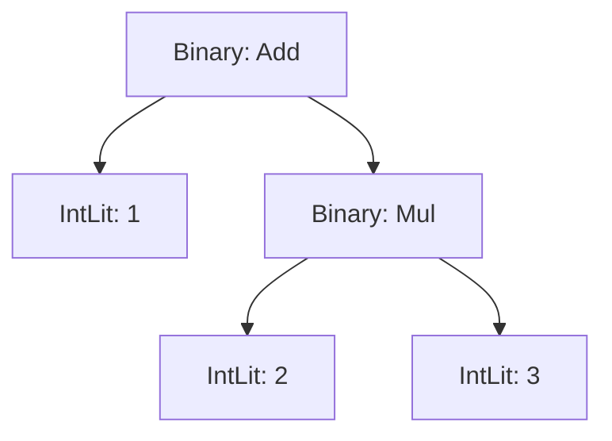

# Act 2 — Deciphering the Incantation

> *The runes are carved. Now they must be read — not as isolated symbols, but as sentences of power. A misplaced word and the spell unravels.*

In Act 1 you built the **rune carver** — a lexer that transforms source text into a stream of tokens. Now you build the **decipherer** — a parser that reads that token stream and assembles it into a **spell tree** (abstract syntax tree, or AST). The spell tree captures the *structure* of the incantation: which operations nest inside which, what binds tighter than what, where blocks begin and end.

This is the second stage of the interpreter pipeline (§1):

```
Source text (.rune file)
  → Lexer (chars → tokens)        ✓ Act 1
    → Parser (tokens → AST)        ← you are here
      → Evaluator (AST → side effects + return values)
```

The parser consumes tokens the same way the lexer consumed characters — with **peek** (look at the current token without consuming it) and **advance** (consume it and move forward). But instead of producing flat tokens, it produces a *tree*. The expression `1 + 2 * 3` becomes:



Getting that tree right — making `*` bind tighter than `+` — is the central challenge of this act. We solve it with **Pratt parsing**, a technique that assigns a *binding power* to each operator and uses it to decide how tightly operands cling to their neighbors.

**What you'll learn:**
- Rust's `Box<T>` for recursive data structures (why enums can't contain themselves directly)
- Recursive descent parsing — each grammar rule becomes a function
- Pratt parsing — the elegant algorithm for operator precedence
- Error recovery — reporting multiple parse errors without stopping at the first one

**Estimated time:** 5–8 hours across Stages 8–14.

**Prerequisites:** A working lexer from Act 1. Your project at `~/juk/runescript/` with `src/token.rs`, `src/lexer.rs`, and `src/main.rs`.

---

## Stage 8: The Spell Tree — Easy

**Goal:** Define the `Expr` and `Stmt` enums that represent every possible AST node, and understand why recursive types need `Box<T>`.

**Spec reference:** §4 (AST Node Types), §4.1 (Node Summary)

**New Rust concept(s):** `Box<T>` (heap allocation for recursive types), enum size constraints, `Option<T>` in struct variants, `Vec<T>` as a child list

### Why this stage

Before the parser can build a tree, we need types to represent the tree's nodes. The spec (§4) defines two enums: `Expr` for expressions (things that produce values) and `Stmt` for statements (things that cause effects). Together they form the complete AST.

The tricky part is **recursion**. A `Binary` expression contains two sub-expressions. An `If` statement contains a condition expression and a body of statements. In Python, this is trivial — everything is a reference on the heap. In Rust, enum variants must have a known size at compile time, and a type can't contain itself (that would be infinite size). The solution is `Box<T>`.

### Python/TS equivalent

In Python, you'd use dataclasses with no size concerns:

```python
@dataclass
class Binary:
    op: BinOp
    left: Expr    # just a reference — Python doesn't care about size
    right: Expr

@dataclass
class If:
    condition: Expr
    then_body: list[Stmt]
    else_body: list[Stmt] | None
```

Python objects are always heap-allocated and accessed through references. The `left` field doesn't *contain* an `Expr` — it *points to* one. So recursive types work automatically.

In TypeScript:

```typescript
type Expr =
  | { tag: "binary"; op: BinOp; left: Expr; right: Expr }
  | { tag: "intLit"; value: number }
  // ...
```

Same story — JS objects are references. No size issue.

Rust is different. An `enum` variant's data is stored *inline* — not behind a pointer. If `Binary` contained two `Expr` values directly, the compiler would need to know the size of `Expr` to lay out `Binary`, but `Expr`'s size depends on `Binary`'s size... infinite recursion. `Box<Expr>` breaks the cycle: a `Box` is always pointer-sized (8 bytes on 64-bit), regardless of what it points to.

### The Code

Create `src/ast.rs`:

```rust
// src/ast.rs
// The spell tree — abstract syntax tree nodes for Runescript.
// Every node the parser can produce is defined here (§4).
```

First, the operator types. These are simple enums with no data:

```rust
/// Unary operators: negation and logical NOT (§4).
#[derive(Debug, Clone, PartialEq)]
pub enum UnaryOp {
    Neg,  // -x
    Not,  // !flag
}

/// Binary operators: arithmetic, comparison, and logical (§4).
#[derive(Debug, Clone, PartialEq)]
pub enum BinOp {
    Add, Sub, Mul, Div, Mod,          // + - * / %
    Eq, Neq, Lt, LtEq, Gt, GtEq,    // == != < <= > >=
    And, Or,                           // && ||
}
```

Nothing new here — these are plain enums like `TokenKind` but smaller. Each variant carries no data.

Now the expression enum — this is where `Box` enters:

```rust
/// An expression — anything that produces a value (§4).
///
/// Recursive variants use Box<Expr> because Rust enums are stored inline.
/// Without Box, Expr would contain Expr, which would be infinite size.
/// Box<Expr> is a heap pointer — always 8 bytes, regardless of what's inside.
#[derive(Debug, Clone, PartialEq)]
pub enum Expr {
    /// Integer literal: 42
    IntLit(i64),
    /// String literal with {} interpolation markers: "HP: {hp}"
    StringLit(String),
    /// Boolean literal: true, false
    BoolLit(bool),
    /// Nil literal
    NilLit,
    /// Variable reference: hp, trap_armed
    Ident(String),
    /// Array literal: [1, 2, 3]
    Array(Vec<Expr>),
    /// Index access: arr[0]
    Index(Box<Expr>, Box<Expr>),
    /// Unary operation: -x, !flag
    Unary(UnaryOp, Box<Expr>),
    /// Binary operation: hp + 10, x == 5
    Binary(BinOp, Box<Expr>, Box<Expr>),
    /// Function call: print("hello"), heal(50)
    Call(Box<Expr>, Vec<Expr>),
    /// Field access: hunter.hp
    FieldAccess(Box<Expr>, String),
    /// Assignment: hp = 50, hunter.hp = 80
    Assign(Box<Expr>, Box<Expr>),
}
```

Let's unpack `Box<T>`:

- **What it is:** A smart pointer that allocates data on the heap. `Box<Expr>` means "a pointer to an `Expr` that lives on the heap." The `Box` itself is always 8 bytes (one pointer).
- **Why we need it:** Without `Box`, `Binary(BinOp, Expr, Expr)` would mean "store two full `Expr` values inline." But `Expr` can be a `Binary` which contains two more `Expr`s, which can be `Binary`s... the size is infinite. `Box` breaks the recursion: `Binary(BinOp, Box<Expr>, Box<Expr>)` means "store two 8-byte pointers inline, and the actual `Expr` data lives on the heap."
- **Python comparison:** In Python, `left: Expr` is already a reference (pointer) to a heap object. `Box<Expr>` is Rust's explicit version of the same thing. The difference: Rust's `Box` is *owned* — when the `Box` is dropped, the heap memory is freed. No garbage collector needed.
- **Creating a Box:** `Box::new(Expr::IntLit(42))` allocates an `IntLit(42)` on the heap and returns a pointer to it.
- **Reading from a Box:** You can use `*my_box` to dereference it, but usually Rust auto-derefs for you — `my_box.some_method()` works without explicit `*`.

Which variants need `Box` and which don't?

| Variant | Needs Box? | Why |
|---------|-----------|-----|
| `IntLit(i64)` | No | `i64` is 8 bytes, not recursive |
| `StringLit(String)` | No | `String` is already a heap pointer internally |
| `BoolLit(bool)` | No | `bool` is 1 byte |
| `NilLit` | No | No data at all |
| `Ident(String)` | No | `String` is already heap-allocated |
| `Array(Vec<Expr>)` | No | `Vec` is already a heap pointer to its elements |
| `Index(Box<Expr>, Box<Expr>)` | Yes | Contains `Expr` recursively |
| `Unary(UnaryOp, Box<Expr>)` | Yes | Contains `Expr` recursively |
| `Binary(BinOp, Box<Expr>, Box<Expr>)` | Yes | Contains `Expr` recursively |
| `Call(Box<Expr>, Vec<Expr>)` | Yes for callee | The callee is an `Expr` (could be `Ident` or `FieldAccess`) |
| `FieldAccess(Box<Expr>, String)` | Yes | The object is an `Expr` |
| `Assign(Box<Expr>, Box<Expr>)` | Yes | Both target and value are `Expr`s |

The rule: if a field's type is `Expr` (self-referential), wrap it in `Box`. If it's `Vec<Expr>`, no `Box` needed — `Vec` already stores its elements on the heap.

Now the statement enum:

```rust
/// A statement — anything that causes an effect (§4).
///
/// Statements don't produce values (unlike expressions).
/// They declare variables, define functions, control flow, etc.
#[derive(Debug, Clone, PartialEq)]
pub enum Stmt {
    /// Expression used as a statement: print("hello")
    ExprStmt(Expr),
    /// Variable declaration: let hp = 100
    Let(String, Expr),
    /// Function declaration: fn heal(amount) { ... }
    FnDecl(String, Vec<String>, Vec<Stmt>),
    /// Conditional: if cond { ... } else { ... }
    If(Expr, Vec<Stmt>, Option<Vec<Stmt>>),
    /// While loop: while cond { ... }
    While(Expr, Vec<Stmt>),
    /// For-in loop: for item in list { ... }
    For(String, Expr, Vec<Stmt>),
    /// Return from function: return expr
    Return(Option<Expr>),
    /// Block: { ... }
    Block(Vec<Stmt>),
}
```

Notice that `Stmt` doesn't need `Box` for its `Expr` fields. Why? Because `Stmt` contains `Expr`, not `Stmt`. There's no self-referential cycle in `Stmt` through `Expr` — `Expr` never contains a `Stmt`. The recursion in `Stmt` is through `Vec<Stmt>` (in `FnDecl`, `If`, `While`, `For`, `Block`), and `Vec` is already heap-allocated.

`Option<Vec<Stmt>>` in the `If` variant represents the optional `else` branch. `Some(stmts)` means there's an else block; `None` means there isn't. `Option<Expr>` in `Return` handles `return` with or without a value.

Now register the module. Add to `src/main.rs`:

```rust
mod token;
mod lexer;
mod ast;  // new

use lexer::Lexer;
```

And let's write a quick test in `main.rs` to prove we can build AST nodes by hand:

```rust
fn main() {
    // Build the AST for: 1 + 2 * 3
    // This is what the parser will produce automatically in Stage 10.
    use ast::{Expr, BinOp};

    let tree = Expr::Binary(
        BinOp::Add,
        Box::new(Expr::IntLit(1)),
        Box::new(Expr::Binary(
            BinOp::Mul,
            Box::new(Expr::IntLit(2)),
            Box::new(Expr::IntLit(3)),
        )),
    );

    println!("Spell tree: {:#?}", tree);
}
```

- `Box::new(...)` — allocates the inner value on the heap and returns a `Box` pointer.
- `{:#?}` — the "pretty-print Debug" format. `#` adds indentation and newlines, making nested structures readable. Without `#`, everything prints on one line.
- The nesting shows the tree structure: `Add` has `IntLit(1)` on the left and `Mul(IntLit(2), IntLit(3))` on the right. This means `*` binds tighter than `+` — exactly what the precedence table (§5.1) requires.

### Common mistakes

- **Forgetting `Box::new(...)` when constructing recursive variants** — you can't write `Expr::Binary(BinOp::Add, Expr::IntLit(1), ...)`. The type expects `Box<Expr>`, not `Expr`. The compiler says: "expected `Box<Expr>`, found `Expr`."
- **Trying to put `Stmt` inside `Expr`** — the spec keeps these separate. Expressions produce values; statements don't. If you need a block that produces a value, that's a design decision for a future language version (§12).
- **Forgetting `mod ast;` in `main.rs`** — same as every new module.
- **Confusing `Box<Expr>` with `&Expr`** — `Box` *owns* the data (it's freed when the Box is dropped). `&Expr` *borrows* it (someone else owns it). In the AST, nodes own their children, so we use `Box`.

### Verify it works

```bash
cd ~/juk/runescript
cargo run
```

Expected output (pretty-printed):

```
Spell tree: Binary(
    Add,
    IntLit(
        1,
    ),
    Binary(
        Mul,
        IntLit(
            2,
        ),
        IntLit(
            3,
        ),
    ),
)
```

The tree correctly nests `Mul` inside `Add`, showing that `2 * 3` is computed first, then added to `1`.

### Checkpoint

**`src/ast.rs`** (complete):

```rust
#[derive(Debug, Clone, PartialEq)]
pub enum UnaryOp {
    Neg,
    Not,
}

#[derive(Debug, Clone, PartialEq)]
pub enum BinOp {
    Add, Sub, Mul, Div, Mod,
    Eq, Neq, Lt, LtEq, Gt, GtEq,
    And, Or,
}

#[derive(Debug, Clone, PartialEq)]
pub enum Expr {
    IntLit(i64),
    StringLit(String),
    BoolLit(bool),
    NilLit,
    Ident(String),
    Array(Vec<Expr>),
    Index(Box<Expr>, Box<Expr>),
    Unary(UnaryOp, Box<Expr>),
    Binary(BinOp, Box<Expr>, Box<Expr>),
    Call(Box<Expr>, Vec<Expr>),
    FieldAccess(Box<Expr>, String),
    Assign(Box<Expr>, Box<Expr>),
}

#[derive(Debug, Clone, PartialEq)]
pub enum Stmt {
    ExprStmt(Expr),
    Let(String, Expr),
    FnDecl(String, Vec<String>, Vec<Stmt>),
    If(Expr, Vec<Stmt>, Option<Vec<Stmt>>),
    While(Expr, Vec<Stmt>),
    For(String, Expr, Vec<Stmt>),
    Return(Option<Expr>),
    Block(Vec<Stmt>),
}
```

**`src/main.rs`** (updated):

```rust
mod token;
mod lexer;
mod ast;

fn main() {
    use ast::{Expr, BinOp};

    let tree = Expr::Binary(
        BinOp::Add,
        Box::new(Expr::IntLit(1)),
        Box::new(Expr::Binary(
            BinOp::Mul,
            Box::new(Expr::IntLit(2)),
            Box::new(Expr::IntLit(3)),
        )),
    );

    println!("Spell tree: {:#?}", tree);
}
```

---

## Stage 9: Literals and Names — Easy

**Goal:** Build the `Parser` struct with peek/advance over tokens, and parse the simplest expressions: integer literals, string literals, booleans, nil, and identifiers. This is the `primary` rule from the grammar.

**Spec reference:** §5 (`primary` rule in BNF), §4 (`IntLit`, `StringLit`, `BoolLit`, `NilLit`, `Ident` nodes), §5.2 (parsing strategy)

**New Rust concept(s):** Consuming a `Vec<Token>` by index, `Result` with custom error strings, `match` on enum variants with data extraction, the `clone()` cost

### Why this stage

The parser mirrors the lexer's architecture: a struct with a cursor, `peek()` to look ahead, `advance()` to consume. But instead of characters, it operates on tokens. And instead of producing tokens, it produces AST nodes.

We start with the **primary** rule — the bottom of the grammar (§5). Primary expressions are the atoms: literals and variable names. They don't contain sub-expressions, so there's no recursion yet. This lets us get the parser skeleton working before tackling the hard stuff (operators, precedence).

Every parser function corresponds to a grammar rule. The call stack mirrors the grammar's nesting. This is **recursive descent** — the most intuitive parsing technique.

### Python/TS equivalent

```python
class Parser:
    def __init__(self, tokens: list[Token]):
        self.tokens = tokens
        self.pos = 0

    def peek(self) -> Token:
        return self.tokens[self.pos]

    def advance(self) -> Token:
        tok = self.tokens[self.pos]
        self.pos += 1
        return tok

    def parse_primary(self) -> Expr:
        tok = self.advance()
        if tok.kind == INT_LIT:
            return IntLit(tok.value)
        elif tok.kind == STRING_LIT:
            return StringLit(tok.value)
        elif tok.kind == TRUE:
            return BoolLit(True)
        # ...
        else:
            raise ParseError(f"Expected expression, got {tok}")
```

The Rust version is structurally identical. The main difference: Rust's `match` on `TokenKind` destructures the variant and extracts the data in one step.

### The Code

Create `src/parser.rs`:

```rust
// src/parser.rs
// The decipherer — transforms a token stream into a spell tree (AST).
// Uses recursive descent for statements and Pratt parsing for expressions (§5.2).

use crate::token::{Token, TokenKind, Span};
use crate::ast::{Expr, Stmt, BinOp, UnaryOp};
```

The parser struct:

```rust
/// The decipherer. Holds the token stream and a cursor position.
pub struct Parser {
    /// The complete token stream from the lexer (including Eof).
    tokens: Vec<Token>,
    /// Current position in the token stream (0-based).
    pos: usize,
}
```

This is simpler than the lexer — no line/col tracking because each token already carries its `Span`. The parser just reads tokens by position.

The core methods:

```rust
impl Parser {
    /// Create a new parser from a token stream.
    pub fn new(tokens: Vec<Token>) -> Self {
        Parser { tokens, pos: 0 }
    }

    /// Look at the current token without consuming it.
    fn peek(&self) -> &Token {
        // Safe because the lexer always ends with Eof,
        // so we never go past the end.
        &self.tokens[self.pos]
    }

    /// Look at just the kind of the current token.
    fn peek_kind(&self) -> &TokenKind {
        &self.tokens[self.pos].kind
    }

    /// Consume the current token and return it.
    fn advance(&mut self) -> &Token {
        let tok = &self.tokens[self.pos];
        if self.pos < self.tokens.len() - 1 {
            self.pos += 1;
        }
        tok
    }

    /// If the current token matches `expected`, consume it and return true.
    /// Otherwise, leave the cursor where it is and return false.
    fn match_kind(&mut self, expected: &TokenKind) -> bool {
        if self.peek_kind() == expected {
            self.advance();
            true
        } else {
            false
        }
    }

    /// Consume the current token if it matches `expected`.
    /// If it doesn't match, return a parse error with a helpful message.
    fn expect(&mut self, expected: &TokenKind, context: &str) -> Result<(), String> {
        if self.peek_kind() == expected {
            self.advance();
            Ok(())
        } else {
            let span = &self.peek().span;
            Err(format!(
                "[line {}, col {}] Expected {:?} {}, found {:?}",
                span.line, span.col, expected, context, self.peek_kind()
            ))
        }
    }

    /// Get the span of the current token (for error messages).
    fn current_span(&self) -> Span {
        self.peek().span.clone()
    }
```

Key differences from the lexer's peek/advance:

- `peek()` returns `&Token` (a reference), not `Option<Token>`. There's no `None` case because the lexer always appends `Eof` — the parser always has something to look at.
- `advance()` returns `&Token` — a reference to the consumed token. We don't move the token out of the vector; we just return a reference and bump the position. The `if self.pos < self.tokens.len() - 1` guard prevents advancing past `Eof`.
- `expect()` is new — it's the "consume or error" pattern. The parser uses this constantly: "I expect a `(` here; if it's not there, that's a parse error." The `context` parameter makes error messages helpful: "Expected `)` to close function arguments" vs just "Expected `)`."
- `match_kind()` is the token-level equivalent of the lexer's `match_char()` — peek and conditionally consume.

Now the primary expression parser — the `primary` rule from §5:

```rust
    /// Parse a primary expression (§5, `primary` rule).
    /// primary ::= INT | STRING | "true" | "false" | "nil" | IDENT
    ///           | "(" expression ")" | "[" arguments? "]"
    fn parse_primary(&mut self) -> Result<Expr, String> {
        let token = self.advance().clone();

        match token.kind {
            // Integer literal: 42
            TokenKind::IntLit(n) => Ok(Expr::IntLit(n)),

            // String literal: "hello {name}"
            TokenKind::StringLit(ref s) => Ok(Expr::StringLit(s.clone())),

            // Boolean literals: true, false
            TokenKind::True => Ok(Expr::BoolLit(true)),
            TokenKind::False => Ok(Expr::BoolLit(false)),

            // Nil literal
            TokenKind::Nil => Ok(Expr::NilLit),

            // Identifier (variable name): hp, trap_armed
            TokenKind::Ident(ref name) => Ok(Expr::Ident(name.clone())),

            // Anything else is an error
            _ => Err(format!(
                "[line {}, col {}] Expected expression, found {:?}",
                token.span.line, token.span.col, token.kind
            )),
        }
    }
```

Let's unpack the new patterns:

- `let token = self.advance().clone()` — we advance and **clone** the token. Why clone? Because `advance()` returns `&Token` — a reference into `self.tokens`. If we kept that reference alive while calling other `&mut self` methods, Rust's borrow checker would complain: you can't have a shared reference (`&Token`) and a mutable reference (`&mut self`) at the same time. Cloning gives us an owned copy, freeing the borrow. This costs a small allocation for `String` variants but keeps the code simple.
- `TokenKind::IntLit(n)` — pattern matching destructures the variant and binds the inner `i64` to `n`. This is like Python's `if isinstance(tok, IntLit): n = tok.value` but done in one step.
- `TokenKind::StringLit(ref s)` — the `ref` keyword borrows the string inside the token instead of moving it out. We then `.clone()` it to create an owned copy for the AST node. Without `ref`, the match would try to move the `String` out of the cloned token, which works too — but `ref` + `clone` is a common pattern you'll see in Rust codebases.
- `TokenKind::Ident(ref name)` — same pattern as `StringLit`.
- Every arm returns `Ok(Expr::...)` — the parser returns `Result<Expr, String>` so it can report errors.

Now a public entry point to parse a single expression (we'll expand this later):

```rust
    /// Parse a single expression. Entry point for expression parsing.
    pub fn parse_expression(&mut self) -> Result<Expr, String> {
        self.parse_primary()
    }
}
```

For now, `parse_expression` just delegates to `parse_primary`. In Stage 10, we'll add Pratt parsing between them.

Register the module in `main.rs` and test it:

```rust
mod token;
mod lexer;
mod ast;
mod parser;  // new

use lexer::Lexer;
use parser::Parser;

fn main() {
    let source = "42";
    let mut lex = Lexer::new(source);
    let tokens = lex.scan_tokens().unwrap();
    let mut parser = Parser::new(tokens);
    let expr = parser.parse_expression().unwrap();
    println!("Parsed: {:#?}", expr);
}
```

Add tests to `src/parser.rs`:

```rust
#[cfg(test)]
mod tests {
    use super::*;
    use crate::lexer::Lexer;

    /// Helper: lex source text and create a parser.
    fn parser_for(source: &str) -> Parser {
        let mut lexer = Lexer::new(source);
        let tokens = lexer.scan_tokens().unwrap();
        Parser::new(tokens)
    }

    #[test]
    fn parse_int_literal() {
        let mut p = parser_for("42");
        let expr = p.parse_expression().unwrap();
        assert_eq!(expr, Expr::IntLit(42));
    }

    #[test]
    fn parse_string_literal() {
        let mut p = parser_for(r#""hello""#);
        let expr = p.parse_expression().unwrap();
        assert_eq!(expr, Expr::StringLit("hello".to_string()));
    }

    #[test]
    fn parse_bool_true() {
        let mut p = parser_for("true");
        let expr = p.parse_expression().unwrap();
        assert_eq!(expr, Expr::BoolLit(true));
    }

    #[test]
    fn parse_bool_false() {
        let mut p = parser_for("false");
        let expr = p.parse_expression().unwrap();
        assert_eq!(expr, Expr::BoolLit(false));
    }

    #[test]
    fn parse_nil() {
        let mut p = parser_for("nil");
        let expr = p.parse_expression().unwrap();
        assert_eq!(expr, Expr::NilLit);
    }

    #[test]
    fn parse_identifier() {
        let mut p = parser_for("hp");
        let expr = p.parse_expression().unwrap();
        assert_eq!(expr, Expr::Ident("hp".to_string()));
    }

    #[test]
    fn parse_error_on_unexpected_token() {
        let mut p = parser_for("+");
        let result = p.parse_expression();
        assert!(result.is_err());
        assert!(result.unwrap_err().contains("Expected expression"));
    }
}
```

The `parser_for` helper chains the lexer and parser together — lex the source, then create a parser from the tokens. We'll use this in every test.

### Common mistakes

- **Not cloning the token from `advance()`** — if you hold a `&Token` reference while calling other `&mut self` methods, the borrow checker blocks you. Clone early to release the borrow.
- **Forgetting `ref` in match patterns** — `TokenKind::StringLit(s)` moves the `String` out. If you've cloned the token, this is fine. But if you're matching on a reference, you need `ref s` to borrow instead of move.
- **Advancing past `Eof`** — our `advance()` guards against this, but if you wrote it differently, you could index out of bounds. The `Eof` sentinel from Act 1 is crucial.
- **Returning `Expr` instead of `Result<Expr, String>`** — the parser must be able to report errors. Always return `Result`.

### Verify it works

```bash
cd ~/juk/runescript
cargo test
```

Expected: all previous lexer tests pass, plus 7 new parser tests.

```bash
cargo run
```

With `let source = "42";`, you should see:

```
Parsed: IntLit(
    42,
)
```

### Checkpoint

**`src/parser.rs`** — the complete file at this stage:

```rust
use crate::token::{Token, TokenKind, Span};
use crate::ast::{Expr, Stmt, BinOp, UnaryOp};

pub struct Parser {
    tokens: Vec<Token>,
    pos: usize,
}

impl Parser {
    pub fn new(tokens: Vec<Token>) -> Self {
        Parser { tokens, pos: 0 }
    }

    fn peek(&self) -> &Token {
        &self.tokens[self.pos]
    }

    fn peek_kind(&self) -> &TokenKind {
        &self.tokens[self.pos].kind
    }

    fn advance(&mut self) -> &Token {
        let tok = &self.tokens[self.pos];
        if self.pos < self.tokens.len() - 1 {
            self.pos += 1;
        }
        tok
    }

    fn match_kind(&mut self, expected: &TokenKind) -> bool {
        if self.peek_kind() == expected {
            self.advance();
            true
        } else {
            false
        }
    }

    fn expect(&mut self, expected: &TokenKind, context: &str) -> Result<(), String> {
        if self.peek_kind() == expected {
            self.advance();
            Ok(())
        } else {
            let span = &self.peek().span;
            Err(format!(
                "[line {}, col {}] Expected {:?} {}, found {:?}",
                span.line, span.col, expected, context, self.peek_kind()
            ))
        }
    }

    fn current_span(&self) -> Span {
        self.peek().span.clone()
    }

    fn parse_primary(&mut self) -> Result<Expr, String> {
        let token = self.advance().clone();

        match token.kind {
            TokenKind::IntLit(n) => Ok(Expr::IntLit(n)),
            TokenKind::StringLit(ref s) => Ok(Expr::StringLit(s.clone())),
            TokenKind::True => Ok(Expr::BoolLit(true)),
            TokenKind::False => Ok(Expr::BoolLit(false)),
            TokenKind::Nil => Ok(Expr::NilLit),
            TokenKind::Ident(ref name) => Ok(Expr::Ident(name.clone())),
            _ => Err(format!(
                "[line {}, col {}] Expected expression, found {:?}",
                token.span.line, token.span.col, token.kind
            )),
        }
    }

    pub fn parse_expression(&mut self) -> Result<Expr, String> {
        self.parse_primary()
    }
}

#[cfg(test)]
mod tests {
    use super::*;
    use crate::lexer::Lexer;

    fn parser_for(source: &str) -> Parser {
        let mut lexer = Lexer::new(source);
        let tokens = lexer.scan_tokens().unwrap();
        Parser::new(tokens)
    }

    #[test]
    fn parse_int_literal() {
        let mut p = parser_for("42");
        let expr = p.parse_expression().unwrap();
        assert_eq!(expr, Expr::IntLit(42));
    }

    #[test]
    fn parse_string_literal() {
        let mut p = parser_for(r#""hello""#);
        let expr = p.parse_expression().unwrap();
        assert_eq!(expr, Expr::StringLit("hello".to_string()));
    }

    #[test]
    fn parse_bool_true() {
        let mut p = parser_for("true");
        let expr = p.parse_expression().unwrap();
        assert_eq!(expr, Expr::BoolLit(true));
    }

    #[test]
    fn parse_bool_false() {
        let mut p = parser_for("false");
        let expr = p.parse_expression().unwrap();
        assert_eq!(expr, Expr::BoolLit(false));
    }

    #[test]
    fn parse_nil() {
        let mut p = parser_for("nil");
        let expr = p.parse_expression().unwrap();
        assert_eq!(expr, Expr::NilLit);
    }

    #[test]
    fn parse_identifier() {
        let mut p = parser_for("hp");
        let expr = p.parse_expression().unwrap();
        assert_eq!(expr, Expr::Ident("hp".to_string()));
    }

    #[test]
    fn parse_error_on_unexpected_token() {
        let mut p = parser_for("+");
        let result = p.parse_expression();
        assert!(result.is_err());
        assert!(result.unwrap_err().contains("Expected expression"));
    }
}
```

**`src/main.rs`** (updated):

```rust
mod token;
mod lexer;
mod ast;
mod parser;

use lexer::Lexer;
use parser::Parser;

fn main() {
    let source = "42";
    let mut lex = Lexer::new(source);
    let tokens = lex.scan_tokens().unwrap();
    let mut parser = Parser::new(tokens);
    let expr = parser.parse_expression().unwrap();
    println!("Parsed: {:#?}", expr);
}
```

---

## Stage 10: The Binding Power — Hard

**Goal:** Implement Pratt parsing for binary operators so that `1 + 2 * 3` correctly parses as `Add(1, Mul(2, 3))` — respecting the operator precedence table from the spec.

**Spec reference:** §5.1 (Operator Precedence table), §5.2 (Pratt parsing strategy), §5 (grammar rules for `logic_or` through `multiplication`)

**New Rust concept(s):** `u8` for binding power values, `loop` with conditional `break`, returning values from `match` arms that call `&mut self` methods, the Pratt parsing algorithm

### Why this stage

This is the hardest stage in the entire course. Not because the code is long — it's surprisingly short — but because the *idea* is subtle. How does the parser know that `*` binds tighter than `+`? How does it build the right tree shape?

The traditional approach (from the grammar in §5) is to write one function per precedence level: `parse_addition` calls `parse_multiplication`, which calls `parse_unary`, which calls `parse_primary`. Each level handles its operators and delegates "tighter" operators to the next level down. This works but creates a deep chain of functions — one per precedence level.

**Pratt parsing** collapses all of that into a single function with a numeric parameter: the **minimum binding power**. Each operator has a binding power (a number). Higher numbers mean tighter binding. The algorithm:

1. Parse a prefix expression (a literal, identifier, or unary operator).
2. Look at the next token. If it's an infix operator whose binding power is *greater than* the minimum, consume it and parse the right-hand side recursively — but with the operator's binding power as the new minimum.
3. Repeat step 2 until the next operator's binding power is too low.

The result: operators with higher binding power "steal" operands from operators with lower binding power, naturally building the correct tree.

### The Precedence Table

From §5.1, translated to binding power numbers. We use even numbers so there's room for right-associative operators (which use `bp - 1` for the right side):

| Level | Operators | Binding Power (left, right) | Associativity |
|-------|-----------|---------------------------|---------------|
| 1 | `=` | (2, 1) | Right |
| 2 | `\|\|` | (3, 4) | Left |
| 3 | `&&` | (5, 6) | Left |
| 4 | `==` `!=` | (7, 8) | Left |
| 5 | `<` `<=` `>` `>=` | (9, 10) | Left |
| 6 | `+` `-` | (11, 12) | Left |
| 7 | `*` `/` `%` | (13, 14) | Left |

**Left-associative** operators have `right_bp = left_bp + 1`. This means `1 + 2 + 3` parses as `(1 + 2) + 3` — the left operand grabs as much as it can.

**Right-associative** operators (just `=`) have `right_bp = left_bp - 1`. This means `a = b = 5` parses as `a = (b = 5)` — the right operand grabs as much as it can.

### Walking Through `1 + 2 * 3`

Let's trace the algorithm step by step. The token stream is: `IntLit(1)`, `Plus`, `IntLit(2)`, `Star`, `IntLit(3)`, `Eof`.

**Call:** `parse_expression(min_bp=0)`

1. **Parse prefix:** consume `IntLit(1)` → `lhs = IntLit(1)`
2. **Check infix:** peek is `Plus`. Binding power of `+` is `(11, 12)`. Is `11 > 0`? Yes.
3. **Consume `Plus`.** Parse right side with `parse_expression(min_bp=12)`:
   - **Parse prefix:** consume `IntLit(2)` → `lhs = IntLit(2)`
   - **Check infix:** peek is `Star`. Binding power of `*` is `(13, 14)`. Is `13 > 12`? Yes.
   - **Consume `Star`.** Parse right side with `parse_expression(min_bp=14)`:
     - **Parse prefix:** consume `IntLit(3)` → `lhs = IntLit(3)`
     - **Check infix:** peek is `Eof`. No binding power. Loop ends.
     - **Return:** `IntLit(3)`
   - **Build node:** `lhs = Binary(Mul, IntLit(2), IntLit(3))`
   - **Check infix:** peek is `Eof`. Loop ends.
   - **Return:** `Binary(Mul, IntLit(2), IntLit(3))`
4. **Build node:** `lhs = Binary(Add, IntLit(1), Binary(Mul, IntLit(2), IntLit(3)))`
5. **Check infix:** peek is `Eof`. Loop ends.
6. **Return:** `Binary(Add, IntLit(1), Binary(Mul, IntLit(2), IntLit(3)))`

The resulting tree:


The key moment is step 3: when we're parsing the right side of `+` with `min_bp=12`, the `*` operator (left bp=13) is strong enough to steal `IntLit(2)` as its left operand. But if we were parsing `1 * 2 + 3`, the `+` (left bp=11) would NOT be strong enough (11 is not > 14), so `IntLit(2)` would stay with `*`.

### Python/TS equivalent

```python
def parse_expression(self, min_bp: int = 0) -> Expr:
    lhs = self.parse_prefix()

    while True:
        op_bp = self.infix_binding_power(self.peek())
        if op_bp is None:
            break
        left_bp, right_bp = op_bp
        if left_bp < min_bp:
            break

        op_token = self.advance()
        rhs = self.parse_expression(right_bp)
        lhs = Binary(op_token_to_binop(op_token), lhs, rhs)

    return lhs
```

The Rust version is the same algorithm. The only difference is that we return `Result` for error handling and use `Box::new()` for the recursive children.

### The Code

Add these methods to the `impl Parser` block in `src/parser.rs`. First, the binding power lookup:

```rust
    /// Get the infix binding power for a token kind (§5.1).
    /// Returns Some((left_bp, right_bp)) for infix operators, None for non-operators.
    ///
    /// Left-associative: right_bp = left_bp + 1
    /// Right-associative: right_bp = left_bp - 1
    fn infix_binding_power(kind: &TokenKind) -> Option<(u8, u8)> {
        match kind {
            // Assignment — right-associative (§5.1, level 1)
            TokenKind::Eq => Some((2, 1)),

            // Logical OR (§5.1, level 2)
            TokenKind::Or => Some((3, 4)),

            // Logical AND (§5.1, level 3)
            TokenKind::And => Some((5, 6)),

            // Equality (§5.1, level 4)
            TokenKind::EqEq | TokenKind::BangEq => Some((7, 8)),

            // Comparison (§5.1, level 5)
            TokenKind::Lt | TokenKind::LtEq
            | TokenKind::Gt | TokenKind::GtEq => Some((9, 10)),

            // Addition/subtraction (§5.1, level 6)
            TokenKind::Plus | TokenKind::Minus => Some((11, 12)),

            // Multiplication/division/modulo (§5.1, level 7)
            TokenKind::Star | TokenKind::Slash
            | TokenKind::Percent => Some((13, 14)),

            // Not an infix operator
            _ => None,
        }
    }

    /// Convert a token kind to a BinOp for the AST.
    fn token_to_binop(kind: &TokenKind) -> Option<BinOp> {
        match kind {
            TokenKind::Plus => Some(BinOp::Add),
            TokenKind::Minus => Some(BinOp::Sub),
            TokenKind::Star => Some(BinOp::Mul),
            TokenKind::Slash => Some(BinOp::Div),
            TokenKind::Percent => Some(BinOp::Mod),
            TokenKind::EqEq => Some(BinOp::Eq),
            TokenKind::BangEq => Some(BinOp::Neq),
            TokenKind::Lt => Some(BinOp::Lt),
            TokenKind::LtEq => Some(BinOp::LtEq),
            TokenKind::Gt => Some(BinOp::Gt),
            TokenKind::GtEq => Some(BinOp::GtEq),
            TokenKind::And => Some(BinOp::And),
            TokenKind::Or => Some(BinOp::Or),
            _ => None,
        }
    }
```

- `fn infix_binding_power(kind: &TokenKind)` — no `&self`, this is a pure function. Takes a reference to a `TokenKind` and returns the binding power pair.
- `Option<(u8, u8)>` — returns `None` for non-operators (like `Eof`, `RParen`, etc.). The tuple `(u8, u8)` is `(left_bp, right_bp)`.
- `u8` — unsigned 8-bit integer, range 0–255. More than enough for binding powers.
- The `|` in match arms means "or" — `TokenKind::Lt | TokenKind::LtEq` matches either variant.

Now rewrite `parse_expression` to use Pratt parsing:

```rust
    /// Parse an expression using Pratt parsing (§5.2).
    ///
    /// `min_bp` is the minimum binding power — operators with lower
    /// binding power won't be consumed. Start with 0 to parse everything.
    pub fn parse_expression(&mut self) -> Result<Expr, String> {
        self.parse_expr_bp(0)
    }

    /// The Pratt parsing core. Parses expressions with binding power >= min_bp.
    fn parse_expr_bp(&mut self, min_bp: u8) -> Result<Expr, String> {
        // Step 1: Parse the prefix (left-hand side).
        // For now, this is just a primary expression.
        // Stage 11 will add unary operators here.
        let mut lhs = self.parse_primary()?;

        // Step 2: Loop over infix operators.
        loop {
            // Check if the next token is an infix operator.
            let (left_bp, right_bp) = match Self::infix_binding_power(self.peek_kind()) {
                Some(bp) => bp,
                None => break, // not an operator — stop
            };

            // If this operator's left binding power is less than our minimum,
            // it belongs to a caller higher up the call stack.
            if left_bp < min_bp {
                break;
            }

            // Consume the operator token and convert to BinOp.
            let op_token = self.advance().clone();
            let op = Self::token_to_binop(&op_token.kind).unwrap();

            // Handle assignment specially — the left side must be an assignable target.
            if matches!(op_token.kind, TokenKind::Eq) {
                let rhs = self.parse_expr_bp(right_bp)?;
                lhs = Expr::Assign(Box::new(lhs), Box::new(rhs));
                continue;
            }

            // Parse the right-hand side with the right binding power as minimum.
            let rhs = self.parse_expr_bp(right_bp)?;

            // Build the Binary node.
            lhs = Expr::Binary(op, Box::new(lhs), Box::new(rhs));
        }

        Ok(lhs)
    }
```

Let's trace through the code with `1 + 2 * 3`:

1. `parse_expr_bp(0)` is called.
2. `parse_primary()` consumes `IntLit(1)` → `lhs = IntLit(1)`.
3. Loop iteration 1: peek is `Plus`. `infix_binding_power(Plus)` returns `(11, 12)`. Is `11 < 0`? No. Consume `Plus`. Call `parse_expr_bp(12)`:
   - `parse_primary()` consumes `IntLit(2)` → `lhs = IntLit(2)`.
   - Loop: peek is `Star`. `infix_binding_power(Star)` returns `(13, 14)`. Is `13 < 12`? No. Consume `Star`. Call `parse_expr_bp(14)`:
     - `parse_primary()` consumes `IntLit(3)` → `lhs = IntLit(3)`.
     - Loop: peek is `Eof`. `infix_binding_power(Eof)` returns `None`. Break.
     - Return `IntLit(3)`.
   - Build: `lhs = Binary(Mul, IntLit(2), IntLit(3))`.
   - Loop: peek is `Eof`. Break.
   - Return `Binary(Mul, IntLit(2), IntLit(3))`.
4. Build: `lhs = Binary(Add, IntLit(1), Binary(Mul, IntLit(2), IntLit(3)))`.
5. Loop: peek is `Eof`. Break.
6. Return the complete tree. ✓

The assignment case (`TokenKind::Eq`) is handled specially because `=` produces `Expr::Assign` instead of `Expr::Binary`. It's right-associative (right_bp=1 < left_bp=2), so `a = b = 5` parses as `a = (b = 5)`.

- `matches!(op_token.kind, TokenKind::Eq)` — the `matches!` macro is a convenient way to check if a value matches a pattern without destructuring. Returns `bool`. Like `isinstance()` in Python.

Add tests:

```rust
    // --- Stage 10: Pratt parsing ---

    #[test]
    fn parse_simple_addition() {
        let mut p = parser_for("1 + 2");
        let expr = p.parse_expression().unwrap();
        assert_eq!(
            expr,
            Expr::Binary(
                BinOp::Add,
                Box::new(Expr::IntLit(1)),
                Box::new(Expr::IntLit(2)),
            )
        );
    }

    #[test]
    fn parse_precedence_mul_over_add() {
        // 1 + 2 * 3 should be Add(1, Mul(2, 3))
        let mut p = parser_for("1 + 2 * 3");
        let expr = p.parse_expression().unwrap();
        assert_eq!(
            expr,
            Expr::Binary(
                BinOp::Add,
                Box::new(Expr::IntLit(1)),
                Box::new(Expr::Binary(
                    BinOp::Mul,
                    Box::new(Expr::IntLit(2)),
                    Box::new(Expr::IntLit(3)),
                )),
            )
        );
    }

    #[test]
    fn parse_left_associativity() {
        // 1 - 2 - 3 should be Sub(Sub(1, 2), 3)
        let mut p = parser_for("1 - 2 - 3");
        let expr = p.parse_expression().unwrap();
        assert_eq!(
            expr,
            Expr::Binary(
                BinOp::Sub,
                Box::new(Expr::Binary(
                    BinOp::Sub,
                    Box::new(Expr::IntLit(1)),
                    Box::new(Expr::IntLit(2)),
                )),
                Box::new(Expr::IntLit(3)),
            )
        );
    }

    #[test]
    fn parse_comparison_and_logic() {
        // hp > 0 && alive
        let mut p = parser_for("hp > 0 && alive");
        let expr = p.parse_expression().unwrap();
        // && binds looser than >, so: And(Gt(hp, 0), alive)
        assert_eq!(
            expr,
            Expr::Binary(
                BinOp::And,
                Box::new(Expr::Binary(
                    BinOp::Gt,
                    Box::new(Expr::Ident("hp".to_string())),
                    Box::new(Expr::IntLit(0)),
                )),
                Box::new(Expr::Ident("alive".to_string())),
            )
        );
    }

    #[test]
    fn parse_assignment() {
        // hp = 50
        let mut p = parser_for("hp = 50");
        let expr = p.parse_expression().unwrap();
        assert_eq!(
            expr,
            Expr::Assign(
                Box::new(Expr::Ident("hp".to_string())),
                Box::new(Expr::IntLit(50)),
            )
        );
    }

    #[test]
    fn parse_chained_assignment() {
        // a = b = 5 should be Assign(a, Assign(b, 5)) — right-associative
        let mut p = parser_for("a = b = 5");
        let expr = p.parse_expression().unwrap();
        assert_eq!(
            expr,
            Expr::Assign(
                Box::new(Expr::Ident("a".to_string())),
                Box::new(Expr::Assign(
                    Box::new(Expr::Ident("b".to_string())),
                    Box::new(Expr::IntLit(5)),
                )),
            )
        );
    }

    #[test]
    fn parse_complex_arithmetic() {
        // 2 + 3 * 4 - 1 should be Sub(Add(2, Mul(3, 4)), 1)
        let mut p = parser_for("2 + 3 * 4 - 1");
        let expr = p.parse_expression().unwrap();
        assert_eq!(
            expr,
            Expr::Binary(
                BinOp::Sub,
                Box::new(Expr::Binary(
                    BinOp::Add,
                    Box::new(Expr::IntLit(2)),
                    Box::new(Expr::Binary(
                        BinOp::Mul,
                        Box::new(Expr::IntLit(3)),
                        Box::new(Expr::IntLit(4)),
                    )),
                )),
                Box::new(Expr::IntLit(1)),
            )
        );
    }

    #[test]
    fn parse_equality() {
        // x == 5
        let mut p = parser_for("x == 5");
        let expr = p.parse_expression().unwrap();
        assert_eq!(
            expr,
            Expr::Binary(
                BinOp::Eq,
                Box::new(Expr::Ident("x".to_string())),
                Box::new(Expr::IntLit(5)),
            )
        );
    }
```

### Common mistakes

- **Using `>=` instead of `<` for the binding power check** — the condition is `if left_bp < min_bp { break }`. Using `<=` would break left-associativity: `1 + 2 + 3` would parse as `1 + (2 + 3)` instead of `(1 + 2) + 3`.
- **Forgetting to clone the operator token** — same borrow issue as in Stage 9. `self.advance()` returns `&Token`, but we need to call `self.parse_expr_bp()` next, which takes `&mut self`. Clone the token first.
- **Mixing up left_bp and right_bp** — `left_bp` is compared against `min_bp` to decide whether to consume the operator. `right_bp` is passed to the recursive call to set the minimum for the right-hand side.
- **Not handling `Eq` (assignment) separately** — `=` is an operator in the precedence table, but it produces `Assign` nodes, not `Binary` nodes. If you treat it like other operators, you'll get `Binary(Eq, ...)` which doesn't exist in the AST.

### Verify it works

```bash
cargo test
```

Expected: all previous tests pass, plus 8 new Pratt parsing tests.

Update `main.rs` to see the tree:

```rust
fn main() {
    let source = "1 + 2 * 3";
    let mut lex = Lexer::new(source);
    let tokens = lex.scan_tokens().unwrap();
    let mut parser = Parser::new(tokens);
    let expr = parser.parse_expression().unwrap();
    println!("Parsed: {:#?}", expr);
}
```

```bash
cargo run
```

You should see the correctly nested tree with `Mul` inside `Add`.

### Checkpoint

Changes to `src/parser.rs`:

1. Add `infix_binding_power()` and `token_to_binop()` associated functions.
2. Replace `parse_expression()` with the two-method Pratt implementation (`parse_expression` + `parse_expr_bp`).
3. Add 8 new tests.

The `parse_primary` method is unchanged from Stage 9.

---

## Stage 11: Unary and Grouping — Medium

**Goal:** Parse unary operators (`-x`, `!flag`), parenthesized grouping (`(expr)`), array literals (`[1, 2, 3]`), function calls (`print("hi")`), field access (`hunter.hp`), and index access (`arr[0]`). Complete the expression parser.

**Spec reference:** §5 (`unary`, `call`, `primary` rules), §5.1 (level 8: unary, level 9: `.` `()` `[]`), §4 (`Unary`, `Call`, `FieldAccess`, `Index`, `Array` nodes)

**New Rust concept(s):** Prefix binding power in Pratt parsing, postfix/mixfix operators as infix with high binding power, parsing comma-separated lists

### Why this stage

Stage 10 handled infix binary operators — things that sit *between* two operands. But expressions also have:

- **Prefix operators:** `-x` (negation), `!flag` (logical NOT) — they appear *before* their operand.
- **Grouping:** `(1 + 2) * 3` — parentheses override precedence.
- **Postfix-like operators:** `print(args)` (call), `hunter.hp` (field access), `arr[0]` (index) — they appear *after* an expression and bind very tightly (§5.1, level 9).
- **Array literals:** `[1, 2, 3]` — a prefix construct that parses a comma-separated list.

In Pratt parsing, prefix operators are handled in the "prefix" step (before the infix loop). Postfix operators like `.`, `()`, and `[]` are handled as infix operators with very high binding power — they always win.

### Python/TS equivalent

```python
def parse_prefix(self) -> Expr:
    tok = self.peek()
    if tok.kind == MINUS:
        self.advance()
        operand = self.parse_expression(PREFIX_BP)
        return Unary(Neg, operand)
    elif tok.kind == BANG:
        self.advance()
        operand = self.parse_expression(PREFIX_BP)
        return Unary(Not, operand)
    elif tok.kind == LPAREN:
        self.advance()
        expr = self.parse_expression(0)
        self.expect(RPAREN)
        return expr
    elif tok.kind == LBRACKET:
        self.advance()
        elements = self.parse_comma_list(RBRACKET)
        return Array(elements)
    else:
        return self.parse_primary()
```

### The Code

We need to modify `parse_expr_bp` to handle prefix operators before the primary, and add postfix operators (call, field, index) to the infix loop.

First, add a prefix binding power function:

```rust
    /// Get the prefix binding power for unary operators (§5.1, level 8).
    /// Returns Some(right_bp) for prefix operators, None for non-prefix tokens.
    fn prefix_binding_power(kind: &TokenKind) -> Option<u8> {
        match kind {
            TokenKind::Minus | TokenKind::Bang => Some(15),
            // 15 is higher than any infix operator (max is 14 for * / %)
            // so -x * y parses as (-x) * y, not -(x * y)
            _ => None,
        }
    }
```

Unary operators have binding power 15 — higher than any binary operator. This means `-2 * 3` parses as `(-2) * 3`, not `-(2 * 3)`. The spec (§5.1) puts unary at level 8, above multiplication at level 7.

Add a helper to parse comma-separated expression lists (used by arrays and function calls):

```rust
    /// Parse a comma-separated list of expressions, terminated by `end_token`.
    /// Returns the list of parsed expressions.
    fn parse_expr_list(&mut self, end_token: &TokenKind) -> Result<Vec<Expr>, String> {
        let mut args = Vec::new();

        if self.peek_kind() == end_token {
            // Empty list
            return Ok(args);
        }

        // Parse first expression
        args.push(self.parse_expr_bp(0)?);

        // Parse remaining expressions separated by commas
        while self.match_kind(&TokenKind::Comma) {
            args.push(self.parse_expr_bp(0)?);
        }

        Ok(args)
    }
```

This pattern — "parse first, then loop on comma" — is the standard way to parse comma-separated lists. It handles empty lists (check for end token first), single-element lists (parse one, no comma follows), and multi-element lists (parse one, then comma + parse repeats).

Now rewrite `parse_expr_bp` to integrate prefix operators and postfix operators. Replace the entire method:

```rust
    /// The Pratt parsing core. Parses expressions with binding power >= min_bp.
    fn parse_expr_bp(&mut self, min_bp: u8) -> Result<Expr, String> {
        // === Step 1: Parse prefix (unary operators, grouping, arrays, or primary) ===
        let mut lhs = if let Some(right_bp) = Self::prefix_binding_power(self.peek_kind()) {
            // Unary prefix operator: -x, !flag
            let op_token = self.advance().clone();
            let op = match op_token.kind {
                TokenKind::Minus => UnaryOp::Neg,
                TokenKind::Bang => UnaryOp::Not,
                _ => unreachable!(),
            };
            let operand = self.parse_expr_bp(right_bp)?;
            Expr::Unary(op, Box::new(operand))
        } else if self.peek_kind() == &TokenKind::LParen {
            // Parenthesized grouping: (expr)
            self.advance(); // consume '('
            let expr = self.parse_expr_bp(0)?; // reset binding power inside parens
            self.expect(&TokenKind::RParen, "to close grouping")?;
            expr
        } else if self.peek_kind() == &TokenKind::LBracket {
            // Array literal: [1, 2, 3]
            self.advance(); // consume '['
            let elements = self.parse_expr_list(&TokenKind::RBracket)?;
            self.expect(&TokenKind::RBracket, "to close array literal")?;
            Expr::Array(elements)
        } else {
            // Primary expression: literals, identifiers
            self.parse_primary()?
        };

        // === Step 2: Loop over infix and postfix operators ===
        loop {
            // Check for postfix operators first (highest precedence, §5.1 level 9)
            match self.peek_kind() {
                // Function call: expr(args)
                TokenKind::LParen => {
                    // Binding power 17 — tighter than everything
                    if 17 < min_bp {
                        break;
                    }
                    self.advance(); // consume '('
                    let args = self.parse_expr_list(&TokenKind::RParen)?;
                    self.expect(&TokenKind::RParen, "to close function arguments")?;
                    lhs = Expr::Call(Box::new(lhs), args);
                    continue;
                }
                // Field access: expr.field
                TokenKind::Dot => {
                    if 17 < min_bp {
                        break;
                    }
                    self.advance(); // consume '.'
                    let field_token = self.advance().clone();
                    let field_name = match field_token.kind {
                        TokenKind::Ident(name) => name,
                        _ => {
                            return Err(format!(
                                "[line {}, col {}] Expected field name after '.', found {:?}",
                                field_token.span.line, field_token.span.col, field_token.kind
                            ));
                        }
                    };
                    lhs = Expr::FieldAccess(Box::new(lhs), field_name);
                    continue;
                }
                // Index access: expr[index]
                TokenKind::LBracket => {
                    if 17 < min_bp {
                        break;
                    }
                    self.advance(); // consume '['
                    let index = self.parse_expr_bp(0)?;
                    self.expect(&TokenKind::RBracket, "to close index access")?;
                    lhs = Expr::Index(Box::new(lhs), Box::new(index));
                    continue;
                }
                _ => {}
            }

            // Check for infix binary operators
            let (left_bp, right_bp) = match Self::infix_binding_power(self.peek_kind()) {
                Some(bp) => bp,
                None => break,
            };

            if left_bp < min_bp {
                break;
            }

            let op_token = self.advance().clone();

            // Handle assignment specially
            if matches!(op_token.kind, TokenKind::Eq) {
                let rhs = self.parse_expr_bp(right_bp)?;
                lhs = Expr::Assign(Box::new(lhs), Box::new(rhs));
                continue;
            }

            let op = Self::token_to_binop(&op_token.kind).unwrap();
            let rhs = self.parse_expr_bp(right_bp)?;
            lhs = Expr::Binary(op, Box::new(lhs), Box::new(rhs));
        }

        Ok(lhs)
    }
```

The structure is the same as Stage 10, but with two additions:

**Prefix handling (Step 1):** Before parsing a primary, we check if the current token is a prefix operator (`-`, `!`), a grouping `(`, or an array `[`. If so, we handle it specially. Otherwise, fall through to `parse_primary()`.

- For unary operators: consume the operator, parse the operand with the prefix binding power (15), and wrap in `Expr::Unary`.
- For grouping: consume `(`, parse the inner expression with binding power 0 (reset — anything goes inside parens), expect `)`.
- For arrays: consume `[`, parse comma-separated expressions, expect `]`.

**Postfix handling (Step 2):** At the top of the infix loop, we check for `(`, `.`, and `[` — the postfix operators from §5.1 level 9. They have binding power 17 (higher than everything else), so they always win. Each one transforms `lhs` into a new node:

- `(` → `Call(lhs, args)` — `lhs` becomes the callee
- `.` → `FieldAccess(lhs, field_name)` — `lhs` becomes the object
- `[` → `Index(lhs, index_expr)` — `lhs` becomes the array

The `continue` after each postfix case is important — it re-enters the loop to check for chained postfix operators like `arr[0].name` or `get_fn()(args)`.

- `unreachable!()` — a macro that panics with "entered unreachable code." We use it in the unary match because `prefix_binding_power` already confirmed the token is `-` or `!`. If somehow another token gets here, it's a bug in our code, not a user error.

Add tests:

```rust
    // --- Stage 11: Unary, grouping, calls, fields, indexing ---

    #[test]
    fn parse_unary_negation() {
        let mut p = parser_for("-42");
        let expr = p.parse_expression().unwrap();
        assert_eq!(
            expr,
            Expr::Unary(UnaryOp::Neg, Box::new(Expr::IntLit(42)))
        );
    }

    #[test]
    fn parse_unary_not() {
        let mut p = parser_for("!flag");
        let expr = p.parse_expression().unwrap();
        assert_eq!(
            expr,
            Expr::Unary(UnaryOp::Not, Box::new(Expr::Ident("flag".to_string())))
        );
    }

    #[test]
    fn parse_grouping() {
        // (1 + 2) * 3 should be Mul(Add(1, 2), 3)
        let mut p = parser_for("(1 + 2) * 3");
        let expr = p.parse_expression().unwrap();
        assert_eq!(
            expr,
            Expr::Binary(
                BinOp::Mul,
                Box::new(Expr::Binary(
                    BinOp::Add,
                    Box::new(Expr::IntLit(1)),
                    Box::new(Expr::IntLit(2)),
                )),
                Box::new(Expr::IntLit(3)),
            )
        );
    }

    #[test]
    fn parse_array_literal() {
        let mut p = parser_for("[1, 2, 3]");
        let expr = p.parse_expression().unwrap();
        assert_eq!(
            expr,
            Expr::Array(vec![Expr::IntLit(1), Expr::IntLit(2), Expr::IntLit(3)])
        );
    }

    #[test]
    fn parse_empty_array() {
        let mut p = parser_for("[]");
        let expr = p.parse_expression().unwrap();
        assert_eq!(expr, Expr::Array(vec![]));
    }

    #[test]
    fn parse_function_call() {
        let mut p = parser_for(r#"print("hello")"#);
        let expr = p.parse_expression().unwrap();
        assert_eq!(
            expr,
            Expr::Call(
                Box::new(Expr::Ident("print".to_string())),
                vec![Expr::StringLit("hello".to_string())],
            )
        );
    }

    #[test]
    fn parse_call_multiple_args() {
        let mut p = parser_for("damage(hunter, 15)");
        let expr = p.parse_expression().unwrap();
        assert_eq!(
            expr,
            Expr::Call(
                Box::new(Expr::Ident("damage".to_string())),
                vec![
                    Expr::Ident("hunter".to_string()),
                    Expr::IntLit(15),
                ],
            )
        );
    }

    #[test]
    fn parse_call_no_args() {
        let mut p = parser_for("get_hp()");
        let expr = p.parse_expression().unwrap();
        assert_eq!(
            expr,
            Expr::Call(
                Box::new(Expr::Ident("get_hp".to_string())),
                vec![],
            )
        );
    }

    #[test]
    fn parse_field_access() {
        let mut p = parser_for("hunter.hp");
        let expr = p.parse_expression().unwrap();
        assert_eq!(
            expr,
            Expr::FieldAccess(
                Box::new(Expr::Ident("hunter".to_string())),
                "hp".to_string(),
            )
        );
    }

    #[test]
    fn parse_index_access() {
        let mut p = parser_for("enemies[0]");
        let expr = p.parse_expression().unwrap();
        assert_eq!(
            expr,
            Expr::Index(
                Box::new(Expr::Ident("enemies".to_string())),
                Box::new(Expr::IntLit(0)),
            )
        );
    }

    #[test]
    fn parse_chained_postfix() {
        // hunter.items[0] — field access then index
        let mut p = parser_for("hunter.items[0]");
        let expr = p.parse_expression().unwrap();
        assert_eq!(
            expr,
            Expr::Index(
                Box::new(Expr::FieldAccess(
                    Box::new(Expr::Ident("hunter".to_string())),
                    "items".to_string(),
                )),
                Box::new(Expr::IntLit(0)),
            )
        );
    }

    #[test]
    fn parse_negation_in_expression() {
        // -x * 2 should be Mul(Neg(x), 2) — unary binds tighter than *
        let mut p = parser_for("-x * 2");
        let expr = p.parse_expression().unwrap();
        assert_eq!(
            expr,
            Expr::Binary(
                BinOp::Mul,
                Box::new(Expr::Unary(
                    UnaryOp::Neg,
                    Box::new(Expr::Ident("x".to_string())),
                )),
                Box::new(Expr::IntLit(2)),
            )
        );
    }

    #[test]
    fn parse_field_assignment() {
        // hunter.hp = 80
        let mut p = parser_for("hunter.hp = 80");
        let expr = p.parse_expression().unwrap();
        assert_eq!(
            expr,
            Expr::Assign(
                Box::new(Expr::FieldAccess(
                    Box::new(Expr::Ident("hunter".to_string())),
                    "hp".to_string(),
                )),
                Box::new(Expr::IntLit(80)),
            )
        );
    }
```

### Common mistakes

- **Forgetting `continue` after postfix operators** — without it, the code falls through to the infix binding power check, which returns `None` for `(`, `.`, `[`, and breaks the loop. You'd only get one postfix operator instead of allowing chains like `a.b[0](x)`.
- **Using the wrong binding power for prefix operators** — if prefix bp is too low (say 11, same as `+`), then `-1 + 2` would parse as `-(1 + 2)` instead of `(-1) + 2`. Prefix bp must be higher than all infix operators.
- **Not resetting binding power inside parentheses** — `parse_expr_bp(0)` inside the `(` handler means "parse any expression." If you passed `min_bp` instead, `(1 + 2)` inside a `*` context would fail because `+` has lower bp than `*`.
- **Forgetting to expect the closing delimiter** — `self.expect(&TokenKind::RParen, ...)` after parsing inside `()`. Without it, `(1 + 2` would silently succeed.

### Verify it works

```bash
cargo test
```

Expected: all previous tests pass, plus 13 new tests for unary, grouping, arrays, calls, fields, and indexing.

### Checkpoint

The expression parser is now complete. It handles:
- Literals and identifiers (Stage 9)
- All binary operators with correct precedence (Stage 10)
- Unary operators, grouping, arrays (Stage 11)
- Function calls, field access, index access (Stage 11)
- Assignment as a right-associative operator (Stage 10)

The `parse_primary`, `parse_expr_bp`, `parse_expression`, `infix_binding_power`, `prefix_binding_power`, `token_to_binop`, `parse_expr_list`, `expect`, `match_kind`, `peek`, `peek_kind`, `advance`, and `current_span` methods are all in `src/parser.rs`.

---

## Stage 12: Declarations — Medium

**Goal:** Parse `let` declarations and `fn` declarations. Introduce statement-level parsing with `parse_declaration` as the top-level entry point. Parse a complete program as a list of declarations.

**Spec reference:** §5 (`program`, `declaration`, `fn_decl`, `let_decl`, `expr_stmt` rules), §4 (`Let`, `FnDecl`, `ExprStmt` nodes)

**New Rust concept(s):** Recursive descent for statements (each grammar rule = one function), parsing a sequence terminated by `Eof`, `Vec<String>` for parameter lists

### Why this stage

Expressions produce values. Statements cause effects. The spec (§5) defines the grammar hierarchy:

```
program        ::= declaration* EOF
declaration    ::= fn_decl | let_decl | statement
```

A program is a sequence of declarations. A declaration is either a function definition, a variable binding, or a plain statement (which is just an expression used for its side effects, like `print("hello")`).

This is **recursive descent** at the statement level — each grammar rule becomes a function. The parser peeks at the current token to decide which rule to apply:
- See `let`? → parse a let declaration.
- See `fn`? → parse a function declaration.
- Anything else? → parse an expression statement.

### Python/TS equivalent

```python
def parse_declaration(self) -> Stmt:
    if self.peek().kind == LET:
        return self.parse_let()
    elif self.peek().kind == FN:
        return self.parse_fn_decl()
    else:
        return self.parse_statement()

def parse_let(self) -> Stmt:
    self.advance()  # consume 'let'
    name = self.expect_ident()
    self.expect(EQ)
    value = self.parse_expression()
    return Let(name, value)

def parse_program(self) -> list[Stmt]:
    stmts = []
    while self.peek().kind != EOF:
        stmts.append(self.parse_declaration())
    return stmts
```

### The Code

Add a helper to extract an identifier name from the current token:

```rust
    /// Consume the current token and extract an identifier name.
    /// Returns an error if the current token is not an identifier.
    fn expect_ident(&mut self, context: &str) -> Result<String, String> {
        let token = self.advance().clone();
        match token.kind {
            TokenKind::Ident(name) => Ok(name),
            _ => Err(format!(
                "[line {}, col {}] Expected identifier {}, found {:?}",
                token.span.line, token.span.col, context, token.kind
            )),
        }
    }
```

Now the let declaration parser:

```rust
    /// Parse a let declaration (§5, `let_decl` rule).
    /// let_decl ::= "let" IDENT "=" expression
    fn parse_let(&mut self) -> Result<Stmt, String> {
        // 'let' has already been consumed by the caller
        let name = self.expect_ident("for variable name")?;
        self.expect(&TokenKind::Eq, "after variable name in let declaration")?;
        let value = self.parse_expr_bp(0)?;
        Ok(Stmt::Let(name, value))
    }
```

Simple: expect an identifier (the variable name), expect `=`, parse the value expression. The `let` keyword itself is consumed by the caller (`parse_declaration`).

The function declaration parser:

```rust
    /// Parse a function declaration (§5, `fn_decl` rule).
    /// fn_decl ::= "fn" IDENT "(" params? ")" block
    fn parse_fn_decl(&mut self) -> Result<Stmt, String> {
        // 'fn' has already been consumed by the caller
        let name = self.expect_ident("for function name")?;

        // Parse parameter list
        self.expect(&TokenKind::LParen, "after function name")?;
        let mut params = Vec::new();
        if self.peek_kind() != &TokenKind::RParen {
            // First parameter
            params.push(self.expect_ident("for parameter name")?);
            // Remaining parameters
            while self.match_kind(&TokenKind::Comma) {
                params.push(self.expect_ident("for parameter name")?);
            }
        }
        self.expect(&TokenKind::RParen, "to close parameter list")?;

        // Parse function body (a block)
        let body = self.parse_block()?;

        Ok(Stmt::FnDecl(name, params, body))
    }
```

The parameter list uses the same "first, then comma + repeat" pattern as `parse_expr_list`. But here we expect identifiers, not expressions.

We need `parse_block` — a `{` followed by declarations, closed by `}`:

```rust
    /// Parse a block (§5, `block` rule).
    /// block ::= "{" declaration* "}"
    fn parse_block(&mut self) -> Result<Vec<Stmt>, String> {
        self.expect(&TokenKind::LBrace, "to open block")?;

        let mut stmts = Vec::new();
        while self.peek_kind() != &TokenKind::RBrace
            && self.peek_kind() != &TokenKind::Eof
        {
            stmts.push(self.parse_declaration()?);
        }

        self.expect(&TokenKind::RBrace, "to close block")?;
        Ok(stmts)
    }
```

The `Eof` check prevents an infinite loop if the user forgets the closing `}`. Without it, the parser would loop forever looking for `}` that never comes.

Now the declaration dispatcher — the heart of statement parsing:

```rust
    /// Parse a declaration (§5, `declaration` rule).
    /// declaration ::= fn_decl | let_decl | statement
    fn parse_declaration(&mut self) -> Result<Stmt, String> {
        match self.peek_kind() {
            TokenKind::Let => {
                self.advance(); // consume 'let'
                self.parse_let()
            }
            TokenKind::Fn => {
                self.advance(); // consume 'fn'
                self.parse_fn_decl()
            }
            _ => self.parse_statement(),
        }
    }
```

And `parse_statement` — for now, just expression statements (we'll add control flow in Stage 13):

```rust
    /// Parse a statement (§5, `statement` rule).
    /// For now: just expression statements. Stage 13 adds if/while/for/return/block.
    fn parse_statement(&mut self) -> Result<Stmt, String> {
        let expr = self.parse_expr_bp(0)?;
        // Optional semicolon (Runescript doesn't require them)
        self.match_kind(&TokenKind::Semicolon);
        Ok(Stmt::ExprStmt(expr))
    }
```

The optional semicolon is a nice touch — Runescript doesn't require semicolons (the spec examples don't use them), but they're allowed as statement terminators.

Finally, the public entry point to parse a complete program:

```rust
    /// Parse a complete program (§5, `program` rule).
    /// program ::= declaration* EOF
    pub fn parse_program(&mut self) -> Result<Vec<Stmt>, String> {
        let mut stmts = Vec::new();
        while self.peek_kind() != &TokenKind::Eof {
            stmts.push(self.parse_declaration()?);
        }
        Ok(stmts)
    }
```

This is the top-level function. It loops until `Eof`, parsing one declaration at a time. The result is a `Vec<Stmt>` — the complete AST for the program.

Update `main.rs` to parse a multi-statement program:

```rust
fn main() {
    let source = r#"
let hp = 100
let name = "Hunter"
print("Hello")
"#;
    let mut lex = Lexer::new(source);
    let tokens = lex.scan_tokens().unwrap();
    let mut parser = Parser::new(tokens);
    let program = parser.parse_program().unwrap();

    for stmt in &program {
        println!("{:#?}", stmt);
    }
}
```

Add tests:

```rust
    // --- Stage 12: Declarations ---

    #[test]
    fn parse_let_declaration() {
        let mut p = parser_for("let hp = 100");
        let program = p.parse_program().unwrap();
        assert_eq!(
            program,
            vec![Stmt::Let("hp".to_string(), Expr::IntLit(100))]
        );
    }

    #[test]
    fn parse_let_with_expression() {
        let mut p = parser_for("let damage = 10 + 5 * 2");
        let program = p.parse_program().unwrap();
        assert_eq!(
            program,
            vec![Stmt::Let(
                "damage".to_string(),
                Expr::Binary(
                    BinOp::Add,
                    Box::new(Expr::IntLit(10)),
                    Box::new(Expr::Binary(
                        BinOp::Mul,
                        Box::new(Expr::IntLit(5)),
                        Box::new(Expr::IntLit(2)),
                    )),
                ),
            )]
        );
    }

    #[test]
    fn parse_fn_declaration() {
        let mut p = parser_for("fn heal(amount) { hp = hp + amount }");
        let program = p.parse_program().unwrap();
        assert_eq!(
            program,
            vec![Stmt::FnDecl(
                "heal".to_string(),
                vec!["amount".to_string()],
                vec![Stmt::ExprStmt(Expr::Assign(
                    Box::new(Expr::Ident("hp".to_string())),
                    Box::new(Expr::Binary(
                        BinOp::Add,
                        Box::new(Expr::Ident("hp".to_string())),
                        Box::new(Expr::Ident("amount".to_string())),
                    )),
                ))],
            )]
        );
    }

    #[test]
    fn parse_fn_no_params() {
        let mut p = parser_for("fn greet() { print(42) }");
        let program = p.parse_program().unwrap();
        assert_eq!(program.len(), 1);
        match &program[0] {
            Stmt::FnDecl(name, params, body) => {
                assert_eq!(name, "greet");
                assert!(params.is_empty());
                assert_eq!(body.len(), 1);
            }
            _ => panic!("Expected FnDecl"),
        }
    }

    #[test]
    fn parse_fn_multiple_params() {
        let mut p = parser_for("fn add(a, b, c) { a + b + c }");
        let program = p.parse_program().unwrap();
        match &program[0] {
            Stmt::FnDecl(name, params, _) => {
                assert_eq!(name, "add");
                assert_eq!(params, &vec!["a".to_string(), "b".to_string(), "c".to_string()]);
            }
            _ => panic!("Expected FnDecl"),
        }
    }

    #[test]
    fn parse_expression_statement() {
        let mut p = parser_for(r#"print("hello")"#);
        let program = p.parse_program().unwrap();
        assert_eq!(
            program,
            vec![Stmt::ExprStmt(Expr::Call(
                Box::new(Expr::Ident("print".to_string())),
                vec![Expr::StringLit("hello".to_string())],
            ))]
        );
    }

    #[test]
    fn parse_multiple_declarations() {
        let mut p = parser_for("let x = 1\nlet y = 2\nx + y");
        let program = p.parse_program().unwrap();
        assert_eq!(program.len(), 3);
        assert!(matches!(&program[0], Stmt::Let(..)));
        assert!(matches!(&program[1], Stmt::Let(..)));
        assert!(matches!(&program[2], Stmt::ExprStmt(..)));
    }

    #[test]
    fn parse_let_missing_eq() {
        let mut p = parser_for("let x 5");
        let result = p.parse_program();
        assert!(result.is_err());
        assert!(result.unwrap_err().contains("Expected"));
    }
```

### Common mistakes

- **Forgetting to consume the keyword before calling the sub-parser** — `parse_let` expects `let` to already be consumed. If `parse_declaration` doesn't `self.advance()` before calling `parse_let`, the parser sees `let` again and tries to parse it as an identifier.
- **Infinite loop in `parse_block` without `Eof` check** — if the source is `{ let x = 1` (no closing `}`), the parser loops forever. Always check for `Eof` as a bail-out.
- **Not handling optional semicolons** — Runescript doesn't require semicolons, but if someone writes `let x = 1;`, the `;` would be parsed as the start of the next statement (an unexpected token). `self.match_kind(&TokenKind::Semicolon)` silently consumes it if present.
- **Calling `parse_expression` instead of `parse_expr_bp(0)` from statement parsers** — both work, but `parse_expression` is the public API. Internally, statement parsers can call `parse_expr_bp(0)` directly. Just be consistent.

### Verify it works

```bash
cargo test
```

Expected: all previous tests pass, plus 8 new declaration tests.

```bash
cargo run
```

You should see three statements: two `Let` nodes and one `ExprStmt` with a `Call` inside.

### Checkpoint

New methods added to `src/parser.rs`:
- `expect_ident()` — extract identifier name or error
- `parse_let()` — let declaration
- `parse_fn_decl()` — function declaration with params and body
- `parse_block()` — `{` declarations `}`
- `parse_declaration()` — top-level dispatcher
- `parse_statement()` — expression statement (expanded in Stage 13)
- `parse_program()` — public entry point, parses until `Eof`

---

## Stage 13: Control Flow — Medium

**Goal:** Parse `if`/`else`, `while`, `for-in`, `return`, and standalone blocks. Complete the statement parser.

**Spec reference:** §5 (`if_stmt`, `while_stmt`, `for_stmt`, `return_stmt`, `block` rules), §4 (`If`, `While`, `For`, `Return`, `Block` nodes)

**New Rust concept(s):** `Option<Vec<Stmt>>` for optional else branches, parsing keyword-initiated statements, nested blocks

### Why this stage

Control flow statements follow a predictable pattern: a keyword, some expressions and/or identifiers, then a block body. The parser peeks at the keyword to decide which rule to apply, then follows the grammar mechanically.

This is pure recursive descent — no Pratt parsing needed. Each statement type has its own function that consumes tokens in the exact order the grammar specifies.

### Python/TS equivalent

```python
def parse_if(self) -> Stmt:
    # 'if' already consumed
    condition = self.parse_expression()
    then_body = self.parse_block()
    else_body = None
    if self.peek().kind == ELSE:
        self.advance()
        else_body = self.parse_block()
    return If(condition, then_body, else_body)
```

### The Code

Add these methods to the `impl Parser` block:

```rust
    /// Parse an if statement (§5, `if_stmt` rule).
    /// if_stmt ::= "if" expression block ( "else" block )?
    fn parse_if(&mut self) -> Result<Stmt, String> {
        // 'if' has already been consumed by the caller
        let condition = self.parse_expr_bp(0)?;
        let then_body = self.parse_block()?;

        let else_body = if self.match_kind(&TokenKind::Else) {
            // Check for "else if" — parse as a single If statement wrapped in a block
            if self.peek_kind() == &TokenKind::If {
                self.advance(); // consume 'if'
                let else_if = self.parse_if()?;
                Some(vec![else_if])
            } else {
                Some(self.parse_block()?)
            }
        } else {
            None
        };

        Ok(Stmt::If(condition, then_body, else_body))
    }
```

The `else if` handling is elegant: when we see `else` followed by `if`, we parse the inner `if` recursively and wrap it in a single-element `Vec`. This means `if a { } else if b { } else { }` becomes:

```
If(a, [...], Some([If(b, [...], Some([...]))]))
```

The else branch contains one statement — another `If`. This is how most languages handle `else if` without a special `elif` keyword.

```rust
    /// Parse a while statement (§5, `while_stmt` rule).
    /// while_stmt ::= "while" expression block
    fn parse_while(&mut self) -> Result<Stmt, String> {
        // 'while' has already been consumed
        let condition = self.parse_expr_bp(0)?;
        let body = self.parse_block()?;
        Ok(Stmt::While(condition, body))
    }

    /// Parse a for-in statement (§5, `for_stmt` rule).
    /// for_stmt ::= "for" IDENT "in" expression block
    fn parse_for(&mut self) -> Result<Stmt, String> {
        // 'for' has already been consumed
        let var_name = self.expect_ident("for loop variable")?;
        self.expect(&TokenKind::In, "after loop variable")?;
        let iterable = self.parse_expr_bp(0)?;
        let body = self.parse_block()?;
        Ok(Stmt::For(var_name, iterable, body))
    }

    /// Parse a return statement (§5, `return_stmt` rule).
    /// return_stmt ::= "return" expression?
    fn parse_return(&mut self) -> Result<Stmt, String> {
        // 'return' has already been consumed

        // Check if there's an expression to return.
        // If the next token starts a new statement or closes a block,
        // this is a bare "return" with no value.
        let value = match self.peek_kind() {
            TokenKind::RBrace | TokenKind::Eof => None,
            _ => Some(self.parse_expr_bp(0)?),
        };

        Ok(Stmt::Return(value))
    }
```

The `parse_return` method needs to decide whether there's a return value. The trick: if the next token is `}` (end of block) or `Eof` (end of file), there's no value — it's a bare `return`. Otherwise, parse an expression. This is a common ambiguity in languages without mandatory semicolons.

Now update `parse_statement` to dispatch to these new parsers:

```rust
    /// Parse a statement (§5, `statement` rule).
    /// statement ::= if_stmt | while_stmt | for_stmt | return_stmt
    ///             | expr_stmt | block
    fn parse_statement(&mut self) -> Result<Stmt, String> {
        match self.peek_kind() {
            TokenKind::If => {
                self.advance();
                self.parse_if()
            }
            TokenKind::While => {
                self.advance();
                self.parse_while()
            }
            TokenKind::For => {
                self.advance();
                self.parse_for()
            }
            TokenKind::Return => {
                self.advance();
                self.parse_return()
            }
            TokenKind::LBrace => {
                let body = self.parse_block()?;
                Ok(Stmt::Block(body))
            }
            _ => {
                // Expression statement
                let expr = self.parse_expr_bp(0)?;
                self.match_kind(&TokenKind::Semicolon);
                Ok(Stmt::ExprStmt(expr))
            }
        }
    }
```

The pattern is consistent: peek at the keyword, consume it, call the specific parser. The `LBrace` case handles standalone blocks — `{ let x = 1 }` is a valid statement that creates a new scope.

Add tests:

```rust
    // --- Stage 13: Control flow ---

    #[test]
    fn parse_if_statement() {
        let mut p = parser_for("if hp > 0 { print(hp) }");
        let program = p.parse_program().unwrap();
        assert_eq!(program.len(), 1);
        match &program[0] {
            Stmt::If(cond, then_body, else_body) => {
                assert!(matches!(cond, Expr::Binary(BinOp::Gt, ..)));
                assert_eq!(then_body.len(), 1);
                assert!(else_body.is_none());
            }
            _ => panic!("Expected If statement"),
        }
    }

    #[test]
    fn parse_if_else() {
        let mut p = parser_for("if alive { heal(10) } else { print(0) }");
        let program = p.parse_program().unwrap();
        match &program[0] {
            Stmt::If(_, then_body, else_body) => {
                assert_eq!(then_body.len(), 1);
                assert!(else_body.is_some());
                assert_eq!(else_body.as_ref().unwrap().len(), 1);
            }
            _ => panic!("Expected If statement"),
        }
    }

    #[test]
    fn parse_else_if_chain() {
        let mut p = parser_for("if a { 1 } else if b { 2 } else { 3 }");
        let program = p.parse_program().unwrap();
        match &program[0] {
            Stmt::If(_, _, Some(else_body)) => {
                // The else body should contain a single If statement
                assert_eq!(else_body.len(), 1);
                assert!(matches!(&else_body[0], Stmt::If(..)));
            }
            _ => panic!("Expected If with else-if chain"),
        }
    }

    #[test]
    fn parse_while_loop() {
        let mut p = parser_for("while hp > 0 { hp = hp - 1 }");
        let program = p.parse_program().unwrap();
        match &program[0] {
            Stmt::While(cond, body) => {
                assert!(matches!(cond, Expr::Binary(BinOp::Gt, ..)));
                assert_eq!(body.len(), 1);
            }
            _ => panic!("Expected While statement"),
        }
    }

    #[test]
    fn parse_for_in_loop() {
        let mut p = parser_for("for enemy in enemies { print(enemy) }");
        let program = p.parse_program().unwrap();
        match &program[0] {
            Stmt::For(var, iterable, body) => {
                assert_eq!(var, "enemy");
                assert_eq!(*iterable, Expr::Ident("enemies".to_string()));
                assert_eq!(body.len(), 1);
            }
            _ => panic!("Expected For statement"),
        }
    }

    #[test]
    fn parse_for_in_array() {
        let mut p = parser_for("for i in [1, 2, 3] { print(i) }");
        let program = p.parse_program().unwrap();
        match &program[0] {
            Stmt::For(var, iterable, _) => {
                assert_eq!(var, "i");
                assert!(matches!(iterable, Expr::Array(..)));
            }
            _ => panic!("Expected For statement"),
        }
    }

    #[test]
    fn parse_return_with_value() {
        let mut p = parser_for("fn double(x) { return x * 2 }");
        let program = p.parse_program().unwrap();
        match &program[0] {
            Stmt::FnDecl(_, _, body) => {
                match &body[0] {
                    Stmt::Return(Some(expr)) => {
                        assert!(matches!(expr, Expr::Binary(BinOp::Mul, ..)));
                    }
                    _ => panic!("Expected Return with value"),
                }
            }
            _ => panic!("Expected FnDecl"),
        }
    }

    #[test]
    fn parse_bare_return() {
        let mut p = parser_for("fn stop() { return }");
        let program = p.parse_program().unwrap();
        match &program[0] {
            Stmt::FnDecl(_, _, body) => {
                assert_eq!(body[0], Stmt::Return(None));
            }
            _ => panic!("Expected FnDecl"),
        }
    }

    #[test]
    fn parse_standalone_block() {
        let mut p = parser_for("{ let x = 1 }");
        let program = p.parse_program().unwrap();
        match &program[0] {
            Stmt::Block(stmts) => {
                assert_eq!(stmts.len(), 1);
                assert!(matches!(&stmts[0], Stmt::Let(..)));
            }
            _ => panic!("Expected Block"),
        }
    }

    #[test]
    fn parse_nested_blocks() {
        let mut p = parser_for("if true { if false { 1 } }");
        let program = p.parse_program().unwrap();
        match &program[0] {
            Stmt::If(_, then_body, _) => {
                assert!(matches!(&then_body[0], Stmt::If(..)));
            }
            _ => panic!("Expected nested If"),
        }
    }

    #[test]
    fn parse_spec_example_variables() {
        // From §10.2: a realistic multi-statement program
        let source = r#"
let hp = 100
let max_hp = 100
let weapon_damage = 25
let enemy_hp = 80
enemy_hp = enemy_hp - weapon_damage
if enemy_hp <= 0 {
    print("The enemy falls.")
} else {
    print("Still standing.")
}
"#;
        let mut p = parser_for(source);
        let program = p.parse_program().unwrap();
        // 4 let declarations + 1 assignment expr + 1 if/else = 6 statements
        assert_eq!(program.len(), 6);
        assert!(matches!(&program[0], Stmt::Let(..)));
        assert!(matches!(&program[4], Stmt::ExprStmt(Expr::Assign(..))));
        assert!(matches!(&program[5], Stmt::If(..)));
    }

    #[test]
    fn parse_spec_example_function() {
        // From §10.3: function with control flow
        let source = r#"
fn heal(amount) {
    if potions <= 0 {
        return 0
    }
    potions = potions - 1
    let new_hp = hp + amount
    if new_hp > 100 {
        new_hp = 100
    }
    hp = new_hp
    return amount
}
"#;
        let mut p = parser_for(source);
        let program = p.parse_program().unwrap();
        assert_eq!(program.len(), 1);
        match &program[0] {
            Stmt::FnDecl(name, params, body) => {
                assert_eq!(name, "heal");
                assert_eq!(params, &vec!["amount".to_string()]);
                // Body: if, assignment, let, if, assignment, return = 6 statements
                assert_eq!(body.len(), 6);
            }
            _ => panic!("Expected FnDecl"),
        }
    }
```

### Common mistakes

- **Forgetting `else if` handling** — without it, `else if` would require the user to write `else { if ... { } }` with explicit nesting. The spec examples (§10.6) use `else if` freely.
- **Parsing `return` value when next token is `}`** — `return }` would try to parse `}` as an expression and fail. The `match self.peek_kind()` check for `RBrace` and `Eof` prevents this.
- **Not consuming the keyword before calling the sub-parser** — each `parse_*` method assumes its keyword has already been consumed. If `parse_statement` doesn't `self.advance()` before calling `parse_if()`, the parser sees `if` and tries to parse it as an expression.
- **Missing `Eof` guard in `parse_block`** — already handled in Stage 12, but worth repeating. Without it, an unclosed `{` causes an infinite loop.

### Verify it works

```bash
cargo test
```

Expected: all previous tests pass, plus 12 new control flow tests.

```bash
cargo run
```

Try the spec example from §10.2 as the source string. You should see a clean AST with `Let`, `ExprStmt(Assign(...))`, and `If` nodes.

### Checkpoint

New/modified methods in `src/parser.rs`:
- `expect_ident()` — extract identifier or error
- `parse_if()` — if/else/else-if
- `parse_while()` — while loop
- `parse_for()` — for-in loop
- `parse_return()` — return with optional value
- `parse_statement()` — updated to dispatch all statement types
- `parse_declaration()` — unchanged from Stage 12
- `parse_program()` — unchanged from Stage 12

The parser can now handle every construct in the Runescript language. The only thing missing is graceful error recovery — Stage 14.

---

## Stage 14: Error Recovery — Hard

**Goal:** Implement panic-mode error recovery so the parser reports *multiple* errors per file instead of stopping at the first one. On a parse error, synchronize by advancing to the next statement boundary, then continue parsing.

**Spec reference:** §8.3 (Error Recovery — panic mode, synchronize to statement boundary), §8.1 (`ParseError` with span), §8.2 (error examples)

**New Rust concept(s):** Collecting errors in a `Vec<String>`, the synchronize/panic-mode pattern, changing `Result` to accumulate errors, `is_err()` checks

### Why this stage

Right now, the parser stops at the first error. If you write:

```
let x =
let y = 5
print(y)
```

The parser reports "Expected expression, found `Let`" on line 2 and gives up. But the user would benefit from also hearing about any errors in the rest of the file. A good parser reports as many errors as it can in a single pass.

The technique is called **panic mode** (§8.3): when the parser encounters an error, it enters "panic mode" — it skips tokens until it finds a **synchronization point** (a token that likely starts a new statement). Then it exits panic mode and resumes normal parsing. Errors found during panic mode are suppressed to avoid cascading false positives.

Synchronization points for Runescript:
- Keywords that start statements: `let`, `fn`, `if`, `while`, `for`, `return`
- `}` — end of a block
- `Eof` — end of input

### Python/TS equivalent

```python
def parse_program(self) -> tuple[list[Stmt], list[str]]:
    stmts = []
    errors = []
    while self.peek().kind != EOF:
        try:
            stmts.append(self.parse_declaration())
        except ParseError as e:
            errors.append(str(e))
            self.synchronize()
    return stmts, errors

def synchronize(self):
    """Skip tokens until we find a statement boundary."""
    while self.peek().kind != EOF:
        if self.peek().kind in (LET, FN, IF, WHILE, FOR, RETURN):
            return
        if self.peek().kind == RBRACE:
            return
        self.advance()
```

Python uses exceptions for this. Rust doesn't have exceptions — we use `Result` and explicit synchronization.

### The Code

The key change: `parse_program` catches errors from `parse_declaration`, records them, synchronizes, and continues. We change the return type to include both the AST and the error list.

First, add the synchronize method:

```rust
    /// Panic-mode synchronization (§8.3).
    /// Skip tokens until we find a likely statement boundary.
    /// This allows the parser to recover from an error and continue
    /// parsing the rest of the file.
    fn synchronize(&mut self) {
        loop {
            match self.peek_kind() {
                // These tokens likely start a new statement
                TokenKind::Let
                | TokenKind::Fn
                | TokenKind::If
                | TokenKind::While
                | TokenKind::For
                | TokenKind::Return => return,

                // End of block or file — stop
                TokenKind::RBrace | TokenKind::Eof => return,

                // Skip everything else
                _ => {
                    self.advance();
                }
            }
        }
    }
```

The synchronize method is simple: keep advancing until we see a token that probably starts a new statement. We don't consume the synchronization token — we leave it for the next `parse_declaration` call.

Now update `parse_program` to use error recovery:

```rust
    /// Parse a complete program with error recovery (§5, §8.3).
    /// Returns the successfully parsed statements and any errors encountered.
    /// Parsing continues past errors by synchronizing to statement boundaries.
    pub fn parse_program(&mut self) -> Result<Vec<Stmt>, Vec<String>> {
        let mut stmts = Vec::new();
        let mut errors: Vec<String> = Vec::new();

        while self.peek_kind() != &TokenKind::Eof {
            match self.parse_declaration() {
                Ok(stmt) => stmts.push(stmt),
                Err(msg) => {
                    errors.push(msg);
                    self.synchronize();
                }
            }
        }

        if errors.is_empty() {
            Ok(stmts)
        } else {
            Err(errors)
        }
    }
```

The return type changed from `Result<Vec<Stmt>, String>` to `Result<Vec<Stmt>, Vec<String>>`. On success, you get all statements. On failure, you get *all* errors — not just the first one.

The logic:
1. Try to parse a declaration.
2. If it succeeds, add the statement to the list.
3. If it fails, record the error and synchronize (skip to the next statement boundary).
4. After the loop, if there were any errors, return them all. Otherwise, return the statements.

Note: we could return *both* the partial AST and the errors (some languages do this for IDE support). For simplicity, we return one or the other. The evaluator needs a complete, valid AST to run.

Update `main.rs` to display multiple errors:

```rust
fn main() {
    let source = r#"
let x = 10
let y =
let z = 20
print(z +)
let w = 5
"#;

    let mut lex = Lexer::new(source);
    let tokens = lex.scan_tokens().unwrap();
    let mut parser = Parser::new(tokens);

    match parser.parse_program() {
        Ok(program) => {
            println!("Parsed {} statements:", program.len());
            for stmt in &program {
                println!("  {:#?}", stmt);
            }
        }
        Err(errors) => {
            eprintln!("Found {} miscast spell(s):", errors.len());
            for err in &errors {
                eprintln!("  {}", err);
            }
        }
    }
}
```

With the source above, you should see two errors:
1. `let y =` — expected expression after `=`, found `Let`
2. `print(z +)` — expected expression after `+`, found `)`

And the parser recovers to parse `let w = 5` successfully (though it's not in the output since we return errors instead of partial results).

Add tests:

```rust
    // --- Stage 14: Error recovery ---

    #[test]
    fn recover_from_bad_let() {
        // Two errors: "let y =" has no value, "let w =" has no value
        // But "let x = 10" and "let z = 20" are fine
        let mut p = parser_for("let x = 10\nlet y =\nlet z = 20\nlet w =\n");
        let result = p.parse_program();
        assert!(result.is_err());
        let errors = result.unwrap_err();
        assert_eq!(errors.len(), 2, "Expected 2 errors, got: {:?}", errors);
    }

    #[test]
    fn recover_multiple_errors() {
        let source = "let a = 1\n+\nlet b = 2\n*\nlet c = 3";
        let mut p = parser_for(source);
        let result = p.parse_program();
        // '+' and '*' at statement level are errors
        // The parser should recover and find 'let b' and 'let c'
        assert!(result.is_err());
        let errors = result.unwrap_err();
        assert!(errors.len() >= 2, "Expected at least 2 errors, got: {:?}", errors);
    }

    #[test]
    fn no_errors_returns_ok() {
        let mut p = parser_for("let x = 1\nlet y = 2");
        let result = p.parse_program();
        assert!(result.is_ok());
        assert_eq!(result.unwrap().len(), 2);
    }

    #[test]
    fn error_messages_have_line_numbers() {
        let mut p = parser_for("let x =");
        let result = p.parse_program();
        assert!(result.is_err());
        let errors = result.unwrap_err();
        assert!(errors[0].contains("line"), "Error should contain line number: {}", errors[0]);
    }

    #[test]
    fn parse_full_spec_example() {
        // §10.5: Dungeon trap room — a complete, valid program
        let source = r#"
let trap_armed = true
let poison_ticks = 3
let poison_damage = 5

fn on_enter(hunter) {
    if trap_armed {
        damage(hunter, 15)
        trap_armed = false
        let tick = 0
        while tick < poison_ticks {
            damage(hunter, poison_damage)
            tick = tick + 1
        }
        spawn_enemy("Husk", 2)
    } else {
        show_text("The room is quiet.")
    }
}

on_enter(hunter)
"#;
        let mut p = parser_for(source);
        let result = p.parse_program();
        assert!(result.is_ok(), "Spec example should parse without errors: {:?}", result.err());
        let program = result.unwrap();
        // 3 let declarations + 1 fn declaration + 1 expression statement = 5
        assert_eq!(program.len(), 5);
    }

    #[test]
    fn parse_full_spec_boss_encounter() {
        // §10.6: Boss encounter — the most complex spec example
        let source = r#"
let boss_name = "The Hollow Knight"
let boss_hp = 200
let boss_phase = 1

fn boss_attack(hunter) {
    let roll = random(1, 100)
    if boss_phase == 2 {
        if roll <= 40 {
            damage(hunter, 30)
        } else if roll <= 70 {
            damage(hunter, 20)
            spawn_enemy("Spectral Blade", 2)
        } else {
            damage(hunter, 15)
        }
    } else {
        if roll <= 50 {
            damage(hunter, 20)
        } else if roll <= 80 {
            damage(hunter, 15)
        } else {
            print("pauses")
        }
    }
}

fn check_phase() {
    if boss_hp <= 100 && boss_phase == 1 {
        boss_phase = 2
    }
}

let round = 1
while round <= 5 && boss_hp > 0 {
    let hunter_damage = random(15, 35)
    boss_hp = boss_hp - hunter_damage
    check_phase()
    if boss_hp > 0 {
        boss_attack(hunter)
    }
    round = round + 1
}
"#;
        let mut p = parser_for(source);
        let result = p.parse_program();
        assert!(result.is_ok(), "Boss encounter should parse: {:?}", result.err());
    }
```

### Common mistakes

- **Synchronizing past the recovery point** — if `synchronize` consumes the keyword token (e.g., advances past `let`), the next `parse_declaration` call misses it. The method should stop *at* the synchronization token, not *after* it.
- **Cascading errors** — after a syntax error, the parser might be in a confusing state where the next few tokens produce false errors. Panic mode helps by skipping to a clean boundary, but some false positives are inevitable. This is why compilers say "fix the first error and recompile."
- **Returning `Result<Vec<Stmt>, String>` instead of `Result<Vec<Stmt>, Vec<String>>`** — the whole point is to collect multiple errors. A single `String` can only hold one.
- **Infinite loop if synchronize doesn't advance** — if the current token is already a synchronization point (like `let`), `synchronize` returns immediately without advancing. Then `parse_declaration` tries again, fails again, synchronizes again... infinite loop. This is handled because `parse_declaration` consumes the `let` keyword before calling `parse_let`, so even if `parse_let` fails, we've moved past `let`.

### Verify it works

```bash
cargo test
```

Expected: all tests pass, including the two full spec examples (§10.5 and §10.6) that exercise every parser feature.

```bash
cargo run
```

With the error-containing source, you should see multiple error messages — proof that the parser recovers and continues.

### Checkpoint

Changes to `src/parser.rs`:
- Add `synchronize()` method
- Change `parse_program()` return type to `Result<Vec<Stmt>, Vec<String>>` and add recovery loop
- 6 new tests including full spec example validation

The parser is now complete.

---

## Act Complete — What's Next

The decipherer is finished. You can feed any Runescript token stream into `Parser::new(tokens).parse_program()` and get back either a complete AST or a list of precise error messages.

**What you built:**
- An AST type system with 12 expression variants and 8 statement variants (§4)
- A Pratt parser for expressions with correct operator precedence (§5.1)
- Recursive descent for statements: let, fn, if/else, while, for-in, return, blocks (§5)
- Postfix operators: function calls, field access, index access
- Prefix operators: negation, logical NOT
- Parenthesized grouping and array literals
- Panic-mode error recovery that reports multiple errors per file (§8.3)
- Tests against the spec's own example programs (§10.5, §10.6)

**Rust concepts you learned:**
- `Box<T>` for recursive data structures — why enums can't contain themselves
- Pratt parsing — binding power, prefix vs infix, left vs right associativity
- Recursive descent — each grammar rule becomes a function
- Error recovery — synchronize to statement boundaries, collect multiple errors
- `matches!()` macro for quick pattern checks
- `unreachable!()` for impossible code paths

**The parser in numbers:**
- ~15 methods in the `Parser` struct
- ~300 lines of parsing logic
- ~50 tests covering every AST node type

**In Act 3 — Casting the Spell**, you'll build the evaluator that walks this AST and executes it. Variables will hold values, functions will run, and `print("Hello, {name}")` will actually print. You'll implement the environment (scope chain / grimoire), runtime values, string interpolation, and built-in cantrips like `spawn_enemy` and `damage`.

The incantation is deciphered. Time to cast the spell.
