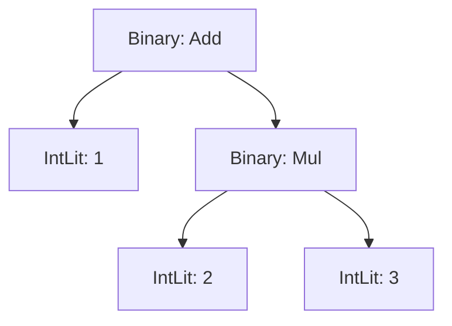
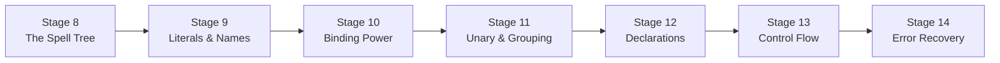

# Act 2 — Deciphering the Incantation

> *The runes are carved. Now they must be read — not as isolated symbols, but as sentences of power. A misplaced word and the spell unravels.*

In Act 1 you built the **rune carver** — a lexer that transforms source text into a stream of tokens. Now you build the **decipherer** — a parser that reads that token stream and assembles it into a **spell tree** (abstract syntax tree, or AST). The spell tree captures the *structure* of the incantation: which operations nest inside which, what binds tighter than what, where blocks begin and end.

This is the second stage of the interpreter pipeline (§1):

```
Source text (.rune file)
  → Lexer (chars → tokens)        ✓ Act 1
    → Parser (tokens → AST)        ← you are here
      → Evaluator (AST → side effects + return values)
```

The parser consumes tokens the same way the lexer consumed characters — with **peek** (look at the current token without consuming it) and **advance** (consume it and move forward). But instead of producing flat tokens, it produces a *tree*. The expression `1 + 2 * 3` becomes:



Getting that tree right — making `*` bind tighter than `+` — is the central challenge of this act. We solve it with **Pratt parsing**, a technique that assigns a *binding power* to each operator and uses it to decide how tightly operands cling to their neighbors.

> [!tip] What You'll Learn
> - Rust's `Box<T>` for recursive data structures (why enums can't contain themselves directly)
> - Recursive descent parsing — each grammar rule becomes a function
> - Pratt parsing — the elegant algorithm for operator precedence
> - Error recovery — reporting multiple parse errors without stopping at the first one



**Estimated time:** 10–14 hours across Stages 8–14.

**Prerequisites:** A working lexer from Act 1. Your project at `~/juk/runescript/` with `src/token.rs`, `src/lexer.rs`, and `src/main.rs`.

---

## Stage 8: The Spell Tree — Easy

*Difficulty: Easy*

**Goal:** Define the `Expr` and `Stmt` enums that represent every possible AST node, and understand why recursive types need `Box<T>`.

**Spec reference:** §4 (AST Node Types), §4.1 (Node Summary)

**New Rust concept(s):** `Box<T>` (heap allocation for recursive types), enum size constraints, `Option<T>` in struct variants, `Vec<T>` as a child list

### Why this stage

Before the parser can build a tree, we need types to represent the tree's nodes. The spec (§4) defines two enums: `Expr` for expressions (things that produce values) and `Stmt` for statements (things that cause effects). Together they form the complete AST.

The tricky part is **recursion**. A `Binary` expression contains two sub-expressions. An `If` statement contains a condition expression and a body of statements. In Python, this is trivial — everything is a reference on the heap. In Rust, enum variants must have a known size at compile time, and a type can't contain itself (that would be infinite size). The solution is `Box<T>`.

### Python equivalent

In Python, you'd use dataclasses with no size concerns:

```python
@dataclass
class Binary:
    op: BinOp
    left: Expr    # just a reference — Python doesn't care about size
    right: Expr

@dataclass
class If:
    condition: Expr
    then_body: list[Stmt]
    else_body: list[Stmt] | None
```

Python objects are always heap-allocated and accessed through references. The `left` field doesn't *contain* an `Expr` — it *points to* one. So recursive types work automatically.

Rust is different. An `enum` variant's data is stored *inline* — not behind a pointer. If `Binary` contained two `Expr` values directly, the compiler would need to know the size of `Expr` to lay out `Binary`, but `Expr`'s size depends on `Binary`'s size... infinite recursion. `Box<Expr>` breaks the cycle: a `Box` is always pointer-sized (8 bytes on 64-bit), regardless of what it points to.

### Concept: Box<T> — Heap Allocation for Recursive Types

`Box<T>` is Rust's simplest smart pointer. It allocates data on the heap and owns it.

| Python | Rust without Box | Rust with Box |
|--------|-----------------|---------------|
| `left: Expr` (always a pointer) | `left: Expr` (inline, infinite size!) | `left: Box<Expr>` (8-byte pointer) |

What happens if you try without `Box`?

```rust
pub enum Expr {
    IntLit(i64),
    Binary(BinOp, Expr, Expr),  // ERROR!
}
```

The compiler says:

```
error[E0072]: recursive type `Expr` has infinite size
 --> src/ast.rs:5:1
  |
5 | pub enum Expr {
  | ^^^^^^^^^^^^^
6 |     IntLit(i64),
7 |     Binary(BinOp, Expr, Expr),
  |                   ----  ---- recursive without indirection
  |
help: insert some indirection (e.g., a `Box`, `Rc`, or `&`) to break the cycle
  |
7 |     Binary(BinOp, Box<Expr>, Box<Expr>),
  |                   ++++    +  ++++    +
```

The fix: `Box<Expr>` is always 8 bytes (one pointer), regardless of what `Expr` variant it points to. The actual data lives on the heap.

- **Creating:** `Box::new(Expr::IntLit(42))` — allocates on the heap, returns a pointer
- **Reading:** Rust auto-derefs — `my_box.some_method()` works without `*`
- **Ownership:** `Box` *owns* its data. When the `Box` is dropped, the heap memory is freed. No garbage collector.

### The Code

Create `src/ast.rs`:

```rust
// src/ast.rs
// The spell tree — abstract syntax tree nodes for Runescript.
// Every node the parser can produce is defined here (§4).

/// Unary operators: negation and logical NOT (§4).
#[derive(Debug, Clone, PartialEq)]
pub enum UnaryOp {
    Neg,  // -x
    Not,  // !flag
}

/// Binary operators: arithmetic, comparison, and logical (§4).
#[derive(Debug, Clone, PartialEq)]
pub enum BinOp {
    Add, Sub, Mul, Div, Mod,          // + - * / %
    Eq, Neq, Lt, LtEq, Gt, GtEq,    // == != < <= > >=
    And, Or,                           // && ||
}
```

Now the expression enum:

```rust
/// An expression — anything that produces a value (§4).
///
/// Recursive variants use Box<Expr> because Rust enums are stored inline.
/// Without Box, Expr would contain Expr, which would be infinite size.
/// Box<Expr> is a heap pointer — always 8 bytes, regardless of what's inside.
#[derive(Debug, Clone, PartialEq)]
pub enum Expr {
    /// Integer literal: 42
    IntLit(i64),
    /// String literal with {} interpolation markers: "HP: {hp}"
    StringLit(String),
    /// Boolean literal: true, false
    BoolLit(bool),
    /// Nil literal
    NilLit,
    /// Variable reference: hp, trap_armed
    Ident(String),
    /// Array literal: [1, 2, 3]
    Array(Vec<Expr>),
    /// Index access: arr[0]
    Index(Box<Expr>, Box<Expr>),
    /// Unary operation: -x, !flag
    Unary(UnaryOp, Box<Expr>),
    /// Binary operation: hp + 10, x == 5
    Binary(BinOp, Box<Expr>, Box<Expr>),
    /// Function call: print("hello"), heal(50)
    Call(Box<Expr>, Vec<Expr>),
    /// Field access: hunter.hp
    FieldAccess(Box<Expr>, String),
    /// Assignment: hp = 50, hunter.hp = 80
    Assign(Box<Expr>, Box<Expr>),
}
```

Which variants need `Box` and which don't?

| Variant | Needs Box? | Why |
|---------|-----------|-----|
| `IntLit(i64)` | No | `i64` is 8 bytes, not recursive |
| `StringLit(String)` | No | `String` is already a heap pointer internally |
| `Array(Vec<Expr>)` | No | `Vec` is already a heap pointer to its elements |
| `Binary(BinOp, Box<Expr>, Box<Expr>)` | Yes | Contains `Expr` recursively |
| `Call(Box<Expr>, Vec<Expr>)` | Yes for callee | The callee is an `Expr` (could be `Ident` or `FieldAccess`) |

The rule: if a field's type is `Expr` (self-referential), wrap it in `Box`. If it's `Vec<Expr>`, no `Box` needed — `Vec` already stores its elements on the heap.

Now the statement enum:

```rust
/// A statement — anything that causes an effect (§4).
#[derive(Debug, Clone, PartialEq)]
pub enum Stmt {
    /// Expression used as a statement: print("hello")
    ExprStmt(Expr),
    /// Variable declaration: let hp = 100
    Let(String, Expr),
    /// Function declaration: fn heal(amount) { ... }
    FnDecl(String, Vec<String>, Vec<Stmt>),
    /// Conditional: if cond { ... } else { ... }
    If(Expr, Vec<Stmt>, Option<Vec<Stmt>>),
    /// While loop: while cond { ... }
    While(Expr, Vec<Stmt>),
    /// For-in loop: for item in list { ... }
    For(String, Expr, Vec<Stmt>),
    /// Return from function: return expr
    Return(Option<Expr>),
    /// Block: { ... }
    Block(Vec<Stmt>),
}
```

`Stmt` doesn't need `Box` for its `Expr` fields because `Stmt` contains `Expr`, not `Stmt` — no self-referential cycle. The recursion in `Stmt` is through `Vec<Stmt>` (in `FnDecl`, `If`, `While`, `For`, `Block`), and `Vec` is already heap-allocated.

`Option<Vec<Stmt>>` in `If` represents the optional `else` branch. `Some(stmts)` means there's an else block; `None` means there isn't.

Register the module in `src/main.rs`:

```rust
mod token;
mod lexer;
mod ast;  // new

fn main() {
    // Build the AST for: 1 + 2 * 3
    use ast::{Expr, BinOp};

    let tree = Expr::Binary(
        BinOp::Add,
        Box::new(Expr::IntLit(1)),
        Box::new(Expr::Binary(
            BinOp::Mul,
            Box::new(Expr::IntLit(2)),
            Box::new(Expr::IntLit(3)),
        )),
    );

    println!("Spell tree: {:#?}", tree);
}
```

- `Box::new(...)` — allocates the inner value on the heap and returns a `Box` pointer.
- `{:#?}` — the "pretty-print Debug" format. `#` adds indentation and newlines.
- The nesting shows the tree structure: `Add` has `IntLit(1)` on the left and `Mul(IntLit(2), IntLit(3))` on the right — `*` binds tighter than `+`.

> [!warning] Common Mistakes
> **Forgetting `Box::new(...)` when constructing recursive variants:**
> ```
> error[E0308]: mismatched types
>   expected `Box<Expr>`, found `Expr`
> ```
>
> **Confusing `Box<Expr>` with `&Expr`** — `Box` *owns* the data (freed when dropped). `&Expr` *borrows* it (someone else owns it). AST nodes own their children, so we use `Box`.

### Verify it works

```bash
cargo run
```

Expected output (pretty-printed):

```
Spell tree: Binary(
    Add,
    IntLit(
        1,
    ),
    Binary(
        Mul,
        IntLit(
            2,
        ),
        IntLit(
            3,
        ),
    ),
)
```

### Extend it

Build the AST for `if hp > 0 { heal(10) }` by hand using `Stmt::If`, `Expr::Binary`, `Expr::Call`, etc. Print it with `{:#?}`. This gets you comfortable constructing nested AST nodes before the parser does it automatically.

> [!check] Checkpoint
> **`src/ast.rs`** (complete):
>
> ```rust
> #[derive(Debug, Clone, PartialEq)]
> pub enum UnaryOp {
>     Neg,
>     Not,
> }
>
> #[derive(Debug, Clone, PartialEq)]
> pub enum BinOp {
>     Add, Sub, Mul, Div, Mod,
>     Eq, Neq, Lt, LtEq, Gt, GtEq,
>     And, Or,
> }
>
> #[derive(Debug, Clone, PartialEq)]
> pub enum Expr {
>     IntLit(i64),
>     StringLit(String),
>     BoolLit(bool),
>     NilLit,
>     Ident(String),
>     Array(Vec<Expr>),
>     Index(Box<Expr>, Box<Expr>),
>     Unary(UnaryOp, Box<Expr>),
>     Binary(BinOp, Box<Expr>, Box<Expr>),
>     Call(Box<Expr>, Vec<Expr>),
>     FieldAccess(Box<Expr>, String),
>     Assign(Box<Expr>, Box<Expr>),
> }
>
> #[derive(Debug, Clone, PartialEq)]
> pub enum Stmt {
>     ExprStmt(Expr),
>     Let(String, Expr),
>     FnDecl(String, Vec<String>, Vec<Stmt>),
>     If(Expr, Vec<Stmt>, Option<Vec<Stmt>>),
>     While(Expr, Vec<Stmt>),
>     For(String, Expr, Vec<Stmt>),
>     Return(Option<Expr>),
>     Block(Vec<Stmt>),
> }
> ```


---

## Stage 9: Literals and Names — Easy

*Difficulty: Easy*

**Goal:** Build the `Parser` struct with peek/advance over tokens, and parse the simplest expressions: integer literals, string literals, booleans, nil, and identifiers.

**Spec reference:** §5 (`primary` rule in BNF), §4 (`IntLit`, `StringLit`, `BoolLit`, `NilLit`, `Ident` nodes)

**New Rust concept(s):** Consuming a `Vec<Token>` by index, `Result` with custom error strings, `match` on enum variants with data extraction, the `clone()` cost

### Why this stage

The parser mirrors the lexer's architecture: a struct with a cursor, `peek()` to look ahead, `advance()` to consume. But instead of characters, it operates on tokens. And instead of producing tokens, it produces AST nodes.

We start with the **primary** rule — the bottom of the grammar (§5). Primary expressions are the atoms: literals and variable names. They don't contain sub-expressions, so there's no recursion yet.

### The Code

Create `src/parser.rs`. The parser struct and core methods:

```rust
use crate::token::{Token, TokenKind, Span};
use crate::ast::{Expr, Stmt, BinOp, UnaryOp};

pub struct Parser {
    tokens: Vec<Token>,
    pos: usize,
}

impl Parser {
    pub fn new(tokens: Vec<Token>) -> Self {
        Parser { tokens, pos: 0 }
    }

    fn peek(&self) -> &Token {
        &self.tokens[self.pos]
    }

    fn peek_kind(&self) -> &TokenKind {
        &self.tokens[self.pos].kind
    }

    fn advance(&mut self) -> &Token {
        let tok = &self.tokens[self.pos];
        if self.pos < self.tokens.len() - 1 {
            self.pos += 1;
        }
        tok
    }

    fn match_kind(&mut self, expected: &TokenKind) -> bool {
        if self.peek_kind() == expected {
            self.advance();
            true
        } else {
            false
        }
    }

    fn expect(&mut self, expected: &TokenKind, context: &str) -> Result<(), String> {
        if self.peek_kind() == expected {
            self.advance();
            Ok(())
        } else {
            let span = &self.peek().span;
            Err(format!(
                "[line {}, col {}] Expected {:?} {}, found {:?}",
                span.line, span.col, expected, context, self.peek_kind()
            ))
        }
    }

    fn current_span(&self) -> Span {
        self.peek().span.clone()
    }
```

Key differences from the lexer:

- `peek()` returns `&Token`, not `Option<Token>`. No `None` case because the lexer always appends `Eof`.
- `advance()` returns `&Token` — a reference to the consumed token. The `if self.pos < self.tokens.len() - 1` guard prevents advancing past `Eof`.
- `expect()` is the "consume or error" pattern — "I expect a `(` here; if it's not there, that's a parse error."

Now **implement `parse_primary` yourself.** It should:

```rust
fn parse_primary(&mut self) -> Result<Expr, String>
```

1. Advance to get the current token (clone it to release the borrow)
2. Match on the token's kind:
   - `IntLit(n)` → `Ok(Expr::IntLit(n))`
   - `StringLit(s)` → `Ok(Expr::StringLit(s.clone()))`
   - `True` → `Ok(Expr::BoolLit(true))`
   - `False` → `Ok(Expr::BoolLit(false))`
   - `Nil` → `Ok(Expr::NilLit)`
   - `Ident(name)` → `Ok(Expr::Ident(name.clone()))`
   - Anything else → `Err("Expected expression, found ...")`

Hint: use `let token = self.advance().clone();` to clone the token and release the borrow on `self`.

<details>
<summary>Solution: parse_primary</summary>

```rust
    fn parse_primary(&mut self) -> Result<Expr, String> {
        let token = self.advance().clone();

        match token.kind {
            TokenKind::IntLit(n) => Ok(Expr::IntLit(n)),
            TokenKind::StringLit(ref s) => Ok(Expr::StringLit(s.clone())),
            TokenKind::True => Ok(Expr::BoolLit(true)),
            TokenKind::False => Ok(Expr::BoolLit(false)),
            TokenKind::Nil => Ok(Expr::NilLit),
            TokenKind::Ident(ref name) => Ok(Expr::Ident(name.clone())),
            _ => Err(format!(
                "[line {}, col {}] Expected expression, found {:?}",
                token.span.line, token.span.col, token.kind
            )),
        }
    }
```

</details>

Key patterns:

- `let token = self.advance().clone()` — we clone because `advance()` returns `&Token` (a borrow of `self`). If we kept that reference while calling other `&mut self` methods, the borrow checker would complain. Cloning gives us an owned copy.
- `TokenKind::IntLit(n)` — destructures the variant and binds the inner `i64` to `n`.
- `TokenKind::StringLit(ref s)` — `ref` borrows the string inside the cloned token. We then `.clone()` it for the AST node.

> [!warning] The Borrow Checker Wall: Why We Clone
> Without the clone, you'd write:
> ```rust
> let token = self.advance(); // &Token — borrows self
> // ... later ...
> let rhs = self.parse_expr_bp(0)?; // &mut self — ERROR!
> ```
> The compiler says:
> ```
> error[E0502]: cannot borrow `*self` as mutable because it is also borrowed as immutable
>   --> src/parser.rs:45:19
>    |
> 42 |         let token = self.advance();
>    |                     ---- immutable borrow occurs here
> ...
> 45 |         let rhs = self.parse_expr_bp(0)?;
>    |                   ^^^^ mutable borrow occurs here
> ```
> **What's happening:** `self.advance()` returns `&Token` — a shared reference into `self.tokens`. While that reference exists, you can't call any `&mut self` method because Rust forbids simultaneous shared and mutable borrows.
>
> **The fix:** `.clone()` copies the token into a local variable, ending the borrow immediately. Now `self` is free for mutable calls.

Add a public entry point and register the module:

```rust
    pub fn parse_expression(&mut self) -> Result<Expr, String> {
        self.parse_primary()
    }
}
```

In `src/main.rs`:

```rust
mod token;
mod lexer;
mod ast;
mod parser;

use lexer::Lexer;
use parser::Parser;

fn main() {
    let source = "42";
    let mut lex = Lexer::new(source);
    let tokens = lex.scan_tokens().unwrap();
    let mut parser = Parser::new(tokens);
    let expr = parser.parse_expression().unwrap();
    println!("Parsed: {:#?}", expr);
}
```

Add tests:

```rust
#[cfg(test)]
mod tests {
    use super::*;
    use crate::lexer::Lexer;

    fn parser_for(source: &str) -> Parser {
        let mut lexer = Lexer::new(source);
        let tokens = lexer.scan_tokens().unwrap();
        Parser::new(tokens)
    }

    #[test]
    fn parse_int_literal() {
        let mut p = parser_for("42");
        assert_eq!(p.parse_expression().unwrap(), Expr::IntLit(42));
    }

    #[test]
    fn parse_string_literal() {
        let mut p = parser_for(r#""hello""#);
        assert_eq!(p.parse_expression().unwrap(), Expr::StringLit("hello".to_string()));
    }

    #[test]
    fn parse_booleans_and_nil() {
        assert_eq!(parser_for("true").parse_expression().unwrap(), Expr::BoolLit(true));
        assert_eq!(parser_for("false").parse_expression().unwrap(), Expr::BoolLit(false));
        assert_eq!(parser_for("nil").parse_expression().unwrap(), Expr::NilLit);
    }

    #[test]
    fn parse_identifier() {
        let mut p = parser_for("hp");
        assert_eq!(p.parse_expression().unwrap(), Expr::Ident("hp".to_string()));
    }

    #[test]
    fn parse_error_on_unexpected_token() {
        let result = parser_for("+").parse_expression();
        assert!(result.is_err());
        assert!(result.unwrap_err().contains("Expected expression"));
    }
}
```

### Verify it works

```bash
cargo test
```

### Extend it

Write a test that parses `"0"` and verifies it produces `IntLit(0)`, not an error. Then parse `"_underscore_var"` and verify it produces `Ident("_underscore_var")`. Edge cases matter.

> [!check] Checkpoint
> **`src/parser.rs`** contains: `Parser` struct, `new`, `peek`, `peek_kind`, `advance`, `match_kind`, `expect`, `current_span`, `parse_primary`, `parse_expression`, and 5 tests.


---

## Stage 10: The Binding Power — Hard

*Difficulty: Hard*

**Goal:** Implement Pratt parsing for binary operators so that `1 + 2 * 3` correctly parses as `Add(1, Mul(2, 3))` — respecting the operator precedence table from the spec.

**Spec reference:** §5.1 (Operator Precedence table), §5.2 (Pratt parsing strategy)

**New Rust concept(s):** `u8` for binding power values, `loop` with conditional `break`, the Pratt parsing algorithm

### Why this stage

This is the hardest stage in the entire course. Not because the code is long — it's surprisingly short — but because the *idea* is subtle. How does the parser know that `*` binds tighter than `+`?

**Pratt parsing** assigns a numeric **binding power** to each operator. Higher numbers mean tighter binding. The algorithm:

1. Parse a prefix expression (a literal or identifier).
2. Look at the next token. If it's an infix operator whose binding power is *greater than* the minimum, consume it and parse the right-hand side recursively — but with the operator's binding power as the new minimum.
3. Repeat step 2 until the next operator's binding power is too low.

### The Precedence Table

From §5.1, translated to binding power numbers:

| Level | Operators | Binding Power (left, right) | Associativity |
|-------|-----------|---------------------------|---------------|
| 1 | `=` | (2, 1) | Right |
| 2 | `\|\|` | (3, 4) | Left |
| 3 | `&&` | (5, 6) | Left |
| 4 | `==` `!=` | (7, 8) | Left |
| 5 | `<` `<=` `>` `>=` | (9, 10) | Left |
| 6 | `+` `-` | (11, 12) | Left |
| 7 | `*` `/` `%` | (13, 14) | Left |

**Left-associative:** `right_bp = left_bp + 1`. So `1 + 2 + 3` → `(1 + 2) + 3`.
**Right-associative:** `right_bp = left_bp - 1`. So `a = b = 5` → `a = (b = 5)`.

### Walking Through `1 + 2 * 3`

Tokens: `IntLit(1)`, `Plus`, `IntLit(2)`, `Star`, `IntLit(3)`, `Eof`.

**Call:** `parse_expr_bp(min_bp=0)`

1. Parse prefix: consume `IntLit(1)` → `lhs = IntLit(1)`
2. Peek: `Plus`, bp=(11,12). Is `11 > 0`? Yes. Consume `Plus`.
3. Recurse: `parse_expr_bp(min_bp=12)`:
   - Parse prefix: consume `IntLit(2)` → `lhs = IntLit(2)`
   - Peek: `Star`, bp=(13,14). Is `13 > 12`? Yes. Consume `Star`.
   - Recurse: `parse_expr_bp(min_bp=14)`:
     - Parse prefix: consume `IntLit(3)` → `lhs = IntLit(3)`
     - Peek: `Eof`. No bp. Break. Return `IntLit(3)`.
   - Build: `lhs = Binary(Mul, IntLit(2), IntLit(3))`
   - Peek: `Eof`. Break. Return `Binary(Mul, IntLit(2), IntLit(3))`.
4. Build: `lhs = Binary(Add, IntLit(1), Binary(Mul, IntLit(2), IntLit(3)))`
5. Peek: `Eof`. Break. Return. ✓

The key: when parsing the right side of `+` with `min_bp=12`, the `*` (left bp=13) is strong enough to steal `IntLit(2)`. But `+` (left bp=11) would NOT be strong enough if we were inside a `*` context.

### The Code

**Implement the binding power lookup yourself.** Write a function that maps `TokenKind` to `Option<(u8, u8)>`:

```rust
fn infix_binding_power(kind: &TokenKind) -> Option<(u8, u8)>
```

Use the table above. Return `None` for non-operators.

<details>
<summary>Solution: infix_binding_power and token_to_binop</summary>

```rust
    fn infix_binding_power(kind: &TokenKind) -> Option<(u8, u8)> {
        match kind {
            TokenKind::Eq => Some((2, 1)),                                    // right-assoc
            TokenKind::Or => Some((3, 4)),
            TokenKind::And => Some((5, 6)),
            TokenKind::EqEq | TokenKind::BangEq => Some((7, 8)),
            TokenKind::Lt | TokenKind::LtEq
            | TokenKind::Gt | TokenKind::GtEq => Some((9, 10)),
            TokenKind::Plus | TokenKind::Minus => Some((11, 12)),
            TokenKind::Star | TokenKind::Slash
            | TokenKind::Percent => Some((13, 14)),
            _ => None,
        }
    }

    fn token_to_binop(kind: &TokenKind) -> Option<BinOp> {
        match kind {
            TokenKind::Plus => Some(BinOp::Add),
            TokenKind::Minus => Some(BinOp::Sub),
            TokenKind::Star => Some(BinOp::Mul),
            TokenKind::Slash => Some(BinOp::Div),
            TokenKind::Percent => Some(BinOp::Mod),
            TokenKind::EqEq => Some(BinOp::Eq),
            TokenKind::BangEq => Some(BinOp::Neq),
            TokenKind::Lt => Some(BinOp::Lt),
            TokenKind::LtEq => Some(BinOp::LtEq),
            TokenKind::Gt => Some(BinOp::Gt),
            TokenKind::GtEq => Some(BinOp::GtEq),
            TokenKind::And => Some(BinOp::And),
            TokenKind::Or => Some(BinOp::Or),
            _ => None,
        }
    }
```

</details>

Now rewrite `parse_expression` to use Pratt parsing:

```rust
    pub fn parse_expression(&mut self) -> Result<Expr, String> {
        self.parse_expr_bp(0)
    }

    fn parse_expr_bp(&mut self, min_bp: u8) -> Result<Expr, String> {
        // Step 1: Parse prefix (just primary for now — Stage 11 adds unary)
        let mut lhs = self.parse_primary()?;

        // Step 2: Loop over infix operators
        loop {
            let (left_bp, right_bp) = match Self::infix_binding_power(self.peek_kind()) {
                Some(bp) => bp,
                None => break,
            };

            if left_bp < min_bp {
                break;
            }

            let op_token = self.advance().clone();

            // Assignment produces Assign, not Binary
            if matches!(op_token.kind, TokenKind::Eq) {
                let rhs = self.parse_expr_bp(right_bp)?;
                lhs = Expr::Assign(Box::new(lhs), Box::new(rhs));
                continue;
            }

            let op = Self::token_to_binop(&op_token.kind).unwrap();
            let rhs = self.parse_expr_bp(right_bp)?;
            lhs = Expr::Binary(op, Box::new(lhs), Box::new(rhs));
        }

        Ok(lhs)
    }
```

- `matches!(op_token.kind, TokenKind::Eq)` — the `matches!` macro checks if a value matches a pattern. Returns `bool`. Like `isinstance()` in Python.

Add tests:

```rust
    #[test]
    fn parse_simple_addition() {
        let mut p = parser_for("1 + 2");
        assert_eq!(
            p.parse_expression().unwrap(),
            Expr::Binary(BinOp::Add, Box::new(Expr::IntLit(1)), Box::new(Expr::IntLit(2)))
        );
    }

    #[test]
    fn parse_precedence_mul_over_add() {
        let mut p = parser_for("1 + 2 * 3");
        assert_eq!(
            p.parse_expression().unwrap(),
            Expr::Binary(
                BinOp::Add,
                Box::new(Expr::IntLit(1)),
                Box::new(Expr::Binary(BinOp::Mul, Box::new(Expr::IntLit(2)), Box::new(Expr::IntLit(3)))),
            )
        );
    }

    #[test]
    fn parse_left_associativity() {
        // 1 - 2 - 3 → Sub(Sub(1, 2), 3)
        let mut p = parser_for("1 - 2 - 3");
        assert_eq!(
            p.parse_expression().unwrap(),
            Expr::Binary(
                BinOp::Sub,
                Box::new(Expr::Binary(BinOp::Sub, Box::new(Expr::IntLit(1)), Box::new(Expr::IntLit(2)))),
                Box::new(Expr::IntLit(3)),
            )
        );
    }

    #[test]
    fn parse_right_associative_assignment() {
        // a = b = 5 → Assign(a, Assign(b, 5))
        let mut p = parser_for("a = b = 5");
        assert_eq!(
            p.parse_expression().unwrap(),
            Expr::Assign(
                Box::new(Expr::Ident("a".to_string())),
                Box::new(Expr::Assign(
                    Box::new(Expr::Ident("b".to_string())),
                    Box::new(Expr::IntLit(5)),
                )),
            )
        );
    }

    #[test]
    fn parse_comparison_and_logic() {
        // hp > 0 && alive → And(Gt(hp, 0), alive)
        let mut p = parser_for("hp > 0 && alive");
        assert_eq!(
            p.parse_expression().unwrap(),
            Expr::Binary(
                BinOp::And,
                Box::new(Expr::Binary(BinOp::Gt, Box::new(Expr::Ident("hp".to_string())), Box::new(Expr::IntLit(0)))),
                Box::new(Expr::Ident("alive".to_string())),
            )
        );
    }

    #[test]
    fn parse_complex_arithmetic() {
        // 2 + 3 * 4 - 1 → Sub(Add(2, Mul(3, 4)), 1)
        let mut p = parser_for("2 + 3 * 4 - 1");
        let expr = p.parse_expression().unwrap();
        assert_eq!(
            expr,
            Expr::Binary(
                BinOp::Sub,
                Box::new(Expr::Binary(
                    BinOp::Add,
                    Box::new(Expr::IntLit(2)),
                    Box::new(Expr::Binary(BinOp::Mul, Box::new(Expr::IntLit(3)), Box::new(Expr::IntLit(4)))),
                )),
                Box::new(Expr::IntLit(1)),
            )
        );
    }
```

> [!warning] Common Mistakes
> **Using `<=` instead of `<` for the binding power check** — `if left_bp <= min_bp` breaks left-associativity. `1 + 2 + 3` would parse as `1 + (2 + 3)` instead of `(1 + 2) + 3`. The condition must be `<`.
>
> **Mixing up left_bp and right_bp** — `left_bp` is compared against `min_bp`. `right_bp` is passed to the recursive call.

### Verify it works

```bash
cargo test
```

### Extend it

Write a test for `x == 5 || y != 3` and verify the tree shape. `||` (bp 3,4) should be the root, with `==` (bp 7,8) and `!=` (bp 7,8) as children. This tests that comparison binds tighter than logical OR.

> [!check] Checkpoint
> Added to `src/parser.rs`: `infix_binding_power`, `token_to_binop`, `parse_expr_bp`. Replaced `parse_expression` to delegate to `parse_expr_bp(0)`. 6 new tests.


---

## Stage 11: Unary and Grouping — Medium

*Difficulty: Medium*

**Goal:** Parse unary operators (`-x`, `!flag`), parenthesized grouping (`(expr)`), array literals (`[1, 2, 3]`), function calls (`print("hi")`), field access (`hunter.hp`), and index access (`arr[0]`).

**Spec reference:** §5 (`unary`, `call`, `primary` rules), §5.1 (level 8: unary, level 9: `.` `()` `[]`)

**New Rust concept(s):** Prefix binding power, postfix operators as high-bp infix, parsing comma-separated lists

### Why this stage

Stage 10 handled infix binary operators. But expressions also have:

- **Prefix:** `-x`, `!flag` — before their operand
- **Grouping:** `(1 + 2) * 3` — parentheses override precedence
- **Postfix-like:** `print(args)`, `hunter.hp`, `arr[0]` — after an expression, bind very tightly
- **Array literals:** `[1, 2, 3]` — a prefix construct

In Pratt parsing, prefix operators are handled before the infix loop. Postfix operators are handled as infix with very high binding power (17) — they always win.

### The Code

Add a prefix binding power function and a comma-list helper:

```rust
    fn prefix_binding_power(kind: &TokenKind) -> Option<u8> {
        match kind {
            TokenKind::Minus | TokenKind::Bang => Some(15),
            _ => None,
        }
    }

    fn parse_expr_list(&mut self, end_token: &TokenKind) -> Result<Vec<Expr>, String> {
        let mut args = Vec::new();
        if self.peek_kind() == end_token {
            return Ok(args);
        }
        args.push(self.parse_expr_bp(0)?);
        while self.match_kind(&TokenKind::Comma) {
            args.push(self.parse_expr_bp(0)?);
        }
        Ok(args)
    }
```

Now **rewrite `parse_expr_bp` yourself** to handle all of these. The structure:

**Step 1 (prefix):** Check the current token:
- `-` or `!` → consume, parse operand with prefix bp (15), wrap in `Unary`
- `(` → consume, parse inner expression with bp 0, expect `)`
- `[` → consume, parse comma list, expect `]`, wrap in `Array`
- Otherwise → `parse_primary()`

**Step 2 (infix loop):** Before checking binary operators, check for postfix:
- `(` → function call: parse args, expect `)`, wrap in `Call`
- `.` → field access: consume, expect ident, wrap in `FieldAccess`
- `[` → index: consume, parse index expr, expect `]`, wrap in `Index`

All postfix operators use binding power 17 — check `if 17 < min_bp { break; }`.

<details>
<summary>Solution: complete parse_expr_bp</summary>

```rust
    fn parse_expr_bp(&mut self, min_bp: u8) -> Result<Expr, String> {
        // Step 1: Prefix
        let mut lhs = if let Some(right_bp) = Self::prefix_binding_power(self.peek_kind()) {
            let op_token = self.advance().clone();
            let op = match op_token.kind {
                TokenKind::Minus => UnaryOp::Neg,
                TokenKind::Bang => UnaryOp::Not,
                _ => unreachable!(),
            };
            let operand = self.parse_expr_bp(right_bp)?;
            Expr::Unary(op, Box::new(operand))
        } else if self.peek_kind() == &TokenKind::LParen {
            self.advance();
            let expr = self.parse_expr_bp(0)?;
            self.expect(&TokenKind::RParen, "to close grouping")?;
            expr
        } else if self.peek_kind() == &TokenKind::LBracket {
            self.advance();
            let elements = self.parse_expr_list(&TokenKind::RBracket)?;
            self.expect(&TokenKind::RBracket, "to close array literal")?;
            Expr::Array(elements)
        } else {
            self.parse_primary()?
        };

        // Step 2: Infix + postfix loop
        loop {
            // Postfix operators (bp 17)
            match self.peek_kind() {
                TokenKind::LParen => {
                    if 17 < min_bp { break; }
                    self.advance();
                    let args = self.parse_expr_list(&TokenKind::RParen)?;
                    self.expect(&TokenKind::RParen, "to close function arguments")?;
                    lhs = Expr::Call(Box::new(lhs), args);
                    continue;
                }
                TokenKind::Dot => {
                    if 17 < min_bp { break; }
                    self.advance();
                    let field_token = self.advance().clone();
                    let field_name = match field_token.kind {
                        TokenKind::Ident(name) => name,
                        _ => return Err(format!(
                            "[line {}, col {}] Expected field name after '.', found {:?}",
                            field_token.span.line, field_token.span.col, field_token.kind
                        )),
                    };
                    lhs = Expr::FieldAccess(Box::new(lhs), field_name);
                    continue;
                }
                TokenKind::LBracket => {
                    if 17 < min_bp { break; }
                    self.advance();
                    let index = self.parse_expr_bp(0)?;
                    self.expect(&TokenKind::RBracket, "to close index access")?;
                    lhs = Expr::Index(Box::new(lhs), Box::new(index));
                    continue;
                }
                _ => {}
            }

            // Infix binary operators
            let (left_bp, right_bp) = match Self::infix_binding_power(self.peek_kind()) {
                Some(bp) => bp,
                None => break,
            };
            if left_bp < min_bp { break; }

            let op_token = self.advance().clone();
            if matches!(op_token.kind, TokenKind::Eq) {
                let rhs = self.parse_expr_bp(right_bp)?;
                lhs = Expr::Assign(Box::new(lhs), Box::new(rhs));
                continue;
            }

            let op = Self::token_to_binop(&op_token.kind).unwrap();
            let rhs = self.parse_expr_bp(right_bp)?;
            lhs = Expr::Binary(op, Box::new(lhs), Box::new(rhs));
        }

        Ok(lhs)
    }
```

</details>

The `continue` after each postfix case re-enters the loop to allow chaining: `arr[0].name` → `FieldAccess(Index(arr, 0), "name")`.

- `unreachable!()` — panics with "entered unreachable code." Used when a branch is logically impossible.

Add tests:

```rust
    #[test]
    fn parse_unary_negation() {
        let mut p = parser_for("-42");
        assert_eq!(p.parse_expression().unwrap(), Expr::Unary(UnaryOp::Neg, Box::new(Expr::IntLit(42))));
    }

    #[test]
    fn parse_unary_not() {
        let mut p = parser_for("!flag");
        assert_eq!(p.parse_expression().unwrap(), Expr::Unary(UnaryOp::Not, Box::new(Expr::Ident("flag".to_string()))));
    }

    #[test]
    fn parse_grouping_overrides_precedence() {
        // (1 + 2) * 3 → Mul(Add(1, 2), 3)
        let mut p = parser_for("(1 + 2) * 3");
        assert_eq!(
            p.parse_expression().unwrap(),
            Expr::Binary(
                BinOp::Mul,
                Box::new(Expr::Binary(BinOp::Add, Box::new(Expr::IntLit(1)), Box::new(Expr::IntLit(2)))),
                Box::new(Expr::IntLit(3)),
            )
        );
    }

    #[test]
    fn parse_array_literal() {
        let mut p = parser_for("[1, 2, 3]");
        assert_eq!(p.parse_expression().unwrap(), Expr::Array(vec![Expr::IntLit(1), Expr::IntLit(2), Expr::IntLit(3)]));
    }

    #[test]
    fn parse_empty_array() {
        assert_eq!(parser_for("[]").parse_expression().unwrap(), Expr::Array(vec![]));
    }

    #[test]
    fn parse_function_call() {
        let mut p = parser_for(r#"print("hello")"#);
        assert_eq!(
            p.parse_expression().unwrap(),
            Expr::Call(Box::new(Expr::Ident("print".to_string())), vec![Expr::StringLit("hello".to_string())])
        );
    }

    #[test]
    fn parse_call_no_args() {
        assert_eq!(
            parser_for("get_hp()").parse_expression().unwrap(),
            Expr::Call(Box::new(Expr::Ident("get_hp".to_string())), vec![])
        );
    }

    #[test]
    fn parse_field_access() {
        assert_eq!(
            parser_for("hunter.hp").parse_expression().unwrap(),
            Expr::FieldAccess(Box::new(Expr::Ident("hunter".to_string())), "hp".to_string())
        );
    }

    #[test]
    fn parse_index_access() {
        assert_eq!(
            parser_for("enemies[0]").parse_expression().unwrap(),
            Expr::Index(Box::new(Expr::Ident("enemies".to_string())), Box::new(Expr::IntLit(0)))
        );
    }

    #[test]
    fn parse_chained_postfix() {
        // hunter.items[0] → Index(FieldAccess(hunter, "items"), 0)
        let mut p = parser_for("hunter.items[0]");
        assert_eq!(
            p.parse_expression().unwrap(),
            Expr::Index(
                Box::new(Expr::FieldAccess(Box::new(Expr::Ident("hunter".to_string())), "items".to_string())),
                Box::new(Expr::IntLit(0)),
            )
        );
    }

    #[test]
    fn parse_negation_binds_tighter_than_mul() {
        // -x * 2 → Mul(Neg(x), 2)
        let mut p = parser_for("-x * 2");
        assert_eq!(
            p.parse_expression().unwrap(),
            Expr::Binary(
                BinOp::Mul,
                Box::new(Expr::Unary(UnaryOp::Neg, Box::new(Expr::Ident("x".to_string())))),
                Box::new(Expr::IntLit(2)),
            )
        );
    }
```

> [!warning] Common Mistakes
> **Forgetting `continue` after postfix operators** — without it, the code falls through to the infix check, which returns `None` for `(`, `.`, `[`, and breaks the loop. Chaining like `a.b[0](x)` would fail.
>
> **Not resetting binding power inside parentheses** — `parse_expr_bp(0)` inside `(` means "parse any expression." If you passed `min_bp`, `(1 + 2)` inside a `*` context would fail because `+` has lower bp.

### Verify it works

```bash
cargo test
```

### Extend it

Write a test for `damage(hunter, -15)` — a function call with a negated argument. Verify the tree has `Call` at the root with `Unary(Neg, IntLit(15))` as the second argument.

> [!check] Checkpoint
> Added: `prefix_binding_power`, `parse_expr_list`. Rewrote `parse_expr_bp` with prefix + postfix handling. 11 new tests. The expression parser is now complete.


---

## Stage 12: Declarations — Medium

*Difficulty: Medium*

**Goal:** Parse `let` declarations, `fn` declarations, and expression statements. Parse a complete program as a list of declarations.

**Spec reference:** §5 (`program`, `declaration`, `fn_decl`, `let_decl`, `expr_stmt` rules)

**New Rust concept(s):** Recursive descent for statements, parsing sequences terminated by `Eof`, `Vec<String>` for parameter lists

### Why this stage

Expressions produce values. Statements cause effects. A program is a sequence of declarations (§5):

```
program     ::= declaration* EOF
declaration ::= fn_decl | let_decl | statement
```

The parser peeks at the current token to decide which rule to apply: `let` → let declaration, `fn` → function declaration, anything else → expression statement.

### The Code

Add helpers and statement parsers. **Implement `parse_let` yourself:**

```rust
fn parse_let(&mut self) -> Result<Stmt, String>
```

The `let` keyword has already been consumed. Parse: identifier name, `=`, expression. Return `Stmt::Let(name, value)`.

<details>
<summary>Solution: statement parsing methods</summary>

```rust
    fn expect_ident(&mut self, context: &str) -> Result<String, String> {
        let token = self.advance().clone();
        match token.kind {
            TokenKind::Ident(name) => Ok(name),
            _ => Err(format!(
                "[line {}, col {}] Expected identifier {}, found {:?}",
                token.span.line, token.span.col, context, token.kind
            )),
        }
    }

    fn parse_let(&mut self) -> Result<Stmt, String> {
        let name = self.expect_ident("for variable name")?;
        self.expect(&TokenKind::Eq, "after variable name in let declaration")?;
        let value = self.parse_expr_bp(0)?;
        Ok(Stmt::Let(name, value))
    }

    fn parse_fn_decl(&mut self) -> Result<Stmt, String> {
        let name = self.expect_ident("for function name")?;
        self.expect(&TokenKind::LParen, "after function name")?;
        let mut params = Vec::new();
        if self.peek_kind() != &TokenKind::RParen {
            params.push(self.expect_ident("for parameter name")?);
            while self.match_kind(&TokenKind::Comma) {
                params.push(self.expect_ident("for parameter name")?);
            }
        }
        self.expect(&TokenKind::RParen, "to close parameter list")?;
        let body = self.parse_block()?;
        Ok(Stmt::FnDecl(name, params, body))
    }

    fn parse_block(&mut self) -> Result<Vec<Stmt>, String> {
        self.expect(&TokenKind::LBrace, "to open block")?;
        let mut stmts = Vec::new();
        while self.peek_kind() != &TokenKind::RBrace
            && self.peek_kind() != &TokenKind::Eof
        {
            stmts.push(self.parse_declaration()?);
        }
        self.expect(&TokenKind::RBrace, "to close block")?;
        Ok(stmts)
    }

    fn parse_declaration(&mut self) -> Result<Stmt, String> {
        match self.peek_kind() {
            TokenKind::Let => { self.advance(); self.parse_let() }
            TokenKind::Fn => { self.advance(); self.parse_fn_decl() }
            _ => self.parse_statement(),
        }
    }

    fn parse_statement(&mut self) -> Result<Stmt, String> {
        let expr = self.parse_expr_bp(0)?;
        self.match_kind(&TokenKind::Semicolon);
        Ok(Stmt::ExprStmt(expr))
    }

    pub fn parse_program(&mut self) -> Result<Vec<Stmt>, String> {
        let mut stmts = Vec::new();
        while self.peek_kind() != &TokenKind::Eof {
            stmts.push(self.parse_declaration()?);
        }
        Ok(stmts)
    }
```

</details>

Key patterns:

- `parse_block` checks for `Eof` to prevent infinite loops on unclosed `{`.
- `parse_statement` optionally consumes a semicolon — Runescript doesn't require them.
- `parse_declaration` peeks at the keyword, consumes it, then calls the specific parser.

Add tests:

```rust
    #[test]
    fn parse_let_declaration() {
        let mut p = parser_for("let hp = 100");
        assert_eq!(p.parse_program().unwrap(), vec![Stmt::Let("hp".to_string(), Expr::IntLit(100))]);
    }

    #[test]
    fn parse_fn_declaration() {
        let mut p = parser_for("fn heal(amount) { hp = hp + amount }");
        let program = p.parse_program().unwrap();
        match &program[0] {
            Stmt::FnDecl(name, params, body) => {
                assert_eq!(name, "heal");
                assert_eq!(params, &vec!["amount".to_string()]);
                assert_eq!(body.len(), 1);
            }
            _ => panic!("Expected FnDecl"),
        }
    }

    #[test]
    fn parse_fn_no_params() {
        let mut p = parser_for("fn greet() { print(42) }");
        match &p.parse_program().unwrap()[0] {
            Stmt::FnDecl(_, params, _) => assert!(params.is_empty()),
            _ => panic!("Expected FnDecl"),
        }
    }

    #[test]
    fn parse_expression_statement() {
        let mut p = parser_for(r#"print("hello")"#);
        assert_eq!(
            p.parse_program().unwrap(),
            vec![Stmt::ExprStmt(Expr::Call(
                Box::new(Expr::Ident("print".to_string())),
                vec![Expr::StringLit("hello".to_string())],
            ))]
        );
    }

    #[test]
    fn parse_multiple_declarations() {
        let mut p = parser_for("let x = 1\nlet y = 2\nx + y");
        let program = p.parse_program().unwrap();
        assert_eq!(program.len(), 3);
    }

    #[test]
    fn parse_let_missing_eq() {
        let result = parser_for("let x 5").parse_program();
        assert!(result.is_err());
    }
```

> [!warning] Common Mistakes
> **Forgetting to consume the keyword before calling the sub-parser** — `parse_let` expects `let` to already be consumed. If `parse_declaration` doesn't `self.advance()`, the parser sees `let` again and tries to parse it as an identifier.
>
> **Infinite loop in `parse_block` without `Eof` check** — if the source is `{ let x = 1` (no closing `}`), the parser loops forever.

### Verify it works

```bash
cargo test
```

### Extend it

Write a test that parses `fn add(a, b, c) { a + b + c }` and verifies the parameter list has 3 entries.

---

## Stage 13: Control Flow — Medium

*Difficulty: Medium*

**Goal:** Parse `if`/`else`, `while`, `for-in`, `return`, and standalone blocks.

**Spec reference:** §5 (`if_stmt`, `while_stmt`, `for_stmt`, `return_stmt`, `block` rules)

**New Rust concept(s):** `Option<Vec<Stmt>>` for optional else branches, nested blocks

### Why this stage

Control flow statements follow a predictable pattern: a keyword, some expressions, then a block body. Each type has its own function that consumes tokens in the exact order the grammar specifies.

### The Code

**Implement `parse_if` yourself.** The `if` keyword has already been consumed. Parse:
1. Condition expression
2. Then-body block
3. Optional: if next token is `else`, consume it. If followed by `if`, recurse for `else if`. Otherwise parse an else block.

Return `Stmt::If(condition, then_body, else_body)` where `else_body` is `Option<Vec<Stmt>>`.

<details>
<summary>Solution: control flow parsers</summary>

```rust
    fn parse_if(&mut self) -> Result<Stmt, String> {
        let condition = self.parse_expr_bp(0)?;
        let then_body = self.parse_block()?;
        let else_body = if self.match_kind(&TokenKind::Else) {
            if self.peek_kind() == &TokenKind::If {
                self.advance();
                let else_if = self.parse_if()?;
                Some(vec![else_if])
            } else {
                Some(self.parse_block()?)
            }
        } else {
            None
        };
        Ok(Stmt::If(condition, then_body, else_body))
    }

    fn parse_while(&mut self) -> Result<Stmt, String> {
        let condition = self.parse_expr_bp(0)?;
        let body = self.parse_block()?;
        Ok(Stmt::While(condition, body))
    }

    fn parse_for(&mut self) -> Result<Stmt, String> {
        let var_name = self.expect_ident("for loop variable")?;
        self.expect(&TokenKind::In, "after loop variable")?;
        let iterable = self.parse_expr_bp(0)?;
        let body = self.parse_block()?;
        Ok(Stmt::For(var_name, iterable, body))
    }

    fn parse_return(&mut self) -> Result<Stmt, String> {
        let value = match self.peek_kind() {
            TokenKind::RBrace | TokenKind::Eof => None,
            _ => Some(self.parse_expr_bp(0)?),
        };
        Ok(Stmt::Return(value))
    }
```

</details>

The `else if` handling: when we see `else` followed by `if`, we parse the inner `if` recursively and wrap it in a single-element `Vec`. So `if a { } else if b { } else { }` becomes nested `If` nodes.

The `parse_return` trick: if the next token is `}` or `Eof`, it's a bare `return` with no value. Otherwise, parse an expression.

Now update `parse_statement` to dispatch all statement types:

```rust
    fn parse_statement(&mut self) -> Result<Stmt, String> {
        match self.peek_kind() {
            TokenKind::If => { self.advance(); self.parse_if() }
            TokenKind::While => { self.advance(); self.parse_while() }
            TokenKind::For => { self.advance(); self.parse_for() }
            TokenKind::Return => { self.advance(); self.parse_return() }
            TokenKind::LBrace => {
                let body = self.parse_block()?;
                Ok(Stmt::Block(body))
            }
            _ => {
                let expr = self.parse_expr_bp(0)?;
                self.match_kind(&TokenKind::Semicolon);
                Ok(Stmt::ExprStmt(expr))
            }
        }
    }
```

Add tests:

```rust
    #[test]
    fn parse_if_statement() {
        let mut p = parser_for("if hp > 0 { print(hp) }");
        match &p.parse_program().unwrap()[0] {
            Stmt::If(_, then_body, else_body) => {
                assert_eq!(then_body.len(), 1);
                assert!(else_body.is_none());
            }
            _ => panic!("Expected If"),
        }
    }

    #[test]
    fn parse_if_else() {
        let mut p = parser_for("if alive { heal(10) } else { print(0) }");
        match &p.parse_program().unwrap()[0] {
            Stmt::If(_, _, else_body) => assert!(else_body.is_some()),
            _ => panic!("Expected If"),
        }
    }

    #[test]
    fn parse_else_if_chain() {
        let mut p = parser_for("if a { 1 } else if b { 2 } else { 3 }");
        match &p.parse_program().unwrap()[0] {
            Stmt::If(_, _, Some(else_body)) => {
                assert!(matches!(&else_body[0], Stmt::If(..)));
            }
            _ => panic!("Expected If with else-if"),
        }
    }

    #[test]
    fn parse_while_loop() {
        let mut p = parser_for("while hp > 0 { hp = hp - 1 }");
        assert!(matches!(&p.parse_program().unwrap()[0], Stmt::While(..)));
    }

    #[test]
    fn parse_for_in_loop() {
        let mut p = parser_for("for enemy in enemies { print(enemy) }");
        match &p.parse_program().unwrap()[0] {
            Stmt::For(var, _, body) => {
                assert_eq!(var, "enemy");
                assert_eq!(body.len(), 1);
            }
            _ => panic!("Expected For"),
        }
    }

    #[test]
    fn parse_return_with_value() {
        let mut p = parser_for("fn f() { return 42 }");
        match &p.parse_program().unwrap()[0] {
            Stmt::FnDecl(_, _, body) => assert!(matches!(&body[0], Stmt::Return(Some(_)))),
            _ => panic!("Expected FnDecl"),
        }
    }

    #[test]
    fn parse_bare_return() {
        let mut p = parser_for("fn f() { return }");
        match &p.parse_program().unwrap()[0] {
            Stmt::FnDecl(_, _, body) => assert_eq!(body[0], Stmt::Return(None)),
            _ => panic!("Expected FnDecl"),
        }
    }

    #[test]
    fn parse_spec_trap_room() {
        // §10.5: complete program
        let source = r#"
let trap_armed = true
let poison_ticks = 3
fn on_enter(hunter) {
    if trap_armed {
        damage(hunter, 15)
        trap_armed = false
        let tick = 0
        while tick < poison_ticks {
            damage(hunter, 5)
            tick = tick + 1
        }
    } else {
        show_text("The room is quiet.")
    }
}
on_enter(hunter)
"#;
        let result = parser_for(source).parse_program();
        assert!(result.is_ok(), "Spec example should parse: {:?}", result.err());
        assert_eq!(result.unwrap().len(), 4);
    }
```

> [!warning] Common Mistakes
> **Parsing `return` value when next token is `}`** — `return }` would try to parse `}` as an expression. The `match self.peek_kind()` check for `RBrace` prevents this.
>
> **Not consuming the keyword before calling the sub-parser** — each `parse_*` method assumes its keyword has already been consumed.

### Verify it works

```bash
cargo test
```

### Extend it

Write a test for the §10.6 boss encounter example (the most complex spec example). It should parse without errors.


---

## Stage 14: Error Recovery — Hard

*Difficulty: Hard*

**Goal:** Implement panic-mode error recovery so the parser reports *multiple* errors per file instead of stopping at the first one.

**Spec reference:** §8.3 (Error Recovery — panic mode, synchronize to statement boundary)

**New Rust concept(s):** Collecting errors in `Vec<String>`, the synchronize/panic-mode pattern

### Why this stage

Right now, the parser stops at the first error. If you write:

```
let x =
let y = 5
print(y)
```

The parser reports "Expected expression, found `Let`" and gives up. But the user would benefit from hearing about *all* errors in one pass.

The technique is **panic mode** (§8.3): on error, skip tokens until a **synchronization point** (a token that likely starts a new statement), then resume normal parsing.

Synchronization points: `let`, `fn`, `if`, `while`, `for`, `return`, `}`, `Eof`.

### The Code

**Implement `synchronize` yourself:**

```rust
fn synchronize(&mut self)
```

Loop: peek at the current token. If it's a statement-starting keyword, `}`, or `Eof`, return. Otherwise, advance and keep going.

<details>
<summary>Solution: synchronize and updated parse_program</summary>

```rust
    fn synchronize(&mut self) {
        loop {
            match self.peek_kind() {
                TokenKind::Let | TokenKind::Fn | TokenKind::If
                | TokenKind::While | TokenKind::For | TokenKind::Return
                | TokenKind::RBrace | TokenKind::Eof => return,
                _ => { self.advance(); }
            }
        }
    }

    pub fn parse_program(&mut self) -> Result<Vec<Stmt>, Vec<String>> {
        let mut stmts = Vec::new();
        let mut errors: Vec<String> = Vec::new();

        while self.peek_kind() != &TokenKind::Eof {
            match self.parse_declaration() {
                Ok(stmt) => stmts.push(stmt),
                Err(msg) => {
                    errors.push(msg);
                    self.synchronize();
                }
            }
        }

        if errors.is_empty() {
            Ok(stmts)
        } else {
            Err(errors)
        }
    }
```

</details>

The return type changed from `Result<Vec<Stmt>, String>` to `Result<Vec<Stmt>, Vec<String>>`. On failure, you get *all* errors.

The logic: try to parse a declaration. If it fails, record the error, synchronize to the next statement boundary, and continue. After the loop, return errors if any were collected.

Update `main.rs`:

```rust
fn main() {
    let source = r#"
let x = 10
let y =
let z = 20
print(z +)
let w = 5
"#;
    let mut lex = Lexer::new(source);
    let tokens = lex.scan_tokens().unwrap();
    let mut parser = Parser::new(tokens);

    match parser.parse_program() {
        Ok(program) => {
            println!("Parsed {} statements:", program.len());
            for stmt in &program {
                println!("  {:#?}", stmt);
            }
        }
        Err(errors) => {
            eprintln!("Found {} error(s):", errors.len());
            for err in &errors {
                eprintln!("  {}", err);
            }
        }
    }
}
```

You should see two errors: `let y =` (no value) and `print(z +)` (no right operand).

Add tests:

```rust
    #[test]
    fn recover_from_bad_let() {
        let result = parser_for("let x = 10\nlet y =\nlet z = 20\nlet w =\n").parse_program();
        assert!(result.is_err());
        assert_eq!(result.unwrap_err().len(), 2);
    }

    #[test]
    fn no_errors_returns_ok() {
        let result = parser_for("let x = 1\nlet y = 2").parse_program();
        assert!(result.is_ok());
        assert_eq!(result.unwrap().len(), 2);
    }

    #[test]
    fn error_messages_have_line_numbers() {
        let errors = parser_for("let x =").parse_program().unwrap_err();
        assert!(errors[0].contains("line"), "Error should have line number: {}", errors[0]);
    }

    #[test]
    fn parse_full_boss_encounter() {
        // §10.6: the most complex spec example
        let source = r#"
let boss_hp = 200
let boss_phase = 1
fn boss_attack(hunter) {
    let roll = random(1, 100)
    if boss_phase == 2 {
        if roll <= 40 {
            damage(hunter, 30)
        } else if roll <= 70 {
            damage(hunter, 20)
            spawn_enemy("Spectral Blade", 2)
        } else {
            damage(hunter, 15)
        }
    } else {
        if roll <= 50 {
            damage(hunter, 20)
        } else {
            print("pauses")
        }
    }
}
fn check_phase() {
    if boss_hp <= 100 && boss_phase == 1 {
        boss_phase = 2
    }
}
let round = 1
while round <= 5 && boss_hp > 0 {
    let hunter_damage = random(15, 35)
    boss_hp = boss_hp - hunter_damage
    check_phase()
    if boss_hp > 0 {
        boss_attack(hunter)
    }
    round = round + 1
}
"#;
        let result = parser_for(source).parse_program();
        assert!(result.is_ok(), "Boss encounter should parse: {:?}", result.err());
    }
```

> [!warning] Common Mistakes
> **Synchronizing past the recovery point** — `synchronize` should stop *at* the keyword token, not *after* it. The next `parse_declaration` call will consume it.
>
> **Cascading false errors** — after a syntax error, the next few tokens may produce false positives. Panic mode helps by skipping to a clean boundary, but some noise is inevitable.

### Verify it works

```bash
cargo test
```

All tests should pass, including the full §10.6 boss encounter.

---

## Act Summary

| Component Built | Description |
|----------------|-------------|
| `Expr` enum (12 variants) | Every expression type: literals, identifiers, arrays, unary, binary, call, field, index, assign |
| `Stmt` enum (8 variants) | Every statement type: let, fn, if/else, while, for-in, return, block, expr-stmt |
| Pratt parser | Binding power algorithm for correct operator precedence |
| Recursive descent | Each grammar rule is a function: `parse_if`, `parse_while`, `parse_for`, etc. |
| Postfix operators | Function calls, field access, index access — all chainable |
| Error recovery | Panic-mode synchronization, multiple error reporting |
| Test suite | ~40 tests including full spec examples (§10.5, §10.6) |

| Rust Concept | Where Introduced |
|-------------|-----------------|
| `Box<T>` for recursive types | Stage 8 |
| `matches!()` macro | Stage 10 |
| `unreachable!()` macro | Stage 11 |
| Borrow checker: clone to release borrows | Stage 9 |
| `Option<Vec<Stmt>>` for optional branches | Stage 13 |
| `Result<T, Vec<String>>` for multiple errors | Stage 14 |

**In Act 3 — Casting the Spell**, you'll build the evaluator that walks this AST and executes it. Variables will hold values, functions will run, and `print("Hello, {name}")` will actually print. You'll implement the environment (scope chain), runtime values, string interpolation, and built-in functions like `damage` and `spawn_enemy`.

The incantation is deciphered. Time to cast the spell.
