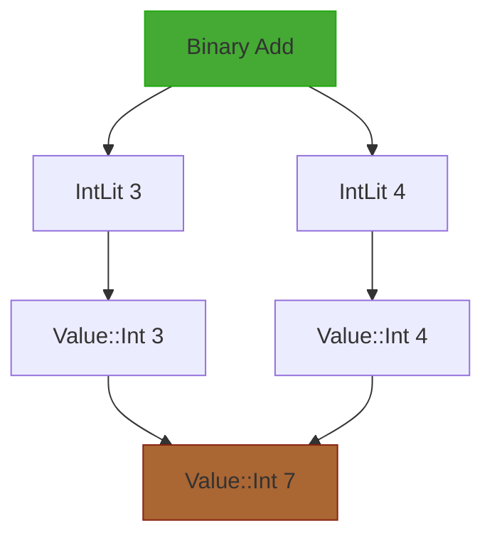
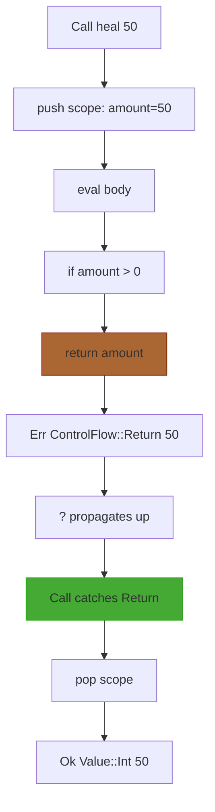

# Act 3 — Casting the Spell

> *The runes are carved. The incantation is deciphered. Now — speak the words and watch reality bend.*

In this act you build the **spell caster** — the tree-walking evaluator that breathes life into your AST. By the end, you'll feed a parsed program into the evaluator and watch variables bind, functions execute, arrays iterate, and strings interpolate. The dungeon awakens.

This is the final stage of the interpreter pipeline defined in the design spec (§1):

```
Source text (.rune file)
  → Lexer (chars → tokens)              ← Act 1
    → Parser (tokens → AST)             ← Act 2
      → Evaluator (AST → side effects)  ← you are here
```

**Prerequisites:** Acts 1 and 2 complete — you have a working lexer and parser that produce an AST. You understand Rust enums, pattern matching, `Box<T>`, `Vec<T>`, `HashMap`, `Result`, and the `?` operator.

**What you'll learn:**
- Tree-walking evaluation — the simplest execution model
- Scope chains with `Vec<HashMap>` — how variables live and die
- `Result` for control flow — using Rust's error system to implement `return` unwinding
- `Rc<RefCell<T>>` — shared mutable state for arrays and objects
- Closureless function calls with parameter binding
- Built-in functions bridging Rust and Runescript
- Runtime string interpolation

**Estimated time:** 6–10 hours across all 8 stages.

**How tree-walking works:** The evaluator receives an AST node, looks at what kind it is, recursively evaluates its children, and produces a `Value`. An `IntLit(42)` node returns `Value::Int(42)`. A `Binary(Add, left, right)` node evaluates `left`, evaluates `right`, adds them, and returns the result. It's the most direct execution model possible — no bytecode, no compilation, just walking the tree.



**The grimoire metaphor:** Every spell caster needs a grimoire — a book of known names and their meanings. In our interpreter, the grimoire is the **environment**: a stack of scopes where each scope maps variable names to values. When you write `let hp = 100`, the grimoire records that `hp` means `100`. When you enter a function, a new page is added to the grimoire. When you leave, that page is torn out.

---

## Stage 15: The Grimoire — Medium

**Goal:** Implement the `Environment` struct — a scope chain that supports defining, getting, and setting variables across nested scopes.

**Spec reference:** §6.2 (Environment — lexical scoping with scope chain)

**New Rust concept(s):** `Vec<HashMap<String, T>>` as a scope stack, searching from inner to outer scope, `std::collections::HashMap`

### Why this stage

Before we can evaluate *anything*, we need somewhere to store variables. The expression `hp + 10` requires looking up `hp` in the environment. The statement `let hp = 100` requires storing `hp`. Function calls require pushing a new scope for parameters and popping it when the function returns.

The spec (§6.2) defines five operations:
- `define(name, value)` — create a binding in the **current** (innermost) scope
- `get(name)` — search from innermost scope outward, return the first match
- `set(name, value)` — search from innermost scope outward, update the first match
- `push_scope()` — add a new empty scope on top
- `pop_scope()` — remove the topmost scope

This is called a **scope chain** — a stack of dictionaries. Inner scopes shadow outer ones. When you enter a block `{ ... }`, a new scope is pushed. When you leave, it's popped, and all variables declared inside vanish.

### Python/TS equivalent

In Python, you'd use a list of dicts:

```python
class Environment:
    def __init__(self):
        self.scopes = [{}]  # start with one global scope

    def define(self, name, value):
        self.scopes[-1][name] = value  # current scope

    def get(self, name):
        for scope in reversed(self.scopes):  # inner to outer
            if name in scope:
                return scope[name]
        raise NameError(f"Undefined variable '{name}'")

    def set(self, name, value):
        for scope in reversed(self.scopes):
            if name in scope:
                scope[name] = value
                return
        raise NameError(f"Undefined variable '{name}'")

    def push_scope(self):
        self.scopes.append({})

    def pop_scope(self):
        self.scopes.pop()
```

The Rust version is structurally identical — `Vec<HashMap<String, Value>>` instead of `list[dict[str, Any]]`.

### The Code

First, we need the `Value` type that the environment stores. Create `src/value.rs` — this defines the runtime values from spec §6.1:

Right now we have an AST that describes *what* a program looks like, but no way to represent *what it produces*. The evaluator needs a type for runtime results — the actual `100` that `IntLit(100)` evaluates to, the `"hello"` that a string literal produces, the function object that `fn heal(...)` creates.

```rust
// src/value.rs
// Runtime values — the essence of runes.
// Every expression in Runescript evaluates to one of these.

use std::collections::HashMap;
use std::fmt;

use crate::ast::Stmt;

/// A runtime value in Runescript (§6.1).
/// This is what variables hold, what expressions produce,
/// and what functions return.
#[derive(Debug, Clone)]
pub enum Value {
    /// Integer: 42, -7, 0
    Int(i64),
    /// String: "hello", "HP: {hp}"
    Str(String),
    /// Boolean: true, false
    Bool(bool),
    /// Array: [1, 2, 3]
    Array(Vec<Value>),
    /// The absence of a value
    Nil,
    /// A user-defined function (name, parameter names, body statements)
    Function {
        name: String,
        params: Vec<String>,
        body: Vec<Stmt>,
    },
    /// A simple key-value object (for hunter.hp style access)
    Object(HashMap<String, Value>),
}
```

Let's unpack what's new:

- `Vec<Value>` inside `Array` — a vector of values. Arrays can hold mixed types in Runescript (it's dynamically typed), so `[1, "two", true]` is valid.
- `Function { name, params, body }` — a **struct variant** inside an enum. Unlike tuple variants like `Int(i64)`, struct variants have named fields. This stores everything needed to call the function later.
- `HashMap<String, Value>` inside `Object` — a simple key-value map for field access like `hunter.hp`.
- We derive `Clone` but not `PartialEq` — comparing functions and objects for equality is complex and we don't need it yet.
- `use crate::ast::Stmt` — the function body is a `Vec<Stmt>`, so we need the AST types. This creates a dependency: `value.rs` depends on `ast.rs`.

Now add a `Display` implementation so values can be printed nicely:

```rust
/// Display a Value as a human-readable string.
/// This is what `print()` uses and what the REPL shows.
impl fmt::Display for Value {
    fn fmt(&self, f: &mut fmt::Formatter<'_>) -> fmt::Result {
        match self {
            Value::Int(n) => write!(f, "{}", n),
            Value::Str(s) => write!(f, "{}", s),
            Value::Bool(b) => write!(f, "{}", b),
            Value::Nil => write!(f, "nil"),
            Value::Array(items) => {
                write!(f, "[")?;
                for (i, item) in items.iter().enumerate() {
                    if i > 0 {
                        write!(f, ", ")?;
                    }
                    write!(f, "{}", item)?;
                }
                write!(f, "]")
            }
            Value::Function { name, .. } => write!(f, "<fn {}>", name),
            Value::Object(map) => {
                write!(f, "{{")?;
                for (i, (key, val)) in map.iter().enumerate() {
                    if i > 0 {
                        write!(f, ", ")?;
                    }
                    write!(f, "{}: {}", key, val)?;
                }
                write!(f, "}}")
            }
        }
    }
}
```

- `impl fmt::Display for Value` — implements the `Display` trait, which is what `{}` uses in format strings (as opposed to `{:?}` which uses `Debug`). This is like Python's `__str__` method.
- `write!(f, ...)` — writes formatted text to the formatter. The `?` propagates any write errors.
- `items.iter().enumerate()` — iterates with index. Like Python's `enumerate()`.
- `..` in `Function { name, .. }` — ignores the other fields. We only need the name for display.

Now create `src/environment.rs` — the grimoire itself:

Right now we have `Value` types but nowhere to store them. When the evaluator processes `let hp = 100`, it needs a place to record that `hp` maps to `Value::Int(100)` — and when it later encounters `hp + 10`, it needs to find that mapping again, even across nested scopes.

```rust
// src/environment.rs
// The grimoire — a scope chain for variable storage.
// Each scope is a HashMap<String, Value>. Scopes are stacked:
// the innermost scope is searched first, then outward to the global scope.

use std::collections::HashMap;

use crate::value::Value;

/// The grimoire: a stack of scopes for variable lookup.
/// The last element in `scopes` is the innermost (current) scope.
pub struct Environment {
    scopes: Vec<HashMap<String, Value>>,
}

impl Environment {
    /// Create a new environment with a single global scope.
    pub fn new() -> Self {
        Environment {
            scopes: vec![HashMap::new()],
        }
    }

    /// Define a variable in the current (innermost) scope.
    /// If the name already exists in this scope, it is overwritten.
    pub fn define(&mut self, name: &str, value: Value) {
        // .last_mut() returns Option<&mut HashMap> — the innermost scope.
        // .unwrap() is safe because we always have at least one scope.
        self.scopes.last_mut().unwrap().insert(name.to_string(), value);
    }

    /// Look up a variable by name, searching from innermost scope outward.
    /// Returns None if the variable is not defined in any scope.
    pub fn get(&self, name: &str) -> Option<&Value> {
        // Search from the innermost scope (last) to the outermost (first).
        // .iter().rev() gives us an iterator that goes backwards.
        for scope in self.scopes.iter().rev() {
            if let Some(val) = scope.get(name) {
                return Some(val);
            }
        }
        None
    }

    /// Update an existing variable, searching from innermost scope outward.
    /// Returns true if the variable was found and updated, false if undefined.
    pub fn set(&mut self, name: &str, value: Value) -> bool {
        // Search from innermost to outermost, update the first match.
        for scope in self.scopes.iter_mut().rev() {
            if scope.contains_key(name) {
                scope.insert(name.to_string(), value);
                return true;
            }
        }
        false
    }

    /// Push a new empty scope onto the stack.
    /// Called when entering a block, function call, or loop body.
    pub fn push_scope(&mut self) {
        self.scopes.push(HashMap::new());
    }

    /// Pop the innermost scope off the stack.
    /// Called when leaving a block, function call, or loop body.
    /// All variables defined in that scope are discarded.
    pub fn pop_scope(&mut self) {
        // Never pop the global scope — that would leave us with nothing.
        if self.scopes.len() > 1 {
            self.scopes.pop();
        }
    }
}
```

Key details:

- `vec![HashMap::new()]` — creates a `Vec` with one element: an empty HashMap. This is the global scope. The `vec![]` macro is shorthand for creating a vector with initial elements.
- `.last_mut().unwrap()` — gets a mutable reference to the last element. `last_mut()` returns `Option<&mut HashMap>` because the vec might be empty. We `.unwrap()` because we guarantee at least one scope exists.
- `.iter().rev()` — iterates in reverse order (innermost scope first). This is how shadowing works: if both the inner and outer scope define `hp`, the inner one is found first.
- `.iter_mut().rev()` — same but with mutable references, needed for `set()` because we modify the scope.
- `name.to_string()` — converts `&str` to `String` for HashMap insertion. The HashMap owns its keys, so we need an owned `String`, not a borrowed `&str`.
- The guard in `pop_scope` (`if self.scopes.len() > 1`) prevents accidentally removing the global scope. This is a safety net — correct code should never try to pop the global scope.

Now we need the AST types that `value.rs` references. Create `src/ast.rs` with the types from spec §4:

```rust
// src/ast.rs
// AST node types — the spell structure.
// These are produced by the parser (Act 2) and consumed by the evaluator (Act 3).

/// An expression — something that produces a value.
#[derive(Debug, Clone)]
pub enum Expr {
    /// Integer literal: 42
    IntLit(i64),
    /// String literal with possible {interpolation} markers: "HP: {hp}"
    StringLit(String),
    /// Boolean literal: true, false
    BoolLit(bool),
    /// Nil literal
    NilLit,
    /// Variable reference: hp, trap_armed
    Ident(String),
    /// Array literal: [1, 2, 3]
    Array(Vec<Expr>),
    /// Index expression: arr[0]
    Index(Box<Expr>, Box<Expr>),
    /// Unary operation: -x, !flag
    Unary(UnaryOp, Box<Expr>),
    /// Binary operation: a + b, x == y
    Binary(BinOp, Box<Expr>, Box<Expr>),
    /// Function call: print("hello"), heal(50)
    Call(Box<Expr>, Vec<Expr>),
    /// Field access: hunter.hp
    FieldAccess(Box<Expr>, String),
    /// Assignment: hp = 50, arr[0] = 10
    Assign(Box<Expr>, Box<Expr>),
}

/// Unary operators
#[derive(Debug, Clone)]
pub enum UnaryOp {
    /// Arithmetic negation: -x
    Neg,
    /// Logical not: !flag
    Not,
}

/// Binary operators
#[derive(Debug, Clone)]
pub enum BinOp {
    Add, Sub, Mul, Div, Mod,       // arithmetic
    Eq, Neq, Lt, LtEq, Gt, GtEq,  // comparison
    And, Or,                        // logical
}

/// A statement — something that performs an action.
#[derive(Debug, Clone)]
pub enum Stmt {
    /// Expression statement: print("hello")
    ExprStmt(Expr),
    /// Variable declaration: let hp = 100
    Let(String, Expr),
    /// Function declaration: fn heal(amount) { ... }
    FnDecl(String, Vec<String>, Vec<Stmt>),
    /// Conditional: if cond { ... } else { ... }
    If(Expr, Vec<Stmt>, Option<Vec<Stmt>>),
    /// While loop: while cond { ... }
    While(Expr, Vec<Stmt>),
    /// For-in loop: for item in list { ... }
    For(String, Expr, Vec<Stmt>),
    /// Return from function: return expr
    Return(Option<Expr>),
    /// Block: { ... }
    Block(Vec<Stmt>),
}
```

These types come directly from the spec (§4). The parser (Act 2) produces these; the evaluator (this act) consumes them. Key points:

- `Box<Expr>` — a heap-allocated pointer to an `Expr`. Required because `Expr` is recursive (a `Binary` contains two `Expr`s). Without `Box`, the struct would be infinitely sized. You learned about `Box` in Act 2.
- `Vec<Stmt>` — a block body is a list of statements. Function bodies, if-branches, while-bodies, and for-bodies all use this.
- `Option<Vec<Stmt>>` in `If` — the else branch is optional. `Some(stmts)` means there's an else block, `None` means there isn't.
- `Option<Expr>` in `Return` — `return 42` has an expression, bare `return` doesn't.

Add tests for the environment. Append to `src/environment.rs`:

```rust
#[cfg(test)]
mod tests {
    use super::*;

    #[test]
    fn define_and_get() {
        let mut env = Environment::new();
        env.define("hp", Value::Int(100));
        assert!(matches!(env.get("hp"), Some(Value::Int(100))));
    }

    #[test]
    fn get_undefined_returns_none() {
        let env = Environment::new();
        assert!(env.get("hp").is_none());
    }

    #[test]
    fn set_existing_variable() {
        let mut env = Environment::new();
        env.define("hp", Value::Int(100));
        assert!(env.set("hp", Value::Int(80)));
        assert!(matches!(env.get("hp"), Some(Value::Int(80))));
    }

    #[test]
    fn set_undefined_returns_false() {
        let mut env = Environment::new();
        assert!(!env.set("hp", Value::Int(100)));
    }

    #[test]
    fn inner_scope_shadows_outer() {
        let mut env = Environment::new();
        env.define("hp", Value::Int(100));
        env.push_scope();
        env.define("hp", Value::Int(50)); // shadows outer hp
        assert!(matches!(env.get("hp"), Some(Value::Int(50))));
        env.pop_scope();
        assert!(matches!(env.get("hp"), Some(Value::Int(100)))); // outer restored
    }

    #[test]
    fn inner_scope_sees_outer_variables() {
        let mut env = Environment::new();
        env.define("hp", Value::Int(100));
        env.push_scope();
        // Inner scope can see outer variables
        assert!(matches!(env.get("hp"), Some(Value::Int(100))));
    }

    #[test]
    fn set_updates_outer_scope() {
        let mut env = Environment::new();
        env.define("hp", Value::Int(100));
        env.push_scope();
        // set() should update the outer scope's hp, not create a new one
        env.set("hp", Value::Int(80));
        env.pop_scope();
        assert!(matches!(env.get("hp"), Some(Value::Int(80))));
    }

    #[test]
    fn pop_scope_discards_inner_variables() {
        let mut env = Environment::new();
        env.push_scope();
        env.define("temp", Value::Int(42));
        assert!(env.get("temp").is_some());
        env.pop_scope();
        assert!(env.get("temp").is_none()); // gone
    }

    #[test]
    fn cannot_pop_global_scope() {
        let mut env = Environment::new();
        env.define("hp", Value::Int(100));
        env.pop_scope(); // should be a no-op
        assert!(matches!(env.get("hp"), Some(Value::Int(100))));
    }
}
```

- `matches!(expr, pattern)` — a macro that returns `true` if the expression matches the pattern. Like a one-line `match` that returns a `bool`. Useful in assertions when you want to check the shape of an enum variant.

### Common mistakes

- **Forgetting `to_string()` when inserting into the HashMap** — `HashMap<String, Value>` needs owned `String` keys. If you pass `&str`, the compiler says: "expected `String`, found `&str`."
- **Searching scopes front-to-back instead of back-to-front** — `self.scopes.iter()` goes from outermost to innermost. You need `.rev()` to search innermost first. Without it, inner scopes never shadow outer ones.
- **Using `get` when you need `set`** — `get` returns `&Value` (immutable reference). You can't modify through it. `set` takes a new value and replaces the old one.
- **Popping the global scope** — if you pop all scopes, the next `define` or `get` will panic on `.last_mut().unwrap()`. The guard in `pop_scope` prevents this.

### Verify it works

```bash
cd ~/juk/runescript
cargo test
```

All environment tests should pass. The `value.rs` and `ast.rs` files compile but have no tests yet — they're data types that will be tested through the evaluator.

The grimoire can store and retrieve names across nested scopes. Now we need the spell caster itself — the evaluator that walks the AST, starting with the simplest incantations: literals and arithmetic.

### Checkpoint

You now have three new files:
- **`src/ast.rs`** — AST node types from spec §4
- **`src/value.rs`** — Runtime value enum from spec §6.1 with `Display`
- **`src/environment.rs`** — Scope chain from spec §6.2 with 9 tests

The grimoire is ready. Time to start casting spells.

---

## Stage 16: Simple Incantations — Medium

**Goal:** Create the evaluator that handles literal values and arithmetic expressions — the simplest spells that produce results from pure computation.

**Spec reference:** §6.1 (Runtime Values), §6.3 (Evaluation Rules — `IntLit`, `BoolLit`, `NilLit`, `Binary` arithmetic, `Unary` negation)

**New Rust concept(s):** Recursive evaluation, `match` on nested enums, returning `Result` from every evaluation, custom error types, the `Box` dereference pattern `*expr`

### Why this stage

The evaluator's core loop is: receive an AST node, evaluate it, return a `Value`. Literals are the base case — `IntLit(42)` just returns `Value::Int(42)`. Arithmetic is the first recursive case — `Binary(Add, left, right)` evaluates both children and adds the results.

Once this works, you have a calculator. Not very exciting yet, but it proves the tree-walking architecture works. Every future stage adds more node types to the same recursive function.

### Python/TS equivalent

```python
def eval_expr(expr, env):
    match expr:
        case IntLit(n):
            return n
        case BoolLit(b):
            return b
        case NilLit():
            return None
        case Binary(Add, left, right):
            return eval_expr(left, env) + eval_expr(right, env)
        case Unary(Neg, operand):
            return -eval_expr(operand, env)
```

Rust's version is the same structure — a big `match` on the expression type. The difference: Rust forces you to handle every variant (exhaustive matching) and uses `Result` for errors instead of exceptions.

### The Code

First, create `src/error.rs` — the error type that the evaluator returns when a spell misfires:

```rust
// src/error.rs
// Miscast spells — runtime errors with source location.

use std::fmt;

/// A runtime error with a human-readable message.
/// In a full implementation, this would carry a Span for line/column.
/// For now, we keep it simple with just a message string.
#[derive(Debug, Clone)]
pub struct RuneError {
    pub message: String,
}

impl RuneError {
    pub fn new(msg: impl Into<String>) -> Self {
        RuneError { message: msg.into() }
    }
}

impl fmt::Display for RuneError {
    fn fmt(&self, f: &mut fmt::Formatter<'_>) -> fmt::Result {
        write!(f, "Runtime error: {}", self.message)
    }
}
```

- `impl Into<String>` — a generic parameter that accepts anything convertible to `String`. This means you can call `RuneError::new("message")` with a `&str` or `RuneError::new(format!("..."))` with a `String`. It's a convenience pattern you'll see throughout Rust libraries.
- We keep the error simple for now — just a message. The spec (§8.1) defines `RuneError` with a `Span`, but we'll add that later. Getting the evaluator working is more important than perfect error messages.

Now create `src/evaluator.rs` — the spell caster:

Right now we have an environment that can store values and an AST that describes programs, but nothing that connects them — no engine that reads a tree node and produces a result. We need the evaluator: the recursive heart that walks each node, evaluates its children, and returns a `Value`.

```rust
// src/evaluator.rs
// The spell caster — walks the AST and produces Values.

use crate::ast::{Expr, Stmt, BinOp, UnaryOp};
use crate::environment::Environment;
use crate::error::RuneError;
use crate::value::Value;

/// The spell caster. Holds the environment (grimoire) and evaluates AST nodes.
pub struct Evaluator {
    pub env: Environment,
}

impl Evaluator {
    /// Create a new evaluator with an empty environment.
    pub fn new() -> Self {
        Evaluator {
            env: Environment::new(),
        }
    }

    /// Evaluate a single expression, returning a Value or an error.
    pub fn eval_expr(&mut self, expr: &Expr) -> Result<Value, RuneError> {
        match expr {
            // --- Literals: the base cases ---
            // These just wrap the AST value in a runtime Value.

            Expr::IntLit(n) => Ok(Value::Int(*n)),

            Expr::BoolLit(b) => Ok(Value::Bool(*b)),

            Expr::NilLit => Ok(Value::Nil),

            Expr::StringLit(s) => {
                // For now, return the raw string. Stage 22 adds interpolation.
                Ok(Value::Str(s.clone()))
            }

            // --- Unary operations ---

            Expr::Unary(op, operand) => {
                let val = self.eval_expr(operand)?;
                match (op, &val) {
                    (UnaryOp::Neg, Value::Int(n)) => Ok(Value::Int(-n)),
                    (UnaryOp::Not, Value::Bool(b)) => Ok(Value::Bool(!b)),
                    (UnaryOp::Neg, _) => Err(RuneError::new(
                        format!("Cannot negate {}", type_name(&val))
                    )),
                    (UnaryOp::Not, _) => Err(RuneError::new(
                        format!("Cannot apply '!' to {}", type_name(&val))
                    )),
                }
            }

            // --- Binary operations ---

            Expr::Binary(op, left, right) => {
                let lhs = self.eval_expr(left)?;
                let rhs = self.eval_expr(right)?;
                eval_binary(op, &lhs, &rhs)
            }

            // Placeholder for nodes we haven't implemented yet.
            // Each subsequent stage fills in more arms.
            _ => Err(RuneError::new(format!(
                "Expression type not yet implemented: {:?}", expr
            ))),
        }
    }

    /// Evaluate a single statement.
    pub fn eval_stmt(&mut self, stmt: &Stmt) -> Result<Value, RuneError> {
        match stmt {
            Stmt::ExprStmt(expr) => self.eval_expr(expr),

            // Placeholder for statement types we haven't implemented yet.
            _ => Err(RuneError::new(format!(
                "Statement type not yet implemented: {:?}", stmt
            ))),
        }
    }

    /// Evaluate a list of statements (a program or block body).
    /// Returns the value of the last statement, or Nil if empty.
    pub fn eval_program(&mut self, stmts: &[Stmt]) -> Result<Value, RuneError> {
        let mut result = Value::Nil;
        for stmt in stmts {
            result = self.eval_stmt(stmt)?;
        }
        Ok(result)
    }
}
```

Let's unpack the key patterns:

- `pub fn eval_expr(&mut self, expr: &Expr) -> Result<Value, RuneError>` — the core signature. Takes a reference to an expression (`&Expr`), returns either a `Value` or a `RuneError`. The `&mut self` is needed because evaluation can modify the environment (variable assignment, function definitions).
- `Expr::IntLit(n) => Ok(Value::Int(*n))` — the simplest case. `*n` dereferences the `i64` from the pattern match. Since `i64` implements `Copy`, this is a cheap copy, not a move.
- `self.eval_expr(operand)?` — **recursive evaluation**. To evaluate a unary expression, first evaluate its operand. The `?` propagates any error from the inner evaluation.
- `match (op, &val)` — matching on a **tuple**. This lets us check both the operator and the value type in one match. `(UnaryOp::Neg, Value::Int(n))` matches negation of an integer.
- `eval_binary(op, &lhs, &rhs)` — we extract binary evaluation into a standalone function (below) to keep `eval_expr` readable.
- `&[Stmt]` in `eval_program` — a **slice** reference. This accepts both `&Vec<Stmt>` and `&[Stmt]` — it's the idiomatic way to take a read-only list parameter in Rust.

Now the binary operation evaluator — a standalone function outside the `impl` block:

```rust
/// Evaluate a binary operation on two values.
fn eval_binary(op: &BinOp, lhs: &Value, rhs: &Value) -> Result<Value, RuneError> {
    // Arithmetic: both operands must be Int
    match (op, lhs, rhs) {
        // --- Integer arithmetic ---
        (BinOp::Add, Value::Int(a), Value::Int(b)) => Ok(Value::Int(a + b)),
        (BinOp::Sub, Value::Int(a), Value::Int(b)) => Ok(Value::Int(a - b)),
        (BinOp::Mul, Value::Int(a), Value::Int(b)) => Ok(Value::Int(a * b)),
        (BinOp::Div, Value::Int(_), Value::Int(0)) => {
            Err(RuneError::new("Division by zero"))
        }
        (BinOp::Div, Value::Int(a), Value::Int(b)) => Ok(Value::Int(a / b)),
        (BinOp::Mod, Value::Int(_), Value::Int(0)) => {
            Err(RuneError::new("Modulo by zero"))
        }
        (BinOp::Mod, Value::Int(a), Value::Int(b)) => Ok(Value::Int(a % b)),

        // --- String concatenation ---
        // "hello" + " world" => "hello world"
        (BinOp::Add, Value::Str(a), Value::Str(b)) => {
            Ok(Value::Str(format!("{}{}", a, b)))
        }

        // --- Comparison operators (integers) ---
        (BinOp::Lt, Value::Int(a), Value::Int(b)) => Ok(Value::Bool(a < b)),
        (BinOp::LtEq, Value::Int(a), Value::Int(b)) => Ok(Value::Bool(a <= b)),
        (BinOp::Gt, Value::Int(a), Value::Int(b)) => Ok(Value::Bool(a > b)),
        (BinOp::GtEq, Value::Int(a), Value::Int(b)) => Ok(Value::Bool(a >= b)),

        // --- Equality (works on any matching types) ---
        (BinOp::Eq, Value::Int(a), Value::Int(b)) => Ok(Value::Bool(a == b)),
        (BinOp::Eq, Value::Str(a), Value::Str(b)) => Ok(Value::Bool(a == b)),
        (BinOp::Eq, Value::Bool(a), Value::Bool(b)) => Ok(Value::Bool(a == b)),
        (BinOp::Eq, Value::Nil, Value::Nil) => Ok(Value::Bool(true)),
        (BinOp::Eq, _, _) => Ok(Value::Bool(false)), // different types are never equal

        (BinOp::Neq, _, _) => {
            // != is just the inverse of ==
            match eval_binary(&BinOp::Eq, lhs, rhs)? {
                Value::Bool(b) => Ok(Value::Bool(!b)),
                _ => unreachable!(),
            }
        }

        // --- Logical operators (handled in Stage 18) ---
        (BinOp::And, _, _) | (BinOp::Or, _, _) => {
            Err(RuneError::new("Logical operators not yet implemented"))
        }

        // --- Type mismatch ---
        _ => Err(RuneError::new(format!(
            "Cannot apply {:?} to {} and {}",
            op, type_name(lhs), type_name(rhs)
        ))),
    }
}

/// Return the type name of a Value (for error messages).
fn type_name(val: &Value) -> &'static str {
    match val {
        Value::Int(_) => "Int",
        Value::Str(_) => "Str",
        Value::Bool(_) => "Bool",
        Value::Array(_) => "Array",
        Value::Nil => "Nil",
        Value::Function { .. } => "Function",
        Value::Object(_) => "Object",
    }
}
```

Key patterns in `eval_binary`:

- **Triple match** — `match (op, lhs, rhs)` matches on the operator and both operand types simultaneously. This is the cleanest way to handle type-dependent operations. Each arm specifies exactly which combination it handles.
- **Division by zero** — checked *before* the normal division arm. Match arms are checked top to bottom, so `(BinOp::Div, Value::Int(_), Value::Int(0))` catches zero before `(BinOp::Div, Value::Int(a), Value::Int(b))` runs.
- **String concatenation** — `+` on two strings concatenates them. This is the only operator overload in Runescript.
- **Equality across types** — `Value::Int(1) == Value::Str("1")` is `false`. Different types are never equal (the catch-all `(BinOp::Eq, _, _)` arm).
- **`Neq` delegates to `Eq`** — instead of duplicating all the equality logic, we evaluate `==` and invert the result. `unreachable!()` is a macro that panics with "entered unreachable code" — we know `Eq` always returns a `Bool`, so this branch can never execute.
- `type_name` returns `&'static str` — a string slice that lives forever. String literals are always `'static`.

Add tests at the bottom of `src/evaluator.rs`:

```rust
#[cfg(test)]
mod tests {
    use super::*;
    use crate::ast::{Expr, BinOp, UnaryOp};

    /// Helper: evaluate an expression and return the Value.
    fn eval(expr: Expr) -> Result<Value, RuneError> {
        let mut evaluator = Evaluator::new();
        evaluator.eval_expr(&expr)
    }

    #[test]
    fn eval_int_literal() {
        let result = eval(Expr::IntLit(42)).unwrap();
        assert!(matches!(result, Value::Int(42)));
    }

    #[test]
    fn eval_bool_literal() {
        assert!(matches!(eval(Expr::BoolLit(true)).unwrap(), Value::Bool(true)));
        assert!(matches!(eval(Expr::BoolLit(false)).unwrap(), Value::Bool(false)));
    }

    #[test]
    fn eval_nil_literal() {
        assert!(matches!(eval(Expr::NilLit).unwrap(), Value::Nil));
    }

    #[test]
    fn eval_string_literal() {
        let result = eval(Expr::StringLit("hello".to_string())).unwrap();
        match result {
            Value::Str(s) => assert_eq!(s, "hello"),
            _ => panic!("Expected Str"),
        }
    }

    #[test]
    fn eval_addition() {
        // 3 + 4 = 7
        let expr = Expr::Binary(
            BinOp::Add,
            Box::new(Expr::IntLit(3)),
            Box::new(Expr::IntLit(4)),
        );
        assert!(matches!(eval(expr).unwrap(), Value::Int(7)));
    }

    #[test]
    fn eval_subtraction() {
        let expr = Expr::Binary(
            BinOp::Sub,
            Box::new(Expr::IntLit(10)),
            Box::new(Expr::IntLit(3)),
        );
        assert!(matches!(eval(expr).unwrap(), Value::Int(7)));
    }

    #[test]
    fn eval_multiplication() {
        let expr = Expr::Binary(
            BinOp::Mul,
            Box::new(Expr::IntLit(6)),
            Box::new(Expr::IntLit(7)),
        );
        assert!(matches!(eval(expr).unwrap(), Value::Int(42)));
    }

    #[test]
    fn eval_division() {
        let expr = Expr::Binary(
            BinOp::Div,
            Box::new(Expr::IntLit(10)),
            Box::new(Expr::IntLit(3)),
        );
        assert!(matches!(eval(expr).unwrap(), Value::Int(3))); // integer division
    }

    #[test]
    fn eval_division_by_zero() {
        let expr = Expr::Binary(
            BinOp::Div,
            Box::new(Expr::IntLit(10)),
            Box::new(Expr::IntLit(0)),
        );
        let err = eval(expr).unwrap_err();
        assert!(err.message.contains("Division by zero"));
    }

    #[test]
    fn eval_modulo() {
        let expr = Expr::Binary(
            BinOp::Mod,
            Box::new(Expr::IntLit(10)),
            Box::new(Expr::IntLit(3)),
        );
        assert!(matches!(eval(expr).unwrap(), Value::Int(1)));
    }

    #[test]
    fn eval_string_concatenation() {
        let expr = Expr::Binary(
            BinOp::Add,
            Box::new(Expr::StringLit("hello".to_string())),
            Box::new(Expr::StringLit(" world".to_string())),
        );
        match eval(expr).unwrap() {
            Value::Str(s) => assert_eq!(s, "hello world"),
            _ => panic!("Expected Str"),
        }
    }

    #[test]
    fn eval_negation() {
        let expr = Expr::Unary(UnaryOp::Neg, Box::new(Expr::IntLit(42)));
        assert!(matches!(eval(expr).unwrap(), Value::Int(-42)));
    }

    #[test]
    fn eval_not() {
        let expr = Expr::Unary(UnaryOp::Not, Box::new(Expr::BoolLit(true)));
        assert!(matches!(eval(expr).unwrap(), Value::Bool(false)));
    }

    #[test]
    fn eval_nested_arithmetic() {
        // (3 + 4) * 2 = 14
        let expr = Expr::Binary(
            BinOp::Mul,
            Box::new(Expr::Binary(
                BinOp::Add,
                Box::new(Expr::IntLit(3)),
                Box::new(Expr::IntLit(4)),
            )),
            Box::new(Expr::IntLit(2)),
        );
        assert!(matches!(eval(expr).unwrap(), Value::Int(14)));
    }

    #[test]
    fn eval_type_mismatch() {
        // 42 + "hello" should error
        let expr = Expr::Binary(
            BinOp::Add,
            Box::new(Expr::IntLit(42)),
            Box::new(Expr::StringLit("hello".to_string())),
        );
        assert!(eval(expr).is_err());
    }

    #[test]
    fn eval_equality() {
        let expr = Expr::Binary(
            BinOp::Eq,
            Box::new(Expr::IntLit(42)),
            Box::new(Expr::IntLit(42)),
        );
        assert!(matches!(eval(expr).unwrap(), Value::Bool(true)));

        let expr = Expr::Binary(
            BinOp::Eq,
            Box::new(Expr::IntLit(42)),
            Box::new(Expr::IntLit(7)),
        );
        assert!(matches!(eval(expr).unwrap(), Value::Bool(false)));
    }

    #[test]
    fn eval_comparison() {
        let expr = Expr::Binary(
            BinOp::Lt,
            Box::new(Expr::IntLit(3)),
            Box::new(Expr::IntLit(5)),
        );
        assert!(matches!(eval(expr).unwrap(), Value::Bool(true)));
    }
}
```

### Common mistakes

- **Forgetting `*n` when matching `IntLit(n)`** — the pattern binds `n` as `&i64` (a reference). `Value::Int(n)` expects `i64`. The `*` dereferences it. For `Copy` types like `i64` and `bool`, this is automatic in many contexts, but explicit is clearer.
- **Not handling division by zero** — Rust's integer division panics on divide-by-zero. You must check before dividing, or your interpreter crashes instead of producing a nice error.
- **Matching `(BinOp::Div, Value::Int(a), Value::Int(b))` before the zero check** — match arms are checked top to bottom. Put the zero check first.
- **Forgetting the `?` on recursive `eval_expr` calls** — without `?`, you get `Result<Value, RuneError>` instead of `Value`, and the next operation fails to type-check.

### Verify it works

```bash
cd ~/juk/runescript
cargo test
```

All evaluator tests should pass. You now have a working calculator that handles integers, booleans, strings, nil, arithmetic, comparisons, and equality.

The spell caster can evaluate pure expressions — but every value is ephemeral, computed and forgotten. Next, we give the grimoire its purpose: variables that persist across statements.

### Checkpoint

New/updated files:
- **`src/error.rs`** — `RuneError` with message string
- **`src/evaluator.rs`** — `Evaluator` struct with `eval_expr`, `eval_stmt`, `eval_program`, plus `eval_binary` and `type_name` helpers. 17 tests.

The spell caster can evaluate pure expressions. Next: variables.

---

## Stage 17: Variables and Assignment — Medium

**Goal:** Evaluate `Let` statements, `Ident` lookups, and `Assign` expressions. Variables come alive — the grimoire records and recalls names.

**Spec reference:** §6.3 (Evaluation Rules — `Let`, `Ident`, `Assign`), §8.2 (Undefined variable error)

**New Rust concept(s):** Mutable borrowing through the evaluator, `Value::clone()` for variable reads, the difference between `define` (new binding) and `set` (update existing)

### Why this stage

Without variables, every expression is a one-shot calculation. Variables let us name values and reuse them — `let hp = 100` followed by `hp - 15` is the foundation of every program. This stage connects the evaluator to the environment we built in Stage 15.

Three operations:
1. **`Let(name, expr)`** — evaluate the expression, define the name in the current scope
2. **`Ident(name)`** — look up the name in the environment, error if undefined
3. **`Assign(target, expr)`** — evaluate the expression, update the target in the environment

### Python/TS equivalent

```python
def eval_stmt(stmt, env):
    match stmt:
        case Let(name, expr):
            env.define(name, eval_expr(expr, env))
        # ...

def eval_expr(expr, env):
    match expr:
        case Ident(name):
            val = env.get(name)
            if val is None:
                raise NameError(f"Undefined variable '{name}'")
            return val
        case Assign(Ident(name), value_expr):
            val = eval_expr(value_expr, env)
            if not env.set(name, val):
                raise NameError(f"Undefined variable '{name}'")
            return val
```

### The Code

Add the `Ident` and `Assign` arms to `eval_expr` in `src/evaluator.rs`. Replace the `_ => Err(...)` placeholder with these new arms (keep the placeholder at the end for still-unimplemented types):

```rust
    pub fn eval_expr(&mut self, expr: &Expr) -> Result<Value, RuneError> {
        match expr {
            // --- Literals (from Stage 16) ---
            Expr::IntLit(n) => Ok(Value::Int(*n)),
            Expr::BoolLit(b) => Ok(Value::Bool(*b)),
            Expr::NilLit => Ok(Value::Nil),
            Expr::StringLit(s) => Ok(Value::Str(s.clone())),

            // --- Unary (from Stage 16) ---
            Expr::Unary(op, operand) => {
                let val = self.eval_expr(operand)?;
                match (op, &val) {
                    (UnaryOp::Neg, Value::Int(n)) => Ok(Value::Int(-n)),
                    (UnaryOp::Not, Value::Bool(b)) => Ok(Value::Bool(!b)),
                    (UnaryOp::Neg, _) => Err(RuneError::new(
                        format!("Cannot negate {}", type_name(&val))
                    )),
                    (UnaryOp::Not, _) => Err(RuneError::new(
                        format!("Cannot apply '!' to {}", type_name(&val))
                    )),
                }
            }

            // --- Binary (from Stage 16) ---
            Expr::Binary(op, left, right) => {
                let lhs = self.eval_expr(left)?;
                let rhs = self.eval_expr(right)?;
                eval_binary(op, &lhs, &rhs)
            }

            // --- Variable lookup (NEW) ---
            Expr::Ident(name) => {
                match self.env.get(name) {
                    Some(val) => Ok(val.clone()),
                    None => Err(RuneError::new(
                        format!("Undefined variable '{}'", name)
                    )),
                }
            }

            // --- Assignment (NEW) ---
            Expr::Assign(target, value_expr) => {
                let val = self.eval_expr(value_expr)?;
                match target.as_ref() {
                    Expr::Ident(name) => {
                        if self.env.set(name, val.clone()) {
                            Ok(val)
                        } else {
                            Err(RuneError::new(
                                format!("Undefined variable '{}'", name)
                            ))
                        }
                    }
                    _ => Err(RuneError::new("Invalid assignment target")),
                }
            }

            _ => Err(RuneError::new(format!(
                "Expression type not yet implemented: {:?}", expr
            ))),
        }
    }
```

Key details for the new arms:

- `val.clone()` in `Ident` — the environment returns `&Value` (a reference). We need an owned `Value` to return from the function. `.clone()` creates a deep copy. This is necessary because the environment still owns the original — we're giving the caller their own copy.
- `target.as_ref()` in `Assign` — `target` is `&Box<Expr>`. `.as_ref()` converts `&Box<Expr>` to `&Expr`, which we can then match on. This is a common pattern when working with `Box` in match expressions.
- `val.clone()` in `Assign` — we need the value twice: once to store in the environment (via `set`), once to return as the expression result. `set` takes ownership, so we clone for the return value. Assignment expressions return the assigned value — `x = 5` evaluates to `5`.
- The `Assign` arm only handles `Ident` targets for now. Stage 21 adds `Index` targets (`arr[0] = 10`) and Stage 22 adds `FieldAccess` targets (`hunter.hp = 80`).

Now add the `Let` arm to `eval_stmt`:

```rust
    pub fn eval_stmt(&mut self, stmt: &Stmt) -> Result<Value, RuneError> {
        match stmt {
            Stmt::ExprStmt(expr) => self.eval_expr(expr),

            // --- Variable declaration (NEW) ---
            Stmt::Let(name, expr) => {
                let val = self.eval_expr(expr)?;
                self.env.define(name, val);
                Ok(Value::Nil) // let statements don't produce a value
            }

            _ => Err(RuneError::new(format!(
                "Statement type not yet implemented: {:?}", stmt
            ))),
        }
    }
```

- `self.env.define(name, val)` — creates a new binding in the current scope. Unlike `set`, this doesn't search outer scopes — it always creates in the innermost scope. If `hp` already exists in this scope, it's overwritten.
- `Ok(Value::Nil)` — `let` statements don't produce a meaningful value. They're executed for their side effect (binding a name).

Add tests:

```rust
    #[test]
    fn eval_let_and_ident() {
        let mut evaluator = Evaluator::new();
        // let hp = 100
        let let_stmt = Stmt::Let("hp".to_string(), Expr::IntLit(100));
        evaluator.eval_stmt(&let_stmt).unwrap();

        // hp should now be 100
        let result = evaluator.eval_expr(&Expr::Ident("hp".to_string())).unwrap();
        assert!(matches!(result, Value::Int(100)));
    }

    #[test]
    fn eval_undefined_variable() {
        let mut evaluator = Evaluator::new();
        let result = evaluator.eval_expr(&Expr::Ident("hp".to_string()));
        assert!(result.is_err());
        assert!(result.unwrap_err().message.contains("Undefined variable"));
    }

    #[test]
    fn eval_assignment() {
        let mut evaluator = Evaluator::new();
        // let hp = 100
        evaluator.eval_stmt(&Stmt::Let("hp".to_string(), Expr::IntLit(100))).unwrap();

        // hp = 80
        let assign = Expr::Assign(
            Box::new(Expr::Ident("hp".to_string())),
            Box::new(Expr::IntLit(80)),
        );
        let result = evaluator.eval_expr(&assign).unwrap();
        assert!(matches!(result, Value::Int(80)));

        // hp should now be 80
        let result = evaluator.eval_expr(&Expr::Ident("hp".to_string())).unwrap();
        assert!(matches!(result, Value::Int(80)));
    }

    #[test]
    fn eval_assign_undefined_errors() {
        let mut evaluator = Evaluator::new();
        let assign = Expr::Assign(
            Box::new(Expr::Ident("hp".to_string())),
            Box::new(Expr::IntLit(80)),
        );
        assert!(evaluator.eval_expr(&assign).is_err());
    }

    #[test]
    fn eval_variable_in_expression() {
        let mut evaluator = Evaluator::new();
        // let hp = 100
        evaluator.eval_stmt(&Stmt::Let("hp".to_string(), Expr::IntLit(100))).unwrap();

        // hp - 15 = 85
        let expr = Expr::Binary(
            BinOp::Sub,
            Box::new(Expr::Ident("hp".to_string())),
            Box::new(Expr::IntLit(15)),
        );
        let result = evaluator.eval_expr(&expr).unwrap();
        assert!(matches!(result, Value::Int(85)));
    }

    #[test]
    fn eval_program_with_variables() {
        let mut evaluator = Evaluator::new();
        // let hp = 100
        // let damage = 15
        // hp = hp - damage
        let program = vec![
            Stmt::Let("hp".to_string(), Expr::IntLit(100)),
            Stmt::Let("damage".to_string(), Expr::IntLit(15)),
            Stmt::ExprStmt(Expr::Assign(
                Box::new(Expr::Ident("hp".to_string())),
                Box::new(Expr::Binary(
                    BinOp::Sub,
                    Box::new(Expr::Ident("hp".to_string())),
                    Box::new(Expr::Ident("damage".to_string())),
                )),
            )),
        ];
        evaluator.eval_program(&program).unwrap();

        let result = evaluator.eval_expr(&Expr::Ident("hp".to_string())).unwrap();
        assert!(matches!(result, Value::Int(85)));
    }
```

### Common mistakes

- **Forgetting `.clone()` on `env.get()` result** — `get` returns `&Value`. If you try to return it directly, the compiler says: "cannot return reference to temporary value." You need to clone it into an owned `Value`.
- **Using `define` instead of `set` for assignment** — `define` always creates in the current scope. If `hp` is defined in an outer scope and you `define` it in an inner scope, you've created a *new* variable that shadows the outer one instead of updating it. `set` searches outward and updates the first match.
- **Forgetting that assignment returns a value** — `hp = 80` evaluates to `80`. This matters for chained assignments and expression statements. If you return `Value::Nil` from assignment, things like `let x = y = 5` won't work correctly.
- **Not handling the `Assign` target correctly** — the target is `Box<Expr>`, not just a string. You need to match on `target.as_ref()` to check if it's an `Ident`. Later stages add `Index` and `FieldAccess` targets.

### Verify it works

```bash
cargo test
```

All tests should pass — the 17 from Stage 16 plus 6 new ones.

Variables live in the grimoire and expressions can read them. But the spell caster still walks a straight path — it can't choose between branches or repeat an action. Next, we add truthiness, logical operators, and control flow.

### Checkpoint

Updated `src/evaluator.rs`:
- `eval_expr` now handles `Ident` and `Assign`
- `eval_stmt` now handles `Let`
- 6 new tests covering variable declaration, lookup, assignment, and undefined variable errors

Variables work. The grimoire records names and recalls them. Next: making decisions.

---

## Stage 18: Truth and Consequence — Medium

**Goal:** Implement truthiness rules, logical operators (`&&`, `||`), and control flow (`if`/`else`, `while`). The spell caster can now make decisions and repeat actions.

**Spec reference:** §6.4 (Truthiness table), §6.3 (Evaluation Rules — `If`, `While`, `And`, `Or`)

**New Rust concept(s):** Short-circuit evaluation, the `is_truthy` helper pattern, `loop` with `break`, evaluating blocks with scope push/pop

### Why this stage

A language without conditionals is a calculator. A language without loops is a one-shot script. This stage adds both, turning Runescript into a real programming language. The key concept is **truthiness** — which values count as "true" in a boolean context.

The spec (§6.4) defines clear rules:

| Value | Truthy? |
|-------|---------|
| `Int(0)` | false |
| `Int(n)` where n != 0 | true |
| `Str("")` | false |
| `Str(s)` where s != "" | true |
| `Bool(b)` | b |
| `Nil` | false |
| `Array([])` | false |
| `Array(non-empty)` | true |
| `Function` | true |
| `Object` | true |

This is similar to Python's truthiness (where `0`, `""`, `[]`, `None` are falsy) and different from JavaScript (where `""` is falsy but `[]` is truthy).

### Python/TS equivalent

```python
def is_truthy(val):
    match val:
        case int(n): return n != 0
        case str(s): return s != ""
        case bool(b): return b
        case None: return False
        case list(items): return len(items) > 0
        case _: return True

def eval_stmt(stmt, env):
    match stmt:
        case If(cond, then_body, else_body):
            if is_truthy(eval_expr(cond, env)):
                eval_block(then_body, env)
            elif else_body:
                eval_block(else_body, env)
        case While(cond, body):
            while is_truthy(eval_expr(cond, env)):
                eval_block(body, env)
```

### The Code

First, add the `is_truthy` function to `src/evaluator.rs` (outside the `impl` block, near `type_name`):

```rust
/// Determine if a Value is truthy (§6.4).
/// Used by if/while conditions and logical operators.
fn is_truthy(val: &Value) -> bool {
    match val {
        Value::Bool(b) => *b,
        Value::Int(n) => *n != 0,
        Value::Str(s) => !s.is_empty(),
        Value::Nil => false,
        Value::Array(items) => !items.is_empty(),
        Value::Function { .. } => true,
        Value::Object(_) => true,
    }
}
```

This is a pure function — no side effects, no mutation. It just inspects a value and returns a boolean. The `*b` and `*n` dereference the matched references (pattern matching on `&Value` gives references to the inner data).

Now update `eval_binary` to handle logical operators with **short-circuit evaluation**. Replace the `And`/`Or` placeholder:

```rust
        // --- Logical AND (short-circuit) ---
        (BinOp::And, _, _) => {
            if !is_truthy(lhs) {
                Ok(lhs.clone()) // short-circuit: left is falsy, return it
            } else {
                Ok(rhs.clone()) // left is truthy, result is right operand
            }
        }

        // --- Logical OR (short-circuit) ---
        (BinOp::Or, _, _) => {
            if is_truthy(lhs) {
                Ok(lhs.clone()) // short-circuit: left is truthy, return it
            } else {
                Ok(rhs.clone()) // left is falsy, result is right operand
            }
        }
```

**Wait — there's a problem.** Short-circuit evaluation means the right operand should NOT be evaluated if the left operand determines the result. But in our current `eval_expr`, we evaluate *both* operands before calling `eval_binary`:

```rust
Expr::Binary(op, left, right) => {
    let lhs = self.eval_expr(left)?;   // always evaluated
    let rhs = self.eval_expr(right)?;  // always evaluated — wrong for && and ||!
    eval_binary(op, &lhs, &rhs)
}
```

We need to handle `&&` and `||` *before* evaluating the right side. Update the `Binary` arm in `eval_expr`:

```rust
            // --- Binary operations ---
            Expr::Binary(op, left, right) => {
                // Short-circuit logical operators: don't evaluate right
                // side if left side determines the result.
                match op {
                    BinOp::And => {
                        let lhs = self.eval_expr(left)?;
                        if !is_truthy(&lhs) {
                            return Ok(lhs); // false && anything = false
                        }
                        self.eval_expr(right) // true && x = x
                    }
                    BinOp::Or => {
                        let lhs = self.eval_expr(left)?;
                        if is_truthy(&lhs) {
                            return Ok(lhs); // true || anything = true
                        }
                        self.eval_expr(right) // false || x = x
                    }
                    _ => {
                        let lhs = self.eval_expr(left)?;
                        let rhs = self.eval_expr(right)?;
                        eval_binary(op, &lhs, &rhs)
                    }
                }
            }
```

And remove the `And`/`Or` arms from `eval_binary` since they're now handled in `eval_expr`. Replace them with:

```rust
        // And/Or are handled in eval_expr for short-circuit evaluation.
        // They should never reach eval_binary.
        (BinOp::And, _, _) | (BinOp::Or, _, _) => unreachable!(),
```

Now add `If` and `While` to `eval_stmt`. We also need a helper to evaluate a block (list of statements) with its own scope:

```rust
    /// Evaluate a block of statements in a new scope.
    /// The scope is pushed before and popped after, so variables
    /// declared inside the block don't leak out.
    fn eval_block(&mut self, stmts: &[Stmt]) -> Result<Value, RuneError> {
        self.env.push_scope();
        let mut result = Value::Nil;
        for stmt in stmts {
            result = self.eval_stmt(stmt)?;
        }
        self.env.pop_scope();
        Ok(result)
    }
```

This is the scope lifecycle: push before the block, pop after. Any `let` inside the block defines in the inner scope. When we pop, those definitions vanish. But `set` (assignment to existing variables) still reaches outer scopes.

Update `eval_stmt`:

```rust
    pub fn eval_stmt(&mut self, stmt: &Stmt) -> Result<Value, RuneError> {
        match stmt {
            Stmt::ExprStmt(expr) => self.eval_expr(expr),

            Stmt::Let(name, expr) => {
                let val = self.eval_expr(expr)?;
                self.env.define(name, val);
                Ok(Value::Nil)
            }

            // --- Block (NEW) ---
            Stmt::Block(stmts) => self.eval_block(stmts),

            // --- If/Else (NEW) ---
            Stmt::If(condition, then_body, else_body) => {
                let cond_val = self.eval_expr(condition)?;
                if is_truthy(&cond_val) {
                    self.eval_block(then_body)
                } else if let Some(else_stmts) = else_body {
                    self.eval_block(else_stmts)
                } else {
                    Ok(Value::Nil)
                }
            }

            // --- While loop (NEW) ---
            Stmt::While(condition, body) => {
                loop {
                    let cond_val = self.eval_expr(condition)?;
                    if !is_truthy(&cond_val) {
                        break;
                    }
                    self.eval_block(body)?;
                }
                Ok(Value::Nil)
            }

            _ => Err(RuneError::new(format!(
                "Statement type not yet implemented: {:?}", stmt
            ))),
        }
    }
```

Key details:

- `if is_truthy(&cond_val)` — evaluate the condition expression, then check truthiness. This is where the §6.4 rules come into play.
- `if let Some(else_stmts) = else_body` — pattern match on the `Option`. If there's an else branch, evaluate it. If not, return `Nil`.
- `loop { ... break; }` — the while loop is an infinite loop with a conditional break. We evaluate the condition at the top of each iteration. If it's falsy, we break. If it's truthy, we evaluate the body and loop again.
- `self.eval_block(body)?` — the `?` propagates any error from the body. If a statement inside the while loop errors, the whole while loop errors.
- Both `If` and `While` use `eval_block`, which pushes/pops a scope. This means variables declared inside `if { let x = 5 }` don't leak out.

Add tests:

```rust
    #[test]
    fn eval_if_true_branch() {
        let mut evaluator = Evaluator::new();
        evaluator.eval_stmt(&Stmt::Let("hp".to_string(), Expr::IntLit(100))).unwrap();

        // if true { hp = 50 }
        let if_stmt = Stmt::If(
            Expr::BoolLit(true),
            vec![Stmt::ExprStmt(Expr::Assign(
                Box::new(Expr::Ident("hp".to_string())),
                Box::new(Expr::IntLit(50)),
            ))],
            None,
        );
        evaluator.eval_stmt(&if_stmt).unwrap();

        let result = evaluator.eval_expr(&Expr::Ident("hp".to_string())).unwrap();
        assert!(matches!(result, Value::Int(50)));
    }

    #[test]
    fn eval_if_false_branch() {
        let mut evaluator = Evaluator::new();
        evaluator.eval_stmt(&Stmt::Let("hp".to_string(), Expr::IntLit(100))).unwrap();

        // if false { hp = 50 } else { hp = 75 }
        let if_stmt = Stmt::If(
            Expr::BoolLit(false),
            vec![Stmt::ExprStmt(Expr::Assign(
                Box::new(Expr::Ident("hp".to_string())),
                Box::new(Expr::IntLit(50)),
            ))],
            Some(vec![Stmt::ExprStmt(Expr::Assign(
                Box::new(Expr::Ident("hp".to_string())),
                Box::new(Expr::IntLit(75)),
            ))]),
        );
        evaluator.eval_stmt(&if_stmt).unwrap();

        let result = evaluator.eval_expr(&Expr::Ident("hp".to_string())).unwrap();
        assert!(matches!(result, Value::Int(75)));
    }

    #[test]
    fn eval_if_truthiness_int() {
        let mut evaluator = Evaluator::new();
        evaluator.eval_stmt(&Stmt::Let("result".to_string(), Expr::IntLit(0))).unwrap();

        // if 42 { result = 1 } — 42 is truthy
        let if_stmt = Stmt::If(
            Expr::IntLit(42),
            vec![Stmt::ExprStmt(Expr::Assign(
                Box::new(Expr::Ident("result".to_string())),
                Box::new(Expr::IntLit(1)),
            ))],
            None,
        );
        evaluator.eval_stmt(&if_stmt).unwrap();
        let result = evaluator.eval_expr(&Expr::Ident("result".to_string())).unwrap();
        assert!(matches!(result, Value::Int(1)));
    }

    #[test]
    fn eval_while_loop() {
        let mut evaluator = Evaluator::new();
        // let count = 0
        evaluator.eval_stmt(&Stmt::Let("count".to_string(), Expr::IntLit(0))).unwrap();

        // while count < 5 { count = count + 1 }
        let while_stmt = Stmt::While(
            Expr::Binary(
                BinOp::Lt,
                Box::new(Expr::Ident("count".to_string())),
                Box::new(Expr::IntLit(5)),
            ),
            vec![Stmt::ExprStmt(Expr::Assign(
                Box::new(Expr::Ident("count".to_string())),
                Box::new(Expr::Binary(
                    BinOp::Add,
                    Box::new(Expr::Ident("count".to_string())),
                    Box::new(Expr::IntLit(1)),
                )),
            ))],
        );
        evaluator.eval_stmt(&while_stmt).unwrap();

        let result = evaluator.eval_expr(&Expr::Ident("count".to_string())).unwrap();
        assert!(matches!(result, Value::Int(5)));
    }

    #[test]
    fn eval_while_false_never_executes() {
        let mut evaluator = Evaluator::new();
        evaluator.eval_stmt(&Stmt::Let("x".to_string(), Expr::IntLit(0))).unwrap();

        // while false { x = 99 }
        let while_stmt = Stmt::While(
            Expr::BoolLit(false),
            vec![Stmt::ExprStmt(Expr::Assign(
                Box::new(Expr::Ident("x".to_string())),
                Box::new(Expr::IntLit(99)),
            ))],
        );
        evaluator.eval_stmt(&while_stmt).unwrap();

        let result = evaluator.eval_expr(&Expr::Ident("x".to_string())).unwrap();
        assert!(matches!(result, Value::Int(0))); // unchanged
    }

    #[test]
    fn eval_block_scope_isolation() {
        let mut evaluator = Evaluator::new();
        evaluator.eval_stmt(&Stmt::Let("hp".to_string(), Expr::IntLit(100))).unwrap();

        // { let temp = 42 }
        let block = Stmt::Block(vec![
            Stmt::Let("temp".to_string(), Expr::IntLit(42)),
        ]);
        evaluator.eval_stmt(&block).unwrap();

        // temp should not be visible outside the block
        assert!(evaluator.eval_expr(&Expr::Ident("temp".to_string())).is_err());
        // hp should still be visible
        assert!(matches!(
            evaluator.eval_expr(&Expr::Ident("hp".to_string())).unwrap(),
            Value::Int(100)
        ));
    }

    #[test]
    fn eval_logical_and_short_circuit() {
        let mut evaluator = Evaluator::new();
        // false && (undefined_var) — should NOT error because && short-circuits
        let expr = Expr::Binary(
            BinOp::And,
            Box::new(Expr::BoolLit(false)),
            Box::new(Expr::Ident("undefined_var".to_string())),
        );
        let result = evaluator.eval_expr(&expr).unwrap();
        assert!(matches!(result, Value::Bool(false)));
    }

    #[test]
    fn eval_logical_or_short_circuit() {
        let mut evaluator = Evaluator::new();
        // true || (undefined_var) — should NOT error because || short-circuits
        let expr = Expr::Binary(
            BinOp::Or,
            Box::new(Expr::BoolLit(true)),
            Box::new(Expr::Ident("undefined_var".to_string())),
        );
        let result = evaluator.eval_expr(&expr).unwrap();
        assert!(matches!(result, Value::Bool(true)));
    }

    #[test]
    fn eval_logical_and_both_truthy() {
        let result = eval(Expr::Binary(
            BinOp::And,
            Box::new(Expr::IntLit(1)),
            Box::new(Expr::IntLit(42)),
        )).unwrap();
        // 1 && 42 => 42 (returns right operand when left is truthy)
        assert!(matches!(result, Value::Int(42)));
    }

    #[test]
    fn eval_logical_or_both_falsy() {
        let result = eval(Expr::Binary(
            BinOp::Or,
            Box::new(Expr::IntLit(0)),
            Box::new(Expr::NilLit),
        )).unwrap();
        // 0 || nil => nil (returns right operand when left is falsy)
        assert!(matches!(result, Value::Nil));
    }
```

### Common mistakes

- **Not short-circuiting `&&` and `||`** — if you evaluate both sides before checking, `false && undefined_var` will error instead of returning `false`. The short-circuit tests catch this.
- **Forgetting to push/pop scope in blocks** — without scope management, `let` inside an `if` body leaks into the outer scope. The `eval_block_scope_isolation` test catches this.
- **Infinite loops in `while`** — if your condition never becomes falsy, the evaluator hangs. Make sure your test conditions are bounded (like `count < 5`).
- **Returning the wrong value from `&&`/`||`** — `1 && 42` should return `42`, not `true`. Logical operators return the *operand* that determined the result, not a boolean. This matches Python's behavior.

### Verify it works

```bash
cargo test
```

All tests should pass — 17 from Stage 16, 6 from Stage 17, plus 10 new ones = 33 total.

The spell caster can branch and loop — the dungeon's traps can trigger conditionally, poison can tick over multiple rounds. But all logic lives in one flat scope. Next comes the hardest stage: summoning functions, with parameter binding and the return-unwinding ritual.

### Checkpoint

Updated `src/evaluator.rs`:
- Added `is_truthy` function implementing §6.4
- Updated `Binary` arm for short-circuit `&&`/`||`
- Added `eval_block` helper with scope push/pop
- `eval_stmt` now handles `Block`, `If`, `While`
- 10 new tests covering truthiness, if/else, while, scope isolation, and short-circuit logic

The spell caster can now make decisions and repeat actions. The dungeon is getting interesting. Next: summoning functions.

---

## Stage 19: The Summoning — Hard

**Goal:** Implement function declarations, function calls with parameter binding, and `return` with stack unwinding. This is the hardest stage — it introduces a new control flow mechanism that cuts across the entire evaluator.

**Spec reference:** §6.3 (Evaluation Rules — `FnDecl`, `Call`, `Return`), §4 (`Stmt::FnDecl`, `Expr::Call`, `Stmt::Return`)

**New Rust concept(s):** Using `Result` for control flow (not just errors), a `ControlFlow` enum that wraps both errors and returns, the `?` operator as an unwinding mechanism

### Why this stage

Functions are the backbone of any real program. The spec examples (§10.3, §10.5, §10.6) use functions extensively — `heal(amount)`, `boss_attack(hunter)`, `on_enter(hunter)`. Without functions, you can't write reusable code.

The tricky part is `return`. When a function executes `return 42`, it needs to immediately stop executing the function body — even if the `return` is nested inside an `if` inside a `while`. This is called **stack unwinding**, and it's the same problem that exceptions solve in Python/TS.

Our solution: use Rust's `Result` type to propagate returns. We'll create a `ControlFlow` enum:

```
enum ControlFlow {
    Return(Value),       // return statement — unwind to caller
    Error(RuneError),    // runtime error — unwind to top level
}
```

When `eval_stmt` encounters a `Return`, it returns `Err(ControlFlow::Return(value))`. The `?` operator propagates this up through all nested `eval_block` and `eval_stmt` calls until it reaches the `Call` handler, which catches it and extracts the return value.

This is a clever use of Rust's error propagation — we're using the error channel for non-error control flow. It's a common pattern in tree-walking interpreters.



### Python/TS equivalent

In Python, `return` is a language-level statement that the interpreter handles natively. In our Rust interpreter, we have to implement it ourselves:

```python
class ReturnException(Exception):
    def __init__(self, value):
        self.value = value

def eval_stmt(stmt, env):
    match stmt:
        case Return(expr):
            raise ReturnException(eval_expr(expr, env))
        case FnDecl(name, params, body):
            env.define(name, Function(name, params, body))

def eval_call(callee, args, env):
    fn = eval_expr(callee, env)
    new_env = Environment(parent=env)
    for param, arg in zip(fn.params, args):
        new_env.define(param, eval_expr(arg, env))
    try:
        eval_block(fn.body, new_env)
        return None  # no explicit return
    except ReturnException as e:
        return e.value
```

Our Rust version uses `Result<Value, ControlFlow>` instead of exceptions, but the pattern is identical.

### The Code

First, update `src/error.rs` to add the `ControlFlow` type:

Right now we can call functions and bind parameters, but we have no way to *leave* a function early. When `return 42` executes deep inside a nested `if` inside a `while`, it needs to unwind the entire call stack back to the caller. We need a signal that propagates through `Result`'s `?` operator — not a real error, but a control flow event.

```rust
// src/error.rs
// Miscast spells — runtime errors and control flow signals.

use std::fmt;

use crate::value::Value;

/// A runtime error with a human-readable message.
#[derive(Debug, Clone)]
pub struct RuneError {
    pub message: String,
}

impl RuneError {
    pub fn new(msg: impl Into<String>) -> Self {
        RuneError { message: msg.into() }
    }
}

impl fmt::Display for RuneError {
    fn fmt(&self, f: &mut fmt::Formatter<'_>) -> fmt::Result {
        write!(f, "Runtime error: {}", self.message)
    }
}

/// Control flow signals that propagate through the evaluator.
/// This uses Rust's Result/? mechanism for non-error control flow.
#[derive(Debug, Clone)]
pub enum ControlFlow {
    /// A return statement — unwind to the nearest function call.
    Return(Value),
    /// A runtime error — unwind to the top level.
    Error(RuneError),
}

impl From<RuneError> for ControlFlow {
    fn from(err: RuneError) -> Self {
        ControlFlow::Error(err)
    }
}
```

- `ControlFlow` is an enum with two variants: `Return(Value)` for return statements and `Error(RuneError)` for actual errors.
- `impl From<RuneError> for ControlFlow` — this trait implementation lets us use `?` on `Result<_, RuneError>` inside functions that return `Result<_, ControlFlow>`. The `?` operator automatically converts the error type using `From`. This means existing code that returns `RuneError` still works — it gets automatically wrapped in `ControlFlow::Error`.

Now update `src/evaluator.rs`. The key change: `eval_stmt` and `eval_block` now return `Result<Value, ControlFlow>` instead of `Result<Value, RuneError>`. The `eval_expr` stays as `Result<Value, RuneError>` because expressions don't contain `return` statements.

Here's the updated evaluator. Since this is a significant restructuring, here's the complete `eval_stmt`, `eval_block`, and the new `Call`/`FnDecl`/`Return` handling:

```rust
// At the top of evaluator.rs, update the imports:
use crate::error::{RuneError, ControlFlow};
```

Add a helper to convert `RuneError` results to `ControlFlow` results:

```rust
impl Evaluator {
    // ... (new, eval_expr unchanged) ...

    /// Evaluate a single expression, converting errors to ControlFlow.
    /// This is a convenience wrapper for use inside eval_stmt.
    fn eval_expr_cf(&mut self, expr: &Expr) -> Result<Value, ControlFlow> {
        self.eval_expr(expr).map_err(ControlFlow::Error)
    }
```

Now the updated `eval_stmt`:

```rust
    /// Evaluate a single statement.
    /// Returns ControlFlow::Return for return statements (caught by Call).
    pub fn eval_stmt(&mut self, stmt: &Stmt) -> Result<Value, ControlFlow> {
        match stmt {
            Stmt::ExprStmt(expr) => self.eval_expr_cf(expr),

            Stmt::Let(name, expr) => {
                let val = self.eval_expr_cf(expr)?;
                self.env.define(name, val);
                Ok(Value::Nil)
            }

            Stmt::Block(stmts) => self.eval_block(stmts),

            Stmt::If(condition, then_body, else_body) => {
                let cond_val = self.eval_expr_cf(condition)?;
                if is_truthy(&cond_val) {
                    self.eval_block(then_body)
                } else if let Some(else_stmts) = else_body {
                    self.eval_block(else_stmts)
                } else {
                    Ok(Value::Nil)
                }
            }

            Stmt::While(condition, body) => {
                loop {
                    let cond_val = self.eval_expr_cf(condition)?;
                    if !is_truthy(&cond_val) {
                        break;
                    }
                    self.eval_block(body)?;
                }
                Ok(Value::Nil)
            }

            // --- Function declaration (NEW) ---
            Stmt::FnDecl(name, params, body) => {
                let func = Value::Function {
                    name: name.clone(),
                    params: params.clone(),
                    body: body.clone(),
                };
                self.env.define(name, func);
                Ok(Value::Nil)
            }

            // --- Return statement (NEW) ---
            Stmt::Return(expr) => {
                let val = match expr {
                    Some(e) => self.eval_expr_cf(e)?,
                    None => Value::Nil,
                };
                // This is the magic: we return an "error" that isn't really
                // an error — it's a control flow signal that propagates up
                // through all nested blocks until Call catches it.
                Err(ControlFlow::Return(val))
            }

            _ => Err(ControlFlow::Error(RuneError::new(format!(
                "Statement type not yet implemented: {:?}", stmt
            )))),
        }
    }

    /// Evaluate a block of statements in a new scope.
    fn eval_block(&mut self, stmts: &[Stmt]) -> Result<Value, ControlFlow> {
        self.env.push_scope();
        let mut result = Value::Nil;
        for stmt in stmts {
            result = self.eval_stmt(stmt)?;
            // The ? above propagates ControlFlow::Return upward.
            // This is how return unwinds through nested blocks.
        }
        self.env.pop_scope();
        Ok(result)
    }
```

The `FnDecl` handler is simple — it just stores the function as a `Value::Function` in the environment. The function body isn't executed yet; it's saved for later when the function is called.

The `Return` handler is where the magic happens. `Err(ControlFlow::Return(val))` looks like an error, but it's really a signal. The `?` operator in `eval_block` propagates it upward through any number of nested blocks, if-statements, and while-loops until something catches it.

Now add the `Call` arm to `eval_expr`:

```rust
            // --- Function call (NEW) ---
            Expr::Call(callee, args) => {
                let func = self.eval_expr(callee)?;

                // Evaluate all arguments before the call
                let mut arg_vals = Vec::new();
                for arg in args {
                    arg_vals.push(self.eval_expr(arg)?);
                }

                match func {
                    Value::Function { name, params, body } => {
                        // Check argument count
                        if args.len() != params.len() {
                            return Err(RuneError::new(format!(
                                "{}() takes {} argument(s), got {}",
                                name, params.len(), args.len()
                            )));
                        }

                        // Push a new scope for the function call
                        self.env.push_scope();

                        // Bind parameters to argument values
                        for (param, val) in params.iter().zip(arg_vals) {
                            self.env.define(param, val);
                        }

                        // Execute the function body, catching Return
                        let result = match self.eval_block_no_scope(&body) {
                            Ok(val) => val,
                            Err(ControlFlow::Return(val)) => val,  // caught!
                            Err(ControlFlow::Error(e)) => {
                                self.env.pop_scope();
                                return Err(e);
                            }
                        };

                        self.env.pop_scope();
                        Ok(result)
                    }
                    _ => Err(RuneError::new(format!(
                        "Cannot call {} — not a function", type_name(&func)
                    ))),
                }
            }
```

We need a variant of `eval_block` that doesn't push/pop its own scope (because the `Call` handler already manages the scope):

```rust
    /// Evaluate a block of statements WITHOUT pushing a new scope.
    /// Used by function calls, which manage their own scope.
    fn eval_block_no_scope(&mut self, stmts: &[Stmt]) -> Result<Value, ControlFlow> {
        let mut result = Value::Nil;
        for stmt in stmts {
            result = self.eval_stmt(stmt)?;
        }
        Ok(result)
    }
```

Key details of the `Call` handler:

- **Evaluate callee first** — `self.eval_expr(callee)?` looks up the function. If it's `Ident("heal")`, this resolves to the `Value::Function` stored in the environment.
- **Evaluate arguments** — all arguments are evaluated in the caller's scope, before the function scope is created. This is important: `heal(hp - 10)` evaluates `hp - 10` in the caller's scope, not the function's scope.
- **Argument count check** — `heal()` with the wrong number of arguments produces a clear error (§8.2).
- **Parameter binding** — `params.iter().zip(arg_vals)` pairs each parameter name with its argument value. `zip` stops at the shorter iterator, but we've already checked lengths match.
- **Catching `Return`** — `Err(ControlFlow::Return(val)) => val` is where the return unwinding stops. The return value becomes the function's result. `Err(ControlFlow::Error(e))` is a real error — we pop the scope and propagate it.
- **Scope management** — we push before binding parameters and pop after the body executes. This ensures function-local variables don't leak.

Finally, update `eval_program` to handle `ControlFlow`:

```rust
    /// Evaluate a list of statements (a program).
    pub fn eval_program(&mut self, stmts: &[Stmt]) -> Result<Value, RuneError> {
        let mut result = Value::Nil;
        for stmt in stmts {
            match self.eval_stmt(stmt) {
                Ok(val) => result = val,
                Err(ControlFlow::Return(_)) => {
                    return Err(RuneError::new(
                        "return outside of function"
                    ));
                }
                Err(ControlFlow::Error(e)) => return Err(e),
            }
        }
        Ok(result)
    }
```

`eval_program` is the top-level entry point. It converts `ControlFlow` back to `RuneError` — a `Return` at the top level (outside any function) is an error.

**Important:** You'll also need to update the existing tests. Since `eval_stmt` now returns `Result<Value, ControlFlow>` instead of `Result<Value, RuneError>`, test code that calls `eval_stmt` directly needs to handle the new type. The simplest approach: add a helper that converts:

```rust
#[cfg(test)]
mod tests {
    use super::*;
    use crate::ast::{Expr, Stmt, BinOp, UnaryOp};

    /// Helper: evaluate an expression and return the Value.
    fn eval(expr: Expr) -> Result<Value, RuneError> {
        let mut evaluator = Evaluator::new();
        evaluator.eval_expr(&expr)
    }

    /// Helper: evaluate a statement, converting ControlFlow to RuneError.
    fn eval_stmt_ok(evaluator: &mut Evaluator, stmt: &Stmt) -> Result<Value, RuneError> {
        evaluator.eval_stmt(stmt).map_err(|cf| match cf {
            ControlFlow::Error(e) => e,
            ControlFlow::Return(_) => RuneError::new("unexpected return"),
        })
    }
```

Then update tests to use `eval_stmt_ok` instead of `eval_stmt` directly. For example:

```rust
    #[test]
    fn eval_let_and_ident() {
        let mut evaluator = Evaluator::new();
        let let_stmt = Stmt::Let("hp".to_string(), Expr::IntLit(100));
        eval_stmt_ok(&mut evaluator, &let_stmt).unwrap();

        let result = evaluator.eval_expr(&Expr::Ident("hp".to_string())).unwrap();
        assert!(matches!(result, Value::Int(100)));
    }
```

Now add function-specific tests:

```rust
    #[test]
    fn eval_function_declaration_and_call() {
        let mut evaluator = Evaluator::new();
        // fn double(x) { return x * 2 }
        let fn_decl = Stmt::FnDecl(
            "double".to_string(),
            vec!["x".to_string()],
            vec![Stmt::Return(Some(Expr::Binary(
                BinOp::Mul,
                Box::new(Expr::Ident("x".to_string())),
                Box::new(Expr::IntLit(2)),
            )))],
        );
        eval_stmt_ok(&mut evaluator, &fn_decl).unwrap();

        // double(21) = 42
        let call = Expr::Call(
            Box::new(Expr::Ident("double".to_string())),
            vec![Expr::IntLit(21)],
        );
        let result = evaluator.eval_expr(&call).unwrap();
        assert!(matches!(result, Value::Int(42)));
    }

    #[test]
    fn eval_function_no_return() {
        let mut evaluator = Evaluator::new();
        // fn noop() { let x = 1 }
        let fn_decl = Stmt::FnDecl(
            "noop".to_string(),
            vec![],
            vec![Stmt::Let("x".to_string(), Expr::IntLit(1))],
        );
        eval_stmt_ok(&mut evaluator, &fn_decl).unwrap();

        // noop() returns Nil (no explicit return)
        let call = Expr::Call(
            Box::new(Expr::Ident("noop".to_string())),
            vec![],
        );
        let result = evaluator.eval_expr(&call).unwrap();
        assert!(matches!(result, Value::Nil));
    }

    #[test]
    fn eval_function_wrong_arg_count() {
        let mut evaluator = Evaluator::new();
        let fn_decl = Stmt::FnDecl(
            "add".to_string(),
            vec!["a".to_string(), "b".to_string()],
            vec![Stmt::Return(Some(Expr::Binary(
                BinOp::Add,
                Box::new(Expr::Ident("a".to_string())),
                Box::new(Expr::Ident("b".to_string())),
            )))],
        );
        eval_stmt_ok(&mut evaluator, &fn_decl).unwrap();

        // add(1) — wrong number of args
        let call = Expr::Call(
            Box::new(Expr::Ident("add".to_string())),
            vec![Expr::IntLit(1)],
        );
        assert!(evaluator.eval_expr(&call).is_err());
    }

    #[test]
    fn eval_return_unwinds_through_if() {
        let mut evaluator = Evaluator::new();
        // fn check(x) { if x > 0 { return x } return 0 }
        let fn_decl = Stmt::FnDecl(
            "check".to_string(),
            vec!["x".to_string()],
            vec![
                Stmt::If(
                    Expr::Binary(
                        BinOp::Gt,
                        Box::new(Expr::Ident("x".to_string())),
                        Box::new(Expr::IntLit(0)),
                    ),
                    vec![Stmt::Return(Some(Expr::Ident("x".to_string())))],
                    None,
                ),
                Stmt::Return(Some(Expr::IntLit(0))),
            ],
        );
        eval_stmt_ok(&mut evaluator, &fn_decl).unwrap();

        // check(42) should return 42 (from the if branch)
        let call = Expr::Call(
            Box::new(Expr::Ident("check".to_string())),
            vec![Expr::IntLit(42)],
        );
        let result = evaluator.eval_expr(&call).unwrap();
        assert!(matches!(result, Value::Int(42)));

        // check(-1) should return 0 (from after the if)
        let call = Expr::Call(
            Box::new(Expr::Ident("check".to_string())),
            vec![Expr::IntLit(-1)],
        );
        let result = evaluator.eval_expr(&call).unwrap();
        assert!(matches!(result, Value::Int(0)));
    }

    #[test]
    fn eval_function_scope_isolation() {
        let mut evaluator = Evaluator::new();
        evaluator.eval_stmt(&Stmt::Let("x".to_string(), Expr::IntLit(10)))
            .map_err(|cf| match cf {
                ControlFlow::Error(e) => e,
                _ => RuneError::new("unexpected"),
            }).unwrap();

        // fn set_local() { let x = 99 }
        let fn_decl = Stmt::FnDecl(
            "set_local".to_string(),
            vec![],
            vec![Stmt::Let("x".to_string(), Expr::IntLit(99))],
        );
        eval_stmt_ok(&mut evaluator, &fn_decl).unwrap();

        // Call set_local — it defines x=99 in its own scope
        let call = Expr::Call(
            Box::new(Expr::Ident("set_local".to_string())),
            vec![],
        );
        evaluator.eval_expr(&call).unwrap();

        // Outer x should still be 10
        let result = evaluator.eval_expr(&Expr::Ident("x".to_string())).unwrap();
        assert!(matches!(result, Value::Int(10)));
    }
```

### Common mistakes

- **Forgetting to catch `ControlFlow::Return` in the `Call` handler** — if you let `Return` propagate past the call, it escapes the function and either hits `eval_program` (which errors) or propagates to the caller's caller (wrong behavior).
- **Not popping the scope on error** — if the function body errors, you must still pop the scope before propagating the error. Otherwise the scope stack grows forever. The `Err(ControlFlow::Error(e))` arm handles this.
- **Evaluating arguments in the function's scope** — arguments must be evaluated in the *caller's* scope, before pushing the function scope. `heal(hp - 10)` should use the caller's `hp`, not the function's.
- **Confusing `eval_block` and `eval_block_no_scope`** — `eval_block` pushes/pops a scope (for if/while/block bodies). `eval_block_no_scope` doesn't (for function bodies, where the Call handler manages the scope). Using the wrong one either double-pushes or doesn't push at all.
- **Forgetting to update existing tests for `ControlFlow`** — the return type change from `Result<Value, RuneError>` to `Result<Value, ControlFlow>` breaks all existing `eval_stmt` calls. Use the `eval_stmt_ok` helper.

### Verify it works

```bash
cargo test
```

All tests should pass. This is the most complex stage — if the return unwinding tests pass, you've nailed it.

Functions are summoned and return values unwind correctly through any depth of nesting. But user-defined functions can only call other user-defined functions — there's no `print`, no `len`, no way to interact with the world outside the script. Next, we forge the cantrips: built-in functions that bridge Rust and Runescript.

### Checkpoint

Updated files:
- **`src/error.rs`** — added `ControlFlow` enum with `Return(Value)` and `Error(RuneError)`, plus `From<RuneError>` impl
- **`src/evaluator.rs`** — `eval_stmt` and `eval_block` now return `Result<Value, ControlFlow>`. Added `FnDecl`, `Return`, `Call` handling. Added `eval_expr_cf`, `eval_block_no_scope`. 5 new function tests.

Functions work. The summoning is complete. Next: the cantrips — built-in functions that bridge Rust and Runescript.

---

## Stage 20: Cantrips — Medium

**Goal:** Implement built-in functions from spec §7: `print`, `len`, `push`, `random`, `type_of`, `to_str`, `to_int`, and game stubs (`spawn_enemy`, `show_text`, `damage`, `heal`, `play_sound`).

**Spec reference:** §7 (Built-in Functions table), §7.1 (The Chalice Integration — game stubs print descriptions)

**New Rust concept(s):** Function pointers (`fn(Vec<Value>) -> Result<Value, RuneError>`), registering builtins in the global scope, `rand` crate (or stdlib alternative), `Vec::push` for array mutation

### Why this stage

User-defined functions are powerful, but some operations can't be written in Runescript — printing to stdout, generating random numbers, getting the length of an array. These need to be implemented in Rust and exposed to the Runescript runtime as **built-in functions** (cantrips).

The spec (§7) defines 13 built-in functions. In standalone mode, the game functions (`spawn_enemy`, `show_text`, etc.) print a description of what *would* happen (§7.1).

### Python/TS equivalent

```python
BUILTINS = {
    "print": lambda args: print(args[0]),
    "len": lambda args: len(args[0]),
    "type_of": lambda args: type(args[0]).__name__,
}

def eval_call(callee, args, env):
    if callee in BUILTINS:
        return BUILTINS[callee]([eval_expr(a, env) for a in args])
    # ... normal function call
```

### The Code

We need a way to represent built-in functions. Add a new variant to `Value` in `src/value.rs`:

```rust
    /// A built-in function implemented in Rust.
    /// The String is the name (for display), the function pointer does the work.
    BuiltinFn {
        name: String,
        func: fn(Vec<Value>) -> Result<Value, crate::error::RuneError>,
    },
```

Update the `Display` impl to handle it:

```rust
            Value::BuiltinFn { name, .. } => write!(f, "<builtin {}>", name),
```

And update `type_name` in `evaluator.rs`:

```rust
        Value::BuiltinFn { .. } => "Function",
```

And update `is_truthy`:

```rust
        Value::BuiltinFn { .. } => true,
```

Now create `src/builtins.rs` — the cantrip implementations:

```rust
// src/builtins.rs
// Built-in functions — the cantrips.
// These are implemented in Rust and pre-registered in the global scope.

use crate::error::RuneError;
use crate::value::Value;

/// Check that a builtin received exactly `expected` arguments.
fn check_arity(name: &str, args: &[Value], expected: usize) -> Result<(), RuneError> {
    if args.len() != expected {
        Err(RuneError::new(format!(
            "{}() takes {} argument(s), got {}",
            name, expected, args.len()
        )))
    } else {
        Ok(())
    }
}

/// print(value) — print a value to stdout with a newline (§7).
pub fn builtin_print(args: Vec<Value>) -> Result<Value, RuneError> {
    check_arity("print", &args, 1)?;
    println!("{}", args[0]);
    Ok(Value::Nil)
}

/// len(array_or_string) → int — return the length (§7).
pub fn builtin_len(args: Vec<Value>) -> Result<Value, RuneError> {
    check_arity("len", &args, 1)?;
    match &args[0] {
        Value::Array(items) => Ok(Value::Int(items.len() as i64)),
        Value::Str(s) => Ok(Value::Int(s.len() as i64)),
        _ => Err(RuneError::new(format!(
            "len() expects Array or Str, got {}", type_name_val(&args[0])
        ))),
    }
}

/// push(array, value) — append a value to an array (§7).
/// Note: this mutates the array in place. Since we clone values,
/// the caller must re-assign: arr = push(arr, val)
pub fn builtin_push(args: Vec<Value>) -> Result<Value, RuneError> {
    check_arity("push", &args, 2)?;
    match args.into_iter().collect::<Vec<_>>() {
        args if matches!(&args[0], Value::Array(_)) => {
            let mut items = match args.into_iter().next().unwrap() {
                Value::Array(items) => items,
                _ => unreachable!(),
            };
            // We consumed args, so we need to get the second element differently.
            // Let's restructure:
            unreachable!() // placeholder — see below
        }
        _ => Err(RuneError::new("push() expects an Array as first argument")),
    }
}
```

Actually, let me restructure `push` more cleanly. The challenge is that `args` is a `Vec<Value>` and we need to destructure it. Let me rewrite `builtins.rs` with a cleaner approach:

```rust
// src/builtins.rs
// Built-in functions — the cantrips.

use crate::error::RuneError;
use crate::value::Value;

/// Check argument count.
fn check_arity(name: &str, args: &[Value], expected: usize) -> Result<(), RuneError> {
    if args.len() != expected {
        Err(RuneError::new(format!(
            "{}() takes {} argument(s), got {}",
            name, expected, args.len()
        )))
    } else {
        Ok(())
    }
}

/// Helper: get the type name of a value (for error messages).
fn type_name_val(val: &Value) -> &'static str {
    match val {
        Value::Int(_) => "Int",
        Value::Str(_) => "Str",
        Value::Bool(_) => "Bool",
        Value::Array(_) => "Array",
        Value::Nil => "Nil",
        Value::Function { .. } | Value::BuiltinFn { .. } => "Function",
        Value::Object(_) => "Object",
    }
}

// ─── Core cantrips ───

/// print(value) — print to stdout with newline.
pub fn builtin_print(args: Vec<Value>) -> Result<Value, RuneError> {
    check_arity("print", &args, 1)?;
    println!("{}", args[0]);
    Ok(Value::Nil)
}

/// len(array_or_string) → int
pub fn builtin_len(args: Vec<Value>) -> Result<Value, RuneError> {
    check_arity("len", &args, 1)?;
    match &args[0] {
        Value::Array(items) => Ok(Value::Int(items.len() as i64)),
        Value::Str(s) => Ok(Value::Int(s.len() as i64)),
        _ => Err(RuneError::new(format!(
            "len() expects Array or Str, got {}", type_name_val(&args[0])
        ))),
    }
}

/// push(array, value) → array with value appended.
/// Returns a new array (since values are cloned).
pub fn builtin_push(mut args: Vec<Value>) -> Result<Value, RuneError> {
    check_arity("push", &args, 2)?;
    let val = args.pop().unwrap();     // second arg
    let arr = args.pop().unwrap();     // first arg
    match arr {
        Value::Array(mut items) => {
            items.push(val);
            Ok(Value::Array(items))
        }
        _ => Err(RuneError::new("push() expects an Array as first argument")),
    }
}

/// type_of(value) → string
pub fn builtin_type_of(args: Vec<Value>) -> Result<Value, RuneError> {
    check_arity("type_of", &args, 1)?;
    let name = match &args[0] {
        Value::Int(_) => "int",
        Value::Str(_) => "str",
        Value::Bool(_) => "bool",
        Value::Array(_) => "array",
        Value::Nil => "nil",
        Value::Function { .. } | Value::BuiltinFn { .. } => "fn",
        Value::Object(_) => "object",
    };
    Ok(Value::Str(name.to_string()))
}

/// to_str(value) → string representation
pub fn builtin_to_str(args: Vec<Value>) -> Result<Value, RuneError> {
    check_arity("to_str", &args, 1)?;
    Ok(Value::Str(format!("{}", args[0])))
}

/// to_int(value) → int (parses strings, passes through ints)
pub fn builtin_to_int(args: Vec<Value>) -> Result<Value, RuneError> {
    check_arity("to_int", &args, 1)?;
    match &args[0] {
        Value::Int(n) => Ok(Value::Int(*n)),
        Value::Str(s) => {
            s.parse::<i64>()
                .map(Value::Int)
                .map_err(|_| RuneError::new(format!("Cannot convert '{}' to int", s)))
        }
        Value::Bool(b) => Ok(Value::Int(if *b { 1 } else { 0 })),
        _ => Err(RuneError::new(format!(
            "Cannot convert {} to int", type_name_val(&args[0])
        ))),
    }
}

/// random(min, max) → random int in [min, max] inclusive
pub fn builtin_random(args: Vec<Value>) -> Result<Value, RuneError> {
    check_arity("random", &args, 2)?;
    match (&args[0], &args[1]) {
        (Value::Int(min), Value::Int(max)) => {
            if min > max {
                return Err(RuneError::new(format!(
                    "random(): min ({}) must be <= max ({})", min, max
                )));
            }
            // Simple pseudo-random using system time.
            // No external crate needed for a teaching project.
            use std::time::SystemTime;
            let seed = SystemTime::now()
                .duration_since(SystemTime::UNIX_EPOCH)
                .unwrap()
                .subsec_nanos() as i64;
            let range = max - min + 1;
            let result = min + (seed.abs() % range);
            Ok(Value::Int(result))
        }
        _ => Err(RuneError::new("random() expects two Int arguments")),
    }
}

// ─── Game cantrips (§7.1) ───
// In standalone mode, these print what would happen.

/// spawn_enemy(name, count)
pub fn builtin_spawn_enemy(args: Vec<Value>) -> Result<Value, RuneError> {
    check_arity("spawn_enemy", &args, 2)?;
    println!("[GAME] spawn_enemy({}, {}) — would spawn {} {} enemies",
        args[0], args[1], args[1], args[0]);
    Ok(Value::Nil)
}

/// show_text(message)
pub fn builtin_show_text(args: Vec<Value>) -> Result<Value, RuneError> {
    check_arity("show_text", &args, 1)?;
    println!("[GAME] show_text({}) — would display text", args[0]);
    Ok(Value::Nil)
}

/// damage(target, amount)
pub fn builtin_damage(args: Vec<Value>) -> Result<Value, RuneError> {
    check_arity("damage", &args, 2)?;
    println!("[GAME] damage({}, {}) — would deal {} damage", args[0], args[1], args[1]);
    Ok(Value::Nil)
}

/// heal(target, amount)
pub fn builtin_heal(args: Vec<Value>) -> Result<Value, RuneError> {
    check_arity("heal", &args, 2)?;
    println!("[GAME] heal({}, {}) — would restore {} HP", args[0], args[1], args[1]);
    Ok(Value::Nil)
}

/// play_sound(name)
pub fn builtin_play_sound(args: Vec<Value>) -> Result<Value, RuneError> {
    check_arity("play_sound", &args, 1)?;
    println!("[GAME] play_sound({}) — would play sound", args[0]);
    Ok(Value::Nil)
}
```

Key patterns:

- `fn(Vec<Value>) -> Result<Value, RuneError>` — every builtin has the same signature. This uniformity lets us store them as function pointers in `Value::BuiltinFn`.
- `mut args: Vec<Value>` in `push` — taking ownership of the args vector lets us `.pop()` elements out of it. This avoids cloning.
- `args[0]` vs `&args[0]` — indexing a `Vec` gives a reference. When we need to match on it, we use `&args[0]` to get `&Value`. When we need to move it, we use `.pop()`.
- `as i64` — converts `usize` (from `.len()`) to `i64` (our integer type). This is a safe cast for any reasonable array size.
- The `random` implementation uses `SystemTime` for a simple pseudo-random number. It's not cryptographically secure, but it's good enough for a game scripting language and avoids adding an external crate.

Now register the builtins in the evaluator. Add a method to `Evaluator` in `src/evaluator.rs`:

```rust
    /// Register all built-in functions (cantrips) in the global scope.
    pub fn register_builtins(&mut self) {
        use crate::builtins::*;

        let builtins: Vec<(&str, fn(Vec<Value>) -> Result<Value, RuneError>)> = vec![
            ("print", builtin_print),
            ("len", builtin_len),
            ("push", builtin_push),
            ("type_of", builtin_type_of),
            ("to_str", builtin_to_str),
            ("to_int", builtin_to_int),
            ("random", builtin_random),
            ("spawn_enemy", builtin_spawn_enemy),
            ("show_text", builtin_show_text),
            ("damage", builtin_damage),
            ("heal", builtin_heal),
            ("play_sound", builtin_play_sound),
        ];

        for (name, func) in builtins {
            self.env.define(name, Value::BuiltinFn {
                name: name.to_string(),
                func,
            });
        }
    }
```

And update the `Call` arm in `eval_expr` to handle `BuiltinFn`:

```rust
            Expr::Call(callee, args) => {
                let func = self.eval_expr(callee)?;

                let mut arg_vals = Vec::new();
                for arg in args {
                    arg_vals.push(self.eval_expr(arg)?);
                }

                match func {
                    Value::Function { name, params, body } => {
                        if arg_vals.len() != params.len() {
                            return Err(RuneError::new(format!(
                                "{}() takes {} argument(s), got {}",
                                name, params.len(), arg_vals.len()
                            )));
                        }
                        self.env.push_scope();
                        for (param, val) in params.iter().zip(arg_vals) {
                            self.env.define(param, val);
                        }
                        let result = match self.eval_block_no_scope(&body) {
                            Ok(val) => val,
                            Err(ControlFlow::Return(val)) => val,
                            Err(ControlFlow::Error(e)) => {
                                self.env.pop_scope();
                                return Err(e);
                            }
                        };
                        self.env.pop_scope();
                        Ok(result)
                    }

                    // --- Built-in function call (NEW) ---
                    Value::BuiltinFn { func, .. } => {
                        func(arg_vals)
                    }

                    _ => Err(RuneError::new(format!(
                        "Cannot call {} — not a function", type_name(&func)
                    ))),
                }
            }
```

The `BuiltinFn` case is beautifully simple — just call the function pointer with the evaluated arguments. No scope management needed because builtins are Rust functions, not Runescript functions.

Add tests:

```rust
    #[test]
    fn eval_builtin_len_array() {
        let mut evaluator = Evaluator::new();
        evaluator.register_builtins();

        evaluator.eval_stmt(&Stmt::Let(
            "arr".to_string(),
            Expr::Array(vec![Expr::IntLit(1), Expr::IntLit(2), Expr::IntLit(3)]),
        )).map_err(|cf| match cf {
            ControlFlow::Error(e) => e, _ => RuneError::new("unexpected"),
        }).unwrap();

        let call = Expr::Call(
            Box::new(Expr::Ident("len".to_string())),
            vec![Expr::Ident("arr".to_string())],
        );
        let result = evaluator.eval_expr(&call).unwrap();
        assert!(matches!(result, Value::Int(3)));
    }

    #[test]
    fn eval_builtin_type_of() {
        let mut evaluator = Evaluator::new();
        evaluator.register_builtins();

        let call = Expr::Call(
            Box::new(Expr::Ident("type_of".to_string())),
            vec![Expr::IntLit(42)],
        );
        match evaluator.eval_expr(&call).unwrap() {
            Value::Str(s) => assert_eq!(s, "int"),
            _ => panic!("Expected Str"),
        }
    }

    #[test]
    fn eval_builtin_to_str() {
        let mut evaluator = Evaluator::new();
        evaluator.register_builtins();

        let call = Expr::Call(
            Box::new(Expr::Ident("to_str".to_string())),
            vec![Expr::IntLit(42)],
        );
        match evaluator.eval_expr(&call).unwrap() {
            Value::Str(s) => assert_eq!(s, "42"),
            _ => panic!("Expected Str"),
        }
    }

    #[test]
    fn eval_builtin_to_int() {
        let mut evaluator = Evaluator::new();
        evaluator.register_builtins();

        let call = Expr::Call(
            Box::new(Expr::Ident("to_int".to_string())),
            vec![Expr::StringLit("42".to_string())],
        );
        let result = evaluator.eval_expr(&call).unwrap();
        assert!(matches!(result, Value::Int(42)));
    }

    #[test]
    fn eval_builtin_wrong_arity() {
        let mut evaluator = Evaluator::new();
        evaluator.register_builtins();

        // len() with no args
        let call = Expr::Call(
            Box::new(Expr::Ident("len".to_string())),
            vec![],
        );
        assert!(evaluator.eval_expr(&call).is_err());
    }
```

### Common mistakes

- **Forgetting to call `register_builtins()`** — builtins aren't available until you register them. In tests, call it after creating the evaluator. In `main.rs`, call it before evaluating any program.
- **Trying to mutate arrays in place with `push`** — since values are cloned when read from the environment, `push(arr, 5)` returns a new array but doesn't update `arr` in the environment. The user must write `arr = push(arr, 5)`. This is a limitation of our clone-based value system.
- **Using `args[0]` after moving `args`** — if you destructure `args` with `into_iter()`, you can't index it anymore. Use `.pop()` (which takes from the end) or collect into a new structure.
- **Not handling `BuiltinFn` in `type_name` and `is_truthy`** — if you add a new `Value` variant, you must update every `match` on `Value`. The compiler will tell you about missing arms.

### Verify it works

```bash
cargo test
```

All tests should pass. The builtin tests verify that cantrips are callable from Runescript expressions.

The cantrips are forged — `print` speaks, `len` measures, `random` rolls the dice. But the language still lacks a fundamental data structure: arrays. Next, we add `[1, 2, 3]`, index access, and the `for-in` loop that iterates over them.

### Checkpoint

New/updated files:
- **`src/value.rs`** — added `BuiltinFn` variant
- **`src/builtins.rs`** — 12 built-in function implementations
- **`src/evaluator.rs`** — `register_builtins()` method, `BuiltinFn` handling in `Call`, updated `type_name`/`is_truthy`. 5 new tests.

The cantrips are ready. `print("Hello, hunter")` now works. Next: arrays and indexing.

---

## Stage 21: Arrays and the Index — Medium

**Goal:** Evaluate array literals, index expressions (`arr[0]`), index assignment (`arr[0] = 10`), and `for-in` loops. Add bounds checking with clear error messages.

**Spec reference:** §6.3 (Evaluation Rules — `Array`, `Index`, `For`), §8.2 (Index out of bounds error)

**New Rust concept(s):** `Vec<Value>` construction from evaluated elements, `usize` conversion from `i64`, bounds checking with `.get()`, mutable index assignment

### Why this stage

Arrays are essential for the spec's game scripts — `enemies`, `enemy_hp`, loot tables. The boss encounter (§10.6) uses arrays implicitly through multiple variables, and the array example (§10.4) iterates over enemy lists with `for-in`. This stage makes all of that work.

Three operations:
1. **Array literal** `[1, 2, 3]` — evaluate each element, collect into `Value::Array`
2. **Index read** `arr[0]` — evaluate the array and index, bounds-check, return the element
3. **Index write** `arr[0] = 10` — same but update the element
4. **For-in loop** `for item in list { ... }` — iterate over an array

### Python/TS equivalent

```python
def eval_expr(expr, env):
    match expr:
        case Array(elements):
            return [eval_expr(e, env) for e in elements]
        case Index(arr_expr, idx_expr):
            arr = eval_expr(arr_expr, env)
            idx = eval_expr(idx_expr, env)
            if idx < 0 or idx >= len(arr):
                raise IndexError(f"Index {idx} out of bounds for array of length {len(arr)}")
            return arr[idx]

def eval_stmt(stmt, env):
    match stmt:
        case For(var_name, iterable_expr, body):
            arr = eval_expr(iterable_expr, env)
            for item in arr:
                env.push_scope()
                env.define(var_name, item)
                eval_block(body, env)
                env.pop_scope()
```

### The Code

Add the `Array` and `Index` arms to `eval_expr` in `src/evaluator.rs`:

```rust
            // --- Array literal (NEW) ---
            Expr::Array(elements) => {
                let mut items = Vec::new();
                for elem in elements {
                    items.push(self.eval_expr(elem)?);
                }
                Ok(Value::Array(items))
            }

            // --- Index expression (NEW) ---
            Expr::Index(arr_expr, idx_expr) => {
                let arr = self.eval_expr(arr_expr)?;
                let idx = self.eval_expr(idx_expr)?;

                match (&arr, &idx) {
                    (Value::Array(items), Value::Int(i)) => {
                        let index = *i as usize;
                        if index >= items.len() {
                            Err(RuneError::new(format!(
                                "Index {} out of bounds for array of length {}",
                                i, items.len()
                            )))
                        } else {
                            Ok(items[index].clone())
                        }
                    }
                    (Value::Array(_), _) => Err(RuneError::new(
                        format!("Array index must be Int, got {}", type_name(&idx))
                    )),
                    _ => Err(RuneError::new(
                        format!("Cannot index into {}", type_name(&arr))
                    )),
                }
            }
```

- `*i as usize` — converts `i64` to `usize` for array indexing. Rust arrays are indexed by `usize` (unsigned). Negative indices will wrap to very large numbers and fail the bounds check, which is the correct behavior.
- `items[index].clone()` — we clone the element out of the array. The array still owns its elements; we give the caller a copy.

Now update the `Assign` arm to handle index assignment (`arr[0] = 10`):

```rust
            Expr::Assign(target, value_expr) => {
                let val = self.eval_expr(value_expr)?;
                match target.as_ref() {
                    Expr::Ident(name) => {
                        if self.env.set(name, val.clone()) {
                            Ok(val)
                        } else {
                            Err(RuneError::new(
                                format!("Undefined variable '{}'", name)
                            ))
                        }
                    }

                    // --- Index assignment (NEW) ---
                    Expr::Index(arr_expr, idx_expr) => {
                        // We need the array name to update it in the environment.
                        // For now, only support direct variable indexing: arr[i] = val
                        let idx = self.eval_expr(idx_expr)?;
                        match (arr_expr.as_ref(), &idx) {
                            (Expr::Ident(arr_name), Value::Int(i)) => {
                                let index = *i as usize;
                                // Get the array, modify it, put it back
                                let mut arr = match self.env.get(arr_name) {
                                    Some(Value::Array(items)) => items.clone(),
                                    Some(_) => return Err(RuneError::new(
                                        format!("'{}' is not an array", arr_name)
                                    )),
                                    None => return Err(RuneError::new(
                                        format!("Undefined variable '{}'", arr_name)
                                    )),
                                };
                                if index >= arr.len() {
                                    return Err(RuneError::new(format!(
                                        "Index {} out of bounds for array of length {}",
                                        i, arr.len()
                                    )));
                                }
                                arr[index] = val.clone();
                                self.env.set(arr_name, Value::Array(arr));
                                Ok(val)
                            }
                            _ => Err(RuneError::new("Invalid index assignment target")),
                        }
                    }

                    _ => Err(RuneError::new("Invalid assignment target")),
                }
            }
```

Index assignment is more complex than simple assignment because we need to:
1. Get the current array from the environment
2. Clone it (because `env.get` returns a reference)
3. Modify the clone at the given index
4. Put the modified array back with `env.set`

This clone-modify-replace pattern is a consequence of our simple value system. A more advanced interpreter would use `Rc<RefCell<Vec<Value>>>` for shared mutable arrays, but that adds complexity we don't need yet.

Now add `For` to `eval_stmt`:

```rust
            // --- For-in loop (NEW) ---
            Stmt::For(var_name, iterable, body) => {
                let iter_val = self.eval_expr_cf(iterable)?;
                match iter_val {
                    Value::Array(items) => {
                        for item in items {
                            self.env.push_scope();
                            self.env.define(var_name, item);
                            let result = self.eval_block_no_scope(body);
                            self.env.pop_scope();
                            // Propagate errors and returns
                            result?;
                        }
                        Ok(Value::Nil)
                    }
                    _ => Err(ControlFlow::Error(RuneError::new(format!(
                        "for-in requires an Array, got {}", type_name(&iter_val)
                    )))),
                }
            }
```

Key details:

- `for item in items` — iterates over the `Vec<Value>`, moving each element out. This is fine because we already evaluated the iterable into a new `Vec`.
- `self.env.push_scope()` / `pop_scope()` — each iteration gets its own scope. The loop variable `item` is defined fresh each time and doesn't leak between iterations.
- `eval_block_no_scope` — we manage the scope ourselves (push before, pop after), so we use the no-scope variant.
- `result?` after `pop_scope()` — we pop the scope *before* checking for errors/returns. This ensures the scope is cleaned up even if the body returns or errors.

Add tests:

```rust
    #[test]
    fn eval_array_literal() {
        let result = eval(Expr::Array(vec![
            Expr::IntLit(1),
            Expr::IntLit(2),
            Expr::IntLit(3),
        ])).unwrap();
        match result {
            Value::Array(items) => {
                assert_eq!(items.len(), 3);
                assert!(matches!(items[0], Value::Int(1)));
                assert!(matches!(items[2], Value::Int(3)));
            }
            _ => panic!("Expected Array"),
        }
    }

    #[test]
    fn eval_index_expression() {
        let mut evaluator = Evaluator::new();
        eval_stmt_ok(&mut evaluator, &Stmt::Let(
            "arr".to_string(),
            Expr::Array(vec![Expr::IntLit(10), Expr::IntLit(20), Expr::IntLit(30)]),
        )).unwrap();

        // arr[1] = 20
        let expr = Expr::Index(
            Box::new(Expr::Ident("arr".to_string())),
            Box::new(Expr::IntLit(1)),
        );
        let result = evaluator.eval_expr(&expr).unwrap();
        assert!(matches!(result, Value::Int(20)));
    }

    #[test]
    fn eval_index_out_of_bounds() {
        let mut evaluator = Evaluator::new();
        eval_stmt_ok(&mut evaluator, &Stmt::Let(
            "arr".to_string(),
            Expr::Array(vec![Expr::IntLit(1)]),
        )).unwrap();

        let expr = Expr::Index(
            Box::new(Expr::Ident("arr".to_string())),
            Box::new(Expr::IntLit(5)),
        );
        let err = evaluator.eval_expr(&expr).unwrap_err();
        assert!(err.message.contains("out of bounds"));
    }

    #[test]
    fn eval_index_assignment() {
        let mut evaluator = Evaluator::new();
        eval_stmt_ok(&mut evaluator, &Stmt::Let(
            "arr".to_string(),
            Expr::Array(vec![Expr::IntLit(1), Expr::IntLit(2), Expr::IntLit(3)]),
        )).unwrap();

        // arr[1] = 99
        let assign = Expr::Assign(
            Box::new(Expr::Index(
                Box::new(Expr::Ident("arr".to_string())),
                Box::new(Expr::IntLit(1)),
            )),
            Box::new(Expr::IntLit(99)),
        );
        evaluator.eval_expr(&assign).unwrap();

        // arr[1] should now be 99
        let expr = Expr::Index(
            Box::new(Expr::Ident("arr".to_string())),
            Box::new(Expr::IntLit(1)),
        );
        let result = evaluator.eval_expr(&expr).unwrap();
        assert!(matches!(result, Value::Int(99)));
    }

    #[test]
    fn eval_for_in_loop() {
        let mut evaluator = Evaluator::new();
        eval_stmt_ok(&mut evaluator, &Stmt::Let(
            "sum".to_string(),
            Expr::IntLit(0),
        )).unwrap();

        // for x in [1, 2, 3] { sum = sum + x }
        let for_stmt = Stmt::For(
            "x".to_string(),
            Expr::Array(vec![Expr::IntLit(1), Expr::IntLit(2), Expr::IntLit(3)]),
            vec![Stmt::ExprStmt(Expr::Assign(
                Box::new(Expr::Ident("sum".to_string())),
                Box::new(Expr::Binary(
                    BinOp::Add,
                    Box::new(Expr::Ident("sum".to_string())),
                    Box::new(Expr::Ident("x".to_string())),
                )),
            ))],
        );
        evaluator.eval_stmt(&for_stmt).map_err(|cf| match cf {
            ControlFlow::Error(e) => e, _ => RuneError::new("unexpected"),
        }).unwrap();

        let result = evaluator.eval_expr(&Expr::Ident("sum".to_string())).unwrap();
        assert!(matches!(result, Value::Int(6))); // 1 + 2 + 3
    }

    #[test]
    fn eval_for_in_scope_isolation() {
        let mut evaluator = Evaluator::new();

        // for x in [1] { }
        let for_stmt = Stmt::For(
            "x".to_string(),
            Expr::Array(vec![Expr::IntLit(1)]),
            vec![],
        );
        evaluator.eval_stmt(&for_stmt).map_err(|cf| match cf {
            ControlFlow::Error(e) => e, _ => RuneError::new("unexpected"),
        }).unwrap();

        // x should not be visible after the loop
        assert!(evaluator.eval_expr(&Expr::Ident("x".to_string())).is_err());
    }
```

### Common mistakes

- **Negative index handling** — `*i as usize` on a negative `i64` wraps to a huge number, which fails the bounds check. This is correct behavior, but you could add a nicer error message: "Negative index -1 is not allowed."
- **Forgetting to clone the array for index assignment** — `env.get` returns `&Value`. You can't modify through a shared reference. Clone the array, modify the clone, put it back.
- **Not popping scope before `?` in for-in** — if the body returns or errors, you must pop the scope first. Otherwise the scope stack is corrupted for subsequent iterations or the caller.
- **Using `eval_block` instead of `eval_block_no_scope` in for-in** — `eval_block` pushes its own scope, giving you a double scope. Use `eval_block_no_scope` when you manage the scope yourself.

### Verify it works

```bash
cargo test
```

All tests should pass.

Arrays hold collections, indices reach into them, and `for-in` walks them one by one. One final piece of the evaluator remains: string interpolation and objects, so `"HP: {hp}"` resolves to `"HP: 85"` and `hunter.hp` reaches into the hunter's soul.

### Checkpoint

Updated `src/evaluator.rs`:
- `eval_expr` handles `Array`, `Index`
- `Assign` handles `Index` targets
- `eval_stmt` handles `For`
- 6 new tests covering array literals, indexing, bounds checking, index assignment, for-in loops, and scope isolation

Arrays and loops work. The dungeon can now have lists of enemies. One stage left: string interpolation and objects.

---

## Stage 22: The Interpolation Ritual — Medium

**Goal:** Implement runtime string interpolation from spec §6.5 — split on `{`/`}`, evaluate identifiers, concatenate. Add object literals and field access (`hunter.hp`).

**Spec reference:** §6.5 (String Interpolation — runtime), §6.3 (Evaluation Rules — `FieldAccess`, `Object`), §9.2 (default `hunter` object)

**New Rust concept(s):** String scanning/splitting at runtime, `HashMap<String, Value>` for objects, field access and field assignment patterns

### Why this stage

String interpolation is what makes Runescript's output readable. Every example in the spec uses it: `"HP: {hp}"`, `"The hunter has {hp} health"`, `"{boss_name} lunges!"`. Without it, you'd need clunky concatenation: `"HP: " + to_str(hp)`.

Objects complete the type system. The spec (§9.2) pre-injects a `hunter` object into the global scope for testing, and the game scripts (§10.5, §10.6) pass `hunter` to functions and access `hunter.hp`.

### Python/TS equivalent

Python has f-strings built into the language. We're implementing the same thing at the interpreter level:

```python
def interpolate(template: str, env) -> str:
    result = ""
    i = 0
    while i < len(template):
        if template[i] == '{':
            # Find the closing }
            j = template.index('}', i)
            var_name = template[i+1:j]
            result += str(env.get(var_name))
            i = j + 1
        else:
            result += template[i]
            i += 1
    return result
```

For objects:
```python
def eval_expr(expr, env):
    match expr:
        case FieldAccess(obj_expr, field_name):
            obj = eval_expr(obj_expr, env)
            return obj[field_name]  # dict access
```

### The Code

First, add the string interpolation function. This goes in `src/evaluator.rs` as a method on `Evaluator` (because it needs access to the environment for variable lookups):

```rust
    /// Interpolate a string template, replacing {name} with variable values (§6.5).
    /// Scans the string character by character:
    /// - Regular characters are appended as-is
    /// - {name} sequences look up `name` in the environment and append its Display form
    fn interpolate_string(&mut self, template: &str) -> Result<String, RuneError> {
        let mut result = String::new();
        let chars: Vec<char> = template.chars().collect();
        let mut i = 0;

        while i < chars.len() {
            if chars[i] == '{' {
                // Find the closing }
                let start = i + 1;
                let mut end = start;
                while end < chars.len() && chars[end] != '}' {
                    end += 1;
                }
                if end >= chars.len() {
                    return Err(RuneError::new(
                        "Unterminated interpolation — missing '}'"
                    ));
                }

                // Extract the variable name between { and }
                let var_name: String = chars[start..end].iter().collect();
                let var_name = var_name.trim();

                // Look up the variable and convert to string
                match self.env.get(var_name) {
                    Some(val) => result.push_str(&format!("{}", val)),
                    None => return Err(RuneError::new(format!(
                        "Undefined variable '{}' in string interpolation", var_name
                    ))),
                }

                i = end + 1; // skip past the }
            } else {
                result.push(chars[i]);
                i += 1;
            }
        }

        Ok(result)
    }
```

Key details:

- `chars[start..end]` — a slice of the character vector. `start` is the character after `{`, `end` is the `}` itself. So for `{hp}`, `start..end` gives us `['h', 'p']`.
- `.iter().collect()` — converts the char slice back into a `String`.
- `.trim()` — removes whitespace around the variable name, so `{ hp }` works the same as `{hp}`.
- `format!("{}", val)` — uses the `Display` trait we implemented on `Value` in Stage 15. This converts any value to its string representation.

Now update the `StringLit` arm in `eval_expr` to use interpolation:

```rust
            Expr::StringLit(s) => {
                // Check if the string contains interpolation markers
                if s.contains('{') {
                    let interpolated = self.interpolate_string(s)?;
                    Ok(Value::Str(interpolated))
                } else {
                    Ok(Value::Str(s.clone()))
                }
            }
```

Simple optimization: if the string has no `{`, skip interpolation entirely. This avoids scanning strings that don't need it.

Now add `FieldAccess` to `eval_expr`:

```rust
            // --- Field access (NEW) ---
            Expr::FieldAccess(obj_expr, field_name) => {
                let obj = self.eval_expr(obj_expr)?;
                match &obj {
                    Value::Object(map) => {
                        match map.get(field_name.as_str()) {
                            Some(val) => Ok(val.clone()),
                            None => Err(RuneError::new(format!(
                                "Object has no field '{}'", field_name
                            ))),
                        }
                    }
                    _ => Err(RuneError::new(format!(
                        "Cannot access field '{}' on {}", field_name, type_name(&obj)
                    ))),
                }
            }
```

And update `Assign` to handle field assignment (`hunter.hp = 80`):

```rust
                    // --- Field assignment (NEW) ---
                    Expr::FieldAccess(obj_expr, field_name) => {
                        match obj_expr.as_ref() {
                            Expr::Ident(obj_name) => {
                                let mut obj_map = match self.env.get(obj_name) {
                                    Some(Value::Object(map)) => map.clone(),
                                    Some(_) => return Err(RuneError::new(
                                        format!("'{}' is not an object", obj_name)
                                    )),
                                    None => return Err(RuneError::new(
                                        format!("Undefined variable '{}'", obj_name)
                                    )),
                                };
                                obj_map.insert(field_name.clone(), val.clone());
                                self.env.set(obj_name, Value::Object(obj_map));
                                Ok(val)
                            }
                            _ => Err(RuneError::new("Invalid field assignment target")),
                        }
                    }
```

This follows the same clone-modify-replace pattern as index assignment: get the object, clone it, modify the clone, put it back.

Add this arm to the `Assign` match, between the `Index` arm and the final `_ => Err(...)`.

Now let's add a helper to create the default `hunter` object from spec §9.2. Add this to `Evaluator`:

```rust
    /// Register the default hunter object for standalone execution (§9.2).
    pub fn register_hunter(&mut self) {
        use std::collections::HashMap;
        let mut hunter = HashMap::new();
        hunter.insert("name".to_string(), Value::Str("Test Hunter".to_string()));
        hunter.insert("hp".to_string(), Value::Int(100));
        hunter.insert("max_hp".to_string(), Value::Int(100));
        hunter.insert("stamina".to_string(), Value::Int(100));
        hunter.insert("insight".to_string(), Value::Int(0));
        self.env.define("hunter", Value::Object(hunter));
    }
```

Add tests:

```rust
    #[test]
    fn eval_string_interpolation() {
        let mut evaluator = Evaluator::new();
        eval_stmt_ok(&mut evaluator, &Stmt::Let(
            "hp".to_string(), Expr::IntLit(85),
        )).unwrap();

        // "HP: {hp}"
        let expr = Expr::StringLit("HP: {hp}".to_string());
        match evaluator.eval_expr(&expr).unwrap() {
            Value::Str(s) => assert_eq!(s, "HP: 85"),
            _ => panic!("Expected Str"),
        }
    }

    #[test]
    fn eval_string_interpolation_multiple() {
        let mut evaluator = Evaluator::new();
        eval_stmt_ok(&mut evaluator, &Stmt::Let(
            "hp".to_string(), Expr::IntLit(85),
        )).unwrap();
        eval_stmt_ok(&mut evaluator, &Stmt::Let(
            "max_hp".to_string(), Expr::IntLit(100),
        )).unwrap();

        // "HP: {hp}/{max_hp}"
        let expr = Expr::StringLit("HP: {hp}/{max_hp}".to_string());
        match evaluator.eval_expr(&expr).unwrap() {
            Value::Str(s) => assert_eq!(s, "HP: 85/100"),
            _ => panic!("Expected Str"),
        }
    }

    #[test]
    fn eval_string_no_interpolation() {
        let result = eval(Expr::StringLit("plain string".to_string())).unwrap();
        match result {
            Value::Str(s) => assert_eq!(s, "plain string"),
            _ => panic!("Expected Str"),
        }
    }

    #[test]
    fn eval_interpolation_undefined_var() {
        let mut evaluator = Evaluator::new();
        let expr = Expr::StringLit("Hello {name}".to_string());
        assert!(evaluator.eval_expr(&expr).is_err());
    }

    #[test]
    fn eval_field_access() {
        let mut evaluator = Evaluator::new();
        evaluator.register_hunter();

        // hunter.hp
        let expr = Expr::FieldAccess(
            Box::new(Expr::Ident("hunter".to_string())),
            "hp".to_string(),
        );
        let result = evaluator.eval_expr(&expr).unwrap();
        assert!(matches!(result, Value::Int(100)));
    }

    #[test]
    fn eval_field_access_undefined() {
        let mut evaluator = Evaluator::new();
        evaluator.register_hunter();

        // hunter.mana — doesn't exist
        let expr = Expr::FieldAccess(
            Box::new(Expr::Ident("hunter".to_string())),
            "mana".to_string(),
        );
        let err = evaluator.eval_expr(&expr).unwrap_err();
        assert!(err.message.contains("no field 'mana'"));
    }

    #[test]
    fn eval_field_assignment() {
        let mut evaluator = Evaluator::new();
        evaluator.register_hunter();

        // hunter.hp = 80
        let assign = Expr::Assign(
            Box::new(Expr::FieldAccess(
                Box::new(Expr::Ident("hunter".to_string())),
                "hp".to_string(),
            )),
            Box::new(Expr::IntLit(80)),
        );
        evaluator.eval_expr(&assign).unwrap();

        // hunter.hp should now be 80
        let expr = Expr::FieldAccess(
            Box::new(Expr::Ident("hunter".to_string())),
            "hp".to_string(),
        );
        let result = evaluator.eval_expr(&expr).unwrap();
        assert!(matches!(result, Value::Int(80)));
    }

    #[test]
    fn eval_interpolation_with_field_access() {
        // This tests that interpolation works with simple variable names.
        // Field access in interpolation ({hunter.hp}) would require
        // expression parsing inside the interpolator — a future enhancement.
        // For now, you'd use: let hp = hunter.hp; print("HP: {hp}")
        let mut evaluator = Evaluator::new();
        eval_stmt_ok(&mut evaluator, &Stmt::Let(
            "name".to_string(),
            Expr::StringLit("Test Hunter".to_string()),
        )).unwrap();

        let expr = Expr::StringLit("Welcome, {name}!".to_string());
        match evaluator.eval_expr(&expr).unwrap() {
            Value::Str(s) => assert_eq!(s, "Welcome, Test Hunter!"),
            _ => panic!("Expected Str"),
        }
    }
```

### Common mistakes

- **Not handling unterminated `{`** — `"Hello {name"` (missing `}`) should produce a clear error, not panic or produce garbage.
- **Trying to interpolate expressions** — our interpolator only handles simple variable names (`{hp}`), not expressions (`{hp + 10}` or `{hunter.hp}`). This is by design (§6.5 says "evaluate identifiers"). For field access in strings, the user assigns to a local variable first.
- **Forgetting to clone the object map for field assignment** — same pattern as index assignment. `env.get` returns a reference; you must clone, modify, and put back.
- **Not updating the `Assign` match exhaustively** — after adding `FieldAccess`, make sure the match arms are in order: `Ident`, `Index`, `FieldAccess`, then `_ => Err(...)`.

### Verify it works

```bash
cargo test
```

All tests should pass. You now have a complete evaluator that handles every node type in the Runescript AST.

### Checkpoint

Updated `src/evaluator.rs`:
- `StringLit` now calls `interpolate_string` when `{` is present
- Added `FieldAccess` to `eval_expr`
- Added `FieldAccess` target to `Assign`
- Added `interpolate_string` method
- Added `register_hunter` method
- 8 new tests covering interpolation, field access, field assignment, and edge cases

The interpolation ritual is complete. Every rune type can now be evaluated.

---

## Act Complete — What's Next

The spell caster is finished. You can feed any Runescript AST into the evaluator and watch it execute — variables bind, functions call, arrays iterate, strings interpolate, and the dungeon comes alive.

**What you built:**
- A `Value` enum with 8 variants covering every runtime type (§6.1)
- An `Environment` scope chain with define/get/set/push/pop (§6.2)
- A tree-walking evaluator handling all 12 expression types and all 8 statement types (§6.3)
- Truthiness rules matching the spec exactly (§6.4)
- Runtime string interpolation (§6.5)
- Short-circuit logical operators (`&&`, `||`)
- Function calls with parameter binding and return unwinding
- 12 built-in functions including game stubs (§7)
- Array indexing with bounds checking, for-in loops
- Object field access and field assignment
- Clear error messages for every failure mode (§8)

**Rust concepts you learned:**
- Recursive evaluation with `Result` propagation
- Using `Result` for control flow (return unwinding via `ControlFlow`)
- `match` on tuples and nested enums for type-dependent operations
- `Vec<HashMap>` as a scope stack
- Function pointers for built-in functions
- Clone-modify-replace pattern for mutable collections
- `impl Display` for custom string formatting
- `impl From<T>` for automatic error type conversion

**The complete evaluator pipeline:**


**In Act 4 — The Scrying Pool**, you'll build the REPL and file execution mode (§9). You'll wire together the lexer, parser, and evaluator into a complete interpreter that can run `.rune` files from the command line or accept interactive input. You'll add `rustyline` for history and line editing, multi-line input detection, and the example scripts from §10 will finally run end-to-end.

The spell is cast. The runes glow with power. Time to build the scrying pool where hunters can speak their incantations.
