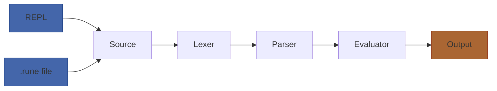

# Act 4 — The Scrying Pool

> *The spell caster knows the words. The grimoire holds the names. Now build the pool where hunters gaze and speak their incantations aloud.*

In this act you build the **Scrying Pool** — the interactive REPL and file execution system that ties the entire interpreter pipeline together. By the end, you'll type Runescript into a terminal and watch it execute in real time, or run `.rune` scroll files from the command line.

This is the integration layer defined in the design spec (§9):

```
Source text (.rune file or REPL input)
  → Lexer (chars → tokens)              ← Act 1
    → Parser (tokens → AST)             ← Act 2
      → Evaluator (AST → side effects)  ← Act 3
        → REPL / File runner             ← you are here
```

**Prerequisites:** Acts 1–3 complete — you have a working lexer, parser, and evaluator. The full pipeline can evaluate Runescript source text to produce values and side effects.

> [!tip] What You'll Learn
> - External crate dependencies with `Cargo.toml`
> - The `rustyline` crate for readline-style input (history, arrow keys, Ctrl-C)
> - Persistent environment across REPL inputs
> - Multi-line input detection via brace counting
> - File I/O with `std::fs`
> - Command-line argument parsing with `std::env`
> - Edit distance for "did you mean?" suggestions
> - Colored terminal output


**Estimated time:** 4–6 hours across all 4 stages.

**How Acts 4–5 differ from Acts 1–3:** Earlier acts gave you complete code for every function. From here on, you get **scaffolding with guided hints** — the structure and key snippets, but you fill in the gaps. You've learned enough Rust to connect the dots. Where a new concept appears, it's still explained in full.

---

## Stage 23: The Scrying Pool — Medium

*Difficulty: Medium*

**Goal:** Set up `rustyline` for interactive input, build a read-eval-print loop with a persistent environment, and auto-print expression results.

**Spec reference:** §9.1 (REPL Mode — persistent environment, expressions auto-print, errors don't kill session)

**New Rust concept(s):** External crate dependencies (`Cargo.toml`), `use` for external crates, `loop` with `match`, `process::exit`, the `rustyline::DefaultEditor` API

### Why this stage

You have all three pipeline stages — lexer, parser, evaluator — but no way to *use* them interactively. Right now `main.rs` has a hardcoded source string. The Scrying Pool replaces that with a live terminal where the hunter types incantations and sees results immediately.

The REPL (Read-Eval-Print Loop) is the interpreter's user interface. It reads a line, feeds it through lex → parse → evaluate, prints the result, and loops. The critical design decision from §9.1: the environment **persists** across inputs. When you type `let hp = 100` on one line, `hp` is still defined on the next line. This means the evaluator and its environment live *outside* the loop.

### Python equivalent

Python's REPL is built in — just run `python3`. The pattern is:

```python
env = {}
while True:
    line = input(">> ")
    try:
        result = evaluate(parse(lex(line)), env)
        if result is not None:
            print(result)
    except Exception as e:
        print(f"Error: {e}")
```

In Rust, we use `rustyline` instead of raw `stdin` because it gives us arrow-key history, Ctrl-C handling, and line editing for free.

### The Code

**Step 1: Add rustyline to `Cargo.toml`.**

This is your first external dependency. Add it under `[dependencies]`:

```toml
[package]
name = "runescript"
version = "0.1.0"
edition = "2024"

[dependencies]
rustyline = "18"
```

When you next run `cargo build`, Cargo downloads and compiles `rustyline` and all its transitive dependencies. This is like `pip install rustyline` — but Cargo pins the exact version in `Cargo.lock` automatically.

**Step 2: Create a `run_pipeline` helper.**

Before building the REPL, extract the lex → parse → evaluate pipeline into a reusable function. This will be called by both the REPL and the file runner (Stage 25). Add this to `src/main.rs` or a new `src/runner.rs` module:

```rust
// src/runner.rs
use crate::lexer::Lexer;
use crate::parser::Parser;
use crate::evaluator::Evaluator;
use crate::value::Value;

/// Run source text through the full pipeline: lex → parse → evaluate.
/// Returns the last expression value (for REPL auto-printing).
pub fn run(source: &str, evaluator: &mut Evaluator) -> Result<Value, String> {
    // 1. Lex
    let mut lexer = Lexer::new(source);
    let tokens = lexer.scan_tokens()?;

    // 2. Parse
    let mut parser = Parser::new(tokens);
    let stmts = parser.parse()?;

    // 3. Evaluate — track the last value for auto-printing
    let mut last_value = Value::Nil;
    for stmt in &stmts {
        last_value = evaluator.eval_stmt(stmt)?;
    }

    Ok(last_value)
}
```

The key insight: `evaluator` is passed in as `&mut` — the caller owns it and keeps it alive between calls. This is how the REPL maintains persistent state.

**Step 3: Build the REPL.**

Here's the scaffolding for `src/main.rs`. The `rustyline` API (verified from docs.rs v18):

- `DefaultEditor::new()` — creates an editor (type alias for `Editor<(), DefaultHistory>`)
- `rl.readline(">> ")` — reads one line, returns `Result<String>`
- `rl.add_history_entry(&line)` — adds to in-memory history (returns `Result<bool>`)
- `ReadlineError::Interrupted` — user pressed Ctrl-C
- `ReadlineError::Eof` — user pressed Ctrl-D

```rust
// src/main.rs
mod token;
mod lexer;
mod ast;
mod parser;
mod value;
mod environment;
mod evaluator;
mod builtins;
mod runner;

use rustyline::error::ReadlineError;
use rustyline::DefaultEditor;

use evaluator::Evaluator;

fn run_repl() {
    println!("Runescript v0.1 — The Scrying Pool");
    println!("Type 'exit' to leave. Expressions auto-print their result.\n");

    // Create the editor — this gives us history, arrow keys, Ctrl-C
    let mut rl = DefaultEditor::new().expect("Failed to initialize Scrying Pool");

    // The evaluator lives OUTSIDE the loop — persistent environment (§9.1)
    let mut evaluator = Evaluator::new();

    loop {
        match rl.readline(">> ") {
            Ok(line) => {
                let trimmed = line.trim();

                // Handle exit command
                if trimmed == "exit" || trimmed == "quit" {
                    println!("The pool grows still. Farewell, hunter.");
                    break;
                }

                // Skip empty lines
                if trimmed.is_empty() {
                    continue;
                }

                // Add to history so up-arrow recalls it
                let _ = rl.add_history_entry(&line);

                // Run through the pipeline
                // TODO: you fill this in — call runner::run(),
                // print the result if it's not Nil,
                // print the error if it fails (but DON'T break the loop)
            }
            Err(ReadlineError::Interrupted) => {
                // Ctrl-C — print a hint but don't exit
                println!("(Ctrl-C — type 'exit' to leave the pool)");
            }
            Err(ReadlineError::Eof) => {
                // Ctrl-D — exit cleanly
                println!("\nThe pool grows still.");
                break;
            }
            Err(err) => {
                eprintln!("Scrying error: {}", err);
                break;
            }
        }
    }
}

fn main() {
    run_repl();
}
```

**Your task:** Fill in the `TODO` block. The pattern is:

1. Call `runner::run(&trimmed, &mut evaluator)`
2. On `Ok(value)` — if the value is not `Value::Nil`, print it with `println!("{}", value)` (this requires `Display` on `Value`, which you implemented in Act 3)
3. On `Err(msg)` — print the error with `eprintln!` but **do not** `break` — errors in the REPL should not kill the session (§9.1)

**Hint for auto-printing:** The spec says "Expressions auto-print their result." This means if the user types `42 + 8`, the REPL should print `50`. But if they type `let x = 10`, it should print nothing (or `nil`). Your `run` function already returns the last value — just check if it's `Nil` before printing.

> [!warning] Common Mistakes
> - **Creating a new `Evaluator` inside the loop** — this destroys the environment every iteration. The evaluator must live *outside* the loop so `let hp = 100` on line 1 is still visible on line 2.
> - **Breaking on errors** — `Err(msg)` from the pipeline should print the error and `continue`, not `break`. The REPL is resilient — miscast spells don't shatter the pool.
> - **Forgetting `mod runner;` in `main.rs`** — Rust won't find the module without the declaration.
> - **Using `readline` without `&line` in `add_history_entry`** — the method takes `AsRef<str>`, so `&line` works. But if you pass `line` directly (without `&`), it moves the string and you can't use it afterward.
> - **Not handling the `_` wildcard in the `ReadlineError` match** — `ReadlineError` is `#[non_exhaustive]`, meaning future versions may add variants. You must have a catch-all arm: `Err(err) => { ... }`.

### Verify it works

```bash
cargo run
```

You should see:

```
Runescript v0.1 — The Scrying Pool
Type 'exit' to leave. Expressions auto-print their result.

>> let hp = 100
>> hp + 50
150
>> print("HP: {hp}")
HP: 100
>> exit
The pool grows still. Farewell, hunter.
```

Key behaviors to test:
- Variables persist between lines (`let x = 1` then `x + 1` → `2`)
- Errors print but don't crash (`undefined_var` → error message, then `>>` prompt returns)
- Ctrl-C prints a hint, Ctrl-D exits
- Up arrow recalls previous input

The scrying pool shimmers with single-line incantations. But try defining a function — the `{` hangs open and the parser chokes. Next, we teach the pool to detect incomplete input and wait for the closing `}`.

> [!check] Checkpoint
> Your project now has:
> - `Cargo.toml` with `rustyline = "18"` dependency
> - `src/runner.rs` — pipeline helper that takes `&mut Evaluator`
> - `src/main.rs` — REPL loop using `DefaultEditor`, persistent evaluator

---

## Stage 24: Multi-Line Incantations — Medium

*Difficulty: Medium*

**Goal:** Detect incomplete input (unmatched `{`), collect continuation lines with a `.. ` prompt, and enable persistent history saved to disk.

**Spec reference:** §9.1 (Multi-line input: if a line ends with `{`, collect lines until matching `}`)

**New Rust concept(s):** `String` concatenation with `push_str`, counting with `.chars().filter()`, `Path` and `home_dir` for history file location, `let _ =` to discard `Result`

### Why this stage

A REPL that only accepts single lines is crippled. You can't define a function:

```
>> fn heal(amount) {
```

...because the parser sees an incomplete block and errors. The fix: detect that the input has unmatched `{` braces, switch to a continuation prompt (`.. `), and keep collecting lines until the braces balance.

This is the same approach Python uses for multi-line input — when you type `def foo():` and press Enter, the prompt changes to `...` and waits for more.

### Python equivalent

```python
def is_complete(source: str) -> bool:
    return source.count('{') <= source.count('}')

buffer = ""
while True:
    prompt = ".. " if buffer else ">> "
    line = input(prompt)
    buffer += line + "\n"
    if is_complete(buffer):
        evaluate(buffer)
        buffer = ""
```

### The Code

**Step 1: Write a brace-counting function.**

This doesn't need to be perfect — it just needs to catch the common case of `fn foo() {` or `if cond {` where the user clearly hasn't finished. A simple approach: count `{` and `}` characters, ignoring those inside strings.

```rust
/// Check if the input has balanced braces.
/// Returns true if every `{` has a matching `}`.
/// Ignores braces inside string literals.
fn is_complete(source: &str) -> bool {
    let mut depth: i32 = 0;
    let mut in_string = false;
    let mut prev_char = '\0';

    for ch in source.chars() {
        match ch {
            '"' if prev_char != '\\' => in_string = !in_string,
            '{' if !in_string => depth += 1,
            '}' if !in_string => depth -= 1,
            _ => {}
        }
        prev_char = ch;
    }

    depth <= 0
}
```

This is intentionally simple — it doesn't handle all edge cases (like `\\\"` inside strings), but it works for the common patterns in Runescript. A production interpreter would reuse the lexer for this, but that's overkill for a learning project.

**Step 2: Update the REPL loop to accumulate lines.**

Replace the single `readline` → `run` pattern with a buffer that accumulates lines until the input is complete:

```rust
fn run_repl() {
    // ... setup as before ...

    let mut evaluator = Evaluator::new();
    let mut buffer = String::new();

    loop {
        // Switch prompt based on whether we're continuing a multi-line input
        let prompt = if buffer.is_empty() { ">> " } else { ".. " };

        match rl.readline(prompt) {
            Ok(line) => {
                let trimmed = line.trim();

                if buffer.is_empty() {
                    if trimmed == "exit" || trimmed == "quit" {
                        println!("The pool grows still. Farewell, hunter.");
                        break;
                    }
                    if trimmed.is_empty() {
                        continue;
                    }
                }

                // Append to buffer
                if !buffer.is_empty() {
                    buffer.push('\n');
                }
                buffer.push_str(&line);

                // Check if input is complete
                if !is_complete(&buffer) {
                    continue; // keep collecting lines
                }

                // Input is complete — add full input to history and run it
                let _ = rl.add_history_entry(buffer.trim());

                match runner::run(buffer.trim(), &mut evaluator) {
                    Ok(value) => {
                        // TODO: auto-print non-Nil values
                    }
                    Err(msg) => eprintln!("{}", msg),
                }

                buffer.clear();
            }
            Err(ReadlineError::Interrupted) => {
                // Ctrl-C during multi-line input: discard the buffer
                if !buffer.is_empty() {
                    buffer.clear();
                    println!("(input discarded)");
                } else {
                    println!("(Ctrl-C — type 'exit' to leave the pool)");
                }
            }
            // ... Eof and other errors as before ...
        }
    }
}
```

Key design decisions:
- **Ctrl-C during multi-line input** discards the buffer and returns to `>>`. This matches Python's behavior.
- **History records the full multi-line input** as one entry, not individual lines. When you press up-arrow, you get the entire function definition back.
- **`buffer.clear()`** resets for the next input after evaluation.

**Step 3: Persistent history.**

`rustyline` can save history to a file so it survives between sessions. Add load/save around the REPL loop:

```rust
fn run_repl() {
    let mut rl = DefaultEditor::new().expect("Failed to initialize Scrying Pool");

    // Load history from previous sessions (ignore errors — file may not exist yet)
    let history_path = dirs::home_dir()
        .map(|h| h.join(".runescript_history"))
        .unwrap_or_else(|| std::path::PathBuf::from(".runescript_history"));
    let _ = rl.load_history(&history_path);

    // ... REPL loop ...

    // Save history on exit
    let _ = rl.save_history(&history_path);
}
```

Wait — `dirs::home_dir()` requires the `dirs` crate. For simplicity, you can use a fixed path or `std::env::var("HOME")` instead:

```rust
use std::path::PathBuf;

fn history_path() -> PathBuf {
    match std::env::var("HOME") {
        Ok(home) => PathBuf::from(home).join(".runescript_history"),
        Err(_) => PathBuf::from(".runescript_history"),
    }
}
```

This uses only the standard library — no extra dependency needed. `std::env::var("HOME")` reads the `HOME` environment variable (set on macOS and Linux). If it's not set, we fall back to the current directory.

> [!warning] Common Mistakes
> - **Counting braces inside strings** — `"hello { world"` has an unmatched `{` but it's inside a string, so it shouldn't count. The `in_string` flag handles this.
> - **Forgetting to clear the buffer** — if you don't `buffer.clear()` after evaluation, the next input gets appended to the previous one.
> - **Adding each line to history separately** — the user wants to recall the entire multi-line block with one up-arrow press, not line by line. Add to history only when the input is complete.
> - **Not handling Ctrl-C during multi-line** — without the buffer-clear logic, Ctrl-C would leave stale partial input in the buffer, causing confusing errors on the next input.

### Verify it works

```bash
cargo run
```

Test multi-line input:

```
>> fn double(x) {
..   return x * 2
.. }
>> double(21)
42
```

Test Ctrl-C during multi-line:

```
>> fn broken() {
..   (press Ctrl-C)
(input discarded)
>> 1 + 1
2
```

Test history persistence:

```bash
cargo run
>> let x = 42
>> exit

cargo run
>> (press up arrow — should recall "let x = 42")
```

Multi-line incantations flow naturally now — the pool waits patiently for the closing brace. But the pool only works interactively. Next, we add scroll execution: reading `.rune` files from the command line, so dungeon rooms can be scripted and run directly.

> [!check] Checkpoint
> Updated files:
> - `src/main.rs` — REPL with multi-line buffer, `is_complete()` brace counter, persistent history
> - History file at `~/.runescript_history`

---

## Stage 25: Scroll Execution — Medium

*Difficulty: Medium*

**Goal:** Add file execution mode — read a `.rune` scroll, run it through the full pipeline, pre-inject the `hunter` object (§9.2), and exit with appropriate codes.

**Spec reference:** §9.2 (File Execution Mode — read file, lex/parse/evaluate, pre-inject hunter, exit codes), §7.1 (game built-ins print `[GAME]` stubs in standalone mode)

**New Rust concept(s):** `std::env::args()`, `std::fs::read_to_string()`, `std::process::exit()`, `std::collections::HashMap` for object construction, command-line argument parsing

### Why this stage

The REPL is great for experimentation, but the real purpose of Runescript is scripting dungeon rooms. Each room has a `.rune` file that defines what happens when a hunter enters. File mode reads the entire file, runs it through the pipeline, and exits — like `python script.py`.

The spec (§9.2) requires a `hunter` object pre-injected into the global scope so scripts can reference `hunter.hp`, `hunter.name`, etc. without defining them. In the real game, this object comes from the game engine. In standalone mode, we use a test hunter.

### Python equivalent

```python
import sys

if len(sys.argv) > 1:
    filename = sys.argv[1]
    with open(filename) as f:
        source = f.read()
    try:
        evaluate(parse(lex(source)), env)
    except Exception as e:
        print(f"Error: {e}", file=sys.stderr)
        sys.exit(1)
else:
    run_repl()
```

### The Code

**Step 1: Update `main()` to dispatch between REPL and file mode.**

```rust
use std::env;
use std::process;

fn main() {
    let args: Vec<String> = env::args().collect();

    match args.len() {
        1 => run_repl(),                    // no arguments → REPL
        2 => run_file(&args[1]),            // one argument → file mode
        _ => {
            eprintln!("Usage: runescript [script.rune]");
            process::exit(64);              // standard "usage" exit code
        }
    }
}
```

- `env::args()` returns an iterator over command-line arguments. The first element is the program name itself (`runescript`), so `args[1]` is the first user argument.
- `.collect()` gathers the iterator into a `Vec<String>`. We need `Vec` to check `.len()` and index by position.
- `process::exit(code)` terminates immediately with the given exit code. `0` = success, `1` = runtime error, `64` = usage error (following BSD conventions).

**Step 2: Implement `run_file`.**

```rust
fn run_file(path: &str) {
    // Read the scroll
    let source = match std::fs::read_to_string(path) {
        Ok(content) => content,
        Err(e) => {
            eprintln!("Cannot read scroll '{}': {}", path, e);
            process::exit(66); // "no input" exit code
        }
    };

    // Create evaluator and pre-inject the hunter object (§9.2)
    let mut evaluator = Evaluator::new();
    inject_hunter(&mut evaluator);

    // Run the full pipeline
    match runner::run(&source, &mut evaluator) {
        Ok(_) => process::exit(0),
        Err(msg) => {
            eprintln!("{}", msg);
            process::exit(1);
        }
    }
}
```

**Step 3: Pre-inject the hunter object.**

The spec (§9.2) defines the default hunter:

```rust
use std::collections::HashMap;
use crate::value::Value;

fn inject_hunter(evaluator: &mut Evaluator) {
    let mut fields = HashMap::new();
    fields.insert("name".to_string(), Value::Str("Test Hunter".to_string()));
    fields.insert("hp".to_string(), Value::Int(100));
    fields.insert("max_hp".to_string(), Value::Int(100));
    fields.insert("stamina".to_string(), Value::Int(100));
    fields.insert("insight".to_string(), Value::Int(0));

    evaluator.define("hunter", Value::Object(fields));
}
```

This calls `evaluator.define()` to place the hunter object in the global scope before any user code runs. You may need to add a `define` method to your `Evaluator` that delegates to `self.env.define()` — or call the environment directly if it's public.

**Step 4: Create the example scrolls.**

Create the `examples/` directory and add the scripts from the spec (§10). Start with the simplest:

```bash
mkdir -p ~/juk/runescript/examples
```

`examples/01_hello.rune`:
```
// The simplest Runescript program
print("A voice echoes through the dungeon...")
print("Welcome, hunter.")
```

`examples/02_variables.rune`:
```
// Variable declarations, math, string interpolation
let hp = 100
let max_hp = 100
let weapon_damage = 25
let enemy_hp = 80

print("Hunter HP: {hp}/{max_hp}")
print("Weapon damage: {weapon_damage}")

enemy_hp = enemy_hp - weapon_damage
print("You strike! Enemy HP: {enemy_hp}")

enemy_hp = enemy_hp - weapon_damage
print("You strike again! Enemy HP: {enemy_hp}")

if enemy_hp <= 0 {
    print("The enemy falls.")
} else {
    print("The enemy still stands with {enemy_hp} HP.")
}
```

Copy the remaining examples (03–06) from the spec §10.3–§10.6. These are your integration tests — if they all run correctly, the interpreter is working.

> [!warning] Common Mistakes
> - **Forgetting to inject the hunter before running** — scripts that reference `hunter.hp` will fail with "undefined variable 'hunter'" if you forget `inject_hunter()`.
> - **Using `process::exit()` in the REPL** — `process::exit` is for file mode only. In the REPL, errors should print and continue.
> - **Not printing errors to stderr** — use `eprintln!`, not `println!`, for error messages. This follows Unix convention: stdout for program output, stderr for diagnostics. It matters when piping output.
> - **Hardcoding the file extension check** — the spec doesn't require `.rune` extension. Any file path should work. Don't reject `script.txt` — just try to read and run it.

### Verify it works

```bash
# Run the hello world scroll
cargo run -- examples/01_hello.rune
```

Expected output:
```
A voice echoes through the dungeon...
Welcome, hunter.
```

```bash
# Run the variables scroll
cargo run -- examples/02_variables.rune
```

Expected output:
```
Hunter HP: 100/100
Weapon damage: 25
You strike! Enemy HP: 55
You strike again! Enemy HP: 30
The enemy still stands with 30 HP.
```

```bash
# Check exit codes
cargo run -- examples/01_hello.rune; echo "Exit: $?"
# Should print "Exit: 0"

cargo run -- nonexistent.rune; echo "Exit: $?"
# Should print error message and "Exit: 66"
```

```bash
# REPL still works with no arguments
cargo run
>> 1 + 1
2
>> exit
```

Note the `--` between `cargo run` and the filename — this tells Cargo "everything after `--` is for the program, not for Cargo."

Scrolls execute from the command line and the hunter object awaits within. But when a spell misfires, the error message is bare — no suggestions, no color, no guidance. Next, we polish the diagnostics so miscast spells point the hunter toward the fix.

> [!check] Checkpoint
> Updated files:
> - `src/main.rs` — `main()` dispatches to `run_repl()` or `run_file()`, `inject_hunter()` pre-populates the environment
> - `examples/01_hello.rune` through `examples/06_boss_encounter.rune` — spec example scripts

---

## Stage 26: Miscast Diagnostics — Medium

*Difficulty: Medium*

**Goal:** Polish error messages with line/column context, implement "did you mean?" suggestions via edit distance (§8.4), and add colored terminal output.

**Spec reference:** §8 (Error Handling — all error types carry spans), §8.2 (error examples with `[line N, col M]` format), §8.4 ("Did you mean?" via edit distance ≤ 2)

**New Rust concept(s):** Levenshtein edit distance algorithm, `min()` on iterators, ANSI escape codes for terminal colors, conditional compilation with `cfg`

### Why this stage

Good error messages are the difference between a frustrating language and a pleasant one. Right now your errors probably say something like `Undefined variable 'hq'`. After this stage, they'll say:

```
[line 6, col 3] Undefined variable 'hq' (did you mean 'hp'?)
```

...in red text, with the suggestion in yellow. This matches the spec's error format (§8.2) and makes typos easy to spot.

### Python equivalent

Edit distance in Python:

```python
def edit_distance(a: str, b: str) -> int:
    """Levenshtein distance — minimum edits to transform a into b."""
    if len(a) == 0: return len(b)
    if len(b) == 0: return len(a)

    # Build a matrix of distances
    dp = [[0] * (len(b) + 1) for _ in range(len(a) + 1)]
    for i in range(len(a) + 1): dp[i][0] = i
    for j in range(len(b) + 1): dp[0][j] = j

    for i in range(1, len(a) + 1):
        for j in range(1, len(b) + 1):
            cost = 0 if a[i-1] == b[j-1] else 1
            dp[i][j] = min(
                dp[i-1][j] + 1,      # deletion
                dp[i][j-1] + 1,      # insertion
                dp[i-1][j-1] + cost, # substitution
            )
    return dp[len(a)][len(b)]
```

Rust's version is structurally identical but uses `Vec<Vec<usize>>` and `.min()`.

### The Code

**Step 1: Implement edit distance.**

Create `src/diagnostics.rs` (or add to `src/error.rs` if you have one):

```rust
// src/diagnostics.rs
// Miscast spell diagnostics — error formatting and suggestions.

/// Compute the Levenshtein edit distance between two strings.
/// This counts the minimum number of single-character insertions,
/// deletions, or substitutions to transform `a` into `b`.
pub fn edit_distance(a: &str, b: &str) -> usize {
    let a_chars: Vec<char> = a.chars().collect();
    let b_chars: Vec<char> = b.chars().collect();
    let m = a_chars.len();
    let n = b_chars.len();

    // dp[i][j] = edit distance between a[..i] and b[..j]
    let mut dp = vec![vec![0usize; n + 1]; m + 1];

    // Base cases: transforming empty string to/from prefix
    for i in 0..=m {
        dp[i][0] = i;
    }
    for j in 0..=n {
        dp[0][j] = j;
    }

    // Fill the matrix
    for i in 1..=m {
        for j in 1..=n {
            let cost = if a_chars[i - 1] == b_chars[j - 1] { 0 } else { 1 };
            dp[i][j] = (dp[i - 1][j] + 1)         // deletion
                .min(dp[i][j - 1] + 1)             // insertion
                .min(dp[i - 1][j - 1] + cost);     // substitution
        }
    }

    dp[m][n]
}

/// Given an undefined variable name, search all names in scope
/// and return the closest match within edit distance 2.
pub fn suggest_variable(name: &str, known_names: &[String]) -> Option<String> {
    known_names
        .iter()
        .filter_map(|candidate| {
            let dist = edit_distance(name, candidate);
            if dist <= 2 && dist > 0 {
                Some((dist, candidate.clone()))
            } else {
                None
            }
        })
        .min_by_key(|(dist, _)| *dist)
        .map(|(_, name)| name)
}
```

New Rust concepts:

- `vec![vec![0usize; n + 1]; m + 1]` — creates a 2D vector. The outer `vec!` creates `m + 1` rows, each initialized to a vector of `n + 1` zeros. `0usize` specifies the type explicitly.
- `.min()` on `usize` — returns the smaller of two values. Chained: `a.min(b).min(c)` gives the minimum of three.
- `.filter_map()` — combines `.filter()` and `.map()` in one step. The closure returns `Some(value)` to keep an element or `None` to skip it.
- `.min_by_key(|(dist, _)| *dist)` — finds the element with the smallest `dist`. The `*dist` dereferences because `min_by_key` passes a reference.

**Step 2: Wire suggestions into the evaluator.**

When the evaluator encounters an undefined variable, it should call `suggest_variable` with the name and all known variable names from the environment. Update your `eval_expr` method's `Ident` case:

```rust
// In evaluator.rs, when handling Expr::Ident(name):
Expr::Ident(name) => {
    match self.env.get(name) {
        Some(val) => Ok(val.clone()),
        None => {
            // Collect all known variable names for suggestion
            let known = self.env.all_names();
            let suggestion = diagnostics::suggest_variable(name, &known);

            let msg = match suggestion {
                Some(s) => format!(
                    "Undefined variable '{}' (did you mean '{}'?)",
                    name, s
                ),
                None => format!("Undefined variable '{}'", name),
            };
            Err(msg)
        }
    }
}
```

You'll need to add an `all_names()` method to your `Environment` that collects all variable names across all scopes:

```rust
// In environment.rs
pub fn all_names(&self) -> Vec<String> {
    self.scopes
        .iter()
        .flat_map(|scope| scope.keys().cloned())
        .collect()
}
```

- `.flat_map()` — like `.map()` but flattens nested iterators. Each scope's `.keys()` returns an iterator; `flat_map` merges them all into one stream.

**Step 3: Add colored output.**

ANSI escape codes let you color terminal text. The pattern is `\x1b[CODEm` to start a color and `\x1b[0m` to reset. No external crate needed:

```rust
// src/diagnostics.rs

/// ANSI color codes for terminal output.
pub const RED: &str = "\x1b[31m";
pub const YELLOW: &str = "\x1b[33m";
pub const CYAN: &str = "\x1b[36m";
pub const BOLD: &str = "\x1b[1m";
pub const RESET: &str = "\x1b[0m";

/// Format an error message with color.
pub fn format_error(span_prefix: &str, message: &str) -> String {
    format!("{RED}{BOLD}{span_prefix}{RESET} {RED}{message}{RESET}")
}

/// Format a suggestion with color.
pub fn format_suggestion(suggestion: &str) -> String {
    format!("{YELLOW}(did you mean '{suggestion}'?){RESET}")
}
```

Then in your REPL error handler:

```rust
Err(msg) => {
    // Errors are already formatted with [line, col] prefix
    eprintln!("{}{}{}", diagnostics::RED, msg, diagnostics::RESET);
}
```

**Step 4: Add tests for edit distance.**

```rust
#[cfg(test)]
mod tests {
    use super::*;

    #[test]
    fn edit_distance_identical() {
        assert_eq!(edit_distance("hp", "hp"), 0);
    }

    #[test]
    fn edit_distance_one_char() {
        assert_eq!(edit_distance("hp", "hq"), 1);  // substitution
        assert_eq!(edit_distance("hp", "h"), 1);    // deletion
        assert_eq!(edit_distance("hp", "hpx"), 1);  // insertion
    }

    #[test]
    fn edit_distance_two_chars() {
        assert_eq!(edit_distance("hp", "xq"), 2);
    }

    #[test]
    fn edit_distance_empty() {
        assert_eq!(edit_distance("", "abc"), 3);
        assert_eq!(edit_distance("abc", ""), 3);
        assert_eq!(edit_distance("", ""), 0);
    }

    #[test]
    fn suggest_finds_close_match() {
        let names = vec![
            "hp".to_string(),
            "max_hp".to_string(),
            "stamina".to_string(),
        ];
        assert_eq!(suggest_variable("hq", &names), Some("hp".to_string()));
        assert_eq!(suggest_variable("hpx", &names), Some("hp".to_string()));
    }

    #[test]
    fn suggest_no_match_when_too_far() {
        let names = vec!["hp".to_string(), "stamina".to_string()];
        assert_eq!(suggest_variable("xyz", &names), None);
    }

    #[test]
    fn suggest_exact_match_excluded() {
        // edit distance 0 should not be suggested (it's not a typo)
        let names = vec!["hp".to_string()];
        assert_eq!(suggest_variable("hp", &names), None);
    }
}
```

> [!warning] Common Mistakes
> - **Off-by-one in the DP matrix** — the matrix is `(m+1) x (n+1)`, not `m x n`. Index `dp[0][j]` represents transforming an empty string to `b[..j]`.
> - **Suggesting the exact same name** — if `name` is in scope (distance 0), don't suggest it. The `dist > 0` filter handles this.
> - **ANSI codes in non-terminal output** — if stdout is piped to a file, ANSI codes produce garbage. For a production tool, you'd check `atty::is(Stream::Stderr)` or use the `colored` crate. For this project, raw ANSI codes are fine.
> - **Forgetting `mod diagnostics;` in `main.rs`** — declare the new module.

### Verify it works

```bash
cargo test
```

All edit distance tests should pass.

```bash
cargo run
>> let hp = 100
>> hq + 10
[line 1, col 1] Undefined variable 'hq' (did you mean 'hp'?)
>> stamna
[line 1, col 1] Undefined variable 'stamna' (did you mean 'stamina'?)
```

The error messages should appear in red (if your terminal supports ANSI colors).

```bash
# Test with a file that has an error
echo 'let hp = 100
print(hq)' > /tmp/test_error.rune

cargo run -- /tmp/test_error.rune
# Should show: Undefined variable 'hq' (did you mean 'hp'?)
# Exit code: 1
```

> [!check] Checkpoint
> New files:
> - `src/diagnostics.rs` — `edit_distance()`, `suggest_variable()`, ANSI color constants, 7 tests
>
> Updated files:
> - `src/evaluator.rs` — `Ident` case calls `suggest_variable` on undefined variable
> - `src/environment.rs` — added `all_names()` method
> - `src/main.rs` — added `mod diagnostics;`, colored error output in REPL

---

## Act Complete — What's Next

The Scrying Pool is open. Hunters can gaze into it and speak incantations — single-line expressions, multi-line function definitions, or entire scroll files. The pool remembers their words (history) and gently corrects their mistakes (did you mean?).

**What you built:**
- A REPL with `rustyline` — arrow-key history, Ctrl-C/Ctrl-D handling, persistent history file (§9.1)
- Multi-line input detection via brace counting — continuation prompt for incomplete blocks
- File execution mode — read `.rune` scrolls, pre-inject hunter object, exit codes (§9.2)
- "Did you mean?" suggestions via Levenshtein edit distance (§8.4)
- Colored error output with ANSI escape codes
- The full interpreter pipeline wired together: source → lex → parse → evaluate → output

**Rust concepts you learned:**
- External crate dependencies in `Cargo.toml`
- `rustyline::DefaultEditor` — `readline()`, `add_history_entry()`, `load_history()`, `save_history()`
- `ReadlineError::Eof`, `ReadlineError::Interrupted` — graceful terminal handling
- `std::env::args()` — command-line argument parsing
- `std::fs::read_to_string()` — file I/O
- `std::process::exit()` — exit codes
- Dynamic programming with 2D `Vec` — edit distance algorithm
- ANSI escape codes for colored terminal output

**The complete pipeline:**



**In Act 5 — The Binding**, you'll connect Runescript to a game engine. You'll define a `GameCallback` trait that replaces the `[GAME]` print stubs with real method calls, load `.rune` files from a directory, watch for changes and hot-reload scripts, and run all six example scripts end-to-end as a final integration test.

The pool shimmers. The runes are ready. Time to bind them to the world.
