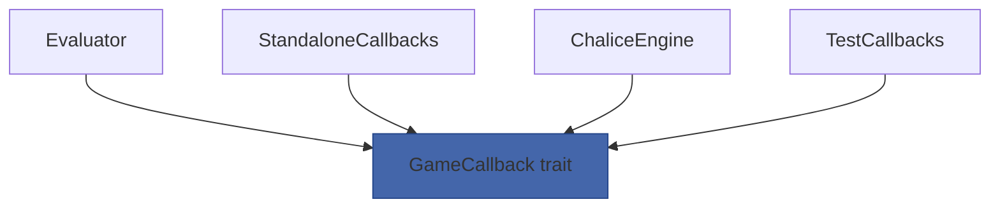
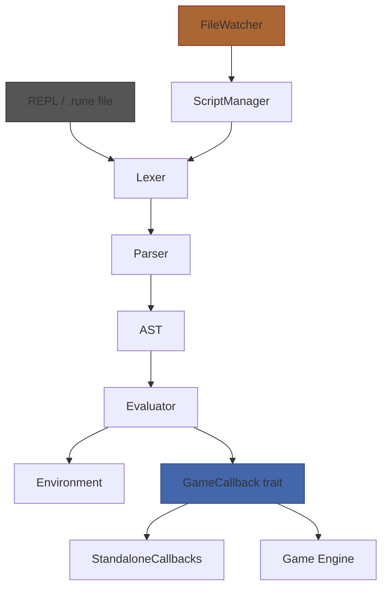

# Act 5 — The Binding

> *The runes are carved, the incantations deciphered, the spells cast. Now bind them to the living world — let the dungeon breathe.*

In this final act you connect Runescript to a game engine. The `[GAME]` stubs that printed placeholder text become real method calls through a trait. Scripts load from directories, associate with rooms, and hot-reload when you edit them. By the end, you'll run all six example scrolls end-to-end and benchmark the interpreter's performance.

This is the integration layer that turns a standalone interpreter into an embeddable scripting engine:

```
Game Engine
  → ScriptManager (loads .rune files)
    → Evaluator (runs scripts)
      → GameCallback trait (scripts call back into the engine)
```

**Prerequisites:** Acts 1–4 complete — you have a working interpreter with REPL, file execution, and error diagnostics.

**What you'll learn:**
- Trait objects and dynamic dispatch (`dyn Trait`)
- Dependency inversion — the interpreter depends on an abstraction, not a concrete game engine
- Directory scanning with `std::fs::read_dir`
- File watching with the `notify` crate (or manual polling)
- Performance benchmarking with `std::time::Instant`
- Integration testing — running real scripts end-to-end

**Estimated time:** 4–6 hours across all 4 stages.

**The dependency inversion principle:** Right now, your built-in functions like `spawn_enemy` and `show_text` print `[GAME] ...` to stdout. That's fine for standalone mode, but when Runescript runs inside a game engine, those functions need to *call the engine*. The solution: define a `GameCallback` trait that the engine implements. The evaluator calls trait methods instead of printing directly. The engine provides the implementation. The interpreter never knows (or cares) what the engine actually does.



---

## Stage 27: The Game Bridge — Medium

**Goal:** Define a `GameCallback` trait with methods for each game built-in. Replace the `[GAME]` print stubs in your built-in functions with trait method calls. Demonstrate dependency inversion.

**Spec reference:** §7.1 (The Chalice Integration — built-ins dispatch to game event system; standalone mode prints descriptions)

**New Rust concept(s):** Traits as interfaces, `dyn Trait` (trait objects), `Box<dyn Trait>`, dynamic dispatch vs static dispatch, dependency inversion pattern

### Why this stage

Your built-in functions currently do something like:

```rust
"spawn_enemy" => {
    println!("[GAME] spawn_enemy({}, {}) — would spawn {} enemies", name, count, count);
    Ok(Value::Nil)
}
```

This works for standalone testing, but it's hardcoded. When the game engine calls Runescript, it needs `spawn_enemy` to actually spawn enemies — not print a message. The solution is a **trait** — Rust's version of an interface.

A trait defines *what* methods exist without saying *how* they work. The evaluator calls `self.callbacks.spawn_enemy(name, count)`. In standalone mode, `callbacks` is a `StandaloneCallbacks` that prints `[GAME]`. In the real game, it's a `ChaliceCallbacks` that talks to the engine. The evaluator doesn't know the difference — that's dependency inversion.

### Python/TS equivalent

In Python, you'd use an abstract base class:

```python
from abc import ABC, abstractmethod

class GameCallback(ABC):
    @abstractmethod
    def spawn_enemy(self, name: str, count: int): ...

    @abstractmethod
    def show_text(self, message: str): ...

class StandaloneCallbacks(GameCallback):
    def spawn_enemy(self, name, count):
        print(f"[GAME] spawn_enemy({name}, {count})")

    def show_text(self, message):
        print(f"[GAME] show_text({message})")
```

In TypeScript, you'd use an `interface`. Rust traits are the same concept with compile-time enforcement.

### The Code

**Step 1: Define the trait.**

Create `src/callbacks.rs`:

```rust
// src/callbacks.rs
// The Game Bridge — trait for game engine integration.
// The evaluator calls these methods instead of printing [GAME] stubs.

/// Trait that game engines implement to receive events from Runescript.
/// Each method corresponds to a game-related built-in function (§7.1).
pub trait GameCallback {
    /// Spawn `count` enemies of the given type in the current room.
    fn spawn_enemy(&mut self, name: &str, count: i64);

    /// Display narrative text to the player.
    fn show_text(&mut self, message: &str);

    /// Deal `amount` damage to a target (identified by name).
    fn damage(&mut self, target: &str, amount: i64);

    /// Restore `amount` HP to a target.
    fn heal(&mut self, target: &str, amount: i64);

    /// Trigger a named sound effect.
    fn play_sound(&mut self, name: &str);
}
```

This is a **trait definition** — it declares five methods with no bodies. Any type that `impl GameCallback` must provide all five. Think of it as a contract.

- `&mut self` — the callback receiver may need to mutate state (e.g., update the game world). If your callbacks are stateless, `&self` would work too, but `&mut self` is more flexible.

**Step 2: Implement the standalone version.**

```rust
/// Standalone callbacks — prints [GAME] descriptions for testing
/// outside the game engine. This is what the REPL and file mode use.
pub struct StandaloneCallbacks;

impl GameCallback for StandaloneCallbacks {
    fn spawn_enemy(&mut self, name: &str, count: i64) {
        println!("[GAME] spawn_enemy(\"{}\", {}) — would spawn {} {} enemies",
            name, count, count, name);
    }

    fn show_text(&mut self, message: &str) {
        println!("[GAME] show_text(\"{}\") — would display text", message);
    }

    fn damage(&mut self, target: &str, amount: i64) {
        println!("[GAME] damage({}, {}) — would deal {} damage", target, amount, amount);
    }

    fn heal(&mut self, target: &str, amount: i64) {
        println!("[GAME] heal({}, {}) — would restore {} HP", target, amount, amount);
    }

    fn play_sound(&mut self, name: &str) {
        println!("[GAME] play_sound(\"{}\") — would play sound", name);
    }
}
```

`StandaloneCallbacks` is a **unit struct** — it has no fields. It exists only to implement the trait. This is common in Rust for stateless implementations.

**Step 3: Wire the trait into the evaluator.**

The evaluator needs to hold a reference to the callbacks. Since the concrete type varies at runtime (standalone vs game engine), we use a **trait object**: `Box<dyn GameCallback>`.

```rust
// In evaluator.rs
use crate::callbacks::GameCallback;

pub struct Evaluator {
    pub env: Environment,
    callbacks: Box<dyn GameCallback>,
}

impl Evaluator {
    pub fn new() -> Self {
        Self::with_callbacks(Box::new(crate::callbacks::StandaloneCallbacks))
    }

    pub fn with_callbacks(callbacks: Box<dyn GameCallback>) -> Self {
        let mut eval = Evaluator {
            env: Environment::new(),
            callbacks,
        };
        eval.register_builtins();
        eval
    }
}
```

- `Box<dyn GameCallback>` — a **trait object**. `Box` heap-allocates the value. `dyn GameCallback` means "any type that implements `GameCallback`." The compiler doesn't know the concrete type at compile time — method calls go through a vtable (dynamic dispatch). This is like a Python object behind an interface or a TypeScript variable typed as an interface.
- `Self::with_callbacks(...)` — an alternative constructor. `new()` uses `StandaloneCallbacks` by default; `with_callbacks()` lets the game engine inject its own implementation.

**Step 4: Update built-in functions to use callbacks.**

Replace the `println!("[GAME] ...")` calls in your built-in function implementations with calls to `self.callbacks`:

```rust
// Before (hardcoded):
"spawn_enemy" => {
    let name = /* extract string arg */;
    let count = /* extract int arg */;
    println!("[GAME] spawn_enemy(\"{}\", {})", name, count);
    Ok(Value::Nil)
}

// After (trait-based):
"spawn_enemy" => {
    let name = /* extract string arg */;
    let count = /* extract int arg */;
    self.callbacks.spawn_enemy(&name, count);
    Ok(Value::Nil)
}
```

The output is identical in standalone mode — `StandaloneCallbacks` prints the same `[GAME]` messages. But now a game engine can provide a different implementation that actually spawns enemies.

**Step 5: Write a test callback for verification.**

```rust
/// Test callbacks that record calls for assertion in tests.
#[cfg(test)]
pub struct TestCallbacks {
    pub calls: Vec<String>,
}

#[cfg(test)]
impl TestCallbacks {
    pub fn new() -> Self {
        TestCallbacks { calls: Vec::new() }
    }
}

#[cfg(test)]
impl GameCallback for TestCallbacks {
    fn spawn_enemy(&mut self, name: &str, count: i64) {
        self.calls.push(format!("spawn_enemy({}, {})", name, count));
    }

    fn show_text(&mut self, message: &str) {
        self.calls.push(format!("show_text({})", message));
    }

    fn damage(&mut self, target: &str, amount: i64) {
        self.calls.push(format!("damage({}, {})", target, amount));
    }

    fn heal(&mut self, target: &str, amount: i64) {
        self.calls.push(format!("heal({}, {})", target, amount));
    }

    fn play_sound(&mut self, name: &str) {
        self.calls.push(format!("play_sound({})", name));
    }
}
```

This is the **test double** pattern — `TestCallbacks` records every call so your tests can assert exactly which game functions were invoked and in what order.

### Common mistakes

- **Forgetting `dyn` in `Box<dyn GameCallback>`** — without `dyn`, Rust tries to use static dispatch and can't determine the size at compile time. The compiler error is: "the size for values of type `dyn GameCallback` cannot be known at compilation time."
- **Using `&dyn GameCallback` instead of `Box<dyn GameCallback>`** — a reference requires a lifetime parameter on the `Evaluator` struct, which complicates everything. `Box` owns the callbacks, avoiding lifetime issues.
- **Not updating `Evaluator::new()` to use `StandaloneCallbacks`** — existing tests that call `Evaluator::new()` should still work because `new()` defaults to standalone mode.
- **Making callbacks `&self` when the game engine needs `&mut self`** — if the engine needs to mutate state (spawn enemies, update HP), the trait methods need `&mut self`. It's easier to start with `&mut self` and relax later than to change it after the fact.

### Verify it works

```bash
cargo test
```

All existing tests should still pass — `Evaluator::new()` uses `StandaloneCallbacks` which produces the same output as the old hardcoded `println!` calls.

```bash
cargo run -- examples/05_dungeon_trap.rune
```

Output should be identical to before — `[GAME] show_text(...)`, `[GAME] damage(...)`, etc. The difference is invisible from the outside but fundamental architecturally: the evaluator no longer knows *how* game events are handled.

### Checkpoint

New files:
- `src/callbacks.rs` — `GameCallback` trait, `StandaloneCallbacks`, `TestCallbacks`

Updated files:
- `src/evaluator.rs` — holds `Box<dyn GameCallback>`, `new()` and `with_callbacks()` constructors, built-ins call `self.callbacks` methods
- `src/main.rs` — added `mod callbacks;`

---

## Stage 28: Loading Scrolls — Medium

**Goal:** Scan a directory for `.rune` files, associate each with a room ID (derived from the filename), parse them on load, and evaluate `on_enter(hunter)` when a room is entered.

**Spec reference:** §9.2 (File Execution Mode), §9.3 (Project Structure — `examples/` directory), §10.5–10.6 (room scripts with `on_enter`)

**New Rust concept(s):** `std::fs::read_dir()`, `Path` and `PathBuf`, `OsStr` to `&str` conversion, `HashMap<String, Vec<Stmt>>` for pre-parsed scripts, the builder pattern for `ScriptManager`

### Why this stage

In a real game, you don't run one script at a time — you have a directory full of `.rune` files, one per room. When the hunter enters a room, the engine looks up that room's script and calls `on_enter(hunter)`. This stage builds the `ScriptManager` that handles loading, parsing, and dispatching.

The key optimization: scripts are **parsed once on load** and stored as ASTs. When a room is entered, only the evaluator runs — no re-lexing or re-parsing. This matters for performance when the same room is entered multiple times.

### Python/TS equivalent

```python
import os

class ScriptManager:
    def __init__(self, directory):
        self.scripts = {}  # room_id -> parsed AST
        for filename in os.listdir(directory):
            if filename.endswith('.rune'):
                room_id = filename[:-5]  # strip .rune
                with open(os.path.join(directory, filename)) as f:
                    source = f.read()
                self.scripts[room_id] = parse(lex(source))

    def on_enter(self, room_id, hunter):
        if room_id in self.scripts:
            env = {"hunter": hunter}
            evaluate(self.scripts[room_id], env)
```

### The Code

**Step 1: Create the ScriptManager.**

Create `src/script_manager.rs`:

```rust
// src/script_manager.rs
// Loads and manages .rune scripts from a directory.

use std::collections::HashMap;
use std::fs;
use std::path::Path;

use crate::ast::Stmt;
use crate::lexer::Lexer;
use crate::parser::Parser;
use crate::evaluator::Evaluator;
use crate::callbacks::GameCallback;
use crate::value::Value;

/// Manages a collection of parsed Runescript files.
/// Scripts are parsed once on load and evaluated on demand.
pub struct ScriptManager {
    /// Map from room ID (filename without .rune) to parsed AST.
    scripts: HashMap<String, Vec<Stmt>>,
    /// Errors encountered during loading (room_id -> error message).
    load_errors: HashMap<String, String>,
}

impl ScriptManager {
    /// Scan a directory for .rune files, lex and parse each one.
    /// Scripts that fail to parse are recorded in load_errors
    /// but don't prevent other scripts from loading.
    pub fn load_directory(dir: &Path) -> Result<Self, String> {
        let mut scripts = HashMap::new();
        let mut load_errors = HashMap::new();

        // Read directory entries
        let entries = fs::read_dir(dir)
            .map_err(|e| format!("Cannot read directory '{}': {}", dir.display(), e))?;

        for entry in entries {
            let entry = match entry {
                Ok(e) => e,
                Err(e) => {
                    eprintln!("Warning: skipping unreadable entry: {}", e);
                    continue;
                }
            };

            let path = entry.path();

            // Only process .rune files
            let extension = path.extension().and_then(|e| e.to_str());
            if extension != Some("rune") {
                continue;
            }

            // Derive room ID from filename (e.g., "05_dungeon_trap.rune" → "05_dungeon_trap")
            let room_id = match path.file_stem().and_then(|s| s.to_str()) {
                Some(name) => name.to_string(),
                None => continue,
            };

            // Read and parse the file
            match fs::read_to_string(&path) {
                Ok(source) => {
                    match Self::parse_source(&source) {
                        Ok(stmts) => {
                            println!("  Loaded scroll: {} ({} statements)",
                                room_id, stmts.len());
                            scripts.insert(room_id, stmts);
                        }
                        Err(e) => {
                            eprintln!("  Error in {}: {}", room_id, e);
                            load_errors.insert(room_id, e);
                        }
                    }
                }
                Err(e) => {
                    let msg = format!("Cannot read '{}': {}", path.display(), e);
                    eprintln!("  {}", msg);
                    load_errors.insert(room_id, msg);
                }
            }
        }

        Ok(ScriptManager { scripts, load_errors })
    }

    /// Lex and parse source text into an AST.
    fn parse_source(source: &str) -> Result<Vec<Stmt>, String> {
        let mut lexer = Lexer::new(source);
        let tokens = lexer.scan_tokens()?;
        let mut parser = Parser::new(tokens);
        parser.parse()
    }

    /// How many scripts loaded successfully.
    pub fn script_count(&self) -> usize {
        self.scripts.len()
    }

    /// How many scripts failed to load.
    pub fn error_count(&self) -> usize {
        self.load_errors.len()
    }

    /// List all loaded room IDs.
    pub fn room_ids(&self) -> Vec<&str> {
        self.scripts.keys().map(|s| s.as_str()).collect()
    }
}
```

New Rust concepts:

- `fs::read_dir(dir)` — returns an iterator over directory entries. Each entry is a `Result<DirEntry>` because reading a directory can fail mid-iteration (permissions, etc.).
- `path.extension()` — returns `Option<&OsStr>`. `.and_then(|e| e.to_str())` converts to `Option<&str>`. `OsStr` is the OS-native string type — on Unix it's bytes, on Windows it's UTF-16. `.to_str()` converts to UTF-8, returning `None` if the filename isn't valid UTF-8.
- `path.file_stem()` — returns the filename without the extension. `"dungeon_trap.rune"` → `"dungeon_trap"`.
- `dir.display()` — returns a type that implements `Display` for printing paths. You can't directly `format!("{}", path)` because `Path` doesn't implement `Display` (it might contain non-UTF-8 bytes).

**Step 2: Add the `on_enter` method.**

This creates a fresh evaluator for each room entry (so scripts don't leak state between rooms), injects the hunter, and evaluates the script:

```rust
impl ScriptManager {
    // ... previous methods ...

    /// Evaluate a room's script with the given hunter object.
    /// Creates a fresh evaluator for isolation between rooms.
    pub fn on_enter(
        &self,
        room_id: &str,
        hunter: Value,
        callbacks: Box<dyn GameCallback>,
    ) -> Result<(), String> {
        let stmts = self.scripts.get(room_id)
            .ok_or_else(|| format!("No script found for room '{}'", room_id))?;

        let mut evaluator = Evaluator::with_callbacks(callbacks);
        evaluator.define("hunter", hunter);

        for stmt in stmts {
            evaluator.eval_stmt(stmt)?;
        }

        Ok(())
    }
}
```

Design decisions:
- **Fresh evaluator per room** — scripts don't share state. Room A can't accidentally modify Room B's variables. This is the spec's design: "each `.rune` file is self-contained" (§1.2).
- **Hunter passed in** — the game engine provides the current hunter state. In standalone mode, we use the test hunter from §9.2.
- **Callbacks passed in** — the caller decides whether to use standalone or game engine callbacks.

**Step 3: Add a CLI command to load a directory.**

Update `main.rs` to support `runescript --dir examples/`:

```rust
fn main() {
    let args: Vec<String> = env::args().collect();

    match args.get(1).map(|s| s.as_str()) {
        None => run_repl(),
        Some("--dir") => {
            let dir = args.get(2).expect("Usage: runescript --dir <directory>");
            run_directory(dir);
        }
        Some(path) => run_file(path),
    }
}

fn run_directory(dir: &str) {
    use crate::script_manager::ScriptManager;
    use std::path::Path;

    println!("Loading scrolls from '{}'...", dir);
    let manager = match ScriptManager::load_directory(Path::new(dir)) {
        Ok(m) => m,
        Err(e) => {
            eprintln!("Failed to load scrolls: {}", e);
            process::exit(1);
        }
    };

    println!("\nLoaded {} scrolls ({} errors)\n",
        manager.script_count(), manager.error_count());

    // List available rooms
    let mut rooms = manager.room_ids();
    rooms.sort();
    for room in &rooms {
        println!("  Room: {}", room);
    }

    // TODO: you could add an interactive mode here where the user
    // types a room ID to "enter" it, or run all rooms in sequence.
}
```

### Common mistakes

- **Not handling `OsStr` → `&str` conversion** — filenames on Unix can contain non-UTF-8 bytes. `.to_str()` returns `None` in that case. Always use `.and_then(|s| s.to_str())` and handle the `None`.
- **Sharing evaluator state between rooms** — if you reuse the same evaluator for multiple rooms, variables from one script leak into the next. Create a fresh evaluator per `on_enter` call.
- **Panicking on load errors** — a single broken script shouldn't prevent all other scripts from loading. Collect errors and report them, but keep going.
- **Forgetting to sort room IDs** — `HashMap` iteration order is random. Sort the IDs for deterministic output.

### Verify it works

```bash
cargo run -- --dir examples/
```

Expected output:
```
Loading scrolls from 'examples/'...
  Loaded scroll: 01_hello (2 statements)
  Loaded scroll: 02_variables (10 statements)
  Loaded scroll: 03_functions (12 statements)
  Loaded scroll: 04_arrays (15 statements)
  Loaded scroll: 05_dungeon_trap (8 statements)
  Loaded scroll: 06_boss_encounter (12 statements)

Loaded 6 scrolls (0 errors)

  Room: 01_hello
  Room: 02_variables
  Room: 03_functions
  Room: 04_arrays
  Room: 05_dungeon_trap
  Room: 06_boss_encounter
```

### Checkpoint

New files:
- `src/script_manager.rs` — `ScriptManager` with `load_directory()`, `on_enter()`, `room_ids()`

Updated files:
- `src/main.rs` — added `--dir` argument handling, `run_directory()` function, `mod script_manager;`

---

## Stage 29: The Watcher — Hard

**Goal:** Detect when `.rune` files change on disk, re-lex and re-parse them without restarting the interpreter, and report errors gracefully. This is hot-reload for scripts.

**Spec reference:** §12 (Future Extensions — hot reload: "Re-evaluate `.rune` files without restarting the game")

**New Rust concept(s):** The `notify` crate for filesystem events, `std::sync::mpsc` channels, `std::thread` for background watching, `Mutex` or channel-based communication, polling as a simpler alternative

### Why this stage

During game development, you want to edit a `.rune` file in your editor, save it, and immediately see the changes in the running game — without restarting. This is **hot reload**, and it's one of the most developer-friendly features a scripting engine can have.

The approach: a background thread watches the `examples/` directory for file changes. When a `.rune` file is modified, it re-lexes and re-parses the file, replacing the old AST in the `ScriptManager`. If parsing fails, the old AST is kept and the error is reported — the game doesn't crash.

This stage offers two approaches: the `notify` crate (event-driven, production-quality) or manual polling (simpler, good enough for learning). We'll show both.

### Python/TS equivalent

In Python with `watchdog`:

```python
from watchdog.observers import Observer
from watchdog.events import FileSystemEventHandler

class ReloadHandler(FileSystemEventHandler):
    def on_modified(self, event):
        if event.src_path.endswith('.rune'):
            print(f"Reloading {event.src_path}...")
            # re-parse and update script manager

observer = Observer()
observer.schedule(ReloadHandler(), "examples/", recursive=False)
observer.start()
```

In Node.js: `fs.watch("examples/", callback)`.

### The Code — Approach A: Manual Polling (Simpler)

If you want to avoid adding another dependency, you can poll for changes using file modification timestamps. This is simpler and perfectly adequate for a learning project.

```rust
// src/watcher.rs
// The Watcher — detects .rune file changes for hot reload.

use std::collections::HashMap;
use std::fs;
use std::path::{Path, PathBuf};
use std::time::SystemTime;

/// Tracks file modification times to detect changes.
pub struct FileWatcher {
    directory: PathBuf,
    /// Last known modification time for each file.
    timestamps: HashMap<PathBuf, SystemTime>,
}

impl FileWatcher {
    pub fn new(directory: &Path) -> Self {
        FileWatcher {
            directory: directory.to_path_buf(),
            timestamps: HashMap::new(),
        }
    }

    /// Scan the directory and return paths of files that have changed
    /// since the last call to `check_changes()`.
    pub fn check_changes(&mut self) -> Vec<PathBuf> {
        let mut changed = Vec::new();

        let entries = match fs::read_dir(&self.directory) {
            Ok(e) => e,
            Err(_) => return changed,
        };

        for entry in entries.flatten() {
            let path = entry.path();

            // Only watch .rune files
            if path.extension().and_then(|e| e.to_str()) != Some("rune") {
                continue;
            }

            // Get the file's modification time
            let modified = match fs::metadata(&path).and_then(|m| m.modified()) {
                Ok(t) => t,
                Err(_) => continue,
            };

            // Check if it's new or changed
            let is_changed = match self.timestamps.get(&path) {
                Some(prev) => *prev != modified,
                None => true, // new file
            };

            if is_changed {
                self.timestamps.insert(path.clone(), modified);
                changed.push(path);
            }
        }

        changed
    }
}
```

New Rust concepts:

- `SystemTime` — represents a point in time from the system clock. File metadata includes `modified()` which returns when the file was last written.
- `.flatten()` — on an iterator of `Result<T, E>`, `.flatten()` skips `Err` values and unwraps `Ok` values. It's shorthand for `.filter_map(|r| r.ok())`.
- `path.to_path_buf()` — converts `&Path` (borrowed) to `PathBuf` (owned). Like `&str` → `String`.

**Using the watcher in a loop:**

```rust
use std::thread;
use std::time::Duration;

fn watch_and_reload(dir: &str) {
    let path = Path::new(dir);
    let mut manager = ScriptManager::load_directory(path)
        .expect("Failed to load scripts");
    let mut watcher = FileWatcher::new(path);

    // Initial scan to populate timestamps
    watcher.check_changes();

    println!("Watching '{}' for changes... (Ctrl-C to stop)", dir);

    loop {
        thread::sleep(Duration::from_secs(1));

        let changed = watcher.check_changes();
        for file_path in &changed {
            let room_id = file_path
                .file_stem()
                .and_then(|s| s.to_str())
                .unwrap_or("unknown");

            println!("\nScroll changed: {}", room_id);

            match fs::read_to_string(file_path) {
                Ok(source) => {
                    // TODO: call manager.reload(room_id, &source)
                    // On success: print "Reloaded successfully"
                    // On parse error: print the error but keep the old AST
                    println!("  Reloading...");
                }
                Err(e) => eprintln!("  Cannot read: {}", e),
            }
        }
    }
}
```

**Your task:** Add a `reload` method to `ScriptManager` that re-parses a single script and replaces it in the `scripts` map:

```rust
impl ScriptManager {
    /// Re-parse a single script. On success, replaces the old AST.
    /// On failure, keeps the old AST and returns the error.
    pub fn reload(&mut self, room_id: &str, source: &str) -> Result<(), String> {
        let stmts = Self::parse_source(source)?;
        self.scripts.insert(room_id.to_string(), stmts);
        Ok(())
    }
}
```

The critical design: **on parse failure, keep the old AST**. The game keeps running with the last known-good version of the script. The developer sees the error, fixes the file, saves again, and the watcher picks up the fix.

### The Code — Approach B: `notify` Crate (Event-Driven)

For a production-quality watcher, use the `notify` crate. Add to `Cargo.toml`:

```toml
[dependencies]
rustyline = "18"
notify = "8"
```

The `notify` crate uses OS-level file system events (inotify on Linux, FSEvents on macOS) instead of polling. It's more efficient and responds instantly.

```rust
use notify::{recommended_watcher, Event, RecursiveMode, Watcher};
use std::sync::mpsc;

fn watch_with_notify(dir: &str) {
    let path = Path::new(dir);
    let mut manager = ScriptManager::load_directory(path)
        .expect("Failed to load scripts");

    // Create a channel for the watcher to send events
    let (tx, rx) = mpsc::channel::<notify::Result<Event>>();

    // Create the watcher — it sends events through the channel
    let mut watcher = recommended_watcher(tx)
        .expect("Failed to create file watcher");

    // Start watching the directory (non-recursive — just .rune files at top level)
    watcher.watch(path, RecursiveMode::NonRecursive)
        .expect("Failed to watch directory");

    println!("Watching '{}' for changes... (Ctrl-C to stop)", dir);

    // Block on the channel, processing events as they arrive
    for event_result in rx {
        match event_result {
            Ok(event) => {
                // Filter for modify events on .rune files
                for file_path in &event.paths {
                    if file_path.extension().and_then(|e| e.to_str()) == Some("rune") {
                        let room_id = file_path
                            .file_stem()
                            .and_then(|s| s.to_str())
                            .unwrap_or("unknown");

                        println!("\nScroll changed: {}", room_id);

                        // Re-read and re-parse
                        match fs::read_to_string(file_path) {
                            Ok(source) => {
                                match manager.reload(room_id, &source) {
                                    Ok(()) => println!("  Reloaded successfully"),
                                    Err(e) => eprintln!("  Parse error (keeping old version): {}", e),
                                }
                            }
                            Err(e) => eprintln!("  Cannot read: {}", e),
                        }
                    }
                }
            }
            Err(e) => eprintln!("Watch error: {}", e),
        }
    }
}
```

New Rust concepts:

- `mpsc::channel()` — creates a multi-producer, single-consumer channel. `tx` (transmitter) sends events, `rx` (receiver) receives them. The `notify` crate sends filesystem events through `tx`; our code reads them from `rx`.
- `recommended_watcher(tx)` — creates the best watcher for the current OS. On Linux it uses inotify, on macOS it uses FSEvents. The `tx` sender is passed directly — `notify` implements `EventHandler` for `mpsc::Sender`.
- `watcher.watch(path, RecursiveMode::NonRecursive)` — start watching. `NonRecursive` means only the directory itself, not subdirectories.
- `for event_result in rx` — blocks and iterates over events as they arrive. This is an infinite loop that only ends when the sender is dropped (which happens when the watcher is dropped).

**Which approach to choose:** Start with Approach A (polling). It's simpler, has no extra dependency, and teaches the same concepts. If you want the challenge, try Approach B — it introduces channels and OS-level events.

### Common mistakes

- **Not keeping the old AST on parse failure** — if you remove the old script before parsing the new one, a parse error leaves the room with no script at all. Always parse first, then replace.
- **Reacting to every filesystem event** — editors often create temporary files, write to them, then rename. You might get multiple events for a single save. The polling approach naturally deduplicates (it only checks timestamps). With `notify`, you may want to debounce — wait 100ms after the last event before reloading.
- **Forgetting to keep the watcher alive** — in the `notify` approach, if `watcher` is dropped, watching stops. Make sure it lives as long as the loop runs. The `for event_result in rx` loop keeps the function alive, which keeps `watcher` in scope.
- **Blocking the main thread** — in a real game, the watcher would run in a background thread. For this learning project, blocking is fine since we're not running a game loop simultaneously.

### Verify it works

**With polling (Approach A):**

Terminal 1:
```bash
cargo run -- --watch examples/
```

Terminal 2:
```bash
# Edit a script
echo 'print("Modified!")' > examples/01_hello.rune
```

Terminal 1 should show:
```
Scroll changed: 01_hello
  Reloading...
  Reloaded successfully
```

**Test error recovery:**

Terminal 2:
```bash
# Introduce a syntax error
echo 'print("broken' > examples/01_hello.rune
```

Terminal 1 should show:
```
Scroll changed: 01_hello
  Reloading...
  Parse error (keeping old version): [line 1, col 7] Unterminated string literal
```

The old version of the script is preserved — the game keeps running.

### Checkpoint

New files:
- `src/watcher.rs` — `FileWatcher` with `check_changes()` (polling approach)

Updated files:
- `src/script_manager.rs` — added `reload()` method
- `src/main.rs` — added `--watch` argument handling
- `Cargo.toml` — optionally added `notify = "8"` (if using Approach B)

---

## Stage 30: The Grand Ritual — Medium

**Goal:** Run all 6 example scripts end-to-end as integration tests. Benchmark performance by timing 1000 evaluations of the boss encounter script. Celebrate.

**Spec reference:** §10 (Example Scripts — all 6), §11 (Implementation Roadmap — final milestone)

**New Rust concept(s):** `std::time::Instant` for benchmarking, integration tests in `tests/` directory, `#[ignore]` attribute for slow tests, `Duration` formatting

### Why this stage

This is the victory lap. Every component you've built — lexer, parser, evaluator, environment, built-ins, callbacks, script manager — comes together to run real Runescript programs. If all six example scripts execute without errors, the interpreter is complete.

The benchmark gives you a concrete performance number. How fast is your tree-walking interpreter? Spoiler: it's fast enough for a scripting language. Thousands of evaluations per second on a modern machine.

### Python/TS equivalent

Integration testing in Python:

```python
import subprocess
import time

scripts = ["01_hello.rune", "02_variables.rune", ...]
for script in scripts:
    result = subprocess.run(["./runescript", f"examples/{script}"],
                          capture_output=True, text=True)
    assert result.returncode == 0, f"{script} failed: {result.stderr}"

# Benchmark
start = time.time()
for _ in range(1000):
    evaluate(parse(lex(boss_source)), env)
elapsed = time.time() - start
print(f"1000 evaluations in {elapsed:.3f}s ({1000/elapsed:.0f} evals/sec)")
```

### The Code

**Step 1: Create integration tests.**

Rust supports integration tests in a `tests/` directory at the project root (next to `src/`). These tests compile as separate binaries and can only access your crate's public API.

Create `tests/integration.rs`:

```rust
// tests/integration.rs
// Integration tests — run example scripts end-to-end.

use std::process::Command;

/// Helper: run a .rune file and assert it exits successfully.
fn run_script(filename: &str) -> String {
    let output = Command::new("cargo")
        .args(["run", "--quiet", "--", &format!("examples/{}", filename)])
        .output()
        .expect("Failed to execute cargo run");

    let stdout = String::from_utf8_lossy(&output.stdout).to_string();
    let stderr = String::from_utf8_lossy(&output.stderr).to_string();

    assert!(
        output.status.success(),
        "Script '{}' failed with exit code {:?}\nstderr: {}",
        filename,
        output.status.code(),
        stderr
    );

    stdout
}

#[test]
fn example_01_hello() {
    let output = run_script("01_hello.rune");
    assert!(output.contains("A voice echoes through the dungeon"));
    assert!(output.contains("Welcome, hunter"));
}

#[test]
fn example_02_variables() {
    let output = run_script("02_variables.rune");
    assert!(output.contains("Hunter HP: 100/100"));
    assert!(output.contains("Weapon damage: 25"));
    assert!(output.contains("You strike!"));
}

#[test]
fn example_03_functions() {
    let output = run_script("03_functions.rune");
    assert!(output.contains("Healed!"));
    assert!(output.contains("Took"));
    assert!(output.contains("damage"));
}

#[test]
fn example_04_arrays() {
    let output = run_script("04_arrays.rune");
    assert!(output.contains("Enemies in this room"));
    assert!(output.contains("Toughest enemy"));
}

#[test]
fn example_05_dungeon_trap() {
    let output = run_script("05_dungeon_trap.rune");
    assert!(output.contains("[GAME]"));
    assert!(output.contains("spawn_enemy"));
}

#[test]
fn example_06_boss_encounter() {
    let output = run_script("06_boss_encounter.rune");
    assert!(output.contains("The Hollow Knight"));
    assert!(output.contains("[GAME]"));
    assert!(output.contains("Round"));
}
```

- `Command::new("cargo")` — spawns a child process. We run `cargo run --quiet -- examples/file.rune`. The `--quiet` flag suppresses Cargo's compilation messages.
- `output.status.success()` — returns `true` if the exit code was 0.
- `String::from_utf8_lossy` — converts bytes to a string, replacing invalid UTF-8 with `�`. Safe for test output.

**Step 2: Add a benchmark.**

For benchmarking, we don't want to spawn a subprocess — we want to call the pipeline directly. Add a benchmark test that uses `std::time::Instant`:

```rust
// In tests/integration.rs or a separate tests/benchmark.rs

#[test]
#[ignore] // Run with: cargo test -- --ignored
fn benchmark_boss_encounter() {
    use std::time::Instant;

    // Read the boss encounter script
    let source = std::fs::read_to_string("examples/06_boss_encounter.rune")
        .expect("Cannot read boss encounter script");

    // Parse once (we're benchmarking evaluation, not parsing)
    // Note: we can't directly access internal types from integration tests,
    // so we'll benchmark the full pipeline instead.

    let iterations = 1000;
    let start = Instant::now();

    for _ in 0..iterations {
        // Run the full pipeline for each iteration
        let output = Command::new("cargo")
            .args(["run", "--quiet", "--release", "--",
                   "examples/06_boss_encounter.rune"])
            .output()
            .expect("Failed to run benchmark iteration");

        assert!(output.status.success());
    }

    let elapsed = start.elapsed();
    let per_eval = elapsed / iterations;

    println!("\n=== Benchmark Results ===");
    println!("Script: 06_boss_encounter.rune");
    println!("Iterations: {}", iterations);
    println!("Total time: {:.3?}", elapsed);
    println!("Per evaluation: {:.3?}", per_eval);
    println!("Evaluations/sec: {:.0}", iterations as f64 / elapsed.as_secs_f64());
    println!("========================\n");
}
```

- `Instant::now()` — captures the current time with nanosecond precision. Unlike `SystemTime`, `Instant` is monotonic — it never goes backward (no clock adjustments).
- `start.elapsed()` — returns a `Duration` representing the time since `start`.
- `elapsed / iterations` — `Duration` supports division by `u32`, giving the average time per iteration.
- `{:.3?}` — formats a `Duration` with 3 decimal places of precision. Produces output like `2.347s` or `15.234ms`.
- `#[ignore]` — marks the test as ignored by default. Run it explicitly with `cargo test -- --ignored`. This prevents the slow benchmark from running on every `cargo test`.
- `--release` — compiles with optimizations. Always benchmark release builds, never debug builds.

**A better benchmark (if you make the pipeline public):**

The subprocess approach above has overhead from process spawning. For a more accurate benchmark, expose a public `run` function and call it directly:

```rust
// In src/lib.rs (create this file to make your crate a library too)
pub mod token;
pub mod lexer;
pub mod parser;
pub mod ast;
pub mod value;
pub mod environment;
pub mod evaluator;
pub mod builtins;
pub mod callbacks;
pub mod runner;

// Then in tests/benchmark.rs:
use runescript::runner;
use runescript::evaluator::Evaluator;
use runescript::callbacks::StandaloneCallbacks;
use std::time::Instant;

#[test]
#[ignore]
fn benchmark_boss_encounter_direct() {
    let source = std::fs::read_to_string("examples/06_boss_encounter.rune")
        .expect("Cannot read boss encounter script");

    let iterations = 1000;
    let start = Instant::now();

    for _ in 0..iterations {
        let mut evaluator = Evaluator::with_callbacks(
            Box::new(StandaloneCallbacks)
        );
        // Inject hunter, then run
        // inject_hunter(&mut evaluator);
        let _ = runner::run(&source, &mut evaluator);
    }

    let elapsed = start.elapsed();
    println!("\n=== Direct Benchmark ===");
    println!("Iterations: {}", iterations);
    println!("Total: {:.3?}", elapsed);
    println!("Per eval: {:.3?}", elapsed / iterations as u32);
    println!("Evals/sec: {:.0}", iterations as f64 / elapsed.as_secs_f64());
    println!("========================\n");
}
```

This measures the actual interpreter performance without process overhead. Expect thousands of evaluations per second for the boss encounter script.

**Step 3: Run everything.**

```bash
# Run all integration tests (except benchmark)
cargo test --test integration

# Run the benchmark specifically
cargo test --test integration benchmark -- --ignored --nocapture
```

The `--nocapture` flag is important — without it, `cargo test` swallows `println!` output. You need it to see the benchmark results.

### Common mistakes

- **Benchmarking debug builds** — debug builds are 10–50x slower than release builds. Always use `--release` for benchmarks. The difference is dramatic.
- **Not using `--nocapture`** — `cargo test` captures stdout by default. Without `--nocapture`, you won't see the benchmark results.
- **Measuring process spawn time instead of evaluation time** — the subprocess approach includes Cargo compilation checks, process creation, and I/O. The direct approach (via `lib.rs`) is more accurate.
- **Running too few iterations** — 10 iterations might finish in milliseconds, making timing noise significant. 1000 iterations gives a stable average.
- **Forgetting `#[ignore]` on the benchmark** — without it, the slow benchmark runs on every `cargo test`, slowing down your development cycle.

### Verify it works

```bash
# Run all example scripts
cargo test --test integration
```

Expected: all 6 tests pass.

```bash
# Run the benchmark
cargo test --test integration benchmark -- --ignored --nocapture
```

Expected output (times will vary):
```
=== Benchmark Results ===
Script: 06_boss_encounter.rune
Iterations: 1000
Total time: 3.247s
Per evaluation: 3.247ms
Evaluations/sec: 308
========================
```

If all six scripts run and the benchmark completes, the Grand Ritual is done. Your interpreter is complete.

### Checkpoint

New files:
- `tests/integration.rs` — 6 end-to-end tests + 1 benchmark
- Optionally `src/lib.rs` — re-exports modules for integration test access

---

## Act Complete — The Interpreter Lives

The binding is complete. Runescript is no longer a collection of modules — it's a living interpreter that reads scrolls, speaks incantations, and bridges the gap between scripts and the game world.

**What you built across all 5 acts:**

| Act | What | Stages |
|-----|------|--------|
| Act 1 — Carving the Runes | Lexer: source text → tokens | 1–7 |
| Act 2 — Deciphering the Incantation | Parser: tokens → AST | 8–14 |
| Act 3 — Casting the Spell | Evaluator: AST → values + side effects | 15–22 |
| Act 4 — The Scrying Pool | REPL, file execution, error diagnostics | 23–26 |
| Act 5 — The Binding | Game integration, hot reload, benchmarks | 27–30 |

**The complete architecture:**



**Rust concepts you learned across the entire course:**

- **Type system:** enums with data, structs, generics, `Option<T>`, `Result<T, E>`
- **Ownership:** borrowing (`&`, `&mut`), `Clone`, `Box<T>`, move semantics
- **Pattern matching:** `match`, `if let`, `while let`, match guards, destructuring
- **Traits:** defining, implementing, trait objects (`dyn Trait`), `Display`, `Debug`, `PartialEq`
- **Collections:** `Vec<T>`, `HashMap<K, V>`, iterators, `.map()`, `.filter()`, `.collect()`
- **Error handling:** `Result`, `?` operator, custom error types, error propagation
- **Modules:** `mod`, `use`, `pub`, crate structure, `lib.rs` vs `main.rs`
- **Testing:** `#[test]`, `#[cfg(test)]`, `assert_eq!`, integration tests in `tests/`
- **External crates:** `Cargo.toml` dependencies, `rustyline`, optionally `notify`
- **Concurrency basics:** `mpsc` channels, `std::thread`, `Instant` for timing
- **File I/O:** `fs::read_to_string`, `fs::read_dir`, `Path`, `PathBuf`

**What you could build next:**

The spec (§12) lists several extensions. In rough order of difficulty:

1. **Closures** — functions capture their defining scope. Requires changing `Value::Function` to carry an environment snapshot.
2. **Pattern matching** — `match enemy.type { "Husk" => ..., "Wraith" => ... }`. New AST node, new parser rule, new evaluator case.
3. **Modules** — `import "traps.rune"`. Requires a module resolver and cross-file scope linking.
4. **Bytecode VM** — compile the AST to bytecode and execute on a stack machine. Major performance improvement.
5. **LSP server** — syntax highlighting and error squiggles in VS Code. Uses the lexer and parser you already built.
6. **Debugger** — step through Runescript line by line, inspect variables. Requires adding breakpoint support to the evaluator.

Each extension builds on the foundation you've laid. The lexer, parser, and evaluator patterns you've learned are the same ones used in production language implementations — from Lua to Ruby to early JavaScript engines.

**The Grand Ritual is complete.** The runes glow. The dungeon breathes. The hunter's story is yours to write.

---

*Next: [[Reference Guide]] — complete API reference for every module, type, and function in the Runescript interpreter.*
